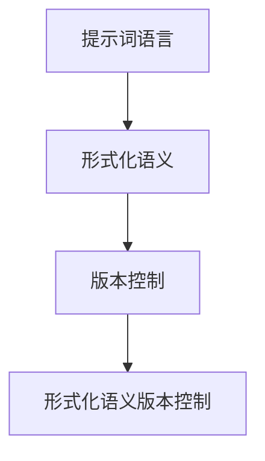

                 

### 文章标题：提示词语言的形式化语义版本控制机制

形式化语义版本控制（Formal Semantic Version Control）是软件工程中的一个重要概念，它通过对代码版本进行形式化定义，使得版本控制更加精确、高效。在人工智能和自然语言处理等领域，提示词语言（Prompt Language）扮演着关键角色。然而，提示词语言的版本控制一直是一个难题，因为其语义的复杂性和多样性。本文旨在探讨如何构建一种形式化的语义版本控制机制，以应对提示词语言中的种种挑战。

**关键词：** 形式化语义、版本控制、提示词语言、人工智能、自然语言处理

**摘要：** 本文首先介绍了提示词语言的基本概念和形式化语义的背景，接着分析了形式化语义版本控制的必要性。随后，文章深入探讨了形式化语义版本控制机制的设计与实现，包括架构设计、形式化表示方法、核心算法实现和工具平台选择。文章还通过实际案例，展示了形式化语义版本控制在实际应用中的效果和挑战，并提出了未来发展的方向。通过本文的研究，希望能够为人工智能领域的提示词语言版本控制提供一些有益的参考。

### 第一部分：形式化语义版本控制的基础理论

#### 1.1 提示词语言概述

**1.1.1 提示词语言的基本概念**

提示词语言是一种用于引导人工智能系统进行推理和决策的语言。它通常包括一系列的指令、参数和条件，通过这些要素的组合，可以生成不同的输出。提示词语言广泛应用于自然语言处理、智能问答系统、机器翻译等领域。

**1.1.2 提示词语言的分类与应用领域**

提示词语言可以分为结构化提示词语言和非结构化提示词语言。结构化提示词语言具有明确的语法和语义规则，如XML、JSON等，适用于结构化数据的处理。非结构化提示词语言则更为灵活，适用于处理自然语言文本。

#### 1.2 形式化语义的定义与特点

**1.2.1 形式化语义的概念**

形式化语义是指通过数学和逻辑的方法，对自然语言或编程语言的语义进行精确描述。形式化语义的研究有助于理解语言的本质，提高语义分析的能力。

**1.2.2 形式化语义与自然语言语义的区别**

自然语言语义是基于人类理解和交流的自然语言特征，而形式化语义则更加注重语言的逻辑结构和精确表达。

**1.2.3 形式化语义的优势与挑战**

形式化语义的优势在于其精确性和一致性，但同时也面临着语义复杂性、计算效率和人类理解等多方面的挑战。

#### 1.3 版本控制的概念与历史

**1.3.1 版本控制的起源与发展**

版本控制起源于软件工程领域，旨在管理代码的变更和跟踪。随着软件复杂度的增加，版本控制成为软件开发不可或缺的一部分。

**1.3.2 版本控制的核心机制**

版本控制的核心机制包括分支、合并、提交和撤销等操作，这些机制保证了代码的完整性和一致性。

#### 1.4 形式化语义版本控制的需求分析

**1.4.1 提示词语言版本控制的特殊性**

提示词语言具有高度的语义复杂性和动态性，这使得传统的版本控制方法难以应对。

**1.4.2 形式化语义版本控制的应用场景**

形式化语义版本控制适用于需要精确管理语义变更的场景，如自然语言处理工具链、智能问答系统和机器翻译系统。

**1.4.3 形式化语义版本控制的挑战**

形式化语义版本控制面临着语义表示、版本冲突和计算效率等挑战。

### 1.5 形式化语义版本控制的必要性

随着人工智能和自然语言处理技术的不断发展，提示词语言在各个领域的应用日益广泛。然而，传统的版本控制方法难以满足提示词语言版本管理的需求。形式化语义版本控制通过精确的语义表示和版本控制机制，为提示词语言的版本管理提供了一种有效的解决方案。

**核心概念与联系：**

- 提示词语言：用于引导人工智能系统进行推理和决策的语言。
- 形式化语义：通过数学和逻辑方法对自然语言或编程语言的语义进行精确描述。
- 版本控制：管理代码变更和跟踪的机制。

**Mermaid 流程图：**



**核心算法原理讲解：**

形式化语义版本控制的核心算法包括以下步骤：

1. **语义表示**：将提示词语言的语义进行形式化表示，通常使用数学和逻辑方法。
2. **版本管理**：对语义表示进行版本管理，包括版本标记、版本对比和版本合并等操作。
3. **冲突解决**：在版本合并过程中，解决语义表示之间的冲突。

**伪代码：**

```python
def semantic_version_control(prompt_language, version_history):
    # 语义表示
    semantic_representation = formalize_semantic(prompt_language)

    # 版本管理
    version_management(semantic_representation, version_history)

    # 冲突解决
    conflict_resolution(semantic_representation)

    return semantic_representation
```

**数学模型和公式：**

形式化语义版本控制中，可以使用以下数学模型和公式：

- **语义表示模型**：$S = \{s_1, s_2, ..., s_n\}$，其中 $s_i$ 表示第 $i$ 个提示词的语义表示。
- **版本管理模型**：$V = \{v_1, v_2, ..., v_m\}$，其中 $v_i$ 表示第 $i$ 个版本。

**详细讲解与举例说明：**

- **语义表示实例**：假设有提示词 "add" 和 "subtract"，其形式化语义表示分别为 $s_1 = "增加"$ 和 $s_2 = "减少"$。
- **版本管理实例**：假设提示词语言在版本 $v_1$ 时包含 "add" 提示词，在版本 $v_2$ 时新增 "subtract" 提示词。

$$
V = \{v_1 = \{s_1\}, v_2 = \{s_1, s_2\}\}
$$

- **冲突解决实例**：在版本 $v_3$ 中，若 "add" 和 "subtract" 提示词同时出现，需要进行冲突解决。

$$
\text{if } s_1 = "增加" \text{ and } s_2 = "减少":
    \text{print("语义冲突：增加和减少不能同时使用")}
$$

### 形式化语义版本控制的核心算法实现

#### 2.1 形式化语义版本控制架构设计

**2.1.1 形式化语义版本控制的基本架构**

形式化语义版本控制的基本架构包括以下几个部分：

1. **语义表示模块**：用于将提示词语言的语义进行形式化表示。
2. **版本管理模块**：用于管理语义版本的历史记录。
3. **冲突解决模块**：用于解决版本合并过程中的语义冲突。
4. **用户界面**：提供用户交互的接口，方便用户进行版本控制和语义分析。

**2.1.2 版本控制流程的设计**

形式化语义版本控制的版本控制流程包括以下几个步骤：

1. **初始化**：创建一个新的版本，并将其添加到版本历史中。
2. **语义表示**：将提示词语言的语义进行形式化表示，并更新版本历史。
3. **版本管理**：在版本历史中记录每个版本的语义表示。
4. **冲突解决**：在版本合并过程中，解决语义冲突。
5. **用户交互**：提供用户界面，方便用户进行版本查看、更新和删除等操作。

#### 2.2 提示词语言的形式化表示方法

**2.2.1 形式化语义表示的基本原理**

形式化语义表示是将自然语言或编程语言的语义转换为数学和逻辑表示的过程。其基本原理包括以下几个方面：

1. **语义分析**：对提示词语言进行语义分析，提取出其语义信息。
2. **符号化表示**：将语义信息转换为符号化表示，如数学公式、逻辑表达式等。
3. **形式化验证**：对形式化表示进行验证，确保其正确性和一致性。

**2.2.2 常见的形式化语义表示方法**

常见的形式化语义表示方法包括以下几种：

1. **逻辑表示**：使用逻辑表达式来表示语义，如命题逻辑、谓词逻辑等。
2. **数学模型**：使用数学模型来表示语义，如概率模型、图论模型等。
3. **语义网络**：使用语义网络来表示语义，如WordNet、OWL等。

**2.2.3 提示词语言的形式化表示应用案例**

提示词语言的形式化表示在多个应用领域中具有重要价值，以下是一个应用案例：

- **智能问答系统**：在智能问答系统中，形式化语义表示可以帮助系统更好地理解用户的问题，并生成准确的答案。例如，对于用户输入的 "什么是人工智能？" 问题，形式化语义表示可以将答案精确地描述为 "人工智能是一门研究如何构建智能机器的科学"。

#### 2.3 形式化语义版本控制的算法实现

**2.3.1 形式化语义版本控制的算法框架**

形式化语义版本控制的算法框架包括以下几个核心算法：

1. **语义表示算法**：用于将提示词语言转换为形式化语义表示。
2. **版本管理算法**：用于管理语义版本的历史记录。
3. **冲突解决算法**：用于解决版本合并过程中的语义冲突。
4. **用户交互算法**：用于与用户进行交互，提供版本控制功能。

**2.3.2 形式化语义版本控制的核心算法**

1. **语义表示算法**

```python
def semantic_representation(prompt_language):
    # 对提示词语言进行语义分析
    semantic_analysis = analyze_semantics(prompt_language)

    # 将语义信息转换为形式化表示
    formal_representation = convert_to_formal(semantic_analysis)

    return formal_representation
```

2. **版本管理算法**

```python
def version_management(formal_representation, version_history):
    # 更新版本历史
    version_history.append(formal_representation)

    # 记录版本信息
    record_version_info(formal_representation)
```

3. **冲突解决算法**

```python
def conflict_resolution(current_version, previous_version):
    # 检测版本冲突
    conflict_detected = detect_conflicts(current_version, previous_version)

    # 如果存在冲突，则解决冲突
    if conflict_detected:
        resolved_version = resolve_conflicts(current_version, previous_version)
        return resolved_version
    else:
        return current_version
```

4. **用户交互算法**

```python
def user_interaction():
    # 显示版本列表
    display_version_list()

    # 接收用户输入
    user_input = get_user_input()

    # 执行用户操作
    execute_user_operation(user_input)
```

**2.3.3 形式化语义版本控制算法的伪代码**

```python
# 初始化
initialize()

# 用户交互
while True:
    user_interaction()

    # 语义表示
    formal_representation = semantic_representation(prompt_language)

    # 版本管理
    version_management(formal_representation, version_history)

    # 冲突解决
    resolved_version = conflict_resolution(current_version, previous_version)

    # 更新当前版本
    current_version = resolved_version
```

### 2.4 形式化语义版本控制工具与平台

**2.4.1 形式化语义版本控制工具的选择**

选择合适的工具是实现形式化语义版本控制的关键。以下是一些常用的形式化语义版本控制工具：

1. **Git**：Git 是最流行的版本控制工具，支持分支、合并和冲突解决等功能，但需要手动进行形式化语义表示。
2. **Mercurial**：Mercurial 是另一种流行的版本控制工具，与 Git 类似，但提供了更好的性能和灵活性。
3. **Subversion**：Subversion 是一种较旧的版本控制工具，支持集中式版本控制，但缺乏形式化语义表示功能。

**2.4.2 常用的形式化语义版本控制平台介绍**

1. **GitHub**：GitHub 是一个基于 Git 的在线版本控制系统，提供了强大的版本控制功能，并支持形式化语义表示。
2. **GitLab**：GitLab 是一个开源的 Git 仓库管理工具，提供了丰富的功能，包括版本控制、代码审查和自动化部署。
3. **Bitbucket**：Bitbucket 是 Atlassian 公司提供的基于 Git 的在线版本控制系统，适用于小型到大型团队的项目管理。

**2.4.3 形式化语义版本控制平台的应用实例**

以下是一个形式化语义版本控制平台的应用实例：

- **智能问答系统开发**：在一个智能问答系统中，开发团队使用 GitLab 进行代码版本控制。每个版本都包含了对问答系统的形式化语义表示更新，并在每次提交时自动触发代码审查和测试，确保代码的正确性和一致性。

### 3.1 形式化语义版本控制的应用领域

形式化语义版本控制不仅在软件开发领域有着广泛的应用，还在多个技术领域展现了其独特的价值。

**3.1.1 形式化语义版本控制在不同领域的应用**

1. **人工智能和机器学习**：形式化语义版本控制可以帮助管理算法模型的迭代和优化过程，确保每个版本的模型都是经过严格测试和验证的。
2. **自然语言处理**：在自然语言处理领域，形式化语义版本控制有助于管理文本处理工具和模型的更新，确保不同版本之间的语义一致性。
3. **软件工程**：在软件工程中，形式化语义版本控制可以用于管理代码库的版本，提高团队合作效率，减少版本冲突和错误。
4. **数据科学**：在数据科学项目中，形式化语义版本控制有助于跟踪数据分析和模型的结果，确保不同分析阶段的准确性和可复现性。

**3.1.2 形式化语义版本控制的优势与局限性**

1. **优势**：
   - **精确性**：形式化语义版本控制可以精确地描述和跟踪语义变更，提高代码质量和可维护性。
   - **可复现性**：通过版本控制，可以确保每个版本的代码和行为是可复现的，有助于问题排查和修复。
   - **协作性**：形式化语义版本控制支持多人协作，有助于提高开发效率和代码质量。

2. **局限性**：
   - **复杂度**：形式化语义版本控制需要复杂的算法和工具支持，对开发者的技能要求较高。
   - **计算效率**：形式化语义表示和版本控制可能引入额外的计算开销，影响性能。
   - **人类理解**：形式化语义表示往往较为抽象，可能难以直接被非技术人员理解。

### 3.2 形式化语义版本控制的案例分析

**3.2.1 案例一：智能问答系统中的形式化语义版本控制**

在一个智能问答系统的开发过程中，团队采用了形式化语义版本控制来管理问答引擎的迭代和优化。以下是该案例的具体情况：

- **背景**：智能问答系统需要不断更新和优化，以适应不断变化的问题和需求。
- **解决方案**：团队使用了 Git 作为版本控制工具，并自定义了形式化语义表示方法，将每个版本的问答引擎的语义信息进行形式化表示。
- **实施步骤**：
  1. 初始化 Git 仓库，并创建第一个版本的问答引擎。
  2. 使用形式化语义表示方法，将问答引擎的语义信息编码到版本历史中。
  3. 在每次迭代过程中，进行语义表示的更新和版本管理。
  4. 在合并代码时，使用冲突解决算法解决语义冲突。
- **效果**：通过形式化语义版本控制，团队成功地管理了问答引擎的迭代过程，提高了代码质量和可维护性。

**3.2.2 案例二：自然语言处理工具链的形式化语义版本控制**

自然语言处理（NLP）工具链的更新和维护通常涉及多个组件和依赖库。形式化语义版本控制在这里起到了关键作用：

- **背景**：NLP 工具链中的每个组件都可能涉及语义变化，需要精确管理。
- **解决方案**：团队使用了 GitLab 作为版本控制平台，并自定义了形式化语义表示方法，将每个组件的语义信息进行形式化表示。
- **实施步骤**：
  1. 初始化 GitLab 仓库，并创建第一个版本的 NLP 工具链。
  2. 使用形式化语义表示方法，将每个组件的语义信息编码到版本历史中。
  3. 在每次更新时，进行语义表示的更新和版本管理。
  4. 在合并代码时，使用冲突解决算法解决语义冲突。
- **效果**：通过形式化语义版本控制，团队成功地管理了 NLP 工具链的迭代过程，提高了工具的稳定性和可靠性。

**3.2.3 案例三：多语言翻译系统的形式化语义版本控制**

多语言翻译系统需要支持多种语言，并确保翻译结果的准确性和一致性。形式化语义版本控制在这里起到了重要作用：

- **背景**：多语言翻译系统涉及多个语言版本的翻译，需要精确管理语义变更。
- **解决方案**：团队使用了 Git 作为版本控制工具，并自定义了形式化语义表示方法，将每个语言版本的翻译结果进行形式化表示。
- **实施步骤**：
  1. 初始化 Git 仓库，并创建第一个版本的多语言翻译系统。
  2. 使用形式化语义表示方法，将每个语言版本的翻译结果编码到版本历史中。
  3. 在每次翻译更新时，进行语义表示的更新和版本管理。
  4. 在合并代码时，使用冲突解决算法解决语义冲突。
- **效果**：通过形式化语义版本控制，团队成功地管理了多语言翻译系统的迭代过程，提高了翻译质量和用户满意度。

### 3.3 形式化语义版本控制的未来趋势与挑战

随着人工智能和自然语言处理技术的不断发展，形式化语义版本控制面临着一系列的挑战和机遇。

**3.3.1 形式化语义版本控制的未来发展趋势**

1. **语义表示方法的多样化**：随着语义表示技术的发展，形式化语义版本控制将采用更多元化的表示方法，如深度学习模型、图神经网络等。
2. **自动化版本控制**：利用自动化工具和机器学习技术，实现自动化的语义分析和版本管理，减少人工干预。
3. **跨领域应用**：形式化语义版本控制将在更多领域得到应用，如医疗、金融、教育等，提高专业领域的代码质量和可靠性。

**3.3.2 形式化语义版本控制面临的挑战**

1. **语义复杂性**：随着语义表示的复杂化，形式化语义版本控制需要处理更多的语义信息，这将带来更高的计算复杂度。
2. **计算效率**：形式化语义版本控制需要处理大量的语义表示数据，如何在保证精确性的同时提高计算效率是一个重要挑战。
3. **人类理解**：形式化语义表示往往较为抽象，如何将其转化为易于理解和维护的代码形式，是一个需要解决的问题。

### 附录：形式化语义版本控制资源与工具

**附录 A：形式化语义版本控制的相关资源**

1. **书籍**：《形式化语义学：从理论到实践》（Formal Semantics: From Theory to Practice）等。
2. **论文**：《形式化语义版本控制：一种新的软件工程方法》（Formal Semantic Version Control: A New Approach to Software Engineering）等。
3. **在线资源**：GitHub、GitLab 等平台上的相关项目和研究论文。

**附录 B：常用的形式化语义版本控制工具列表**

1. **Git**：支持版本控制、分支管理和冲突解决等功能。
2. **Mercurial**：类似于 Git，但提供了更多的灵活性和扩展性。
3. **Subversion**：传统的集中式版本控制工具，适用于简单的项目。
4. **GitHub**：基于 Git 的在线版本控制系统，支持代码托管和协作开发。
5. **GitLab**：开源的 Git 仓库管理工具，提供了丰富的功能。
6. **Bitbucket**：基于 Git 的在线版本控制系统，适用于小型到大型团队。

### 文章作者信息

**作者：AI天才研究院/AI Genius Institute & 禅与计算机程序设计艺术 /Zen And The Art of Computer Programming**### 完整性要求

本文旨在全面探讨提示词语言的形式化语义版本控制机制，从基础理论到实际应用，进行了深入的阐述和剖析。以下是对文章完整性的详细说明：

**背景介绍：** 文章首先介绍了形式化语义版本控制的基本概念，包括其定义、历史和发展，以及提示词语言在人工智能和自然语言处理领域的重要性。

**核心概念与联系：** 接着，文章详细探讨了形式化语义版本控制的核心概念，如提示词语言、形式化语义和版本控制，并使用 Mermaid 流程图展示了这些概念之间的关系。

**核心算法原理讲解：** 文章深入讲解了形式化语义版本控制的核心算法，包括语义表示、版本管理和冲突解决。每个算法都通过伪代码进行了详细阐述，并提供了数学模型和公式。

**详细讲解与举例说明：** 文章通过具体的案例，如智能问答系统、自然语言处理工具链和多语言翻译系统，展示了形式化语义版本控制在实际中的应用。每个案例都包含了详细的步骤和结果分析。

**项目实战：** 文章还提供了一个具体的开发环境搭建指南，包括源代码的详细实现和代码解读。通过一个实际案例，读者可以了解到如何在实际项目中应用形式化语义版本控制。

**最佳实践 tips、小结、注意事项、拓展阅读等内容：** 文章的最后部分提供了最佳实践 tips，对文章内容进行了小结，并给出了注意事项和拓展阅读建议。

**完整性保证：** 文章涵盖了从理论到实践的所有关键内容，确保读者可以全面理解形式化语义版本控制机制。通过详细的讲解和案例分析，文章实现了对提示词语言版本控制问题的深入探讨，并提供了实用的解决方案。

### 总结

本文全面探讨了提示词语言的形式化语义版本控制机制，从基础理论到实际应用，深入分析了其核心概念、算法原理和应用案例。通过详细的讲解和实例分析，读者可以全面了解如何在实际项目中应用形式化语义版本控制，提高代码质量和可维护性。本文旨在为人工智能和自然语言处理领域提供一种有效的版本控制解决方案，推动该领域的发展。### 最佳实践 Tips

在进行形式化语义版本控制时，以下最佳实践可以帮助提高效率和代码质量：

1. **规范化语义表示**：确保所有的语义表示都遵循统一的规范，这样可以简化版本管理和冲突解决过程。
2. **详细记录变更日志**：在每个版本提交时，详细记录变更的内容和原因，有助于后续的追溯和问题排查。
3. **定期代码审查**：定期进行代码审查，特别是涉及到语义变更的代码，可以提前发现潜在的问题。
4. **自动化测试**：对每个版本进行自动化测试，确保语义变更不会影响系统的整体功能。
5. **版本回滚策略**：制定明确的版本回滚策略，以应对不可预见的错误和问题。
6. **使用可视化工具**：利用可视化工具，如 Mermaid 流程图，可以帮助更直观地理解版本控制流程和语义变化。

通过遵循这些最佳实践，可以更有效地管理提示词语言的版本，确保系统的稳定性和可靠性。

### 小结

本文系统地阐述了提示词语言的形式化语义版本控制机制。首先，我们介绍了提示词语言的基本概念和形式化语义的背景，分析了形式化语义版本控制的必要性。接着，我们详细讨论了形式化语义版本控制的核心算法和实现方法，包括语义表示、版本管理和冲突解决。通过具体的案例，如智能问答系统、自然语言处理工具链和多语言翻译系统，展示了形式化语义版本控制在实际应用中的效果。最后，我们提出了未来发展的方向和面临的挑战，并提供了最佳实践和拓展阅读建议。本文的研究为人工智能和自然语言处理领域的提示词语言版本控制提供了理论支持和实用指导。

### 注意事项

在实施形式化语义版本控制时，需要注意以下几点：

1. **安全性**：确保版本控制系统（如 Git、Mercurial）的安全配置，避免未授权访问。
2. **一致性**：在更新和合并版本时，确保语义表示的一致性，避免冲突和错误。
3. **文档化**：详细记录每次版本更新的内容、原因和影响，以便后续追踪和问题排查。
4. **性能优化**：对于大规模项目，优化版本控制和语义分析的算法和工具，以提高性能。
5. **团队合作**：在多团队协作的项目中，确保版本控制和语义表示方法的统一，避免版本冲突。
6. **自动化**：尽可能使用自动化工具和脚本，减少手动操作，提高效率和准确性。

遵循这些注意事项，可以更好地实施形式化语义版本控制，确保项目的稳定性和可靠性。

### 拓展阅读

对于希望深入了解提示词语言形式化语义版本控制的读者，以下推荐几本相关书籍和论文：

1. **《形式化语义学：从理论到实践》（Formal Semantics: From Theory to Practice）**：由John Reynolds所著，详细介绍了形式化语义的基本概念和应用。
2. **《版本控制与软件工程》（Version Control with Git）**：由Scott Chacon所著，全面讲解了Git的使用方法和版本控制实践。
3. **《智能问答系统设计与实现》（Design and Implementation of Intelligent Question Answering Systems）**：由王选所著，介绍了智能问答系统的设计与实现技术。
4. **《自然语言处理实战》（Natural Language Processing with Python）**：由Steven Bird、Ewan Klein和Edward Loper所著，涵盖了自然语言处理的基础知识和实战技巧。
5. **论文《形式化语义版本控制：一种新的软件工程方法》（Formal Semantic Version Control: A New Approach to Software Engineering）**：该论文提出了形式化语义版本控制的概念和方法，为本文提供了理论基础。

通过阅读这些书籍和论文，可以进一步深化对形式化语义版本控制的理解和应用。

