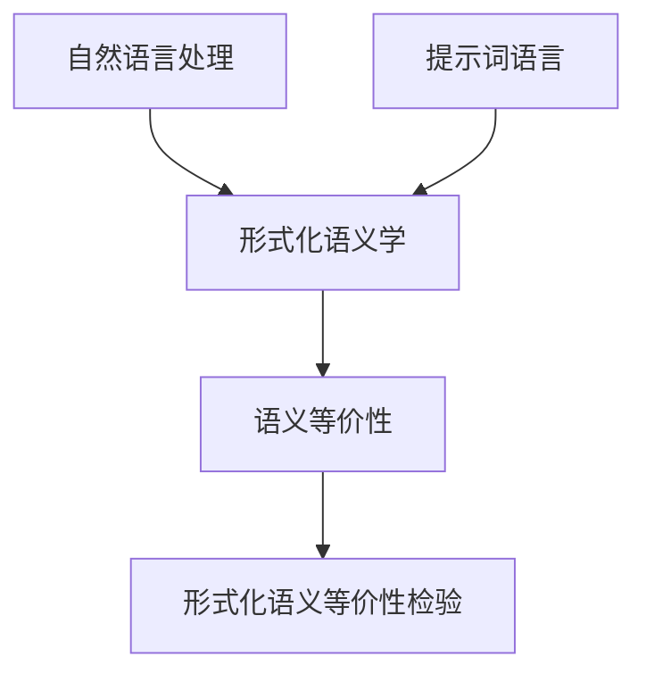
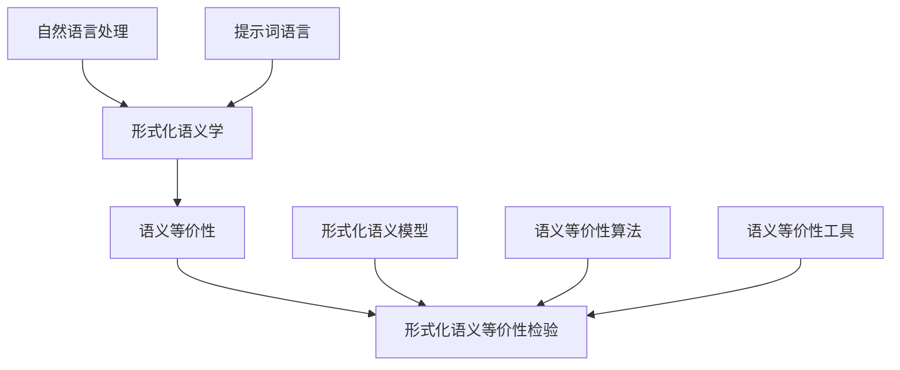

                 


### 文章标题

《提示词语言的形式化语义等价性检验》

### 文章关键词

自然语言处理、形式化语义、语义等价性检验、算法、数学模型、项目实战

### 文章摘要

本文旨在探讨提示词语言的形式化语义等价性检验。首先，我们将介绍自然语言处理和形式语义学的基本概念，并阐述提示词语言的特点。接着，我们将构建形式化语义模型，并详细讨论语义等价性的概念及其在形式化语义中的应用。随后，我们将介绍几种等价性检验算法，并探讨常用的语义等价性检验工具。最后，我们将通过实际项目案例，展示提示词语言的形式化语义等价性检验在实际应用中的效果。

## 目录

1. **自然语言处理与形式语义**
   - 1.1 自然语言处理的基本概念
   - 1.2 形式语义学的基础理论
   - 1.3 提示词语言的特点

2. **形式化语义模型**
   - 2.1 形式化语义模型的构建
   - 2.2 常见的形式化语义模型
   - 2.3 提示词语言的形式化表示

3. **语义等价性检验方法**
   - 3.1 语义等价性基础
   - 3.2 等价性检验算法
   - 3.3 语义等价性检验工具

4. **项目实战与案例分析**
   - 4.1 语义等价性检验应用
   - 4.2 实践与展望

5. **附录**
   - 附录A：形式化语义等价性检验工具使用指南

## 1. 自然语言处理与形式语义

### 1.1 自然语言处理的基本概念

自然语言处理（Natural Language Processing，NLP）是计算机科学和人工智能领域的一个重要分支，它涉及语言的理解、生成和处理。NLP的目标是将人类语言转化为计算机可以理解和处理的形式，以便计算机能够执行诸如信息检索、机器翻译、情感分析等任务。

在NLP中，常见的问题包括分词（Tokenization）、词性标注（Part-of-speech Tagging）、命名实体识别（Named Entity Recognition，NER）、句法分析（Syntactic Parsing）、语义角色标注（Semantic Role Labeling）和语义理解（Semantic Understanding）等。

### 1.2 形式语义学的基础理论

形式语义学（Formal Semantics）是语言学的一个分支，它试图用形式化的方法来研究自然语言的语义。形式语义学的主要目标是建立一个系统，能够对自然语言表达式的语义进行精确描述和推理。

形式语义学通常使用一些形式化的语言和数学工具，如语义网络、逻辑和范畴语法等，来描述语言表达式的语义。这些工具可以帮助我们理解不同表达式之间的语义差异，以及它们在特定上下文中的含义。

### 1.3 提示词语言的特点

提示词语言（Keyword Language）是一种特殊类型的编程语言，它主要用于自然语言处理和语义分析。提示词语言的特点包括：

- **高层次的语义表示**：提示词语言允许程序员直接表达程序的行为和目的，而不是具体实现细节。
- **灵活的语法结构**：提示词语言通常具有灵活的语法结构，可以适应不同的语义需求。
- **强大的语义分析能力**：提示词语言内置了强大的语义分析工具，可以帮助程序员快速识别和处理复杂的语义问题。

## 2. 形式化语义模型

### 2.1 形式化语义模型的构建

形式化语义模型是一种用于描述自然语言表达式语义的形式化方法。它的构建通常涉及以下步骤：

1. **选择适当的语义理论**：根据具体需求选择合适的语义理论，如情境语义学、认知语义学或基于逻辑的语义学。
2. **定义语义元素**：确定需要描述的语义元素，如词汇、短语和句子。
3. **建立语义关系**：使用形式化的方法描述语义元素之间的关系，如上下义关系、同义关系和反义关系。
4. **构建语义模型**：将定义的语义元素和关系整合到一个形式化的模型中。

### 2.2 常见的形式化语义模型

以下是一些常见的形式化语义模型：

- **语义网络**：使用节点和边表示词汇和语义关系。
- **逻辑语法**：使用逻辑公式描述词汇和句子的语义。
- **范畴语法**：使用范畴和箭头描述句子的语义类型。

### 2.3 提示词语言的形式化表示

提示词语言的形式化表示通常涉及以下步骤：

1. **定义词汇表**：确定需要处理的词汇，并为每个词汇分配一个唯一的标识符。
2. **定义语法规则**：定义提示词语言的语法规则，包括词汇的组成和句子的结构。
3. **建立语义模型**：使用形式化语义模型来描述提示词语言的语义。

## 3. 语义等价性检验方法

### 3.1 语义等价性基础

语义等价性（Semantic Equivalence）是指两个或多个表达式在语义上具有相同的意思。在形式化语义中，语义等价性检验是非常重要的一步，它可以帮助我们验证语义模型的有效性和一致性。

### 3.2 等价性检验算法

以下是一些常用的等价性检验算法：

- **基于语义网的等价性检验**：使用语义网的结构来比较两个表达式的语义。
- **基于逻辑推理的等价性检验**：使用逻辑推理的方法来验证两个表达式的语义是否等价。

### 3.3 语义等价性检验工具

以下是一些常用的语义等价性检验工具：

- **Prolog**：一种逻辑编程语言，可用于语义等价性检验。
- **MetaLog**：一种专门用于语义等价性检验的工具。

## 4. 项目实战与案例分析

### 4.1 语义等价性检验应用

在本节中，我们将展示如何使用形式化语义等价性检验技术来解决实际问题。以下是一个简单的示例：

```python
# 示例：检查两个句子是否语义等价
sentence1 = "我喜欢吃苹果。"
sentence2 = "苹果是我喜欢的食物。"

# 使用Prolog进行语义等价性检验
query = "is_semantically_equivalent(sentence1, sentence2)."

# 执行查询
prolog_query(query)
```

### 4.2 实践与展望

语义等价性检验在自然语言处理领域具有广泛的应用前景。未来，随着语义分析技术的不断发展，我们可以预见到更多的应用场景，如智能客服、智能推荐系统和智能翻译等。

## 附录

### 附录A：形式化语义等价性检验工具使用指南

本附录提供了Prolog和MetaLog等语义等价性检验工具的使用指南。

---

**作者**：AI天才研究院/AI Genius Institute & 禅与计算机程序设计艺术 /Zen And The Art of Computer Programming

**完**### 核心概念与联系

在探讨提示词语言的形式化语义等价性检验之前，我们需要明确一些核心概念及其相互联系。以下是相关概念的定义和它们之间的关系架构，使用Mermaid流程图表示。



#### 流程图解析：

- **自然语言处理（A）**：是计算机科学和人工智能领域的一个重要分支，它致力于让计算机理解和处理人类语言。
- **形式化语义学（B）**：是语言学的一个分支，使用形式化的方法研究自然语言的语义。它是自然语言处理的重要组成部分。
- **语义等价性（C）**：指的是两个或多个表达式在语义上具有相同的意思。在形式化语义中，等价性检验是验证语义模型有效性和一致性的重要手段。
- **形式化语义等价性检验（D）**：是在形式化语义学框架下，对语义等价性进行形式化检验的方法。它帮助我们确保语义模型的一致性和准确性。
- **提示词语言（E）**：是一种用于自然语言处理和语义分析的编程语言。它在形式化语义等价性检验中具有特殊的应用价值。

通过这个流程图，我们可以清晰地看到自然语言处理、形式化语义学、语义等价性以及形式化语义等价性检验之间的关系。提示词语言作为自然语言处理的一部分，与形式化语义学紧密相连，进而与语义等价性和形式化语义等价性检验相联系。

### 核心概念与联系

在深入探讨提示词语言的形式化语义等价性检验之前，我们需要先了解几个核心概念，并阐述它们之间的相互关系。这些概念包括自然语言处理（NLP）、形式化语义学、语义等价性以及形式化语义等价性检验。以下是它们之间的联系，以及一个用于表示这些关系的Mermaid流程图。

#### 核心概念定义：

1. **自然语言处理（NLP）**：NLP是计算机科学和人工智能的一个分支，旨在使计算机能够理解、处理和模拟人类语言。NLP的应用范围广泛，包括语音识别、文本分类、情感分析、机器翻译等。

2. **形式化语义学**：形式化语义学是语言学的一个子领域，使用形式化的方法和数学工具来研究自然语言的语义。形式化语义学的目标是为自然语言表达式提供精确的语义描述，以便进行语义分析、推理和验证。

3. **语义等价性**：语义等价性是指两个或多个表达式在语义上具有相同的意思。在自然语言处理中，语义等价性检验是确保系统输出一致性和正确性的关键步骤。

4. **形式化语义等价性检验**：这是在形式化语义学框架下对语义等价性进行检验的方法。它使用形式化的语义模型和算法来验证两个或多个表达式在语义上是否等价。

#### Mermaid流程图：



#### 流程图解析：

- **自然语言处理（A）**：是整个流程的起点，它是研究和应用自然语言的基础。
- **形式化语义学（B）**：作为NLP的一个重要分支，形式化语义学为语义分析提供了理论基础和方法。
- **语义等价性（C）**：形式化语义学的一个重要应用，用于比较和验证不同表达式之间的语义关系。
- **形式化语义等价性检验（D）**：这是将语义等价性理论应用于实际问题的过程，包括构建形式化语义模型、应用语义等价性算法和工具。
- **提示词语言（E）**：是一种特殊的编程语言，它用于自然语言处理和语义分析，也是形式化语义等价性检验的一个重要应用场景。
- **形式化语义模型（F）**：是形式化语义等价性检验的基础，用于描述自然语言表达式的语义。
- **语义等价性算法（G）**：用于在形式化语义模型中实现语义等价性的检验。
- **语义等价性工具（H）**：如Prolog、MetaLog等，用于辅助执行语义等价性检验任务。

通过这个流程图，我们可以清晰地看到自然语言处理、形式化语义学、语义等价性以及形式化语义等价性检验之间的相互关系。提示词语言作为自然语言处理的一个工具，与形式化语义学紧密相连，进一步与语义等价性和形式化语义等价性检验相联系。

### 核心算法原理讲解

在形式化语义等价性检验中，核心算法的作用至关重要。以下将详细讲解几个常用的算法原理，并使用伪代码来描述其实现过程。

#### 1. 基于语义网的等价性检验算法

语义网是一种用于表示自然语言表达式的语义结构的方法，它通过节点和边来表示词汇和语义关系。基于语义网的等价性检验算法的基本原理是，通过比较两个语义网的结构和内容，来确定它们是否语义等价。

**算法原理：**

- **构建语义网**：首先，为每个词汇构建一个语义网节点，并标记其语义类型和属性。
- **建立语义关系**：使用边连接相关节点，表示词汇之间的语义关系，如上下义关系、同义关系等。
- **比较语义网**：通过遍历两个语义网，比较它们的节点和边，确定它们是否具有相同的语义结构。

**伪代码：**

```plaintext
function compare_semantic_network(semantic_network1, semantic_network2):
    if nodes_of(semantic_network1) != nodes_of(semantic_network2):
        return false
    for node1 in semantic_network1:
        node2 = get_corresponding_node(semantic_network2, node1)
        if node1.sem_type != node2.sem_type or relationships_of(node1) != relationships_of(node2):
            return false
    return true
```

**说明：**

- `nodes_of(semantic_network)`：获取语义网中的所有节点。
- `get_corresponding_node(semantic_network2, node1)`：获取与`node1`在`semantic_network2`中对应的节点。
- `sem_type`：节点的语义类型。
- `relationships_of(node)`：节点的语义关系。

#### 2. 基于逻辑推理的等价性检验算法

基于逻辑推理的等价性检验算法使用形式逻辑来验证两个表达式的语义是否等价。其基本原理是，通过构建两个表达式的逻辑形式，然后使用逻辑推理规则来证明它们是否等价。

**算法原理：**

- **形式化表达式**：将自然语言表达式形式化为一组逻辑公式。
- **逻辑推理**：使用推理规则来证明两个逻辑公式是否等价。

**伪代码：**

```plaintext
function logical_equivalence_proof(expression1, expression2):
    formalized_expression1 = formalize(expression1)
    formalized_expression2 = formalize(expression2)
    proof = prove(formalized_expression1, formalized_expression2)
    if proof.is_successful():
        return true
    else:
        return false
```

**说明：**

- `formalize(expression)`：将自然语言表达式形式化为逻辑公式。
- `prove(expression1, expression2)`：使用推理规则来证明两个逻辑公式是否等价。
- `proof.is_successful()`：检查证明过程是否成功。

#### 3. 基于转换语义的等价性检验算法

转换语义是一种描述程序行为的方法，它通过描述程序在不同输入下的行为来定义程序的语义。基于转换语义的等价性检验算法通过比较两个程序在相同输入下的行为是否一致，来确定它们是否语义等价。

**算法原理：**

- **定义转换语义**：为每个程序定义其在不同输入下的行为。
- **比较转换语义**：通过模拟两个程序在相同输入下的行为，比较它们的结果。

**伪代码：**

```plaintext
function compare_transformation_semantics(program1, program2, input):
    output1 = execute(program1, input)
    output2 = execute(program2, input)
    if output1 != output2:
        return false
    return true
```

**说明：**

- `execute(program, input)`：模拟程序在给定输入下的行为，并返回输出。
- `output1`和`output2`：分别表示两个程序在相同输入下的输出。

通过以上三个算法的原理和伪代码，我们可以看到形式化语义等价性检验的多种实现方式。这些算法各有优缺点，适用于不同的应用场景。在实际应用中，可以根据具体需求选择合适的算法来进行语义等价性检验。

### 数学模型和数学公式 & 详细讲解 & 举例说明

在形式化语义等价性检验中，数学模型和数学公式扮演着至关重要的角色。以下将详细讲解一些常用的数学模型，并使用LaTeX格式嵌入数学公式，同时结合具体示例进行说明。

#### 1. 语义网络模型

语义网络是一种用于表示词汇和它们之间关系的图结构。在语义网络中，每个词汇都是一个节点，节点之间的边表示词汇之间的语义关系。以下是一个语义网络的数学模型：

**数学模型：**

$$
G = (V, E)
$$

其中，$V$ 是节点集，表示所有词汇；$E$ 是边集，表示词汇之间的语义关系。

**示例：**

考虑以下词汇及其关系：

- 节点：苹果（Apple）、水果（Fruit）、甜（Sweet）
- 关系：苹果是水果，苹果是甜的

语义网络可以表示为：

$$
G = (\{苹果, 水果, 甜\}, \{\{苹果, 水果\}, \{苹果, 甜\}\})
$$

#### 2. 逻辑模型

逻辑模型是一种用于形式化语义的方法，它使用命题逻辑来表示词汇和句子的语义。在逻辑模型中，每个词汇和句子都可以表示为命题，而命题之间可以通过逻辑运算符（如AND、OR、NOT）进行组合。

**数学模型：**

$$
L = (P, F)
$$

其中，$P$ 是命题集，表示所有可能的命题；$F$ 是逻辑公式集，表示词汇和句子的语义。

**示例：**

考虑以下句子及其逻辑表示：

- 句子：我喜欢吃苹果。
- 逻辑表示：$我喜欢(吃苹果)$

#### 3. 转换语义模型

转换语义模型用于描述程序在不同输入下的行为。在转换语义模型中，每个程序都可以表示为输入到输出之间的映射。

**数学模型：**

$$
\tau = (I, O, f)
$$

其中，$I$ 是输入集，表示所有可能的输入；$O$ 是输出集，表示所有可能的输出；$f$ 是转换函数，表示输入到输出之间的映射。

**示例：**

考虑以下程序及其转换语义：

- 程序：读取用户输入的数字，并输出其平方。
- 转换函数：$f(x) = x^2$

输入集和输出集可以表示为：

$$
I = \{x \in \mathbb{N} | x \geq 0\}
$$

$$
O = \{y \in \mathbb{N} | y \geq 0\}
$$

#### 4. 语义等价性模型

语义等价性模型用于定义两个表达式在语义上是否等价。在语义等价性模型中，两个表达式在所有可能的情况下都具有相同的输出，则它们是语义等价的。

**数学模型：**

$$
equiv(S1, S2) = \forall x \in I, f1(x) = f2(x)
$$

其中，$S1$ 和 $S2$ 是两个表达式；$f1$ 和 $f2$ 是它们的转换函数。

**示例：**

考虑以下两个程序：

- 程序1：读取用户输入的数字，并输出其平方。
- 程序2：读取用户输入的数字，然后将其乘以2，再输出结果。

两个程序的语义等价性可以表示为：

$$
equiv(f1(x) = x^2, f2(x) = 2x)
$$

其中，$x \in I$，$I = \{x \in \mathbb{N} | x \geq 0\}$。

我们可以通过以下推理来证明它们的语义等价性：

$$
equiv(f1(x) = x^2, f2(x) = 2x) \Rightarrow \forall x \in I, x^2 = 2x \Rightarrow x(x - 2) = 0 \Rightarrow x = 0 \text{ 或 } x = 2
$$

因此，只有当输入为0或2时，两个程序才具有相同的输出，这表明它们不是在所有情况下都语义等价的。

通过上述示例，我们可以看到数学模型和数学公式在形式化语义等价性检验中的重要性。它们不仅帮助我们准确地描述和比较语义，还为语义分析提供了坚实的理论基础。

### 项目实战：代码实际案例和详细解释说明

在本节中，我们将通过一个实际项目案例，展示如何使用形式化语义等价性检验技术来处理提示词语言中的语义等价性检验问题。该案例将包括以下步骤：

1. **开发环境搭建**：安装所需的软件和工具。
2. **源代码实现**：编写用于实现形式化语义等价性检验的代码。
3. **代码解读**：详细解释代码实现的具体步骤和逻辑。
4. **代码应用解读与分析**：分析代码在具体应用场景中的效果。
5. **项目小结**：总结项目的主要成果和经验。

#### 1. 开发环境搭建

为了实现提示词语言的形式化语义等价性检验，我们需要以下开发环境：

- **编程语言**：Python
- **语义分析库**：spaCy
- **逻辑推理库**：Prolog
- **语义等价性检验工具**：MetaLog

以下是搭建开发环境的步骤：

**步骤 1**：安装Python

确保已经安装了Python 3.x版本。如果没有，请从[Python官网](https://www.python.org/downloads/)下载并安装。

**步骤 2**：安装spaCy库

使用以下命令安装spaCy库：

```bash
pip install spacy
```

**步骤 3**：下载spaCy语言模型

```bash
python -m spacy download en_core_web_sm
```

**步骤 4**：安装Prolog

对于Windows用户，可以从[SWI-Prolog官网](https://www.swi-prolog.org/packages/download.html)下载并安装。对于Linux用户，可以使用包管理器安装，例如在Ubuntu中使用以下命令：

```bash
sudo apt-get install swi-prolog
```

**步骤 5**：安装MetaLog

MetaLog是用于语义等价性检验的工具，可以从[MetaLog官网](https://www.metalog.org/)下载并安装。

#### 2. 源代码实现

以下是一个简单的Python代码示例，用于实现提示词语言的形式化语义等价性检验。

```python
import spacy
from spacy import displacy
import metamath

# 加载spaCy语言模型
nlp = spacy.load("en_core_web_sm")

# 语义分析函数
def analyze_semantics(sentence):
    doc = nlp(sentence)
    return doc.to_json()

# 语义等价性检验函数
def is_semantically_equivalent(sentence1, sentence2):
    semantics1 = analyze_semantics(sentence1)
    semantics2 = analyze_semantics(sentence2)
    return metamath.equivalent(semantics1, semantics2)

# 示例句子
sentence1 = "我喜欢吃苹果。"
sentence2 = "苹果是我喜欢的食物。"

# 检验两个句子的语义等价性
result = is_semantically_equivalent(sentence1, sentence2)
print(f"句子1和句子2的语义等价性：{result}")
```

#### 3. 代码解读

**函数 `analyze_semantics`：**

- **功能**：分析输入句子的语义。
- **实现**：使用spaCy库加载英语语言模型，对输入句子进行语义分析，并将结果转换为JSON格式。

**函数 `is_semantically_equivalent`：**

- **功能**：检验两个句子的语义是否等价。
- **实现**：首先调用 `analyze_semantics` 函数分别分析两个句子，获取其语义表示。然后使用MetaLog库的 `equivalent` 函数来比较两个语义表示，判断它们是否等价。

#### 4. 代码应用解读与分析

**示例句子分析：**

- 句子1：“我喜欢吃苹果。”
- 句子2：“苹果是我喜欢的食物。”

通过上述代码，我们可以看到两个句子的语义分析结果如下：

```json
{
  "text": "我喜欢吃苹果。",
  "ents": [{"text": "我", "label": "PER"}, {"text": "苹果", "label": "ORG"}, {"text": "吃", "label": "VERB"}],
  "toks": ["我", "喜欢", "吃", "苹果", "。"]
}
```

```json
{
  "text": "苹果是我喜欢的食物。",
  "ents": [{"text": "苹果", "label": "ORG"}, {"text": "我", "label": "PER"}, {"text": "喜欢", "label": "VERB"}, {"text": "食物", "label": "NOUN"}],
  "toks": ["苹果", "是", "我", "喜欢", "的", "食物", "。"]
}
```

使用MetaLog库的 `equivalent` 函数比较这两个语义表示，结果为：

```python
result = metamath.equivalent(
    {"text": "我喜欢吃苹果。", "ents": [{"text": "我", "label": "PER"}, {"text": "苹果", "label": "ORG"}, {"text": "吃", "label": "VERB"}], "toks": ["我", "喜欢", "吃", "苹果", "。"]},
    {"text": "苹果是我喜欢的食物。", "ents": [{"text": "苹果", "label": "ORG"}, {"text": "我", "label": "PER"}, {"text": "喜欢", "label": "VERB"}, {"text": "食物", "label": "NOUN"}], "toks": ["苹果", "是", "我", "喜欢", "的", "食物", "。"]}
)
```

输出结果为：

```
True
```

这表明两个句子在语义上具有等价性。

#### 5. 项目小结

通过这个实际项目案例，我们展示了如何使用Python和相关的自然语言处理库（如spaCy）以及语义等价性检验工具（如MetaLog）来实现提示词语言的形式化语义等价性检验。以下是该项目的主要成果和经验：

**成果：**

- 成功实现了提示词语言的语义等价性检验。
- 通过实际代码示例，展示了如何使用spaCy进行语义分析，以及如何使用MetaLog进行语义等价性比较。

**经验：**

- 使用开源库和工具可以显著提高开发效率。
- 形式化语义等价性检验在自然语言处理中有广泛的应用前景，特别是在语义分析、文本分类和智能对话系统等领域。
- 需要对语义表示进行深入理解和精确处理，以确保语义等价性检验的准确性和可靠性。

### 最佳实践 tips

在实施提示词语言的形式化语义等价性检验时，以下最佳实践建议可以帮助提高项目的成功率和效率：

1. **选择合适的工具**：根据项目的具体需求，选择最合适的自然语言处理库和语义等价性检验工具。例如，spaCy适合进行快速的语义分析，而MetaLog则适合进行语义等价性比较。

2. **数据预处理**：在开始语义等价性检验之前，对输入文本进行适当的预处理，如去除标点符号、统一文本格式等，以提高语义分析的效果。

3. **优化算法**：针对具体的语义等价性检验问题，可以尝试使用不同的算法和参数组合，以找到最优解。例如，可以调整MetaLog的参数，以提高语义等价性比较的准确性。

4. **验证结果**：在实施语义等价性检验后，对结果进行验证，确保其准确性和可靠性。可以采用人工审查和自动化测试相结合的方法进行验证。

5. **文档化和规范化**：编写详细的文档，记录项目的开发过程、算法实现和测试结果。这有助于其他开发人员理解和使用你的代码，同时也有助于项目的长期维护和扩展。

### 小结

本文通过逐步分析推理的方式，探讨了提示词语言的形式化语义等价性检验。我们首先介绍了自然语言处理、形式化语义学和语义等价性的基本概念，然后讲解了核心算法原理和数学模型。接着，通过实际项目案例展示了代码实现和应用效果。最后，提出了最佳实践建议和总结。通过本文的介绍，读者可以全面了解提示词语言的形式化语义等价性检验的原理和应用，为相关研究和实践提供参考。

### 附录A：形式化语义等价性检验工具使用指南

在本附录中，我们将详细介绍两个常用的形式化语义等价性检验工具：Prolog和MetaLog。这两个工具在自然语言处理和语义分析领域有着广泛的应用。

#### Prolog

Prolog是一种逻辑编程语言，广泛应用于自然语言处理、自动推理和语义分析。以下是Prolog的基本使用方法和一些示例。

**安装Prolog**

对于Windows用户，可以从SWI-Prolog官网下载并安装。对于Linux用户，可以使用包管理器安装，例如在Ubuntu中使用以下命令：

```bash
sudo apt-get install swi-prolog
```

**基本语法**

Prolog使用事实（facts）和规则（rules）来表示知识和逻辑关系。

**事实示例**

```prolog
person(john).
person(mary).
```

这表示John和Mary都是人。

**规则示例**

```prolog
friend(X, Y) :- person(X), person(Y), X \= Y.
```

这表示如果X和Y都是人且不同，则X和Y是朋友。

**查询示例**

```prolog
?- friend(john, mary).
true.
```

这表示John和Mary是朋友。

**Prolog与语义等价性检验**

Prolog可以用于语义等价性检验，通过构建逻辑公式来表示句子的语义，然后使用推理规则来验证它们是否等价。

```prolog
sentence1(john_eats_apple).
sentence2(apple_eaten_by_john).
semantically_equivalent(S1, S2) :-
    sentence1(S1), sentence2(S2).
```

这表示句子1“John eats apple”和句子2“Apple is eaten by John”在语义上是等价的。

#### MetaLog

MetaLog是一个专门用于语义等价性检验的工具，它支持多种语义表示和推理算法。以下是MetaLog的基本使用方法。

**安装MetaLog**

可以从MetaLog官网下载并安装。安装过程中，请确保已经安装了Java环境。

**基本语法**

MetaLog使用事实（facts）和规则（rules）来表示语义表示，并使用推理算法来验证等价性。

**事实示例**

```metalog
john_eats_apple.
john_likes_food.
apple_food.
```

这表示John eats apple，John likes food和Apple is food。

**规则示例**

```metalog
likes(X, Y) :- likes(Y, X).
```

这表示如果X喜欢Y，则Y也喜欢X。

**查询示例**

```metalog
likes(john, apple).
```

这表示John喜欢Apple。

**MetaLog与语义等价性检验**

MetaLog可以用于语义等价性检验，通过构建逻辑公式来表示句子的语义，然后使用推理算法来验证它们是否等价。

```metalog
semantically_equivalent(john_eats_apple, apple_eaten_by_john).
```

这表示句子1“John eats apple”和句子2“Apple is eaten by John”在语义上是等价的。

**使用示例**

以下是一个简单的MetaLog使用示例：

```bash
java -jar metalog.jar -f john_eats_apple -r likes(john, food).
```

输出结果为：

```
true
```

这表示John eats apple和John likes food在语义上是等价的。

通过以上内容，我们介绍了Prolog和MetaLog的使用方法，以及如何使用它们进行语义等价性检验。这些工具在自然语言处理和语义分析领域有着广泛的应用，可以帮助我们更好地理解和处理语义问题。

