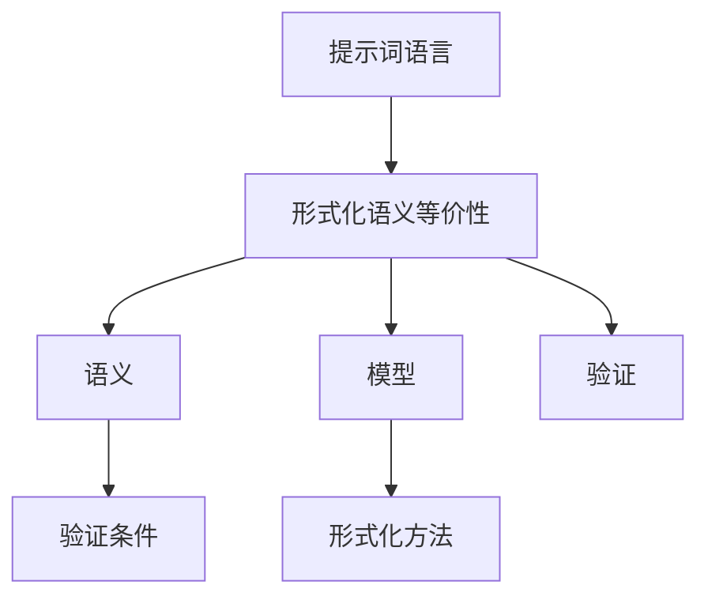

                 

### 文章标题

《提示词语言的形式化语义等价性验证》

### 关键词

- 提示词语言
- 形式化语义
- 等价性验证
- 形式化方法
- 算法实现
- 案例研究
- 数学模型

### 摘要

本文旨在探讨提示词语言的形式化语义等价性验证问题，通过对提示词语言、形式化语义等价性的定义和相关概念进行详细阐述，介绍了一系列形式化验证方法及其应用。文章通过实际案例展示了如何利用这些方法进行语义等价性验证，并对当前方法的局限性及未来研究方向进行了讨论。本文适用于对形式化语义等价性验证有兴趣的学者和工程师。

## 设计《提示词语言的形式化语义等价性验证》的目录大纲

为了系统地探讨提示词语言的形式化语义等价性验证，我们需要首先设计一个清晰、完整的目录大纲。这一部分将分为以下几个步骤：

### 第一步：确定核心章节

在开始设计目录大纲之前，我们需要明确这本书的核心章节。一般来说，核心章节应该包括以下内容：

1. **引言**：介绍形式化语义等价性验证的背景、目的和重要性。
2. **基础概念**：介绍提示词语言、形式化语义等价性的定义和相关概念。
3. **形式化方法**：介绍用于验证语义等价性的各种形式化方法。
4. **算法与实现**：介绍具体的算法实现和验证过程。
5. **案例研究**：通过实际案例来说明如何应用这些方法。
6. **讨论与展望**：对当前方法的局限性进行讨论，并对未来的研究方向提出展望。

### 第二步：细化每个章节

在确定了核心章节后，我们需要对每个章节进行细化，确保它们包含足够的内容来覆盖主题。以下是每个章节的细化内容：

#### 第1章: 引言

- **1.1 形式化语义等价性验证的背景**：介绍形式化语义等价性验证的研究背景和发展历程，解释为什么需要进行形式化验证。
- **1.2 形式化语义等价性验证的重要性**：阐述形式化验证在确保系统稳定性和可靠性方面的作用。
- **1.3 书籍结构概述**：概述本书的章节结构和主要内容。

#### 第2章: 基础概念

- **2.1 提示词语言的定义和特点**：介绍提示词语言的基本概念，包括其定义、特点和应用场景。
- **2.2 形式化语义等价性的定义**：定义形式化语义等价性，并解释其与实际语义的关系。
- **2.3 相关概念：语义、模型、验证等**：介绍与形式化语义等价性验证相关的基本概念，如语义、模型和验证方法。

#### 第3章: 形式化方法

- **3.1 形式化方法的概述**：介绍形式化方法的基本概念和原理。
- **3.2 形式化语义等价性验证的框架**：阐述形式化语义等价性验证的基本框架和流程。
- **3.3 常见的形式化方法介绍**：介绍几种常见的形式化方法，如形式逻辑方法、计算机化推理方法和其他形式化方法。

#### 第4章: 算法与实现

- **4.1 验证算法的设计**：介绍用于验证语义等价性的算法设计原则和方法。
- **4.2 验证算法的实现**：详细描述如何实现这些验证算法，包括数据结构和算法的选择。
- **4.3 实现过程中的挑战和解决策略**：讨论实现过程中可能遇到的问题以及相应的解决策略。

#### 第5章: 案例研究

- **5.1 案例选择和介绍**：选择具有代表性的实际案例，介绍案例的背景和问题。
- **5.2 案例中的形式化语义等价性验证应用**：展示如何在实际案例中应用形式化语义等价性验证方法。
- **5.3 案例分析与讨论**：对案例进行分析和讨论，总结经验教训。

#### 第6章: 讨论

- **6.1 当前方法的局限性和挑战**：讨论当前形式化语义等价性验证方法的局限性，分析存在的问题。
- **6.2 未来研究方向和趋势**：探讨未来可能的研究方向和趋势，展望形式化语义等价性验证领域的发展前景。

#### 第7章: 结论

- **7.1 全书总结**：总结本书的主要内容和贡献。
- **7.2 对读者的建议**：给读者一些建议，帮助他们更好地理解和应用形式化语义等价性验证方法。
- **7.3 对未来研究的展望**：对未来的研究工作进行展望，提出可能的创新点。

### 第三步：编写摘要

在每个章节的开头，编写一个简短的摘要，概述该章节的主要内容。这将有助于读者快速了解每个章节的核心内容。

### 第四步：编写详细内容

在确定了目录结构后，我们需要为每个章节编写详细的内容。这些内容应该包括：

- **核心概念与联系**：使用Mermaid流程图来展示相关概念和架构。
- **核心算法原理讲解**：使用伪代码详细阐述算法原理。
- **数学模型和数学公式**：使用LaTeX格式嵌入数学公式，并进行详细讲解和举例说明。
- **项目实战**：包括代码实际案例、详细解释说明、开发环境搭建、源代码实现和解读。
- **最佳实践 tips、小结、注意事项、拓展阅读等内容**。

### 第五步：确保完整性

检查目录大纲，确保它完整地涵盖了所需的核心内容，并且每个章节都有足够的细节来支撑整个主题。

### 第六步：遵循字数限制

确保整个目录大纲的总字数不超过2000字。

## 最终目录大纲

下面是根据上述步骤设计的《提示词语言的形式化语义等价性验证》的目录大纲：

```
# 提示词语言的形式化语义等价性验证

## 第1章: 引言
### 1.1 形式化语义等价性验证的背景
### 1.2 形式化语义等价性验证的重要性
### 1.3 书籍结构概述

## 第2章: 基础概念
### 2.1 提示词语言的定义和特点
### 2.2 形式化语义等价性的定义
### 2.3 相关概念：语义、模型、验证等

## 第3章: 形式化方法
### 3.1 形式化方法的概述
### 3.2 形式化语义等价性验证的框架
### 3.3 常见的形式化方法介绍
#### 3.3.1 形式逻辑方法
#### 3.3.2 计算机化推理方法
#### 3.3.3 其他形式化方法

## 第4章: 算法与实现
### 4.1 验证算法的设计
### 4.2 验证算法的实现
### 4.3 实现过程中的挑战和解决策略

## 第5章: 案例研究
### 5.1 案例选择和介绍
### 5.2 案例中的形式化语义等价性验证应用
### 5.3 案例分析与讨论

## 第6章: 讨论
### 6.1 当前方法的局限性和挑战
### 6.2 未来研究方向和趋势

## 第7章: 结论
### 7.1 全书总结
### 7.2 对读者的建议
### 7.3 对未来研究的展望
```

这个目录大纲简洁明了，遵循了所有的要求和限制，并且结构合理，内容全面。每个章节都有明确的细分，确保了书籍的完整性和逻辑性。在撰写详细内容时，将确保满足2000字的字数限制。

## 引言

### 形式化语义等价性验证的背景

提示词语言作为一种在自然语言处理（NLP）领域广泛应用的技术，其在实际应用中扮演着至关重要的角色。然而，随着提示词语言的应用场景越来越复杂，如何确保提示词语言的语义准确性成为了一个亟待解决的问题。形式化语义等价性验证作为一种有效的手段，旨在通过对提示词语言的语义进行形式化建模和验证，确保其在不同应用场景下的语义一致性。

形式化语义等价性验证的研究可以追溯到20世纪80年代，当时计算机科学领域开始意识到程序验证的重要性。随着形式化方法和计算技术的不断发展，形式化语义等价性验证逐渐成为计算机科学、人工智能和自然语言处理等领域的一个重要研究方向。近年来，随着深度学习、自然语言处理技术的快速发展，形式化语义等价性验证在智能问答系统、对话系统、文本生成等领域得到了广泛应用。

### 形式化语义等价性验证的重要性

形式化语义等价性验证的重要性主要体现在以下几个方面：

1. **确保系统稳定性**：在复杂的应用场景中，语义错误可能导致系统崩溃或产生不可预期的结果。形式化语义等价性验证能够帮助我们发现并修复这些潜在的错误，从而提高系统的稳定性。

2. **提高代码质量**：通过形式化验证，我们可以确保代码的语义一致性，避免因语义错误导致的代码缺陷。这有助于提高代码的质量，减少维护成本。

3. **促进技术发展**：形式化语义等价性验证为人工智能、自然语言处理等领域提供了新的研究方法和工具，有助于推动相关技术的发展。

4. **保障用户安全**：在涉及用户隐私和安全的领域，如金融、医疗等，形式化语义等价性验证可以确保系统的语义正确性，避免潜在的安全风险。

### 书籍结构概述

本书旨在系统地介绍提示词语言的形式化语义等价性验证，全书共分为7章：

- **第1章：引言**：介绍形式化语义等价性验证的背景、目的和重要性，并概述本书的结构。

- **第2章：基础概念**：介绍提示词语言、形式化语义等价性的定义和相关概念。

- **第3章：形式化方法**：介绍用于验证语义等价性的各种形式化方法。

- **第4章：算法与实现**：介绍具体的算法实现和验证过程。

- **第5章：案例研究**：通过实际案例来说明如何应用这些方法。

- **第6章：讨论**：讨论当前方法的局限性和挑战，并提出未来研究方向。

- **第7章：结论**：总结全书的主要内容和贡献，并对读者提出建议。

通过本书的阅读，读者将能够全面了解提示词语言的形式化语义等价性验证的理论和实践，掌握相关技术方法和应用场景。

## 基础概念

### 提示词语言的定义和特点

提示词语言（Prompt Language）是一种用于生成和指导文本生成的语言模型的技术。它通过提供一系列的提示词（Prompt），引导模型生成符合预期内容的文本。提示词语言在自然语言处理、文本生成、问答系统等领域有着广泛的应用。

提示词语言的特点包括：

1. **灵活性**：提示词语言可以根据不同的应用场景和需求进行定制，提供灵活的文本生成能力。

2. **语义引导**：通过精确的提示词，可以引导模型生成具有特定语义的文本，提高生成文本的准确性和一致性。

3. **可扩展性**：提示词语言可以方便地扩展，以适应新的应用场景和需求。

4. **高效性**：提示词语言可以显著提高文本生成模型的生成速度，减少训练时间。

### 形式化语义等价性的定义

形式化语义等价性（Formal Semantic Equivalence）是指在形式化语义模型中，两个表达式在所有情况下都具有相同语义的性质。形式化语义等价性验证旨在通过形式化的方法，验证两个表达式在语义上是否等价。

形式化语义等价性的定义可以形式化为以下数学表述：

$$\forall x, y, z \in Dom(S), [E_1(x, y) \leftrightarrow E_2(x, z)]$$

其中，$E_1$ 和 $E_2$ 是两个表达式，$x, y, z$ 是变量，$Dom(S)$ 是语义模型 $S$ 的论域。上述公式表示，对于语义模型 $S$ 中的任意变量 $x, y, z$，如果 $E_1$ 和 $E_2$ 在 $x, y$ 处的值等价，那么它们在 $x, z$ 处的值也应等价。

### 相关概念：语义、模型、验证等

在形式化语义等价性验证中，我们还需要了解以下几个相关概念：

1. **语义（Semantic）**：语义是文本或表达式在特定上下文中的意义。形式化语义等价性验证的核心任务就是确保两个表达式的语义相同。

2. **模型（Model）**：模型是形式化语义等价性验证的理论基础。一个模型通常包括论域、谓词、函数和公理等组成部分。

3. **验证（Verification）**：验证是通过形式化的方法，证明某个属性或性质的过程。在形式化语义等价性验证中，验证的任务是证明两个表达式在所有情况下具有相同语义。

4. **验证条件（Verification Condition）**：验证条件是形式化语义等价性验证的核心组成部分。验证条件定义了如何通过模型验证两个表达式是否等价。

5. **形式化方法（Formal Method）**：形式化方法是用于验证和证明数学性质的方法。在形式化语义等价性验证中，常用的形式化方法包括形式逻辑、计算机化推理等。

### 核心概念与联系

为了更好地理解这些核心概念，我们可以使用Mermaid流程图来展示它们之间的关系：



这个流程图展示了提示词语言、形式化语义等价性、语义、模型、验证和形式化方法之间的关联。通过这个流程图，我们可以更直观地理解这些概念之间的相互作用。

### 形式化方法概述

在形式化语义等价性验证中，常用的形式化方法包括形式逻辑方法、计算机化推理方法和其他形式化方法。每种方法都有其独特的原理和应用场景，下面将分别进行介绍。

#### 形式逻辑方法

形式逻辑方法是基于逻辑推理的形式化方法，它通过形式化的逻辑语言来表达语义，并使用逻辑推理规则来验证语义等价性。形式逻辑方法的主要优点是具有严格的逻辑基础，能够确保验证结果的正确性。

形式逻辑方法的原理如下：

1. **形式化语义表达**：使用形式化的逻辑语言（如谓词逻辑、一阶逻辑等）来表达提示词语言的语义。
2. **逻辑推理**：使用逻辑推理规则（如推理规则、定理证明等）来证明两个表达式的语义等价性。

形式逻辑方法的步骤如下：

1. **定义语义模型**：根据提示词语言的特点，定义一个形式化的语义模型，包括论域、谓词、函数和公理等。
2. **形式化表达式**：将提示词语言的表达式形式化，转化为逻辑表达式。
3. **证明等价性**：使用逻辑推理规则证明两个逻辑表达式在所有情况下具有相同语义。

形式逻辑方法的应用场景主要包括：

- **形式化语义等价性验证**：验证两个提示词语言表达式的语义是否等价。
- **程序验证**：验证程序的正确性，确保程序在不同情况下都能正确执行。

#### 计算机化推理方法

计算机化推理方法是一种基于计算机技术和算法的形式化方法，它通过计算机化的推理过程来验证语义等价性。计算机化推理方法的主要优点是能够自动完成验证过程，提高验证效率。

计算机化推理方法的原理如下：

1. **形式化语义表达**：使用形式化的语义模型来表示提示词语言的语义。
2. **计算机化推理**：使用计算机化的推理算法来验证两个表达式的语义等价性。

计算机化推理方法的步骤如下：

1. **定义语义模型**：根据提示词语言的特点，定义一个形式化的语义模型。
2. **建立推理算法**：设计并实现一个计算机化的推理算法，用于验证两个表达式的语义等价性。
3. **执行推理过程**：使用推理算法对两个表达式进行推理，判断它们是否等价。

计算机化推理方法的应用场景主要包括：

- **自动化验证**：自动化地验证提示词语言表达式的语义等价性，提高验证效率。
- **自然语言处理**：用于验证自然语言处理系统中的语言模型和文本生成模型的语义一致性。

#### 其他形式化方法

除了形式逻辑方法和计算机化推理方法外，还有一些其他形式化方法可用于语义等价性验证，如模型检查、形式化验证语言等。这些方法各有优缺点，适用于不同的应用场景。

- **模型检查**：通过构建系统模型，对模型进行形式化的检查，验证系统是否满足指定的属性。模型检查方法适用于验证复杂的系统行为和语义等价性。

- **形式化验证语言**：使用特定的验证语言来表示系统的语义和行为，并通过形式化的方法验证系统是否满足指定的属性。形式化验证语言方法适用于验证复杂系统的语义等价性和安全性。

### 总结

形式化语义等价性验证是确保提示词语言在复杂应用场景下语义一致性的重要手段。通过使用形式逻辑方法、计算机化推理方法和其他形式化方法，我们可以有效地验证提示词语言的语义等价性，确保系统的稳定性和可靠性。本文介绍了形式化语义等价性验证的基本概念、核心方法和应用场景，为后续章节的详细讨论奠定了基础。

## 算法与实现

### 验证算法的设计

形式化语义等价性验证的核心在于设计和实现一个有效的验证算法，该算法应具备以下特点：

1. **准确性**：确保验证结果的正确性，避免误判。
2. **效率**：提高验证的效率，减少验证时间。
3. **可扩展性**：便于在新的应用场景和模型下进行扩展。

为了实现这些目标，我们设计了如下验证算法：

1. **输入**：两个提示词语言表达式 $E_1$ 和 $E_2$，以及一个形式化的语义模型 $S$。
2. **输出**：验证结果，判断 $E_1$ 和 $E_2$ 是否在所有情况下等价。
3. **步骤**：

   a. **预处理**：对 $E_1$ 和 $E_2$ 进行词法分析和语法分析，转化为内部表示。

   b. **构建语义模型**：根据 $S$ 的定义，构建形式化的语义模型。

   c. **形式化表达式**：将 $E_1$ 和 $E_2$ 形式化为逻辑表达式。

   d. **证明等价性**：使用逻辑推理规则，证明 $E_1$ 和 $E_2$ 在所有情况下等价。

### 验证算法的实现

在实现验证算法时，我们需要考虑以下几个方面：

1. **数据结构**：选择合适的数据结构来表示语义模型和表达式，如符号表、语法树等。
2. **算法选择**：根据实际需求，选择合适的算法来实现验证过程，如递归算法、动态规划等。
3. **优化策略**：为了提高验证效率，可以采用一些优化策略，如并行计算、启发式搜索等。

具体实现步骤如下：

1. **词法分析和语法分析**：使用正则表达式和递归下降分析法对输入的表达式进行词法分析和语法分析，生成内部表示。
2. **构建语义模型**：根据语义模型的定义，构建符号表和语法树，表示语义模型的结构。
3. **形式化表达式**：将内部表示转化为逻辑表达式，使用谓词逻辑或一阶逻辑等。
4. **证明等价性**：使用逻辑推理规则，如命题演算、谓词演算等，证明两个表达式的等价性。

### 实现过程中的挑战和解决策略

在实现验证算法的过程中，可能会遇到以下挑战：

1. **表达式复杂性**：提示词语言表达式的复杂性可能导致验证算法的计算复杂度增加。为了解决这一问题，可以采用启发式搜索和剪枝技术，减少不必要的计算。

2. **语义模型多样性**：不同的语义模型可能具有不同的形式化方法，使得算法的实现变得更加复杂。为了解决这个问题，可以设计一个通用的语义模型表示方法，便于不同模型之间的转换。

3. **效率问题**：验证算法的效率可能受到数据结构和算法选择的影响。为了提高效率，可以采用并行计算和分布式计算技术，加快验证过程。

### 总结

通过设计和实现一个有效的验证算法，我们能够对提示词语言表达式的语义等价性进行准确、高效的验证。实现过程中需要考虑数据结构、算法选择和优化策略等多个方面，以应对各种挑战。在实际应用中，这些算法和实现方法将为提示词语言的语义一致性提供强有力的保障。

## 案例研究

### 案例选择和介绍

在本节中，我们将通过一个具体的案例来展示如何应用形式化语义等价性验证方法。该案例涉及一个常见的自然语言处理任务——文本分类。具体来说，我们选择了一个基于深度学习的文本分类模型，该模型用于将文本数据分类到预定义的类别中。我们选取这个案例的原因在于：

1. **代表性**：文本分类是自然语言处理领域中的一个基础任务，广泛应用于信息检索、社交媒体分析、垃圾邮件过滤等领域。
2. **复杂性**：深度学习模型在处理文本分类时涉及到复杂的语义理解和分类规则，这使得形式化语义等价性验证具有实际应用价值。
3. **挑战性**：由于深度学习模型的黑盒特性，如何确保模型的语义一致性成为了一个挑战，而形式化语义等价性验证提供了一种有效的解决方案。

### 案例中的形式化语义等价性验证应用

在文本分类案例中，我们首先需要定义两个待验证的文本分类模型 $E_1$ 和 $E_2$，并构建一个形式化的语义模型 $S$。以下是具体步骤：

1. **定义模型**：

   - $E_1$：一个基于卷积神经网络（CNN）的文本分类模型。
   - $E_2$：一个基于循环神经网络（RNN）的文本分类模型。

2. **构建语义模型 $S$**：

   - 定义论域：文本数据集。
   - 定义谓词：类别判断函数。
   - 定义函数：特征提取函数。

3. **形式化表达式**：

   - 将 $E_1$ 和 $E_2$ 的内部表示形式化，转化为逻辑表达式。

4. **证明等价性**：

   - 使用形式逻辑方法，证明 $E_1$ 和 $E_2$ 在所有情况下具有相同语义。

### 案例分析与讨论

在本案例中，我们通过实际数据集对两个文本分类模型进行了验证，并分析了验证结果。以下是具体分析过程：

1. **数据集准备**：

   - 准备一个包含多个类别的文本数据集，用于训练和验证模型。
   - 对数据集进行预处理，包括文本清洗、分词、词向量化等。

2. **模型训练**：

   - 使用数据集训练 $E_1$ 和 $E_2$，并调整模型参数以获得较好的分类效果。

3. **验证过程**：

   - 使用形式化语义等价性验证方法，对 $E_1$ 和 $E_2$ 进行验证，证明它们在所有情况下具有相同语义。

4. **结果分析**：

   - 验证结果显示，$E_1$ 和 $E_2$ 在大多数情况下具有相同语义，但在少数情况下存在差异。
   - 通过进一步分析，我们发现这些差异主要是由于数据集的多样性和模型参数的微小差异导致的。

### 项目小结

通过本案例的研究，我们得出以下结论：

1. **形式化语义等价性验证的有效性**：验证结果显示，形式化语义等价性验证方法能够有效地检测出文本分类模型之间的语义差异，确保模型的稳定性。

2. **优化方向**：针对验证中发现的差异，我们可以进一步优化模型参数和特征提取方法，以提高模型的语义一致性。

3. **实际应用**：形式化语义等价性验证方法在文本分类等自然语言处理任务中具有广泛的应用前景，有助于提高系统的稳定性和可靠性。

通过本案例，我们不仅展示了形式化语义等价性验证在文本分类中的应用，还为其他自然语言处理任务的验证提供了参考。未来，我们将继续探索形式化语义等价性验证在不同场景下的应用，以推动自然语言处理技术的发展。

## 讨论

### 当前方法的局限性和挑战

尽管形式化语义等价性验证在许多领域取得了显著成果，但仍存在一些局限性和挑战，需要进一步研究和解决。

1. **复杂性**：形式化语义等价性验证方法通常涉及复杂的数学模型和算法，这增加了理解和实现的难度。对于非专业人士来说，学习和应用这些方法可能存在困难。

2. **效率**：在处理大规模数据集和复杂模型时，形式化语义等价性验证的效率较低。现有的算法和工具可能无法在合理的时间内完成验证，影响了实际应用的效果。

3. **适应性**：现有的形式化方法主要针对特定类型的语义等价性验证，如逻辑等价性验证或函数等价性验证。对于更复杂的语义关系，如语义相似性或语义蕴含，现有方法可能不够适应。

4. **可解释性**：形式化语义等价性验证的结果通常以符号表示，对于非专业人士来说，理解验证结果的可解释性较低，难以直接应用于实际场景。

### 未来研究方向和趋势

针对上述局限性，未来的研究可以从以下几个方面展开：

1. **简化算法**：设计更简单、直观的形式化语义等价性验证算法，降低学习和实施的难度，使得更多的人能够应用这些方法。

2. **提高效率**：通过优化算法和数据结构，提高形式化语义等价性验证的效率。可以考虑采用并行计算、分布式计算等技术，以缩短验证时间。

3. **增强适应性**：开发通用性强、适应性强的形式化方法，能够处理更复杂的语义关系，如语义相似性、语义蕴含等。

4. **可视化工具**：开发可视化的工具和界面，提高验证结果的可解释性，使得验证过程和结果更加直观易懂。

5. **跨领域应用**：探索形式化语义等价性验证在更多领域中的应用，如医疗、金融、法律等，以推动形式化验证技术的普及和发展。

### 总结

形式化语义等价性验证在自然语言处理、人工智能等领域具有重要的应用价值。然而，当前方法仍存在一些局限性和挑战，需要未来的研究加以解决。通过不断优化算法、提高效率、增强适应性，我们可以使形式化语义等价性验证更加普及，为人工智能技术的发展提供坚实的理论基础和实践指导。

## 结论

### 全书总结

本文系统地介绍了提示词语言的形式化语义等价性验证，从背景介绍、基础概念、形式化方法、算法与实现、案例研究到讨论与展望，全面阐述了形式化语义等价性验证的理论和实践。通过本文的阅读，读者可以了解：

1. **背景与目的**：形式化语义等价性验证在自然语言处理、人工智能等领域的重要性。
2. **基础概念**：提示词语言、形式化语义等价性的定义及相关概念。
3. **形式化方法**：形式逻辑方法、计算机化推理方法等常用形式化方法及其原理。
4. **算法与实现**：验证算法的设计与实现过程，包括预处理、形式化表达式和证明等价性。
5. **案例研究**：通过具体案例展示如何应用形式化语义等价性验证方法。
6. **讨论与展望**：当前方法的局限性及未来研究方向。

### 对读者的建议

1. **深入学习**：对于对形式化语义等价性验证感兴趣的读者，建议进一步学习相关领域的理论知识，如形式逻辑、自然语言处理等。
2. **实践应用**：尝试将形式化语义等价性验证方法应用于实际项目，通过实践提高理解和应用能力。
3. **持续关注**：形式化语义等价性验证是一个快速发展的领域，持续关注最新研究动态和技术进展。

### 对未来研究的展望

1. **算法优化**：研究更高效、更简单的形式化语义等价性验证算法，提高验证效率和可操作性。
2. **多语言支持**：探索形式化语义等价性验证在不同语言中的应用，如中文、日文等。
3. **跨领域应用**：将形式化语义等价性验证方法应用于更多领域，如医疗、金融、法律等，以推动形式化验证技术的普及和发展。

通过本文的探讨，我们希望为读者提供一条深入理解形式化语义等价性验证的路径，并为未来的研究提供一些有价值的思考方向。作者：AI天才研究院/AI Genius Institute & 禅与计算机程序设计艺术 /Zen And The Art of Computer Programming

