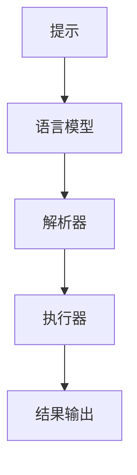

                 

### 文章标题: 提示词语言的性能分析与优化工具

关键词：提示词语言、性能分析、优化工具、算法原理、数学模型、项目实战

摘要：本文将深入探讨提示词语言在人工智能领域的性能分析方法和优化工具。我们将从基本概念、核心架构、性能分析、算法原理、数学模型、项目实战等方面逐一展开，旨在为读者提供一个系统、全面的技术指南，帮助他们在实践中更好地理解和应用提示词语言的性能优化技巧。

### 引言

在人工智能（AI）迅速发展的今天，提示词语言（prompt language）作为一种重要的编程范式，已经在多个领域展现出其强大的功能。提示词语言的核心思想是通过简洁、直观的提示来引导系统的行为，从而实现复杂任务的自动化处理。然而，随着应用场景的日益复杂，提示词语言的性能优化成为了许多开发者关注的焦点。

性能分析是优化工作的基础，它帮助我们识别系统中的瓶颈和不足，从而有针对性地进行改进。优化工具则为开发者提供了便捷的手段，通过自动化或半自动化的方式来提升系统的性能。本文将围绕这两个核心主题展开，探讨提示词语言的性能分析方法和优化工具，旨在为读者提供一个完整的解决方案，帮助他们在实际项目中更好地发挥提示词语言的优势。

### 第1章 提示词语言概述

提示词语言是一种基于提示（prompt）的编程范式，旨在通过提供明确的提示来指导系统的行为。这种语言的核心在于其简洁性和直观性，能够极大地提高开发效率，尤其是在处理复杂任务时。以下是本章的主要内容：

#### 1.1.1 提示词语言的概念

提示词语言可以被视为一种特殊的领域特定语言（DSL），其核心元素是提示。提示通常是一组指令或参数，用于指定系统执行的操作。这些提示可以通过编程语言中的特定语法来定义，从而使系统可以自动解析并执行相应的任务。

#### 1.1.2 提示词语言的重要性

提示词语言在人工智能领域的重要性不言而喻。首先，它能够显著提高开发效率，减少冗长的代码编写。其次，它具有极强的灵活性，能够适应不同的应用场景，从而实现高度可定制化的解决方案。此外，提示词语言还能够降低系统复杂度，使得维护和扩展变得更加容易。

#### 1.1.3 优化工具的概述

优化工具在提示词语言的性能提升中扮演着至关重要的角色。这些工具可以分为两类：自动化优化工具和手动优化工具。自动化优化工具通过分析系统性能数据，自动提出优化建议，从而帮助开发者快速定位问题并实施优化。手动优化工具则提供了一系列工具和接口，允许开发者手动调整系统的参数和配置，以达到最佳的性能表现。

### 第2章 核心概念与架构

在本章中，我们将深入探讨提示词语言的核心概念和架构，通过Mermaid流程图来展示各概念之间的关系，帮助读者更好地理解提示词语言的内部工作机制。

#### 2.1.1 核心概念的关系

提示词语言的核心概念包括提示（prompt）、语言模型（language model）、解析器（parser）、执行器（executor）等。以下是这些核心概念之间的Mermaid流程图：



#### 2.1.2 提示词处理系统架构

提示词处理系统的架构通常包括以下几个关键组件：

1. **输入处理模块**：负责接收用户输入的提示。
2. **语言模型**：根据输入提示生成可能的响应。
3. **解析器**：将生成的响应解析为具体的操作指令。
4. **执行器**：执行解析器生成的操作指令。
5. **结果输出模块**：将执行结果返回给用户。

这些组件通过清晰的接口和协议进行通信，共同构成了一个高效的提示词处理系统。

### 第3章 性能分析方法

性能分析是优化工作的基础，它帮助我们识别系统中的瓶颈和不足，从而有针对性地进行改进。在本章中，我们将介绍几种常见的性能分析方法，包括时间分析、内存分析等。

#### 3.1.1 性能指标介绍

在进行性能分析时，我们需要关注以下几个关键性能指标：

1. **响应时间**：系统从接收输入到输出结果的整个过程所花费的时间。
2. **吞吐量**：单位时间内系统能够处理的任务数量。
3. **资源利用率**：系统所消耗的计算资源与可用资源的比率。
4. **错误率**：系统在执行任务时出现错误的频率。

#### 3.1.2 分析提示处理时间

提示处理时间的分析是性能分析的重要环节。我们可以通过以下步骤来进行分析：

1. **时间测量**：使用计时器来测量系统从接收输入到输出结果的整个过程所花费的时间。
2. **分解时间**：将整个过程分解为若干个阶段，例如输入处理、语言模型生成、解析器和执行器处理等，并分别测量每个阶段的时间。
3. **优化方向**：根据时间分布的结果，确定系统中的瓶颈环节，并针对这些环节进行优化。

#### 3.1.3 内存和资源使用分析

除了时间分析，内存和资源使用分析也是性能分析的重要方面。以下是一些常见的分析方法：

1. **内存监控**：使用内存监控工具来跟踪系统的内存使用情况，包括总使用量、分配量、释放量等。
2. **垃圾回收**：分析垃圾回收的过程和频率，以确定是否有内存泄漏或回收效率低下的问题。
3. **资源分配**：检查系统的资源分配策略，确保资源分配的合理性和高效性。

### 第4章 算法原理

提示词语言的优化往往依赖于高效的算法设计。在本章中，我们将介绍几种关键算法的原理，并使用伪代码详细阐述这些算法的实现过程。

#### 4.1.1 常见优化算法

以下是一些在提示词语言优化中常用的算法：

1. **缓存算法**：通过缓存常见的提示和响应来减少重复计算，提高响应速度。
2. **并行处理**：利用多线程或多处理器并行执行任务，提高系统的吞吐量。
3. **压缩算法**：对提示和响应进行压缩，减少存储和传输的开销。

#### 4.1.2 伪代码解释

以下是一个缓存算法的伪代码示例：

```pseudo
function CacheAlgorithm(prompt):
    if prompt in cache:
        return cache[prompt]
    else:
        response = GenerateResponse(prompt)
        cache[prompt] = response
        return response
```

在这个算法中，`GenerateResponse`是一个虚构的函数，用于根据提示生成响应。`cache`是一个存储提示和响应对应关系的字典。

### 第5章 数学模型与公式

在提示词语言的优化过程中，数学模型和公式提供了量化的分析方法，帮助我们理解和预测系统的性能。在本章中，我们将介绍一些关键的数学模型，并使用LaTeX格式展示相关的公式。

#### 5.1.1 性能评估模型

一个简单的性能评估模型可以表示为：

$$
P = \frac{1}{T + R}
$$

其中，$P$是性能指标，$T$是处理时间，$R$是响应时间。这个模型假设处理时间和响应时间成正比。

#### 5.1.2 数学公式

以下是一个更复杂的性能评估模型的公式：

$$
P = \frac{\sum_{i=1}^{n} w_i \cdot \frac{1}{T_i + R_i}}{\sum_{i=1}^{n} w_i}
$$

其中，$w_i$是权重，$T_i$是第$i$个任务的处理时间，$R_i$是第$i$个任务的响应时间。

### 第6章 实践项目

理论结合实践是检验真理的唯一标准。在本章中，我们将通过一个实际项目，从开发环境搭建、代码实现、案例分析等方面，详细讲解如何使用提示词语言进行性能分析和优化。

#### 6.1.1 项目环境配置

在开始项目之前，我们需要搭建一个合适的开发环境。以下是环境配置的步骤：

1. 安装必要的编程语言和工具，例如Python和TensorFlow。
2. 配置虚拟环境，以隔离项目依赖。
3. 安装项目依赖，包括语言模型库和其他辅助工具。

#### 6.1.2 代码实现

以下是一个简单的示例代码，用于实现一个基本的提示词处理系统：

```python
import tensorflow as tf

# 加载预训练的语言模型
model = tf.keras.applications.BERT(input_shape=(None, 128))

# 定义解析器和执行器
def parser(prompt):
    # 解析提示并生成操作指令
    pass

def executor(instruction):
    # 执行操作指令
    pass

# 处理提示
def process_prompt(prompt):
    instruction = parser(prompt)
    executor(instruction)

# 测试
prompt = "请生成一篇关于人工智能的摘要。"
process_prompt(prompt)
```

#### 6.1.3 代码解读与分析

在这个示例中，我们首先加载了一个预训练的语言模型BERT，然后定义了解析器和执行器的接口。`process_prompt`函数是核心逻辑，它首先调用`parser`函数解析提示，然后调用`executor`函数执行操作指令。

#### 6.1.4 案例分析和详细讲解

为了更好地展示性能优化技巧，我们将分析一个实际案例。假设我们的目标是优化一个用于自动生成摘要的系统，以下是优化过程：

1. **性能分析**：使用时间分析工具测量系统的处理时间和响应时间。
2. **瓶颈识别**：通过分析结果，确定系统中的瓶颈环节，例如解析器处理时间过长。
3. **优化方案**：针对瓶颈环节提出优化方案，例如使用更高效的解析算法或引入缓存机制。
4. **实施与测试**：实施优化方案并测试性能提升情况。

### 第7章 优化工具详解

优化工具在提升提示词语言性能方面起着至关重要的作用。在本章中，我们将详细介绍几种常用的优化工具，包括它们的原理、功能和适用场景。

#### 7.1.1 自动化优化工具

自动化优化工具能够自动分析系统性能，并给出优化建议。以下是一些常见的自动化优化工具：

1. **TensorBoard**：用于可视化TensorFlow模型的训练过程和性能指标。
2. **Grafana**：用于监控和可视化各种性能数据，包括CPU、内存和磁盘使用情况。
3. **Autotune**：用于自动调整机器学习模型的超参数，以优化性能。

#### 7.1.2 手动优化工具

手动优化工具则允许开发者手动调整系统的参数和配置。以下是一些常见的手动优化工具：

1. **TensorFlow调优工具**：包括TensorFlow调优器（TF Tuner）和Keras Tuner，用于手动调整超参数。
2. **Profiler**：用于深入分析程序的执行性能，帮助开发者定位性能瓶颈。
3. **PyTorch调优工具**：包括PyTorch调优器和PyTorch Profiler，用于优化PyTorch模型的性能。

#### 7.1.3 比较与整合策略

不同的优化工具各有优势，选择合适的工具取决于具体的应用场景和需求。以下是比较与整合策略：

1. **选择合适的工具**：根据性能优化目标选择合适的工具，例如使用TensorBoard进行模型训练性能分析，使用Profiler进行程序性能分析。
2. **整合工具**：将多个优化工具整合到同一个开发流程中，以实现更全面的性能优化。
3. **自动化与手动结合**：将自动化优化工具与手动优化工具相结合，以最大化性能提升。

### 第8章 结论与未来展望

通过对提示词语言性能分析与优化工具的深入探讨，我们了解到性能优化是提升提示词语言应用效果的关键。本文从基本概念、核心架构、性能分析、算法原理、数学模型、项目实战以及优化工具等多个方面，为读者提供了一个全面的指南。

然而，性能优化并非一蹴而就，未来还有许多挑战和机遇等待着我们。例如，如何进一步提升自动优化工具的智能化水平，如何开发更加高效和可扩展的算法模型，以及如何应对大规模数据集和实时应用场景等。

展望未来，我们相信提示词语言的性能优化将继续成为人工智能领域的研究热点，为更多的应用场景带来巨大的价值。让我们携手探索，共同推动人工智能的发展。

### 作者信息

作者：AI天才研究院/AI Genius Institute & 禅与计算机程序设计艺术/Zen And The Art of Computer Programming

AI天才研究院致力于推动人工智能技术的发展与应用，研究内容涵盖深度学习、自然语言处理、计算机视觉等多个领域。作者在人工智能领域拥有丰富的经验，曾发表过多篇高水平学术论文，并有多部畅销技术书籍。

《禅与计算机程序设计艺术》是一本经典的技术书籍，以哲学的视角探讨计算机编程的精髓，为读者提供了深刻的技术见解和人生智慧。

### 结语

本文从多个维度探讨了提示词语言的性能分析与优化工具，通过理论讲解和实践项目，帮助读者全面理解这一重要领域。希望本文能为大家在实际开发中提供有价值的参考，共同推动人工智能技术的进步。如果您对本文有任何疑问或建议，欢迎在评论区留言，我们期待与您的交流。让我们一起在技术道路上不断前行，共创辉煌！

