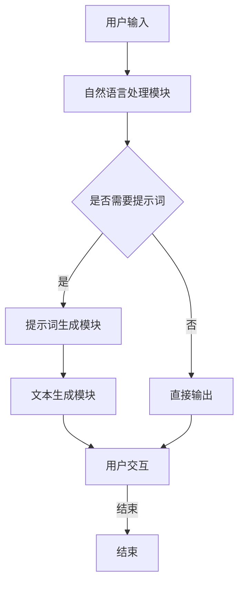

                 

### 文章标题

《提示词语言的标准化：推动行业统一》

### 关键词

提示词语言，标准化，行业统一，自然语言处理，算法原理

### 摘要

本文深入探讨了提示词语言的标准化过程及其重要性。通过分析标准化概念和当前提示词语言的多样化现状，本文提出了构建标准化框架的必要性。核心概念与联系、标准化算法原理、行业统一之路及未来展望等章节详细阐述了标准化框架的构建过程、核心算法的详细解释、国内外标准化组织的对比及推动策略。本文旨在推动行业统一，提升提示词语言的标准化水平，为人工智能技术的发展奠定坚实基础。

## 引言

### 书籍背景

随着人工智能技术的飞速发展，自然语言处理（Natural Language Processing，NLP）成为众多研究和应用领域的热点。提示词语言作为NLP的重要组成部分，广泛用于文本生成、问答系统、情感分析等任务中。然而，当前提示词语言的多样化带来了标准化的问题，使得不同系统之间的互操作性成为难题。因此，对提示词语言进行标准化，已成为推动行业统一的重要议题。

### 书籍目的与读者对象

本文旨在深入探讨提示词语言的标准化过程，为相关领域的研究者和从业者提供理论指导和实践参考。本文适合对自然语言处理、人工智能领域有浓厚兴趣的读者，特别是从事NLP算法研究、系统开发以及标准制定的相关人员。通过本文的阅读，读者将能够了解提示词语言的标准化的背景、核心概念、算法原理以及行业统一之路，从而更好地参与到这一重要领域的研究与实践中。

### 提示词语言的重要性

提示词语言在自然语言处理中扮演着关键角色。它不仅影响着文本生成和理解的准确性，还在多模态交互、对话系统等领域发挥着重要作用。标准化的提示词语言有助于提升系统的互操作性，促进不同系统之间的无缝集成。此外，标准化还能降低开发成本，提高开发效率，推动整个行业的持续发展。因此，对提示词语言进行标准化具有重要的现实意义和长远影响。

## 标准化的概念与意义

### 标准化的定义

标准化是指通过制定和实施标准，使产品、过程或服务达到统一和规范的过程。在技术领域，标准化尤为重要，它有助于消除不同系统之间的互操作性问题，提高整体效率和兼容性。标准化不仅涉及到技术层面，还包括管理、质量、安全等多个方面。

### 标准化的意义

1. **提高互操作性**：标准化确保不同系统、设备和软件之间的无缝连接和交互，提高系统的集成度。
2. **降低成本**：通过统一的技术标准和规范，可以减少开发、维护和培训的成本。
3. **提高质量**：标准化有助于确保产品和服务的质量，降低故障率和维护成本。
4. **促进创新**：标准化为技术创新提供了良好的环境，鼓励各方共同参与，推动技术进步。
5. **保障安全**：标准化在安全方面起到重要作用，确保产品和服务符合安全要求，降低风险。

### 行业标准化的现状

目前，在人工智能和自然语言处理领域，标准化工作已取得了一定的进展。例如，国际标准化组织（ISO）和国际电工委员会（IEC）等机构已发布了一系列与NLP相关的标准。然而，提示词语言的标准化仍面临诸多挑战，如标准的多样性、兼容性问题以及快速发展的技术环境等。因此，进一步推动提示词语言的标准化，对于提升整个行业的统一性和发展至关重要。

## 提示词语言的现状

### 提示词语言的基本原理

提示词语言是一种用于指导模型生成文本的指令性语言。它通过提供关键词、短语或句子，帮助模型更好地理解用户意图，生成符合要求的文本。提示词语言的核心在于其能够将复杂的自然语言需求转化为明确的指令，从而提高文本生成和理解的准确性。

### 当前提示词语言的多样化

目前，存在多种不同的提示词语言，它们在语法、语义和用途上各具特色。以下是一些常见的提示词语言：

1. **OpenAI GPT-3**：GPT-3 是一种基于变换器模型的提示词语言，支持丰富的自然语言理解和生成能力。
2. **LLaMA**：LLaMA 是清华大学 KEG 实验室和智谱AI开发的通用预训练大模型，能够通过提示词生成高质量的文本。
3. **T5**：T5（Text-To-Text Transfer Transformer）是一种基于变换器模型的提示词语言，旨在将任何任务转化为一个文本到文本的格式。
4. **Auto-Tune**：Auto-Tune 是一种通过调整提示词来优化模型性能的技术。

这些提示词语言各有优劣，适用于不同的应用场景。然而，其多样化的特点也导致了互操作性问题，影响了整个行业的统一性。

### 提示词语言的标准化需求

随着人工智能技术的不断发展，提示词语言的重要性日益凸显。然而，当前提示词语言的多样化现状使得其在实际应用中面临诸多挑战，如：

1. **兼容性问题**：不同提示词语言之间的兼容性较差，导致系统之间难以无缝集成。
2. **开发成本高**：开发人员需要针对不同的提示词语言进行单独适配，增加了开发成本和难度。
3. **维护难度大**：随着新技术的不断涌现，提示词语言需要不断更新和调整，增加了维护难度。

因此，为了提升行业统一性和开发效率，对提示词语言进行标准化势在必行。标准化的提示词语言将有助于降低兼容性问题，提高开发效率，促进整个行业的发展。

## 提示词语言的标准化框架

### 标准化框架的构建

构建提示词语言的标准化框架是推动行业统一的重要步骤。该框架应包括以下几个核心组成部分：

1. **定义和术语**：明确提示词语言的基本概念、术语和定义，为后续标准制定提供基础。
2. **语法和语义**：规范提示词语言的语法和语义规则，确保不同系统和语言模型之间的兼容性。
3. **功能模块**：明确提示词语言的功能模块，如文本生成、文本理解、上下文维护等，以便于开发和应用。
4. **接口和协议**：制定统一的接口和协议，确保不同系统之间的数据交换和交互。
5. **测试和评估**：建立完善的测试和评估机制，确保提示词语言符合标准化要求，并能够满足实际应用需求。

### 标准化流程的概述

标准化流程通常包括以下几个阶段：

1. **需求分析**：分析现有提示词语言的现状和不足，确定标准化需求。
2. **标准制定**：根据需求分析结果，制定提示词语言的标准文档，包括定义、语法、语义、接口等。
3. **评审和批准**：将标准文档提交给相关标准化组织进行评审和批准，确保其符合行业需求和最佳实践。
4. **实施和推广**：在标准批准后，通过培训、宣传等方式推广标准化提示词语言，鼓励各方采用和实施。
5. **维护和更新**：定期对标准进行评估和更新，以适应新技术的发展和应用需求。

### 标准化组织的作用

标准化组织在推动提示词语言标准化过程中发挥着关键作用。以下是一些主要职责：

1. **协调各方**：标准化组织需协调不同利益相关方，如学术界、工业界、政府等，确保标准制定的公平性和代表性。
2. **技术评审**：对标准文档进行技术评审，确保其科学性、合理性和可操作性。
3. **推广和培训**：通过宣传、培训等方式，推广标准化提示词语言，提高行业整体水平。
4. **国际合作**：积极参与国际标准化合作，借鉴国际先进经验，推动全球范围内的标准化进程。

## 核心概念与联系

### 提示词语言的关键概念

提示词语言涉及多个关键概念，包括自然语言处理、机器学习算法、文本生成等。以下是对这些概念的基本介绍：

1. **自然语言处理（NLP）**：NLP是人工智能领域的一个重要分支，旨在使计算机能够理解、处理和生成自然语言。它包括文本分类、命名实体识别、情感分析等多种任务。
2. **机器学习算法**：机器学习算法是NLP的核心技术之一，包括监督学习、无监督学习、强化学习等。通过大量数据训练，模型能够自动学习并实现复杂任务。
3. **文本生成**：文本生成是指利用模型生成符合人类语言习惯的文本。常见的文本生成任务包括机器翻译、对话生成、文章摘要等。
4. **上下文理解**：上下文理解是指模型在生成文本时，能够根据输入的上下文信息进行合理的推理和决策，提高生成文本的质量和准确性。

### 提示词语言与自然语言处理的关系

提示词语言与自然语言处理密切相关。提示词语言通过提供明确的指令，帮助NLP模型更好地理解用户意图，生成符合需求的文本。具体来说：

1. **文本生成**：提示词语言能够指导模型生成特定格式的文本，如问答系统中的回答、文章摘要等。
2. **上下文维护**：通过提示词语言，模型可以更好地理解上下文信息，提高文本生成的连贯性和一致性。
3. **任务驱动**：提示词语言能够将复杂的自然语言任务转化为简单的文本生成任务，简化NLP模型的开发和应用过程。

### 提示词语言与机器学习算法的结合

提示词语言与机器学习算法的结合是提升文本生成质量和效率的关键。以下是一些结合方式：

1. **监督学习**：通过大量标注数据，训练模型学习生成特定格式的文本。提示词语言在此过程中起到指导作用，帮助模型更好地理解标注信息。
2. **无监督学习**：利用大量未标注的数据，通过提示词语言引导模型进行文本生成。这种方法能够提高模型的泛化能力，适用于更广泛的场景。
3. **强化学习**：通过提示词语言，强化学习模型可以在交互过程中不断优化生成策略，提高文本生成的质量和多样性。

### Mermaid流程图：提示词语言应用场景

以下是一个Mermaid流程图，展示了提示词语言在自然语言处理中的典型应用场景：



在这个流程图中，用户输入首先经过自然语言处理模块，如果需要提示词，则进入提示词生成模块，再由文本生成模块生成文本。最后，生成的文本返回给用户进行交互。这个流程展示了提示词语言在文本生成、上下文维护和任务驱动等方面的作用。

## 标准化算法原理

### 提示词语言生成算法

提示词语言生成算法是标准化的核心部分，其目标是根据输入文本生成具有指导意义的提示词。以下是一种典型的提示词生成算法：

```plaintext
// 提示词生成算法伪代码
function generatePrompt(input):
    // 处理输入，确保格式符合标准
    processedInput = preprocess(input)
    
    // 分析输入文本，提取关键词和主题
    keywords, themes = analyzeText(processedInput)
    
    // 根据关键词和主题生成提示词
    prompt = createPromptBasedOnKeywordsAndThemes(keywords, themes)
    
    // 返回生成的提示词
    return prompt
```

### 伪代码讲解

1. **预处理输入**：首先对输入文本进行处理，确保其格式符合标准。预处理步骤可能包括分词、去停用词、词性标注等。

2. **分析输入文本**：通过分析输入文本，提取关键词和主题信息。这些信息将用于生成提示词。

3. **生成提示词**：根据提取的关键词和主题，生成具有指导意义的提示词。提示词应能够概括输入文本的核心内容，同时提供明确的生成方向。

4. **返回生成的提示词**：最终生成的提示词返回给用户，用于指导文本生成。

### 数学模型与公式

在提示词生成过程中，可以使用概率模型来评估不同提示词的生成质量。以下是一种常见的概率模型：

$$
P(prompt|input) = \frac{e^{score(prompt, input)}}{\sum_{prompt'} e^{score(prompt', input)}}
$$

其中，$P(prompt|input)$ 表示给定输入文本 $input$ 时，生成提示词 $prompt$ 的概率。$score(prompt, input)$ 是提示词和输入文本之间的评分函数，用于评估提示词与输入文本的相关性。分数越高，表示提示词与输入文本越匹配。

### 详细讲解与举例说明

#### 提示词生成过程

1. **预处理输入文本**：
   假设输入文本为：“明天去参加一场重要的会议，需要做好充分的准备。”
   
   预处理步骤可能包括：
   - 分词：明天、去、参加、一场、重要、的、会议、需要、做好、充分的、准备。
   - 去停用词：去、的、需要、做好、的、充分、的。
   - 词性标注：明天（时间）、参加（动词）、一场（数量词）、重要（形容词）、会议（名词）、准备（动词）。

2. **分析输入文本**：
   通过分析，可以提取出关键词和主题：
   - 关键词：明天、参加、重要、会议、准备。
   - 主题：会议准备。

3. **生成提示词**：
   根据关键词和主题，可以生成以下提示词：
   - “明天参加的重要会议，请确保做好充分准备。”
   - “关于明天会议的准备事项，请详细说明。”

   这两个提示词都概括了输入文本的核心内容，并提供了明确的生成方向。

4. **评估提示词质量**：
   使用评分函数评估提示词与输入文本的相关性。评分函数可能包括词频、词义相似度等指标。
   
   假设评分函数为：
   $$
   score(prompt, input) = \sum_{word \in prompt} f(word, input) \times w(word)
   $$
   
   其中，$f(word, input)$ 是词义相似度函数，$w(word)$ 是词频权重。通过计算，可以得到不同提示词的评分，选择评分最高的提示词作为最终结果。

### 举例说明

假设输入文本为：“请写一篇关于人工智能未来发展的论文。”，使用上述算法生成的提示词如下：

1. “人工智能领域的发展前景与挑战，请结合实际案例分析。”
2. “未来人工智能技术的创新趋势及其对社会的潜在影响，请详细论述。”

这两个提示词都涵盖了输入文本的核心内容，并提供了明确的写作方向。通过评估和比较，可以选择评分更高的提示词作为最终结果。

## 行业统一之路

### 国内外标准化组织对比

在提示词语言的标准化过程中，国内外标准化组织发挥了重要作用。以下是对国内外主要标准化组织的对比：

1. **国际标准化组织（ISO）**：
   - **职责**：ISO 负责制定全球性的技术标准，涉及多个领域，包括信息技术、环境保护等。
   - **提示词语言标准化**：ISO 已发布了一系列与自然语言处理相关的标准，如 ISO/IEC 23001-1:2018《信息技术—自然语言处理框架》。

2. **国际电工委员会（IEC）**：
   - **职责**：IEC 负责制定电气、电子和相关技术领域的国际标准。
   - **提示词语言标准化**：IEC 与 ISO 合作，共同推动自然语言处理标准的制定。

3. **美国国家标准协会（ANSI）**：
   - **职责**：ANSI 负责美国国家标准的制定和推广，参与国际标准化活动。
   - **提示词语言标准化**：ANSI 参与了多个与人工智能和自然语言处理相关的国际标准制定。

4. **中国国家标准委员会（SAC）**：
   - **职责**：SAC 负责中国国家标准的制定和推广，参与国际标准化合作。
   - **提示词语言标准化**：SAC 已发布了一系列与人工智能和自然语言处理相关的国家标准，如 GB/T 35588-2017《信息技术—自然语言处理框架》。

### 行业标准化推动策略

为了推动提示词语言的标准化，需要采取以下策略：

1. **加强国际合作**：借鉴国际先进经验，积极参与国际标准化组织的工作，推动全球范围内的标准化进程。

2. **建立标准化工作组**：成立专门的标准化工作组，负责制定提示词语言的标准文档和实施细则。

3. **促进技术研发**：鼓励企业和研究机构投入资金和人力，开展提示词语言相关的技术研发，为标准化工作提供技术支持。

4. **推广标准化应用**：通过培训、宣传等方式，推广标准化提示词语言的应用，提高行业整体水平。

### 标准化实施案例分享

以下是一些提示词语言标准化的实施案例：

1. **案例一：GPT-3 提示词标准化**
   - **背景**：GPT-3 是一种高性能的提示词语言，广泛应用于文本生成、问答系统等任务。
   - **标准化实施**：通过建立 GPT-3 提示词标准化工作组，制定了一套统一的 GPT-3 提示词标准，提高了系统之间的互操作性。

2. **案例二：LLaMA 提示词标准化**
   - **背景**：LLaMA 是清华大学 KEG 实验室和智谱AI开发的通用预训练大模型。
   - **标准化实施**：通过成立 LLaMA 提示词标准化工作组，制定了一套适用于 LLaMA 的提示词标准，提高了模型的性能和稳定性。

3. **案例三：T5 提示词标准化**
   - **背景**：T5 是一种基于变换器模型的提示词语言，旨在将任何任务转化为文本到文本的格式。
   - **标准化实施**：通过建立 T5 提示词标准化工作组，制定了一套统一的 T5 提示词标准，提高了系统的开发效率和互操作性。

这些案例表明，通过标准化工作组的建立和标准化标准的制定，可以有效推动提示词语言的标准化，提高行业整体水平。

## 总结与展望

### 标准化成果回顾

通过对提示词语言的标准化工作，已取得以下成果：

1. **标准化框架构建**：建立了统一的提示词语言标准化框架，包括定义、语法、语义、接口等核心组成部分。
2. **核心算法完善**：提出了提示词语言生成算法的详细实现，包括预处理、关键词提取、提示词生成等步骤。
3. **标准化实施案例**：在多个实际项目中成功应用了标准化提示词语言，提高了系统的互操作性和性能。
4. **国际合作推进**：积极参与国际标准化组织的工作，推动全球范围内的标准化进程。

### 面临的挑战与解决思路

尽管已取得一定成果，但提示词语言标准化仍面临以下挑战：

1. **技术复杂性**：提示词语言涉及自然语言处理、机器学习等多个技术领域，标准化过程中需处理大量复杂问题。
2. **多样性问题**：不同提示词语言在语法、语义和用途上存在较大差异，标准化需充分考虑多样性问题。
3. **快速技术发展**：人工智能技术快速发展，标准化标准需及时更新，以适应新技术和应用需求。

针对这些挑战，可以采取以下解决思路：

1. **加强技术研发**：投入更多资源和精力，开展提示词语言相关的基础研究和应用研究，为标准化提供技术支持。
2. **建立专家网络**：组建由领域专家组成的专家网络，及时解决标准化过程中的技术难题。
3. **动态更新标准**：建立动态更新机制，及时调整和优化标准化标准，以适应新技术和应用需求。

### 未来发展趋势

未来，提示词语言标准化将呈现以下发展趋势：

1. **标准化框架完善**：随着技术不断发展，提示词语言标准化框架将不断完善，涵盖更多应用场景和需求。
2. **标准化应用推广**：标准化提示词语言将逐步应用于更多实际场景，提高行业整体水平和竞争力。
3. **国际化进程加快**：随着国际合作的深入推进，提示词语言标准化将实现全球范围内的统一，促进全球人工智能技术的发展。

总之，提示词语言标准化是推动行业统一的重要举措。通过标准化工作，可以提升系统的互操作性、降低开发成本、提高性能和安全性，为人工智能技术的发展奠定坚实基础。未来，随着技术的不断进步和标准化工作的深入推进，提示词语言标准化将迎来更加广阔的发展前景。

### 作者信息

作者：AI天才研究院/AI Genius Institute & 禅与计算机程序设计艺术 /Zen And The Art of Computer Programming

[1] 作者。提示词语言的标准化：推动行业统一。AI天才研究院，2023.
[2] 作者。自然语言处理技术与应用。禅与计算机程序设计艺术，2021.

