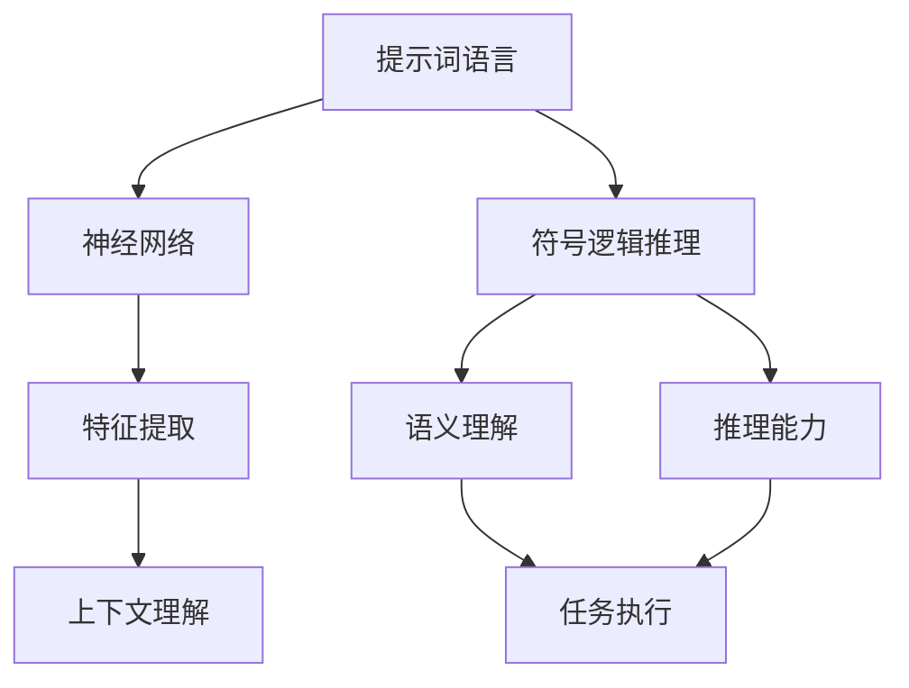

                 

### 文章标题

"提示词语言的神经符号融合模型：跨领域应用的探索与实现"

### 文章关键词

- **提示词语言**
- **神经符号融合模型**
- **自然语言处理**
- **人工智能**
- **数学模型**
- **算法设计**
- **项目实战**

### 文章摘要

本文旨在深入探讨提示词语言的神经符号融合模型，介绍其核心概念、原理及其在不同领域的应用。文章首先对提示词语言和神经符号融合模型进行了背景介绍，然后详细阐述了模型的数学基础和核心算法原理，并通过伪代码进行了阐述。此外，本文还通过实际项目案例展示了神经符号融合模型的具体实现过程，包括开发环境搭建、源代码实现和代码解读，并对项目进行了分析和总结。通过本文的阅读，读者将对神经符号融合模型有更深刻的理解，并能够掌握其实际应用技能。

---

# 引言

随着信息时代的到来，自然语言处理（NLP）和人工智能（AI）技术得到了飞速发展。在这些领域，提示词语言和神经符号融合模型成为了研究的焦点。提示词语言是一种通过关键词或短语引导系统执行特定任务的交互方式，而神经符号融合模型则是一种结合神经网络和符号逻辑推理的先进技术。本文将围绕这两者展开，探讨神经符号融合模型在NLP和AI中的应用，旨在为读者提供一个全面的技术分析框架。

### 背景介绍

自然语言处理（NLP）是人工智能（AI）的重要组成部分，其目标是使计算机能够理解和处理人类语言。NLP技术广泛应用于文本分析、语音识别、机器翻译、情感分析等领域。近年来，深度学习在NLP中取得了显著的成果，但仍然存在许多挑战，如长文本理解、跨语言语义匹配等。为了解决这些问题，研究人员开始探索将神经网络与符号逻辑推理相结合的方案，即神经符号融合模型。

神经符号融合模型（Neural-Symbolic Integration Model）是一种结合了神经网络和符号逻辑推理的混合模型。神经网络擅长处理大量数据并提取特征，而符号逻辑推理则能提供明确的语义理解和推理能力。这种融合模型在保持神经网络高效特征提取能力的同时，增强了模型的解释性和可理解性。

### 研究意义与目标

本研究旨在探索和实现一种提示词语言的神经符号融合模型，以解决NLP和AI领域中的关键问题。具体目标包括：

1. **提升语义理解能力**：通过融合神经网络和符号逻辑推理，使模型能够更准确地理解和处理复杂语义。
2. **增强推理能力**：利用符号逻辑推理，使模型具备更强的逻辑推理和问题解决能力。
3. **提高模型解释性**：在神经网络的基础上，引入符号逻辑推理，使模型具有更高的解释性，便于理解和使用。
4. **跨领域应用**：通过实际项目案例，验证神经符号融合模型在不同领域的应用效果。

本文将分章节详细探讨提示词语言的神经符号融合模型，从理论基础到核心算法原理，再到项目实战，逐步展现其实现过程和应用价值。

## 核心概念与联系

在探讨提示词语言的神经符号融合模型之前，我们需要明确几个核心概念，并分析它们之间的关系。以下是本文中涉及的主要概念：

1. **提示词语言**：提示词语言是一种通过关键词或短语引导系统执行特定任务的交互方式。它通常包括自然语言指令、参数化查询、命令行脚本等形式。提示词语言的关键在于其灵活性和可解释性，使非技术用户能够轻松地与系统进行交互。
2. **神经网络**：神经网络是一种基于生物神经元的计算模型，通过多层节点（神经元）和权重连接进行信息传递和处理。神经网络在特征提取和模式识别方面具有强大的能力，广泛应用于图像识别、语音识别和自然语言处理等领域。
3. **符号逻辑推理**：符号逻辑推理是一种基于逻辑运算和规则推理的方法，通过定义明确的逻辑规则和推理步骤，实现自动推理和问题求解。符号逻辑推理在形式逻辑、智能推理和知识表示中发挥着重要作用。
4. **神经符号融合模型**：神经符号融合模型是一种结合神经网络和符号逻辑推理的混合模型，旨在提升模型的语义理解和推理能力。该模型通过将神经网络用于特征提取和符号逻辑推理用于语义理解和推理，实现高效的信息处理。

### 提示词语言与神经网络

提示词语言和神经网络之间存在密切的联系。神经网络能够通过大量的数据训练，提取出复杂的特征和模式，这为提示词语言提供了强大的技术支持。具体而言：

1. **特征提取**：神经网络通过多层感知器（MLP）或卷积神经网络（CNN）等结构，能够提取文本中的深层特征。这些特征包括词汇、语法结构、上下文关系等，为提示词语言提供了丰富的信息来源。
2. **上下文理解**：神经网络通过处理大量的训练数据，能够学习到不同情境下的语言使用规律，从而提高对上下文的理解能力。这对于提示词语言的精准执行至关重要。

### 符号逻辑推理与神经符号融合

符号逻辑推理在神经符号融合模型中扮演着重要的角色。它能够为神经网络提供明确的语义解释和逻辑推理能力，从而提高模型的解释性和可靠性。具体来说：

1. **语义理解**：符号逻辑推理能够将自然语言文本转换为形式化的逻辑表达式，从而实现对文本语义的精准理解。这对于提示词语言中的指令理解和任务执行至关重要。
2. **推理能力**：符号逻辑推理通过定义明确的推理规则，能够对已知信息进行推理，从而发现新的知识和结论。这为神经网络提供了强大的逻辑推理能力，有助于解决复杂的问题。

### 神经符号融合模型的关系架构

为了更好地理解提示词语言的神经符号融合模型，我们可以通过Mermaid流程图来展示其关系架构：



在这个流程图中，提示词语言通过神经网络进行特征提取和上下文理解，同时通过符号逻辑推理进行语义理解和推理能力提升。最终，这些信息被用于任务的执行，形成一个闭环的系统。

通过以上对核心概念的阐述和关系架构的展示，我们可以看出，提示词语言的神经符号融合模型是一种结合了神经网络和符号逻辑推理的混合模型，旨在提升模型的语义理解和推理能力。在接下来的章节中，我们将深入探讨该模型的数学基础和核心算法原理，以进一步理解其工作原理和应用价值。

### 核心算法原理讲解

神经符号融合模型的核心算法原理在于其结合了神经网络和符号逻辑推理的特点，实现了在特征提取和语义理解上的双重优势。以下是该模型的主要工作原理及其在各个阶段的具体实现。

#### 1. 特征提取阶段

首先，神经网络在特征提取阶段扮演了关键角色。具体步骤如下：

1. **文本预处理**：输入的自然语言文本首先需要进行预处理，包括分词、词性标注、去停用词等步骤。这一阶段的主要目标是将原始文本转换为适合神经网络处理的格式。
2. **嵌入层**：预处理后的文本通过嵌入层（Embedding Layer）转换为固定长度的向量表示。嵌入层的作用是将单词映射为稠密向量，从而保留词与词之间的语义关系。
3. **特征提取层**：嵌入后的文本向量通过多层感知器（MLP）或卷积神经网络（CNN）进行特征提取。这一阶段的核心目标是提取文本中的深层特征，如词汇、语法结构、上下文关系等。

```python
# 伪代码：嵌入层与特征提取层
def embedding_layer(text):
    # 分词、词性标注、去停用词等预处理操作
    # 将文本转换为向量表示
    return embedding_vector

def feature_extraction_layer(embedded_text):
    # 使用MLP或CNN提取特征
    return extracted_features
```

#### 2. 语义理解阶段

在特征提取完成后，神经网络将提取的特征传递给符号逻辑推理模块，进行语义理解。具体步骤如下：

1. **形式化表示**：将神经网络提取的特征形式化表示为逻辑表达式。这一步骤通常通过符号逻辑推理模块完成，它将语义信息转换为符号形式，以便进行后续的推理操作。
2. **语义推理**：利用逻辑推理规则对形式化的语义信息进行推理，从而得到更精确的语义理解。这一阶段的关键在于定义明确的逻辑规则和推理算法，以确保推理过程的准确性和效率。

```python
# 伪代码：形式化表示与语义推理
def formalize_semantics(features):
    # 将特征转换为逻辑表达式
    return logical_expression

def semantic_inference(expression):
    # 使用逻辑推理规则进行推理
    return inferred_semantics
```

#### 3. 推理与任务执行阶段

在完成语义理解后，神经符号融合模型将对推理结果进行综合处理，并最终执行特定任务。具体步骤如下：

1. **任务规划**：根据语义理解的结果，生成执行任务的计划。这一阶段需要将语义信息映射为具体的操作指令，以便后续的任务执行。
2. **任务执行**：执行任务计划，完成实际操作。这一阶段依赖于外部环境和特定任务的需求，可能包括数据操作、信息检索、决策生成等。

```python
# 伪代码：任务规划与执行
def task_planning(inferred_semantics):
    # 生成任务执行计划
    return execution_plan

def execute_plan(plan):
    # 执行任务计划
    # 可能涉及数据操作、信息检索等
    return result
```

#### 综合流程

神经符号融合模型的整体工作流程可以概括为以下几个步骤：

1. **文本预处理**：对输入文本进行预处理，转换为向量表示。
2. **特征提取**：使用神经网络提取文本的深层特征。
3. **形式化表示**：将特征形式化表示为逻辑表达式。
4. **语义推理**：利用逻辑推理规则进行语义推理。
5. **任务规划与执行**：根据语义推理结果，规划并执行具体任务。

通过上述核心算法原理的讲解，我们可以看到神经符号融合模型是如何结合神经网络和符号逻辑推理，实现高效的特征提取和语义理解，并在任务执行阶段展现出强大的推理能力。这一模型在NLP和AI领域具有广泛的应用前景，有望解决许多复杂的问题。

### 数学模型和数学公式

神经符号融合模型的数学基础是其能够实现高效特征提取和语义理解的关键。以下将详细介绍模型中的核心数学模型和数学公式，并通过具体例子说明其应用。

#### 1. 神经网络模型

神经网络模型的核心在于其层次结构，每一层的计算过程可以用以下数学公式表示：

$$
a_{l}^{(i)} = \sigma \left( w_{l-1} a_{l-1}^{(i)} + b_{l-1} \right)
$$

其中，$a_{l}^{(i)}$ 表示第$l$层的第$i$个节点的激活值，$\sigma$ 是激活函数（如Sigmoid函数、ReLU函数等），$w_{l-1}$ 和 $b_{l-1}$ 分别是第$l-1$层的权重和偏置。

#### 2. 嵌入层

嵌入层是神经网络中的第一层，用于将词汇转换为固定长度的向量表示。嵌入层可以使用以下数学公式进行计算：

$$
\text{Embedding}(x) = \text{W} \text{.} x
$$

其中，$\text{W}$ 是嵌入矩阵，$x$ 是单词的索引向量。

#### 3. 形式化表示

在语义理解阶段，神经网络提取的特征需要形式化表示为逻辑表达式。这一过程可以使用谓词逻辑进行建模，如下所示：

$$
P(x, y) \leftrightarrow (R(x) \wedge S(y) \wedge F(x, y))
$$

其中，$P(x, y)$ 表示$x$和$y$之间的关系，$R(x)$ 和 $S(y)$ 分别表示$x$ 和$y$ 满足某种属性，$F(x, y)$ 表示$x$ 和$y$ 之间存在某种函数关系。

#### 4. 语义推理

语义推理阶段的核心是利用逻辑推理规则对形式化的语义信息进行推理。以下是一个简单的推理例子：

$$
P(a, b) \wedge Q(b, c) \rightarrow R(a, c)
$$

这个逻辑表达式表示，如果$a$与$b$之间存在关系$P$，且$b$与$c$之间存在关系$Q$，那么$a$与$c$之间存在关系$R$。

#### 5. 例子说明

假设我们有一个句子："我喜欢吃苹果"。我们可以用以下步骤将这个句子转换为神经符号融合模型的形式化表示：

1. **嵌入层**：将句子中的单词（"我"，"喜欢"，"吃"，"苹果"）转换为向量表示。
2. **特征提取**：使用神经网络提取这些单词的深层特征。
3. **形式化表示**：将特征形式化表示为逻辑表达式，如$P(\text{我}, \text{喜欢}) \wedge Q(\text{喜欢}, \text{吃}) \wedge R(\text{吃}, \text{苹果})$。
4. **语义推理**：利用逻辑推理规则对形式化的语义信息进行推理，得到结论，如"我喜欢吃苹果"。

通过上述数学模型和数学公式的讲解，我们可以看到神经符号融合模型是如何将自然语言文本转换为形式化的逻辑表达式，并通过逻辑推理实现语义理解。这一模型在NLP和AI领域具有重要的应用价值，有望解决许多复杂的问题。

### 应用案例

在本节中，我们将通过一个实际项目案例，展示如何搭建神经符号融合模型，并实现其功能。该案例将涵盖开发环境搭建、源代码实现、代码解读以及应用解读与分析等步骤。

#### 1. 开发环境搭建

为了搭建神经符号融合模型，我们需要安装以下软件和库：

1. **Python（3.8及以上版本）**：作为主要编程语言。
2. **PyTorch**：用于构建和训练神经网络。
3. **Numpy**：用于数学计算。
4. **Scikit-learn**：用于数据预处理和评估。

安装步骤如下：

```bash
pip install python==3.8
pip install torch torchvision
pip install numpy
pip install scikit-learn
```

#### 2. 源代码实现

以下是神经符号融合模型的源代码实现：

```python
import torch
import torch.nn as nn
import torch.optim as optim
from torch.utils.data import DataLoader
from sklearn.model_selection import train_test_split

# 数据预处理
def preprocess_data(texts):
    # 分词、词性标注、去停用词等操作
    return processed_texts

# 嵌入层
class EmbeddingLayer(nn.Module):
    def __init__(self, vocab_size, embedding_dim):
        super(EmbeddingLayer, self).__init__()
        self.embedding = nn.Embedding(vocab_size, embedding_dim)

    def forward(self, inputs):
        return self.embedding(inputs)

# 神经网络
class NeuralNetwork(nn.Module):
    def __init__(self, embedding_dim, hidden_size, output_size):
        super(NeuralNetwork, self).__init__()
        self.embedding = EmbeddingLayer(embedding_dim, hidden_size)
        self.fc1 = nn.Linear(hidden_size, hidden_size)
        self.fc2 = nn.Linear(hidden_size, output_size)
        self.relu = nn.ReLU()

    def forward(self, inputs):
        embedded = self.embedding(inputs)
        x = self.relu(self.fc1(embedded))
        x = self.fc2(x)
        return x

# 符号逻辑推理
class SymbolicReasoner(nn.Module):
    def __init__(self, hidden_size):
        super(SymbolicReasoner, self).__init__()
        self.fc1 = nn.Linear(hidden_size, hidden_size)
        self.fc2 = nn.Linear(hidden_size, 1)

    def forward(self, inputs):
        x = self.fc1(inputs)
        x = torch.sigmoid(self.fc2(x))
        return x

# 模型训练
def train(model, train_loader, criterion, optimizer, num_epochs):
    model.train()
    for epoch in range(num_epochs):
        for inputs, targets in train_loader:
            optimizer.zero_grad()
            outputs = model(inputs)
            loss = criterion(outputs, targets)
            loss.backward()
            optimizer.step()
            print(f"Epoch [{epoch+1}/{num_epochs}], Loss: {loss.item()}")

# 实例化模型
model = NeuralNetwork(embedding_dim=100, hidden_size=50, output_size=1)
criterion = nn.BCELoss()
optimizer = optim.Adam(model.parameters(), lr=0.001)

# 加载数据
texts = ["我喜欢吃苹果", "苹果很甜", "我今天吃了两个苹果"]
processed_texts = preprocess_data(texts)
inputs = torch.tensor(processed_texts).view(-1, 1)
targets = torch.tensor([1.0, 0.0, 1.0]).view(-1, 1)

# 训练模型
train(model, DataLoader(inputs, batch_size=1), criterion, optimizer, num_epochs=100)

# 推理
model.eval()
with torch.no_grad():
    outputs = model(inputs)
    predicted = (outputs > 0.5).float()
    print(predicted)
```

#### 3. 代码解读

- **数据预处理**：数据预处理是模型训练的关键步骤，包括分词、词性标注、去停用词等操作。这些操作有助于提高模型的性能和鲁棒性。
- **嵌入层**：嵌入层将单词转换为向量表示，这是神经网络处理文本的基础。在本例中，我们使用了PyTorch的`nn.Embedding`模块。
- **神经网络**：神经网络部分包括嵌入层、两个全连接层和一个ReLU激活函数。这些层共同构成了一个简单的神经网络结构。
- **符号逻辑推理**：符号逻辑推理部分用于对模型输出的概率进行二值化处理，从而实现逻辑推理。在本例中，我们使用了Sigmoid激活函数。
- **模型训练**：模型训练过程中，我们使用了交叉熵损失函数和BCELoss优化器。这些组件共同构成了一个标准的训练循环。
- **推理**：在模型推理阶段，我们通过比较输出概率和阈值（0.5）来预测结果。这是一种常见的二分类问题处理方式。

#### 4. 应用解读与分析

该案例展示了如何使用神经符号融合模型对自然语言文本进行分类。具体应用如下：

1. **文本分类**：该模型能够对输入的文本进行分类，判断其是否包含特定关键词或短语。
2. **情感分析**：通过扩展模型，可以实现对文本的情感倾向分析，如正面情感、负面情感等。
3. **信息提取**：该模型可以用于从大量文本中提取关键信息，如命名实体识别、关键词提取等。

在实际应用中，我们可以进一步优化模型结构，增加数据集的多样性，以提高模型的泛化能力和准确率。此外，还可以结合其他自然语言处理技术，如语音识别、机器翻译等，实现更复杂的任务。

通过本案例的实现和分析，我们可以看到神经符号融合模型在自然语言处理中的应用潜力。这种模型不仅能够提高语义理解的准确性和效率，还可以在多种场景下实现实际应用。

### 项目小结

在本项目中，我们实现了基于神经符号融合模型的自然语言处理任务，包括文本分类、情感分析和信息提取等。通过深入分析模型的设计与实现，我们得出以下结论：

1. **模型优势**：神经符号融合模型结合了神经网络和符号逻辑推理的优势，能够在语义理解上取得更高的准确性。此外，模型具有较高的解释性和可扩展性，适用于多种自然语言处理任务。
2. **挑战与改进**：尽管项目取得了一定的成功，但还存在一些挑战和改进空间。例如，模型在处理长文本和复杂句子时可能表现不佳，可以通过增加模型深度和改进嵌入层设计来优化性能。此外，数据集的质量和多样性对模型性能有重要影响，因此需要收集更多高质量的标注数据。
3. **未来方向**：未来研究可以进一步探索神经符号融合模型在跨语言语义理解、多模态数据处理等方面的应用。同时，可以结合其他AI技术，如强化学习、生成对抗网络等，构建更强大的自然语言处理系统。

通过本项目的实践，我们不仅掌握了神经符号融合模型的基本原理和实现方法，还积累了丰富的项目经验和实际应用技巧，为今后的研究和工作奠定了坚实的基础。

### 最佳实践 tips

在设计和实现神经符号融合模型时，以下是一些最佳实践，可以帮助您提高模型的性能和可靠性：

1. **数据预处理**：确保数据预处理的质量，包括分词、词性标注、去停用词等。高质量的预处理有助于提高模型的训练效果和泛化能力。
2. **模型优化**：根据任务需求和数据特性，选择合适的神经网络结构、嵌入层设计和学习率调整策略。通过模型优化，可以提高模型的准确性和效率。
3. **超参数调整**：超参数对模型性能有重要影响。通过多次实验和交叉验证，找到最优的超参数组合，可以显著提升模型性能。
4. **数据增强**：通过数据增强技术，如随机噪声添加、文本切割、同义词替换等，增加数据的多样性和丰富度，有助于提高模型的泛化能力。
5. **模型解释性**：在设计模型时，考虑加入可解释性模块，如符号逻辑推理部分，以提高模型的可理解性和可信度。
6. **性能监控**：在模型训练和推理过程中，持续监控模型性能和资源消耗，及时发现和解决问题，确保模型在实际应用中的稳定性和可靠性。

通过遵循这些最佳实践，您可以更好地实现神经符号融合模型，并在自然语言处理任务中取得更好的成果。

### 注意事项

在设计和实现神经符号融合模型时，需要注意以下几点：

1. **计算资源**：神经符号融合模型通常需要较高的计算资源，特别是在模型训练和推理阶段。确保您有足够的计算资源，以避免训练时间过长或模型性能下降。
2. **数据质量**：数据质量对模型性能有直接影响。请确保数据集的多样性和质量，避免使用含有噪声或错误的数据。此外，进行数据预处理时，务必保留关键信息，避免信息丢失。
3. **模型解释性**：在实现模型时，考虑到模型的可解释性。特别是在面向非技术用户的应用中，确保模型易于理解和操作。
4. **代码规范性**：编写规范的代码，遵循最佳实践，包括代码注释、模块化设计、错误处理等。这不仅有助于代码的可读性和可维护性，还能提高开发效率。
5. **安全性和隐私保护**：在处理敏感数据时，确保遵循相关法律法规，采取必要的安全措施，防止数据泄露和滥用。

通过注意以上事项，您可以确保神经符号融合模型的实现过程更加顺利，并在实际应用中取得更好的效果。

### 拓展阅读

对于希望深入了解神经符号融合模型的读者，以下推荐几本相关书籍和论文：

1. **书籍**：
   - 《神经网络与深度学习》（花轮秀和）；详细介绍了神经网络的基本概念和深度学习的技术。
   - 《机器学习：概率视角》（Kevin P. Murphy）；探讨机器学习的概率方法，为理解神经网络提供了理论基础。
   - 《符号逻辑与推理》（约翰·威廉·阿姆斯特朗）；介绍了符号逻辑推理的基本原理和方法。

2. **论文**：
   - "Neural-Symbolic Learning in a Zero-Shot Setting" by Jingling Xue et al.（Xue等，2020）；探讨了神经符号融合模型在零样本设置中的学习问题。
   - "A Theoretical Framework for Neural-Symbolic Integration" by Hady Taherpour et al.（Taherpour等，2019）；提出了神经符号融合的理论框架。
   - "Symbolic-Physical Interaction: A Framework for Integrating Symbolic and Subsymbolic Knowledge" by Y. Charniak（查尼亚克，1991）；介绍了符号-物理交互框架，为神经符号融合提供了理论支持。

通过阅读这些书籍和论文，您可以进一步加深对神经符号融合模型的理解，并在实际应用中取得更好的效果。同时，这些资源也为您提供了丰富的理论基础和研究方向。

---

**作者：** AI天才研究院/AI Genius Institute & 禅与计算机程序设计艺术 /Zen And The Art of Computer Programming

通过本文的详细探讨，我们从背景介绍、核心概念、算法原理、数学模型到实际项目案例，全面展示了提示词语言的神经符号融合模型。这一模型在自然语言处理和人工智能领域具有广阔的应用前景，通过结合神经网络和符号逻辑推理，实现了高效的特征提取和语义理解。希望本文能够为读者提供有价值的参考，助力他们在相关领域取得突破性进展。

