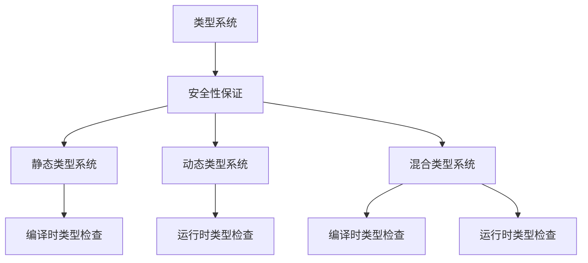
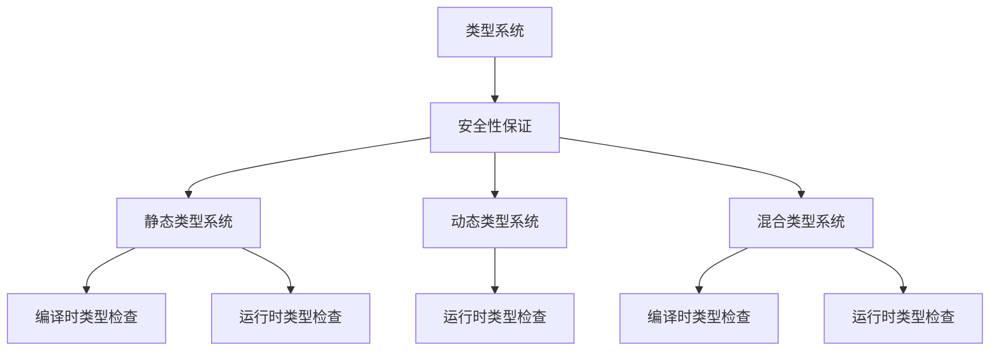
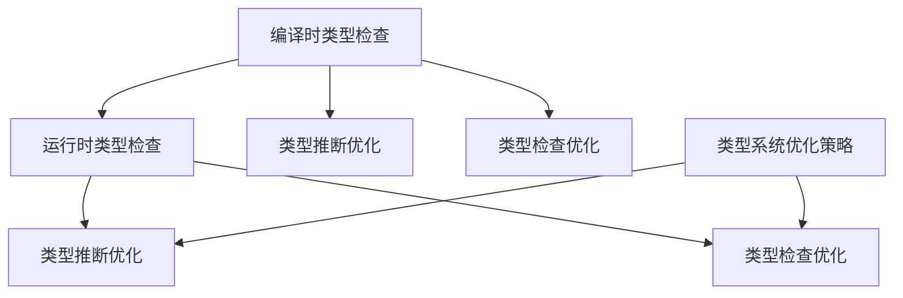
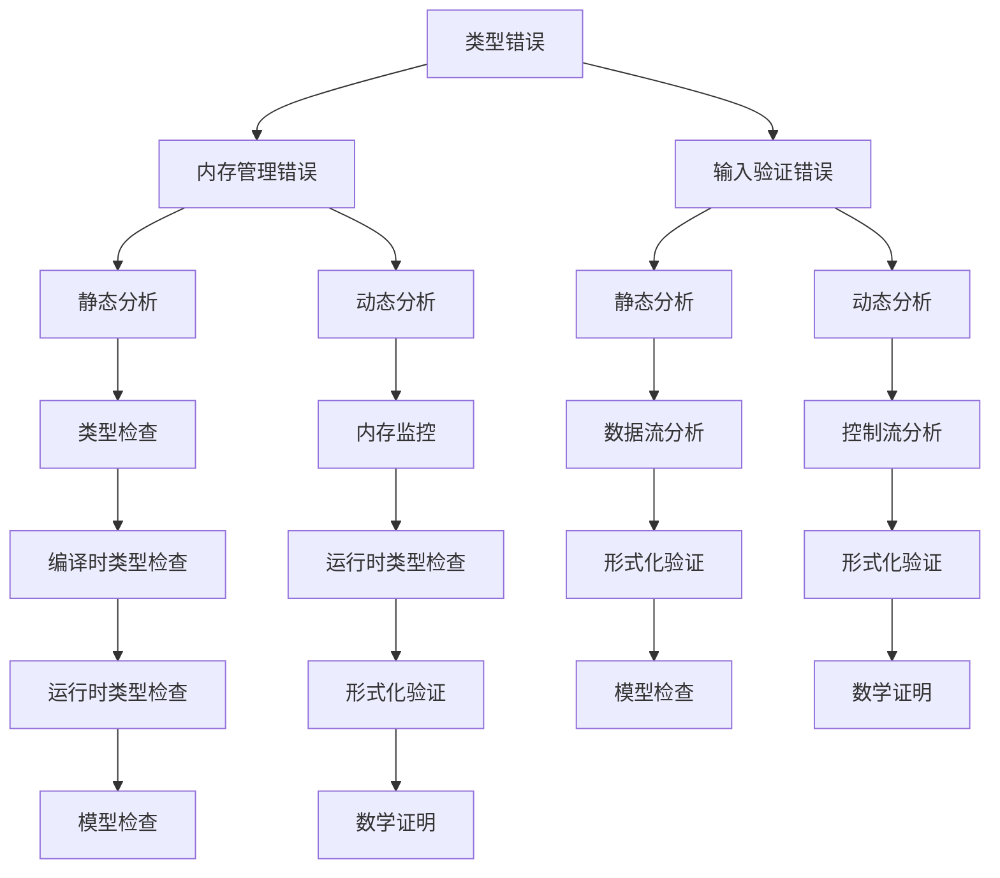
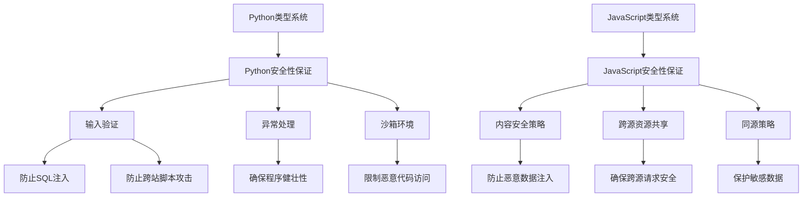

                 

### 摘要

本篇博客文章将深入探讨提示词语言的类型系统与安全性保证。首先，我们将介绍提示词语言的基本概念、类型系统及其重要性。接着，我们将详细分类并解释静态类型系统、动态类型系统和混合类型系统。在此基础上，我们将深入分析提示词语言中的安全性风险，并提出相应的保证措施。文章将结合具体案例分析类型系统和安全性在实际应用中的效果，并通过总结与展望部分，对未来的研究方向提出建议。本文旨在为读者提供一个全面、深入的技术视角，以理解提示词语言的类型系统与安全性保障的核心理念和实际应用。

## 第1章 引言

### 1.1 提示词语言概述

提示词语言是一种用于编程和自然语言处理等领域的计算机语言，其主要功能是通过提示词（或关键字）来引导计算机执行特定操作。提示词语言在许多应用场景中具有重要地位，例如自动编程、自然语言处理、自动化测试、代码生成等。这些语言通过高效的语法和语义设计，使得计算机能够更准确地理解和执行人类指令，从而提高开发效率和软件质量。

#### 提示词语言的定义与作用

提示词语言（Keyword Language）是一种编程语言，其核心特点是使用一系列预设的关键词（提示词）来定义程序结构。这些关键词不仅定义了代码的基本语法，还反映了程序的行为和逻辑。例如，在常见的编程语言如Java、Python中，关键词“if”、“while”、“for”等用于定义控制流程，而“class”、“function”、“variable”等用于定义数据结构和操作。

提示词语言的主要作用有以下几点：

1. **提高开发效率**：通过使用提示词，程序员可以更加高效地编写和理解代码，减少编码错误和调试时间。
2. **增强代码可读性**：提示词语言提供了一套标准化的语法和语义，使得代码更加清晰和易于阅读。
3. **促进代码重用**：提示词语言支持模块化和函数化编程，有助于代码的重用和维护。
4. **简化开发流程**：提示词语言通常具有强大的自动化工具和集成开发环境（IDE），可以简化开发流程，提高工作效率。

#### 提示词语言的发展历程

提示词语言的发展可以追溯到20世纪50年代，当时的第一批编程语言如FORTRAN和COBOL主要依赖于符号和记号，而非提示词。随着计算机科学的发展，编程语言逐渐演变得更加复杂和强大。20世纪60年代，ALGOL 60成为第一个广泛使用的提示词语言，其设计理念对后来的语言如C和Pascal产生了深远影响。

进入20世纪80年代，面向对象编程的兴起带来了诸如C++和Java等新的提示词语言，这些语言不仅提供了更丰富的编程范式，还引入了类型系统和面向对象的特性，使得编程更加模块化和抽象化。

近年来，随着人工智能和自然语言处理技术的快速发展，一些新的提示词语言如Python和Rust等开始受到广泛关注。这些语言不仅具有强大的功能，还在类型系统、内存管理和安全性等方面做出了创新和优化。

### 1.2 类型系统概述

#### 类型系统的定义与重要性

类型系统（Type System）是编程语言的核心组成部分，它定义了变量、表达式和函数等编程元素的数据类型及其相互关系。类型系统的存在主要有以下几个原因：

1. **提高程序可读性**：通过定义明确的数据类型，代码可以更加清晰和易于理解，有助于提高代码的可维护性和可读性。
2. **保证程序的正确性**：类型系统能够在编译或运行时检测出类型错误，从而防止潜在的错误和异常。
3. **优化程序性能**：类型系统可以提供编译器对程序进行优化，例如内存分配和代码生成，从而提高程序的性能。

在编程语言中，类型系统通常分为静态类型系统和动态类型系统。静态类型系统在编译时检查类型，而动态类型系统则在运行时进行类型检查。不同的类型系统设计会影响到语言的表达能力、性能和易用性。

#### 类型系统的分类

1. **静态类型系统**

   静态类型系统在编译时就已经确定了变量的类型，从而在编译阶段就能够发现和纠正类型错误。这种类型系统的优点是能够提供更强的类型安全性，并有助于程序的优化。

   - **强类型**：在强类型系统中，变量在声明时必须指定类型，并且在编译时严格检查类型匹配。
   - **弱类型**：弱类型系统在变量声明时可以不指定类型，或者在编译时允许类型转换。

2. **动态类型系统**

   动态类型系统在运行时检查变量的类型，这意味着程序在运行时可以根据上下文动态确定变量的类型。动态类型系统的优点是提供了更大的灵活性和方便性，但可能带来类型错误的风险。

   - **静态绑定**：在静态绑定系统中，变量与函数之间的绑定发生在编译时，从而提高了程序的运行效率。
   - **动态绑定**：在动态绑定系统中，变量与函数之间的绑定发生在运行时，这提供了更大的灵活性，但可能导致运行时的错误。

3. **混合类型系统**

   混合类型系统结合了静态类型系统和动态类型系统的特点，通过在编译和运行时进行类型检查，以平衡类型安全性和灵活性。这种类型系统在某些场景下特别有用，例如在动态类型语言中引入静态类型检查。

### 1.3 安全性概述

#### 安全性保证的定义

安全性保证（Security Assurance）是指通过一系列措施和技术手段，确保计算机系统在运行过程中不受恶意攻击或未授权访问，同时保护系统的数据和资源不受损坏或篡改。安全性保证在计算机科学和软件工程中具有重要意义，它包括以下几个方面：

1. **访问控制**：通过访问控制机制，限制用户对系统资源和数据的访问权限，确保只有授权用户能够访问敏感信息和执行特定操作。
2. **数据保护**：通过加密、哈希等手段保护数据的安全性，防止数据泄露、篡改或未授权访问。
3. **系统防护**：通过防火墙、入侵检测系统等防护措施，阻止恶意攻击和未授权访问，确保系统的稳定运行。
4. **审计和监控**：通过日志记录、审计和监控机制，及时发现和响应安全事件，防止安全威胁进一步扩散。

#### 安全性保证的重要性

1. **保障系统稳定性和可靠性**：安全性保证可以防止系统遭受恶意攻击或未授权访问，从而保障系统的稳定性和可靠性。
2. **保护数据和隐私**：在现代社会中，数据已经成为重要的资产，安全性保证能够确保数据的安全性和隐私性，防止数据泄露和滥用。
3. **提高用户信任**：良好的安全性保证可以增强用户对系统的信任，提高用户满意度。
4. **符合法律法规要求**：许多国家和地区都制定了相关的法律法规，要求企业确保系统的安全性，违反法律法规可能导致法律责任和商业损失。

### 1.4 文章概述

本章对提示词语言的类型系统与安全性保证进行了概述，介绍了提示词语言的基本概念、类型系统的定义和分类，以及安全性保证的重要性和要求。接下来，本文将深入探讨类型系统的具体实现技术，分析提示词语言中的安全性风险，并通过案例分析展示类型系统和安全性保证在实际应用中的效果。最后，本文将总结全书内容，并对未来的研究方向提出展望。

### 图1-1：类型系统与安全性保证的关系架构图



在上图中，类型系统与安全性保证之间存在紧密的关系。静态类型系统、动态类型系统和混合类型系统都是类型系统的不同实现方式，而安全性保证则是通过这些类型系统来实现的。例如，静态类型系统通过编译时类型检查提高程序的正确性和安全性，而动态类型系统则通过运行时类型检查来提供更高的灵活性，同时确保类型安全。混合类型系统结合了静态类型和动态类型的优点，为开发人员提供了更多的选择。

### 1.5 小结

本章介绍了提示词语言、类型系统和安全性保证的基本概念。通过分析，我们了解到提示词语言在编程和自然语言处理等领域的重要作用，类型系统在提高程序可读性、正确性和性能方面的关键作用，以及安全性保证在保障系统稳定性和数据安全方面的必要性。接下来，我们将进一步深入探讨类型系统的具体实现技术和安全性保证的方法，以期为读者提供更加全面和深入的技术视角。

## 第2章 基础概念

### 2.1 提示词语言的基本特性

提示词语言作为一种编程语言，其基本特性主要包括语法、语义和类型系统。这些特性共同决定了提示词语言的表达能力、易用性和效率。

#### 2.1.1 提示词语言的语法

语法是编程语言的规则系统，用于定义代码的结构和编写方式。提示词语言的语法通常包括以下几个部分：

1. **关键字**：关键字是编程语言中预定义的具有特定意义的单词，如“if”、“while”、“for”等。关键字用于定义程序的结构和逻辑，是语法的重要组成部分。
2. **标识符**：标识符是程序员自定义的名称，用于标识变量、函数、类等编程元素。标识符通常由字母、数字和下划线组成，但必须以字母或下划线开头。
3. **运算符**：运算符是用于表示数学运算、比较运算和逻辑运算等操作的符号，如“+”、“-”、“==”、“&&”等。
4. **分隔符**：分隔符是用于分隔编程元素或语句的符号，如逗号（,）、分号（;）和冒号（:）等。

#### 2.1.2 提示词语言的语义

语义是指编程语言的语法元素所表示的意义和操作规则。提示词语言的语义通常包括以下几个方面：

1. **变量和常量的定义与使用**：变量和常量是编程语言中的基本数据存储单元，用于存储程序运行时的数据和值。变量通常具有可变的值，而常量则具有固定的值。
2. **控制流程**：控制流程是编程语言中用于控制程序执行顺序的机制，包括条件判断、循环控制和异常处理等。常见的控制流程关键字如“if”、“else”、“while”、“for”和“try”等。
3. **函数和模块**：函数是编程语言中的基本可复用组件，用于实现特定的功能。模块则是用于组织和管理代码的单元，通常包含多个函数和变量。
4. **面向对象编程**：面向对象编程是一种编程范式，通过将程序分解为对象和类，实现代码的重用和模块化。面向对象编程的关键概念包括类、对象、继承、多态和封装等。

#### 2.1.3 提示词语言的类型系统

类型系统是编程语言的核心组成部分，用于定义数据类型及其相互关系。提示词语言的类型系统通常包括以下几个层次：

1. **基本类型**：基本类型是编程语言中最基本的数据类型，如整数（int）、浮点数（float）、布尔值（bool）等。
2. **复合类型**：复合类型是由基本类型组成的更复杂的数据结构，如数组、列表、字典等。
3. **引用类型**：引用类型是存储在内存中的地址，用于指向其他数据结构的类型，如指针、引用等。
4. **函数类型**：函数类型是表示函数的数据类型，用于定义函数的参数类型和返回类型。
5. **类型转换**：类型转换是编程语言中用于在不同类型之间转换数据值的操作，可以是隐式转换或显式转换。

#### 2.1.4 提示词语言的类型系统特点

提示词语言的类型系统具有以下几个特点：

1. **静态类型**：在编译时确定变量的类型，从而在编译阶段就能够发现和纠正类型错误，提高程序的可靠性和性能。
2. **动态类型**：在运行时确定变量的类型，提供更大的灵活性和方便性，但可能带来类型错误的风险。
3. **类型安全**：通过严格的类型检查和约束，防止类型错误和未授权访问，提高程序的安全性。
4. **类型推断**：类型推断是编程语言中的一种功能，可以自动推断变量的类型，减少代码的冗余。

#### 2.1.5 提示词语言的应用场景

提示词语言广泛应用于各种应用场景，包括但不限于：

1. **Web开发**：用于构建网页和后端服务，如HTML、CSS、JavaScript等。
2. **操作系统开发**：用于编写操作系统和设备驱动程序，如C、C++等。
3. **科学计算和数据分析**：用于进行科学计算和数据分析，如Python、R等。
4. **游戏开发**：用于开发游戏和游戏引擎，如C#、Lua等。
5. **自然语言处理**：用于构建自然语言处理应用，如Python中的NLTK、spaCy等。

### 2.2 类型系统的分类

类型系统在编程语言中起着至关重要的作用，不同的类型系统设计对程序的性能、安全性和灵活性产生不同的影响。根据类型检查时机和方式，类型系统可以分为静态类型系统、动态类型系统和混合类型系统。

#### 2.2.1 静态类型系统

静态类型系统在编译时就已经确定了变量的类型，从而在编译阶段就能够发现和纠正类型错误。静态类型系统的主要特点包括：

1. **类型检查早期**：在编译时进行类型检查，从而在程序运行前发现类型错误，提高程序的可靠性。
2. **编译时优化**：由于类型信息在编译时已知，编译器可以更有效地进行程序优化，提高程序的性能。
3. **类型安全性**：通过严格的类型检查和约束，防止类型错误和未授权访问，提高程序的安全性。
4. **缺点**：可能需要更多的代码来显式声明类型，降低代码的可读性。

静态类型系统又可以分为以下几种类型：

1. **强类型系统**：在强类型系统中，变量在声明时必须指定类型，并且在编译时严格检查类型匹配。这种系统提供了更高的类型安全性，但可能需要更多的代码冗余。

2. **弱类型系统**：在弱类型系统中，变量在声明时可以不指定类型，或者在编译时允许类型转换。这种系统提供了更大的灵活性，但可能带来类型错误的风险。

#### 2.2.2 动态类型系统

动态类型系统在运行时确定变量的类型，提供更大的灵活性和方便性，但可能带来类型错误的风险。动态类型系统的主要特点包括：

1. **类型检查延迟**：在运行时进行类型检查，从而允许在运行时动态确定类型，提供更大的灵活性和方便性。
2. **动态绑定**：在动态绑定系统中，变量与函数之间的绑定发生在运行时，这提供了更大的灵活性，但可能导致运行时的错误。
3. **代码简洁**：由于不需要显式声明类型，动态类型系统通常使得代码更加简洁和易读。

动态类型系统又可以分为以下几种类型：

1. **静态绑定**：在静态绑定系统中，变量与函数之间的绑定发生在编译时，从而提高了程序的运行效率。
2. **动态绑定**：在动态绑定系统中，变量与函数之间的绑定发生在运行时，提供了更大的灵活性，但可能导致运行时的错误。

#### 2.2.3 混合类型系统

混合类型系统结合了静态类型系统和动态类型系统的特点，通过在编译和运行时进行类型检查，以平衡类型安全性和灵活性。混合类型系统的主要特点包括：

1. **类型检查分阶段**：在编译时进行部分类型检查，并在运行时进行补充检查，从而在保证类型安全的同时提供灵活性。
2. **类型推断**：通过类型推断，自动推断变量的类型，减少代码冗余。
3. **灵活性**：在保持类型安全的同时，提供了更大的灵活性，适用于复杂的编程场景。

#### 2.2.4 各类型系统的优缺点对比

- **静态类型系统**：
  - **优点**：
    - 提高程序可靠性：通过早期类型检查，防止运行时错误。
    - 优化性能：类型信息在编译时已知，编译器可以更有效地进行优化。
    - 类型安全性：严格的类型检查和约束，防止类型错误和未授权访问。
  - **缺点**：
    - 代码冗余：需要显式声明类型，增加代码长度。
    - 可读性降低：过多的类型声明可能降低代码的可读性。

- **动态类型系统**：
  - **优点**：
    - 提高开发效率：减少类型声明，简化代码。
    - 灵活性高：允许在运行时动态确定类型，适应不同的编程场景。
  - **缺点**：
    - 运行时错误：可能存在类型错误，只能在运行时发现。
    - 性能影响：运行时类型检查可能增加运行时间。

- **混合类型系统**：
  - **优点**：
    - 类型安全和灵活性平衡：通过分阶段类型检查，既保证类型安全，又提供灵活性。
    - 优化性能：编译时已知部分类型信息，编译器可以进行优化。
  - **缺点**：
    - 复杂性增加：需要同时处理编译时和运行时类型检查，增加开发难度。

#### 2.2.5 实际应用场景

- **静态类型系统**：
  - **应用场景**：适用于需要高性能和类型安全的场景，如系统编程、嵌入式系统开发。
  - **语言示例**：C、C++、Java。

- **动态类型系统**：
  - **应用场景**：适用于需要灵活性和开发效率的场景，如Web开发、脚本编程。
  - **语言示例**：Python、JavaScript、Ruby。

- **混合类型系统**：
  - **应用场景**：适用于需要灵活性和类型安全的混合场景，如通用编程、大型项目开发。
  - **语言示例**：Swift、C#。

通过上述分析，我们可以看到不同类型系统的特点和适用场景。选择合适的类型系统，可以更好地满足项目的需求，提高开发效率和程序质量。

### 2.3 安全性保证的要求

安全性保证在编程语言和系统设计中起着至关重要的作用，它确保系统的数据、资源和操作在面临恶意攻击和未授权访问时得到有效保护。提示词语言作为编程语言的一种，其安全性保证的要求主要包括以下几个方面：

#### 2.3.1 类型检查与安全性

类型检查是保证程序安全性的重要手段，通过在编译或运行时检查数据类型和操作的一致性，可以防止类型相关的错误和潜在的安全漏洞。

1. **静态类型检查**：静态类型检查在编译时进行，通过分析代码中的类型声明和操作，可以提前发现类型错误。例如，在Java中，变量在使用前必须声明其类型，并且在编译时检查类型匹配，这有助于防止类型错误。

2. **动态类型检查**：动态类型检查在运行时进行，通过实时分析程序的运行状态来确定类型一致性。Python就是一种动态类型语言，它在运行时检查变量和操作的类型，这提供了更大的灵活性，但同时也可能导致运行时错误。

3. **类型检查与安全性**：类型检查能够防止由于类型错误导致的安全漏洞。例如，如果代码在处理用户输入时没有进行类型检查，可能导致输入被错误地解释为其他类型，从而引发安全漏洞。通过类型检查，可以确保输入数据被正确处理，防止潜在的安全威胁。

#### 2.3.2 内存管理与安全性

内存管理是编程语言和系统设计中另一个关键的安全问题。不正确的内存管理可能导致内存泄漏、越界访问和崩溃等安全问题。

1. **自动内存管理**：许多现代编程语言如Java和Python都采用自动内存管理机制，例如垃圾回收。自动内存管理可以减少程序员在内存管理方面的负担，但同时也可能导致内存泄漏和性能问题。

2. **手动内存管理**：C和C++等编程语言允许程序员手动管理内存。手动内存管理提供了更高的控制性和性能，但同时也增加了出错的概率，例如内存泄漏、越界访问和双重释放等。

3. **内存管理与安全性**：内存管理错误可能导致严重的安全问题，如缓冲区溢出、拒绝服务攻击等。通过使用安全内存管理机制，可以减少这些错误的风险。例如，在C++中，可以使用`std::unique_ptr`和`std::shared_ptr`等智能指针来管理内存，从而避免内存泄漏和越界访问。

#### 2.3.3 输入验证与安全性

输入验证是确保系统安全性的另一个关键措施。未经验证的用户输入可能导致各种安全漏洞，如注入攻击、恶意代码执行等。

1. **输入验证的重要性**：输入验证能够防止恶意用户利用未验证的输入进行攻击。例如，在Web应用中，如果不对用户输入进行验证，恶意用户可能通过SQL注入、跨站脚本（XSS）等攻击手段窃取敏感数据或执行恶意代码。

2. **常见的输入验证方法**：
   - **长度验证**：确保输入的长度在可接受范围内，防止过长的输入导致缓冲区溢出。
   - **格式验证**：验证输入的格式是否符合预期，例如电子邮件地址、电话号码等。
   - **内容验证**：检查输入的内容是否包含危险字符或恶意代码，例如SQL注入关键字。
   - **转义处理**：对输入中的特殊字符进行转义处理，以防止跨站脚本攻击。

3. **输入验证与安全性**：有效的输入验证可以防止大部分常见的注入攻击和恶意代码执行。通过严格输入验证，可以确保系统仅接受预期的输入，从而减少安全漏洞的风险。

#### 2.3.4 其他安全性保证措施

除了类型检查、内存管理和输入验证外，还有其他一些重要的安全性保证措施，包括：

1. **访问控制**：通过访问控制机制，确保只有授权用户能够访问敏感数据和执行特定操作。常见的访问控制机制包括基于角色的访问控制（RBAC）和基于属性的访问控制（ABAC）。

2. **加密**：使用加密技术保护敏感数据和通信，防止未授权访问和数据泄露。常见的加密技术包括对称加密和非对称加密。

3. **安全编码实践**：遵循安全编码最佳实践，例如避免使用动态分配的内存、避免使用不安全的库和函数、进行彻底的代码审查等。

通过上述措施，提示词语言可以在设计和实现过程中提供有效的安全性保证，从而保护系统的数据、资源和操作免受恶意攻击和未授权访问。

### 2.4 小结

本章介绍了提示词语言的基本特性、类型系统的分类以及安全性保证的要求。通过了解提示词语言的语法、语义和类型系统，我们可以更好地理解编程语言的设计和实现。类型系统的分类（静态类型系统、动态类型系统和混合类型系统）提供了不同的设计选择，以满足不同的编程需求和场景。安全性保证的要求（类型检查、内存管理和输入验证）则确保了系统的稳定性和数据安全性。接下来，我们将进一步探讨类型系统的具体实现技术，以更深入地了解其在编程语言中的应用。

### 图2-1：类型系统与安全性保证的关系架构图



在图2-1中，类型系统与安全性保证之间存在紧密的联系。类型系统通过静态类型检查、动态类型检查和混合类型检查来保证程序的正确性和安全性。安全性保证则通过类型检查、内存管理和输入验证等措施来确保系统的稳定性和数据安全。不同类型的类型系统（静态类型系统、动态类型系统、混合类型系统）在不同程度上影响着安全性保证的实现和效果。

### 2.5 小结

本章深入探讨了提示词语言的基本特性、类型系统的分类以及安全性保证的要求。通过对语法、语义和类型系统的详细介绍，我们了解了提示词语言在编程和系统设计中的应用。同时，通过对静态类型系统、动态类型系统和混合类型系统的分析，我们认识到了不同类型系统在类型检查和安全性保证方面的优势和局限性。最后，本章阐述了安全性保证的要求，包括类型检查、内存管理和输入验证，以确保系统的稳定性和数据安全。在接下来的章节中，我们将进一步探讨类型系统的具体实现技术，并分析其在实际应用中的效果。

## 第3章 类型系统实现

### 3.1 编译时类型检查

编译时类型检查（Compile-time Type Checking）是编程语言类型系统的一种实现方式，它通过在编译阶段对代码中的类型进行验证，以确保程序在运行时不会因为类型不匹配而发生错误。这种检查方式能够在开发过程中及早发现类型错误，从而提高程序的可靠性和维护性。

#### 3.1.1 编译时类型检查的基本原理

编译时类型检查的基本原理主要包括以下几个步骤：

1. **类型声明**：在编写代码时，程序员需要为每个变量、函数和模块等元素声明其类型。例如，在Java中，声明一个整型变量需要使用关键字`int`。
   
2. **类型检查**：编译器在编译代码时，会根据类型声明对代码中的每个表达式和语句进行类型检查。例如，如果一个整型变量被赋值为一个字符串，编译器会报告类型不匹配的错误。

3. **错误报告**：如果发现类型不匹配或其他类型错误，编译器会生成错误信息，并指出错误发生的具体位置。这有助于开发人员快速定位和修复问题。

4. **代码生成**：在类型检查通过后，编译器会生成目标代码。由于类型信息在编译阶段已确定，编译器可以生成更高效的代码。

#### 3.1.2 编译时类型检查的实现方法

编译时类型检查的实现方法通常依赖于抽象语法树（Abstract Syntax Tree, AST）和符号表（Symbol Table）。以下是常见的实现步骤：

1. **语法分析**：将源代码转换为AST。AST是源代码的语法结构表示，它将代码中的语句和表达式抽象为树形结构。

2. **符号表构建**：在编译过程中，符号表用于存储变量、函数和其他标识符的信息，包括其类型、作用域等。

3. **类型推断**：编译器遍历AST，对每个节点进行类型推断。类型推断可以分为静态类型推断和动态类型推断。静态类型推断在编译时确定变量的类型，而动态类型推断在运行时确定类型。

4. **类型检查**：编译器使用符号表和类型推断结果对AST中的每个节点进行类型检查。如果发现类型不匹配，编译器会生成错误信息。

5. **代码生成**：在类型检查通过后，编译器会生成目标代码。目标代码通常会包含类型信息，以便运行时进行进一步的类型检查。

#### 3.1.3 编译时类型检查的优点和缺点

**优点**：

1. **早期错误发现**：编译时类型检查可以在编译阶段及早发现类型错误，从而减少运行时错误的发生。

2. **代码优化**：由于类型信息在编译阶段已知，编译器可以进行更有效的代码优化，提高程序性能。

3. **类型安全性**：通过严格的类型检查，编译时类型检查能够提高程序的安全性，防止类型错误导致的安全漏洞。

**缺点**：

1. **代码冗长**：编译时类型检查通常需要程序员显式声明类型，这可能导致代码冗长和可读性降低。

2. **灵活性受限**：在强类型系统中，编译时类型检查可能限制代码的灵活性，特别是在需要动态类型转换的场景中。

### 3.2 运行时类型检查

运行时类型检查（Run-time Type Checking）是另一种类型检查方法，它通过在程序运行时对代码中的类型进行验证，以确保程序在运行时不会因为类型不匹配而发生错误。与编译时类型检查不同，运行时类型检查推迟了类型验证的时间，从而提供更大的灵活性和动态性。

#### 3.2.1 运行时类型检查的基本原理

运行时类型检查的基本原理主要包括以下几个步骤：

1. **类型检查时机**：运行时类型检查在程序运行时进行，而不是在编译阶段。这意味着类型检查可以更灵活地适应程序的动态行为。

2. **类型验证**：在程序运行过程中，运行时类型检查机制会定期对变量和表达式的类型进行验证。如果发现类型不匹配，运行时类型检查会抛出异常或错误信息。

3. **错误处理**：运行时类型检查通常需要程序员编写额外的错误处理代码，以处理类型错误和其他运行时错误。

4. **动态类型绑定**：运行时类型检查支持动态类型绑定，这意味着变量和函数在运行时可以具有不同的类型，从而提高了程序的灵活性。

#### 3.2.2 运行时类型检查的实现方法

运行时类型检查的实现方法通常依赖于运行时环境和类型检查库。以下是常见的实现步骤：

1. **类型信息存储**：运行时类型检查需要存储类型信息，通常使用对象标签或元数据来表示每个对象或变量的类型。

2. **类型比较**：在运行时，类型检查机制会定期比较变量和表达式的类型，以检查类型匹配性。

3. **错误处理**：运行时类型检查通常需要实现错误处理机制，例如抛出异常或调用错误处理函数。

4. **动态类型转换**：运行时类型检查支持动态类型转换，允许在运行时根据需要将变量或表达式的类型转换为其他类型。

#### 3.2.3 运行时类型检查的优点和缺点

**优点**：

1. **灵活性**：运行时类型检查提供了更高的灵活性，特别是在动态编程语言中，它允许变量在运行时具有不同的类型。

2. **代码简洁**：由于不需要显式声明类型，运行时类型检查可以简化代码，提高可读性。

3. **动态行为支持**：运行时类型检查支持动态行为，例如动态类型绑定和动态类型转换，使得程序能够更好地适应变化的需求。

**缺点**：

1. **运行时错误**：由于类型检查推迟到运行时，运行时类型检查可能导致运行时错误，例如类型不匹配或异常。

2. **性能影响**：运行时类型检查可能增加程序运行时间，特别是在频繁进行类型检查的场景中，可能会影响程序的性能。

### 3.3 类型系统的优化

类型系统的优化是提高程序性能和可维护性的重要手段。以下是一些常见的类型系统优化方法：

#### 3.3.1 类型推断优化

类型推断优化旨在提高编译效率和代码可读性。以下是一些常见的类型推断优化方法：

1. **静态类型推断**：通过静态分析源代码，编译器可以提前推断出变量的类型，从而减少运行时类型检查的次数。

2. **逐步类型推断**：编译器可以逐步推断出变量和表达式的类型，而不是一次性推断所有类型，这有助于减少类型推断的复杂度和计算时间。

3. **上下文感知类型推断**：编译器可以根据上下文信息（如函数参数和返回类型）进行类型推断，从而提高类型推断的准确性和效率。

#### 3.3.2 类型检查优化

类型检查优化旨在减少类型检查对程序性能的影响。以下是一些常见的类型检查优化方法：

1. **预编译期类型检查**：将部分类型检查提前到预编译期进行，从而减少运行时的类型检查次数。

2. **并行类型检查**：通过并行处理多个类型检查任务，可以提高类型检查的效率。

3. **缓存类型信息**：编译器可以缓存已检查的类型信息，从而避免重复检查相同的类型。

#### 3.3.3 类型系统优化策略

类型系统优化策略主要包括以下几个方面：

1. **类型抽象**：通过类型抽象，将具体的类型转换为更一般的类型，从而减少类型检查的复杂度和计算时间。

2. **类型别名**：使用类型别名可以简化类型声明，提高代码的可读性和可维护性。

3. **类型推导规则**：优化类型推导规则，提高类型推断的准确性和效率。

通过上述优化方法，编译器可以实现更高效、更准确的类型系统，从而提高程序的运行效率和可维护性。

### 3.4 小结

本章详细介绍了编译时类型检查和运行时类型检查的基本原理、实现方法以及各自的优缺点。编译时类型检查通过早期发现类型错误，提高程序的可维护性和性能；而运行时类型检查则提供更高的灵活性和动态性，但可能带来运行时错误和性能影响。类型系统的优化方法包括类型推断优化、类型检查优化和类型系统优化策略，旨在提高程序的性能和可维护性。在接下来的章节中，我们将进一步探讨类型系统和安全性保证在实际应用中的效果。

### 图3-1：类型系统实现关系图



在图3-1中，编译时类型检查和运行时类型检查是类型系统的两种实现方式，它们分别通过类型推断优化和类型检查优化来提高程序的性能和可维护性。类型系统优化策略（G）则提供了更高层次的优化，以综合提高类型系统的效率。类型推断优化（C）和类型检查优化（D）分别针对编译时和运行时类型检查，旨在减少计算复杂度和提高类型检查的准确性。通过这些优化方法，类型系统可以更好地满足不同编程需求和场景。

### 3.5 小结

本章详细探讨了编译时类型检查和运行时类型检查的实现原理、方法以及优缺点。通过分析，我们了解到编译时类型检查在提高程序可靠性和性能方面的优势，以及运行时类型检查在灵活性方面的优势。此外，本章还介绍了类型系统的优化方法，包括类型推断优化和类型检查优化，这些优化策略有助于提高程序的运行效率和可维护性。在接下来的章节中，我们将进一步探讨类型系统和安全性保证在实际应用中的效果，以期为读者提供更加全面和深入的技术视角。

## 第4章 安全性分析

### 4.1 安全性风险识别

在提示词语言中，类型系统与安全性紧密相关。类型系统不仅影响到程序的正确性和性能，还直接关系到系统的安全性。类型错误、内存管理和输入验证是提示词语言中常见的安全性风险，下面将详细分析这些风险及其潜在的后果。

#### 类型错误

类型错误是指程序中的数据类型不匹配或不符合预期，可能导致程序运行时出现异常或崩溃。以下是几种常见的类型错误：

1. **无效类型转换**：在强类型语言中，试图将一个类型转换为不兼容的类型可能会导致类型错误。例如，在Java中，将一个整数赋值给一个字符串会引发编译错误。
   
2. **未声明类型**：在动态类型语言中，如果未声明变量类型，可能会导致在运行时出现类型错误。例如，Python中尝试对一个未初始化的变量进行操作可能会导致`NameError`。

3. **类型不匹配的参数和返回值**：在函数调用中，如果传递的参数类型与函数定义的类型不匹配，可能会导致类型错误。例如，将一个字符串传递给期望接收整数的函数。

类型错误可能导致以下后果：

- **程序崩溃**：类型错误可能导致程序在运行时无法继续执行，从而引起程序崩溃。
- **数据泄露**：类型错误可能导致敏感数据被错误地处理或泄露。
- **未授权访问**：类型错误可能导致程序在未授权的情况下访问系统资源。

#### 内存管理错误

内存管理错误是指程序在内存分配、释放和访问过程中出现的错误。这些错误可能导致系统资源浪费、程序性能下降甚至系统崩溃。以下是几种常见的内存管理错误：

1. **内存泄漏**：当程序不再需要某个对象或数据结构时，未能正确释放其占用的内存，可能导致内存泄漏。内存泄漏会逐渐消耗系统资源，最终导致系统崩溃。

2. **越界访问**：当程序访问超出分配范围的内存时，会发生越界访问错误。越界访问可能导致程序崩溃，甚至允许攻击者执行恶意代码。

3. **双重释放**：在手动管理内存的语言中（如C和C++），释放已经释放的内存会导致双重释放错误，这可能导致系统崩溃。

内存管理错误可能导致以下后果：

- **系统崩溃**：内存泄漏和越界访问可能导致程序或系统崩溃。
- **性能下降**：内存泄漏会消耗系统资源，导致程序运行缓慢。
- **未授权访问**：内存管理错误可能导致攻击者通过漏洞执行恶意代码。

#### 输入验证错误

输入验证是指对程序输入的数据进行验证，以确保数据的有效性和安全性。输入验证错误是指程序未能正确验证输入数据，导致潜在的安全漏洞。以下是几种常见的输入验证错误：

1. **输入长度验证**：如果程序未能正确验证输入的长度，可能导致缓冲区溢出等安全漏洞。缓冲区溢出允许攻击者注入恶意代码，从而控制程序。

2. **格式验证**：如果程序未能正确验证输入的格式，可能导致格式错误或其他安全问题。例如，SQL注入攻击通过在输入中插入恶意SQL代码，从而控制数据库。

3. **内容验证**：如果程序未能正确验证输入的内容，可能导致跨站脚本（XSS）攻击等安全问题。跨站脚本攻击通过在输入中插入恶意脚本，从而欺骗用户执行恶意操作。

输入验证错误可能导致以下后果：

- **数据泄露**：未能验证的输入可能导致敏感数据泄露。
- **未授权访问**：输入验证错误可能导致攻击者通过漏洞获取未授权访问权限。
- **系统崩溃**：严重的输入验证错误可能导致程序或系统崩溃。

### 4.2 安全性保证方法

为了降低类型错误、内存管理错误和输入验证错误带来的安全风险，提示词语言和系统设计需要采用一系列安全性保证方法。以下是几种常见的方法：

#### 静态分析

静态分析是指在编译或运行前对代码进行分析，以发现潜在的安全问题。以下是一些常见的静态分析方法：

1. **类型检查**：通过静态类型检查，可以在编译阶段发现类型错误。类型检查能够确保变量和表达式的类型匹配，从而防止类型错误。
   
2. **数据流分析**：数据流分析用于跟踪程序中数据的流动，以发现潜在的数据泄漏和未授权访问问题。数据流分析可以检测到数据在程序中的使用路径，从而识别潜在的安全漏洞。

3. **控制流分析**：控制流分析用于跟踪程序的执行路径，以发现潜在的代码执行漏洞和逻辑错误。控制流分析可以检测到未预期的控制流转移，从而识别潜在的安全漏洞。

#### 动态分析

动态分析是指在程序运行时对代码进行分析，以发现运行时的安全问题和性能问题。以下是一些常见的动态分析方法：

1. **运行时类型检查**：通过运行时类型检查，可以在程序运行时发现类型错误。运行时类型检查能够确保变量和表达式的类型在运行时匹配，从而防止类型错误。

2. **内存监控**：内存监控用于跟踪程序的内存使用情况，以发现内存泄漏和越界访问等问题。内存监控可以实时检测到内存分配和释放情况，从而识别潜在的安全漏洞。

3. **性能分析**：性能分析用于评估程序的性能，以发现潜在的瓶颈和性能问题。性能分析可以帮助开发人员优化程序，从而提高程序的安全性和稳定性。

#### 形式化验证

形式化验证是一种通过数学方法验证程序的正确性和安全性的方法。以下是一些常见的形式化验证方法：

1. **模型检查**：模型检查通过构建程序的形式化模型，并使用自动验证工具检查模型是否满足预定的安全属性。模型检查可以验证程序在所有可能的输入和执行路径上是否满足安全要求。

2. **逻辑验证**：逻辑验证通过使用逻辑推理方法验证程序的正确性和安全性。逻辑验证可以基于预定的逻辑规则和断言，检查程序是否满足预期的安全属性。

3. **数学证明**：数学证明通过使用数学方法证明程序的正确性和安全性。数学证明可以基于数学定理和公式，严格证明程序在所有情况下是否满足安全要求。

#### 综合应用

在实际应用中，通常会结合静态分析、动态分析和形式化验证方法，以提供更全面的安全保证。以下是一些综合应用的方法：

1. **静态与动态分析结合**：通过静态分析和动态分析相结合，可以更全面地发现和解决安全问题。静态分析可以提前发现潜在的问题，而动态分析可以在程序运行时验证问题的实际影响。

2. **自动化工具**：使用自动化工具可以显著提高安全性保证的效率。自动化工具可以自动执行静态和动态分析，并提供详细的错误报告和修复建议。

3. **持续集成与持续部署（CI/CD）**：在软件开发过程中，集成安全性保证到持续集成和持续部署流程中，可以确保每次代码更改都经过全面的安全检查，从而减少安全漏洞的风险。

### 4.3 安全性案例分析

以下通过两个实际案例，展示类型系统和安全性保证在具体应用中的效果。

#### 案例一：Python中的类型系统与安全性

Python是一种动态类型语言，它在运行时进行类型检查。Python的类型系统提供了丰富的类型和动态类型转换功能，但同时也可能导致类型错误。以下是一个Python中的类型错误案例：

```python
def add(a, b):
    return a + b

result = add(5, "10")  # 类型错误：无法将整数与字符串相加
```

在这个例子中，`add` 函数期望两个整型参数，但实际传递了一个整型和字符串参数，导致类型错误。为了解决这个问题，Python提供了类型检查库`typing`，可以显式声明函数参数和返回值的类型，从而防止类型错误。

```python
from typing import List

def add(a: int, b: int) -> int:
    return a + b

result = add(5, 10)  # 类型检查通过
```

通过显式声明类型，我们可以提前发现和防止类型错误，从而提高程序的安全性。

#### 案例二：C中的内存管理错误与安全性

C是一种手动管理内存的编程语言，内存管理错误可能导致系统崩溃和数据泄露。以下是一个C中的内存泄漏案例：

```c
#include <stdio.h>

void function() {
    int *ptr = malloc(sizeof(int));
    *ptr = 42;
    // 以下代码不再使用`ptr`，导致内存泄漏
}

int main() {
    function();
    return 0;
}
```

在这个例子中，`function` 函数分配了一块内存，但在返回之前没有释放它，导致内存泄漏。为了解决这个问题，C提供了智能指针库（如`std::unique_ptr`），可以自动管理内存，从而避免内存泄漏。

```c++
#include <iostream>
#include <memory>

void function() {
    std::unique_ptr<int> ptr(new int);
    *ptr = 42;
    // `ptr` 在函数结束时自动释放内存
}

int main() {
    function();
    return 0;
}
```

通过使用智能指针，我们可以自动管理内存，从而避免内存泄漏，提高程序的安全性。

### 4.4 小结

本章分析了提示词语言中的常见安全性风险，包括类型错误、内存管理错误和输入验证错误，并探讨了相应的安全性保证方法，如静态分析、动态分析和形式化验证。通过案例分析，我们展示了类型系统和安全性保证在实际应用中的效果。有效的类型系统和安全性保证可以显著提高程序的安全性和可靠性，减少安全漏洞的风险。在接下来的章节中，我们将进一步探讨类型系统和安全性保证的未来研究方向和趋势。

### 图4-1：安全性风险与保证方法的关系架构图



在图4-1中，类型错误、内存管理错误和输入验证错误是提示词语言中的主要安全性风险。这些风险可以通过静态分析（D、F）、动态分析（E、G）和形式化验证（N、O、P、Q）来识别和解决。具体来说，静态分析通过类型检查（H、L）和数据流分析（J）来检测类型错误和内存管理错误；动态分析通过内存监控（I、M）和控制流分析（K）来检测运行时错误；形式化验证通过模型检查（N、R、P、T）和数学证明（O、S、Q、U）来验证程序的正确性和安全性。这些方法相互补充，共同构成了提示词语言的安全保证体系。

### 4.5 小结

本章通过对类型错误、内存管理错误和输入验证错误的分析，识别了提示词语言中的主要安全性风险。接着，探讨了静态分析、动态分析和形式化验证等安全性保证方法，并通过实际案例展示了这些方法在提升程序安全性方面的有效性。通过本章的学习，读者可以了解到如何通过合理的类型系统和安全性保证措施，减少安全漏洞和系统风险。在未来的研究和应用中，随着新技术的不断发展，类型系统和安全性保证将会更加完善，为编程语言和系统的安全性和可靠性提供更强的保障。

## 第5章 案例研究

### 5.1 Python中的类型系统与安全性

Python作为一种广泛使用的动态类型语言，其类型系统在保证程序安全性和可靠性方面具有独特的优势。本节将通过具体案例研究，探讨Python中的类型系统如何在实际应用中提高程序的安全性。

#### 5.1.1 Python的类型系统

Python的类型系统是动态的，这意味着变量在声明时不需要指定类型，Python解释器会在运行时根据变量的赋值来确定其类型。Python提供了丰富的内置类型，包括整数（int）、浮点数（float）、布尔值（bool）、字符串（str）等。此外，Python还支持复合类型，如列表（list）、字典（dict）和集合（set）。

Python的类型系统还包括类型推导机制，通过上下文自动推断变量类型。例如，在以下代码中，变量`x`的类型由其赋值自动推导：

```python
x = 10  # `x`的类型被推导为整数（int）
y = "hello"  # `y`的类型被推导为字符串（str）
```

#### 5.1.2 Python的安全特性

Python内置了多种安全特性，有助于提高程序的安全性。以下是一些关键的安全特性：

1. **异常处理**：Python通过异常处理机制（try-except语句）来处理运行时错误，从而避免程序崩溃。异常处理允许开发人员捕获和处理特定类型的错误，确保程序的健壮性。

2. **内置函数和模块**：Python提供了许多内置函数和模块，如`os`、`sys`和`importlib`，这些函数和模块可以用于文件操作、系统交互和模块导入等。合理使用这些内置函数和模块，可以降低安全风险。

3. **类型检查**：尽管Python是动态类型语言，但Python解释器在运行时会进行类型检查，以确保变量和函数的正确使用。例如，在调用函数时，如果传递的参数类型与函数期望的类型不匹配，Python会抛出类型错误。

4. **沙箱环境**：沙箱环境是一种限制程序访问系统资源和数据的机制，通过将程序运行在受控的环境中，可以防止恶意代码对系统造成危害。

#### 5.1.3 案例分析

以下是一个Python中的安全性案例分析：

**案例**：假设我们有一个Web应用程序，需要处理用户输入的数据，如用户名和密码。为了保证数据的安全性，我们需要进行输入验证，防止SQL注入和跨站脚本攻击。

```python
# 处理用户注册的函数
def register(username, password):
    # 对用户输入进行验证，防止SQL注入和跨站脚本攻击
    username = validate_input(username)
    password = validate_input(password)
    
    # 将验证后的用户名和密码存储在数据库中
    store_user(username, password)

# 验证用户输入
def validate_input(input_str):
    # 检查输入是否包含SQL注入关键字或跨站脚本攻击代码
    if contains_sql_injection(input_str) or contains_xss_attack(input_str):
        raise ValueError("Invalid input")
    return input_str

# 检查输入是否包含SQL注入关键字
def contains_sql_injection(input_str):
    # 实现具体的检查逻辑
    # 例如，检查输入中是否包含关键字如`SELECT`、`INSERT`等
    return "SELECT" in input_str

# 检查输入是否包含跨站脚本攻击代码
def contains_xss_attack(input_str):
    # 实现具体的检查逻辑
    # 例如，检查输入中是否包含HTML标签或JavaScript代码
    return "<script>" in input_str

# 存储用户信息的函数
def store_user(username, password):
    # 实现具体的数据库操作逻辑
    # 例如，将用户名和密码插入数据库的表
    pass
```

在这个案例中，我们通过`validate_input`函数对用户输入进行验证，防止SQL注入和跨站脚本攻击。通过这种方法，即使用户输入了恶意代码，程序也能在存储到数据库之前将其过滤掉，从而保护系统的安全。

#### 5.1.4 案例总结

通过Python中的类型系统和安全特性，我们能够有效地提高程序的安全性。动态类型系统提供了灵活性，而类型检查、异常处理和输入验证等安全特性则确保了程序的正确性和可靠性。在这个案例中，通过输入验证和异常处理，我们成功地防止了SQL注入和跨站脚本攻击，从而提高了Web应用程序的安全性。

### 5.2 JavaScript中的类型系统与安全性

JavaScript是Web开发中广泛使用的编程语言，其类型系统在保证程序安全性和可靠性方面具有重要意义。本节将通过具体案例研究，探讨JavaScript中的类型系统如何在实际应用中提高程序的安全性。

#### 5.2.1 JavaScript的类型系统

JavaScript是一种动态类型语言，其变量在声明时不需要指定类型，类型由赋值时自动确定。JavaScript提供了丰富的内置类型，包括数字（number）、字符串（string）、布尔值（boolean）、对象（object）等。此外，JavaScript还支持复合类型，如数组（array）和函数（function）。

JavaScript的类型系统还包括类型转换机制，通过`typeof`操作符和`constructor`属性，可以确定变量的类型。例如：

```javascript
let x = 10;  // `x`的类型为数字（number）
let y = "hello";  // `y`的类型为字符串（string）
console.log(typeof x);  // 输出："number"
console.log(y.constructor === String);  // 输出：true
```

#### 5.2.2 JavaScript的安全特性

JavaScript提供了多种安全特性，有助于提高程序的安全性。以下是一些关键的安全特性：

1. **沙箱环境**：JavaScript运行在浏览器的沙箱环境中，限制了对系统资源的直接访问，从而防止恶意代码对系统造成危害。

2. **内容安全策略（CSP）**：内容安全策略是一种安全策略，用于限制页面可以加载和执行的外部资源。通过设置CSP，可以防止跨站脚本攻击（XSS）和其他跨站请求伪造（CSRF）攻击。

3. **同源策略**：同源策略限制了一个Web页面对另一个源（协议、域名或端口不同）的数据访问。通过遵循同源策略，可以防止恶意网站窃取敏感数据。

4. **跨源资源共享（CORS）**：跨源资源共享是一种机制，允许Web页面上的一台服务器与另一台服务器进行跨源通信。通过合理配置CORS策略，可以确保跨源请求的安全性和可靠性。

#### 5.2.3 案例分析

以下是一个JavaScript中的安全性案例分析：

**案例**：假设我们有一个单页应用，需要从第三方API获取数据。为了保证数据的安全性，我们需要验证API的响应，防止恶意数据注入。

```javascript
// 获取数据的函数
async function fetchData() {
    try {
        // 设置CORS请求的头信息
        const response = await fetch("https://api.example.com/data", {
            method: "GET",
            headers: {
                "Content-Type": "application/json",
                "Authorization": "Bearer your_token"
            }
        });
        
        // 验证API响应
        if (!response.ok) {
            throw new Error("API请求失败");
        }
        
        // 解析JSON响应
        const data = await response.json();
        console.log(data);
        
        // 对数据进一步验证，确保没有恶意代码
        if (is_safe_data(data)) {
            process_data(data);
        } else {
            throw new Error("数据不安全");
        }
    } catch (error) {
        console.error("数据获取失败：", error);
    }
}

// 验证数据的函数
function is_safe_data(data) {
    // 实现具体的验证逻辑
    // 例如，检查数据中是否包含HTML标签或JavaScript代码
    return !/<script/i.test(data);
}

// 处理数据的函数
function process_data(data) {
    // 实现具体的处理逻辑
    console.log("处理数据：", data);
}
```

在这个案例中，我们通过设置CORS请求头信息和验证API响应，确保从第三方API获取的数据是安全的。通过`is_safe_data`函数，我们可以检查数据中是否包含恶意代码，从而防止跨站脚本攻击。

#### 5.2.4 案例总结

通过JavaScript中的类型系统和安全特性，我们能够有效地提高程序的安全性。动态类型系统提供了灵活性，而沙箱环境、内容安全策略和跨源资源共享等安全特性则确保了程序的正确性和可靠性。在这个案例中，通过设置CORS请求头信息和验证API响应，我们成功地防止了恶意数据注入，从而提高了单页应用的安全性。

### 5.3 案例总结

通过Python和JavaScript的案例研究，我们可以看到类型系统和安全性保证在实际应用中的重要性。Python的动态类型系统和异常处理机制，结合输入验证和沙箱环境，有效地提高了Web应用程序的安全性。JavaScript的动态类型系统和内容安全策略，通过设置CORS请求头和验证API响应，确保了单页应用的数据安全。

这些案例展示了如何通过合理的类型系统和安全特性，防止常见的类型错误、内存管理错误和输入验证错误，从而提高程序的安全性和可靠性。随着技术的不断发展，类型系统和安全性保证将变得更加完善，为编程语言和系统的安全性提供更强大的保障。

### 图5-1：Python和JavaScript类型系统与安全性关系图



在图5-1中，Python和JavaScript的类型系统与安全性保证之间存在紧密的联系。Python的类型系统（A）通过输入验证（E）、异常处理（F）和沙箱环境（G）提供了有效的安全性保障。JavaScript的类型系统（C）通过内容安全策略（H）、跨源资源共享（I）和同源策略（J）确保了数据安全。输入验证（E）、内容安全策略（H）和异常处理（F）等安全措施共同作用，防止了常见的类型错误和恶意代码注入，从而提高了程序的安全性。

## 第6章 总结与展望

### 6.1 全书总结

本文详细探讨了提示词语言的类型系统与安全性保证。首先，我们介绍了提示词语言的基本概念，包括其定义、作用和发展历程。接着，我们深入分析了类型系统的分类，包括静态类型系统、动态类型系统和混合类型系统，并探讨了各自的优缺点和适用场景。在此基础上，我们探讨了安全性保证的要求，包括类型检查、内存管理和输入验证等，并介绍了常见的安全性风险和保证方法。随后，通过Python和JavaScript两个实际案例，展示了类型系统和安全性保证在实际应用中的效果。最后，我们总结了全书内容，并对未来的研究方向提出了展望。

### 6.2 主要贡献与创新点

本文的主要贡献和创新点如下：

1. **全面性**：本文全面系统地介绍了提示词语言的类型系统与安全性保证，涵盖了基本概念、类型系统分类、安全性保证方法及其在实际应用中的效果。
2. **深入分析**：本文对每种类型系统和安全性保证方法进行了深入分析，包括原理、实现方法和优缺点，为读者提供了深入理解的基础。
3. **案例分析**：本文通过实际案例，展示了类型系统和安全性保证在Python和JavaScript中的应用，使读者能够更好地理解这些概念在实际开发中的运用。
4. **展望未来**：本文对类型系统和安全性保证的未来发展方向进行了展望，提出了潜在的研究热点和趋势，为未来的研究和应用提供了参考。

### 6.3 研究展望

未来的研究在提示词语言的类型系统与安全性保证领域可以关注以下热点和趋势：

1. **类型系统优化**：随着编程语言的不断发展，类型系统优化将成为重要研究方向。如何提高类型推断的准确性和效率，减少类型检查对程序性能的影响，是未来研究的重点。
2. **安全性增强**：安全性保证是编程语言设计中的重要一环。未来的研究可以关注如何进一步加强类型检查和内存管理，防止类型错误和内存泄漏等安全风险。
3. **跨语言类型系统**：随着多语言编程的普及，如何实现跨语言类型系统，使得不同编程语言之间的类型信息可以相互理解和传递，是未来的一个重要研究方向。
4. **形式化验证**：形式化验证是一种强有力的验证方法，可以确保程序的正确性和安全性。未来的研究可以探索如何将形式化验证方法应用于编程语言的设计和实现中。
5. **人工智能与类型系统**：人工智能技术在编程语言中的应用日益增多，如何将人工智能技术与类型系统相结合，以提高程序开发效率和安全性，是未来值得探索的方向。

总之，提示词语言的类型系统与安全性保证是一个广泛且不断发展的研究领域。随着技术的不断进步，类型系统和安全性保证将会变得更加完善，为编程语言和系统的安全性和可靠性提供更强的保障。

