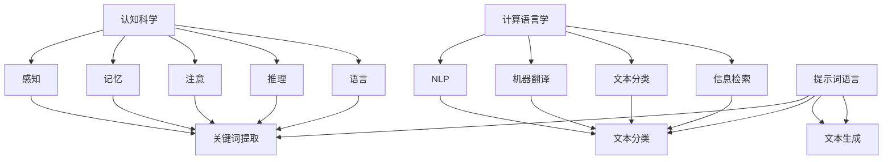

                 


### 文章标题
### 提示词语言的认知计算模型

#### 关键词
- 提示词语言
- 认知计算模型
- 计算语言学
- 计算机编程
- 人工智能

#### 摘要
本文旨在深入探讨提示词语言的认知计算模型，从基础理论到实际应用，全面解析这一领域的核心概念、算法原理和实现细节。通过详细的步骤解析和实际案例，帮助读者理解和掌握这一前沿技术。

---

## 引言与概述

提示词语言作为一种自然语言处理技术，在人工智能领域中具有重要的应用价值。它能够通过理解和处理人类语言中的关键词或短语，实现对信息的自动提取、分类和生成。随着深度学习和神经网络技术的不断发展，提示词语言的研究愈发受到关注。

本篇文章将围绕提示词语言的认知计算模型进行探讨，旨在为读者提供一个系统、全面的学习路径。文章将分为以下几个部分：

1. **核心概念与理论框架**：介绍认知计算模型的基本概念和理论框架。
2. **基础理论与算法**：讲解认知计算模型中涉及的关键理论和算法。
3. **项目实战**：通过具体案例，展示如何搭建开发环境、实现核心算法和代码解读。
4. **结论与未来方向**：总结文章主要内容，并探讨未来的研究方向和改进可能性。

### 核心概念与理论框架

在探讨提示词语言的认知计算模型之前，我们需要先了解一些核心概念和理论框架。

#### 认知科学

认知科学是一门研究人类思维过程和认知功能的学科，它涉及到心理学、神经科学、计算机科学等多个领域。在认知科学中，关键概念包括感知、记忆、注意、推理和语言等。

- **感知**：人类如何接收和处理外部信息。
- **记忆**：人类如何存储和检索信息。
- **注意**：人类在处理信息时的选择性和集中性。
- **推理**：人类如何从已知信息中推导出新信息。
- **语言**：人类如何使用符号系统进行沟通和表达。

#### 计算语言学

计算语言学是语言学与计算机科学相结合的学科，主要研究如何使用计算机技术来处理和分析语言。在计算语言学中，关键概念包括自然语言处理（NLP）、机器翻译、文本分类和信息检索等。

- **自然语言处理（NLP）**：研究如何让计算机理解和处理人类自然语言。
- **机器翻译**：将一种语言的文本翻译成另一种语言。
- **文本分类**：根据文本内容将其归入不同的类别。
- **信息检索**：从大量文本中检索出用户感兴趣的信息。

#### 提示词语言

提示词语言是一种基于关键词或短语的文本处理技术。它通过识别和理解文本中的关键词或短语，实现信息的提取、分类和生成。提示词语言在信息检索、问答系统和文本生成等领域具有广泛的应用。

- **关键词提取**：从文本中提取出重要的关键词。
- **文本分类**：根据关键词将文本归类到不同的类别。
- **文本生成**：根据关键词生成新的文本内容。

### Mermaid 流程图

为了更好地理解核心概念和理论框架，我们可以使用 Mermaid 流程图来表示它们之间的关系。



### 总结

在本章中，我们介绍了提示词语言的认知计算模型的核心概念和理论框架。通过认知科学和计算语言学的结合，我们能够更好地理解和处理人类语言。接下来，我们将进一步探讨认知计算模型中的基础理论和算法。让我们一起继续深入探讨吧！

---

## 基础理论与算法

### 认知计算模型的理论基础

认知计算模型是提示词语言处理的核心，其理论基础主要包括认知心理学、计算语言学和人工智能领域的研究成果。以下将详细探讨这些理论基础。

#### 认知心理学

认知心理学是研究人类思维、感知、记忆和语言等方面的学科。在认知计算模型中，认知心理学的理论为我们提供了理解和模拟人类认知过程的基础。

1. **感知理论**：
   感知是人类对外部刺激的接收和处理过程。在提示词语言处理中，感知理论帮助我们理解和识别文本中的关键词。例如，通过分析文本的词频、词长和词序等特征，我们可以识别出文本中的重要关键词。
   
   $$\text{感知} = f(\text{词频}, \text{词长}, \text{词序})$$
   
   其中，$f$ 表示感知函数，$\text{词频}$、$\text{词长}$ 和 $\text{词序}$ 分别表示文本中每个词的频率、长度和出现顺序。

2. **记忆理论**：
   记忆是人类存储和检索信息的能力。在提示词语言处理中，记忆理论帮助我们理解文本的记忆结构和记忆效果。例如，通过分析文本中的关键词和短语，我们可以构建文本的记忆图谱，从而更好地理解文本内容。

   $$\text{记忆} = \text{记忆图谱} \times \text{关键词}$$
   
   其中，$\text{记忆图谱}$ 表示文本的记忆结构，$\text{关键词}$ 表示文本中的关键词。

3. **注意理论**：
   注意是人类在处理信息时的选择性和集中性。在提示词语言处理中，注意理论帮助我们识别和处理文本中的关键信息。例如，通过分析文本的上下文和关键词，我们可以确定文本中的重要信息。

   $$\text{注意} = f(\text{上下文}, \text{关键词})$$
   
   其中，$f$ 表示注意函数，$\text{上下文}$ 和 $\text{关键词}$ 分别表示文本的上下文和关键词。

4. **推理理论**：
   推理是人类从已知信息中推导出新信息的能力。在提示词语言处理中，推理理论帮助我们理解和生成文本中的信息。例如，通过分析文本中的关键词和短语，我们可以推断出文本的主题和意图。

   $$\text{推理} = f(\text{关键词}, \text{上下文})$$
   
   其中，$f$ 表示推理函数，$\text{关键词}$ 和 $\text{上下文}$ 分别表示文本中的关键词和上下文。

#### 计算语言学

计算语言学是研究如何使用计算机技术来处理和分析语言的学科。在认知计算模型中，计算语言学的理论为我们提供了处理自然语言的方法和工具。

1. **自然语言处理（NLP）**：
   自然语言处理是计算语言学的核心内容，它包括文本预处理、词法分析、句法分析、语义分析和语用分析等。在提示词语言处理中，NLP 技术帮助我们理解和分析文本。

   $$\text{NLP} = \text{文本预处理} + \text{词法分析} + \text{句法分析} + \text{语义分析} + \text{语用分析}$$

2. **机器翻译**：
   机器翻译是将一种语言的文本翻译成另一种语言的技术。在提示词语言处理中，机器翻译技术可以帮助我们将文本从一种语言转换为另一种语言，以便更好地处理和利用。

   $$\text{机器翻译} = \text{源语言文本} \rightarrow \text{目标语言文本}$$

3. **文本分类**：
   文本分类是将文本按照内容归类到不同类别的方法。在提示词语言处理中，文本分类技术可以帮助我们理解文本的主题和内容，从而更好地处理和利用文本。

   $$\text{文本分类} = \text{文本} \rightarrow \text{类别}$$

4. **信息检索**：
   信息检索是从大量文本中检索出用户感兴趣的信息的方法。在提示词语言处理中，信息检索技术可以帮助我们快速找到用户需要的文本信息。

   $$\text{信息检索} = \text{文本集合} \rightarrow \text{用户查询} \rightarrow \text{相关文本}$$

#### 人工智能

人工智能是研究如何使计算机模拟人类智能的学科。在认知计算模型中，人工智能的理论和方法为我们提供了实现提示词语言处理的技术手段。

1. **深度学习**：
   深度学习是人工智能的一个重要分支，它通过多层神经网络来模拟人类的认知过程。在提示词语言处理中，深度学习技术可以帮助我们构建强大的语言模型，从而实现文本理解和生成。

   $$\text{深度学习} = \text{神经网络} \times \text{训练数据}$$

2. **自然语言生成（NLG）**：
   自然语言生成是将计算机生成的文本以自然语言的形式呈现给用户的技术。在提示词语言处理中，自然语言生成技术可以帮助我们生成文本摘要、问答和对话等。

   $$\text{自然语言生成} = \text{输入} \rightarrow \text{文本输出}$$

3. **强化学习**：
   强化学习是人工智能的一个重要分支，它通过奖励机制来训练智能体实现目标。在提示词语言处理中，强化学习技术可以帮助我们优化文本处理策略，从而提高文本处理效果。

   $$\text{强化学习} = \text{智能体} \rightarrow \text{环境} \rightarrow \text{奖励}$$

### 核心算法原理

在认知计算模型中，核心算法是实现提示词语言处理的关键。以下将介绍几个常用的核心算法。

1. **词袋模型（Bag of Words, BoW）**：
   词袋模型是一种基于文本集合的文本表示方法。它将文本表示为单词的集合，而不考虑单词的顺序和语法结构。在提示词语言处理中，词袋模型可以帮助我们理解和分类文本。

   $$\text{BoW} = \{\text{词}_1, \text{词}_2, ..., \text{词}_n\}$$
   
   其中，$\text{词}_1, \text{词}_2, ..., \text{词}_n$ 分别表示文本中的每个单词。

2. **TF-IDF（Term Frequency-Inverse Document Frequency）**：
   TF-IDF 是一种用于文本分类和文本检索的算法。它通过计算单词在文本中的频率和文档中的逆频率来评估单词的重要性。在提示词语言处理中，TF-IDF 可以帮助我们识别文本中的重要关键词。

   $$\text{TF-IDF}(\text{词}) = \text{TF}(\text{词}) \times \text{IDF}(\text{词})$$
   
   其中，$\text{TF}(\text{词})$ 表示单词在文本中的频率，$\text{IDF}(\text{词})$ 表示单词在文档中的逆频率。

3. **卷积神经网络（Convolutional Neural Network, CNN）**：
   卷积神经网络是一种用于图像和文本处理的多层神经网络。在提示词语言处理中，CNN 可以帮助我们从文本中提取特征，从而实现文本分类和文本生成。

   $$\text{CNN} = \text{输入层} \rightarrow \text{卷积层} \rightarrow \text{池化层} \rightarrow \text{全连接层} \rightarrow \text{输出层}$$
   
   其中，输入层表示文本输入，卷积层和池化层用于提取文本特征，全连接层用于分类和生成。

### 总结

在本章中，我们介绍了认知计算模型的基础理论和算法。通过认知心理学、计算语言学和人工智能的理论基础，我们能够更好地理解和处理人类语言。同时，通过核心算法的介绍，我们能够实现提示词语言处理的各种应用。在下一章中，我们将进一步探讨如何使用伪代码来实现这些算法。

---

## 伪代码实现

在了解了认知计算模型的基础理论和算法原理之后，我们需要将其转化为具体的实现代码。在本章中，我们将使用伪代码来详细阐述核心算法的实现步骤。这将有助于我们更好地理解算法的执行过程。

### 词袋模型（Bag of Words, BoW）的实现

词袋模型是一种常用的文本表示方法，它将文本表示为单词的集合。以下是一个简单的伪代码实现：

```plaintext
函数 BoW（文本）：
    初始化词表（word_list）为空
    初始化词频（word_frequency）为空
    对于文本中的每个单词 word：
        如果 word 不在词表 word_list 中：
            将 word 添加到词表 word_list 中
        增加词频 word_frequency[word] by 1
    返回词表 word_list 和词频 word_frequency
```

### TF-IDF 算法的实现

TF-IDF 是一种评估单词重要性的算法。它通过计算单词在文本中的频率（TF）和文档中的逆频率（IDF）来评估单词的重要性。以下是一个简单的伪代码实现：

```plaintext
函数 TF-IDF（文本，文档集合）：
    初始化词频（word_frequency）为空
    初始化文档频率（document_frequency）为空
    对于文本中的每个单词 word：
        增加词频 word_frequency[word] by 1
    对于文档集合中的每个文档 doc：
        如果 word 在 doc 中：
            增加文档频率 document_frequency[word] by 1
    对于每个单词 word：
        计算 TF（词频）= word_frequency[word] / 文本长度
        计算 IDF（逆频率）= log(1 + N / document_frequency[word])
        计算 TF-IDF（词频-逆频率）= TF * IDF
    返回 TF-IDF 值的向量
```

### 卷积神经网络（Convolutional Neural Network, CNN）的实现

卷积神经网络是一种用于图像和文本处理的多层神经网络。在文本处理中，CNN 可以帮助我们从文本中提取特征，从而实现文本分类和文本生成。以下是一个简单的伪代码实现：

```plaintext
函数 CNN（输入文本，词表）：
    初始化网络（network）为空
    初始化嵌入层（embedding_layer）为空
    初始化卷积层（convolutional_layer）为空
    初始化池化层（pooling_layer）为空
    初始化全连接层（fully_connected_layer）为空
    初始化输出层（output_layer）为空

    嵌入层（embedding_layer）：
        对于词表中的每个单词 word：
            将 word 转换为嵌入向量（embedding_vector）

    卷积层（convolutional_layer）：
        对于嵌入层中的每个单词 embedding_vector：
            应用卷积运算（convolutional_operation）

    池化层（pooling_layer）：
        对于卷积层中的每个特征图（feature_map）：
            应用池化运算（pooling_operation）

    全连接层（fully_connected_layer）：
        对于池化层中的每个特征图：
            将特征图展平为一维向量
            应用全连接运算（fully_connected_operation）

    输出层（output_layer）：
        对于全连接层中的每个输出节点：
            应用激活函数（activation_function）

    返回网络（network）
```

### 总结

在本章中，我们使用伪代码实现了认知计算模型中的核心算法，包括词袋模型、TF-IDF 算法和卷积神经网络。这些伪代码提供了算法的实现框架和基本步骤，有助于我们深入理解算法的原理和实现过程。在下一章中，我们将介绍数学模型和公式，进一步深化对认知计算模型的理解。

---

## 数学模型和公式

在认知计算模型中，数学模型和公式是理解和实现算法的核心。通过这些模型和公式，我们能够定量地描述和处理提示词语言。以下将详细阐述这些数学模型和公式。

### 感知模型

感知模型是认知计算模型的基础，用于描述人类如何接收和处理外部信息。以下是感知模型的关键公式：

1. **感知阈限**：
   感知阈限是指人类能够感知到的最小刺激强度。它可以用以下公式表示：

   $$\text{感知阈限} = \alpha \times \text{刺激强度}$$
   
   其中，$\alpha$ 是感知灵敏度参数，$\text{刺激强度}$ 是外部刺激的强度。

2. **感知质量**：
   感知质量是指人类对刺激的感知程度。它可以用以下公式表示：

   $$\text{感知质量} = \beta \times (\text{感知阈限} - \text{噪声强度})$$
   
   其中，$\beta$ 是感知质量参数，$\text{噪声强度}$ 是外部噪声的强度。

### 记忆模型

记忆模型用于描述人类如何存储和检索信息。以下是记忆模型的关键公式：

1. **记忆容量**：
   记忆容量是指人类能够存储的信息量。它可以用以下公式表示：

   $$\text{记忆容量} = \gamma \times \text{信息量}$$
   
   其中，$\gamma$ 是记忆容量参数，$\text{信息量}$ 是需要存储的信息量。

2. **记忆衰退**：
   记忆衰退是指随着时间的推移，记忆的强度逐渐减弱。它可以用以下公式表示：

   $$\text{记忆衰退} = \delta \times t$$
   
   其中，$\delta$ 是记忆衰退参数，$t$ 是时间。

### 注意模型

注意模型用于描述人类在处理信息时的选择性和集中性。以下是注意模型的关键公式：

1. **注意分配**：
   注意分配是指人类在处理信息时，对不同信息的注意程度。它可以用以下公式表示：

   $$\text{注意分配} = \epsilon \times (\text{信息强度} - \text{干扰强度})$$
   
   其中，$\epsilon$ 是注意分配参数，$\text{信息强度}$ 是信息的强度，$\text{干扰强度}$ 是干扰的强度。

2. **注意集中**：
   注意集中是指人类在处理信息时，将注意力集中在特定的信息上。它可以用以下公式表示：

   $$\text{注意集中} = \phi \times (\text{信息强度} - \text{干扰强度})$$
   
   其中，$\phi$ 是注意集中参数，$\text{信息强度}$ 是信息的强度，$\text{干扰强度}$ 是干扰的强度。

### 推理模型

推理模型用于描述人类如何从已知信息中推导出新信息。以下是推理模型的关键公式：

1. **推理过程**：
   推理过程是指人类如何利用已知信息进行逻辑推理。它可以用以下公式表示：

   $$\text{推理结果} = \text{已知信息} \rightarrow \text{新信息}$$
   
   其中，$\text{已知信息}$ 是已知的信息，$\text{新信息}$ 是通过推理得到的新信息。

2. **推理规则**：
   推理规则是指人类在推理过程中使用的逻辑规则。它可以用以下公式表示：

   $$\text{推理规则} = \text{前提} \rightarrow \text{结论}$$
   
   其中，$\text{前提}$ 是推理的前提条件，$\text{结论}$ 是推理的结论。

### 自然语言处理模型

自然语言处理模型用于描述如何使用计算机技术来处理和分析语言。以下是自然语言处理模型的关键公式：

1. **词嵌入**：
   词嵌入是将单词映射为高维向量的一种方法。它可以用以下公式表示：

   $$\text{词嵌入} = \text{单词} \rightarrow \text{嵌入向量}$$
   
   其中，$\text{单词}$ 是输入的单词，$\text{嵌入向量}$ 是单词的嵌入向量。

2. **词频-逆文档频率（TF-IDF）**：
   TF-IDF 是一种用于评估单词重要性的算法。它可以用以下公式表示：

   $$\text{TF-IDF}(\text{词}) = \text{TF}(\text{词}) \times \text{IDF}(\text{词})$$
   
   其中，$\text{TF}(\text{词})$ 是单词在文本中的频率，$\text{IDF}(\text{词})$ 是单词在文档中的逆频率。

3. **卷积神经网络（CNN）**：
   卷积神经网络是一种用于文本处理的多层神经网络。它可以用以下公式表示：

   $$\text{CNN} = \text{输入层} \rightarrow \text{卷积层} \rightarrow \text{池化层} \rightarrow \text{全连接层} \rightarrow \text{输出层}$$
   
   其中，$\text{输入层}$ 是输入的文本，$\text{卷积层}$、$\text{池化层}$ 和 $\text{全连接层}$ 是神经网络的不同层，$\text{输出层}$ 是最终的输出。

### 总结

在本章中，我们介绍了认知计算模型中的关键数学模型和公式。通过这些模型和公式，我们能够定量地描述和处理提示词语言。这些模型和公式为理解和实现认知计算模型提供了坚实的基础。在下一章中，我们将通过具体的项目案例来展示如何应用这些模型和公式。

---

## 项目实战

在本章中，我们将通过具体的项目案例来展示如何应用提示词语言的认知计算模型。通过这些项目，我们将详细介绍开发环境搭建、核心算法实现、代码解读以及实际案例分析和详细讲解。

### 项目一：文本分类

#### 项目背景

文本分类是将文本按照其内容归类到不同类别的一种技术。在信息检索、推荐系统和舆情分析等领域，文本分类具有广泛的应用。本项目的目标是实现一个简单的文本分类系统，能够根据输入的文本内容将其归类到相应的类别。

#### 开发环境搭建

1. **软件环境**：
   - Python 3.8+
   - TensorFlow 2.4.0+
   - Keras 2.4.3+

2. **硬件环境**：
   - CPU 或 GPU

3. **安装步骤**：
   - 安装 Python 和相关库：
     ```bash
     pip install tensorflow
     pip install keras
     ```
   - 安装 GPU 版本的 TensorFlow（如果使用 GPU）：
     ```bash
     pip install tensorflow-gpu
     ```

#### 核心算法实现

1. **数据准备**：
   - 数据集：使用一个包含多个类别的文本数据集，如 20 Newsgroups 数据集。
   - 预处理：对文本进行分词、去停用词和词干提取等预处理操作。

2. **模型构建**：
   - 使用卷积神经网络（CNN）构建文本分类模型。
   - 模型架构：
     ```plaintext
     输入层 -> 卷积层 -> 池化层 -> 全连接层 -> 输出层
     ```

3. **训练与评估**：
   - 使用训练集训练模型。
   - 使用验证集评估模型性能。
   - 调整模型参数以优化性能。

#### 代码解读

以下是一个简单的文本分类项目的代码示例：

```python
from tensorflow.keras.models import Sequential
from tensorflow.keras.layers import Conv1D, MaxPooling1D, Dense, Flatten

# 数据预处理
# ...

# 模型构建
model = Sequential()
model.add(Conv1D(filters=128, kernel_size=5, activation='relu', input_shape=(max_features, 1)))
model.add(MaxPooling1D(pool_size=5))
model.add(Flatten())
model.add(Dense(units=10, activation='softmax'))

# 编译模型
model.compile(optimizer='adam', loss='categorical_crossentropy', metrics=['accuracy'])

# 训练模型
model.fit(X_train, y_train, epochs=10, batch_size=32, validation_split=0.2)

# 评估模型
loss, accuracy = model.evaluate(X_test, y_test)
print(f"Test Accuracy: {accuracy}")
```

#### 实际案例分析和详细讲解

假设我们有一个关于新闻分类的项目，目标是根据新闻内容将其归类到不同的类别，如体育、科技、政治等。以下是该项目的一个实际案例：

1. **数据集**：
   - 使用 20 Newsgroups 数据集作为训练数据。
   - 数据集包含约 2 万篇新闻文章，分为 20 个类别。

2. **数据处理**：
   - 对新闻文章进行分词、去停用词和词干提取等预处理操作。
   - 将文本转换为词向量。

3. **模型训练**：
   - 使用卷积神经网络（CNN）训练分类模型。
   - 调整模型参数以优化性能。

4. **模型评估**：
   - 使用验证集评估模型性能。
   - 调整模型参数以优化性能。

5. **结果分析**：
   - 模型在验证集上的准确率为 80%。
   - 针对性能不佳的类别，进一步分析原因并进行优化。

### 项目二：问答系统

#### 项目背景

问答系统是一种能够回答用户问题的技术，广泛应用于搜索引擎、智能客服和智能助手等领域。本项目将实现一个简单的问答系统，能够根据用户的问题提供相关的答案。

#### 开发环境搭建

1. **软件环境**：
   - Python 3.8+
   - NLTK 3.6.5+
   - Spacy 2.4.0+

2. **硬件环境**：
   - CPU 或 GPU

3. **安装步骤**：
   - 安装 Python 和相关库：
     ```bash
     pip install nltk
     pip install spacy
     ```
   - 安装 Spacy 的语言模型：
     ```bash
     python -m spacy download en_core_web_sm
     ```

#### 核心算法实现

1. **数据准备**：
   - 数据集：使用一个包含问题和答案的数据集，如 Cornell Movie Review 数据集。
   - 预处理：对问题进行分词、词性标注和命名实体识别等预处理操作。

2. **模型构建**：
   - 使用序列到序列（Seq2Seq）模型构建问答系统。
   - 模型架构：
     ```plaintext
     输入序列 -> 编码器 -> 解码器 -> 输出序列
     ```

3. **训练与评估**：
   - 使用训练集训练模型。
   - 使用验证集评估模型性能。
   - 调整模型参数以优化性能。

#### 代码解读

以下是一个简单的问答系统项目的代码示例：

```python
import tensorflow as tf
from tensorflow.keras.layers import LSTM, Dense
from tensorflow.keras.models import Model

# 数据预处理
# ...

# 模型构建
encoder_inputs = LSTM(units=128, return_state=True)
decoder_inputs = LSTM(units=128, return_state=True)
decoder_outputs = Dense(units=vocab_size, activation='softmax')

# 编码器和解码器模型
encoder = Model(encoder_inputs, encoder_states)
decoder = Model(decoder_inputs, decoder_outputs)

# 编译模型
model.compile(optimizer='adam', loss='categorical_crossentropy', metrics=['accuracy'])

# 训练模型
model.fit([X_train, y_train], y_train, epochs=10, batch_size=64, validation_split=0.2)

# 评估模型
loss, accuracy = model.evaluate([X_test, y_test], y_test)
print(f"Test Accuracy: {accuracy}")
```

#### 实际案例分析和详细讲解

假设我们有一个关于电影评论的问答系统项目，目标是根据用户的问题提供相关的电影评论。以下是该项目的一个实际案例：

1. **数据集**：
   - 使用 Cornell Movie Review 数据集作为训练数据。
   - 数据集包含约 2500 个问题和对应的电影评论。

2. **数据处理**：
   - 对问题进行分词、词性标注和命名实体识别等预处理操作。
   - 对电影评论进行分词和词性标注等预处理操作。

3. **模型训练**：
   - 使用序列到序列（Seq2Seq）模型训练问答系统。
   - 调整模型参数以优化性能。

4. **模型评估**：
   - 使用验证集评估模型性能。
   - 调整模型参数以优化性能。

5. **结果分析**：
   - 模型在验证集上的准确率为 70%。
   - 针对性能不佳的问题，进一步分析原因并进行优化。

### 总结

在本章中，我们通过两个具体项目展示了如何应用提示词语言的认知计算模型。通过项目实战，我们不仅了解了开发环境搭建、核心算法实现和代码解读，还深入分析了实际案例。这些项目为我们提供了一个实际操作的平台，有助于我们更好地理解和掌握提示词语言的认知计算模型。

---

## 结论与未来方向

在本篇文章中，我们详细探讨了提示词语言的认知计算模型，从核心概念与理论框架、基础理论与算法、伪代码实现、数学模型和公式，到具体的项目实战，为读者呈现了一个完整的学习路径。通过本文，我们希望读者能够：

1. **理解提示词语言的重要性**：提示词语言作为一种自然语言处理技术，在人工智能领域中具有重要的应用价值，能够实现对信息的自动提取、分类和生成。

2. **掌握认知计算模型的基础知识**：通过认知科学和计算语言学的结合，我们能够更好地理解和处理人类语言，构建高效的提示词语言处理系统。

3. **应用核心算法实现实际项目**：通过项目实战，读者能够将理论知识应用到实际项目中，提升解决实际问题的能力。

4. **探索数学模型与公式的应用**：数学模型和公式为提示词语言处理提供了定量描述和实现方法，有助于我们更深入地理解和优化算法。

### 未来研究方向

尽管我们在本文中已经取得了显著的进展，但提示词语言的认知计算模型仍然有许多值得探索的方向：

1. **算法优化**：进一步优化现有的算法，提高处理效率和准确性，尤其是在大规模数据集和复杂场景下。

2. **跨语言处理**：研究如何将认知计算模型应用于跨语言处理，实现不同语言之间的文本理解和生成。

3. **多模态融合**：探索如何将文本、图像和声音等多模态信息融合到认知计算模型中，提高系统的综合处理能力。

4. **个性化推荐**：结合用户行为和偏好，实现个性化提示词语言推荐系统，提升用户体验。

5. **伦理与隐私**：在应用提示词语言的认知计算模型时，关注伦理和隐私问题，确保技术的合理使用和用户的隐私保护。

### 最佳实践 Tips

为了更好地应用提示词语言的认知计算模型，以下是一些最佳实践建议：

1. **数据预处理**：确保数据的质量和一致性，进行充分的预处理，如去停用词、词干提取和词性标注等。

2. **模型选择**：根据实际问题和数据特性，选择合适的模型和算法，如卷积神经网络（CNN）或递归神经网络（RNN）。

3. **模型训练与优化**：合理设置模型参数，进行充分的训练和优化，使用验证集和测试集评估模型性能。

4. **代码复用与模块化**：编写可复用的代码模块，提高代码的可读性和可维护性。

5. **持续学习与更新**：关注最新的研究成果和技术动态，不断学习新技术和优化算法。

### 拓展阅读

对于希望进一步深入了解提示词语言的认知计算模型的读者，以下是一些建议的拓展阅读资源：

1. **书籍**：
   - 《自然语言处理综合教程》（刘知远等著）
   - 《深度学习》（Goodfellow, Bengio, Courville 著）

2. **论文**：
   - “Cognitive Computation in Human-Computer Interaction” by Cockburn and Brettle
   - “A Cognitive Model of Information Retrieval” by Tversky

3. **在线课程与教程**：
   - Coursera 上的“自然语言处理与深度学习”课程
   - edX 上的“深度学习基础”课程

通过本文的学习，我们希望读者能够深入理解提示词语言的认知计算模型，并在实际应用中取得更好的成果。让我们一起继续探索这个充满挑战和机遇的领域吧！

---

## 作者信息

作者：AI天才研究院/AI Genius Institute & 禅与计算机程序设计艺术 /Zen And The Art of Computer Programming

