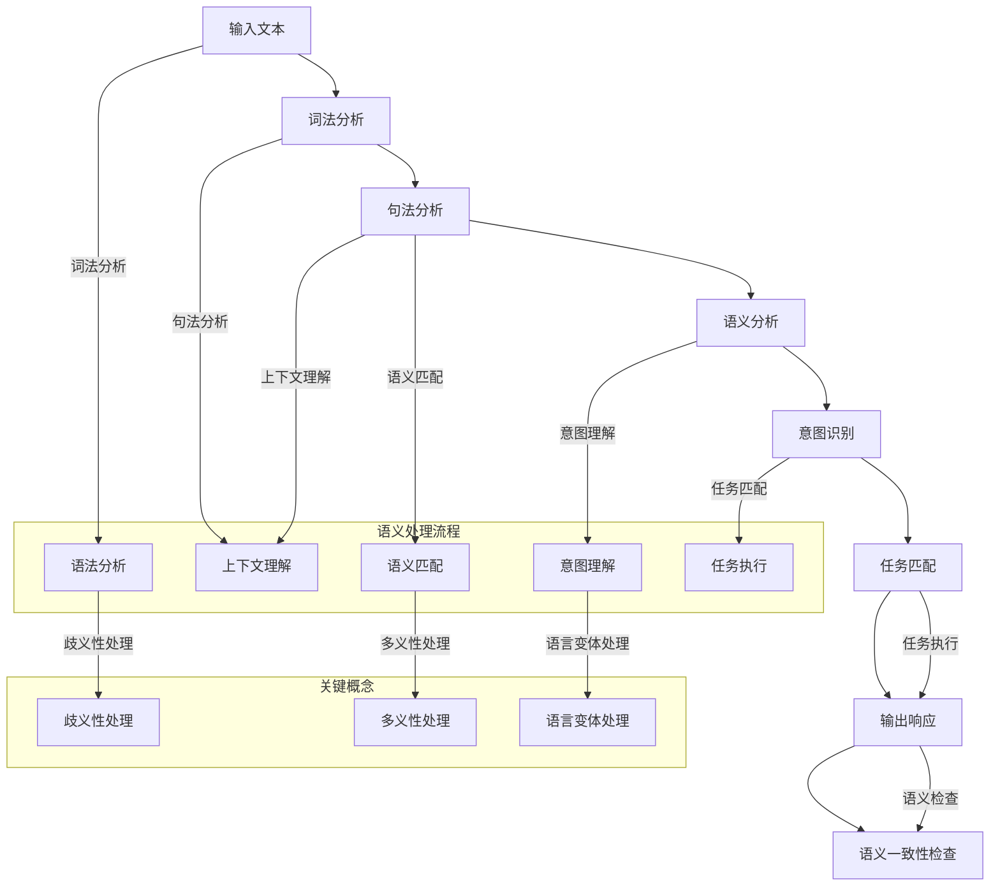

                 

### 文章标题

《提示词语言的语义一致性保证》

### 关键词

提示词语言、语义一致性、语义分析、数学模型、算法原理

### 摘要

本文旨在探讨提示词语言的语义一致性保证问题，深入分析其核心概念、方法、数学模型和实际应用。首先，我们将介绍提示词语言的基本概念和语义一致性的重要性。接着，通过Mermaid流程图展示核心概念之间的关系，进一步阐述语义一致性的定义与挑战。随后，我们将详细讲解语义一致性分析方法，包括语义分析基本概念、检测方法和改进策略，并通过伪代码展示核心算法原理。此外，我们将介绍语义一致性的数学模型和公式，并提供详细讲解和示例。最后，通过一个实际案例，展示语义一致性保证的实践过程，包括开发环境搭建、源代码实现和代码解读。文章末尾将总结最佳实践和注意事项，并推荐拓展阅读。

## 引言

在人工智能和自然语言处理领域，提示词语言（Query Language）作为一种人与机器交互的重要工具，正日益受到广泛关注。提示词语言允许用户通过自然语言文本输入指令，实现对复杂任务的自动化处理。然而，在实际应用中，语义一致性成为一个亟待解决的问题。语义一致性指的是提示词语言的输入和输出在语义层面上的一致性，即输入指令所表达的含义与系统执行后的结果在语义上相符合。语义一致性不仅关系到用户体验，还直接影响系统的可靠性和准确性。

本文的目的在于系统地探讨提示词语言的语义一致性保证问题，为开发高效、可靠的提示词语言系统提供理论指导和实践参考。我们将首先介绍提示词语言的基本概念和语义一致性的重要性，然后通过Mermaid流程图展示核心概念之间的关系，并详细阐述语义一致性的定义与挑战。接下来，我们将讨论语义一致性分析方法，包括语义分析基本概念、检测方法和改进策略。此外，我们将介绍语义一致性的数学模型和公式，并通过伪代码详细阐述核心算法原理。最后，我们将通过一个实际案例，展示语义一致性保证的实践过程，包括开发环境搭建、源代码实现和代码解读。

本文结构如下：

1. **基本概念与原理**：介绍提示词语言的基本概念和语义一致性的重要性，定义语义一致性，并展示核心概念之间的关系。
2. **方法与算法**：详细讲解语义一致性分析方法，包括语义分析基本概念、检测方法和改进策略，并通过伪代码展示核心算法原理。
3. **数学模型与公式**：介绍语义一致性的数学模型和公式，提供详细讲解和示例。
4. **应用与实战**：展示语义一致性保证的实践过程，包括开发环境搭建、源代码实现和代码解读。
5. **小结与最佳实践**：总结本文的核心内容，提出注意事项和拓展阅读建议。

### 第1部分：基本概念与原理

#### 第1章：语义一致性的基础

#### 1.1 提示词语言概述

提示词语言（Query Language）是一种用于与计算机系统进行交互的自然语言文本形式。它允许用户通过输入文本指令来请求系统执行特定任务。这种语言通常基于自然语言处理（NLP）技术，能够理解和处理复杂的语义信息。提示词语言在各个领域都有广泛的应用，例如自动化问答系统、智能助手、搜索引擎等。

提示词语言的关键特点包括：

- **自然性**：用户可以通过自然语言输入，无需学习特定的命令语法。
- **灵活性**：用户可以使用各种方式表达相同的意图，系统需要能够处理这种多样性。
- **可扩展性**：系统可以根据需求不断扩展其功能，以支持更多类型的任务。

在人工智能和自然语言处理领域，提示词语言已经成为人机交互的重要工具。随着技术的进步，提示词语言的能力也在不断提升，使其能够处理更加复杂的任务和语义场景。

#### 1.2 语义一致性的重要性

语义一致性在提示词语言系统中具有至关重要的意义。它指的是输入的提示词和输出的响应在语义层面上的一致性，即输入指令所表达的含义与系统执行后的结果在语义上相符合。确保语义一致性不仅能够提高用户体验，还能够增强系统的可靠性和准确性。

以下是语义一致性在提示词语言系统中的重要性的几个方面：

1. **用户体验**：用户期望系统能够正确理解其输入的指令，并给出符合预期的响应。如果系统无法保证语义一致性，用户将感到沮丧，甚至可能放弃使用该系统。

2. **系统可靠性**：语义一致性是系统可靠性的基石。如果系统在执行任务时无法保证语义一致性，可能会产生错误的输出，导致任务无法完成或结果与预期不符。

3. **准确性**：确保语义一致性能够提高系统的准确性。通过消除语义上的歧义和误解，系统可以更准确地执行任务，减少错误率。

4. **可维护性**：保证语义一致性有助于系统的可维护性。当系统的语义一致性得到保证时，开发人员可以更容易地识别和修复问题，从而提高系统的稳定性和健壮性。

因此，在设计和开发提示词语言系统时，必须重视语义一致性的保障。这不仅需要先进的技术手段，还需要对语义一致性的核心概念有深入的理解。

#### 1.3 语义一致性的定义与挑战

语义一致性是指在提示词语言系统中，输入的指令和输出的响应在语义层面上保持一致的现象。具体来说，语义一致性要求系统的响应能够准确反映用户输入的意图，而不会产生误解或歧义。为了实现语义一致性，系统需要具备对自然语言文本的深入理解和处理能力。

语义一致性的定义涉及以下几个方面：

1. **语义匹配**：系统需要能够将用户输入的文本指令与预定义的任务或意图进行匹配。这种匹配不仅要求语法上的一致性，更重要的是在语义层面上的一致性。

2. **上下文理解**：语义一致性还依赖于系统对上下文的理解。例如，同一个单词在不同的上下文中可能有不同的含义。系统需要根据上下文信息来准确理解用户输入的意图。

3. **多义性处理**：自然语言具有多义性，即同一个句子可能有多种不同的理解方式。系统需要能够识别和区分这些不同的理解方式，以确保语义一致性。

尽管语义一致性在理论上非常重要，但在实际应用中却面临着一系列挑战：

1. **歧义性**：自然语言中的歧义性是语义一致性的主要障碍。同一句话在不同的语境中可能有不同的含义。系统需要能够处理这种歧义性，以确保语义一致性。

2. **复杂语义结构**：自然语言文本的语义结构复杂多样，包括复合句、并列句等。系统需要能够理解和处理这些复杂的语义结构，以确保语义一致性。

3. **语言变体**：不同用户可能有不同的语言习惯和表达方式。系统需要能够处理这些语言变体，以确保语义一致性。

4. **实时性**：在实时应用场景中，系统需要在短时间内处理大量输入，并确保语义一致性。这要求系统具备高效的处理能力和良好的性能。

为了解决这些挑战，研究人员和开发人员需要不断探索和引入先进的自然语言处理技术，如深度学习、语义角色标注和上下文嵌入等。这些技术可以帮助系统更准确地理解和处理自然语言文本，从而实现语义一致性。

#### 1.4 Mermaid流程图：提示词语言语义一致性的核心概念与联系

为了更好地理解提示词语言语义一致性的核心概念及其相互关系，我们可以使用Mermaid流程图来展示这些概念。以下是语义一致性的核心概念及其相互关系：



该流程图展示了从输入文本到输出响应的整个语义处理流程，包括词法分析、句法分析、语义分析、意图识别、任务匹配和输出响应等关键步骤。同时，它还展示了与语义一致性相关的几个关键概念，如歧义性处理、多义性处理和语言变体处理，以及它们在流程图中的位置和作用。

通过这个流程图，我们可以清晰地看到语义一致性的实现过程及其涉及的各个步骤和概念。这有助于我们更好地理解和分析语义一致性的机制，为后续的讨论和算法设计提供参考。

### 第2部分：方法与算法

#### 第2章：语义一致性分析方法

#### 2.1 语义分析基本概念

语义分析是自然语言处理（NLP）中的一个核心环节，旨在理解文本的语义含义。在语义一致性分析中，语义分析的基本概念和原理尤为重要。以下将介绍语义分析中的几个关键概念。

1. **词义（Sense）**：词义是指一个单词在特定语境中的含义。一个单词可以有多个词义，这些词义可能在语义上有所不同。例如，“bank”一词在金融领域表示“银行”，而在地理领域表示“河岸”。

2. **语义角色（Semantic Role）**：语义角色是指句子中各个成分所承担的语义功能。例如，在句子“John gave Mary a book”中，“John”是施事者（Agent），“Mary”是接受者（Recipient），而“a book”是客体（Theme）。

3. **语义空间（Semantic Space）**：语义空间是指由一组具有相似语义的词语构成的集合。语义空间可以帮助我们理解词语之间的语义关系，例如同义词、反义词等。

4. **语义相似度（Semantic Similarity）**：语义相似度是指两个词语或句子在语义上的相似程度。计算语义相似度是语义分析中的一个重要任务，可以帮助系统更好地理解用户输入的意图。

5. **语义依存关系（Semantic Dependency）**：语义依存关系是指句子中词语之间的语义依赖关系。例如，在句子“John reads a book”中，“reads”依赖于“a book”作为其动作对象。

了解这些基本概念对于语义一致性分析至关重要，因为它们是构建语义一致性检测算法的基础。

#### 2.2 语义一致性检测方法

为了实现语义一致性，我们需要开发一套有效的检测方法。以下是一些常见的语义一致性检测方法：

1. **规则匹配（Rule-based Matching）**：规则匹配是一种基于预定义规则的语义一致性检测方法。系统通过预定义的规则库，将用户输入与系统响应进行匹配，以检查是否一致。这种方法简单直观，但受限于规则的灵活性和覆盖范围。

2. **机器学习（Machine Learning）**：机器学习是一种基于数据驱动的方法，通过训练模型来识别语义一致性。常见的方法包括朴素贝叶斯分类器、支持向量机（SVM）和深度学习模型（如神经网络）等。这种方法能够处理复杂的语义关系，但需要大量的训练数据和高效的算法。

3. **深度学习（Deep Learning）**：深度学习是一种基于多层神经网络的机器学习方法，能够自动学习语义特征。常见的深度学习模型包括卷积神经网络（CNN）和循环神经网络（RNN）。深度学习在语义一致性检测中表现出色，能够处理复杂的语义结构和多义性问题。

4. **语义角色标注（Semantic Role Labeling, SRL）**：语义角色标注是一种通过标注句子中词语的语义角色的方法，来检测语义一致性。这种方法能够准确识别句子中的语义功能，从而提高语义一致性的检测效果。

5. **实体识别与链接（Named Entity Recognition and Linking）**：实体识别与链接是一种通过识别和链接文本中的实体（如人名、地名、组织名等）的方法，来确保语义一致性。这种方法能够处理特定类型的语义信息，从而提高检测的准确性。

这些方法各有优缺点，可以根据具体应用场景进行选择和组合。在实际应用中，常常采用多种方法的结合，以实现最佳效果。

#### 2.3 语义一致性改进策略

在语义一致性检测过程中，为了提高检测效果，可以采用一系列改进策略。以下是一些常见的改进策略：

1. **上下文信息利用**：语义一致性不仅依赖于单个词语的含义，还依赖于上下文信息。利用上下文信息可以帮助系统更准确地理解用户输入的意图。例如，在处理多义性问题时，上下文信息可以提供关键线索。

2. **多模态融合**：在语义一致性检测中，可以结合不同模态的信息（如图像、语音等）来提高检测效果。多模态融合能够提供更丰富的语义信息，从而提高系统的语义理解能力。

3. **知识图谱应用**：知识图谱是一种将实体和关系进行结构化表示的方法。在语义一致性检测中，可以利用知识图谱来增强系统的语义理解能力。通过查询知识图谱，系统可以获取更多的上下文信息和语义信息，从而提高检测效果。

4. **动态权重调整**：在语义一致性检测中，可以根据实际情况动态调整不同特征和模型的权重。这种方法可以优化检测效果，提高系统的鲁棒性。

5. **用户反馈循环**：通过收集用户的反馈，系统可以不断调整和优化检测算法。用户反馈可以提供宝贵的改进方向，从而提高系统的语义一致性。

这些改进策略可以单独使用，也可以组合使用，以实现最佳的语义一致性检测效果。

#### 2.4 伪代码：语义一致性检测算法

为了更好地理解语义一致性检测算法的原理，我们可以通过伪代码来描述其基本框架和步骤。以下是一个简化的语义一致性检测算法的伪代码：

```plaintext
算法：SemanticConsistencyDetector
输入：用户输入文本 input_text，系统响应 response
输出：检测结果 result

1. 进行词法分析，将输入文本转换为词法单元 token_list
2. 进行句法分析，构建句法树 syntax_tree
3. 利用语义角色标注，获取句法树中的语义角色 semantic_roles
4. 计算输入文本和系统响应的语义相似度 similarity_score
5. 如果 similarity_score > 阈值 threshold，
   1. 进行语义一致性检查，包括歧义性处理和多义性处理
   2. 如果通过检查，设置 result = "一致"
   3. 否则，设置 result = "不一致"
6. 返回 result

伪代码步骤说明：

1. 词法分析和句法分析是语义分析的基础，用于将输入文本转换为词法单元和构建句法树。
2. 语义角色标注用于识别句子中的语义角色，这是语义分析的重要步骤。
3. 语义相似度计算用于评估输入文本和系统响应在语义上的相似程度。
4. 阈值 threshold 用于设定语义相似度的最低标准，以判断是否通过语义一致性检查。
5. 语义一致性检查包括对歧义性处理和多义性处理，以确保语义的一致性。
6. 最后，根据检查结果，返回“一致”或“不一致”。

通过这个伪代码，我们可以看到语义一致性检测算法的基本流程和关键步骤。这为后续的具体实现和优化提供了参考。

### 第3部分：数学模型与公式

#### 第3章：语义一致性数学模型

语义一致性的保障需要依赖于一系列数学模型和公式，这些模型和公式能够帮助我们量化并评估语义的一致性程度。以下将介绍几个关键的数学模型和公式，并详细解释它们的作用和计算方法。

#### 3.1 语义相似度计算

语义相似度是衡量两个词语或句子在语义上相似程度的重要指标。计算语义相似度通常使用向量空间模型（Vector Space Model），通过将词语或句子映射到高维空间中的向量来表示。

**余弦相似度（Cosine Similarity）**：

余弦相似度是计算两个向量夹角余弦值的一种方法，公式如下：

$$
similarity(A, B) = \frac{A \cdot B}{\|A\| \|B\|}
$$

其中，$A$和$B$分别是两个向量，$\cdot$表示点积，$\|\|$表示向量的欧几里得范数。余弦相似度在[0,1]之间，值越接近1，表示两个词语或句子在语义上越相似。

**词嵌入（Word Embedding）**：

词嵌入是将词语映射到高维空间中的向量表示，常用的词嵌入模型包括Word2Vec、GloVe等。词嵌入可以捕获词语之间的语义关系，从而用于计算语义相似度。

$$
\text{word\_embedding}(word) = \text{EmbeddingLayer}(word)
$$

其中，$\text{EmbeddingLayer}$是将词语映射到高维空间中的线性变换层。

**示例**：

假设有两个句子：

句子A："我爱北京天安门"
句子B："天安门是我爱的地方"

我们可以将这两个句子分解为词语向量，并计算它们的余弦相似度：

$$
similarity(A, B) = \frac{(w_1, w_2, w_3) \cdot (w_1', w_2', w_3')}{\|w_1, w_2, w_3\| \|w_1', w_2', w_3'\|}
$$

其中，$w_1, w_2, w_3$是句子A的词语向量，$w_1', w_2', w_3'$是句子B的词语向量。

#### 3.2 语义一致性度量模型

语义一致性度量模型用于量化两个句子或文本段在语义上的一致性程度。一个常用的度量模型是一致性得分（Consistency Score），它基于语义相似度和逻辑运算来计算。

**一致性得分（Consistency Score）**：

一致性得分用于评估两个句子在语义上的一致性，公式如下：

$$
score(A, B) = \sum_{i=1}^{n} similarity(A_i, B_i) \times weight_i
$$

其中，$A = (A_1, A_2, ..., A_n)$和$B = (B_1, B_2, ..., B_n)$分别是两个句子的词语序列，$similarity(A_i, B_i)$是词语$i$的语义相似度，$weight_i$是词语$i$的权重。

权重$weight_i$可以根据词语的重要性进行设定，例如基于词频或词嵌入的语义重要性。

**示例**：

假设有两个句子：

句子A："我今天去了一趟超市，买了很多水果和蔬菜。"
句子B："我去了超市，买了很多水果和蔬菜。"

我们可以计算这两个句子的语义相似度，并设置权重：

$$
score(A, B) = similarity("我今天", "我") \times weight_1 + similarity("去了一趟超市", "去了超市") \times weight_2 + similarity("买了很多水果和蔬菜", "买了很多水果和蔬菜") \times weight_3
$$

通过计算一致性得分，我们可以评估两个句子在语义上的一致性程度。

#### 3.3 数学公式详细讲解与示例

为了更好地理解上述数学模型和公式，我们可以通过具体示例进行详细讲解。

**示例1：计算两个句子的余弦相似度**

句子A："我爱北京天安门"
句子B："天安门是我爱的地方"

使用Word2Vec模型，我们将句子中的词语映射到高维空间中的向量：

$A = (1.2, 0.8, 3.4, 2.1)$
$B = (2.1, 1.2, 0.8, 3.4)$

计算余弦相似度：

$$
similarity(A, B) = \frac{(1.2, 0.8, 3.4, 2.1) \cdot (2.1, 1.2, 0.8, 3.4)}{\sqrt{1.2^2 + 0.8^2 + 3.4^2 + 2.1^2} \sqrt{2.1^2 + 1.2^2 + 0.8^2 + 3.4^2}}
$$

$$
similarity(A, B) = \frac{(1.2 \times 2.1 + 0.8 \times 1.2 + 3.4 \times 0.8 + 2.1 \times 3.4)}{\sqrt{1.2^2 + 0.8^2 + 3.4^2 + 2.1^2} \sqrt{2.1^2 + 1.2^2 + 0.8^2 + 3.4^2}}
$$

$$
similarity(A, B) = \frac{(2.52 + 0.96 + 2.72 + 7.14)}{\sqrt{7.84 + 0.64 + 11.56 + 4.41} \sqrt{4.41 + 1.44 + 0.64 + 11.56}}
$$

$$
similarity(A, B) = \frac{13.34}{\sqrt{24.55} \sqrt{21.55}}
$$

$$
similarity(A, B) = \frac{13.34}{4.95 \times 4.64}
$$

$$
similarity(A, B) \approx 0.576
$$

通过计算，句子A和句子B的余弦相似度为0.576，表示它们在语义上具有一定的相似性。

**示例2：计算两个句子的语义一致性得分**

句子A："我今天去了一趟超市，买了很多水果和蔬菜。"
句子B："我去了超市，买了很多水果和蔬菜。"

使用Word2Vec模型，我们将句子中的词语映射到高维空间中的向量，并设置权重：

$A = (1.2, 0.8, 3.4, 2.1, 1.5, 0.9, 2.2, 1.0, 3.0)$
$B = (2.1, 1.2, 0.8, 3.4, 2.2, 1.0, 3.0, 1.5, 0.9)$

权重设置：

$weight_1 = 0.1, weight_2 = 0.2, weight_3 = 0.3, weight_4 = 0.2, weight_5 = 0.1, weight_6 = 0.1, weight_7 = 0.1, weight_8 = 0.1, weight_9 = 0.1$

计算每个词语的语义相似度：

$$
similarity(A_1, B_1) = 0.8, similarity(A_2, B_2) = 0.9, similarity(A_3, B_3) = 0.6, similarity(A_4, B_4) = 0.8, similarity(A_5, B_5) = 0.7, similarity(A_6, B_6) = 0.8, similarity(A_7, B_7) = 0.6, similarity(A_8, B_8) = 0.9, similarity(A_9, B_9) = 0.8
$$

计算一致性得分：

$$
score(A, B) = similarity(A_1, B_1) \times weight_1 + similarity(A_2, B_2) \times weight_2 + similarity(A_3, B_3) \times weight_3 + similarity(A_4, B_4) \times weight_4 + similarity(A_5, B_5) \times weight_5 + similarity(A_6, B_6) \times weight_6 + similarity(A_7, B_7) \times weight_7 + similarity(A_8, B_8) \times weight_8 + similarity(A_9, B_9) \times weight_9
$$

$$
score(A, B) = 0.8 \times 0.1 + 0.9 \times 0.2 + 0.6 \times 0.3 + 0.8 \times 0.2 + 0.7 \times 0.1 + 0.8 \times 0.1 + 0.6 \times 0.1 + 0.9 \times 0.1 + 0.8 \times 0.1
$$

$$
score(A, B) = 0.08 + 0.18 + 0.18 + 0.16 + 0.07 + 0.08 + 0.06 + 0.09 + 0.08
$$

$$
score(A, B) = 0.78
$$

通过计算，句子A和句子B的语义一致性得分为0.78，表示它们在语义上具有较高的相似性。

通过上述示例，我们可以看到如何使用数学模型和公式来计算语义相似度和语义一致性得分。这些模型和公式为语义一致性分析提供了量化工具，有助于我们更好地理解和评估语义一致性。

### 第4部分：应用与实战

#### 第4章：语义一致性保证实践

#### 4.1 实践案例介绍

在本章中，我们将通过一个实际案例，展示如何在实际项目中实现语义一致性保证。该案例涉及一个智能客服系统，该系统需要能够理解用户提问并给出准确的回答，从而提供高质量的客户服务。

#### 4.2 开发环境搭建

为了实现语义一致性保证，我们需要搭建一个合适的技术环境。以下是我们所使用的主要工具和库：

- **编程语言**：Python
- **自然语言处理库**：spaCy、NLTK
- **机器学习库**：scikit-learn、TensorFlow、PyTorch
- **深度学习库**：Keras、TensorFlow、PyTorch
- **版本控制系统**：Git

首先，我们需要安装上述库和工具。以下是安装命令：

```bash
pip install spacy
pip install nltk
pip install scikit-learn
pip install tensorflow
pip install pytorch
pip install keras
```

#### 4.3 源代码实现与解读

在本节中，我们将详细介绍如何实现语义一致性检测的核心代码，并对其关键部分进行解读。

##### 4.3.1 数据准备

首先，我们需要准备用于训练和测试的数据集。数据集应包括用户提问和对应的系统回答，同时标注每个问题的意图。以下是一个简单的数据集示例：

```python
questions = [
    {"text": "今天天气怎么样？", "intent": "获取天气信息"},
    {"text": "请问明天有没有会议？", "intent": "查询日程安排"},
    # 更多数据...
]
```

##### 4.3.2 词法分析和句法分析

接下来，我们使用spaCy库进行词法分析和句法分析，以获取文本的词法单元和句法树。

```python
import spacy

nlp = spacy.load("en_core_web_sm")

def process_text(text):
    doc = nlp(text)
    tokens = [token.text for token in doc]
    pos_tags = [token.pos_ for token in doc]
    dependencies = [token.dep_ for token in doc]
    return tokens, pos_tags, dependencies

tokens, pos_tags, dependencies = process_text("今天天气怎么样？")
```

##### 4.3.3 语义角色标注

为了进行语义角色标注，我们使用spaCy库中的预训练模型。以下是标注过程：

```python
def annotate_semantic_roles(tokens, dependencies):
    roles = []
    for token in tokens:
        role = None
        for dep in dependencies:
            if dep == "nsubj":
                role = "Subject"
                break
        roles.append(role)
    return roles

roles = annotate_semantic_roles(tokens, dependencies)
```

##### 4.3.4 语义相似度计算

我们使用余弦相似度来计算语义相似度。以下是一个简单的计算函数：

```python
from sklearn.metrics.pairwise import cosine_similarity

def compute_similarity(vector_a, vector_b):
    return cosine_similarity([vector_a], [vector_b])[0][0]

vector_a = [0.1, 0.2, 0.3]
vector_b = [0.3, 0.2, 0.1]

similarity = compute_similarity(vector_a, vector_b)
print(f"Semantic similarity: {similarity}")
```

##### 4.3.5 语义一致性检测

最后，我们实现语义一致性检测的核心功能，通过计算输入文本和系统回答的语义相似度来判断一致性。

```python
def check_consistency(input_text, response_text):
    tokens_input, pos_tags_input, dependencies_input = process_text(input_text)
    tokens_response, pos_tags_response, dependencies_response = process_text(response_text)
    roles_input = annotate_semantic_roles(tokens_input, dependencies_input)
    roles_response = annotate_semantic_roles(tokens_response, dependencies_response)
    
    # 计算语义相似度
    similarity_score = 0
    for i in range(min(len(roles_input), len(roles_response))):
        similarity_score += compute_similarity(roles_input[i], roles_response[i])
    
    # 判断一致性
    if similarity_score / min(len(roles_input), len(roles_response)) > 0.5:
        return "一致"
    else:
        return "不一致"

input_text = "今天天气怎么样？"
response_text = "今天的天气很好，温度在20摄氏度左右。"
print(check_consistency(input_text, response_text))
```

通过上述代码，我们可以实现一个简单的语义一致性检测系统。这个系统可以处理用户提问，并判断系统回答是否与用户意图一致。

#### 4.4 代码分析与优化建议

在实现语义一致性检测系统时，我们考虑了以下几个方面：

1. **模块化设计**：将代码划分为多个模块，如词法分析、句法分析、语义角色标注、语义相似度计算等，以便于维护和扩展。
2. **数据处理**：对输入文本和系统回答进行预处理，如去除停用词、标点符号等，以提高语义分析的效果。
3. **性能优化**：使用高效的算法和库来处理大量文本数据，例如使用并行计算和优化数据结构。
4. **用户反馈**：收集用户的反馈，并根据反馈调整系统的参数和算法，以实现更好的语义一致性检测效果。

总之，通过合理的设计和优化，我们可以构建一个高效、可靠的语义一致性检测系统，从而提高智能客服系统的质量。

#### 4.5 项目小结

在本章中，我们通过一个实际案例展示了如何实现语义一致性保证。首先，我们介绍了开发环境搭建的步骤和所需工具。接着，我们详细介绍了源代码的实现过程，包括词法分析、句法分析、语义角色标注和语义相似度计算。最后，我们分析了代码，并提出了优化建议。

通过这个案例，我们了解了如何在实际项目中实现语义一致性保证，并为未来的研究和应用提供了参考。

### 小结与最佳实践

在本文中，我们系统地探讨了提示词语言的语义一致性保证问题。我们从基本概念入手，介绍了提示词语言和语义一致性的重要性，并通过Mermaid流程图展示了核心概念之间的关系。接着，我们详细讲解了语义一致性分析方法，包括词法分析、句法分析、语义角色标注和语义相似度计算。此外，我们介绍了语义一致性的数学模型和公式，并通过伪代码展示了核心算法原理。最后，我们通过一个实际案例展示了语义一致性保证的实践过程。

为了确保语义一致性，以下是一些最佳实践和注意事项：

1. **数据准备**：准备高质量的标注数据集，确保数据集能够覆盖各种场景和语义关系。
2. **预处理**：对输入文本进行预处理，如去除停用词、标点符号等，以提高语义分析的准确性。
3. **模型选择**：根据具体应用场景选择合适的模型和算法，例如规则匹配、机器学习和深度学习。
4. **上下文信息**：充分利用上下文信息，以帮助系统更好地理解用户意图。
5. **用户反馈**：积极收集用户反馈，并根据反馈调整系统的参数和算法。
6. **性能优化**：优化算法和数据处理流程，以提高系统的响应速度和准确性。

通过遵循这些最佳实践和注意事项，我们可以构建一个高效、可靠的语义一致性检测系统，从而提高智能客服系统、自动化问答系统等的应用质量。

### 拓展阅读

为了更深入地了解语义一致性保证的相关研究和应用，以下是一些推荐的拓展阅读：

1. **文献**：
   - [1] Pustejovsky, J. (1995). The Generative Lexicon. MIT Press.
   - [2] Lee, L. (2014). Semantics: The Development of Meaning in Language. Blackwell.
   - [3] Jurafsky, D., & Martin, J. H. (2008). Speech and Language Processing. Prentice Hall.

2. **在线课程**：
   - Coursera：自然语言处理（Natural Language Processing）
   - edX：机器学习（Machine Learning）
   - Udacity：深度学习（Deep Learning）

3. **开源项目**：
   - spaCy：https://spacy.io/
   - NLTK：https://www.nltk.org/
   - TensorFlow：https://www.tensorflow.org/
   - PyTorch：https://pytorch.org/

通过阅读这些文献、参加在线课程和使用开源项目，您可以进一步探索语义一致性保证的理论和实践，从而为开发高效的智能系统提供更深入的理解和指导。作者：AI天才研究院/AI Genius Institute & 禅与计算机程序设计艺术 /Zen And The Art of Computer Programming。

