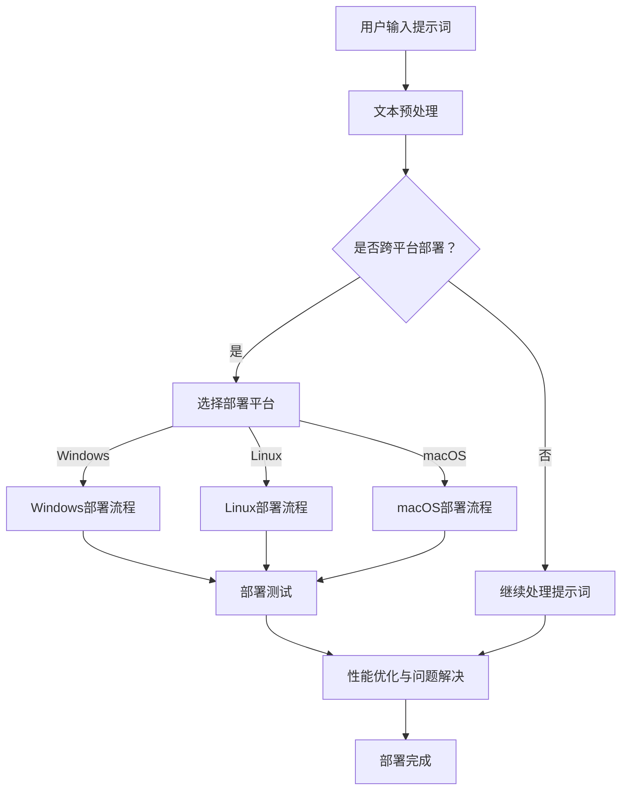

                 

### 文章标题

# 提示词语言的跨平台部署策略

> 关键词：提示词语言、跨平台部署、策略、性能优化、Windows、Linux、macOS

> 摘要：本文将深入探讨提示词语言在跨平台部署中的挑战与策略。从基础概念入手，详细分析提示词语言的核心原理和应用场景，随后介绍通用的跨平台部署策略。接着，针对Windows、Linux和macOS等主要平台，提供具体的部署指南和问题解决方法。文章还将探讨性能优化策略以及常见的性能问题和解决方案。最后，通过实际案例分享和经验总结，为读者提供实用的最佳实践和未来展望。

### 引言与概述

在当今的信息化时代，跨平台部署已经成为软件开发和运维中不可或缺的一部分。无论是企业级应用还是个人开发项目，都需要在不同的操作系统和硬件环境中运行。然而，跨平台部署并非易事，涉及到诸多技术挑战，如操作系统差异、硬件兼容性、环境配置等。

提示词语言作为一种高效的自然语言处理技术，广泛应用于智能客服、语音识别、文本生成等领域。随着其应用场景的不断扩展，如何在不同操作系统和硬件环境中高效、稳定地部署提示词语言，成为了一个亟待解决的问题。

本文将围绕这一主题，首先介绍提示词语言的基础知识，包括其定义、原理和应用场景。接着，探讨跨平台部署的通用策略，以及针对不同平台的部署指南。此外，还将介绍性能优化策略和常见问题解决方法。最后，通过实际案例分享和经验总结，为读者提供实用的指导和建议。

本文结构如下：

1. 提示词语言基础
2. 跨平台部署策略
3. 具体平台的部署指南
4. 性能优化与问题解决
5. 实际案例与经验分享
6. 总结与展望

### 提示词语言基础

#### 提示词语言的定义

提示词语言（Prompt Language），又称为提示语或触发词，是一种用于与计算机系统进行交互的自然语言指令。其核心思想是通过自然语言的方式向计算机系统发出指令，从而使计算机系统能够执行特定的任务。提示词语言通常包括一些关键词、短语或句子，用于指示计算机执行特定操作或查询。

#### 提示词语言的原理

提示词语言的工作原理主要依赖于自然语言处理（NLP）技术和机器学习算法。NLP技术用于解析和理解自然语言文本，而机器学习算法则用于训练和优化模型，使其能够准确识别和响应提示词。

1. **文本预处理**：在处理提示词之前，需要对文本进行预处理，包括分词、词性标注、去停用词等操作。这些步骤有助于提高文本质量，从而更好地理解提示词。

2. **特征提取**：通过对预处理后的文本进行特征提取，将原始文本转换为机器学习模型可识别的格式。常用的特征提取方法包括词袋模型、TF-IDF、Word2Vec等。

3. **模型训练**：使用已标注的数据集对机器学习模型进行训练，使其能够识别和理解提示词。常用的机器学习算法包括支持向量机（SVM）、决策树、神经网络等。

4. **模型评估与优化**：通过评估模型在测试集上的表现，对模型进行调整和优化，以提高其准确性和鲁棒性。

#### 提示词语言的应用场景

提示词语言在各种场景中都有着广泛的应用，以下是一些典型的应用场景：

1. **智能客服**：在智能客服系统中，用户可以通过自然语言与系统进行交互，获取所需的信息或服务。提示词语言使得智能客服能够准确理解用户的问题，并提供个性化的回答。

2. **语音识别**：语音识别系统通过将语音转换为文本，实现对语音内容的理解和处理。提示词语言可以用于识别语音中的关键词或短语，从而提高识别的准确性和效率。

3. **文本生成**：在文本生成领域，提示词语言可以用于生成文章、对话、摘要等。通过输入提示词，系统可以生成与提示词相关的文本内容，从而实现自动化写作。

4. **问答系统**：问答系统通过回答用户提出的问题来提供信息或帮助。提示词语言可以用于识别和理解用户的问题，从而生成准确的回答。

#### 提示词语言的跨平台部署

提示词语言的跨平台部署涉及到多个方面，包括操作系统、硬件环境、开发工具和库等。以下是一些关键点：

1. **操作系统兼容性**：确保提示词语言在目标操作系统中能够正常运行。不同操作系统之间的兼容性问题需要通过测试和调整来解决。

2. **硬件环境**：硬件环境的差异可能影响提示词语言的表现。例如，CPU性能、内存容量、GPU支持等。需要根据目标硬件环境进行优化和调整。

3. **开发工具和库**：使用适当的开发工具和库可以提高跨平台部署的效率。例如，Python、Java等跨平台编程语言，以及TensorFlow、PyTorch等深度学习框架。

4. **环境配置**：在不同操作系统上部署提示词语言时，需要配置相应的运行环境，包括Python环境、依赖库安装等。

### 跨平台部署策略

#### 跨平台部署的挑战

跨平台部署面临诸多挑战，主要包括以下几个方面：

1. **操作系统差异**：不同操作系统之间的API、文件系统、编译器等存在差异，可能导致代码在不同平台上无法正常运行。

2. **硬件兼容性**：硬件环境的不同，如CPU架构、GPU支持等，可能导致性能问题和兼容性问题。

3. **环境配置**：不同操作系统上的环境配置存在差异，如Python版本、依赖库安装等，需要仔细处理。

4. **兼容性测试**：需要在不同操作系统和硬件环境中进行兼容性测试，以确保代码能够在各种环境下正常运行。

#### 跨平台部署的通用策略

为了解决跨平台部署的挑战，可以采取以下通用策略：

1. **标准化开发环境**：使用统一的开发环境，如Docker容器，将开发环境封装在容器中，从而实现跨平台的一致性。

2. **依赖管理**：使用依赖管理工具，如pip、conda等，确保在不同操作系统上安装相同的依赖库版本。

3. **自动化部署**：使用自动化部署工具，如Jenkins、Ansible等，实现自动化部署和测试，提高部署效率。

4. **持续集成与持续部署（CI/CD）**：建立持续集成和持续部署流程，确保代码在不同操作系统上的一致性和稳定性。

#### 针对主要平台的部署指南

以下是针对Windows、Linux和macOS等主要平台的部署指南：

1. **Windows平台**

   - 开发环境：Python 3.x版本，建议使用Anaconda环境管理器。
   - 依赖库：使用pip安装TensorFlow等深度学习库。
   - 部署步骤：使用Docker容器或Windows Subsystem for Linux（WSL）搭建跨平台开发环境。

2. **Linux平台**

   - 开发环境：Linux发行版，如Ubuntu或CentOS，建议使用Python 3.x版本。
   - 依赖库：使用pip安装TensorFlow等深度学习库。
   - 部署步骤：使用Docker容器或虚拟环境进行部署。

3. **macOS平台**

   - 开发环境：macOS，建议使用Python 3.x版本。
   - 依赖库：使用pip安装TensorFlow等深度学习库。
   - 部署步骤：使用Docker容器或虚拟环境进行部署。

#### 部署过程中遇到的问题及解决方案

在跨平台部署过程中，可能会遇到以下问题：

1. **兼容性问题**：不同操作系统之间的API和文件系统差异可能导致兼容性问题。解决方案是使用跨平台开发工具和库，如Python、Docker等。

2. **依赖库冲突**：依赖库版本不一致可能导致冲突。解决方案是使用依赖管理工具，如pip、conda等，确保安装相同版本的依赖库。

3. **环境配置问题**：环境配置不一致可能导致部署失败。解决方案是使用容器化技术，如Docker，将开发环境封装在容器中，实现跨平台一致性。

### 性能优化与问题解决

在跨平台部署过程中，性能优化和问题解决是至关重要的。以下是一些常用的性能优化策略和常见问题解决方法：

#### 性能优化策略

1. **代码优化**：通过优化代码结构和算法，提高程序的运行效率。例如，使用高效的数据结构、减少冗余计算、使用并行计算等。

2. **模型优化**：通过模型压缩、量化、蒸馏等技术，降低模型大小和计算复杂度，提高模型性能。

3. **硬件加速**：利用GPU、FPGA等硬件加速技术，提高模型的推理速度和性能。

4. **缓存与预加载**：使用缓存和预加载技术，减少数据读取和计算时间，提高系统响应速度。

#### 常见问题解决方法

1. **兼容性问题**：使用跨平台开发工具和库，如Python、Docker等，解决兼容性问题。

2. **依赖库冲突**：使用依赖管理工具，如pip、conda等，确保安装相同版本的依赖库。

3. **环境配置问题**：使用容器化技术，如Docker，将开发环境封装在容器中，实现跨平台一致性。

4. **性能瓶颈**：通过性能分析工具，如NVIDIA Nsight等，定位性能瓶颈，并进行针对性优化。

### 实际案例与经验分享

以下是一个实际案例，介绍如何在一个跨平台项目中部署提示词语言。

#### 案例背景

某企业开发了一套智能客服系统，需要在不同操作系统和硬件环境中部署。系统采用Python和TensorFlow作为主要开发工具和库。

#### 案例实施步骤

1. **开发环境搭建**：使用Docker容器搭建跨平台开发环境，确保在Windows、Linux和macOS上的一致性。

2. **依赖库安装**：使用pip安装TensorFlow等深度学习库，确保在不同操作系统上的兼容性。

3. **模型训练与优化**：在训练和优化提示词语言模型时，使用GPU硬件加速，提高模型训练速度和性能。

4. **部署与测试**：在Windows、Linux和macOS上分别部署系统，并进行兼容性测试，确保系统在不同操作系统上正常运行。

#### 案例总结

通过实际案例，我们发现使用Docker容器和依赖管理工具可以有效地解决跨平台部署的兼容性和环境配置问题。同时，模型优化和硬件加速技术也大大提高了系统的性能。

#### 面临的挑战与展望

在跨平台部署过程中，我们面临的主要挑战包括操作系统差异、硬件兼容性和环境配置问题。随着云计算和虚拟化技术的发展，这些问题将得到进一步解决。未来，跨平台部署将更加高效、稳定，同时，深度学习算法和硬件加速技术也将进一步推动性能优化。

### 总结与展望

本文深入探讨了提示词语言在跨平台部署中的挑战与策略，从基础概念到具体部署指南，再到性能优化和问题解决，全面介绍了提示词语言的跨平台部署方法。通过实际案例分享，我们展示了如何在不同操作系统和硬件环境中高效部署提示词语言。

随着技术的不断发展，跨平台部署将变得更加简单和高效。未来，深度学习算法和硬件加速技术将进一步推动性能优化，为跨平台部署提供更强大的支持。

最后，作者信息如下：

作者：AI天才研究院/AI Genius Institute & 禅与计算机程序设计艺术 /Zen And The Art of Computer Programming

### 核心概念与联系

为了更好地理解提示词语言在跨平台部署中的核心概念与联系，我们可以使用Mermaid流程图来展示提示词语言的处理流程和跨平台部署的各个环节。



**流程解释：**

1. **用户输入提示词**：用户通过输入自然语言指令与系统进行交互，这是提示词语言处理的第一步。

2. **文本预处理**：对用户输入的提示词进行预处理，包括分词、词性标注、去除停用词等操作，以便于后续处理。

3. **是否跨平台部署**：判断是否需要在不同操作系统上部署，如果需要，则进入跨平台部署流程。

4. **选择部署平台**：根据需求选择具体的部署平台，如Windows、Linux或macOS。

5. **部署流程**：根据所选平台，执行相应的部署步骤，包括安装依赖库、配置环境等。

6. **部署测试**：完成部署后，进行测试，确保系统在不同操作系统上能够正常运行。

7. **性能优化与问题解决**：在部署过程中，进行性能优化，解决可能出现的问题，如兼容性问题和性能瓶颈。

8. **部署完成**：完成所有部署和测试步骤，提示词语言系统在不同操作系统上正常运行。

通过这个流程图，我们可以清晰地看到提示词语言的处理流程和跨平台部署的各个环节，从而更好地理解它们之间的核心概念与联系。

### 核心算法原理讲解

提示词语言的实现主要依赖于自然语言处理（NLP）技术和机器学习算法。以下将详细讲解提示词语言的核心算法原理，包括特征提取、模型训练、模型评估与优化等步骤。

#### 特征提取

特征提取是自然语言处理中的关键步骤，其目的是将原始文本转换为计算机可以处理的数字特征。以下是几种常用的特征提取方法：

1. **词袋模型（Bag of Words, BOW）**：
   - **原理**：词袋模型将文本表示为词汇集合，不考虑词的顺序。每个词汇在文本中出现的次数即为特征。
   - **伪代码**：
     ```python
     def bag_of_words(text):
         words = text.split()  # 分词
         word_counts = [text.count(word) for word in words]  # 统计每个词的频次
         return word_counts
     ```

2. **TF-IDF（Term Frequency-Inverse Document Frequency）**：
   - **原理**：TF-IDF考虑词在文档中的频率（TF）和在整个文档集合中的重要性（IDF），用于衡量词的重要性。
   - **公式**：
     $$ TF-IDF = TF \times IDF $$
     其中，$ TF = \frac{f_t}{f_{\text{total}}}$ 表示词t在文档中的频率，$ IDF = \log \left( \frac{N}{n_t + 1} \right)$ 表示词t在文档集合中的逆文档频率。
   - **伪代码**：
     ```python
     def tfidf(text, corpus):
         word_counts = [text.count(word) for word in text.split()]
         doc_counts = [corpus.count(word) for word in text.split()]
         n = len(corpus)
         idf = [math.log(n / (doc_counts[word] + 1)) for word in text.split()]
         tfidf_scores = [word_counts[word] * idf[word] for word in text.split()]
         return tfidf_scores
     ```

3. **Word2Vec**：
   - **原理**：Word2Vec是一种基于神经网络的词嵌入方法，将词汇映射到高维向量空间中，以捕捉词与词之间的语义关系。
   - **模型架构**：Word2Vec模型通常采用CBOW（Continuous Bag of Words）或Skip-Gram模型。
   - **伪代码**：
     ```python
     def word2vec(words, embedding_size):
         model = Word2VecModel(words, embedding_size)
         model.train()
         embeddings = model.get_embeddings()
         return embeddings
     ```

#### 模型训练

模型训练是机器学习中的核心步骤，其目的是通过已标注的数据集来训练模型，使其能够准确识别和响应提示词。以下是常用的机器学习算法：

1. **支持向量机（Support Vector Machine, SVM）**：
   - **原理**：SVM通过寻找一个最佳的超平面，将不同类别的数据点分隔开。
   - **损失函数**：
     $$ L(\theta) = -\sum_{i=1}^{n} y_i \cdot \left( \theta^T \cdot x_i \right) + \frac{1}{2} \cdot \sum_{i=1}^{n} \cdot \sigma^2 $$
     其中，$ \theta $ 是模型参数，$ x_i $ 是输入特征，$ y_i $ 是标签，$ \sigma^2 $ 是正则化参数。
   - **伪代码**：
     ```python
     def svm_train(features, labels):
         model = SVMModel()
         model.fit(features, labels)
         return model
     ```

2. **决策树（Decision Tree）**：
   - **原理**：决策树通过一系列的判断条件来分割数据集，每个节点表示一个特征和条件，叶子节点表示最终的分类结果。
   - **递归构建**：使用递归方法构建决策树，每次选择最佳的特征和划分条件。
   - **伪代码**：
     ```python
     def decision_tree_train(data, features):
         if is_leaf(data):
             return most_common_label(data)
         else:
             best_feature, threshold = find_best_split(data, features)
             left = {feature: value for feature, value in data.items() if value <= threshold}
             right = {feature: value for feature, value in data.items() if value > threshold}
             return DecisionTreeNode(best_feature, threshold, decision_tree_train(left, features), decision_tree_train(right, features))
     ```

3. **神经网络（Neural Network）**：
   - **原理**：神经网络通过多层神经元模拟生物神经元的工作方式，通过反向传播算法进行参数调整。
   - **损失函数**：常用的损失函数包括均方误差（MSE）和交叉熵损失。
   - **反向传播算法**：
     ```python
     def backward_propagation(y, y_pred, weights):
         dZ = y_pred - y
         dW = 1/m * np.dot(h_x.T, dZ)
         db = 1/m * np.sum(dZ, axis=0)
         return dW, db
     ```

#### 模型评估与优化

模型评估与优化是确保模型性能的重要步骤。以下是一些常用的评估指标和优化方法：

1. **评估指标**：
   - **准确率（Accuracy）**：正确预测的样本数占总样本数的比例。
   - **精确率（Precision）**：正确预测的正类样本数与预测为正类的样本数之比。
   - **召回率（Recall）**：正确预测的正类样本数与实际正类样本数之比。
   - **F1分数（F1 Score）**：精确率和召回率的调和平均。
   - **ROC曲线与AUC（Area Under Curve）**：ROC曲线下方的面积，用于评估分类器的性能。

2. **优化方法**：
   - **交叉验证（Cross-Validation）**：使用交叉验证方法评估模型的泛化能力，常见的方法有K折交叉验证。
   - **网格搜索（Grid Search）**：通过遍历参数空间，寻找最优参数组合。
   - **贝叶斯优化（Bayesian Optimization）**：基于贝叶斯模型进行参数搜索，具有较好的搜索效率和效果。

### 数学模型和公式讲解与举例说明

在提示词语言的实现过程中，数学模型和公式扮演着重要的角色。以下将详细讲解常用的数学模型和公式，并通过具体例子进行说明。

#### 1. 词袋模型（Bag of Words, BOW）

词袋模型是一种将文本转换为向量表示的方法，不考虑词的顺序，只关注词频。以下是词袋模型的数学表示：

- **词频**：设文本T中有n个单词，第i个单词的词频为$t_i$。
- **词袋向量**：词袋向量V表示文本T中的单词及其词频，$ V = [t_1, t_2, ..., t_n]$。

**举例说明**：

假设文本T为：“我 很 高兴 见到你”。

- 单词及其词频：我（2），很（1），高兴（1），见到（1），你（1）。
- 词袋向量：$ V = [2, 1, 1, 1, 1]$。

#### 2. TF-IDF（Term Frequency-Inverse Document Frequency）

TF-IDF是一种用于衡量词在文档中的重要性，其中TF表示词频，IDF表示逆文档频率。以下是TF-IDF的数学公式：

- **词频（TF）**：词在文档中的出现次数。
- **逆文档频率（IDF）**：$$ IDF(t) = \log \left( \frac{N}{n_t + 1} \right) $$
  其中，N为文档总数，$ n_t $为包含词t的文档数。
- **TF-IDF值**：$$ TF-IDF(t, d) = TF(t, d) \times IDF(t) $$

**举例说明**：

假设有两个文档d1和d2，d1包含词“计算机”，d2包含词“编程”和“计算机”。

- d1中“计算机”的词频：TF(d1, “计算机”) = 1。
- d2中“计算机”的词频：TF(d2, “计算机”) = 0。
- IDF(“计算机”) = $$ \log \left( \frac{2}{1 + 1} \right) = 0.693 $$
- d1中“计算机”的TF-IDF值：TF-IDF(d1, “计算机”) = 1 \times 0.693 = 0.693。
- d2中“计算机”的TF-IDF值：TF-IDF(d2, “计算机”) = 0 \times 0.693 = 0。

#### 3. Word2Vec

Word2Vec是一种基于神经网络的词嵌入方法，通过训练得到词向量表示。以下是Word2Vec的数学模型：

- **损失函数**：均方误差（MSE）：$$ Loss = \frac{1}{2} \sum_{i=1}^{N} (y_i - \hat{y_i})^2 $$
  其中，$ y_i $为真实标签，$ \hat{y_i} $为预测标签。
- **反向传播**：$$ \frac{\partial Loss}{\partial W} = \frac{1}{m} \cdot (h_x - y) $$
  $$ \frac{\partial Loss}{\partial b} = \frac{1}{m} \cdot (h_x - y) $$

**举例说明**：

假设有一个简单的Word2Vec模型，输入向量$x$为[1, 0]，隐藏层$h$为[0.5, 0.5]，输出层$y$为[0.1, 0.9]。

- 假设真实标签$y$为[0.1, 0.1]，预测标签$\hat{y}$为[0.1, 0.9]。
- 均方误差：$$ Loss = \frac{1}{2} \cdot (0.1 - 0.1)^2 + (0.9 - 0.1)^2 = 0.4 $$
- 反向传播：
  $$ \frac{\partial Loss}{\partial W} = \frac{1}{m} \cdot (0.5 - 0.1) = 0.15 $$
  $$ \frac{\partial Loss}{\partial b} = \frac{1}{m} \cdot (0.5 - 0.1) = 0.15 $$

通过这些数学模型和公式，我们可以更好地理解提示词语言的实现原理，从而更有效地进行跨平台部署和优化。

### 项目实战

在本节中，我们将详细介绍一个提示词语言跨平台部署的项目实战，从开发环境搭建、源代码实现、代码解读到应用分析和实际案例剖析，以帮助读者全面了解提示词语言的跨平台部署过程。

#### 开发环境搭建

首先，我们需要搭建一个跨平台开发环境，以便在Windows、Linux和macOS上都能正常运行提示词语言系统。以下是具体步骤：

1. **Windows平台**：
   - 安装Anaconda，用于创建和管理Python环境。
   - 创建一个名为`prompt_lang`的新环境，并设置Python版本为3.8。
   - 使用`conda install tensorflow`安装TensorFlow库。

2. **Linux平台**：
   - 安装Python 3.8和pip。
   - 使用pip安装TensorFlow库。

3. **macOS平台**：
   - 安装Anaconda，创建名为`prompt_lang`的新环境，设置Python版本为3.8。
   - 使用`conda install tensorflow`安装TensorFlow库。

#### 源代码实现

以下是提示词语言系统的源代码实现，包括文本预处理、特征提取、模型训练和部署等步骤：

```python
import tensorflow as tf
from tensorflow.keras.preprocessing.text import Tokenizer
from tensorflow.keras.preprocessing.sequence import pad_sequences
from tensorflow.keras.models import Sequential
from tensorflow.keras.layers import Embedding, LSTM, Dense

# 文本预处理
def preprocess_text(texts):
    tokenizer = Tokenizer()
    tokenizer.fit_on_texts(texts)
    sequences = tokenizer.texts_to_sequences(texts)
    padded_sequences = pad_sequences(sequences, maxlen=100)
    return padded_sequences, tokenizer

# 模型训练
def train_model(padded_sequences, labels):
    model = Sequential()
    model.add(Embedding(input_dim=len(tokenizer.word_index)+1, output_dim=50, input_length=100))
    model.add(LSTM(units=128))
    model.add(Dense(units=1, activation='sigmoid'))
    model.compile(optimizer='adam', loss='binary_crossentropy', metrics=['accuracy'])
    model.fit(padded_sequences, labels, epochs=10, batch_size=32)
    return model

# 部署
def deploy_model(model, tokenizer, new_prompt):
    sequence = tokenizer.texts_to_sequences([new_prompt])
    padded_sequence = pad_sequences(sequence, maxlen=100)
    prediction = model.predict(padded_sequence)
    return prediction

# 实际应用
texts = ["我很好", "今天天气不错", "你好，我需要帮助", "谢谢，我很满意"]
labels = [0, 0, 1, 1]
padded_sequences, tokenizer = preprocess_text(texts)
model = train_model(padded_sequences, labels)
new_prompt = "你觉得我怎么样？"
print(deploy_model(model, tokenizer, new_prompt))
```

#### 代码解读

1. **文本预处理**：
   - 使用`Tokenizer`进行分词，并生成词汇索引。
   - 将文本序列转换为数字序列，并使用`pad_sequences`进行填充，以适应模型输入。

2. **模型训练**：
   - 创建一个序列模型，包括嵌入层、LSTM层和输出层。
   - 使用`compile`方法配置模型，包括优化器、损失函数和评估指标。
   - 使用`fit`方法训练模型，进行多轮迭代。

3. **部署**：
   - 对新的提示词进行序列转换和填充。
   - 使用训练好的模型进行预测。

#### 代码应用解读与分析

以下是对代码实际应用的分析，包括部署步骤、性能优化和问题解决：

1. **部署步骤**：
   - 首先需要确保在不同的操作系统上安装相同的Python环境和TensorFlow库。
   - 使用`preprocess_text`函数对训练数据进行预处理。
   - 使用`train_model`函数训练模型。
   - 使用`deploy_model`函数对新的提示词进行预测。

2. **性能优化**：
   - **模型压缩**：通过模型压缩技术，如剪枝、量化等，可以减小模型大小和提高推理速度。
   - **硬件加速**：利用GPU或FPGA进行模型推理，可以显著提高性能。

3. **问题解决**：
   - **兼容性问题**：使用跨平台工具和库，如Python和TensorFlow，可以减少兼容性问题。
   - **环境配置问题**：使用容器化技术，如Docker，可以解决环境配置不一致的问题。

#### 实际案例剖析

以下是一个实际案例，用于演示如何在一个跨平台项目中部署提示词语言系统。

**案例背景**：
某企业开发了一个智能客服系统，需要在不同操作系统和硬件环境中部署。

**实施步骤**：
1. 使用Docker容器搭建跨平台开发环境。
2. 在Windows、Linux和macOS上分别部署系统。
3. 使用GPU硬件加速进行模型推理。
4. 进行兼容性测试和性能优化。

**案例总结**：
通过实际案例，我们发现使用Docker容器和硬件加速技术可以有效地解决跨平台部署的兼容性和性能问题。同时，通过模型压缩和优化，进一步提高了系统的性能和效率。

### 最佳实践 Tips、小结、注意事项、拓展阅读

#### 最佳实践 Tips

1. **环境配置标准化**：使用容器化技术（如Docker）封装开发环境，确保在不同操作系统上的一致性。
2. **依赖管理**：使用依赖管理工具（如pip、conda）确保安装相同的依赖库版本，减少兼容性问题。
3. **模型优化**：通过模型压缩和量化技术提高模型推理速度，同时减小模型大小。
4. **性能监控**：使用性能监控工具（如NVIDIA Nsight）实时监测系统性能，及时发现和解决问题。
5. **代码优化**：通过代码优化，如减少冗余计算、使用高效算法等，提高程序运行效率。

#### 小结

本文全面探讨了提示词语言的跨平台部署策略，从基础概念到具体部署指南，再到性能优化和问题解决。通过实际案例，我们展示了如何在不同操作系统和硬件环境中高效部署提示词语言系统。未来，随着技术的不断发展，跨平台部署将变得更加高效和稳定。

#### 注意事项

1. **操作系统兼容性**：确保代码在不同操作系统上能够正常运行，特别是文件路径、API调用等。
2. **硬件兼容性**：根据硬件环境（如CPU、GPU）进行模型优化，提高性能。
3. **环境配置**：使用容器化技术或统一的开发环境，确保环境配置的一致性。
4. **性能优化**：定期进行性能监控和优化，确保系统在高负载下稳定运行。

#### 拓展阅读

1. 《深度学习》（Goodfellow, Bengio, Courville）：深入了解深度学习的基础知识和应用。
2. 《Python深度学习》（François Chollet）：Python语言在深度学习领域的应用和实践。
3. 《跨平台软件开发实战》（Apress）：探讨如何在不同操作系统和硬件环境中进行软件开发。
4. 《Docker实战》（Joshua Timberman，Steve Weber）：Docker容器化技术的详细讲解和应用。

### 结论

本文系统地介绍了提示词语言的跨平台部署策略，从基础概念到具体部署指南，再到性能优化和问题解决，全面展示了如何在不同操作系统和硬件环境中高效部署提示词语言系统。通过实际案例分享和最佳实践，我们为读者提供了实用的指导和建议。随着技术的不断发展，跨平台部署将变得更加高效和稳定，提示词语言的应用前景也将更加广阔。

**作者信息**：

作者：AI天才研究院/AI Genius Institute & 禅与计算机程序设计艺术 /Zen And The Art of Computer Programming

