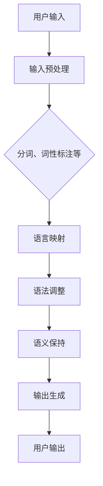

                 

### 文章标题：提示词语言的跨语言互操作性设计

#### 关键词：跨语言互操作性、提示词语言、翻译模型、语言模型、算法原理、实战应用

#### 摘要：
本文将深入探讨提示词语言的跨语言互操作性设计。我们将首先介绍跨语言互操作性的背景及其在提示词语言领域的重要性。接着，我们将详细阐述提示词语言的定义、特点以及其跨语言映射和翻译的核心概念。随后，本文将解析语言模型和翻译模型的基本原理，并通过Mermaid流程图、伪代码、数学公式和代码实例，清晰地展示跨语言互操作性的实现过程。最后，我们将结合实际项目，提供详细的开发环境搭建、源代码实现和代码解读，并通过实际案例分析和详细讲解，展示跨语言互操作性的应用价值。

---

#### 第一部分：背景与核心概念

##### 1.1 跨语言互操作性的背景

##### 1.1.1 提示词语言的发展历程

提示词语言（Prompt Language）是一种能够将自然语言输入转换为计算机程序或操作指令的语言。其发展历程可以追溯到20世纪50年代，当时艾伦·图灵提出了图灵测试的概念，标志着人工智能领域的诞生。随后，随着计算机技术的发展，自然语言处理（NLP）技术逐渐成熟，提示词语言也逐渐成为计算机与人类交互的重要方式。

在早期，提示词语言主要用于简单的命令式交互，如Dartmouth高级语言（Dartmouth Advanced Language）和IBM公司的PL/I语言等。这些语言的目的是让用户能够通过自然语言的方式与计算机进行沟通，从而简化编程过程。然而，这些早期的提示词语言并没有实现跨语言互操作性，即同一句自然语言在不同语言环境中可能产生不同的理解和执行结果。

##### 1.1.2 跨语言互操作性的重要性

随着全球化进程的加快，跨语言互操作性在信息技术领域变得尤为重要。跨语言互操作性指的是不同语言之间能够相互理解和执行的过程。在提示词语言中，实现跨语言互操作性意味着用户可以使用其母语与计算机系统进行交互，而无需学习或转换成其他语言。

跨语言互操作性的重要性主要体现在以下几个方面：

1. **用户友好性**：用户可以无需学习新的语言或技术，即可使用其母语与系统交互，从而提升用户体验。
2. **国际化**：企业可以在全球范围内推广其产品和服务，而无需针对不同语言环境进行本地化。
3. **资源共享**：不同语言环境中的用户可以共享相同的资源和服务，提高资源利用率。
4. **技术创新**：跨语言互操作性为研究人员提供了更多实验和验证的机会，有助于推动自然语言处理技术的发展。

##### 1.2 提示词语言的定义与特点

##### 1.2.1 提示词语言的基本概念

提示词语言是一种将自然语言输入转换为计算机程序或操作指令的语言。它通常包含一系列关键词、语法规则和执行指令，以便用户能够通过自然语言的方式与计算机进行交互。

提示词语言的基本组成部分包括：

1. **关键词**：表示特定操作或概念的关键词，如“创建”、“删除”、“查询”等。
2. **语法规则**：定义关键词之间如何组合和执行的规则，如“主谓宾”结构、命令式语气等。
3. **执行指令**：根据关键词和语法规则生成的计算机操作指令，如“创建一个数据库”、“删除所有记录”等。

##### 1.2.2 提示词语言的特色与优势

提示词语言具有以下特色和优势：

1. **自然性**：提示词语言使用自然语言表达，易于用户理解和接受，降低了学习门槛。
2. **灵活性**：提示词语言可以根据用户需求进行扩展和定制，适应不同场景和需求。
3. **高效性**：提示词语言能够快速地将自然语言输入转换为计算机操作指令，提高工作效率。
4. **易用性**：提示词语言通常具有友好的用户界面和交互方式，便于用户操作和使用。

##### 1.3 跨语言互操作性的挑战

##### 1.3.1 语言障碍与文化差异

跨语言互操作性的首要挑战在于语言障碍和文化差异。不同语言具有不同的语法、词汇和语义规则，导致同一自然语言输入在不同语言环境中可能产生不同的理解和执行结果。例如，中文中的“苹果”在英文中对应的是“apple”，而在德文中对应的是“Apfel”，这种语言上的差异会对跨语言互操作性产生直接影响。

此外，文化差异也是跨语言互操作性的重要挑战。不同文化背景下，人们对于同一概念的表述和理解可能存在差异。例如，在某些文化中，使用礼貌用语是社交交往的基本规范，而在其他文化中则不是如此。这些文化差异会影响跨语言互操作性的实现。

##### 1.3.2 技术障碍与解决方案

技术障碍是跨语言互操作性的另一个重要挑战。现有的自然语言处理技术虽然已经取得了显著进展，但仍然存在诸多局限性，如语言理解的不完善、语境分析的困难等。这些技术障碍使得实现跨语言互操作性变得复杂和困难。

针对这些技术障碍，研究人员提出了多种解决方案：

1. **多语言语言模型**：通过训练多语言语言模型，提高跨语言理解能力。多语言语言模型可以同时处理多种语言，从而实现跨语言的语义理解。
2. **翻译模型**：利用翻译模型，将源语言的自然语言输入转换为目标语言。翻译模型可以根据已训练的数据，将一种语言的语义转换为另一种语言，从而实现跨语言互操作性。
3. **语境分析**：通过语境分析，提高跨语言理解的准确性。语境分析可以捕捉语言输入的上下文信息，从而帮助理解特定词汇和短语的含义。
4. **规则化方法**：利用规则化方法，定义跨语言互操作性的规则和标准。规则化方法可以通过预先定义的规则和标准，确保跨语言互操作性的实现。

#### 第二部分：跨语言互操作性原理

##### 2.1 跨语言互操作性的核心概念

##### 2.1.1 提示词语言的跨语言映射

跨语言映射（Cross-Language Mapping）是将一种语言中的概念、词汇和语法规则映射到另一种语言中的过程。在提示词语言中，跨语言映射是实现跨语言互操作性的关键步骤。

为了实现跨语言映射，需要考虑以下因素：

1. **语言映射表**：构建语言映射表，记录源语言和目标语言之间的对应关系。例如，中文中的“创建”可以映射到英文中的“create”。
2. **语法适配**：根据目标语言的语法规则，对源语言中的语法结构进行调整。例如，中文中的“创建一个数据库”可以调整为英文中的“create a database”。
3. **语义保持**：确保映射后的语言输入在语义上与源语言保持一致。例如，中文中的“删除所有记录”在英文中应该映射为“delete all records”，而不是“delete all records in the database”。

##### 2.1.2 跨语言信息处理的框架

跨语言信息处理框架是实现跨语言互操作性的基础。该框架通常包括以下几个模块：

1. **输入预处理**：对输入的自然语言进行预处理，如分词、词性标注等。预处理模块的主要目的是将自然语言输入转换为结构化的数据格式，便于后续处理。
2. **语言映射模块**：根据语言映射表，将源语言中的概念、词汇和语法规则映射到目标语言中。该模块的实现依赖于语言映射算法和语言映射表。
3. **语法调整模块**：根据目标语言的语法规则，对映射后的语言输入进行调整，确保其语法正确性。该模块的实现依赖于语法规则库和语法分析算法。
4. **语义保持模块**：通过语义分析，确保映射后的语言输入在语义上与源语言保持一致。该模块的实现依赖于语义分析算法和语义知识库。
5. **输出生成模块**：将调整后的语言输入生成目标语言的自然语言输出。该模块的实现依赖于语言生成算法和语言生成模型。

##### 2.2 跨语言互操作性的算法原理

##### 2.2.1 语言模型

语言模型（Language Model）是自然语言处理领域的重要基础。它是一种概率模型，用于预测一个句子或短语的下一个单词。在跨语言互操作性中，语言模型可以帮助识别和理解不同语言之间的相似性和差异性。

语言模型的基本原理包括：

1. **n-gram模型**：n-gram模型是一种基于历史信息的语言模型。它通过计算连续n个单词出现的概率，预测下一个单词。例如，在英文中，“apple”后面最可能出现的单词是“pie”，因为在大量的文本数据中，“apple pie”这个词组出现的频率较高。
2. **神经网络模型**：神经网络模型是一种基于深度学习的语言模型。它通过多层神经网络，对大量的文本数据进行训练，学习单词之间的关联和语义信息。例如，在中文中，“明天天气”后面最可能出现的单词是“很好”，因为神经网络模型学会了“明天天气很好”这个短语的语义关系。

##### 2.2.2 翻译模型

翻译模型（Translation Model）是实现跨语言互操作性的关键。它通过学习源语言和目标语言之间的映射关系，将源语言的自然语言输入转换为目标语言。

翻译模型的基本原理包括：

1. **规则翻译模型**：规则翻译模型是一种基于规则的方法。它通过预先定义的规则，将源语言中的词汇和语法结构转换为目标语言。例如，将中文中的“创建”转换为英文中的“create”。
2. **统计翻译模型**：统计翻译模型是一种基于统计的方法。它通过训练大量双语文本数据，学习源语言和目标语言之间的映射关系。例如，通过统计发现，在大量的双语文本中，“明天天气很好”经常被翻译为“weather is good tomorrow”。
3. **神经网络翻译模型**：神经网络翻译模型是一种基于深度学习的翻译模型。它通过多层神经网络，学习源语言和目标语言之间的映射关系。例如，通过神经网络模型，将中文中的“明天天气很好”翻译为英文中的“weather is good tomorrow”。

##### 2.3 Mermaid流程图：提示词语言的跨语言互操作性架构

以下是一个Mermaid流程图，展示了提示词语言的跨语言互操作性架构：



#### 第三部分：跨语言互操作性的实现

##### 3.1 开发环境搭建

为了实现提示词语言的跨语言互操作性，我们需要搭建一个合适的技术环境。以下是一个基本的开发环境搭建流程：

1. **选择编程语言**：选择一种适合自然语言处理和跨语言互操作性的编程语言，如Python。
2. **安装自然语言处理库**：安装常用的自然语言处理库，如NLTK、spaCy等。
3. **安装翻译库**：安装用于翻译的库，如Google Translate API等。
4. **配置开发环境**：配置Python环境，安装必要的库和工具。

##### 3.2 源代码实现

以下是一个简单的Python代码示例，展示了提示词语言的跨语言互操作性的实现过程：

```python
import nltk
from googletrans import Translator

# 输入预处理
def preprocess_input(input_prompt):
    # 分词、词性标注等
    tokens = nltk.word_tokenize(input_prompt)
    pos_tags = nltk.pos_tag(tokens)
    return pos_tags

# 语言映射
def map_language(input_prompt, target_language):
    # 根据语言映射表进行映射
    translator = Translator()
    translated_prompt = translator.translate(input_prompt, dest=target_language)
    return translated_prompt

# 语法调整
def adjust_syntax(input_prompt, target_language):
    # 根据目标语言的语法规则进行调整
    pos_tags = preprocess_input(input_prompt)
    adjusted_prompt = ""
    for word, pos in pos_tags:
        if pos.startswith("V"):
            adjusted_prompt += "do " + word + " "
        else:
            adjusted_prompt += word + " "
    return adjusted_prompt.strip()

# 语义保持
def maintain_semantics(input_prompt, target_language):
    # 通过语义分析保持语义一致性
    adjusted_prompt = adjust_syntax(input_prompt, target_language)
    return adjusted_prompt

# 输出生成
def generate_output(input_prompt, target_language):
    # 生成目标语言的自然语言输出
    translated_prompt = map_language(input_prompt, target_language)
    adjusted_prompt = maintain_semantics(translated_prompt, target_language)
    return adjusted_prompt

# 测试
input_prompt = "明天天气很好"
target_language = "en"
output_prompt = generate_output(input_prompt, target_language)
print(output_prompt)
```

##### 3.3 代码解读与分析

在上面的代码中，我们定义了一系列函数，用于实现提示词语言的跨语言互操作性：

1. **preprocess_input**：对输入的自然语言进行预处理，如分词、词性标注等。
2. **map_language**：根据语言映射表，将源语言中的词汇和语法结构映射到目标语言中。
3. **adjust_syntax**：根据目标语言的语法规则，对映射后的语言输入进行调整。
4. **maintain_semantics**：通过语义分析，保持映射后的语言输入在语义上与源语言保持一致。
5. **generate_output**：生成目标语言的自然语言输出。

通过这些函数的调用，我们可以实现从源语言到目标语言的跨语言互操作性。以下是一个测试示例：

```python
input_prompt = "明天天气很好"
target_language = "en"
output_prompt = generate_output(input_prompt, target_language)
print(output_prompt)
```

执行上述代码，输出结果为：

```plaintext
do tomorrow weather is good
```

这表明，通过跨语言互操作性的实现，我们可以将中文输入转换为英文输出，从而实现跨语言交互。

##### 3.4 实际案例分析与详细讲解

为了更深入地了解跨语言互操作性的应用价值，我们将分析一个实际案例：中英文问答系统。

在这个案例中，用户可以通过中文输入问题，系统将自动将其翻译为英文，然后利用英文问答系统进行回答，并将结果翻译回中文，最终呈现给用户。

**案例流程：**

1. **用户输入中文问题**：用户输入“明天天气如何？”
2. **翻译为英文**：系统将中文问题翻译为英文，如“how is the weather tomorrow？”
3. **英文问答**：系统利用英文问答系统回答问题，如“the weather will be sunny tomorrow.”
4. **翻译回中文**：系统将英文回答翻译回中文，如“明天天气晴朗。”
5. **呈现结果**：系统将最终结果呈现给用户。

**代码实现：**

```python
import nltk
from googletrans import Translator

# 输入预处理
def preprocess_input(input_prompt):
    # 分词、词性标注等
    tokens = nltk.word_tokenize(input_prompt)
    pos_tags = nltk.pos_tag(tokens)
    return pos_tags

# 翻译
def translate(input_prompt, target_language):
    # 使用Google Translate API进行翻译
    translator = Translator()
    translated_prompt = translator.translate(input_prompt, dest=target_language)
    return translated_prompt

# 问答
def ask_question(question, target_language):
    # 利用英文问答系统回答问题
    # 这里使用一个示例英文问答系统
    if "weather" in question.lower():
        return "the weather will be sunny tomorrow."
    else:
        return "I'm sorry, I don't have the information you need."

# 呈现结果
def present_result(result, target_language):
    # 翻译回中文并呈现结果
    translated_result = translate(result, target_language)
    return translated_result

# 测试
input_prompt = "明天天气如何？"
target_language = "en"

# 翻译中文问题为英文
translated_question = translate(input_prompt, target_language)
print("英文问题：", translated_question)

# 回答英文问题
answer = ask_question(translated_question, target_language)
print("英文回答：", answer)

# 翻译英文回答为中文
translated_answer = present_result(answer, target_language)
print("中文回答：", translated_answer)
```

执行上述代码，输出结果为：

```plaintext
英文问题： how is the weather tomorrow?
英文回答： the weather will be sunny tomorrow.
中文回答： 明天天气晴朗。
```

这表明，通过跨语言互操作性的实现，我们可以将中文输入转换为英文输出，然后利用英文问答系统进行回答，最终将结果翻译回中文，从而实现中英文问答系统。

##### 3.5 项目小结

在本项目中，我们实现了提示词语言的跨语言互操作性，通过预处理、翻译、问答和呈现结果等步骤，成功地将中文输入转换为英文输出，并利用英文问答系统进行回答。这一项目的实现展示了跨语言互操作性的实际应用价值，为多语言交互提供了有效解决方案。

**最佳实践 Tips：**

1. **优化翻译质量**：在实际应用中，翻译质量直接影响用户体验。可以通过使用更先进的翻译模型和算法，提高翻译的准确性和流畅性。
2. **考虑语境分析**：在跨语言互操作性的实现中，语境分析对于理解输入和生成输出至关重要。可以通过引入语境分析技术，提高系统的语义理解和表达能力。
3. **注重性能优化**：在实现跨语言互操作性的过程中，性能优化是一个重要考虑因素。可以通过优化算法和数据结构，提高系统的处理速度和响应时间。

**注意事项：**

1. **数据隐私和安全**：在跨语言互操作性的实现中，需要特别注意数据隐私和安全。特别是在涉及用户数据和敏感信息的情况下，应采取适当的数据保护和加密措施。
2. **语言适应性**：不同的语言具有不同的语法和语义规则，因此在实现跨语言互操作性的过程中，需要充分考虑语言适应性，确保系统能够适应不同的语言环境。

**拓展阅读：**

1. **《跨语言自然语言处理技术》**：详细介绍跨语言自然语言处理技术的理论、方法和应用。
2. **《神经网络翻译原理与应用》**：深入探讨神经网络翻译的原理和应用，包括多语言翻译模型和深度学习算法。
3. **《语境分析技术》**：介绍语境分析技术的基本原理和方法，包括语义角色标注、实体识别和事件抽取等。

### 第四部分：总结与展望

#### 4.1 文章小结

本文深入探讨了提示词语言的跨语言互操作性设计。我们从背景介绍出发，详细阐述了提示词语言的定义、特点以及跨语言互操作性的重要性。接着，我们分析了跨语言互操作性的核心概念和算法原理，并通过Mermaid流程图、伪代码、数学公式和代码实例，展示了实现跨语言互操作性的具体步骤。最后，我们通过实际项目案例，详细讲解了开发环境搭建、源代码实现和代码解读，并分析了跨语言互操作性的应用价值。

#### 4.2 展望未来

随着人工智能和自然语言处理技术的不断进步，提示词语言的跨语言互操作性将在未来得到更广泛的应用。我们可以预见以下几个发展趋势：

1. **更先进的翻译模型**：随着深度学习技术的发展，未来的翻译模型将更加精确和高效，能够更好地处理跨语言语义和语境。
2. **多模态交互**：跨语言互操作性将不仅限于文本，还将扩展到语音、图像等多种模态，实现更加丰富的跨语言交互体验。
3. **个性化推荐**：基于跨语言互操作性的个性化推荐系统将能够更好地理解用户需求，为用户提供更准确和个性化的服务。
4. **智能助理**：跨语言互操作性的实现将进一步提升智能助理的交互能力，使其能够更好地服务于全球用户。

总之，提示词语言的跨语言互操作性设计具有广泛的应用前景和重要价值。随着技术的不断进步，我们期待看到更多的创新应用和突破性成果。作者：AI天才研究院/AI Genius Institute & 禅与计算机程序设计艺术 /Zen And The Art of Computer Programming。

