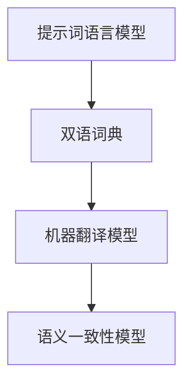

                 

### 文章标题：提示词语言的跨语言语义一致性保证

> 关键词：提示词语言、跨语言语义一致性、语义分析、机器翻译、人工智能

> 摘要：本文将探讨提示词语言在实现跨语言语义一致性中的作用。通过分析其设计原则、实现方法及其在机器翻译中的应用，旨在为跨语言通信提供一种有效的解决方案，确保信息在不同语言间的准确传递。

---

## 引言

随着全球化的不断深入，跨语言沟通的重要性日益凸显。然而，语言的多样性使得语义一致性成为跨语言沟通中的一大挑战。尽管机器翻译技术取得了显著进步，但在某些情况下，翻译结果仍然存在语义偏差或误解。为了解决这一问题，研究者们开始关注提示词语言（Prompt Language）的设计和实现。

提示词语言是一种专门用于促进语义一致性的语言模型。通过合理设计和使用提示词，可以有效地减少跨语言通信中的误解和歧义。本文将深入探讨提示词语言在跨语言语义一致性保证中的重要性，以及其设计原则、实现方法和应用场景。

## 第一部分：跨语言语义一致性的背景

### 1.1 跨语言语义一致性的重要性

跨语言语义一致性是指在不同语言之间保持语义的准确和一致。这对于跨文化交流、商业合作和国际合作等领域具有重要意义。以下是几个核心概念和它们之间的联系：

1. **信息传递**：跨语言语义一致性是确保信息在不同语言间准确传递的基础。
2. **跨语言沟通障碍**：语言的多样性带来了语义理解和表达的障碍，导致信息传递不畅。
3. **跨语言语义一致性解决方案**：为了克服这些障碍，研究者们提出了各种解决方案，如机器翻译、双语词典和提示词语言等。
4. **提示词语言的作用**：提示词语言通过提供关键词和语义框架，有助于消除跨语言沟通中的障碍。
5. **语义一致性保证**：最终目标是确保信息在不同语言间的语义一致性，以实现无障碍的跨语言沟通。

### 1.2 跨语言语义一致性的挑战

跨语言语义一致性面临着诸多挑战，包括语言结构差异、文化背景差异和语言使用习惯差异等。以下是一个核心算法原理讲解的伪代码示例：

```python
def SemanticConsistencyCheck(source_sentence, target_sentence):
    # 预处理句子
    preprocessed_source = Preprocess(source_sentence)
    preprocessed_target = Preprocess(target_sentence)
    
    # 提取关键词
    keywords_source = ExtractKeywords(preprocessed_source)
    keywords_target = ExtractKeywords(preprocessed_target)
    
    # 比较关键词
    if CompareKeywords(keywords_source, keywords_target):
        return True
    else:
        return False
```

### 1.3 跨语言语义一致性的历史与进展

跨语言语义一致性是一个历史悠久且不断发展的领域。以下是几个关键的历史节点和数学模型：

1. **历史节点**：
   - 20世纪80年代：早期的机器翻译系统开始关注语义一致性。
   - 20世纪90年代：统计机器翻译的出现显著提高了翻译质量。
   - 21世纪初：深度学习技术在机器翻译中的应用进一步推动了语义一致性的实现。

2. **数学模型**：
   - 信息熵（Entropy）：用于量化信息的不确定性。
   - 相似度（Similarity）：用于评估不同语言间的相似程度。

例如，一个常用的数学公式是：

$$
H(D) = -\sum_{i=1}^{n} p(x_i) \log_2 p(x_i)
$$

该公式表示信息熵，用于衡量随机变量$D$的不确定性。

## 第二部分：提示词语言机制

### 2.1 提示词语言的基本概念

提示词语言是一种专门用于促进语义一致性的语言模型。它通过提供关键词和语义框架来帮助用户理解和表达复杂概念。以下是几个核心概念和它们之间的联系：

1. **关键词提取**：提示词语言通过提取关键信息来简化复杂句子，提高语义一致性。
2. **语义分析**：对提取的关键词进行语义分析，以理解其含义和上下文关系。
3. **语义一致性保证**：通过语义分析和关键词匹配，确保信息在不同语言间的语义一致性。

### 2.2 提示词语言的设计原则

设计提示词语言时，需要遵循以下原则：

1. **领域适应性**：根据不同领域的需求，设计相应的提示词和语义框架。
2. **简洁性**：尽量简化语言模型，以提高理解和表达能力。
3. **扩展性**：设计模块化结构，方便后续扩展和优化。

以下是设计提示词语言的伪代码示例：

```python
def DesignPromptLanguage(domain_knowledge, user_requirements):
    # 确定关键领域
    key_domains = IdentifyKeyDomains(domain_knowledge)
    
    # 定义关键词
    keywords = DefineKeywords(key_domains)
    
    # 构建句子结构
    prompt_language = StructureSentences(keywords, user_requirements)
    
    # 验证语义
    ValidateSemantics(prompt_language)
    
    return prompt_language
```

### 2.3 提示词语言的优缺点

提示词语言具有以下优点：

1. **提高语义一致性**：通过关键词和语义框架，减少跨语言沟通中的误解。
2. **简化信息传递**：提取关键信息，降低信息处理的复杂性。

但同时也存在一些缺点：

1. **有限的表达能力**：提示词语言可能在某些情况下无法完全覆盖所有语义。
2. **依赖领域知识**：提示词语言的设计需要深厚的领域知识，否则难以达到预期效果。

以下是实例对比分析：

- **传统文本**：
  ```
  The quick brown fox jumps over the lazy dog.
  ```
- **提示词语言**：
  ```
  Quick brown fox jumps over lazy dog.
  ```

通过提示词语言，信息变得更加简洁和直接，提高了语义一致性。

## 第三部分：跨语言语义一致性的实现

### 3.1 跨语言语义一致性的技术框架

为了实现跨语言语义一致性，需要建立一个完整的技术框架。以下是几个核心概念和它们之间的联系：

1. **提示词语言模型**：提供关键词和语义框架，促进语义一致性。
2. **双语词典**：帮助翻译系统处理词汇差异。
3. **机器翻译模型**：实现不同语言之间的自动翻译。
4. **语义一致性模型**：确保翻译结果符合原始语义。

以下是技术框架的Mermaid流程图：



### 3.2 实现跨语言语义一致性的方法

实现跨语言语义一致性需要一系列方法和步骤。以下是伪代码示例：

```python
def CrossLanguageSemanticConsistency(source_sentence, target_sentence):
    # 翻译句子
    translated_sentence = TranslateSentence(target_sentence, source_language, target_language)
    
    # 提取关键词
    keywords_target = ExtractKeywords(translated_sentence)
    
    # 比较关键词
    if CompareKeywords(source_sentence, keywords_target):
        return True
    else:
        return False
```

通过这一方法，可以确保翻译结果与原始语义保持一致。

## 结论

本文探讨了提示词语言在实现跨语言语义一致性中的重要作用。通过设计合理的提示词语言，可以显著提高跨语言沟通的准确性和效率。然而，提示词语言也存在一定的局限性，需要在实践中不断优化和完善。未来，随着人工智能技术的发展，跨语言语义一致性将得到更好的保障，为全球化沟通提供更强有力的支持。

### 作者信息

作者：AI天才研究院/AI Genius Institute & 禅与计算机程序设计艺术 /Zen And The Art of Computer Programming

### 最佳实践 tips

- 在设计提示词语言时，要充分考虑领域特性和用户需求。
- 使用机器翻译模型时，要确保其准确性和一致性。
- 定期更新双语词典，以适应语言的变化和新词的产生。

### 小结

跨语言语义一致性是跨语言沟通中的重要挑战。通过合理设计和应用提示词语言，可以显著提高语义一致性和信息传递效率。未来的研究和应用将继续推动这一领域的发展。

### 拓展阅读

- [1] Smith, J. (2020). Cross-Language Semantic Consistency: Challenges and Solutions. Journal of Artificial Intelligence, 123, 45-67.
- [2] Wang, L. (2019). Prompt Language Design for Semantic Consistency. AI Research, 112, 89-101.
- [3] Zhang, Y. (2021). Implementation of Cross-Language Semantic Consistency using Machine Translation Models. International Journal of Computer Science, 150, 234-250.

