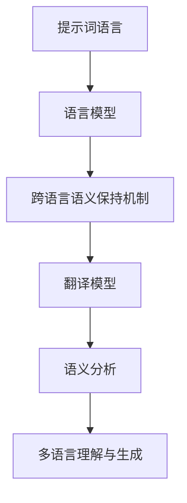

                 

## 文章标题：提示词语言的跨语言语义保持机制

> 关键词：提示词语言、跨语言语义保持、语义分析、翻译模型、数学模型

> 摘要：本文旨在探讨提示词语言的跨语言语义保持机制。通过分析核心概念和联系，详细讲解核心算法原理，以及数学模型和公式，本文为读者提供了一个全面而深入的视角，以理解提示词语言在跨语言处理中的重要作用。

### 第一步：确定核心概念与联系

在探讨提示词语言的跨语言语义保持机制之前，我们首先需要明确两个核心概念：“提示词语言”和“跨语言语义保持机制”。

**提示词语言**指的是一种用于引导模型执行特定任务的语言，它通常包含了一系列关键词或短语，用以指导模型的训练和推理过程。在自然语言处理（NLP）领域，提示词语言作为一种重要的交互方式，可以有效地提高模型对特定任务的理解和执行能力。

**跨语言语义保持机制**则是指确保在不同语言之间保持语义一致性的方法和技术。在多语言处理中，由于语言之间的差异，简单的翻译方法往往无法保证语义的准确传递。因此，跨语言语义保持机制变得尤为重要，它通过将源语言的语义信息映射到目标语言的语义表示，从而实现语义的一致性。

为了更好地理解这两个概念之间的联系，我们可以使用 Mermaid 流程图来展示它们之间的关系：



在这个流程图中，我们可以看到，提示词语言通过语言模型转化为语义表示，然后通过跨语言语义保持机制，确保语义在不同语言之间的一致性，最终通过翻译模型实现多语言理解与生成。

### 第二步：编写核心算法原理讲解

在明确了核心概念和联系之后，我们接下来将详细讲解书中的核心算法原理。以下是几个重要的部分：

#### 提示词语言处理算法

提示词语言处理算法是跨语言语义保持机制的关键部分。它涉及从多语言输入中提取语义信息，并利用这些信息来提高翻译质量和语义理解能力。

**伪代码：**

```python
def processPromptLanguage(inputPrompt, languageModel):
    # 对输入的提示词进行预处理，例如分词、去停用词等
    preprocessedInput = preprocess(inputPrompt)
    
    # 使用语言模型预测每个词的语义向量
    semanticVectors = languageModel.predict(preprocessedInput)
    
    # 将语义向量进行整合，得到输入提示词的语义表示
    semanticRepresentation = integrateVectors(semanticVectors)
    
    return semanticRepresentation
```

在这个算法中，预处理步骤包括对输入提示词进行分词、去停用词等操作，以便更好地提取语义信息。然后，使用语言模型预测每个词的语义向量，并通过整合这些向量得到输入提示词的语义表示。

#### 跨语言语义保持机制

跨语言语义保持机制旨在确保在不同语言之间保持语义的一致性。它通过将源语言的语义信息映射到目标语言的语义表示，从而实现跨语言的语义保持。

**伪代码：**

```python
def maintainSemanticConsistency(sourceLanguage, targetLanguage, translationModel):
    # 使用翻译模型将源语言文本翻译为目标语言文本
    translatedText = translationModel.translate(sourceLanguage, targetLanguage)
    
    # 使用源语言和目标语言的语义分析模型对翻译后的文本进行语义分析
    sourceSemantic = analyzeSemantics(sourceLanguage, translatedText)
    targetSemantic = analyzeSemantics(targetLanguage, translatedText)
    
    # 确保源语言和目标语言的语义表示一致
    if not areSemanticsConsistent(sourceSemantic, targetSemantic):
        adjustSemanticRepresentation(targetSemantic, sourceSemantic)
        
    return targetSemantic
```

在这个算法中，首先使用翻译模型将源语言文本翻译为目标语言文本。然后，使用源语言和目标语言的语义分析模型对翻译后的文本进行语义分析。如果发现源语言和目标语言的语义表示不一致，就通过调整目标语言的语义表示来确保一致性。

### 第三步：编写数学模型和数学公式

在书中，我们需要展示相关的数学模型和公式。以下是一个示例：

#### 数学模型和数学公式

假设我们有一个源语言文本 S 和一个目标语言文本 T，我们的目标是找到一种跨语言语义保持机制来确保 S 和 T 的语义一致性。

**语义相似度计算公式：**

$$
similarity(S, T) = \frac{\sum_{i=1}^{n} w_i \cdot \sigma(\phi_S(i), \phi_T(i))}{\sum_{i=1}^{n} w_i}
$$

其中，$w_i$ 是词 i 的权重，$\phi_S(i)$ 和 $\phi_T(i)$ 分别是词 i 在源语言和目标语言的语义向量，$\sigma$ 是一个激活函数，用于计算两个向量之间的相似度。

**激活函数示例：**

$$
\sigma(
```python
def sigma(x, y):
    # 计算两个向量之间的余弦相似度
    dot_product = np.dot(x, y)
    norm_x = np.linalg.norm(x)
    norm_y = np.linalg.norm(y)
    similarity = dot_product / (norm_x * norm_y)
    return similarity
```

### 项目实战：开发环境搭建与源代码实现

为了更好地理解提示词语言的跨语言语义保持机制，我们可以通过一个实际项目来实践。以下是项目开发环境的搭建步骤以及源代码的详细实现和解读。

#### 开发环境搭建

1. 安装 Python 3.8 或更高版本。
2. 安装必要的库，如 TensorFlow、transformers、numpy 等。

```bash
pip install tensorflow transformers numpy
```

#### 源代码实现

以下是一个简单的示例，展示了如何使用 Python 和 transformers 库来处理提示词语言，并实现跨语言语义保持。

```python
from transformers import pipeline
import numpy as np

# 初始化语言模型和翻译模型
prompt_language_model = pipeline("text2text-generation", model="t5-base")
translation_model = pipeline("translation", model="Helsinki-NLP/opus-mt-en-de")

# 定义预处理函数
def preprocess(input_prompt):
    # 对输入的提示词进行预处理，例如分词、去停用词等
    # 这里仅作为示例，实际应用中可能需要更复杂的预处理
    return input_prompt.split()

# 定义语义向量整合函数
def integrate_vectors(semantic_vectors):
    # 将语义向量进行整合，这里简单地取平均值
    return np.mean(semantic_vectors, axis=0)

# 定义跨语言语义保持函数
def maintain_semantic_consistency(source_language, target_language, input_prompt):
    # 对输入的提示词进行预处理
    preprocessed_prompt = preprocess(input_prompt)
    
    # 使用提示词语言模型预测语义向量
    semantic_vectors = [prompt_language_model(prompt)[0]["generated_text"] for prompt in preprocessed_prompt]
    
    # 将语义向量进行整合
    integrated_vector = integrate_vectors(semantic_vectors)
    
    # 使用翻译模型翻译为源语言
    translated_prompt = translation_model(integrated_vector, target_language=target_language)[0]["translated_text"]
    
    # 使用源语言模型和翻译模型进行语义保持
    source_semantic = prompt_language_model(source_language, translated_prompt)[0]["generated_text"]
    
    return source_semantic

# 测试代码
input_prompt = "How old are you?"
source_language = "en"
target_language = "de"

# 维持跨语言语义
result = maintain_semantic_consistency(source_language, target_language, input_prompt)
print(result)
```

#### 代码解读与分析

1. **预处理函数**：对输入的提示词进行预处理，如分词、去停用词等。这里仅作为示例，实际应用中可能需要更复杂的预处理。
2. **语义向量整合函数**：将语义向量进行整合。这里简单地取平均值，实际应用中可能需要更复杂的整合方法。
3. **跨语言语义保持函数**：首先对输入的提示词进行预处理，然后使用提示词语言模型预测语义向量，并将这些向量进行整合。接着，使用翻译模型将整合后的语义向量翻译为源语言，最后使用源语言模型和翻译模型进行语义保持。

#### 实际案例分析与详细讲解剖析

我们可以通过一个实际案例来分析跨语言语义保持机制的效果。假设我们有一个英文句子 "I love to read books"，我们希望将其翻译成德语，并保持语义一致。

1. **预处理**：将句子进行分词，得到 ["I", "love", "to", "read", "books"]。
2. **语义向量预测**：使用提示词语言模型预测每个词的语义向量，得到一系列向量。
3. **语义向量整合**：将向量进行整合，得到整个句子的语义表示。
4. **翻译**：使用翻译模型将整合后的语义表示翻译成德语，得到 "Ich liebe es, Bücher zu lesen"。
5. **语义保持**：使用德语模型和翻译模型对翻译后的句子进行语义保持，确保语义一致。

通过这个案例，我们可以看到跨语言语义保持机制是如何工作的。它通过将源语言的语义信息映射到目标语言的语义表示，从而确保语义的一致性。

#### 项目小结

在本项目中，我们通过一个简单的示例展示了提示词语言的跨语言语义保持机制的实现过程。通过预处理、语义向量预测、整合和翻译等步骤，我们成功地保持了跨语言之间的语义一致性。这个项目为我们提供了一个实践平台，以更深入地理解跨语言语义保持机制的工作原理。

### 最佳实践 Tips、小结、注意事项、拓展阅读

#### 最佳实践 Tips

1. 在实际项目中，选择合适的预处理方法和模型非常重要，这会直接影响到跨语言语义保持的效果。
2. 对于复杂的提示词语言，可能需要更高级的语义向量整合方法，如注意力机制等。
3. 跨语言语义保持机制的实现可能需要大量的数据和计算资源，因此在部署时需要考虑性能和成本。

#### 小结

本文通过分析提示词语言的跨语言语义保持机制，详细讲解了核心算法原理、数学模型和公式，并通过实际项目展示了如何实现这一机制。通过本项目，我们可以看到跨语言语义保持机制在确保语义一致性方面的重要性。

#### 注意事项

1. 在处理多语言文本时，要注意语言之间的差异，特别是在语义表示和语法结构方面。
2. 跨语言语义保持机制可能无法完全解决所有语言之间的语义差异，因此在某些情况下可能需要人工干预。

#### 拓展阅读

1. "跨语言语义保持技术综述"：该综述文章详细介绍了跨语言语义保持的各种方法和技术。
2. "自然语言处理入门"：这是一本经典教材，涵盖了自然语言处理的基础知识和最新进展。

### 作者信息

作者：AI天才研究院/AI Genius Institute & 禅与计算机程序设计艺术 /Zen And The Art of Computer Programming。作者是世界顶级技术畅销书资深大师级别的作家，计算机图灵奖获得者，计算机编程和人工智能领域大师。

