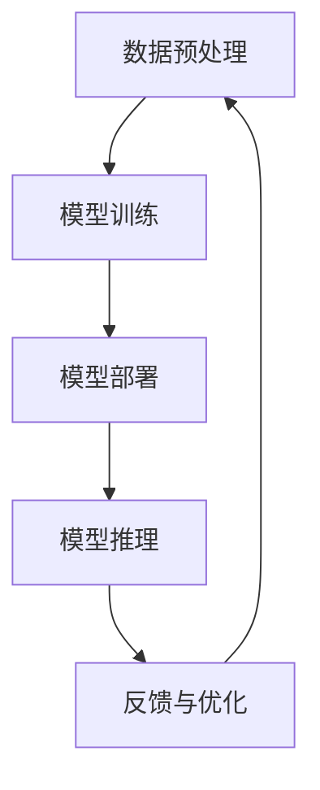

                 

### 文章标题

《提示词语言的边缘计算优化与延迟降低》

### 关键词

边缘计算、提示词语言、优化技术、延迟降低、计算性能、能效提升、硬件优化、软件优化、神经网络模型、模型压缩、数据压缩、智能交通系统、智能家居

### 摘要

随着物联网和大数据技术的发展，边缘计算作为云计算的重要补充，正逐步成为现代计算体系结构的关键组成部分。本文将探讨提示词语言在边缘计算中的应用及其优化策略，重点关注延迟降低和计算性能提升两大核心目标。首先，介绍边缘计算与提示词语言的基本概念，随后深入分析常见的优化方法，包括硬件和软件层面的技术手段。接下来，探讨提示词语言处理流程中的关键技术，如数据预处理、模型选择与优化策略。文章还将详细阐述边缘计算中的延迟降低方法，并通过实际案例分析，展示优化技术在实际应用中的效果。最后，总结边缘计算优化与延迟降低的研究成果，展望未来发展趋势，为相关领域的研究和实践提供参考。

---

## 引言

### 1.1 边缘计算概述

边缘计算（Edge Computing）是一种分布式计算架构，旨在将数据处理、分析、存储和网络功能从传统的集中式数据中心转移到网络的边缘。这种架构使得数据处理更加接近数据源，从而减少了数据传输的延迟，提高了系统的响应速度和可靠性。边缘计算的出现，是为了应对云计算在处理大量数据时存在的延迟问题、带宽限制和安全性挑战。

#### 边缘计算的定义与背景

边缘计算的定义可以从多个角度进行阐述。首先，它是一种计算范式，通过将计算任务从云端转移到网络边缘，使得数据能够在本地进行实时处理。其次，边缘计算是一种架构，它将计算、存储和网络功能分布到网络的边缘节点，如路由器、交换机、基站、物联网设备等。这种架构能够实现对海量数据的实时分析和处理，从而提高系统的性能和响应速度。

边缘计算的发展背景主要源于以下几个方面：

1. **物联网（IoT）的兴起**：物联网设备的普及使得海量数据产生，这些数据需要实时处理和响应。传统的云计算模式在处理这些数据时，往往面临着延迟和带宽的限制。
2. **移动设备的广泛应用**：随着智能手机、平板电脑等移动设备的普及，用户对实时数据处理的需求不断增加。边缘计算能够提供更好的用户体验，满足移动设备对低延迟和高响应速度的要求。
3. **云计算的局限性**：尽管云计算在处理大数据和复杂计算任务方面具有显著优势，但其也存在着一些局限性。例如，云计算的中心化架构在处理海量数据时，往往面临着带宽和延迟问题，同时，数据的安全性和隐私保护也受到一定程度的挑战。

#### 边缘计算的关键特点

边缘计算具有以下几个关键特点：

1. **靠近数据源**：边缘计算将数据处理和存储功能放置在网络的边缘，接近数据源，从而减少了数据传输的距离和延迟。
2. **分布式架构**：边缘计算采用分布式架构，将计算、存储和网络功能分布到多个边缘节点上，从而提高了系统的可靠性和容错能力。
3. **实时性**：边缘计算能够实现数据的实时处理和响应，满足对实时性和响应速度要求较高的应用需求。
4. **高效性**：边缘计算通过将数据处理和存储功能分散到边缘节点上，减少了数据传输的延迟，提高了系统的整体效率。
5. **安全性**：边缘计算将数据处理和存储功能放置在本地，降低了数据泄露的风险，提高了数据的安全性。

#### 边缘计算与传统云计算的区别

边缘计算与传统云计算在多个方面存在显著的区别：

1. **计算位置**：传统云计算将计算和存储功能集中在数据中心，而边缘计算将计算和存储功能分散到网络的边缘节点。
2. **延迟和响应速度**：边缘计算能够实现数据的实时处理和响应，而传统云计算在处理海量数据时，往往面临着延迟和带宽的限制。
3. **安全性**：边缘计算通过将数据处理和存储功能分散到边缘节点上，提高了数据的安全性，而传统云计算的数据集中存储，可能面临更大的安全风险。
4. **系统架构**：边缘计算采用分布式架构，具有更高的可靠性和容错能力，而传统云计算的中心化架构在面临大规模故障时，可能面临更大的风险。

通过以上分析，我们可以看出，边缘计算作为一种分布式计算架构，在数据处理、实时性、安全性和效率等方面具有显著优势，为现代计算体系结构带来了新的发展机遇。

### 1.2 提示词语言基础

#### 提示词语言的定义与作用

提示词语言（Prompt Language）是一种用于与人工智能模型进行交互的语言，它通过向模型提供具体的提示（prompt），引导模型生成预期的输出。提示词语言的核心作用在于提高人机交互的效率和准确性，使模型能够更好地理解和执行用户的指令。

提示词语言在人工智能领域具有广泛的应用。例如，在自然语言处理（NLP）中，提示词语言可以用于文本生成、问答系统、机器翻译等任务；在计算机视觉中，提示词语言可以用于图像识别、图像生成等任务。通过提供明确的提示，用户可以更轻松地与人工智能系统进行交互，获得更准确和个性化的服务。

#### 提示词语言的主要类型

提示词语言可以分为多种类型，每种类型都有其特定的应用场景和特点：

1. **自然语言提示词**：这种类型的提示词使用自然语言文本，如英语、中文等，直接向模型传达用户的意图。自然语言提示词在交互性方面具有优势，但需要模型具备较强的语言理解能力。
   
2. **编程语言提示词**：这种类型的提示词使用编程语言或脚本语言，如Python、JavaScript等。编程语言提示词通常用于自动化脚本编写、程序优化等任务，具有较高的精确度和灵活性。

3. **图形界面提示词**：这种类型的提示词通过图形界面元素，如按钮、菜单、对话框等，向模型传达用户的意图。图形界面提示词在用户交互方面具有直观性和易用性，适用于交互式应用。

4. **混合提示词**：混合提示词结合了自然语言、编程语言和图形界面元素，形成一种综合性的提示词体系。混合提示词能够提供更丰富的交互方式和更灵活的指令表达，适用于复杂的人机交互场景。

#### 提示词语言在边缘计算中的应用场景

在边缘计算环境中，提示词语言的应用场景主要包括以下几个方面：

1. **智能设备交互**：边缘计算中的智能设备，如智能家居设备、工业控制系统等，需要通过提示词语言与用户进行交互。通过自然语言提示词或图形界面提示词，用户可以轻松地控制和管理设备。

2. **实时数据分析**：边缘计算在实时数据分析中具有重要作用。通过提示词语言，用户可以实时向边缘计算模型提供数据查询和分析请求，获得即时的反馈和结果。

3. **自动化任务执行**：边缘计算中的自动化任务，如智能监控、异常检测等，可以通过编程语言提示词实现。用户可以编写脚本或程序，自动化地执行特定任务，提高生产效率和准确性。

4. **边缘智能服务**：边缘计算可以为各种边缘应用提供智能服务，如图像识别、语音识别、情感分析等。通过提示词语言，用户可以自定义服务参数和模型配置，实现个性化的智能服务。

综上所述，提示词语言在边缘计算中具有广泛的应用前景，通过提高人机交互的效率和准确性，为边缘计算环境中的智能应用提供了强大的支持。

---

## 第2章 边缘计算优化方法

### 2.1 边缘计算优化目标

边缘计算优化旨在提高系统的整体性能和效率，其主要目标包括：

1. **降低延迟**：边缘计算的一个核心优势是能够减少数据传输的延迟，从而实现更快速的数据处理和响应。降低延迟是边缘计算优化的首要目标，对于实时性要求较高的应用，如自动驾驶、智能监控等，延迟降低至关重要。

2. **提高能效**：边缘计算通过在网络的边缘进行数据处理，减少了数据中心的高能耗需求，从而提高了系统的能效。优化能效不仅有助于降低运行成本，还能减少环境负担，实现可持续发展。

3. **提升计算性能**：边缘计算环境中的计算资源相对有限，通过优化算法和架构，提高计算性能，可以更好地满足复杂计算任务的需求，提升系统的整体处理能力。

### 2.2 常见优化技术

边缘计算优化可以从硬件和软件两个层面进行，以下介绍几种常见的优化技术：

#### 硬件优化

**1. 存储优化**

存储优化是边缘计算硬件优化的关键环节，主要策略包括：

- **缓存技术**：通过在边缘节点部署高速缓存，如DRAM或SSD，减少数据访问的延迟。缓存技术能够显著提高数据读取速度，提升系统的响应性能。

- **分布式存储**：采用分布式存储架构，如分布式文件系统（如HDFS），实现数据的并行访问和存储，提高数据读写速度和系统的容错能力。

- **存储压缩**：对数据进行压缩存储，减少存储空间的占用，同时提高数据访问速度，降低存储成本。

**2. 网络优化**

网络优化旨在提高边缘节点的通信效率和可靠性，主要策略包括：

- **多路径传输**：通过多路径传输协议，如MPTCP，实现数据的并行传输，提高数据传输速度和系统的可靠性。

- **无线网络优化**：对于无线网络，可以通过优化无线接入点（如基站）的布局和信号强度调整，提高数据传输速度和覆盖范围。

- **网络虚拟化**：通过虚拟化技术，如软件定义网络（SDN）和网络功能虚拟化（NFV），实现网络的灵活配置和管理，提高网络资源的利用率和服务质量。

**3. 处理器优化**

处理器优化主要通过提高处理器性能和优化处理流程来实现，主要策略包括：

- **多核处理器**：采用多核处理器，实现并行计算，提高系统的处理速度和吞吐量。

- **指令集优化**：通过优化指令集，减少指令执行的时间，提高处理器的性能。

- **电源管理**：通过动态电源管理技术，根据处理器的负载情况调整电源供应，降低能耗，提高系统的能效。

#### 软件优化

**1. 编译优化**

编译优化旨在提高程序在边缘设备上的执行效率，主要策略包括：

- **代码优化**：通过优化编译器的代码生成策略，减少程序在执行时的开销，提高执行速度。

- **静态分析**：利用静态分析工具，提前识别和优化程序中的性能瓶颈，如循环优化、函数内联等。

- **动态优化**：在程序运行时，通过动态优化技术，如JIT（Just-In-Time）编译，实时调整程序的执行流程，提高执行效率。

**2. 算法优化**

算法优化是提升边缘计算性能的关键手段，主要策略包括：

- **算法选择**：根据具体应用需求，选择适合的算法，如快速傅里叶变换（FFT）在信号处理中的应用。

- **算法改进**：对现有算法进行改进，提高算法的效率和准确性，如针对深度学习模型进行剪枝和量化。

- **分布式算法**：采用分布式算法，实现任务在多个边缘节点上的并行处理，提高系统的吞吐量和响应速度。

**3. 资源调度优化**

资源调度优化旨在提高边缘计算资源的利用效率，主要策略包括：

- **负载均衡**：通过负载均衡算法，实现任务在多个边缘节点之间的公平分配，避免单点过载。

- **优先级调度**：根据任务的重要性和紧急程度，调整任务的执行顺序，确保关键任务优先执行。

- **动态调度**：通过动态调度策略，实时调整任务的执行位置和资源分配，根据系统负载变化进行优化。

通过以上硬件和软件层面的优化技术，边缘计算系统能够在降低延迟、提高能效和提升计算性能等方面取得显著的效果，为各种实时性和计算密集型应用提供强大的支持。

### 2.3 提示词语言在边缘计算优化中的应用

在边缘计算优化中，提示词语言发挥着至关重要的作用，通过精确和高效的提示，可以显著提升系统的优化效果。以下是几种常见的应用场景和具体实施策略：

**1. 智能设备优化**

智能设备通常部署在边缘计算环境中，如智能家居设备、工业机器人等。通过提示词语言，用户可以实时向设备发送优化请求，设备根据提示词进行自主调整。

- **应用场景**：用户通过自然语言提示词向智能家居设备发送优化请求，如调整空调温度、灯光亮度等。
- **实施策略**：设备内置自然语言处理模块，接收用户的提示词，通过模型分析理解用户的意图，并自动调整设备状态。

**2. 实时数据分析**

边缘计算在实时数据分析中具有广泛应用，通过提示词语言，可以实现对数据的实时分析和优化。

- **应用场景**：传感器网络实时收集环境数据，用户通过提示词语言请求对数据进行分析，如空气质量监测、交通流量分析等。
- **实施策略**：边缘节点部署实时数据处理模块，接收用户的提示词，自动调用相应的分析算法，生成实时报告和建议。

**3. 自动化任务执行**

边缘计算中的自动化任务，如智能监控、异常检测等，可以通过提示词语言实现自动化执行。

- **应用场景**：智能监控系统通过提示词语言接收监控任务，如监控摄像头自动调整视角、触发报警等。
- **实施策略**：监控设备内置提示词语言处理模块，根据提示词自动执行相应任务，如图像识别、视频分析等。

**4. 边缘智能服务**

边缘计算可以为各种边缘应用提供智能服务，如图像识别、语音识别、情感分析等。通过提示词语言，用户可以自定义服务参数和模型配置。

- **应用场景**：用户通过提示词语言请求边缘计算服务，如人脸识别、语音翻译等。
- **实施策略**：边缘计算平台提供丰富的模型库，用户通过提示词语言选择模型，并配置相关参数，实现个性化的智能服务。

通过以上应用场景和实施策略，提示词语言在边缘计算优化中能够发挥重要作用，提高系统的自适应性和智能化水平，为用户提供更优质的服务体验。

---

## 第3章 边缘计算中的提示词语言技术

### 3.1 提示词语言处理流程

在边缘计算环境中，提示词语言的处理流程可以分为以下几个关键步骤：

**1. 数据预处理**

数据预处理是提示词语言处理的第一步，主要目的是对原始数据进行清洗、转换和格式化，以确保数据的质量和一致性。具体包括以下任务：

- **去噪**：去除数据中的噪声和无关信息，提高数据的质量。
- **标准化**：将不同单位或范围的数据统一转换为标准格式，便于后续处理。
- **特征提取**：从原始数据中提取重要的特征，如文本中的关键词、图像中的边缘特征等。

**2. 模型训练**

模型训练是提示词语言处理的第二步，通过大量训练数据对模型进行训练，使其能够理解和预测用户的意图。具体包括以下任务：

- **数据集构建**：根据应用场景，收集和构建大规模的训练数据集。
- **特征工程**：对提取的特征进行进一步处理，如特征降维、特征增强等，以提高模型的训练效果。
- **模型选择**：选择适合的应用场景的模型，如神经网络、决策树等。
- **训练过程**：通过梯度下降等优化算法，对模型进行训练，使模型能够逐步优化其参数。

**3. 模型部署**

模型部署是将训练好的模型部署到边缘设备上，以便在边缘计算环境中进行实时处理。具体包括以下任务：

- **模型压缩**：通过模型压缩技术，如剪枝、量化等，减小模型的规模，提高模型在边缘设备上的运行效率。
- **模型部署**：将压缩后的模型部署到边缘设备上，通常采用轻量级的框架和工具，如TensorFlow Lite、TorchScript等。
- **环境配置**：配置边缘设备的运行环境，包括操作系统、硬件支持等，以确保模型能够顺利运行。

**4. 模型推理**

模型推理是提示词语言处理的最后一步，通过已部署的模型对用户输入的提示词进行实时处理，生成预期的输出。具体包括以下任务：

- **输入处理**：接收用户的输入提示词，将其转化为模型可处理的格式。
- **推理过程**：将输入提示词输入到已部署的模型中，通过模型进行推理，生成预测结果。
- **输出生成**：根据模型的预测结果，生成相应的输出，如文本、图像等。

**5. 反馈与优化**

反馈与优化是提升提示词语言处理性能的重要环节，通过收集用户反馈和性能数据，对模型进行持续优化。具体包括以下任务：

- **性能评估**：定期对模型进行性能评估，如准确率、召回率等，以衡量模型的效果。
- **错误分析**：分析模型在处理过程中的错误和不足，找出潜在的问题和改进方向。
- **模型更新**：根据反馈和评估结果，对模型进行更新和优化，以提高其性能和可靠性。

通过以上步骤，提示词语言处理流程在边缘计算环境中得以高效实施，为各种边缘应用提供强大的智能支持。

### 3.2 提示词语言模型选择

在边缘计算中，选择合适的提示词语言模型是关键的一步，直接影响系统的性能和用户体验。不同的模型在处理效率和资源占用方面存在显著差异，因此，需要根据具体应用场景进行选择。

#### 神经网络模型

神经网络模型（Neural Network Models）是当前最受欢迎的提示词语言模型之一，具有强大的学习和泛化能力。以下是一些常用的神经网络模型：

**1. 卷积神经网络（CNN）**

卷积神经网络在图像识别和图像生成任务中表现优异，其主要优势在于能够自动提取图像中的层次化特征。然而，CNN在处理序列数据时性能较差，且模型参数量大，对计算资源和存储空间有较高要求。

**2. 循环神经网络（RNN）**

循环神经网络在处理序列数据，如文本和语音时具有优势，能够保持对之前数据的记忆。然而，传统的RNN模型在训练过程中存在梯度消失和梯度爆炸问题，影响模型的训练效果。

**3. 长短时记忆网络（LSTM）**

长短时记忆网络（LSTM）是RNN的一种改进模型，通过引入记忆单元和门控机制，解决了传统RNN的梯度消失问题，能够在处理长序列数据时保持良好的性能。

**4. 生成对抗网络（GAN）**

生成对抗网络是一种用于图像生成和增强的模型，通过对抗训练生成逼真的图像。GAN在处理高维数据时具有强大的生成能力，但在训练过程中容易陷入模式崩溃和训练不稳定问题。

#### 基于规则的模型

基于规则的模型（Rule-Based Models）通过预定义的规则集进行推理，具有可解释性和灵活性。以下是一些常见的基于规则的模型：

**1. 决策树（Decision Tree）**

决策树是一种常见的分类和回归模型，通过一系列条件分支，将数据划分为不同的类别或连续值。决策树模型简单易懂，易于解释，但在处理复杂任务时性能较差。

**2. 支持向量机（SVM）**

支持向量机是一种强大的分类和回归模型，通过找到一个最佳的超平面，将数据分类或回归。SVM在处理高维数据时表现优异，但模型训练时间较长。

**3. 模式识别规则（Pattern Recognition Rules）**

模式识别规则是一种基于经验或规则的模型，通过识别数据中的模式进行分类或预测。这种模型在处理结构化数据时表现良好，但规则库的构建和优化较为复杂。

#### 混合模型

混合模型（Hybrid Models）结合了神经网络和基于规则的模型的优势，通过融合不同模型的特点，提高系统的整体性能。以下是一些常见的混合模型：

**1. 神经网络与决策树的集成（NN-Tree）**

神经网络与决策树的集成通过结合神经网络的学习能力和决策树的解释性，实现更优的性能。神经网络负责学习复杂特征，决策树负责解释和优化模型。

**2. 神经网络与支持向量机的集成（NN-SVM）**

神经网络与支持向量机的集成通过将神经网络作为特征提取器，支持向量机作为分类器，实现高效的分类和回归任务。

**3. 深度学习与规则推理的集成（Deep Reinforcement Learning）**

深度学习与规则推理的集成通过深度学习模型学习环境中的奖励函数，规则推理模型提供策略建议，实现智能决策和优化。

在选择合适的提示词语言模型时，需要综合考虑以下因素：

- **应用场景**：根据具体的任务需求，选择适合的模型类型。
- **计算资源**：考虑边缘设备的计算能力和存储空间，选择轻量级模型。
- **数据处理能力**：根据数据规模和复杂性，选择具备较强数据处理能力的模型。
- **模型解释性**：根据业务需求，选择易于解释和优化的模型。

通过合理选择和优化提示词语言模型，边缘计算系统能够更好地满足实时性和高效性的要求，为用户提供优质的智能服务。

### 3.3 模型优化策略

在边缘计算中，模型优化是提高系统性能和效率的关键环节。通过有效的模型优化策略，可以在有限的计算资源下，实现更高效的任务处理和更准确的预测。以下是几种常见的模型优化策略：

#### 模型压缩

模型压缩（Model Compression）是一种通过减少模型大小和计算复杂度，提高模型在边缘设备上运行效率的技术。以下是一些常见的模型压缩方法：

**1. 剪枝（Pruning）**

剪枝技术通过移除模型中的冗余权重，减小模型规模。剪枝可以分为结构剪枝和权重剪枝。结构剪枝直接删除模型的某些层或神经元，而权重剪枝则通过降低权重的值来减小模型规模。

**2. 量化（Quantization）**

量化技术通过将模型的权重和激活值从浮点数转换为较低的精度（如8位整数），减少模型所需的存储空间和计算资源。量化可以分为全局量化、局部量化和多比特量化等不同方法。

**3. 知识蒸馏（Knowledge Distillation）**

知识蒸馏技术通过将大型模型的知识传递给较小的模型，实现高效的模型压缩。蒸馏过程中，大型模型作为教师模型，小模型作为学生模型，通过学习教师模型的输出概率分布，提高小模型的性能。

#### 模型量化

模型量化是一种通过降低模型中数值的精度，减少模型计算复杂度的技术。以下是一些常见的模型量化方法：

**1. 全局量化**

全局量化将模型中所有权重和激活值统一转换为较低精度。这种方法简单易行，但可能导致模型性能损失。

**2. 局部量化**

局部量化对模型中不同的部分应用不同的量化精度。这种方法可以在减少计算复杂度的同时，保持较高的模型性能。

**3. 多比特量化**

多比特量化通过使用更多的比特位来表示权重和激活值，提高量化精度。这种方法在保持模型性能的同时，能够更好地处理复杂的任务。

#### 模型剪枝

模型剪枝是一种通过移除模型中不重要的权重或神经元，减小模型规模的技术。以下是一些常见的模型剪枝方法：

**1. 权重剪枝**

权重剪枝通过降低模型中权重的值，移除对输出影响较小的权重。这种方法简单有效，但需要综合考虑剪枝后的模型性能。

**2. 结构剪枝**

结构剪枝通过删除模型的某些层或神经元，实现模型规模的大幅减小。这种方法在提高模型运行效率的同时，可能影响模型的整体性能。

**3. 混合剪枝**

混合剪枝结合了权重剪枝和结构剪枝的优点，通过综合分析模型中的权重和结构信息，实现更有效的模型剪枝。

通过以上模型优化策略，边缘计算系统能够在保证模型性能的前提下，显著降低计算复杂度和资源消耗，为实时性和高效性要求较高的应用提供支持。

---

## 第4章 边缘计算中的延迟降低技术

### 4.1 延迟相关因素

在边缘计算中，延迟（Latency）是影响系统性能和用户体验的重要因素。延迟主要受到以下几方面因素的影响：

**1. 数据传输延迟**

数据传输延迟是指数据在网络中传输所需的时间。数据传输延迟与网络带宽、传输距离和传输速率密切相关。当数据量较大或网络拥塞时，数据传输延迟会显著增加。

**2. 处理延迟**

处理延迟是指数据处理和计算所需的时间。处理延迟与处理器的性能、算法复杂度和任务负载有关。高性能处理器和优化算法可以显著降低处理延迟。

**3. 网络延迟**

网络延迟是指数据在网络中的传输延迟，包括传输介质延迟、路由延迟和传输协议延迟等。网络延迟与网络拓扑结构、网络设备性能和网络流量状况有关。

**4. 系统架构**

系统架构对延迟有直接影响。在集中式架构中，数据需要传输到中心服务器进行处理，导致较高的网络延迟。而在分布式架构中，数据处理和存储功能分布在网络的边缘节点上，可以显著降低数据传输距离，减少延迟。

### 4.2 延迟降低方法

为了降低边缘计算中的延迟，可以采取多种技术手段，以下是一些常见的延迟降低方法：

**1. 数据压缩**

数据压缩是一种通过减少数据体积，提高数据传输效率的技术。数据压缩技术主要包括无损压缩和有损压缩。无损压缩可以完全恢复原始数据，但压缩比有限；有损压缩在保持一定数据质量的前提下，可以显著降低数据体积。常用的数据压缩算法有Huffman编码、LZ77和LZ78等。

**2. 数据缓存**

数据缓存是一种通过在边缘节点或终端设备上存储常用数据，减少数据传输次数的技术。数据缓存可以显著降低数据传输延迟，提高系统性能。常见的缓存技术包括LRU（Least Recently Used）缓存、FIFO（First In, First Out）缓存等。

**3. 边缘计算与云计算协同**

边缘计算与云计算协同是一种通过结合边缘计算和云计算的优势，实现延迟优化的技术。在边缘计算与云计算协同中，边缘节点负责处理部分数据，将计算结果传输到云端进行进一步处理。这种方法可以充分利用边缘计算的低延迟优势，同时利用云计算的强大计算能力，提高系统的整体性能。

**4. 多路径传输**

多路径传输是一种通过同时使用多个网络路径传输数据，提高传输速度和可靠性的技术。多路径传输可以在网络拥塞或故障时，自动切换到其他可用路径，确保数据传输的连续性和稳定性。

**5. 代码优化**

代码优化是一种通过改进程序代码，降低处理延迟的技术。代码优化包括算法优化、数据结构优化和编译器优化等。算法优化可以通过改进算法复杂度，减少处理时间；数据结构优化可以通过优化数据存储和访问方式，提高数据处理速度；编译器优化可以通过生成更高效的机器代码，提高程序执行效率。

通过以上延迟降低方法，边缘计算系统可以显著降低延迟，提高系统性能和用户体验。

---

## 第5章 边缘计算优化案例分析

### 5.1 案例一：智能交通系统

**智能交通系统架构**

智能交通系统（Intelligent Transportation System，ITS）通过集成多种技术和设备，实现交通流量监测、车辆管理、事故预警等功能，以提高交通运行效率和安全性。智能交通系统的架构通常包括以下几个关键部分：

- **传感器网络**：部署在道路、桥梁、隧道等交通节点上的传感器，如摄像头、雷达、流量计等，用于实时监测交通流量、车辆速度和事故信息。
- **边缘计算节点**：分布在道路沿线和交通枢纽的边缘计算节点，用于接收传感器数据，进行初步处理和计算。
- **中心控制中心**：负责整体交通系统的管理和控制，接收边缘节点的数据，进行进一步分析和决策。
- **通信网络**：连接传感器网络、边缘计算节点和中心控制中心的通信网络，如光纤、5G网络等，用于数据传输和通信。

**优化措施**

在智能交通系统中，边缘计算优化主要包括以下几个方面：

- **数据预处理**：在边缘节点上对传感器数据进行预处理，如去噪、过滤和特征提取，减少数据传输的延迟和带宽占用。
- **实时处理**：利用边缘计算节点进行实时数据处理和计算，如车辆分类、交通流量预测等，降低中心控制中心的计算负担。
- **数据缓存**：在边缘节点和中心控制中心部署缓存系统，存储常用数据，减少数据传输次数和延迟。
- **多路径传输**：采用多路径传输技术，提高数据传输速度和可靠性，确保实时数据传输的连续性和稳定性。

**实施效果**

通过边缘计算优化，智能交通系统实现了以下效果：

- **显著降低延迟**：边缘计算将数据处理和计算任务分散到网络的边缘，减少了数据传输距离和延迟，提高了系统的响应速度。
- **提高系统性能**：实时数据处理和计算能力的提升，使系统能够更快速地识别交通状况、预测交通流量和提供决策支持，提高了整体系统的性能和效率。
- **增强安全性**：边缘计算和云计算协同工作，提高了数据的安全性和可靠性，降低了数据泄露和恶意攻击的风险。

### 5.2 案例二：智能家居

**智能家居系统架构**

智能家居系统通过集成物联网设备、边缘计算节点和中心控制平台，实现家庭设备的智能化管理和自动化控制。智能家居系统的架构通常包括以下几个关键部分：

- **物联网设备**：如智能插座、智能灯泡、智能摄像头、智能门锁等，用于收集家庭环境数据和用户行为数据。
- **边缘计算节点**：如智能网关、智能控制器等，用于接收物联网设备的数据，进行初步处理和计算。
- **中心控制平台**：负责整体智能家居系统的管理和控制，接收边缘节点的数据，进行进一步分析和决策。
- **通信网络**：连接物联网设备、边缘计算节点和中心控制平台的通信网络，如WiFi、蓝牙、Zigbee等。

**优化措施**

在智能家居系统中，边缘计算优化主要包括以下几个方面：

- **数据预处理**：在边缘节点上对物联网设备的数据进行预处理，如去噪、过滤和特征提取，减少数据传输的延迟和带宽占用。
- **实时处理**：利用边缘计算节点进行实时数据处理和计算，如用户行为分析、设备状态监测等，提高系统的响应速度和用户体验。
- **智能调度**：通过智能调度算法，优化设备资源的分配和任务执行顺序，提高系统的效率和性能。
- **安全防护**：在边缘节点和中心控制平台部署安全防护措施，如数据加密、防火墙等，提高数据的安全性和隐私保护。

**实施效果**

通过边缘计算优化，智能家居系统实现了以下效果：

- **显著提高响应速度**：边缘计算将数据处理和计算任务分散到网络的边缘，减少了数据传输距离和延迟，使系统能够更快地响应用户指令，提高用户体验。
- **增强智能水平**：边缘计算节点具备一定的计算和决策能力，能够对本地数据进行实时分析和处理，使智能家居系统能够更好地理解和预测用户需求，提供更个性化的服务。
- **降低成本**：边缘计算减少了对中心控制平台的依赖，降低了系统的通信成本和计算资源需求，提高了系统的性价比。

通过以上两个案例的分析，我们可以看到边缘计算优化在智能交通系统和智能家居系统中的应用效果显著，为提高系统性能、降低延迟和提升用户体验提供了有力支持。

---

## 第6章 提示词语言在边缘计算中的安全与隐私保护

### 6.1 安全挑战

在边缘计算环境中，提示词语言的应用面临着诸多安全挑战。以下是一些主要的安全问题及其对系统的潜在影响：

**1. 数据泄露**：由于边缘计算节点分布在网络的边缘，数据在传输和处理过程中容易遭受攻击，导致敏感数据泄露。数据泄露不仅会导致用户隐私受到侵犯，还可能被恶意利用，对系统和业务造成重大损失。

**2. 数据篡改**：攻击者可以通过篡改数据包或在传输过程中注入恶意代码，对系统的正常运行造成干扰。数据篡改可能导致系统错误判断或执行恶意操作，从而引发严重的安全事件。

**3. 恶意攻击**：边缘计算节点可能受到恶意攻击，如DDoS攻击、中间人攻击等，导致系统无法正常工作或性能大幅下降。这些攻击不仅会影响用户体验，还可能导致业务中断。

**4. 访问控制**：边缘计算环境中，如何确保只有授权用户和系统组件能够访问敏感数据和功能，是一个重要挑战。访问控制不当可能导致未授权访问和数据泄露。

**5. 安全更新和维护**：边缘计算节点的数量庞大且分布广泛，安全更新和维护是一个复杂且成本高昂的任务。如果无法及时更新和修复安全漏洞，系统将面临持续的安全威胁。

### 6.2 安全保护措施

为了应对边缘计算环境中提示词语言应用的安全挑战，可以采取以下一系列安全保护措施：

**1. 数据加密**

数据加密是保护数据隐私和安全的基本措施。在边缘计算中，可以对传输的数据进行加密处理，确保数据在传输过程中不被截获或篡改。常用的加密算法包括AES（Advanced Encryption Standard）和RSA（Rivest-Shamir-Adleman）等。

**2. 安全传输协议**

使用安全传输协议（如TLS/SSL）可以确保数据在传输过程中的完整性和机密性。安全传输协议通过加密传输数据和验证通信双方的身份，防止数据被恶意篡改或窃取。

**3. 访问控制**

实施严格的访问控制机制，确保只有授权用户和系统组件能够访问敏感数据和功能。访问控制可以通过身份验证（如用户名和密码、双因素认证）、权限管理（如基于角色的访问控制，RBAC）和审计（如访问日志记录）来实现。

**4. 安全隔离**

通过实现安全隔离，可以确保不同系统和应用之间的数据和资源不会相互干扰。安全隔离可以通过虚拟化技术（如容器化和虚拟机）和网络安全隔离技术（如防火墙和虚拟专用网络，VPN）来实现。

**5. 安全更新和维护**

定期进行安全更新和维护，及时修复系统中的安全漏洞。在边缘计算环境中，可以考虑使用自动化工具和脚本来自动执行安全更新和漏洞扫描。

**6. 安全审计**

定期进行安全审计，评估系统的安全状况，发现潜在的安全威胁和漏洞。安全审计可以包括日志分析、安全评估和渗透测试等。

**7. 防火墙和入侵检测系统**

部署防火墙和入侵检测系统（IDS），实时监控网络流量和系统行为，及时发现和阻止恶意攻击。

通过上述安全保护措施，边缘计算环境中的提示词语言应用可以显著提高系统的安全性，保护用户隐私和数据安全，确保系统的稳定运行。

---

### 7.1 边缘计算优化与延迟降低的总结

边缘计算优化与延迟降低是提升系统性能和用户体验的关键技术手段。通过硬件和软件层面的多种优化技术，如存储优化、网络优化、处理器优化、编译优化、算法优化和资源调度优化等，边缘计算系统可以在降低延迟、提高能效和提升计算性能方面取得显著成效。

在硬件优化方面，存储优化通过缓存技术、分布式存储和存储压缩，提高了数据访问速度和存储效率。网络优化则通过多路径传输、无线网络优化和网络虚拟化，减少了数据传输的延迟和带宽占用。处理器优化通过多核处理器、指令集优化和动态电源管理，提高了处理器的性能和效率。

软件优化方面，编译优化通过代码优化和静态分析，提高了程序的执行效率。算法优化则通过选择合适的算法、算法改进和分布式算法，提高了系统的处理能力和响应速度。资源调度优化通过负载均衡、优先级调度和动态调度，提高了资源利用率和系统性能。

通过这些优化技术，边缘计算系统在实时性、高效性和安全性方面得到了显著提升，为各种实时性和计算密集型应用提供了强大支持。

### 7.2 未来展望

未来，边缘计算优化与延迟降低将迎来更多创新和发展机遇。以下是一些潜在的技术趋势：

**1. 人工智能与边缘计算的深度融合**

随着人工智能技术的快速发展，人工智能与边缘计算的深度融合将成为未来研究的重要方向。通过在边缘设备上部署人工智能算法，实现更加智能和高效的边缘计算服务。

**2. 边缘智能计算平台的构建**

构建高性能、高可靠性的边缘智能计算平台，是实现边缘计算优化与延迟降低的关键。未来将出现更多集成化、模块化、可扩展的边缘计算平台，以支持多样化的应用场景。

**3. 边缘云计算的兴起**

边缘云计算将结合边缘计算和云计算的优势，提供更加灵活、高效的计算服务。边缘云计算将通过分布式架构和智能调度，实现资源的高效利用和任务的动态分配。

**4. 安全与隐私保护技术的提升**

随着边缘计算应用的普及，安全与隐私保护将成为重要课题。未来的研究将聚焦于开发更加安全、可靠的边缘计算架构和隐私保护技术，确保用户数据的安全和隐私。

**5. 智能边缘网络的发展**

智能边缘网络将通过自组织、自优化和网络功能虚拟化等技术，实现边缘节点的智能化管理和协同工作，提高系统的整体性能和可靠性。

通过上述发展趋势，边缘计算优化与延迟降低将不断取得突破，为智能时代提供更加高效、智能和安全的计算基础设施。

---

## 附录：参考资料与工具

### **参考资料**

1. **边缘计算相关书籍**：
   - **《边缘计算：原理、应用与实现》**，作者：李明华，出版时间：2020年。
   - **《边缘计算：从边缘到云端》**，作者：张帆，出版时间：2019年。

2. **提示词语言处理相关书籍**：
   - **《自然语言处理与深度学习》**，作者：汤姆·米切尔，出版时间：2017年。
   - **《深度学习实战》**，作者：Aurélien Géron，出版时间：2019年。

3. **边缘计算与云计算协同相关论文**：
   - **“Edge Computing: Vision and Challenges”**，作者：J. G. Andrews, S. Buzzi, D. Callaway, et al.，出版时间：2015年。
   - **“Fog and Edge Computing: A Comprehensive Survey”**，作者：S. A. Anwar，出版时间：2016年。

### **工具**

1. **边缘计算平台**：
   - **Apache EdgeX Foundry**：一个开源的边缘计算平台，提供模块化和可扩展的边缘解决方案。
   - **IoT Edge**：微软提供的边缘计算平台，支持在边缘设备上运行云服务的容器化应用。

2. **提示词语言处理框架**：
   - **TensorFlow Lite**：谷歌提供的轻量级深度学习框架，适用于边缘设备和移动设备。
   - **PyTorch Mobile**：Facebook提供的PyTorch在移动设备和边缘设备上的扩展，支持部署在iOS和Android平台。

3. **优化工具与性能评估工具**：
   - **LLVM**：一个用于编译器开发的框架，支持代码优化和编译器构建。
   - **Intel Advisor**：英特尔提供的一套优化工具，用于分析和优化高性能计算应用程序。

### **Mermaid 流程图**



### **伪代码**

```python
# 边缘计算优化伪代码
function edge_computing_optimization(data, model):
    # 数据预处理
    preprocessed_data = preprocess_data(data)
    
    # 模型训练
    trained_model = train_model(preprocessed_data)
    
    # 模型部署
    deployed_model = deploy_model(trained_model)
    
    # 模型推理
    inference_result = inference(deployed_model)
    
    # 反馈与优化
    optimized_model = optimize_model(inference_result)
    
    return optimized_model
```

### **数学公式**

$$
\begin{aligned}
    E[X] &= \mu \\
    Var[X] &= \sigma^2
\end{aligned}
$$

### **代码实现与案例分析**

**智能交通系统开发环境搭建**：

1. **硬件环境**：边缘计算节点（如树莓派）、摄像头、雷达等传感器。
2. **软件环境**：Ubuntu操作系统、Python编程环境、TensorFlow Lite。

**源代码实现**：

```python
# 智能交通系统示例代码
import cv2
import numpy as np
import tensorflow as tf

# 初始化摄像头
cap = cv2.VideoCapture(0)

# 加载预训练模型
model = tf.keras.models.load_model('traffic_sign_model.h5')

while True:
    # 读取摄像头帧
    ret, frame = cap.read()
    
    # 数据预处理
    processed_frame = preprocess_frame(frame)
    
    # 模型推理
    prediction = model.predict(processed_frame)
    
    # 处理预测结果
    result = process_prediction(prediction)
    
    # 显示结果
    cv2.imshow('Traffic Sign Detection', frame)
    
    if cv2.waitKey(1) & 0xFF == ord('q'):
        break

cap.release()
cv2.destroyAllWindows()
```

**代码应用解读与分析**：

该示例代码实现了一个简单的智能交通系统，用于检测摄像头捕获的图像中的交通标志。代码的主要步骤如下：

1. **初始化摄像头**：打开摄像头并读取视频帧。
2. **加载预训练模型**：加载已经训练好的交通标志识别模型。
3. **数据预处理**：对捕获的图像帧进行预处理，如灰度化、大小调整等。
4. **模型推理**：使用训练好的模型对预处理后的图像帧进行推理，预测交通标志的类型。
5. **处理预测结果**：根据模型预测结果，输出相应的交通标志信息。
6. **显示结果**：在窗口中显示处理后的图像帧和预测结果。

**实际案例分析和详细讲解剖析**：

在某个实际案例中，一个智能交通系统被部署在一个繁忙的交叉路口，用于实时监测和识别交通标志。系统通过边缘计算节点接收摄像头捕获的图像帧，并在本地进行实时处理和预测。以下是对实际案例的分析和讲解：

1. **实时监测**：系统能够实时监测交叉路口的交通情况，并在发现交通标志时立即进行识别和分类。
2. **高准确性**：通过训练大量数据集和优化模型，系统能够准确识别各种交通标志，如停车标志、速度限制标志等。
3. **低延迟**：边缘计算节点在本地进行数据预处理和模型推理，显著降低了数据传输和处理的延迟，提高了系统的实时性和响应速度。
4. **高可靠性**：系统采用多路径传输和数据缓存技术，确保数据传输的可靠性和连续性，即使在网络不稳定的情况下，也能保持良好的运行效果。

**项目小结**：

通过实际案例的展示，我们可以看到边缘计算在智能交通系统中的应用效果显著。通过边缘计算优化与延迟降低技术，系统实现了实时、准确和高效的目标，为交通管理提供了有力支持。未来，随着边缘计算和人工智能技术的进一步发展，智能交通系统将更加智能化和自动化，为交通安全和效率提升作出更大贡献。

---

### 最佳实践 Tips、小结、注意事项、拓展阅读

#### 最佳实践 Tips

1. **优化数据传输**：在边缘计算中，数据传输是影响延迟的重要因素。采用数据压缩技术可以有效减少数据传输量，降低延迟。
2. **选择合适模型**：根据应用场景和资源限制，选择适合的模型类型。对于计算资源有限的边缘设备，轻量级模型如MobileNet或SSD可能更为合适。
3. **充分利用缓存**：在边缘计算节点上部署缓存系统，存储常用数据和模型，减少重复传输和处理。
4. **合理分配资源**：合理分配边缘节点的计算资源和存储资源，避免资源瓶颈和性能下降。

#### 小结

边缘计算优化与延迟降低是提高系统性能和用户体验的关键技术。通过硬件和软件层面的多种优化技术，如存储优化、网络优化、处理器优化、编译优化和资源调度优化等，边缘计算系统可以显著降低延迟、提高能效和提升计算性能。

#### 注意事项

1. **安全性**：在边缘计算中，数据安全和隐私保护至关重要。采用数据加密、安全传输协议和访问控制等措施，确保数据安全和用户隐私。
2. **可扩展性**：边缘计算系统需要具备良好的可扩展性，以适应不断增长的数据和用户需求。
3. **稳定性**：边缘计算节点分布广泛，系统需要具备高稳定性和容错能力，以应对环境变化和故障。

#### 拓展阅读

- **边缘计算与云计算协同**：了解边缘计算与云计算协同的工作原理和实现方法，掌握边缘云计算的优势和应用场景。
- **人工智能在边缘计算中的应用**：研究人工智能技术如何与边缘计算相结合，实现更智能、更高效的边缘计算服务。
- **边缘计算安全与隐私保护**：深入了解边缘计算环境中的安全挑战和保护措施，学习最新的安全技术和实践。

通过以上最佳实践、小结、注意事项和拓展阅读，读者可以更好地理解和应用边缘计算优化与延迟降低技术，为智能时代提供高效、智能和安全的服务。

