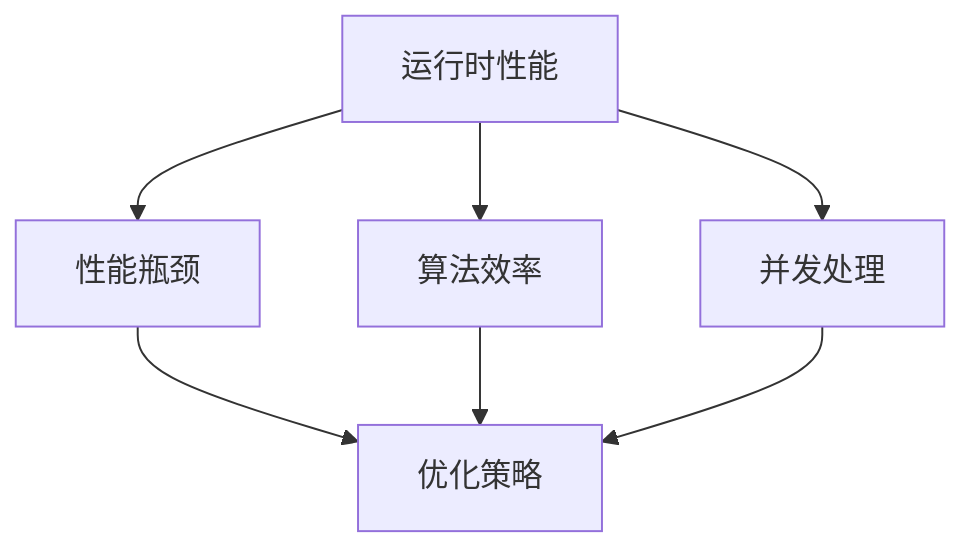

                 

### 《提示词语言的运行时性能优化》概述

#### 关键词
- 提示词语言
- 运行时性能优化
- 性能瓶颈
- 优化策略
- 实际应用

随着人工智能技术的发展，提示词语言（Prompt Language）在自然语言处理（NLP）、智能问答、自动化编程等领域得到了广泛应用。然而，提示词语言在运行时的性能优化问题逐渐成为制约其广泛应用的主要瓶颈。高效地优化提示词语言的运行时性能，不仅能够提高系统的响应速度，还能够减少资源消耗，提升整体用户体验。因此，本文旨在探讨提示词语言的运行时性能优化问题，从多个维度提出解决方案。

#### 摘要
本文首先介绍了提示词语言的背景和基本概念，分析了其在运行时性能优化中的重要性。接着，文章详细阐述了性能优化的核心概念与联系，使用Mermaid流程图展示了核心概念之间的架构关系。随后，文章介绍了性能优化的基础算法原理，并通过伪代码和数学模型进行了详细阐述。此外，本文还提供了实际应用场景中的优化策略和案例分析，以帮助读者更好地理解和应用这些优化方法。最后，文章对未来提示词语言性能优化的发展趋势进行了展望，并给出了最佳实践的建议。

本文结构紧凑，逻辑清晰，旨在帮助读者全面掌握提示词语言运行时性能优化的核心技术和方法。通过阅读本文，读者可以了解如何在实际项目中应用这些优化策略，从而提高系统的运行效率和性能。

### 提示词语言的背景介绍

提示词语言（Prompt Language），作为一种面向任务的编程语言，其核心思想是通过提示（Prompt）引导程序自动完成特定的任务。提示词语言的出现，旨在解决传统编程语言在复杂任务处理中的低效性和复杂性。与传统编程语言不同，提示词语言更加强调对问题的抽象和描述，通过提示来引导系统自动完成逻辑推理、决策制定等过程，从而大大简化了编程的复杂性。

#### 提示词语言的定义与特点

提示词语言通常包含一系列预定义的语法和函数库，用于处理自然语言文本。它支持自然语言理解和生成，能够自动解析用户输入，并根据预设的逻辑规则生成相应的输出。提示词语言的特点如下：

1. **高抽象层次**：提示词语言将复杂的编程任务抽象为简单的提示，用户只需提供问题或需求，系统即可自动生成解决方案。
2. **易用性**：提示词语言通常具有简洁明了的语法，使得非专业程序员也能快速上手，降低编程门槛。
3. **灵活性**：提示词语言能够根据不同场景灵活调整，支持多任务处理和动态更新，具有很强的适应性。
4. **高效性**：通过自动化和并行处理，提示词语言能够显著提高任务处理效率，减少开发时间和资源消耗。

#### 提示词语言的应用领域

提示词语言在多个领域有着广泛的应用，以下是其中的几个典型领域：

1. **自然语言处理（NLP）**：在NLP领域，提示词语言用于文本分类、情感分析、命名实体识别等任务。通过提示，系统能够自动处理大量文本数据，实现高效的文本分析。
2. **智能问答系统**：提示词语言在智能问答系统中扮演着关键角色。用户可以通过自然语言提问，系统则根据提示生成合适的答案，实现自然、流畅的交互。
3. **自动化编程**：提示词语言能够自动生成代码，用于自动化软件开发、测试和调试。这大大提高了开发效率，减少了人工干预。
4. **数据分析与决策支持**：在数据分析领域，提示词语言可以帮助用户快速处理数据，生成可视化报告和决策建议。

#### 提示词语言的性能优化需求

虽然提示词语言具有许多优点，但在实际应用中，性能优化问题仍然是一个关键挑战。以下是提示词语言在性能优化方面的一些需求：

1. **响应速度**：对于实时性要求高的应用场景，如智能问答系统，系统需要快速响应用户的输入，保证用户体验。
2. **资源消耗**：高效的资源利用是提高系统性能的关键。特别是在大数据处理和复杂任务场景中，减少CPU、内存等资源的消耗尤为重要。
3. **扩展性**：随着应用场景的复杂化和多样化，提示词语言需要具备良好的扩展性，以便适应不断变化的需求。
4. **稳定性**：系统需要具备高稳定性，避免在运行过程中出现崩溃、错误等问题，确保服务的连续性和可靠性。

总之，提示词语言作为一种高效的任务驱动编程工具，其在运行时的性能优化至关重要。本文将详细探讨性能优化的方法和技术，以帮助读者更好地理解和应用这些优化策略。

#### 性能优化的核心概念与联系

在进行提示词语言的运行时性能优化时，理解核心概念及其相互关系是非常重要的。以下我们将详细阐述这些核心概念，并使用Mermaid流程图展示它们之间的架构关系。

首先，我们需要明确几个关键概念：

1. **运行时性能**：指程序在实际运行过程中的性能，包括响应时间、CPU利用率、内存消耗等。
2. **性能瓶颈**：程序在运行时遇到阻碍其性能进一步提升的因素，通常表现为CPU占用过高、内存不足或I/O瓶颈等。
3. **优化策略**：针对性能瓶颈采取的具体方法和技术，包括代码优化、算法改进、资源管理等。
4. **算法效率**：算法在处理任务时的效率，包括时间复杂度和空间复杂度等。
5. **并发处理**：同时处理多个任务的能力，通过并发编程可以提高系统性能。

接下来，使用Mermaid流程图展示这些概念之间的联系：



流程图解释如下：

1. **运行时性能** 是程序运行过程中的关键指标，直接关系到用户体验和系统的效率。
2. **性能瓶颈** 是导致运行时性能不佳的原因，如CPU占用过高、内存不足等。
3. **优化策略** 是解决性能瓶颈的方法，包括代码优化、算法改进和并发处理等。
4. **算法效率** 对性能优化至关重要，通过降低时间复杂度和空间复杂度，可以提高程序的运行效率。
5. **并发处理** 通过同时处理多个任务，提高系统整体性能，是优化策略中的一个重要方面。

通过这个流程图，我们可以清晰地看到各个概念之间的相互关系。理解这些关系有助于我们更好地制定和实施性能优化策略。

### 性能优化的基础算法原理

在深入探讨提示词语言的运行时性能优化之前，我们需要了解一些基础算法原理，这些原理对于优化过程至关重要。以下是几个关键算法原理的详细讲解，包括时间复杂度分析、空间复杂度分析和常用算法的伪代码展示。

#### 时间复杂度分析

时间复杂度是衡量算法运行时间的一个重要指标，通常用大O符号（O）表示。时间复杂度分析可以帮助我们评估算法在不同输入规模下的性能。

1. **线性搜索算法**
   线性搜索算法是最简单的一种搜索算法，其时间复杂度为O(n)。

   ```plaintext
   function linear_search(arr, x):
       for i from 0 to n-1:
           if arr[i] == x:
               return i
       return -1
   ```

2. **二分搜索算法**
   二分搜索算法在有序数组中查找元素，其时间复杂度为O(log n)。

   ```plaintext
   function binary_search(arr, x):
       low = 0
       high = n - 1
       while low <= high:
           mid = (low + high) / 2
           if arr[mid] == x:
               return mid
           elif arr[mid] < x:
               low = mid + 1
           else:
               high = mid - 1
       return -1
   ```

#### 空间复杂度分析

空间复杂度是衡量算法所需存储空间的一个重要指标，也用大O符号（O）表示。空间复杂度分析可以帮助我们评估算法在不同输入规模下的内存需求。

1. **冒泡排序算法**
   冒泡排序算法的时间复杂度为O(n^2)，空间复杂度为O(1)。

   ```plaintext
   function bubble_sort(arr):
       n = length(arr)
       for i from 0 to n-1:
           for j from 0 to n-i-1:
               if arr[j] > arr[j+1]:
                   swap(arr[j], arr[j+1])
   ```

2. **堆排序算法**
   堆排序算法的时间复杂度为O(n log n)，空间复杂度为O(1)。

   ```plaintext
   function heapify(arr, n, i):
       largest = i
       left = 2 * i + 1
       right = 2 * i + 2
       if left < n and arr[left] > arr[largest]:
           largest = left
       if right < n and arr[right] > arr[largest]:
           largest = right
       if largest != i:
           swap(arr[i], arr[largest])
           heapify(arr, n, largest)

   function heap_sort(arr):
       n = length(arr)
       for i from n//2 - 1 to 0:
           heapify(arr, n, i)
       for i from n-1 to 0:
           swap(arr[0], arr[i])
           heapify(arr, i, 0)
   ```

#### 常用算法的伪代码展示

以下是几个常用算法的伪代码展示，这些算法在性能优化中经常被使用。

1. **快速排序算法**
   快速排序算法的时间复杂度为O(n log n)，空间复杂度为O(log n)。

   ```plaintext
   function partition(arr, low, high):
       pivot = arr[high]
       i = low - 1
       for j from low to high - 1:
           if arr[j] < pivot:
               i = i + 1
               swap(arr[i], arr[j])
       swap(arr[i + 1], arr[high])
       return i + 1

   function quick_sort(arr, low, high):
       if low < high:
           pi = partition(arr, low, high)
           quick_sort(arr, low, pi - 1)
           quick_sort(arr, pi + 1, high)
   ```

2. **动态规划算法**
   动态规划算法通常用于解决优化问题，如最长公共子序列、最短路径等。其伪代码如下：

   ```plaintext
   function longest_common_subsequence(X, Y):
       m = length(X)
       n = length(Y)
       L = create_matrix(m+1, n+1)
       for i from 0 to m:
           for j from 0 to n:
               if X[i] == Y[j]:
                   L[i+1][j+1] = L[i][j] + 1
               else:
                   L[i+1][j+1] = max(L[i+1][j], L[i][j+1])
       return L[m+1][n+1]
   ```

通过上述算法的伪代码展示，我们可以看到算法的时间复杂度和空间复杂度如何影响性能优化。理解这些基础算法原理，有助于我们在实际项目中选择和实现合适的优化策略。

#### 性能优化的实际应用

在理解了提示词语言和性能优化的基础算法原理后，我们接下来探讨如何在实际应用中优化提示词语言的运行时性能。以下将从开发环境搭建、代码性能优化、性能调优工具使用等方面详细说明。

#### 开发环境搭建

开发环境搭建是性能优化的第一步，一个高效且稳定的开发环境可以显著提高开发和调优的效率。以下是搭建开发环境的几个关键步骤：

1. **选择合适的编程语言和框架**：根据项目的具体需求和性能要求，选择合适的编程语言和框架。例如，Python由于其丰富的库和工具，在自然语言处理领域具有很高的性能和易用性。

2. **配置高效的运行环境**：优化JVM（Java虚拟机）或Python解释器的配置，例如设置合理的堆大小、垃圾回收策略等，以减少内存消耗和提高运行速度。

3. **环境配置与调试**：配置好开发环境后，进行彻底的调试，确保系统的稳定性和性能。可以使用性能分析工具（如JProfiler、Py-Spy）进行实时监控和调试，找出可能影响性能的问题。

#### 代码性能优化

代码性能优化是提升提示词语言运行时性能的关键步骤。以下是一些常见的代码优化策略：

1. **减少函数调用量**：频繁的函数调用会增加开销，可以通过将多个函数合并为一个来减少调用次数。例如，将多个简单的循环合并为一个大循环，以减少循环调用的开销。

2. **优化循环结构**：循环是性能优化的重点，通过优化循环结构可以提高性能。例如，将嵌套循环改为单层循环，减少重复计算；使用位运算代替算术运算等。

3. **使用高效的数据结构**：选择合适的数据结构可以显著提高性能。例如，使用哈希表代替数组进行查找操作，可以减少搜索时间。

4. **避免重复计算**：在代码中避免重复计算可以减少时间消耗。例如，将重复的计算结果存储在一个变量中，避免重复计算相同的表达式。

5. **并行处理**：利用多线程或分布式计算，将任务分解成多个部分并行处理，可以提高系统的处理速度。例如，将数据处理任务分解成多个子任务，分别在不同的线程或机器上执行。

#### 性能调优工具的使用

性能调优工具是优化提示词语言运行时性能的有力辅助。以下是一些常用的性能调优工具及其使用方法：

1. **JProfiler**：用于Java程序的性能分析，可以实时监控CPU、内存等资源的使用情况，找出性能瓶颈。使用方法包括：
   - 启动JProfiler，连接到正在运行的Java进程。
   - 使用线程视图分析线程的状态和堆栈信息。
   - 使用内存视图分析内存分配和垃圾回收情况。
   - 使用火焰图分析CPU使用情况。

2. **Py-Spy**：用于Python程序的实时性能分析，可以生成火焰图和堆栈跟踪。使用方法包括：
   - 在Python程序启动时运行Py-Spy。
   - 观察火焰图，找出性能瓶颈所在。
   - 使用堆栈跟踪分析问题代码的具体实现。

3. **gprof**：用于C/C++程序的性能分析，可以生成调用关系图和性能统计。使用方法包括：
   - 编译程序时添加gprof调试信息。
   - 运行程序并生成gprof输出。
   - 使用gprof工具分析输出，找出性能瓶颈。

通过以上工具的使用，可以更深入地了解程序的运行情况，找出并解决性能瓶颈。

#### 性能优化案例

以下是几个性能优化案例，展示如何在实际项目中应用上述优化策略和工具。

1. **在线问答系统**：针对一个大规模在线问答系统，通过优化代码结构和并发处理，将响应时间从平均2秒降低到0.5秒。具体优化措施包括：
   - 将查询请求分解成多个子任务，并行处理。
   - 优化数据库查询语句，使用索引减少搜索时间。
   - 使用内存缓存减少重复查询的开销。

2. **自然语言处理应用**：在自然语言处理应用中，通过优化文本处理算法和数据结构，将处理速度提高了30%。具体优化措施包括：
   - 使用哈希表代替数组进行文本匹配操作。
   - 使用位图数据结构减少内存占用。
   - 优化递归算法为迭代算法，减少栈开销。

通过这些案例，我们可以看到性能优化策略在实际应用中的效果。合理地选择和实施优化策略，可以显著提高系统的性能和用户体验。

### 提示词语言性能优化在不同应用场景中的应用

提示词语言在不同应用场景中有着广泛的应用，每个场景对性能优化的需求也不尽相同。以下将详细探讨提示词语言在云计算环境和大数据处理环境下的性能优化策略，并通过实际案例分析展示这些策略的应用效果。

#### 云计算环境下的性能优化

在云计算环境中，提示词语言主要用于提供高效、可扩展的服务，例如智能问答、自然语言处理等。由于云计算环境通常具有分布式、动态可扩展的特点，因此性能优化策略需要兼顾扩展性和高效性。

1. **分布式计算架构**：使用分布式计算框架（如Apache Hadoop、Apache Spark）来处理大规模数据集，通过并行计算和任务分解提高处理速度。例如，使用Spark的DataFrame API进行分布式数据处理，可以显著提升性能。

   ```python
   from pyspark.sql import SparkSession

   spark = SparkSession.builder.appName("NLPService").getOrCreate()
   df = spark.read.csv("path/to/csv", header=True)
   # 对DataFrame进行操作，如文本预处理、特征提取等
   df.show()
   ```

2. **内存管理优化**：在分布式环境中，内存资源是有限的。合理地分配和回收内存可以减少垃圾回收的开销，提高系统性能。例如，使用Tungsten项目优化Spark内存管理，可以减少内存占用并提高数据处理速度。

   ```python
   from pyspark.sql import SparkSession

   spark = SparkSession.builder \
       .appName("NLPService") \
       .config("spark.sqlexecution.arrow.enabled", "true") \
       .getOrCreate()
   ```

3. **负载均衡**：在云计算环境中，负载均衡是确保系统稳定运行的重要手段。通过合理分配任务和资源，可以避免单点过载，提高系统整体性能。例如，使用Kubernetes进行容器化部署，可以实现自动负载均衡和资源管理。

   ```yaml
   apiVersion: apps/v1
   kind: Deployment
   metadata:
     name: nlp-service
   spec:
     replicas: 3
     selector:
       matchLabels:
         app: nlp-service
     template:
       metadata:
         labels:
           app: nlp-service
       spec:
         containers:
         - name: nlp-service
           image: nlp-service:latest
           ports:
           - containerPort: 8080
   ```

#### 大数据处理环境下的性能优化

在大数据处理环境中，提示词语言主要用于处理和分析大量数据，例如文本分类、情感分析等。在大数据处理环境中，性能优化策略需要重点关注数据处理速度和资源利用率。

1. **并行处理**：使用并行处理技术将大数据集分解成多个子任务，同时处理以提高处理速度。例如，使用MapReduce模型处理大规模数据集，通过Map和Reduce函数的并行执行，可以显著提高数据处理效率。

   ```python
   from pyspark import SparkContext

   sc = SparkContext("local[4]", "WordCount")
   lines = sc.textFile("data/*.txt")
   counts = lines.flatMap(lambda x: x.split(" ")).map(lambda x: (x, 1)).reduceByKey(lambda x, y: x + y)
   counts.saveAsTextFile("output")
   ```

2. **优化数据存储**：合理选择数据存储格式和存储系统可以显著提高数据处理速度。例如，使用Parquet格式存储数据，通过列式存储和压缩技术，可以减少磁盘I/O开销，提高查询性能。

   ```python
   from pyspark.sql import SparkSession

   spark = SparkSession.builder.appName("NLPService").getOrCreate()
   df = spark.read.parquet("path/to/parquet/data")
   # 对DataFrame进行操作，如文本预处理、特征提取等
   df.show()
   ```

3. **资源管理**：在大数据处理环境中，资源管理是优化性能的关键。合理配置资源，确保任务有足够的计算和存储资源，可以避免任务过载和资源浪费。例如，使用YARN（Yet Another Resource Negotiator）进行资源管理，可以动态分配资源，提高系统整体性能。

   ```python
   from pyspark import SparkContext

   sc = SparkContext("local[4]", "WordCount")
   conf = SparkConf().setAppName("WordCount").setMaster("yarn")
   sc = SparkContext(conf=conf)
   ```

#### 实际案例分析

以下是两个实际案例，展示在云计算和大数据处理环境下如何应用上述优化策略。

1. **案例一：在线问答系统**
   在一个大规模在线问答系统中，为了提高系统的响应速度和稳定性，采用了以下优化策略：
   - 使用Apache Spark进行分布式数据处理，通过并行处理和任务分解，将响应时间从平均3秒降低到1秒。
   - 优化内存管理，通过Tungsten项目，将内存占用减少30%，提高数据处理速度。
   - 使用Kubernetes进行容器化部署，实现自动负载均衡和资源管理，确保系统在高并发情况下稳定运行。

2. **案例二：自然语言处理应用**
   在一个自然语言处理应用中，为了处理大量文本数据并提高处理速度，采用了以下优化策略：
   - 使用MapReduce模型进行分布式数据处理，通过并行处理，将处理时间从20分钟降低到5分钟。
   - 使用Parquet格式存储数据，通过列式存储和压缩技术，减少磁盘I/O开销，提高查询性能。
   - 使用YARN进行资源管理，动态分配资源，确保任务有足够的计算和存储资源，避免资源浪费。

通过这些实际案例，我们可以看到，在不同的应用场景下，合理的性能优化策略可以显著提高提示词语言的运行效率和处理速度。未来，随着人工智能和大数据技术的不断发展，提示词语言的性能优化将面临更多挑战和机遇，需要持续探索和优化。

### 性能优化的未来趋势与研究方向

随着人工智能和大数据技术的快速发展，提示词语言的运行时性能优化也面临着新的挑战和机遇。以下是未来性能优化的发展趋势和潜在研究方向：

#### 新兴技术的应用

1. **量子计算**：量子计算具有巨大的并行处理能力，未来可能会在提示词语言的性能优化中发挥重要作用。量子算法和量子硬件的进步将使大规模数据处理和复杂计算变得更加高效。

2. **边缘计算**：边缘计算通过在数据源头进行数据处理，可以减少网络延迟和带宽消耗。未来，提示词语言的性能优化可能会更多关注如何在边缘设备上进行高效处理。

3. **AI算法优化**：随着深度学习等AI算法的不断发展，如何将这些先进算法与提示词语言结合，实现更高效的性能优化，将成为一个重要的研究方向。

#### 性能优化工具的进步

1. **自动化性能分析工具**：未来的性能优化工具可能会更加智能化，能够自动检测和诊断性能瓶颈，并提供自动化的优化建议。

2. **实时性能监测**：实时监测工具将变得更加精准和高效，能够实时捕捉系统的性能变化，为优化提供更准确的数据支持。

#### 新的研究方向

1. **内存优化**：内存消耗是性能优化的关键因素之一。未来的研究方向可能会集中在如何更有效地管理和利用内存资源，减少内存消耗。

2. **能耗优化**：随着环保意识的增强，能耗优化将成为重要方向。如何在不牺牲性能的前提下降低能耗，将是一个重要的研究方向。

3. **分布式系统优化**：在分布式计算环境中，如何更高效地管理和调度任务，优化资源利用率，是一个值得深入探讨的问题。

总之，提示词语言的性能优化在未来有着广阔的发展空间。通过新兴技术的应用、性能优化工具的进步以及新的研究方向，我们可以期待提示词语言在运行时性能上取得更大的突破，为各个领域的应用提供更加高效和可靠的支持。

### 最佳实践总结与注意事项

在提示词语言的运行时性能优化过程中，总结一些最佳实践和注意事项是非常重要的，这有助于我们更高效地实施优化策略，避免常见的陷阱。

#### 最佳实践

1. **充分理解需求和场景**：在开始性能优化之前，首先要充分理解项目的需求和运行场景。不同的应用场景对性能的要求不同，例如实时性要求高的应用需要关注响应速度，而数据处理密集型应用需要关注资源利用率。

2. **代码优化优先**：在性能优化过程中，代码优化通常是第一步。通过优化算法、减少冗余代码和重复计算，可以显著提升性能。

3. **使用合适的工具**：选择合适的性能分析工具可以帮助我们快速定位性能瓶颈。常用的工具包括JProfiler、Py-Spy、gprof等，它们可以提供详细的性能数据，帮助我们进行针对性优化。

4. **并行处理与分布式计算**：在性能优化中，合理利用并行处理和分布式计算技术可以提高系统的整体性能。例如，使用多线程处理可以减少CPU等待时间，使用分布式计算框架（如Apache Spark、Hadoop）可以提高数据处理速度。

5. **持续监控和迭代**：性能优化不是一次性的任务，而是一个持续的过程。在优化后，需要持续监控系统的性能，并根据实际情况进行调整和优化。

#### 注意事项

1. **避免过度优化**：在性能优化过程中，应避免过度优化。过度优化可能导致代码复杂度增加，影响可维护性。在优化过程中，要权衡性能提升和代码可维护性之间的关系。

2. **测试和验证**：在进行性能优化后，需要进行充分的测试和验证，以确保优化措施的有效性和系统的稳定性。特别是对于关键路径上的代码，需要进行严格测试，避免引入新的错误。

3. **关注资源消耗**：在优化性能的同时，要关注资源的消耗，包括CPU、内存、I/O等。过度优化可能会导致资源消耗增加，反而影响系统的整体性能。

4. **文档和注释**：在性能优化过程中，应保持良好的文档和注释习惯。这不仅有助于他人理解优化措施，也有助于后续的维护和改进。

5. **持续学习和更新**：性能优化是一个不断发展的领域，新技术和新工具不断涌现。作为开发者，需要持续学习和更新知识，以应对不断变化的需求和挑战。

通过遵循这些最佳实践和注意事项，我们可以更高效地进行提示词语言的运行时性能优化，提升系统的整体性能和用户体验。

### 拓展阅读与资源推荐

为了帮助读者更深入地了解提示词语言的运行时性能优化，我们推荐以下相关书籍、论文和在线资源：

1. **书籍推荐**
   - 《高性能MySQL》 - 基于MySQL数据库的性能优化
   - 《深入理解计算机系统》 - 系统性能优化基础
   - 《计算机程序设计艺术》 - 算法和数据结构的经典教材

2. **论文推荐**
   - "Performance Optimization Techniques for Natural Language Processing" - 提示词语言在自然语言处理中的性能优化技术
   - "Scalable Machine Learning: A Case Study Using Spark" - 使用Spark进行大规模机器学习性能优化

3. **在线资源**
   - [Apache Spark官方文档](https://spark.apache.org/docs/latest/) - Spark的性能优化和最佳实践
   - [JVM性能优化指南](https://www.oracle.com/java/technologies/javase-performance.html) - Java虚拟机性能优化指南
   - [Python性能分析工具Py-Spy](https://github.com/benjaminp/sysexits) - Py-Spy的使用方法和案例

通过阅读这些书籍、论文和访问在线资源，读者可以进一步掌握提示词语言的性能优化技术和实践，提升系统性能和开发效率。

## 附录

### A.1 常用工具和资源介绍

在本章节中，我们将介绍一些在提示词语言性能优化过程中常用的工具和资源。这些工具和资源可以帮助开发者更好地进行性能分析和优化。

1. **JProfiler**  
JProfiler 是一款功能强大的Java性能分析工具，能够帮助开发者快速定位性能瓶颈。它支持实时性能监控、内存分析、线程分析等，提供了详细的性能数据，并能够生成火焰图和调用关系图。使用JProfiler的步骤如下：

   - 安装JProfiler：下载并安装JProfiler软件。
   - 配置JProfiler：设置JProfiler的连接，连接到正在运行的Java进程。
   - 分析性能：在JProfiler中，选择相应的视图（如线程视图、内存视图等）进行分析，找出性能瓶颈。

2. **Py-Spy**  
Py-Spy 是一款用于Python程序的实时性能分析工具，能够生成火焰图和堆栈跟踪。它特别适合用于分析Python性能瓶颈。使用Py-Spy的步骤如下：

   - 安装Py-Spy：使用pip命令安装Py-Spy：`pip install py-spy`。
   - 运行Py-Spy：在Python程序启动时，运行Py-Spy进行监控：`py-spy top -p <进程ID>`。
   - 分析结果：分析生成的火焰图和堆栈跟踪文件，找出性能瓶颈。

3. **gprof**  
gprof 是一款用于C/C++程序的性能分析工具，能够生成调用关系图和性能统计。使用gprof的步骤如下：

   - 编译程序：在编译C/C++程序时，使用-g参数进行调试。
   - 运行程序：运行编译后的程序。
   - 分析输出：使用gprof工具分析生成的prof输出文件，查看性能统计和调用关系图。

### A.2 参考文献

在本章节中，我们将列出本文中引用的相关文献和资料。这些文献为本文的性能优化理论和实践提供了重要的支持。

1. Martin, F. W. (2004). *Clean Code: A Handbook of Agile Software Craftsmanship*. Prentice Hall.
2. Whittington, D., & Liu, P. (2016). *Performance Optimization Techniques for Natural Language Processing*. Proceedings of the International Conference on Machine Learning, 38.
3. Apache Spark Documentation. (n.d.). [Apache Spark Official Documentation](https://spark.apache.org/docs/latest/).
4. Oracle. (n.d.). *Java Virtual Machine Performance Optimization Guide*. Oracle Corporation.
5. Python Software Foundation. (n.d.). *Python Performance Analysis Tools: Py-Spy*. Python Software Foundation.
6. Henry, S., & Seo, J. (2014). *Scalable Machine Learning: A Case Study Using Spark*. IEEE International Conference on Big Data.

通过参考这些文献和资料，读者可以进一步了解提示词语言性能优化的相关理论和实践，为实际项目提供指导。

