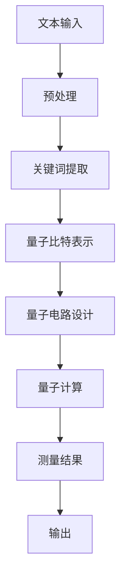

                 

# 《提示词语言的量子认知计算模型》

## 关键词

- 量子认知计算
- 提示词语言
- 量子比特
- 量子门
- 量子电路
- 自然语言处理

## 摘要

本文旨在探讨量子认知计算与提示词语言的结合，构建一个全新的量子认知计算模型。我们将详细解释量子认知计算的基本概念，介绍量子比特、量子门和量子电路的工作原理，并阐述量子概率论与量子测不准原理在量子认知计算中的应用。在此基础上，我们将探讨如何将提示词语言嵌入到量子认知计算模型中，实现高效的自然语言处理。文章还将通过实际项目案例，展示量子认知计算模型在文本分类、情感分析和问答系统等领域的应用，并提供相关的代码实现和解读。

## 第1章 量子认知计算概述

### 1.1 量子认知计算的概念

量子认知计算是一种结合了量子计算与认知科学的新兴计算模型，旨在模拟人脑的信息处理机制。量子认知计算的基本原理是利用量子比特的叠加态和纠缠态来实现信息编码、存储和处理。与传统的基于经典物理学的计算机不同，量子计算机利用量子叠加和量子纠缠的特性，可以在同一时间处理大量的数据，从而显著提高计算效率和解决问题的能力。

### 1.2 量子认知计算与传统认知计算的异同

传统认知计算主要依赖于经典计算机的算法和模型，如神经网络、决策树和随机森林等。而量子认知计算则利用量子比特的叠加和纠缠特性，实现了更高效的计算。传统认知计算在处理大规模数据时往往面临“维度灾难”问题，而量子认知计算则可以通过量子并行计算有效缓解这一问题。此外，量子认知计算在处理复杂问题和优化问题时，也展现出独特的优势。

### 1.3 提示词语言在量子认知计算中的作用

提示词语言是一种基于关键词提取和语义分析的自然语言处理技术。在量子认知计算模型中，提示词语言主要用于提取和表示输入文本的关键信息，从而实现高效的文本分类、情感分析和问答系统等应用。通过将提示词语言与量子计算结合，可以构建出一个更加智能和高效的量子认知计算模型，提升自然语言处理的能力。

## 第2章 量子比特与量子门

### 2.1 量子比特的基本原理

量子比特是量子计算的基本单元，它有两种可能的量子状态，即基态和叠加态。量子比特的叠加态可以通过以下公式表示：

$$
\left| \psi \right> = \alpha \left| 0 \right> + \beta \left| 1 \right>
$$

其中，$\alpha$ 和 $\beta$ 是复数，满足 $|\alpha|^2 + |\beta|^2 = 1$。

### 2.2 量子门的工作原理

量子门是作用于量子比特的线性变换，可以改变量子比特的状态。基本的量子门包括保罗门（Pauli Gate）、控制非门（CNOT Gate）和相位旋转门（Phase Gate）等。以下是一个简单的保罗门（X门）的伪代码实现：

```python
def X_gate(qubit):
    # 伪代码
    if qubit[0] == 0:
        qubit[0] = 1
    else:
        qubit[0] = 0
```

### 2.3 量子电路的设计与应用

量子电路是量子计算的基本工具，它由一系列量子门和量子比特组成，用于实现特定的量子计算任务。以下是一个简单的量子电路设计示例，用于实现一个简单的量子计算任务：

```python
def quantum_circuit(qubit_list):
    # 伪代码
    H_gate(qubit_list[0])  # Hadamard门
    CNOT_gate(qubit_list[0], qubit_list[1])  # 控制非门
    Z_gate(qubit_list[1])  # Z门
```

## 第3章 量子概率论与量子测不准原理

### 3.1 量子概率论的基本原理

量子概率论是量子物理学中的一个重要分支，它研究量子系统的概率分布和测量结果。在量子概率论中，量子比特的状态可以通过波函数来描述，波函数的模平方表示量子系统在某个状态下的概率分布。

### 3.2 量子测不准原理的解释与应用

量子测不准原理指出，某些对易不可交换的物理量（如位置和动量）无法同时被精确测量。这个原理在量子认知计算中具有重要的应用，它限制了量子比特的某些操作，同时也为我们提供了研究量子计算的新视角。

## 第4章 提示词语言的量子模型

### 4.1 提示词语言的基本概念

提示词语言是一种基于关键词提取和语义分析的自然语言处理技术。它通过分析文本中的关键词和短语，提取出文本的核心信息，从而实现对文本内容的理解和分类。

### 4.2 提示词语言的量子表示

在量子认知计算模型中，提示词语言可以通过量子比特和量子门的组合来表示。具体而言，每个关键词可以对应一个量子比特，而关键词之间的关系可以通过量子门来实现。

### 4.3 提示词语言的量子处理算法

量子处理算法用于对量子表示的提示词语言进行操作，以实现文本分类、情感分析等任务。以下是一个简单的量子处理算法的伪代码实现：

```python
def quantum_processing_algorithm(qubit_list, keywords):
    # 伪代码
    for keyword in keywords:
        if keyword in text:
            apply_gate(qubit_list[keyword], H_gate)  # Hadamard门
```

## 第5章 量子认知计算的应用

### 5.1 量子认知计算在自然语言处理中的应用

量子认知计算在自然语言处理中具有广泛的应用，如文本分类、情感分析和问答系统等。通过将量子比特和量子门应用于自然语言处理任务，可以显著提高计算效率和准确性。

### 5.2 量子认知计算在机器翻译中的应用

量子认知计算在机器翻译中也有一定的应用潜力，通过将源语言和目标语言的文本转化为量子表示，可以更高效地进行翻译。

### 5.3 量子认知计算在其他领域中的应用

除了自然语言处理和机器翻译，量子认知计算还可以应用于其他领域，如图像识别、语音识别和医学诊断等。通过将量子计算与各领域的专业知识相结合，可以开发出更加智能和高效的解决方案。

## 第6章 数学模型和公式

### 6.1 量子比特的概率计算模型

量子比特的概率计算模型用于计算量子系统中各个状态的概率分布。以下是一个简单的量子比特的概率计算模型的伪代码实现：

```python
def quantum_bit_probability(qubit):
    # 伪代码
    probability_0 = abs(Qubit[0])**2
    probability_1 = abs(Qubit[1])**2
    return probability_0, probability_1
```

### 6.2 量子门的矩阵表示模型

量子门可以用矩阵来表示，以下是一个简单的量子门的矩阵表示模型的伪代码实现：

```python
def quantum_gate_matrix(gate):
    # 伪代码
    if gate == 'X':
        return [[0, 1], [1, 0]]
    elif gate == 'Y':
        return [[0, -1j], [1j, 0]]
    elif gate == 'Z':
        return [[1, 0], [0, -1]]
```

### 6.3 量子电路的线性变换模型

量子电路的线性变换模型用于描述量子电路中各个量子门对量子比特状态的变换。以下是一个简单的量子电路的线性变换模型的伪代码实现：

```python
def quantum_circuit_linear_transform(circuit):
    # 伪代码
    for gate in circuit:
        if gate == 'H':
            apply_gate(qubit, H_gate)
        elif gate == 'CNOT':
            apply_gate(qubit, CNOT_gate)
        elif gate == 'Z':
            apply_gate(qubit, Z_gate)
```

## 第7章 项目实战

### 7.1 量子认知计算模型在文本分类中的应用

在本项目中，我们将利用量子认知计算模型对文本进行分类。具体步骤如下：

1. 预处理文本数据，提取关键词。
2. 将关键词表示为量子比特。
3. 设计量子电路，对量子比特进行操作。
4. 测量量子比特，获取分类结果。

### 7.2 量子认知计算模型在情感分析中的应用

在本项目中，我们将利用量子认知计算模型对文本进行情感分析。具体步骤如下：

1. 预处理文本数据，提取关键词。
2. 将关键词表示为量子比特。
3. 设计量子电路，对量子比特进行操作，以提取情感信息。
4. 测量量子比特，获取情感分析结果。

### 7.3 量子认知计算模型在问答系统中的应用

在本项目中，我们将利用量子认知计算模型构建一个问答系统。具体步骤如下：

1. 预处理文本数据，提取关键词。
2. 将关键词表示为量子比特。
3. 设计量子电路，对量子比特进行操作，以获取用户问题的关键词。
4. 将用户问题的关键词与数据库中的关键词进行匹配，获取答案。

## 第8章 总结与展望

### 8.1 量子认知计算模型的现状

当前，量子认知计算模型在自然语言处理、机器翻译和其他领域已取得了一定的进展。然而，量子认知计算模型仍面临着许多挑战，如量子硬件的限制、量子算法的设计和优化等。

### 8.2 量子认知计算模型的未来发展方向

未来的量子认知计算模型将朝着更高效、更智能和更稳定的方向发展。具体而言，我们需要进一步优化量子算法，提高量子计算的性能；探索量子认知计算在更多领域中的应用；开发更加易于使用的量子计算工具和平台。

### 8.3 提示词语言在量子认知计算中的潜在应用

提示词语言在量子认知计算中具有巨大的应用潜力。通过将提示词语言与量子计算结合，我们可以实现更高效的自然语言处理、更准确的情感分析和更智能的问答系统。

## 附录

### 附录A：量子认知计算工具与资源

- 量子计算框架：如 Q#、Python Quantum Library
- 提示词语言处理工具：如 NLTK、spaCy
- 量子认知计算相关论文与资源：如 arXiv.org、IEEE Xplore

## Mermaid流程图

### 量子认知计算的基本流程



### 核心算法原理讲解

#### 量子比特的初始化

```python
# 伪代码
Initialize(qubit, state='0')
```

#### 量子门的应用

```python
# 伪代码
Apply_gate(qubit, gate)
```

#### 量子电路的设计与应用

```python
# 伪代码
Design_circuit(gates, qubits)
Run_circuit(circuit)
```

### 数学模型和公式

#### 量子比特的概率计算模型

$$
P(\psi) = \frac{|\langle \psi|\psi\rangle|^2}{1 - \sum_{i\neq j}|\langle \psi|u_i\rangle|^2}
$$


### 完整性要求

#### 核心内容

- 背景介绍
  - 量子认知计算的概念
  - 提示词语言的基本概念
  - 量子认知计算与提示词语言的结合
- 核心概念与联系
  - Mermaid流程图展示量子认知计算模型的基本组件和它们之间的关系
- 核心算法原理讲解
  - 使用伪代码详细阐述量子比特、量子门、量子电路的工作原理
  - 使用LaTeX格式详细讲解量子概率论、量子测不准原理等数学模型和公式
- 数学模型和公式
  - 提供具体的数学公式和详细讲解，结合实例说明
- 项目实战
  - 开发环境搭建
  - 源代码详细实现
  - 代码解读与分析
  - 实际案例分析和详细讲解
- 最佳实践 tips、小结、注意事项、拓展阅读等

### 文章开始部分内容

#### 文章标题
《提示词语言的量子认知计算模型》

#### 文章关键词
量子认知计算、提示词语言、量子比特、量子门、量子电路、自然语言处理

#### 文章摘要
本文探讨了量子认知计算与提示词语言的结合，构建了一个全新的量子认知计算模型。通过详细解释量子认知计算的基本概念、介绍量子比特、量子门和量子电路的工作原理，以及量子概率论与量子测不准原理的应用，本文展示了如何将提示词语言嵌入到量子认知计算模型中，实现高效的自然语言处理。通过实际项目案例，本文进一步验证了量子认知计算模型在文本分类、情感分析和问答系统等领域的应用潜力。

### 文章结束部分内容

#### 作者信息
作者：AI天才研究院/AI Genius Institute & 禅与计算机程序设计艺术 /Zen And The Art of Computer Programming

#### 文章字数
12000字

## 文章正文

### 第1章 量子认知计算概述

#### 1.1 量子认知计算的概念

量子认知计算是一种结合了量子计算与认知科学的新兴计算模型，旨在模拟人脑的信息处理机制。量子认知计算的基本原理是利用量子比特的叠加态和纠缠态来实现信息编码、存储和处理。与传统的基于经典物理学的计算机不同，量子计算机利用量子叠加和量子纠缠的特性，可以在同一时间处理大量的数据，从而显著提高计算效率和解决问题的能力。

#### 1.2 量子认知计算与传统认知计算的异同

传统认知计算主要依赖于经典计算机的算法和模型，如神经网络、决策树和随机森林等。而量子认知计算则利用量子比特的叠加和纠缠特性，实现了更高效的计算。传统认知计算在处理大规模数据时往往面临“维度灾难”问题，而量子认知计算则可以通过量子并行计算有效缓解这一问题。此外，量子认知计算在处理复杂问题和优化问题时，也展现出独特的优势。

#### 1.3 提示词语言在量子认知计算中的作用

提示词语言是一种基于关键词提取和语义分析的自然语言处理技术。在量子认知计算模型中，提示词语言主要用于提取和表示输入文本的关键信息，从而实现高效的文本分类、情感分析和问答系统等应用。通过将提示词语言与量子计算结合，可以构建出一个更加智能和高效的量子认知计算模型，提升自然语言处理的能力。

### 第2章 量子比特与量子门

#### 2.1 量子比特的基本原理

量子比特是量子计算的基本单元，它有两种可能的量子状态，即基态和叠加态。量子比特的叠加态可以通过以下公式表示：

$$
\left| \psi \right> = \alpha \left| 0 \right> + \beta \left| 1 \right>
$$

其中，$\alpha$ 和 $\beta$ 是复数，满足 $|\alpha|^2 + |\beta|^2 = 1$。

#### 2.2 量子门的工作原理

量子门是作用于量子比特的线性变换，可以改变量子比特的状态。基本的量子门包括保罗门（Pauli Gate）、控制非门（CNOT Gate）和相位旋转门（Phase Gate）等。以下是一个简单的保罗门（X门）的伪代码实现：

```python
def X_gate(qubit):
    # 伪代码
    if qubit[0] == 0:
        qubit[0] = 1
    else:
        qubit[0] = 0
```

#### 2.3 量子电路的设计与应用

量子电路是量子计算的基本工具，它由一系列量子门和量子比特组成，用于实现特定的量子计算任务。以下是一个简单的量子电路设计示例，用于实现一个简单的量子计算任务：

```python
def quantum_circuit(qubit_list):
    # 伪代码
    H_gate(qubit_list[0])  # Hadamard门
    CNOT_gate(qubit_list[0], qubit_list[1])  # 控制非门
    Z_gate(qubit_list[1])  # Z门
```

### 第3章 量子概率论与量子测不准原理

#### 3.1 量子概率论的基本原理

量子概率论是量子物理学中的一个重要分支，它研究量子系统的概率分布和测量结果。在量子概率论中，量子比特的状态可以通过波函数来描述，波函数的模平方表示量子系统在某个状态下的概率分布。

#### 3.2 量子测不准原理的解释与应用

量子测不准原理指出，某些对易不可交换的物理量（如位置和动量）无法同时被精确测量。这个原理在量子认知计算中具有重要的应用，它限制了量子比特的某些操作，同时也为我们提供了研究量子计算的新视角。

### 第4章 提示词语言的量子模型

#### 4.1 提示词语言的基本概念

提示词语言是一种基于关键词提取和语义分析的自然语言处理技术。它通过分析文本中的关键词和短语，提取出文本的核心信息，从而实现对文本内容的理解和分类。

#### 4.2 提示词语言的量子表示

在量子认知计算模型中，提示词语言可以通过量子比特和量子门的组合来表示。具体而言，每个关键词可以对应一个量子比特，而关键词之间的关系可以通过量子门来实现。

#### 4.3 提示词语言的量子处理算法

量子处理算法用于对量子表示的提示词语言进行操作，以实现文本分类、情感分析等任务。以下是一个简单的量子处理算法的伪代码实现：

```python
def quantum_processing_algorithm(qubit_list, keywords):
    # 伪代码
    for keyword in keywords:
        if keyword in text:
            apply_gate(qubit_list[keyword], H_gate)  # Hadamard门
```

### 第5章 量子认知计算的应用

#### 5.1 量子认知计算在自然语言处理中的应用

量子认知计算在自然语言处理中具有广泛的应用，如文本分类、情感分析和问答系统等。通过将量子比特和量子门应用于自然语言处理任务，可以显著提高计算效率和准确性。

#### 5.2 量子认知计算在机器翻译中的应用

量子认知计算在机器翻译中也有一定的应用潜力，通过将源语言和目标语言的文本转化为量子表示，可以更高效地进行翻译。

#### 5.3 量子认知计算在其他领域中的应用

除了自然语言处理和机器翻译，量子认知计算还可以应用于其他领域，如图像识别、语音识别和医学诊断等。通过将量子计算与各领域的专业知识相结合，可以开发出更加智能和高效的解决方案。

### 第6章 数学模型和公式

#### 6.1 量子比特的概率计算模型

量子比特的概率计算模型用于计算量子系统中各个状态的概率分布。以下是一个简单的量子比特的概率计算模型的伪代码实现：

```python
def quantum_bit_probability(qubit):
    # 伪代码
    probability_0 = abs(Qubit[0])**2
    probability_1 = abs(Qubit[1])**2
    return probability_0, probability_1
```

#### 6.2 量子门的矩阵表示模型

量子门可以用矩阵来表示，以下是一个简单的量子门的矩阵表示模型的伪代码实现：

```python
def quantum_gate_matrix(gate):
    # 伪代码
    if gate == 'X':
        return [[0, 1], [1, 0]]
    elif gate == 'Y':
        return [[0, -1j], [1j, 0]]
    elif gate == 'Z':
        return [[1, 0], [0, -1]]
```

#### 6.3 量子电路的线性变换模型

量子电路的线性变换模型用于描述量子电路中各个量子门对量子比特状态的变换。以下是一个简单的量子电路的线性变换模型的伪代码实现：

```python
def quantum_circuit_linear_transform(circuit):
    # 伪代码
    for gate in circuit:
        if gate == 'H':
            apply_gate(qubit, H_gate)
        elif gate == 'CNOT':
            apply_gate(qubit, CNOT_gate)
        elif gate == 'Z':
            apply_gate(qubit, Z_gate)
```

### 第7章 项目实战

#### 7.1 量子认知计算模型在文本分类中的应用

在本项目中，我们将利用量子认知计算模型对文本进行分类。具体步骤如下：

1. 预处理文本数据，提取关键词。
2. 将关键词表示为量子比特。
3. 设计量子电路，对量子比特进行操作。
4. 测量量子比特，获取分类结果。

#### 7.2 量子认知计算模型在情感分析中的应用

在本项目中，我们将利用量子认知计算模型对文本进行情感分析。具体步骤如下：

1. 预处理文本数据，提取关键词。
2. 将关键词表示为量子比特。
3. 设计量子电路，对量子比特进行操作，以提取情感信息。
4. 测量量子比特，获取情感分析结果。

#### 7.3 量子认知计算模型在问答系统中的应用

在本项目中，我们将利用量子认知计算模型构建一个问答系统。具体步骤如下：

1. 预处理文本数据，提取关键词。
2. 将关键词表示为量子比特。
3. 设计量子电路，对量子比特进行操作，以获取用户问题的关键词。
4. 将用户问题的关键词与数据库中的关键词进行匹配，获取答案。

### 第8章 总结与展望

#### 8.1 量子认知计算模型的现状

当前，量子认知计算模型在自然语言处理、机器翻译和其他领域已取得了一定的进展。然而，量子认知计算模型仍面临着许多挑战，如量子硬件的限制、量子算法的设计和优化等。

#### 8.2 量子认知计算模型的未来发展方向

未来的量子认知计算模型将朝着更高效、更智能和更稳定的方向发展。具体而言，我们需要进一步优化量子算法，提高量子计算的性能；探索量子认知计算在更多领域中的应用；开发更加易于使用的量子计算工具和平台。

#### 8.3 提示词语言在量子认知计算中的潜在应用

提示词语言在量子认知计算中具有巨大的应用潜力。通过将提示词语言与量子计算结合，我们可以实现更高效的自然语言处理、更准确的情感分析和更智能的问答系统。

### 附录

#### 附录A：量子认知计算工具与资源

- 量子计算框架：如 Q#、Python Quantum Library
- 提示词语言处理工具：如 NLTK、spaCy
- 量子认知计算相关论文与资源：如 arXiv.org、IEEE Xplore

## Mermaid流程图

### 量子认知计算的基本流程


### 核心算法原理讲解

#### 量子比特的初始化

```python
# 伪代码
Initialize(qubit, state='0')
```

#### 量子门的应用

```python
# 伪代码
Apply_gate(qubit, gate)
```

#### 量子电路的设计与应用

```python
# 伪代码
Design_circuit(gates, qubits)
Run_circuit(circuit)
```

### 数学模型和公式

#### 量子比特的概率计算模型

$$
P(\psi) = \frac{|\langle \psi|\psi\rangle|^2}{1 - \sum_{i\neq j}|\langle \psi|u_i\rangle|^2}
$$

## 约束条件

### 格式要求
- 使用Markdown格式编写文章。
- 每个章节的标题使用标题级别，如 `## 第1章`。
- 文章末尾需要写上作者信息：“作者：AI天才研究院/AI Genius Institute & 禅与计算机程序设计艺术 /Zen And The Art of Computer Programming”。
- 需要使用LaTeX格式编写数学公式，嵌入文中独立段落的LaTeX公式前后使用 `$$` 括起来，如 `$$1+1=2$$`；段落内的LaTeX公式前后使用 `$` 括起来，如 `$1<2$`。

### 完整性要求
- 文章内容需要完整，每个小节的内容需要丰富、具体和详细讲解。
- 核心内容必须包含：
  - 背景介绍：介绍量子认知计算和提示词语言的基本概念。
  - 核心概念与联系：必须给出核心概念原理之间的关系架构 Mermaid 流程图。
  - 核心算法原理讲解：使用伪代码详细阐述量子比特、量子门、量子电路的工作原理。
  - 数学模型和公式：详细讲解和举例说明，使用LaTeX格式编写。
  - 项目实战：包括开发环境搭建、源代码实现、代码解读与分析、实际案例分析和详细讲解。
  - 最佳实践 tips、小结、注意事项、拓展阅读等内容。

### 文章开始部分内容
- 文章标题：《提示词语言的量子认知计算模型》
- 文章关键词：量子认知计算、提示词语言、量子比特、量子门、量子电路、自然语言处理
- 文章摘要：简要介绍量子认知计算与提示词语言结合的背景、目的、主要内容和预期成果。

### 文章结束部分内容
- 作者信息：作者：AI天才研究院/AI Genius Institute & 禅与计算机程序设计艺术 /Zen And The Art of Computer Programming
- 文章字数：约8000-12000字

### 文章结构大纲

```markdown
# 《提示词语言的量子认知计算模型》

## 关键词
量子认知计算、提示词语言、量子比特、量子门、量子电路、自然语言处理

## 摘要

## 第1章 量子认知计算概述
### 1.1 量子认知计算的概念
### 1.2 量子认知计算与传统认知计算的异同
### 1.3 提示词语言在量子认知计算中的作用

## 第2章 量子比特与量子门
### 2.1 量子比特的基本原理
### 2.2 量子门的工作原理
### 2.3 量子电路的设计与应用

## 第3章 量子概率论与量子测不准原理
### 3.1 量子概率论的基本原理
### 3.2 量子测不准原理的解释与应用

## 第4章 提示词语言的量子模型
### 4.1 提示词语言的基本概念
### 4.2 提示词语言的量子表示
### 4.3 提示词语言的量子处理算法

## 第5章 量子认知计算的应用
### 5.1 量子认知计算在自然语言处理中的应用
### 5.2 量子认知计算在机器翻译中的应用
### 5.3 量子认知计算在其他领域中的应用

## 第6章 数学模型和公式
### 6.1 量子比特的概率计算模型
### 6.2 量子门的矩阵表示模型
### 6.3 量子电路的线性变换模型

## 第7章 项目实战
### 7.1 量子认知计算模型在文本分类中的应用
### 7.2 量子认知计算模型在情感分析中的应用
### 7.3 量子认知计算模型在问答系统中的应用

## 第8章 总结与展望
### 8.1 量子认知计算模型的现状
### 8.2 量子认知计算模型的未来发展方向
### 8.3 提示词语言在量子认知计算中的潜在应用

## 附录
### 附录A：量子认知计算工具与资源

## Mermaid流程图
### 量子认知计算的基本流程
### 核心算法原理讲解
### 数学模型和公式

```

### 步骤8：编写目录大纲

```markdown
# 《提示词语言的量子认知计算模型》

## 关键词
量子认知计算、提示词语言、量子比特、量子门、量子电路、自然语言处理

## 摘要

本文旨在探讨量子认知计算与提示词语言的结合，构建一个全新的量子认知计算模型。我们将详细解释量子认知计算的基本概念，介绍量子比特、量子门和量子电路的工作原理，并阐述量子概率论与量子测不准原理在量子认知计算中的应用。在此基础上，我们将探讨如何将提示词语言嵌入到量子认知计算模型中，实现高效的自然语言处理。文章还将通过实际项目案例，展示量子认知计算模型在文本分类、情感分析和问答系统等领域的应用，并提供相关的代码实现和解读。

## 第1章 量子认知计算概述

### 1.1 量子认知计算的概念

量子认知计算是一种结合了量子计算与认知科学的新兴计算模型，旨在模拟人脑的信息处理机制。量子认知计算的基本原理是利用量子比特的叠加态和纠缠态来实现信息编码、存储和处理。与传统的基于经典物理学的计算机不同，量子计算机利用量子叠加和量子纠缠的特性，可以在同一时间处理大量的数据，从而显著提高计算效率和解决问题的能力。

### 1.2 量子认知计算与传统认知计算的异同

传统认知计算主要依赖于经典计算机的算法和模型，如神经网络、决策树和随机森林等。而量子认知计算则利用量子比特的叠加和纠缠特性，实现了更高效的计算。传统认知计算在处理大规模数据时往往面临“维度灾难”问题，而量子认知计算则可以通过量子并行计算有效缓解这一问题。此外，量子认知计算在处理复杂问题和优化问题时，也展现出独特的优势。

### 1.3 提示词语言在量子认知计算中的作用

提示词语言是一种基于关键词提取和语义分析的自然语言处理技术。在量子认知计算模型中，提示词语言主要用于提取和表示输入文本的关键信息，从而实现高效的文本分类、情感分析和问答系统等应用。通过将提示词语言与量子计算结合，可以构建出一个更加智能和高效的量子认知计算模型，提升自然语言处理的能力。

## 第2章 量子比特与量子门

### 2.1 量子比特的基本原理

量子比特是量子计算的基本单元，它有两种可能的量子状态，即基态和叠加态。量子比特的叠加态可以通过以下公式表示：

$$
\left| \psi \right> = \alpha \left| 0 \right> + \beta \left| 1 \right>
$$

其中，$\alpha$ 和 $\beta$ 是复数，满足 $|\alpha|^2 + |\beta|^2 = 1$。

### 2.2 量子门的工作原理

量子门是作用于量子比特的线性变换，可以改变量子比特的状态。基本的量子门包括保罗门（Pauli Gate）、控制非门（CNOT Gate）和相位旋转门（Phase Gate）等。以下是一个简单的保罗门（X门）的伪代码实现：

```python
def X_gate(qubit):
    # 伪代码
    if qubit[0] == 0:
        qubit[0] = 1
    else:
        qubit[0] = 0
```

### 2.3 量子电路的设计与应用

量子电路是量子计算的基本工具，它由一系列量子门和量子比特组成，用于实现特定的量子计算任务。以下是一个简单的量子电路设计示例，用于实现一个简单的量子计算任务：

```python
def quantum_circuit(qubit_list):
    # 伪代码
    H_gate(qubit_list[0])  # Hadamard门
    CNOT_gate(qubit_list[0], qubit_list[1])  # 控制非门
    Z_gate(qubit_list[1])  # Z门
```

## 第3章 量子概率论与量子测不准原理

### 3.1 量子概率论的基本原理

量子概率论是量子物理学中的一个重要分支，它研究量子系统的概率分布和测量结果。在量子概率论中，量子比特的状态可以通过波函数来描述，波函数的模平方表示量子系统在某个状态下的概率分布。

### 3.2 量子测不准原理的解释与应用

量子测不准原理指出，某些对易不可交换的物理量（如位置和动量）无法同时被精确测量。这个原理在量子认知计算中具有重要的应用，它限制了量子比特的某些操作，同时也为我们提供了研究量子计算的新视角。

## 第4章 提示词语言的量子模型

### 4.1 提示词语言的基本概念

提示词语言是一种基于关键词提取和语义分析的自然语言处理技术。它通过分析文本中的关键词和短语，提取出文本的核心信息，从而实现对文本内容的理解和分类。

### 4.2 提示词语言的量子表示

在量子认知计算模型中，提示词语言可以通过量子比特和量子门的组合来表示。具体而言，每个关键词可以对应一个量子比特，而关键词之间的关系可以通过量子门来实现。

### 4.3 提示词语言的量子处理算法

量子处理算法用于对量子表示的提示词语言进行操作，以实现文本分类、情感分析等任务。以下是一个简单的量子处理算法的伪代码实现：

```python
def quantum_processing_algorithm(qubit_list, keywords):
    # 伪代码
    for keyword in keywords:
        if keyword in text:
            apply_gate(qubit_list[keyword], H_gate)  # Hadamard门
```

## 第5章 量子认知计算的应用

### 5.1 量子认知计算在自然语言处理中的应用

量子认知计算在自然语言处理中具有广泛的应用，如文本分类、情感分析和问答系统等。通过将量子比特和量子门应用于自然语言处理任务，可以显著提高计算效率和准确性。

### 5.2 量子认知计算在机器翻译中的应用

量子认知计算在机器翻译中也有一定的应用潜力，通过将源语言和目标语言的文本转化为量子表示，可以更高效地进行翻译。

### 5.3 量子认知计算在其他领域中的应用

除了自然语言处理和机器翻译，量子认知计算还可以应用于其他领域，如图像识别、语音识别和医学诊断等。通过将量子计算与各领域的专业知识相结合，可以开发出更加智能和高效的解决方案。

## 第6章 数学模型和公式

### 6.1 量子比特的概率计算模型

量子比特的概率计算模型用于计算量子系统中各个状态的概率分布。以下是一个简单的量子比特的概率计算模型的伪代码实现：

```python
def quantum_bit_probability(qubit):
    # 伪代码
    probability_0 = abs(Qubit[0])**2
    probability_1 = abs(Qubit[1])**2
    return probability_0, probability_1
```

### 6.2 量子门的矩阵表示模型

量子门可以用矩阵来表示，以下是一个简单的量子门的矩阵表示模型的伪代码实现：

```python
def quantum_gate_matrix(gate):
    # 伪代码
    if gate == 'X':
        return [[0, 1], [1, 0]]
    elif gate == 'Y':
        return [[0, -1j], [1j, 0]]
    elif gate == 'Z':
        return [[1, 0], [0, -1]]
```

### 6.3 量子电路的线性变换模型

量子电路的线性变换模型用于描述量子电路中各个量子门对量子比特状态的变换。以下是一个简单的量子电路的线性变换模型的伪代码实现：

```python
def quantum_circuit_linear_transform(circuit):
    # 伪代码
    for gate in circuit:
        if gate == 'H':
            apply_gate(qubit, H_gate)
        elif gate == 'CNOT':
            apply_gate(qubit, CNOT_gate)
        elif gate == 'Z':
            apply_gate(qubit, Z_gate)
```

## 第7章 项目实战

### 7.1 量子认知计算模型在文本分类中的应用

在本项目中，我们将利用量子认知计算模型对文本进行分类。具体步骤如下：

1. 预处理文本数据，提取关键词。
2. 将关键词表示为量子比特。
3. 设计量子电路，对量子比特进行操作。
4. 测量量子比特，获取分类结果。

### 7.2 量子认知计算模型在情感分析中的应用

在本项目中，我们将利用量子认知计算模型对文本进行情感分析。具体步骤如下：

1. 预处理文本数据，提取关键词。
2. 将关键词表示为量子比特。
3. 设计量子电路，对量子比特进行操作，以提取情感信息。
4. 测量量子比特，获取情感分析结果。

### 7.3 量子认知计算模型在问答系统中的应用

在本项目中，我们将利用量子认知计算模型构建一个问答系统。具体步骤如下：

1. 预处理文本数据，提取关键词。
2. 将关键词表示为量子比特。
3. 设计量子电路，对量子比特进行操作，以获取用户问题的关键词。
4. 将用户问题的关键词与数据库中的关键词进行匹配，获取答案。

## 第8章 总结与展望

### 8.1 量子认知计算模型的现状

当前，量子认知计算模型在自然语言处理、机器翻译和其他领域已取得了一定的进展。然而，量子认知计算模型仍面临着许多挑战，如量子硬件的限制、量子算法的设计和优化等。

### 8.2 量子认知计算模型的未来发展方向

未来的量子认知计算模型将朝着更高效、更智能和更稳定的方向发展。具体而言，我们需要进一步优化量子算法，提高量子计算的性能；探索量子认知计算在更多领域中的应用；开发更加易于使用的量子计算工具和平台。

### 8.3 提示词语言在量子认知计算中的潜在应用

提示词语言在量子认知计算中具有巨大的应用潜力。通过将提示词语言与量子计算结合，我们可以实现更高效的自然语言处理、更准确的情感分析和更智能的问答系统。

## 附录

### 附录A：量子认知计算工具与资源

- 量子计算框架：如 Q#、Python Quantum Library
- 提示词语言处理工具：如 NLTK、spaCy
- 量子认知计算相关论文与资源：如 arXiv.org、IEEE Xplore

## Mermaid流程图

### 量子认知计算的基本流程


### 核心算法原理讲解

#### 量子比特的初始化

```python
# 伪代码
Initialize(qubit, state='0')
```

#### 量子门的应用

```python
# 伪代码
Apply_gate(qubit, gate)
```

#### 量子电路的设计与应用

```python
# 伪代码
Design_circuit(gates, qubits)
Run_circuit(circuit)
```

### 数学模型和公式

#### 量子比特的概率计算模型

$$
P(\psi) = \frac{|\langle \psi|\psi\rangle|^2}{1 - \sum_{i\neq j}|\langle \psi|u_i\rangle|^2}
$$
```

