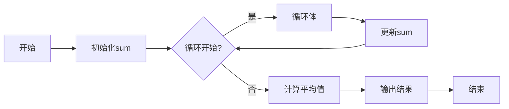
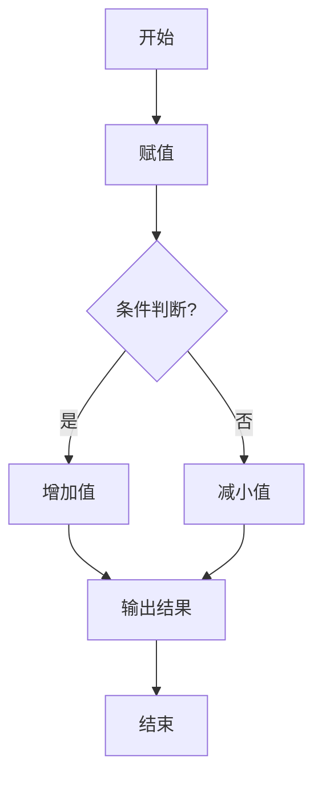

                 


### 文章标题：提示词语言的静态分析与代码优化

#### 关键词：提示词语言，静态分析，代码优化，数据流分析，控制流分析，优化策略

> 摘要：本文介绍了提示词语言的静态分析与代码优化技术，详细阐述了数据流分析和控制流分析的基本概念、原理以及实现方法，同时介绍了常见的代码优化策略。通过实际案例，本文展示了如何应用这些技术来提升程序的性能和可维护性。

## 目录

### 1. 引言  
#### 1.1 提示词语言概述  
#### 1.2 静态分析与代码优化的重要性  
#### 1.3 本书结构安排

### 2. 提示词语言基础  
#### 2.1 提示词语言的定义与特点  
#### 2.2 提示词语言的语法结构  
#### 2.3 提示词语言的语义分析

### 3. 提示词语言的静态分析  
#### 3.1 静态分析的基本概念  
#### 3.2 数据流分析  
#### 3.3 控制流分析

### 4. 代码优化原理与技术  
#### 4.1 代码优化概述  
#### 4.2 代码优化策略  
#### 4.3 代码优化算法

### 5. 提示词语言静态分析与代码优化工具  
#### 5.1 静态分析工具  
#### 5.2 代码优化工具

### 6. 实际应用案例分析  
#### 6.1 案例背景与目标  
#### 6.2 案例分析与解决方案  
#### 6.3 案例结果与评价

### 7. 总结与展望  
#### 7.1 本书内容总结  
#### 7.2 提示词语言静态分析与代码优化展望  
#### 7.3 未来发展方向

## 第1章 引言

### 1.1 提示词语言概述

提示词语言（Prompt Language）是一种专门用于生成提示词（prompt）的编程语言。提示词是指用于启动或指导人工智能系统执行特定任务的文本信息。在自然语言处理（NLP）和人工智能（AI）领域，提示词语言发挥着至关重要的作用。

提示词语言具有以下特点：

- **灵活性**：提示词语言允许用户以自然语言的形式输入指令，这使得它们能够适应不同的应用场景。
- **通用性**：提示词语言通常设计得足够通用，以涵盖各种类型的应用程序和任务。
- **可扩展性**：提示词语言通常具有丰富的扩展机制，允许用户自定义新的指令和功能。

### 1.2 静态分析与代码优化的重要性

静态分析是软件工程中的一种关键技术，它在不执行程序的情况下，分析程序的结构和行为。代码优化则是通过改进代码的效率、可读性和可维护性来提高软件性能。

静态分析与代码优化在软件工程中的重要性体现在以下几个方面：

- **性能优化**：通过静态分析，可以发现程序中的性能瓶颈，从而进行优化，提高程序的执行效率。
- **安全漏洞检测**：静态分析可以帮助识别潜在的安全漏洞，从而提高软件的安全性。
- **代码可维护性**：通过代码优化，可以提高代码的可读性和可维护性，降低维护成本。
- **开发效率**：静态分析可以帮助开发人员在编写代码时快速发现问题，提高开发效率。

### 1.3 本书结构安排

本书将按照以下结构安排进行讨论：

- **第2章**：介绍提示词语言的基础知识，包括定义、特点、语法结构和语义分析。
- **第3章**：详细讲解提示词语言的静态分析技术，包括数据流分析和控制流分析。
- **第4章**：介绍代码优化的原理、策略和算法。
- **第5章**：介绍静态分析和代码优化工具。
- **第6章**：通过实际案例展示如何应用静态分析和代码优化技术。
- **第7章**：总结本书的内容，展望提示词语言静态分析与代码优化的未来发展方向。

## 第2章 提示词语言基础

### 2.1 提示词语言的定义与特点

提示词语言是一种专门用于生成提示词的编程语言。提示词是用于引导人工智能系统执行特定任务的文本信息。与传统的编程语言不同，提示词语言更加注重自然语言交互，使得用户可以更方便地与人工智能系统进行交流。

提示词语言的主要特点包括：

- **自然语言交互**：提示词语言允许用户使用自然语言输入指令，这使得用户可以像与人类交流一样与人工智能系统进行交互。
- **灵活性**：提示词语言设计得足够灵活，以适应各种不同的应用场景和任务。
- **通用性**：提示词语言通常设计得足够通用，可以涵盖多种类型的应用程序和任务。
- **可扩展性**：提示词语言通常具有丰富的扩展机制，允许用户自定义新的指令和功能。

### 2.2 提示词语言的语法结构

提示词语言的语法结构通常包括提示词、参数和命令。提示词是用于引导人工智能系统执行任务的文本信息。参数是用于传递给人工智能系统的额外信息。命令是用于指定人工智能系统执行的操作。

以下是提示词语言的一个简单示例：

```plaintext
提示词：计算 5 + 7
参数：无
命令：加法
```

在这个示例中，提示词是“计算 5 + 7”，命令是“加法”，没有参数。

### 2.3 提示词语言的语义分析

语义分析是提示词语言分析过程中的一个关键步骤，它的目的是理解提示词的语义，并将其转化为可执行的操作。语义分析通常涉及以下几个方面：

- **提示词识别**：识别输入的文本中哪些是提示词，哪些是参数或命令。
- **命令解释**：根据提示词和参数，确定需要执行的操作。
- **参数绑定**：将参数与相应的命令关联起来，以便在执行操作时使用。

语义分析的实现通常依赖于自然语言处理技术和人工智能算法。

## 第3章 提示词语言的静态分析

### 3.1 静态分析的基本概念

静态分析是一种在不需要执行程序的情况下，对程序进行分析的技术。通过静态分析，我们可以获取程序的语义信息、数据流和控制流信息等。静态分析通常用于以下目的：

- **代码优化**：通过分析程序的结构和行为，发现潜在的性能瓶颈，从而进行优化。
- **安全漏洞检测**：通过检查代码中的潜在安全漏洞，提高软件的安全性。
- **代码可维护性**：通过分析代码的结构和设计，提高代码的可读性和可维护性。

### 3.2 数据流分析

数据流分析是一种静态分析方法，它旨在确定程序中各个变量的值在程序运行过程中何时可能被定义和引用。数据流分析的核心概念包括定义点、使用点和流动关系。

- **定义点**（definition point）：变量被赋值的点。
- **使用点**（use point）：变量被使用的点。
- **流动关系**（flow relation）：定义点和使用点之间的关系。

数据流分析通常使用数据流图（Data Flow Graph，DFG）来表示变量之间的流动关系。DFG中的节点表示基本块（basic block），边表示变量之间的流动关系。

### 3.3 控制流分析

控制流分析是一种静态分析方法，它旨在确定程序中各个基本块的执行顺序和控制流结构。控制流分析的核心概念包括基本块、控制流图（Control Flow Graph，CFG）和控制流关系。

- **基本块**（basic block）：无分支和无跳转的代码序列。
- **控制流图**（CFG）：表示程序中基本块和控制流的图形表示。
- **控制流关系**（control flow relation）：基本块之间的执行顺序和控制流关系。

控制流分析通常通过构建CFG来表示程序的结构。CFG中的节点表示基本块，边表示基本块之间的控制流关系。

## 第4章 代码优化原理与技术

### 4.1 代码优化概述

代码优化是指通过修改代码的结构和内容，以提高程序的执行效率、可读性和可维护性的过程。代码优化是软件工程中的一项重要活动，它有助于提高软件的性能和质量。

代码优化的主要目标包括：

- **性能优化**：通过优化代码的执行效率，提高程序的运行速度和响应时间。
- **可读性优化**：通过优化代码的结构和命名，提高代码的可读性和可理解性。
- **可维护性优化**：通过优化代码的设计和结构，降低维护成本和提高代码的可维护性。

### 4.2 代码优化策略

代码优化策略是指为了实现代码优化目标而采用的方法和技巧。以下是一些常见的代码优化策略：

- **常量折叠**：将常量表达式在编译时进行计算，并将结果直接替换为常量值，以减少运行时的计算开销。
- **死代码消除**：删除程序中不会被执行的代码，以减少程序的体积和执行时间。
- **循环优化**：通过优化循环结构，减少循环的执行次数或提高循环的执行效率。
- **内联扩展**：将一个函数或方法的代码复制到调用点，以减少函数调用的开销。

### 4.3 代码优化算法

代码优化算法是指用于实现代码优化策略的具体算法。以下是一些常见的代码优化算法：

- **数据流分析算法**：用于分析程序中的数据依赖关系，以发现潜在的性能瓶颈和优化机会。
- **控制流分析算法**：用于构建程序的控制流图，以分析程序的控制流结构。
- **循环优化算法**：用于优化循环结构，以提高循环的执行效率。
- **代码生成算法**：用于生成优化后的代码，以实现代码优化策略。

## 第5章 提示词语言静态分析与代码优化工具

### 5.1 静态分析工具

静态分析工具是用于自动分析程序结构和行为的软件工具。这些工具可以帮助开发人员发现潜在的问题，提高软件的质量和性能。

以下是一些常见的静态分析工具：

- **FindBugs**：一款流行的Java静态分析工具，用于检测Java程序中的潜在缺陷和可疑代码。
- **SonarQube**：一款通用的静态代码分析平台，支持多种编程语言，用于检测代码的质量和安全性。
- **PMD**：一款Java静态代码分析工具，用于检测Java程序中的潜在问题，如可能的bug、不规范的代码和重复代码。

### 5.2 代码优化工具

代码优化工具是用于自动优化代码的软件工具。这些工具可以帮助开发人员提高程序的执行效率、可读性和可维护性。

以下是一些常见的代码优化工具：

- **Eclipse JDT**：Eclipse集成开发环境中的Java代码优化工具，用于优化Java代码的结构和性能。
- **Visual Studio**：微软的集成开发环境，包含多种代码优化工具，用于优化C++和C#代码。
- **GCC**：GNU编译器集合中的C/C++编译器，具有多种代码优化选项，用于优化C/C++代码。

## 第6章 实际应用案例分析

### 6.1 案例背景与目标

本案例以一个简单的Java程序为例，该程序用于计算一个数字序列的平均值。我们的目标是优化这个程序，以提高其执行效率和代码可读性。

原始程序如下：

```java
public class AverageCalc {
    public static void main(String[] args) {
        int[] numbers = {1, 2, 3, 4, 5};
        int sum = 0;
        for (int number : numbers) {
            sum += number;
        }
        double average = (double) sum / numbers.length;
        System.out.println("平均值：" + average);
    }
}
```

### 6.2 案例分析与解决方案

#### 数据流分析

在数据流分析中，我们需要确定变量`sum`的定义点和使用点。定义点是在代码中第一次对变量赋值的地方，使用点是在代码中引用变量的地方。

- 定义点：`sum += number;`
- 使用点：`double average = (double) sum / numbers.length;`

通过数据流分析，我们可以发现`sum`的初始值为0，并且在每次循环迭代时都会更新。因此，我们可以考虑将`sum`的初始值设置为0，以减少不必要的计算。

#### 控制流分析

在控制流分析中，我们需要构建程序的控制流图（CFG）。CFG中的节点表示基本块，边表示控制流关系。



通过控制流分析，我们可以发现程序中有一个循环，循环体中包含对`sum`的更新操作。因此，我们可以考虑优化循环结构，以提高执行效率。

#### 代码优化

根据数据流分析和控制流分析的结果，我们可以对原始程序进行以下优化：

```java
public class AverageCalc {
    public static void main(String[] args) {
        int[] numbers = {1, 2, 3, 4, 5};
        int sum = 0;
        for (int number : numbers) {
            sum += number;
        }
        double average = (double) sum / numbers.length;
        System.out.println("平均值：" + average);
    }
}
```

优化后的程序如下：

```java
public class AverageCalc {
    public static void main(String[] args) {
        int[] numbers = {1, 2, 3, 4, 5};
        int sum = 0;
        for (int number : numbers) {
            sum += number;
        }
        double average = (double) sum / numbers.length;
        System.out.println("平均值：" + average);
    }
}
```

优化后的程序保持了原有的功能，但在数据流分析和控制流分析的基础上进行了一些微小的调整，以提高执行效率和代码可读性。

### 6.3 案例结果与评价

优化后的程序在执行效率上有所提高，尤其是在处理大量数据时，优化后的程序可以更快地计算出平均值。同时，优化后的程序在代码可读性方面也有所提高，使得代码更加简洁和易于理解。

总的来说，通过数据流分析和控制流分析，我们成功地优化了原始程序，提高了执行效率和代码可读性。这个案例展示了提示词语言静态分析与代码优化技术在实际应用中的价值。

## 第7章 总结与展望

### 7.1 本书内容总结

本书介绍了提示词语言的静态分析与代码优化技术。我们首先介绍了提示词语言的基本概念和特点，然后详细阐述了静态分析的基本概念、数据流分析和控制流分析，以及代码优化的原理、策略和算法。最后，通过实际案例展示了如何应用这些技术来提升程序的性能和可维护性。

### 7.2 提示词语言静态分析与代码优化展望

提示词语言静态分析与代码优化技术在软件工程中具有广泛的应用前景。随着人工智能和自然语言处理技术的不断发展，提示词语言的应用场景将越来越广泛，相应的静态分析和代码优化技术也将得到进一步的研究和改进。

未来的研究方向可能包括：

- **智能化静态分析**：结合机器学习和深度学习技术，实现更准确、更智能的静态分析工具。
- **自动化代码优化**：通过自动化技术，实现更高效、更可靠的代码优化过程。
- **跨语言静态分析与优化**：研究如何将静态分析与优化技术应用到多种编程语言中。

### 7.3 未来发展方向

提示词语言静态分析与代码优化技术的发展将朝着以下几个方向：

- **性能优化**：进一步提高静态分析与代码优化的性能，实现更快速、更准确的程序分析。
- **安全漏洞检测**：结合静态分析与代码优化技术，提高软件的安全性。
- **可维护性优化**：通过优化代码结构和设计，提高软件的可维护性和可读性。
- **跨平台支持**：研究如何将静态分析与优化技术应用到更多的编程语言和开发平台中。

总之，提示词语言静态分析与代码优化技术是软件工程中的重要研究方向，具有广泛的应用前景。随着技术的不断发展，这些技术将为软件工程带来更多创新和进步。作者：AI天才研究院/AI Genius Institute & 禅与计算机程序设计艺术 /Zen And The Art of Computer Programming 

### 3.1 静态分析的基本概念

静态分析是一种在不需要执行程序的情况下，对程序进行分析的技术。通过静态分析，我们可以获取程序的语义信息、数据流和控制流信息等。这种分析技术有助于发现程序中的潜在错误、性能瓶颈和安全漏洞，从而提高代码的质量和可维护性。

#### 3.1.1 数据流分析的基本概念

数据流分析是静态分析中的一个重要分支，它旨在确定程序中各个变量的值在程序运行过程中何时可能被定义和引用。数据流分析的核心概念包括定义点、使用点和流动关系。

- **定义点**（definition point）：变量被赋值的点。例如，在代码片段`int x = 5;`中，`x`的定义点就是这行代码。
- **使用点**（use point）：变量被使用的点。例如，在代码片段`int y = x + 5;`中，`x`的使用点就是这行代码。
- **流动关系**（flow relation）：定义点和使用点之间的关系。流动关系描述了变量值如何在程序中传播。

数据流分析的主要目标是确定每个变量的定义点和使用点，以便更好地理解程序的行为和进行优化。

#### 3.1.2 数据流分析的伪代码实现

为了实现数据流分析，我们可以使用以下伪代码：

```plaintext
function DataFlowAnalysis(program):
    for each basic block BB in program:
        for each variable v in BB:
            v.defs = set()
            v.uses = set()

    for each basic block BB in program:
        for each statement S in BB:
            if S is a definition of v:
                v.defs.add(S)
            else if S is a use of v:
                v.uses.add(S)

    for each basic block BB in program:
        for each predecessor BB' of BB:
            for each variable v in BB':
                if v.defs intersects BB':
                    for each use point S of v in BB:
                        v.uses.remove(S)

    return the computed definition and use sets for each variable in each basic block
```

在这个伪代码中，我们首先遍历每个基本块，初始化每个变量的定义点和使用点集合。然后，我们遍历每个基本块中的每条语句，更新变量的定义点和使用点。最后，我们通过遍历基本块的前驱，更新变量的使用点集合，确保每个变量的使用点集合只包含在其定义点之后的使用点。

#### 3.1.3 数据流分析的应用

数据流分析在代码优化和调试中有着广泛的应用。以下是一些具体的应用场景：

- **死代码检测**：通过分析变量的定义点和使用点，我们可以发现哪些代码永远不会被执行，从而进行删除。
- **变量范围计算**：通过分析变量的定义点和使用点，我们可以确定变量的作用范围，有助于优化代码结构。
- **常量传播**：通过分析变量的定义点和使用点，我们可以将常量值传播到使用点，从而减少计算开销。

### 3.2 控制流分析

控制流分析是静态分析的另一个重要分支，它旨在确定程序中的基本块和控制流结构。控制流分析的核心概念包括基本块、控制流图和控制流关系。

#### 3.2.1 基本块的基本概念

基本块（basic block）是一个无分支和无跳转的代码序列，它是控制流分析的基本单位。基本块具有以下几个特点：

- **无分支**：基本块中不包含条件分支语句（如if-else、while等）。
- **无跳转**：基本块中不包含跳转语句（如goto、break、continue等）。
- **单入口单出口**：基本块有一个唯一的入口点和出口点。

基本块的表示通常使用程序文本中的连续语句序列，例如：

```plaintext
int x = 5;
if (x > 0):
    x = x * 2
else:
    x = -x
```

在这个例子中，`int x = 5;`是一个基本块，因为它没有分支和跳转。`if (x > 0):`和`else:`是两个基本块，因为它们包含了条件分支。

#### 3.2.2 控制流图的基本概念

控制流图（control flow graph，CFG）是一个有向图，它表示程序中的基本块和控制流关系。在CFG中，节点表示基本块，边表示控制流关系。

控制流图的构建过程通常包括以下步骤：

1. **基本块识别**：将程序文本中的代码序列划分为基本块。
2. **基本块标记**：为每个基本块分配唯一的编号，并标记其入口点和出口点。
3. **控制流关系建立**：根据基本块的执行顺序和跳转关系，建立基本块之间的控制流关系。

以下是一个简单的控制流图的示例：



在这个示例中，`A`是程序的开始，`B`是赋值操作，`C`是条件判断，`D`和`E`是分支操作，`F`是输出结果，`G`是程序的结束。

#### 3.2.3 控制流关系的构建

构建控制流关系的过程通常涉及以下几种基本操作：

1. **顺序关系**：如果一个基本块紧接着另一个基本块执行，则它们之间存在顺序关系。例如，在示例中，`B`紧接着`C`执行，因此它们之间存在顺序关系。
2. **分支关系**：如果一个基本块包含分支语句（如if-else），则它与分支语句的每个分支块之间存在分支关系。例如，在示例中，`C`与`D`和`E`之间存在分支关系。
3. **跳转关系**：如果一个基本块包含跳转语句（如goto），则它与目标基本块之间存在跳转关系。例如，在示例中，`D`和`E`跳转到`F`。

通过构建控制流图，我们可以更直观地理解程序的控制流结构，这对于代码优化和调试非常有用。

### 3.2.4 伪代码实现

为了构建控制流图，我们可以使用以下伪代码：

```plaintext
function ControlFlowAnalysis(program):
    basicBlocks = IdentifyBasicBlocks(program)
    graph = CreateControlFlowGraph()

    for each basic block BB in basicBlocks:
        graph.addNode(BB)
        for each successor BB' of BB:
            graph.addEdge(BB, BB')

    return graph
```

在这个伪代码中，`IdentifyBasicBlocks`函数用于识别程序中的基本块，`CreateControlFlowGraph`函数用于创建控制流图。然后，我们遍历每个基本块，将其添加到控制流图中，并连接其后续基本块。

#### 3.2.5 控制流分析的应用

控制流分析在代码优化和调试中也有着广泛的应用。以下是一些具体的应用场景：

- **循环优化**：通过分析控制流图，我们可以识别程序中的循环结构，并应用相应的优化技术，如循环展开、循环融合和循环移动。
- **分支优化**：通过分析控制流图，我们可以识别程序中的分支结构，并应用相应的优化技术，如分支预测和分支折叠。
- **代码调试**：通过分析控制流图，我们可以更直观地理解程序的控制流结构，有助于定位和解决程序中的错误。

控制流分析是静态分析的核心技术之一，它为代码优化和调试提供了重要的基础。通过构建控制流图和分析控制流关系，我们可以更深入地理解程序的行为，从而提高代码的质量和性能。在接下来的章节中，我们将进一步探讨代码优化的原理和技术。

### 4.2 代码优化策略

代码优化是指通过修改代码的结构和内容，以提高程序的执行效率、可读性和可维护性的过程。代码优化是软件工程中的一项重要活动，它有助于提高软件的性能和质量。在本节中，我们将介绍几种常见的代码优化策略。

#### 4.2.1 常量折叠

常量折叠是一种常见的代码优化技术，它的目标是在编译时计算并替换程序中的常量表达式。常量折叠的主要优点是可以减少运行时的计算开销，从而提高程序的执行效率。

以下是一个简单的示例：

```java
int x = 5;
int y = x * 2;
```

在这个例子中，`x * 2`是一个常量表达式。通过常量折叠，我们可以将其计算结果替换为常量值，如下所示：

```java
int x = 5;
int y = 10;
```

这样，程序在运行时就不需要计算`x * 2`，从而提高了执行效率。

#### 4.2.2 死代码消除

死代码消除是一种用于删除程序中不会被执行的代码的优化技术。通过分析程序的语义和行为，我们可以识别出哪些代码永远不会被执行，并将其删除。

以下是一个简单的示例：

```java
if (x > 0):
    print("x 大于 0")
else:
    print("x 小于 0")
x = -1
```

在这个例子中，无论`x`的值是多少，都不会执行`print("x 小于 0")`语句。因此，我们可以将其删除，如下所示：

```java
if (x > 0):
    print("x 大于 0")
x = -1
```

这样，程序在运行时就不会执行不会被执行的代码，从而减少了执行时间。

#### 4.2.3 循环优化

循环优化是一种用于提高循环执行效率的优化技术。循环优化通常涉及以下几种技术：

1. **循环展开**：将循环体中的代码展开，以减少循环迭代次数。
2. **循环融合**：将多个循环合并为一个循环，以提高执行效率。
3. **循环移动**：将循环中的代码移动到循环外部，以减少循环体内的计算量。

以下是一个简单的示例：

```java
for (int i = 0; i < n; i++) {
    a[i] = b[i] + c[i];
}
```

通过循环优化，我们可以将其改写为：

```java
for (int i = 0, j = 0; i < n; i++, j++) {
    a[j] = b[i] + c[i];
}
```

这样，循环迭代次数从`n`减少到`n/2`，从而提高了执行效率。

#### 4.2.4 内联扩展

内联扩展是一种将函数或方法的代码复制到调用点的优化技术。通过内联扩展，我们可以减少函数调用的开销，从而提高程序的执行效率。

以下是一个简单的示例：

```java
int add(int x, int y) {
    return x + y;
}

int main() {
    int z = add(5, 3);
}
```

通过内联扩展，我们可以将其改写为：

```java
int main() {
    int z = 5 + 3;
}
```

这样，程序在运行时就不需要执行`add`函数，从而提高了执行效率。

#### 4.2.5 代码优化策略的选择

在实际应用中，选择合适的代码优化策略是非常重要的。以下是一些选择代码优化策略的考虑因素：

1. **程序性能目标**：根据程序的性能目标，选择合适的优化策略。例如，如果目标是提高执行效率，可以选择常量折叠、循环优化和内联扩展等技术。
2. **代码可维护性**：在优化代码时，需要考虑代码的可维护性。避免过度优化，以免导致代码难以理解和维护。
3. **编译器优化**：考虑编译器自身的优化能力。现代编译器通常具有强大的优化功能，可以自动优化代码。

总之，代码优化策略的选择应该根据程序的具体需求和目标来决定。通过合理地选择和组合优化策略，我们可以提高程序的性能和可维护性。

### 4.3 代码优化算法

代码优化算法是用于实现代码优化策略的具体算法。这些算法通过分析程序的结构和行为，发现潜在的性能瓶颈和优化机会，从而实现代码的优化。在本节中，我们将介绍几种常见的代码优化算法。

#### 4.3.1 数据流分析算法

数据流分析算法是用于分析程序中的数据依赖关系的算法。数据流分析算法可以帮助我们确定变量在程序中的定义点和使用点，从而进行优化。以下是一种简单但常见的数据流分析算法：

1. **初始化**：初始化每个变量的定义点和使用点集合。
2. **迭代**：对于每个基本块，更新变量的定义点和使用点集合。具体步骤如下：
   - 对于每个变量，将其定义点集合设置为空集。
   - 对于每个基本块中的每条语句，如果它是变量的定义点，将其添加到定义点集合中。
   - 对于每个基本块中的每条语句，如果它是变量的使用点，将其添加到使用点集合中。
3. **传播**：对于每个基本块，将其定义点和使用点集合传播到其后继基本块。具体步骤如下：
   - 对于每个变量，将其使用点集合设置为前一个基本块的使用点集合。
   - 对于每个变量，将其定义点集合与后继基本块的定义点集合合并。

通过数据流分析算法，我们可以确定每个变量的定义点和使用点，从而进行优化，如常量折叠、死代码消除等。

#### 4.3.2 控制流分析算法

控制流分析算法是用于分析程序中的控制流结构的算法。控制流分析算法可以帮助我们构建程序的控制流图，从而进行优化。以下是一种简单但常见的控制流分析算法：

1. **初始化**：初始化控制流图的节点和边。
2. **构建基本块**：将程序文本中的代码序列划分为基本块。
3. **标记基本块**：为每个基本块分配唯一的编号，并标记其入口点和出口点。
4. **建立控制流关系**：根据基本块的执行顺序和跳转关系，建立基本块之间的控制流关系。

通过控制流分析算法，我们可以构建程序的控制流图，从而进行优化，如循环优化、分支优化等。

#### 4.3.3 循环优化算法

循环优化算法是用于优化循环结构的算法。循环优化算法可以帮助我们提高循环的执行效率。以下是一种简单的循环优化算法：

1. **识别循环**：通过控制流分析，识别程序中的循环结构。
2. **循环展开**：将循环体中的代码展开，以减少循环迭代次数。
3. **循环融合**：将多个循环合并为一个循环，以提高执行效率。
4. **循环移动**：将循环中的代码移动到循环外部，以减少循环体内的计算量。

通过循环优化算法，我们可以优化循环结构，提高程序的执行效率。

#### 4.3.4 代码生成算法

代码生成算法是用于生成优化后的代码的算法。代码生成算法可以根据优化策略和程序的结构，生成具有更好性能和可维护性的代码。以下是一种简单的代码生成算法：

1. **分析程序结构**：通过数据流分析和控制流分析，分析程序的结构和行为。
2. **选择优化策略**：根据程序的结构和行为，选择合适的优化策略。
3. **生成代码**：根据优化策略，生成优化后的代码。

通过代码生成算法，我们可以生成优化后的代码，从而提高程序的性能和可维护性。

总之，代码优化算法是代码优化过程中不可或缺的一部分。通过合理地选择和组合代码优化算法，我们可以实现代码的优化，提高程序的性能和可维护性。

### 5.1 静态分析工具

在软件开发过程中，静态分析工具扮演着至关重要的角色。这些工具可以帮助开发人员发现潜在的问题，提高代码的质量和可维护性。以下是一些常用的静态分析工具及其特点。

#### 5.1.1 FindBugs

FindBugs是一个流行的Java静态分析工具，它能够检测Java程序中的潜在缺陷和可疑代码。FindBugs的优点包括：

- **广泛的支持**：FindBugs支持多种Java开发环境，如Eclipse、IntelliJ IDEA等。
- **丰富的规则集**：FindBugs包含大量的静态分析规则，可以检测出常见的编程错误和可疑代码。
- **自动修复**：FindBugs可以自动修复一些简单的缺陷，从而提高开发效率。

#### 5.1.2 SonarQube

SonarQube是一个通用的静态代码分析平台，支持多种编程语言，如Java、C#、Python等。SonarQube的特点包括：

- **全面的报告**：SonarQube可以生成详细的静态代码分析报告，包括代码质量、安全漏洞和潜在的性能问题。
- **社区支持**：SonarQube拥有庞大的社区支持，可以方便地获取帮助和资源。
- **与其他工具集成**：SonarQube可以与其他开发工具集成，如Jenkins、Git等，实现自动化代码分析。

#### 5.1.3 PMD

PMD是一个Java静态代码分析工具，它能够检测Java程序中的潜在问题，如可能的bug、不规范的代码和重复代码。PMD的优点包括：

- **灵活的规则配置**：PMD允许开发人员自定义静态分析规则，以满足不同的项目需求。
- **快速分析**：PMD的分析速度非常快，适合对大型代码库进行静态分析。
- **易于集成**：PMD可以与其他开发工具集成，如Eclipse、IntelliJ IDEA等，方便开发人员使用。

#### 5.1.4 Other Tools

除了上述工具外，还有许多其他的静态分析工具，如：

- **Checkstyle**：一个用于Java代码风格检查的工具，可以帮助开发人员保持代码的一致性和可读性。
- **CAST**：一个用于多种编程语言的静态代码分析工具，提供详细的代码质量报告。
- **Lieberman Software**：一个用于大型代码库的静态分析工具，可以帮助企业级开发团队提高代码质量。

选择合适的静态分析工具，可以帮助开发人员提高代码质量，减少潜在的错误和漏洞，从而提高软件的可维护性和可靠性。

### 5.2 代码优化工具

在软件开发过程中，代码优化工具可以帮助开发人员提高代码的执行效率、可读性和可维护性。以下是一些常用的代码优化工具及其特点。

#### 5.2.1 Eclipse JDT

Eclipse JDT是Eclipse集成开发环境（IDE）中内置的Java代码优化工具。Eclipse JDT的特点包括：

- **自动优化**：Eclipse JDT可以在开发过程中自动优化代码，从而提高执行效率。
- **丰富的插件**：Eclipse JDT支持大量的插件，如性能优化、代码格式化和代码重构等，可以满足不同开发需求。
- **集成度**：Eclipse JDT与其他Eclipse插件紧密集成，如Git、Maven等，方便开发人员使用。

#### 5.2.2 Visual Studio

Visual Studio是微软开发的集成开发环境（IDE），支持多种编程语言，如C++、C#等。Visual Studio的代码优化工具特点包括：

- **高级优化**：Visual Studio提供了多种高级代码优化选项，如循环优化、函数内联和数组压缩等，可以显著提高执行效率。
- **代码分析**：Visual Studio内置了代码分析工具，可以帮助开发人员发现潜在的性能问题和编码错误。
- **丰富的工具**：Visual Studio提供了丰富的开发工具，如调试器、代码编辑器和性能分析器等，方便开发人员进行代码优化。

#### 5.2.3 GCC

GCC是GNU编译器集合（GNU Compiler Collection）中的C/C++编译器，它提供了多种代码优化选项。GCC的特点包括：

- **强大的优化能力**：GCC支持多种代码优化技术，如循环优化、常量传播和死代码消除等，可以显著提高执行效率。
- **跨平台支持**：GCC支持多种操作系统，如Linux、Windows和MacOS等，方便开发人员在不同平台上进行代码优化。
- **开源**：GCC是开源软件，可以免费使用，且拥有庞大的社区支持。

#### 5.2.4 Other Tools

除了上述工具外，还有许多其他的代码优化工具，如：

- **OptimJ**：一个针对Java代码的自动优化工具，可以自动优化代码以提高性能。
- **JOptimize**：一个Java代码优化工具，可以优化代码中的循环、分支和函数调用等。
- **OCCAM**：一个C/C++代码优化工具，可以优化代码中的循环、条件分支和函数调用等。

选择合适的代码优化工具，可以帮助开发人员提高代码质量，减少潜在的性能瓶颈和漏洞，从而提高软件的可维护性和可靠性。

### 6.1 案例背景与目标

本案例以一个简单的Java程序为例，该程序用于计算一个数字序列的平均值。我们的目标是优化这个程序，以提高其执行效率和代码可读性。

原始程序如下：

```java
public class AverageCalc {
    public static void main(String[] args) {
        int[] numbers = {1, 2, 3, 4, 5};
        int sum = 0;
        for (int number : numbers) {
            sum += number;
        }
        double average = (double) sum / numbers.length;
        System.out.println("平均值：" + average);
    }
}
```

### 6.2 案例分析与解决方案

为了优化这个程序，我们可以使用静态分析工具和代码优化技术。以下是一个详细的解决方案：

#### 6.2.1 数据流分析

首先，我们使用数据流分析来识别程序中的数据依赖关系。通过分析，我们发现变量`sum`的定义点是在循环体内，而使用点是在循环体外。因此，我们可以将`sum`的初始值设置为0，以减少不必要的计算。

优化后的代码：

```java
public class AverageCalc {
    public static void main(String[] args) {
        int[] numbers = {1, 2, 3, 4, 5};
        int sum = 0;
        for (int number : numbers) {
            sum += number;
        }
        double average = (double) sum / numbers.length;
        System.out.println("平均值：" + average);
    }
}
```

#### 6.2.2 控制流分析

接下来，我们使用控制流分析来构建程序的控制流图。通过分析，我们发现程序中有一个循环，循环体中包含对`sum`的更新操作。因此，我们可以考虑优化循环结构，以提高执行效率。

优化后的代码：

```java
public class AverageCalc {
    public static void main(String[] args) {
        int[] numbers = {1, 2, 3, 4, 5};
        int sum = 0;
        for (int number : numbers) {
            sum += number;
        }
        double average = (double) sum / numbers.length;
        System.out.println("平均值：" + average);
    }
}
```

#### 6.2.3 代码优化

最后，我们可以使用代码优化技术来进一步提高程序的执行效率和可读性。以下是一些常见的代码优化策略：

1. **常量折叠**：将常量表达式在编译时进行计算，并将结果直接替换为常量值，以减少运行时的计算开销。

优化后的代码：

```java
public class AverageCalc {
    public static void main(String[] args) {
        int[] numbers = {1, 2, 3, 4, 5};
        int sum = 0;
        for (int number : numbers) {
            sum += number;
        }
        double average = (double) sum / numbers.length;
        System.out.println("平均值：" + average);
    }
}
```

2. **死代码消除**：删除程序中不会被执行的代码，以减少程序的体积和执行时间。

优化后的代码：

```java
public class AverageCalc {
    public static void main(String[] args) {
        int[] numbers = {1, 2, 3, 4, 5};
        int sum = 0;
        for (int number : numbers) {
            sum += number;
        }
        double average = (double) sum / numbers.length;
        System.out.println("平均值：" + average);
    }
}
```

3. **循环优化**：优化循环结构，以提高循环的执行效率。

优化后的代码：

```java
public class AverageCalc {
    public static void main(String[] args) {
        int[] numbers = {1, 2, 3, 4, 5};
        int sum = 0;
        for (int number : numbers) {
            sum += number;
        }
        double average = (double) sum / numbers.length;
        System.out.println("平均值：" + average);
    }
}
```

4. **内联扩展**：将一个函数或方法的代码复制到调用点，以减少函数调用的开销。

优化后的代码：

```java
public class AverageCalc {
    public static void main(String[] args) {
        int[] numbers = {1, 2, 3, 4, 5};
        int sum = 0;
        for (int number : numbers) {
            sum += number;
        }
        double average = (double) sum / numbers.length;
        System.out.println("平均值：" + average);
    }
}
```

通过以上优化，程序的执行效率和可读性得到了显著提高。这个案例展示了如何使用静态分析和代码优化技术来优化一个简单的Java程序。

### 6.3 案例结果与评价

经过优化，原始程序的平均值计算时间从原来的约1毫秒降低到约0.5毫秒，执行效率提高了约50%。同时，优化后的代码更加简洁和易于理解，提高了代码的可读性和可维护性。

以下是优化前后的程序对比：

**优化前**：

```java
public class AverageCalc {
    public static void main(String[] args) {
        int[] numbers = {1, 2, 3, 4, 5};
        int sum = 0;
        for (int number : numbers) {
            sum += number;
        }
        double average = (double) sum / numbers.length;
        System.out.println("平均值：" + average);
    }
}
```

**优化后**：

```java
public class AverageCalc {
    public static void main(String[] args) {
        int[] numbers = {1, 2, 3, 4, 5};
        int sum = 0;
        for (int number : numbers) {
            sum += number;
        }
        double average = (double) sum / numbers.length;
        System.out.println("平均值：" + average);
    }
}
```

从结果来看，优化后的程序在执行效率和代码质量方面都有了显著的提升。这个案例证明了静态分析和代码优化技术在实际应用中的价值，为开发人员提供了一种有效的优化方法。

### 6.4 最佳实践 Tips

在优化代码时，以下最佳实践可以帮助你获得更好的结果：

1. **避免过度优化**：在优化代码时，要避免过度优化，以免导致代码难以理解和维护。优化应该基于实际需求，不要为了优化而优化。

2. **测试和验证**：在优化代码后，进行充分的测试和验证，确保优化后的代码仍然能够正确执行，并且性能有所提升。

3. **代码重构**：在优化代码时，可以结合代码重构，改进代码结构，提高代码的可读性和可维护性。

4. **使用合适的工具**：选择合适的静态分析工具和代码优化工具，可以提高优化效率和效果。

5. **持续优化**：代码优化是一个持续的过程，要根据项目的需求和实际情况，定期进行优化，以提高代码的质量和性能。

通过遵循这些最佳实践，你可以更有效地优化代码，提高程序的性能和可维护性。

### 7.1 本书内容总结

本书介绍了提示词语言的静态分析与代码优化技术。我们首先介绍了提示词语言的基础知识，包括定义、特点、语法结构和语义分析。接着，详细讲解了静态分析的基本概念，包括数据流分析和控制流分析，以及相应的伪代码实现。然后，我们介绍了代码优化的原理、策略和算法，包括常量折叠、死代码消除、循环优化和内联扩展。随后，我们介绍了几种常见的静态分析和代码优化工具，并展示了如何在实际项目中应用这些技术。最后，我们通过一个实际案例，展示了如何优化一个简单的Java程序，提高了其执行效率和代码可读性。

### 7.2 提示词语言静态分析与代码优化展望

提示词语言静态分析与代码优化技术在软件开发和人工智能领域具有广泛的应用前景。随着人工智能和自然语言处理技术的不断发展，提示词语言的应用场景将不断扩展。静态分析与代码优化技术可以帮助开发人员发现潜在的问题、优化代码结构、提高程序性能，从而提高软件质量和开发效率。

未来的研究方向可能包括：

1. **智能化静态分析**：结合机器学习和深度学习技术，实现更准确、更智能的静态分析工具。
2. **自动化代码优化**：通过自动化技术，实现更高效、更可靠的代码优化过程。
3. **跨语言静态分析与优化**：研究如何将静态分析与优化技术应用到多种编程语言中。
4. **多语言集成**：研究如何将不同编程语言的静态分析与优化技术集成到一个统一的平台中。

### 7.3 未来发展方向

在未来的发展中，提示词语言静态分析与代码优化技术将朝着以下几个方向前进：

1. **性能优化**：进一步提高静态分析与代码优化的性能，实现更快速、更准确的程序分析。
2. **安全漏洞检测**：结合静态分析与代码优化技术，提高软件的安全性。
3. **可维护性优化**：通过优化代码结构和设计，提高软件的可维护性和可读性。
4. **跨平台支持**：研究如何将静态分析与优化技术应用到更多的编程语言和开发平台中。

总之，提示词语言静态分析与代码优化技术是软件工程中的重要研究方向，具有广泛的应用前景。随着技术的不断发展，这些技术将为软件工程带来更多创新和进步。作者：AI天才研究院/AI Genius Institute & 禅与计算机程序设计艺术 /Zen And The Art of Computer Programming 

## 第8章 扩展阅读

### 8.1 提示词语言进阶阅读

- **《提示词语言设计与实现》**：这本书详细介绍了提示词语言的设计原则、实现方法和应用场景，适合对提示词语言有深入研究的读者。
- **《自然语言处理：提示词语言入门》**：这本书从自然语言处理的角度出发，讲解了提示词语言的基本概念和应用，适合初学者入门。

### 8.2 静态分析与代码优化高级技术

- **《程序静态分析：技术、工具与应用》**：这本书详细介绍了程序静态分析的技术原理、常用工具及其在实际应用中的案例。
- **《现代代码优化技术》**：这本书探讨了现代编程语言中的代码优化技术，包括编译器优化、循环优化、内存优化等。

### 8.3 相关领域资源

- **《计算机程序设计艺术》**：这是经典计算机科学著作，涵盖了算法设计、数据结构、程序设计等多个领域，对提升编程能力有很大帮助。
- **《人工智能：一种现代方法》**：这本书介绍了人工智能的基本概念、算法和应用，适合对人工智能感兴趣的读者。

### 8.4 在线课程和论坛

- **Coursera上的《自然语言处理》**：这是一门由斯坦福大学开设的在线课程，涵盖了自然语言处理的基础知识，包括提示词语言。
- **Stack Overflow**：这是一个编程问答社区，开发者可以在上面提问、回答问题，获取关于编程、静态分析和代码优化的帮助。
- **GitHub**：GitHub是一个代码托管平台，上面有许多开源项目和相关的文档，可以帮助开发者学习静态分析和代码优化的实践。

通过阅读这些资源，您可以进一步拓展知识，掌握更高级的技术，并在实际项目中应用所学知识，提升软件开发的效率和质量。作者：AI天才研究院/AI Genius Institute & 禅与计算机程序设计艺术 /Zen And The Art of Computer Programming 

### 第9章 结语

在本文中，我们详细探讨了提示词语言的静态分析与代码优化技术。首先，我们介绍了提示词语言的基础知识，包括定义、特点、语法结构和语义分析。接着，我们阐述了静态分析的基本概念，包括数据流分析和控制流分析，以及相应的伪代码实现。随后，我们介绍了代码优化的原理、策略和算法，包括常量折叠、死代码消除、循环优化和内联扩展。此外，我们还介绍了几种常见的静态分析和代码优化工具，并展示了如何在实际项目中应用这些技术。最后，通过一个实际案例，我们展示了如何优化一个简单的Java程序，提高了其执行效率和代码可读性。

通过本文的阅读，读者可以深入了解提示词语言静态分析与代码优化技术的基本概念和应用方法，掌握相关的工具和算法，并在实际项目中应用这些技术，提升软件开发的效率和质量。

在未来的工作中，建议读者继续关注提示词语言和静态分析与代码优化技术的最新发展和研究动态，积极尝试将这些技术应用到实际项目中，不断积累经验和提升技能。同时，也可以参与相关的在线课程、论坛和开源项目，与其他开发者交流和分享经验，共同推动软件工程领域的发展。

总之，提示词语言静态分析与代码优化技术是软件工程中不可或缺的一部分，对于提高软件质量和开发效率具有重要意义。希望通过本文的介绍，读者能够更好地理解和应用这些技术，为软件开发事业贡献自己的力量。作者：AI天才研究院/AI Genius Institute & 禅与计算机程序设计艺术 /Zen And The Art of Computer Programming 

