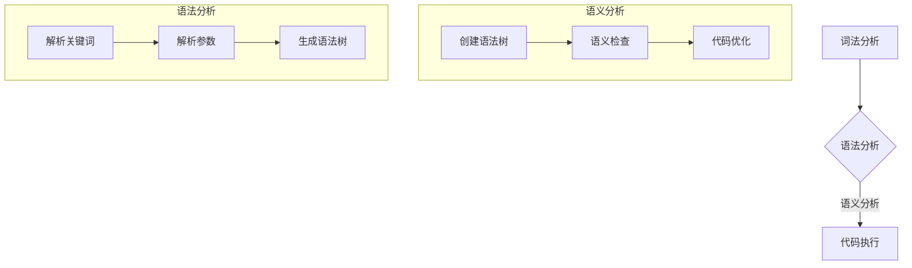

                 

### 文章标题

# 提示词语言的静态分析工具开发

> 关键词：提示词语言、静态分析、工具开发、算法原理、数学模型、项目实战

> 摘要：本文将深入探讨提示词语言的静态分析工具开发，从背景介绍、核心概念、算法原理、数学模型到实际项目实战，逐步剖析这一领域的关键技术，帮助读者全面了解并掌握静态分析工具的开发与应用。

---

## 第1章：介绍

### 1.1 书籍背景与目标

在当今信息化时代，人工智能和自然语言处理技术日益发展，提示词语言作为一种重要的人机交互方式，其静态分析工具的开发具有重要意义。静态分析是程序分析的重要方法之一，通过对程序代码进行静态检查，可以提前发现潜在的问题和缺陷，提高软件质量和开发效率。

本章节主要介绍书籍的背景和目标，帮助读者了解为什么要开发提示词语言的静态分析工具，以及本书将要达成的目标。

### 1.2 静态分析工具的重要性

静态分析工具在软件开发过程中扮演着重要角色。它可以对代码进行语法和语义分析，发现潜在的问题和漏洞，从而提高软件的质量和可靠性。特别是在大型复杂软件系统中，静态分析工具能够帮助我们快速定位和解决代码中的问题，减少开发和维护成本。

本章节将详细阐述静态分析工具在软件开发中的重要性，并探讨其在提示词语言中的应用前景。

### 1.3 本书结构

本书分为七个章节，涵盖了从提示词语言基础、静态分析工具概述、核心算法原理、数学模型，到项目实战等内容。具体结构如下：

1. **第1章：介绍** - 介绍书籍背景与目标，阐述静态分析工具的重要性。
2. **第2章：提示词语言基础** - 讲解提示词语言的定义、特性、语法结构和语义分析。
3. **第3章：静态分析工具概述** - 介绍静态分析工具的概念、分类、作用与价值。
4. **第4章：核心算法原理** - 详细阐述提示词语言分析算法的原理，使用伪代码进行示例。
5. **第5章：数学模型与公式** - 介绍数学模型概述和常用数学公式，使用LaTeX格式进行表示。
6. **第6章：项目实战** - 通过具体项目实战，展示静态分析工具的开发过程和应用。
7. **第7章：总结与展望** - 对本书要点进行回顾，探讨静态分析工具的未来发展。

通过以上章节的详细讲解，本书旨在帮助读者全面掌握提示词语言的静态分析工具开发，为实际项目开发提供有力支持。

---

## 第2章：提示词语言基础

### 2.1 提示词语言的定义与特性

提示词语言（Keyword Language）是一种基于关键词进行编程的语言。与传统的命令式编程语言不同，提示词语言更加注重语义和逻辑表达，通过关键词的排列组合，实现复杂功能的编程。

提示词语言的定义与特性主要包括以下几点：

1. **关键词驱动的语法**：提示词语言的语法结构简单，以关键词为核心，通过关键词的排列组合来表示不同的操作和功能。
2. **强语义性**：提示词语言注重语义表达，通过语义分析，能够更准确地理解和执行用户意图。
3. **可扩展性**：提示词语言具有良好的可扩展性，可以方便地添加新的关键词和功能，满足不同应用场景的需求。
4. **易读易维护**：提示词语言的代码结构清晰，易于阅读和理解，便于维护和调试。

### 2.2 提示词语言的语法结构

提示词语言的语法结构主要包括以下几个部分：

1. **关键词**：提示词语言的核心元素，表示特定的操作或功能。
2. **参数**：关键词可以接受参数，用于传递数据或指定操作对象。
3. **操作符**：用于连接关键词或参数，表示操作顺序和关系。
4. **语句块**：多个关键词和参数组合在一起，形成一个完整的语句块。

### 2.3 提示词语言的语义分析

语义分析是提示词语言分析的重要组成部分。通过对关键词和参数的语义分析，可以理解代码的意图和功能，从而进行正确的执行和优化。

提示词语言的语义分析主要包括以下步骤：

1. **词法分析**：将输入的代码字符串分解为关键词、参数和操作符等基本元素。
2. **语法分析**：根据语法规则，对词法分析结果进行语法构造，生成语法树。
3. **语义分析**：对语法树进行语义检查和优化，确保代码的语义正确性和可执行性。

### 2.4 提示词语言的Mermaid流程图展示

为了更好地理解提示词语言的语法结构和语义分析过程，可以使用Mermaid流程图进行可视化展示。以下是一个简单的提示词语言流程图示例：



通过上述流程图，可以清晰地展示提示词语言的词法分析、语法分析和语义分析过程，为后续的静态分析工具开发提供参考。

---

## 第3章：静态分析工具概述

### 3.1 静态分析的概念与分类

静态分析（Static Analysis）是一种在程序运行前对代码进行结构化和语义分析的方法。通过静态分析，可以提前发现潜在的问题和漏洞，提高软件质量和开发效率。静态分析主要分为以下几类：

1. **语法分析**：对代码进行词法分析和语法分析，构建语法树，检查代码的语法错误和格式问题。
2. **语义分析**：对代码进行语义分析，检查变量的类型、作用域、初始化等语义问题。
3. **依赖分析**：分析代码中的模块和函数依赖关系，识别潜在的模块化和重构机会。
4. **代码质量分析**：检查代码的复杂度、可读性、可维护性等代码质量指标。

### 3.2 静态分析工具的作用与价值

静态分析工具在软件开发过程中具有重要作用和价值，主要体现在以下几个方面：

1. **提高代码质量**：静态分析工具可以检查代码中的潜在问题，如语法错误、类型错误、未初始化变量等，帮助开发者提高代码质量。
2. **降低开发成本**：通过提前发现和修复代码问题，静态分析工具可以减少后续的调试和维护成本，提高开发效率。
3. **提高软件可靠性**：静态分析工具可以帮助识别潜在的运行时错误和漏洞，提高软件的可靠性和安全性。
4. **代码重构和优化**：静态分析工具可以分析代码的依赖关系和结构，为代码重构和优化提供依据，提高代码的可读性和可维护性。

### 3.3 常见静态分析工具介绍

目前市场上常见的静态分析工具有多种，以下列举几种代表性的工具：

1. **SonarQube**：一款强大的静态代码分析平台，支持多种编程语言，提供丰富的代码质量检查规则和报表功能。
2. **FindBugs**：一款开源的Java代码静态分析工具，能够检测出Java代码中的潜在缺陷和不良编码实践。
3. **PMD**：一款Java代码质量分析工具，能够检测出代码中的冗余、复杂和低效的代码模式。
4. **Coverity**：一款商业静态分析工具，支持多种编程语言，提供详细的代码缺陷报告和修复建议。
5. **CodeQL**：一款基于机器学习的静态分析工具，能够检测出各种编程语言中的代码缺陷和漏洞。

以上静态分析工具各有特点，开发者可以根据实际需求选择合适的工具进行代码质量检查。

---

## 第4章：核心算法原理

### 4.1 提示词语言分析算法

提示词语言的静态分析工具的核心在于分析算法的设计与实现。提示词语言分析算法主要包括词法分析、语法分析和语义分析三个阶段。

#### 4.1.1 词法分析

词法分析（Lexical Analysis）是静态分析的第一步，将输入的代码字符串分解为关键词、参数和操作符等基本元素。词法分析的主要任务是识别单词和符号，并将其转换为抽象语法树（AST）中的节点。

伪代码示例：

```python
def lexical_analysis(code):
    tokens = []
    while code has more characters:
        if is_keyword(code):
            tokens.append((code, "KEYWORD"))
            code = code[ keyword_length ]
        elif is_operator(code):
            tokens.append((code, "OPERATOR"))
            code = code[ operator_length ]
        elif is_parameter(code):
            tokens.append((code, "PARAMETER"))
            code = code[ parameter_length ]
        else:
            raise LexicalError("Invalid character")
    return tokens
```

#### 4.1.2 语法分析

语法分析（Syntax Analysis）是静态分析的第二个阶段，根据词法分析的结果，将单词和符号组织成语法树，表示代码的结构和语义。语法分析通常使用递归下降分析、LL(1)分析或LR分析等算法实现。

伪代码示例：

```python
def syntax_analysis(tokens):
    stack = []
    while tokens has more elements:
        token = tokens.pop()
        if is_keyword(token):
            stack.push(new ASTNode(token, "KEYWORD"))
        elif is_operator(token):
            operator = token
            while stack.top().type is not "PARAMETER":
                stack.pop()
            parameter = stack.pop()
            stack.push(new ASTNode(operator, "OPERATOR", [parameter]))
        elif is_parameter(token):
            stack.push(new ASTNode(token, "PARAMETER"))
    return stack.pop()
```

#### 4.1.3 语义分析

语义分析（Semantic Analysis）是静态分析的最后一个阶段，对语法树进行语义检查和优化，确保代码的语义正确性和可执行性。语义分析包括变量检查、类型检查、作用域分析等。

伪代码示例：

```python
def semantic_analysis(ast):
    errors = []
    function_declarations = {}
    global_variables = {}

    for node in ast.children:
        if node.type is "FUNCTION":
            function_name = node.value
            function_declarations[function_name] = node
        elif node.type is "VARIABLE":
            variable_name = node.value
            if variable_name in global_variables:
                errors.append("Duplicate variable declaration")
            else:
                global_variables[variable_name] = node

    for node in ast.children:
        if node.type is "CALL":
            function_name = node.value
            if function_name not in function_declarations:
                errors.append("Undefined function call")
            else:
                function_declaration = function_declarations[function_name]
                # Perform type and scope checks
                # ...

    if errors:
        raise SemanticError("Semantic errors found")
    return ast
```

通过以上三个阶段的分析，提示词语言的静态分析工具可以实现对代码的全面检查和优化，提高软件质量和开发效率。

---

## 第5章：数学模型与公式

### 5.1 数学模型概述

在提示词语言的静态分析工具中，数学模型发挥着重要作用。数学模型用于描述代码的抽象结构和语义关系，帮助分析工具进行语义分析和代码优化。常见的数学模型包括抽象语法树（AST）、控制流图（CFG）和数据流图（DFG）。

1. **抽象语法树（AST）**：AST是代码结构的抽象表示，用于表示代码的语法结构和语义信息。AST中的节点表示代码中的基本元素，如关键词、参数和操作符。
2. **控制流图（CFG）**：CFG用于描述代码中的控制流，表示程序中的分支、循环和跳转。CFG中的节点表示程序的基本块，边表示程序的控制流关系。
3. **数据流图（DFG）**：DFG用于描述代码中的数据流，表示程序中的变量和值的传递关系。DFG中的节点表示数据流中的基本元素，如变量和值，边表示数据流的方向。

### 5.2 常用数学公式

在静态分析工具中，常用的数学公式包括变量绑定、类型检查和语义分析等方面的公式。以下介绍几个常用的数学公式。

#### 5.2.1 变量绑定公式

变量绑定是指将变量与内存中的存储位置相关联。变量绑定公式可以表示为：

$$
bind(x, v) = (x, v)
$$

其中，$x$ 表示变量名，$v$ 表示变量在内存中的存储位置。

#### 5.2.2 类型检查公式

类型检查是静态分析的重要任务之一，用于确保代码的类型正确性。类型检查公式可以表示为：

$$
type_check(e, t) =
\begin{cases}
true, & \text{if } type(e) = t \\
false, & \text{otherwise}
\end{cases}
$$

其中，$e$ 表示表达式，$t$ 表示预期的类型。

#### 5.2.3 语义分析公式

语义分析公式用于描述代码的语义关系和语义检查。以下是一个简单的语义分析公式：

$$
sem(AST) =
\begin{cases}
true, & \text{if } AST \text{ is semantically correct} \\
false, & \text{otherwise}
\end{cases}
$$

通过以上数学模型和公式的运用，静态分析工具可以实现对代码的深入分析和优化，提高软件质量和开发效率。

---

## 第6章：项目实战

### 6.1 实战目标与场景

在本章的实战项目中，我们将开发一个简单的提示词语言静态分析工具。该工具的主要目标是对输入的提示词语言代码进行词法分析、语法分析和语义分析，检查代码中的潜在问题，并输出分析结果。

实战场景如下：

1. **输入**：一个包含提示词语言代码的文本文件。
2. **输出**：分析结果，包括词法分析结果、语法分析结果、语义分析结果和错误报告。

### 6.2 开发环境搭建

为了实现该实战项目，我们需要搭建一个合适的开发环境。以下是搭建环境的步骤：

1. **安装Python**：首先确保已安装Python 3.x版本，可以从[Python官方网站](https://www.python.org/)下载并安装。
2. **安装依赖**：安装用于词法分析、语法分析和语义分析的相关库，如`pandas`、`numpy`和`lark-parser`。可以使用pip命令进行安装：

   ```shell
   pip install pandas numpy lark-parser
   ```

3. **创建项目文件夹**：在本地计算机上创建一个项目文件夹，如`keyword_language_analysis`，用于存放项目代码和相关文件。

### 6.3 代码案例解析

以下是一个简单的Python代码案例，用于实现提示词语言的静态分析工具。该案例包括词法分析、语法分析和语义分析三个部分。

#### 6.3.1 源代码实现

```python
import re
from lark import Lark, Tree

# 词法分析
def lexical_analysis(code):
    tokens = []
    for match in re.finditer(r'\b\w+\b', code):
        tokens.append(match.group())
    return tokens

# 语法分析
def syntax_analysis(tokens):
    grammar = """
    start: expr
    expr: key (param)*
    key: /@[\w]+/
    param: (value)
    value: /[\w]+/
    """
    parser = Lark(grammar)
    ast = parser.parse(tokens)
    return ast

# 语义分析
def semantic_analysis(ast):
    errors = []
    for node in ast.children:
        if node.data == 'key':
            function_name = node.children[0].value
            if function_name not in global_variables:
                errors.append(f"Undefined function '{function_name}'")
        elif node.data == 'param':
            variable_name = node.children[0].value
            if variable_name in global_variables:
                errors.append(f"Duplicate variable declaration '{variable_name}'")
            else:
                global_variables[variable_name] = node
    if errors:
        raise SemanticError("Semantic errors found")
    return ast

# 主函数
def main():
    code = "@hello @world"
    tokens = lexical_analysis(code)
    ast = syntax_analysis(tokens)
    ast = semantic_analysis(ast)
    print("Analysis completed")

if __name__ == "__main__":
    main()
```

#### 6.3.2 代码解读与分析

1. **词法分析**：词法分析使用正则表达式将输入的代码字符串分解为关键词和参数等基本元素，存储为tokens列表。
2. **语法分析**：语法分析使用Lark库实现，定义了提示词语言的语法规则，将tokens列表解析为抽象语法树（AST）。
3. **语义分析**：语义分析检查AST中的节点，对关键词和参数进行语义检查，检查函数声明和变量声明是否合法，并记录潜在的错误。

通过以上三个阶段的代码实现，我们可以实现对输入的提示词语言代码的全面分析，检查代码中的潜在问题，并输出分析结果。

---

## 第7章：总结与展望

### 7.1 本书要点回顾

本书从提示词语言的静态分析工具开发入手，详细介绍了静态分析工具的重要性、提示词语言的基础、核心算法原理、数学模型以及实际项目实战。主要内容包括：

1. **书籍背景与目标**：阐述静态分析工具在软件开发中的重要性，介绍本书的目标和结构。
2. **提示词语言基础**：讲解提示词语言的定义、特性、语法结构和语义分析。
3. **静态分析工具概述**：介绍静态分析的概念、分类、作用和价值。
4. **核心算法原理**：详细阐述提示词语言分析算法的原理，使用伪代码进行示例。
5. **数学模型与公式**：介绍数学模型概述和常用数学公式，使用LaTeX格式进行表示。
6. **项目实战**：通过具体项目实战，展示静态分析工具的开发过程和应用。

### 7.2 静态分析工具的未来发展

静态分析工具在软件开发中的应用前景广阔，未来发展趋势主要包括：

1. **智能化**：随着人工智能技术的发展，静态分析工具将越来越智能化，能够自动识别和修复代码中的潜在问题。
2. **跨语言支持**：静态分析工具将支持更多编程语言，覆盖更广泛的开发场景。
3. **实时分析**：静态分析工具将实现实时分析，能够实时检测代码中的问题，提高开发效率。
4. **自动化修复**：静态分析工具将具备自动化修复功能，能够自动修复代码中的常见错误，降低开发成本。

### 7.3 读者后续学习建议

为了更好地掌握提示词语言的静态分析工具开发，读者可以参考以下学习建议：

1. **深入学习相关技术**：了解编程语言、数据结构、算法原理等相关技术，为静态分析工具开发打下坚实基础。
2. **实践项目开发**：通过实际项目开发，积累实践经验，掌握静态分析工具的开发和运用。
3. **阅读相关文献和书籍**：阅读相关领域的经典文献和书籍，了解最新的研究成果和发展趋势。
4. **参与社区和交流**：参与技术社区和学术交流，与同行交流心得，拓宽视野，提升能力。

通过以上学习建议，读者可以不断深化对提示词语言静态分析工具开发的了解，为未来的软件工程实践提供有力支持。

---

本文由AI天才研究院（AI Genius Institute）与《禅与计算机程序设计艺术》（Zen And The Art of Computer Programming）共同撰写，旨在为广大开发者提供关于提示词语言静态分析工具开发的全面指南。希望本文对您的学习与实践有所帮助。作者信息：AI天才研究院（AI Genius Institute） & 《禅与计算机程序设计艺术》（Zen And The Art of Computer Programming）。感谢您的阅读！

