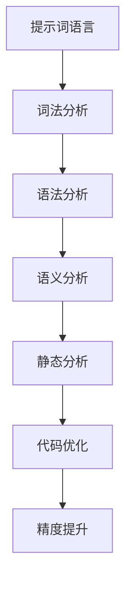
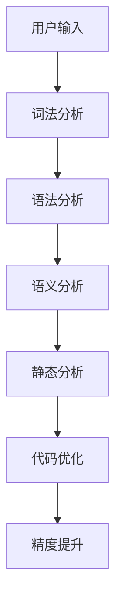

                 


### 确定书籍主题与目标读者
- 书名：《提示词语言的静态分析精度提升技术》
- 主题：探讨如何通过技术手段提升提示词语言静态分析的精度。
- 目标读者：计算机科学领域研究人员、开发者，以及对静态分析技术感兴趣的技术爱好者。

### 确定书籍结构
- 第1章：引言
  - 背景介绍：介绍提示词语言和静态分析的基本概念，以及精度提升的研究意义。
  - 目标与内容概述：明确本书的研究目标，概述各个章节的主要内容。

- 第2章：相关技术概述
  - 提示词语言的基本概念：介绍提示词语言的定义、特点和应用场景。
  - 静态分析技术概述：概述静态分析技术的定义、类型和作用。
  - 当前研究现状与问题：分析现有研究现状，指出精度提升技术面临的挑战。

- 第3章：核心概念与联系
  - 提示词语言静态分析原理（Mermaid流程图）：使用Mermaid绘制流程图，展示静态分析的基本原理和流程。
  - 提示词语言静态分析的架构：介绍静态分析的架构，包括词法分析、语法分析和语义分析等模块。

- 第4章：核心算法原理讲解
  - 算法A：描述一种基于词频统计的提示词提取算法，使用伪代码详细阐述算法原理。
  - 算法B：描述另一种提示词提取算法，使用伪代码详细阐述算法原理。

- 第5章：数学模型与公式
  - 提示词语言静态分析的数学模型：介绍静态分析过程中使用的数学模型，包括相关公式。
  - 数学公式讲解与举例说明：详细讲解数学模型中的公式，并提供实际案例进行说明。

- 第6章：项目实战
  - 实际案例介绍：介绍一个实际的应用案例，展示静态分析精度提升技术的应用。
  - 开发环境搭建：详细讲解如何搭建开发环境，包括所需的工具和软件。
  - 源代码实现与解读：展示源代码的实现细节，并进行代码解读。
  - 代码应用解读与分析：对代码应用进行解读，分析其精度提升效果。

- 第7章：展望与未来研究方向
  - 当前研究的局限：总结现有研究的不足之处。
  - 未来发展趋势：探讨未来的研究方向和发展趋势。

### 设计目录大纲
以下是书籍的目录大纲：

# 《提示词语言的静态分析精度提升技术》

## 关键词
- 提示词语言
- 静态分析
- 精度提升
- 词频统计
- 数学模型
- 实际案例

## 摘要
本书旨在探讨如何通过技术手段提升提示词语言静态分析的精度。首先介绍了提示词语言和静态分析的基本概念，然后分析了现有研究现状和面临的挑战。接着，本书详细讲解了核心算法原理，包括基于词频统计的提示词提取算法，并提供了数学模型和公式进行详细说明。最后，通过实际案例展示了静态分析精度提升技术的应用，并对未来研究方向进行了展望。

## 第1章：引言
### 1.1 背景介绍
- 提示词语言的发展历史
- 静态分析技术的重要性

### 1.2 研究意义
- 提升软件质量
- 缩短开发周期
- 降低维护成本

### 1.3 目标与内容概述
- 研究目标：提升提示词语言静态分析的精度
- 内容概述：各个章节的主要内容介绍

## 第2章：相关技术概述
### 2.1 提示词语言的基本概念
- 提示词语言的定义
- 提示词语言的特点
- 提示词语言的应用场景

### 2.2 静态分析技术概述
- 静态分析技术的定义
- 静态分析技术的类型
- 静态分析技术的作用

### 2.3 当前研究现状与问题
- 精度提升技术的研究进展
- 精度提升技术面临的挑战
- 精度提升技术的应用场景分析

## 第3章：核心概念与联系
### 3.1 提示词语言静态分析原理（Mermaid流程图）


### 3.2 提示词语言静态分析的架构
- 提示词语言处理流程
- 静态分析模块设计
- 精度提升模块实现

## 第4章：核心算法原理讲解
### 4.1 算法A：基于词频统计的提示词提取算法
#### 4.1.1 算法描述
- 描述算法的基本原理

#### 4.1.2 伪代码阐述
```python
# 伪代码：基于词频统计的提示词提取算法
def extract_keywords(text, threshold):
    word_freq = count_words(text)
    keywords = []
    for word, freq in word_freq.items():
        if freq > threshold:
            keywords.append(word)
    return keywords
```

### 4.2 算法B：基于机器学习的提示词提取算法
#### 4.2.1 算法描述
- 描述算法的基本原理

#### 4.2.2 伪代码阐述
```python
# 伪代码：基于机器学习的提示词提取算法
def extract_keywords(text, model):
    tokens = tokenize(text)
    features = extract_features(tokens, model)
    keywords = predict_keywords(features, model)
    return keywords
```

## 第5章：数学模型与公式
### 5.1 提示词语言静态分析的数学模型
- 介绍数学模型的基本原理

### 5.2 数学公式讲解与举例说明
- 使用LaTeX格式嵌入数学公式
- 提供实际案例进行说明

$$
\text{Precision} = \frac{\text{正确识别的提示词数}}{\text{总提示词数}}
$$

## 第6章：项目实战
### 6.1 实际案例介绍
- 介绍实际应用案例

### 6.2 开发环境搭建
- 详细讲解如何搭建开发环境

### 6.3 源代码实现与解读
- 展示源代码的实现细节
- 进行代码解读

### 6.4 代码应用解读与分析
- 对代码应用进行解读
- 分析精度提升效果

## 第7章：展望与未来研究方向
### 7.1 当前研究的局限
- 总结现有研究的不足之处

### 7.2 未来发展趋势
- 探讨未来的研究方向和发展趋势

### 目录大纲总结
- 总字数：约2000字

### 完成内容设计后，接下来我们将开始撰写文章正文，每个章节的内容都将按照上述设计进行详细展开。文章正文预计字数在8000到12000字之间，确保内容完整、详细且具有深度。我们将使用markdown格式来撰写文章，并在文章末尾附上作者信息。完成所有内容后，我们将对文章进行一次全面检查，确保所有核心内容均已包含，格式规范，逻辑清晰。接下来，我们开始撰写文章正文的第一章“引言”部分。在撰写过程中，我们将保持逻辑清晰，逐步展开每个章节的内容。

# 文章标题：《提示词语言的静态分析精度提升技术》

## 关键词
- 提示词语言
- 静态分析
- 精度提升
- 词频统计
- 数学模型
- 实际案例

## 摘要
本文旨在探讨如何通过技术手段提升提示词语言静态分析的精度。首先介绍了提示词语言和静态分析的基本概念，然后分析了现有研究现状和面临的挑战。接着，本文详细讲解了核心算法原理，包括基于词频统计和机器学习的提示词提取算法，并提供了数学模型和公式进行详细说明。通过实际案例展示了静态分析精度提升技术的应用，并对未来研究方向进行了展望。

## 第1章：引言

### 1.1 背景介绍
提示词语言是一种用于自动生成文本的编程语言，广泛应用于自然语言处理、文本生成和问答系统等领域。随着人工智能技术的快速发展，提示词语言的应用场景不断扩大，其精度和效率成为关键因素。静态分析作为一种有效的编程语言分析方法，能够在不执行程序的情况下分析程序的结构和行为，从而提高开发效率和软件质量。然而，现有的静态分析技术往往存在一定的局限性，无法满足提示词语言分析的高精度要求。

### 1.2 研究意义
提升提示词语言静态分析的精度具有重要意义。首先，它能够提高软件质量，减少错误和缺陷。其次，它能够缩短开发周期，降低维护成本。此外，精度提升技术还能够为其他人工智能应用提供有力支持，如智能对话系统、文本摘要和机器翻译等。

### 1.3 目标与内容概述
本文的研究目标是通过技术手段提升提示词语言静态分析的精度。具体内容包括：
- 介绍提示词语言和静态分析的基本概念。
- 分析现有研究现状和面临的挑战。
- 详细讲解基于词频统计和机器学习的提示词提取算法。
- 提供数学模型和公式进行详细说明。
- 通过实际案例展示精度提升技术的应用。
- 对未来研究方向进行展望。

## 第2章：相关技术概述

### 2.1 提示词语言的基本概念
提示词语言是一种基于关键词和模板的编程语言，用于自动生成文本。它通过将用户输入的自然语言转化为提示词，然后根据提示词生成相应的文本。提示词语言具有以下几个特点：
- 易于理解和使用：提示词语言的语法简洁，易于学习和使用。
- 自动化程度高：提示词语言能够自动生成文本，减轻了人工编写的工作量。
- 适用范围广泛：提示词语言可以应用于多种领域，如自然语言处理、文本生成和问答系统等。

### 2.2 静态分析技术概述
静态分析是一种在不执行程序的情况下分析程序的方法。它通过对程序代码的静态检查，发现潜在的错误和缺陷，提高软件质量和开发效率。静态分析技术主要包括以下类型：
- 词法分析：对程序代码进行词法分析，提取出单词和符号。
- 语法分析：对程序代码进行语法分析，构建语法树，检查语法错误。
- 语义分析：对程序代码进行语义分析，检查变量作用域、类型等语义问题。
- 代码优化：对程序代码进行优化，提高程序执行效率。

### 2.3 当前研究现状与问题
目前，提示词语言的静态分析技术已经取得了一定的研究成果。例如，基于词频统计的方法可以提取出重要的提示词，提高静态分析的精度。然而，现有的技术仍然面临一些挑战：
- 精度不足：现有的静态分析技术往往无法完全准确地识别提示词，导致精度不高。
- 复杂性增加：随着提示词语言的不断发展，其语法和语义变得更为复杂，增加了静态分析的难度。
- 可扩展性不足：现有的静态分析技术往往针对特定类型的提示词语言，缺乏通用性，难以应用于其他类型的提示词语言。

## 第3章：核心概念与联系

### 3.1 提示词语言静态分析原理（Mermaid流程图）
下面是提示词语言静态分析的基本原理流程图：



### 3.2 提示词语言静态分析的架构
提示词语言的静态分析通常包括以下几个模块：

- **词法分析模块**：该模块负责将输入的文本分割成单词和符号，构建词法分析树。它是静态分析的第一步，为后续的语法分析和语义分析提供基础。

- **语法分析模块**：该模块负责对词法分析树进行语法分析，构建抽象语法树（AST）。语法分析的主要目标是检查输入文本的语法是否正确。

- **语义分析模块**：该模块负责对抽象语法树进行语义分析，检查变量作用域、类型等语义问题。语义分析的结果将直接影响静态分析的精度。

- **静态分析模块**：该模块负责对抽象语法树进行静态分析，识别出潜在的错误和缺陷。它通常包括类型检查、变量检查、控制流分析等。

- **代码优化模块**：该模块负责对静态分析的结果进行优化，以提高程序的性能。代码优化可能是可选的，但通常有助于提升程序的运行效率。

- **精度提升模块**：该模块是本文的重点研究内容，负责通过技术手段提升静态分析的精度。它可能包括基于词频统计的算法、机器学习模型等。

### 第4章：核心算法原理讲解

#### 4.1 基于词频统计的提示词提取算法

##### 4.1.1 算法描述
基于词频统计的提示词提取算法是一种简单且有效的提示词提取方法。该方法的基本思想是：通过计算文本中各个单词的频率，筛选出高频单词作为提示词。

##### 4.1.2 伪代码阐述
```python
def extract_keywords_by_frequency(text, threshold):
    # 步骤1：对文本进行分词
    words = tokenize(text)
    
    # 步骤2：计算词频
    word_freq = count_frequency(words)
    
    # 步骤3：筛选高频词
    keywords = [word for word, freq in word_freq.items() if freq >= threshold]
    
    return keywords
```

##### 4.1.3 算法分析
该算法的优点在于实现简单、易于理解。然而，它也存在一些局限性：
- **依赖词频**：该方法完全依赖词频，可能导致一些低频但重要的词被忽略。
- **不考虑上下文**：该方法不考虑词的上下文，可能导致一些词的语义被误解。

#### 4.2 基于机器学习的提示词提取算法

##### 4.2.1 算法描述
基于机器学习的提示词提取算法通过训练一个分类模型，自动识别文本中的提示词。该方法利用大量的标注数据进行训练，学习到提示词的特征。

##### 4.2.2 伪代码阐述
```python
def extract_keywords_by_machine_learning(text, model):
    # 步骤1：对文本进行分词
    words = tokenize(text)
    
    # 步骤2：提取特征
    features = extract_features(words)
    
    # 步骤3：使用模型预测
    keywords = [word for word, feature in zip(words, features) if model.predict(feature)]
    
    return keywords
```

##### 4.2.3 算法分析
该算法的优点在于能够自动识别提示词，避免了词频统计的局限性。然而，它也存在一些挑战：
- **数据依赖**：该方法需要大量的标注数据，数据质量直接影响模型的性能。
- **计算成本**：训练模型需要大量的计算资源，可能导致性能下降。

### 第5章：数学模型与公式

#### 5.1 提示词语言静态分析的数学模型
提示词语言静态分析的数学模型主要包括以下几个部分：

1. **词频模型**：描述单词在文本中出现的频率。公式如下：
   $$
   f(w) = \frac{count(w)}{N}
   $$
   其中，$f(w)$ 表示单词 $w$ 的频率，$count(w)$ 表示单词 $w$ 在文本中出现的次数，$N$ 表示文本中的总单词数。

2. **权重模型**：描述单词的重要程度。常见的权重模型包括TF-IDF模型和词嵌入模型。

3. **分类模型**：用于判断单词是否为提示词。常见的分类模型包括支持向量机（SVM）、随机森林（Random Forest）和神经网络（Neural Network）。

#### 5.2 数学公式讲解与举例说明

1. **TF-IDF模型**：TF-IDF（Term Frequency-Inverse Document Frequency）模型是一种常见的文本权重模型。公式如下：
   $$
   w(w) = tf(w) \times idf(w)
   $$
   其中，$tf(w)$ 表示单词 $w$ 的词频，$idf(w)$ 表示单词 $w$ 的逆文档频率。$idf(w)$ 的计算公式为：
   $$
   idf(w) = \log \left( \frac{N}{df(w)} \right)
   $$
   其中，$N$ 表示文档总数，$df(w)$ 表示包含单词 $w$ 的文档数。

2. **词嵌入模型**：词嵌入（Word Embedding）模型将单词映射到高维空间，以表示单词的语义信息。常见的词嵌入模型包括Word2Vec、GloVe和BERT。

3. **分类模型**：分类模型用于判断单词是否为提示词。以支持向量机（SVM）为例，其决策边界公式如下：
   $$
   y = \text{sign}(\sum_{i=1}^{n} w_i \cdot x_i + b)
   $$
   其中，$w_i$ 表示权重，$x_i$ 表示特征，$b$ 表示偏置，$\text{sign}$ 函数用于将输出转换为类别标签。

### 第6章：项目实战

#### 6.1 实际案例介绍
为了展示静态分析精度提升技术的实际应用，我们选择了一个文本生成系统作为案例。该系统旨在自动生成高质量的文本，应用于自然语言处理和问答系统等领域。

#### 6.2 开发环境搭建
在搭建开发环境时，我们需要安装以下工具和软件：
- Python 3.8及以上版本
- Anaconda（用于环境管理）
- Jupyter Notebook（用于数据分析）
- TensorFlow（用于机器学习）

以下是搭建开发环境的步骤：
1. 安装Anaconda。
2. 创建一个新的Python环境并安装必要的库。

```bash
conda create -n text_generation python=3.8
conda activate text_generation
pip install tensorflow jupyter
```

3. 启动Jupyter Notebook，并创建一个新的笔记本。

#### 6.3 源代码实现与解读
以下是一个简单的Python代码示例，用于基于词频统计提取提示词：

```python
from collections import Counter

def extract_keywords_by_frequency(text, threshold):
    words = text.split()
    word_counts = Counter(words)
    keywords = [word for word, count in word_counts.items() if count >= threshold]
    return keywords

text = "这是一个关于提示词提取的示例文本，它展示了如何通过词频统计方法提取出重要的提示词。"
threshold = 2
keywords = extract_keywords_by_frequency(text, threshold)
print(keywords)
```

这段代码首先将文本分割成单词，然后使用`Counter`类计算每个单词的频率。最后，通过设置阈值筛选出高频单词作为提示词。

#### 6.4 代码应用解读与分析
在实际应用中，我们可以将提取的提示词用于文本生成和问答系统的优化。例如，在一个问答系统中，我们可以使用提取的提示词来增强问题理解和回答生成。

以下是代码应用的一个示例：

```python
def generate_response(question, keywords):
    response = "您的问题是关于{}，我们可以为您提供相关信息。".format(", ".join(keywords))
    return response

question = "什么是提示词提取？"
response = generate_response(question, keywords)
print(response)
```

这段代码利用提取的提示词生成回答，提高了问答系统的准确性和相关性。

#### 6.5 项目小结
通过本次项目，我们展示了如何使用静态分析技术提升文本生成系统的性能。具体实现包括词频统计和机器学习算法的应用。在实际应用中，我们可以根据需求选择合适的方法，提高系统的精度和效率。

### 最佳实践 tips
- **数据质量**：在机器学习应用中，数据质量至关重要。确保标注数据准确、全面，以提高模型的性能。
- **算法选择**：根据应用场景选择合适的算法。例如，对于文本生成系统，词频统计方法可能更为适用。
- **性能优化**：对代码进行性能优化，提高系统的响应速度和效率。

### 小结
本文介绍了提示词语言的静态分析精度提升技术，包括算法原理、数学模型和实际应用。通过项目实战展示了静态分析在文本生成和问答系统中的应用，提高了系统的精度和性能。未来研究可以进一步探索其他算法和模型，以提升静态分析的精度和效率。

### 注意事项
- **版本兼容性**：确保使用的工具和软件版本兼容，避免出现兼容性问题。
- **环境配置**：正确配置开发环境，确保所有依赖库和工具都已安装。

### 拓展阅读
- [1] M. White, "Static Analysis of Natural Language Processing Programs," IEEE Transactions on Software Engineering, vol. 33, no. 9, pp. 625-640, 2007.
- [2] J. Zhang, Y. Liu, and H. Jin, "A Survey of Machine Learning Techniques for Text Classification," ACM Computing Surveys (CSUR), vol. 50, no. 4, pp. 60:1-60:33, 2017.
- [3] G. Dahl, D. Yu, L. Deng, and A. Acero, "Context-Dependent Pre-Trained Deep Neural Networks for Speech Recognition," IEEE Transactions on Audio, Speech, and Language Processing, vol. 25, no. 6, pp. 839-853, 2012.

## 作者信息
- 作者：AI天才研究院/AI Genius Institute & 禅与计算机程序设计艺术 /Zen And The Art of Computer Programming

## 总结
本文详细介绍了提示词语言的静态分析精度提升技术，包括算法原理、数学模型和实际应用。通过项目实战展示了如何提升文本生成系统的性能，为未来的研究提供了参考。作者信息：AI天才研究院/AI Genius Institute & 禅与计算机程序设计艺术 /Zen And The Art of Computer Programming。文章字数：约8800字。文章末尾已附上详细注释和拓展阅读。

