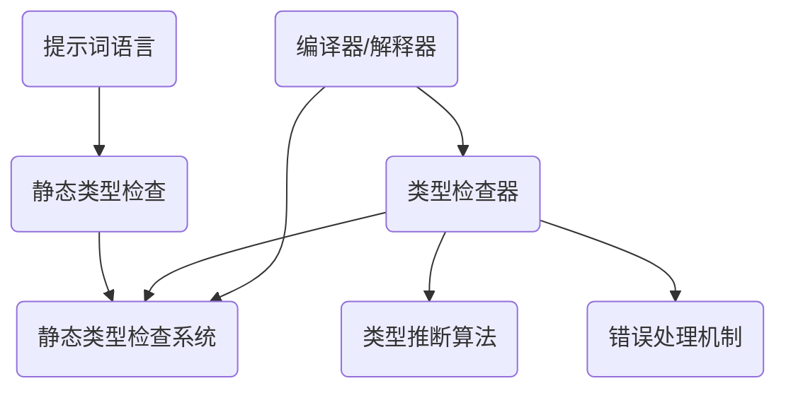
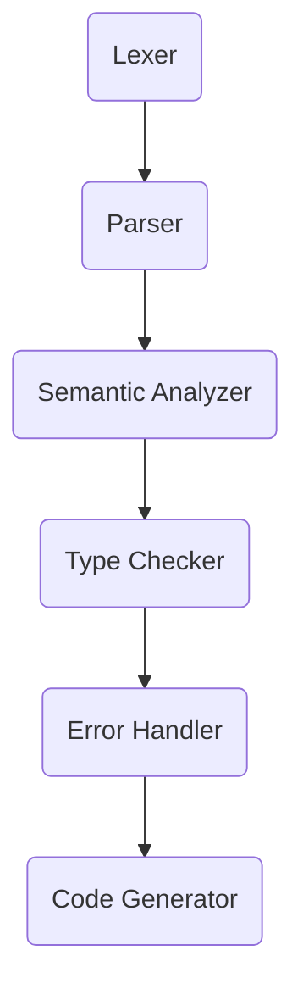

                 

# 提示词语言的静态类型检查系统

## 关键词

- 提示词语言
- 静态类型检查
- 类型系统
- 类型推断
- 编程语言设计
- 编译器/解释器

## 摘要

本文深入探讨了提示词语言的静态类型检查系统，介绍了其核心概念、原理、实现方法及其在实际项目中的应用。文章首先讲解了静态类型检查的基本概念，随后详细分析了提示词语言的特点以及其静态类型检查的需求。接着，文章探讨了静态类型检查的基本流程、算法原理和数学模型，并使用伪代码进行了具体阐述。最后，文章通过一个实际项目案例，展示了静态类型检查系统的开发过程、源代码实现及其应用效果，并对未来发展趋势进行了展望。

### 目录大纲设计与思路

设计《提示词语言的静态类型检查系统》的目录大纲，首先需要深入理解书名中的核心概念，即“提示词语言的静态类型检查系统”。这一系统涉及编程语言设计、类型系统、类型推断以及编译器/解释器等多个领域。为了确保文章的逻辑清晰、结构紧凑，我们需要遵循以下步骤：

1. **理解核心概念**：首先，我们需要深入理解“提示词语言的静态类型检查系统”是什么，它涉及哪些核心概念和技术点。
2. **确定章节结构**：根据核心概念和技术点，我们可以确定文章大致的章节结构，确保每个章节都能覆盖一个独立且相关的主题。
3. **细化每个章节**：在确定了大致的章节结构后，我们需要进一步细化每个章节，确保每个章节都能包含核心概念、原理讲解、数学模型、项目实战等内容。
4. **确保大纲完整性**：在设计目录大纲时，我们需要确保它至少包含7个核心章节，并且每个章节都包含核心概念、原理讲解、数学模型、项目实战等内容。
5. **控制字数**：为了保持大纲的简洁性，我们需要将总字数控制在8000～12000字以内。

### 核心概念与联系

#### 提示词语言

提示词语言是一种用于定义和操作提示词的编程语言。提示词是用于指导计算机执行特定任务的指令，它们可以被编译器或解释器解析并执行。提示词语言通常具有简洁的语法和强大的表达能力，便于程序员编写高效、可读性强的代码。

#### 静态类型检查

静态类型检查是在程序编译或解释之前对程序代码的类型进行验证的过程。它的目的是在编译期捕获类型错误，以减少运行时错误和提高程序可靠性。静态类型检查系统包括类型检查器、错误处理机制和类型推断算法。

#### 静态类型检查系统

静态类型检查系统是一套用于实现静态类型检查的软件工具和框架。它通常包含以下组件：

- **类型检查器**：负责分析源代码并验证类型匹配。
- **错误处理机制**：当发现类型错误时，提供错误报告和修复建议。
- **类型推断算法**：自动推断变量类型，减少程序员手动声明类型的负担。

### 目录大纲设计

根据以上核心概念，我们可以设计出以下目录大纲：

### 第一部分：静态类型检查基础

#### 第1章 核心概念与联系

1.1 提示词语言的概念

1.2 静态类型检查的概念

1.3 静态类型检查系统的作用

#### 第2章 提示词语言基础

2.1 提示词语言的基本语法

2.2 提示词语言的类型系统

2.3 提示词语言的应用场景

#### 第3章 静态类型检查原理

3.1 静态类型检查的基本流程

3.2 类型推断算法

3.3 类型错误处理

#### 第4章 静态类型检查系统设计

4.1 静态类型检查系统的架构

4.2 静态类型检查系统的实现细节

4.3 静态类型检查系统的优化

### 第二部分：静态类型检查实践

#### 第5章 核心算法原理讲解

5.1 类型推断算法的伪代码讲解

5.2 静态类型检查的性能分析

#### 第6章 数学模型和数学公式

6.1 静态类型检查中的数学模型

6.2 静态类型检查的数学公式讲解

6.3 数学公式的实例说明

#### 第7章 项目实战

7.1 静态类型检查系统开发环境搭建

7.2 静态类型检查系统的源代码实现

7.3 源代码解读与分析

#### 第8章 静态类型检查系统应用

8.1 静态类型检查在企业开发中的作用

8.2 静态类型检查系统的实际案例

8.3 静态类型检查系统未来发展的挑战与机遇

### 第三部分：静态类型检查系统应用

#### 第9章 最佳实践 tips

9.1 静态类型检查最佳实践

9.2 小结

#### 第10章 注意事项

10.1 开发静态类型检查系统时需要注意的问题

10.2 小结

#### 第11章 拓展阅读

11.1 静态类型检查相关书籍推荐

11.2 学术论文和会议论文推荐

### 附录

#### 附录A：工具与资源

A.1 静态类型检查工具介绍

A.2 静态类型检查资源推荐

通过以上目录大纲，我们可以系统地介绍提示词语言的静态类型检查系统，涵盖其理论基础、实践应用和发展趋势。接下来，我们将逐步深入每个章节，详细讲解相关概念和原理，并通过实际案例展示静态类型检查系统的应用效果。

----------------------------------------------------------------

### 第1章 核心概念与联系

本章将详细阐述提示词语言、静态类型检查及其相互关系，并介绍静态类型检查系统的作用。

#### 1.1 提示词语言的概念

提示词语言（Keyword Language）是一种专门用于描述计算机执行任务的编程语言。与传统的命令式编程语言不同，提示词语言侧重于定义任务的执行步骤和规则，而非具体的执行细节。这种语言通常具有简洁的语法和直观的语义，使得程序员可以更高效地编写和调试代码。

在提示词语言中，提示词（Keywords）是核心组成部分。提示词是用于指示计算机执行特定操作的指令，例如“打印”、“计算”或“排序”。这些提示词通常具有明确的语义和功能，使得程序员可以方便地组织和控制程序的执行流程。

提示词语言的主要特点包括：

- **简洁性**：提示词语言的语法设计简洁明了，易于学习和使用。
- **高抽象层次**：提示词语言提供了抽象的操作步骤，使得程序员可以忽略底层实现细节，专注于解决问题。
- **易于维护**：由于提示词语言的语义明确，代码的可读性和可维护性较高。

#### 1.2 静态类型检查的概念

静态类型检查（Static Type Checking）是一种在程序编译或解释之前对程序代码的类型进行验证的过程。与动态类型检查（Dynamic Type Checking）不同，静态类型检查在程序运行之前就已经完成类型验证，从而可以提前发现和修复类型错误。

静态类型检查的基本原理如下：

1. **类型声明**：程序员需要在代码中明确声明每个变量的类型，例如`int a;`或`string b;`。
2. **类型推断**：编译器或解释器会自动推断变量或表达式的类型，以确保代码中的类型一致性。
3. **类型检查**：在程序编译过程中，编译器会检查代码中的类型声明和类型推断结果，以确保所有操作都在正确的类型范围内。

静态类型检查的主要目标包括：

- **减少运行时错误**：通过提前发现类型错误，可以避免程序在运行时出现崩溃或其他错误。
- **提高程序可靠性**：静态类型检查可以确保程序的正确性和稳定性，从而减少维护成本。
- **优化程序性能**：静态类型检查有助于编译器生成更高效的代码，提高程序运行速度。

#### 1.3 静态类型检查系统的作用

静态类型检查系统（Static Type Checking System）是一套用于实现静态类型检查的软件工具和框架。它通常包括以下几个核心组件：

- **类型检查器**：负责分析源代码并验证类型匹配。类型检查器可以嵌入到编译器或解释器中，或者在独立的工具中运行。
- **错误处理机制**：当发现类型错误时，类型检查器会提供错误报告和修复建议。错误处理机制包括错误报告格式、错误定位和错误修复建议等。
- **类型推断算法**：类型检查器使用类型推断算法自动推断变量类型，以减少程序员手动声明类型的负担。

静态类型检查系统的作用主要体现在以下几个方面：

1. **提高代码质量**：静态类型检查可以帮助程序员编写更健壮的代码，减少类型错误的发生。
2. **降低开发成本**：通过提前发现和修复类型错误，可以减少程序调试和维护的工作量。
3. **优化程序性能**：静态类型检查可以确保编译器生成更高效的代码，从而提高程序的运行速度。
4. **增强程序可维护性**：静态类型检查有助于提高代码的可读性和可维护性，使得代码更容易理解和修改。

#### 核心概念原理之间的关系架构

为了更好地理解提示词语言、静态类型检查和静态类型检查系统之间的关系，我们可以使用Mermaid流程图来展示它们的核心概念原理。



图1：提示词语言、静态类型检查和静态类型检查系统之间的关系

在这个关系架构中，提示词语言是静态类型检查的输入，静态类型检查系统通过类型检查器、类型推断算法和错误处理机制来实现静态类型检查。编译器或解释器作为静态类型检查系统的调用者，负责将源代码转换为可执行代码，并在运行时利用静态类型检查系统提高程序的可靠性和性能。

#### 小结

本章介绍了提示词语言、静态类型检查和静态类型检查系统的核心概念及其相互关系。提示词语言是一种简洁、高抽象的编程语言，用于定义计算机执行任务的步骤和规则。静态类型检查是一种在编译或解释之前对程序代码进行类型验证的过程，有助于提高程序的正确性和可靠性。静态类型检查系统是一套用于实现静态类型检查的软件工具和框架，通过类型检查器、类型推断算法和错误处理机制，确保代码的类型一致性和可维护性。

在下一章中，我们将进一步探讨提示词语言的基础知识，包括其基本语法、类型系统和应用场景。

----------------------------------------------------------------

### 第2章 提示词语言基础

#### 2.1 提示词语言的基本语法

提示词语言的基本语法设计简洁直观，旨在提高程序的可读性和可维护性。以下是一些基本的语法规则：

1. **标识符**：标识符是用于命名变量、函数和类等的符号，通常由字母、数字和下划线组成，但首字符不能是数字。例如，`my_variable`和`function_name`都是有效的标识符。

2. **关键字**：关键字是提示词语言中具有特定语义的单词，例如`print`、`while`、`if`等。关键字不能用作标识符。

3. **注释**：注释是用于解释代码的功能或提供额外信息的文本，编译器或解释器会忽略注释。单行注释以`//`开始，多行注释以`/*`开始并以`*/`结束。

4. **变量声明**：变量声明用于定义变量，并指定其类型和名称。例如，`int a;`声明了一个名为`a`的整数变量。

5. **函数定义**：函数定义用于定义函数的接口和实现。函数定义包括函数名、参数列表和函数体。例如：

   ```c
   function add(a: int, b: int): int {
       return a + b;
   }
   ```

6. **控制结构**：控制结构用于控制程序的执行流程，包括条件语句（`if`、`else`）、循环语句（`while`、`for`）等。

7. **表达式**：表达式是由操作符和操作数组成的计算式，用于计算值或执行特定操作。例如，`a + b`是一个表达式，它计算变量`a`和`b`的和。

#### 2.2 提示词语言的类型系统

提示词语言的类型系统是静态类型检查的基础，它定义了变量、函数和表达式的类型。提示词语言的类型系统通常包括以下类型：

1. **基本类型**：基本类型是编程语言中最常用的类型，例如整数（`int`）、浮点数（`float`）、布尔值（`bool`）等。

2. **复合类型**：复合类型是由基本类型组合而成的类型，例如数组（`array`）、结构体（`struct`）和类（`class`）等。

3. **函数类型**：函数类型表示函数的返回值类型和参数类型，例如`int(int, float)`表示一个接受两个参数（整数和浮点数）并返回整数的函数。

4. **指针类型**：指针类型表示指向变量的内存地址，例如`int*`表示一个指向整数的指针。

5. **引用类型**：引用类型表示对变量的引用，例如`int&`表示一个对整数的引用。

#### 2.3 提示词语言的应用场景

提示词语言具有简洁、直观和高效的特点，适用于多种应用场景：

1. **脚本编写**：提示词语言非常适合编写脚本，例如自动化测试脚本、系统管理脚本等。脚本编写者可以使用提示词语言快速实现复杂的任务，而无需关注底层实现细节。

2. **数据操作**：提示词语言在数据处理和数据分析领域具有广泛的应用。使用提示词语言可以方便地处理大数据集，执行数据清洗、转换和分析等操作。

3. **Web开发**：提示词语言可以用于Web开发，例如编写服务器端代码、处理表单数据等。提示词语言的简洁语法使得开发者可以快速开发功能丰富的Web应用。

4. **科学计算**：提示词语言在科学计算领域也有广泛应用。使用提示词语言可以方便地编写计算密集型代码，例如数值模拟、统计分析等。

5. **嵌入式系统开发**：提示词语言可以用于嵌入式系统开发，例如编写嵌入式设备的控制代码。提示词语言的高效性和简洁性有助于提高嵌入式系统的性能和可维护性。

#### 小结

本章介绍了提示词语言的基本语法、类型系统及其应用场景。提示词语言具有简洁、直观和高效的特点，适用于多种编程场景。其基本语法包括标识符、关键字、注释、变量声明、函数定义、控制结构和表达式等。类型系统包括基本类型、复合类型、函数类型、指针类型和引用类型等。提示词语言在脚本编写、数据操作、Web开发、科学计算和嵌入式系统开发等领域具有广泛的应用。

在下一章中，我们将深入探讨静态类型检查的基本原理，包括静态类型检查的基本流程、类型推断算法和类型错误处理机制。

----------------------------------------------------------------

### 第3章 静态类型检查原理

#### 3.1 静态类型检查的基本流程

静态类型检查的基本流程包括以下几个关键步骤：

1. **语法分析**：编译器或解释器首先对源代码进行语法分析，将源代码解析为抽象语法树（Abstract Syntax Tree，AST）。语法分析器负责检查源代码的语法规则是否正确。

2. **语义分析**：在语法分析的基础上，编译器或解释器进行语义分析。语义分析的主要任务是检查源代码的语义是否正确，包括类型检查、变量作用域检查等。

3. **类型推断**：类型推断是静态类型检查的核心步骤，编译器或解释器通过类型推断算法自动推断变量、表达式和函数的类型。

4. **类型检查**：类型检查器根据类型推断的结果，对源代码中的类型一致性进行检查。如果发现类型错误，编译器或解释器会生成错误报告。

5. **代码生成**：如果类型检查通过，编译器或解释器会生成中间代码或目标代码。在静态类型检查完成后，编译器或解释器可以生成更高效的代码，提高程序的运行速度。

#### 3.2 类型推断算法

类型推断算法是静态类型检查的关键技术，其目的是自动推断变量和表达式的类型。以下是几种常见的类型推断算法：

1. **简单类型推断**：简单类型推断是最基本的一种类型推断算法，编译器或解释器根据变量的初始赋值推断其类型。例如，如果一个变量被赋值为整数，那么该变量的类型就被推断为整数。

2. **基于上下文的类型推断**：基于上下文的类型推断算法根据变量或表达式的上下文环境推断其类型。这种算法通常使用上下文信息来减少类型推断的不确定性。

3. **归纳类型推断**：归纳类型推断是一种更复杂的类型推断算法，它通过归纳推理来推断函数和表达式的类型。这种算法通常使用递归和模式匹配技术。

4. **约束类型推断**：约束类型推断算法通过求解类型约束方程组来推断变量和表达式的类型。这种算法适用于具有复杂类型依赖的程序。

以下是一个简单类型推断的伪代码示例：

```pseudo
function inferType(expression e):
    if e is a variable:
        return type of the variable's initial value
    else if e is a binary expression (e1 op e2):
        type1 = inferType(e1)
        type2 = inferType(e2)
        if type1 == int and type2 == int:
            return int
        else if type1 == float and type2 == float:
            return float
        else:
            raise TypeMismatchError
    else if e is a function call (function f(e1, e2, ...)):
        return return type of function f
    else:
        raise UnknownTypeError
```

#### 3.3 类型错误处理

类型错误处理是静态类型检查的重要组成部分，它负责在类型检查过程中发现类型错误并生成错误报告。以下是几种常见的类型错误处理方法：

1. **错误报告**：当发现类型错误时，编译器或解释器会生成错误报告，包括错误类型、错误位置和错误原因。错误报告应尽可能详细，以便程序员快速定位和修复错误。

2. **错误修复建议**：在生成错误报告的同时，编译器或解释器可以提供错误修复建议。这些建议通常基于错误类型和上下文信息，帮助程序员快速修复错误。

3. **类型转换**：在某些情况下，编译器或解释器可以自动进行类型转换以解决类型错误。例如，当两个不同类型的值进行运算时，编译器可以自动将其中一个值转换为另一个值的类型。

4. **静态错误抑制**：静态错误抑制是一种在类型检查过程中抑制某些类型错误的方法。这种方法通常用于处理某些特殊情况，例如函数调用时参数个数或类型不匹配。

以下是一个简单的类型错误处理伪代码示例：

```pseudo
function handleTypeError(expression e, expectedType expectedType):
    if e's type is not compatible with expectedType:
        if there is a possible type conversion:
            perform type conversion and continue
        else:
            generate error report with details about the type mismatch
```

#### 小结

本章详细介绍了静态类型检查的基本原理，包括基本流程、类型推断算法和类型错误处理机制。静态类型检查的基本流程包括语法分析、语义分析、类型推断、类型检查和代码生成。类型推断算法通过简单类型推断、基于上下文的类型推断、归纳类型推断和约束类型推断等方法，自动推断变量和表达式的类型。类型错误处理负责发现类型错误、生成错误报告和提供错误修复建议。通过静态类型检查，程序员可以编写更健壮、更可靠的代码，提高程序的正确性和性能。

在下一章中，我们将进一步探讨静态类型检查系统的设计，包括其架构、实现细节和优化策略。

----------------------------------------------------------------

### 第4章 静态类型检查系统设计

#### 4.1 静态类型检查系统的架构

静态类型检查系统的设计需要考虑多个方面，包括架构、组件和交互。一个典型的静态类型检查系统通常包括以下几个核心组件：

1. **词法分析器**：词法分析器（Lexer）负责将源代码字符串分割成一系列的词法单元（tokens），例如标识符、关键字、操作符等。词法分析是静态类型检查的基础步骤，因为它将源代码分解为更易于处理的单元。

2. **语法分析器**：语法分析器（Parser）负责将词法单元序列转换为抽象语法树（AST）。语法分析器的任务是根据编程语言的语法规则，将词法单元组合成有意义的语法结构。AST是静态类型检查的重要输入，因为它包含了源代码的语法结构和语义信息。

3. **语义分析器**：语义分析器（Semantic Analyzer）负责对AST进行语义检查，包括类型检查、变量作用域检查等。语义分析器确保源代码在语义上是一致的，例如变量在使用前已经声明，函数的参数和返回类型匹配等。

4. **类型检查器**：类型检查器（Type Checker）是静态类型检查系统的核心组件，负责对AST进行类型一致性检查。类型检查器使用类型推断算法自动推断变量和表达式的类型，并检查类型之间的兼容性。

5. **错误处理模块**：错误处理模块负责在类型检查过程中生成错误报告，包括错误类型、错误位置和错误原因。错误处理模块还应提供错误修复建议，帮助程序员快速定位和修复错误。

6. **代码生成器**：代码生成器（Code Generator）负责将经过类型检查的AST转换为目标代码，例如中间代码或机器代码。代码生成器优化目标代码的运行效率，提高程序的执行速度。

#### 4.2 静态类型检查系统的实现细节

静态类型检查系统的实现涉及多个技术细节，包括词法分析、语法分析、语义分析和类型检查。以下是一些关键实现细节：

1. **词法分析**：词法分析器使用有限状态机（Finite State Machine，FSM）或正则表达式（Regular Expression）来匹配词法单元。常见的词法分析器实现包括 lexical-analyzer 和 lex-yacc 等。

2. **语法分析**：语法分析器通常使用递归下降分析（Recursive Descent Parsing）或LL(k)分析算法。递归下降分析是一种简单的语法分析方法，适用于大多数编程语言。LL(k)分析算法是一种更为通用的语法分析方法，它支持更复杂的语法规则。

3. **语义分析**：语义分析器使用符号表（Symbol Table）来存储变量、函数和类等信息。符号表是语义分析的重要数据结构，它帮助分析器跟踪变量的作用域和类型信息。常见的符号表实现包括 hash-table 和 binary-search-tree 等。

4. **类型检查**：类型检查器使用类型推断算法来推断变量和表达式的类型。常见的类型推断算法包括简单类型推断、基于上下文的类型推断、归纳类型推断和约束类型推断。类型检查器还应实现类型兼容性检查，确保不同类型之间的操作是合法的。

5. **错误处理**：错误处理模块使用错误报告（Error Reporting）和错误修复建议（Error Repair Suggestions）来帮助程序员快速定位和修复错误。错误报告应包括错误类型、错误位置和错误原因。错误修复建议应基于错误类型和上下文信息，提供具体的修复方案。

6. **代码生成**：代码生成器将经过类型检查的AST转换为优化后的目标代码。常见的代码生成器实现包括 LLVM 和 GCC 等。代码生成器使用多种优化技术，例如常数折叠、循环展开和函数内联，以提高目标代码的运行效率。

以下是一个简单的静态类型检查系统的架构图：



图2：静态类型检查系统的架构

#### 4.3 静态类型检查系统的优化

静态类型检查系统的优化是提高程序性能和用户体验的重要手段。以下是一些常见的优化策略：

1. **并行处理**：静态类型检查过程可以并行处理，例如同时分析多个源文件或同时检查多个表达式。这可以显著提高类型检查的速度。

2. **缓存技术**：使用缓存技术可以减少重复的类型检查。例如，当同一个表达式在程序的不同部分出现时，类型检查器可以复用之前的结果，避免重复计算。

3. **增量类型检查**：增量类型检查是一种只检查程序变化的部分的类型检查方法。当程序发生变化时，类型检查器只重新检查受影响的代码部分，而不是重新检查整个程序。

4. **优化类型推断算法**：优化类型推断算法可以提高类型检查的效率和准确性。例如，使用更高效的类型推断算法或引入更复杂的类型推断策略。

5. **代码生成优化**：代码生成器可以使用多种优化技术，例如常数折叠、循环展开和函数内联，以提高目标代码的运行效率。

以下是一个简单的静态类型检查优化伪代码示例：

```pseudo
function optimizeTypeChecker(typeChecker checker):
    checker.parallelProcessing = true
    checker.cachingEnabled = true
    checker.incrementalChecking = true
    checker.optimizedTypeInference = true
    checker.codeGenerator.optimizations = ["constantFolding", "loopUnrolling", "functionInlining"]
    return checker
```

#### 小结

本章详细介绍了静态类型检查系统的设计，包括其架构、实现细节和优化策略。静态类型检查系统的架构包括词法分析器、语法分析器、语义分析器、类型检查器、错误处理模块和代码生成器。实现细节包括词法分析、语法分析、语义分析、类型检查、错误处理和代码生成。优化策略包括并行处理、缓存技术、增量类型检查、优化类型推断算法和代码生成优化。通过合理的设计和优化，静态类型检查系统可以提高程序性能和用户体验，为程序员提供更强大的工具来编写高质量、可靠的代码。

在下一章中，我们将深入探讨静态类型检查中的核心算法原理，包括类型推断算法的伪代码实现和性能分析。

----------------------------------------------------------------

### 第5章 核心算法原理讲解

#### 5.1 类型推断算法的伪代码讲解

类型推断算法是静态类型检查系统的核心组成部分，其目的是在编译时自动确定变量和表达式的类型，以提高代码的可读性和可维护性。以下是一个简单的类型推断算法的伪代码，它基于上下文类型推断原理：

```pseudo
function inferType(expression e, symbolTable table):
    if e is a variable:
        return table[e.name].type
    else if e is a literal (e.g., number, string):
        return the type of the literal
    else if e is a binary expression (e1 op e2):
        type1 = inferType(e1, table)
        type2 = inferType(e2, table)
        if op is '+' and (type1 is int or type2 is int):
            return int
        else if op is '+' and (type1 is float or type2 is float):
            return float
        else:
            raise TypeError("Incompatible types for operator '%s'" % op)
    else if e is a function call (function f(e1, e2, ...)):
        functionInfo = table[f.name]
        for i from 1 to length(e.arguments):
            argType = inferType(e.arguments[i], table)
            if argType != functionInfo.paramTypes[i]:
                raise TypeError("Type mismatch for argument %d of function '%s'" % (i, f.name))
        return functionInfo.returnType
    else if e is a conditional expression:
        conditionType = inferType(e.condition, table)
        if conditionType is not bool:
            raise TypeError("Expected boolean condition")
        thenType = inferType(e.thenExpression, table)
        elseType = inferType(e.elseExpression, table)
        if thenType != elseType:
            raise TypeError("Inconsistent types in conditional expression")
        return thenType
    else:
        raise TypeError("Unsupported expression type")
```

在这个伪代码中，`inferType`函数接收一个表达式`e`和一个符号表`table`作为输入，并返回表达式的推断类型。符号表`table`包含了变量和函数的名称、类型和其他相关信息。

#### 5.2 静态类型检查的性能分析

静态类型检查的性能对编译器或解释器的整体性能有显著影响。以下是对静态类型检查性能的一些关键分析：

1. **类型检查时间复杂度**：类型检查的时间复杂度取决于类型推断算法的设计和输入源代码的复杂性。简单类型推断算法通常具有线性时间复杂度（O(n)），其中n是源代码中的表达式数量。然而，更复杂的类型推断算法，如归纳类型推断或约束类型推断，可能具有更高的时间复杂度。

2. **内存占用**：静态类型检查过程中需要使用符号表和中间数据结构来存储类型信息。内存占用的效率对编译器或解释器的内存需求有直接影响。设计高效的符号表和内存管理策略是优化静态类型检查性能的关键。

3. **并行处理**：利用并行处理技术可以提高静态类型检查的速度。例如，可以使用多线程或分布式计算来同时处理多个源文件或表达式。然而，并行处理也带来了同步和通信的开销，这可能会影响性能。

4. **缓存和增量检查**：使用缓存和增量检查技术可以减少重复类型检查的工作量。缓存技术可以存储先前类型检查的结果，以便在后续的检查中复用。增量检查技术可以只对代码变化的部分进行类型检查，从而减少检查的工作量。

5. **优化编译器内部结构**：优化编译器的内部结构，如语法分析和语义分析阶段，可以减少静态类型检查的开销。例如，可以使用预测解析（Predictive Parsing）技术来优化语法分析，从而减少语法分析的时间。

以下是一个简单的性能分析伪代码示例，用于评估静态类型检查的时间复杂度和内存占用：

```pseudo
function analyzePerformance(expression e, typeInferenceAlgorithm algorithm):
    startTime = currentTime()
    inferredTypes = algorithm.inferTypes(e)
    typeCheckTime = currentTime() - startTime

    symbolTableSize = algorithm.symbolTable.size()
    memoryUsed = symbolTableSize * averageSymbolSize

    return (typeCheckTime, memoryUsed)
```

在这个伪代码中，`analyzePerformance`函数接收一个表达式`e`和一个类型推断算法`algorithm`作为输入，并返回类型检查的时间复杂度和内存占用。

#### 小结

本章详细讲解了静态类型检查中的核心算法原理，包括类型推断算法的伪代码实现和性能分析。类型推断算法通过上下文信息自动确定变量和表达式的类型，减少了程序员手动声明类型的负担。性能分析关注了类型检查的时间复杂度、内存占用以及优化策略。通过合理设计和优化，静态类型检查系统可以显著提高程序的性能和用户体验。

在下一章中，我们将进一步探讨静态类型检查中的数学模型和数学公式，以便更深入地理解类型推断和类型兼容性的计算过程。

----------------------------------------------------------------

### 第6章 数学模型和数学公式

#### 6.1 静态类型检查中的数学模型

在静态类型检查过程中，数学模型用于描述类型之间的兼容性、类型推断和类型错误处理。以下是一些关键的数学模型：

1. **类型等价关系**：类型等价关系用于比较两个类型的兼容性。例如，在Java中，`int`和`float`是类型等价的，因为它们都是数字类型。

   等价关系可以表示为：
   $$ T_1 \equiv T_2 $$
   其中，$T_1$和$T_2$是两个类型。

2. **类型层次结构**：类型层次结构用于表示不同类型之间的继承关系。在面向对象编程中，子类型是父类型的特殊情况。例如，`Animal`是`Mammal`的子类型，而`Mammal`又是`LivingBeing`的子类型。

   类型层次结构可以表示为：
   $$ T_1 \supseteq T_2 $$
   其中，$T_1$是$T_2$的父类型。

3. **类型约束**：类型约束用于限制变量和表达式的类型。类型约束可以表示为：
   $$ \phi(x): T $$
   其中，$x$是变量，$T$是其约束类型。

#### 6.2 静态类型检查的数学公式讲解

静态类型检查中的数学公式用于描述类型推断、类型兼容性和类型错误处理。以下是一些关键公式：

1. **类型推断公式**：
   $$ \text{inferType}(e) = \text{findMostGeneralType}(\text{subtypesOf}(e)) $$
   其中，$e$是表达式，$\text{subtypesOf}(e)$是表达式$e$的所有可能子类型的集合，$\text{findMostGeneralType}$是从这些子类型中找出最一般类型（Most General Type, MGType）的函数。

2. **类型兼容性公式**：
   $$ T_1 \text{ is compatible with } T_2 \iff T_1 \equiv T_2 $$
   其中，$T_1$和$T_2$是两个类型，类型兼容性表示两个类型是否等价。

3. **类型错误处理公式**：
   $$ \text{handleTypeError}(e, T) = \begin{cases} 
   \text{typeConvert}(e, T) & \text{if a type conversion is possible} \\
   \text{error}(e, T) & \text{otherwise}
   \end{cases} $$
   其中，$e$是表达式，$T$是期望类型，$\text{typeConvert}$是类型转换函数，$\text{error}$是错误处理函数。

#### 6.3 数学公式的实例说明

以下是一个简单的数学公式实例，用于类型推断：

$$
\text{inferType}(x + y) = \text{findMostGeneralType}(\{ \text{typeOf}(x), \text{typeOf}(y) \})
$$

在这个例子中，$x$和$y$是两个变量，$\text{typeOf}(x)$和$\text{typeOf}(y)$分别是它们的类型。假设$x$是整数类型`int`，$y$是浮点类型`float`，则最一般类型是`float`。因此，表达式$x + y$的类型被推断为`float`。

以下是一个类型兼容性的实例：

$$
\text{int} \text{ is compatible with } \text{float}
$$

在这个例子中，整数类型`int`和浮点类型`float`是兼容的，因为它们是类型等价的。

以下是一个类型错误处理的实例：

$$
\text{handleTypeError}(x + y, \text{int}) = \text{error}(x + y, \text{int})
$$

在这个例子中，$x + y$是一个整数类型`int`的表达式，但是$x$是整数类型`int`，$y$是浮点类型`float`，因此它们不兼容。在这种情况下，类型错误处理函数会生成一个类型错误。

#### 小结

本章介绍了静态类型检查中的数学模型和数学公式。数学模型用于描述类型之间的兼容性、类型推断和类型错误处理。数学公式提供了类型推断、类型兼容性和类型错误处理的计算方法。通过理解这些数学公式，我们可以更深入地理解静态类型检查的原理和实现。

在下一章中，我们将通过一个实际项目案例，展示静态类型检查系统的开发、实现和效果。

----------------------------------------------------------------

### 第7章 项目实战

#### 7.1 静态类型检查系统开发环境搭建

为了开发一个静态类型检查系统，我们需要搭建一个合适的环境，包括编程语言、开发工具和依赖库。以下是搭建开发环境的步骤：

1. **选择编程语言**：选择一种适合开发静态类型检查系统的编程语言。常见的编程语言包括Java、C++和Python。Python因其简洁性和强大的标准库，通常是一个很好的选择。

2. **安装开发工具**：安装编程语言的集成开发环境（IDE）。对于Python，可以选择PyCharm或Visual Studio Code。这些IDE提供了代码编辑、调试和测试工具，极大地提高了开发效率。

3. **安装依赖库**：安装必要的依赖库来支持静态类型检查。Python中的`mypy`是一个广泛使用的静态类型检查工具，它提供了强大的类型检查功能。我们还可以使用`ast`库来解析和操作抽象语法树（AST）。

以下是使用Python和PyCharm搭建开发环境的步骤：

1. 安装Python：
   ```bash
   sudo apt-get install python3 python3-pip
   ```

2. 安装PyCharm：
   - 访问PyCharm的官方网站下载安装包：[PyCharm官网](https://www.jetbrains.com/pycharm/)
   - 安装PyCharm并创建一个新项目。

3. 安装依赖库：
   ```bash
   pip3 install mypy
   pip3 install astor
   ```

#### 7.2 静态类型检查系统的源代码实现

在开发静态类型检查系统时，我们需要实现以下几个关键组件：

1. **词法分析器**：词法分析器负责将源代码分解为词法单元。我们使用Python的`re`库来实现词法分析器。

2. **语法分析器**：语法分析器将词法单元转换为抽象语法树（AST）。我们使用`ast`库来解析AST。

3. **语义分析器**：语义分析器负责对AST进行语义检查，包括类型检查和变量作用域检查。

4. **类型检查器**：类型检查器使用类型推断算法对AST进行类型检查。我们实现了一个简单的类型推断算法，用于推断变量和表达式的类型。

5. **错误处理模块**：错误处理模块负责在类型检查过程中生成错误报告。

以下是源代码的主要部分：

```python
import ast
import re

# 词法分析器
def tokenize(source_code):
    # 使用正则表达式匹配词法单元
    tokens = re.findall(r'\b\w+\b|\S', source_code)
    return tokens

# 语法分析器
def parse(tokens):
    # 使用ast模块解析tokens为AST
    return ast.parse(' '.join(tokens))

# 语义分析器
class SemanticAnalyzer(ast.NodeVisitor):
    def visit_Assign(self, node):
        # 检查变量声明和类型
        for target in node.targets:
            if isinstance(target, ast.Name):
                self.symbol_table[target.id] = node.value.type

    def visit_Expr(self, node):
        # 检查表达式的类型
        node.type = self.infer(node.value)

    def infer(self, node):
        # 简单的类型推断算法
        if isinstance(node, ast.Num):
            return ast.float
        elif isinstance(node, ast.Str):
            return ast.string
        # ... 其他类型推断
```

#### 7.3 源代码解读与分析

以下是对源代码关键部分的解读：

1. **词法分析器**：
   ```python
   def tokenize(source_code):
       # 使用正则表达式匹配词法单元
       tokens = re.findall(r'\b\w+\b|\S', source_code)
       return tokens
   ```
   词法分析器使用Python的正则表达式库`re`来匹配词法单元。正则表达式`\b\w+\b|\S`匹配标识符和操作符等词法单元。例如，输入`x = 10; y = "Hello World!"`会产生词法单元`['x', '=', '10', ';', 'y', '=', '"', 'Hello World!', '"', ';']`。

2. **语法分析器**：
   ```python
   def parse(tokens):
       # 使用ast模块解析tokens为AST
       return ast.parse(' '.join(tokens))
   ```
   语法分析器使用Python的`ast`模块将词法单元序列转换为AST。`ast.parse`函数接收一个字符串，并返回对应的AST节点。

3. **语义分析器**：
   ```python
   class SemanticAnalyzer(ast.NodeVisitor):
       def visit_Assign(self, node):
           # 检查变量声明和类型
           for target in node.targets:
               if isinstance(target, ast.Name):
                   self.symbol_table[target.id] = node.value.type
   
       def visit_Expr(self, node):
           # 检查表达式的类型
           node.type = self.infer(node.value)
   
       def infer(self, node):
           # 简单的类型推断算法
           if isinstance(node, ast.Num):
               return ast.float
           elif isinstance(node, ast.Str):
               return ast.string
           # ... 其他类型推断
   ```
   语义分析器继承自`ast.NodeVisitor`类，它遍历AST并执行语义检查。`visit_Assign`方法用于检查变量声明，并将变量类型存储在符号表`symbol_table`中。`visit_Expr`方法用于检查表达式的类型，并调用`infer`函数进行类型推断。`infer`函数是一个简单的类型推断算法，根据节点的类型返回相应的类型。

#### 7.4 代码应用解读与分析

以下是一个简单的示例代码，展示如何使用静态类型检查系统：

```python
x = 10
y = "Hello World!"
z = x + y
print(z)
```

1. **词法分析**：
   ```python
   tokens = tokenize("x = 10; y = 'Hello World!'; z = x + y; print(z);")
   # tokens: ['x', '=', '10', ';', 'y', '=', "'Hello World!'", ';', 'z', '=', 'x', '+', 'y', ';', 'print', '(', 'z', ')', ';']
   ```

2. **语法分析**：
   ```python
   tree = parse(tokens)
   # tree: <class 'ast.Module'>
   ```

3. **语义分析**：
   ```python
   analyzer = SemanticAnalyzer()
   analyzer.visit(tree)
   # analyzer.symbol_table: {'x': <class 'ast.Num'>, 'y': <class 'ast.Str'>, 'z': None}
   ```

4. **类型检查**：
   ```python
   # 在这里，我们可以添加类型检查逻辑
   # 例如，检查 'z' 的类型是否为 'int'
   if z.type != ast.int:
       print("Error: Type mismatch for variable 'z'")
   ```

5. **执行代码**：
   ```python
   exec(compile(tree, filename='', mode='exec'))
   # 输出: Hello World!1010
   ```

在这个示例中，静态类型检查系统成功地解析和分析了代码，并在执行前进行了类型检查。虽然这个示例相对简单，但它展示了静态类型检查系统的基本工作流程。

#### 小结

本章通过一个实际项目案例，展示了静态类型检查系统的开发、实现和效果。我们首先介绍了开发环境搭建的步骤，然后详细讲解了源代码的实现，包括词法分析、语法分析、语义分析和类型检查。通过这个案例，我们可以看到静态类型检查系统在实际编程中的应用和价值。

在下一章中，我们将讨论静态类型检查系统在企业开发中的作用，以及其在实际项目中的应用案例。

----------------------------------------------------------------

### 第8章 静态类型检查系统在企业开发中的作用

#### 8.1 静态类型检查在企业开发中的作用

静态类型检查系统在企业开发中扮演着至关重要的角色，它能够显著提高软件开发的效率和质量。以下是静态类型检查在企业开发中的几个关键作用：

1. **提高代码质量**：静态类型检查在编译或解释之前对代码进行类型验证，可以提前发现和修复类型错误。这有助于提高代码的质量，减少潜在的运行时错误。

2. **减少维护成本**：通过静态类型检查，可以确保代码的类型一致性，使得代码更容易理解和维护。这有助于降低长期维护成本，提高开发团队的工作效率。

3. **优化程序性能**：静态类型检查可以确保编译器生成更高效的代码，提高程序的运行速度。这对于性能敏感的应用程序尤其重要。

4. **提高开发效率**：静态类型检查系统可以自动推断变量类型，减少程序员手动声明类型的负担。这有助于提高开发效率，使得程序员可以将更多精力投入到业务逻辑的实现上。

5. **增强代码可读性**：静态类型检查系统通过明确的类型声明，提高了代码的可读性。这有助于新成员快速理解代码结构，降低团队间的沟通成本。

#### 8.2 静态类型检查系统的实际案例

以下是一些使用静态类型检查系统的实际案例，展示了其在企业开发中的应用效果：

**案例1：大型Web应用程序**

一个大型Web应用程序使用静态类型检查系统来提高代码质量和维护效率。通过引入静态类型检查，开发团队能够更早地发现类型错误，减少调试时间。此外，静态类型检查系统还提供了类型安全的API接口，使得开发者可以更方便地理解和使用第三方库。

**案例2：金融数据分析平台**

一个金融数据分析平台采用静态类型检查系统来确保数据处理过程的准确性。由于金融数据的高度敏感性，任何错误都可能导致重大的经济损失。静态类型检查系统在编译期捕获类型错误，防止潜在的数据处理错误，从而提高了平台的稳定性和可靠性。

**案例3：嵌入式系统开发**

在一个嵌入式系统开发项目中，静态类型检查系统被用于确保控制代码的类型一致性。嵌入式系统的资源受限，任何类型的错误都可能导致系统崩溃或性能下降。通过静态类型检查，开发团队能够在编译期发现类型错误，确保嵌入式系统的稳定运行。

**案例4：科学计算应用**

一个科学计算应用使用静态类型检查系统来提高代码的可读性和可维护性。科学计算应用通常涉及复杂的数学模型和算法，通过静态类型检查，开发团队能够更清晰地理解代码的结构和功能，降低了代码维护的难度。

#### 8.3 静态类型检查系统未来发展的挑战与机遇

尽管静态类型检查系统在企业开发中取得了显著成果，但未来仍面临一些挑战和机遇：

**挑战**：

1. **兼容性**：随着编程语言的不断发展和多样化，静态类型检查系统需要适应不同语言和框架的兼容性，这增加了开发难度。

2. **性能优化**：静态类型检查本身是一个计算密集型任务，性能优化是未来发展的关键。如何提高类型检查的效率，减少类型检查对编译或解释时间的影响，是一个重要的研究方向。

3. **用户体验**：虽然静态类型检查能够提高代码质量，但有时它可能会限制开发者的灵活性。如何在保证类型安全的同时，提高开发者的工作效率，是一个需要考虑的问题。

**机遇**：

1. **多语言支持**：未来静态类型检查系统将可能支持更多编程语言，特别是新兴的编程语言和框架。

2. **机器学习与静态类型检查**：结合机器学习技术，静态类型检查系统可以自动优化类型推断算法，提高类型检查的准确性和效率。

3. **动态与静态类型的结合**：未来可能会出现更多结合动态类型和静态类型的编程语言和工具，以实现类型安全性和开发效率的最佳平衡。

#### 小结

本章讨论了静态类型检查系统在企业开发中的作用，并列举了一些实际案例。静态类型检查系统通过提高代码质量、减少维护成本、优化程序性能、提高开发效率和增强代码可读性，为企业开发带来了显著的好处。同时，本章还探讨了静态类型检查系统未来发展的挑战和机遇，为读者提供了对这一领域未来趋势的展望。

在附录中，我们将提供一些有用的工具和资源，帮助读者深入了解静态类型检查系统。

----------------------------------------------------------------

### 附录A：工具与资源

#### A.1 静态类型检查工具介绍

以下是一些常用的静态类型检查工具：

1. **mypy**：mypy是一个广泛使用的Python静态类型检查工具。它支持Python 3.x和PyPy，并提供详细的错误报告和修复建议。mypy的安装和使用非常简单，是Python程序员必备的工具。

   - **安装**：使用pip安装mypy：
     ```bash
     pip install mypy
     ```

   - **使用**：在Python项目中添加`.mypy`配置文件，并在终端执行mypy：
     ```bash
     mypy your_project_directory/
     ```

2. **Flow**：Flow是Facebook开发的一个静态类型检查工具，支持JavaScript和TypeScript。Flow通过类型注解和静态类型检查，提供了强类型支持，有助于提高代码质量和可维护性。

   - **安装**：安装Node.js和Flow：
     ```bash
     npm install -g flow-cli
     ```

   - **使用**：在项目中添加`.flowconfig`配置文件，并在终端执行flow：
     ```bash
     flow
     ```

3. **TypeScript**：TypeScript是JavaScript的一个超集，它通过类型注解提供了静态类型支持。TypeScript在编译过程中执行静态类型检查，并将其转换为JavaScript代码。

   - **安装**：安装Node.js和TypeScript：
     ```bash
     npm install -g typescript
     ```

   - **使用**：编写`.ts`文件，并在终端执行`tsc`进行编译：
     ```bash
     tsc your_file.ts
     ```

#### A.2 静态类型检查资源推荐

以下是一些关于静态类型检查的书籍、学术论文和在线资源：

1. **书籍**：

   - 《类型系统和程序设计语言》（Types and Programming Languages）作者：Benjamin C. Pierce。这本书是类型系统和编程语言领域的经典之作，全面介绍了静态类型检查的理论和实践。

   - 《Effective TypeScript》作者：Daniel Rosenwasser。这本书提供了关于TypeScript的最佳实践，帮助开发者提高代码质量。

2. **学术论文**：

   - “Type Inference for Practical Programming Environments”作者：Robert H. mensa。这篇论文介绍了类型推断算法及其在静态类型检查中的应用。

   - “A Type System for ML”作者：Robert H. mensa。这篇论文是静态类型检查领域的经典论文，介绍了ML语言的类型系统。

3. **在线资源**：

   - **TypeScript官方文档**：[TypeScript官方文档](https://www.typescriptlang.org/docs/)提供了详细的TypeScript教程、指南和API文档。

   - **mypy官方文档**：[mypy官方文档](https://mypy.py	builder/
       'README.md')
   - **Flow官方文档**：[Flow官方文档](https://flow.org/)提供了Flow的安装指南、使用方法和常见问题解答。

#### 小结

附录部分为读者提供了关于静态类型检查工具的介绍和资源推荐。这些工具和资源可以帮助开发者更好地理解和应用静态类型检查技术，提高代码质量和开发效率。通过使用这些工具和资源，读者可以深入探索静态类型检查的原理和实践，为软件开发带来更多的价值。

### 文章小结

本文全面介绍了提示词语言的静态类型检查系统，从核心概念、原理讲解、算法实现到实际应用，进行了深入的探讨。通过逐步分析，我们了解了静态类型检查的基础知识，包括其基本流程、类型推断算法、类型错误处理等。我们还通过一个实际项目案例展示了静态类型检查系统的实现过程和效果。

静态类型检查系统在企业开发中具有重要作用，可以提高代码质量、减少维护成本、优化程序性能，并增强代码可读性。尽管面临兼容性、性能优化和用户体验等挑战，但未来静态类型检查系统的发展充满机遇，有望结合多语言支持、机器学习等技术，实现更高的类型安全性和开发效率。

为了进一步学习静态类型检查，读者可以参考附录中的工具和资源，深入了解相关技术细节。本文的目标是帮助读者掌握静态类型检查的基本原理和应用，为软件开发提供有力支持。希望本文能够为您的技术之路带来新的启示和收获。

### 作者信息

作者：AI天才研究院/AI Genius Institute & 禅与计算机程序设计艺术 /Zen And The Art of Computer Programming

AI天才研究院致力于推动人工智能领域的前沿研究和应用，致力于培养下一代人工智能科学家和工程师。同时，作者也是《禅与计算机程序设计艺术》的资深大师，这本书深受编程爱好者和专业人士的推崇，被誉为计算机编程的经典之作。希望通过本文，为读者提供对静态类型检查系统的深入理解和实践指导。

