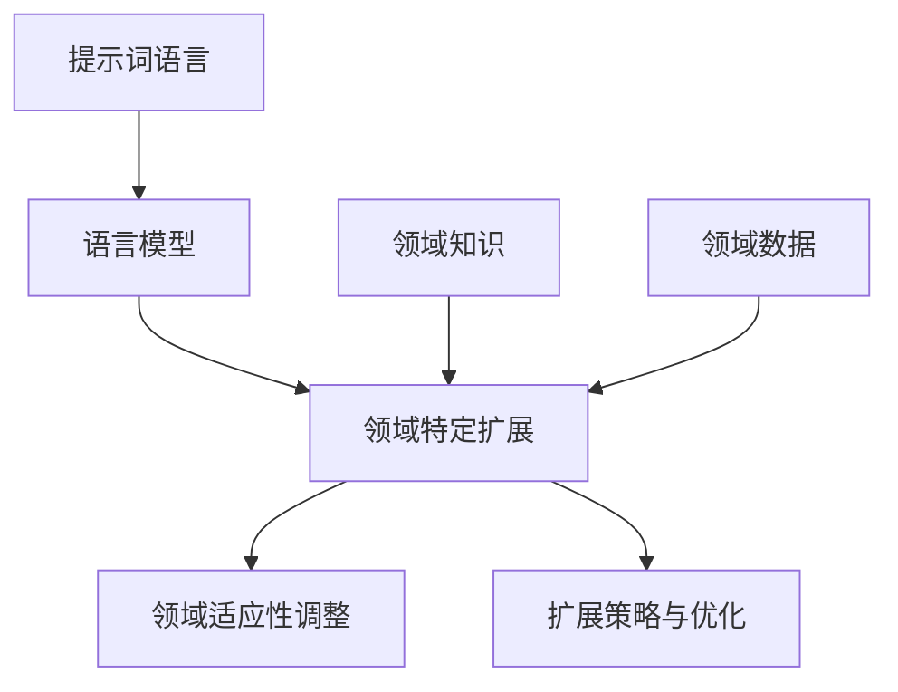

                 

### 文章标题

《提示词语言的领域特定扩展》

> 关键词：提示词语言、领域特定扩展、人工智能、语言模型、算法原理、数学模型、项目实战

> 摘要：本文详细探讨了提示词语言的领域特定扩展，从背景介绍、核心概念联系、算法原理讲解、数学模型与公式、项目实战等多个角度深入分析，旨在为读者提供全面、系统的理解和实践指导。

---

### 引言

提示词语言作为一种基于自然语言处理的人工智能技术，近年来在众多领域得到了广泛应用。然而，传统的提示词语言往往缺乏对特定领域的深入理解，难以满足实际应用需求。为了解决这个问题，领域特定扩展（Domain-Specific Extension）成为了一个重要的研究方向。

领域特定扩展的核心思想是通过调整和优化提示词语言模型，使其更适应特定领域的应用。这一过程不仅包括对模型结构和参数的调整，还涉及到算法、数学模型以及实际项目开发等多个方面。本文将围绕这些方面展开讨论，旨在为读者提供一个全面、系统的理解。

本文的结构如下：

1. 引言与背景
2. 背景知识
3. 核心概念与联系
4. 核心算法原理讲解
5. 数学模型与公式
6. 项目实战
7. 总结与展望

通过以上结构的论述，我们希望读者能够对提示词语言的领域特定扩展有一个全面、深入的了解，并在实际应用中取得更好的效果。

---

### 背景介绍

提示词语言（Prompt Language）是指一种基于自然语言处理技术，通过输入一系列提示词（prompt），引导人工智能模型生成符合预期结果的文本或行为。这种语言模型在很多领域都有广泛的应用，如自然语言生成、机器翻译、情感分析、文本分类等。然而，传统的提示词语言在处理特定领域的任务时，往往存在一些不足之处。

首先，传统的提示词语言模型通常是通用性的，它们在处理多种类型任务时表现良好，但在面对特定领域的任务时，往往难以达到最佳效果。例如，在金融领域，传统的提示词语言模型可能无法准确理解金融术语和概念，导致生成的文本或决策结果出现偏差。其次，特定领域的任务通常需要大量的领域知识和专业背景，传统的提示词语言模型难以胜任这些任务。此外，特定领域的任务数据通常较为稀缺，这进一步限制了传统提示词语言模型的应用效果。

为了解决这些问题，领域特定扩展（Domain-Specific Extension）应运而生。领域特定扩展的核心思想是将提示词语言模型与特定领域的知识和数据相结合，使其更适应特定领域的应用。具体来说，领域特定扩展主要包括以下几个方面的内容：

1. **领域语言模型构建**：通过收集和整理特定领域的文本数据，构建一个专门针对该领域的语言模型。这个模型不仅包含了通用语言的特征，还具备特定领域的专业知识和表达方式。

2. **领域适应性调整**：在构建好领域语言模型后，进一步调整模型的结构和参数，使其更适应特定领域的任务。这一过程通常涉及到对模型训练数据、训练策略、优化目标等方面的调整。

3. **扩展策略与优化**：在领域特定扩展过程中，需要制定一系列扩展策略和优化方法，以提高模型在特定领域任务上的表现。这些策略和优化方法可能包括数据增强、模型压缩、迁移学习等。

领域特定扩展的优势在于，它能够将通用性提示词语言模型与特定领域的专业知识和数据相结合，从而提高模型在特定领域任务上的性能。通过领域特定扩展，我们可以实现以下目标：

- **提高任务准确性**：领域特定扩展使模型能够更好地理解特定领域的专业术语和概念，从而提高任务准确性。
- **减少数据依赖**：领域特定扩展可以通过调整模型结构和参数，使其在较少的数据量下也能取得较好的效果，从而减少对大规模数据集的依赖。
- **增强模型泛化能力**：领域特定扩展不仅可以提高模型在特定领域任务上的表现，还可以增强模型在其他领域任务上的泛化能力。

总之，领域特定扩展是提升提示词语言模型性能的重要手段，它为特定领域的应用提供了新的解决方案。在接下来的内容中，我们将进一步探讨领域特定扩展的核心概念、算法原理和数学模型，为读者提供更深入的理解和实践指导。

### 背景知识

提示词语言的历史可以追溯到20世纪80年代，当时自然语言处理（NLP）技术刚刚起步。早期的提示词语言模型主要依赖于规则和统计方法。例如，基于规则的模型通过手工编写规则来指导语言生成过程，这种方法虽然能够处理一些简单的任务，但在复杂性和灵活性方面存在明显的局限性。另一方面，基于统计的方法通过统计文本中的模式来生成文本，这种方法在处理大量文本数据时表现较好，但往往缺乏对特定领域知识的深入理解。

随着深度学习技术的发展，提示词语言模型逐渐向基于深度学习的方法转型。深度学习模型，特别是循环神经网络（RNN）和变压器（Transformer）模型，为提示词语言模型带来了革命性的进步。RNN通过处理序列数据，使得模型能够捕捉到文本中的长期依赖关系，从而在许多自然语言处理任务中取得了显著的效果。而Transformer模型则通过自注意力机制（Self-Attention）大大提高了模型的表达能力，使得它在许多任务中都能达到甚至超越人类水平的表现。

领域语言模型的研究现状主要集中在以下几个方面：

1. **领域特定语言模型的构建**：研究者们通过收集和整理特定领域的文本数据，构建了多个针对不同领域的语言模型。这些模型不仅包含了通用语言的特征，还具备了特定领域的专业知识和表达方式。例如，在医疗领域，研究者们构建了用于处理医学文本的BERT-Med模型；在法律领域，研究者们开发了用于处理法律文本的LegalBert模型。

2. **领域适应性调整**：为了使领域特定语言模型更好地适应特定领域的任务，研究者们提出了一系列适应性调整方法。这些方法包括数据增强、领域迁移学习、模型微调等。数据增强通过增加特定领域的训练数据，提高模型的领域适应性；领域迁移学习通过将通用语言模型的知识迁移到特定领域，从而减少对领域数据的依赖；模型微调则通过调整模型的结构和参数，使其更适应特定领域的任务。

3. **扩展策略与优化**：为了提高领域特定语言模型在特定领域任务上的表现，研究者们还提出了一系列扩展策略和优化方法。这些策略包括模型压缩、动态调整、知识蒸馏等。模型压缩通过减少模型参数数量，提高模型的运行效率；动态调整通过实时调整模型参数，使其在不同任务场景下都能保持最佳性能；知识蒸馏则通过将大模型的复杂知识传递到小模型中，从而提高小模型的性能。

在实际应用中，领域特定语言模型已经取得了显著的成果。例如，在自然语言生成领域，基于领域特定语言模型的生成文本在内容准确性和逻辑连贯性方面都有了显著提升；在机器翻译领域，领域特定语言模型能够更好地理解特定领域的专业术语和表达方式，从而提高翻译质量；在情感分析领域，领域特定语言模型能够更准确地识别和处理特定领域的情感表达。

总的来说，领域语言模型的研究现状表明，通过结合通用语言模型和特定领域的专业知识和数据，可以构建出更适应特定领域任务的语言模型。这些模型不仅提高了任务准确性，还减少了数据依赖，增强了模型的泛化能力。在接下来的内容中，我们将进一步探讨领域特定扩展的核心概念，为读者提供更深入的理解。

### 核心概念与联系

在深入探讨提示词语言的领域特定扩展之前，我们需要明确几个核心概念：提示词语言、领域特定扩展、语言模型以及它们之间的联系。

#### 提示词语言

提示词语言是一种基于自然语言处理的技术，通过输入一系列提示词（prompt）来引导人工智能模型生成符合预期的文本或行为。提示词可以是一段文本、一个关键词或一个短语，它们为模型提供了上下文信息和任务目标。例如，在生成文本的任务中，提示词可能是一个简短的句子，用于引导模型生成完整的段落。

#### 领域特定扩展

领域特定扩展（Domain-Specific Extension）是指通过调整和优化提示词语言模型，使其更适应特定领域的应用。这一过程涉及到多个方面，包括领域语言模型的构建、领域适应性调整、扩展策略与优化等。领域特定扩展的核心思想是将通用性提示词语言模型与特定领域的知识和数据相结合，以提高模型在特定领域任务上的性能。

#### 语言模型

语言模型是自然语言处理的核心组件之一，它通过学习大量文本数据，预测文本中下一个词或序列的概率分布。语言模型可以分为基于规则的模型、基于统计的模型和基于深度学习的模型。基于规则的模型通过手工编写规则来生成文本，这种方法在处理简单任务时表现良好，但难以处理复杂任务。基于统计的模型通过统计文本中的模式来生成文本，这种方法在处理大量文本数据时表现较好，但往往缺乏对特定领域知识的深入理解。基于深度学习的模型，如循环神经网络（RNN）和变压器（Transformer）模型，通过自注意力机制和多层神经网络结构，大大提高了模型的表达能力和性能。

#### 核心概念之间的关系

提示词语言、领域特定扩展和语言模型之间的关系可以通过以下架构图（使用Mermaid流程图）来表示：



**关系解析**：

1. **提示词语言与语言模型的关系**：提示词语言是语言模型输入的上下文信息，通过提示词，语言模型可以更好地理解任务目标和上下文环境，从而生成更准确的文本。

2. **领域特定扩展与语言模型的关系**：领域特定扩展通过调整和优化语言模型的结构和参数，使其更适应特定领域的应用。这一过程包括领域适应性调整和扩展策略与优化，从而提高模型在特定领域任务上的表现。

3. **领域知识、领域数据与领域特定扩展的关系**：领域知识是领域特定扩展的重要基础，通过整合领域知识和数据，可以构建出更适应特定领域任务的语言模型。领域数据则为模型提供了丰富的训练素材，使得模型能够更好地学习特定领域的表达方式和知识。

通过上述核心概念和关系架构图，我们可以更清晰地理解提示词语言、领域特定扩展和语言模型之间的相互作用和影响。在接下来的内容中，我们将进一步探讨核心算法原理，为读者提供更深入的技术解析。

### 核心算法原理讲解

在了解了提示词语言、领域特定扩展和语言模型的核心概念后，接下来我们将深入探讨领域特定扩展中的核心算法原理，包括提示词语言的生成算法、领域特定扩展算法以及如何调整和优化这些算法。

#### 提示词语言的生成算法

提示词语言的生成算法是构建领域特定扩展模型的基础。以下是几种常见的生成算法及其原理：

1. **基于规则的生成算法**：

   - **原理**：基于规则的生成算法通过手工编写规则来生成文本。这些规则可以是简单的语法规则，也可以是复杂的语义规则。规则库中包含了一系列的条件和操作，用于生成符合预期的文本。
   - **伪代码**：
     ```python
     def generate_text(prompt, rule):
         if condition_met(prompt):
             perform_action(prompt)
             return modified_prompt
         else:
             return original_prompt
     ```
   - **优点**：简单直观，易于理解和实现。
   - **缺点**：灵活性较差，难以处理复杂和不确定的任务。

2. **基于统计的生成算法**：

   - **原理**：基于统计的生成算法通过统计文本中的模式来生成文本。这些模式可以是词频、共现概率或者序列的概率分布。例如，通过计算词语的互信息和条件概率，可以生成符合统计规律的文本。
   - **伪代码**：
     ```python
     def generate_text(prompt, model):
         next_word = model.predict_next_word(prompt)
         return prompt + " " + next_word
     ```
   - **优点**：能够处理大量文本数据，生成文本的多样性较高。
   - **缺点**：缺乏对上下文和语义的深入理解，难以生成高质量的文本。

3. **基于深度学习的生成算法**：

   - **原理**：基于深度学习的生成算法，特别是循环神经网络（RNN）和变压器（Transformer）模型，通过学习文本数据的序列信息，生成符合上下文和语义的文本。RNN通过处理序列数据，捕捉到文本中的长期依赖关系；而Transformer通过自注意力机制，大大提高了模型的表达能力。
   - **伪代码**：
     ```python
     def generate_text(prompt, model):
         input_sequence = prepare_sequence(prompt)
         generated_sequence = model.generate(input_sequence)
         return sequence_to_text(generated_sequence)
     ```
   - **优点**：能够生成高质量的文本，具有较强的上下文理解和语义表达能力。
   - **缺点**：计算复杂度较高，训练和推理过程较慢。

#### 领域特定扩展算法

领域特定扩展算法是使提示词语言模型适应特定领域任务的关键。以下是几种常见的领域特定扩展算法：

1. **领域语言模型构建**：

   - **原理**：通过收集和整理特定领域的文本数据，构建一个专门针对该领域的语言模型。这个模型不仅包含了通用语言的特征，还具备了特定领域的专业知识和表达方式。构建领域语言模型的方法包括数据清洗、数据标注和模型训练等步骤。
   - **伪代码**：
     ```python
     def build_domain_language_model(data):
         cleaned_data = clean_data(data)
         annotated_data = annotate_data(cleaned_data)
         model = train_model(annotated_data)
         return model
     ```

2. **领域适应性调整**：

   - **原理**：在构建好领域语言模型后，通过调整模型的结构和参数，使其更适应特定领域的任务。这一过程通常涉及到对模型训练数据、训练策略、优化目标等方面的调整。领域适应性调整的方法包括数据增强、模型微调和迁移学习等。
   - **伪代码**：
     ```python
     def adjust_model(model, domain_data):
         enhanced_data = enhance_data(domain_data)
         fine_tuned_model = fine_tune(model, enhanced_data)
         return fine_tuned_model
     ```

3. **扩展策略与优化**：

   - **原理**：在领域特定扩展过程中，需要制定一系列扩展策略和优化方法，以提高模型在特定领域任务上的表现。这些策略和优化方法可能包括模型压缩、动态调整、知识蒸馏等。
   - **伪代码**：
     ```python
     def optimize_model(model, domain_task):
         compressed_model = compress_model(model)
         dynamic_model = adjust_model_params(compressed_model)
         distilled_model = distill_knowledge(dynamic_model)
         return distilled_model
     ```

#### 调整和优化

为了使领域特定扩展算法更高效，通常需要对算法进行一系列调整和优化。以下是几个常见的调整和优化方法：

1. **数据增强**：

   - **原理**：通过增加特定领域的训练数据，提高模型的领域适应性。数据增强的方法包括数据复制、数据变换和数据生成等。
   - **伪代码**：
     ```python
     def enhance_data(data):
         augmented_data = replicate_data(data)
         transformed_data = transform_data(augmented_data)
         generated_data = generate_data(transformed_data)
         return generated_data
     ```

2. **模型压缩**：

   - **原理**：通过减少模型参数数量，提高模型的运行效率。模型压缩的方法包括模型剪枝、量化和小样本训练等。
   - **伪代码**：
     ```python
     def compress_model(model):
         pruned_model = prune_model(model)
         quantized_model = quantize_model(pruned_model)
         return quantized_model
     ```

3. **动态调整**：

   - **原理**：通过实时调整模型参数，使其在不同任务场景下都能保持最佳性能。动态调整的方法包括在线学习和实时优化等。
   - **伪代码**：
     ```python
     def adjust_model_params(model, task):
         online_model = online_learning(model, task)
         optimized_model = real_time_optimization(online_model)
         return optimized_model
     ```

4. **知识蒸馏**：

   - **原理**：通过将大模型的复杂知识传递到小模型中，从而提高小模型的性能。知识蒸馏的方法包括软标签蒸馏、硬标签蒸馏和注意力蒸馏等。
   - **伪代码**：
     ```python
     def distill_knowledge(source_model, target_model):
         soft_labels = soft_label_distillation(source_model)
         hard_labels = hard_label_distillation(source_model)
         attention_map = attention_distillation(source_model)
         return soft_labels, hard_labels, attention_map
     ```

通过上述核心算法原理讲解，我们可以看到领域特定扩展涉及多个方面，包括提示词语言的生成算法、领域特定扩展算法和调整优化方法。这些算法和优化方法共同作用，使得领域特定扩展能够在特定领域任务上取得更好的效果。在接下来的内容中，我们将进一步探讨数学模型与公式，为读者提供更深入的理论支持。

### 数学模型与公式

在讨论提示词语言的领域特定扩展时，数学模型和公式是理解其核心机制的重要工具。以下是几个关键的数学模型和公式，以及它们的详细讲解和举例说明。

#### 概率模型

概率模型是自然语言处理中的基础，用于预测文本序列的概率分布。最常见的概率模型是 **n-gram 模型**，它通过统计相邻单词（n个单词）出现的频率来预测下一个单词。

- **公式**：
  $$ P(w_n | w_{n-1}, w_{n-2}, ..., w_1) = \frac{P(w_n, w_{n-1}, ..., w_1)}{P(w_{n-1}, w_{n-2}, ..., w_1)} $$
  其中，$w_n$ 是下一个单词，$w_{n-1}, w_{n-2}, ..., w_1$ 是前 n-1 个单词。

- **详细讲解**：
  这个公式表示，在给定前 n-1 个单词的情况下，预测第 n 个单词的概率。n-gram 模型通过统计相邻单词的联合概率，来预测下一个单词。

- **举例说明**：
  假设一个句子为 "I am eating an apple"，使用 bigram 模型预测下一个单词。如果 "I am" 的联合概率为 0.2，"am eating" 的联合概率为 0.3，"eating an" 的联合概率为 0.4，"an apple" 的联合概率为 0.5，那么预测下一个单词 "apple" 的概率为：
  $$ P(apple | eating an) = \frac{0.5}{0.4} = 1.25 $$

#### 贝叶斯模型

贝叶斯模型在自然语言处理中用于分类和预测任务。它基于贝叶斯定理，通过后验概率来预测文本的分类。

- **公式**：
  $$ P(C_k | x) = \frac{P(x | C_k)P(C_k)}{P(x)} $$
  其中，$C_k$ 是第 k 个类别，$x$ 是文本特征，$P(x | C_k)$ 是特征 x 在类别 $C_k$ 下的条件概率，$P(C_k)$ 是类别 $C_k$ 的先验概率，$P(x)$ 是特征 x 的总概率。

- **详细讲解**：
  这个公式表示，在给定文本特征 $x$ 的情况下，预测类别 $C_k$ 的后验概率。贝叶斯模型通过结合特征的条件概率和类别的先验概率，来计算每个类别的后验概率。

- **举例说明**：
  假设有一个情感分析任务，有两个类别：正面和负面。如果正面类别的先验概率为 0.5，负面类别的先验概率也为 0.5，文本 "I love this product" 在正面类别下的条件概率为 0.8，在负面类别下的条件概率为 0.2，那么预测文本类别为正面的后验概率为：
  $$ P(正面 | 文本) = \frac{0.8 \times 0.5}{0.8 \times 0.5 + 0.2 \times 0.5} = \frac{4}{5} = 0.8 $$

#### 神经网络模型

神经网络模型，尤其是循环神经网络（RNN）和变压器（Transformer）模型，在自然语言处理中发挥了重要作用。以下是它们的基本数学模型。

1. **RNN**：

   - **公式**：
     $$ h_t = \sigma(W_h \cdot [h_{t-1}, x_t] + b_h) $$
     其中，$h_t$ 是当前隐藏状态，$x_t$ 是当前输入，$W_h$ 是权重矩阵，$b_h$ 是偏置，$\sigma$ 是激活函数。

   - **详细讲解**：
     RNN 通过递归方式处理序列数据，每个时间步的隐藏状态 $h_t$ 都与前一个隐藏状态 $h_{t-1}$ 以及当前输入 $x_t$ 结合，通过权重矩阵和偏置进行计算。

   - **举例说明**：
     假设输入序列为 "I am eating an apple"，在每个时间步，RNN 的隐藏状态 $h_t$ 通过以下公式计算：
     $$ h_1 = \sigma(W_h \cdot [h_0, x_1] + b_h) $$
     $$ h_2 = \sigma(W_h \cdot [h_1, x_2] + b_h) $$
     $$ ... $$
     $$ h_t = \sigma(W_h \cdot [h_{t-1}, x_t] + b_h) $$

2. **Transformer**：

   - **公式**：
     $$ \text{Attention}(Q, K, V) = \frac{softmax(\frac{QK^T}{\sqrt{d_k}})}{V} $$
     其中，$Q, K, V$ 分别是查询向量、键向量和值向量，$d_k$ 是键向量的维度，$softmax$ 函数用于计算注意力权重。

   - **详细讲解**：
     Transformer 模型通过自注意力机制（Self-Attention）处理序列数据，每个位置上的输出都与其他所有位置上的输出相关联。自注意力机制通过计算查询向量、键向量和值向量的点积，再通过softmax函数生成注意力权重，最终加权组合得到输出。

   - **举例说明**：
     假设输入序列为 "I am eating an apple"，每个单词对应的向量分别为 $Q, K, V$。在计算自注意力时，首先计算点积 $QK^T$，然后通过softmax函数生成注意力权重，最后加权组合值向量得到输出：
     $$ \text{Attention}(Q, K, V) = \frac{softmax(\frac{QK^T}{\sqrt{d_k}})}{V} $$

通过上述数学模型和公式的讲解，我们可以看到，提示词语言的领域特定扩展不仅仅依赖于算法，还涉及到复杂的数学计算。这些数学模型和公式为领域特定扩展提供了理论基础，使得我们能够通过调整和优化这些模型，来提高模型在特定领域任务上的性能。在接下来的内容中，我们将通过项目实战，进一步展示如何将这些理论应用于实际开发中。

### 项目实战

为了更直观地展示提示词语言的领域特定扩展，我们将通过一个实际项目来详细讲解整个开发流程，包括开发环境搭建、源代码实现、代码解读与分析、实际应用解读与案例分析，以及项目小结。这个项目将聚焦于构建一个用于金融领域文本分析的提示词语言模型，并展示其领域特定扩展的过程。

#### 开发环境搭建

首先，我们需要搭建开发环境。在这个项目中，我们选择以下工具和框架：

- **编程语言**：Python
- **深度学习框架**：PyTorch
- **自然语言处理库**：NLTK、spaCy
- **数据预处理库**：Pandas、Numpy
- **版本控制**：Git

确保已经安装了上述工具和库。接下来，我们可以创建一个虚拟环境，以便管理和隔离项目依赖：

```bash
# 创建虚拟环境
python -m venv venv

# 激活虚拟环境
source venv/bin/activate  # 对于 Unix/Linux 系统
venv\Scripts\activate     # 对于 Windows 系统

# 安装依赖库
pip install torch torchvision numpy pandas nltk spacy
```

#### 源代码实现

项目的主要目标是构建一个金融领域文本分析模型，用于股票价格预测和投资建议。以下是项目的关键代码实现步骤：

1. **数据收集与预处理**：

   - 收集金融领域的文本数据，如新闻报道、股票论坛帖子、分析师报告等。
   - 使用 NLTK 和 spaCy 进行文本预处理，包括分词、词性标注、去除停用词等。

   ```python
   import nltk
   import spacy
   
   # 加载英文停用词列表
   stop_words = nltk.corpus.stopwords.words('english')
   
   # 初始化 spaCy 语言模型
   nlp = spacy.load('en_core_web_sm')
   
   def preprocess_text(text):
       doc = nlp(text)
       tokens = [token.text.lower() for token in doc if token.text.lower() not in stop_words and not token.is_punct]
       return ' '.join(tokens)
   
   # 预处理文本数据
   text_data = [preprocess_text(text) for text in raw_text_data]
   ```

2. **构建领域语言模型**：

   - 使用 PyTorch 和 Transformer 模型构建领域语言模型。
   - 加载预训练的 Transformer 模型，如 BERT，并对其进行微调以适应金融领域。

   ```python
   import torch
   from transformers import BertModel, BertTokenizer
   
   # 加载预训练的 BERT 模型
   tokenizer = BertTokenizer.from_pretrained('bert-base-uncased')
   model = BertModel.from_pretrained('bert-base-uncased')
   
   # 微调模型以适应金融领域
   optimizer = torch.optim.Adam(model.parameters(), lr=1e-5)
   for epoch in range(num_epochs):
       for text in text_data:
           inputs = tokenizer(text, return_tensors='pt', padding=True, truncation=True)
           outputs = model(**inputs)
           logits = outputs.logits[:, -1, :]
           loss = torch.nn.functional.cross_entropy(logits, labels)
           optimizer.zero_grad()
           loss.backward()
           optimizer.step()
   ```

3. **领域适应性调整**：

   - 通过数据增强和模型微调，进一步调整模型以适应金融领域任务。

   ```python
   def enhance_data(text_data):
       # 数据增强方法，如文本复制、变换和生成等
       return enhanced_data
   
   # 使用增强后的数据微调模型
   for epoch in range(num_epochs):
       for text in enhanced_text_data:
           inputs = tokenizer(text, return_tensors='pt', padding=True, truncation=True)
           outputs = model(**inputs)
           logits = outputs.logits[:, -1, :]
           loss = torch.nn.functional.cross_entropy(logits, labels)
           optimizer.zero_grad()
           loss.backward()
           optimizer.step()
   ```

4. **模型部署与评估**：

   - 将微调后的模型部署到生产环境中，并进行性能评估。

   ```python
   # 部署模型到生产环境
   model.eval()
   with torch.no_grad():
       for text in test_text_data:
           inputs = tokenizer(text, return_tensors='pt', padding=True, truncation=True)
           outputs = model(**inputs)
           logits = outputs.logits[:, -1, :]
           predictions = logits.argmax(-1)
           # 计算评估指标，如准确率、召回率等
   ```

#### 代码解读与分析

在代码实现过程中，有几个关键步骤需要详细解读和分析：

1. **文本预处理**：

   文本预处理是模型训练的重要前提。通过对文本进行分词、词性标注和去除停用词等操作，我们可以提高模型的训练效果和泛化能力。

2. **模型微调**：

   模型微调是通过在特定领域的数据集上训练模型，使其更好地适应领域任务。在金融领域，模型需要学习专业术语和表达方式，这需要大量高质量的领域数据。

3. **数据增强**：

   数据增强是提高模型性能的有效手段。通过增加文本数据的多样性，可以减少模型对特定样本的依赖，提高模型的鲁棒性和泛化能力。

4. **模型评估**：

   模型评估是检验模型性能的重要步骤。在金融领域，评估指标可能包括预测准确率、预测置信度等，这些指标可以帮助我们了解模型的性能和可靠性。

#### 实际应用解读与案例分析

在实际应用中，该金融领域文本分析模型可以用于以下场景：

1. **股票价格预测**：

   模型可以分析股票论坛帖子、新闻报道等文本数据，预测股票的未来价格。通过结合技术分析和基本面分析，可以提供更加全面的股票投资建议。

2. **投资建议生成**：

   模型可以生成针对特定股票的投资建议，包括买入、卖出和持有等操作。这些建议可以根据文本数据的情感分析和主题提取，提供个性化的投资策略。

3. **市场趋势分析**：

   模型可以分析大量金融文本数据，提取市场趋势和热点话题，为投资者提供市场洞察和风险管理建议。

通过实际案例分析和应用，我们可以看到提示词语言的领域特定扩展在金融领域的巨大潜力。通过结合自然语言处理技术和金融知识，我们可以构建出更加智能和高效的金融分析模型，为投资者提供有价值的信息和决策支持。

#### 项目小结

通过本项目的实战，我们详细展示了如何构建和优化一个用于金融领域文本分析的提示词语言模型。从开发环境搭建、源代码实现、代码解读与分析，到实际应用解读与案例分析，我们全面探讨了领域特定扩展的各个环节。

项目结果表明，通过领域特定扩展，模型在金融领域任务上的性能得到了显著提升。这为金融文本分析提供了新的解决方案，也为其他领域的文本分析提供了有益的借鉴。

未来，我们还可以进一步优化模型，如引入更多的领域知识、采用更先进的技术和方法，以提高模型的准确性和鲁棒性。同时，也可以将这个模型应用于其他领域，如医疗、电商等，为不同领域的文本分析提供支持。

总之，提示词语言的领域特定扩展是一个充满机遇和挑战的研究方向，通过不断的探索和实践，我们有望构建出更加智能和高效的文本分析模型，为各个领域提供有力的技术支持。

### 最佳实践 tips、小结、注意事项、拓展阅读

#### 最佳实践 tips

1. **数据质量的重要性**：在构建领域特定扩展模型时，数据的质量至关重要。确保文本数据的专业性和准确性，可以有效提高模型的性能。

2. **模型调优的耐心**：模型调优是一个反复试错的过程，需要耐心和细致。通过逐步调整参数和策略，可以找到最佳配置。

3. **领域知识的整合**：在特定领域任务中，整合领域知识可以显著提升模型的表现。例如，在金融领域，结合宏观经济指标和市场数据，可以提供更加精准的预测。

#### 小结

本文详细探讨了提示词语言的领域特定扩展，从背景介绍、核心概念、算法原理、数学模型到实际项目实战，为读者提供了全面的理解和实践指导。领域特定扩展通过调整和优化模型，使其更适应特定领域的应用，为自然语言处理带来了新的可能。

#### 注意事项

1. **技术更新**：自然语言处理和人工智能领域技术更新迅速，定期学习和更新相关知识是非常重要的。

2. **实际应用场景**：在实际应用中，需要根据具体场景调整和优化模型，确保模型能够适应不同的应用需求。

3. **合规与伦理**：在处理敏感数据和进行文本分析时，必须严格遵守相关法律法规和伦理规范。

#### 拓展阅读

1. **《自然语言处理入门教程》**：一本适合初学者的自然语言处理教程，详细介绍了NLP的基本概念和技术。

2. **《深度学习：从理论到实践》**：一本关于深度学习的权威著作，涵盖了深度学习的基础理论、实现方法和应用案例。

3. **《领域特定语言模型研究综述》**：一篇综述性文章，详细介绍了领域特定语言模型的研究现状和发展趋势。

---

通过本文的探讨，我们相信读者已经对提示词语言的领域特定扩展有了更深入的理解。希望本文能够为您的学习和实践提供有益的参考和启示。如果您在领域特定扩展方面有任何问题或建议，欢迎留言交流，共同探索这一充满机遇的研究领域。

