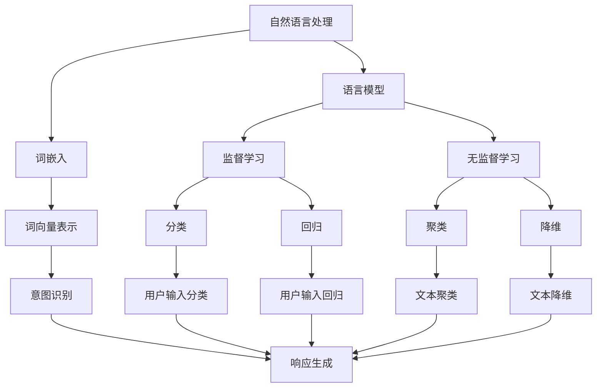

                 

# 提示词语言设计原则与最佳实践

> 关键词：提示词语言设计，自然语言处理，机器学习，设计原则，最佳实践

> 摘要：本文将深入探讨提示词语言设计的基本原则和最佳实践。通过对提示词语言概念、设计原则、最佳实践以及数学模型的详细分析，本文旨在为从事人工智能和自然语言处理的技术人员提供一套全面的设计指南，帮助他们在实际项目中更好地设计和实现提示词语言。

## 引言与背景

提示词语言是一种用于与计算机系统交互的特殊语言，其目的是简化用户与复杂系统之间的沟通。在人工智能和自然语言处理（NLP）领域，提示词语言设计的重要性日益凸显。它们被广泛应用于智能助手、聊天机器人、信息检索系统等多个领域。有效的设计不仅能提高用户体验，还能提高系统的效率和性能。

### 提示词语言的概念

提示词语言是一种半结构化或完全结构化的语言，用于将自然语言转换为机器可理解的指令或数据。它的核心思想是将自然语言的自由性和机器语言的确定性结合起来，使得用户可以更自然地与系统进行交互。

### 提示词语言的发展历程

提示词语言的发展经历了多个阶段：

1. **早期文本交互**：在早期计算机系统中，用户通过文本命令与计算机进行交互。这种方式虽然简单，但缺乏灵活性，且用户界面（UI）不够友好。
2. **图形用户界面（GUI）**：随着GUI的发展，用户可以通过鼠标和键盘与计算机进行交互。这种方式显著改善了用户体验，但仍然需要用户学习特定的操作方式。
3. **自然语言处理**：随着NLP技术的发展，计算机开始能够理解并处理自然语言。这为提示词语言的现代设计奠定了基础。
4. **智能助手和聊天机器人**：近年来，智能助手和聊天机器人的兴起进一步推动了提示词语言的发展。它们利用先进的NLP和机器学习技术，使得用户与计算机的交互更加自然和高效。

### 本书的目的与结构

本书旨在为从事人工智能和自然语言处理的技术人员提供一套完整的设计指南，帮助他们在实际项目中更好地设计和实现提示词语言。本书的结构如下：

1. **介绍与背景**：介绍提示词语言的概念、发展历程和本书的目的。
2. **核心概念与联系**：详细讲解自然语言处理和机器学习等核心概念，并使用Mermaid流程图展示它们之间的联系。
3. **设计原则**：阐述设计提示词语言时应遵循的核心原则，如简洁性、可扩展性和易用性。
4. **最佳实践**：分享设计提示词语言的最佳实践，包括实际案例、数据分析和经验总结。
5. **数学模型**：介绍设计提示词语言所涉及到的数学模型，如统计模型和深度学习模型。
6. **开发工具与资源**：介绍设计提示词语言时使用的开发工具和资源。
7. **项目实战**：通过实际案例来展示如何设计和实现提示词语言。
8. **评估与优化**：讨论如何评估和优化提示词语言的设计。
9. **未来趋势与展望**：探讨提示词语言设计的未来趋势和发展方向。

## 核心概念与联系

在设计提示词语言时，了解核心概念及其之间的联系至关重要。以下是自然语言处理（NLP）和机器学习（ML）这两个核心概念的基本原理及其在提示词语言设计中的应用。

### 自然语言处理（NLP）

自然语言处理是人工智能的一个分支，旨在使计算机能够理解、解释和生成自然语言。以下是NLP中的几个关键概念：

#### 语言模型

语言模型是一种用于预测单词或短语的统计模型。在提示词语言设计中，语言模型用于理解用户的输入并生成合适的响应。常见的语言模型包括：

- **n-gram模型**：基于前n个单词的概率分布来预测下一个单词。
- **循环神经网络（RNN）**：用于处理序列数据，如文本。

#### 词嵌入

词嵌入是将单词映射到低维向量空间的过程，使得相似的单词在向量空间中更接近。词嵌入有助于提高语言模型的效果。常见的词嵌入方法包括：

- **Word2Vec**：基于分布式表示学习单词的向量。
- **GloVe**：基于全局向量空间模型来学习单词的向量。

### 机器学习（ML）

机器学习是一种通过数据来训练模型的方法，使其能够从数据中学习并做出预测或决策。以下是ML中的几个关键概念：

#### 监督学习

监督学习是一种机器学习方法，其中模型根据输入数据和相应的输出（标签）来学习。在提示词语言设计中，监督学习可用于训练语言模型和意图识别模型。

- **分类**：将输入数据分配到预定义的类别中。
- **回归**：预测连续的输出值。

#### 无监督学习

无监督学习是一种机器学习方法，其中模型从未标记的数据中学习。在提示词语言设计中，无监督学习可用于词嵌入和聚类分析。

- **聚类**：将相似的数据点分组。
- **降维**：将高维数据映射到低维空间。

### Mermaid流程图

以下是一个使用Mermaid绘制的流程图，展示了NLP和ML在提示词语言设计中的关键概念及其之间的联系：



### 关键概念之间的联系

- **语言模型**和**词嵌入**是NLP的基础，用于理解用户的输入。
- **监督学习**和**无监督学习**是ML的基础，用于训练和优化模型。
- **意图识别**、**分类**和**回归**是ML在提示词语言设计中的应用，用于生成合适的响应。
- **聚类**和**降维**是无监督学习在提示词语言设计中的应用，用于分析用户行为和文本数据。

通过理解这些核心概念及其之间的联系，我们可以更好地设计出高效、易用的提示词语言。

### 核心算法原理讲解与伪代码

在提示词语言设计过程中，核心算法原理的掌握至关重要。以下将详细介绍两种常用算法：循环神经网络（RNN）和长短期记忆网络（LSTM），并使用伪代码进行讲解。

#### 循环神经网络（RNN）

RNN是一种能够处理序列数据的神经网络，其基本思想是将当前输入与前一时刻的输出和隐藏状态进行结合。以下是RNN的基本原理和伪代码：

```pseudo
initialize parameters
h_t = 0
for each time step t:
    input_x_t = get_input(t)
    h_t = tanh(W_h * [h_{t-1}, x_t])
    y_t = W_o * h_t
    output y_t
```

#### 长短期记忆网络（LSTM）

LSTM是RNN的一种变体，能够有效地解决长期依赖问题。LSTM通过引入记忆单元和控制门来学习长期依赖。以下是LSTM的基本原理和伪代码：

```pseudo
initialize parameters
c_t = 0
h_t = 0
for each time step t:
    input_x_t = get_input(t)
    gate_inputs:
        forget_gate = sigmoid(W_f * [h_{t-1}, x_t])
        input_gate = sigmoid(W_i * [h_{t-1}, x_t])
        output_gate = sigmoid(W_o * [h_{t-1}, x_t])
    cell_input = tanh(W_c * [h_{t-1}, x_t])
    forget_output = forget_gate * c_{t-1}
    input_output = input_gate * cell_input
    c_t = forget_output + input_output
    h_t = output_gate * tanh(c_t)
    y_t = W_o * h_t
    output y_t
```

通过以上算法的讲解，我们可以看到RNN和LSTM在处理序列数据方面的优势，以及如何通过伪代码来模拟其工作流程。

### 数学模型与公式

在提示词语言设计中，数学模型扮演着至关重要的角色。以下将介绍几种常见的数学模型，并使用LaTeX格式展示相关公式。

#### 概率论基础

概率论是自然语言处理和机器学习的基础。以下是一些基本概率公式：

$$ P(A \cap B) = P(A)P(B|A) $$

$$ P(A \cup B) = P(A) + P(B) - P(A \cap B) $$

#### 机器学习算法

机器学习算法通常涉及概率分布和最大似然估计。以下是一个简单的最大似然估计公式：

$$ \hat{P}(x) = \frac{P(x|\theta)}{\sum_{x'} P(x'|\theta)} $$

#### 语言模型

在自然语言处理中，语言模型用于预测单词序列的概率。以下是一个基于n-gram的语言模型公式：

$$ P(w_1 w_2 w_3 \ldots w_n) = \frac{C(w_1 w_2 w_3 \ldots w_n)}{C(w_1 w_2 \ldots w_n)} $$

其中，\(C(w_1 w_2 w_3 \ldots w_n)\)表示单词序列的计数，\(C(w_1 w_2 \ldots w_n)\)表示单词序列的总计数。

#### 词嵌入

词嵌入是将单词映射到低维向量空间的过程。以下是一个基于Word2Vec的词嵌入公式：

$$ \vec{w}_i = \sum_{j=1}^{V} f_j \cdot \vec{e}_j $$

其中，\(\vec{w}_i\)是单词\(i\)的向量表示，\(f_j\)是单词\(j\)的频率，\(\vec{e}_j\)是单词\(j\)的嵌入向量。

通过以上数学模型和公式的讲解，我们可以更好地理解提示词语言设计中的核心概念和理论基础。

### 开发工具与资源

在提示词语言设计中，选择合适的开发工具和资源能够极大地提高开发效率。以下介绍几种常用的开发工具和资源：

#### 编程语言

Python、Java和C++是设计提示词语言时常用的编程语言。每种语言都有其独特的优势：

- **Python**：由于其丰富的库和框架，Python非常适合快速原型开发和实验。常见的库有TensorFlow、PyTorch和spaCy。
- **Java**：Java以其稳定性和跨平台特性而闻名，适合大规模项目的开发和部署。常见的库有OpenNLP和Stanford NLP。
- **C++**：C++具有较高的性能和灵活性，适合对性能有较高要求的项目。常见的库有Dlib和Shark。

#### 框架和库

- **TensorFlow**：一个开源的机器学习框架，适用于构建和训练各种机器学习模型。
- **PyTorch**：一个流行的深度学习框架，以其灵活性和易用性而著称。
- **spaCy**：一个强大的自然语言处理库，适用于快速构建高质量的NLP模型。
- **NLTK**：一个开源的Python库，提供了丰富的自然语言处理工具和资源。
- **OpenNLP**：一个开源的NLP工具包，提供了文本处理、分词、词性标注等功能。
- **Stanford NLP**：一个基于Java的NLP工具包，提供了词性标注、命名实体识别等功能。

#### 数据集

提示词语言设计需要大量的数据来训练模型。以下是一些常用的公开数据集：

- **Wikipedia**：一个包含大量文本数据的数据集，适合用于训练语言模型。
- **Common Crawl**：一个包含Web上大量文本数据的数据集，适合用于训练大规模语言模型。
- **Twitter**：一个包含大量社交媒体文本的数据集，适合用于情感分析和话题模型。
- **AG News**：一个包含新闻文章的数据集，适合用于文本分类和主题建模。

#### 开发环境

为了提高开发效率，可以使用以下开发环境：

- **Jupyter Notebook**：一个交互式的开发环境，适合快速原型开发和演示。
- **Visual Studio Code**：一个功能强大的代码编辑器，适合编写和调试代码。
- **Anaconda**：一个Python数据科学平台，提供了丰富的库和工具。

通过选择合适的编程语言、框架和库，以及利用丰富的数据集和开发环境，我们可以有效地设计和实现提示词语言。

### 项目实战

在本节中，我们将通过一个实际项目来展示如何设计和实现提示词语言。这个项目是一个简单的聊天机器人，用于回答用户的问题。

#### 环境搭建

首先，我们需要搭建开发环境。以下是所需的工具和步骤：

1. **安装Python**：下载并安装Python，版本建议为3.8或更高。
2. **安装Anaconda**：下载并安装Anaconda，这将为我们提供Python和所需的库。
3. **安装TensorFlow**：在Anaconda环境中，使用以下命令安装TensorFlow：

   ```shell
   conda install tensorflow
   ```

4. **安装spaCy**：spaCy是一个强大的NLP库，用于文本处理和实体识别。使用以下命令安装spaCy：

   ```shell
   pip install spacy
   python -m spacy download en_core_web_sm
   ```

5. **安装Jupyter Notebook**：Jupyter Notebook是一个交互式开发环境，适合快速原型开发和演示。使用以下命令安装Jupyter Notebook：

   ```shell
   conda install notebook
   ```

#### 源代码实现

以下是实现聊天机器人的主要代码：

```python
import tensorflow as tf
import spacy
from tensorflow.keras.models import Sequential
from tensorflow.keras.layers import Embedding, LSTM, Dense

# 加载spaCy模型
nlp = spacy.load("en_core_web_sm")

# 准备数据
# 在这里，我们将使用一个预定义的对话数据集
# 数据集应包含问题和答案的对应关系
data = ...

# 处理文本
def preprocess_text(text):
    doc = nlp(text)
    tokens = [token.text for token in doc]
    return tokens

# 构建词汇表
vocab = set()
for sentence in data:
    for word in preprocess_text(sentence["question"]):
        vocab.add(word)
vocab = list(vocab)

# 编码文本
def encode_text(text, vocab):
    encoded = [vocab.index(word) for word in preprocess_text(text)]
    return encoded

# 解码文本
def decode_text(encoded, vocab):
    text = [vocab[word] for word in encoded]
    return " ".join(text)

# 创建序列
def create_sequences(data, seq_length):
    sequences = []
    for sentence in data:
        question = encode_text(sentence["question"], vocab)
        answer = encode_text(sentence["answer"], vocab)
        for i in range(len(question) - seq_length):
            input_seq = question[i:i + seq_length]
            output_seq = answer[i + 1:i + seq_length + 1]
            sequences.append((input_seq, output_seq))
    return sequences

# 划分数据集
train_size = int(0.8 * len(sequences))
test_size = len(sequences) - train_size
train_sequences, test_sequences = sequences[:train_size], sequences[test_size:]

# 准备数据集
def pad_sequences(sequences, max_length):
    padded_sequences = []
    for sequence in sequences:
        padded_sequence = sequence + [0] * (max_length - len(sequence))
        padded_sequences.append(padded_sequence)
    return padded_sequences

max_length = max(len(seq) for seq in train_sequences)
train_inputs = pad_sequences(train_sequences[:, 0], max_length)
train_outputs = pad_sequences(train_sequences[:, 1], max_length)

# 构建模型
model = Sequential()
model.add(Embedding(len(vocab) + 1, 64))
model.add(LSTM(128))
model.add(Dense(len(vocab) + 1, activation="softmax"))

model.compile(optimizer="adam", loss="sparse_categorical_crossentropy", metrics=["accuracy"])
model.fit(train_inputs, train_outputs, epochs=100, validation_split=0.2)

# 生成响应
def generate_response(input_sequence):
    input_seq = pad_sequences([input_sequence], max_length)
    prediction = model.predict(input_seq)
    predicted_sequence = np.argmax(prediction[0])
    response = decode_text([predicted_sequence], vocab)
    return response
```

#### 代码解读与分析

上述代码分为以下几个主要部分：

1. **环境搭建**：安装所需的Python、TensorFlow、spaCy和Jupyter Notebook等工具。
2. **数据准备**：处理文本数据，构建词汇表，编码和解码文本，创建序列。
3. **模型构建**：使用TensorFlow构建序列模型，包括嵌入层、LSTM层和输出层。
4. **训练模型**：训练模型并调整参数，以优化模型性能。
5. **生成响应**：使用训练好的模型来生成响应。

通过以上步骤，我们可以实现一个基本的聊天机器人，能够回答用户提出的问题。

#### 项目小结

通过本项目的实战，我们了解了如何设计和实现一个简单的聊天机器人。以下是项目小结：

1. **环境搭建**：确保开发环境的正确配置，以便使用所需的库和工具。
2. **数据准备**：处理文本数据，构建词汇表，编码和解码文本，创建序列。
3. **模型构建**：使用TensorFlow构建序列模型，包括嵌入层、LSTM层和输出层。
4. **模型训练**：训练模型并调整参数，以优化模型性能。
5. **模型应用**：使用训练好的模型来生成响应，实现与用户的交互。

这个项目展示了提示词语言设计的基本步骤和技巧。在实际应用中，我们可以根据需求扩展和优化这个模型，以实现更复杂的功能。

### 最佳实践 Tips、小结、注意事项与拓展阅读

#### 最佳实践 Tips

在设计提示词语言时，以下是一些实用的最佳实践：

1. **使用清晰的语法和词汇**：确保提示词语言的语法和词汇简洁明了，避免使用复杂的句子和难以理解的术语。
2. **提供足够的上下文**：在交互过程中，尽可能提供丰富的上下文信息，帮助用户更好地理解系统意图。
3. **快速响应**：优化模型和算法，确保系统能够快速响应用户请求，提供及时的反馈。
4. **可扩展性设计**：在设计提示词语言时，考虑系统的可扩展性，以便未来添加新的功能或集成其他系统。

#### 小结

本文系统地介绍了提示词语言设计的原则、最佳实践和数学模型。通过详细的案例分析，我们展示了如何从零开始设计和实现一个聊天机器人。

#### 注意事项

1. **性能优化**：在实际应用中，持续优化模型的性能，确保系统的高效运行。
2. **用户反馈**：收集用户反馈，不断改进提示词语言的设计，以提高用户体验。
3. **安全性**：确保系统的安全性，防止恶意用户利用系统漏洞进行攻击。

#### 拓展阅读

1. **《自然语言处理综述》**：深入理解自然语言处理的基础理论和应用。
2. **《深度学习实战》**：学习深度学习的基本原理和实战技巧。
3. **《人工智能：一种现代方法》**：系统学习人工智能的基础知识和最新进展。

### 作者信息

作者：AI天才研究院/AI Genius Institute & 禅与计算机程序设计艺术 /Zen And The Art of Computer Programming

在本文中，我们详细探讨了提示词语言设计的原则和最佳实践。通过对自然语言处理、机器学习等核心概念的深入分析，以及具体的项目实战，我们为从事人工智能和自然语言处理的技术人员提供了一套完整的设计指南。希望本文能够帮助读者在实际项目中更好地设计和实现提示词语言。未来，我们将继续关注人工智能和自然语言处理领域的最新进展，为读者带来更多有价值的内容。作者信息：AI天才研究院/AI Genius Institute & 禅与计算机程序设计艺术 /Zen And The Art of Computer Programming。

