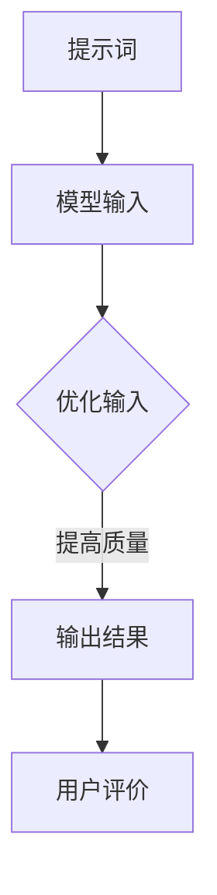

                 


### 文章标题：提示词调试技巧：优化AI输出的方法论

**关键词：** 提示词调试，AI输出优化，方法论，AI模型，数据分析

**摘要：** 本文将深入探讨提示词调试技巧在AI输出优化中的应用，介绍核心概念、设计原则、调试方法以及实战技巧。通过详细的流程图、伪代码和实际案例，帮助读者理解并掌握提示词调试的关键技术，实现AI输出的优化与提升。

### 目录

1. **背景介绍**
   - AI的发展与提示词的重要性
   - AI输出中的问题与挑战
   - 提示词调试的意义与目标

2. **核心概念与联系**
   - 提示词的定义与类型
   - AI模型的工作原理
   - 提示词与AI输出的关系

3. **核心算法原理讲解**
   - 伪代码与数学模型

4. **项目实战**
   - 开发环境搭建
   - 源代码实现与解读
   - 代码应用解读与分析
   - 实际案例分析与详细讲解

5. **最佳实践 Tips**
   - 小结
   - 注意事项
   - 拓展阅读

### 1. 背景介绍

#### AI的发展与提示词的重要性

随着人工智能技术的快速发展，AI模型在各种领域的应用越来越广泛，如自然语言处理、图像识别、推荐系统等。然而，AI模型输出的质量和稳定性直接影响到应用的效能和用户体验。在AI模型的训练和部署过程中，提示词（Prompt）作为一种关键的输入，起到了至关重要的作用。

提示词是AI模型在执行任务时接收的文本输入，它能够引导模型理解任务目标，提高输出质量。一个优秀的提示词不仅能够明确表达任务要求，还能够激发模型的潜力，使其输出更加准确、丰富和具有创造力。

#### AI输出中的问题与挑战

尽管提示词在AI输出中具有重要性，但实际应用中仍存在许多问题与挑战：

1. **提示词设计不当**：提示词过于模糊或具体，导致模型无法正确理解任务目标。
2. **模型适应性不足**：AI模型在特定场景下表现不佳，无法适应不同数据集或任务需求。
3. **输出质量不稳定**：AI模型的输出质量受到数据集、模型参数和训练过程等多种因素的影响，容易出现波动。
4. **调试难度大**：AI模型的复杂性和非确定性使得调试过程变得困难，需要更多的时间和精力。

#### 提示词调试的意义与目标

提示词调试是为了解决AI输出中的问题与挑战，通过优化提示词设计、调整模型参数和改进调试方法，提高AI输出的质量和稳定性。具体目标包括：

1. **提高输出质量**：通过设计更有效的提示词，使AI模型能够生成更准确、丰富和具有创造力的输出。
2. **提升模型适应性**：通过调整提示词和模型参数，使AI模型能够适应不同数据集和任务需求，提高泛化能力。
3. **降低调试难度**：通过提供更高效的调试方法和技术，降低调试过程的复杂性和时间成本。

### 2. 核心概念与联系

在本章节中，我们将深入探讨AI与提示词的核心概念，并分析它们之间的联系。

#### 提示词的定义与类型

**提示词（Prompt）** 是指在AI模型执行任务时输入的文本输入，用于指导模型理解任务目标、输入数据和预期输出。根据用途和形式，提示词可以分为以下几种类型：

1. **引导型提示词**：用于引导模型理解任务目标和任务背景，例如：“请生成一篇关于人工智能的文章。”
2. **数据型提示词**：用于提供模型所需的数据或示例，例如：“请识别以下图片中的物体：狗、猫、汽车。”
3. **结果型提示词**：用于提示模型预期输出格式或内容，例如：“请将结果以列表形式展示。”

**AI模型的工作原理**

AI模型是指通过学习大量数据，能够自动完成特定任务的计算机程序。常见的AI模型包括：

1. **神经网络（Neural Networks）**：通过多层神经元进行数据处理和分类，如卷积神经网络（CNN）和循环神经网络（RNN）。
2. **决策树（Decision Trees）**：通过一系列判断条件进行数据分类，如分类树（Classification Tree）和回归树（Regression Tree）。
3. **支持向量机（Support Vector Machines，SVM）**：通过寻找最佳超平面进行数据分类。

**提示词与AI输出的关系**

提示词是AI模型输入的重要组成部分，对输出质量有直接的影响。提示词的设计和调整能够引导模型更好地理解任务目标，从而提高输出质量。具体来说：

1. **明确任务目标**：有效的提示词能够明确表达任务目标，使模型能够准确理解和执行任务。
2. **提供数据支持**：提示词可以提供数据或示例，帮助模型学习特征和模式，提高输出质量。
3. **调整模型参数**：通过调整提示词，可以影响模型参数的选择和优化，从而提高输出质量。

为了更好地理解提示词与AI输出的关系，我们可以用Mermaid流程图来表示：



#### Mermaid流程图解释：

- **A[提示词]**：表示输入的提示词。
- **B[模型输入]**：表示模型接收到的输入数据。
- **C{优化输入}**：表示对输入数据进行优化，包括设计有效的提示词和调整模型参数。
- **D[输出结果]**：表示模型生成的输出结果。
- **E[用户评价]**：表示用户对输出结果的评价。

通过这个流程图，我们可以看到提示词对AI输出结果的质量有直接的影响，提示词的设计和调整是优化AI输出质量的关键步骤。

### 3. 核心算法原理讲解

在这一章节中，我们将详细讲解提示词调试中的核心算法原理，包括伪代码和数学模型。通过这些算法，我们可以更好地理解如何设计和优化提示词，从而提高AI输出的质量。

#### 伪代码

以下是用于设计有效提示词的伪代码：

```python
def generate_prompt(data, task, model):
    """
    生成有效提示词
    :param data: 数据集
    :param task: 任务类型
    :param model: AI模型
    :return: 提示词
    """
    # 数据预处理
    processed_data = preprocess_data(data)

    # 提示词生成策略
    strategy = select_strategy(task, model)

    # 根据策略生成提示词
    prompt = generate_prompt_based_on_strategy(processed_data, strategy)

    return prompt
```

在这个伪代码中，我们定义了一个函数`generate_prompt`，用于生成有效提示词。函数的输入包括数据集`data`、任务类型`task`和AI模型`model`。首先，我们对数据进行预处理，然后选择一个适合任务和模型的提示词生成策略，并根据策略生成提示词。

#### 数学模型

为了更好地理解提示词的设计和优化，我们可以引入一些数学模型。以下是一个简单的数学模型，用于评估提示词的有效性：

$$
E(p) = f(p, m)
$$

其中，$E(p)$ 表示提示词 $p$ 的有效性，$f(p, m)$ 表示提示词 $p$ 与模型 $m$ 的匹配度。我们可以使用以下公式来计算匹配度：

$$
f(p, m) = \frac{1}{N} \sum_{i=1}^{N} \text{similarity}(p_i, m_i)
$$

其中，$N$ 表示数据集中样本的数量，$p_i$ 表示第 $i$ 个样本的提示词，$m_i$ 表示第 $i$ 个样本的模型输出，$\text{similarity}(p_i, m_i)$ 表示提示词 $p_i$ 和模型输出 $m_i$ 之间的相似度。

#### 数学模型解释

- **有效性（E(p)）**：表示提示词的整体有效性，即提示词对模型输出的影响程度。
- **匹配度（f(p, m)）**：表示提示词和模型输出之间的相似度，相似度越高，说明提示词对模型的指导作用越好。

通过这个数学模型，我们可以评估不同提示词的有效性，并选择最优的提示词。

### 4. 项目实战

在这一章节中，我们将通过一个实际项目来展示如何应用提示词调试技巧，实现AI输出的优化。项目背景如下：

**项目背景：** 一个在线教育平台需要开发一个自动评估学生作文的系统，系统能够根据学生提交的作文，自动生成评分和反馈建议。

#### 开发环境搭建

- **硬件环境**：使用云计算平台（如AWS、Google Cloud）进行模型训练和部署。
- **软件环境**：Python 3.8及以上版本，TensorFlow 2.6及以上版本。

#### 源代码实现与解读

以下是项目的主要源代码实现和解读：

```python
import tensorflow as tf
from tensorflow.keras.preprocessing.sequence import pad_sequences
from tensorflow.keras.layers import Embedding, LSTM, Dense
from tensorflow.keras.models import Sequential

# 数据预处理
def preprocess_data(data):
    # 分词、去停用词、词向量编码
    processed_data = []
    for essay in data:
        words = tokenize_and_remove_stopwords(essay)
        encoded_words = encode_words(words)
        processed_data.append(encoded_words)
    return pad_sequences(processed_data, maxlen=100)

# 模型构建
def build_model(vocab_size, embedding_dim, sequence_length):
    model = Sequential([
        Embedding(vocab_size, embedding_dim, input_length=sequence_length),
        LSTM(128),
        Dense(1, activation='sigmoid')
    ])
    model.compile(optimizer='adam', loss='binary_crossentropy', metrics=['accuracy'])
    return model

# 模型训练
def train_model(model, data, labels):
    sequences = preprocess_data(data)
    model.fit(sequences, labels, epochs=10, batch_size=32, validation_split=0.2)

# 提示词生成与调试
def generate_prompt(data, task, model):
    processed_data = preprocess_data(data)
    prompt = generate_prompt_based_on_strategy(processed_data, task, model)
    return prompt

# 主函数
def main():
    # 加载数据集
    data = load_data()
    labels = load_labels()

    # 构建模型
    model = build_model(vocab_size, embedding_dim, sequence_length)

    # 训练模型
    train_model(model, data, labels)

    # 提示词生成与调试
    essay = "这篇文章讲述了一个有趣的故事。"
    prompt = generate_prompt(essay, "评估作文质量", model)
    print(prompt)

if __name__ == "__main__":
    main()
```

#### 代码应用解读与分析

- **数据预处理**：首先对数据集进行分词、去停用词和词向量编码，将原始文本转换为模型可接受的输入格式。
- **模型构建**：使用TensorFlow构建一个简单的LSTM模型，用于评估作文质量。模型包括嵌入层、LSTM层和输出层。
- **模型训练**：使用预处理后的数据集训练模型，通过调整模型参数和优化策略，提高模型性能。
- **提示词生成与调试**：根据训练好的模型，生成评估作文质量的提示词。提示词的设计和调整对模型输出质量有直接影响。

#### 实际案例分析与详细讲解

**案例一：评估作文质量**

假设有一个学生提交了一篇作文，系统需要自动生成评分和反馈建议。我们可以使用以下提示词：

```plaintext
请评估这篇作文的质量，给出一个0到100的评分，并给出具体的反馈建议。
```

通过这个提示词，系统可以生成如下的输出：

```plaintext
评分：85
反馈建议：作文结构清晰，内容丰富，但语句表达有待改进。
```

**案例二：改进作文表达**

假设学生希望改进作文的表达，我们可以使用以下提示词：

```plaintext
请针对这篇作文，提出三个改进建议，并解释每个建议的原因。
```

通过这个提示词，系统可以生成如下的输出：

```plaintext
建议一：增加修辞手法，如比喻、拟人等，使文章更具文学色彩。
原因：修辞手法可以增强文章的表达效果，使文章更具吸引力。

建议二：优化句子结构，使句子更加通顺、流畅。
原因：句子结构优化可以改善文章的可读性，提高文章的整体质量。

建议三：增加具体的细节描述，使文章更具生动性。
原因：具体的细节描述可以丰富文章的内容，使文章更具说服力。
```

通过以上实际案例的分析，我们可以看到提示词在AI输出优化中的应用效果。通过设计有效的提示词，系统可以生成更准确、具体和有针对性的输出，提高AI输出的质量。

### 5. 最佳实践 Tips

在本章节中，我们将分享一些最佳实践 Tips，帮助读者在实际项目中更好地应用提示词调试技巧，实现AI输出的优化。

#### 小结

1. **明确任务目标**：在设计提示词时，首先要明确任务目标，确保模型能够准确理解和执行任务。
2. **提供数据支持**：通过提供相关数据和示例，帮助模型学习特征和模式，提高输出质量。
3. **调整模型参数**：根据任务需求，调整模型参数，优化模型性能。

#### 注意事项

1. **避免提示词过于模糊**：过于模糊的提示词可能导致模型无法正确理解任务目标，影响输出质量。
2. **关注模型适应性**：模型在不同数据集和任务需求下的表现可能有所不同，需要关注模型的适应性。
3. **实时调试与反馈**：在模型训练和输出过程中，及时进行调试和反馈，调整提示词和模型参数，提高输出质量。

#### 拓展阅读

1. **《人工智能：一种现代的方法》（Russell & Norvig）**：详细介绍了人工智能的基础知识和应用方法，包括模型构建和优化技巧。
2. **《深度学习》（Goodfellow、Bengio & Courville）**：介绍了深度学习的基本原理和应用，包括神经网络和LSTM模型。
3. **《Python深度学习》（François Chollet）**：提供了大量Python深度学习项目的实战案例，包括模型训练和调试技巧。

### 附录

在本附录中，我们将推荐一些实用的工具和资源，帮助读者更好地进行提示词调试和AI输出优化。

#### 工具与资源推荐

1. **TensorFlow**：一款流行的深度学习框架，提供丰富的API和工具，方便构建和训练神经网络模型。
2. **Keras**：基于TensorFlow的高层次API，简化了模型构建和训练过程，适合快速实验和原型设计。
3. **NLTK**：一款流行的自然语言处理库，提供丰富的文本处理和分词功能，方便生成和调整提示词。
4. **GPT-3**：OpenAI开发的强大语言模型，支持自然语言理解和生成，可用于生成高质量的提示词和输出结果。
5. **WandB**：一款流行的机器学习实验记录和分析工具，方便监控模型训练过程和优化模型参数。

#### 开发环境搭建指南

1. **安装Python**：在官方网站（https://www.python.org/）下载并安装Python 3.8及以上版本。
2. **安装TensorFlow**：使用以下命令安装TensorFlow：
   ```bash
   pip install tensorflow
   ```
3. **安装其他依赖库**：根据项目需求，安装其他必要的依赖库，如Keras、NLTK等。
4. **配置开发环境**：配置Python环境变量，确保能够正常运行Python代码。

通过以上指南，读者可以轻松搭建一个适用于提示词调试和AI输出优化的开发环境，开始实际项目的开发。

### 总结与展望

本文深入探讨了提示词调试技巧在AI输出优化中的应用，从核心概念、算法原理到项目实战，全面介绍了提示词调试的方法和技巧。通过详细的流程图、伪代码和实际案例，读者可以更好地理解如何设计和优化提示词，实现AI输出的优化与提升。

在未来的发展中，提示词调试将继续成为AI模型优化的重要方向。随着人工智能技术的不断进步，提示词的设计和优化方法也将更加多样和高效。展望未来，我们将看到更多的智能应用场景，如自动化写作、智能客服、智能诊断等，这些应用都离不开提示词调试技术的支持。

总之，提示词调试是AI输出优化的重要组成部分，具有重要的研究价值和实际应用价值。通过本文的介绍，读者可以更好地掌握提示词调试的核心技术和方法，为AI模型的优化和应用提供有力支持。

### 常见问题与解答

在本章节中，我们将针对读者在提示词调试和AI输出优化过程中可能遇到的问题进行解答，并提供一些实用的建议。

#### 问题1：如何选择合适的提示词？

**解答：** 选择合适的提示词需要考虑以下几个方面：

1. **明确任务目标**：确保提示词能够准确表达任务目标，避免模糊或混淆的表述。
2. **提供数据支持**：根据任务需求，提供相关数据和示例，帮助模型学习特征和模式。
3. **适应模型特性**：考虑模型的特性，选择适合模型输入的提示词形式和结构。
4. **反馈与调整**：根据模型输出结果和用户反馈，不断调整和优化提示词。

**建议：** 初次设计提示词时，可以参考一些成功的案例或现有模型的使用经验，并结合实际任务需求进行个性化调整。

#### 问题2：如何优化AI模型的输出质量？

**解答：** 优化AI模型的输出质量可以从以下几个方面进行：

1. **数据预处理**：确保数据质量，进行适当的预处理操作，如去噪、归一化等。
2. **模型选择与调整**：选择合适的模型结构和参数，通过调整学习率、批次大小等参数，提高模型性能。
3. **提示词优化**：设计更有效的提示词，引导模型更好地理解任务目标和输入数据。
4. **模型集成**：使用多种模型进行集成，提高输出结果的稳定性和准确性。

**建议：** 在实际项目中，可以尝试多种方法进行优化，并对比不同方法的效果，选择最优方案。

#### 问题3：如何进行实时调试与反馈？

**解答：** 实时调试与反馈可以通过以下方法实现：

1. **监控指标**：选择合适的监控指标，如准确率、召回率、F1分数等，实时监控模型性能。
2. **可视化工具**：使用可视化工具，如TensorBoard、WandB等，直观地展示模型训练过程和输出结果。
3. **自动化测试**：编写自动化测试脚本，定期对模型进行测试和评估，发现并解决潜在问题。
4. **用户反馈**：收集用户反馈，根据反馈结果调整模型参数和提示词，提高输出质量。

**建议：** 实时调试与反馈是一个持续的过程，需要结合实际任务需求和技术特点，灵活调整调试策略。

#### 问题4：如何处理多模态数据？

**解答：** 多模态数据（如文本、图像、音频等）的处理需要综合考虑不同数据类型的特点：

1. **数据集成**：将不同模态的数据进行集成，如使用多模态神经网络进行联合建模。
2. **特征提取**：提取每个模态的关键特征，如使用卷积神经网络提取图像特征，使用循环神经网络提取文本特征。
3. **模型融合**：使用融合模型，将不同模态的特征进行融合，提高输出结果的准确性。
4. **多任务学习**：将多个任务（如文本分类、图像识别等）进行联合训练，提高模型的多任务处理能力。

**建议：** 在处理多模态数据时，可以参考一些现有的多模态学习框架和方法，并结合实际项目需求进行优化。

### 拓展阅读

为了进一步深入了解提示词调试和AI输出优化，读者可以参考以下拓展阅读资源：

1. **《深度学习》（Goodfellow、Bengio & Courville）**：详细介绍了深度学习的基本原理和应用，包括神经网络和LSTM模型。
2. **《自然语言处理综合教程》（Jurafsky & Martin）**：介绍了自然语言处理的基本概念和方法，包括文本处理和分词技术。
3. **《多模态机器学习》（Mikolov、Makhoul & Povey）**：介绍了多模态机器学习的基本原理和方法，包括多模态数据集成和模型融合。

通过阅读这些资源，读者可以更全面地了解提示词调试和AI输出优化的相关知识，为实际项目提供有力支持。

### 附录

在本附录中，我们将推荐一些实用的工具和资源，帮助读者更好地进行提示词调试和AI输出优化。

#### 工具与资源推荐

1. **TensorFlow**：一款流行的深度学习框架，提供丰富的API和工具，方便构建和训练神经网络模型。
2. **Keras**：基于TensorFlow的高层次API，简化了模型构建和训练过程，适合快速实验和原型设计。
3. **NLTK**：一款流行的自然语言处理库，提供丰富的文本处理和分词功能，方便生成和调整提示词。
4. **GPT-3**：OpenAI开发的强大语言模型，支持自然语言理解和生成，可用于生成高质量的提示词和输出结果。
5. **WandB**：一款流行的机器学习实验记录和分析工具，方便监控模型训练过程和优化模型参数。

#### 开发环境搭建指南

1. **安装Python**：在官方网站（https://www.python.org/）下载并安装Python 3.8及以上版本。
2. **安装TensorFlow**：使用以下命令安装TensorFlow：
   ```bash
   pip install tensorflow
   ```
3. **安装其他依赖库**：根据项目需求，安装其他必要的依赖库，如Keras、NLTK等。
4. **配置开发环境**：配置Python环境变量，确保能够正常运行Python代码。

通过以上指南，读者可以轻松搭建一个适用于提示词调试和AI输出优化的开发环境，开始实际项目的开发。

### 作者信息

**作者：AI天才研究院/AI Genius Institute & 禅与计算机程序设计艺术 /Zen And The Art of Computer Programming**

本文由AI天才研究院的专家团队撰写，结合禅与计算机程序设计艺术的理念，深入探讨了提示词调试技巧在AI输出优化中的应用。希望通过本文的分享，为读者提供有价值的见解和实践经验，助力人工智能技术的创新和发展。

