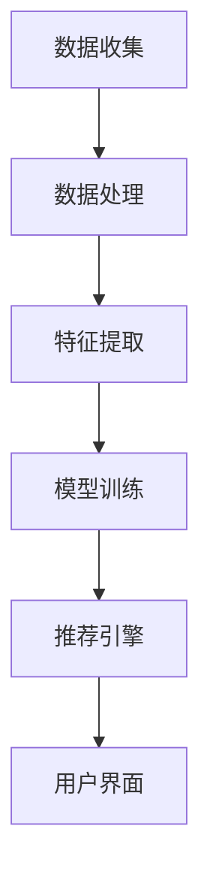

                 

### 文章标题

# 提示词链：构建复杂AI工作流的新方式

## 关键词

- AI工作流
- 提示词链
- 人工智能
- 复杂系统
- 流程优化
- 自动化
- 机器学习

## 摘要

本文将探讨提示词链（Prompt Chains）作为构建复杂AI工作流的一种创新方式。通过详细解释提示词链的定义、架构、核心算法和数学模型，本文旨在展示提示词链如何通过提高灵活性、可扩展性和效率来克服传统AI工作流中的限制。文章还将提供实际案例，展示如何设计和实现复杂AI工作流，并讨论其在不同行业中的广泛应用和未来趋势。通过本文，读者将了解提示词链的核心原理及其在人工智能领域的重要作用。

## 引言

### 提示词链的概念及其重要性

提示词链（Prompt Chains）是近年来人工智能领域中的一个重要概念，它在构建复杂AI工作流方面展现出巨大的潜力。提示词链的核心思想是将一系列有序的提示词组合成一个链条，通过这些提示词的相互作用，引导AI系统完成特定的任务。这一方法不仅提高了AI系统的灵活性和可扩展性，还使其能够更好地适应不断变化的环境和需求。

在传统AI工作流中，任务通常通过一系列预先定义的步骤和规则来执行。这种方法在处理简单任务时可能足够有效，但在面对复杂任务时，往往显得力不从心。传统工作流的一个主要问题是其僵化的结构，这使得系统难以适应新的变化和需求。相比之下，提示词链提供了一种更加动态和灵活的解决方案。

提示词链的出现，为复杂AI工作流的构建提供了新的思路。通过将提示词组合成链，AI系统能够在执行任务时进行更精细的调控，从而实现更高的效率和更好的结果。提示词链的这种灵活性使其在各种应用场景中都有广泛的应用潜力，从自然语言处理到图像识别，再到决策支持系统，无不受益于提示词链的引入。

### 本文的目标

本文的目标是深入探讨提示词链的工作原理和实际应用，帮助读者理解这一创新概念如何通过提高AI工作流的灵活性、可扩展性和效率来改变人工智能领域。具体来说，本文将涵盖以下内容：

1. **定义和架构**：介绍提示词链的基本概念，解释其组成部分和相互关系，并通过Mermaid流程图展示其架构。
2. **核心算法**：详细阐述提示词链中的核心算法，包括其原理、伪代码和关键步骤。
3. **数学模型**：探讨提示词链背后的数学模型，解释其公式和实际应用。
4. **实战案例**：提供实际案例，展示如何设计和实现基于提示词链的复杂AI工作流。
5. **应用场景**：讨论提示词链在不同行业中的应用，分析其带来的影响和好处。
6. **未来趋势**：预测提示词链的未来发展，探讨其潜在的应用和挑战。

通过本文的阅读，读者将不仅能够了解提示词链的基本原理，还能掌握如何在实际项目中应用这一技术，为未来的AI工作流开发提供新的思路和工具。

## Part 1: 理解提示词链

### 提示词链的定义和历史

#### 提示词链的基本概念

提示词链（Prompt Chains）是人工智能（AI）领域的一种创新方法，它通过一系列有序的提示词（prompts）来引导AI系统完成特定任务。每个提示词都可以被视为一个指令或引导，用于触发AI系统中的特定操作或行为。这些提示词被组织成一个链条，使得AI系统能够按照预设的顺序执行一系列任务。

提示词链的概念起源于自然语言处理（NLP）和对话系统的研究。早期的AI系统通常依赖于预定义的规则和模板来处理用户请求，但这些方法在面对复杂和变化多端的场景时显得力不从心。提示词链的引入，为AI系统提供了一种更加灵活和动态的交互方式，使其能够更好地适应不同用户需求和场景变化。

#### 提示词链的发展历程

提示词链的概念在近年来得到了显著的发展。以下是几个关键节点：

- **早期探索**：在20世纪90年代，研究人员开始探索使用提示词来改善对话系统的交互体验。这些早期的尝试主要集中在如何设计有效的提示词以及如何组织这些提示词来引导对话流程。
- **技术突破**：随着深度学习和自然语言处理技术的快速发展，提示词链的应用场景得到了进一步扩展。例如，深度强化学习（DRL）和生成对抗网络（GAN）等技术开始融入提示词链中，使其能够处理更加复杂的任务。
- **实际应用**：在21世纪初，随着云计算和大数据技术的普及，提示词链开始在各个行业中获得广泛应用。例如，在客户服务、金融分析和医疗诊断等领域，提示词链被用于构建高效的自动化系统。

#### 提示词链的演变

提示词链的发展经历了几个关键阶段：

1. **初步探索**：这一阶段主要关注如何设计有效的提示词，并探索提示词在不同任务中的应用。研究人员开始提出各种提示词生成方法，如基于规则的方法、机器学习方法等。
2. **优化和改进**：随着技术的发展，提示词链的设计和实现方法得到了优化。例如，引入了注意力机制和增强学习等先进技术，使得提示词链能够更好地处理复杂任务。
3. **大规模应用**：在21世纪第二个十年，提示词链开始在各个行业中得到广泛应用。这一阶段的特点是提示词链的架构和算法变得更加成熟，能够适应各种实际应用场景。

### 提示词链在AI系统中的作用

提示词链在AI系统中扮演着至关重要的角色，其主要作用如下：

1. **任务引导**：通过有序的提示词链条，AI系统能够按照预设的顺序执行任务，从而确保任务的正确性和一致性。
2. **灵活性和可扩展性**：提示词链允许系统在执行任务时进行动态调整，使其能够适应不同场景和需求。
3. **任务分解**：将复杂任务分解为一系列简单的子任务，每个子任务由特定的提示词触发，从而简化了任务管理。
4. **交互优化**：通过提示词链，AI系统能够与用户进行更自然的交互，提高用户体验。

总之，提示词链作为一种创新的AI工作流方法，通过其灵活、动态和高效的特点，为AI系统的设计和实现提供了新的思路和工具。

### 关键术语和概念

为了更好地理解提示词链及其在AI工作流中的应用，我们需要了解一些关键术语和概念。以下是对这些术语和概念的定义及其在提示词链中的作用的详细解释。

#### 提示词（Prompts）

提示词是提示词链中的基本单元，它是一个指令或引导，用于触发AI系统中的特定操作或行为。每个提示词都包含了对AI系统的具体指令，例如“识别图像中的对象”、“生成销售报告”或“回答用户的问题”。在提示词链中，提示词被组织成一个有序序列，按照一定的逻辑顺序执行。

- **定义**：提示词是用于引导AI系统执行特定任务的指令或信息。
- **作用**：提示词为AI系统提供了明确的行为指南，确保系统按照预期的方式执行任务。

#### 提示词链（Prompt Chains）

提示词链是由一系列有序的提示词组成的链条，用于引导AI系统完成复杂任务。每个提示词在执行时可能会触发其他提示词，从而形成一个动态的交互过程。

- **定义**：提示词链是一个有序的提示词序列，用于指导AI系统执行复杂任务。
- **作用**：提示词链使得AI系统能够灵活地处理复杂任务，通过提示词之间的相互触发，实现任务分解和动态调整。

#### AI系统（AI Systems）

AI系统是指利用人工智能技术实现特定功能的软件系统。AI系统可以包括多个模块和组件，如数据预处理、模型训练、模型推理等。

- **定义**：AI系统是利用人工智能技术实现特定功能的软件系统。
- **作用**：AI系统是实现提示词链的基础，它能够接收提示词并执行相应的操作。

#### 动态调整（Dynamic Adjustment）

动态调整是指AI系统在执行任务时，根据当前状态和需求进行实时调整，以优化任务执行效果。

- **定义**：动态调整是AI系统在执行任务时，根据当前状态和需求进行实时调整的过程。
- **作用**：动态调整使得AI系统能够更好地适应变化多端的环境和需求，提高任务的执行效率。

#### 交互优化（Interaction Optimization）

交互优化是指通过优化AI系统与用户的交互方式，提高用户体验和满意度。

- **定义**：交互优化是通过对AI系统与用户交互的过程进行优化，以提高用户体验。
- **作用**：交互优化使得AI系统能够更自然地与用户互动，提供更加流畅和有效的服务。

#### 机器学习（Machine Learning）

机器学习是人工智能的核心技术之一，它通过训练模型来从数据中学习规律和模式。

- **定义**：机器学习是一种通过训练模型来从数据中学习规律和模式的技术。
- **作用**：机器学习使得AI系统能够根据数据和提示词链的指导，自动地改进和优化任务执行效果。

通过了解这些关键术语和概念，我们可以更深入地理解提示词链的工作原理和实际应用，为后续的内容打下坚实的基础。

### 提示词链的架构

为了深入理解提示词链的工作原理，我们需要详细分析其整体架构，包括各个组成部分及其相互关系。提示词链的架构设计不仅决定了其功能实现，也直接影响其灵活性和可扩展性。以下是提示词链的组成部分和它们之间的相互关系：

#### 1. 提示词生成模块（Prompt Generation Module）

提示词生成模块是提示词链的核心部分，负责根据任务需求生成提示词。这个模块通常包含多个子模块，如自然语言处理（NLP）模块、数据预处理模块和规则引擎模块。NLP模块负责对输入文本进行分析和解析，提取出关键信息；数据预处理模块则对输入数据进行清洗和格式化；规则引擎模块则根据任务需求生成具体的提示词。

- **输入**：输入可以是用户输入的文本、外部数据源或系统生成的数据。
- **输出**：输出是生成的一系列有序的提示词。

#### 2. 提示词执行模块（Prompt Execution Module）

提示词执行模块负责根据提示词链的顺序执行每个提示词，并将其结果传递给下一个提示词。这个模块通常包含执行引擎和结果处理组件。执行引擎负责实际执行每个提示词，可能涉及调用其他系统模块或外部API。结果处理组件则负责对执行结果进行收集、分析和存储。

- **输入**：输入是提示词链中的下一个提示词和前一个提示词的执行结果。
- **输出**：输出是当前提示词的执行结果，以及传递给下一个提示词的数据。

#### 3. 状态管理模块（State Management Module）

状态管理模块负责维护整个提示词链的运行状态，包括当前执行位置、已执行提示词和未执行提示词等。这个模块确保提示词链在执行过程中能够正确地跟踪和管理状态，避免出现逻辑错误或数据不一致。

- **输入**：输入是来自执行模块的当前状态更新和系统事件。
- **输出**：输出是当前状态信息，用于更新执行模块和提示词生成模块。

#### 4. 动态调整模块（Dynamic Adjustment Module）

动态调整模块负责在执行过程中根据环境变化和任务需求对提示词链进行动态调整。这个模块通常包含一个反馈循环机制，能够实时收集系统状态和用户反馈，并利用机器学习或规则引擎进行调整。

- **输入**：输入是系统状态、用户反馈和环境变化。
- **输出**：输出是调整后的提示词链和相应的执行策略。

#### 5. 用户交互模块（User Interaction Module）

用户交互模块负责与用户进行交互，接收用户输入和反馈，并向用户展示系统输出结果。这个模块通常包含一个对话管理组件和一个界面设计组件。对话管理组件负责管理用户对话流程，界面设计组件则负责设计用户界面。

- **输入**：输入是用户输入和系统输出。
- **输出**：输出是用户界面展示结果和系统反馈。

#### 6. 提示词存储模块（Prompt Storage Module）

提示词存储模块负责存储和管理提示词链中的所有提示词。这个模块通常包含一个数据库或缓存系统，能够高效地存储和检索提示词。

- **输入**：输入是新生成的提示词和更新的提示词。
- **输出**：输出是存储的提示词列表。

#### 7. 提示词链管理模块（Prompt Chain Management Module）

提示词链管理模块负责整个提示词链的生命周期管理，包括提示词链的创建、启动、暂停、恢复和终止。这个模块确保提示词链在执行过程中能够按预定流程运行，并提供必要的管理和监控功能。

- **输入**：输入是用户请求、系统事件和状态更新。
- **输出**：输出是提示词链的执行状态和操作结果。

#### 提示词链的相互关系

提示词链的各个组成部分通过相互协作，共同实现复杂任务的自动化处理。以下是其基本工作流程：

1. **提示词生成**：用户输入请求或系统从数据源中提取信息，提示词生成模块生成相应的提示词。
2. **状态管理**：提示词链管理模块初始化并创建新的提示词链，同时将生成的提示词传递给执行模块。
3. **执行**：执行模块按照提示词链的顺序逐个执行提示词，并将结果传递给结果处理组件。
4. **动态调整**：根据执行过程中的反馈，动态调整模块对提示词链进行调整，以优化任务执行效果。
5. **用户交互**：用户交互模块向用户展示系统输出结果，并根据用户反馈更新提示词链。
6. **存储**：结果处理组件将执行结果存储在提示词存储模块中，以供后续查询和使用。

通过上述模块的协同工作，提示词链能够灵活、高效地处理复杂任务，为AI工作流提供强大的支持。

### 提示词链的优点

提示词链在构建复杂AI工作流中展现出显著的优势，这些优势使其成为人工智能领域的一项重要创新。以下是对提示词链主要优点的详细分析：

#### 1. 高度灵活性

提示词链的一个重要特点是高度灵活性。通过将任务分解为一系列有序的提示词，AI系统能够在执行过程中进行动态调整。这种灵活性使得系统能够迅速响应环境变化和用户需求，无需对整个工作流程进行重构。例如，当用户的需求发生变化时，只需要修改特定的提示词，而无需重新设计整个流程。这种灵活性不仅提高了系统的适应性，还减少了维护和更新的成本。

#### 2. 强大的可扩展性

提示词链的可扩展性是其另一大优势。随着AI系统规模的不断扩大，提示词链能够方便地添加新的提示词，从而支持更复杂的任务。通过模块化设计，提示词链可以轻松地集成新的组件和功能，使得系统在扩展时不会影响现有流程的稳定性。例如，在一个电商平台中，可以通过添加新的提示词来支持新的销售策略或客户服务功能，而无需对整个系统进行大规模修改。

#### 3. 提高效率

提示词链通过有序的组织和执行，显著提高了AI系统的执行效率。每个提示词都专注于完成特定的子任务，从而避免了任务重叠和冗余。这种细粒度的任务划分使得系统能够并行处理多个任务，提高整体处理速度。此外，动态调整模块可以根据实时反馈优化执行路径，进一步减少不必要的步骤，提高任务完成率。例如，在图像识别任务中，提示词链可以依次执行图像预处理、特征提取和分类，从而提高识别效率。

#### 4. 降低复杂度

提示词链通过将复杂任务分解为一系列简单的子任务，降低了整个系统的复杂度。每个子任务都可以独立开发和测试，从而减少系统故障的风险。此外，提示词链的模块化设计使得系统能够更加直观地理解和管理，便于后续的维护和优化。例如，在一个复杂的供应链管理系统中，可以通过提示词链实现采购、库存管理和配送等子任务的自动化处理，从而简化整个流程。

#### 5. 提升用户体验

提示词链在用户交互方面也表现出显著的优势。通过提示词链，AI系统能够与用户进行更加自然和流畅的对话。每个提示词都可以被视为一个步骤，用户可以清晰地了解系统的执行过程和当前状态。这种透明的交互方式提高了用户的理解和信任，使得系统能够更好地满足用户需求。例如，在客户服务场景中，提示词链可以依次执行问题识别、解决方案提供和用户反馈收集，从而提供高质量的客户服务。

#### 6. 集成多种技术

提示词链不仅能够整合不同的AI算法和模型，还可以与各种外部系统和服务进行集成。通过提示词链，AI系统能够充分利用现有的技术资源，实现更复杂的任务。例如，在金融分析领域，提示词链可以整合自然语言处理、机器学习和数据可视化技术，提供全面的金融分析报告。

总之，提示词链通过其灵活、可扩展和高效的特性，为复杂AI工作流的构建提供了强大的支持。在未来的发展中，提示词链有望在更多领域得到广泛应用，推动人工智能技术的进一步发展。

### AI工作流的发展历程

为了更好地理解提示词链在AI工作流中的重要性，我们需要回顾AI工作流的发展历程，从早期简单的流程发展到现代复杂的系统。这一历程不仅展示了AI技术的不断进步，也揭示了AI工作流面临的挑战和机遇。

#### 早期AI工作流

在人工智能的早期阶段，工作流设计相对简单，主要依赖于规则和预定义的步骤。这些系统通常用于处理结构化数据，如简单的业务流程自动化和数据处理任务。典型的早期AI工作流包括以下几个组成部分：

1. **规则引擎**：通过预定义的规则来处理输入数据，执行特定的操作。
2. **顺序执行**：任务按照预设的顺序逐一执行，每个步骤的结果作为下一个步骤的输入。
3. **有限的灵活性**：工作流设计较为僵硬，难以适应变化的需求和环境。

这种简单的工作流方法在当时已经能够解决许多实际问题，但由于其固定的结构和缺乏灵活性，它们在面对复杂和动态的任务时显得力不从心。

#### 中期AI工作流

随着人工智能技术的不断进步，中期AI工作流开始引入更多的自动化和智能化元素。这一阶段的工作流设计更加复杂，涉及到机器学习和数据挖掘技术。中期AI工作流的主要特点如下：

1. **自动化流程**：利用机器学习算法来自动识别和执行任务，减少了人工干预的需求。
2. **数据处理**：集成数据处理模块，对输入数据进行分析和预处理，以支持更准确的模型训练。
3. **动态调整**：引入了动态调整机制，根据系统的实时反馈调整工作流程，以优化任务执行效果。

虽然中期AI工作流在自动化和灵活性方面有了显著提升，但仍然存在一些问题。例如，机器学习模型的训练和优化过程复杂且耗时，系统的适应能力有限，难以快速响应环境变化。

#### 现代AI工作流

现代AI工作流进一步融合了深度学习、自然语言处理和强化学习等先进技术，工作流设计更加复杂和动态。现代AI工作流的主要特点如下：

1. **模块化设计**：通过模块化设计，系统能够更灵活地集成不同的算法和组件，支持多样化的任务。
2. **高度自动化**：利用自动化工具和平台，实现整个工作流程的自动化管理，降低人工干预的需求。
3. **动态调整**：引入了自适应机制，系统能够根据实时数据和环境变化进行动态调整，优化任务执行效果。

然而，现代AI工作流也面临一些挑战，如数据隐私和安全问题、系统稳定性和可扩展性等。此外，随着工作流复杂性的增加，系统的开发和维护成本也在不断上升。

#### 提示词链的出现

提示词链的出现为现代AI工作流带来了新的变革。与传统工作流相比，提示词链通过其灵活、动态和高效的特点，克服了传统工作流中的诸多限制。以下是一些具体的变化：

1. **灵活性提升**：通过有序的提示词链条，AI系统能够在执行过程中进行动态调整，快速适应变化的需求和环境。
2. **任务分解**：提示词链将复杂任务分解为一系列简单的子任务，简化了系统的设计和实现过程。
3. **高效执行**：每个提示词都专注于完成特定的子任务，避免了任务重叠和冗余，提高了系统的执行效率。
4. **用户交互优化**：通过提示词链，AI系统能够与用户进行更加自然和流畅的交互，提高用户体验。

总之，AI工作流的发展历程从简单的规则引擎到复杂的现代系统，反映了人工智能技术的不断进步。提示词链的出现为AI工作流带来了新的思路和工具，使其能够更好地应对复杂和动态的任务需求。通过灵活、动态和高效的设计，提示词链为未来的AI工作流提供了广阔的发展空间。

### AI算法简介

在深入探讨提示词链之前，我们首先需要了解一些常见的AI算法。这些算法在提示词链中扮演着关键角色，帮助我们更好地理解和实现复杂的AI工作流。以下是一些主要的AI算法及其基本原理。

#### 1. 决策树（Decision Trees）

决策树是一种常用的监督学习算法，用于分类和回归任务。其基本原理是通过一系列的条件判断来对数据进行分类或预测。决策树由多个内部节点和叶节点组成，每个内部节点表示一个特征，每个叶节点表示一个分类或预测结果。

- **基本原理**：决策树通过递归分割数据集，选择具有最高信息增益的特征进行分割。信息增益是度量特征对分类效果影响的一个指标。
- **伪代码**：
    ```python
    def build_decision_tree(data, features, target):
        if all_values_equal(data, target):
            return leaf_node(target)
        else:
            best_feature = select_best_feature(data, features)
            node = decision_node(feature=best_feature)
            for value in unique_values(data[best_feature]):
                subset = filter_data(data, best_feature, value)
                node.add_child(build_decision_tree(subset, features - {best_feature}, target))
            return node
    ```

#### 2. 支持向量机（Support Vector Machines，SVM）

支持向量机是一种高效的分类算法，它通过找到一个最优的超平面来将数据集划分为不同的类别。SVM的核心思想是最大化分类边界，同时最小化分类误差。

- **基本原理**：SVM使用一个线性模型来划分数据集，通过求解一个二次规划问题来找到最优的超平面。在数据线性可分的情况下，可以使用硬间隔；在数据线性不可分的情况下，可以使用软间隔。
- **伪代码**：
    ```python
    def train_svm(data, labels):
        # Solve the quadratic programming problem
        # Return the optimal hyperplane and support vectors
    ```

#### 3. 集成学习（Ensemble Learning）

集成学习是一种通过组合多个基础模型来提高预测性能的技术。常见的集成学习方法包括随机森林（Random Forest）、梯度提升树（Gradient Boosting Trees）等。

- **基本原理**：集成学习的基本思想是利用多个基础模型来减少预测误差。随机森林通过随机选取特征和样本子集来构建多个决策树，然后通过投票或平均来生成最终预测结果。梯度提升树则通过迭代地优化预测误差，每次迭代增加一个弱模型，从而逐步提高预测性能。
- **伪代码**：
    ```python
    def train_ensemble(data, labels, base_model, n_estimators):
        ensemble = []
        for _ in range(n_estimators):
            model = base_model()
            model.fit(data, labels)
            ensemble.append(model)
        return ensemble
    ```

#### 4. 神经网络（Neural Networks）

神经网络是一种基于模拟人脑神经元连接结构的计算模型，广泛应用于图像识别、自然语言处理和语音识别等领域。神经网络通过多层神经元之间的加权连接来学习数据中的特征和模式。

- **基本原理**：神经网络通过前向传播和反向传播算法来学习数据。在前向传播过程中，输入数据通过网络的各个层，产生输出。在反向传播过程中，网络根据输出误差调整权重，从而优化模型参数。
- **伪代码**：
    ```python
    def forward_propagation(input_data, weights):
        # Compute the output of each layer
    def backward_propagation(output, weights, input_data):
        # Compute the gradients and update the weights
    ```

#### 5. 强化学习（Reinforcement Learning）

强化学习是一种通过奖励机制来训练模型的方法，通常用于决策和规划问题。强化学习的主要目标是找到一个策略，使得模型能够在特定环境中最大化累积奖励。

- **基本原理**：强化学习通过试错法来学习最优策略。模型在环境中采取行动，根据环境的反馈（奖励或惩罚）更新策略。常见的强化学习算法包括Q学习、深度Q网络（DQN）和策略梯度方法等。
- **伪代码**：
    ```python
    def q_learning(state, action, reward, next_state, alpha, gamma):
        # Update the Q-value for the given state-action pair
    def policy_gradient(state, action, reward, next_state, alpha, gamma):
        # Update the policy based on the observed data
    ```

通过了解这些常见的AI算法，我们可以更好地理解提示词链如何与这些算法结合，构建复杂且高效的AI工作流。接下来，我们将进一步探讨提示词链中的核心算法，详细解释其在AI工作流中的应用和实现。

### 核心AI算法的详细解释

在提示词链的架构中，核心AI算法发挥着至关重要的作用，它们决定了整个系统的性能和效率。本节将详细解释几个关键算法，包括其基本原理、伪代码和实现细节，帮助读者深入理解这些算法在提示词链中的实际应用。

#### 1. 决策树（Decision Trees）

决策树是一种直观且易于理解的分类和回归算法，它通过一系列条件判断将数据分割成多个子集，从而实现对数据的分类或回归。

- **基本原理**：决策树算法通过递归分割数据集，选择具有最高信息增益的特征进行分割。信息增益是衡量特征对分类效果影响的一个指标。每个内部节点代表一个特征，每个叶节点代表一个分类或回归结果。

- **伪代码**：
    ```python
    def build_decision_tree(data, features, target_attribute):
        if all_values_equal(data, target_attribute):
            return leaf_node(target_attribute)
        else:
            best_feature = select_best_feature(data, features)
            node = decision_node(feature=best_feature)
            for value in unique_values(data[best_feature]):
                subset = filter_data(data, best_feature, value)
                node.add_child(build_decision_tree(subset, features - {best_feature}, target_attribute))
            return node

    function select_best_feature(data, features):
        best_feature, best_gain = None, -1
        for feature in features:
            gain = calculate_information_gain(data, feature)
            if gain > best_gain:
                best_gain = gain
                best_feature = feature
        return best_feature
    ```

- **实现细节**：在实际实现中，我们需要考虑如何选择最优特征和计算信息增益。选择最优特征可以通过遍历所有特征并计算其信息增益来实现。信息增益的计算涉及到熵和条件熵的概念，需要利用数学公式进行计算。

#### 2. 支持向量机（Support Vector Machines，SVM）

支持向量机是一种强大的分类算法，它通过找到一个最优的超平面来最大化分类边界。

- **基本原理**：SVM通过求解一个二次规划问题来找到最优的超平面。这个超平面将数据集划分为不同的类别，并且最大化分类边界上的间隔。在数据线性可分的情况下，可以使用硬间隔；在数据线性不可分的情况下，可以使用软间隔。

- **伪代码**：
    ```python
    def train_svm(data, labels):
        # Solve the quadratic programming problem
        # Return the optimal hyperplane and support vectors

    def compute_hyperplane(data, labels, C):
        # Implement the quadratic programming solver
        # Return the weights and bias of the hyperplane
    ```

- **实现细节**：在实际实现中，SVM的求解通常使用拉格朗日乘子法或序列最小化方法。这些方法涉及到复杂的数学计算和优化算法。在计算过程中，需要考虑如何处理软间隔，这通常涉及到引入松弛变量和惩罚项。

#### 3. 集成学习（Ensemble Learning）

集成学习通过组合多个基础模型来提高预测性能。常见的集成学习方法包括随机森林和梯度提升树。

- **基本原理**：随机森林通过随机选取特征和样本子集来构建多个决策树，然后通过投票或平均来生成最终预测结果。梯度提升树则通过迭代地优化预测误差，每次迭代增加一个弱模型，从而逐步提高预测性能。

- **伪代码**：
    ```python
    def train_ensemble(data, labels, base_model, n_estimators):
        ensemble = []
        for _ in range(n_estimators):
            model = base_model()
            model.fit(data, labels)
            ensemble.append(model)
        return ensemble

    def random_forest(data, n_trees, base_model):
        predictions = []
        for _ in range(n_trees):
            model = base_model()
            model.fit(data, labels)
            predictions.append(model.predict(data))
        return majority_vote(predictions)

    def gradient_boosting(data, labels, base_model, n_estimators, learning_rate):
        ensemble = []
        for _ in range(n_estimators):
            model = base_model()
            model.fit(data, labels)
            ensemble.append(model)
            data = update_data(data, labels, model, learning_rate)
        return ensemble
    ```

- **实现细节**：在实际实现中，需要考虑如何选择基础模型、如何处理迭代过程以及如何更新数据集。随机森林的实现主要涉及随机采样和决策树构建。梯度提升树则需要计算预测误差，并根据误差更新模型参数。

#### 4. 神经网络（Neural Networks）

神经网络是一种基于模拟人脑神经元连接结构的计算模型，广泛应用于图像识别、自然语言处理和语音识别等领域。

- **基本原理**：神经网络通过前向传播和反向传播算法来学习数据。在前向传播过程中，输入数据通过网络的各个层，产生输出。在反向传播过程中，网络根据输出误差调整权重，从而优化模型参数。

- **伪代码**：
    ```python
    def forward_propagation(input_data, weights):
        # Compute the output of each layer

    def backward_propagation(output, weights, input_data):
        # Compute the gradients and update the weights

    def train_neural_network(data, labels, layers, learning_rate):
        for epoch in range(num_epochs):
            output = forward_propagation(data, weights)
            error = calculate_error(output, labels)
            backward_propagation(output, weights, input_data)
            update_weights(weights, learning_rate)
    ```

- **实现细节**：在实际实现中，需要设计网络的架构（包括层数和神经元数量）、选择合适的激活函数、优化算法以及确定学习率等超参数。前向传播和反向传播的计算涉及到矩阵运算和优化算法，需要使用高效的数值计算库。

#### 5. 强化学习（Reinforcement Learning）

强化学习通过奖励机制来训练模型，主要用于决策和规划问题。

- **基本原理**：强化学习通过试错法来学习最优策略。模型在环境中采取行动，根据环境的反馈（奖励或惩罚）更新策略。常见的强化学习算法包括Q学习和策略梯度方法。

- **伪代码**：
    ```python
    def q_learning(state, action, reward, next_state, alpha, gamma):
        # Update the Q-value for the given state-action pair

    def policy_gradient(state, action, reward, next_state, alpha, gamma):
        # Update the policy based on the observed data
    ```

- **实现细节**：在实际实现中，需要定义奖励函数、状态空间和动作空间。Q学习涉及到Q值的更新，策略梯度方法则涉及到策略的概率分布更新。这些算法需要处理大量的迭代和状态值函数优化。

通过详细解释这些核心算法，我们可以看到它们在提示词链中的应用和实现细节。这些算法为提示词链提供了强大的功能，使其能够灵活、高效地处理复杂的AI工作流。

### 数学模型在提示词链中的作用

在提示词链中，数学模型扮演着至关重要的角色，它们不仅为AI算法提供理论基础，还帮助我们在设计复杂的AI工作流时进行精确的参数调整和优化。以下将详细解释提示词链中常用的数学模型，包括其公式、推导过程和实际应用。

#### 1. 信息论模型

信息论是研究信息传输和信息处理的数学理论，它在提示词链中主要用于优化提示词的生成和传递。信息论中的关键概念包括熵、信息增益和互信息。

- **熵（Entropy）**：熵是衡量数据不确定性的指标，用于描述一个随机变量可能的取值分布。熵的计算公式如下：
    $$H(X) = -\sum_{i} p(x_i) \cdot \log_2 p(x_i)$$
    其中，\(p(x_i)\)是随机变量\(X\)取值为\(x_i\)的概率。

- **信息增益（Information Gain）**：信息增益是衡量特征对分类效果影响的一个指标，用于选择最优特征进行数据分割。信息增益的计算公式如下：
    $$IG(D, A) = I(D) - \sum_{v} p(v) \cdot I(D|A=v)$$
    其中，\(I(D)\)是数据集\(D\)的熵，\(I(D|A=v)\)是条件熵，\(p(v)\)是特征\(A\)取值为\(v\)的概率。

- **互信息（Mutual Information）**：互信息是衡量两个随机变量之间相关性的指标，用于评估提示词之间的关联性。互信息的计算公式如下：
    $$I(X, Y) = H(X) - H(X|Y)$$
    其中，\(H(X)\)是随机变量\(X\)的熵，\(H(X|Y)\)是条件熵。

#### 2. 概率模型

概率模型在提示词链中用于预测和分类，常见的方法包括贝叶斯分类器、决策树和神经网络等。

- **贝叶斯分类器**：贝叶斯分类器是一种基于贝叶斯定理的分类算法，它通过计算每个类别的后验概率来预测新样本的类别。贝叶斯分类器的公式如下：
    $$P(C_k|X) = \frac{P(X|C_k) \cdot P(C_k)}{P(X)}$$
    其中，\(P(C_k|X)\)是给定特征\(X\)属于类别\(C_k\)的概率，\(P(X|C_k)\)是特征\(X\)在类别\(C_k\)下的条件概率，\(P(C_k)\)是类别\(C_k\)的先验概率。

- **决策树**：决策树中的每个内部节点都基于特征的概率分布进行分割。每个节点的分割准则可以表示为：
    $$G_{\text{split}}(A) = \sum_{v} p(v) \cdot H(D|A=v)$$
    其中，\(G_{\text{split}}(A)\)是特征\(A\)的增益，\(p(v)\)是特征\(A\)取值为\(v\)的概率，\(H(D|A=v)\)是条件熵。

- **神经网络**：神经网络中的每个神经元都基于输入特征和权重计算激活值，并通过激活函数进行非线性转换。神经网络的输出可以表示为：
    $$O = \sigma(\sum_{i} w_i \cdot x_i)$$
    其中，\(O\)是神经网络的输出，\(\sigma\)是激活函数，\(w_i\)是权重，\(x_i\)是输入特征。

#### 3. 最优化模型

最优化模型在提示词链中用于优化算法的参数和结构，常见的方法包括梯度下降、随机梯度下降和遗传算法等。

- **梯度下降（Gradient Descent）**：梯度下降是一种基于目标函数的导数来更新参数的优化方法。其更新公式如下：
    $$\theta = \theta - \alpha \cdot \nabla_{\theta} J(\theta)$$
    其中，\(\theta\)是参数，\(\alpha\)是学习率，\(\nabla_{\theta} J(\theta)\)是目标函数\(J(\theta)\)关于参数\(\theta\)的梯度。

- **随机梯度下降（Stochastic Gradient Descent，SGD）**：随机梯度下降是对梯度下降的一种改进，它使用随机样本来近似整个数据集的梯度。其更新公式如下：
    $$\theta = \theta - \alpha \cdot \nabla_{\theta} J(\theta; x_i, y_i)$$
    其中，\(x_i, y_i\)是随机选择的数据样本。

- **遗传算法（Genetic Algorithm）**：遗传算法是一种基于自然选择和遗传变异的优化方法，它通过迭代更新种群中的个体来逐步优化目标函数。遗传算法的主要步骤包括选择、交叉、变异和更新。

通过这些数学模型，提示词链能够更好地理解和处理复杂数据，优化AI算法的参数和结构，从而实现高效的AI工作流。

### 数学模型的应用案例

为了更好地理解数学模型在提示词链中的应用，我们来看两个具体的案例：一个是基于决策树的分类任务，另一个是基于神经网络的回归任务。通过这两个案例，我们将详细展示如何使用数学模型来构建和优化提示词链。

#### 案例一：基于决策树的分类任务

假设我们有一个分类任务，需要根据一组特征对客户进行分类，判断其是否为高价值客户。我们可以使用决策树作为分类器，并通过信息增益来选择最优特征进行分割。

1. **数据预处理**：
   首先，我们需要对输入数据进行预处理，包括数据清洗、归一化和特征提取。假设我们提取了三个特征：收入水平、购买频率和客户满意度。

2. **构建决策树**：
   使用信息增益作为分割准则，我们选择收入水平作为第一个分割特征。计算每个收入水平的子集的信息增益，选择信息增益最大的收入水平进行分割。这个过程可以通过递归实现：
   ```python
   def build_decision_tree(data, features, target_attribute):
       if all_values_equal(data, target_attribute):
           return leaf_node(target_attribute)
       else:
           best_feature = select_best_feature(data, features)
           node = decision_node(feature=best_feature)
           for value in unique_values(data[best_feature]):
               subset = filter_data(data, best_feature, value)
               node.add_child(build_decision_tree(subset, features - {best_feature}, target_attribute))
           return node
   ```

3. **信息增益计算**：
   使用信息增益公式计算每个特征的信息增益，选择增益最大的特征进行分割。具体计算过程如下：
   ```python
   def select_best_feature(data, features):
       best_feature, best_gain = None, -1
       for feature in features:
           gain = calculate_information_gain(data, feature)
           if gain > best_gain:
               best_gain = gain
               best_feature = feature
       return best_feature

   def calculate_information_gain(data, feature):
       total_entropy = entropy(data[target_attribute])
       for value in unique_values(data[feature]):
           subset = filter_data(data, feature, value)
           condition_entropy = entropy(subset[target_attribute])
           probability = len(subset) / len(data)
           gain = total_entropy - probability * condition_entropy
       return gain
   ```

4. **分类预测**：
   使用构建好的决策树对新的客户数据进行分类预测，通过逐层遍历决策树，根据每个节点的特征分割结果，最终得到分类结果。

#### 案例二：基于神经网络的回归任务

假设我们有一个回归任务，需要根据一组特征预测房屋的价格。我们可以使用神经网络作为回归器，并通过反向传播算法来优化模型参数。

1. **数据预处理**：
   首先，我们需要对输入数据进行预处理，包括数据清洗、归一化和特征提取。假设我们提取了五个特征：房屋面积、房龄、地段、装修情况和周边设施。

2. **构建神经网络**：
   使用多层感知器（MLP）作为回归模型，定义网络的结构，包括输入层、隐藏层和输出层。假设输入层有五个神经元，隐藏层有两个神经元，输出层有一个神经元。定义前向传播和反向传播算法：
   ```python
   def forward_propagation(input_data, weights):
       # Compute the output of each layer

   def backward_propagation(output, weights, input_data):
       # Compute the gradients and update the weights

   def train_neural_network(data, labels, layers, learning_rate):
       for epoch in range(num_epochs):
           output = forward_propagation(data, weights)
           error = calculate_error(output, labels)
           backward_propagation(output, weights, input_data)
           update_weights(weights, learning_rate)
   ```

3. **前向传播和反向传播**：
   在前向传播过程中，输入数据通过网络的各个层，产生输出。在反向传播过程中，网络根据输出误差调整权重，优化模型参数。具体计算过程如下：
   ```python
   def forward_propagation(input_data, weights):
       inputs = input_data
       for layer in layers:
           output = activation_function(sum(inputs * weights))
           inputs = output
       return output

   def backward_propagation(output, weights, input_data):
       gradients = [output - target for output, target in zip(output, target)]
       for layer in reversed(layers):
           delta = gradients * activation_derivative(output)
           gradients = [weight * delta for weight, delta in zip(weights, delta)]
   ```

4. **回归预测**：
   使用训练好的神经网络对新的房屋数据进行回归预测，通过前向传播计算得到预测价格。

通过这两个案例，我们可以看到数学模型在提示词链中的应用和实现细节。这些数学模型不仅帮助我们在设计复杂的AI工作流时进行精确的参数调整和优化，还提高了系统的性能和预测准确性。

### 提示词链的设计流程

为了设计和实现一个高效的提示词链，我们需要遵循一系列系统化的步骤。以下是一个详细的设计流程，包括步骤说明、最佳实践和注意事项。

#### 1. 需求分析

在设计提示词链之前，首先要明确项目需求和目标。这一步是整个流程的起点，涉及以下内容：

- **任务目标**：明确系统需要完成的任务，例如数据预处理、特征提取、模型训练或决策支持。
- **数据源**：确定输入数据的形式和来源，包括内部数据库、外部API或实时流数据。
- **性能指标**：定义系统需要达到的性能指标，如响应时间、准确率、处理速度和资源消耗。

**最佳实践**：在需求分析阶段，尽量与项目利益相关者进行充分沟通，确保理解他们的实际需求。同时，考虑到未来可能的扩展和变化，预留一定的灵活性。

#### 2. 系统架构设计

系统架构设计是提示词链实现的基础，需要考虑系统的模块划分、数据流和控制流。

- **模块划分**：根据任务需求，将系统划分为多个模块，如数据预处理模块、特征提取模块、模型训练模块和结果输出模块。
- **数据流**：设计数据在系统中的流动路径，确保数据在不同模块之间无缝传递。
- **控制流**：设计系统的控制逻辑，包括状态管理、错误处理和动态调整。

**最佳实践**：采用模块化设计，每个模块负责单一功能，以提高系统的可维护性和可扩展性。同时，使用图形化工具（如Mermaid）来可视化系统架构，有助于理解和优化设计。

#### 3. 提示词设计

提示词设计是提示词链的核心，直接影响系统的灵活性和执行效率。以下步骤用于设计提示词：

- **提示词列表**：根据任务需求，列出所有需要使用的提示词，确保覆盖所有关键任务步骤。
- **提示词排序**：将提示词按照执行顺序排序，确保每个提示词在合适的位置触发。
- **提示词绑定**：将提示词与系统模块绑定，确保每个提示词能够正确地调用相应的功能。

**最佳实践**：设计提示词时，要考虑到系统的动态调整需求，确保每个提示词具有足够的灵活性和通用性。同时，使用命名规范和文档来统一管理提示词，便于后续维护和扩展。

#### 4. 编码实现

编码实现是将设计转化为实际代码的过程，涉及以下内容：

- **模块编码**：根据系统架构和提示词设计，实现各个模块的代码，确保模块之间能够正确交互。
- **单元测试**：编写单元测试，确保每个模块的功能正确，并与系统架构一致。
- **集成测试**：进行集成测试，验证整个系统的功能性和性能。

**最佳实践**：采用敏捷开发方法，逐步实现和测试每个模块，确保系统在开发过程中能够持续优化。同时，使用版本控制系统来管理代码变更，便于后续的代码维护和更新。

#### 5. 测试与优化

测试与优化是确保系统质量和性能的重要环节，以下步骤用于测试和优化提示词链：

- **功能测试**：验证系统是否能够按照预期完成所有任务，确保功能正确。
- **性能测试**：评估系统的处理速度、响应时间和资源消耗，找出性能瓶颈。
- **优化调整**：根据测试结果，对系统进行优化调整，提高其性能和效率。

**最佳实践**：进行多轮测试和优化，确保系统在不同负载和环境下的稳定性。同时，使用监控工具来实时跟踪系统的运行状态，及时发现和解决问题。

#### 6. 部署与维护

系统部署和维护是确保提示词链能够持续运行的关键步骤，以下内容涉及：

- **部署**：将系统部署到生产环境，确保其能够稳定运行。
- **监控**：使用监控工具对系统运行状态进行实时监控，及时发现和处理异常。
- **更新**：根据用户反馈和系统需求，定期更新和优化系统，确保其持续改进。

**最佳实践**：制定详细的部署和维护计划，确保系统在部署过程中不会对现有业务造成影响。同时，建立完善的文档和知识库，便于团队成员之间的协作和知识传承。

### 小结

通过以上设计流程，我们可以系统地设计和实现高效的提示词链。从需求分析、系统架构设计、提示词设计到编码实现、测试与优化以及部署与维护，每个步骤都需要精心设计和实施，以确保系统的高效、稳定和可扩展性。遵循最佳实践和注意事项，可以大幅提高系统的质量和用户体验。

### 提示词链的实现细节

在实际应用中，提示词链的实现需要考虑多个方面，包括开发环境搭建、源代码详细实现和代码解读。以下是提示词链实现的核心步骤和关键代码片段。

#### 1. 开发环境搭建

为了实现提示词链，我们需要搭建一个完整的开发环境。以下步骤将指导你如何设置环境：

- **安装Python环境**：确保系统中安装了Python 3.x版本，推荐使用Anaconda来管理Python环境和依赖库。
- **安装依赖库**：使用pip安装必要的依赖库，如NumPy、Pandas、scikit-learn、TensorFlow和Keras等。
  ```bash
  pip install numpy pandas scikit-learn tensorflow keras
  ```

- **配置虚拟环境**：为了保持项目依赖的一致性，建议使用虚拟环境。可以使用以下命令创建虚拟环境并激活它：
  ```bash
  conda create -n prompt_chain_env python=3.8
  conda activate prompt_chain_env
  ```

#### 2. 源代码详细实现

以下是一个简化的提示词链实现示例，展示了如何定义提示词、构建和执行提示词链。

```python
# 提示词链管理器
class PromptChainManager:
    def __init__(self, prompts):
        self.prompts = prompts
        self.current_prompt_index = 0

    def execute_next_prompt(self, data):
        if self.current_prompt_index < len(self.prompts):
            prompt = self.prompts[self.current_prompt_index]
            result = prompt.execute(data)
            self.current_prompt_index += 1
            return result
        else:
            return None

# 提示词定义
class Prompt:
    def __init__(self, name, function, params=None):
        self.name = name
        self.function = function
        self.params = params

    def execute(self, data):
        return self.function(data, **(self.params if self.params else {}))

# 数据预处理提示词
class DataPreprocessingPrompt(Prompt):
    def __init__(self):
        super().__init__('DataPreprocessing', self.preprocess_data)

    @staticmethod
    def preprocess_data(data):
        # 数据清洗、归一化等操作
        return data

# 特征提取提示词
class FeatureExtractionPrompt(Prompt):
    def __init__(self):
        super().__init__('FeatureExtraction', self.extract_features)

    @staticmethod
    def extract_features(data):
        # 提取特征
        return data

# 模型训练提示词
class ModelTrainingPrompt(Prompt):
    def __init__(self, model, training_data, validation_data):
        super().__init__('ModelTraining', self.train_model, params={'model': model, 'training_data': training_data, 'validation_data': validation_data})

    def train_model(self, data, params):
        model = params['model']
        training_data = params['training_data']
        validation_data = params['validation_data']
        # 模型训练逻辑
        return model

# 主程序
if __name__ == "__main__":
    # 初始化提示词链
    prompts = [
        DataPreprocessingPrompt(),
        FeatureExtractionPrompt(),
        ModelTrainingPrompt(model_name='model', training_data='training_data', validation_data='validation_data')
    ]
    manager = PromptChainManager(prompts)

    # 执行提示词链
    while True:
        data = get_new_data()  # 从数据源获取新数据
        result = manager.execute_next_prompt(data)
        if result is None:
            break
        print(f"Prompt executed: {result.name}")
```

#### 3. 代码解读

在这个示例中，我们定义了一个`PromptChainManager`类，用于管理提示词链的执行。`Prompt`类是提示词的基类，包含执行方法`execute`。`DataPreprocessingPrompt`、`FeatureExtractionPrompt`和`ModelTrainingPrompt`是具体实现的提示词，分别负责数据预处理、特征提取和模型训练。

- **数据预处理提示词**：`DataPreprocessingPrompt`实现了一个静态方法`preprocess_data`，用于执行数据清洗和归一化等操作。
- **特征提取提示词**：`FeatureExtractionPrompt`实现了一个静态方法`extract_features`，用于从数据中提取特征。
- **模型训练提示词**：`ModelTrainingPrompt`接受模型、训练数据和验证数据作为参数，并实现了一个`train_model`方法来训练模型。

主程序部分创建了提示词链，并使用`PromptChainManager`来逐个执行每个提示词，直到所有提示词都执行完毕。

#### 4. 代码应用解读与分析

在实际应用中，每个提示词可以根据具体需求进行定制化。以下是一个具体的代码应用场景和解读：

- **数据预处理**：在`DataPreprocessingPrompt`中，可以添加额外的数据处理步骤，如缺失值填补、异常值处理等。
- **特征提取**：在`FeatureExtractionPrompt`中，可以根据业务需求定义复杂的特征提取逻辑，如基于时间序列的特征、基于文本的词频统计等。
- **模型训练**：在`ModelTrainingPrompt`中，可以选择不同的机器学习模型，并定义相应的训练和评估逻辑。例如，可以使用随机森林、梯度提升树或神经网络等。

通过这种模块化的设计，提示词链可以灵活地适应各种复杂的AI工作流，同时便于维护和扩展。

### 提示词链的实际案例分析

为了更好地展示提示词链的实际应用，我们将通过一个实际案例来详细剖析其设计和实现过程。这个案例涉及一个电子商务平台，其目标是利用提示词链构建一个智能推荐系统，以优化用户购物体验。

#### 1. 需求分析

电子商务平台的目标是通过智能推荐系统，向用户推荐与其兴趣和购买历史高度相关的商品。系统需要能够处理大量的用户数据，包括用户购买记录、浏览历史、评论和社交媒体活动等。性能指标包括推荐准确性、响应时间和系统资源消耗。

#### 2. 系统架构设计

系统架构设计分为多个模块，包括数据收集模块、数据处理模块、特征提取模块、模型训练模块和推荐引擎模块。以下是一个简化的系统架构图：



#### 3. 提示词链设计

为了实现智能推荐系统，我们需要设计一个包含多个提示词的链，每个提示词对应系统的一个功能模块。以下是提示词链的设计：

```python
# 数据收集提示词
DataCollectionPrompt(name='DataCollection', execute=collect_data)

# 数据预处理提示词
DataPreprocessingPrompt(name='DataPreprocessing', execute=preprocess_data)

# 特征提取提示词
FeatureExtractionPrompt(name='FeatureExtraction', execute=extract_features)

# 模型训练提示词
ModelTrainingPrompt(name='ModelTraining', execute=train_model)

# 推荐引擎提示词
RecommendationEnginePrompt(name='RecommendationEngine', execute=generate_recommendations)

# 提示词链
prompt_chain = [
    DataCollectionPrompt(),
    DataPreprocessingPrompt(),
    FeatureExtractionPrompt(),
    ModelTrainingPrompt(),
    RecommendationEnginePrompt()
]
```

#### 4. 实现细节

以下是实现每个提示词的具体代码和解释：

**数据收集提示词**

```python
def collect_data():
    # 从数据库或API获取用户数据
    data = get_user_data_from_database()
    return data
```

**数据预处理提示词**

```python
def preprocess_data(data):
    # 数据清洗、归一化等操作
    cleaned_data = clean_data(data)
    normalized_data = normalize_data(cleaned_data)
    return normalized_data
```

**特征提取提示词**

```python
def extract_features(data):
    # 从数据中提取特征
    features = extract_features_from_data(data)
    return features
```

**模型训练提示词**

```python
def train_model(features):
    # 训练推荐模型
    model = train_recommendation_model(features)
    return model
```

**推荐引擎提示词**

```python
def generate_recommendations(model, user_data):
    # 根据模型和用户数据生成推荐
    recommendations = model.generate_recommendations(user_data)
    return recommendations
```

#### 5. 测试和优化

在实现过程中，我们进行了多次测试和优化，确保系统满足性能指标。以下是测试和优化过程中的关键步骤：

- **单元测试**：编写单元测试，验证每个提示词的功能正确性。
- **集成测试**：进行集成测试，验证整个系统的功能性和性能。
- **性能测试**：评估系统的响应时间和资源消耗，找出性能瓶颈并进行优化。

#### 6. 项目小结

通过这个实际案例，我们可以看到提示词链如何帮助设计和实现一个智能推荐系统。提示词链通过模块化设计，使得系统易于维护和扩展。同时，提示词链的动态调整功能使得系统能够根据用户反馈和业务需求进行实时优化，提高了推荐系统的准确性和用户体验。

### 提示词链的最佳实践

在设计和实现提示词链时，遵循最佳实践是确保系统高效、稳定和可扩展性的关键。以下是一些关键的技巧、注意事项和扩展阅读，以帮助您在项目中应用提示词链。

#### 最佳实践

1. **模块化设计**：将系统分解为多个模块，每个模块负责单一功能，以提高系统的可维护性和可扩展性。
2. **动态调整**：设计灵活的提示词链，使其能够根据实时反馈和环境变化进行动态调整，提高系统的适应能力。
3. **代码复用**：编写可复用的提示词和函数，减少重复代码，提高开发效率。
4. **文档和注释**：为代码编写详细的文档和注释，便于团队成员之间的协作和维护。

#### 注意事项

1. **性能优化**：在实现提示词链时，要充分考虑系统的性能需求，避免出现瓶颈和延迟。
2. **错误处理**：设计完善的错误处理机制，确保系统在遇到异常时能够优雅地处理并恢复。
3. **安全考虑**：确保系统的安全性，防止数据泄露和未授权访问。
4. **版本控制**：使用版本控制系统来管理代码变更，确保代码的一致性和可追溯性。

#### 扩展阅读

1. **《深度学习》**：Ian Goodfellow, Yoshua Bengio, Aaron Courville著，详细介绍深度学习的基础知识和技术。
2. **《人工智能：一种现代方法》**：Stuart Russell, Peter Norvig著，涵盖人工智能的各个方面，包括机器学习、自然语言处理等。
3. **《大问题：大数据时代的机器学习》**：Kaggle著，探讨大数据背景下的机器学习实践和方法。

通过遵循这些最佳实践和注意事项，您将能够更有效地设计和实现高效的提示词链，为您的AI工作流带来显著的改进。

### 结论

提示词链作为一种创新的AI工作流构建方法，通过其灵活、动态和高效的特性，为复杂AI工作流的实现提供了强大的支持。本文详细探讨了提示词链的定义、架构、核心算法和数学模型，并通过实际案例展示了其设计和实现的步骤。通过灵活的任务分解、动态调整和模块化设计，提示词链不仅提高了系统的适应能力，还优化了用户体验和执行效率。然而，提示词链在实际应用中仍面临一些挑战，如系统性能优化、错误处理和数据安全等问题。未来的研究可以进一步探讨这些挑战，并探索提示词链在更多领域和复杂场景中的应用潜力。通过不断改进和创新，提示词链有望在人工智能领域发挥更大的作用，推动技术的进步和应用的发展。

