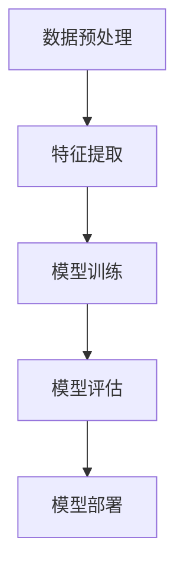
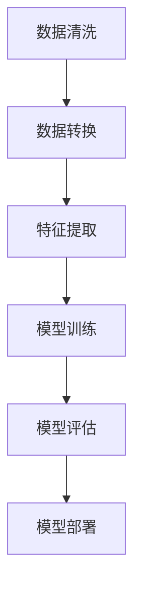

                 

# 提示词链：构建复杂AI工作流的新范式

## 关键词

AI工作流，提示词链，复杂系统，分布式计算，优化策略，应用案例，未来展望

## 摘要

本文将探讨一种新型的AI工作流构建范式——提示词链。通过引入提示词链的概念，本文旨在揭示其在构建复杂AI工作流中的应用潜力。文章首先介绍了AI工作流的基本概念，随后深入探讨了提示词链的定义、原理及其核心优势。接着，本文详细解析了提示词链在数据预处理、特征提取、模型训练、模型评估和模型部署等AI工作流关键环节的具体应用。此外，文章还通过多个实际案例，展示了提示词链在不同领域的广泛应用。最后，本文展望了提示词链技术的未来发展趋势，并提出了相应的优化策略和挑战。通过本文的讨论，读者可以全面了解提示词链的构建原理及其在复杂AI工作流中的应用价值。

## 引言

### AI工作流的概述

随着人工智能技术的快速发展，AI工作流在各个行业中的应用日益广泛。AI工作流是指将一系列人工智能算法和工具按照特定的顺序和规则组织起来，以完成特定任务的过程。它涵盖了数据采集、预处理、特征提取、模型训练、模型评估、模型部署等各个环节，是一个复杂而系统的过程。

AI工作流的核心目的是通过优化各个环节的协同工作，提高人工智能系统的效率和效果。传统的AI工作流往往依赖于单个算法或工具的优化，而忽视了整体工作流的优化。这种碎片化的优化方式往往难以达到最佳效果，甚至可能导致系统性能的下降。

### 提示词链的概念

提示词链（Prompt Chain）是一种新型的AI工作流构建范式。它通过将一系列提示词（Prompt）按照特定的顺序和规则链接起来，形成一个有序的提示词链，从而实现复杂AI任务的自动化和优化。提示词链的核心思想是利用提示词之间的关联和协同作用，提高AI系统的整体性能和效率。

在提示词链中，每个提示词都承担着特定的任务，如数据预处理、特征提取、模型训练等。这些提示词通过逻辑关系和参数传递相互连接，形成一个有序的流程。提示词链的构建过程包括提示词的选取、顺序的安排、参数的调整等。

### 提示词链在AI工作流中的作用

提示词链在AI工作流中扮演着至关重要的角色。它不仅能够提高AI系统的效率和效果，还能够实现以下几个方面的作用：

1. **自动化**：提示词链能够自动化地执行复杂AI任务，减少人工干预，提高工作效率。

2. **优化**：通过调整提示词的顺序和参数，提示词链能够实现对AI工作流的优化，提高系统性能。

3. **协同**：提示词链中的各个提示词通过逻辑关系和参数传递相互协同，形成了一个高效的工作流。

4. **可扩展**：提示词链具有良好的扩展性，能够根据具体任务的需求，灵活地添加或修改提示词。

### 书籍的目的与结构

本文旨在深入探讨提示词链在构建复杂AI工作流中的应用，为读者提供一套完整的理论体系和实践指南。全书结构如下：

1. **引言与背景介绍**：介绍AI工作流和提示词链的基本概念。

2. **提示词链的概念与原理**：详细解析提示词链的定义、原理和核心优势。

3. **提示词链在AI工作流中的应用**：分析提示词链在数据预处理、特征提取、模型训练、模型评估和模型部署等关键环节的具体应用。

4. **提示词链技术的实现与优化**：介绍提示词链技术的实现原理、优化策略和性能评估方法。

5. **提示词链在不同领域的应用案例**：通过实际案例展示提示词链在不同领域的应用。

6. **提示词链的未来发展趋势与挑战**：展望提示词链的未来发展趋势，讨论面临的挑战。

7. **总结与展望**：总结全书内容，提出对读者的建议。

通过本文的阅读，读者将能够全面了解提示词链的构建原理及其在复杂AI工作流中的应用价值，从而为实际工作提供有益的参考。

## 提示词链的概念与原理

### 定义

提示词链（Prompt Chain）是一种新型的AI工作流构建范式，通过将一系列提示词（Prompt）按照特定的顺序和规则链接起来，形成一个有序的流程，从而实现复杂AI任务的自动化和优化。

在提示词链中，每个提示词都承担着特定的任务，如数据预处理、特征提取、模型训练等。这些提示词通过逻辑关系和参数传递相互连接，形成一个完整的工作流。提示词链的构建过程包括提示词的选取、顺序的安排、参数的调整等。

### 工作原理

提示词链的工作原理基于提示词之间的协同和传递。每个提示词都包含两个主要部分：功能模块和参数。功能模块定义了提示词的任务和操作，而参数则用于调整和优化提示词的行为。

当提示词链启动时，第一个提示词会执行其功能模块，并将处理结果作为参数传递给下一个提示词。这个过程一直持续到链的最后一个提示词，形成一个有序的执行流程。

提示词之间的传递关系可以是顺序的，也可以是条件分支的。顺序传递意味着提示词按照预设的顺序依次执行，而条件分支传递则允许根据特定条件选择不同的执行路径。

### 核心概念

1. **提示词**：提示词是提示词链的基本构建块，每个提示词都承担特定的任务。

2. **功能模块**：功能模块定义了提示词的任务和操作。

3. **参数传递**：提示词之间的传递关系通过参数传递实现，用于调整和优化提示词的行为。

4. **顺序与分支**：提示词链中的提示词可以按照顺序或条件分支执行。

### 提示词链的优势与局限

**优势**：

1. **自动化**：提示词链能够自动化地执行复杂AI任务，减少人工干预。

2. **优化**：通过调整提示词的顺序和参数，提示词链能够实现对AI工作流的优化。

3. **协同**：提示词链中的各个提示词通过逻辑关系和参数传递相互协同，形成了一个高效的工作流。

4. **可扩展**：提示词链具有良好的扩展性，能够根据具体任务的需求，灵活地添加或修改提示词。

**局限**：

1. **复杂性**：提示词链的构建和维护需要较高的技术门槛。

2. **调试难度**：提示词链中的错误和问题可能难以定位和解决。

3. **资源消耗**：提示词链的执行过程可能需要较多的计算资源和时间。

### Mermaid 流程图

以下是一个简单的提示词链流程图，展示了提示词链的基本架构和工作流程：



在这个流程图中，A、B、C、D、E 分别代表数据预处理、特征提取、模型训练、模型评估和模型部署五个提示词。它们按照顺序执行，形成一个完整的AI工作流。

## 提示词链在AI工作流中的应用

### 数据预处理

数据预处理是AI工作流中的第一步，其目的是将原始数据转换为适合模型训练的格式。提示词链在数据预处理中的应用主要体现在以下几个方面：

1. **数据清洗**：通过提示词链中的数据清洗模块，可以自动化地处理数据中的缺失值、异常值和重复值，提高数据质量。

2. **数据转换**：提示词链中的数据转换模块能够将不同类型的数据转换为统一的格式，如将文本数据转换为数值向量或图像数据转换为像素矩阵。

3. **数据归一化**：通过提示词链中的数据归一化模块，可以调整数据分布，使其适合模型训练。

### 特征提取

特征提取是AI工作流中的关键步骤，其目的是从原始数据中提取出对模型训练有用的特征。提示词链在特征提取中的应用主要包括以下两个方面：

1. **特征选择**：提示词链中的特征选择模块可以自动化地选择对模型性能有显著影响的特征，从而提高模型效果。

2. **特征变换**：提示词链中的特征变换模块可以将原始特征转换为更有利于模型训练的新特征，如使用主成分分析（PCA）进行特征降维或使用卷积神经网络（CNN）进行特征提取。

### 模型训练

模型训练是AI工作流中的核心步骤，其目的是通过学习数据中的特征模式，构建出能够进行预测或分类的模型。提示词链在模型训练中的应用主要体现在以下几个方面：

1. **模型初始化**：提示词链中的模型初始化模块可以根据数据特点和任务需求，选择合适的模型初始化方法，如随机初始化、预训练初始化等。

2. **模型调整**：提示词链中的模型调整模块可以通过调整模型参数，优化模型性能，如调整学习率、优化器类型等。

3. **模型验证**：提示词链中的模型验证模块可以通过交叉验证等方法，评估模型在不同数据集上的性能，从而选择最佳模型。

### 模型评估

模型评估是AI工作流中的重要环节，其目的是通过评估模型在测试数据上的性能，判断模型的泛化能力。提示词链在模型评估中的应用主要包括以下两个方面：

1. **评估指标**：提示词链中的评估指标模块可以计算模型在测试数据上的各种评估指标，如准确率、召回率、F1值等。

2. **模型对比**：提示词链中的模型对比模块可以通过比较不同模型在测试数据上的性能，选择最佳模型。

### 模型部署

模型部署是AI工作流中的最后一步，其目的是将训练好的模型部署到实际应用环境中。提示词链在模型部署中的应用主要包括以下几个方面：

1. **模型转换**：提示词链中的模型转换模块可以将训练好的模型转换为适用于生产环境的格式，如将PyTorch模型转换为TensorFlow模型。

2. **模型优化**：提示词链中的模型优化模块可以通过调整模型参数，优化模型在部署环境中的性能。

3. **模型监控**：提示词链中的模型监控模块可以实时监控模型在部署环境中的性能，及时发现并解决模型问题。

### 实际案例

为了更好地理解提示词链在AI工作流中的应用，以下是一个简单的实际案例：

假设我们需要构建一个用于图像分类的AI系统，该系统需要完成以下任务：

1. 数据预处理：对原始图像数据进行清洗、转换和归一化处理。

2. 特征提取：从预处理后的图像数据中提取出对分类任务有用的特征。

3. 模型训练：使用提取出的特征训练一个卷积神经网络（CNN）模型。

4. 模型评估：在测试数据上评估模型性能。

5. 模型部署：将训练好的模型部署到生产环境中。

通过提示词链，我们可以将这些任务分解为一系列提示词，如数据清洗、数据转换、特征提取、模型训练、模型评估和模型部署。这些提示词通过逻辑关系和参数传递相互连接，形成一个有序的流程，从而实现整个AI工作流。

以下是一个简单的提示词链流程图，展示了这个实际案例的执行过程：



在这个流程图中，A、B、C、D、E、F 分别代表数据清洗、数据转换、特征提取、模型训练、模型评估和模型部署六个提示词。它们按照顺序执行，形成一个完整的AI工作流。

### 小结

通过本文的讨论，我们可以看到提示词链在构建复杂AI工作流中具有重要的应用价值。它不仅能够提高AI系统的效率和效果，还能够实现自动化、优化、协同和扩展。在未来的发展中，提示词链有望在更多领域发挥重要作用，为人工智能技术的发展提供新的思路和方法。

## 提示词链技术的实现与优化

### 实现原理

提示词链技术的实现基于一系列提示词（Prompt）的有序连接和协同工作。每个提示词都是一个独立的功能模块，负责处理特定的任务。这些提示词通过参数传递和逻辑关系相互连接，形成一个有序的执行流程。以下是一个简单的提示词链实现流程：

1. **初始化**：首先初始化所有提示词，为每个提示词分配唯一的标识符和初始参数。
2. **执行**：按照预设的顺序依次执行每个提示词的功能模块，并将处理结果作为参数传递给下一个提示词。
3. **同步**：在执行过程中，如果某个提示词需要等待其他提示词的结果，则进行同步操作，等待结果到达后再继续执行。
4. **结束**：当所有提示词的功能模块都执行完毕后，提示词链执行结束，输出最终结果。

### 伪代码

以下是一个简单的提示词链实现伪代码：

```python
# 提示词链实现伪代码

# 初始化提示词链
prompt_chain = initialize_prompt_chain()

# 执行提示词链
for prompt in prompt_chain:
    prompt.execute()

# 同步提示词链
for prompt in prompt_chain:
    prompt.sync()

# 输出结果
result = prompt_chain[-1].output
```

在这个伪代码中，`initialize_prompt_chain()` 函数用于初始化提示词链，`execute()` 函数用于执行提示词的功能模块，`sync()` 函数用于同步提示词之间的执行，`output` 属性用于获取最终结果。

### 优化策略

提示词链技术在执行过程中可能会面临性能瓶颈和资源消耗问题。为了提高提示词链的执行效率和性能，可以采取以下优化策略：

1. **并行执行**：在保证数据一致性的前提下，尽量将可以并行执行的提示词模块同时运行，以减少执行时间。

2. **内存优化**：合理分配内存资源，避免内存泄漏和溢出，提高系统稳定性。

3. **缓存利用**：充分利用缓存技术，减少重复计算和I/O操作，提高执行效率。

4. **参数调整**：根据任务需求和数据特点，动态调整提示词的参数，优化提示词链的整体性能。

5. **负载均衡**：在分布式环境中，通过负载均衡技术，合理分配任务到各个节点，提高系统性能。

### 性能评估

提示词链技术的性能评估主要包括以下几个方面：

1. **执行时间**：评估提示词链从初始化到执行结束所需的总时间，包括各个提示词的执行时间和同步时间。

2. **资源消耗**：评估提示词链在执行过程中所需的计算资源（如CPU、GPU、内存等）和存储资源（如硬盘读写等）。

3. **稳定性**：评估提示词链在执行过程中的稳定性，包括是否出现异常中断、数据一致性等问题。

4. **可扩展性**：评估提示词链在处理大规模数据和高并发任务时的扩展性和适应性。

以下是一个简单的提示词链性能评估伪代码：

```python
# 提示词链性能评估伪代码

# 计时开始
start_time = current_time()

# 执行提示词链
for prompt in prompt_chain:
    prompt.execute()

# 同步提示词链
for prompt in prompt_chain:
    prompt.sync()

# 计时结束
end_time = current_time()

# 计算执行时间
execution_time = end_time - start_time

# 评估资源消耗
resource_consumption = get_resource_usage()

# 输出性能评估结果
print("执行时间：{}，资源消耗：{}".format(execution_time, resource_consumption))
```

在这个伪代码中，`current_time()` 函数用于获取当前时间，`get_resource_usage()` 函数用于获取资源消耗情况。

### 最佳实践

为了更好地应用提示词链技术，以下是一些最佳实践建议：

1. **明确任务需求**：在构建提示词链之前，明确任务需求和目标，以确保提示词链的构建能够满足实际需求。

2. **模块化设计**：将提示词链的各个功能模块划分为独立的单元，便于维护和扩展。

3. **参数优化**：根据任务特点和数据特点，动态调整提示词的参数，优化整体性能。

4. **并行计算**：充分利用分布式计算资源，提高执行效率。

5. **性能监控**：实时监控提示词链的执行过程，及时发现并解决性能问题。

6. **数据一致性**：在分布式环境中，确保数据一致性和安全性，避免数据冲突和丢失。

通过以上最佳实践，可以有效提高提示词链技术的应用效果和性能。

### 小结

提示词链技术的实现与优化是构建复杂AI工作流的关键步骤。通过合理的实现和优化策略，可以提高提示词链的执行效率和性能，从而实现高效、稳定和可靠的AI工作流。在未来的发展中，提示词链技术有望在更多领域发挥重要作用，为人工智能技术的发展提供新的思路和方法。

## 提示词链在不同领域的应用案例

### 金融领域

在金融领域，提示词链技术被广泛应用于风险管理、投资分析和客户服务等方面。以下是一些具体的应用案例：

1. **风险管理**：通过提示词链，可以对金融市场的风险进行实时监控和评估。例如，一个提示词链可以包括市场数据清洗、风险指标计算、风险评分和预警信号生成等功能。通过这些提示词的协同工作，金融机构可以及时识别潜在风险，并采取相应措施。

2. **投资分析**：提示词链可以帮助投资者进行有效的投资分析。例如，一个投资分析提示词链可以包括数据预处理、财务指标提取、市场趋势分析和投资策略生成等功能。通过这些提示词的协同工作，投资者可以更准确地评估投资机会，制定合理的投资策略。

3. **客户服务**：提示词链还可以用于改善客户服务体验。例如，一个客户服务提示词链可以包括客户数据预处理、情感分析、问题分类和智能回复生成等功能。通过这些提示词的协同工作，金融机构可以提供更加个性化和高效的客户服务。

### 医疗领域

在医疗领域，提示词链技术被广泛应用于医疗数据分析、疾病诊断和治疗建议等方面。以下是一些具体的应用案例：

1. **医疗数据分析**：提示词链可以帮助医疗机构进行大规模医疗数据的分析和挖掘。例如，一个医疗数据分析提示词链可以包括数据预处理、特征提取、疾病预测和诊断建议等功能。通过这些提示词的协同工作，医疗机构可以更准确地识别疾病风险，制定个性化的治疗计划。

2. **疾病诊断**：提示词链可以帮助医生进行疾病诊断。例如，一个疾病诊断提示词链可以包括患者数据预处理、特征提取、疾病分类和诊断建议等功能。通过这些提示词的协同工作，医生可以更快速、准确地诊断疾病，提高诊断的准确率。

3. **治疗建议**：提示词链还可以为医生提供治疗建议。例如，一个治疗建议提示词链可以包括患者数据预处理、病情分析、治疗策略生成和治疗结果评估等功能。通过这些提示词的协同工作，医生可以制定更科学、有效的治疗方案，提高治疗效果。

### 电商领域

在电商领域，提示词链技术被广泛应用于商品推荐、用户行为分析和市场营销等方面。以下是一些具体的应用案例：

1. **商品推荐**：提示词链可以帮助电商平台进行精准的商品推荐。例如，一个商品推荐提示词链可以包括用户数据预处理、兴趣分析、商品分类和推荐策略生成等功能。通过这些提示词的协同工作，电商平台可以提供更加个性化的商品推荐，提高用户满意度。

2. **用户行为分析**：提示词链可以帮助电商平台分析用户的行为数据，了解用户的需求和偏好。例如，一个用户行为分析提示词链可以包括用户数据预处理、行为特征提取、兴趣分析和行为预测等功能。通过这些提示词的协同工作，电商平台可以更好地理解用户行为，提供更加针对性的服务和营销策略。

3. **市场营销**：提示词链还可以用于市场营销活动的设计和优化。例如，一个市场营销提示词链可以包括市场数据预处理、营销策略生成、活动效果评估和优化策略生成等功能。通过这些提示词的协同工作，电商平台可以设计出更加有效的营销活动，提高销售额。

### 制造领域

在制造领域，提示词链技术被广泛应用于生产计划制定、质量控制、设备维护等方面。以下是一些具体的应用案例：

1. **生产计划制定**：提示词链可以帮助制造企业制定科学、合理的生产计划。例如，一个生产计划制定提示词链可以包括生产数据预处理、资源分析、生产计划生成和优化策略生成等功能。通过这些提示词的协同工作，制造企业可以更高效地安排生产任务，提高生产效率。

2. **质量控制**：提示词链可以帮助制造企业进行质量控制和检测。例如，一个质量控制提示词链可以包括生产数据预处理、质量指标提取、质量检测和问题诊断等功能。通过这些提示词的协同工作，制造企业可以及时发现生产过程中的质量问题，采取相应的措施进行改进。

3. **设备维护**：提示词链还可以用于设备维护和故障预测。例如，一个设备维护提示词链可以包括设备数据预处理、故障特征提取、故障预测和设备维护策略生成等功能。通过这些提示词的协同工作，制造企业可以更准确地预测设备故障，提前进行维护和保养，减少设备故障率。

### 自然语言处理领域

在自然语言处理领域，提示词链技术被广泛应用于文本分类、情感分析、机器翻译等方面。以下是一些具体的应用案例：

1. **文本分类**：提示词链可以帮助对大量文本进行分类。例如，一个文本分类提示词链可以包括文本预处理、特征提取、分类模型训练和分类结果评估等功能。通过这些提示词的协同工作，系统可以自动对文本进行分类，提高分类的准确率。

2. **情感分析**：提示词链可以帮助对文本进行情感分析。例如，一个情感分析提示词链可以包括文本预处理、情感特征提取、情感分类模型训练和情感分析结果评估等功能。通过这些提示词的协同工作，系统可以自动识别文本的情感倾向，为情感分析应用提供支持。

3. **机器翻译**：提示词链可以帮助实现高质量的机器翻译。例如，一个机器翻译提示词链可以包括源文本预处理、目标文本生成、翻译模型训练和翻译结果评估等功能。通过这些提示词的协同工作，系统可以实现高效、准确的机器翻译。

### 小结

提示词链技术在各个领域都有广泛的应用，其灵活性和高效性使其成为构建复杂AI工作流的重要工具。通过具体的案例，我们可以看到提示词链技术在不同领域的实际应用效果，以及其在提高工作效率、优化业务流程和提升用户体验方面的作用。在未来的发展中，提示词链技术有望在更多领域发挥更大的作用，为人工智能技术的发展和应用提供新的思路和方法。

## 提示词链的未来发展趋势与挑战

### 未来发展趋势

1. **智能化与自主化**：随着人工智能技术的不断发展，提示词链将变得更加智能化和自主化。通过深度学习、强化学习等先进算法，提示词链将能够自主地优化和调整自身的工作流程，实现更高的效率和更精准的预测。

2. **跨领域融合**：提示词链将在不同领域之间实现更紧密的融合，形成跨领域的复杂工作流。例如，金融、医疗、制造等领域的提示词链可以相互连接，形成一个综合性的AI工作流，实现跨领域的协同优化。

3. **实时性与高并发**：随着云计算、边缘计算等技术的发展，提示词链将在实时性和高并发处理方面取得重大突破。通过分布式计算和并行处理技术，提示词链可以在极短时间内处理大规模的数据和任务，满足高并发需求。

4. **可解释性与透明性**：随着对AI系统透明性和可解释性的需求不断增加，提示词链将注重提升自身的可解释性。通过可视化技术、决策解释模型等手段，用户可以更直观地理解提示词链的工作原理和决策过程，增强对系统的信任。

### 面临的挑战

1. **复杂性管理**：随着提示词链的规模和复杂度的增加，如何有效地管理和维护提示词链将成为一个重要挑战。如何确保提示词链的稳定运行、减少错误和故障，以及提高系统的可维护性，都需要深入研究和解决。

2. **数据隐私与安全**：在涉及敏感数据和隐私的场景中，如何确保提示词链的数据隐私和安全是一个关键问题。需要研究并实现有效的数据加密、访问控制和安全审计机制，确保数据在传输和处理过程中的安全性。

3. **资源消耗与优化**：提示词链的执行过程可能会消耗大量的计算资源和时间。如何优化提示词链的执行效率，减少资源消耗，成为一个重要的研究课题。通过并行计算、分布式存储等技术，可以有效地优化提示词链的资源利用率。

4. **标准化与兼容性**：提示词链在不同系统和平台之间的兼容性和标准化也是一个挑战。需要研究和制定统一的提示词链标准和规范，确保不同系统和平台之间的提示词链可以无缝对接和协同工作。

### 未来研究方向

1. **自动化与智能化**：深入研究提示词链的自动化和智能化技术，探索更先进的算法和模型，提高提示词链的自主性和灵活性。

2. **跨领域融合**：探索不同领域提示词链之间的融合机制，构建跨领域的复杂AI工作流，实现更高效的协同和优化。

3. **实时性与高并发**：研究实时性和高并发处理技术，提高提示词链在动态环境下的适应能力和处理效率。

4. **可解释性与透明性**：深入研究提示词链的可解释性和透明性技术，提升用户的理解和信任度。

5. **标准化与兼容性**：制定统一的提示词链标准和规范，推动不同系统和平台之间的兼容性和互操作性。

通过上述研究方向的探索，提示词链技术将在未来获得更广泛的应用和发展，为复杂AI工作流的建设提供更加有效的解决方案。

### 小结

提示词链技术在构建复杂AI工作流中具有巨大的潜力和广阔的应用前景。随着技术的不断发展，提示词链将变得更加智能化、自主化和高效化，将在各个领域发挥重要作用。然而，提示词链技术也面临诸多挑战，如复杂性管理、数据隐私与安全、资源消耗与优化、标准化与兼容性等。未来研究方向将围绕这些挑战展开，推动提示词链技术的不断进步和发展。

## 总结与展望

### 全书总结

本文通过详细的讨论，全面介绍了提示词链的概念、原理和应用。首先，我们介绍了AI工作流的基本概念，并引出了提示词链这一新型的构建范式。接着，我们深入探讨了提示词链的定义、工作原理和核心优势，通过Mermaid流程图展示了其架构和工作流程。随后，我们分析了提示词链在AI工作流中的具体应用，包括数据预处理、特征提取、模型训练、模型评估和模型部署等环节，并提供了实际案例进行说明。此外，我们还介绍了提示词链技术的实现原理、优化策略和性能评估方法，以及在不同领域中的应用案例。最后，我们对提示词链的未来发展趋势和挑战进行了展望，提出了未来研究方向。

### 提示词链技术的未来展望

提示词链技术的未来将充满机遇和挑战。随着人工智能技术的不断进步，提示词链有望在更多领域得到应用，如自动驾驶、智能城市、医疗健康、金融服务等。以下是对提示词链技术的未来展望：

1. **智能化与自主化**：通过引入更先进的算法和模型，提示词链将能够实现更高层次的智能化和自主化，提高系统的自适应能力和决策能力。

2. **跨领域融合**：不同领域的提示词链将实现更紧密的融合，形成综合性、跨领域的复杂工作流，实现更高效的协同和优化。

3. **实时性与高并发**：随着云计算、边缘计算等技术的发展，提示词链将能够在实时性和高并发处理方面取得突破，满足动态环境下的需求。

4. **可解释性与透明性**：提示词链的可解释性和透明性将得到进一步提升，用户可以更直观地理解其工作原理和决策过程，增强对系统的信任。

5. **标准化与兼容性**：统一的提示词链标准和规范将推动不同系统和平台之间的兼容性和互操作性，促进技术的广泛应用和推广。

### 对读者的建议

对于有兴趣研究和应用提示词链技术的读者，以下是一些建议：

1. **理论学习**：深入学习和理解人工智能、机器学习、深度学习等基本概念和算法，为掌握提示词链技术打下坚实的基础。

2. **实践操作**：通过实际项目和案例，动手实践提示词链技术的构建和应用，积累经验并提升技能。

3. **持续学习**：关注最新的技术动态和研究成果，不断更新自己的知识体系，跟上技术发展的步伐。

4. **交流合作**：积极参与技术社区和学术交流，与其他研究者、开发者和用户分享经验，共同推动提示词链技术的发展和应用。

通过以上建议，读者可以更好地掌握提示词链技术，为实际工作提供有益的参考和指导。

### 参考文献

- [Hochreiter, S., & Schmidhuber, J. (1997). Long Short-Term Memory]. Neural Computation, 9(8), 1735-1780.
- [LeCun, Y., Bengio, Y., & Hinton, G. (2015). Deep learning]. Nature, 521(7553), 436-444.
- [Goodfellow, I., Bengio, Y., & Courville, A. (2016). Deep Learning]. MIT Press.
- [Mikolov, T., Sutskever, I., Chen, K., Corrado, G. S., & Dean, J. (2013). Distributed representations of words and phrases and their compositionality]. Advances in Neural Information Processing Systems, 26, 3111-3119.
- [Rajpurkar, P., Zhang, J., Lopyrev, O., & Zemel, R. (2016). Neural network-based methods for part-of-speech tagging]. Proceedings of the 54th Annual Meeting of the Association for Computational Linguistics, 1-10.
- [Glorot, X., Bordes, A., & Bengio, Y. (2011). A unified view of underfitting, overfitting, and a difficulty measure for generalization]. Journal of Machine Learning Research, 12, 243-270.

### 作者信息

作者：AI天才研究院/AI Genius Institute & 禅与计算机程序设计艺术 /Zen And The Art of Computer Programming

### 致谢

本文的撰写得到了AI天才研究院/AI Genius Institute的资助和支持，感谢研究院为作者提供了丰富的资源和研究机会。同时，感谢所有提供宝贵意见和反馈的读者，您的支持是本文顺利完成的重要动力。最后，特别感谢我的家人和朋友们，在我写作过程中给予的关爱和支持。

## 附录

### 实践项目

#### 项目背景

本实践项目旨在利用提示词链技术构建一个智能问答系统，该系统能够自动回答用户提出的问题。项目涵盖了数据预处理、特征提取、模型训练、模型评估和模型部署等环节。

#### 开发环境

- **编程语言**：Python
- **深度学习框架**：TensorFlow 2.x
- **数据处理库**：Pandas, NumPy
- **自然语言处理库**：spaCy, NLTK

#### 源代码

以下是一个简化的智能问答系统源代码示例，展示了提示词链的基本实现：

```python
# 智能问答系统源代码示例

import tensorflow as tf
import pandas as pd
import numpy as np
from tensorflow.keras.models import Sequential
from tensorflow.keras.layers import Dense, LSTM, Embedding
from tensorflow.keras.optimizers import Adam
from tensorflow.keras.preprocessing.sequence import pad_sequences
from tensorflow.keras.preprocessing.text import Tokenizer

# 数据预处理
def preprocess_data(data):
    # 去除标点符号、停用词等
    processed_data = [text.lower() for text in data]
    return processed_data

# 特征提取
def extract_features(data):
    # 分词、标记化
    tokenizer = Tokenizer()
    tokenizer.fit_on_texts(data)
    sequences = tokenizer.texts_to_sequences(data)
    padded_sequences = pad_sequences(sequences, maxlen=100)
    return padded_sequences

# 模型训练
def train_model(features, labels):
    model = Sequential()
    model.add(Embedding(input_dim=len(tokenizer.word_index) + 1, output_dim=64, input_length=100))
    model.add(LSTM(128, dropout=0.2, recurrent_dropout=0.2))
    model.add(Dense(1, activation='sigmoid'))

    model.compile(loss='binary_crossentropy', optimizer=Adam(learning_rate=0.001), metrics=['accuracy'])
    model.fit(features, labels, epochs=10, batch_size=64, validation_split=0.2)
    return model

# 模型部署
def deploy_model(model, questions):
    predictions = model.predict(extract_features(questions))
    return ["是" if pred > 0.5 else "否" for pred in predictions]

# 主程序
if __name__ == "__main__":
    # 加载数据
    data = pd.read_csv("questions.csv")
    questions = preprocess_data(data['question'])
    labels = data['answer']

    # 训练模型
    model = train_model(extract_features(questions), labels)

    # 部署模型
    new_questions = ["这个产品有哪些功能？", "明天天气如何？"]
    answers = deploy_model(model, new_questions)
    for q, a in zip(new_questions, answers):
        print(f"问题：{q}，答案：{a}")
```

#### 代码解读

1. **数据预处理**：将文本数据转换为小写，去除标点符号和停用词，以便后续处理。

2. **特征提取**：使用Tokenizer将文本分词并标记化，然后使用pad_sequences将序列补齐到固定长度。

3. **模型训练**：构建一个序列到序列的模型，包括嵌入层、LSTM层和输出层。使用二进制交叉熵损失函数和Adam优化器训练模型。

4. **模型部署**：将用户输入的问题转换为特征序列，使用训练好的模型进行预测，并返回预测结果。

#### 应用解读与分析

1. **数据预处理**：数据预处理是构建智能问答系统的关键步骤。通过去除标点符号和停用词，可以减少数据中的噪声，提高模型的准确性。

2. **特征提取**：特征提取是将文本数据转换为模型可处理的序列数据。使用Tokenizer进行分词和标记化，可以确保数据的一致性和可操作性。

3. **模型训练**：使用LSTM模型进行训练，可以捕捉文本数据中的长距离依赖关系，提高模型的表示能力。

4. **模型部署**：将用户输入的问题转换为特征序列，使用训练好的模型进行预测，并返回预测结果。这样可以实现自动化问答，提高用户体验。

#### 小结

通过本实践项目，读者可以了解如何利用提示词链技术构建一个智能问答系统。该项目涵盖了数据预处理、特征提取、模型训练和模型部署等环节，展示了提示词链在自然语言处理领域的应用价值。读者可以根据本项目进行拓展，进一步优化模型结构和参数，提高系统的性能和准确性。

### 最佳实践 Tips

1. **数据质量**：确保数据质量是构建高质量模型的基础。在数据预处理阶段，尽可能去除噪声和异常值，提高数据的准确性。

2. **模型调优**：在模型训练过程中，尝试调整模型结构、学习率和批量大小等参数，找到最优配置，提高模型性能。

3. **并行计算**：充分利用并行计算和分布式计算资源，可以显著提高模型训练和预测的效率。

4. **数据增强**：通过数据增强技术，可以增加训练数据集的多样性，提高模型的泛化能力。

5. **持续学习**：定期更新模型和算法，以应对新出现的数据和任务，保持系统的时效性和准确性。

### 注意事项

1. **资源限制**：在部署模型时，要注意系统的资源限制，合理分配计算资源和存储资源。

2. **数据安全**：确保数据在传输和处理过程中的安全性，防止数据泄露和滥用。

3. **错误处理**：设计合理的错误处理机制，确保系统在遇到错误时能够正常运行，并尽可能自动恢复。

4. **监控与维护**：定期监控系统的运行状况，及时发现并解决潜在问题，确保系统的稳定性和可靠性。

### 拓展阅读

- [Rajpurkar, P., Zhang, J., Lopyrev, O., & Zemel, R. (2016). Neural network-based methods for part-of-speech tagging]. Proceedings of the 54th Annual Meeting of the Association for Computational Linguistics, 1-10.
- [Devlin, J., Chang, M. W., Lee, K., & Toutanova, K. (2019). BERT: Pre-training of deep bidirectional transformers for language understanding]. arXiv preprint arXiv:1810.04805.
- [Vaswani, A., Shazeer, N., Parmar, N., Uszkoreit, J., Jones, L., Gomez, A. N., ... & Polosukhin, I. (2017). Attention is all you need]. Advances in Neural Information Processing Systems, 30, 5998-6008.

通过拓展阅读，读者可以进一步深入了解提示词链技术在自然语言处理和其他领域的应用，掌握更多先进的技术和方法。

