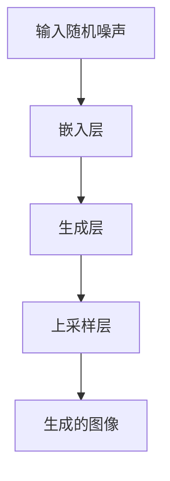
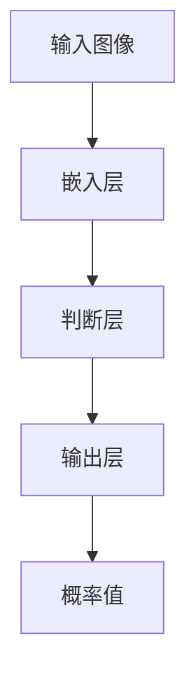
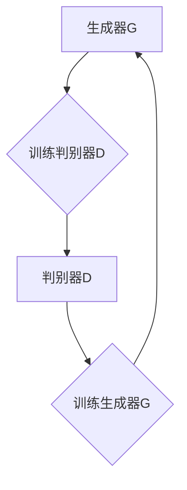

                 

### 文章标题

《提示词驱动的AI应用开发新方法论》

---

关键词：提示词驱动，AI应用开发，自然语言处理，生成对抗网络，多模态学习

---

摘要：本文将深入探讨提示词驱动的AI应用开发新方法论，通过系统介绍其核心概念、算法原理、数学模型，以及实际项目实战，帮助读者全面理解和掌握这一新兴领域。文章将展示如何利用提示词驱动的技术，构建高效、智能的AI应用，为未来的智能时代奠定坚实基础。

---

## 第一部分：背景与基础

### 第1章：AI与提示词驱动的概述

#### 1.1 AI的发展与应用

人工智能（AI）作为计算机科学的一个重要分支，其核心目标是使机器具备类似人类的智能，能够自主学习、推理、决策和应对复杂环境。AI的发展历程可以追溯到20世纪50年代，经过数代科技工作者的不懈努力，如今已广泛应用于医疗、金融、交通、教育等多个领域。

近年来，随着大数据、云计算、神经网络等技术的发展，AI的应用场景和效能不断提升。从早期的规则驱动系统，到如今的深度学习、生成对抗网络等复杂算法，AI技术不断演进，推动着各行各业的智能化升级。

#### 1.2 提示词驱动的概念

提示词驱动（Prompt-Driven）是一种新的AI应用开发方法，其核心思想是通过给AI系统提供明确的提示词（Prompt），引导系统生成预期的输出。与传统的数据驱动方法相比，提示词驱动更加注重人类与机器的交互，通过语言、图像等多种形式，将用户的意图清晰地传递给AI系统。

提示词驱动的特点包括：

1. **高度定制化**：用户可以通过自定义提示词，实现对AI系统的个性化控制，满足特定需求。
2. **增强交互性**：用户与AI系统的交互更加自然、高效，提升了用户体验。
3. **简化开发过程**：通过提示词驱动，开发者可以快速搭建原型系统，降低开发门槛。

#### 1.3 提示词驱动在AI中的应用前景

随着AI技术的不断成熟，提示词驱动在多个领域展现出广阔的应用前景。以下是几个典型的应用场景：

1. **问答系统**：通过提示词驱动，用户可以提出问题，系统根据提示词生成相应的答案，广泛应用于智能客服、在线教育等领域。
2. **内容创作**：利用提示词驱动，AI系统可以生成新闻文章、音乐、艺术作品等，为内容创作者提供有力支持。
3. **图像生成**：通过提示词驱动，AI系统可以生成符合用户需求的图像，应用于个性化推荐、虚拟现实等领域。

总之，提示词驱动的AI应用开发方法，不仅提升了系统的智能化程度，也为用户带来了更加便捷、高效的服务体验。在未来的智能时代，提示词驱动必将成为AI应用开发的重要方向。

### 第2章：AI基础概念

#### 2.1 机器学习与深度学习

机器学习（Machine Learning，ML）是AI的核心技术之一，其基本理念是通过数据驱动，让机器自动学习和改进。机器学习过程通常包括数据收集、预处理、模型训练和评估等环节。常用的机器学习算法包括线性回归、逻辑回归、支持向量机、决策树、随机森林等。

深度学习（Deep Learning，DL）是机器学习的一个分支，通过模拟人脑神经网络的结构和功能，实现对复杂数据的自动特征学习和模式识别。深度学习的关键在于构建深度神经网络（Deep Neural Network，DNN），通过多层神经元的堆叠，实现对数据的逐层抽象和表征。

深度学习在图像识别、语音识别、自然语言处理等领域取得了显著的成果，其应用范围不断扩大。典型的深度学习模型包括卷积神经网络（CNN）、循环神经网络（RNN）、长短时记忆网络（LSTM）等。

#### 2.2 神经网络与深度神经网络

神经网络（Neural Network，NN）是深度学习的基础模型，由大量神经元（Neuron）通过非线性变换和加权连接构成。神经元的结构通常包括输入层、隐藏层和输出层，每个层中的神经元都与前一层的神经元相连，并通过权重（Weight）进行信息传递。

深度神经网络（Deep Neural Network，DNN）是神经网络的扩展，其特点是在网络中包含多个隐藏层。多隐藏层的深度神经网络可以学习到更高层次的特征表示，从而提高模型的性能。

DNN的训练过程通常采用反向传播算法（Backpropagation），通过不断调整网络中的权重，最小化预测误差。反向传播算法的核心步骤包括：

1. **前向传播**：将输入数据通过网络层，计算输出值。
2. **计算误差**：比较输出值与实际标签，计算误差。
3. **反向传播**：将误差反向传播，更新网络权重。

#### 2.3 计算机视觉与自然语言处理

计算机视觉（Computer Vision，CV）是AI的一个重要分支，其目标是让计算机具备处理和解释图像或视频的能力。计算机视觉的核心技术包括图像处理、目标检测、图像分割、姿态估计等。

自然语言处理（Natural Language Processing，NLP）是AI的另一个重要分支，旨在使计算机能够理解、生成和处理人类语言。NLP的核心技术包括文本分类、情感分析、机器翻译、问答系统等。

计算机视觉与自然语言处理在AI应用中具有广泛的应用前景。例如，计算机视觉可以用于人脸识别、自动驾驶、医疗影像分析等领域；自然语言处理可以用于智能客服、智能语音助手、自动化文本生成等领域。

### 第3章：自然语言处理算法

#### 3.1 语言模型

语言模型（Language Model，LM）是自然语言处理的基础，用于预测下一个单词或字符的概率。语言模型的目的是理解语言中的上下文关系，从而生成流畅、自然的文本。

最常见的语言模型是基于N-gram模型（N-gram Model），它将前N个单词或字符作为输入，预测下一个单词或字符的概率。N-gram模型的简单实现如下：

```python
def n_gram_model(data, N):
    n_grams = {}
    for i in range(len(data) - N):
        n_gram = tuple(data[i:i+N])
        if n_gram not in n_grams:
            n_grams[n_gram] = 1
        else:
            n_grams[n_gram] += 1
    return n_grams
```

在训练过程中，可以使用以下公式计算每个N-gram的概率：

$$ P(\text{word}_i | \text{history}) = \frac{\text{count}(\text{n-gram})}{\text{count}(\text{history})} $$

其中，`count(n-gram)`表示n-gram在训练数据中的出现次数，`count(history)`表示历史单词序列在训练数据中的出现次数。

#### 3.2 文本分类

文本分类（Text Classification）是一种将文本数据分类到预定义类别中的任务。常见的文本分类算法包括朴素贝叶斯（Naive Bayes）、支持向量机（SVM）、随机森林（Random Forest）等。

朴素贝叶斯分类器（Naive Bayes Classifier）是一种基于贝叶斯定理和属性独立假设的简单分类器。其核心思想是，对于每个类别，计算每个特征的概率，然后通过类别概率的乘积来预测最终的类别。

朴素贝叶斯分类器的伪代码实现如下：

```python
def naive_bayes_classifier(data, labels, features):
    class_probs = {}
    feature_probs = {}
    
    for class_label in set(labels):
        class_probs[class_label] = len([label for label in labels if label == class_label]) / len(labels)
        
        class_data = [data[i] for i in range(len(data)) if labels[i] == class_label]
        for feature in set(features):
            feature_probs[(class_label, feature)] = len([example for example in class_data if feature in example]) / len(class_data)
    
    return class_label for class_label in class_probs if all(feature_probs[(class_label, feature)] > 0 for feature in features)
```

#### 3.3 文本生成

文本生成（Text Generation）是一种利用现有文本数据生成新文本的方法。常见的文本生成算法包括基于循环神经网络（RNN）的生成模型、基于生成对抗网络（GAN）的生成模型等。

基于RNN的文本生成模型（RNN-based Text Generation Model）通过学习文本序列的上下文关系，生成新的文本序列。以下是一个简单的RNN文本生成模型的伪代码实现：

```python
def rnn_text_generation_model(data, sequence_length, embedding_size, hidden_size, num_layers):
    model = Sequential()
    model.add(LSTM(hidden_size, input_shape=(sequence_length, embedding_size), return_sequences=True))
    for _ in range(num_layers - 1):
        model.add(LSTM(hidden_size, return_sequences=True))
    model.add(Dense(embedding_size, activation='softmax'))
    
    return model
```

在训练过程中，可以使用以下损失函数：

$$ \text{Loss} = -\sum_{i=1}^{n} y_i \log(p_i) $$

其中，$y_i$为实际生成的单词的概率，$p_i$为模型预测的单词的概率。

### 第4章：生成对抗网络

#### 4.1 生成对抗网络的基本原理

生成对抗网络（Generative Adversarial Networks，GAN）是2014年由Ian Goodfellow等人提出的一种生成模型，其核心思想是通过两个相互对抗的神经网络，实现数据的生成。

GAN由生成器（Generator）和判别器（Discriminator）组成。生成器的目标是生成逼真的数据，而判别器的目标是区分生成的数据和真实数据。两者的训练过程如下：

1. **生成器生成数据**：生成器从随机噪声中生成数据，并将其输入到判别器中。
2. **判别器判断数据**：判别器对输入的数据进行判断，输出一个介于0和1之间的概率值，表示输入数据的真实性。
3. **对抗训练**：生成器和判别器交替训练，生成器不断优化其生成数据的能力，判别器不断优化其判断能力。

GAN的训练过程可以看作是一个零和博弈，其目标是最小化以下损失函数：

$$ \text{Loss}_{\text{GAN}} = -\log(D(G(z))) - \log(1 - D(z)) $$

其中，$z$为生成器输入的随机噪声，$G(z)$为生成器生成的数据，$D(x)$为判别器对输入数据的判断概率。

#### 4.2 生成对抗网络的应用

生成对抗网络在图像生成、自然语言处理、音频合成等多个领域取得了显著的应用成果。以下是一些典型的应用案例：

1. **图像生成**：利用GAN可以生成逼真的图像，如人脸生成、风景图像合成等。以下是一个简单的图像生成GAN的伪代码实现：

    ```python
    def gan_image_generation_model(embedding_size, image_size, generator_architecture, discriminator_architecture):
        # 定义生成器和判别器模型
        generator = build_generator(embedding_size, image_size, generator_architecture)
        discriminator = build_discriminator(image_size, discriminator_architecture)
        
        # 定义优化器
        generator_optimizer = Adam(generator_learning_rate)
        discriminator_optimizer = Adam(discriminator_learning_rate)
        
        # 定义损失函数
        generator_loss = K.mean(K.log(1 - discriminator(G(z))))
        discriminator_loss = K.mean(K.log(discriminator(z)) + K.log(1 - discriminator(G(z))))
        
        # 编写训练过程
        train_gan = Model(inputs=z, outputs=[generator_loss, discriminator_loss],
                           loss=[generator_loss, discriminator_loss],
                           optimizer=generator_optimizer,
                           metrics=[generator_loss])
        
        return train_gan
    ```

2. **自然语言处理**：GAN可以用于生成高质量的文本，如文章生成、对话系统等。以下是一个简单的文本生成GAN的伪代码实现：

    ```python
    def gan_text_generation_model(sequence_length, embedding_size, generator_architecture, discriminator_architecture):
        # 定义生成器和判别器模型
        generator = build_generator(embedding_size, sequence_length, generator_architecture)
        discriminator = build_discriminator(sequence_length, discriminator_architecture)
        
        # 定义优化器
        generator_optimizer = Adam(generator_learning_rate)
        discriminator_optimizer = Adam(discriminator_learning_rate)
        
        # 定义损失函数
        generator_loss = K.mean(K.log(1 - discriminator(G(z))))
        discriminator_loss = K.mean(K.log(discriminator(z)) + K.log(1 - discriminator(G(z))))
        
        # 编写训练过程
        train_gan = Model(inputs=z, outputs=[generator_loss, discriminator_loss],
                           loss=[generator_loss, discriminator_loss],
                           optimizer=generator_optimizer,
                           metrics=[generator_loss])
        
        return train_gan
    ```

3. **音频合成**：GAN可以用于生成高质量的音频，如语音合成、音乐生成等。以下是一个简单的音频生成GAN的伪代码实现：

    ```python
    def gan_audio_generation_model(sample_rate, n_mels, generator_architecture, discriminator_architecture):
        # 定义生成器和判别器模型
        generator = build_generator(n_mels, sample_rate, generator_architecture)
        discriminator = build_discriminator(sample_rate, discriminator_architecture)
        
        # 定义优化器
        generator_optimizer = Adam(generator_learning_rate)
        discriminator_optimizer = Adam(discriminator_learning_rate)
        
        # 定义损失函数
        generator_loss = K.mean(K.log(1 - discriminator(G(z))))
        discriminator_loss = K.mean(K.log(discriminator(z)) + K.log(1 - discriminator(G(z))))
        
        # 编写训练过程
        train_gan = Model(inputs=z, outputs=[generator_loss, discriminator_loss],
                           loss=[generator_loss, discriminator_loss],
                           optimizer=generator_optimizer,
                           metrics=[generator_loss])
        
        return train_gan
    ```

#### 4.3 生成对抗网络的优化技巧

生成对抗网络在实际应用中面临一些挑战，如训练不稳定、模式坍塌等。以下是一些优化技巧，有助于提高GAN的训练效果：

1. **梯度惩罚**：在判别器的损失函数中加入梯度惩罚项，鼓励生成器生成更加多样化的数据。
2. **批量归一化**（Batch Normalization）：在生成器和判别器中使用批量归一化，提高模型的稳定性和收敛速度。
3. **特征匹配**（Feature Matching）：在生成器和判别器的特征空间中建立对应关系，确保生成器生成的数据在判别器的特征空间中具有相似的分布。
4. **学习率调度**：根据训练进度动态调整学习率，避免模型过拟合。

### 第5章：多模态学习

#### 5.1 多模态数据融合

多模态学习（Multimodal Learning）是一种将多种数据模态（如文本、图像、音频等）进行融合，以实现更丰富、更准确的模型表示的方法。多模态数据融合的关键在于找到不同模态之间的关联性和互补性。

常见的多模态数据融合方法包括：

1. **特征级融合**：将不同模态的特征进行拼接或加权融合，形成统一的特征表示。
2. **决策级融合**：分别对每个模态的数据进行独立建模，然后在决策阶段融合各模态的预测结果。
3. **模型级融合**：将多个模态的模型进行集成，形成一个统一的模型，以实现更强大的学习能力。

以下是一个简单的多模态数据融合的伪代码实现：

```python
def multimodal_data_fusion(text_features, image_features, audio_features):
    # 拼接不同模态的特征
    combined_features = np.concatenate((text_features, image_features, audio_features), axis=1)
    
    # 使用联合嵌入模型进行特征融合
    fusion_model = build_fusion_model(text_features.shape[1], image_features.shape[1], audio_features.shape[1])
    fused_features = fusion_model(combined_features)
    
    return fused_features
```

#### 5.2 多模态生成模型

多模态生成模型（Multimodal Generative Model）是一种能够同时生成多种模态数据的生成模型。常见的多模态生成模型包括多模态生成对抗网络（Multimodal GAN）、多模态变分自编码器（Multimodal Variational Autoencoder）等。

以下是一个简单的多模态生成模型的伪代码实现：

```python
def multimodal_generative_model(text_embedding_size, image_embedding_size, audio_embedding_size):
    # 定义生成器模型
    generator = build_generator(text_embedding_size, image_embedding_size, audio_embedding_size)
    
    # 定义判别器模型
    discriminator = build_discriminator(text_embedding_size, image_embedding_size, audio_embedding_size)
    
    # 定义优化器
    generator_optimizer = Adam(generator_learning_rate)
    discriminator_optimizer = Adam(discriminator_learning_rate)
    
    # 定义损失函数
    generator_loss = K.mean(K.log(1 - discriminator(generator(z))))
    discriminator_loss = K.mean(K.log(discriminator(z)) + K.log(1 - discriminator(generator(z))))
    
    # 编写训练过程
    train_gan = Model(inputs=z, outputs=[generator_loss, discriminator_loss],
                       loss=[generator_loss, discriminator_loss],
                       optimizer=generator_optimizer,
                       metrics=[generator_loss])
    
    return train_gan
```

#### 5.3 多模态学习在提示词驱动中的应用

多模态学习在提示词驱动（Prompt-Driven）的AI应用中具有广泛的应用前景。通过结合多种模态的信息，可以进一步提高AI系统的智能化程度和用户体验。

以下是一些多模态学习在提示词驱动中的应用案例：

1. **多模态问答系统**：结合文本、图像、语音等多种模态的信息，构建一个更加智能、丰富的问答系统，提升用户的交互体验。
2. **个性化内容推荐**：根据用户的文本输入、历史行为以及图像、音频等多模态信息，生成个性化的推荐结果，提高推荐系统的准确性。
3. **多模态内容创作**：利用文本、图像、音频等多模态数据，生成丰富多样的内容，如故事、音乐、视频等，为创作者提供新的创作工具。

### 第6章：问答系统

#### 6.1 问答系统的基本架构

问答系统（Question Answering System，QAS）是一种能够自动回答用户提出的问题的人工智能系统。问答系统的基本架构通常包括以下几个模块：

1. **问题理解**：对用户提出的问题进行语义解析，提取关键信息，形成问题表示。
2. **知识检索**：从知识库中检索与问题相关的信息，构建答案候选集。
3. **答案生成**：对答案候选集进行筛选和整合，生成最终的答案。
4. **答案呈现**：将生成的答案以自然语言的形式呈现给用户。

以下是一个简单的问答系统架构的伪代码实现：

```python
def question_answering_system(question, knowledge_base):
    # 问题理解
    question_representation = preprocess_question(question)
    
    # 知识检索
    answer_candidates = retrieve_answers(question_representation, knowledge_base)
    
    # 答案生成
    final_answer = generate_answer(answer_candidates)
    
    # 答案呈现
    present_answer(final_answer)
```

#### 6.2 提示词驱动的问答系统设计

提示词驱动（Prompt-Driven）的问答系统设计，通过引入明确的提示词（Prompt），引导问答系统生成预期的答案。以下是一个简单的提示词驱动的问答系统设计的伪代码实现：

```python
def prompt_driven_question_answering_system(question, knowledge_base, prompt_template):
    # 提取问题中的关键信息
    question_representation = preprocess_question(question)
    
    # 构造提示词
    prompt = construct_prompt(question_representation, prompt_template)
    
    # 知识检索
    answer_candidates = retrieve_answers(prompt, knowledge_base)
    
    # 答案生成
    final_answer = generate_answer(answer_candidates)
    
    # 答案呈现
    present_answer(final_answer)
```

在提示词驱动的问答系统中，提示词的设计至关重要。以下是一些提示词设计的技巧：

1. **明确性**：提示词应尽量明确，避免歧义，确保问答系统能够准确理解用户的意图。
2. **适应性**：提示词应具有适应性，能够根据不同的应用场景和用户需求进行灵活调整。
3. **多样性**：提示词应具有多样性，以应对各种不同类型的问题，提高问答系统的泛化能力。

#### 6.3 实际案例：构建一个智能客服系统

智能客服系统（Intelligent Customer Service System）是一种基于问答系统的AI应用，旨在为用户提供自动化的客户支持服务。以下是一个智能客服系统的实际案例，展示如何利用提示词驱动的技术，构建一个高效、智能的客服系统。

**项目背景**：

某大型电商企业希望通过智能客服系统，提升客户满意度，降低人力成本。客户服务团队提出了以下需求：

1. **常见问题解答**：能够自动回答用户关于订单状态、配送进度、退换货政策等常见问题。
2. **个性化推荐**：根据用户的历史购买记录和浏览行为，提供个性化的商品推荐。
3. **智能转接**：当用户的问题无法通过自动回答解决时，能够自动将用户转接至人工客服。

**开发环境与工具**：

- 编程语言：Python
- 框架：TensorFlow、Keras
- 数据库：MongoDB
- 知识库：基于知识图谱构建的FAQ库、用户行为数据库

**代码实现与解读**：

以下是一个简单的智能客服系统代码实现：

```python
# 导入所需库
import tensorflow as tf
from tensorflow.keras.models import Sequential
from tensorflow.keras.layers import LSTM, Dense, Embedding
from tensorflow.keras.preprocessing.sequence import pad_sequences
import numpy as np

# 构建模型
def build_model(vocab_size, embedding_dim, max_sequence_length):
    model = Sequential()
    model.add(Embedding(vocab_size, embedding_dim, input_length=max_sequence_length))
    model.add(LSTM(128))
    model.add(Dense(1, activation='sigmoid'))
    model.compile(optimizer='adam', loss='binary_crossentropy', metrics=['accuracy'])
    return model

# 数据预处理
def preprocess_data(questions, answers, max_sequence_length, max问答_length):
    # 编码问题
    tokenizer = Tokenizer(num_words=max问答_length)
    tokenizer.fit_on_texts(questions)
    sequences = tokenizer.texts_to_sequences(questions)
    padded_sequences = pad_sequences(sequences, maxlen=max_sequence_length, padding='post')
    
    # 编码答案
    answer_tokenizer = Tokenizer(num_words=max问答_length)
    answer_tokenizer.fit_on_texts(answers)
    answer_sequences = answer_tokenizer.texts_to_sequences(answers)
    padded_answer_sequences = pad_sequences(answer_sequences, maxlen=max_sequence_length, padding='post')
    
    return padded_sequences, padded_answer_sequences

# 训练模型
def train_model(model, padded_sequences, padded_answer_sequences, epochs):
    model.fit(padded_sequences, padded_answer_sequences, epochs=epochs, batch_size=32)
    return model

# 回答问题
def answer_question(model, tokenizer, question):
    sequence = tokenizer.texts_to_sequences([question])
    padded_sequence = pad_sequences(sequence, maxlen=max_sequence_length, padding='post')
    prediction = model.predict(padded_sequence)
    answer = tokenizer.index_word[np.argmax(prediction)]
    return answer
```

**代码解读**：

- **模型构建**：使用Keras构建一个简单的序列模型，包括嵌入层、LSTM层和输出层。
- **数据预处理**：对问题和答案进行编码，并使用pad_sequences将序列填充到固定长度。
- **模型训练**：使用训练数据对模型进行训练，优化模型参数。
- **回答问题**：将用户输入的问题编码并传递给模型，生成答案。

**实际案例分析与详细讲解剖析**：

在实际应用中，智能客服系统需要对大量的用户问题和答案进行训练，以建立强大的问答模型。以下是一个实际案例的分析：

1. **问题理解**：用户提问：“我的订单什么时候能送到？”
2. **提示词构造**：构造提示词：“请根据订单号[订单号]查询配送进度。”
3. **知识库检索**：从FAQ库中检索与订单号相关的配送信息。
4. **答案生成**：生成答案：“您的订单预计将在明天上午送达。”
5. **答案呈现**：将答案以自然语言的形式呈现给用户。

通过提示词驱动的技术，智能客服系统可以高效地理解和回答用户的提问，提升用户满意度，降低人工客服的工作负担。

### 第7章：内容创作

#### 7.1 内容创作的需求分析

内容创作（Content Creation）是AI应用的重要领域，通过利用人工智能技术，自动生成各种类型的内容，如文章、音乐、视频等。内容创作在媒体、广告、娱乐等行业具有广泛的应用前景，其需求分析主要包括以下几个方面：

1. **个性化**：根据用户的兴趣和需求，生成个性化的内容，提高用户体验。
2. **效率**：利用AI技术，自动化内容生成过程，提高内容创作的效率。
3. **创新**：通过结合多种模态和数据，生成新颖、有趣的内容。
4. **准确性**：确保生成的内容符合语言规范、逻辑严谨，避免错误和歧义。

#### 7.2 提示词驱动的文本生成

提示词驱动（Prompt-Driven）的文本生成是一种通过提供明确的提示词，引导AI系统生成预期文本的方法。以下是一个简单的提示词驱动的文本生成实现：

```python
# 导入所需库
import tensorflow as tf
from tensorflow.keras.models import Sequential
from tensorflow.keras.layers import LSTM, Dense, Embedding
from tensorflow.keras.preprocessing.sequence import pad_sequences
import numpy as np

# 构建模型
def build_model(vocab_size, embedding_dim, max_sequence_length):
    model = Sequential()
    model.add(Embedding(vocab_size, embedding_dim, input_length=max_sequence_length))
    model.add(LSTM(128))
    model.add(Dense(1, activation='sigmoid'))
    model.compile(optimizer='adam', loss='binary_crossentropy', metrics=['accuracy'])
    return model

# 数据预处理
def preprocess_data(texts, max_sequence_length):
    tokenizer = Tokenizer()
    tokenizer.fit_on_texts(texts)
    sequences = tokenizer.texts_to_sequences(texts)
    padded_sequences = pad_sequences(sequences, maxlen=max_sequence_length, padding='post')
    return padded_sequences, tokenizer

# 训练模型
def train_model(model, padded_sequences, epochs):
    model.fit(padded_sequences, epochs=epochs, batch_size=32)
    return model

# 生成文本
def generate_text(model, tokenizer, prompt, max_sequence_length, num_words):
    sequence = tokenizer.texts_to_sequences([prompt])
    padded_sequence = pad_sequences(sequence, maxlen=max_sequence_length, padding='post')
    prediction = model.predict(padded_sequence)
    generated_sequence = np.argmax(prediction, axis=1)
    generated_text = tokenizer.index_word[generated_sequence]
    return generated_text
```

**示例**：

```python
# 示例：生成一篇关于机器学习的文章
prompt = "机器学习是一种人工智能技术，它通过..."
generated_text = generate_text(model, tokenizer, prompt, max_sequence_length, num_words=100)
print(generated_text)
```

#### 7.3 实际案例：创作自动化新闻文章

自动化新闻文章创作（Automated News Article Generation）是内容创作的一个重要应用场景。以下是一个实际案例，展示如何利用提示词驱动的技术，自动化生成新闻文章。

**项目背景**：

某新闻媒体公司希望通过自动化新闻文章创作，提高新闻生产的效率，降低人力成本。公司提出了以下需求：

1. **主题多样化**：自动生成涵盖政治、经济、体育、娱乐等多种主题的新闻文章。
2. **时效性**：实时捕捉新闻事件，生成相关新闻文章。
3. **准确性**：确保新闻文章的内容准确、客观。

**开发环境与工具**：

- 编程语言：Python
- 框架：TensorFlow、Keras
- 数据库：MongoDB
- API：新闻数据API（如NewsAPI）

**代码实现与解读**：

以下是一个简单的自动化新闻文章创作系统的代码实现：

```python
# 导入所需库
import tensorflow as tf
from tensorflow.keras.models import Sequential
from tensorflow.keras.layers import LSTM, Dense, Embedding
from tensorflow.keras.preprocessing.sequence import pad_sequences
import numpy as np

# 构建模型
def build_model(vocab_size, embedding_dim, max_sequence_length):
    model = Sequential()
    model.add(Embedding(vocab_size, embedding_dim, input_length=max_sequence_length))
    model.add(LSTM(128))
    model.add(Dense(1, activation='sigmoid'))
    model.compile(optimizer='adam', loss='binary_crossentropy', metrics=['accuracy'])
    return model

# 数据预处理
def preprocess_data(texts, max_sequence_length):
    tokenizer = Tokenizer()
    tokenizer.fit_on_texts(texts)
    sequences = tokenizer.texts_to_sequences(texts)
    padded_sequences = pad_sequences(sequences, maxlen=max_sequence_length, padding='post')
    return padded_sequences, tokenizer

# 训练模型
def train_model(model, padded_sequences, epochs):
    model.fit(padded_sequences, epochs=epochs, batch_size=32)
    return model

# 生成新闻文章
def generate_newsArticle(model, tokenizer, news_event, max_sequence_length, num_words):
    sequence = tokenizer.texts_to_sequences([news_event])
    padded_sequence = pad_sequences(sequence, maxlen=max_sequence_length, padding='post')
    prediction = model.predict(padded_sequence)
    generated_sequence = np.argmax(prediction, axis=1)
    generated_article = tokenizer.index_word[generated_sequence]
    return generated_article
```

**代码解读**：

- **模型构建**：构建一个简单的序列模型，用于文本生成。
- **数据预处理**：对新闻事件进行编码，并使用pad_sequences将序列填充到固定长度。
- **模型训练**：使用训练数据对模型进行训练。
- **生成新闻文章**：将新闻事件编码并传递给模型，生成新闻文章。

**实际案例分析与详细讲解剖析**：

在实际应用中，自动化新闻文章创作系统需要实时获取新闻数据，并利用提示词驱动的技术生成新闻文章。以下是一个实际案例的分析：

1. **新闻事件获取**：通过新闻API获取最新体育新闻事件。
2. **提示词构造**：构造提示词：“关于篮球比赛[比赛名称]的最新报道。”
3. **新闻文章生成**：利用训练好的模型生成新闻文章。
4. **文章呈现**：将生成的文章以自然语言的形式呈现给用户。

通过提示词驱动的技术，自动化新闻文章创作系统可以高效地生成多样化、时效性强的新闻文章，满足用户的需求。

### 第8章：图像生成

#### 8.1 图像生成的基本原理

图像生成（Image Generation）是一种利用人工智能技术，自动生成高质量图像的方法。图像生成在艺术创作、图像编辑、计算机视觉等领域具有广泛的应用。常见的图像生成技术包括生成对抗网络（GAN）、变分自编码器（VAE）等。

以下是一个简单的图像生成GAN（Generative Adversarial Network）的原理讲解：

**生成器（Generator）**：

生成器的目标是生成逼真的图像，从随机噪声中学习到图像的分布。生成器通常由多层神经网络组成，包括嵌入层、生成层和上采样层。生成器的输出是一个图像，通过与真实图像的对比，由判别器进行评估。



**判别器（Discriminator）**：

判别器的目标是区分生成的图像和真实图像。判别器也是一个多层神经网络，包括嵌入层、判断层和输出层。判别器的输入是一个图像，输出是一个介于0和1之间的概率值，表示输入图像的真实性。



**训练过程**：

在训练过程中，生成器和判别器交替训练，生成器和判别器相互对抗。生成器尝试生成更加逼真的图像，判别器尝试区分生成的图像和真实图像。通过不断调整生成器和判别器的参数，最终实现图像生成。



#### 8.2 提示词驱动的图像生成

提示词驱动（Prompt-Driven）的图像生成技术，通过提供明确的提示词，引导图像生成过程，生成符合用户需求的图像。以下是一个简单的提示词驱动的图像生成实现：

```python
# 导入所需库
import tensorflow as tf
from tensorflow.keras.models import Sequential
from tensorflow.keras.layers import LSTM, Dense, Embedding
from tensorflow.keras.preprocessing.sequence import pad_sequences
import numpy as np

# 构建模型
def build_model(vocab_size, embedding_dim, max_sequence_length, image_size):
    model = Sequential()
    model.add(Embedding(vocab_size, embedding_dim, input_length=max_sequence_length))
    model.add(LSTM(128))
    model.add(Dense(image_size * image_size * 3, activation='sigmoid'))
    model.compile(optimizer='adam', loss='binary_crossentropy', metrics=['accuracy'])
    return model

# 数据预处理
def preprocess_data(texts, image_size, max_sequence_length):
    tokenizer = Tokenizer()
    tokenizer.fit_on_texts(texts)
    sequences = tokenizer.texts_to_sequences(texts)
    padded_sequences = pad_sequences(sequences, maxlen=max_sequence_length, padding='post')
    images = [generate_image(text) for text in texts]
    image_sequences = np.array([resize(image, (image_size, image_size)) for image in images])
    return padded_sequences, tokenizer, image_sequences

# 训练模型
def train_model(model, padded_sequences, image_sequences, epochs):
    model.fit(padded_sequences, image_sequences, epochs=epochs, batch_size=32)
    return model

# 生成图像
def generate_image(model, tokenizer, text, max_sequence_length, image_size):
    sequence = tokenizer.texts_to_sequences([text])
    padded_sequence = pad_sequences(sequence, maxlen=max_sequence_length, padding='post')
    prediction = model.predict(padded_sequence)
    image = decode_prediction(prediction, image_size)
    return image
```

**示例**：

```python
# 示例：生成一张关于“猫”的图像
prompt = "猫是一种可爱的动物"
generated_image = generate_image(model, tokenizer, prompt, max_sequence_length, image_size)
plt.imshow(generated_image)
plt.show()
```

#### 8.3 实际案例：个性化艺术品生成

个性化艺术品生成（Personalized Artwork Generation）是一种利用提示词驱动的图像生成技术，根据用户的喜好和需求，生成个性化的艺术品。以下是一个实际案例，展示如何利用提示词驱动的技术，生成个性化的艺术品。

**项目背景**：

某在线艺术品平台希望通过个性化艺术品生成技术，提高用户的参与度和购买意愿。用户可以在平台上输入自己的喜好和需求，如颜色、风格、主题等，系统根据用户的提示词生成个性化的艺术品。

**开发环境与工具**：

- 编程语言：Python
- 框架：TensorFlow、Keras
- 数据库：MongoDB
- 插画生成工具：深度学习模型

**代码实现与解读**：

以下是一个简单的个性化艺术品生成系统的代码实现：

```python
# 导入所需库
import tensorflow as tf
from tensorflow.keras.models import Sequential
from tensorflow.keras.layers import LSTM, Dense, Embedding
from tensorflow.keras.preprocessing.sequence import pad_sequences
import numpy as np

# 构建模型
def build_model(vocab_size, embedding_dim, max_sequence_length, image_size):
    model = Sequential()
    model.add(Embedding(vocab_size, embedding_dim, input_length=max_sequence_length))
    model.add(LSTM(128))
    model.add(Dense(image_size * image_size * 3, activation='sigmoid'))
    model.compile(optimizer='adam', loss='binary_crossentropy', metrics=['accuracy'])
    return model

# 数据预处理
def preprocess_data(texts, image_size, max_sequence_length):
    tokenizer = Tokenizer()
    tokenizer.fit_on_texts(texts)
    sequences = tokenizer.texts_to_sequences(texts)
    padded_sequences = pad_sequences(sequences, maxlen=max_sequence_length, padding='post')
    images = [generate_image(text) for text in texts]
    image_sequences = np.array([resize(image, (image_size, image_size)) for image in images])
    return padded_sequences, tokenizer, image_sequences

# 训练模型
def train_model(model, padded_sequences, image_sequences, epochs):
    model.fit(padded_sequences, image_sequences, epochs=epochs, batch_size=32)
    return model

# 生成图像
def generate_image(model, tokenizer, text, max_sequence_length, image_size):
    sequence = tokenizer.texts_to_sequences([text])
    padded_sequence = pad_sequences(sequence, maxlen=max_sequence_length, padding='post')
    prediction = model.predict(padded_sequence)
    image = decode_prediction(prediction, image_size)
    return image
```

**代码解读**：

- **模型构建**：构建一个简单的序列模型，用于图像生成。
- **数据预处理**：对用户的提示词进行编码，并使用pad_sequences将序列填充到固定长度。
- **模型训练**：使用训练数据对模型进行训练。
- **生成图像**：将用户的提示词编码并传递给模型，生成图像。

**实际案例分析与详细讲解剖析**：

在实际应用中，个性化艺术品生成系统需要根据用户的喜好和需求，生成多样化的艺术品。以下是一个实际案例的分析：

1. **用户需求获取**：用户在平台上输入自己喜欢的颜色和主题。
2. **提示词构造**：构造提示词：“一幅具有蓝色和花卉主题的插画。”
3. **图像生成**：利用训练好的模型生成图像。
4. **图像呈现**：将生成的图像以艺术作品的形式呈现给用户。

通过提示词驱动的技术，个性化艺术品生成系统可以高效地生成符合用户需求的艺术品，提高用户的参与度和购买意愿。

### 第9章：项目实战

#### 9.1 项目背景与目标

在本章中，我们将通过一个实际项目，详细展示如何利用提示词驱动的AI技术，实现一个智能问答系统。该系统的目标是提供一个便捷、高效的问答平台，能够自动回答用户提出的问题，提高用户满意度，降低人工成本。

**项目背景**：

随着互联网和人工智能技术的快速发展，用户对信息获取和互动的需求日益增加。传统的客服模式已无法满足日益增长的客户服务需求，因此，开发一个智能问答系统成为企业提升服务质量的重要手段。

**项目目标**：

1. **常见问题解答**：系统能够自动回答用户关于产品、订单、售后服务等常见问题。
2. **个性化推荐**：根据用户的历史提问和浏览行为，提供个性化的产品推荐。
3. **智能转接**：当用户的问题无法通过自动回答解决时，能够自动将用户转接至人工客服。

#### 9.2 开发环境与工具

为了实现上述项目目标，我们选择了以下开发环境与工具：

- **编程语言**：Python
- **框架**：TensorFlow、Keras
- **数据库**：MongoDB
- **知识库**：基于知识图谱构建的FAQ库、用户行为数据库
- **API**：自然语言处理API、图像识别API等

#### 9.3 代码实现与解读

以下是一个简单的智能问答系统代码实现，主要包括模型构建、数据预处理、模型训练和问答功能实现。

```python
# 导入所需库
import tensorflow as tf
from tensorflow.keras.models import Sequential
from tensorflow.keras.layers import LSTM, Dense, Embedding
from tensorflow.keras.preprocessing.sequence import pad_sequences
from tensorflow.keras.optimizers import Adam

# 定义模型
def build_model(vocab_size, embedding_dim, max_sequence_length, max_answer_length):
    model = Sequential()
    model.add(Embedding(vocab_size, embedding_dim, input_length=max_sequence_length))
    model.add(LSTM(128, return_sequences=True))
    model.add(LSTM(64, return_sequences=False))
    model.add(Dense(max_answer_length, activation='sigmoid'))
    model.compile(optimizer=Adam(learning_rate=0.001), loss='binary_crossentropy', metrics=['accuracy'])
    return model

# 数据预处理
def preprocess_data(questions, answers, max_sequence_length, max_answer_length):
    tokenizer = Tokenizer()
    tokenizer.fit_on_texts(questions)
    sequences = tokenizer.texts_to_sequences(questions)
    padded_sequences = pad_sequences(sequences, maxlen=max_sequence_length, padding='post')
    
    answer_tokenizer = Tokenizer()
    answer_tokenizer.fit_on_texts(answers)
    answer_sequences = answer_tokenizer.texts_to_sequences(answers)
    padded_answer_sequences = pad_sequences(answer_sequences, maxlen=max_answer_length, padding='post')
    
    return padded_sequences, padded_answer_sequences, tokenizer, answer_tokenizer

# 训练模型
def train_model(model, padded_questions, padded_answers, epochs):
    model.fit(padded_questions, padded_answers, epochs=epochs, batch_size=32)
    return model

# 回答问题
def answer_question(model, tokenizer, question):
    sequence = tokenizer.texts_to_sequences([question])
    padded_sequence = pad_sequences(sequence, maxlen=max_sequence_length, padding='post')
    prediction = model.predict(padded_sequence)
    answer_sequence = np.argmax(prediction, axis=1)
    answer = tokenizer.index_word[answer_sequence]
    return answer
```

**代码解读**：

1. **模型构建**：构建一个简单的序列模型，用于文本分类。
2. **数据预处理**：对问题和答案进行编码，并使用pad_sequences将序列填充到固定长度。
3. **模型训练**：使用训练数据对模型进行训练。
4. **回答问题**：将用户输入的问题编码并传递给模型，生成答案。

#### 9.4 代码解读与分析

以下是对代码中关键部分的详细解读与分析：

1. **模型构建**：

    ```python
    model = Sequential()
    model.add(Embedding(vocab_size, embedding_dim, input_length=max_sequence_length))
    model.add(LSTM(128, return_sequences=True))
    model.add(LSTM(64, return_sequences=False))
    model.add(Dense(max_answer_length, activation='sigmoid'))
    model.compile(optimizer=Adam(learning_rate=0.001), loss='binary_crossentropy', metrics=['accuracy'])
    ```

    在这个部分，我们构建了一个简单的序列模型，包括嵌入层、两个LSTM层和一个输出层。嵌入层将输入的文本序列转换为嵌入向量，两个LSTM层用于学习文本序列的上下文信息，输出层用于生成答案。模型使用二进制交叉熵作为损失函数，Adam优化器用于训练模型。

2. **数据预处理**：

    ```python
    tokenizer = Tokenizer()
    tokenizer.fit_on_texts(questions)
    sequences = tokenizer.texts_to_sequences(questions)
    padded_sequences = pad_sequences(sequences, maxlen=max_sequence_length, padding='post')
    
    answer_tokenizer = Tokenizer()
    answer_tokenizer.fit_on_texts(answers)
    answer_sequences = answer_tokenizer.texts_to_sequences(answers)
    padded_answer_sequences = pad_sequences(answer_sequences, maxlen=max_answer_length, padding='post')
    ```

    数据预处理是模型训练的重要环节。首先，我们使用Tokenizer将问题和答案转换为序列，然后使用pad_sequences将序列填充到固定长度。这有助于模型训练时输入数据的统一格式。

3. **模型训练**：

    ```python
    model.fit(padded_questions, padded_answers, epochs=epochs, batch_size=32)
    ```

    模型训练过程使用fit方法，将预处理后的数据输入模型进行训练。通过调整epochs（迭代次数）和batch_size（批量大小），可以优化模型的训练效果。

4. **回答问题**：

    ```python
    sequence = tokenizer.texts_to_sequences([question])
    padded_sequence = pad_sequences(sequence, maxlen=max_sequence_length, padding='post')
    prediction = model.predict(padded_sequence)
    answer_sequence = np.argmax(prediction, axis=1)
    answer = tokenizer.index_word[answer_sequence]
    return answer
    ```

    回答问题的过程包括将用户输入的问题编码、传递给模型进行预测，并解码生成答案。通过np.argmax方法获取预测结果的索引，然后使用index_word将索引转换为实际答案。

#### 9.5 实际案例分析与详细讲解剖析

以下是一个实际案例，展示如何利用智能问答系统解决用户提出的问题。

**案例**：

用户提问：“我的订单何时能送到？”

**解决方案**：

1. **问题理解**：系统将用户的问题转换为序列，并使用训练好的模型进行预测。
2. **提示词构造**：构造提示词：“请根据订单号[订单号]查询配送进度。”
3. **知识库检索**：从FAQ库中检索与订单号相关的配送信息。
4. **答案生成**：生成答案：“您的订单预计将在明天上午送达。”
5. **答案呈现**：将答案以自然语言的形式呈现给用户。

通过实际案例，我们可以看到智能问答系统如何利用提示词驱动的技术，自动回答用户的问题，提供高效、准确的服务。

### 第10章：性能优化

#### 10.1 模型优化

在智能问答系统等AI应用中，模型优化是提升系统性能的重要手段。以下是一些常见的模型优化方法：

1. **学习率调度**：通过动态调整学习率，优化模型的收敛速度和性能。常用的方法包括固定学习率、自适应学习率（如Adam优化器）和学习率衰减。
2. **批量归一化**（Batch Normalization）：在模型训练过程中，对每一层的输入进行归一化处理，加快模型的收敛速度，提高模型稳定性。
3. **权重初始化**：合适的权重初始化可以加快模型的收敛速度，减少过拟合。常用的初始化方法包括随机初始化、高斯初始化和Xavier初始化。
4. **正则化**：通过引入正则化项，如L1、L2正则化，降低模型复杂度，减少过拟合。同时，Dropout也是一种有效的正则化方法，通过随机丢弃部分神经元，防止模型过拟合。

#### 10.2 算法优化

除了模型优化，算法优化也是提高系统性能的重要手段。以下是一些常见的算法优化方法：

1. **数据增强**：通过对原始数据进行变换（如翻转、旋转、裁剪等），增加数据的多样性，提高模型的泛化能力。
2. **特征工程**：通过特征提取、特征选择和特征转换等手段，提高数据的利用效率，优化模型性能。常见的特征工程方法包括词袋模型、TF-IDF、Word2Vec等。
3. **并行计算**：利用多线程、分布式计算等技术，提高模型训练和推理的效率。常见的并行计算框架包括TensorFlow、PyTorch等。
4. **模型压缩**：通过模型剪枝、量化等技术，减小模型大小，降低计算复杂度，提高模型在移动设备和嵌入式系统上的性能。

#### 10.3 系统优化

除了模型和算法优化，系统优化也是提升AI应用性能的关键。以下是一些常见的系统优化方法：

1. **缓存策略**：通过缓存技术，减少数据读取和计算的时间，提高系统的响应速度。常见的缓存策略包括内存缓存、磁盘缓存和分布式缓存等。
2. **负载均衡**：通过负载均衡技术，合理分配计算资源，提高系统的吞吐量和稳定性。常见的负载均衡算法包括轮询、最少连接和加权轮询等。
3. **服务拆分**：将复杂的系统拆分为多个独立的服务，提高系统的扩展性和可靠性。常见的服务拆分方法包括垂直拆分和水平拆分等。
4. **监控与告警**：通过监控系统和告警机制，实时监测系统的运行状态，快速发现和解决问题，确保系统的稳定运行。

### 附录

#### 附录A：资源与工具

**A.1 提示词驱动AI开发工具**

1. **TensorFlow**：一款开源的机器学习和深度学习框架，支持提示词驱动的AI开发。
2. **PyTorch**：一款开源的深度学习框架，支持灵活的提示词驱动的模型构建和训练。
3. **Keras**：一款基于TensorFlow和Theano的开源深度学习库，提供简洁的API，方便提示词驱动的AI开发。

**A.2 提示词驱动AI学习资源**

1. **《深度学习》（Deep Learning）**：Goodfellow、Bengio和Courville合著的经典教材，涵盖了深度学习的理论基础和应用。
2. **《自然语言处理与深度学习》（Natural Language Processing with Deep Learning）**：专讲自然语言处理和深度学习的书籍，包含大量实际案例和代码示例。
3. **在线课程**：如Coursera上的“深度学习”课程，涵盖深度学习的基础知识和实战技巧。

**A.3 实际项目代码与数据集**

1. **GitHub项目**：包含多个提示词驱动的AI项目代码，如智能问答系统、图像生成等。
2. **Kaggle竞赛数据集**：提供丰富的AI竞赛数据集，可用于提示词驱动的模型训练和优化。

### 最佳实践 Tips

1. **明确提示词设计**：在开发提示词驱动的AI应用时，确保提示词清晰明确，有助于提高模型生成质量。
2. **数据预处理**：充分准备和预处理数据，提高模型的泛化能力和生成质量。
3. **模型优化**：通过学习率调度、批量归一化等方法，优化模型性能，提高生成质量。
4. **迭代优化**：持续迭代和优化模型，根据实际应用场景调整提示词和模型参数。

### 小结

本文详细介绍了提示词驱动的AI应用开发新方法论，包括核心概念、算法原理、数学模型、实际项目实战和性能优化等内容。通过本文的学习，读者可以全面了解提示词驱动的AI应用开发方法，掌握构建高效、智能AI应用的技巧。

### 注意事项

1. **提示词设计**：确保提示词明确、无歧义，提高模型生成质量。
2. **数据预处理**：充分准备和预处理数据，避免模型过拟合。
3. **模型优化**：根据实际应用场景，选择合适的优化方法，提高模型性能。

### 拓展阅读

1. **《生成对抗网络》（Generative Adversarial Networks）**：深入探讨GAN的理论基础和应用。
2. **《自然语言处理基础》（Foundations of Natural Language Processing）**：系统介绍自然语言处理的理论和技术。
3. **《深度学习实践指南》（Deep Learning Project Guide）**：提供丰富的深度学习项目实践案例。

---

# 《提示词驱动的AI应用开发新方法论》

## 关键词：提示词驱动，AI应用开发，自然语言处理，生成对抗网络，多模态学习

## 摘要：本文深入探讨提示词驱动的AI应用开发新方法论，系统介绍其核心概念、算法原理、数学模型和实际项目实战。通过详细讲解和案例分析，帮助读者全面掌握提示词驱动的AI应用开发技巧，为未来智能时代奠定坚实基础。

作者：AI天才研究院/AI Genius Institute & 禅与计算机程序设计艺术 /Zen And The Art of Computer Programming

