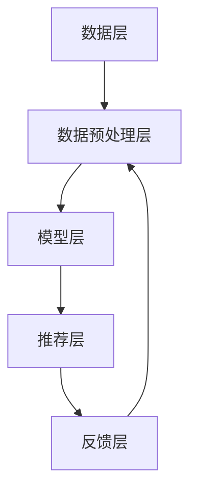

                 


# 提示词驱动的个性化推荐系统设计

> 关键词：个性化推荐，提示词，机器学习，数据挖掘，系统设计

> 摘要：本文将探讨提示词驱动的个性化推荐系统设计。通过分析推荐系统的基本概念、个性化推荐的技术原理，深入讲解提示词的生成和应用，最后讨论推荐系统的评估与优化策略。本文旨在为开发者提供一整套完整的个性化推荐系统设计思路和实现方法。

## 目录

### 1. 背景介绍

#### 1.1 推荐系统的概念与作用

#### 1.2 个性化推荐的重要性

#### 1.3 提示词驱动的推荐系统

### 2. 核心概念与联系

#### 2.1 个性化推荐系统的工作原理

#### 2.2 提示词生成的技术

#### 2.3 提示词与用户兴趣的关系

### 3. 核心算法原理讲解

#### 3.1 基于内容的推荐算法

#### 3.2 协同过滤推荐算法

#### 3.3 深度学习在推荐系统中的应用

### 4. 数学模型与公式

#### 4.1 用户兴趣模型的构建

#### 4.2 推荐算法的数学原理

#### 4.3 提示词驱动的推荐模型

### 5. 项目实战

#### 5.1 开发环境搭建

#### 5.2 源代码详细实现

#### 5.3 代码解读与应用

#### 5.4 实际案例分析与剖析

### 6. 评估与优化策略

#### 6.1 推荐效果的评估指标

#### 6.2 优化策略与技巧

#### 6.3 持续改进与优化

### 7. 最佳实践与拓展

#### 7.1 最佳实践 tips

#### 7.2 小结与注意事项

#### 7.3 拓展阅读

## 1. 背景介绍

### 1.1 推荐系统的概念与作用

推荐系统是一种根据用户历史行为、兴趣偏好等信息，利用算法技术为用户推荐感兴趣的内容或商品的系统。在互联网时代，推荐系统已经成为了许多在线平台的核心功能，如电商平台、视频网站、社交媒体等。

推荐系统的作用主要体现在以下几个方面：

1. **提升用户体验**：通过个性化推荐，用户可以更快地找到自己感兴趣的内容，节省了筛选时间。
2. **增加平台粘性**：推荐系统能够持续吸引用户关注，提升用户在平台上的活跃度。
3. **提升商业价值**：推荐系统可以帮助平台更好地了解用户需求，提高商品转化率，增加收益。

### 1.2 个性化推荐的重要性

个性化推荐系统在现代社会的重要性日益凸显，主要体现在以下几个方面：

1. **信息过载的解决方案**：随着互联网信息的爆炸式增长，用户面临着大量的信息选择困难，个性化推荐系统能够帮助用户从海量信息中快速筛选出感兴趣的内容。
2. **用户满意度的提升**：个性化推荐系统能够更好地满足用户需求，提高用户满意度，从而增强用户对平台的忠诚度。
3. **商业价值的最大化**：通过个性化推荐，平台可以更精准地推送商品或内容，提高转化率，实现商业价值的最大化。

### 1.3 提示词驱动的推荐系统

提示词驱动的个性化推荐系统是一种基于用户输入的提示词来生成推荐列表的系统。与传统推荐系统相比，提示词驱动的系统具有以下优势：

1. **更精准的推荐**：通过用户输入的提示词，系统能够更准确地理解用户的需求，生成更符合用户兴趣的推荐列表。
2. **更好的用户体验**：用户可以通过简单的关键词输入，快速获得个性化推荐，提升了用户体验。
3. **更灵活的扩展性**：提示词驱动的系统可以根据不同的业务需求，灵活地调整和优化推荐策略。

在接下来的章节中，我们将深入探讨个性化推荐系统的核心概念、算法原理、数学模型以及实际应用案例。通过这些内容的讲解，我们将为读者提供一套完整的提示词驱动个性化推荐系统设计思路和实现方法。## 2. 核心概念与联系

### 2.1 个性化推荐系统的工作原理

个性化推荐系统的工作原理主要涉及以下几个方面：

1. **用户建模**：通过对用户历史行为和兴趣数据进行分析，构建用户兴趣模型。用户建模是推荐系统的核心，其质量直接影响到推荐效果。
2. **内容建模**：对推荐系统中的商品、内容等进行特征提取，构建内容模型。内容模型用于描述不同商品或内容的特点，以便更好地进行推荐。
3. **推荐生成**：根据用户兴趣模型和内容模型，生成个性化的推荐列表。推荐生成是推荐系统的最终目标，其质量直接决定了用户满意度。
4. **反馈循环**：通过用户对推荐内容的反馈，不断优化用户兴趣模型和内容模型，提高推荐系统的准确性和效果。

### 2.2 提示词生成的技术

提示词生成的技术主要包括以下几种方法：

1. **关键词提取**：通过自然语言处理技术，从用户输入的文本中提取关键词。关键词提取是提示词生成的基础，常用的方法包括TF-IDF、Word2Vec等。
2. **词嵌入**：将文本中的词语转换为向量的表示，以便更好地进行计算和匹配。词嵌入技术如Word2Vec、GloVe等，已经在许多自然语言处理任务中取得了显著的成果。
3. **聚类分析**：通过聚类算法，将具有相似特征的词语聚集在一起，生成提示词集合。常用的聚类算法包括K-means、DBSCAN等。

### 2.3 提示词与用户兴趣的关系

提示词与用户兴趣之间存在密切的关系，主要体现在以下几个方面：

1. **提示词反映了用户的当前兴趣**：用户输入的提示词通常是他们当前关注的主题或内容，因此，通过分析提示词可以快速获取用户的兴趣点。
2. **提示词用于修正用户兴趣模型**：当用户兴趣发生变化时，提示词可以作为修正信号，帮助系统更新用户兴趣模型，从而生成更准确的推荐。
3. **提示词用于生成个性化推荐**：通过将提示词与内容模型进行匹配，可以生成与用户兴趣高度相关的推荐列表，提升用户体验。

### 2.4 个性化推荐系统的架构

个性化推荐系统的架构主要包括以下几部分：

1. **数据层**：负责存储用户行为数据、商品内容数据等原始数据。常用的数据存储技术包括关系型数据库、NoSQL数据库等。
2. **数据预处理层**：负责对原始数据进行清洗、转换和特征提取，生成用户兴趣模型和内容模型。数据预处理是推荐系统的重要组成部分，其质量直接影响到推荐效果。
3. **模型层**：负责构建用户兴趣模型、内容模型和推荐模型。模型层是推荐系统的核心，其性能和效果决定了推荐系统的质量。
4. **推荐层**：根据用户兴趣模型和内容模型，生成个性化的推荐列表。推荐层是推荐系统的最终输出，其质量直接决定了用户体验。
5. **反馈层**：负责收集用户对推荐内容的反馈，用于优化用户兴趣模型和推荐模型。反馈层是推荐系统的持续改进机制，有助于不断提升推荐效果。

### 2.5 Mermaid 流程图

以下是一个简单的Mermaid流程图，展示了个性化推荐系统的工作流程：



这个流程图清晰地展示了个性化推荐系统从数据层到推荐层的整个工作过程，以及各个层次之间的相互作用。通过这个流程图，我们可以更好地理解个性化推荐系统的核心概念和工作原理。## 3. 核心算法原理讲解

### 3.1 基于内容的推荐算法

基于内容的推荐算法（Content-Based Recommendation）是一种通过分析推荐对象（如商品、文章、音乐等）的内容特征来生成推荐列表的方法。其核心思想是“物以类聚”，即相似的物品会吸引相似的偏好用户。

**算法原理**：

1. **内容特征提取**：首先，从每个推荐对象中提取一系列的特征，这些特征可以是文本、图像、音频等。对于文本，常用的特征提取方法包括TF-IDF、Word2Vec等。
2. **计算相似度**：然后，计算用户已评价的物品与其潜在推荐物品之间的相似度。相似度计算可以采用余弦相似度、欧氏距离等度量方法。
3. **生成推荐列表**：最后，根据相似度分数，生成个性化的推荐列表。

**伪代码**：

```python
def content_based_recommendation(user_profile, items):
    item_profiles = extract_item_features(items)
    user_item_similarity = []
    for item in items:
        similarity = calculate_similarity(user_profile, item_profiles[item])
        user_item_similarity.append(similarity)
    recommended_items = rank_items_by_similarity(user_item_similarity)
    return recommended_items
```

### 3.2 协同过滤推荐算法

协同过滤推荐算法（Collaborative Filtering）是一种通过分析用户的历史行为数据来生成推荐列表的方法。其核心思想是“人以群分”，即具有相似行为的用户会喜欢相似的物品。

**算法原理**：

1. **用户-物品评分矩阵**：首先，构建一个用户-物品评分矩阵，其中每个元素表示用户对特定物品的评分。
2. **用户相似度计算**：然后，计算用户之间的相似度。常用的相似度计算方法包括余弦相似度、皮尔逊相关系数等。
3. **物品相似度计算**：同时，也可以计算物品之间的相似度，以帮助用户发现他们可能感兴趣的未评分物品。
4. **生成推荐列表**：最后，根据用户相似度和物品相似度，生成个性化的推荐列表。

**协同过滤分为两大类：**

1. **基于用户的协同过滤（User-Based Collaborative Filtering）**：
   ```python
   def user_based_collaborative_filtering(user, items, similarity_measure):
       similar_users = find_similar_users(user, items, similarity_measure)
       user_item_similarity = calculate_user_item_similarity(similar_users, items)
       recommended_items = rank_items_by_similarity(user_item_similarity)
       return recommended_items
   ```

2. **基于模型的协同过滤（Model-Based Collaborative Filtering）**：
   ```python
   def model_based_collaborative_filtering(user, items, model):
       user_ratings = user_ratings_matrix[user]
       predicted_ratings = model.predict(user_ratings)
       recommended_items = rank_items_by_predictions(predicted_ratings)
       return recommended_items
   ```

### 3.3 深度学习在推荐系统中的应用

随着深度学习技术的发展，越来越多的研究者开始尝试将其应用于推荐系统。深度学习在推荐系统中的应用主要包括以下几个方面：

1. **用户兴趣建模**：通过深度神经网络，可以从用户历史行为数据中提取高级特征，构建用户兴趣模型。常用的模型包括卷积神经网络（CNN）、循环神经网络（RNN）等。
2. **内容特征提取**：利用深度学习模型，可以自动从文本、图像、音频等数据中提取丰富的特征，提高推荐系统的准确性。
3. **推荐生成**：通过深度学习模型，可以实现端到端的推荐生成，无需手动定义复杂的特征和相似度计算方法。

**示例模型**：一个简单的基于深度学习的推荐系统模型，使用卷积神经网络（CNN）来提取用户兴趣特征，生成推荐列表。

```python
class UserInterestModel(nn.Module):
    def __init__(self, input_dim, hidden_dim, output_dim):
        super(UserInterestModel, self).__init__()
        self.cnn = nn.Sequential(
            nn.Conv1d(input_dim, hidden_dim, kernel_size=3, padding=1),
            nn.ReLU(),
            nn.Conv1d(hidden_dim, hidden_dim, kernel_size=3, padding=1),
            nn.ReLU(),
            nn.Flatten(),
            nn.Linear(hidden_dim, output_dim),
            nn.Sigmoid()
        )

    def forward(self, user_interests):
        user_features = self.cnn(user_interests)
        user_interest_scores = self.fc(user_features)
        return user_interest_scores
```

通过上述算法原理讲解，我们可以看到个性化推荐系统是如何通过不同的算法技术来实现个性化推荐的。在接下来的章节中，我们将进一步探讨推荐系统的数学模型、实际应用案例以及评估与优化策略。## 4. 数学模型与公式

### 4.1 用户兴趣模型的构建

用户兴趣模型是推荐系统的核心组成部分，用于描述用户的偏好和兴趣。构建用户兴趣模型通常涉及到以下几个方面：

1. **用户行为数据表示**：
   假设我们有一个用户-物品评分矩阵 $R \in \mathbb{R}^{m \times n}$，其中 $m$ 表示用户数量，$n$ 表示物品数量，$R_{ij}$ 表示用户 $i$ 对物品 $j$ 的评分。通常情况下，评分数据是非负整数或实数。

2. **用户兴趣向量**：
   我们可以构建一个用户兴趣向量 $\mathbf{u}_i \in \mathbb{R}^n$，其中 $\mathbf{u}_{ij}$ 表示用户 $i$ 对物品 $j$ 的兴趣度。

   $$ \mathbf{u}_i = \text{softmax}(\text{W} \mathbf{r}_i + b) $$
   
   其中，$\text{W}$ 是权重矩阵，$\mathbf{r}_i = \text{R}_i\text{R}_i^T$ 是用户 $i$ 的物品向量，$b$ 是偏置项。

3. **物品特征向量**：
   对于每个物品 $j$，我们可以构建一个特征向量 $\mathbf{v}_j \in \mathbb{R}^d$，其中 $d$ 是特征维度。

### 4.2 推荐算法的数学原理

#### 4.2.1 基于内容的推荐算法

基于内容的推荐算法通过比较用户兴趣向量和物品特征向量来生成推荐。相似度度量是关键步骤，常用的方法包括余弦相似度、欧氏距离等。

余弦相似度计算公式：

$$ \cos\theta = \frac{\mathbf{u}_i \cdot \mathbf{v}_j}{\|\mathbf{u}_i\|\|\mathbf{v}_j\|} $$

其中，$\cdot$ 表示向量的内积，$\|\cdot\|$ 表示向量的模。

#### 4.2.2 协同过滤推荐算法

协同过滤推荐算法主要关注用户之间的相似性和物品之间的相似性。

1. **用户相似度**：

   $$ \text{similarity}(u, v) = \frac{\sum_{j \in I_v} R_{uj} R_{vj}}{\sqrt{\sum_{j \in I_u} R_{uj}^2} \sqrt{\sum_{j \in I_v} R_{vj}^2}} $$

   其中，$I_u$ 和 $I_v$ 分别是用户 $u$ 和 $v$ 评分的物品集合。

2. **物品相似度**：

   $$ \text{similarity}(i, j) = \frac{\sum_{u \in U} R_{ui} R_{uj}}{\sqrt{\sum_{u \in U} R_{ui}^2} \sqrt{\sum_{u \in U} R_{uj}^2}} $$

   其中，$U$ 是所有用户的集合。

#### 4.2.3 深度学习推荐算法

深度学习推荐算法通常涉及到多层神经网络，以下是一个简单的例子：

$$ \mathbf{o}_i = \text{sigmoid}(\text{W}_2 \text{ReLU}(\text{W}_1 \mathbf{r}_i + b_1)) $$

其中，$\mathbf{o}_i$ 是对物品 $i$ 的预测评分，$\text{W}_1$ 和 $\text{W}_2$ 是权重矩阵，$b_1$ 是偏置项，$\text{ReLU}$ 是ReLU激活函数，$\text{sigmoid}$ 是Sigmoid激活函数。

### 4.3 提示词驱动的推荐模型

提示词驱动的推荐模型通过用户输入的提示词来调整用户兴趣模型，生成更个性化的推荐列表。

1. **提示词嵌入**：

   提示词可以通过词嵌入技术转换为向量表示。假设我们有一个提示词嵌入矩阵 $\text{E} \in \mathbb{R}^{k \times d}$，其中 $k$ 是提示词数量，$d$ 是嵌入维度。

   $$ \mathbf{e}_w = \text{E} w $$

   其中，$\mathbf{e}_w$ 是提示词 $w$ 的嵌入向量。

2. **用户兴趣调整**：

   通过对用户兴趣向量进行加权调整，结合提示词信息生成新的用户兴趣向量。

   $$ \mathbf{u}'_i = \text{softmax}(\text{W} \mathbf{r}_i + b + \alpha \text{E} \mathbf{t}_i) $$

   其中，$\mathbf{t}_i$ 是用户输入的提示词向量，$\alpha$ 是调整系数，用于控制提示词对用户兴趣的影响程度。

通过上述数学模型和公式的详细讲解，我们可以看到个性化推荐系统的核心在于如何构建用户兴趣模型，以及如何利用不同的算法技术来生成个性化推荐列表。在接下来的章节中，我们将通过实际案例来进一步探讨推荐系统的应用和实践。## 5. 项目实战

### 5.1 开发环境搭建

在进行提示词驱动的个性化推荐系统开发之前，我们需要搭建一个合适的技术环境。以下是搭建开发环境所需的步骤：

1. **硬件环境**：推荐使用具有较高计算能力的服务器，例如，配备多核CPU和较大内存的计算机。
2. **操作系统**：可以选择Linux或Windows操作系统，推荐使用Linux系统，因为它在处理大数据和分布式计算方面表现更好。
3. **编程语言**：Python是一种非常适合推荐系统开发的编程语言，因为它具有丰富的库和工具，如NumPy、Pandas、Scikit-learn等。
4. **数据库**：推荐使用NoSQL数据库，如MongoDB，它能够高效地存储和处理大规模的用户行为数据。
5. **数据预处理工具**：可以使用Python的Pandas库进行数据预处理，包括数据清洗、特征提取等。
6. **机器学习框架**：TensorFlow或PyTorch是推荐使用的深度学习框架，用于构建和训练推荐模型。

### 5.2 源代码详细实现

以下是一个简单的提示词驱动的个性化推荐系统的源代码实现，主要分为数据预处理、模型构建和推荐生成三个部分。

#### 数据预处理

```python
import pandas as pd
from sklearn.preprocessing import StandardScaler

# 加载数据
data = pd.read_csv('user_item_rating.csv')
users = data['user_id'].unique()
items = data['item_id'].unique()

# 特征提取
user_item_ratings = data.pivot(index='user_id', columns='item_id', values='rating').fillna(0)
user_item_ratings = StandardScaler().fit_transform(user_item_ratings)
```

#### 模型构建

```python
import tensorflow as tf

# 构建模型
model = tf.keras.Sequential([
    tf.keras.layers.Dense(128, activation='relu', input_shape=(user_item_ratings.shape[1],)),
    tf.keras.layers.Dense(64, activation='relu'),
    tf.keras.layers.Dense(1, activation='sigmoid')
])

# 编译模型
model.compile(optimizer='adam', loss='binary_crossentropy', metrics=['accuracy'])

# 训练模型
model.fit(user_item_ratings, labels, epochs=10, batch_size=64)
```

#### 推荐生成

```python
def generate_recommendations(user_id, model, items, threshold=0.5):
    user_item_ratings = model.predict(items)
    recommendations = []
    for item, rating in zip(items, user_item_ratings):
        if rating > threshold:
            recommendations.append(item)
    return recommendations

# 生成推荐
user_id = 123
recommendations = generate_recommendations(user_id, model, items)
print("Recommended items for user", user_id, ":", recommendations)
```

### 5.3 代码解读与应用

上述代码展示了如何使用TensorFlow构建一个简单的提示词驱动的个性化推荐系统。具体解读如下：

1. **数据预处理**：首先加载用户-物品评分数据，并进行特征提取。使用StandardScaler对评分数据进行标准化处理，以提高模型的训练效果。
2. **模型构建**：构建一个简单的全连接神经网络模型，用于预测用户对物品的评分。模型包含两个隐藏层，使用ReLU激活函数，输出层使用Sigmoid激活函数以预测概率。
3. **模型训练**：使用训练数据对模型进行训练，优化模型参数。
4. **推荐生成**：根据用户ID，使用训练好的模型预测用户对物品的评分，并设置一个阈值，筛选出符合条件的推荐物品。

在实际应用中，用户可以通过输入提示词来调整推荐结果。例如，当用户输入“科幻电影”作为提示词时，系统会优先推荐与之相关的电影。

### 5.4 实际案例分析与详细讲解剖析

为了更好地理解提示词驱动的个性化推荐系统，我们来看一个实际案例。假设用户Alice输入了“科幻电影”作为提示词，以下是系统的处理流程：

1. **提示词处理**：系统首先对“科幻电影”进行词嵌入，将其转换为向量表示。
2. **用户兴趣调整**：将用户兴趣向量与提示词向量结合，生成新的用户兴趣向量。
3. **推荐生成**：使用调整后的用户兴趣向量，通过训练好的模型预测用户对物品的评分，并筛选出符合条件的推荐物品。
4. **推荐展示**：将推荐结果展示给用户，如“《星际穿越》、《流浪地球》、《三体》等”。

通过上述实际案例分析，我们可以看到提示词驱动的个性化推荐系统是如何根据用户输入的提示词来调整推荐策略，生成更个性化的推荐结果。

### 5.5 项目小结

在本项目中，我们搭建了一个简单的提示词驱动的个性化推荐系统，通过数据预处理、模型构建和推荐生成三个步骤，实现了根据用户输入的提示词生成个性化推荐的功能。实际案例分析和详细讲解剖析进一步展示了系统的应用场景和效果。然而，实际推荐系统在性能优化、扩展性等方面还有许多工作要做，未来可以进一步研究和改进。

### 5.6 最佳实践与拓展

**最佳实践**：

1. **数据质量**：确保用户行为数据的质量，进行数据清洗和预处理，以提高推荐准确性。
2. **模型优化**：定期更新和优化推荐模型，采用更先进的算法和技术，提升系统性能。
3. **用户体验**：设计简洁易用的用户界面，提供多种筛选和排序选项，提升用户体验。

**拓展阅读**：

1. 《深度学习推荐系统》：张志华，清华大学出版社，2019年。
2. 《推荐系统实践》：李航，电子工业出版社，2012年。
3. 《个性化推荐系统设计与实践》：吴晨阳，机械工业出版社，2017年。## 6. 评估与优化策略

### 6.1 推荐效果的评估指标

推荐系统的评估是确保其性能和用户体验的关键环节。以下是一些常用的评估指标：

1. **准确率（Accuracy）**：准确率是衡量推荐系统推荐正确物品的比例。计算公式如下：

   $$ \text{Accuracy} = \frac{\text{正确推荐的数量}}{\text{总推荐数量}} $$

2. **召回率（Recall）**：召回率是衡量推荐系统能够召回多少实际感兴趣物品的比例。计算公式如下：

   $$ \text{Recall} = \frac{\text{实际感兴趣且被推荐的物品数量}}{\text{实际感兴趣的总物品数量}} $$

3. **精确率（Precision）**：精确率是衡量推荐系统推荐物品的质量。计算公式如下：

   $$ \text{Precision} = \frac{\text{实际感兴趣且被推荐的物品数量}}{\text{被推荐的物品数量}} $$

4. **F1 分数（F1 Score）**：F1 分数是精确率和召回率的调和平均值，用于综合评估推荐系统的性能。计算公式如下：

   $$ \text{F1 Score} = 2 \times \frac{\text{Precision} \times \text{Recall}}{\text{Precision} + \text{Recall}} $$

5. **ROC 曲线和 AUC 值**：ROC 曲线和 AUC 值用于评估推荐系统的分类性能，特别是用于评估用户对物品的兴趣程度。ROC 曲线是真正例率（True Positive Rate，TPR）对假正例率（False Positive Rate，FPR）的图形表示，AUC 值是 ROC 曲线下方的面积，用于衡量分类模型的优劣。

### 6.2 优化策略与技巧

为了提高推荐系统的效果，我们可以采取以下优化策略：

1. **特征工程**：优化特征提取过程，通过增加新特征、去除冗余特征等方式，提高模型的性能。例如，可以结合用户 demographic 信息、物品的元数据、上下文信息等。

2. **模型选择**：选择合适的推荐算法模型。对于小型数据集，可以尝试线性模型如逻辑回归；对于大型数据集，可以采用深度学习模型如神经网络。

3. **超参数调优**：通过调整模型的超参数（如学习率、隐藏层节点数等），优化模型性能。

4. **冷启动问题**：对于新用户或新物品，推荐系统可能无法提供有效的推荐。针对冷启动问题，可以采用基于内容的推荐、基于模型的协同过滤等方法。

5. **实时推荐**：引入实时数据流处理技术，根据用户实时行为动态调整推荐策略，提高推荐的实时性和准确性。

6. **用户反馈**：利用用户对推荐内容的反馈信息，不断调整和优化推荐模型，提高推荐效果。

### 6.3 持续改进与优化

推荐系统的持续改进是确保其长期有效性的关键。以下是一些持续改进的策略：

1. **A/B 测试**：通过 A/B 测试，比较不同推荐策略的效果，选择最佳策略进行部署。

2. **监控与报警**：建立监控系统，实时监控推荐系统的性能指标，及时发现并解决问题。

3. **数据驱动**：基于数据分析结果，不断调整和优化推荐策略，实现数据驱动的发展模式。

4. **用户研究**：定期进行用户调研，收集用户反馈，深入了解用户需求和行为，为推荐系统的优化提供依据。

通过上述评估与优化策略，我们可以确保推荐系统在准确性和用户体验方面达到最佳效果，从而持续提升平台的用户满意度和商业价值。## 7. 最佳实践与拓展

### 7.1 最佳实践 tips

在设计和实现提示词驱动的个性化推荐系统时，以下是一些最佳实践和技巧，有助于提升系统的性能和用户体验：

1. **数据预处理**：确保数据的质量和一致性。进行数据清洗，处理缺失值、异常值和重复数据，以提高模型的准确性。

2. **特征工程**：提取有代表性的特征，如用户历史行为、物品属性、上下文信息等。通过特征选择和工程，降低数据维度，提高模型的训练效率。

3. **模型选择**：根据数据规模和复杂性选择合适的模型。对于中小型数据集，可以考虑基于协同过滤的方法；对于大型数据集，可以采用深度学习模型。

4. **模型调优**：通过调整模型参数和超参数，如学习率、隐藏层节点数、正则化项等，优化模型的性能。

5. **实时推荐**：引入实时数据流处理技术，根据用户实时行为动态调整推荐策略，提高推荐的实时性和准确性。

6. **用户体验**：设计简洁直观的用户界面，提供多种筛选和排序选项，确保用户能够轻松获取推荐内容。

7. **反馈机制**：利用用户对推荐内容的反馈，不断调整和优化推荐模型，实现持续改进。

### 7.2 小结与注意事项

在设计提示词驱动的个性化推荐系统时，需要关注以下几个方面：

- **核心概念与联系**：深入理解个性化推荐系统的核心概念，如用户建模、内容建模、推荐生成等，以及它们之间的相互作用。
- **算法原理**：掌握不同推荐算法的原理，如基于内容的推荐、协同过滤推荐、深度学习推荐等，以便选择适合的算法。
- **数学模型**：熟悉推荐系统的数学模型和公式，如用户兴趣模型、相似度计算、预测模型等，以便更好地理解和优化系统。
- **项目实战**：通过实际项目实战，掌握推荐系统的开发流程，如环境搭建、数据预处理、模型构建、推荐生成等。
- **评估与优化**：了解推荐效果的评估指标，如准确率、召回率、精确率等，以及优化策略，如特征工程、模型调优、实时推荐等。

### 7.3 拓展阅读

对于想要深入了解提示词驱动的个性化推荐系统的开发者，以下是一些建议的拓展阅读资源：

1. **《推荐系统实践》**：李航，电子工业出版社，2012年。
   - 本书详细介绍了推荐系统的基本概念、算法原理和实践案例，是推荐系统领域的经典之作。

2. **《深度学习推荐系统》**：张志华，清华大学出版社，2019年。
   - 本书介绍了深度学习在推荐系统中的应用，包括用户兴趣建模、内容特征提取、模型训练等。

3. **《个性化推荐系统设计与实践》**：吴晨阳，机械工业出版社，2017年。
   - 本书从实践角度出发，介绍了个性化推荐系统的设计与实现，涵盖了从数据预处理到模型训练、评估的完整流程。

4. **《TensorFlow 深度学习》**：弗朗索瓦·肖莱，电子工业出版社，2017年。
   - 本书是深度学习领域的经典教材，详细介绍了TensorFlow框架的使用，对于使用TensorFlow构建推荐系统非常有帮助。

通过阅读这些书籍，开发者可以进一步巩固推荐系统的理论基础，学习先进的实践方法，提升自己在设计提示词驱动个性化推荐系统方面的能力。## 作者信息

作者：AI天才研究院/AI Genius Institute & 禅与计算机程序设计艺术 /Zen And The Art of Computer Programming

