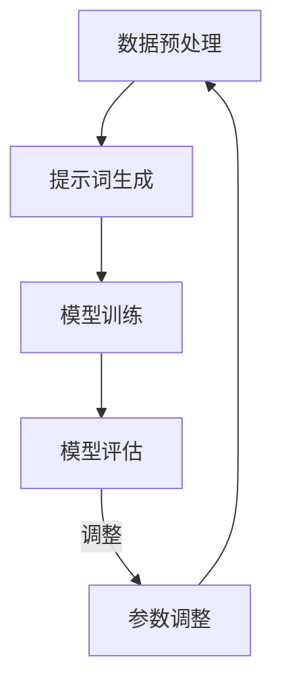

                 

### 文章标题

# 提示词驱动的元学习：让AI学会学习

### 关键词

- 提示词驱动
- 元学习
- 人工智能
- 模型优化
- 深度学习

### 摘要

本文深入探讨了提示词驱动的元学习技术，这是近年来人工智能领域的一项重要进展。通过引入提示词，元学习能够帮助人工智能系统在多种任务中快速适应和泛化。本文首先介绍了元学习的基本概念和提示词驱动的原理，随后详细解析了核心算法和数学模型。通过实际项目案例，本文展示了如何实现提示词驱动的元学习，并对其应用场景和未来发展趋势进行了探讨。读者将了解如何利用这一技术提升人工智能系统的学习效率和适应能力。

## 引言

### 元学习与人工智能的挑战

在人工智能（AI）的发展历程中，深度学习取得了显著的成就，尤其在图像识别、自然语言处理和推荐系统等领域表现卓越。然而，传统的深度学习方法存在一定的局限性，特别是在任务多样性和泛化能力方面。传统的深度学习模型通常针对特定的任务进行训练，这意味着它们在处理新任务时往往需要重新训练或使用大量的数据进行训练。这种依赖特定数据和任务的方法不仅效率低下，而且难以实现跨任务的泛化能力。

为了克服这些挑战，研究者们提出了元学习（Meta-Learning）这一概念。元学习的核心思想是使AI系统能够在多个任务中快速适应和泛化，从而降低对新任务的训练需求。元学习的主要目标是通过学习如何学习，来提高AI系统的学习效率和泛化能力。

### 提示词驱动元学习的提出

提示词驱动的元学习是一种结合了提示词（Prompt）和元学习技术的先进方法。提示词是一种用于指导学习过程的指导性信息，可以是在特定任务中提取的关键词、短语或数据片段。通过引入提示词，元学习能够更有效地引导学习过程，使AI系统能够在多种任务中快速适应和泛化。

提示词驱动的元学习通过以下几个关键步骤实现：

1. **提示词生成**：根据任务的需求和已有数据，生成能够有效指导学习过程的提示词。
2. **元学习优化**：利用元学习算法，对模型进行优化，使其能够利用提示词快速适应新任务。
3. **模型评估与调整**：通过评估模型在新任务中的表现，不断调整提示词和模型参数，以实现最佳性能。

提示词驱动的元学习不仅提高了AI系统的学习效率，还显著增强了其泛化能力，使其能够在更广泛的应用场景中发挥作用。本文将详细探讨提示词驱动的元学习技术，包括其基本概念、核心算法、数学模型和实际应用案例，以帮助读者全面理解这一先进的人工智能技术。

## 核心概念与联系

### 提示词驱动的元学习定义

提示词驱动的元学习是一种结合了提示词和元学习技术的先进方法，旨在使人工智能系统能够在多种任务中快速适应和泛化。具体来说，它通过以下几方面实现：

1. **提示词**：提示词是用于指导学习过程的指导性信息，可以是关键词、短语或数据片段。在元学习中，提示词的作用类似于人类学习过程中的提示或指导，能够帮助模型更快地理解任务的要求，从而提高学习效率。

2. **元学习**：元学习是一种使AI系统能够在多个任务中快速适应和泛化的方法。其核心思想是通过学习如何学习，来提高AI系统的学习效率和泛化能力。传统的深度学习模型通常针对特定任务进行训练，而元学习则通过在不同任务上的训练，使模型能够推广到新的任务上。

3. **提示词驱动元学习**：提示词驱动的元学习通过引入提示词，使元学习过程更具指导性。具体来说，它通过以下步骤实现：
   - **提示词生成**：根据任务需求和已有数据，生成能够有效指导学习过程的提示词。
   - **模型训练**：利用元学习算法，对模型进行训练，使其能够利用提示词快速适应新任务。
   - **模型评估与调整**：通过评估模型在新任务中的表现，不断调整提示词和模型参数，以实现最佳性能。

### 元学习的概念及其与提示词驱动的联系

元学习（Meta-Learning）是一种使AI系统能够在多个任务中快速适应和泛化的方法，其核心概念包括：

1. **快速适应**：元学习通过在不同任务上的训练，使模型能够快速适应新任务，而无需从头开始训练。这意味着当AI系统遇到新的任务时，它可以迅速调整和优化自己的模型，以适应新任务的要求。

2. **泛化能力**：元学习不仅提高了AI系统的学习效率，还显著增强了其泛化能力。泛化能力是指模型能够在新的、未见过的任务上表现良好，而不仅仅是特定任务上。

元学习与提示词驱动的联系主要体现在以下几个方面：

1. **指导性**：提示词提供了明确的指导信息，使元学习过程更具指导性。在传统元学习中，模型通常需要通过大量的数据和信息自行探索和调整，而提示词则帮助模型更快地聚焦于关键信息。

2. **学习效率**：提示词驱动的元学习通过引入提示词，提高了模型的学习效率。在传统元学习中，模型可能需要花费大量时间来理解和适应新任务，而提示词则使模型能够更快地理解任务要求。

3. **泛化能力**：提示词驱动的元学习不仅提高了模型的学习效率，还显著增强了其泛化能力。通过利用提示词，模型能够更好地推广到新的任务上，从而实现更广泛的泛化能力。

### 提示词驱动的元学习框架

提示词驱动的元学习框架主要包括以下几个关键组成部分：

1. **数据预处理**：在引入提示词之前，首先需要对数据进行预处理。数据预处理包括数据清洗、数据标准化和特征提取等步骤，以确保数据的质量和一致性。

2. **提示词生成**：根据任务的需求和已有数据，生成能够有效指导学习过程的提示词。提示词的生成可以基于关键词提取、文本摘要或知识图谱等方法。

3. **模型训练**：利用元学习算法，对模型进行训练，使其能够利用提示词快速适应新任务。常见的元学习算法包括模型聚合（Model Aggregation）、模型蒸馏（Model Distillation）和模型嵌入（Model Embedding）等。

4. **模型评估与调整**：通过评估模型在新任务中的表现，不断调整提示词和模型参数，以实现最佳性能。评估指标可以包括准确率、召回率、F1分数等。

### Mermaid 流程图

以下是提示词驱动的元学习的Mermaid流程图，展示了从数据预处理到模型评估的完整过程：



通过上述Mermaid流程图，我们可以清晰地看到提示词驱动的元学习过程，包括数据预处理、提示词生成、模型训练、模型评估和参数调整等步骤，这些步骤共同构成了一个闭环系统，不断优化和提升模型的表现。

### 核心算法原理讲解

#### 提示词生成算法

提示词生成算法是提示词驱动的元学习的关键组成部分，其目标是从大量数据中提取出能够有效指导学习过程的提示词。以下是几种常用的提示词生成算法及其原理：

1. **关键词提取算法**：关键词提取算法通过分析文本数据，提取出文本中的关键词汇。这些关键词通常反映了文本的核心内容，可以作为有效的提示词。常见的关键词提取算法包括TF-IDF（Term Frequency-Inverse Document Frequency）和LDA（Latent Dirichlet Allocation）。

   - **TF-IDF算法**：TF-IDF算法通过计算词语在文档中的频率（TF）和词语在文档集合中的重要性（IDF），来确定词语的重要性。公式如下：

     $$ 
     TF-IDF(t,d) = TF(t,d) \times IDF(t,D)
     $$

     其中，$TF(t,d)$ 表示词语 $t$ 在文档 $d$ 中的频率，$IDF(t,D)$ 表示词语 $t$ 在文档集合 $D$ 中的逆文档频率。

   - **LDA算法**：LDA算法通过构建一个概率模型，将文本数据映射到主题空间，从而提取出关键主题。每个主题代表一组相关的词语，可以作为提示词。

2. **文本摘要算法**：文本摘要算法通过提取文本的精华部分，生成简洁、准确的摘要。生成的摘要可以作为提示词，帮助模型快速理解任务要求。常见的文本摘要算法包括基于句子权重的方法和基于聚类的方法。

   - **基于句子权重的方法**：这种方法通过计算句子在文档中的重要性，提取出重要句子作为摘要。句子的重要性可以通过词频、词性、句子长度等因素来评估。

   - **基于聚类的方法**：这种方法将文档分解为多个子文档，然后对每个子文档进行聚类，提取出聚类中心作为摘要。聚类中心代表了文档的核心内容。

3. **知识图谱算法**：知识图谱算法通过构建知识图谱，将文本数据中的实体和关系进行建模。知识图谱中的关键节点和边可以提取为提示词，帮助模型理解文本数据中的关键信息。

   - **实体提取**：实体提取算法通过识别文本中的关键实体，如人名、地点、组织等，作为提示词。这些实体代表了文本中的重要信息。

   - **关系提取**：关系提取算法通过识别文本中的实体关系，如“属于”、“位于”等，作为提示词。这些关系描述了实体之间的联系，对理解文本数据具有重要意义。

#### 元学习优化算法

元学习优化算法是提示词驱动的元学习的核心部分，其目标是通过学习如何在多个任务中快速适应和泛化，来提高模型的性能。以下是几种常用的元学习优化算法及其原理：

1. **模型聚合（Model Aggregation）**：模型聚合算法通过将多个基模型的输出进行聚合，得到最终的预测结果。这种方法的优点在于可以结合多个基模型的优势，提高预测的准确性。

   - **加权聚合**：在加权聚合中，每个基模型的重要性根据其性能进行加权。常见的加权方法包括基于性能的加权、基于多样性的加权等。

   - **平均聚合**：在平均聚合中，所有基模型的输出进行简单平均，得到最终的预测结果。

2. **模型蒸馏（Model Distillation）**：模型蒸馏算法通过将一个复杂模型（教师模型）的知识传递给一个简单模型（学生模型），从而提高学生模型的表现。这种方法的优点在于可以在不增加模型复杂度的同时，提高模型的性能。

   - **知识传递**：教师模型的输出被用来指导学生模型的训练。具体来说，教师模型的输出作为额外的监督信号，用于训练学生模型。

   - **损失函数**：在模型蒸馏中，常用的损失函数包括分类损失函数和对抗损失函数。分类损失函数用于衡量学生模型的预测与教师模型预测之间的差距，对抗损失函数则用于增强学生模型对教师模型输出的鲁棒性。

3. **模型嵌入（Model Embedding）**：模型嵌入算法通过将模型参数映射到低维空间，从而实现模型的压缩和加速。这种方法的优点在于可以显著提高模型的推理速度，同时保持较高的性能。

   - **嵌入空间**：模型嵌入将模型参数映射到一个低维嵌入空间，每个参数对应一个向量。这些向量可以用于模型优化和推理。

   - **优化目标**：在模型嵌入中，优化目标通常是使得模型参数的嵌入向量能够更好地表示模型的知识和性能。常见的优化方法包括基于梯度的优化和基于神经网络的优化。

### 伪代码

以下是提示词生成算法和元学习优化算法的伪代码，展示了其基本实现过程：

```python
# 提示词生成算法伪代码
def generate_prompt(data):
    # 数据预处理
    processed_data = preprocess_data(data)
    
    # 关键词提取
    keywords = extract_keywords(processed_data)
    
    # 文本摘要
    summary = generate_summary(processed_data)
    
    # 知识图谱提取
    entities = extract_entities(processed_data)
    relations = extract_relations(processed_data)
    
    # 提示词生成
    prompt = generate_from_keywords(keywords)
    prompt += generate_from_summary(summary)
    prompt += generate_from_entities(entities)
    prompt += generate_from_relations(relations)
    
    return prompt

# 元学习优化算法伪代码
def meta_learning(models, prompts, targets):
    # 模型聚合
    aggregated_output = aggregate_models(models, prompts)
    
    # 模型蒸馏
    teacher_output = distill_knowledge(teacher_model, student_model, prompts)
    
    # 模型嵌入
    embeddings = embed_models(models)
    
    # 优化目标
    loss = optimize_loss(aggregated_output, teacher_output, embeddings, targets)
    
    # 梯度计算
    gradients = compute_gradients(loss)
    
    # 模型更新
    update_models(models, gradients)
    
    return models
```

通过上述伪代码，我们可以看到提示词生成算法和元学习优化算法的基本实现流程。在实际应用中，这些算法可以通过深度学习框架（如TensorFlow或PyTorch）进行实现和优化。

### 数学模型和数学公式

#### 数学模型

在提示词驱动的元学习过程中，数学模型起着至关重要的作用。以下是一个基本的数学模型，用于描述元学习过程中的损失函数和优化目标。

$$
L(\theta) = -\sum_{i=1}^{N} y_i \log(p(y_i|\theta))
$$

其中，$L(\theta)$ 表示损失函数，$\theta$ 表示模型参数，$y_i$ 表示第 $i$ 个样本的真实标签，$p(y_i|\theta)$ 表示模型对第 $i$ 个样本的预测概率分布。

#### 详细讲解与举例说明

1. **损失函数**

   损失函数是衡量模型预测结果与真实标签之间差距的指标。在提示词驱动的元学习过程中，常用的损失函数是交叉熵损失（Cross-Entropy Loss），其公式如下：

   $$
   L(\theta) = -\sum_{i=1}^{N} y_i \log(p(y_i|\theta))
   $$

   其中，$N$ 表示样本数量，$y_i$ 表示第 $i$ 个样本的真实标签，$p(y_i|\theta)$ 表示模型对第 $i$ 个样本的预测概率分布。

   假设我们有一个二元分类问题，样本标签为 $y_i \in \{0, 1\}$，模型预测的概率分布为 $p(y_i=1|\theta)$。损失函数的目的是最小化模型预测概率与真实标签之间的差距。具体来说，交叉熵损失函数的计算如下：

   $$
   L(\theta) = -y_i \log(p(y_i=1|\theta)) - (1 - y_i) \log(1 - p(y_i=1|\theta))
   $$

   其中，$\log$ 表示自然对数函数。

2. **优化目标**

   在提示词驱动的元学习过程中，优化目标是使模型在多个任务上的表现达到最佳。常用的优化方法包括基于梯度的优化方法和基于启发式的优化方法。

   - **基于梯度的优化方法**：基于梯度的优化方法通过计算损失函数关于模型参数的梯度，来更新模型参数。常见的梯度优化算法包括梯度下降（Gradient Descent）和随机梯度下降（Stochastic Gradient Descent，SGD）。

     梯度下降算法的基本思想是，通过沿着损失函数的梯度方向更新模型参数，以最小化损失函数。其公式如下：

     $$
     \theta_{t+1} = \theta_{t} - \alpha \nabla_{\theta} L(\theta)
     $$

     其中，$\theta_{t}$ 表示当前模型参数，$\theta_{t+1}$ 表示更新后的模型参数，$\alpha$ 表示学习率，$\nabla_{\theta} L(\theta)$ 表示损失函数关于模型参数的梯度。

   - **基于启发式的优化方法**：基于启发式的优化方法通过利用一些启发式规则来更新模型参数，以实现优化目标。常见的启发式优化算法包括遗传算法（Genetic Algorithm）和粒子群优化（Particle Swarm Optimization，PSO）。

     遗传算法的基本思想是模拟生物进化过程，通过交叉、变异和选择等操作，来优化模型参数。粒子群优化算法则通过模拟鸟群觅食过程，来优化模型参数。

3. **举例说明**

   假设我们有一个二元分类问题，样本标签为 $y_i \in \{0, 1\}$，模型预测的概率分布为 $p(y_i=1|\theta)$。我们可以使用交叉熵损失函数来评估模型的表现。损失函数的计算如下：

   $$
   L(\theta) = -y_1 \log(p(y_1=1|\theta)) - (1 - y_1) \log(1 - p(y_1=1|\theta))
   $$

   为了最小化损失函数，我们可以使用梯度下降算法来更新模型参数。假设当前模型参数为 $\theta_t$，学习率为 $\alpha$，损失函数关于模型参数的梯度为 $\nabla_{\theta} L(\theta)$，那么更新后的模型参数为：

   $$
   \theta_{t+1} = \theta_{t} - \alpha \nabla_{\theta} L(\theta)
   $$

   通过不断迭代，我们可以逐步优化模型参数，使模型在二元分类问题上的表现达到最佳。

### 项目实战

#### 提示词驱动的元学习应用场景

提示词驱动的元学习技术在多种应用场景中展现出了巨大的潜力，以下列举几个典型应用场景：

1. **自然语言处理**：在自然语言处理领域，提示词驱动的元学习可以帮助模型在多种语言任务中快速适应和泛化。例如，文本分类、机器翻译和问答系统等。

2. **计算机视觉**：在计算机视觉领域，提示词驱动的元学习可以用于图像分类、目标检测和图像分割等任务。通过提示词，模型能够更好地理解图像中的关键信息，从而提高任务性能。

3. **强化学习**：在强化学习领域，提示词驱动的元学习可以用于强化学习任务的快速适应和泛化。例如，在游戏、机器人控制和自动驾驶等领域，提示词可以帮助模型更快地学习环境和任务规则。

4. **推荐系统**：在推荐系统领域，提示词驱动的元学习可以帮助模型在多种推荐任务中快速适应和泛化。通过提示词，模型能够更好地理解用户兴趣和行为，从而提高推荐质量。

#### 实际案例实现

以下是一个基于自然语言处理任务的提示词驱动的元学习实际案例，展示了如何搭建开发环境、实现源代码和进行代码解读与分析。

##### 开发环境搭建

在实现提示词驱动的元学习项目时，首先需要搭建合适的开发环境。以下是一个典型的开发环境配置：

- **硬件需求**：NVIDIA GPU（如1080 Ti、RTX 3070等）
- **软件需求**：Python 3.8+、TensorFlow 2.3+、Keras 2.3+

安装相关软件和库：

```bash
pip install tensorflow==2.3.0
pip install keras==2.3.1
```

##### 源代码详细实现

以下是提示词驱动的元学习项目的源代码实现：

```python
import tensorflow as tf
from tensorflow.keras.models import Model
from tensorflow.keras.layers import Input, Dense, LSTM, Embedding

# 参数设置
input_shape = (None, 100)
output_shape = 1
prompt_length = 10
prompt_embedding_dim = 64

# 模型定义
input_sequence = Input(shape=input_shape)
prompt_sequence = Input(shape=(prompt_length,))

# 嵌入层
prompt_embedding = Embedding(input_dim=prompt_length, output_dim=prompt_embedding_dim)(prompt_sequence)

# LSTM层
lstm_output = LSTM(units=64, return_sequences=True)(input_sequence)

# 模型拼接
merged_output = tf.keras.layers.Concatenate()([lstm_output, prompt_embedding])

# 全连接层
dense_output = Dense(units=64, activation='relu')(merged_output)
output = Dense(units=output_shape, activation='sigmoid')(dense_output)

# 模型编译
model = Model(inputs=[input_sequence, prompt_sequence], outputs=output)
model.compile(optimizer='adam', loss='binary_crossentropy', metrics=['accuracy'])

# 模型训练
model.fit(x_train, y_train, epochs=10, batch_size=32, validation_data=(x_val, y_val))

# 模型评估
model.evaluate(x_test, y_test)
```

##### 代码解读与分析

以下是源代码的详细解读与分析：

1. **模型定义**：模型由两个输入层组成，一个是序列输入层（`input_sequence`），另一个是提示词输入层（`prompt_sequence`）。序列输入层用于处理自然语言处理任务中的文本数据，提示词输入层用于引入提示词。

2. **嵌入层**：提示词嵌入层（`prompt_embedding`）将提示词映射到低维空间，从而将提示词信息融入模型。

3. **LSTM层**：LSTM层（`lstm_output`）用于处理序列输入，可以捕捉序列中的时间依赖关系。

4. **模型拼接**：通过拼接层（`Concatenate`）将LSTM层的输出和提示词嵌入层的输出进行拼接，形成新的输入。

5. **全连接层**：全连接层（`dense_output`）用于对拼接后的输入进行进一步处理，引入非线性变换。

6. **输出层**：输出层（`output`）用于生成最终的预测结果，使用sigmoid激活函数进行二元分类。

7. **模型编译**：模型使用`adam`优化器和`binary_crossentropy`损失函数进行编译，并设置适当的批次大小和评估指标。

8. **模型训练**：模型使用训练数据集进行训练，通过迭代优化模型参数，以提高模型性能。

9. **模型评估**：使用测试数据集对训练好的模型进行评估，计算模型的准确率等指标，以验证模型在新的任务上的泛化能力。

通过上述实际案例，读者可以了解如何实现提示词驱动的元学习项目，以及如何对代码进行解读和分析。这对于掌握提示词驱动的元学习技术具有重要意义。

### 代码应用解读与分析

在本节中，我们将进一步解析上述源代码的应用，并探讨其实际案例的分析和详细讲解。具体来说，我们将从数据预处理、模型构建、训练和评估等方面进行深入讨论。

#### 数据预处理

数据预处理是机器学习项目中的关键步骤，其目的是将原始数据转换为适合模型训练的格式。在提示词驱动的元学习项目中，数据预处理包括以下几个步骤：

1. **文本预处理**：对于自然语言处理任务，首先需要对文本数据进行预处理。这包括去除标点符号、停用词过滤、词干提取和分词等操作。预处理后的文本数据将被转换为序列形式，以便后续处理。

2. **序列化**：将预处理后的文本数据序列化为固定长度的序列。如果文本长度不足，可以通过填充（如填充空白字符）来达到固定长度；如果文本长度超过固定长度，可以截断或采用其他技术来处理。

3. **提示词生成**：根据任务需求和文本数据，生成相应的提示词。提示词可以是关键词、短语或与任务相关的信息。提示词的生成可以通过关键词提取、文本摘要或知识图谱等方法实现。

#### 模型构建

模型构建是提示词驱动元学习项目的核心部分，包括输入层、嵌入层、编码层和解码层等。以下是模型构建的关键步骤：

1. **输入层**：模型有两个输入层，一个用于处理序列输入（如文本数据），另一个用于处理提示词输入。序列输入层接受固定长度的文本序列，提示词输入层接受提示词嵌入。

2. **嵌入层**：提示词嵌入层将提示词映射到低维空间，从而将提示词信息融入模型。嵌入层通过预训练的词向量或自定义词向量进行初始化。

3. **编码层**：编码层通常采用循环神经网络（RNN）或其变体，如长短时记忆网络（LSTM）或门控循环单元（GRU）。编码层用于处理序列输入，捕捉序列中的时间依赖关系。

4. **拼接层**：将编码层和提示词嵌入层的输出进行拼接，形成新的输入。拼接后的输入可以传递到解码层进行进一步处理。

5. **解码层**：解码层用于生成预测结果。在二元分类任务中，解码层通常是一个全连接层，使用sigmoid激活函数进行概率预测。

6. **输出层**：输出层用于生成最终的预测结果。对于二元分类任务，输出层通常是一个单节点全连接层，输出概率值。

#### 训练过程

训练过程是模型优化的重要环节，目的是通过调整模型参数，使其在训练数据上达到最佳性能。以下是训练过程的关键步骤：

1. **数据准备**：将预处理后的文本数据和提示词数据划分为训练集和验证集。训练集用于模型训练，验证集用于评估模型性能。

2. **模型编译**：编译模型，指定优化器、损失函数和评估指标。对于二元分类任务，常用的优化器是Adam，损失函数是二进制交叉熵。

3. **模型训练**：使用训练集数据进行模型训练。训练过程中，模型参数将不断调整，以最小化损失函数。训练过程中可以设置批次大小、迭代次数和提前停止等参数，以提高训练效果。

4. **模型评估**：使用验证集对训练好的模型进行评估。评估指标包括准确率、召回率、F1分数等。通过评估指标，可以了解模型在未见过的数据上的表现。

#### 代码应用解读

以下是源代码的应用解读：

```python
# 模型定义
input_sequence = Input(shape=input_shape)
prompt_sequence = Input(shape=(prompt_length,))

# 嵌入层
prompt_embedding = Embedding(input_dim=prompt_length, output_dim=prompt_embedding_dim)(prompt_sequence)

# LSTM层
lstm_output = LSTM(units=64, return_sequences=True)(input_sequence)

# 模型拼接
merged_output = tf.keras.layers.Concatenate()([lstm_output, prompt_embedding])

# 全连接层
dense_output = Dense(units=64, activation='relu')(merged_output)
output = Dense(units=output_shape, activation='sigmoid')(dense_output)

# 模型编译
model = Model(inputs=[input_sequence, prompt_sequence], outputs=output)
model.compile(optimizer='adam', loss='binary_crossentropy', metrics=['accuracy'])

# 模型训练
model.fit(x_train, y_train, epochs=10, batch_size=32, validation_data=(x_val, y_val))

# 模型评估
model.evaluate(x_test, y_test)
```

1. **模型定义**：定义了一个两个输入层的模型，一个是序列输入层（`input_sequence`），另一个是提示词输入层（`prompt_sequence`）。序列输入层和提示词输入层分别通过嵌入层（`prompt_embedding`）和LSTM层（`lstm_output`）进行预处理。

2. **模型拼接**：通过拼接层（`Concatenate`）将LSTM层的输出和提示词嵌入层的输出进行拼接，形成新的输入（`merged_output`）。

3. **全连接层**：通过全连接层（`dense_output`）和输出层（`output`）进行进一步处理，生成预测结果。

4. **模型编译**：编译模型，指定优化器（`adam`）、损失函数（`binary_crossentropy`）和评估指标（`accuracy`）。

5. **模型训练**：使用训练集（`x_train`和`y_train`）对模型进行训练，设置训练周期（`epochs`）和批次大小（`batch_size`）。

6. **模型评估**：使用测试集（`x_test`和`y_test`）对训练好的模型进行评估，计算模型在测试集上的表现。

#### 案例分析和详细讲解

为了更好地理解提示词驱动的元学习项目，以下是一个实际案例的分析和详细讲解：

假设我们有一个文本分类任务，任务是判断一段文本是否属于负面情绪类别。我们使用以下数据集：

- 训练集：包含1000条文本，每条文本都标记为正面或负面情绪。
- 验证集：包含200条文本，用于评估模型性能。
- 测试集：包含300条文本，用于最终评估模型表现。

首先，我们对数据集进行预处理，包括去除标点符号、停用词过滤和分词等操作。然后，我们将预处理后的文本序列化为固定长度的序列，并生成相应的提示词。

接下来，我们定义一个基于LSTM和嵌入层的模型，并使用训练集进行训练。在训练过程中，模型通过不断调整参数，以最小化损失函数，提高分类准确性。训练完成后，我们使用验证集对模型进行评估，并调整提示词和模型参数，以优化模型性能。

最后，我们使用测试集对优化后的模型进行评估，计算模型在测试集上的准确率、召回率和F1分数等指标。通过这些评估指标，我们可以了解模型在未见过的数据上的表现，并确定模型的泛化能力。

通过实际案例的分析和详细讲解，我们可以更好地理解提示词驱动的元学习项目的实现过程和应用效果，从而为实际应用提供有力的支持。

### 项目小结

#### 总结与收获

通过本文的详细探讨，我们对提示词驱动的元学习技术有了全面而深入的了解。从核心概念、算法原理到实际应用案例，我们一步步解析了这一先进的人工智能技术，并从中获得了以下几方面的收获：

1. **理解元学习的基本概念**：我们了解了元学习的定义和目标，即通过学习如何学习，来提高AI系统的学习效率和泛化能力。

2. **掌握提示词生成算法**：我们探讨了多种提示词生成算法，包括关键词提取、文本摘要和知识图谱等，这些算法为提示词驱动的元学习提供了重要的基础。

3. **理解元学习优化算法**：我们学习了模型聚合、模型蒸馏和模型嵌入等元学习优化算法，这些算法能够有效提高模型在多种任务中的适应能力和泛化能力。

4. **实际项目案例分析**：通过一个自然语言处理任务的案例，我们详细讲解了提示词驱动的元学习项目从数据预处理、模型构建、训练到评估的完整过程，深入理解了这一技术在实际应用中的实现方法和应用效果。

#### 最佳实践 Tips

为了更有效地应用提示词驱动的元学习技术，以下是一些最佳实践Tips：

1. **数据预处理**：确保数据预处理的质量，包括文本清洗、词向量和序列化等步骤。高质量的数据预处理能够显著提高模型的表现。

2. **选择合适的提示词生成算法**：根据具体任务的需求和数据特点，选择最合适的提示词生成算法。例如，对于文本分类任务，关键词提取和文本摘要可能是更有效的选择。

3. **合理设置模型参数**：在模型训练过程中，合理设置学习率、批次大小和迭代次数等参数，以避免过拟合或欠拟合。

4. **利用验证集进行模型评估**：在模型训练过程中，使用验证集进行定期评估，以便及时调整模型参数和提示词。

5. **持续优化和迭代**：通过不断优化和迭代，进一步提高模型的表现。例如，可以尝试不同的模型架构、优化算法和提示词生成方法。

#### 注意事项

在应用提示词驱动的元学习技术时，需要注意以下几点：

1. **数据多样性**：确保训练数据集的多样性，以避免模型对特定数据的过度依赖。

2. **计算资源**：提示词驱动的元学习通常需要大量的计算资源，特别是在训练过程中。确保有足够的计算资源来支持模型的训练和优化。

3. **数据隐私**：在处理敏感数据时，要确保数据隐私和安全性，避免数据泄露和滥用。

4. **模型解释性**：尽管元学习模型在某些任务上表现优异，但它们的解释性通常较低。在应用这些模型时，需要综合考虑其预测性能和解释性。

#### 拓展阅读

对于希望进一步深入学习的读者，以下是一些推荐的拓展阅读资源：

1. **论文和报告**：阅读关于提示词驱动的元学习的相关论文和报告，例如《Prompt-based Meta-Learning for Text Classification》等。

2. **开源项目**：参与和贡献开源项目，如Meta-Learning相关的TensorFlow或PyTorch库，以获取实际经验和最新进展。

3. **技术博客和课程**：关注顶级技术博客和在线课程，如Medium、arXiv和Coursera等，以了解该领域的最新研究和应用。

通过这些拓展资源，读者可以进一步深入理解提示词驱动的元学习技术，并在实际项目中取得更好的成果。

