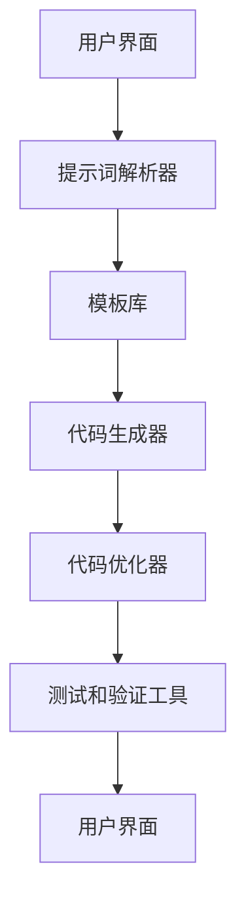
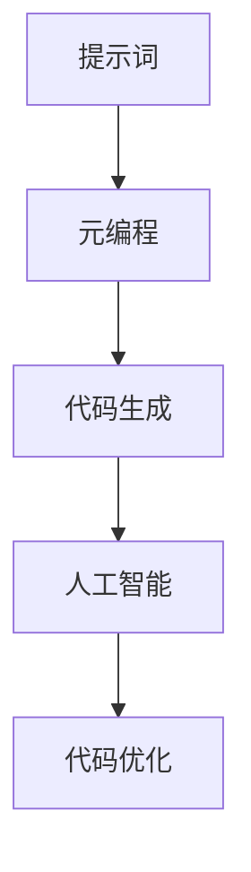

                 

### 引言与概述

#### 1.1 书籍背景与目标

在当今信息技术迅猛发展的时代，编程语言与人工智能（AI）技术的交叉融合正成为推动技术进步的重要力量。本书《提示词驱动的元编程：AI生成AI》旨在深入探讨这一前沿领域，揭示提示词驱动的元编程与人工智能相结合所带来的无限可能性。元编程，即编程的编程，是一种能够自动生成、修改和优化代码的技术。而人工智能，特别是生成式AI，通过学习大量的数据，可以自动生成新的代码、算法和解决方案。本书的核心目标是探讨如何利用提示词驱动元编程，实现AI生成AI，从而提高软件开发效率，推动技术革新。

本书的读者对象包括编程开发人员、AI研究人员、软件工程师以及CTO等高级技术人员。无论您是刚刚踏入编程世界的新手，还是拥有丰富编程经验的专家，本书都将为您呈现一个全新的视角，帮助您理解并掌握这一前沿技术。

#### 1.2 提示词驱动的元编程概述

提示词驱动的元编程是一种基于提示词（Prompt）的元编程方法，它通过预先定义的提示词来引导程序生成特定的代码、算法或解决方案。这种方法的核心在于利用提示词来明确编程目标，使AI能够根据提示词生成符合要求的代码。相比传统的元编程方法，提示词驱动的元编程具有更高的灵活性和更高的代码生成质量。

在编程领域，元编程技术已经被广泛应用于代码生成、代码优化、模板引擎等方面。而提示词驱动的元编程则进一步扩展了这一技术的应用范围，使得开发者能够通过简单的提示词输入，快速生成高质量的代码和解决方案。

#### 1.3 AI生成AI的重要性与影响

AI生成AI，即利用人工智能技术生成新的AI程序和解决方案，是一种革命性的技术理念。它不仅能够显著提高软件开发效率，还能够推动人工智能技术的自我进化和发展。

首先，AI生成AI在提高软件开发效率方面具有显著优势。传统的软件开发过程通常需要大量的时间和人力资源，而AI生成AI技术可以通过自动化和智能化的方式，快速生成符合要求的代码和算法，从而大大缩短开发周期。

其次，AI生成AI有助于推动人工智能技术的自我进化。通过不断地学习和优化，AI生成AI技术可以自我改进，生成更高效、更先进的算法和程序。这种自我进化的能力将使得人工智能技术不断突破现有局限，推动技术前沿的发展。

此外，AI生成AI还具有重要的社会和经济效益。它能够促进数字化转型的进程，提高企业的创新能力和市场竞争力。同时，AI生成AI也为解决复杂的科学问题和应对全球性挑战提供了新的思路和方法。

总之，AI生成AI作为一种前沿技术，具有巨大的发展潜力和广泛的应用前景。本书将从理论到实践，全面探讨这一领域的核心概念、技术原理和应用案例，帮助读者深入了解并掌握这一重要技术。

### 元编程基础

#### 1.1 元编程概念

元编程，顾名思义，是关于编程的编程。它涉及到编写程序来生成、修改和维护其他程序的能力。具体来说，元编程是一种高级编程技术，它使得开发者能够创建、操纵或扩展编程语言本身。通过元编程，开发者可以定义新的语法结构、操作数据和代码的抽象层次，从而实现更灵活、更高效的软件开发。

要理解元编程，首先需要了解编程语言的核心概念。编程语言是一种用于与计算机进行交流的语言，它包含一系列语法规则和语义规则。这些规则定义了如何将人类可读的代码转换成计算机可执行的指令。传统的编程主要关注如何编写代码来解决问题，而元编程则关注如何编写代码来生成和操纵代码本身。

在传统的编程中，开发者编写代码来解决具体问题。例如，编写一个程序来计算两个数的和。这种编程方法称为“命令式编程”，因为开发者通过一系列的命令来指导计算机执行任务。而元编程则不同，它不直接控制计算机的执行流程，而是通过操作代码本身来达到编程目标。

元编程的核心要素包括：

1. **代码生成**：元编程可以自动生成代码。例如，通过模板和代码生成工具，开发者可以快速生成复杂的代码框架，而无需手动编写每一个细节。
2. **代码操纵**：元编程能够操纵已有的代码，如修改、扩展或替换代码的一部分。这种能力使得开发者可以更灵活地应对需求变化和代码维护问题。
3. **抽象层次**：元编程提高了编程的抽象层次。开发者不再需要关注底层的机器指令，而是通过更高层次的抽象来描述和解决问题。

#### 1.2 元编程与传统编程的区别

传统编程和元编程在多个方面存在显著的区别，主要表现在以下几个方面：

1. **关注点**：
   - **传统编程**主要关注实现具体的任务或功能，如编写一个计算器程序来计算两个数的和。
   - **元编程**则关注于如何生成和操纵代码本身，而不是具体的实现细节。开发者定义代码的生成规则和抽象结构，而不是具体的代码行。

2. **编程语言**：
   - **传统编程**使用的是普通的编程语言，如Python、Java等。这些语言提供了丰富的库和框架，用于实现各种具体的功能。
   - **元编程**通常使用专门的元编程语言，如MetaML、Gol siz等，这些语言提供了特定的语法和功能，以支持元编程操作。

3. **抽象层次**：
   - **传统编程**处于较低的抽象层次，开发者需要编写具体的代码行来实现每个功能细节。
   - **元编程**处于较高的抽象层次，通过操作抽象的代码结构和规则来生成具体的代码。这使得开发者可以专注于编程的核心逻辑，而无需担心底层实现细节。

4. **代码生成**：
   - **传统编程**通常需要手动编写代码，通过逐行编写来逐步实现功能。
   - **元编程**可以通过代码生成工具自动生成代码，开发者只需定义生成规则和模板，系统会根据这些规则自动生成相应的代码。

5. **可维护性和扩展性**：
   - **传统编程**的代码通常更难以维护和扩展，因为功能的修改往往需要修改大量的具体代码行。
   - **元编程**提高了代码的可维护性和扩展性，通过修改生成规则和模板，可以轻松地实现代码的更新和扩展。

总的来说，元编程与传统编程的区别在于其关注点、使用的编程语言、抽象层次、代码生成方式和可维护性。元编程通过自动化和抽象化，使得编程过程更加高效和灵活，从而为软件开发带来了新的机遇和挑战。

#### 1.3 元编程的核心要素

元编程的核心要素主要包括代码生成、代码操纵和抽象层次，这些要素共同构成了元编程技术的核心框架，使得开发者能够更高效、更灵活地开发软件。

首先，**代码生成**是元编程最显著的特点之一。它通过自动化工具和算法，根据预设的规则和模板，生成具体的代码。例如，在模板引擎中，开发者可以定义代码模板，然后根据具体的数据和上下文，自动生成满足特定需求的代码。这种自动代码生成技术不仅提高了开发效率，还减少了手动编写代码的工作量，使得开发者可以专注于核心逻辑的设计。

其次，**代码操纵**是元编程的另一个重要要素。它允许开发者对现有的代码进行修改、扩展和替换。例如，在程序运行时，可以通过动态代码生成和注入技术，动态地修改程序的内部结构和行为。这种能力在软件维护和扩展中尤为重要，因为它使得开发者可以更加灵活地应对需求变化，而无需对整个程序进行大规模的修改。

最后，**抽象层次**是元编程技术实现灵活性和效率的关键。传统编程往往需要开发者关注底层的细节，例如具体的循环和条件语句。而元编程通过引入更高层次的抽象，使得开发者可以以更简洁、更直观的方式描述问题。例如，通过定义宏或元对象协议，开发者可以在编程语言中引入新的抽象结构和操作方法，从而简化编程任务，提高代码的可读性和可维护性。

这三个核心要素相互补充，共同构成了元编程的技术框架。代码生成提供了自动化的手段，代码操纵提供了灵活的修改能力，而抽象层次则提高了编程的效率和质量。通过这些要素的协同作用，元编程使得开发者能够更加高效地开发复杂的软件系统，同时也为软件开发带来了新的挑战和机遇。

#### 1.2 元编程的历史与发展

元编程这一概念可以追溯到计算机科学的早期阶段。从最早的编程语言发展历程中，我们可以看到元编程思想的萌芽。1950年代，第一代编程语言如FORTRAN和COBOL的问世，虽然主要是为特定应用领域设计，但已经初步具备了一些元编程的特性，如宏处理和高级数据类型。

进入1960年代，编程语言开始逐步引入更多元编程的特性。Lisp语言的出现是元编程历史上的一个重要里程碑。Lisp不仅是一种函数式编程语言，更是最早的脚本语言之一，它通过宏系统实现了代码的元编程。宏系统允许开发者定义新的操作符和语法结构，从而扩展语言本身。Lisp的成功为后来的编程语言设计提供了重要启示。

1970年代，C语言的出现进一步推动了元编程技术的发展。C语言提供了丰富的预处理器功能，如宏定义和条件编译，这些功能使得开发者可以编写更加灵活和模块化的代码。尽管这些功能不如Lisp的宏系统强大，但它们在系统编程和底层软件开发中得到了广泛应用。

进入1990年代，随着面向对象编程的兴起，元编程技术也得到了新的发展。Java语言引入了反射机制，允许程序在运行时检查和修改自身的结构。这一特性为动态加载和扩展代码提供了强大的支持，进一步扩展了元编程的应用范围。

近年来，元编程技术再次迎来了新的机遇。随着函数式编程和动态类型语言的兴起，如Haskell和Python，开发者能够更加灵活地编写和操纵代码。同时，模板元编程技术的发展，使得在编译时进行代码生成和优化成为可能，从而大大提高了程序的效率和性能。

元编程语言和工具的发展也推动了这一领域的前进。例如，Gol siz是一种专门为元编程设计的语言，它通过提供丰富的元编程特性和模板系统，使得开发者能够更轻松地实现复杂的代码生成和操作任务。此外，现代框架和库，如Eclipse插件、Spring框架等，也广泛应用了元编程技术，以提供更灵活和高效的开发体验。

总体来看，元编程的历史和发展是一个不断创新和进步的过程。从早期的简单宏处理，到现代的反射和模板元编程，元编程技术不仅丰富了编程语言的功能，也为开发者提供了更高效的开发手段。未来，随着人工智能和自动化技术的进一步发展，元编程将继续在软件开发中发挥重要作用。

#### 1.3 元编程在现代软件开发中的应用

在现代软件开发中，元编程技术已经广泛应用于多个领域，大大提升了开发效率、可维护性和代码质量。以下是一些重要的应用场景和实际案例：

首先，**模板引擎**是元编程技术的一个重要应用领域。模板引擎通过预定义的模板和占位符，动态生成HTML、XML、JSON等格式的内容。例如，Jinja2和Thymeleaf是两款流行的模板引擎，它们允许开发者编写模板，并通过简单的占位符和逻辑控制语句，生成动态的Web页面。这种技术不仅提高了开发效率，还使得页面内容与业务逻辑分离，增强了系统的可维护性。

其次，**代码生成工具**在软件开发中也得到了广泛应用。例如，Entity Framework是一个流行的对象关系映射（ORM）框架，它能够根据数据库结构自动生成实体类和关系映射代码。开发者只需定义数据库模型，框架就会自动生成相应的实体类代码，从而简化了数据访问层的开发。类似的工具还包括Lombok、Entity Developer等，它们通过自动化代码生成，大大减少了手动编写代码的工作量，提高了开发效率。

再次，**自动化测试**是元编程技术的另一个重要应用。通过元编程，开发者可以生成测试代码来验证系统的功能。例如，Selenium WebDriver是一个用于Web应用的自动化测试框架，它通过元编程技术，允许开发者动态生成驱动程序和测试脚本，从而实现对Web页面的全面测试。此外，Mockito等框架也通过元编程，提供了高效的测试桩（Mock）和测试驱动开发（TDD）支持。

此外，**动态语言**如Python和JavaScript也广泛应用了元编程技术。Python的动态类型系统和丰富的库，使得开发者可以通过简单的代码实现复杂的动态操作。例如，使用Python的反射机制，可以动态地检查和修改对象的属性和方法，从而实现灵活的动态扩展。JavaScript的动态特性和原型链机制，使得开发者可以轻松地创建和操纵对象，实现更灵活的编程模式。

最后，**领域特定语言（DSL）**的设计也是元编程技术的重要应用之一。DSL是一种专门为特定领域设计的小型编程语言，通过元编程技术，开发者可以将领域特定的规则和模式编码到语言中，从而实现更高效、更易用的软件开发。例如，SQL就是一种用于数据库查询的DSL，它通过简单的语句，就可以实现复杂的数据查询和操作。类似地，用于数据分析和机器学习的语言，如R和Julia，也广泛应用了元编程技术，以提供更高效的计算和分析能力。

综上所述，元编程技术在现代软件开发中具有广泛的应用和深远的影响。通过自动化代码生成、动态操作、模板引擎和DSL设计，元编程技术不仅提高了开发效率，还增强了代码的可维护性和灵活性，为现代软件开发带来了新的机遇和挑战。

### 提示词驱动的元编程

#### 2.1 提示词的概念

提示词（Prompt）在提示词驱动的元编程中扮演着至关重要的角色。简单来说，提示词是一种引导性的输入，它用于指导程序生成特定类型的代码或解决方案。提示词可以是一个简单的文本描述，也可以是一个复杂的参数化输入，其目的是为程序提供明确的编程目标。

在编程领域，提示词通常用于以下几个方面：

1. **明确编程目标**：通过提示词，开发者可以明确地告诉程序需要实现的功能或目标。例如，“编写一个函数，用于计算两个数的和”就是一个简单的提示词，它明确指出了编程任务的目标。
2. **提供上下文信息**：提示词不仅可以是简单的功能描述，还可以包含上下文信息，如数据类型、输入参数和预期输出。这些信息有助于程序更好地理解和处理输入，从而生成更符合预期的代码。
3. **引导代码生成**：提示词可以引导代码生成工具根据特定的需求生成相应的代码。例如，在使用模板引擎时，提示词可以是模板中需要替换的变量或占位符，通过提示词，模板引擎可以动态生成满足特定需求的代码。

提示词的形式多种多样，可以从简单的文本描述到复杂的参数化输入。以下是一些常见的提示词形式：

1. **文本描述**：这是最常见的提示词形式，通常用于描述程序需要实现的功能或任务。例如，“编写一个用于排序的算法”或“实现一个数据库查询”。
2. **参数化输入**：这种形式的提示词包含具体的参数和输入值，用于指导代码的生成和执行。例如，“编写一个计算两个整数之和的函数，输入参数为a和b”或“根据以下SQL语句生成查询代码：`SELECT * FROM users WHERE age > 30`”。
3. **上下文信息**：这类提示词提供了额外的上下文信息，如数据类型、输入输出规范和执行环境等。例如，“在Python中实现一个用于数据清洗的函数，输入为CSV文件，输出为清洗后的DataFrame”。

通过这些形式多样的提示词，提示词驱动的元编程能够有效地指导代码生成过程，从而提高开发效率和代码质量。提示词不仅为程序提供了明确的编程目标，还为代码生成工具提供了必要的上下文信息，使得生成过程更加精确和高效。

#### 2.2 提示词驱动的元编程原理

提示词驱动的元编程原理可以概括为通过提示词来引导程序生成和优化代码的过程。这一过程涉及多个关键组件和步骤，共同构成一个完整的代码生成框架。以下是提示词驱动的元编程原理的核心组成部分：

1. **提示词解析**：提示词解析是整个过程的起点。程序首先需要理解输入的提示词，并将其转化为内部表示形式。这一步骤通常包括词法分析和语法分析，将提示词分解为词法和语法单位，如单词、短语和句子。通过这种解析，程序能够提取出提示词中的关键信息，如功能需求、参数类型和上下文信息。

   ```mermaid
   graph TD
   A[提示词输入] --> B[词法分析]
   B --> C[语法分析]
   C --> D[内部表示]
   ```

2. **代码模板匹配**：在解析提示词后，程序会根据内部表示形式，与预定义的代码模板进行匹配。代码模板是一组预设的代码模式，用于生成特定类型的代码。模板通常包含占位符和模板变量，这些变量在代码生成时会被具体的数据和指令所替换。通过匹配过程，程序可以确定使用哪个代码模板来生成目标代码。

   ```mermaid
   graph TD
   D[内部表示] --> E[模板匹配]
   E --> F[代码模板]
   ```

3. **代码生成**：匹配完成后，程序会根据选定的代码模板，动态生成实际的代码。在这一步骤中，模板变量和占位符会被具体的数据和指令所替换，生成最终的代码。代码生成可以是简单的文本替换，也可以是更复杂的代码生成算法，如模板引擎中的宏展开或编译器中的抽象语法树（AST）转换。

   ```mermaid
   graph TD
   F[代码模板] --> G[代码生成]
   ```

4. **代码优化**：生成的代码通常需要进一步的优化，以提高性能、可读性和可维护性。这一步骤可能包括代码压缩、优化算法选择、内存管理等多个方面。优化过程通常依赖于具体的编程语言和工具，例如，Java程序可能使用JVM的即时编译器（JIT）进行优化。

   ```mermaid
   graph TD
   G[代码生成] --> H[代码优化]
   ```

5. **代码验证与测试**：生成的代码需要经过验证和测试，以确保其符合预期的功能和行为。这一步骤可能包括单元测试、集成测试和性能测试等多个方面。代码验证和测试不仅能够确保代码的正确性，还能帮助发现潜在的问题和缺陷，从而提高代码质量。

   ```mermaid
   graph TD
   H[代码优化] --> I[代码验证与测试]
   ```

6. **反馈与迭代**：代码生成和优化过程是一个迭代过程，通过不断地反馈和改进，最终生成高质量的代码。开发者可以根据测试结果和用户反馈，调整提示词和代码模板，优化生成过程，从而不断提高代码质量和开发效率。

   ```mermaid
   graph TD
   I[代码验证与测试] --> J[反馈与迭代]
   ```

通过这些步骤，提示词驱动的元编程能够实现高效、灵活的代码生成和优化。这种原理不仅适用于简单的代码生成任务，还可以用于复杂的软件开发过程，如自动化测试、代码生成工具和领域特定语言（DSL）设计等。总之，提示词驱动的元编程通过将提示词与代码生成过程紧密结合，为现代软件开发提供了强大的工具和方法。

#### 2.3 提示词驱动的元编程框架

提示词驱动的元编程框架是一个系统化的工具集合，旨在通过提示词自动生成和优化代码。该框架通常包含以下几个核心组件：

1. **提示词解析器**：提示词解析器是框架的入口组件，负责接收和解析用户输入的提示词。解析过程通常包括词法分析、语法分析和语义分析，将提示词转换成内部表示形式。例如，假设一个提示词是“编写一个用于计算两个数之和的函数”，解析器将提取出关键信息，如函数名称、输入参数和返回类型。

2. **模板库**：模板库是框架的核心组件之一，包含多种预定义的代码模板。这些模板根据不同的编程任务和需求，提供了不同的代码生成模式。模板通常包含可变的部分，如占位符和模板变量，以便在代码生成时进行替换。例如，一个用于生成排序算法的模板可能包含一个排序函数的框架，占位符用于插入具体的排序逻辑。

3. **代码生成器**：代码生成器是框架的执行组件，负责将解析后的提示词和模板库中的模板结合起来，生成具体的代码。代码生成器可以通过文本替换、模板引擎或编译器等技术，将模板变量和占位符替换为具体的代码。例如，在生成一个计算函数时，代码生成器将提示词中的参数值替换到模板中的相应位置。

4. **代码优化器**：代码优化器负责对生成的代码进行优化，以提高性能、可读性和可维护性。优化过程可能包括代码压缩、算法选择优化、内存管理等方面。例如，在生成一个数据库查询时，优化器可以优化查询语句的结构，减少查询时间。

5. **测试和验证工具**：测试和验证工具用于确保生成的代码符合预期，并能够正确执行。这些工具通常包括单元测试框架、集成测试工具和性能测试工具。通过测试，可以验证代码的功能、性能和安全，确保代码的质量。

6. **用户界面**：用户界面（UI）是框架的交互组件，提供用户与框架的交互接口。用户可以通过UI输入提示词、查看生成的代码和测试结果。UI设计通常需要考虑用户体验和易用性，以便用户能够轻松地使用框架进行代码生成和优化。

以下是一个简单的提示词驱动的元编程框架架构图：



通过上述组件的协同工作，提示词驱动的元编程框架能够实现高效的代码生成和优化。用户通过用户界面输入提示词，解析器将提示词转换成内部表示，代码生成器根据模板库生成代码，优化器对代码进行优化，测试和验证工具确保代码的质量。这一框架不仅提高了开发效率，还提供了灵活的代码生成和优化能力，为现代软件开发带来了新的机遇。

#### 2.4 提示词驱动的元编程优势

提示词驱动的元编程通过其独特的设计和功能，为软件开发带来了诸多优势。以下是这种技术的主要优势：

首先，**高效性**是提示词驱动的元编程最显著的优势之一。传统的软件开发通常需要手动编写大量的代码，而提示词驱动的元编程通过自动化工具和算法，可以快速生成符合要求的代码。这不仅减少了手动编写代码的工作量，还大大缩短了开发周期。例如，通过简单的提示词输入，程序可以自动生成数据库查询、数据清洗和数据可视化等复杂任务的相关代码，从而节省了时间和人力资源。

其次，**灵活性**是提示词驱动的元编程的另一大优势。提示词驱动的元编程允许开发者通过修改提示词和模板，快速适应不同的编程任务和需求。这种灵活性使得开发者能够更灵活地应对需求变化和项目扩展。例如，在一个项目中，通过修改提示词，可以轻松生成不同的数据处理流程和业务逻辑，而无需重新编写代码。

此外，**代码质量**也是提示词驱动的元编程的一大优势。通过使用预定义的模板和代码生成工具，可以确保生成的代码符合最佳实践和编码规范。模板库通常包含经过优化和测试的代码模式，这些模式不仅提高了代码的可读性和可维护性，还减少了错误和缺陷的发生。例如，使用模板库生成的代码通常具有更好的结构化和模块化，从而提高了代码的可维护性和扩展性。

最后，**可重用性**也是提示词驱动的元编程的重要优势之一。通过生成和优化代码，提示词驱动的元编程技术使得代码的重用变得更加容易和高效。开发者可以创建自定义的模板和提示词库，以便在多个项目中重复使用相同的代码模式。这种可重用性不仅提高了开发效率，还减少了重复劳动，使得开发过程更加简洁和高效。

总的来说，提示词驱动的元编程通过其高效性、灵活性、代码质量和可重用性，为现代软件开发带来了革命性的变化。它不仅提高了开发效率，还改善了代码质量，为开发者提供了更强大的编程工具和手段。

### AI基础

#### 3.1 AI概述

人工智能（Artificial Intelligence，简称AI）是一种模拟人类智能的技术，通过计算机程序实现智能行为，包括学习、推理、解决问题、感知和理解语言等。人工智能的目标是使计算机能够执行通常需要人类智能才能完成的任务。以下是人工智能的定义、历史发展及其分类：

**定义**：人工智能是一种通过算法和计算模型模拟人类智能的技术。它涉及到机器学习、自然语言处理、计算机视觉、智能代理等多个领域。

**历史发展**：人工智能的研究始于20世纪50年代。当时，科学家们开始探讨如何让计算机具备类似人类的智能。1956年，约翰·麦卡锡（John McCarthy）等人组织了第一次人工智能研讨会，标志着人工智能作为一个独立学科的开始。此后，人工智能经历了多个发展阶段，从早期的符号主义（Symbolic AI）到基于规则的系统，再到现在的机器学习和深度学习。

**分类**：人工智能可以根据其实现方式和技术特点分为多种类型：
- **符号主义（Symbolic AI）**：这种类型的AI通过定义符号和规则来模拟人类思维。它依赖于逻辑和推理，但受限于表达能力的局限，难以处理复杂的问题。
- **统计学习（Statistical Learning）**：这种类型的AI通过统计分析大量数据来学习模式。机器学习是其主要实现方式，包括监督学习、无监督学习和强化学习。
- **深度学习（Deep Learning）**：深度学习是机器学习的一个分支，通过多层神经网络进行学习。它利用大规模数据和强大的计算能力，在图像识别、语音识别和自然语言处理等领域取得了显著的成果。
- **强化学习（Reinforcement Learning）**：强化学习通过智能体与环境交互，不断学习和优化策略，以实现目标。它广泛应用于游戏、机器人控制和推荐系统等领域。

人工智能的发展不仅推动了技术的进步，还对社会、经济和文化产生了深远的影响。随着AI技术的不断成熟，它在各个行业中的应用也日益广泛，从自动驾驶到医疗诊断，从智能家居到智能客服，AI正在深刻地改变我们的生活方式和工作方式。

#### 3.2 AI的核心技术

人工智能的核心技术包括机器学习、深度学习和强化学习等。这些技术各自有着独特的原理和应用场景，共同构成了现代人工智能的基石。

**机器学习**：机器学习是人工智能的一个分支，通过从数据中学习规律和模式，实现智能行为。它主要分为以下三种类型：

1. **监督学习（Supervised Learning）**：
   监督学习通过已标记的数据集来训练模型，从而预测新的数据。其核心目标是找到输入和输出之间的映射关系。常见的监督学习算法包括线性回归、逻辑回归、支持向量机（SVM）和决策树等。

2. **无监督学习（Unsupervised Learning）**：
   无监督学习没有明确的输入输出关系，而是从未标记的数据中寻找结构和模式。其主要任务包括聚类、降维和异常检测等。常见的无监督学习算法包括K-means聚类、主成分分析（PCA）和自编码器等。

3. **强化学习（Reinforcement Learning）**：
   强化学习通过智能体与环境的交互，不断学习和优化策略，以实现目标。其主要目标是找到最优策略，使得智能体在给定环境中获得最大奖励。常见的强化学习算法包括Q学习、深度Q网络（DQN）和策略梯度方法等。

**深度学习**：深度学习是机器学习的一个分支，通过多层神经网络进行学习。它利用大规模数据和强大的计算能力，在图像识别、语音识别和自然语言处理等领域取得了显著的成果。以下是深度学习的一些关键技术：

1. **神经网络（Neural Networks）**：
   神经网络是一种通过模拟人脑神经元连接进行学习的计算模型。它由输入层、隐藏层和输出层组成，通过前向传播和反向传播算法进行训练和优化。

2. **卷积神经网络（Convolutional Neural Networks，CNN）**：
   卷积神经网络是深度学习在计算机视觉领域的重要应用。它通过卷积层、池化层和全连接层等结构，对图像数据进行特征提取和分类。

3. **循环神经网络（Recurrent Neural Networks，RNN）**：
   循环神经网络是深度学习在序列数据处理方面的重要应用。它通过循环结构，对序列数据中的上下文信息进行建模，常用于语音识别、机器翻译和时间序列分析等。

4. **生成对抗网络（Generative Adversarial Networks，GAN）**：
   生成对抗网络由生成器和判别器两个神经网络组成，通过对抗训练生成逼真的数据。它广泛应用于图像生成、数据增强和风格迁移等领域。

**强化学习**：强化学习通过智能体与环境的交互，不断学习和优化策略，以实现目标。其主要任务是找到最优策略，使得智能体在给定环境中获得最大奖励。以下是强化学习的一些关键技术：

1. **Q学习（Q-Learning）**：
   Q学习是一种基于值函数的强化学习算法，通过迭代更新策略，以最大化长期回报。

2. **深度Q网络（Deep Q-Network，DQN）**：
   深度Q网络是一种基于深度学习的强化学习算法，通过神经网络来近似值函数，从而实现更复杂的策略优化。

3. **策略梯度方法（Policy Gradient Methods）**：
   策略梯度方法直接优化策略的梯度，以最大化长期回报。常见的策略梯度方法包括REINFORCE算法和Actor-Critic算法。

通过这些核心技术的协同作用，人工智能在各种领域取得了显著的进展，从自动驾驶到智能客服，从医疗诊断到金融预测，AI正在不断改变我们的世界。未来，随着技术的不断发展和应用的不断拓展，人工智能将继续发挥重要作用，推动社会进步和科技创新。

#### 3.2.1 机器学习

机器学习是人工智能的核心技术之一，它通过训练算法，使计算机系统能够从数据中学习并做出预测或决策。以下是机器学习的主要类型和算法：

**监督学习（Supervised Learning）**：

监督学习是机器学习中最常见的类型，它通过已标记的训练数据集来训练模型，从而预测新的数据。监督学习可以分为以下几种算法：

1. **线性回归（Linear Regression）**：
   线性回归是一种简单的监督学习算法，用于预测连续值输出。它通过拟合数据点的线性关系，找到最佳的拟合直线。

   **伪代码**：
   ```
   function linearRegression(X, y):
       // 计算斜率和截距
       theta = (X'X)^(-1)X'y
       return theta
   ```

2. **逻辑回归（Logistic Regression）**：
   逻辑回归是一种用于分类问题的监督学习算法，它通过拟合数据的对数几率，将输出映射到概率分布。

   **伪代码**：
   ```
   function logisticRegression(X, y):
       // 计算参数
       theta = (X'X)^(-1)X'y
       return sigmoid(theta'X)
   ```

3. **支持向量机（Support Vector Machine，SVM）**：
   支持向量机是一种强大的分类算法，通过找到最佳的超平面，将不同类别的数据点分开。它使用最大间隔分类器，将数据映射到高维空间。

   **伪代码**：
   ```
   function SVM(X, y):
       // 训练SVM模型
       model = trainSVM(X, y)
       return model.predict(X)
   ```

**无监督学习（Unsupervised Learning）**：

无监督学习没有明确的输入输出关系，而是从未标记的数据中寻找结构和模式。它主要包括以下几种算法：

1. **K-均值聚类（K-Means Clustering）**：
   K-均值聚类是一种基于距离度量的聚类算法，它将数据点划分为K个聚类，目标是使每个聚类内的数据点距离聚类中心最近。

   **伪代码**：
   ```
   function KMeans(X, K):
       // 随机初始化聚类中心
       centroids = initializeCentroids(X, K)
       while not converged:
           // 计算每个数据点的簇分配
           assignments = assignPointsToCentroids(X, centroids)
           // 更新聚类中心
           centroids = updateCentroids(X, assignments, K)
       return centroids
   ```

2. **主成分分析（Principal Component Analysis，PCA）**：
   主成分分析是一种降维技术，它通过正交变换将高维数据映射到低维空间，同时保留数据的主要信息。

   **伪代码**：
   ```
   function PCA(X):
       // 计算协方差矩阵
       cov_matrix = calculateCovarianceMatrix(X)
       // 计算特征值和特征向量
       eigenvalues, eigenvectors = calculateEigenDecomposition(cov_matrix)
       // 选择最大的特征值对应的特征向量
       principal_components = selectTopFeatures(eigenvectors, eigenvalues)
       return X * principal_components
   ```

3. **自编码器（Autoencoder）**：
   自编码器是一种神经网络，它通过学习数据点的编码和解码，实现数据的降维和去噪。

   **伪代码**：
   ```
   function autoencoder(X):
       // 编码器：将输入数据压缩到低维空间
       encoded = encoder(X)
       // 解码器：将编码后的数据重构回原始空间
       reconstructed = decoder(encoded)
       return reconstructed
   ```

**强化学习（Reinforcement Learning）**：

强化学习通过智能体与环境的交互，不断学习和优化策略，以实现目标。以下是强化学习的一些关键算法：

1. **Q学习（Q-Learning）**：
   Q学习是一种基于值函数的强化学习算法，它通过迭代更新Q值，找到最优策略。

   **伪代码**：
   ```
   function QLearning(Q, S, A, R, gamma):
       while not done:
           // 选择动作
           action = chooseAction(S, A)
           // 执行动作并获得奖励
           next_state, reward = environment.step(S, action)
           // 更新Q值
           Q[S, action] = Q[S, action] + alpha * (reward + gamma * max(Q[next_state, :]) - Q[S, action])
           S = next_state
       return Q
   ```

2. **深度Q网络（Deep Q-Network，DQN）**：
   深度Q网络是一种基于深度学习的强化学习算法，它通过神经网络来近似值函数。

   **伪代码**：
   ```
   function DQN(model, memory, optimizer, discount_factor, batch_size):
       while not done:
           // 从记忆中抽取随机样本
           batch = memory.sample(batch_size)
           // 计算目标Q值
           target_Q = (reward + discount_factor * max(model(batch.next_state))) * (1 - done) + Q[current_state, action]
           // 训练模型
           loss = model.loss(batch.current_state, target_Q)
           optimizer.minimize(loss)
           current_state = batch.next_state
       return model
   ```

这些算法和伪代码展示了机器学习中的核心技术和方法。通过这些算法，计算机系统能够从数据中学习，实现自动预测和决策，从而在各个领域发挥重要作用。

#### 3.2.2 深度学习

深度学习是机器学习的一个分支，通过多层神经网络进行学习，以实现复杂的模式识别和预测任务。以下是深度学习中的几种关键技术，包括神经网络、卷积神经网络（CNN）、循环神经网络（RNN）和生成对抗网络（GAN）。

**神经网络（Neural Networks）**：

神经网络是一种模拟人脑神经元连接的计算模型。它由输入层、隐藏层和输出层组成。每个神经元都通过权重和偏置与相邻的神经元相连，并通过激活函数进行非线性变换。

**伪代码**：

```
// 神经网络结构定义
layers = [
    [input_size],
    [hidden_size1],
    [hidden_size2],
    [output_size]
]

// 前向传播
function forward_propagation(X, weights, biases, activation_functions):
    a = X
    for layer in layers:
        z = dot_product(weights[layer], a) + biases[layer]
        a = activation_function(z)
    return a

// 反向传播
function backward_propagation(a, d, weights, biases, learning_rate):
    for layer in reversed(layers):
        d = d * activation_function_derivative(a)
        biases[layer] -= learning_rate * d
        weights[layer] -= learning_rate * dot_product(a.T, d)
        a = a * weights[layer].T
```

**卷积神经网络（Convolutional Neural Networks，CNN）**：

卷积神经网络是深度学习在计算机视觉领域的重要应用。它通过卷积层、池化层和全连接层等结构，对图像数据进行特征提取和分类。

**伪代码**：

```
// 卷积层
function convolution(X, filter, stride, padding):
    conv_output = zero_pad(X, padding)
    output = []
    for i in range(height_of_output):
        for j in range(width_of_output):
            patch = conv_output[i:i+filter_size, j:j+filter_size]
            feature_map = dot_product(filter, patch)
            output.append(feature_map)
    return output

// 池化层
function max_pooling(X, pool_size, stride):
    pooled_output = []
    for i in range(height_of_output):
        for j in range(width_of_output):
            patch = X[i:i+pool_size, j:j+pool_size]
            max_val = max(patch)
            pooled_output.append(max_val)
    return pooled_output
```

**循环神经网络（Recurrent Neural Networks，RNN）**：

循环神经网络是深度学习在序列数据处理方面的重要应用。它通过循环结构，对序列数据中的上下文信息进行建模。

**伪代码**：

```
// RNN单元
function RNN(input, hidden_state, weights, biases, activation_function):
    h_t = activation_function(dot_product(weights['input_to_hidden'], input) + dot_product(weights['hidden_to_hidden'], hidden_state) + biases['hidden'])
    output = dot_product(weights['hidden_to_output'], h_t)
    return output, h_t
```

**生成对抗网络（Generative Adversarial Networks，GAN）**：

生成对抗网络由生成器和判别器两个神经网络组成，通过对抗训练生成逼真的数据。

**伪代码**：

```
// 生成器
function generator(z, weights_generator, biases_generator, activation_function):
    hidden = activation_function(dot_product(weights_generator['input_to_hidden'], z) + biases_generator['hidden'])
    output = activation_function(dot_product(weights_generator['hidden_to_output'], hidden) + biases_generator['output'])
    return output

// 判别器
function discriminator(x, weights_discriminator, biases_discriminator, activation_function):
    hidden = activation_function(dot_product(weights_discriminator['input_to_hidden'], x) + biases_discriminator['hidden'])
    output = activation_function(dot_product(weights_discriminator['hidden_to_output'], hidden) + biases_discriminator['output'])
    return output
```

通过这些关键技术和算法，深度学习能够在各种复杂任务中表现出色，从图像识别到自然语言处理，从语音合成到自动驾驶，深度学习正成为推动人工智能发展的核心技术。

#### 3.2.3 生成对抗网络（GAN）

生成对抗网络（Generative Adversarial Networks，GAN）是一种通过两个相互对抗的神经网络——生成器和判别器——进行训练的深度学习模型。GAN的核心思想是利用生成器生成数据，使判别器无法区分生成数据和真实数据，从而训练生成器生成高质量的数据。以下是GAN的工作原理、训练过程和常见应用。

**工作原理**：

GAN由生成器和判别器两个神经网络组成，它们通过对抗训练（Adversarial Training）相互博弈。生成器的目标是生成尽可能真实的数据，而判别器的目标是准确地区分生成数据和真实数据。

1. **生成器（Generator）**：生成器的输入通常是随机噪声，它通过多层神经网络生成模拟真实数据的图像或序列。生成器的目标是使得判别器无法区分生成数据和真实数据。
   
2. **判别器（Discriminator）**：判别器的输入是真实数据和生成数据，它的目标是准确地区分输入数据是真实的还是生成的。判别器通过学习，不断提高对真实数据和生成数据的辨别能力。

**训练过程**：

GAN的训练过程分为两个阶段：

1. **生成器训练**：在训练过程中，生成器试图生成更加真实的数据，以欺骗判别器。生成器和判别器交替进行训练，生成器的损失函数通常为最大化判别器对生成数据的判别结果为“假”（False）的概率，即G(z)。

   **生成器损失函数**：
   $$
   \min_G \max_D V(D, G)
   $$
   其中，$V(D, G)$是判别器的损失函数，通常使用二元交叉熵（Binary Cross-Entropy）损失。

2. **判别器训练**：判别器的目标是提高对真实数据和生成数据的辨别能力。判别器通过学习，不断提高对生成数据的辨别能力，以减少生成器的欺骗。

   **判别器损失函数**：
   $$
   V(D) = -\frac{1}{2} \left( \frac{1}{N} \sum_{x \in X_{真实}} \log D(x) + \frac{1}{N} \sum_{z \in Z} \log (1 - D(G(z))) \right)
   $$
   其中，$X_{真实}$是真实数据集，$Z$是生成器生成的数据。

**常见应用**：

GAN在图像处理、自然语言处理和音频生成等领域具有广泛的应用：

1. **图像生成**：GAN可以生成高质量的图像，如图像合成、超分辨率、风格迁移等。例如，CycleGAN可以用于将低分辨率图像转换为高分辨率图像，而StyleGAN可以生成具有特定风格的艺术图像。

2. **数据增强**：GAN可以用于生成大量的训练数据，特别是在数据稀缺的情况下。这种数据增强技术可以提高模型的训练效果，增强模型的泛化能力。

3. **图像修复和去噪**：GAN可以用于图像修复和去噪，通过生成与输入图像相似的图像，从而修复图像中的损坏区域或去除噪声。

4. **自然语言处理**：GAN可以用于生成文本、对话和故事，通过学习大量的文本数据，生成具有真实感的文本。

5. **音频生成**：GAN可以生成逼真的音频，如图像到音频的转换、音乐生成和语音合成等。

通过生成器和判别器的相互博弈，GAN能够生成高质量的数据，并在各个领域取得了显著的应用成果。未来，随着GAN技术的不断发展和优化，它将在更多领域发挥重要作用。

### AI与元编程的结合

#### 4.1 AI与元编程的结合点

人工智能（AI）与元编程的结合，为软件开发带来了全新的可能性。这种结合主要表现在以下两个方面：

首先，**AI在元编程中的应用**。AI技术，特别是机器学习和深度学习，可以用于优化元编程过程中的代码生成、优化和测试。例如，通过机器学习模型，可以预测代码生成过程中可能出现的问题，从而提前进行优化。AI还可以用于自动化测试，通过学习大量测试用例，自动生成新的测试数据，提高测试覆盖率和测试效率。

其次，**元编程在AI开发中的应用**。元编程技术可以用于自动化AI模型的训练、优化和部署。例如，通过元编程，可以自动生成适合特定任务的AI模型框架，简化开发过程。此外，元编程还可以用于动态调整AI模型的参数，实现模型的自我优化和自我调整。

#### 4.2 AI与元编程结合的优势

AI与元编程的结合具有显著的优势，主要体现在以下几个方面：

1. **提高开发效率**：通过AI技术，可以自动化代码生成、优化和测试过程，减少手动操作的工作量。例如，AI驱动的代码生成工具可以根据提示词自动生成高质量的代码，提高开发效率。

2. **增强代码质量**：AI技术可以识别和修复代码中的潜在问题，提高代码的可读性和可维护性。通过机器学习模型，AI可以分析大量的代码样本，生成符合最佳实践和编码规范的代码。

3. **优化算法性能**：AI可以帮助优化算法的参数和结构，提高算法的效率和准确性。例如，深度学习模型可以自动调整神经网络的结构和参数，以实现更好的分类和预测效果。

4. **提高测试覆盖率**：AI驱动的自动化测试可以生成大量测试用例，提高测试的全面性和覆盖率。通过学习大量测试数据，AI可以识别潜在的测试漏洞，提高测试效率。

5. **降低开发成本**：通过自动化和智能化，AI与元编程的结合可以显著降低软件开发和维护的成本。例如，自动代码生成工具可以减少代码编写的工作量，自动化测试可以减少测试人员的工作量。

总之，AI与元编程的结合为软件开发带来了巨大的价值，通过提高开发效率、增强代码质量和优化算法性能，推动了软件开发的进步。

#### 4.3 提示词驱动的元编程与AI集成

在开发过程中，提示词驱动的元编程与AI集成能够显著提高代码生成和优化的效率和灵活性。以下是一个具体的示例，展示如何将提示词驱动的元编程与AI技术结合，实现自动化代码生成和优化。

**示例场景**：假设我们需要开发一个简单的Web应用程序，该应用程序需要实现用户注册、登录和消息发送功能。传统的开发方法可能需要手动编写大量的代码，而使用提示词驱动的元编程与AI集成，可以简化这一过程。

**步骤一：定义提示词**  
首先，我们需要定义一个提示词，明确开发任务的目标。例如：“创建一个包含用户注册、登录和消息发送功能的Web应用程序”。这个提示词为后续的代码生成和优化提供了明确的指导。

**步骤二：设计代码模板**  
接下来，我们需要设计一个代码模板，用于生成Web应用程序的基本框架。代码模板可以包含以下部分：

- **项目结构**：定义项目的目录结构，如MVC架构的目录布局。
- **数据库模型**：根据提示词生成数据库模型，如用户表和消息表。
- **业务逻辑**：生成用户注册、登录和消息发送的代码框架。
- **前端界面**：生成与业务逻辑对应的前端界面代码，如HTML、CSS和JavaScript。

**步骤三：利用AI生成代码**  
使用AI技术，特别是生成对抗网络（GAN）和自然语言处理（NLP）模型，我们可以将提示词和代码模板结合起来，自动生成符合要求的代码。以下是一个简化的代码生成过程：

```python
# 生成代码
code = AI_generator.generate_code(prompt, template)

# 输出代码
print(code)
```

其中，`AI_generator`是一个生成代码的AI模型，它根据提示词和代码模板生成具体的代码。

**步骤四：代码优化**  
生成的代码通常需要进一步优化，以提高性能、可读性和可维护性。AI技术可以帮助我们识别和优化代码中的潜在问题。以下是一个简化的代码优化过程：

```python
# 优化代码
optimized_code = AI_optimizer.optimize_code(code)

# 输出优化后的代码
print(optimized_code)
```

其中，`AI_optimizer`是一个优化代码的AI模型，它根据优化目标（如代码大小、执行速度和内存占用）对代码进行优化。

**步骤五：代码验证与测试**  
生成的代码需要经过验证和测试，以确保其符合预期的功能和行为。AI技术可以帮助生成测试用例，并自动化执行测试。以下是一个简化的测试过程：

```python
# 生成测试用例
test_cases = AI_tester.generate_test_cases(code)

# 自动执行测试
results = AI_tester.execute_tests(test_cases)

# 输出测试结果
print(results)
```

其中，`AI_tester`是一个生成和执行测试用例的AI模型，它根据代码的行为和功能生成测试用例，并自动化执行测试。

通过将提示词驱动的元编程与AI技术集成，我们可以实现自动化、智能化的代码生成和优化过程，从而提高开发效率、代码质量和测试覆盖率。这种集成不仅简化了开发流程，还为软件开发带来了新的机遇和挑战。

### AI生成AI的应用场景和案例

#### 5.1 AI生成AI的概念

AI生成AI（AI-generated AI）是一种利用人工智能技术生成其他人工智能程序和解决方案的方法。这种方法的核心在于利用AI自身的生成能力，自动生成新的AI模型、算法和代码。AI生成AI不仅可以显著提高软件开发效率，还能推动人工智能技术的自我进化和发展。

AI生成AI的特点主要包括：

1. **自动化生成**：通过AI技术，可以自动生成复杂的AI模型和代码，减少了手动编写的工作量。
2. **自我进化**：生成的AI程序能够根据数据和反馈自我改进，不断提高生成质量和性能。
3. **灵活性**：AI生成AI可以根据不同的需求和场景，灵活地生成各种类型的AI模型和解决方案。
4. **高效性**：AI生成AI能够快速生成符合要求的AI程序，从而缩短开发周期，提高工作效率。

#### 5.2 AI生成AI的应用场景

AI生成AI在多个领域和场景中展现出巨大的潜力和应用价值。以下是一些典型的应用场景：

1. **自动编程**：
   - **代码生成**：AI可以自动生成特定功能的代码，如Web应用程序的注册、登录和消息发送功能。通过提示词和代码模板，AI可以快速生成高质量的代码，提高开发效率。
   - **代码优化**：AI可以识别和修复代码中的潜在问题，优化代码的性能和可读性，提高代码质量。
   - **自动化测试**：AI可以生成测试用例，自动化执行测试，提高测试覆盖率和测试效率。

2. **数据生成与增强**：
   - **数据集生成**：AI可以自动生成用于训练的图像、语音和文本数据集，特别是在数据稀缺的情况下，AI生成的数据可以帮助提升模型性能。
   - **数据增强**：AI可以用于生成合成数据，增强训练数据集的多样性，提高模型的泛化能力。

3. **算法设计与优化**：
   - **算法生成**：AI可以自动生成新的算法和模型，解决特定问题，如优化算法、机器学习算法等。
   - **算法优化**：AI可以根据数据和反馈，自动调整算法的参数和结构，优化算法性能。

4. **自动化系统维护**：
   - **错误预测与修复**：AI可以预测系统中的潜在错误，并自动生成修复方案，提高系统的稳定性和可靠性。
   - **自动化部署**：AI可以自动部署和管理AI模型和应用程序，简化部署流程。

#### 5.3 AI生成AI案例研究

以下是一些具体的AI生成AI案例研究，展示了AI生成AI在不同领域和场景中的实际应用：

1. **自动代码生成工具**：

   **案例背景**：某大型科技公司希望提高软件开发效率，减少手动编写代码的工作量。他们开发了一款基于GAN的自动代码生成工具，通过提示词和代码模板，自动生成满足特定需求的代码。

   **实现方法**：
   - **数据集准备**：收集了大量已有的代码片段，用于训练GAN模型。
   - **模型训练**：使用GAN模型，通过生成器和判别器相互博弈，自动生成高质量的代码。
   - **代码生成**：通过提示词和代码模板，生成符合需求的代码。

   **效果评估**：自动代码生成工具显著提高了开发效率，减少了代码编写的工作量，同时保证了代码质量。

2. **AI辅助编程**：

   **案例背景**：某创业公司开发一款基于AI的编程辅助工具，帮助开发者解决编程难题，提高编程效率。

   **实现方法**：
   - **自然语言处理**：利用NLP技术，解析开发者的自然语言描述，理解其需求。
   - **代码生成**：根据需求，自动生成相应的代码，包括函数、类和方法等。
   - **代码优化**：通过机器学习模型，优化生成的代码，提高其性能和可读性。

   **效果评估**：AI辅助编程工具不仅提高了开发效率，还减少了编程错误，提高了代码质量。

3. **AI生成数据集**：

   **案例背景**：某研究团队在研究图像识别算法时，发现数据集匮乏限制了算法的泛化能力。他们使用GAN生成大量的图像数据集，用于训练和优化算法。

   **实现方法**：
   - **数据生成**：使用GAN生成具有多样性和真实感的图像数据集。
   - **数据增强**：通过数据增强技术，进一步丰富数据集，提高模型的泛化能力。

   **效果评估**：生成的数据集显著提高了图像识别算法的性能，增强了模型的泛化能力。

这些案例展示了AI生成AI在不同领域的实际应用，通过自动生成代码、数据集和算法，AI生成AI不仅提高了开发效率，还推动了人工智能技术的进步。

### AI生成AI的未来展望

#### 6.1 AI生成AI的发展趋势

AI生成AI作为一种新兴技术，正在经历快速的发展和变革。未来几年，它将在多个方面展现出显著的趋势和变化。

首先，**技术融合**将成为重要趋势。AI生成AI将与其他前沿技术，如区块链、物联网（IoT）和云计算等，实现更深层次的融合。例如，通过区块链，AI生成AI的应用可以确保数据的安全性和透明性，而云计算提供了强大的计算资源和存储能力，支持大规模的AI生成AI应用。

其次，**生成质量和效率的提升**将是关键发展方向。随着深度学习、生成对抗网络（GAN）和自然语言处理（NLP）等技术的进步，AI生成AI将能够生成更高质量和更复杂的代码、算法和数据集。同时，自动化和优化算法的改进，将显著提高AI生成AI的效率和速度，使得生成过程更加快速和高效。

第三，**应用场景的拓展**将为AI生成AI带来更广泛的应用前景。从目前的自动编程和数据生成，到未来的自动化系统维护、智能合约编写和个性化内容生成，AI生成AI的应用范围将不断扩展，渗透到更多行业和领域。特别是在医疗、金融、教育和智能制造等领域，AI生成AI有望实现突破性应用。

最后，**安全性和隐私保护**将成为关注的重点。随着AI生成AI的广泛应用，数据安全和隐私保护问题将变得更加突出。如何确保生成的数据和算法的安全性和隐私性，防止数据泄露和滥用，将成为AI生成AI发展的重要挑战。

#### 6.2 技术挑战与解决方案

尽管AI生成AI具有巨大的潜力，但在实际应用中仍面临诸多技术挑战。

首先，**数据质量和多样性**是一个关键问题。AI生成AI的性能高度依赖于训练数据的质量和多样性。如果训练数据存在偏差或不足，生成的代码、算法和数据集可能会存在缺陷。解决这一问题的一个方法是采用更加丰富和多样化的数据集，同时利用数据增强和生成对抗网络（GAN）等技术，提高训练数据的多样性和质量。

其次，**计算资源和时间成本**也是一大挑战。生成高质量的AI模型通常需要大量的计算资源和时间。随着生成任务复杂性的增加，这一问题将变得更加突出。为解决这一问题，可以通过分布式计算和云计算技术，提高计算资源的利用效率。同时，优化算法和模型设计，减少计算时间和资源消耗，也是一个重要的方向。

第三，**安全和隐私保护**问题需要特别关注。AI生成AI生成的代码和算法可能涉及敏感数据和隐私信息。如何确保这些数据和算法的安全性和隐私性，防止数据泄露和滥用，是一个重要的挑战。通过引入区块链技术，可以实现数据的安全存储和透明访问，同时，制定严格的安全和隐私保护政策，确保AI生成AI的应用安全可靠。

最后，**可解释性和透明性**也是一个重要挑战。AI生成AI生成的模型和代码可能具有一定的黑盒性质，难以解释和理解。这可能导致开发者对生成结果的信任度降低。为此，可以通过开发可解释的AI模型和透明的生成过程，提高生成结果的透明性和可解释性，增强开发者的信任。

总之，尽管AI生成AI面临诸多技术挑战，但随着技术的不断进步和应用场景的不断拓展，这些挑战有望逐步得到解决。通过持续的创新和优化，AI生成AI将在未来实现更加广泛和深入的应用。

### 总结与展望

《提示词驱动的元编程：AI生成AI》一书全面深入地探讨了提示词驱动的元编程与人工智能（AI）的深度融合。本文首先介绍了元编程的概念、原理和应用，详细阐述了提示词驱动的元编程框架及其优势。随后，探讨了人工智能的基本概念、核心技术和在元编程中的应用，重点介绍了AI与元编程结合的优势。通过具体案例，展示了AI生成AI在实际开发中的应用和未来前景。

#### 关键概念与联系

本书的核心概念包括提示词、元编程、人工智能、代码生成和优化。这些概念相互联系，共同构成了一个完整的AI生成AI框架。提示词为代码生成提供了明确的编程目标，元编程则通过自动化和抽象化，提高了代码生成的效率和灵活性。人工智能技术在代码生成、优化和测试中发挥了重要作用，使得生成的代码和算法更加智能和高效。

以下是核心概念之间的联系架构图：



#### 最佳实践 tips

1. **充分利用提示词**：在编写提示词时，尽量具体和详细，明确编程目标和上下文信息，以提高代码生成的质量和效率。
2. **优化代码模板**：设计和优化代码模板，确保生成的代码符合最佳实践和编码规范，提高代码的可读性和可维护性。
3. **结合AI技术**：充分利用人工智能技术，如机器学习和生成对抗网络，优化代码生成和优化过程，提高生成质量和性能。
4. **关注安全性**：在AI生成AI的应用中，特别关注数据和算法的安全性和隐私保护，防止数据泄露和滥用。

#### 小结

本书通过理论和实践相结合的方式，详细介绍了提示词驱动的元编程与AI生成的深度融合。读者不仅能够了解这些技术的核心概念和原理，还能通过具体案例掌握其实际应用。通过这本书，开发者可以更好地利用提示词驱动的元编程和AI生成AI，提高开发效率，推动技术进步。

#### 未来研究方向与建议

1. **研究高效算法**：继续研究高效、可靠的AI生成算法，提高代码生成和优化的质量和速度。
2. **探索多模态生成**：拓展AI生成AI的应用范围，实现多模态数据的生成，如文本、图像和音频的联合生成。
3. **关注安全性**：深入研究AI生成AI的安全性，开发可靠的隐私保护机制，确保数据的安全和隐私。
4. **推动跨学科合作**：促进计算机科学、人工智能和软件工程等学科的交叉融合，推动AI生成AI技术的发展。

#### 拓展阅读

- [《深度学习》（Deep Learning）](https://www.deeplearningbook.org/)：详细介绍了深度学习的基本概念和算法。
- [《编程的编程：元编程实践指南》（Metaprogramming: The Art of Programs）](https://www.metaprogrammingbook.com/)：深入探讨了元编程的原理和实践。
- [《生成对抗网络论文集》（Generative Adversarial Networks）](https://arxiv.org/list/cs/CC)：收集了GAN领域的重要论文和研究成果。
- [《人工智能：一种现代方法》（Artificial Intelligence: A Modern Approach）](https://www.ai-memoirs.com/book.html)：全面介绍了人工智能的基本概念和算法。

作者：AI天才研究院/AI Genius Institute & 禅与计算机程序设计艺术 /Zen And The Art of Computer Programming。

