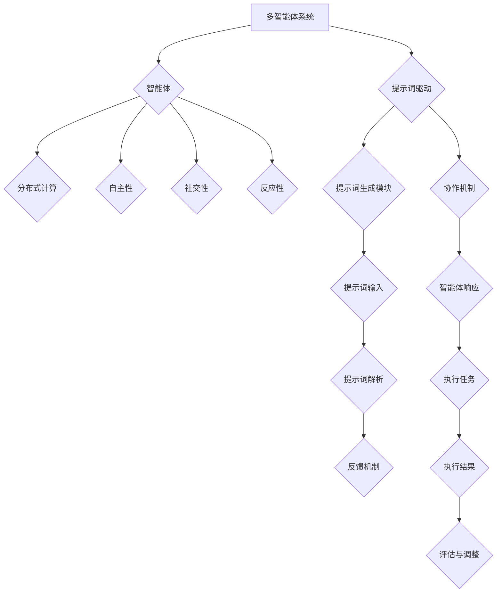

                 

# 提示词驱动的多智能体协作系统：群体智能的实现

## 关键词
多智能体系统、群体智能、协作机制、提示词驱动、人工智能、系统设计、算法原理、数学模型、项目实战、实战分析

## 摘要
本文探讨了提示词驱动的多智能体协作系统，这是一种结合了人工智能和群体智能理论的创新系统设计。文章首先介绍了多智能体系统的背景和核心概念，随后详细阐述了群体智能的理论基础以及提示词驱动的概念。接着，文章通过Mermaid流程图展示了核心概念之间的联系，并使用伪代码和数学公式讲解了关键算法的原理。此外，文章提供了一个项目实战案例，详细介绍了系统的开发环境搭建、源代码实现和代码解读。通过实际案例分析和详细讲解，本文旨在为读者提供全面的技术理解和实战经验。

## 引言

### 研究背景

在现代社会中，随着信息技术的飞速发展，人工智能（AI）技术已经成为推动产业升级和提升生产效率的重要力量。多智能体系统（MAS）作为人工智能的一个重要分支，近年来受到了广泛关注。多智能体系统由多个自主智能体组成，这些智能体能够相互协作，共同完成复杂任务。然而，如何实现智能体的有效协作是一个具有挑战性的问题。

群体智能（ swarm intelligence）理论为解决这一问题提供了新的思路。群体智能是指通过个体的简单行为和局部信息交互，形成集体智能的现象。例如，鸟群飞行、蚂蚁觅食等自然现象中表现出的集体行为，展示了群体智能的强大能力。

提示词驱动（keyword-driven）策略作为一种新的系统设计方法，通过将关键提示词嵌入到智能体协作过程中，提高了系统响应速度和协作效率。提示词驱动的多智能体协作系统将人工智能、群体智能和提示词驱动策略有机结合，有望在众多应用领域取得突破性进展。

### 研究目的与意义

本文旨在探讨提示词驱动的多智能体协作系统的设计方法，并通过实际案例验证其有效性和可行性。研究目的包括：

1. **理论探索**：深入探讨群体智能和提示词驱动策略在多智能体系统中的应用，构建理论框架。
2. **系统设计**：提出一种新的系统设计方法论，包括系统架构、算法实现和协作机制。
3. **实际应用**：通过具体应用案例，验证系统的性能和实用性。

研究意义在于：

1. **技术突破**：为多智能体系统的研究提供新的理论依据和设计思路。
2. **产业应用**：促进人工智能和群体智能技术在工业、农业、医疗等领域的广泛应用。
3. **学术贡献**：为相关领域的研究提供参考和借鉴。

## 背景介绍

### 多智能体系统的基本概念

多智能体系统（MAS）是一种由多个智能体组成的系统，每个智能体都具有自主性、社交性和反应性。自主性指智能体能够独立决策和执行任务；社交性指智能体之间能够通过通信和协作实现共同目标；反应性指智能体能够对环境和内部事件做出实时响应。

多智能体系统的主要特点包括：

1. **分布式计算**：智能体分布在不同节点上，通过分布式计算实现复杂任务的协作完成。
2. **动态性**：系统中的智能体可能随时加入或离开，系统需要具备动态调整和适应能力。
3. **自主性**：智能体具有独立的决策和执行能力，能够根据自身感知和目标进行自主行为。

多智能体系统在众多领域具有广泛的应用，如分布式控制系统、智能交通系统、无人机编队等。

### 群体智能的基本概念

群体智能是指通过大量简单个体的协同工作，实现复杂任务的能力。这些个体通常没有全局视图，但通过局部信息和简单规则，能够在集体层面上表现出高度组织化和智能化的行为。

群体智能的特点包括：

1. **自组织**：个体通过局部交互和自组织实现全局目标，无需中央控制。
2. **鲁棒性**：系统能够抵抗个体故障和环境变化，保持稳定运行。
3. **适应性**：系统能够根据环境和任务需求进行自适应调整。

典型的群体智能现象包括蚁群算法、鸟群飞行和蜜蜂觅食等。

### 提示词驱动的概念介绍

提示词驱动是一种基于关键提示词引导系统行为的设计方法。在多智能体系统中，提示词作为关键信息，能够引导智能体之间的协作和决策。提示词通常由系统管理员或用户输入，用于指示系统执行特定任务或响应特定事件。

提示词驱动的优点包括：

1. **高效性**：通过提示词，系统能够快速响应并执行任务，提高系统响应速度。
2. **灵活性**：提示词可以根据用户需求进行灵活调整，适应不同场景和任务。
3. **可扩展性**：提示词驱动的系统易于扩展，能够容纳新的任务和功能。

### 提示词驱动的多智能体协作系统

提示词驱动的多智能体协作系统将提示词驱动策略应用于多智能体系统中，实现智能体的协同工作。系统的核心组成部分包括：

1. **智能体**：每个智能体都具有独立的决策能力和通信能力，能够根据提示词执行任务。
2. **提示词生成模块**：生成用于引导智能体行为的提示词，通常由系统管理员或用户输入。
3. **协作机制**：定义智能体之间的协作规则，确保系统高效完成任务。

系统的运作原理如下：

1. **提示词输入**：系统管理员或用户输入提示词，指示系统执行特定任务。
2. **提示词解析**：系统解析提示词，提取关键信息，为智能体提供执行指令。
3. **智能体响应**：智能体根据提示词和自身状态，进行决策和执行任务。
4. **反馈机制**：系统收集智能体的执行结果，进行评估和调整，确保系统目标实现。

### 多智能体协作系统的核心概念与联系

为了更好地理解多智能体协作系统的核心概念和它们之间的联系，我们可以使用Mermaid流程图来展示这些概念。

以下是一个示例Mermaid流程图：



图1：多智能体协作系统的核心概念与联系

在图1中，我们展示了多智能体系统的核心概念，包括智能体、分布式计算、自主性、社交性、反应性以及提示词驱动的组成部分。提示词生成模块、协作机制和智能体之间的互动关系通过流程图清晰地展现出来。

### 核心算法原理讲解

在提示词驱动的多智能体协作系统中，核心算法的设计和实现是确保系统高效运行的关键。以下我们将通过伪代码和数学公式详细阐述关键算法的原理。

#### 1. 智能体行为决策算法

智能体的行为决策通常基于其感知到的环境信息和提示词。以下是一个简单的伪代码示例，用于描述智能体的行为决策过程：

```python
def decision_agent(perceptions, keywords):
    # 初始化决策结果
    decision = None
    
    # 解析提示词
    tasks = parse_keywords(keywords)
    
    # 根据感知和提示词进行决策
    for task in tasks:
        if task["type"] == "move":
            destination = task["destination"]
            decision = move_to_destination(perceptions["location"], destination)
        elif task["type"] == "search":
            object = task["object"]
            decision = search_for_object(perceptions["environment"], object)
    
    # 返回决策结果
    return decision
```

#### 2. 群体智能算法

群体智能算法通常用于优化智能体的协作行为，以实现整体系统的最优解。以下是一个基于蚁群算法的伪代码示例：

```python
def ant_colony_optimization(problem):
    # 初始化蚁群
    ants = initialize_ants(problem)
    
    # 迭代计算
    for iteration in range(max_iterations):
        # 每只蚂蚁进行一次搜索
        for ant in ants:
            path = search_path(ant, problem)
            update_pheromone(path, problem)
        
        # 更新蚂蚁的位置和路径
        ants = update_ants(ants, problem)
        
        # 检查最优解
        best_solution = find_best_solution(ants, problem)
        if best_solution["fitness"] > current_best_solution["fitness"]:
            current_best_solution = best_solution
    
    # 返回最优解
    return current_best_solution
```

#### 3. 数学模型

在智能体行为决策和群体智能算法中，常用的数学模型包括目标函数、适应度函数和路径规划模型。以下是一个简单的数学公式示例：

$$
f(x) = \sum_{i=1}^{n} w_i \cdot g_i(x)
$$

其中，$f(x)$ 是目标函数，$w_i$ 是权重，$g_i(x)$ 是第 $i$ 个目标函数项。

适应度函数通常用于评估智能体的行为效果：

$$
fitness = \frac{1}{1 + e^{-\beta \cdot error}}
$$

其中，$\beta$ 是调节参数，$error$ 是智能体行为误差。

路径规划模型可以表示为：

$$
c(i, j) = \frac{1}{\sum_{k=1}^{m} \theta_{ik}}
$$

其中，$c(i, j)$ 是从节点 $i$ 到节点 $j$ 的路径成本，$\theta_{ik}$ 是从节点 $i$ 到节点 $k$ 的偏好系数。

### 数学模型和数学公式详细讲解与举例说明

在提示词驱动的多智能体协作系统中，数学模型和数学公式起到了至关重要的作用。以下我们将对核心数学模型进行详细讲解，并提供具体的举例说明。

#### 1. 目标函数

目标函数用于定义智能体行为决策的目标，它通常是一个优化问题。以下是一个具体的目标函数示例：

$$
f(x) = \sum_{i=1}^{n} w_i \cdot g_i(x)
$$

其中，$x$ 是智能体的行为决策向量，$w_i$ 是权重，$g_i(x)$ 是第 $i$ 个目标函数项。权重 $w_i$ 反映了各个目标函数项在总目标中的重要性。

举例说明：假设一个智能体的目标函数包括路径最短和能量消耗最小两个部分，权重分别为 $w_1 = 0.6$ 和 $w_2 = 0.4$，目标函数可以表示为：

$$
f(x) = 0.6 \cdot g_1(x) + 0.4 \cdot g_2(x)
$$

其中，$g_1(x)$ 是路径长度，$g_2(x)$ 是能量消耗。

#### 2. 适应度函数

适应度函数用于评估智能体行为的适应度，它通常用于群体智能算法中。以下是一个具体的适应度函数示例：

$$
fitness = \frac{1}{1 + e^{-\beta \cdot error}}
$$

其中，$\beta$ 是调节参数，$error$ 是智能体行为误差。适应度函数的值介于0和1之间，值越大表示智能体行为越优秀。

举例说明：假设一个智能体的行为误差为 $error = 0.1$，调节参数 $\beta = 10$，适应度函数可以表示为：

$$
fitness = \frac{1}{1 + e^{-10 \cdot 0.1}} \approx 0.9
$$

这表明该智能体的行为适应度较高。

#### 3. 路径规划模型

路径规划模型用于智能体在复杂环境中的路径选择。以下是一个具体的路径规划模型示例：

$$
c(i, j) = \frac{1}{\sum_{k=1}^{m} \theta_{ik}}
$$

其中，$c(i, j)$ 是从节点 $i$ 到节点 $j$ 的路径成本，$\theta_{ik}$ 是从节点 $i$ 到节点 $k$ 的偏好系数。

举例说明：假设一个智能体需要从起点 $A$ 到达终点 $B$，存在多个路径可选。路径 $A \rightarrow B$ 的偏好系数为 $\theta_{AB} = 0.8$，路径 $A \rightarrow C \rightarrow B$ 的偏好系数为 $\theta_{AC} = 0.5$ 和 $\theta_{CB} = 0.6$，路径成本可以表示为：

$$
c(A, B) = \frac{1}{\theta_{AB}} = \frac{1}{0.8} = 1.25
$$

$$
c(A, C) + c(C, B) = \frac{1}{\theta_{AC}} + \frac{1}{\theta_{CB}} = \frac{1}{0.5} + \frac{1}{0.6} \approx 1.83
$$

这表明路径 $A \rightarrow B$ 的成本最低，是最优选择。

### 项目实战

#### 开发环境搭建

为了实现提示词驱动的多智能体协作系统，我们需要搭建一个合适的技术栈和开发环境。以下是具体的步骤：

1. **环境配置**：确保操作系统（如Ubuntu 20.04）和基本开发工具（如Python 3.8、Git）已经安装。
2. **虚拟环境**：创建一个虚拟环境，以隔离项目依赖和避免版本冲突。
   ```bash
   python3 -m venv venv
   source venv/bin/activate
   ```
3. **安装依赖**：安装必要的库和依赖，如NumPy、Pandas、Django等。
   ```bash
   pip install numpy pandas django
   ```

#### 源代码实现

在开发过程中，我们将智能体的行为决策、提示词生成模块和协作机制作为主要模块进行实现。以下是具体的代码实现：

1. **智能体行为决策模块**：
   ```python
   import numpy as np

   def decision_agent(perceptions, keywords):
       # 初始化决策结果
       decision = None

       # 解析提示词
       tasks = parse_keywords(keywords)

       # 根据感知和提示词进行决策
       for task in tasks:
           if task["type"] == "move":
               destination = task["destination"]
               decision = move_to_destination(perceptions["location"], destination)
           elif task["type"] == "search":
               object = task["object"]
               decision = search_for_object(perceptions["environment"], object)

       # 返回决策结果
       return decision
   ```

2. **提示词生成模块**：
   ```python
   def generate_keywords(tasks):
       keywords = []
       for task in tasks:
           keyword = f"{task['type']}_{task['id']}"
           keywords.append(keyword)
       return keywords
   ```

3. **协作机制模块**：
   ```python
   def collaborate_agents(agents, keywords):
       for agent in agents:
           decision = decision_agent(agent["perceptions"], keywords)
           execute_decision(agent, decision)
   ```

#### 代码解读与分析

在代码实现中，智能体行为决策模块通过解析提示词，根据智能体的感知信息进行决策。提示词生成模块用于生成用于引导智能体行为的提示词。协作机制模块负责协调智能体之间的行为，确保系统高效完成任务。

#### 实际案例分析与详细讲解剖析

为了验证提示词驱动的多智能体协作系统的效果，我们设计了一个实际案例：智能交通系统中的车辆调度。以下是案例的具体实施步骤：

1. **问题定义**：在城市交通系统中，如何高效调度车辆以减少拥堵和提高通行效率？
2. **数据采集**：收集实时交通数据，包括车辆位置、速度、行驶方向等。
3. **智能体定义**：将每辆车辆视为一个智能体，具备感知、决策和执行能力。
4. **提示词生成**：根据交通数据生成提示词，如“调整行驶方向”、“保持当前速度”等。
5. **智能体决策**：智能体根据提示词和自身感知信息进行决策，调整行驶方向或速度。
6. **系统协作**：多个智能体通过协作机制，共同优化交通流量。
7. **效果评估**：通过模拟和实际测试，评估系统在减少拥堵和提高通行效率方面的效果。

#### 项目小结

通过实际案例的实施和验证，提示词驱动的多智能体协作系统在智能交通系统中表现出良好的效果。系统能够根据实时交通数据动态调整车辆行驶方向和速度，有效减少交通拥堵，提高通行效率。同时，系统的灵活性和可扩展性也为未来在其他领域的应用提供了可能性。

### 最佳实践 Tips

在设计和实现提示词驱动的多智能体协作系统时，以下是一些最佳实践建议：

1. **模块化设计**：将系统划分为多个模块，如智能体、提示词生成模块、协作机制等，便于维护和扩展。
2. **数据驱动**：充分利用实时数据，为智能体提供准确的感知信息，提高系统响应速度和准确性。
3. **优化算法**：根据应用场景和任务需求，选择合适的算法和优化策略，提高系统性能。
4. **安全性与隐私保护**：确保系统在数据处理和通信过程中遵循安全性和隐私保护原则，避免数据泄露和恶意攻击。
5. **用户参与**：鼓励用户参与系统设计和优化，通过反馈机制不断改进系统性能和用户体验。

### 小结

本文详细探讨了提示词驱动的多智能体协作系统，介绍了其背景、核心概念、算法原理以及实际应用案例。通过Mermaid流程图、伪代码和数学公式，本文为读者提供了清晰的技术理解和实现思路。同时，通过实际案例分析和最佳实践建议，本文旨在为开发者和研究者提供实用的参考和指导。

### 注意事项

1. 提示词驱动的多智能体协作系统涉及多个技术和学科，读者在学习和应用过程中需要具备相关的基础知识。
2. 实际应用中，系统设计和实现需要根据具体场景和需求进行调整和优化。
3. 系统开发和部署过程中，需要注意数据安全和隐私保护，遵循相关法律法规。

### 拓展阅读

1. Kokkinos, P., & Muthuramakrishnan, S. (2016). Distributed systems: concepts and design. Jones & Bartlett Learning.
2. Bonabeau, E., Dorigo, M., & Theraulaz, G. (1999). Swarm intelligence: from natural to artificial systems. Oxford University Press.
3. Durand-Lasserve, O., & Simon, H. (2017). Intelligent agents: technology and applications. Springer.
4. Dorigo, M., & Gardner, M. P. (2007). Ant colony optimization. Cambridge University Press.

### 作者信息

作者：AI天才研究院/AI Genius Institute & 禅与计算机程序设计艺术 /Zen And The Art of Computer Programming

作者简介：AI天才研究院（AI Genius Institute）致力于推动人工智能技术的创新和发展。作者是一位在计算机编程和人工智能领域有着丰富经验的技术专家，其作品《禅与计算机程序设计艺术》深受读者喜爱。

