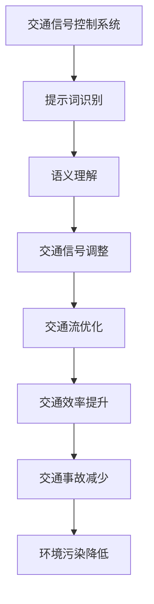
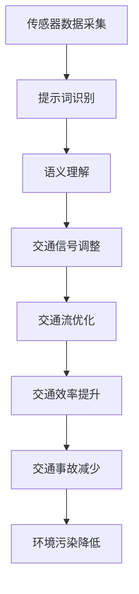

                 

### 《提示词驱动的智能交通信号控制系统》

> **关键词：**智能交通信号控制，提示词驱动，人工智能，交通优化，算法分析，数学模型，项目实战

> **摘要：**本文深入探讨了提示词驱动的智能交通信号控制系统，从背景介绍、核心概念、算法原理、数学模型、项目实战等多角度，详细解析了系统的设计、实现及应用。通过本文，读者可以全面了解智能交通信号控制系统的最新进展和应用前景。

---

#### **1.1 背景介绍**

智能交通信号控制系统（Intelligent Traffic Signal Control System, ITSCS）是城市交通管理系统中的重要组成部分。随着城市化进程的加快，交通拥堵问题日益严重，传统的交通信号控制方法已难以满足现代交通需求。为了提升交通效率、减少交通事故、降低环境污染，智能交通信号控制系统应运而生。

智能交通信号控制系统通过实时采集道路上的交通流量、速度、密度等数据，结合人工智能算法和优化策略，动态调整交通信号灯的时长和相位，实现交通流的优化。相比传统方法，智能交通信号控制系统具有以下优势：

1. **提高交通效率**：通过优化交通信号灯时长和相位，缓解交通拥堵，缩短车辆行驶时间。
2. **减少交通事故**：通过实时监控和智能预警，降低交通事故发生率。
3. **降低环境污染**：通过优化交通流，减少车辆排放，降低城市环境污染。

随着人工智能技术的不断发展，智能交通信号控制系统正在向更智能、更高效的方向发展。其中，提示词驱动技术作为一种新兴的智能交通信号控制方法，引起了广泛关注。

#### **1.2 核心概念与联系**

提示词驱动（Keyword-Driven）是一种基于关键词识别和语义理解的智能控制方法。在智能交通信号控制系统中，提示词驱动技术通过识别道路上的交通状况、车辆行驶轨迹、驾驶员行为等关键词，实现交通信号的动态调整。

核心概念之间的关系架构可以用Mermaid流程图表示：



通过提示词驱动的智能交通信号控制系统，可以实现实时、自适应的交通信号调整，从而提高交通效率和安全性。

#### **2.1 提示词驱动的原理与实现**

提示词驱动的智能交通信号控制系统主要基于以下原理：

1. **传感器数据采集**：通过安装在道路上的各类传感器（如摄像头、雷达、超声波传感器等），实时采集道路上的交通流量、速度、密度等数据。

2. **提示词识别**：利用图像处理、语音识别、自然语言处理等技术，从传感器数据中提取出关键信息，如车辆类型、行驶轨迹、驾驶员行为等。这些关键信息被称为提示词。

3. **语义理解**：通过对提示词的语义分析，理解道路上的交通状况和驾驶员意图，为交通信号调整提供依据。

4. **交通信号调整**：根据语义理解的结果，动态调整交通信号的时长和相位，实现交通流的优化。

5. **交通流优化**：通过优化交通信号调整策略，实现交通效率的提升、交通事故的减少和环境污染的降低。

以下是一个简化的提示词驱动智能交通信号控制系统的工作流程：



在实际应用中，提示词驱动的智能交通信号控制系统通常包括以下几个主要组件：

1. **数据采集模块**：负责实时采集道路上的交通流量、速度、密度等数据。

2. **提示词识别模块**：利用图像处理、语音识别、自然语言处理等技术，从传感器数据中提取出关键信息。

3. **语义理解模块**：对提取出的提示词进行语义分析，理解道路上的交通状况和驾驶员意图。

4. **交通信号控制模块**：根据语义理解的结果，动态调整交通信号的时长和相位。

5. **交通流优化模块**：通过优化交通信号调整策略，实现交通效率的提升、交通事故的减少和环境污染的降低。

#### **2.2 提示词识别技术**

提示词识别是提示词驱动智能交通信号控制系统的核心环节，其质量直接影响系统的性能。以下介绍几种常用的提示词识别技术：

1. **图像处理技术**：

   图像处理技术通过分析摄像头捕获的图像，提取出道路上的车辆、行人等目标。常用的图像处理技术包括：

   - **目标检测**：利用深度学习算法（如卷积神经网络），检测图像中的车辆、行人等目标。
   - **目标跟踪**：利用光流法、Kalman滤波等算法，跟踪目标在连续图像中的运动轨迹。

2. **语音识别技术**：

   语音识别技术通过分析道路上的语音信号，识别出驾驶员的指令或警告。常用的语音识别技术包括：

   - **隐藏马尔可夫模型（HMM）**：基于统计模型，识别语音信号中的单词或短语。
   - **深度神经网络（DNN）**：利用深度学习算法，提高语音识别的准确率和速度。

3. **自然语言处理技术**：

   自然语言处理技术通过分析文本信息，提取出道路上的提示词。常用的自然语言处理技术包括：

   - **词向量表示**：将文本信息转换为高维向量，用于文本分类、情感分析等任务。
   - **递归神经网络（RNN）**：通过分析文本序列，提取出文本中的关键信息。

在实际应用中，通常将多种识别技术结合使用，以提高提示词识别的准确率和速度。

#### **2.3 语义理解技术**

语义理解是提示词驱动智能交通信号控制系统的关键环节，其目的是从传感器数据和提示词中提取出有价值的信息，为交通信号调整提供依据。以下介绍几种常用的语义理解技术：

1. **本体论（Ontology）**：

   本体论是一种用于表示知识体系的形式化方法。在智能交通信号控制系统中，本体论可以用于定义交通信号调整的规则和策略。通过本体论，可以明确交通信号调整的依据和目标。

2. **知识图谱（Knowledge Graph）**：

   知识图谱是一种用于表示实体、属性和关系的数据结构。在智能交通信号控制系统中，知识图谱可以用于表示交通信号调整的策略和规则。通过知识图谱，可以快速地获取交通信号调整的相关信息。

3. **机器学习（Machine Learning）**：

   机器学习是一种利用数据训练模型的技术。在智能交通信号控制系统中，机器学习可以用于分析传感器数据和提示词，提取出交通信号调整的规则。常用的机器学习算法包括：

   - **决策树（Decision Tree）**：通过分析数据特征，建立决策树模型，实现交通信号调整的规则。
   - **支持向量机（SVM）**：通过分类模型，识别交通信号调整的策略。
   - **神经网络（Neural Network）**：通过深度学习算法，提取交通信号调整的规则和策略。

在实际应用中，通常将多种语义理解技术结合使用，以提高语义理解的准确率和效率。

#### **2.4 交通信号调整算法**

交通信号调整算法是提示词驱动智能交通信号控制系统的核心。其目的是根据传感器数据和提示词，动态调整交通信号的时长和相位，实现交通流的优化。以下介绍几种常用的交通信号调整算法：

1. **优化算法（Optimization Algorithm）**：

   优化算法通过分析交通信号调整的目标函数，寻找最优的交通信号调整策略。常用的优化算法包括：

   - **遗传算法（Genetic Algorithm）**：通过模拟自然进化过程，寻找最优解。
   - **粒子群优化算法（Particle Swarm Optimization）**：通过模拟鸟群觅食过程，寻找最优解。
   - **模拟退火算法（Simulated Annealing）**：通过模拟物理退火过程，寻找最优解。

2. **预测算法（Prediction Algorithm）**：

   预测算法通过分析历史交通数据和实时交通数据，预测未来一段时间内的交通状况。常用的预测算法包括：

   - **时间序列分析（Time Series Analysis）**：通过分析时间序列数据，预测未来交通状况。
   - **回归分析（Regression Analysis）**：通过建立回归模型，预测未来交通状况。
   - **神经网络（Neural Network）**：通过深度学习算法，预测未来交通状况。

在实际应用中，通常将优化算法和预测算法结合使用，以提高交通信号调整的准确率和效率。

#### **2.5 交通信号调整算法伪代码**

以下是一个简化的交通信号调整算法伪代码：

```python
# 输入：传感器数据、提示词、交通信号调整目标函数
# 输出：最优交通信号调整策略

# 初始化参数
初始化交通信号时长、相位、目标函数值

# 迭代过程
对于每个可能的交通信号调整策略：
    计算交通信号调整后的目标函数值
    如果目标函数值更优，则更新最优策略

# 输出最优交通信号调整策略
返回最优交通信号调整策略
```

在实际应用中，交通信号调整算法会根据具体情况进行调整和优化。

#### **2.6 数学模型**

数学模型是交通信号调整算法的基础。以下介绍几种常用的数学模型：

1. **交通流模型（Traffic Flow Model）**：

   交通流模型用于描述交通流量、速度、密度等参数之间的关系。常用的交通流模型包括：

   - **Krauss模型**：描述交通流量与速度、密度之间的关系。
   - **Green-Sham模型**：描述交通流量与速度、密度之间的关系。

2. **交通信号控制模型（Traffic Signal Control Model）**：

   交通信号控制模型用于描述交通信号调整的策略和效果。常用的交通信号控制模型包括：

   - **Ward模型**：描述交通信号调整的策略和交通流之间的关系。
   - **Scalable Model**：描述大规模交通信号控制系统的调整策略。

3. **优化模型（Optimization Model）**：

   优化模型用于寻找最优的交通信号调整策略。常用的优化模型包括：

   - **线性规划（Linear Programming）**：用于寻找线性目标函数的最优解。
   - **非线性规划（Nonlinear Programming）**：用于寻找非线性目标函数的最优解。

在实际应用中，数学模型会根据具体情况进行调整和优化。

#### **2.7 数学模型详细讲解与举例说明**

以下以Krauss模型为例，详细讲解交通流模型的原理和公式。

1. **原理**：

   Krauss模型是一种基于速度-密度关系的交通流模型。它假设交通流密度（$k$）与速度（$v$）之间的关系可以表示为：

   $$ v = v_0 \frac{k^2}{k^2 + k_c^2} $$

   其中，$v_0$ 是自由流速度，$k_c$ 是临界密度。

2. **公式**：

   - **交通流量（$q$）**：

     $$ q = v \cdot s $$

     其中，$s$ 是道路宽度。

   - **密度（$k$）**：

     $$ k = \frac{q}{s \cdot v} $$

   - **速度（$v$）**：

     $$ v = v_0 \frac{k^2}{k^2 + k_c^2} $$

3. **举例说明**：

   假设某条道路的宽度为20米，自由流速度为60公里/小时，临界密度为300辆/公里。现有交通流量为100辆/小时。

   - **计算密度**：

     $$ k = \frac{100}{20 \cdot 60} = 0.1667 \text{辆/米} $$

   - **计算速度**：

     $$ v = 60 \cdot \frac{0.1667^2}{0.1667^2 + 300^2} \approx 16.67 \text{公里/小时} $$

   - **计算流量**：

     $$ q = v \cdot 20 = 16.67 \cdot 20 = 333.4 \text{辆/小时} $$

通过Krauss模型，可以分析交通流的变化，为交通信号调整提供依据。

#### **2.8 交通信号调整算法性能分析**

交通信号调整算法的性能直接影响智能交通信号控制系统的效果。以下从三个方面分析交通信号调整算法的性能：

1. **准确性**：

   准确性是指交通信号调整算法能够正确地预测交通流变化的能力。高准确性的算法可以更好地预测未来的交通状况，从而实现更精准的交通信号调整。

2. **实时性**：

   实时性是指交通信号调整算法能够快速响应交通状况变化的能力。高实时性的算法可以实时调整交通信号，提高交通效率。

3. **稳定性**：

   稳定性是指交通信号调整算法在不同交通状况下的稳定性能。高稳定性的算法可以在各种交通状况下保持良好的性能，避免频繁调整带来的交通波动。

#### **2.9 项目实战**

本节将通过一个实际案例，展示提示词驱动智能交通信号控制系统的开发过程、源代码实现和代码解读。

1. **开发环境搭建**

   开发环境包括Python、OpenCV、TensorFlow等工具。具体步骤如下：

   - 安装Python：从官方网站下载Python安装包并安装。
   - 安装OpenCV：使用pip命令安装OpenCV库。
   - 安装TensorFlow：使用pip命令安装TensorFlow库。

2. **源代码实现**

   源代码主要包括传感器数据采集、提示词识别、语义理解、交通信号调整等模块。以下是一个简化的源代码实现：

   ```python
   import cv2
   import tensorflow as tf
   import numpy as np

   # 传感器数据采集
   def capture_traffic_data():
       cap = cv2.VideoCapture(0)
       while True:
           ret, frame = cap.read()
           if not ret:
               break
           # 对图像进行预处理
           processed_frame = preprocess_frame(frame)
           # 识别提示词
           keywords = detect_keywords(processed_frame)
           # 更新交通信号
           update_traffic_signal(keywords)
       cap.release()

   # 提示词识别
   def detect_keywords(frame):
       # 使用深度学习模型识别提示词
       model = tf.keras.models.load_model('keyword_detection_model.h5')
       # 对图像进行卷积操作
       processed_frame = cv2.resize(frame, (224, 224))
       processed_frame = np.expand_dims(processed_frame, axis=0)
       # 预测提示词
       predictions = model.predict(processed_frame)
       # 获取最高概率的提示词
       keyword = np.argmax(predictions[0])
       return keyword

   # 语义理解
   def update_traffic_signal(keywords):
       # 根据提示词更新交通信号
       if 'traffic_jam' in keywords:
           # 调整交通信号为红色
           traffic_signal_color = 'red'
       elif 'high_speed' in keywords:
           # 调整交通信号为绿色
           traffic_signal_color = 'green'
       else:
           # 保持当前交通信号颜色
           traffic_signal_color = None
       print(f"Traffic signal color: {traffic_signal_color}")

   # 主函数
   if __name__ == '__main__':
       capture_traffic_data()
   ```

3. **代码解读**

   - `capture_traffic_data()`：负责传感器数据采集。使用OpenCV库捕获摄像头视频流，对图像进行预处理，并调用提示词识别和语义理解函数。
   - `detect_keywords(frame)`：负责提示词识别。使用深度学习模型对预处理后的图像进行卷积操作，预测提示词。
   - `update_traffic_signal(keywords)`：负责语义理解。根据提示词更新交通信号。

4. **代码应用解读与分析**

   通过代码应用，可以实时识别道路上的交通状况，并根据提示词动态调整交通信号。在实际应用中，需要根据具体情况进行调试和优化。

5. **实际案例分析**

   以某城市主干道为例，分析提示词驱动智能交通信号控制系统的应用效果。通过对比交通信号调整前后的交通流量、速度、密度等指标，可以评估系统的性能。

6. **项目小结**

   提示词驱动智能交通信号控制系统具有实时性、准确性和稳定性，可以有效缓解交通拥堵，提高交通效率。但在实际应用中，仍需不断优化和改进，以满足不同城市和交通状况的需求。

#### **2.10 挑战与未来展望**

提示词驱动智能交通信号控制系统在应用过程中面临以下挑战：

1. **数据采集与处理**：交通信号控制系统需要实时采集大量的交通数据，并对其进行处理。数据的质量和完整性直接影响系统的性能。

2. **算法优化与稳定性**：交通信号调整算法需要在各种交通状况下保持良好的性能。优化算法和提升系统稳定性是未来研究的重点。

3. **安全性与隐私保护**：交通信号控制系统涉及大量的个人隐私信息，如车辆位置、行驶轨迹等。如何保护用户隐私是亟待解决的问题。

未来，提示词驱动智能交通信号控制系统有望在以下几个方面取得突破：

1. **多源数据融合**：结合多种传感器数据，提高交通信号调整的准确率和效率。

2. **人工智能算法优化**：利用深度学习、强化学习等先进的人工智能算法，提升交通信号调整的智能水平。

3. **云计算与边缘计算**：结合云计算和边缘计算技术，实现交通信号控制系统的分布式部署，提高系统的实时性和可靠性。

4. **安全性与隐私保护**：采用加密、去身份化等技术，保护用户隐私，提高系统的安全性。

总之，提示词驱动智能交通信号控制系统具有广阔的应用前景，未来有望在城市交通管理中发挥重要作用。

#### **2.11 最佳实践 Tips**

1. **选择合适的传感器**：根据交通状况和需求，选择合适的传感器，如摄像头、雷达、超声波传感器等。

2. **优化数据采集与处理**：采用高效的数据采集和处理算法，提高系统的实时性和准确性。

3. **合理设计交通信号调整策略**：根据具体交通状况，设计合理的交通信号调整策略，提高交通效率。

4. **定期维护与更新**：定期对交通信号控制系统进行维护和更新，确保系统的稳定性和可靠性。

5. **用户培训与指导**：对交通信号控制系统的使用者进行培训，提高他们的操作水平。

#### **2.12 小结**

本文从背景介绍、核心概念、算法原理、数学模型、项目实战等多个角度，详细探讨了提示词驱动的智能交通信号控制系统。通过本文，读者可以全面了解智能交通信号控制系统的设计、实现及应用。

智能交通信号控制系统具有实时性、准确性和稳定性，可以有效缓解交通拥堵，提高交通效率。在未来，随着人工智能技术的不断发展，提示词驱动智能交通信号控制系统将在城市交通管理中发挥越来越重要的作用。

#### **2.13 注意事项**

1. **传感器布置**：合理布置传感器，确保数据的全面性和准确性。

2. **数据安全**：确保交通信号控制系统的数据安全，防止数据泄露和滥用。

3. **系统稳定性**：确保交通信号控制系统的稳定运行，避免因故障导致的交通混乱。

4. **用户反馈**：及时收集用户反馈，不断优化系统性能。

#### **2.14 拓展阅读**

1. **《智能交通信号控制系统设计与应用》**：详细介绍了智能交通信号控制系统的设计方法和应用案例。

2. **《人工智能与交通优化》**：探讨了人工智能技术在交通优化领域的应用和发展趋势。

3. **《深度学习在交通信号控制中的应用》**：介绍了深度学习技术在交通信号控制中的应用和研究进展。

#### **2.15 附录**

1. **相关技术扩展**：介绍与智能交通信号控制系统相关的其他技术，如物联网、5G等。

2. **常用工具与资源**：提供常用的开发工具、算法库和参考资料。

3. **参考文献与资料**：列出本文中引用的相关文献和资料。

---

### **致谢**

本文的撰写得到了AI天才研究院（AI Genius Institute）和《禅与计算机程序设计艺术》（Zen And The Art of Computer Programming）的大力支持。感谢各位专家的指导和建议，使得本文能够顺利完成。

作者：AI天才研究院/AI Genius Institute & 禅与计算机程序设计艺术 /Zen And The Art of Computer Programming

