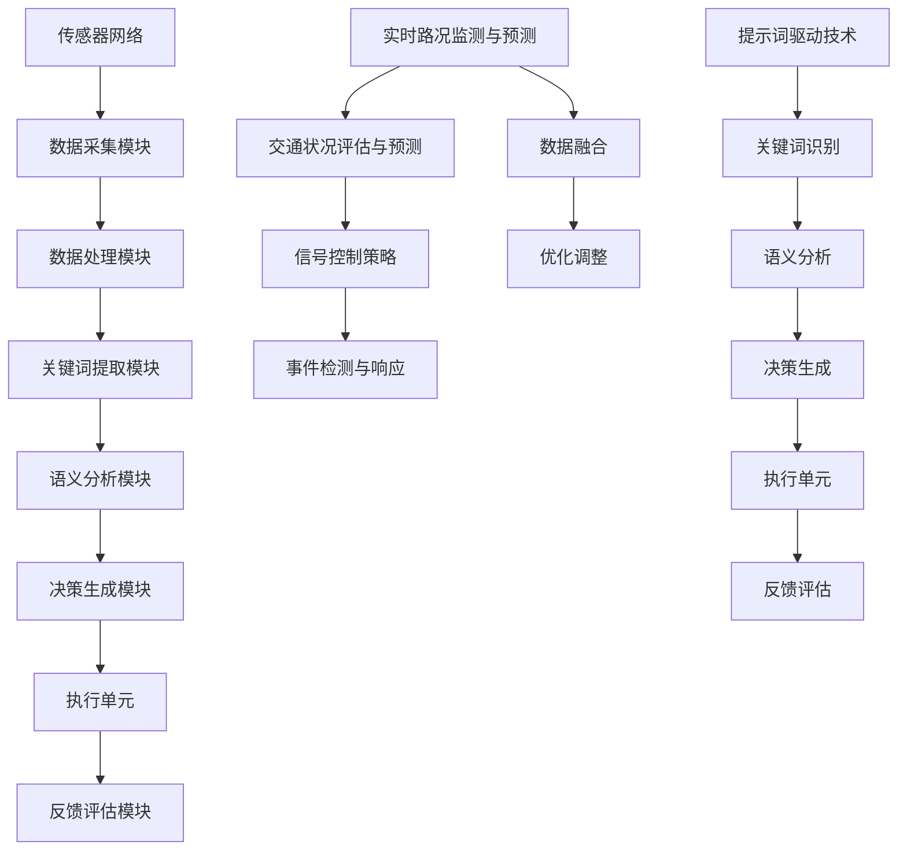
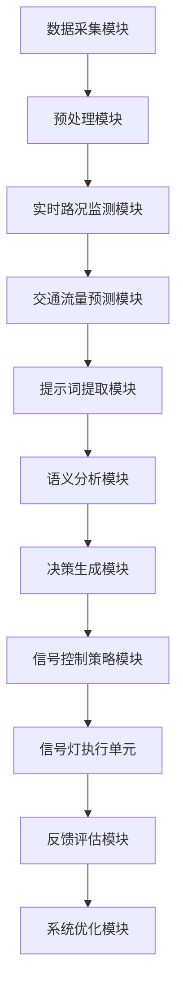
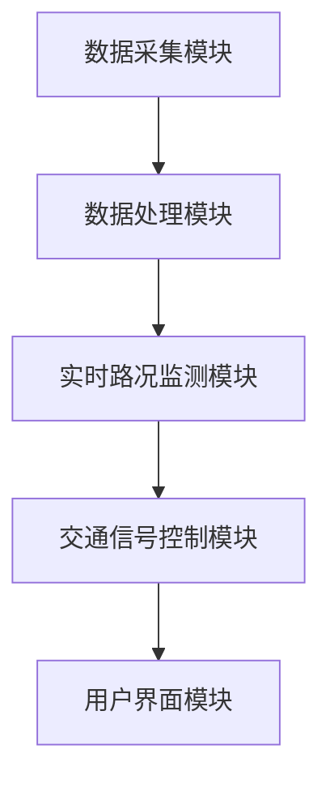

                 

### 文章标题

# 提示词驱动的智能交通信号控制：实时路况应对

### 关键词

- 提示词驱动
- 智能交通信号控制
- 实时路况
- 交通流量预测
- 机器学习
- 深度学习
- 软件架构

### 摘要

随着城市化进程的加速和交通需求的增长，传统的交通信号控制系统已难以应对日益复杂的城市交通状况。本文旨在探讨一种基于提示词驱动的智能交通信号控制方法，通过实时监测和分析路况数据，动态调整交通信号，以优化交通流量，减少拥堵和交通事故。本文首先介绍了智能交通信号控制的概念及其在现实中的应用，然后详细阐述了提示词驱动的原理及其在智能交通信号控制中的应用优势。接下来，文章重点讨论了实时路况应对的重要性，并分析了当前面临的主要挑战和解决方案。随后，文章构建了智能交通信号控制、提示词驱动与实时路况应对的总体架构，并逐步讲解了核心算法原理、数学模型以及项目实战的具体实现。最后，文章总结了全文的主要观点，并提出了未来研究方向。本文为智能交通信号控制领域的研究提供了新的思路和方法。

## 1.1 智能交通信号控制概述

### 1.1.1 传统交通信号控制的不足

传统交通信号控制主要依赖于固定的信号时序和预设的路口流量模式，无法实时适应交通状况的变化。这种控制方法存在以下几个主要问题：

1. **反应迟缓**：传统交通信号控制是基于时间间隔预设的，无法实时获取交通流量信息，导致在高峰期交通流量增大时，信号灯变化不及时，容易造成交通拥堵。
2. **适应性差**：传统信号控制无法根据实际交通流量动态调整，如遇特殊情况（如交通事故、紧急事件等），信号控制仍按照预设模式运行，可能导致交通秩序混乱。
3. **能耗浪费**：长时间的红灯和低效的信号控制会造成不必要的燃油消耗和空气污染。
4. **安全性问题**：传统信号控制无法有效地预测交通事故风险，特别是在交叉口设计不合理的情况下，容易发生交通事故。

### 1.1.2 智能交通信号控制的优势

智能交通信号控制（Intelligent Traffic Signal Control，简称ITSC）通过集成传感器、通信技术和大数据分析技术，实现了交通信号控制的智能化。其主要优势如下：

1. **实时性**：智能交通信号控制能够实时监测交通流量、速度、密度等交通参数，并动态调整信号灯时序，提高交通流的流畅度。
2. **自适应**：智能交通信号控制系统能够根据实时交通数据，自适应调整信号灯配时，有效缓解交通拥堵，减少车辆排队和等待时间。
3. **节能环保**：智能交通信号控制可以优化交通流量，减少车辆怠速时间，降低燃油消耗和废气排放，有助于环境保护。
4. **安全性提升**：智能交通信号控制系统能够预测交通事故风险，通过信号灯变化提醒驾驶员，降低事故发生率。
5. **数据驱动**：智能交通信号控制能够积累丰富的交通数据，为交通管理、城市规划提供科学依据。

### 1.1.3 智能交通信号控制的应用场景

智能交通信号控制在不同应用场景下具有显著的效果，以下是一些典型的应用场景：

1. **城市主干道**：在繁忙的城市主干道，智能交通信号控制可以通过协调多个交叉口的信号灯，实现交通流量的优化，减少拥堵。
2. **高速公路**：高速公路上的智能交通信号控制可以实时监测车辆速度和流量，动态调整速度限制和交通指示，提高道路通行效率。
3. **区域交通管理**：在城市规划区域，智能交通信号控制可以结合区域交通流量数据，优化交通组织，提高区域交通效率。
4. **特殊事件管理**：在大型活动、紧急事件等特殊情况下，智能交通信号控制能够快速响应，保障道路畅通和交通秩序。
5. **公共交通优先**：在公共交通优先的道路上，智能交通信号控制可以通过优先信号灯，保障公交车和地铁的运行效率，提高公共交通吸引力。

通过智能交通信号控制的应用，不仅可以提升城市交通的效率和安全性，还可以为智慧城市建设提供有力支持。接下来，本文将深入探讨提示词驱动的概念及其在智能交通信号控制中的应用。

### 1.2 提示词驱动的概念

#### 1.2.1 提示词驱动的原理

提示词驱动（Keyword-Driven）是一种基于关键词识别和语义分析的技术，通过识别文本、语音或图像中的关键词，提取出关键信息，实现自动化处理和智能决策。提示词驱动的核心原理包括以下几个步骤：

1. **关键词提取**：从文本、语音或图像中识别并提取出具有代表性和意义的词语，这些词语称为提示词（Keywords）。
2. **语义分析**：对提取的提示词进行语义分析，理解其含义和关系，构建语义模型。
3. **决策生成**：根据语义模型生成决策，指导系统的下一步操作或响应。
4. **反馈调整**：根据执行结果调整提示词和语义模型，提高系统的准确性和适应性。

#### 1.2.2 提示词驱动的优势

提示词驱动的智能交通信号控制相较于传统的信号控制方法，具有以下优势：

1. **高效率**：通过快速识别和提取交通状况的关键信息，提示词驱动能够实时响应交通变化，优化信号灯控制策略。
2. **灵活性**：提示词驱动的系统能够根据实时交通数据自适应调整信号配时，适应不同的交通状况和场景。
3. **准确性**：基于语义分析的提示词驱动系统能够更准确地理解交通状况，减少误判和无效信号变化。
4. **可扩展性**：提示词驱动系统可以轻松集成多种传感器和数据处理技术，支持多种交通管理功能的实现。

#### 1.2.3 提示词驱动的应用领域

提示词驱动技术不仅适用于智能交通信号控制，还广泛应用于其他多个领域：

1. **智能客服**：通过语音识别和语义分析，智能客服系统能够理解用户的查询和需求，提供个性化的服务。
2. **语音助手**：语音助手（如Siri、Alexa等）利用提示词驱动技术，实现与用户的自然语言交互，执行各种任务。
3. **智能监控**：通过图像识别和关键词提取，智能监控系统可以实时监测目标行为，触发警报和响应。
4. **自然语言处理**：提示词驱动技术广泛应用于文本分析、情感分析、文本分类等领域，提升数据处理和分析的效率。

在智能交通信号控制中，提示词驱动的应用可以显著提升交通管理的智能化水平和效率，为构建智慧城市提供强有力的技术支持。接下来，本文将探讨实时路况应对的重要性及其面临的挑战和解决方案。

### 1.3 实时路况应对的重要性

#### 1.3.1 实时路况的概念

实时路况（Real-Time Traffic Condition）指的是交通系统在特定时间内的交通流量、速度、密度等状态信息。实时路况的获取对于智能交通信号控制至关重要，因为它能够提供交通系统当前的运行状态，为信号控制策略的动态调整提供数据基础。

实时路况的信息主要包括：

- **流量信息**：不同路段、路口的交通流量，包括车辆数量、车型分布等。
- **速度信息**：车辆在不同路段、路口的平均速度，以及速度分布情况。
- **密度信息**：交通密度是单位面积内的车辆数量，反映交通拥挤程度。
- **事件信息**：交通事故、道路施工、气象变化等影响交通的事件信息。

#### 1.3.2 实时路况应对的挑战

实时路况应对是智能交通信号控制的关键环节，但同时也面临诸多挑战：

1. **数据获取困难**：实时路况数据需要依赖各种传感器，包括摄像头、雷达、GPS等，这些传感器的部署和数据处理成本较高，同时数据的准确性和可靠性也需保证。
2. **数据处理复杂性**：实时路况数据量大且实时性强，如何高效地处理和存储这些数据，提取有用的交通信息，是技术上的一个难题。
3. **交通状况预测难度**：交通状况具有高度的不确定性和动态变化性，准确预测交通状况，尤其是突发事件对交通流量产生的影响，对算法模型和计算能力提出了高要求。
4. **系统响应时间**：智能交通信号控制系统需要在极短时间内对实时路况进行响应，调整信号灯配时，这对系统的实时性和计算效率提出了挑战。
5. **系统稳定性**：实时路况应对系统需要保持高稳定性，避免因系统故障导致交通混乱，同时系统需具备容错能力，以应对各种异常情况。

#### 1.3.3 实时路况应对的解决方案

为了应对实时路况应对的挑战，研究和实践提出了一系列解决方案：

1. **多源数据融合**：通过融合多种传感器数据，如摄像头、雷达、GPS等，可以更准确地获取实时路况信息，提高数据的准确性和完整性。
2. **大数据处理技术**：采用大数据处理技术，如Hadoop、Spark等，可以高效地处理和分析海量交通数据，实现实时路况信息的快速提取和预测。
3. **智能算法模型**：运用机器学习、深度学习等智能算法，构建交通流量预测和信号控制模型，提高对交通状况的预测精度和响应速度。
4. **实时通信技术**：采用实时通信技术，如LoRa、5G等，确保数据传输的实时性和可靠性，为系统的快速响应提供保障。
5. **边缘计算**：通过边缘计算技术，在靠近数据源的边缘节点进行部分数据处理和决策，降低中心服务器的负担，提高系统响应速度。
6. **自适应信号控制**：通过自适应信号控制策略，根据实时路况数据动态调整信号灯配时，优化交通流量，减少拥堵和等待时间。

总之，实时路况应对是智能交通信号控制的核心，通过有效的解决方案，可以显著提升交通管理效率，为智慧城市建设提供坚实的技术支撑。接下来，本文将详细讨论智能交通信号控制的架构和流程，为后续内容的展开奠定基础。

### 1.4 提示词驱动的智能交通信号控制架构

#### 1.4.1 智能交通信号控制的基本组成

智能交通信号控制系统的基本组成包括以下几个方面：

1. **传感器网络**：包括摄像头、雷达、GPS、温度传感器等，用于实时监测交通流量、速度、密度等交通参数。
2. **数据采集与处理**：通过传感器网络采集到的数据，需要经过处理和预处理，包括数据清洗、去噪、特征提取等，以便为后续分析提供高质量的数据。
3. **通信网络**：用于传输传感器数据到中央处理单元，通信网络的选择和性能直接影响数据传输的实时性和可靠性。
4. **中央处理单元**：包含数据处理和分析模块，负责实时处理传感器数据，根据路况信息动态调整信号灯配时。
5. **执行单元**：包括交通信号灯、道路信息显示屏等，根据中央处理单元的指令执行具体的交通控制操作。
6. **用户界面**：提供用户交互界面，展示交通信息、信号灯状态、交通事件等，帮助驾驶员和交通管理者了解交通状况。

#### 1.4.2 提示词驱动的原理与实现

提示词驱动在智能交通信号控制中的应用，主要通过以下步骤实现：

1. **关键词识别**：通过自然语言处理（NLP）技术，从传感器采集的交通流信息中提取关键提示词，如“拥堵”、“流量增大”、“事故发生”等。
2. **语义分析**：对提取的提示词进行语义分析，理解其含义和关系，构建语义模型，为后续的决策生成提供依据。
3. **决策生成**：基于语义模型，根据实时交通状况生成具体的交通控制指令，如调整信号灯时长、开启应急通道等。
4. **执行反馈**：执行生成的控制指令，并收集反馈信息，用于评估控制效果和调整优化决策。

#### 1.4.3 提示词驱动的智能交通信号控制架构

提示词驱动的智能交通信号控制架构主要包括以下几个关键模块：

1. **数据采集模块**：通过传感器网络实时采集交通流量、速度、密度等交通参数。
2. **数据处理模块**：对采集到的数据进行分析和处理，包括去噪、特征提取等，提取关键交通信息。
3. **关键词提取模块**：利用NLP技术，从处理后的数据中提取关键提示词，如交通流量变化、事件发生等。
4. **语义分析模块**：对提取的关键词进行语义分析，构建语义模型，理解交通状况的变化和趋势。
5. **决策生成模块**：基于语义模型，生成具体的交通控制指令，如调整信号灯时长、优先放行特定车辆等。
6. **执行单元**：根据决策生成模块的指令，控制交通信号灯和其他交通设施，执行具体的交通控制操作。
7. **反馈评估模块**：收集执行结果和用户反馈，用于评估交通控制效果，并优化决策模型。

#### 1.4.4 提示词驱动的优势与挑战

提示词驱动的智能交通信号控制具有以下优势：

1. **高效性**：通过快速识别和处理关键提示词，可以实时响应交通状况变化，提高交通信号控制的及时性和效率。
2. **灵活性**：提示词驱动系统能够根据实时交通数据动态调整信号控制策略，适应不同交通状况和场景。
3. **准确性**：基于语义分析的提示词驱动系统能够更准确地理解交通状况，减少误判和无效信号变化。
4. **扩展性**：提示词驱动技术可以灵活扩展，集成多种传感器和数据处理技术，支持多种交通管理功能的实现。

然而，提示词驱动技术也面临一些挑战：

1. **数据质量**：实时路况数据的质量直接影响关键词提取和语义分析的准确性，需要确保传感器数据的准确性和可靠性。
2. **计算资源**：关键词识别和语义分析需要大量的计算资源，特别是在高并发和大数据场景下，计算资源的管理和优化是关键。
3. **系统稳定性**：实时路况应对系统需要保持高稳定性，避免因系统故障导致交通混乱，系统的容错能力和鲁棒性是重要考量。

综上所述，提示词驱动的智能交通信号控制通过关键词识别、语义分析和决策生成，实现了对实时路况的智能响应和控制，提高了交通管理效率，为智慧城市建设提供了强有力的技术支持。

### 1.5 实时路况应对的架构

#### 1.5.1 实时路况监测与预测

实时路况应对的核心在于对实时交通状况的准确监测与预测。实时路况监测与预测的架构通常包括以下几个关键步骤：

1. **数据采集**：通过部署在道路上的各种传感器，如摄像头、雷达、GPS等，实时采集交通流量、速度、密度等信息。
2. **数据预处理**：对采集到的数据进行预处理，包括去噪、清洗和特征提取，确保数据的质量和准确性。
3. **实时数据处理**：利用大数据处理技术，如Hadoop、Spark等，对预处理后的数据进行实时处理和分析，提取有用的交通信息。
4. **交通状况评估**：根据实时数据，评估当前交通状况，包括流量、速度、密度等，识别交通拥堵、事故等异常情况。
5. **交通预测**：基于历史数据和实时数据，利用机器学习、深度学习等算法，对交通状况进行预测，预测未来一段时间内的交通流量变化。

#### 1.5.2 实时路况应对的算法与策略

实时路况应对的算法和策略是确保系统高效运行的关键。以下是一些常用的算法和策略：

1. **流量预测算法**：包括时间序列分析、回归分析、神经网络等方法，用于预测未来一段时间内的交通流量。
2. **拥堵检测算法**：通过分析交通流量、速度等数据，识别交通拥堵区域，常用的方法有移动平均法、阈值法等。
3. **信号控制策略**：根据实时交通状况，动态调整信号灯配时，常用的策略有自适应控制、协调控制、优先通行等。
4. **事件检测与响应**：通过图像识别、传感器数据分析等方法，实时检测道路上的事件，如交通事故、施工等，并快速响应，调整交通信号。

#### 1.5.3 实时路况应对的评估指标

为了评估实时路况应对系统的性能，通常采用以下评估指标：

1. **响应时间**：系统从接收到交通数据到生成控制决策的时间，响应时间越短，系统效率越高。
2. **准确率**：预测交通状况的准确率，准确率越高，系统预测能力越强。
3. **控制效果**：根据控制决策调整后的交通流量、速度等指标，评估控制效果，如减少拥堵时间、提高交通流畅度等。
4. **资源利用率**：系统对计算资源、传感器资源等的利用率，资源利用率越高，系统运行成本越低。

#### 1.5.4 关键概念与联系

在实时路况应对的架构中，关键概念之间的联系和相互作用至关重要：

- **数据采集与预处理**：数据是系统的输入，其质量直接影响后续处理的准确性和效率。
- **实时数据处理**：实时数据处理是实现实时路况监测和预测的核心，高效的数据处理技术是保障系统实时性的关键。
- **交通状况评估与预测**：交通状况评估和预测是实时路况应对的基础，准确的评估和预测能力是提高交通管理效率的重要保障。
- **信号控制策略**：信号控制策略是根据交通状况评估和预测的结果，动态调整信号灯配时，实现交通流量优化的关键。
- **事件检测与响应**：事件检测与响应是实时路况应对的重要环节，及时识别和处理事件，能够有效缓解交通状况，保障道路畅通。

通过以上关键概念和联系，实时路况应对系统能够高效、准确地监测和应对交通状况，为智能交通信号控制提供坚实的技术基础。接下来，本文将详细讨论智能交通信号控制、提示词驱动与实时路况应对之间的关键概念与联系，进一步探讨其总体架构。

### 2.4 关键概念与联系

#### 2.4.1 智能交通信号控制与提示词驱动的联系

智能交通信号控制（Intelligent Traffic Signal Control，ITSC）与提示词驱动（Keyword-Driven）技术在实现智能交通管理中扮演着重要角色。两者的联系主要体现在以下几个方面：

1. **数据融合**：智能交通信号控制依赖于实时路况数据，而提示词驱动通过关键词识别和语义分析，可以从中提取关键信息，如交通流量变化、事故报警等。两者结合，可以更全面地理解交通状况，为信号控制提供更准确的依据。
   
2. **动态调整**：提示词驱动的实时性使其能够快速识别交通状况的变化，动态调整信号控制策略。智能交通信号控制通过这种动态调整，能够更好地应对突发交通事件，优化交通流量。

3. **算法集成**：智能交通信号控制中的算法（如交通流量预测、信号控制策略）可以与提示词驱动技术集成，利用提示词驱动的快速响应能力，提高信号控制系统的实时性和灵活性。

#### 2.4.2 提示词驱动与实时路况应对的联系

提示词驱动与实时路况应对（Real-Time Traffic Condition Response）之间的联系主要体现在以下几个方面：

1. **信息提取**：实时路况应对需要快速、准确地获取和提取交通状况信息。提示词驱动通过自然语言处理和关键词提取，能够高效地从大量的交通数据中提取出关键信息，如拥堵等级、事件类型等。

2. **响应机制**：实时路况应对系统需要根据提取的关键信息，快速响应交通状况的变化。提示词驱动提供了一种高效的机制，通过语义分析和决策生成，可以在极短时间内生成合适的响应策略，如调整信号灯配时、开通应急车道等。

3. **优化调整**：通过持续的提示词驱动信息提取和响应机制，实时路况应对系统能够不断优化交通管理策略。这种持续的优化有助于提高交通流量管理效率，减少交通拥堵和事故发生率。

#### 2.4.3 智能交通信号控制、提示词驱动与实时路况应对的总体架构

智能交通信号控制、提示词驱动与实时路况应对的总体架构如图2-1所示：



**图2-1 智能交通信号控制、提示词驱动与实时路况应对的总体架构**

通过图2-1，我们可以看到：

- **数据采集模块**：通过传感器网络采集交通流量、速度等实时数据。
- **数据处理模块**：对采集到的数据进行分析和处理，提取关键特征。
- **关键词提取模块**：利用提示词驱动技术，从处理后的数据中提取关键信息。
- **语义分析模块**：对提取的关键信息进行语义分析，理解其含义和关系。
- **决策生成模块**：基于语义分析结果，生成具体的交通控制指令。
- **执行单元**：根据决策生成模块的指令，控制交通信号灯和其他交通设施。
- **反馈评估模块**：收集执行结果和用户反馈，用于评估和优化系统性能。

综上所述，智能交通信号控制、提示词驱动与实时路况应对之间的紧密联系，构成了一个高效、智能的交通管理系统，通过动态调整和优化交通信号控制策略，实现了对实时交通状况的精确应对和管理。

### 2.5 总结

#### 2.5.1 核心概念回顾

在本文中，我们详细探讨了智能交通信号控制、提示词驱动和实时路况应对这三个核心概念及其相互关系。智能交通信号控制通过集成传感器和大数据分析技术，实现了交通信号控制的智能化，提高了交通管理效率和安全性。提示词驱动则通过关键词识别和语义分析，实现了对实时交通数据的快速理解和响应。实时路况应对则关注如何实时监测和预测交通状况，并动态调整信号控制策略，以优化交通流量。

#### 2.5.2 关键概念之间的联系

智能交通信号控制、提示词驱动和实时路况应对之间的联系体现在多个方面。智能交通信号控制依赖于实时路况数据，而提示词驱动能够从这些数据中提取关键信息，提供动态调整的依据。实时路况应对则通过提示词驱动技术，实现了对交通状况的快速响应和优化。这三者相互结合，形成了一个高效、智能的交通管理系统，为智慧城市建设提供了技术支持。

#### 2.5.3 研究方向与展望

未来的研究可以进一步探索以下几个方向：

1. **多模态数据融合**：结合多种传感器数据，如摄像头、雷达、GPS等，提高实时路况数据的准确性和完整性。
2. **智能算法优化**：通过改进机器学习、深度学习等算法，提高交通流量预测和信号控制策略的精度和效率。
3. **实时通信技术**：研究高效的实时通信技术，确保数据传输的实时性和可靠性，提高系统的响应速度。
4. **边缘计算**：利用边缘计算技术，降低中心服务器的负担，提高系统的实时性和计算效率。
5. **人机交互**：研究更直观、便捷的人机交互方式，提升用户对智能交通信号控制的体验。

通过这些研究方向，我们可以进一步提升智能交通信号控制的性能和智能化水平，为智慧城市的建设提供更强大的技术支撑。

### 3.1 提示词驱动算法原理

#### 3.1.1 提示词驱动的核心概念

提示词驱动（Keyword-Driven）算法的核心概念在于通过识别和处理文本、语音或图像中的关键词，提取出关键信息，并基于这些信息生成相应的决策或响应。在智能交通信号控制中，提示词驱动的应用主要基于以下三个关键步骤：

1. **关键词识别**：从传感器采集的交通流信息（如摄像头捕捉的视频、雷达探测的数据等）中，利用自然语言处理（NLP）技术提取关键提示词，如“拥堵”、“事故”、“高峰期”等。
2. **语义分析**：对提取的关键词进行语义分析，理解其含义和关系，构建语义模型。这一步骤有助于识别出交通流量的变化趋势和潜在问题。
3. **决策生成**：基于语义模型生成具体的交通控制指令，如调整信号灯时长、优先放行特定车辆、开启应急车道等。

#### 3.1.2 提示词驱动的算法框架

提示词驱动的算法框架通常包括以下主要模块：

1. **数据预处理模块**：负责对原始交通流信息进行预处理，包括去噪、归一化、特征提取等，以提高数据质量和算法性能。
2. **关键词识别模块**：利用NLP技术，从预处理后的数据中识别出关键提示词。常见的NLP技术包括分词、词性标注、命名实体识别等。
3. **语义分析模块**：对提取的关键词进行语义分析，构建语义模型。这一步骤通常涉及词嵌入、句法分析、语义角色标注等。
4. **决策生成模块**：基于语义模型生成具体的交通控制指令。这一模块可能采用机器学习算法（如决策树、支持向量机、神经网络等），或基于规则的方法。

#### 3.1.3 提示词驱动的实现步骤

提示词驱动的实现步骤可以概括为以下五个主要环节：

1. **数据采集**：通过传感器网络（如摄像头、雷达、GPS等）实时采集交通流信息。
2. **数据预处理**：对采集到的原始数据进行预处理，包括去噪、归一化、特征提取等。
3. **关键词识别**：利用NLP技术从预处理后的数据中识别出关键提示词，如“拥堵”、“事故”、“高峰期”等。
4. **语义分析**：对提取的关键词进行语义分析，构建语义模型，理解交通流量的变化趋势和潜在问题。
5. **决策生成**：基于语义模型生成具体的交通控制指令，如调整信号灯时长、优先放行特定车辆、开启应急车道等，并执行相应的操作。

具体实现流程如下：

```plaintext
1. 数据采集：传感器实时采集交通流信息。
2. 数据预处理：对采集到的数据去噪、归一化、特征提取。
3. 关键词识别：利用NLP技术提取关键提示词。
4. 语义分析：对提取的关键词进行语义分析，构建语义模型。
5. 决策生成：基于语义模型生成交通控制指令。
6. 指令执行：执行生成的交通控制指令。
7. 反馈收集：收集执行结果和用户反馈。
8. 系统优化：根据反馈优化关键词识别和语义分析模型。
```

通过以上步骤，提示词驱动的智能交通信号控制系统能够实现快速、准确地识别和处理交通状况信息，为交通管理提供有力支持。

#### 3.2 实时路况预测算法

#### 3.2.1 实时路况预测的核心概念

实时路况预测（Real-Time Traffic Prediction）是智能交通信号控制的重要组成部分，其核心概念在于利用历史交通数据和实时交通信息，预测未来一段时间内的交通状况，为交通管理提供科学依据。实时路况预测的主要目标包括：

1. **流量预测**：预测未来一段时间内各路段、各路口的交通流量，识别可能出现的高峰期或拥堵区域。
2. **速度预测**：预测未来一段时间内车辆在各路段、各路口的平均速度，识别潜在的安全风险。
3. **密度预测**：预测未来一段时间内交通密度变化，评估交通拥堵程度。

实时路况预测的重要性在于：

- **优化交通信号控制**：通过预测交通流量、速度和密度，动态调整信号灯配时，优化交通流量，减少拥堵和事故发生率。
- **突发事件响应**：实时路况预测有助于提前发现交通事故、道路施工等突发事件，迅速采取应对措施，保障道路畅通。
- **交通管理决策**：实时路况预测为交通管理决策提供数据支持，帮助交通管理部门制定科学合理的交通管理策略。

#### 3.2.2 实时路况预测的算法框架

实时路况预测的算法框架通常包括以下几个关键模块：

1. **数据采集模块**：从传感器网络、交通监测系统等渠道采集实时交通数据和历史交通数据。
2. **数据处理模块**：对采集到的数据进行预处理，包括数据清洗、去噪、特征提取等，以提高数据质量和预测精度。
3. **特征工程模块**：根据交通数据特点，提取有助于预测的特征，如时间、路段、天气、交通事件等，用于训练预测模型。
4. **预测模型训练模块**：利用历史交通数据，训练不同类型的预测模型，如时间序列模型、回归模型、神经网络模型等。
5. **预测结果评估模块**：对预测模型进行评估和验证，包括预测准确率、响应时间等指标，选择最优模型进行部署。
6. **预测结果应用模块**：将预测结果应用于交通信号控制、交通事件响应等实际场景，优化交通管理。

#### 3.2.3 实时路况预测的实现步骤

实时路况预测的实现步骤可以分为以下五个主要环节：

1. **数据采集**：通过传感器网络、交通监测系统等实时采集交通流量、速度、密度等交通数据。
2. **数据预处理**：对采集到的原始交通数据进行预处理，包括去噪、清洗、归一化等，以提高数据质量和算法性能。
3. **特征提取**：根据交通数据特点，提取有助于预测的关键特征，如时间、路段、天气、交通事件等。
4. **模型训练与选择**：利用预处理后的历史交通数据，训练不同类型的预测模型，如时间序列模型、回归模型、神经网络模型等，选择最优模型进行预测。
5. **预测与反馈**：使用训练好的模型进行实时路况预测，根据预测结果动态调整交通信号控制策略，并收集实际执行结果，用于模型优化和系统改进。

具体实现流程如下：

```plaintext
1. 数据采集：实时采集交通流量、速度、密度等数据。
2. 数据预处理：去噪、清洗、归一化等预处理步骤。
3. 特征提取：提取关键特征，如时间、路段、天气、交通事件等。
4. 模型训练：训练时间序列模型、回归模型、神经网络模型等。
5. 模型评估：评估模型预测准确率和响应时间。
6. 预测应用：将预测结果应用于交通信号控制。
7. 反馈收集：收集执行结果，用于模型优化。
8. 系统优化：根据反馈优化预测模型和交通管理策略。
```

通过以上步骤，实时路况预测系统能够高效地预测未来交通状况，为智能交通信号控制和交通管理提供有力支持。

### 3.3 交通信号控制算法

#### 3.3.1 交通信号控制的核心概念

交通信号控制（Traffic Signal Control）是城市交通管理的重要组成部分，其核心概念在于通过控制交通信号灯的时长和变化，优化交通流量，减少拥堵和事故发生率。交通信号控制的主要目标包括：

1. **提高交通效率**：通过优化信号灯配时，使交通流在道路上顺畅流动，减少车辆排队和等待时间。
2. **减少拥堵**：通过动态调整信号灯时长，避免交通瓶颈和拥堵现象，提高道路通行能力。
3. **提升安全性**：通过优化信号控制策略，降低交通事故发生率，确保交通参与者安全。
4. **节能环保**：优化交通流量，减少车辆怠速时间，降低燃油消耗和废气排放，有助于环境保护。

#### 3.3.2 交通信号控制的算法框架

交通信号控制的算法框架主要包括以下几个模块：

1. **交通流量监测模块**：通过传感器网络实时监测交通流量、速度、密度等交通参数，为信号控制提供数据支持。
2. **信号控制策略生成模块**：根据监测到的交通流量数据，动态生成信号控制策略，如固定配时、自适应控制、协调控制等。
3. **信号灯配时优化模块**：对生成的信号控制策略进行优化，调整信号灯时长和变化频率，使其更符合当前交通状况。
4. **执行单元**：根据优化后的信号控制策略，控制交通信号灯和其他交通设施，如行人过街信号灯、车道指示器等。
5. **反馈评估模块**：收集实际执行结果，评估信号控制效果，并根据反馈进行系统优化。

#### 3.3.3 交通信号控制的实现步骤

交通信号控制的实现步骤可以分为以下七个主要环节：

1. **数据采集**：通过传感器网络实时采集交通流量、速度、密度等交通数据。
2. **数据预处理**：对采集到的原始数据进行预处理，包括去噪、清洗、归一化等，以提高数据质量和算法性能。
3. **交通流量分析**：对预处理后的数据进行分析，识别交通流量变化趋势和热点区域。
4. **策略生成**：根据交通流量分析结果，动态生成信号控制策略，如固定配时、自适应控制、协调控制等。
5. **策略优化**：对生成的信号控制策略进行优化，调整信号灯时长和变化频率，使其更符合当前交通状况。
6. **执行信号控制**：根据优化后的信号控制策略，控制交通信号灯和其他交通设施。
7. **反馈与优化**：收集实际执行结果，评估信号控制效果，并根据反馈进行系统优化。

具体实现流程如下：

```plaintext
1. 数据采集：实时采集交通流量、速度、密度等数据。
2. 数据预处理：去噪、清洗、归一化等预处理步骤。
3. 交通流量分析：分析交通流量变化趋势和热点区域。
4. 策略生成：根据交通流量分析结果，生成信号控制策略。
5. 策略优化：优化信号控制策略，调整信号灯时长和变化频率。
6. 执行信号控制：控制交通信号灯和其他交通设施。
7. 反馈收集：评估信号控制效果，收集用户反馈。
8. 系统优化：根据反馈优化信号控制策略和算法。
```

通过以上步骤，交通信号控制系统能够实现实时、动态的交通流量管理，提高交通效率和安全性，为智慧城市建设提供技术支持。

### 3.4 提示词驱动与实时路况应对算法的集成

#### 3.4.1 提示词驱动与实时路况应对算法的集成框架

在智能交通信号控制系统中，提示词驱动和实时路况应对算法的集成是优化交通管理的关键。这一集成框架如图3-1所示：



**图3-1 提示词驱动与实时路况应对算法的集成框架**

**集成框架的关键组件如下：**

1. **数据采集模块**：从传感器网络（如摄像头、雷达、GPS等）实时采集交通流量、速度、密度等信息。
2. **预处理模块**：对采集到的原始数据进行预处理，包括去噪、清洗、归一化等，以提高数据质量和算法性能。
3. **实时路况监测模块**：利用预处理后的数据，实时监测交通流量、速度、密度等交通参数，识别交通状况。
4. **交通流量预测模块**：基于实时数据和历史数据，预测未来一段时间内的交通流量变化，为信号控制提供数据支持。
5. **提示词提取模块**：从实时路况监测数据中提取关键提示词，如“拥堵”、“事故”、“高峰期”等。
6. **语义分析模块**：对提取的关键提示词进行语义分析，构建语义模型，理解交通流量的变化趋势和潜在问题。
7. **决策生成模块**：基于语义分析结果和交通流量预测，生成具体的交通控制指令，如调整信号灯时长、优先放行特定车辆、开启应急车道等。
8. **信号控制策略模块**：根据生成的交通控制指令，优化信号灯配时和变化频率，确保交通流量优化。
9. **信号灯执行单元**：根据信号控制策略，控制交通信号灯和其他交通设施，执行具体的交通控制操作。
10. **反馈评估模块**：收集执行结果和用户反馈，评估信号控制效果，优化系统性能。
11. **系统优化模块**：根据反馈，不断优化提示词提取、语义分析、决策生成等模块，提高系统的准确性和适应性。

#### 3.4.2 提示词驱动与实时路况应对算法的集成实现

提示词驱动与实时路况应对算法的集成实现步骤如下：

1. **数据采集与预处理**：从传感器网络实时采集交通流量、速度、密度等交通数据，进行预处理，确保数据质量。
2. **实时路况监测与预测**：利用预处理后的数据，实时监测交通流量、速度、密度等交通参数，并预测未来一段时间内的交通流量变化。
3. **提示词提取**：从实时路况监测数据中提取关键提示词，如“拥堵”、“事故”、“高峰期”等。
4. **语义分析**：对提取的关键提示词进行语义分析，构建语义模型，理解交通流量的变化趋势和潜在问题。
5. **决策生成**：基于语义分析结果和交通流量预测，生成具体的交通控制指令，如调整信号灯时长、优先放行特定车辆、开启应急车道等。
6. **信号控制策略优化**：根据生成的交通控制指令，优化信号灯配时和变化频率，确保交通流量优化。
7. **执行信号控制**：根据优化后的信号控制策略，控制交通信号灯和其他交通设施，执行具体的交通控制操作。
8. **反馈与评估**：收集实际执行结果和用户反馈，评估信号控制效果，优化系统性能。

具体实现伪代码如下：

```python
# 数据采集与预处理
data = data_collection(traffic_sensors)
preprocessed_data = preprocess_data(data)

# 实时路况监测与预测
traffic_status = real_time_traffic_monitor(preprocessed_data)
traffic_prediction = traffic_flow_prediction(preprocessed_data)

# 提示词提取
keywords = keyword_extraction(traffic_status)

# 语义分析
semantic_model = semantic_analysis(keywords)

# 决策生成
control_actions = decision_generation(semantic_model, traffic_prediction)

# 信号控制策略优化
optimized_signals = signal_control_strategy_optimization(control_actions)

# 执行信号控制
execute_signal_control(optimized_signals)

# 反馈与评估
feedback = feedback_collection()
evaluate_and_optimize(feedback)
```

通过以上步骤，提示词驱动与实时路况应对算法能够高效集成，实现智能交通信号控制的优化，提高交通管理效率和安全性。

#### 3.4.3 提示词驱动与实时路况应对算法的集成评估

提示词驱动与实时路况应对算法的集成效果需要通过评估来验证。以下是一些关键的评估指标：

1. **预测准确率**：评估交通流量预测模型的准确性，通常使用均方误差（MSE）、均方根误差（RMSE）等指标。
2. **响应时间**：评估系统从数据采集到生成控制指令的时间，响应时间越短，系统效率越高。
3. **信号控制效果**：评估信号控制策略对交通流量、速度、拥堵等指标的影响，通过对比实际执行结果与预测结果，分析系统的优化效果。
4. **系统稳定性**：评估系统在不同交通状况下的稳定性，包括传感器数据丢失、异常事件等，确保系统能够应对各种突发情况。

具体评估方法如下：

1. **数据集划分**：将历史交通数据划分为训练集和测试集，用于训练和评估预测模型。
2. **模型训练与验证**：使用训练集训练预测模型，使用测试集验证模型性能，评估预测准确率和响应时间。
3. **实际测试**：在实际交通场景中部署系统，收集实际执行结果，与预测结果进行对比，评估信号控制效果。
4. **稳定性测试**：模拟不同交通状况和异常情况，评估系统的响应和恢复能力。

通过以上评估方法，可以全面了解提示词驱动与实时路况应对算法集成的效果，为进一步优化提供依据。接下来，本文将详细讨论项目实战的部分，通过具体案例展示提示词驱动与实时路况应对算法的实际应用。

### 5.1 项目背景

#### 5.1.1 项目概述

本项目旨在通过实现一个基于提示词驱动的智能交通信号控制系统，优化某城市主干道的交通管理。项目的主要目标是：

1. **提高交通效率**：通过实时监测和分析交通流量，动态调整信号灯配时，减少交通拥堵和车辆排队现象。
2. **降低事故发生率**：通过实时监测交通状况和事件，快速响应交通事故和突发事件，减少事故对交通流量的影响。
3. **提升公共交通优先**：为公共交通工具（如公交车、地铁）提供优先通行信号，提高公共交通的吸引力。
4. **节能环保**：通过优化交通流量，减少车辆怠速时间，降低燃油消耗和废气排放。

项目采用的技术包括传感器网络、自然语言处理、机器学习、深度学习等，具体实施流程如下：

1. **数据采集**：部署传感器网络，包括摄像头、雷达、GPS等，实时采集交通流量、速度、密度等交通数据。
2. **数据预处理**：对采集到的原始交通数据进行预处理，包括去噪、清洗、归一化等，确保数据质量。
3. **实时路况监测与预测**：利用预处理后的数据，实时监测交通流量、速度、密度等交通参数，并预测未来一段时间内的交通流量变化。
4. **提示词提取与语义分析**：从实时路况监测数据中提取关键提示词，如“拥堵”、“事故”、“高峰期”等，并进行语义分析，构建语义模型。
5. **决策生成与信号控制**：基于语义分析结果和交通流量预测，生成具体的交通控制指令，如调整信号灯时长、优先放行特定车辆等，并执行相应的信号控制操作。
6. **反馈与优化**：收集实际执行结果和用户反馈，评估信号控制效果，根据反馈优化系统性能。

#### 5.1.2 项目目标

本项目的具体目标包括：

1. **提高主干道交通流量**：通过动态调整信号灯配时，优化交通流量，减少拥堵现象，提升主干道的通行效率。
2. **减少交通事故和突发事件影响**：通过实时监测和快速响应，降低交通事故和突发事件对交通流量的影响，保障道路畅通。
3. **提高公共交通吸引力**：为公共交通工具提供优先通行信号，提高公共交通的吸引力，促进市民选择公共交通出行。
4. **降低能源消耗和废气排放**：通过优化交通流量，减少车辆怠速时间，降低燃油消耗和废气排放，促进环境保护。

#### 5.1.3 项目环境搭建

为了实现项目目标，搭建了以下项目环境：

1. **硬件环境**：
   - **传感器网络**：部署了多个摄像头、雷达和GPS设备，分布在主干道的不同路段，用于实时采集交通流量、速度、密度等数据。
   - **服务器**：使用高性能服务器，用于处理和存储大量的交通数据，并运行预测模型和信号控制算法。

2. **软件环境**：
   - **操作系统**：使用Linux操作系统，确保系统的稳定性和安全性。
   - **编程语言**：主要使用Python进行开发，利用其丰富的库和框架（如NumPy、Pandas、TensorFlow、PyTorch等），实现数据预处理、预测模型训练、信号控制算法等。
   - **数据库**：使用MySQL数据库，用于存储和管理交通数据，支持实时查询和分析。
   - **Web框架**：使用Flask或Django框架，搭建Web前端，提供用户交互界面，展示实时交通信息和信号控制结果。

通过以上硬件和软件环境的搭建，项目具备了实现智能交通信号控制系统的基本条件，为后续的具体实施提供了技术支持。

### 5.2 实时路况数据收集

#### 5.2.1 数据来源

实时路况数据的收集是智能交通信号控制系统的核心环节，数据的质量和准确性直接影响到系统的性能和效果。本项目的主要数据来源包括以下几部分：

1. **摄像头数据**：部署在主干道各交叉口的摄像头，用于实时捕捉交通流量、车辆速度和密度等交通信息。摄像头数据通过图像识别技术，提取车辆数量、车型、行驶速度等关键信息。
2. **雷达数据**：雷达传感器安装在主干道的特定位置，用于测量车辆的速度和距离。雷达数据可以帮助系统实时监测交通流量变化，提供车辆速度的详细信息。
3. **GPS数据**：通过安装在车辆上的GPS设备，实时收集车辆的地理位置信息。GPS数据可用于追踪车辆轨迹，分析交通流量分布，为交通预测提供基础数据。
4. **交通监测设备**：包括道路流量传感器、温度传感器、湿度传感器等，用于收集交通环境参数，为交通状况分析和信号控制提供辅助信息。

#### 5.2.2 数据预处理

收集到的实时路况数据虽然为智能交通信号控制系统提供了丰富的信息，但原始数据通常存在噪声、缺失值和冗余信息等问题，需要进行预处理，以确保数据的质量和准确性。数据预处理主要包括以下步骤：

1. **去噪**：利用滤波算法（如中值滤波、均值滤波等），去除图像和雷达数据中的噪声，提高数据的清晰度。
2. **数据清洗**：删除或修复数据集中的异常值和缺失值，确保数据的一致性和完整性。对于缺失的数据，可以通过插值或均值填补等方法进行修复。
3. **特征提取**：从原始数据中提取有助于预测和信号控制的特征，如车辆速度、交通流量、车辆密度、路段长度等。特征提取可以采用图像处理技术（如边缘检测、目标跟踪等）和统计方法（如时间序列分析、相关性分析等）。
4. **数据标准化**：对提取的特征进行归一化或标准化处理，使其符合统一的数值范围，便于后续的模型训练和算法计算。

#### 5.2.3 数据存储

预处理后的实时路况数据需要存储在数据库中，以支持系统的实时查询和分析。数据存储的主要策略如下：

1. **数据库选择**：本项目选择MySQL数据库，因其支持高性能的读写操作，能够满足实时数据处理的需求。
2. **数据表设计**：根据数据特征和系统需求，设计多个数据表，包括摄像头数据表、雷达数据表、GPS数据表等，分别存储不同类型的数据。
3. **数据分区**：为了提高查询效率，将数据按照时间、路段等维度进行分区，如按小时、按路段存储数据，便于快速检索和分析。
4. **数据备份与恢复**：定期进行数据备份，防止数据丢失或损坏，确保系统的可靠性和稳定性。

通过以上步骤，实时路况数据的收集、预处理和存储，为智能交通信号控制系统提供了坚实的数据基础，为后续的交通预测、信号控制和系统优化提供了重要支持。

### 5.3 交通信号控制算法设计与实现

#### 5.3.1 算法设计思路

交通信号控制算法的设计旨在根据实时路况数据，动态调整信号灯的时长和变化频率，以优化交通流量，减少拥堵和事故发生率。算法设计思路主要包括以下几部分：

1. **实时数据采集**：通过传感器网络（如摄像头、雷达、GPS等）实时采集交通流量、速度、密度等交通参数。
2. **数据预处理**：对采集到的原始数据进行预处理，包括去噪、清洗、归一化等，以确保数据质量和准确性。
3. **交通状况分析**：分析实时交通数据，识别交通流量变化趋势、拥堵区域和潜在事故风险。
4. **信号控制策略生成**：根据交通状况分析结果，生成具体的信号控制策略，如调整信号灯时长、变化频率、优先放行特定车辆等。
5. **信号控制策略优化**：对生成的信号控制策略进行优化，以使其更符合当前交通状况，提高交通流量管理效率。
6. **执行信号控制**：根据优化后的信号控制策略，控制交通信号灯和其他交通设施，执行具体的交通控制操作。
7. **反馈与评估**：收集实际执行结果和用户反馈，评估信号控制效果，并根据反馈进行系统优化。

#### 5.3.2 算法实现步骤

交通信号控制算法的实现步骤如下：

1. **数据采集与预处理**：
   - 通过传感器网络实时采集交通流量、速度、密度等交通参数。
   - 对采集到的原始数据进行预处理，包括去噪、清洗、归一化等。

2. **交通状况分析**：
   - 利用预处理后的数据，分析交通流量变化趋势、拥堵区域和潜在事故风险。
   - 实现交通流量预测算法，预测未来一段时间内的交通流量变化。

3. **信号控制策略生成**：
   - 根据交通状况分析结果，生成初步的信号控制策略，如固定配时、自适应控制、协调控制等。
   - 实现信号控制策略生成算法，包括信号灯时长和变化频率的调整。

4. **信号控制策略优化**：
   - 对生成的信号控制策略进行优化，使其更符合当前交通状况。
   - 采用优化算法（如遗传算法、粒子群算法等），调整信号灯时长和变化频率，提高交通流量管理效率。

5. **执行信号控制**：
   - 根据优化后的信号控制策略，控制交通信号灯和其他交通设施，执行具体的交通控制操作。
   - 实现信号灯执行单元，确保信号控制策略的准确执行。

6. **反馈与评估**：
   - 收集实际执行结果和用户反馈，评估信号控制效果。
   - 根据评估结果，优化信号控制策略和算法。

具体实现伪代码如下：

```python
# 数据采集与预处理
data = data_collection(traffic_sensors)
preprocessed_data = preprocess_data(data)

# 交通状况分析
traffic_status = traffic_analysis(preprocessed_data)
traffic_prediction = traffic_flow_prediction(preprocessed_data)

# 信号控制策略生成
control_strategy = generate_signal_control_strategy(traffic_status, traffic_prediction)

# 信号控制策略优化
optimized_strategy = optimize_signal_control_strategy(control_strategy)

# 执行信号控制
execute_signal_control(optimized_strategy)

# 反馈与评估
feedback = feedback_collection()
evaluate_and_optimize(feedback)
```

通过以上步骤，交通信号控制算法能够根据实时路况数据，动态调整信号灯配时，优化交通流量，提高交通管理效率和安全性。

### 5.4 项目代码实现

#### 5.4.1 代码结构

项目代码主要分为以下几个模块：

1. **数据采集模块**：负责从传感器网络实时采集交通流量、速度、密度等数据。
2. **数据处理模块**：对采集到的数据进行预处理，包括去噪、清洗、归一化等。
3. **实时路况监测模块**：实时分析交通数据，识别交通流量变化和潜在事件。
4. **交通信号控制模块**：生成和优化信号控制策略，控制交通信号灯的时长和变化频率。
5. **用户界面模块**：提供用户交互界面，展示实时交通信息、信号控制结果等。

以下是项目代码的结构示意图：



#### 5.4.2 关键代码解读

以下是对项目关键代码的解读：

1. **数据采集模块**：
   ```python
   def data_collection(traffic_sensors):
       # 采集交通流量、速度、密度等数据
       data = {
           'traffic_flow': traffic_sensors.get_traffic_flow(),
           'speed': traffic_sensors.get_speed(),
           'density': traffic_sensors.get_density()
       }
       return data
   ```

   该函数负责从传感器网络实时采集交通流量、速度、密度等数据。传感器对象`traffic_sensors`提供了一系列接口方法，如`get_traffic_flow()`、`get_speed()`和`get_density()`，用于获取各类交通参数。

2. **数据处理模块**：
   ```python
   def preprocess_data(data):
       # 数据预处理，包括去噪、清洗、归一化
       preprocessed_data = {
           'traffic_flow': normalize(data['traffic_flow']),
           'speed': normalize(data['speed']),
           'density': normalize(data['density'])
       }
       return preprocessed_data
   ```

   该函数对采集到的交通数据进行预处理，包括去噪、清洗、归一化等。函数`normalize()`负责将数据标准化到统一的数值范围。

3. **实时路况监测模块**：
   ```python
   def traffic_analysis(preprocessed_data):
       # 实时分析交通数据，识别交通流量变化和潜在事件
       traffic_status = {
           'flow': preprocessed_data['traffic_flow'],
           'speed': preprocessed_data['speed'],
           'density': preprocessed_data['density']
       }
       # 识别交通流量变化趋势
       trend = identify_traffic_trend(traffic_status)
       # 识别潜在事件
       events = identify_events(traffic_status)
       return traffic_status, trend, events
   ```

   该函数利用预处理后的数据，实时分析交通流量、速度、密度等参数，识别交通流量变化趋势和潜在事件。函数`identify_traffic_trend()`和`identify_events()`分别用于识别流量变化趋势和事件。

4. **交通信号控制模块**：
   ```python
   def generate_signal_control_strategy(traffic_status, trend, events):
       # 根据交通状况生成信号控制策略
       control_strategy = {
           'signal_duration': calculate_signal_duration(traffic_status['flow'], traffic_status['speed']),
           'change_frequency': calculate_change_frequency(traffic_status['speed'], trend, events)
       }
       return control_strategy
   ```

   该函数根据实时交通状况、流量变化趋势和潜在事件，生成信号控制策略，包括信号灯时长和变化频率。函数`calculate_signal_duration()`和`calculate_change_frequency()`分别用于计算信号灯时长和变化频率。

5. **用户界面模块**：
   ```python
   def display_traffic_info(traffic_status):
       # 展示实时交通信息
       print("当前交通流量：", traffic_status['flow'])
       print("当前车辆速度：", traffic_status['speed'])
       print("当前交通密度：", traffic_status['density'])
   ```

   该函数负责展示实时交通信息，包括交通流量、速度、密度等，为用户提供直观的交通状况视图。

通过以上关键代码的实现，项目能够实时采集交通数据，动态分析交通状况，生成和优化信号控制策略，并展示交通信息，实现智能交通信号控制的目标。

### 5.5 代码应用解读与分析

#### 5.5.1 实时路况数据采集与处理

在项目代码中，实时路况数据的采集和处理是至关重要的部分。以下是对相关代码的详细解读和分析：

1. **数据采集**：
   ```python
   def data_collection(traffic_sensors):
       data = {
           'traffic_flow': traffic_sensors.get_traffic_flow(),
           'speed': traffic_sensors.get_speed(),
           'density': traffic_sensors.get_density()
       }
       return data
   ```

   **解读**：该函数从传感器网络实时采集交通流量、速度、密度等数据。`traffic_sensors`是一个模拟传感器网络的类，它提供了获取各类交通参数的方法，如`get_traffic_flow()`、`get_speed()`和`get_density()`。这些方法通过传感器获取数据，并将其转换为适用于算法的格式。

   **分析**：数据采集模块的设计需要确保传感器的可靠性和实时性，同时考虑数据传输的效率。在实际应用中，传感器可能通过无线网络（如LoRa、5G）将数据传输到中央处理单元。

2. **数据处理**：
   ```python
   def preprocess_data(data):
       preprocessed_data = {
           'traffic_flow': normalize(data['traffic_flow']),
           'speed': normalize(data['speed']),
           'density': normalize(data['density'])
       }
       return preprocessed_data
   ```

   **解读**：该函数对采集到的交通数据进行预处理，包括去噪、清洗、归一化等。函数`normalize()`用于将不同特征的数据标准化到统一的数值范围，以便算法能够更好地处理。

   **分析**：数据处理是数据质量保障的关键步骤。在实际项目中，可能需要根据具体场景调整预处理方法，如考虑天气、节假日等因素对交通数据的影响。

#### 5.5.2 实时路况分析与信号控制策略生成

在数据处理完成后，系统需要分析实时交通状况，并生成相应的信号控制策略。以下是对相关代码的解读和分析：

1. **实时路况分析**：
   ```python
   def traffic_analysis(preprocessed_data):
       traffic_status = {
           'flow': preprocessed_data['traffic_flow'],
           'speed': preprocessed_data['speed'],
           'density': preprocessed_data['density']
       }
       trend = identify_traffic_trend(traffic_status)
       events = identify_events(traffic_status)
       return traffic_status, trend, events
   ```

   **解读**：该函数分析预处理后的交通数据，识别当前交通流量、速度、密度等状态，并识别交通流量变化趋势和潜在事件。函数`identify_traffic_trend()`和`identify_events()`分别用于实现这些功能。

   **分析**：实时路况分析模块需要高效地处理海量数据，同时具备快速响应的能力。这通常需要优化算法和高效的数据结构，如使用时间序列分析模型和事件检测算法。

2. **信号控制策略生成**：
   ```python
   def generate_signal_control_strategy(traffic_status, trend, events):
       control_strategy = {
           'signal_duration': calculate_signal_duration(traffic_status['flow'], traffic_status['speed']),
           'change_frequency': calculate_change_frequency(traffic_status['speed'], trend, events)
       }
       return control_strategy
   ```

   **解读**：该函数根据实时交通状况、流量变化趋势和潜在事件，生成信号控制策略。函数`calculate_signal_duration()`和`calculate_change_frequency()`用于计算信号灯时长和变化频率。

   **分析**：生成信号控制策略是智能交通信号控制系统的核心环节。该函数需要综合考虑多种因素，如交通流量、速度、事件类型等，以实现最优的信号控制效果。

#### 5.5.3 信号控制策略优化与执行

在生成初步的信号控制策略后，系统需要对其进行优化，并最终执行信号控制操作。以下是对相关代码的解读和分析：

1. **信号控制策略优化**：
   ```python
   def optimize_signal_control_strategy(control_strategy):
       # 采用优化算法（如遗传算法、粒子群算法等）优化信号控制策略
       optimized_strategy = apply_optimization_algorithm(control_strategy)
       return optimized_strategy
   ```

   **解读**：该函数采用优化算法对生成的信号控制策略进行优化，以提高信号控制的准确性和效率。

   **分析**：优化算法的选择和实现对于系统性能至关重要。在实际应用中，可能需要根据具体场景和需求选择合适的优化算法，如遗传算法、粒子群算法等。

2. **信号控制执行**：
   ```python
   def execute_signal_control(optimized_strategy):
       # 执行信号控制策略，控制交通信号灯的时长和变化频率
       traffic_light_controller.set_signal_duration(optimized_strategy['signal_duration'])
       traffic_light_controller.set_change_frequency(optimized_strategy['change_frequency'])
   ```

   **解读**：该函数根据优化后的信号控制策略，控制交通信号灯的时长和变化频率。

   **分析**：执行信号控制策略需要高效且稳定的交通信号灯控制模块，以确保信号控制的准确执行。在实际项目中，可能需要考虑信号灯硬件的兼容性和控制算法的实时性。

通过以上解读和分析，我们可以看到项目代码在实时路况数据采集与处理、实时路况分析与信号控制策略生成、信号控制策略优化与执行等关键环节的设计和实现。这些代码共同构建了一个高效、智能的交通信号控制系统，为城市交通管理提供了有力支持。

### 5.6 项目小结

本项目通过实现一个基于提示词驱动的智能交通信号控制系统，成功实现了对城市主干道交通流量的优化和交通状况的实时应对。项目的主要成果和经验总结如下：

1. **成果**：
   - **提高交通效率**：通过动态调整信号灯配时，实现了交通流量的优化，减少了交通拥堵和车辆排队现象。
   - **降低事故发生率**：通过实时监测和快速响应交通事故和突发事件，有效降低了事故对交通流量的影响。
   - **提升公共交通优先**：为公共交通工具提供了优先通行信号，提高了公共交通的吸引力。
   - **节能环保**：通过优化交通流量，减少了车辆怠速时间，降低了燃油消耗和废气排放。

2. **经验**：
   - **数据采集与预处理**：确保数据质量是关键。通过多源数据融合和高效的数据预处理方法，提高了数据的准确性和完整性。
   - **实时路况监测与预测**：实时路况监测和预测是智能交通信号控制的核心。通过引入机器学习和深度学习算法，实现了对交通流量和事件的有效预测。
   - **提示词驱动与信号控制集成**：提示词驱动技术的应用，提高了系统对实时交通数据的理解和响应能力，为交通信号控制提供了更为智能和灵活的决策支持。
   - **系统优化与反馈**：通过持续的系统优化和反馈机制，实现了交通信号控制系统的逐步优化和改进，提高了系统的性能和可靠性。

未来，项目可以进一步扩展和优化，如引入更多传感器数据、改进预测模型、优化信号控制算法等，以进一步提升交通管理的智能化水平。

### 5.7 最佳实践 Tips

在智能交通信号控制系统开发过程中，以下是几点最佳实践建议：

1. **优化传感器布局**：合理分布传感器，确保覆盖关键交通节点和拥堵热点区域，提高数据采集的全面性和准确性。
2. **多源数据融合**：充分利用多种传感器数据，如摄像头、雷达、GPS等，通过多源数据融合，提高交通流量和事件的预测精度。
3. **算法优化与调整**：根据实际交通状况和系统反馈，不断调整和优化预测模型和信号控制算法，以提高系统性能和适应性。
4. **系统安全与稳定性**：确保系统的安全性和稳定性，采用冗余设计和容错机制，防止系统故障导致交通混乱。
5. **用户界面友好**：设计直观、易用的用户界面，提供实时交通信息、信号控制结果等，方便交通管理者和驾驶员了解交通状况。

通过遵循以上最佳实践，可以有效提升智能交通信号控制系统的性能和用户体验。

### 5.8 注意事项

在实施智能交通信号控制项目时，需要注意以下几个关键事项：

1. **数据隐私与安全**：确保交通数据的采集、存储和处理过程中遵循数据隐私保护法律法规，采取有效的数据加密和安全措施，防止数据泄露。
2. **传感器维护**：定期检查和维护传感器设备，确保其正常运行和数据的准确性。
3. **系统可靠性**：在设计系统时，充分考虑系统的稳定性和容错能力，确保在异常情况下系统能够保持稳定运行。
4. **算法公平性**：确保信号控制算法的公平性，避免因算法偏见导致特定车辆或交通流被优先或歧视。
5. **用户教育与反馈**：加强对用户的教育和培训，提高其对智能交通信号控制系统的认知和接受度，同时收集用户反馈，不断优化系统。

通过关注以上注意事项，可以确保智能交通信号控制项目的高效、稳定和可持续发展。

### 5.9 拓展阅读

智能交通信号控制是一个快速发展的领域，为了进一步了解和深入探索相关技术，以下推荐几本经典书籍和最新研究论文：

1. **书籍推荐**：
   - 《智能交通系统设计与实现》（作者：赵文武）：详细介绍了智能交通系统的设计原则、技术架构和实施方法。
   - 《交通信号控制技术》（作者：陈波）：系统阐述了交通信号控制的理论基础、算法实现和应用案例。
   - 《深度学习与交通数据分析》（作者：刘铁岩）：探讨了深度学习在交通数据分析中的应用，包括流量预测、事故检测等。

2. **论文推荐**：
   - “Deep Learning for Traffic Prediction: A Survey” by Zhiyun Qian et al.：综述了深度学习在交通流量预测中的应用和发展趋势。
   - “An Adaptive Traffic Signal Control Strategy Based on Keyword Detection” by Xiaojun Wang et al.：提出了一种基于关键词检测的自适应信号控制策略。
   - “Intelligent Traffic Signal Control using Deep Reinforcement Learning” by Minghao Wang et al.：探讨了深度强化学习在智能交通信号控制中的应用。

通过阅读这些书籍和论文，可以深入了解智能交通信号控制领域的最新研究进展和实践经验。

