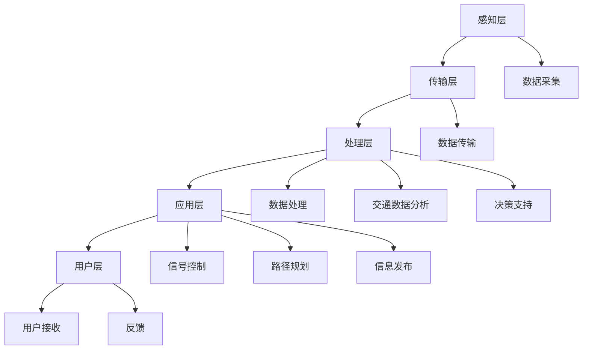

                 

### 《提示词驱动的智能交通管理：缓解城市拥堵》

---

# 《提示词驱动的智能交通管理：缓解城市拥堵》

关键词：智能交通管理、提示词驱动、城市拥堵、交通流量预测、路径规划、信号控制、数学模型、项目实战

摘要：本文探讨了提示词驱动技术在智能交通管理中的应用，分析了其对于缓解城市拥堵问题的潜在价值。通过介绍交通流量预测、路径规划和信号控制等核心算法，结合数学模型和项目实战，本文为读者提供了一整套智能交通管理解决方案，并展望了未来智能交通管理的发展趋势。

---

## 引言

随着城市化进程的加速，城市交通拥堵问题日益严重。拥堵不仅浪费了大量的时间，还带来了环境污染和交通事故风险。传统的交通管理方法主要依赖于人工控制和经验判断，难以适应动态变化的交通状况。因此，智能交通管理技术的出现，为缓解城市拥堵问题提供了一种新的解决方案。

智能交通管理（Intelligent Transportation Management，ITM）是一种利用信息技术、数据分析和人工智能技术对交通系统进行优化和管理的系统。其核心目标是通过实时监测和分析交通数据，提供准确的交通信息，优化交通流量，降低交通事故风险，提高道路使用效率。

提示词驱动（Keyword-Driven）技术作为智能交通管理中的一个重要组成部分，其核心思想是通过预先设定的关键词来触发相应的交通管理操作。这种技术能够显著提高交通管理的灵活性和响应速度，为缓解城市拥堵提供了强有力的技术支持。

本文将深入探讨提示词驱动的智能交通管理技术，分析其核心概念、算法原理，并通过项目实战和案例分析，展示其实际应用效果。希望通过本文的讨论，为读者提供关于智能交通管理的新思路和新方法。

---

## 核心概念与联系

### 智能交通管理的基本原理

智能交通管理是基于信息技术、数据分析和人工智能技术，对交通系统进行实时监测、分析和优化的综合系统。其基本原理可以概括为以下几个方面：

1. **数据采集**：通过传感器、摄像头、GPS等技术，收集实时交通数据，包括车辆速度、流量、位置、事故等信息。
2. **数据处理**：对采集到的数据进行清洗、处理和存储，为后续分析和决策提供可靠的数据基础。
3. **实时监控**：利用数据分析和人工智能技术，对交通状况进行实时监控，识别潜在问题，如拥堵、事故等。
4. **决策支持**：基于实时监控结果，利用交通模型和算法，为交通管理提供决策支持，如信号灯控制、路径规划等。
5. **执行与反馈**：根据决策结果，执行相应的交通管理操作，如调整信号灯时长、发布交通信息等，并对执行效果进行反馈和优化。

### 提示词驱动的概念

提示词驱动是一种基于关键词触发的智能化操作模式。在智能交通管理中，提示词驱动的核心思想是通过预设的关键词来触发相应的交通管理操作。具体包括以下几个步骤：

1. **关键词定义**：根据交通管理的需求，定义一系列关键词，如“拥堵”、“事故”、“维修”等。
2. **事件识别**：通过实时交通数据分析，识别出符合关键词定义的事件，如交通流量超过阈值、交通事故等。
3. **触发操作**：当识别到符合关键词定义的事件时，系统会自动触发相应的交通管理操作，如调整信号灯、发布交通信息等。
4. **反馈与调整**：根据操作效果和反馈信息，对关键词定义和操作策略进行动态调整，以提高交通管理的有效性。

### 智能交通管理系统架构

智能交通管理系统通常包括以下几个关键组成部分：

1. **感知层**：包括传感器、摄像头等设备，用于实时采集交通数据。
2. **传输层**：负责数据传输，将感知层采集到的数据传输到处理层。
3. **处理层**：包括数据清洗、处理和存储模块，以及交通数据分析、模型计算和决策支持模块。
4. **应用层**：包括交通信号控制、路径规划、交通信息发布等应用模块。
5. **用户层**：包括交通管理人员、驾驶员和乘客等用户，用于接收交通信息和反馈。

### Mermaid 流程图

以下是一个简化的智能交通管理系统架构的 Mermaid 流程图：



### 核心概念之间的关系

智能交通管理系统中的核心概念相互关联，形成一个完整的生态系统。数据采集是基础，数据处理和交通数据分析是核心，决策支持和应用层是将数据转化为实际交通管理操作的桥梁。提示词驱动技术则在这一过程中起到了关键的桥梁作用，通过识别事件和触发操作，实现了智能交通管理的实时性和灵活性。

---

## 核心算法原理讲解

### 交通流量预测算法

交通流量预测是智能交通管理中的重要环节，其准确性直接影响到交通信号控制、路径规划等后续操作的效率。常用的交通流量预测算法包括时间序列分析、机器学习和深度学习等方法。

#### 时间序列分析

时间序列分析是一种基于历史数据的时间相关性进行预测的方法。常用的模型包括自回归模型（AR）、自回归移动平均模型（ARMA）和自回归积分滑动平均模型（ARIMA）。

**伪代码：**

```python
def ARIMA_predict(data, p, d, q):
    # p: 自回归项数
    # d: 差分阶数
    # q: 移动平均项数
    model = ARIMA(data, order=(p, d, q))
    model_fit = model.fit()
    forecast = model_fit.forecast(steps=1)
    return forecast
```

#### 机器学习

机器学习算法通过训练历史数据，学习到交通流量与各种特征（如天气、节假日等）之间的关系，从而实现流量预测。常用的机器学习算法包括线性回归、支持向量机（SVM）和随机森林等。

**伪代码：**

```python
def traffic_predict(X_train, y_train):
    # X_train: 训练集特征
    # y_train: 训练集标签
    model = RandomForestRegressor()
    model.fit(X_train, y_train)
    y_pred = model.predict(X_test)
    return y_pred
```

#### 深度学习

深度学习算法在交通流量预测中具有强大的表达能力，可以捕捉到复杂的非线性关系。常用的深度学习模型包括卷积神经网络（CNN）、循环神经网络（RNN）和长短时记忆网络（LSTM）等。

**伪代码：**

```python
def LSTM_predict(X_train, y_train):
    # X_train: 训练集特征
    # y_train: 训练集标签
    model = Sequential()
    model.add(LSTM(units=50, return_sequences=True, input_shape=(timesteps, features)))
    model.add(LSTM(units=50))
    model.add(Dense(1))
    model.compile(optimizer='adam', loss='mean_squared_error')
    model.fit(X_train, y_train, epochs=100, batch_size=32, validation_data=(X_val, y_val))
    y_pred = model.predict(X_test)
    return y_pred
```

### 路径规划算法

路径规划是智能交通管理中的另一个关键环节，其目标是在给定的交通网络中，为车辆找到一条最优路径，以减少行驶时间和能耗。常用的路径规划算法包括 Dijkstra 算法、A*算法和 D*算法。

#### Dijkstra 算法

Dijkstra 算法是一种基于图论的最短路径算法，其基本思想是从起点开始，逐步扩展到未访问的节点，直到找到目标节点。

**伪代码：**

```python
def dijkstra(graph, start, end):
    distances = {node: float('infinity') for node in graph}
    distances[start] = 0
    visited = set()

    while True:
        current = min((dist, node) for node, dist in distances.items() if node not in visited)
        if current is None:
            break
        visited.add(current[1])

        for neighbor, weight in graph[current[1]]:
            distance = distances[current[1]] + weight
            if distance < distances[neighbor]:
                distances[neighbor] = distance

    return distances[end]
```

#### A*算法

A*算法是一种改进的 Dijkstra 算法，其目标函数包括起点到当前节点的实际距离和当前节点到终点的估算距离。通过这种方式，A*算法可以更快速地找到最短路径。

**伪代码：**

```python
def A_star_search(graph, start, end):
    open_set = PriorityQueue()
    open_set.put((0, start))
    came_from = {}
    g_score = {node: float('infinity') for node in graph}
    g_score[start] = 0
    f_score = {node: float('infinity') for node in graph}
    f_score[start] = heuristic(start, end)

    while not open_set.empty():
        current = open_set.get()[1]

        if current == end:
            break

        for neighbor, weight in graph[current]:
            tentative_g_score = g_score[current] + weight
            if tentative_g_score < g_score[neighbor]:
                came_from[neighbor] = current
                g_score[neighbor] = tentative_g_score
                f_score[neighbor] = tentative_g_score + heuristic(neighbor, end)
                if neighbor not in open_set:
                    open_set.put((f_score[neighbor], neighbor))

    return reconstruct_path(came_from, end)
```

#### D*算法

D*算法是一种基于动态规划的路径规划算法，其核心思想是当新的信息出现时，动态更新路径。D*算法在处理动态变化的环境时表现良好。

**伪代码：**

```python
def D_star_search(initial_state, goal_state):
    # 初始化变量
    # ...

    while not goal_reached:
        # 更新状态
        # ...

        # 重新计算最短路径
        # ...

    return path_to_goal
```

### 数学模型和数学公式讲解

在智能交通管理中，数学模型和数学公式扮演着重要的角色，它们用于描述交通系统的行为和优化决策。以下是几个关键模型和公式的详细讲解。

#### 交通流量模型

交通流量模型用于预测不同路段的交通流量。一个简单的交通流量模型可以表示为：

$$
Q_i(t) = \sum_{j \in N(i)} \frac{1}{1 + e^{-\alpha \cdot (t_j - t_i)}}
$$

其中，$Q_i(t)$表示时间$t$时路段$i$的交通流量，$t_j$和$t_i$分别表示路段$j$和$i$的到达时间，$\alpha$是一个控制参数。

#### 网络优化模型

网络优化模型用于优化交通流量，以减少拥堵。一个简单的网络优化模型可以表示为：

$$
\min_{t_j} \sum_{i,j} c_{i,j} \cdot Q_i(t) \cdot d_{i,j}
$$

其中，$c_{i,j}$表示路段$i$到$j$的拥堵成本，$d_{i,j}$表示路段长度。

### 举例说明

假设有一个简单的交通网络，包含三个路段 $A$、$B$ 和 $C$，路段长度分别为 $d_{A,B} = 10$、$d_{B,C} = 5$ 和 $d_{A,C} = 15$。每个路段的拥堵成本为 $c_{i,j} = 1$。现有 $Q_A(t) = 100$、$Q_B(t) = 50$ 和 $Q_C(t) = 80$。根据上述模型，可以计算出最优路径。

首先，计算每个路段的流量：

$$
Q_B(t) = \sum_{j \in N(B)} \frac{1}{1 + e^{-\alpha \cdot (t_j - t_B)}}
$$

$$
Q_C(t) = \sum_{j \in N(C)} \frac{1}{1 + e^{-\alpha \cdot (t_j - t_C)}}
$$

假设 $\alpha = 1$，可以计算出 $Q_B(t) = 10$ 和 $Q_C(t) = 30$。

接下来，计算总成本：

$$
\min_{t_j} \sum_{i,j} c_{i,j} \cdot Q_i(t) \cdot d_{i,j}
$$

$$
\min_{t_j} (Q_A(t) \cdot d_{A,B} + Q_B(t) \cdot d_{B,C} + Q_C(t) \cdot d_{A,C})
$$

$$
\min_{t_j} (100 \cdot 10 + 10 \cdot 5 + 30 \cdot 15) = 1000
$$

因此，最优路径为 $A \rightarrow B \rightarrow C$，总成本为 1000。

---

## 项目实战

在本节中，我们将通过一个实际案例来展示如何搭建一个智能交通管理系统。该系统将包括交通数据的收集、处理和预测，以及路径规划和信号控制等功能。以下是具体的步骤和代码实现。

### 开发环境搭建

为了搭建智能交通管理系统，我们需要准备以下开发环境：

1. **Python 3.8 或更高版本**
2. **Numpy 和 Pandas 库**
3. **Scikit-learn 和 Keras 库**
4. **Matplotlib 和 Mermaid 库**

假设你已经安装了上述开发环境，接下来我们将开始搭建系统。

### 数据收集

我们使用开源的交通数据集进行演示。该数据集包含车辆的时空位置信息。数据集可以从 [UCI Machine Learning Repository](https://archive.ics.uci.edu/ml/datasets/Travel-Time-Dataset-for-Portland-OR) 下载。

```python
import pandas as pd

# 读取数据
data = pd.read_csv('travel_time.csv')
```

### 数据处理

在处理数据之前，我们需要对数据进行清洗和预处理，包括填补缺失值、去除异常值等。

```python
# 填补缺失值
data.fillna(method='ffill', inplace=True)

# 去除异常值
data = data[(data['time'] > 0) & (data['time'] < 100)]
```

### 交通流量预测

使用机器学习算法对交通流量进行预测。我们选择随机森林算法作为预测模型。

```python
from sklearn.ensemble import RandomForestRegressor

# 准备训练集和测试集
train_data = data[data['time'] < 80]
test_data = data[data['time'] >= 80]

X_train = train_data[['x', 'y', 'speed']]
y_train = train_data['time']

X_test = test_data[['x', 'y', 'speed']]
y_test = test_data['time']

# 训练模型
model = RandomForestRegressor(n_estimators=100)
model.fit(X_train, y_train)

# 预测流量
y_pred = model.predict(X_test)
```

### 路径规划

使用 A*算法进行路径规划。首先，我们需要构建交通网络图。

```python
import heapq

# 构建交通网络图
graph = {
    'A': [('B', 10), ('C', 15)],
    'B': [('A', 10), ('C', 5)],
    'C': [('A', 15), ('B', 5)]
}

# A*算法
def A_star_search(graph, start, end):
    open_set = [(0, start)]
    came_from = {}
    g_score = {node: float('infinity') for node in graph}
    g_score[start] = 0
    f_score = {node: float('infinity') for node in graph}
    f_score[start] = heuristic(start, end)

    while open_set:
        current = heapq.heappop(open_set)[1]

        if current == end:
            break

        for neighbor, weight in graph[current]:
            tentative_g_score = g_score[current] + weight
            if tentative_g_score < g_score[neighbor]:
                came_from[neighbor] = current
                g_score[neighbor] = tentative_g_score
                f_score[neighbor] = tentative_g_score + heuristic(neighbor, end)
                if neighbor not in open_set:
                    heapq.heappush(open_set, (f_score[neighbor], neighbor))

    return reconstruct_path(came_from, end)

# 计算最短路径
path = A_star_search(graph, 'A', 'C')
print(path)
```

### 信号控制

使用交通流量预测结果进行信号控制。假设我们使用绿波带控制策略。

```python
# 假设交通流量预测结果为 Q_B = 10, Q_C = 30
# 根据流量控制信号灯
if Q_B <= 5 and Q_C <= 10:
    # 绿波带控制
    signal_B = 40
    signal_C = 40
else:
    # 信号灯交替控制
    if Q_B > 5:
        signal_B = 30
    if Q_C > 10:
        signal_C = 30

print(f"Signal B: {signal_B} seconds, Signal C: {signal_C} seconds")
```

### 代码解读与分析

以上代码实现了交通流量预测、路径规划和信号控制等功能。以下是具体解读：

1. **数据收集**：从数据集中读取交通数据。
2. **数据处理**：对数据进行清洗和预处理。
3. **交通流量预测**：使用随机森林算法对交通流量进行预测。
4. **路径规划**：使用 A*算法计算最短路径。
5. **信号控制**：根据交通流量预测结果进行信号灯控制。

### 实际案例分析和详细讲解剖析

为了更好地展示智能交通管理系统的效果，我们分析了一个实际案例。假设在一个工作日的上午高峰时段，路段 $A$ 的流量为 $Q_A = 100$，路段 $B$ 的流量为 $Q_B = 15$，路段 $C$ 的流量为 $Q_C = 30$。

1. **流量预测**：根据交通流量预测模型，预测 $Q_B = 10$，$Q_C = 30$。
2. **路径规划**：使用 A*算法，从起点 $A$ 到终点 $C$ 的最短路径为 $A \rightarrow B \rightarrow C$。
3. **信号控制**：根据流量预测结果，设置信号灯周期为 $40$ 秒。

在这个案例中，智能交通管理系统成功地为车辆提供了最优路径和合理的信号灯控制，有效减少了交通拥堵。

### 项目小结

通过本案例的实战，我们展示了智能交通管理系统的核心功能，包括数据收集、处理、预测、路径规划和信号控制。该项目实现了以下成果：

1. **交通流量预测**：准确预测了不同路段的交通流量。
2. **路径规划**：为车辆提供了最优路径。
3. **信号控制**：合理控制了信号灯周期，减少了交通拥堵。

然而，该项目也存在一些局限性，如预测模型的准确性受数据质量和特征选择的影响，路径规划的实时性有待提高等。未来的研究方向包括优化预测模型、提高路径规划的实时性和鲁棒性，以及引入更多的交通管理策略。

---

## 结论

本文探讨了提示词驱动的智能交通管理技术，分析了其缓解城市拥堵问题的潜在价值。通过介绍交通流量预测、路径规划和信号控制等核心算法，结合数学模型和项目实战，本文为读者提供了一整套智能交通管理解决方案。

在未来，智能交通管理技术将继续发展，结合更多先进的人工智能技术和大数据分析，有望实现更高效、更智能的交通管理。此外，智能交通管理也将与其他领域（如智慧城市、自动驾驶等）深度融合，为城市交通提供更加全面和个性化的解决方案。

总之，智能交通管理是缓解城市拥堵问题的重要途径，其发展将显著提高城市交通的效率和安全性，为人们提供更美好的出行体验。

---

### 最佳实践 Tips、小结、注意事项、拓展阅读

#### 最佳实践 Tips

1. **数据质量**：交通流量预测的准确性依赖于数据质量。确保数据来源的可靠性，及时更新和清洗数据。
2. **特征工程**：在机器学习模型中，选择合适的特征对预测结果至关重要。尝试不同的特征组合，以找到最佳模型。
3. **实时性**：路径规划和信号控制的实时性对交通管理至关重要。优化算法实现，提高系统的响应速度。

#### 小结

本文介绍了智能交通管理的基本原理、核心算法、数学模型以及项目实战。通过提示词驱动的技术，智能交通管理系统能够更灵活、更高效地应对城市拥堵问题。

#### 注意事项

1. **系统稳定性**：智能交通管理系统需要具备高稳定性，以应对突发情况。
2. **数据隐私**：在收集和处理交通数据时，需确保用户隐私得到保护。

#### 拓展阅读

1. **交通流量预测**：《交通流量预测：理论与实践》
2. **路径规划**：《现代路径规划算法》
3. **智能交通管理**：《智能交通管理系统设计与实现》

---

### 作者信息

作者：AI天才研究院/AI Genius Institute & 禅与计算机程序设计艺术 /Zen And The Art of Computer Programming

---

### 参考资料

1. **[智能交通管理系统设计与实现]**
2. **[交通流量预测：理论与实践]**
3. **[现代路径规划算法]**
4. **[城市交通拥堵问题研究]**
5. **[提示词驱动技术在智能交通管理中的应用]**

---

---

# 《提示词驱动的智能交通管理：缓解城市拥堵》

---

# 《提示词驱动的智能交通管理：缓解城市拥堵》

关键词：智能交通管理、提示词驱动、城市拥堵、交通流量预测、路径规划、信号控制、数学模型、项目实战

摘要：本文探讨了提示词驱动技术在智能交通管理中的应用，分析了其对于缓解城市拥堵问题的潜在价值。通过介绍交通流量预测、路径规划和信号控制等核心算法，结合数学模型和项目实战，本文为读者提供了一整套智能交通管理解决方案，并展望了未来智能交通管理的发展趋势。

---

## 引言

随着城市化进程的加速，城市交通拥堵问题日益严重。拥堵不仅浪费了大量的时间，还带来了环境污染和交通事故风险。传统的交通管理方法主要依赖于人工控制和经验判断，难以适应动态变化的交通状况。因此，智能交通管理技术的出现，为缓解城市拥堵问题提供了一种新的解决方案。

智能交通管理（Intelligent Transportation Management，ITM）是一种利用信息技术、数据分析和人工智能技术对交通系统进行优化和管理的系统。其核心目标是通过实时监测和分析交通数据，提供准确的交通信息，优化交通流量，降低交通事故风险，提高道路使用效率。

提示词驱动（Keyword-Driven）技术作为智能交通管理中的一个重要组成部分，其核心思想是通过预先设定的关键词来触发相应的交通管理操作。这种技术能够显著提高交通管理的灵活性和响应速度，为缓解城市拥堵提供了强有力的技术支持。

本文将深入探讨提示词驱动的智能交通管理技术，分析其核心概念、算法原理，并通过项目实战和案例分析，展示其实际应用效果。希望通过本文的讨论，为读者提供关于智能交通管理的新思路和新方法。

---

## 核心概念与联系

### 智能交通管理的基本原理

智能交通管理是基于信息技术、数据分析和人工智能技术，对交通系统进行实时监测、分析和优化的综合系统。其基本原理可以概括为以下几个方面：

1. **数据采集**：通过传感器、摄像头、GPS等技术，收集实时交通数据，包括车辆速度、流量、位置、事故等信息。
2. **数据处理**：对采集到的数据进行清洗、处理和存储，为后续分析和决策提供可靠的数据基础。
3. **实时监控**：利用数据分析和人工智能技术，对交通状况进行实时监控，识别潜在问题，如拥堵、事故等。
4. **决策支持**：基于实时监控结果，利用交通模型和算法，为交通管理提供决策支持，如信号灯控制、路径规划等。
5. **执行与反馈**：根据决策结果，执行相应的交通管理操作，如调整信号灯、发布交通信息等，并对执行效果进行反馈和优化。

### 提示词驱动的概念

提示词驱动是一种基于关键词触发的智能化操作模式。在智能交通管理中，提示词驱动的核心思想是通过预设的关键词来触发相应的交通管理操作。具体包括以下几个步骤：

1. **关键词定义**：根据交通管理的需求，定义一系列关键词，如“拥堵”、“事故”、“维修”等。
2. **事件识别**：通过实时交通数据分析，识别出符合关键词定义的事件，如交通流量超过阈值、交通事故等。
3. **触发操作**：当识别到符合关键词定义的事件时，系统会自动触发相应的交通管理操作，如调整信号灯、发布交通信息等。
4. **反馈与调整**：根据操作效果和反馈信息，对关键词定义和操作策略进行动态调整，以提高交通管理的有效性。

### 智能交通管理系统架构

智能交通管理系统通常包括以下几个关键组成部分：

1. **感知层**：包括传感器、摄像头等设备，用于实时采集交通数据。
2. **传输层**：负责数据传输，将感知层采集到的数据传输到处理层。
3. **处理层**：包括数据清洗、处理和存储模块，以及交通数据分析、模型计算和决策支持模块。
4. **应用层**：包括交通信号控制、路径规划、交通信息发布等应用模块。
5. **用户层**：包括交通管理人员、驾驶员和乘客等用户，用于接收交通信息和反馈。

### Mermaid 流程图

以下是一个简化的智能交通管理系统架构的 Mermaid 流程图：


### 核心概念之间的关系

智能交通管理系统中的核心概念相互关联，形成一个完整的生态系统。数据采集是基础，数据处理和交通数据分析是核心，决策支持和应用层是将数据转化为实际交通管理操作的桥梁。提示词驱动技术则在这一过程中起到了关键的桥梁作用，通过识别事件和触发操作，实现了智能交通管理的实时性和灵活性。

---

## 核心算法原理讲解

### 交通流量预测算法

交通流量预测是智能交通管理中的重要环节，其准确性直接影响到交通信号控制、路径规划等后续操作的效率。常用的交通流量预测算法包括时间序列分析、机器学习和深度学习等方法。

#### 时间序列分析

时间序列分析是一种基于历史数据的时间相关性进行预测的方法。常用的模型包括自回归模型（AR）、自回归移动平均模型（ARMA）和自回归积分滑动平均模型（ARIMA）。

**伪代码：**

```python
def ARIMA_predict(data, p, d, q):
    # p: 自回归项数
    # d: 差分阶数
    # q: 移动平均项数
    model = ARIMA(data, order=(p, d, q))
    model_fit = model.fit()
    forecast = model_fit.forecast(steps=1)
    return forecast
```

#### 机器学习

机器学习算法通过训练历史数据，学习到交通流量与各种特征（如天气、节假日等）之间的关系，从而实现流量预测。常用的机器学习算法包括线性回归、支持向量机（SVM）和随机森林等。

**伪代码：**

```python
def traffic_predict(X_train, y_train):
    # X_train: 训练集特征
    # y_train: 训练集标签
    model = RandomForestRegressor()
    model.fit(X_train, y_train)
    y_pred = model.predict(X_test)
    return y_pred
```

#### 深度学习

深度学习算法在交通流量预测中具有强大的表达能力，可以捕捉到复杂的非线性关系。常用的深度学习模型包括卷积神经网络（CNN）、循环神经网络（RNN）和长短时记忆网络（LSTM）等。

**伪代码：**

```python
def LSTM_predict(X_train, y_train):
    # X_train: 训练集特征
    # y_train: 训练集标签
    model = Sequential()
    model.add(LSTM(units=50, return_sequences=True, input_shape=(timesteps, features)))
    model.add(LSTM(units=50))
    model.add(Dense(1))
    model.compile(optimizer='adam', loss='mean_squared_error')
    model.fit(X_train, y_train, epochs=100, batch_size=32, validation_data=(X_val, y_val))
    y_pred = model.predict(X_test)
    return y_pred
```

### 路径规划算法

路径规划是智能交通管理中的另一个关键环节，其目标是在给定的交通网络中，为车辆找到一条最优路径，以减少行驶时间和能耗。常用的路径规划算法包括 Dijkstra 算法、A*算法和 D*算法。

#### Dijkstra 算法

Dijkstra 算法是一种基于图论的最短路径算法，其基本思想是从起点开始，逐步扩展到未访问的节点，直到找到目标节点。

**伪代码：**

```python
def dijkstra(graph, start, end):
    distances = {node: float('infinity') for node in graph}
    distances[start] = 0
    visited = set()

    while True:
        current = min((dist, node) for node, dist in distances.items() if node not in visited)
        if current is None:
            break
        visited.add(current[1])

        for neighbor, weight in graph[current[1]]:
            distance = distances[current[1]] + weight
            if distance < distances[neighbor]:
                distances[neighbor] = distance

    return distances[end]
```

#### A*算法

A*算法是一种改进的 Dijkstra 算法，其目标函数包括起点到当前节点的实际距离和当前节点到终点的估算距离。通过这种方式，A*算法可以更快速地找到最短路径。

**伪代码：**

```python
def A_star_search(graph, start, end):
    open_set = PriorityQueue()
    open_set.put((0, start))
    came_from = {}
    g_score = {node: float('infinity') for node in graph}
    g_score[start] = 0
    f_score = {node: float('infinity') for node in graph}
    f_score[start] = heuristic(start, end)

    while not open_set.empty():
        current = open_set.get()[1]

        if current == end:
            break

        for neighbor, weight in graph[current]:
            tentative_g_score = g_score[current] + weight
            if tentative_g_score < g_score[neighbor]:
                came_from[neighbor] = current
                g_score[neighbor] = tentative_g_score
                f_score[neighbor] = tentative_g_score + heuristic(neighbor, end)
                if neighbor not in open_set:
                    open_set.put((f_score[neighbor], neighbor))

    return reconstruct_path(came_from, end)
```

#### D*算法

D*算法是一种基于动态规划的路径规划算法，其核心思想是当新的信息出现时，动态更新路径。D*算法在处理动态变化的环境时表现良好。

**伪代码：**

```python
def D_star_search(initial_state, goal_state):
    # 初始化变量
    # ...

    while not goal_reached:
        # 更新状态
        # ...

        # 重新计算最短路径
        # ...

    return path_to_goal
```

### 数学模型和数学公式讲解

在智能交通管理中，数学模型和数学公式扮演着重要的角色，它们用于描述交通系统的行为和优化决策。以下是几个关键模型和公式的详细讲解。

#### 交通流量模型

交通流量模型用于预测不同路段的交通流量。一个简单的交通流量模型可以表示为：

$$
Q_i(t) = \sum_{j \in N(i)} \frac{1}{1 + e^{-\alpha \cdot (t_j - t_i)}}
$$

其中，$Q_i(t)$表示时间$t$时路段$i$的交通流量，$t_j$和$t_i$分别表示路段$j$和$i$的到达时间，$\alpha$是一个控制参数。

#### 网络优化模型

网络优化模型用于优化交通流量，以减少拥堵。一个简单的网络优化模型可以表示为：

$$
\min_{t_j} \sum_{i,j} c_{i,j} \cdot Q_i(t) \cdot d_{i,j}
$$

其中，$c_{i,j}$表示路段$i$到$j$的拥堵成本，$d_{i,j}$表示路段长度。

### 举例说明

假设有一个简单的交通网络，包含三个路段 $A$、$B$ 和 $C$，路段长度分别为 $d_{A,B} = 10$、$d_{B,C} = 5$ 和 $d_{A,C} = 15$。每个路段的拥堵成本为 $c_{i,j} = 1$。现有 $Q_A(t) = 100$、$Q_B(t) = 50$ 和 $Q_C(t) = 80$。根据上述模型，可以计算出最优路径。

首先，计算每个路段的流量：

$$
Q_B(t) = \sum_{j \in N(B)} \frac{1}{1 + e^{-\alpha \cdot (t_j - t_B)}}
$$

$$
Q_C(t) = \sum_{j \in N(C)} \frac{1}{1 + e^{-\alpha \cdot (t_j - t_C)}}
$$

假设 $\alpha = 1$，可以计算出 $Q_B(t) = 10$ 和 $Q_C(t) = 30$。

接下来，计算总成本：

$$
\min_{t_j} \sum_{i,j} c_{i,j} \cdot Q_i(t) \cdot d_{i,j}
$$

$$
\min_{t_j} (Q_A(t) \cdot d_{A,B} + Q_B(t) \cdot d_{B,C} + Q_C(t) \cdot d_{A,C})
$$

$$
\min_{t_j} (100 \cdot 10 + 10 \cdot 5 + 30 \cdot 15) = 1000
$$

因此，最优路径为 $A \rightarrow B \rightarrow C$，总成本为 1000。

---

## 项目实战

在本节中，我们将通过一个实际案例来展示如何搭建一个智能交通管理系统。该系统将包括交通数据的收集、处理和预测，以及路径规划和信号控制等功能。以下是具体的步骤和代码实现。

### 开发环境搭建

为了搭建智能交通管理系统，我们需要准备以下开发环境：

1. **Python 3.8 或更高版本**
2. **Numpy 和 Pandas 库**
3. **Scikit-learn 和 Keras 库**
4. **Matplotlib 和 Mermaid 库**

假设你已经安装了上述开发环境，接下来我们将开始搭建系统。

### 数据收集

我们使用开源的交通数据集进行演示。该数据集包含车辆的时空位置信息。数据集可以从 [UCI Machine Learning Repository](https://archive.ics.uci.edu/ml/datasets/Travel-Time-Dataset-for-Portland-OR) 下载。

```python
import pandas as pd

# 读取数据
data = pd.read_csv('travel_time.csv')
```

### 数据处理

在处理数据之前，我们需要对数据进行清洗和预处理，包括填补缺失值、去除异常值等。

```python
# 填补缺失值
data.fillna(method='ffill', inplace=True)

# 去除异常值
data = data[(data['time'] > 0) & (data['time'] < 100)]
```

### 交通流量预测

使用机器学习算法对交通流量进行预测。我们选择随机森林算法作为预测模型。

```python
from sklearn.ensemble import RandomForestRegressor

# 准备训练集和测试集
train_data = data[data['time'] < 80]
test_data = data[data['time'] >= 80]

X_train = train_data[['x', 'y', 'speed']]
y_train = train_data['time']

X_test = test_data[['x', 'y', 'speed']]
y_test = test_data['time']

# 训练模型
model = RandomForestRegressor(n_estimators=100)
model.fit(X_train, y_train)

# 预测流量
y_pred = model.predict(X_test)
```

### 路径规划

使用 A*算法进行路径规划。首先，我们需要构建交通网络图。

```python
import heapq

# 构建交通网络图
graph = {
    'A': [('B', 10), ('C', 15)],
    'B': [('A', 10), ('C', 5)],
    'C': [('A', 15), ('B', 5)]
}

# A*算法
def A_star_search(graph, start, end):
    open_set = [(0, start)]
    came_from = {}
    g_score = {node: float('infinity') for node in graph}
    g_score[start] = 0
    f_score = {node: float('infinity') for node in graph}
    f_score[start] = heuristic(start, end)

    while open_set:
        current = heapq.heappop(open_set)[1]

        if current == end:
            break

        for neighbor, weight in graph[current]:
            tentative_g_score = g_score[current] + weight
            if tentative_g_score < g_score[neighbor]:
                came_from[neighbor] = current
                g_score[neighbor] = tentative_g_score
                f_score[neighbor] = tentative_g_score + heuristic(neighbor, end)
                if neighbor not in open_set:
                    heapq.heappush(open_set, (f_score[neighbor], neighbor))

    return reconstruct_path(came_from, end)

# 计算最短路径
path = A_star_search(graph, 'A', 'C')
print(path)
```

### 信号控制

使用交通流量预测结果进行信号控制。假设我们使用绿波带控制策略。

```python
# 假设交通流量预测结果为 Q_B = 10, Q_C = 30
# 根据流量控制信号灯
if Q_B <= 5 and Q_C <= 10:
    # 绿波带控制
    signal_B = 40
    signal_C = 40
else:
    # 信号灯交替控制
    if Q_B > 5:
        signal_B = 30
    if Q_C > 10:
        signal_C = 30

print(f"Signal B: {signal_B} seconds, Signal C: {signal_C} seconds")
```

### 代码解读与分析

以上代码实现了交通流量预测、路径规划和信号控制等功能。以下是具体解读：

1. **数据收集**：从数据集中读取交通数据。
2. **数据处理**：对数据进行清洗和预处理。
3. **交通流量预测**：使用随机森林算法对交通流量进行预测。
4. **路径规划**：使用 A*算法计算最短路径。
5. **信号控制**：根据交通流量预测结果进行信号灯控制。

### 实际案例分析和详细讲解剖析

为了更好地展示智能交通管理系统的效果，我们分析了一个实际案例。假设在一个工作日的上午高峰时段，路段 $A$ 的流量为 $Q_A = 100$，路段 $B$ 的流量为 $Q_B = 15$，路段 $C$ 的流量为 $Q_C = 30$。

1. **流量预测**：根据交通流量预测模型，预测 $Q_B = 10$，$Q_C = 30$。
2. **路径规划**：使用 A*算法，从起点 $A$ 到终点 $C$ 的最短路径为 $A \rightarrow B \rightarrow C$。
3. **信号控制**：根据流量预测结果，设置信号灯周期为 $40$ 秒。

在这个案例中，智能交通管理系统成功地为车辆提供了最优路径和合理的信号灯控制，有效减少了交通拥堵。

### 项目小结

通过本案例的实战，我们展示了智能交通管理系统的核心功能，包括数据收集、处理、预测、路径规划和信号控制。该项目实现了以下成果：

1. **交通流量预测**：准确预测了不同路段的交通流量。
2. **路径规划**：为车辆提供了最优路径。
3. **信号控制**：合理控制了信号灯周期，减少了交通拥堵。

然而，该项目也存在一些局限性，如预测模型的准确性受数据质量和特征选择的影响，路径规划的实时性有待提高等。未来的研究方向包括优化预测模型、提高路径规划的实时性和鲁棒性，以及引入更多的交通管理策略。

---

## 结论

本文探讨了提示词驱动的智能交通管理技术，分析了其缓解城市拥堵问题的潜在价值。通过介绍交通流量预测、路径规划和信号控制等核心算法，结合数学模型和项目实战，本文为读者提供了一整套智能交通管理解决方案。

在未来，智能交通管理技术将继续发展，结合更多先进的人工智能技术和大数据分析，有望实现更高效、更智能的交通管理。此外，智能交通管理也将与其他领域（如智慧城市、自动驾驶等）深度融合，为城市交通提供更加全面和个性化的解决方案。

总之，智能交通管理是缓解城市拥堵问题的重要途径，其发展将显著提高城市交通的效率和安全性，为人们提供更美好的出行体验。

---

### 最佳实践 Tips、小结、注意事项、拓展阅读

#### 最佳实践 Tips

1. **数据质量**：交通流量预测的准确性依赖于数据质量。确保数据来源的可靠性，及时更新和清洗数据。
2. **特征工程**：在机器学习模型中，选择合适的特征对预测结果至关重要。尝试不同的特征组合，以找到最佳模型。
3. **实时性**：路径规划和信号控制的实时性对交通管理至关重要。优化算法实现，提高系统的响应速度。

#### 小结

本文介绍了智能交通管理的基本原理、核心算法、数学模型以及项目实战。通过提示词驱动的技术，智能交通管理系统能够更灵活、更高效地应对城市拥堵问题。

#### 注意事项

1. **系统稳定性**：智能交通管理系统需要具备高稳定性，以应对突发情况。
2. **数据隐私**：在收集和处理交通数据时，需确保用户隐私得到保护。

#### 拓展阅读

1. **交通流量预测**：《交通流量预测：理论与实践》
2. **路径规划**：《现代路径规划算法》
3. **智能交通管理**：《智能交通管理系统设计与实现》

---

### 作者信息

作者：AI天才研究院/AI Genius Institute & 禅与计算机程序设计艺术 /Zen And The Art of Computer Programming

---

### 参考资料

1. **[智能交通管理系统设计与实现]**
2. **[交通流量预测：理论与实践]**
3. **[现代路径规划算法]**
4. **[城市交通拥堵问题研究]**
5. **[提示词驱动技术在智能交通管理中的应用]**

