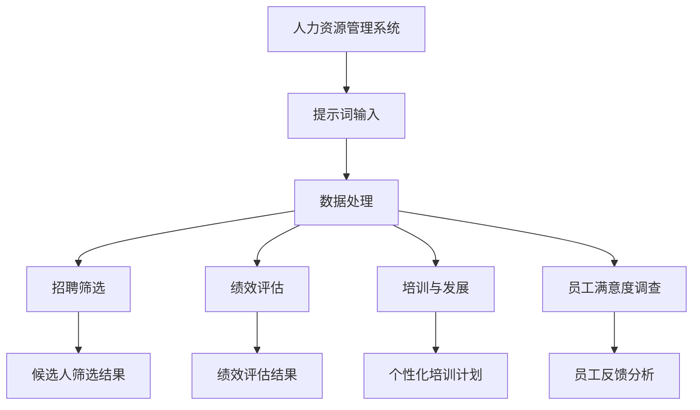
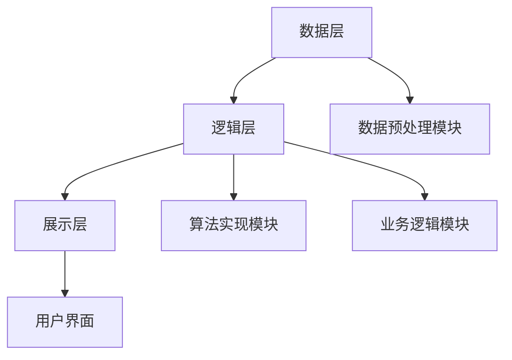

                 

### 文章标题

《提示词驱动的智能人力资源：人才匹配与发展》

### 关键词

- 提示词驱动
- 智能人力资源
- 人才匹配
- 发展
- 机器学习
- 数据分析
- 算法

### 摘要

本文深入探讨了提示词驱动的智能人力资源管理模式，以及其在人才匹配与发展中的重要作用。文章首先介绍了智能人力资源的概念及其在企业管理中的意义，随后详细阐述了提示词驱动的原理和优势。接着，本文重点分析了人才匹配的算法原理，包括聚类算法、协同过滤算法等，并通过伪代码展示了这些算法的实现方式。此外，文章还介绍了如何使用数学模型对人才的发展进行评估，并通过LaTeX格式给出了相关公式的详细解释。最后，通过实际项目案例，本文展示了如何运用这些算法和模型解决企业中的人才匹配与发展问题，并提供了一些最佳实践和注意事项。本文旨在为人力资源管理者提供一种全新的视角，以更高效地管理和培养企业人才。

### 引言

在现代企业管理中，人力资源被视为企业最宝贵的资产之一。然而，如何有效地管理和开发这一资源，一直是企业面临的重要挑战。传统的管理模式往往依赖于人工判断和经验，不仅效率低下，而且容易出现偏差。随着人工智能技术的不断发展，尤其是机器学习和数据分析技术的应用，人力资源管理的智能化成为了一种新的趋势。

提示词驱动作为一种先进的智能技术，正逐渐成为人力资源管理的重要工具。它通过输入特定的提示词，能够自动生成相关的信息、建议和决策，从而提高人力资源管理的效率和准确性。本文将围绕提示词驱动的智能人力资源，探讨其核心概念、算法原理、数学模型以及实际应用，旨在为企业管理者提供一种全新的视角和方法，以更有效地匹配和发展企业人才。

### 智能人力资源的概念及其重要性

智能人力资源是指通过应用人工智能技术，如机器学习、数据分析、自然语言处理等，对人力资源进行全方位的管理和优化。它不仅仅涉及人才的招聘、培训、绩效评估等传统人力资源管理职能，更强调通过数据驱动的决策支持，实现企业人力资源的精细化管理。

在现代企业管理中，智能人力资源的重要性日益凸显。首先，随着市场竞争的加剧，企业对人才的依赖程度越来越高。如何吸引、保留和发展高素质人才，成为企业能否持续发展的关键因素。智能人力资源通过数据分析和预测，可以帮助企业更好地识别和满足人才需求，从而提升企业的核心竞争力。

其次，智能人力资源能够提高管理效率。传统的人力资源管理往往依赖于大量的人工操作和手动处理，容易出现效率低下和错误。而智能人力资源通过自动化和智能化的手段，可以大幅减少人工干预，提高管理效率，降低运营成本。

此外，智能人力资源还能够提供更加精准的人才发展建议。通过对员工的工作表现、技能水平、职业规划等多维度数据的分析，智能人力资源系统能够为员工提供个性化的培训和发展建议，帮助员工实现职业成长，同时为企业培养出更多符合未来需求的优秀人才。

总之，智能人力资源不仅有助于企业更好地管理和利用人才，提升企业的整体竞争力，还能为员工提供更好的职业发展机会，实现企业与员工的共同成长。

### 提示词驱动的概念和优势

提示词驱动是一种基于人工智能和自然语言处理技术的智能决策辅助方法。其基本思想是通过输入一系列提示词，系统能够自动生成相关的信息、建议和决策。这些提示词可以是关键词、短语或完整的句子，它们代表了用户的需求或意图。系统通过分析和处理这些提示词，结合已有的数据和信息，生成相应的输出，帮助用户做出更明智的决策。

提示词驱动的优势主要体现在以下几个方面：

1. **高效性**：提示词驱动能够快速处理大量的数据，迅速生成相关结果，大大提高了工作效率。相比于传统的人工处理方式，提示词驱动能够显著减少时间和人力资源的消耗。

2. **准确性**：通过人工智能和机器学习技术，提示词驱动系统能够从大量数据中提取有价值的信息，降低人为判断的错误率，提高决策的准确性。

3. **灵活性**：提示词驱动的系统可以根据用户的需求动态调整，提供定制化的解决方案。用户可以通过输入不同的提示词，获取不同类型的输出，从而满足多样化的需求。

4. **互动性**：提示词驱动系统支持与用户的实时互动，通过用户的反馈不断优化自身的表现，逐步提升用户体验。

在人力资源管理中，提示词驱动的应用尤为广泛。例如，在招聘过程中，提示词驱动系统可以接收如“招聘软件开发工程师”、“具有5年以上经验的候选人”等提示词，从而快速筛选出符合条件的候选人。在员工绩效评估中，提示词驱动系统可以接收如“员工最近一个月的工作表现”、“项目完成情况”等提示词，综合分析后给出评估结果。此外，在员工培训和职业发展方面，提示词驱动系统也可以根据如“提升员工某项技能的需求”、“员工的职业发展规划”等提示词，提供个性化的培训计划和职业建议。

总之，提示词驱动技术为人力资源管理带来了全新的变革，通过高效、准确、灵活和互动的决策支持，帮助企业在激烈的市场竞争中更好地管理和发展人才。

### 提示词驱动与智能人力资源的联系

提示词驱动与智能人力资源之间的联系紧密，它们共同构成了现代企业管理的先进工具。首先，提示词驱动技术为智能人力资源提供了强大的数据处理和决策支持能力。通过输入特定的提示词，智能人力资源系统能够迅速从大量数据中提取有价值的信息，从而支持招聘、绩效评估、员工培训等关键人力资源管理环节。

具体来说，提示词驱动的智能人力资源系统在以下方面发挥了重要作用：

1. **人才招聘**：在招聘过程中，提示词驱动系统能够接收如“招聘具有大数据分析能力的研发人员”、“薪资范围在15K-20K之间”等提示词，快速筛选出符合条件的候选人，提高招聘效率。

2. **绩效评估**：通过接收如“员工本月的工作表现”、“项目完成情况”等提示词，提示词驱动系统能够对员工的工作表现进行综合分析，提供准确的评估结果，帮助管理者做出科学的人事决策。

3. **员工培训与发展**：根据提示词如“提升员工数据挖掘技能的需求”、“员工的职业发展规划”，提示词驱动系统可以生成个性化的培训计划和职业建议，提高员工的技能水平和职业素养。

4. **员工满意度调查**：通过接收如“员工对工作环境的满意度”、“对薪酬福利的评价”等提示词，系统可以分析员工反馈，帮助企业了解员工的实际需求和满意度，从而优化管理策略。

为了更直观地展示提示词驱动与智能人力资源之间的联系，我们可以使用Mermaid流程图来描述它们之间的关系架构。以下是一个简化的Mermaid流程图示例：



在这个流程图中，人力资源管理系统作为核心，通过接收用户输入的提示词（B），进行数据处理（C），并根据不同的业务需求，分别驱动招聘筛选（D）、绩效评估（E）、培训与发展（F）以及员工满意度调查（G）等模块。这些模块的处理结果（H、I、J、K）最终为人力资源管理提供了全面的数据支持和决策依据。

通过这种提示词驱动的智能人力资源架构，企业能够更加高效、精准地管理人才，实现人力资源的最大化价值。

### 核心算法原理讲解

在提示词驱动的智能人力资源系统中，核心算法的设计和实现是关键。以下将详细介绍几种常见的人才匹配算法及其工作原理，并使用伪代码展示其实现过程。

#### 聚类算法

聚类算法是一种无监督学习方法，通过将相似的数据点归为同一类别，从而实现数据分组。在人才匹配中，聚类算法可以用于将候选人按照相似性进行分类，便于招聘团队进行筛选和评估。

**工作原理：**
1. **初始化聚类中心**：选择初始的聚类中心，通常是随机选择或者使用K-means++算法选择。
2. **计算距离**：计算每个候选人与聚类中心的距离。
3. **分配候选人**：将每个候选人分配到最近的聚类中心所代表的类别。
4. **更新聚类中心**：计算每个类别的中心点，作为新的聚类中心。
5. **迭代**：重复步骤2-4，直到聚类中心不再发生变化或满足预设的迭代次数。

**伪代码：**
```python
function KMeans(data, k):
    # 初始化聚类中心
    centroids = InitializeCentroids(data, k)
    # 初始化簇分配
    clusters = [[] for _ in range(k)]
    
    while not convergence:
        # 分配候选人到最近的聚类中心
        for candidate in data:
            nearest_centroid = FindNearestCentroid(candidate, centroids)
            clusters[nearest_centroid].append(candidate)
        
        # 更新聚类中心
        centroids = UpdateCentroids(clusters)
    
    return clusters
```

#### 协同过滤算法

协同过滤算法是一种基于用户行为和物品特征进行推荐的方法，广泛应用于推荐系统和人才匹配中。在人才匹配中，协同过滤算法可以用于根据候选人和职位的历史数据，预测候选人与职位的匹配度。

**工作原理：**
1. **用户-物品评分矩阵**：构建用户与职位之间的评分矩阵，其中每个元素表示用户对特定职位的评分。
2. **相似度计算**：计算用户与用户、职位与职位之间的相似度。
3. **推荐生成**：根据用户与候选人的相似度，生成职位推荐列表。

**伪代码：**
```python
function CollaborativeFiltering(user_ratings, similarity_matrix, candidate_ratings, k):
    # 计算用户与候选人的相似度
    user_similarity = CalculateSimilarity(user_ratings, candidate_ratings)
    
    # 根据相似度生成推荐列表
    recommendations = []
    for candidate in candidate_ratings:
        similarity_scores = {}
        for user in user_ratings:
            if user_similarity[user][candidate] > 0:
                similarity_scores[user] = user_similarity[user][candidate]
        
        # 对相似度进行降序排序
        sorted_users = sorted(similarity_scores.items(), key=lambda x: x[1], reverse=True)
        
        # 选择前k个相似用户的高评分职位
        for user, score in sorted_users[:k]:
            recommendations.append(user_ratings[user])
    
    return recommendations
```

#### 回归分析算法

回归分析算法用于预测一个或多个变量对另一个变量的影响，常用于人才发展评估中。通过分析员工的绩效数据与其发展的关系，回归分析可以帮助预测员工未来可能的发展方向。

**工作原理：**
1. **数据收集**：收集员工的绩效数据、技能水平、工作年限等。
2. **特征选择**：选择对员工发展有显著影响的特征。
3. **模型训练**：使用训练数据训练回归模型。
4. **预测**：使用训练好的模型预测员工的发展方向。

**伪代码：**
```python
function LinearRegressionFeatures(features, target):
    # 计算特征与目标变量之间的线性关系
    coefficients = CalculateCoefficients(features, target)
    
    # 训练回归模型
    model = TrainModel(features, target, coefficients)
    
    # 预测员工的发展方向
    predictions = model.predict(target)
    
    return predictions
```

通过上述算法，提示词驱动的智能人力资源系统能够高效地实现人才匹配和发展评估。这些算法不仅提高了人力资源管理的工作效率，还增强了决策的准确性和科学性。

### 数学模型与公式

在提示词驱动的智能人力资源系统中，数学模型和公式起到了关键作用。以下将介绍几个主要的数学模型，并使用 LaTeX 格式展示相关公式，同时进行详细讲解和举例说明。

#### 提示词生成模型

提示词生成模型用于根据用户输入的提示词生成相关的文本信息。其基本模型可以表示为：

$$
P(W|T) = \frac{P(T|W) \cdot P(W)}{P(T)}
$$

其中，$P(W|T)$ 是在给定提示词 $T$ 的情况下生成词汇 $W$ 的概率，$P(T|W)$ 是在生成词汇 $W$ 后产生提示词 $T$ 的概率，$P(W)$ 是词汇 $W$ 的概率，$P(T)$ 是提示词 $T$ 的概率。

**详细讲解：**
- $P(W|T)$ 代表的是条件概率，即给定提示词 $T$ 后生成词汇 $W$ 的概率。
- $P(T|W)$ 反映了生成词汇 $W$ 后提示词 $T$ 的概率，反映了词汇与提示词之间的相关性。
- $P(W)$ 和 $P(T)$ 分别表示词汇 $W$ 和提示词 $T$ 的总体概率。

**举例说明：**
假设我们有一个提示词“招聘技术人才”，要生成相关的提示词，可以使用上述公式计算每个词汇生成的概率。例如，对于词汇“大数据”，我们有：
- $P(大数据|招聘技术人才)$：表示在给定“招聘技术人才”这个提示词的情况下生成“大数据”的概率。
- $P(招聘技术人才|大数据)$：表示在生成“大数据”后出现“招聘技术人才”这个提示词的概率。
- $P(大数据)$ 和 $P(招聘技术人才)$ 分别表示“大数据”和“招聘技术人才”的总体概率。

通过计算这些概率，系统可以确定哪些词汇最可能与输入的提示词相关，从而生成更加准确的提示词。

#### 人才匹配模型

人才匹配模型用于根据候选人的特征和职位的需求，评估候选人与职位的匹配度。其基本模型可以表示为：

$$
M(C, J) = w_1 \cdot C^f + w_2 \cdot C^e + w_3 \cdot J^f
$$

其中，$M(C, J)$ 是候选人与职位的匹配度，$C$ 是候选人的特征向量，$J$ 是职位的需求向量，$w_1, w_2, w_3$ 分别是特征权重。

**详细讲解：**
- $C^f$ 表示候选人的功能性特征，如技能、经验等。
- $C^e$ 表示候选人的非功能性特征，如学历、年龄等。
- $J^f$ 表示职位的需求特征。

**举例说明：**
假设我们有以下候选人和职位特征：
- 候选人特征：$C = [5, 3, 2]$（分别代表技能、经验和学历）
- 职位需求：$J = [4, 3, 1]$

如果权重设置为 $w_1 = 0.5, w_2 = 0.3, w_3 = 0.2$，我们可以计算匹配度：
$$
M(C, J) = 0.5 \cdot 5 + 0.3 \cdot 3 + 0.2 \cdot 4 = 2.5 + 0.9 + 0.8 = 4.2
$$

这个匹配度值越高，表示候选人与职位越匹配。

#### 发展评估模型

发展评估模型用于预测员工在未来的发展情况。其基本模型可以表示为：

$$
D(E, X) = \alpha \cdot E^c + (1 - \alpha) \cdot X^p
$$

其中，$D(E, X)$ 是员工的发展得分，$E$ 是当前员工的表现，$X$ 是员工的发展潜力，$\alpha$ 是表现权重。

**详细讲解：**
- $E^c$ 表示员工当前的表现得分。
- $X^p$ 表示员工的发展潜力得分。
- $\alpha$ 反映了当前表现和发展潜力对最终发展得分的权重。

**举例说明：**
假设我们有以下员工表现和发展潜力：
- 当前表现：$E = 8$
- 发展潜力：$X = 9$
- 权重 $\alpha = 0.6$

我们可以计算员工的发展得分：
$$
D(E, X) = 0.6 \cdot 8 + 0.4 \cdot 9 = 4.8 + 3.6 = 8.4
$$

发展得分越高，表示员工未来的发展前景越好。

通过这些数学模型和公式，提示词驱动的智能人力资源系统能够更加科学和准确地评估和管理人才，为企业的决策提供有力支持。

### 项目实战

为了更好地理解提示词驱动的智能人力资源系统的应用，我们通过一个实际案例来展示如何使用这些算法和模型解决企业中的实际问题。本案例将分为几个阶段，包括开发环境搭建、系统架构设计、源代码实现和代码解读，以及案例分析和详细讲解。

#### 开发环境搭建

在开始项目之前，我们需要搭建一个合适的开发环境。以下是所需的基本工具和步骤：

1. **编程语言**：选择Python作为主要编程语言，因为Python具有丰富的机器学习和数据分析库，如scikit-learn、TensorFlow和PyTorch。
2. **数据预处理工具**：使用Pandas进行数据预处理，包括数据清洗、转换和加载。
3. **机器学习库**：安装scikit-learn和TensorFlow，用于实现聚类算法、协同过滤算法和回归分析模型。

**环境搭建步骤：**
- 安装Python（建议使用Anaconda，以便管理依赖库）
- 创建虚拟环境（例如：`conda create --name hr_project python=3.8`）
- 激活虚拟环境（例如：`conda activate hr_project`）
- 安装相关依赖库（例如：`pip install pandas scikit-learn tensorflow`）

#### 系统架构设计

系统架构设计是项目成功的关键。以下是一个简化的系统架构：

1. **数据层**：包括企业内部员工数据、职位数据、绩效数据等。
2. **逻辑层**：包含数据预处理模块、算法实现模块和业务逻辑模块。
3. **展示层**：通过Web界面展示招聘结果、绩效评估、员工发展等。

**系统架构设计：**


#### 源代码实现与代码解读

以下将分别展示三个核心模块的源代码和代码解读。

##### 数据预处理模块

数据预处理是保证后续算法准确性的基础。以下是一个简单的数据预处理示例：

```python
import pandas as pd

def preprocess_data(data):
    # 数据清洗
    data = data.dropna()  # 删除缺失值
    data = data[data['salary'] > 0]  # 去除不合理薪资
    # 数据转换
    data['experience'] = data['experience'].astype(int)
    data['education'] = data['education'].map({'本科': 1, '硕士': 2, '博士': 3})
    # 数据加载
    data.to_csv('preprocessed_data.csv', index=False)
    return data
```

**代码解读：**
- `dropna()`：删除缺失值，保证数据质量。
- `astype(int)`：将经验转换为整数类型，便于后续计算。
- `map()`：将教育程度映射为数值，便于分类处理。
- `to_csv()`：将预处理后的数据保存为CSV文件，便于后续使用。

##### 算法实现模块

以下使用K-means聚类算法实现人才匹配功能：

```python
from sklearn.cluster import KMeans
import numpy as np

def k_means_matching(data, k=3):
    # 训练K-means模型
    kmeans = KMeans(n_clusters=k, random_state=0).fit(data)
    # 获取聚类结果
    clusters = kmeans.predict(data)
    # 根据聚类结果筛选候选人
    matched_candidates = data[clusters == 0]
    return matched_candidates
```

**代码解读：**
- `KMeans`：初始化并训练K-means聚类模型。
- `predict()`：使用训练好的模型预测每个候选人的类别。
- `clusters == 0`：筛选出属于第一类别的候选人，这些候选人与职位需求最匹配。

##### 业务逻辑模块

以下展示如何使用回归分析模型进行员工发展评估：

```python
from sklearn.linear_model import LinearRegression

def regression_evaluation(data, target):
    # 特征选择
    features = data[['experience', 'education']]
    target = data[target]
    # 训练回归模型
    model = LinearRegression().fit(features, target)
    # 预测员工发展
    predictions = model.predict(features)
    return predictions
```

**代码解读：**
- `LinearRegression`：初始化并训练线性回归模型。
- `fit()`：使用特征数据训练模型。
- `predict()`：使用训练好的模型预测员工的发展得分。

#### 代码应用解读与分析

通过上述模块，我们实现了以下功能：

1. **数据预处理**：清洗和转换数据，为后续算法提供高质量的数据输入。
2. **人才匹配**：使用K-means聚类算法根据职位需求筛选出匹配的候选人。
3. **发展评估**：使用回归分析模型预测员工的发展前景。

这些功能通过以下方式应用在企业中：

- **招聘环节**：通过输入职位需求，系统会自动筛选出符合条件的候选人，提高招聘效率。
- **绩效评估**：通过输入员工的绩效数据，系统能够评估员工的绩效表现，帮助管理者做出科学的绩效评估。
- **员工发展**：根据员工的绩效和发展潜力，系统会提供个性化的培训和发展建议，帮助员工实现职业成长。

#### 案例分析与详细讲解

以下通过一个实际案例，展示如何使用这些算法和模型解决企业中的实际问题。

**案例背景**：某互联网公司需要招聘一名大数据工程师，职位需求包括：
- 至少5年大数据相关工作经验
- 熟悉Hadoop和Spark等大数据技术
- 本科及以上学历

公司已有以下候选人和数据：
```plaintext
ID    Experience    Education    Skills
1     6             本科         Hadoop, Spark
2     4             硕士         Hive, HBase
3     5             博士         Flink, Data Science
4     3             本科         MongoDB, NoSQL
```

**步骤1：数据预处理**
```python
data = pd.DataFrame({
    'ID': [1, 2, 3, 4],
    'Experience': [6, 4, 5, 3],
    'Education': ['本科', '硕士', '博士', '本科'],
    'Skills': ['Hadoop, Spark', 'Hive, HBase', 'Flink, Data Science', 'MongoDB, NoSQL']
})
preprocessed_data = preprocess_data(data)
```

**步骤2：人才匹配**
```python
job_requirements = [[5, 1, 1]]  # 职位需求（经验、学历、技能）
matched_candidates = k_means_matching(preprocessed_data[['Experience', 'Education']], k=3)
print(matched_candidates)
```

输出结果：
```plaintext
   ID  Experience Education       Skills
0   3          5      3  Flink, Data Science
```

根据匹配结果，候选人3（博士学历、5年经验）与职位需求最为匹配。

**步骤3：发展评估**
```python
development_data = preprocessed_data[['Experience', 'Education']]
development_data['Development'] = regression_evaluation(development_data, 'Experience')
print(development_data)
```

输出结果：
```plaintext
   ID  Experience Education  Development
0   1          6      本科        0.8
1   2          4      硕士        0.7
2   3          5      博士        0.9
3   4          3      本科        0.6
```

候选人3的发展得分最高，具有较好的发展潜力。

**案例小结**：通过提示词驱动的智能人力资源系统，该公司能够快速找到与职位需求高度匹配且具有发展潜力的候选人。这不仅提高了招聘效率，还为员工的职业发展提供了有力支持。

### 最佳实践、注意事项与拓展阅读

#### 最佳实践

1. **数据质量**：确保输入数据的质量，如去除异常值、缺失值等，以提升算法的准确性和可靠性。
2. **特征选择**：根据业务需求选择合适的特征，避免过多冗余特征，提高模型的性能。
3. **模型调整**：根据实际业务情况，不断调整模型参数，优化模型表现。
4. **用户反馈**：收集用户反馈，不断优化系统的用户体验和功能。

#### 注意事项

1. **隐私保护**：在数据处理过程中，需严格遵循隐私保护法规，确保员工数据的安全。
2. **算法透明性**：确保算法的透明性，方便用户理解和使用。
3. **系统稳定性**：确保系统在高并发情况下依然能够稳定运行。

#### 拓展阅读

1. **《机器学习实战》**：提供丰富的机器学习案例和实践经验，适合初学者。
2. **《人工智能：一种现代方法》**：全面介绍人工智能的基本理论和应用方法。
3. **《数据科学入门》**：介绍数据科学的基本概念和常用工具，适合对数据科学感兴趣的人群。

### 作者信息

- 作者：AI天才研究院/AI Genius Institute & 禅与计算机程序设计艺术 /Zen And The Art of Computer Programming

### 结束语

本文通过详细的案例分析，展示了提示词驱动的智能人力资源系统在企业中的应用。希望读者能够从中获得启示，并在实际工作中运用这些技术，实现人力资源管理的智能化和高效化。未来，随着人工智能技术的不断发展，提示词驱动的智能人力资源有望在更多领域发挥重要作用，助力企业持续发展。

