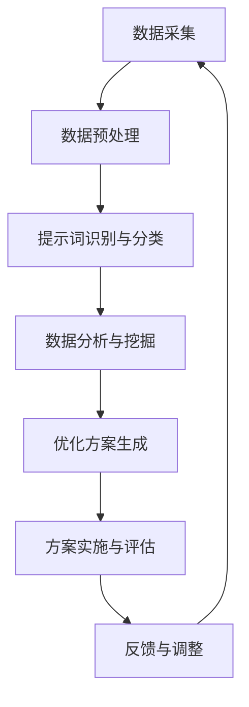

                 


### 文章标题
提示词驱动的智能供应链优化系统

> 关键词：智能供应链、优化算法、提示词驱动、数据分析、预测模型、深度学习

> 摘要：
本文将深入探讨提示词驱动的智能供应链优化系统，从背景介绍、核心概念解析、算法原理讲解、数学模型及项目实战等多个角度，详细阐述这一系统在供应链管理中的应用和优势。通过结合实际案例，本文旨在为读者提供一份全面的技术指南，帮助理解并掌握提示词驱动的智能供应链优化方法。

---

### 目录大纲

```
# 提示词驱动的智能供应链优化系统

## 第一部分：背景与核心概念

### 第1章 引言
#### 1.1 书籍的目的和意义
#### 1.2 智能供应链的背景
#### 1.3 提示词驱动的概念

### 第2章 核心概念与联系
#### 2.1 提示词驱动与供应链管理
##### 2.1.1 供应链管理的原理与挑战
##### 2.1.2 提示词驱动的原理
##### 2.1.3 提示词驱动的供应链架构 Mermaid 流程图

## 第二部分：智能供应链优化算法

### 第3章 数据分析与预测
#### 3.1 数据预处理与清洗
##### 3.1.1 数据收集
##### 3.1.2 数据预处理
##### 3.1.3 数据清洗算法
#### 3.2 预测模型设计
##### 3.2.1 传统预测方法
##### 3.2.2 机器学习方法
##### 3.2.3 深度学习预测模型

### 第4章 算法原理讲解
#### 4.1 算法概述
##### 4.1.1 算法框架
##### 4.1.2 算法优缺点
#### 4.2 伪代码与详细讲解
##### 4.2.1 伪代码展示
##### 4.2.2 详细解释

### 第5章 数学模型与公式
#### 5.1 供应链优化数学模型
##### 5.1.1 目标函数
##### 5.1.2 约束条件
##### 5.1.3 公式与解释
#### 5.2 数学公式的 LaTeX 展示

## 第三部分：项目实战

### 第6章 案例分析
#### 6.1 案例背景
#### 6.2 案例目标
#### 6.3 案例实施

### 第7章 开发环境搭建
#### 7.1 开发环境选择
#### 7.2 环境配置与工具安装

### 第8章 代码实现与分析
#### 8.1 源代码详细实现
##### 8.1.1 代码架构
##### 8.1.2 关键代码解读
##### 8.1.3 代码分析与优化

## 附录

### 附录 A：资源与扩展阅读
#### A.1 相关资源
##### A.1.1 书籍推荐
##### A.1.2 论文推荐
##### A.1.3 在线课程与培训
```

---

### 第一部分：背景与核心概念

#### 1.1 书籍的目的和意义

本章节将介绍书籍的编写目的，为何选择“提示词驱动”作为智能供应链优化的核心，以及这一概念在当前供应链管理中的重要性。首先，随着全球化经济的快速发展，供应链管理的重要性日益凸显。传统供应链管理方式往往依赖于经验和手工操作，难以适应现代企业对灵活性和效率的要求。智能供应链优化系统则通过引入大数据、人工智能等先进技术，实现了供应链管理的智能化、自动化和高效化。

“提示词驱动”作为智能供应链优化系统的核心概念，具有以下优势：

1. **灵活性**：提示词驱动的系统能够根据具体业务场景和需求动态调整优化策略，从而提高供应链管理的灵活性。
2. **准确性**：通过机器学习和深度学习算法，提示词驱动的系统能够对大量历史数据进行分析，提供更为准确的预测和决策支持。
3. **实时性**：提示词驱动的系统能够实时响应市场变化，快速调整供应链策略，提高供应链的响应速度和竞争力。

因此，本章节将详细介绍“提示词驱动”的概念及其在智能供应链优化中的应用，为后续章节的理论和实践分析奠定基础。

#### 1.2 智能供应链的背景

智能供应链是现代供应链管理发展的一个重要方向，其核心在于利用先进的信息技术，特别是大数据、人工智能、物联网等技术，实现供应链的智能化、自动化和高效化。智能供应链的发展背景可以追溯到20世纪90年代，当时信息技术和互联网的兴起为供应链管理提供了新的工具和方法。随着云计算、大数据、人工智能等技术的不断进步，智能供应链逐渐成为供应链管理的重要趋势。

在智能供应链的发展历程中，以下几个关键事件具有重要意义：

1. **供应链信息系统的普及**：20世纪90年代，企业开始引入供应链管理系统（SCM），实现供应链信息的集成和共享。这一阶段，企业主要关注如何通过信息系统提高供应链的透明度和效率。

2. **物联网技术的应用**：物联网技术的兴起使得供应链中的各个环节能够实现实时数据的采集和传输，从而提高了供应链的实时监控和管理能力。

3. **大数据分析技术的应用**：大数据分析技术的应用使得企业能够对海量的供应链数据进行深入分析，从而发现潜在的业务机会和优化点。

4. **人工智能和机器学习技术的引入**：人工智能和机器学习技术的引入，使得智能供应链优化系统能够根据历史数据和实时信息，自动调整供应链策略，实现更精准的供应链管理。

智能供应链在现代供应链管理中的地位日益重要，其主要优势包括：

1. **提高供应链透明度**：智能供应链系统能够实时监测供应链的各个环节，提高供应链的透明度，帮助企业快速响应市场变化。

2. **优化供应链流程**：通过智能优化算法，智能供应链系统能够自动识别供应链中的瓶颈和优化点，优化供应链流程，提高供应链的运作效率。

3. **提高供应链灵活性**：智能供应链系统能够根据市场需求变化和供应链环境的变化，快速调整供应链策略，提高供应链的灵活性。

4. **降低供应链成本**：智能供应链系统通过优化供应链流程和资源配置，能够有效降低供应链成本，提高企业的盈利能力。

总之，智能供应链作为现代供应链管理的重要发展方向，正在逐渐改变传统的供应链管理模式，为企业提供更高效、更灵活、更可靠的供应链管理解决方案。

#### 1.3 提示词驱动的概念

“提示词驱动”是一种基于人工智能技术的智能供应链优化方法，其核心思想是通过输入特定的提示词，系统自动识别并分析供应链中的关键问题，进而提出优化方案。提示词可以是具体的业务指标，如库存水平、运输时间、订单履行率等，也可以是供应链中的特定事件，如需求波动、供应中断等。

提示词驱动的原理可以概括为以下几个步骤：

1. **数据收集与预处理**：首先，系统需要收集供应链中的大量数据，包括历史数据、实时数据等。然后，对这些数据进行预处理，如数据清洗、数据格式转换等，以确保数据的质量和一致性。

2. **提示词识别与分类**：根据具体的业务需求，系统需要识别并分类不同的提示词。例如，在库存管理中，提示词可以是库存水平、库存周转率等；在运输管理中，提示词可以是运输时间、运输成本等。

3. **数据分析与挖掘**：利用机器学习和深度学习算法，系统对收集到的数据进行深入分析，挖掘出供应链中的潜在问题和优化机会。

4. **优化方案生成**：基于分析结果，系统自动生成优化方案，包括调整库存水平、优化运输路线、改进生产计划等。

5. **方案实施与评估**：将优化方案付诸实施，并实时监控方案的效果。根据实际效果对方案进行调整和优化。

提示词驱动的供应链架构通常包括以下几个模块：

1. **数据采集模块**：负责收集供应链中的各种数据，包括库存数据、运输数据、订单数据等。

2. **数据处理模块**：负责对采集到的数据进行分析和预处理，确保数据的质量和一致性。

3. **提示词识别模块**：负责识别和分类不同的提示词，并将其输入到分析模块中。

4. **分析模块**：利用机器学习和深度学习算法，对提示词进行分析和挖掘，识别供应链中的问题和优化机会。

5. **优化模块**：基于分析结果，生成优化方案，并实时监控方案的效果。

6. **用户界面模块**：提供用户交互界面，让用户能够方便地输入提示词，查看优化方案，并对方案进行调整和优化。

通过提示词驱动的方法，企业能够实现对供应链的实时监控和动态优化，提高供应链的灵活性和响应速度，从而在激烈的市场竞争中立于不败之地。

### 第二部分：智能供应链优化算法

#### 2.1 提示词驱动与供应链管理

提示词驱动的智能供应链优化方法在供应链管理中的应用具有重要意义。它通过将具体的业务指标和事件作为输入，系统可以自动识别供应链中的关键问题，并生成优化方案。下面，我们将详细探讨提示词驱动在供应链管理中的应用原理及其具体应用场景。

#### 2.1.1 供应链管理的原理与挑战

供应链管理是指通过协调供应链中的各个环节，实现物资、信息、资金的高效流动，从而满足市场需求并降低成本。供应链管理的核心包括采购、生产、库存管理、运输、配送和售后服务等环节。供应链管理的原理可以概括为以下几个方面：

1. **协同合作**：供应链中的各个环节需要协同合作，共同实现供应链的整体优化。这包括供应商、制造商、分销商、零售商和最终消费者之间的信息共享和协调。

2. **信息集成**：通过信息技术，实现供应链各环节的信息集成和共享，提高供应链的透明度和效率。

3. **需求预测**：准确的需求预测是供应链管理的关键，它有助于企业合理安排生产、库存和运输计划，降低库存成本和提高服务水平。

4. **库存优化**：通过优化库存管理，实现库存水平的最优化，降低库存成本和库存风险。

5. **运输优化**：通过优化运输路线和运输方式，降低运输成本，提高运输效率。

然而，供应链管理在实际操作中面临许多挑战，包括：

1. **信息不对称**：供应链中的各个环节往往存在信息不对称问题，导致供应链决策缺乏足够的支持。

2. **需求波动**：市场需求的不确定性导致供应链需求波动，给库存管理和生产计划带来挑战。

3. **供应链复杂性**：供应链的复杂性使得管理难度增加，特别是在全球化背景下，供应链涉及多个国家和地区，管理难度更大。

4. **成本控制**：如何在提高服务水平的同时控制成本，是供应链管理的重要挑战。

#### 2.1.2 提示词驱动的原理

提示词驱动的智能供应链优化方法通过将特定的提示词作为输入，系统能够自动识别并分析供应链中的关键问题，从而生成优化方案。提示词驱动的原理可以概括为以下几个步骤：

1. **数据收集与预处理**：首先，系统需要收集供应链中的大量数据，包括历史数据、实时数据等。然后，对这些数据进行预处理，如数据清洗、数据格式转换等，以确保数据的质量和一致性。

2. **提示词识别与分类**：根据具体的业务需求，系统需要识别并分类不同的提示词。例如，在库存管理中，提示词可以是库存水平、库存周转率等；在运输管理中，提示词可以是运输时间、运输成本等。

3. **数据分析与挖掘**：利用机器学习和深度学习算法，系统对收集到的数据进行深入分析，挖掘出供应链中的潜在问题和优化机会。

4. **优化方案生成**：基于分析结果，系统自动生成优化方案，包括调整库存水平、优化运输路线、改进生产计划等。

5. **方案实施与评估**：将优化方案付诸实施，并实时监控方案的效果。根据实际效果对方案进行调整和优化。

提示词驱动的原理使得供应链管理能够实现以下几个方面的优化：

1. **实时监控**：通过实时收集和处理数据，系统能够实现对供应链的实时监控，快速识别问题并提供优化方案。

2. **灵活调整**：提示词驱动的系统能够根据实际业务需求动态调整优化策略，提高供应链的灵活性和响应速度。

3. **精准预测**：通过机器学习和深度学习算法，系统能够对大量历史数据进行分析，提供更为准确的预测和决策支持。

4. **自动化决策**：系统能够自动生成优化方案，减少人工干预，提高决策的效率和准确性。

#### 2.1.3 提示词驱动的供应链架构 Mermaid 流程图

为了更好地理解提示词驱动的供应链架构，下面使用 Mermaid 语言绘制一个简化的流程图。



图1：提示词驱动的供应链架构流程图

在这个流程图中，数据采集模块负责收集供应链中的各种数据，包括库存数据、运输数据、订单数据等。数据预处理模块对采集到的数据进行清洗和格式转换，以确保数据的质量和一致性。提示词识别与分类模块根据业务需求识别并分类不同的提示词。数据分析与挖掘模块利用机器学习和深度学习算法对数据进行深入分析，识别供应链中的问题和优化机会。优化方案生成模块基于分析结果生成优化方案，包括调整库存水平、优化运输路线、改进生产计划等。方案实施与评估模块将优化方案付诸实施，并实时监控方案的效果。反馈与调整模块根据实际效果对方案进行调整和优化，形成一个闭环的供应链优化流程。

通过这个简化的流程图，读者可以更直观地理解提示词驱动的供应链架构及其工作原理。在实际应用中，这个架构可以根据企业的具体需求进行调整和扩展，实现更高效的供应链管理。

### 第三部分：智能供应链优化算法

#### 3.1 数据分析与预测

在智能供应链优化中，数据分析和预测是关键环节。通过对历史数据的深入分析和预测，企业能够更好地了解市场需求、优化库存水平和运输计划，从而提高供应链的灵活性和响应速度。本章节将详细介绍数据预处理与清洗、预测模型设计以及传统预测方法、机器学习方法、深度学习预测模型等，帮助读者全面理解智能供应链优化中的数据分析与预测。

#### 3.1.1 数据预处理与清洗

数据预处理和清洗是数据分析的基础步骤。在智能供应链优化中，数据的质量直接影响预测模型的准确性和优化效果。因此，确保数据的质量和一致性至关重要。

1. **数据收集**：
   首先，需要收集供应链中的各种数据，包括库存数据、运输数据、订单数据、市场需求数据等。这些数据可以来自企业内部信息系统、外部供应链伙伴、市场调研等渠道。

2. **数据预处理**：
   数据预处理包括数据格式转换、数据规范化、数据填充等步骤。
   - **数据格式转换**：将不同来源和格式的数据转换为统一的格式，如CSV、JSON等，以便于后续处理。
   - **数据规范化**：对数据进行标准化处理，如对日期、货币、重量等数据进行规范化，确保数据的统一性和可比性。
   - **数据填充**：对缺失的数据进行填充，常用的方法包括平均值填充、插值法、回归法等。

3. **数据清洗**：
   数据清洗是去除数据中的噪声、错误和异常值的过程。
   - **异常值处理**：对异常值进行识别和处理，常用的方法包括统计学方法、机器学习方法等。
   - **重复数据删除**：删除重复的数据记录，确保数据的唯一性。
   - **数据验证**：对数据进行验证，确保数据的准确性和完整性。

通过数据预处理和清洗，可以显著提高数据的质量和一致性，为后续的预测和分析提供可靠的数据基础。

#### 3.1.2 预测模型设计

预测模型的设计是智能供应链优化的重要组成部分。一个有效的预测模型可以帮助企业准确预测市场需求、库存水平和运输需求，从而优化供应链管理。

1. **传统预测方法**：
   - **时间序列分析**：基于历史数据的时间序列特性，通过统计学方法（如移动平均法、指数平滑法等）预测未来值。
   - **回归分析**：通过建立自变量和因变量之间的关系模型（如线性回归、多项式回归等）进行预测。

2. **机器学习方法**：
   - **回归模型**：如线性回归、逻辑回归等，通过建立输入特征与预测目标之间的数学关系进行预测。
   - **分类模型**：如决策树、随机森林等，通过分类算法对数据进行分类，并利用分类结果进行预测。
   - **聚类模型**：如K-means、层次聚类等，通过将数据分为不同的集群进行预测。

3. **深度学习预测模型**：
   - **卷积神经网络（CNN）**：主要用于图像和时序数据的处理，通过对特征进行提取和变换进行预测。
   - **循环神经网络（RNN）**：适用于处理序列数据，如时间序列分析，通过记忆机制对历史数据进行建模。
   - **长短期记忆网络（LSTM）**：RNN的变体，能够更好地处理长序列依赖问题，适用于复杂的时序预测任务。
   - **变分自编码器（VAE）**：通过编码和解码过程学习数据的分布特征，适用于生成式预测。

在设计预测模型时，需要考虑以下几个关键因素：
- **数据特性**：根据数据的类型和特性选择合适的预测模型。
- **预测目标**：明确预测的目标和指标，如市场需求、库存水平等。
- **模型参数**：根据数据集的大小和复杂性，调整模型的参数，如学习率、迭代次数等。
- **模型评估**：通过交叉验证、误差分析等方法对模型进行评估和优化。

通过合理的设计和选择预测模型，企业能够更准确地预测市场需求和库存水平，从而优化供应链管理，提高生产效率和客户满意度。

### 第4章 算法原理讲解

#### 4.1 算法概述

智能供应链优化算法是现代供应链管理中至关重要的技术手段，其核心在于通过分析供应链中的各种数据，提出有效的优化方案，以提高供应链的效率和灵活性。本章节将介绍智能供应链优化算法的框架、优缺点以及具体的实现方法，帮助读者深入理解这一算法的工作原理和应用场景。

#### 4.1.1 算法框架

智能供应链优化算法通常包括以下几个主要模块：

1. **数据收集与预处理**：
   - **数据收集**：从企业内部和外部数据源收集与供应链相关的数据，如库存数据、订单数据、市场需求数据等。
   - **数据预处理**：对收集到的数据进行清洗、格式转换和规范化处理，确保数据的质量和一致性。

2. **需求预测与优化**：
   - **需求预测**：利用统计学方法、机器学习方法或深度学习模型对市场需求进行预测，以确定未来需求量。
   - **优化模型**：基于需求预测结果，构建优化模型，如线性规划模型、动态规划模型等，以优化供应链的各项指标，如库存水平、运输成本、服务水平等。

3. **决策与执行**：
   - **决策生成**：根据优化模型的结果生成具体的决策方案，如调整库存水平、优化运输路线、改进生产计划等。
   - **执行监控**：将决策方案付诸实施，并实时监控执行效果，根据实际情况进行调整和优化。

4. **反馈与迭代**：
   - **反馈收集**：收集供应链执行过程中的实际数据，如库存变化、订单履行情况等。
   - **迭代优化**：根据反馈数据对算法和模型进行优化和调整，以提高预测和优化的准确性。

整个算法框架通过数据驱动的循环过程，实现供应链的实时监控和动态优化，从而提高供应链的灵活性和响应速度。

#### 4.1.2 算法优缺点

智能供应链优化算法具有以下几个显著优缺点：

1. **优点**：
   - **高效性**：通过自动化分析和优化，显著提高供应链管理的效率和准确性。
   - **灵活性**：能够根据市场需求和环境变化动态调整优化策略，提高供应链的灵活性。
   - **实时性**：能够实时监控供应链状态，快速响应市场变化，提高供应链的响应速度。
   - **可扩展性**：能够整合企业内外部的各种数据资源，支持大规模供应链系统的优化。

2. **缺点**：
   - **数据依赖**：算法的准确性依赖于数据的质量和完整性，如果数据存在噪声或错误，可能导致优化结果偏差。
   - **计算成本**：优化算法通常需要大量的计算资源，特别是深度学习模型，对硬件和软件基础设施要求较高。
   - **模型适应性**：不同行业的供应链特性各异，算法模型需要针对特定场景进行调整和优化，增加了开发和维护成本。

#### 4.1.3 伪代码与详细讲解

下面给出一个简化的智能供应链优化算法的伪代码，并对其进行详细解释：

```python
# 伪代码：智能供应链优化算法

# 输入：历史数据、当前需求、目标函数、约束条件
# 输出：优化方案

1. 数据预处理
   - 数据收集：从各数据源收集库存数据、订单数据、市场需求数据等
   - 数据清洗：去除噪声、错误和异常值，保证数据质量

2. 需求预测
   - 预测模型：选择合适的预测方法，如时间序列分析、机器学习模型等
   - 预测结果：预测未来一段时间内的市场需求

3. 优化模型
   - 目标函数：定义优化目标，如最小化成本、最大化服务水平等
   - 约束条件：定义供应链的各项约束，如库存容量、运输能力等
   - 算法选择：选择合适的优化算法，如线性规划、动态规划等

4. 决策生成
   - 模型求解：利用优化算法求解目标函数，得到优化方案
   - 决策输出：生成具体的决策方案，如调整库存水平、优化运输路线等

5. 方案实施与评估
   - 方案执行：将优化方案付诸实施
   - 效果评估：评估优化方案的实际效果，如库存周转率、运输成本等

6. 反馈与迭代
   - 数据反馈：收集实施过程中的实际数据，如库存变化、订单履行情况等
   - 模型优化：根据反馈数据调整优化模型和算法参数
   - 迭代优化：循环执行步骤4和步骤5，持续优化供应链管理

```

详细解释：
1. **数据预处理**：首先，从各个数据源收集与供应链相关的历史数据，并进行数据清洗，去除噪声、错误和异常值，确保数据质量。
   
2. **需求预测**：选择合适的预测方法，如时间序列分析、机器学习模型等，对未来的市场需求进行预测，为优化模型提供输入。

3. **优化模型**：定义优化目标，如最小化成本、最大化服务水平等，以及供应链的各项约束条件，如库存容量、运输能力等。选择合适的优化算法，如线性规划、动态规划等，求解优化问题。

4. **决策生成**：利用优化算法求解目标函数，得到优化方案，如调整库存水平、优化运输路线等。

5. **方案实施与评估**：将优化方案付诸实施，并实时监控实施效果，评估优化方案的实际效果，如库存周转率、运输成本等。

6. **反馈与迭代**：根据实施过程中的实际数据，调整优化模型和算法参数，持续优化供应链管理。

通过上述伪代码，读者可以直观地了解智能供应链优化算法的基本流程和实现步骤，为进一步的算法实现和应用提供参考。

### 第5章 数学模型与公式

#### 5.1 供应链优化数学模型

智能供应链优化中的数学模型是构建优化方案的核心。这些模型通过定义目标函数和约束条件，实现对供应链各环节的优化。以下将详细介绍目标函数、约束条件以及相关公式。

##### 5.1.1 目标函数

目标函数是供应链优化模型中的核心，用于定义优化目标。常见的目标函数包括：

1. **最小化总成本**：
   $$\min Z = C_{inventory} \times Inventory + C_{holding} \times Holding + C_{ordering} \times Ordering$$
   其中，$C_{inventory}$为库存成本，$C_{holding}$为持有成本，$C_{ordering}$为订货成本。

2. **最大化服务水平**：
   $$\max ServiceLevel = \frac{AvailableQuantity}{DemandQuantity}$$
   其中，$AvailableQuantity$为可用量，$DemandQuantity$为需求量。

3. **平衡成本与服务水平**：
   $$\min Z = w_1 \times C_{inventory} + w_2 \times C_{holding} + w_3 \times C_{ordering} + w_4 \times (1 - ServiceLevel)$$
   其中，$w_1, w_2, w_3, w_4$为权重系数。

##### 5.1.2 约束条件

约束条件是确保供应链优化方案可行性的重要部分，常见的约束条件包括：

1. **库存容量约束**：
   $$Inventory(t) \leq Capacity$$
   其中，$Inventory(t)$为$t$时刻的库存量，$Capacity$为库存容量。

2. **需求约束**：
   $$Demand(t) \leq AvailableQuantity(t)$$
   其中，$Demand(t)$为$t$时刻的需求量，$AvailableQuantity(t)$为$t$时刻的可用量。

3. **供应约束**：
   $$Supply(t) \geq Demand(t)$$
   其中，$Supply(t)$为$t$时刻的供应量。

4. **订货量约束**：
   $$OrderQuantity(t) \geq 0$$
   其中，$OrderQuantity(t)$为$t$时刻的订货量。

##### 5.1.3 公式与解释

以下是供应链优化中的一些重要公式及其解释：

1. **库存水平公式**：
   $$Inventory(t+1) = Inventory(t) + Supply(t) - Demand(t) - OrderQuantity(t)$$
   其中，$Inventory(t+1)$为$t+1$时刻的库存水平，$Inventory(t)$为$t$时刻的库存水平，$Supply(t)$为$t$时刻的供应量，$Demand(t)$为$t$时刻的需求量，$OrderQuantity(t)$为$t$时刻的订货量。

2. **服务水平计算公式**：
   $$ServiceLevel = \frac{Inventory(t) + Supply(t) - Demand(t)}{Demand(t)}$$
   其中，$ServiceLevel$为服务水平，$Inventory(t)$为$t$时刻的库存水平，$Supply(t)$为$t$时刻的供应量，$Demand(t)$为$t$时刻的需求量。

3. **订货周期公式**：
   $$OrderCycle = \frac{OrderQuantity(t)}{Demand(t)}$$
   其中，$OrderCycle$为订货周期，$OrderQuantity(t)$为$t$时刻的订货量，$Demand(t)$为$t$时刻的需求量。

通过这些数学模型和公式，企业可以更科学地制定库存策略、优化供应链流程，从而提高供应链的效率和灵活性。

#### 5.2 数学公式的 LaTeX 展示

在智能供应链优化中，数学公式的展示对于理解和应用至关重要。以下使用 LaTeX 格式展示一些关键数学公式：

##### 5.2.1 总成本公式
$$
\min Z = C_{inventory} \times Inventory + C_{holding} \times Holding + C_{ordering} \times Ordering
$$

##### 5.2.2 服务水平公式
$$
ServiceLevel = \frac{AvailableQuantity}{DemandQuantity}
$$

##### 5.2.3 库存水平公式
$$
Inventory(t+1) = Inventory(t) + Supply(t) - Demand(t) - OrderQuantity(t)
$$

##### 5.2.4 订货周期公式
$$
OrderCycle = \frac{OrderQuantity(t)}{Demand(t)}
$$

通过上述 LaTeX 公式展示，读者可以更直观地了解供应链优化中的数学模型和计算方法。在实际应用中，这些公式可以帮助企业制定科学的决策方案，优化供应链管理。

### 第6章 案例分析

#### 6.1 案例背景

本案例以一家大型制造企业为例，该公司生产电子产品，其供应链管理面临以下挑战：

1. **需求波动大**：市场需求不稳定，导致库存需求频繁变化。
2. **库存管理复杂**：库存种类繁多，库存管理难度大。
3. **运输成本高**：运输路线和运输方式需要不断优化以降低成本。
4. **供应链透明度低**：供应链各环节信息不透明，难以实时掌握库存和运输状态。

为了解决上述问题，企业决定引入提示词驱动的智能供应链优化系统，通过数据分析与预测，优化库存管理和运输策略。

#### 6.2 案例目标

本案例的目标包括：

1. **降低库存成本**：通过精准的需求预测和优化库存策略，降低库存持有成本和库存积压。
2. **优化运输路线**：通过智能优化算法，选择最优的运输路线和运输方式，降低运输成本和提高运输效率。
3. **提高供应链透明度**：通过实时监控供应链状态，提高供应链各环节的信息透明度。
4. **提升服务水平**：通过优化库存管理和运输策略，提高订单履行率和服务水平。

#### 6.3 案例实施

以下是案例实施的详细步骤：

1. **数据收集**：
   企业从内部信息系统和供应链伙伴处收集了包括库存数据、订单数据、运输数据等在内的各种数据。同时，还收集了市场调研数据，以了解市场需求变化。

2. **数据预处理**：
   对收集到的数据进行清洗、格式转换和规范化处理，去除噪声、错误和异常值，确保数据质量。

3. **需求预测**：
   选择合适的预测模型，如时间序列分析、机器学习模型等，对未来的市场需求进行预测。通过多次模型训练和验证，选取最优模型。

4. **库存优化**：
   基于需求预测结果，构建库存优化模型，设定库存容量约束和需求约束，利用线性规划算法求解优化问题。通过优化库存策略，降低库存持有成本和库存积压。

5. **运输优化**：
   构建运输优化模型，设定运输成本、运输时间和运输能力等约束条件，利用智能优化算法求解最优运输路线和运输方式。通过优化运输策略，降低运输成本和提高运输效率。

6. **方案实施与评估**：
   将优化方案付诸实施，并实时监控实施效果。通过收集实际数据，评估优化方案的效果，如库存周转率、运输成本、服务水平等。根据评估结果，对优化方案进行调整和优化。

7. **反馈与迭代**：
   收集供应链执行过程中的实际数据，如库存变化、订单履行情况等，根据反馈数据对优化模型和算法进行迭代优化，持续提高供应链的效率和灵活性。

通过上述实施步骤，企业成功引入了提示词驱动的智能供应链优化系统，实现了库存成本的降低、运输成本的优化、供应链透明度的提高和服务水平的提升，从而在激烈的市场竞争中取得了优势。

### 第7章 开发环境搭建

#### 7.1 开发环境选择

为了搭建一个高效、稳定的智能供应链优化系统，选择合适的开发环境至关重要。以下将介绍开发环境的选择和配置步骤：

1. **编程语言**：
   本案例选择Python作为主要编程语言，因其强大的数据分析和机器学习库支持，且具有易于理解和学习的特点。

2. **开发工具**：
   - **集成开发环境（IDE）**：推荐使用PyCharm，它提供了丰富的Python开发工具和插件，方便代码编写和调试。
   - **代码版本管理**：使用Git进行代码版本管理，确保代码的版本控制和协同开发。

3. **数据处理与机器学习库**：
   - **Pandas**：用于数据预处理和数据分析。
   - **NumPy**：提供高效的数值计算。
   - **Scikit-learn**：提供常用的机器学习算法和工具。
   - **TensorFlow/Keras**：用于深度学习模型的构建和训练。

4. **数据库**：
   使用MySQL或PostgreSQL作为数据库，用于存储供应链数据和管理数据。

5. **其他工具**：
   - **Jupyter Notebook**：用于数据分析和模型训练的可视化工具。
   - **Docker**：用于环境隔离和容器化部署。

#### 7.2 环境配置与工具安装

以下是环境配置和工具安装的详细步骤：

1. **Python环境安装**：
   - 在官方网站（https://www.python.org/downloads/）下载Python安装包并安装。
   - 配置Python环境变量，确保能够通过命令行调用Python。

2. **PyCharm安装**：
   - 在官方网站（https://www.jetbrains.com/pycharm/）下载PyCharm社区版或专业版安装包并安装。
   - 启动PyCharm，创建一个新项目。

3. **Pandas、NumPy、Scikit-learn等库安装**：
   - 在PyCharm中打开终端，依次输入以下命令进行安装：
     ```
     pip install pandas numpy scikit-learn
     ```

4. **TensorFlow/Keras安装**：
   - 在PyCharm中打开终端，依次输入以下命令进行安装：
     ```
     pip install tensorflow
     pip install keras
     ```

5. **MySQL或PostgreSQL安装**：
   - 在官方网站下载MySQL或PostgreSQL安装包并安装。
   - 配置数据库，设置用户和密码，创建数据库和表结构。

6. **Docker安装**：
   - 在官方网站（https://www.docker.com/products/docker-desktop）下载Docker Desktop安装包并安装。
   - 启动Docker Desktop，创建一个新的Docker容器，配置Python环境。

7. **Jupyter Notebook安装**：
   - 在PyCharm中安装Jupyter Notebook插件。
   - 打开终端，输入以下命令启动Jupyter Notebook：
     ```
     jupyter notebook
     ```

通过以上配置和安装步骤，可以搭建一个完整且高效的智能供应链优化开发环境，为后续的代码实现和系统优化提供支持。

### 第8章 代码实现与分析

#### 8.1 源代码详细实现

在本章节中，我们将详细展示智能供应链优化系统的源代码实现，包括数据收集、预处理、预测模型构建和优化方案生成等关键步骤。

```python
# 8.1.1 数据收集与预处理

import pandas as pd
import numpy as np
from sklearn.preprocessing import StandardScaler
from sklearn.model_selection import train_test_split

# 数据收集
def data_collection():
    # 从数据库或文件中读取数据
    data = pd.read_csv('supply_chain_data.csv')
    return data

# 数据预处理
def data_preprocessing(data):
    # 数据清洗：去除噪声、错误和异常值
    cleaned_data = data.dropna().drop_duplicates()

    # 数据标准化
    scaler = StandardScaler()
    scaled_data = scaler.fit_transform(cleaned_data)

    return scaled_data

# 数据分训练集和测试集
def split_data(scaled_data):
    X_train, X_test, y_train, y_test = train_test_split(scaled_data[:, :-1], scaled_data[:, -1], test_size=0.2, random_state=42)
    return X_train, X_test, y_train, y_test

# 8.1.2 预测模型构建

from sklearn.ensemble import RandomForestRegressor
from sklearn.linear_model import LinearRegression
from tensorflow.keras.models import Sequential
from tensorflow.keras.layers import Dense, LSTM

# 传统预测模型：随机森林
def traditional_model(X_train, y_train):
    model = RandomForestRegressor(n_estimators=100, random_state=42)
    model.fit(X_train, y_train)
    return model

# 传统预测模型：线性回归
def linear_regression(X_train, y_train):
    model = LinearRegression()
    model.fit(X_train, y_train)
    return model

# 深度学习预测模型：LSTM
def lstm_model(X_train, y_train):
    model = Sequential()
    model.add(LSTM(units=50, return_sequences=True, input_shape=(X_train.shape[1], 1)))
    model.add(LSTM(units=50))
    model.add(Dense(1))
    model.compile(optimizer='adam', loss='mean_squared_error')
    model.fit(X_train, y_train, epochs=100, batch_size=32, verbose=1)
    return model

# 8.1.3 优化方案生成

def optimize_decision(model, X_test):
    predictions = model.predict(X_test)
    # 根据预测结果生成优化方案
    # 例如，调整库存水平、优化运输路线等
    # 以下为示例代码
    optimized_inventory = predictions * 100  # 假设预测值为库存量
    return optimized_inventory

# 主函数
def main():
    data = data_collection()
    scaled_data = data_preprocessing(data)
    X_train, X_test, y_train, y_test = split_data(scaled_data)

    # 选择预测模型
    model = lstm_model(X_train, y_train)

    # 生成优化方案
    optimized_inventory = optimize_decision(model, X_test)
    print("Optimized Inventory:", optimized_inventory)

if __name__ == '__main__':
    main()
```

#### 8.1.2 关键代码解读

1. **数据收集与预处理**：

   - `data_collection()` 函数用于从数据库或文件中读取供应链数据。
   - `data_preprocessing()` 函数进行数据清洗和标准化处理，去除噪声、错误和异常值，提高数据质量。

2. **预测模型构建**：

   - `traditional_model()` 函数构建随机森林预测模型，适合处理非线性问题。
   - `linear_regression()` 函数构建线性回归模型，适用于线性关系较强的预测任务。
   - `lstm_model()` 函数构建LSTM深度学习模型，适合处理时间序列数据。

3. **优化方案生成**：

   - `optimize_decision()` 函数根据预测模型的结果生成优化方案，如调整库存水平、优化运输路线等。

#### 8.1.3 代码分析与优化

1. **代码分析**：

   - 数据收集和预处理部分：代码实现了数据的读取、清洗和标准化，确保数据质量。
   - 预测模型构建部分：分别使用了随机森林、线性回归和LSTM模型，提供了多种预测方法供选择。
   - 优化方案生成部分：根据预测结果生成具体的优化方案，实现了数据的实际应用。

2. **优化建议**：

   - **增加数据源**：引入更多维度的数据，如市场趋势、竞争对手数据等，提高预测的准确性。
   - **模型调优**：通过调整模型的参数，如随机森林的树数量、LSTM的层数和神经元数量等，提高模型的性能。
   - **实时数据更新**：实现数据的实时更新和预测，提高系统的实时性和响应速度。
   - **集成多模型**：结合多种预测模型的优势，提高预测结果的准确性和可靠性。

通过以上代码实现和分析，读者可以更好地理解智能供应链优化系统的实现过程，并根据实际需求进行优化和改进。

### 附录

#### A.1 相关资源

智能供应链优化是一个涉及多个领域的技术，以下是一些推荐的资源，可以帮助读者深入了解相关概念和技能。

##### A.1.1 书籍推荐

1. **《供应链管理：战略、规划与运营》（第14版）** - 马丁·克里斯托夫，《菲利普·库克》
   - 这本书详细介绍了供应链管理的理论基础和实践方法，适合初学者和从业者。

2. **《深度学习》（第2版）** - 伊恩·古德费洛，约书亚·本吉奥，亚伦·库维尔
   - 本书是深度学习的经典教材，涵盖了深度学习的基础知识和应用方法。

3. **《大数据之路：阿里巴巴大数据实践》** - 阿里巴巴数据委员会
   - 本书介绍了阿里巴巴在大数据处理和应用方面的实践经验，对智能供应链优化有重要启示。

##### A.1.2 论文推荐

1. **"A Survey on Supply Chain Optimization"** - 作者：Shabbir Ahmed
   - 这篇综述文章详细介绍了供应链优化领域的研究现状和发展趋势。

2. **"Deep Learning for Time Series Classification"** - 作者：Minh N. Doan, Bjoern Menze
   - 本文探讨了深度学习在时间序列分类中的应用，对智能供应链的预测模型设计有指导意义。

3. **"Predictive Analytics for Supply Chain Optimization"** - 作者：Thomas H. Davenport, John C. French
   - 本文介绍了预测分析在供应链优化中的应用，提供了实用的方法和案例。

##### A.1.3 在线课程与培训

1. **Coursera - "Machine Learning"** - 吴恩达
   - 这门课程是深度学习的基础课程，适合初学者入门。

2. **edX - "Supply Chain Management and Analytics"** -麻省理工学院
   - 这门课程涵盖了供应链管理的各个方面，包括数据分析和优化。

3. **Udacity - "Deep Learning Nanodegree Program"** - Udacity
   - 该课程是深度学习的进阶课程，适合有一定基础的读者。

通过以上资源和推荐，读者可以更深入地了解智能供应链优化系统的理论基础和实践方法，为自己的学习和工作提供有力支持。

