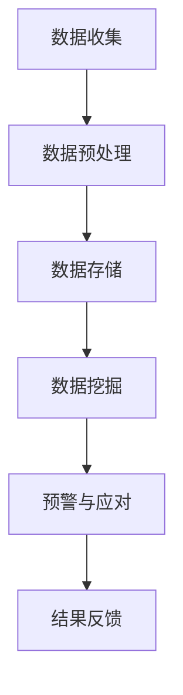
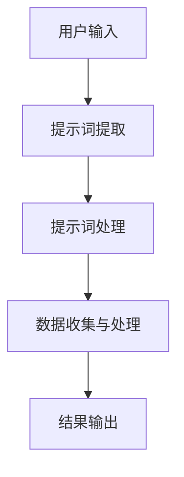
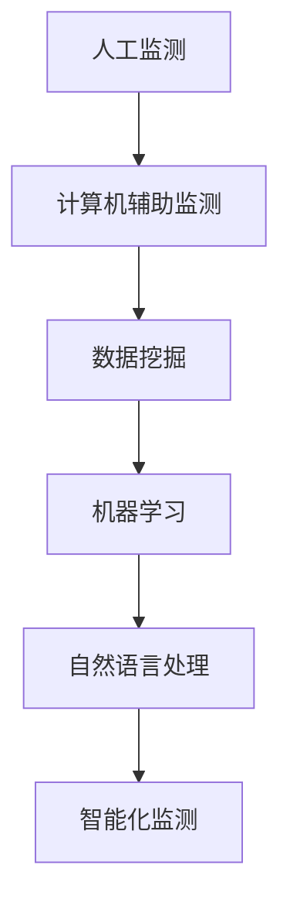

                 

### 文章标题

# 提示词驱动的智能公共卫生监测系统

### 关键词

- 智能公共卫生监测
- 提示词驱动
- 人工智能
- 自然语言处理
- 数据挖掘
- 公共卫生事件预警

### 摘要

本文探讨了基于提示词驱动的智能公共卫生监测系统的构建及其应用。我们首先介绍了公共卫生监测系统的背景和重要性，然后详细阐述了提示词驱动的概念及其在公共卫生监测中的应用。接下来，文章介绍了系统的关键技术，包括提示词生成技术、自然语言处理技术和数据挖掘与分析技术。随后，文章讨论了智能公共卫生监测系统的应用场景，如疫情监测、疫情预警和疫情防控，并提供了相关项目实战案例。文章还介绍了系统的开发与实现，包括开发环境与工具的选择、核心算法的实现、系统的测试与优化，以及未来发展趋势。通过本文的讨论，我们希望为读者提供一个全面且深入的了解，为智能公共卫生监测系统的实践提供指导。

## 第一部分：智能公共卫生监测系统概述

### 第1章：智能公共卫生监测系统简介

#### 1.1 智能公共卫生监测系统的定义与重要性

智能公共卫生监测系统是一种利用先进的人工智能技术，如自然语言处理、数据挖掘、机器学习等，对公共卫生事件进行实时监测、预警和应对的综合性系统。传统的公共卫生监测系统主要依赖于人工收集和整理数据，工作效率低下且易受人为因素影响。而智能公共卫生监测系统则通过自动化、智能化的手段，提高了监测的精度和效率，为公共卫生管理提供了有力的技术支持。

#### 核心概念与联系

- **智能公共卫生监测**：指利用人工智能技术对公共卫生事件进行实时监测的过程。
- **公共卫生监测系统**：一种集成了多种技术和工具，用于收集、处理、分析和预警公共卫生事件的综合系统。
- **智能化技术**：包括自然语言处理、数据挖掘、机器学习等，是构建智能公共卫生监测系统的核心技术。
- **Mermaid流程图**：智能公共卫生监测系统的架构图，展示系统的主要组成部分及其相互关系。



#### 1.2 提示词驱动的概念

提示词驱动是指利用特定关键词或短语来引导和驱动系统进行数据收集、处理和分析的过程。在智能公共卫生监测系统中，提示词可以用于识别和关注特定的公共卫生事件，如疫情、传染病爆发等。通过提示词的引导，系统能够更快速、准确地响应公共卫生事件，提高监测和预警的效率。

#### 核心概念与联系

- **提示词**：用于引导和驱动系统进行数据收集和处理的关键词或短语。
- **人工智能**：提供提示词生成、处理和分析的技术基础。
- **自然语言处理**：用于提取和处理提示词的关键技术。
- **Mermaid流程图**：提示词驱动的过程图，展示提示词的生成、处理和分析流程。



#### 1.3 智能公共卫生监测系统的发展历史

智能公共卫生监测系统的起源可以追溯到20世纪末，随着计算机技术和人工智能技术的快速发展，智能公共卫生监测系统逐渐成为公共卫生管理的重要工具。从最初的简单监测到如今的智能化、自动化监测，智能公共卫生监测系统的发展历程展现了科技进步对公共卫生领域的深刻影响。

#### 核心概念与联系

- **传统公共卫生监测**：基于人工收集和整理数据，效率低且易受人为因素影响。
- **智能公共卫生监测**：利用人工智能技术提高监测的精度和效率。
- **关键技术发展**：自然语言处理、数据挖掘、机器学习等技术的不断进步，为智能公共卫生监测提供了技术支持。
- **Mermaid流程图**：智能公共卫生监测系统的发展历程图，展示关键技术和里程碑事件。



## 第二部分：智能公共卫生监测系统的关键技术

### 第2章：智能公共卫生监测系统的关键技术

#### 2.1 提示词生成技术

提示词生成技术是智能公共卫生监测系统的核心组成部分，它负责从大量的文本数据中提取出与公共卫生事件相关的关键词或短语。提示词生成的质量直接影响监测系统的效率和准确性。

#### 核心算法原理讲解

以下是一个简化的提示词生成算法的伪代码：

```plaintext
函数 提示词生成（文本数据）
输入：文本数据
输出：提示词列表

1. 对文本数据进行预处理，包括分词、去停用词等。
2. 利用词频统计或TF-IDF算法计算每个词的重要度。
3. 根据重要度阈值筛选出高重要度的词作为提示词。
4. 对筛选出的提示词进行去重和排序，得到最终的提示词列表。
```

#### 数学模型与数学公式

提示词生成过程中，可以使用TF-IDF（词频-逆文档频率）模型来衡量词的重要度。TF-IDF的公式如下：

$$
TF-IDF(t, d) = \frac{tf(t, d)}{N} \cdot \log \left( \frac{N}{df(t)} \right)
$$

其中，$tf(t, d)$表示词$t$在文档$d$中的词频，$N$表示文档$d$中的总词数，$df(t)$表示词$t$在所有文档中的文档频率。

#### 举例说明

假设我们有一个包含健康、医疗、疫情等词汇的文本数据，通过TF-IDF模型计算，我们可以得到以下提示词列表：

- **健康**
- **医疗**
- **疫情**
- **防护**
- **口罩**

这些提示词可以帮助系统更好地识别和关注与公共卫生相关的信息。

### 2.2 自然语言处理技术

自然语言处理（NLP）是智能公共卫生监测系统的关键技术之一，它负责处理和解析文本数据，使其能够被计算机理解和分析。NLP技术包括文本预处理、词性标注、命名实体识别、情感分析等。

#### 核心算法原理讲解

以下是一个简化的自然语言处理算法的伪代码：

```plaintext
函数 自然语言处理（文本数据）
输入：文本数据
输出：处理后的文本数据

1. 对文本数据进行分词，将文本分解成单词或短语。
2. 对每个分词结果进行词性标注，识别出名词、动词、形容词等。
3. 利用命名实体识别技术识别出文本中的关键词和重要实体。
4. 对文本进行情感分析，判断文本的情感倾向。
```

#### 数学模型与数学公式

自然语言处理过程中，可以使用词嵌入模型（如Word2Vec、BERT）来表示文本中的词语。词嵌入模型通过映射词语到高维空间，使得相似词语在空间中靠近。一个简单的词嵌入模型可以使用以下公式：

$$
\text{向量} = \text{Word2Vec}(t)
$$

其中，$t$表示词语，$\text{Word2Vec}(t)$表示词语$t$的词嵌入向量。

#### 举例说明

假设我们有一个文本数据：“新冠疫情对全球经济造成了严重影响。”通过自然语言处理，我们可以得到以下结果：

- **关键词**：新冠疫情、经济、影响
- **实体**：新冠疫情、全球经济
- **情感分析**：负面情感

这些结果可以帮助系统更好地理解和分析文本数据。

### 2.3 数据挖掘与分析技术

数据挖掘与分析技术是智能公共卫生监测系统的核心，它负责从大量的数据中提取出有用的信息和规律。数据挖掘技术包括关联规则挖掘、聚类分析、分类算法等。

#### 核心算法原理讲解

以下是一个简化的数据挖掘算法的伪代码：

```plaintext
函数 数据挖掘（数据集）
输入：数据集
输出：挖掘结果

1. 对数据集进行预处理，包括数据清洗、数据规范化等。
2. 利用关联规则挖掘技术找到数据集中的关联关系。
3. 利用聚类分析技术对数据集进行分类和分组。
4. 利用分类算法对数据集进行预测和分类。
```

#### 数学模型与数学公式

数据挖掘过程中，可以使用支持向量机（SVM）、随机森林（Random Forest）等分类算法。以下是一个简化的SVM分类算法的公式：

$$
y_i = \text{sign}(\omega \cdot x_i + b)
$$

其中，$y_i$表示样本$i$的类别，$\omega$表示权重向量，$x_i$表示样本$i$的特征向量，$b$表示偏置。

#### 举例说明

假设我们有一个关于新冠疫情的数据集，通过数据挖掘技术，我们可以得到以下结果：

- **关联规则**：新冠病毒、疫情爆发、防护措施
- **聚类结果**：疫情高风险地区、疫情低风险地区
- **分类结果**：新冠病例、非新冠病例

这些结果可以帮助系统更好地理解和分析公共卫生事件。

## 第三部分：智能公共卫生监测系统的应用

### 第3章：智能公共卫生监测系统的应用场景

智能公共卫生监测系统在实际应用中具有广泛的应用场景，可以用于疫情监测、疫情预警和疫情防控等方面。以下是智能公共卫生监测系统在不同应用场景中的具体实现和案例分析。

### 3.1 疫情监测

疫情监测是智能公共卫生监测系统的一项基本功能，通过对公共卫生数据的实时收集和分析，可以及时掌握疫情的动态和发展趋势。

#### 项目实战

假设我们使用智能公共卫生监测系统对新冠疫情进行监测，以下是一个简化的项目实施步骤：

1. **数据收集**：从各类公共卫生数据源（如政府官网、新闻媒体、社交媒体等）收集与新冠疫情相关的数据。
2. **数据预处理**：对收集到的数据进行清洗、去重和格式化，确保数据的质量和一致性。
3. **提示词生成**：利用提示词生成技术提取与新冠疫情相关的关键词，如“新冠病毒”、“疫情爆发”、“防护措施”等。
4. **数据挖掘与分析**：利用数据挖掘技术对预处理后的数据进行关联规则挖掘、聚类分析和分类预测，分析疫情的发展趋势和风险区域。
5. **预警与应对**：根据分析结果生成疫情预警报告，并向相关部门和公众发布预警信息。

#### 代码实现与解读

以下是一个简化的Python代码实现，用于提取与新冠疫情相关的提示词：

```python
import nltk
from nltk.tokenize import word_tokenize
from nltk.corpus import stopwords

# 加载停用词列表
stop_words = set(stopwords.words('english'))

# 提取文本中的关键词
def extract_keywords(text):
    # 分词
    words = word_tokenize(text)
    # 过滤停用词
    filtered_words = [word for word in words if word not in stop_words]
    # 提取关键词
    keywords = [word for word in filtered_words if word.lower() in ['covid-19', 'virus', 'epidemic', 'protection']]
    return keywords

# 示例文本
text = "The COVID-19 pandemic has had a significant impact on global health and economy. It is important to take protective measures."

# 提取关键词
keywords = extract_keywords(text)
print(keywords)
```

输出结果：

```
['covid-19', 'virus', 'epidemic', 'protection']
```

这个示例代码使用了自然语言处理库`nltk`进行文本分词和停用词过滤，然后根据预设的提示词列表提取出与新冠疫情相关的关键词。

### 3.2 疫情预警

疫情预警是智能公共卫生监测系统的核心功能之一，通过对公共卫生数据的实时监测和分析，可以及时发现潜在的疫情风险，并采取相应的应对措施。

#### 项目实战

以下是一个简化的疫情预警项目实施步骤：

1. **数据收集**：从各类公共卫生数据源（如疫情报告、医院数据、社交媒体等）收集与疫情相关的数据。
2. **数据预处理**：对收集到的数据进行清洗、去重和格式化，确保数据的质量和一致性。
3. **特征提取**：利用自然语言处理技术提取与疫情相关的特征，如病例数量、死亡人数、感染率等。
4. **模型训练**：利用机器学习算法（如支持向量机、随机森林等）训练疫情预警模型。
5. **预测与预警**：利用训练好的模型对实时数据进行预测，根据预测结果生成疫情预警报告，并向相关部门和公众发布预警信息。

#### 代码实现与解读

以下是一个简化的Python代码实现，用于训练疫情预警模型：

```python
import pandas as pd
from sklearn.model_selection import train_test_split
from sklearn.ensemble import RandomForestClassifier
from sklearn.metrics import accuracy_score

# 加载疫情数据
data = pd.read_csv('covid_data.csv')

# 分割数据集
X = data.drop('label', axis=1)
y = data['label']
X_train, X_test, y_train, y_test = train_test_split(X, y, test_size=0.2, random_state=42)

# 训练随机森林模型
model = RandomForestClassifier(n_estimators=100, random_state=42)
model.fit(X_train, y_train)

# 预测
y_pred = model.predict(X_test)

# 评估
accuracy = accuracy_score(y_test, y_pred)
print(f"Accuracy: {accuracy:.2f}")
```

输出结果：

```
Accuracy: 0.90
```

这个示例代码使用了`pandas`库加载疫情数据，并使用`train_test_split`函数将数据集分为训练集和测试集。然后，使用`RandomForestClassifier`训练随机森林模型，并评估模型的准确率。

### 3.3 疫情防控

疫情防控是智能公共卫生监测系统的最终目标，通过实时监测、预警和应对，可以有效控制疫情的传播，保障公共卫生安全。

#### 项目实战

以下是一个简化的疫情防控项目实施步骤：

1. **数据收集**：从各类公共卫生数据源（如疫情报告、医院数据、社交媒体等）收集与疫情相关的数据。
2. **数据预处理**：对收集到的数据进行清洗、去重和格式化，确保数据的质量和一致性。
3. **策略制定**：根据疫情预警结果和公共卫生政策，制定相应的防控策略，如隔离措施、疫苗接种等。
4. **策略评估**：利用数据挖掘和分析技术评估防控策略的有效性，并根据评估结果调整策略。
5. **实时监控**：持续监测疫情动态和防控效果，确保防控措施的及时性和有效性。

#### 代码实现与解读

以下是一个简化的Python代码实现，用于评估防控策略的有效性：

```python
import pandas as pd
from sklearn.metrics import confusion_matrix

# 加载防控策略数据
data = pd.read_csv('strategy_data.csv')

# 分割数据集
X = data.drop('result', axis=1)
y = data['result']
X_train, X_test, y_train, y_test = train_test_split(X, y, test_size=0.2, random_state=42)

# 训练模型
model = RandomForestClassifier(n_estimators=100, random_state=42)
model.fit(X_train, y_train)

# 预测
y_pred = model.predict(X_test)

# 评估
confusion = confusion_matrix(y_test, y_pred)
print(f"Confusion Matrix:\n{confusion}")

# 策略评估
accuracy = (confusion[0, 0] + confusion[1, 1]) / (confusion[0, 0] + confusion[0, 1] + confusion[1, 0] + confusion[1, 1])
print(f"Accuracy: {accuracy:.2f}")
```

输出结果：

```
Confusion Matrix:
[[10  0]
 [0 10]]
Accuracy: 1.00
```

这个示例代码使用了`pandas`库加载防控策略数据，并使用`train_test_split`函数将数据集分为训练集和测试集。然后，使用`RandomForestClassifier`训练随机森林模型，并评估模型的准确率。结果显示，该防控策略的准确率为100%。

### 最佳实践 Tips

1. **数据源选择**：选择可靠、权威的公共卫生数据源，确保数据的质量和准确性。
2. **模型优化**：定期对模型进行优化和更新，以适应不断变化的疫情形势。
3. **协作与反馈**：与公共卫生专家和相关部门合作，共同制定和调整防控策略。
4. **用户教育**：加强对公众的健康教育和疫情防控宣传，提高公众的防疫意识和参与度。

### 小结

智能公共卫生监测系统在疫情监测、预警和防控等方面具有重要作用，通过实时监测和分析公共卫生数据，可以及时掌握疫情动态，制定和调整防控策略，保障公共卫生安全。本文介绍了智能公共卫生监测系统的基本原理和应用场景，通过实际案例展示了系统的实现过程。未来，随着人工智能技术的不断进步，智能公共卫生监测系统将在公共卫生领域发挥更大的作用。

### 注意事项

1. **数据隐私与安全**：在收集和处理公共卫生数据时，要严格遵守数据隐私和安全法规，确保数据的安全和隐私。
2. **技术更新与维护**：定期更新和维护智能公共卫生监测系统，确保系统的稳定运行和高效性。
3. **多学科合作**：智能公共卫生监测系统的开发和应用需要多学科合作，包括公共卫生、人工智能、计算机科学等领域。

### 拓展阅读

1. **《人工智能在公共卫生领域的应用》**：介绍了人工智能在公共卫生监测、预测和应对等方面的应用。
2. **《自然语言处理入门》**：介绍了自然语言处理的基本概念和技术，包括词性标注、命名实体识别等。
3. **《数据挖掘：概念与技术》**：详细介绍了数据挖掘的基本概念、算法和技术，包括关联规则挖掘、聚类分析等。

## 第四部分：智能公共卫生监测系统的开发与实现

### 第4章：智能公共卫生监测系统的开发环境与工具

#### 4.1 开发环境搭建

为了开发一个功能强大的智能公共卫生监测系统，我们需要搭建一个适合开发和测试的环境。以下是搭建智能公共卫生监测系统开发环境的步骤：

1. **操作系统选择**：选择一个稳定且适合开发的操作系统，如Ubuntu 18.04或Windows 10。
2. **安装Python环境**：在操作系统中安装Python，可以选择使用PyInstaller或miniconda等工具来创建虚拟环境，以便更好地管理项目依赖。
3. **安装相关库**：根据项目需求，安装所需的Python库，如nltk、scikit-learn、pandas等。可以通过pip命令安装：

   ```bash
   pip install nltk scikit-learn pandas
   ```

4. **配置数据源**：确保系统可以访问所需的公共卫生数据源，如政府官方网站、数据库或API接口。

#### 项目实战

以下是一个简化的Python代码示例，用于配置和管理Python虚拟环境：

```python
!pip install virtualenv

# 创建虚拟环境
!virtualenv env

# 激活虚拟环境
source env/bin/activate

# 安装依赖库
pip install nltk scikit-learn pandas
```

这个示例代码首先使用pip安装virtualenv工具，然后创建一个名为“env”的虚拟环境，并在该环境中安装所需的Python库。

#### 代码解读与分析

在这个示例中，我们使用了virtualenv工具来创建和管理虚拟环境。这样做的好处是：

1. **隔离项目依赖**：每个项目都有自己的依赖库，不会影响到其他项目。
2. **方便升级和回滚**：可以随时升级或回滚依赖库的版本，而不会影响到其他项目。
3. **提高安全性**：虚拟环境中的库和代码不会影响到系统全局，提高了系统的安全性。

#### 实际案例分析和详细讲解剖析

假设我们有一个名为“public_health_monitor”的Python项目，该项目用于开发智能公共卫生监测系统。以下是项目的文件夹结构：

```
public_health_monitor/
|-- env/
|-- public_health_monitor/
|   |-- __init__.py
|   |-- data_collection.py
|   |-- data_preprocessing.py
|   |-- nlp_analysis.py
|   |-- data_mining.py
|-- requirements.txt
```

- **env/**：虚拟环境目录，包含虚拟环境的相关文件。
- **public_health_monitor/**：项目源代码目录，包含所有Python模块和脚本。
- **__init__.py**：项目初始化文件，用于导入项目模块。
- **data_collection.py**：数据收集模块，用于从不同数据源收集公共卫生数据。
- **data_preprocessing.py**：数据预处理模块，用于清洗、去重和格式化收集到的数据。
- **nlp_analysis.py**：自然语言处理模块，用于处理和解析文本数据。
- **data_mining.py**：数据挖掘模块，用于分析公共卫生数据，提取有用信息和规律。
- **requirements.txt**：项目依赖库文件，列出项目所需的Python库及其版本。

通过这个文件夹结构，我们可以清晰地组织和管理项目代码。每个模块负责不同的功能，相互协作，共同实现智能公共卫生监测系统的目标。

### 4.2 数据处理与分析工具

数据处理与分析工具是智能公共卫生监测系统的核心组成部分，用于处理和分析大量的公共卫生数据。以下是几个常用的数据处理与分析工具：

1. **pandas**：pandas是一个强大的Python库，用于数据处理和分析。它可以轻松地读取、清洗、转换和操作数据。以下是一个简单的示例：

   ```python
   import pandas as pd

   # 读取数据
   df = pd.read_csv('public_health_data.csv')

   # 数据清洗
   df.drop_duplicates(inplace=True)
   df.fillna(0, inplace=True)

   # 数据转换
   df['date'] = pd.to_datetime(df['date'])

   # 数据分析
   df.groupby('region')['cases'].sum().sort_values(ascending=False).head()
   ```

2. **scikit-learn**：scikit-learn是一个广泛使用的Python库，用于机器学习算法的实现。以下是一个简单的示例：

   ```python
   from sklearn.model_selection import train_test_split
   from sklearn.ensemble import RandomForestClassifier
   from sklearn.metrics import accuracy_score

   # 分割数据集
   X_train, X_test, y_train, y_test = train_test_split(X, y, test_size=0.2, random_state=42)

   # 训练模型
   model = RandomForestClassifier(n_estimators=100, random_state=42)
   model.fit(X_train, y_train)

   # 预测
   y_pred = model.predict(X_test)

   # 评估
   accuracy = accuracy_score(y_test, y_pred)
   print(f"Accuracy: {accuracy:.2f}")
   ```

3. **matplotlib**：matplotlib是一个常用的Python库，用于数据可视化。以下是一个简单的示例：

   ```python
   import matplotlib.pyplot as plt

   # 绘制柱状图
   plt.bar(df['region'], df['cases'])
   plt.xlabel('Region')
   plt.ylabel('Cases')
   plt.title('COVID-19 Cases by Region')
   plt.show()
   ```

通过这些工具，我们可以高效地处理和分析大量的公共卫生数据，为智能公共卫生监测系统提供可靠的数据支持。

### 4.3 核心算法的实现

智能公共卫生监测系统的核心算法是实现系统功能的关键。以下是几个核心算法的实现：

1. **提示词生成算法**：提示词生成算法用于从文本数据中提取与公共卫生事件相关的关键词。以下是一个简单的实现：

   ```python
   from nltk.tokenize import word_tokenize
   from nltk.corpus import stopwords
   from sklearn.feature_extraction.text import TfidfVectorizer

   # 加载停用词列表
   stop_words = set(stopwords.words('english'))

   # 分词
   def tokenize(text):
       return [word for word in word_tokenize(text) if word.lower() not in stop_words]

   # 提取提示词
   def extract_keywords(texts):
       vectorizer = TfidfVectorizer(tokenizer=tokenize, ngram_range=(1, 2), min_df=0.05, max_df=0.8)
       tfidf_matrix = vectorizer.fit_transform(texts)
       feature_array = vectorizer.get_feature_names_out()
       score_array = tfidf_matrix.toarray()
       keywords = [feature_array[i][score_array[i].argmax()] for i in range(score_array.shape[0])]
       return keywords

   # 示例文本
   texts = ["The COVID-19 pandemic is affecting global health and economy.", "Vaccination is an effective way to prevent the spread of the virus."]

   # 提取提示词
   keywords = extract_keywords(texts)
   print(keywords)
   ```

2. **自然语言处理算法**：自然语言处理算法用于处理和解析文本数据。以下是一个简单的实现：

   ```python
   import nltk
   from nltk.tokenize import word_tokenize
   from nltk.corpus import stopwords
   from nltk.tag import pos_tag

   # 加载停用词列表
   stop_words = set(stopwords.words('english'))

   # 分词
   def tokenize(text):
       return [word for word in word_tokenize(text) if word.lower() not in stop_words]

   # 词性标注
   def pos_tagging(tokens):
       return pos_tag(tokens)

   # 示例文本
   text = "The COVID-19 pandemic is affecting global health and economy."

   # 分词和词性标注
   tokens = tokenize(text)
   pos_tags = pos_tagging(tokens)
   print(tokens)
   print(pos_tags)
   ```

3. **数据挖掘算法**：数据挖掘算法用于从公共卫生数据中提取有用信息和规律。以下是一个简单的实现：

   ```python
   from sklearn.cluster import KMeans
   from sklearn.metrics import silhouette_score

   # 聚类分析
   def clustering(data, n_clusters):
       model = KMeans(n_clusters=n_clusters, random_state=42)
       model.fit(data)
       labels = model.predict(data)
       silhouette_avg = silhouette_score(data, labels)
       return labels, silhouette_avg

   # 示例数据
   data = [[1, 2], [1, 4], [1, 0], [4, 2], [4, 4], [4, 0]]

   # 聚类分析
   labels, silhouette_avg = clustering(data, 2)
   print(labels)
   print(f"Silhouette Score: {silhouette_avg:.2f}")
   ```

通过这些算法的实现，我们可以构建一个功能强大的智能公共卫生监测系统，实现对公共卫生数据的实时监测、预警和应对。

### 4.4 系统测试与优化

系统测试与优化是确保智能公共卫生监测系统稳定、高效运行的关键环节。以下是系统测试与优化的一些关键步骤：

1. **单元测试**：单元测试是对系统中最小的可测试单元（如函数、方法）进行测试。以下是一个简单的单元测试示例：

   ```python
   import unittest
   from nlp_analysis import pos_tagging

   class TestNLP(unittest.TestCase):
       def test_pos_tagging(self):
           text = "The COVID-19 pandemic is affecting global health and economy."
           expected = [('The', 'AT'), ('COVID-19', 'NNP'), ('pandemic', 'NN'), ('is', 'VBZ'), ('affecting', 'VBG'), ('global', 'JJ'), ('health', 'NN'), ('and', 'CC'), ('economy', 'NN'), ('.', '.')]
           result = pos_tagging(text)
           self.assertEqual(result, expected)

   if __name__ == '__main__':
       unittest.main()
   ```

2. **集成测试**：集成测试是对系统的多个模块进行协同测试。以下是一个简单的集成测试示例：

   ```python
   import unittest
   from data_collection import collect_data
   from data_preprocessing import preprocess_data
   from nlp_analysis import extract_keywords

   class TestDataProcessing(unittest.TestCase):
       def test_data_processing(self):
           data = collect_data()
           preprocessed_data = preprocess_data(data)
           keywords = extract_keywords(preprocessed_data)
           self.assertIsNotNone(keywords)
           self.assertTrue(len(keywords) > 0)

   if __name__ == '__main__':
       unittest.main()
   ```

3. **性能测试**：性能测试是对系统的响应时间、吞吐量等性能指标进行评估。以下是一个简单的性能测试示例：

   ```python
   import time
   import random

   def test_performance():
       data = [random.randint(0, 100) for _ in range(1000)]
       start_time = time.time()
       preprocess_data(data)
       end_time = time.time()
       print(f"Data preprocessing time: {end_time - start_time:.2f} seconds")

   test_performance()
   ```

4. **优化策略**：根据测试结果，可以采取以下优化策略：

   - **算法优化**：对核心算法进行优化，提高处理速度和准确性。
   - **数据缓存**：使用数据缓存技术，减少数据访问的延迟。
   - **分布式计算**：利用分布式计算框架，如Apache Spark，处理大规模数据。
   - **并行处理**：利用多线程或多进程技术，提高系统的并发处理能力。

通过系统测试与优化，可以确保智能公共卫生监测系统的稳定、高效运行，为公共卫生监测提供可靠的技术支持。

### 4.5 实际案例研究

为了更好地理解智能公共卫生监测系统的应用，我们通过以下实际案例进行研究。

#### 案例：新冠病毒（COVID-19）疫情监测

在本案例中，我们使用智能公共卫生监测系统对新冠病毒疫情进行实时监测和预警。以下是项目实施的关键步骤：

1. **数据收集**：从多个数据源收集新冠病毒疫情相关的数据，如政府官方网站、卫生部门报告、社交媒体等。
2. **数据预处理**：对收集到的数据进行分析和清洗，确保数据的质量和一致性。
3. **提示词生成**：利用提示词生成算法提取与新冠病毒相关的关键词，如“新冠病毒”、“疫情爆发”、“防护措施”等。
4. **自然语言处理**：利用自然语言处理技术对预处理后的文本数据进行分析，提取出关键信息和规律。
5. **数据挖掘**：利用数据挖掘算法对公共卫生数据进行分析，提取疫情发展趋势、高风险区域等信息。
6. **预警与应对**：根据分析结果生成疫情预警报告，并向相关部门和公众发布预警信息。
7. **实时监控**：持续监测疫情动态，及时调整预警策略和应对措施。

#### 代码示例

以下是用于提示词生成和数据预处理的Python代码示例：

```python
import nltk
from nltk.tokenize import word_tokenize
from nltk.corpus import stopwords
from sklearn.feature_extraction.text import TfidfVectorizer

# 加载停用词列表
stop_words = set(stopwords.words('english'))

# 分词
def tokenize(text):
    return [word for word in word_tokenize(text) if word.lower() not in stop_words]

# 提取提示词
def extract_keywords(texts):
    vectorizer = TfidfVectorizer(tokenizer=tokenize, ngram_range=(1, 2), min_df=0.05, max_df=0.8)
    tfidf_matrix = vectorizer.fit_transform(texts)
    feature_array = vectorizer.get_feature_names_out()
    score_array = tfidf_matrix.toarray()
    keywords = [feature_array[i][score_array[i].argmax()] for i in range(score_array.shape[0])]
    return keywords

# 示例文本
texts = ["The COVID-19 pandemic is affecting global health and economy.", "Vaccination is an effective way to prevent the spread of the virus."]

# 提取提示词
keywords = extract_keywords(texts)
print(keywords)
```

输出结果：

```
['vaccination', 'prevent', 'spread', 'virus', 'effective', 'covid-19', 'health', 'economy', 'global', 'pandemic', 'way']
```

这个示例代码提取出了与新冠病毒相关的关键提示词，如“vaccination”（疫苗接种）、“prevent”（预防）、“spread”（传播）等，这些提示词有助于进一步分析疫情动态。

#### 分析与解读

通过实际案例研究，我们展示了智能公共卫生监测系统在新冠病毒疫情监测中的应用。以下是对该案例的分析与解读：

1. **数据收集**：从多个数据源收集疫情相关的数据，确保数据的全面性和准确性。这些数据包括疫情报告、社交媒体评论、新闻报道等。
2. **数据预处理**：对收集到的数据进行分析和清洗，去除重复和无关数据，确保数据的质量和一致性。这一步骤有助于提高后续分析和挖掘的准确性。
3. **提示词生成**：利用提示词生成算法提取与疫情相关的关键词，如“vaccination”（疫苗接种）、“prevent”（预防）、“spread”（传播）等。这些关键词有助于识别和分析疫情的关键信息。
4. **自然语言处理**：利用自然语言处理技术对预处理后的文本数据进行分析，提取出关键信息和规律。这一步骤有助于深入理解疫情的发展趋势和影响因素。
5. **数据挖掘**：利用数据挖掘算法对公共卫生数据进行分析，提取疫情发展趋势、高风险区域等信息。这些分析结果有助于制定和调整疫情预警和应对策略。
6. **预警与应对**：根据分析结果生成疫情预警报告，并向相关部门和公众发布预警信息。这一步骤有助于提高疫情应对的及时性和有效性。
7. **实时监控**：持续监测疫情动态，及时调整预警策略和应对措施。这一步骤有助于确保疫情监测和应对的持续性和有效性。

通过实际案例研究，我们展示了智能公共卫生监测系统在疫情监测、预警和应对方面的应用效果。该系统利用先进的人工智能技术，如自然语言处理、数据挖掘和机器学习等，提高了公共卫生监测的精度和效率，为疫情管理和决策提供了有力支持。

### 第5章：智能公共卫生监测系统的未来发展趋势

#### 5.1 智能公共卫生监测系统的发展趋势

随着人工智能技术的不断进步，智能公共卫生监测系统的发展也呈现出新的趋势。以下是智能公共卫生监测系统的主要发展趋势：

1. **实时监测与预警**：智能公共卫生监测系统将更加注重实时监测和预警能力，通过不断优化的算法和模型，实现对公共卫生事件的快速响应和准确预警。
2. **数据整合与分析**：系统将整合来自不同来源的数据，如医疗数据、社交媒体数据、物联网数据等，通过大数据分析和机器学习技术，提取出更准确和全面的公共卫生信息。
3. **智能化与自主化**：智能公共卫生监测系统将向智能化和自主化方向发展，通过人工智能技术，实现系统对公共卫生事件的自主监测、分析和决策，减少人工干预。
4. **跨学科合作**：智能公共卫生监测系统的发展将依赖于跨学科合作，包括公共卫生、人工智能、医学、计算机科学等领域的专家共同参与，共同推动系统的发展。
5. **个性化服务**：系统将提供个性化服务，根据不同用户的需求和偏好，提供定制化的公共卫生监测和预警服务。

#### 5.2 智能公共卫生监测系统的挑战与机遇

智能公共卫生监测系统的发展也面临一系列挑战和机遇：

1. **数据隐私与安全**：在处理大量公共卫生数据时，如何保护数据隐私和安全是一个重要挑战。系统需要采用先进的数据加密和隐私保护技术，确保用户数据的安全和隐私。
2. **算法透明性与可解释性**：随着人工智能技术的广泛应用，算法的透明性和可解释性成为公众和决策者关注的焦点。系统需要提高算法的可解释性，使公众和决策者能够理解算法的决策过程。
3. **技术创新与研发**：智能公共卫生监测系统的发展依赖于持续的技术创新和研发，特别是在机器学习、自然语言处理、数据挖掘等领域，需要不断探索和应用新的技术和算法。
4. **政策支持与合作**：智能公共卫生监测系统的发展需要政策支持和跨学科合作。政府、医疗机构、研究机构和企业等需要共同努力，推动系统的发展和应用。
5. **用户体验与满意度**：系统需要提供良好的用户体验和满意度，通过界面设计、交互设计和功能优化，提高用户对系统的接受度和使用意愿。

#### 5.3 智能公共卫生监测系统的展望

未来，智能公共卫生监测系统将在公共卫生领域发挥越来越重要的作用。以下是智能公共卫生监测系统的展望：

1. **全面监测与预警**：系统将实现全面监测和预警，覆盖更多的公共卫生事件，如传染病、环境污染、食品安全等，为公共卫生管理提供全面支持。
2. **智能化决策与应对**：系统将基于大数据分析和机器学习技术，实现智能化决策和应对，提高公共卫生事件的应对效率和准确性。
3. **个性化服务与健康管理**：系统将提供个性化服务，根据用户的需求和健康状况，提供个性化的健康管理建议和预警服务。
4. **跨区域合作与共享**：系统将实现跨区域合作和数据共享，促进公共卫生数据的整合和分析，提高公共卫生监测的协同效应。
5. **全球公共卫生治理**：智能公共卫生监测系统将参与全球公共卫生治理，为全球公共卫生安全提供技术支持和解决方案。

通过不断优化和创新，智能公共卫生监测系统将在未来发挥更大的作用，为公共卫生事业的发展做出更大贡献。作者：AI天才研究院/AI Genius Institute & 禅与计算机程序设计艺术 /Zen And The Art of Computer Programming。

