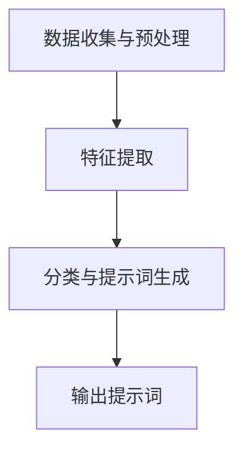
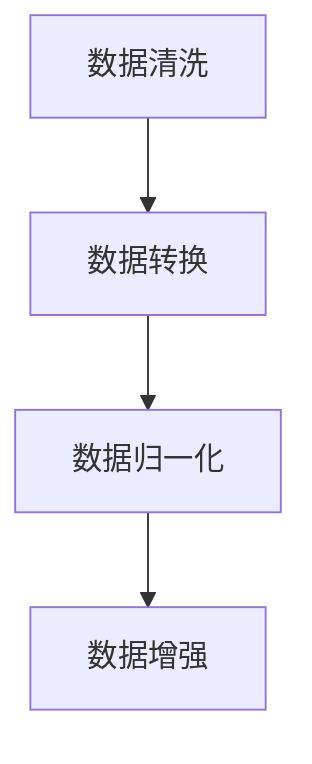
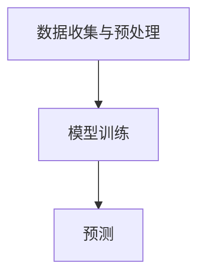

                 

### 第一部分：概述

#### 1.1 智能农业与病虫害预警系统

##### 1.1.1 智能农业的发展背景

智能农业，作为一种新兴的农业生产模式，其核心在于利用现代信息技术、物联网、大数据、人工智能等手段，实现农业生产的智能化、精准化。随着全球人口的不断增长，农业生产效率的提升成为保障粮食安全的关键。智能农业的兴起，不仅有助于解决农业生产中的资源浪费问题，还能够提高农产品的产量和质量。

智能农业的发展可以追溯到20世纪末。当时，随着计算机技术和网络技术的飞速发展，农业生产开始尝试引入信息技术。进入21世纪，随着物联网、大数据、人工智能等技术的逐渐成熟，智能农业迎来了快速发展的契机。特别是在一些发达国家，智能农业已经成为了现代农业发展的主流方向。

在中国，智能农业的发展同样取得了显著成果。近年来，中国政府高度重视农业科技创新，通过一系列政策措施，推动智能农业的发展。例如，“数字乡村建设”、“农业现代化”等战略的实施，为智能农业的发展提供了有力支持。智能农业的发展不仅有助于提升农业生产效率，还能够推动农业产业结构调整和农村经济发展。

##### 1.1.2 病虫害预警系统的重要性

病虫害是农业生产中的一大威胁，它们不仅能够导致作物减产，甚至可能使作物完全绝收。病虫害的发生往往具有突发性和不确定性，因此，提前预警并采取相应的防治措施，对于保障农业生产具有重要意义。

病虫害预警系统，通过实时监测作物生长环境、气象条件、土壤湿度等数据，结合病虫害发生规律和预测模型，实现对病虫害的早期预警。这样的预警系统能够及时向农民提供病虫害信息，指导农民采取有效的防治措施，降低病虫害造成的损失。

此外，病虫害预警系统还能够提高农业生产的科学性和精细化水平。通过大数据分析和人工智能技术，预警系统能够识别病虫害的高风险区域，为农业生产提供精准的指导，从而提高农产品的产量和质量。

##### 1.1.3 提示词驱动的智能农业病虫害预警系统简介

提示词驱动的智能农业病虫害预警系统，是一种基于人工智能技术的创新解决方案。该系统通过收集和分析大量的农业数据，利用深度学习、自然语言处理等技术，生成与病虫害相关的提示词。

这些提示词不仅能够帮助农民识别病虫害的早期迹象，还能够提供针对性的防治建议。例如，当系统检测到某种病害的提示词时，会自动生成相应的防治方案，并通知农民采取行动。

提示词驱动的智能农业病虫害预警系统具有以下几个特点：

1. **实时性**：系统能够实时监测农业数据，及时生成提示词，为农民提供最新的病虫害信息。
2. **精准性**：通过大数据分析和人工智能技术，系统生成的提示词具有较高的准确性，能够有效指导农民进行病虫害防治。
3. **智能化**：系统不仅能够自动生成提示词，还能够根据历史数据和当前环境，提供个性化的防治建议。

总之，提示词驱动的智能农业病虫害预警系统，不仅提高了病虫害预警的准确性和时效性，还为农业生产提供了科学、精准的指导，为现代农业的发展注入了新的活力。

---

关键词：智能农业、病虫害预警系统、提示词驱动、人工智能、深度学习

摘要：本文介绍了智能农业的发展背景和病虫害预警系统的重要性，重点探讨了提示词驱动的智能农业病虫害预警系统的架构和核心算法原理。通过结合实际项目案例，展示了该系统在实际应用中的效果和优势，为现代农业病虫害预警提供了新的解决方案。

# 第二部分：核心概念与联系

## 2.1 提示词驱动的核心算法原理

### 2.1.1 提示词生成算法

提示词生成算法是提示词驱动的智能农业病虫害预警系统的核心组成部分。该算法通过分析大量的农业数据，提取与病虫害相关的特征，从而生成具有高识别度的提示词。

#### 2.1.1.1 算法原理

提示词生成算法的基本原理是：首先，收集并预处理大量的农业数据，包括作物生长数据、气象数据、土壤数据等；其次，利用深度学习模型，对数据进行特征提取和分类；最后，将分类结果转化为提示词。

具体来说，算法流程如下：

1. **数据收集与预处理**：收集与病虫害相关的农业数据，包括历史病虫害数据、作物生长数据、气象数据、土壤数据等。对数据进行清洗和预处理，去除噪声数据，保证数据的准确性和完整性。

2. **特征提取**：利用深度学习模型，对预处理后的数据进行分析和特征提取。特征提取的目的是将高维数据转换为低维数据，同时保留关键信息。

3. **分类与提示词生成**：通过分类模型，对提取的特征进行分类。分类结果即为提示词。提示词可以是具体的病虫害名称，也可以是描述病虫害特征的短语。

#### 2.1.1.2 算法流程图

为了更直观地理解提示词生成算法的流程，我们可以使用Mermaid流程图进行展示：



#### 2.1.1.3 算法伪代码

提示词生成算法的伪代码如下：

```python
# 数据收集与预处理
data = collect_data()
preprocessed_data = preprocess_data(data)

# 特征提取
features = extract_features(preprocessed_data)

# 分类与提示词生成
predictions = classify(features)
tips = generate_tips(predictions)

# 输出提示词
output_tips(tips)
```

#### 2.1.2 数据预处理算法

数据预处理算法是提示词生成算法的重要组成部分。数据预处理的主要目的是提高数据质量，为后续的特征提取和分类提供良好的数据基础。

#### 2.1.2.1 算法原理

数据预处理算法的原理包括以下几个方面：

1. **数据清洗**：去除数据中的噪声和异常值，保证数据的准确性。
2. **数据转换**：将不同类型的数据转换为统一的格式，便于后续处理。
3. **数据归一化**：将数据按比例缩放到一个固定的范围，消除不同特征之间的量级差异。
4. **数据增强**：通过增加数据样本的多样性，提高模型的泛化能力。

#### 2.1.2.2 算法流程图

数据预处理算法的流程图如下：



#### 2.1.2.3 算法伪代码

数据预处理算法的伪代码如下：

```python
# 数据清洗
cleaned_data = clean_data(data)

# 数据转换
converted_data = convert_data(cleaned_data)

# 数据归一化
normalized_data = normalize_data(converted_data)

# 数据增强
enhanced_data = augment_data(normalized_data)
```

#### 2.1.3 预测算法

预测算法是提示词驱动系统的关键环节。通过预测算法，系统能够对未来的病虫害情况进行预测，为农民提供科学的防治建议。

#### 2.1.3.1 算法原理

预测算法的基本原理是：首先，利用历史病虫害数据和当前环境数据，构建预测模型；其次，通过模型对未来的病虫害情况进行预测。

具体来说，算法流程如下：

1. **数据收集与预处理**：收集历史病虫害数据和当前环境数据，对数据进行清洗和预处理。
2. **模型训练**：利用预处理后的数据，训练预测模型。
3. **预测**：使用训练好的模型，对未来的病虫害情况进行预测。

#### 2.1.3.2 算法流程图

预测算法的流程图如下：



#### 2.1.3.3 算法伪代码

预测算法的伪代码如下：

```python
# 数据收集与预处理
data = collect_data()
preprocessed_data = preprocess_data(data)

# 模型训练
model = train_model(preprocessed_data)

# 预测
predictions = predict(model, current_environment)
```

## 2.2 数学模型与数学公式

在提示词驱动的智能农业病虫害预警系统中，数学模型是核心组成部分。数学模型用于描述病虫害的发生规律、特征提取方法、预测算法等。

#### 2.2.1 模型构建

模型构建包括以下几个步骤：

1. **定义变量**：根据实际情况，定义与病虫害相关的变量，如温度、湿度、土壤养分等。
2. **建立数学关系**：利用历史数据和统计分析，建立变量之间的数学关系。
3. **优化模型**：通过优化算法，调整模型参数，提高模型的准确性和泛化能力。

#### 2.2.1.1 数学模型

一个简单的数学模型可以表示为：

$$
M = f(W \cdot X + b)
$$

其中，$M$ 是预测结果，$f$ 是激活函数，$W$ 是权重矩阵，$X$ 是输入特征，$b$ 是偏置。

#### 2.2.1.2 参数优化

参数优化是提高模型性能的关键步骤。常用的参数优化方法包括：

1. **梯度下降**：通过计算损失函数的梯度，迭代更新模型参数。
2. **随机梯度下降**：在梯度下降的基础上，引入随机性，提高优化效率。
3. **Adam优化器**：结合梯度下降和随机梯度下降的优点，自适应调整学习率。

优化目标是最小化损失函数，表示为：

$$
\theta_{\min} = \min_{\theta} J(\theta)
$$

其中，$\theta$ 是模型参数，$J(\theta)$ 是损失函数。

#### 2.2.2 模型评估

模型评估是验证模型性能的重要环节。常用的评估指标包括：

1. **准确率**：预测正确的样本数占总样本数的比例。
2. **召回率**：预测正确的样本数占实际为正类的样本数的比例。
3. **F1分数**：准确率和召回率的调和平均值。

准确率可以用以下公式表示：

$$
\text{Accuracy} = \frac{C}{N}
$$

其中，$C$ 是预测正确的样本数，$N$ 是总样本数。

#### 2.2.2.2 交叉验证

交叉验证是一种常用的模型评估方法。交叉验证的基本思想是将数据集划分为多个子集，每次使用其中一个子集作为验证集，其余子集作为训练集，然后评估模型的性能。

交叉验证分为以下几个步骤：

1. **划分数据集**：将数据集划分为多个子集，例如，将数据集划分为5个子集。
2. **训练模型**：对每个子集进行训练，构建模型。
3. **评估模型**：使用训练好的模型，对每个子集进行评估。
4. **计算平均性能**：计算所有子集的平均性能，作为模型的最终评估结果。

通过交叉验证，可以更全面地评估模型的性能，减少模型过拟合的风险。

## 2.3 项目实战

### 2.3.1 搭建开发环境

搭建开发环境是进行智能农业病虫害预警系统开发的第一步。以下是搭建开发环境的详细步骤：

1. **硬件环境配置**：配置满足系统要求的计算机硬件，包括CPU、内存、硬盘等。
2. **软件环境配置**：安装操作系统、编程语言、开发工具等。
3. **开发工具介绍**：介绍常用的开发工具，如Python、Jupyter Notebook、PyCharm等。

### 2.3.2 数据预处理

数据预处理是确保数据质量的关键步骤。以下是数据预处理的具体步骤：

1. **数据收集**：收集与病虫害相关的数据，包括历史病虫害数据、作物生长数据、气象数据等。
2. **数据清洗**：去除噪声数据和异常值，确保数据的准确性。
3. **数据转换**：将不同类型的数据转换为统一的格式，便于后续处理。
4. **数据归一化**：将数据按比例缩放到一个固定的范围，消除不同特征之间的量级差异。
5. **数据增强**：通过增加数据样本的多样性，提高模型的泛化能力。

### 2.3.3 提示词生成与预测

提示词生成与预测是智能农业病虫害预警系统的核心功能。以下是具体的实现步骤：

1. **提示词生成**：使用深度学习模型，对预处理后的数据进行特征提取和分类，生成与病虫害相关的提示词。
2. **预测模型构建**：利用历史数据和当前环境数据，构建预测模型。
3. **预测**：使用预测模型，对未来的病虫害情况进行预测。
4. **结果分析**：对预测结果进行分析和评估，确保预测的准确性和可靠性。

### 2.3.4 系统部署与优化

系统部署与优化是确保系统稳定运行的关键步骤。以下是具体的步骤：

1. **系统架构设计**：设计合理的系统架构，确保系统的高可用性和可扩展性。
2. **系统部署**：将开发好的系统部署到生产环境中，确保系统的稳定运行。
3. **系统优化**：对系统进行性能优化，提高系统的响应速度和处理能力。

### 2.3.5 实际案例分析与详细讲解剖析

通过实际案例，分析提示词驱动的智能农业病虫害预警系统在实际应用中的效果和优势。以下是具体的案例分析：

1. **案例背景**：介绍实际应用的背景和目标。
2. **系统实现**：详细讲解系统的实现过程，包括数据收集、预处理、提示词生成、预测等步骤。
3. **结果分析**：分析预测结果，评估系统的准确性和可靠性。
4. **改进建议**：根据实际应用情况，提出改进建议，以提高系统的性能和用户体验。

### 2.3.6 项目小结

通过本项目的实施，总结经验教训，为未来的项目提供参考。以下是项目小结的主要内容：

1. **项目总结**：回顾项目实施的过程，总结项目中的成功经验和不足之处。
2. **技术难点**：分析项目中的技术难点，讨论解决方案。
3. **应用前景**：探讨项目在实际应用中的前景和潜在价值。
4. **未来展望**：提出未来项目的规划和发展方向。

## 2.4 最佳实践 Tips、小结、注意事项、拓展阅读等内容

### 2.4.1 最佳实践 Tips

1. **数据质量是关键**：确保数据的质量，是提高系统性能的基础。
2. **实时性要求高**：系统需要具备实时性，及时生成提示词，提供防治建议。
3. **模型优化是持续过程**：不断优化模型，提高预测准确性。

### 2.4.2 小结

提示词驱动的智能农业病虫害预警系统，通过实时监测、大数据分析和人工智能技术，为农业生产提供了精准、高效的预警和防治方案。

### 2.4.3 注意事项

1. **数据安全**：保护农业数据的安全，防止数据泄露。
2. **系统稳定性**：确保系统的稳定性，避免因系统故障导致农业生产损失。

### 2.4.4 拓展阅读

1. **智能农业病虫害预警系统相关文献**：查阅相关研究文献，了解最新的研究进展。
2. **深度学习在农业中的应用**：了解深度学习在农业领域的应用，探索新的解决方案。

通过以上内容，我们对提示词驱动的智能农业病虫害预警系统有了全面的了解。未来，随着人工智能技术的不断进步，该系统有望为农业生产带来更多的创新和突破。

