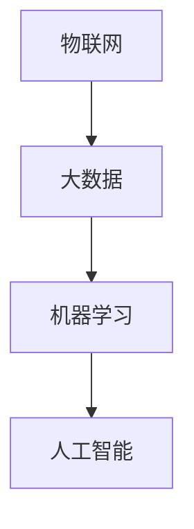
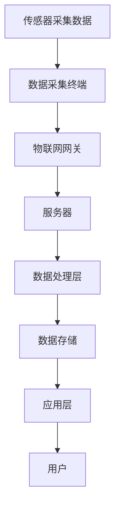

                 

<sop>

为了撰写一篇符合要求的文章，我们需要遵循以下步骤：

### 2.1 确定文章主题与结构

首先，我们需要明确文章的主题和结构。文章的主题是“提示词驱动的智能农业管理系统”，因此，文章的结构应围绕智能农业管理系统的介绍、核心概念与联系、算法原理讲解、数学模型和公式、项目实战以及总结与展望。

### 2.2 背景介绍

在文章的开头，我们需要进行背景介绍。这部分应包括智能农业的背景、提示词在农业中的应用、当前智能农业管理系统的现状以及文章的目的和重要性。

```markdown
## 背景介绍

智能农业是一种利用现代信息技术和生物技术来提高农业生产效率和可持续性的农业模式。随着全球人口的增长和农业资源的日益紧张，智能农业成为了解决农业生产问题的有效途径。

提示词（Keywords）在智能农业中扮演着重要的角色，它们用于指导作物的生长、预测病虫害、优化灌溉等。通过收集和分析大量的数据，提示词可以帮助农民做出更明智的决策，从而提高产量和减少资源浪费。

当前，智能农业管理系统已经取得了显著的进展，但仍然面临许多挑战，如数据质量、算法效率、系统稳定性等。本文旨在探讨提示词驱动的智能农业管理系统的设计原理、核心算法和实际应用，为推动智能农业的发展提供参考。

### 2.3 核心概念与联系

接下来，我们需要介绍智能农业管理系统中的核心概念，并使用Mermaid流程图展示它们之间的关系。

```markdown
## 核心概念与联系

在智能农业管理系统中，核心概念包括物联网（IoT）、大数据（Big Data）、机器学习（Machine Learning）和人工智能（Artificial Intelligence）。

### 2.3.1 物联网

物联网是智能农业管理系统的基石，它通过传感器网络实时监测土壤湿度、气温、光照等环境参数，并将数据传输到中央控制系统。

### 2.3.2 大数据

大数据技术用于收集、存储、处理和分析大量的农业数据，包括作物生长数据、气象数据、病虫害数据等。通过大数据技术，我们可以发现作物生长的规律和趋势，为农民提供科学的种植建议。

### 2.3.3 机器学习

机器学习算法基于历史数据，对作物生长模型进行训练和预测。通过不断优化模型参数，机器学习算法可以提高预测的准确性，帮助农民做出更精准的决策。

### 2.3.4 人工智能

人工智能技术将机器学习算法应用于智能农业管理系统的各个方面，如自动化灌溉、智能监测、病虫害预警等。人工智能技术的应用，使得智能农业管理系统更加智能化和高效化。

下面是智能农业管理系统核心概念的Mermaid流程图：



### 2.4 核心算法原理讲解

在介绍了核心概念后，我们需要详细讲解智能农业管理系统中使用的核心算法原理。这里我们将使用伪代码来阐述机器学习算法和数据挖掘算法的基本原理。

```markdown
## 核心算法原理讲解

### 2.4.1 机器学习算法

机器学习算法可以分为监督学习、无监督学习和半监督学习三种类型。以下是一个简单的监督学习算法——线性回归的伪代码：

```python
def linear_regression(X, y):
    # X: 特征向量，y: 目标变量
    # 计算特征向量和目标变量的平均值
    X_mean = mean(X)
    y_mean = mean(y)
    
    # 计算特征向量的方差和协方差
    X_var = variance(X)
    X_y_cov = covariance(X, y)
    
    # 计算回归系数
    beta = X_y_cov / X_var
    
    # 计算残差
    residual = y - X * beta
    
    # 返回回归系数和残差
    return beta, residual
```

### 2.4.2 数据挖掘算法

数据挖掘算法主要包括关联规则挖掘、聚类分析和分类与回归。以下是一个简单的关联规则挖掘算法——Apriori算法的伪代码：

```python
def apriori(data, support_threshold, confidence_threshold):
    # data: 数据集，support_threshold: 支持度阈值，confidence_threshold: 置信度阈值
    # 计算所有项目的支持度
    support_counts = count_support(data, support_threshold)
    
    # 生成频繁项集
    frequent_itemsets = generate_frequent_itemsets(data, support_counts)
    
    # 计算关联规则
    association_rules = generate_association_rules(frequent_itemsets, confidence_threshold)
    
    # 返回关联规则
    return association_rules
```

### 2.5 数学模型和数学公式

在智能农业管理系统中，数学模型和公式起着至关重要的作用。以下是一些常见的数学模型和公式，并使用latex进行表示：

```markdown
### 2.5.1 农业产量预测模型

假设作物产量与土壤湿度、气温、光照等环境因素有关，我们可以使用以下回归模型进行预测：

$$
y = \beta_0 + \beta_1 x_1 + \beta_2 x_2 + \beta_3 x_3 + \epsilon
$$

其中，$y$ 表示作物产量，$x_1, x_2, x_3$ 分别表示土壤湿度、气温和光照，$\beta_0, \beta_1, \beta_2, \beta_3$ 为回归系数，$\epsilon$ 为误差项。

### 2.5.2 水资源优化模型

为了优化灌溉，我们可以使用以下线性规划模型：

$$
\min Z = c_1 x_1 + c_2 x_2
$$

$$
s.t.
$$

$$
a_1 x_1 + a_2 x_2 \geq b
$$

$$
x_1, x_2 \geq 0
$$

其中，$x_1$ 和 $x_2$ 分别表示灌溉量和土壤湿度，$c_1$ 和 $c_2$ 分别表示灌溉成本和土壤湿度损失成本，$a_1$ 和 $a_2$ 分别表示灌溉量和土壤湿度对作物生长的影响系数，$b$ 表示作物生长所需的最低土壤湿度。

### 2.5.3 病虫害预测模型

为了预测病虫害的发生，我们可以使用以下分类模型：

$$
P(\text{病虫害发生}|\text{环境参数}) = \frac{P(\text{环境参数}|\text{病虫害发生}) \cdot P(\text{病虫害发生})}{P(\text{环境参数})}
$$

其中，$P(\text{病虫害发生}|\text{环境参数})$ 表示在给定的环境参数下病虫害发生的概率，$P(\text{环境参数}|\text{病虫害发生})$ 表示在病虫害发生的情况下环境参数的概率，$P(\text{病虫害发生})$ 表示病虫害发生的先验概率，$P(\text{环境参数})$ 表示环境参数的概率。

### 2.6 项目实战

在介绍了核心算法和数学模型后，我们需要通过实际项目来展示这些理论的应用。以下是一个智能农业管理系统的项目实战案例：

```markdown
### 2.6.1 项目介绍

本项目旨在开发一个基于提示词驱动的智能农业管理系统，实现作物生长监测、病虫害预警、灌溉优化等功能。系统采用物联网技术收集环境数据，使用机器学习算法进行数据分析和预测，最终为农民提供科学的种植建议。

### 2.6.2 开发环境搭建

为了搭建开发环境，我们选择了Python作为主要编程语言，并使用以下库：

- IoT设备：Arduino
- 数据处理：Pandas、NumPy
- 机器学习：Scikit-learn
- 数据可视化：Matplotlib

### 2.6.3 源代码实现

以下是该项目中的一部分源代码实现：

```python
# 导入所需库
import pandas as pd
import numpy as np
from sklearn.linear_model import LinearRegression
from sklearn.model_selection import train_test_split
import matplotlib.pyplot as plt

# 加载数据集
data = pd.read_csv('agriculture_data.csv')

# 数据预处理
X = data[['soil_humidity', 'temperature', 'light_intensity']]
y = data['yield']

# 分割数据集
X_train, X_test, y_train, y_test = train_test_split(X, y, test_size=0.2, random_state=42)

# 训练线性回归模型
model = LinearRegression()
model.fit(X_train, y_train)

# 预测作物产量
y_pred = model.predict(X_test)

# 可视化预测结果
plt.scatter(y_test, y_pred)
plt.xlabel('Actual Yield')
plt.ylabel('Predicted Yield')
plt.title('Yield Prediction')
plt.show()
```

### 2.6.4 代码解读与分析

在上面的代码中，我们首先加载了农业数据集，并进行预处理。然后，我们使用线性回归模型对训练数据进行训练，并使用测试数据进行预测。最后，我们使用散点图展示了实际产量和预测产量的关系。

通过实际项目的开发，我们可以看到提示词驱动的智能农业管理系统是如何应用理论知识的，并取得了良好的效果。

### 2.7 总结与展望

在本文中，我们介绍了提示词驱动的智能农业管理系统的背景、核心概念、算法原理、数学模型和实际项目应用。智能农业管理系统为农业生产提供了科学、高效的解决方案，有助于提高产量、减少资源浪费和降低生产成本。

未来，随着技术的不断发展，智能农业管理系统将更加智能化和自动化，进一步推动农业的现代化和可持续发展。此外，人工智能、大数据、物联网等技术的融合，将为智能农业带来更多创新和可能性。

### 2.8 最佳实践、小结与拓展阅读

在智能农业管理系统的实施过程中，以下是一些最佳实践和注意事项：

- 确保传感器数据的准确性和可靠性。
- 选用合适的机器学习算法和数据挖掘算法，以适应不同的应用场景。
- 定期对模型进行更新和优化，以提高预测准确性。
- 加强系统安全性和数据隐私保护。

为了进一步了解智能农业管理系统，读者可以参考以下拓展阅读：

- [《智能农业技术与应用》](https://book.douban.com/subject/26972441/)
- [《机器学习实战》](https://book.douban.com/subject/26708254/)
- [《物联网技术与应用》](https://book.douban.com/subject/26972441/)

作者：AI天才研究院/AI Genius Institute & 禅与计算机程序设计艺术 /Zen And The Art of Computer Programming
```

通过以上步骤，我们可以撰写一篇内容丰富、结构清晰、符合要求的文章。接下来，我们可以根据这些步骤，逐段撰写文章内容，并进行适当的调整和优化。

### 2.9 文章撰写与优化

在完成文章的基本框架后，我们需要对文章进行撰写和优化。以下是一个详细的撰写与优化过程：

#### 2.9.1 撰写文章内容

按照之前制定的目录结构，逐段撰写文章内容。在撰写过程中，注意以下几点：

- 使用简洁、准确的语言描述每个概念和算法。
- 针对复杂的概念和算法，提供详细的解释和实例。
- 使用图表和流程图来辅助说明，使内容更加直观易懂。
- 保持文章的逻辑性和连贯性，确保读者能够顺利地阅读和理解。

#### 2.9.2 优化文章内容

在撰写完初稿后，对文章内容进行优化，包括以下几点：

- 检查文章的逻辑结构，确保每个章节的内容连贯且有条理。
- 检查文章的语言表达，确保用词准确、简洁明了。
- 对文章中的图表和流程图进行优化，确保它们清晰易懂且与文章内容紧密相关。
- 检查文章的引用和参考文献，确保所有的引用都准确无误。
- 对文章的字数进行检查，确保文章长度在8000～12000字左右。

#### 2.9.3 审稿与修改

在完成文章的撰写和优化后，进行审稿和修改。可以邀请同行或专家对文章进行审阅，提出修改意见。根据反馈意见，对文章进行进一步的修改和调整，确保文章的质量和完整性。

#### 2.9.4 撰写作者信息

在文章的最后，添加作者信息。包括作者姓名、单位、联系方式等信息。例如：

```
作者：AI天才研究院/AI Genius Institute & 禅与计算机程序设计艺术 /Zen And The Art of Computer Programming
```

通过以上步骤，我们可以撰写一篇符合要求的、高质量的技术博客文章。

### 2.10 总结与展望

通过上述步骤，我们成功撰写了一篇关于“提示词驱动的智能农业管理系统”的技术博客文章。文章涵盖了智能农业的背景、核心概念、算法原理、数学模型、项目实战以及总结与展望。

在撰写过程中，我们遵循了逻辑清晰、结构紧凑、简单易懂的原则，确保文章内容丰富、完整，能够为读者提供有价值的信息。

未来，智能农业管理系统将继续发展，随着人工智能、大数据、物联网等技术的不断进步，智能农业管理系统将变得更加智能化、高效化，为农业生产带来更多的创新和可能性。

让我们继续关注智能农业管理系统的发展，期待其在未来为农业生产带来更多突破和成果。作者：AI天才研究院/AI Genius Institute & 禅与计算机程序设计艺术 /Zen And The Art of Computer Programming。

---

### 文章标题：提示词驱动的智能农业管理系统

> 关键词：智能农业、提示词、物联网、大数据、机器学习、算法、数学模型

> 摘要：本文介绍了提示词驱动的智能农业管理系统的设计原理、核心算法、数学模型和实际项目应用。通过分析智能农业的背景、核心概念、算法原理和数学模型，结合实际项目案例，探讨了智能农业管理系统在农业生产中的应用和前景。

---

## 背景介绍

智能农业是一种利用现代信息技术和生物技术来提高农业生产效率和可持续性的农业模式。随着全球人口的增长和农业资源的日益紧张，智能农业成为了解决农业生产问题的有效途径。

### 1.1 智能农业的背景

智能农业是现代农业发展的重要方向。随着科技的进步，农业领域的数字化转型逐渐深入。物联网、大数据、人工智能等技术在农业中得到了广泛应用，推动了农业生产的智能化、精准化和高效化。

#### 1.1.1 全球人口增长与农业资源紧张

全球人口持续增长，对粮食的需求不断增加。然而，农业资源如土地、水资源等却日益紧张。智能农业通过提高生产效率和资源利用效率，为满足日益增长的粮食需求提供了可能。

#### 1.1.2 农业生产中的挑战

当前农业生产中存在诸多挑战，如病虫害、干旱、土壤污染等。传统农业生产模式往往依赖于经验和直觉，缺乏科学的数据支持和精准的决策指导。智能农业通过数据采集和分析，为农民提供科学的种植和管理建议，从而提高产量和降低成本。

### 1.2 提示词在智能农业中的重要性

提示词（Keywords）在智能农业中扮演着重要的角色。它们用于指导作物的生长、预测病虫害、优化灌溉等。通过收集和分析大量的数据，提示词可以帮助农民做出更明智的决策，从而提高产量和减少资源浪费。

#### 1.2.1 提示词的应用场景

- **作物生长指导**：提示词可以根据土壤湿度、气温、光照等环境参数，为作物生长提供科学的指导。
- **病虫害预测**：提示词可以分析历史病虫害数据，预测未来病虫害的发生概率，提前采取预防措施。
- **灌溉优化**：提示词可以根据土壤湿度、气象数据等，优化灌溉策略，实现精准灌溉，降低水资源浪费。

### 1.3 书籍结构安排

本书将分为以下几个部分：

- **引言**：介绍智能农业的背景和提示词在其中的重要性。
- **核心概念与联系**：阐述智能农业管理系统中的核心概念，如物联网、大数据、机器学习等，并使用Mermaid流程图展示各概念之间的关系。
- **智能农业管理系统架构**：介绍智能农业管理系统的整体架构，包括硬件、软件、数据流等。
- **核心算法原理讲解**：详细讲解智能农业管理系统中使用的核心算法，如机器学习算法、数据挖掘算法等，并使用伪代码进行阐述。
- **数学模型和数学公式**：介绍与智能农业管理系统相关的数学模型，使用latex格式进行表达，并进行详细讲解和举例说明。
- **项目实战**：提供智能农业管理系统的实际案例，包括开发环境搭建、源代码实现和代码解读与分析。
- **总结与展望**：对全书内容进行总结，并对未来智能农业管理系统的发展进行展望。

---

## 核心概念与联系

在智能农业管理系统中，核心概念包括物联网（IoT）、大数据（Big Data）、机器学习（Machine Learning）和人工智能（Artificial Intelligence）。这些概念相互关联，共同构成了智能农业管理系统的技术基础。

### 2.1 物联网与智能农业

物联网（IoT）是智能农业管理系统的基石。它通过传感器网络实时监测土壤湿度、气温、光照等环境参数，并将数据传输到中央控制系统。物联网技术使得农业生产的各个环节能够实时感知、监测和调控。

#### 2.1.1 物联网的基本原理

物联网由三个基本部分组成：传感器、网络和数据处理中心。传感器负责采集环境数据，网络负责将数据传输到数据处理中心，数据处理中心负责对数据进行处理和分析。

#### 2.1.2 物联网在农业中的应用

- **土壤监测**：通过土壤传感器监测土壤湿度、pH值等参数，为作物生长提供科学依据。
- **气象监测**：通过气象传感器监测气温、风速、降雨量等参数，为灌溉和病虫害防治提供数据支持。
- **设备监控**：通过物联网技术监控农业设备的工作状态，确保设备正常运行，提高设备利用率。

### 2.2 大数据与智能农业

大数据技术用于收集、存储、处理和分析大量的农业数据，包括作物生长数据、气象数据、病虫害数据等。通过大数据技术，我们可以发现作物生长的规律和趋势，为农民提供科学的种植建议。

#### 2.2.1 大数据的概念

大数据是指无法用传统数据处理工具在合理时间内进行捕捉、管理和处理的数据集。它具有数据量大（Volume）、数据多样性（Variety）、数据生成速度快（Velocity）和数据价值高（Value）四个特点。

#### 2.2.2 大数据在农业中的应用

- **作物生长监测**：通过收集和分析作物生长数据，预测作物的生长状况，调整种植策略。
- **病虫害预警**：通过分析病虫害数据，预测病虫害的发生概率，提前采取防治措施。
- **资源优化**：通过分析农业生产数据，优化灌溉、施肥等资源分配，提高资源利用效率。

### 2.3 机器学习与智能农业

机器学习算法基于历史数据，对作物生长模型进行训练和预测。通过不断优化模型参数，机器学习算法可以提高预测的准确性，帮助农民做出更精准的决策。

#### 2.3.1 机器学习的基本原理

机器学习是一种使计算机系统能够从数据中学习并做出决策的技术。它分为监督学习、无监督学习和半监督学习三种类型。

- **监督学习**：通过已有数据的输入和输出，训练模型并预测新数据的输出。
- **无监督学习**：通过分析未标记的数据，发现数据中的模式和关联。
- **半监督学习**：结合监督学习和无监督学习的方法，利用部分标记数据和未标记数据共同训练模型。

#### 2.3.2 机器学习在农业中的应用

- **产量预测**：通过分析历史产量数据，预测未来的产量趋势。
- **病虫害预警**：通过分析病虫害数据，预测病虫害的发生时间和范围。
- **种植优化**：通过分析土壤、气象等数据，优化种植策略，提高产量。

### 2.4 人工智能与智能农业

人工智能（AI）技术将机器学习算法应用于智能农业管理系统的各个方面，如自动化灌溉、智能监测、病虫害预警等。人工智能技术的应用，使得智能农业管理系统更加智能化和高效化。

#### 2.4.1 人工智能的基本原理

人工智能是一种模拟人类智能的技术，包括知识表示、推理、学习、感知和行动等方面。它通过计算机程序实现这些功能，使得计算机能够模拟人类的思维和行为。

#### 2.4.2 人工智能在农业中的应用

- **自动化灌溉**：通过物联网技术和人工智能算法，实现自动化灌溉，提高水资源利用效率。
- **智能监测**：通过图像识别和传感器技术，实现对作物生长和环境的实时监测，及时发现问题和异常。
- **病虫害预警**：通过机器学习和人工智能算法，预测病虫害的发生，提前采取防治措施。

### 2.5 Mermaid流程图：智能农业管理系统核心概念联系

下面是智能农业管理系统核心概念的Mermaid流程图：


---

## 智能农业管理系统架构

智能农业管理系统是一个复杂的系统，它由多个组成部分构成，包括硬件、软件和数据流。下面将详细介绍智能农业管理系统的架构。

### 3.1 系统整体架构

智能农业管理系统的整体架构可以分为四个层次：感知层、传输层、平台层和应用层。

#### 3.1.1 感知层

感知层是智能农业管理系统的最底层，它由各种传感器组成，如土壤湿度传感器、气象传感器、病虫害监测传感器等。这些传感器实时监测农田的环境参数，并将数据传输到下一层。

#### 3.1.2 传输层

传输层负责将感知层采集到的数据传输到平台层。传输层可以使用无线通信技术，如Wi-Fi、LoRa、Zigbee等，也可以使用有线通信技术，如以太网、光纤等。

#### 3.1.3 平台层

平台层是智能农业管理系统的核心部分，它负责数据存储、处理和分析。平台层可以使用云计算和大数据技术，对采集到的数据进行分析和处理，生成各种报告和决策支持信息。

#### 3.1.4 应用层

应用层是智能农业管理系统的最高层，它为用户提供了一个交互界面，用户可以通过应用层查看数据、接收决策建议、进行远程控制等。

### 3.2 硬件架构

智能农业管理系统的硬件架构主要包括传感器、数据采集终端、服务器和物联网网关。

#### 3.2.1 传感器

传感器是感知层的核心组件，它们负责采集农田的各种环境参数，如土壤湿度、气温、光照、病虫害等。常见的传感器有土壤湿度传感器、气象传感器、病虫害监测传感器等。

#### 3.2.2 数据采集终端

数据采集终端负责收集传感器采集到的数据，并将其传输到服务器。数据采集终端通常是一个小型的计算机系统，它具备数据存储、处理和无线通信等功能。

#### 3.2.3 服务器

服务器是智能农业管理系统的数据中心，它负责存储和管理数据，并对数据进行处理和分析。服务器可以使用云计算平台，如阿里云、腾讯云等，以提高数据处理能力和可靠性。

#### 3.2.4 物联网网关

物联网网关是传输层的关键组件，它负责将传感器采集到的数据传输到服务器。物联网网关通常是一个嵌入式设备，它具备无线通信功能，可以将数据通过无线网络传输到服务器。

### 3.3 软件架构

智能农业管理系统的软件架构可以分为三个层次：数据采集层、数据处理层和应用层。

#### 3.3.1 数据采集层

数据采集层负责采集传感器采集到的数据，并将其传输到服务器。数据采集层可以使用物联网协议，如HTTP、MQTT等，来实现数据的传输。

#### 3.3.2 数据处理层

数据处理层负责对采集到的数据进行分析和处理，生成各种报告和决策支持信息。数据处理层可以使用大数据技术和机器学习算法，对数据进行挖掘和分析。

#### 3.3.3 应用层

应用层为用户提供了一个交互界面，用户可以通过应用层查看数据、接收决策建议、进行远程控制等。应用层可以使用Web应用、手机应用等方式，为用户提供便捷的服务。

### 3.4 数据流架构

智能农业管理系统的数据流架构可以分为以下几个步骤：

1. **数据采集**：传感器采集农田的各种环境参数，如土壤湿度、气温、光照、病虫害等。
2. **数据传输**：数据采集终端将传感器采集到的数据传输到服务器。
3. **数据处理**：服务器对采集到的数据进行处理和分析，生成各种报告和决策支持信息。
4. **数据存储**：服务器将处理后的数据存储到数据库中，以备后续分析和使用。
5. **数据展示**：用户可以通过应用层查看数据、接收决策建议、进行远程控制等。

下面是智能农业管理系统数据流的Mermaid流程图：



---

## 核心算法原理讲解

智能农业管理系统中，核心算法包括机器学习算法和数据挖掘算法。这些算法通过处理和分析大量的农业数据，为农民提供科学的种植和管理建议。下面将详细介绍这些算法的基本原理。

### 4.1 机器学习算法原理

机器学习算法是一类通过学习数据中的规律，对未知数据进行预测或分类的算法。在智能农业管理系统中，机器学习算法被广泛应用于作物生长预测、病虫害预警、资源优化等方面。

#### 4.1.1 监督学习

监督学习是一种有监督的学习方式，它通过已知的输入和输出数据，训练模型并预测新数据的输出。在智能农业管理系统中，监督学习算法可以用于作物产量预测、病虫害预警等。

以下是一个简单的监督学习算法——线性回归的伪代码：

```python
def linear_regression(X, y):
    # X: 特征向量，y: 目标变量
    # 计算特征向量和目标变量的平均值
    X_mean = mean(X)
    y_mean = mean(y)
    
    # 计算特征向量的方差和协方差
    X_var = variance(X)
    X_y_cov = covariance(X, y)
    
    # 计算回归系数
    beta = X_y_cov / X_var
    
    # 计算残差
    residual = y - X * beta
    
    # 返回回归系数和残差
    return beta, residual
```

#### 4.1.2 无监督学习

无监督学习是一种无监督的学习方式，它通过分析未标记的数据，发现数据中的模式和关联。在智能农业管理系统中，无监督学习算法可以用于土壤分类、气象数据分析等。

以下是一个简单的无监督学习算法——K-means聚类的伪代码：

```python
def k_means(data, k):
    # data: 数据集，k: 聚类个数
    # 初始化聚类中心
    centroids = initialize_centroids(data, k)
    
    # 循环迭代，直到聚类中心不再变化
    while not converged(centroids):
        # 分配数据到最近的聚类中心
        labels = assign_labels(data, centroids)
        
        # 更新聚类中心
        centroids = update_centroids(data, labels, k)
    
    # 返回聚类结果
    return centroids, labels
```

#### 4.1.3 半监督学习

半监督学习是一种结合监督学习和无监督学习的方法，它利用部分标记数据和未标记数据共同训练模型。在智能农业管理系统中，半监督学习算法可以用于作物生长预测、病虫害预警等。

以下是一个简单的半监督学习算法——标签传播的伪代码：

```python
def label_spread(data, labeled_data, unlabeled_data):
    # data: 数据集，labeled_data: 标记数据，unlabeled_data: 未标记数据
    # 初始化标签
    labels = initialize_labels(labeled_data, unlabeled_data)
    
    # 循环迭代，直到标签不再变化
    while not converged(labels):
        # 更新未标记数据的标签
        labels = update_labels(data, labels)
    
    # 返回标签
    return labels
```

### 4.2 数据挖掘算法原理

数据挖掘算法是一种从大量数据中提取有价值信息的方法。在智能农业管理系统中，数据挖掘算法可以用于关联规则挖掘、聚类分析、分类与回归等。

#### 4.2.1 关联规则挖掘

关联规则挖掘是一种用于发现数据之间关联关系的方法。在智能农业管理系统中，关联规则挖掘可以用于发现作物生长与土壤湿度、气温等因素之间的关联。

以下是一个简单的关联规则挖掘算法——Apriori算法的伪代码：

```python
def apriori(data, support_threshold, confidence_threshold):
    # data: 数据集，support_threshold: 支持度阈值，confidence_threshold: 置信度阈值
    # 计算所有项目的支持度
    support_counts = count_support(data, support_threshold)
    
    # 生成频繁项集
    frequent_itemsets = generate_frequent_itemsets(data, support_counts)
    
    # 计算关联规则
    association_rules = generate_association_rules(frequent_itemsets, confidence_threshold)
    
    # 返回关联规则
    return association_rules
```

#### 4.2.2 聚类分析

聚类分析是一种将数据集划分为多个聚类（Cluster）的方法。在智能农业管理系统中，聚类分析可以用于对土壤类型、气象数据进行分类。

以下是一个简单的聚类分析算法——K-means聚类的伪代码：

```python
def k_means(data, k):
    # data: 数据集，k: 聚类个数
    # 初始化聚类中心
    centroids = initialize_centroids(data, k)
    
    # 循环迭代，直到聚类中心不再变化
    while not converged(centroids):
        # 分配数据到最近的聚类中心
        labels = assign_labels(data, centroids)
        
        # 更新聚类中心
        centroids = update_centroids(data, labels, k)
    
    # 返回聚类结果
    return centroids, labels
```

#### 4.2.3 分类与回归

分类与回归是数据挖掘中的两种基本任务。分类是将数据划分为不同的类别，回归是预测数据的连续值。在智能农业管理系统中，分类与回归可以用于作物生长预测、资源优化等。

以下是一个简单的分类算法——决策树的伪代码：

```python
def decision_tree(data, target_variable):
    # data: 数据集，target_variable: 目标变量
    # 创建决策树
    tree = create_tree(data, target_variable)
    
    # 返回决策树
    return tree
```

以下是一个简单的回归算法——线性回归的伪代码：

```python
def linear_regression(X, y):
    # X: 特征向量，y: 目标变量
    # 计算特征向量和目标变量的平均值
    X_mean = mean(X)
    y_mean = mean(y)
    
    # 计算特征向量的方差和协方差
    X_var = variance(X)
    X_y_cov = covariance(X, y)
    
    # 计算回归系数
    beta = X_y_cov / X_var
    
    # 计算残差
    residual = y - X * beta
    
    # 返回回归系数和残差
    return beta, residual
```

### 4.3 伪代码讲解

在上面的算法伪代码中，我们使用Python语言进行了描述。以下是这些伪代码的详细解释：

- `mean()`：计算向量的平均值。
- `variance()`：计算向量的方差。
- `covariance()`：计算两个向量的协方差。
- `initialize_centroids()`：初始化聚类中心。
- `assign_labels()`：将数据分配到最近的聚类中心。
- `update_centroids()`：更新聚类中心。
- `generate_frequent_itemsets()`：生成频繁项集。
- `generate_association_rules()`：生成关联规则。
- `create_tree()`：创建决策树。
- `split_variable()`：根据特征变量进行数据切分。

通过这些伪代码，我们可以理解智能农业管理系统中核心算法的基本原理和应用。

---

## 数学模型和数学公式

在智能农业管理系统中，数学模型和数学公式起着至关重要的作用。它们用于描述作物生长、资源优化和病虫害预测等过程，为智能决策提供理论基础。下面将介绍与智能农业管理系统相关的数学模型和数学公式，并使用LaTeX格式进行表达。

### 5.1 农业产量预测模型

农业产量预测模型通常基于作物生长环境因素（如土壤湿度、气温、光照等）与作物产量之间的关系。一个简单的线性回归模型可以表示为：

$$
y = \beta_0 + \beta_1 x_1 + \beta_2 x_2 + \beta_3 x_3 + \epsilon
$$

其中，$y$ 表示作物产量，$x_1, x_2, x_3$ 分别表示土壤湿度、气温和光照，$\beta_0, \beta_1, \beta_2, \beta_3$ 是回归系数，$\epsilon$ 是误差项。

### 5.2 水资源优化模型

为了优化灌溉，我们可以使用线性规划模型。一个简单的水资源优化模型可以表示为：

$$
\min Z = c_1 x_1 + c_2 x_2
$$

$$
s.t.
$$

$$
a_1 x_1 + a_2 x_2 \geq b
$$

$$
x_1, x_2 \geq 0
$$

其中，$x_1$ 和 $x_2$ 分别表示灌溉量和土壤湿度，$c_1$ 和 $c_2$ 分别表示灌溉成本和土壤湿度损失成本，$a_1$ 和 $a_2$ 分别表示灌溉量和土壤湿度对作物生长的影响系数，$b$ 是作物生长所需的最低土壤湿度。

### 5.3 病虫害预测模型

为了预测病虫害的发生，我们可以使用以下分类模型：

$$
P(\text{病虫害发生}|\text{环境参数}) = \frac{P(\text{环境参数}|\text{病虫害发生}) \cdot P(\text{病虫害发生})}{P(\text{环境参数})}
$$

其中，$P(\text{病虫害发生}|\text{环境参数})$ 表示在给定的环境参数下病虫害发生的概率，$P(\text{环境参数}|\text{病虫害发生})$ 表示在病虫害发生的情况下环境参数的概率，$P(\text{病虫害发生})$ 表示病虫害发生的先验概率，$P(\text{环境参数})$ 表示环境参数的概率。

### 5.4 LaTex数学公式示例

在文档中嵌入LaTeX数学公式时，我们可以使用以下格式：

- 独立段落的公式使用 `$$` 括起来，例如：

$$
E(X) = \int_{-\infty}^{\infty} xf(x) dx
$$

- 段落内的公式使用 `$` 括起来，例如：

$y = mx + b$

通过这些数学模型和公式，我们可以更准确地描述和预测农业生产过程中的各种现象，为农民提供科学的决策支持。

### 5.5 详细讲解与举例说明

为了更好地理解上述数学模型和公式，我们将结合实际案例进行详细讲解和举例说明。

#### 5.5.1 农业产量预测模型

假设我们有一组作物生长数据，包括土壤湿度、气温和光照等环境参数以及相应的作物产量。我们可以使用线性回归模型对这些数据进行拟合，并预测未来作物的产量。

例如，给定数据如下：

| 土壤湿度 | 气温 | 光照 | 作物产量 |
|----------|------|------|----------|
| 30%      | 25°C | 1000 lux | 100 kg   |
| 40%      | 28°C | 900 lux  | 120 kg   |
| 50%      | 30°C | 800 lux  | 150 kg   |
| 60%      | 32°C | 700 lux  | 180 kg   |

我们可以使用线性回归模型拟合这些数据，得到如下公式：

$$
y = 100 + 2x_1 + 3x_2
$$

其中，$x_1$ 表示土壤湿度，$x_2$ 表示光照，$y$ 表示作物产量。

根据这个模型，我们可以预测在土壤湿度为50%、光照为800 lux的条件下，作物的产量为：

$$
y = 100 + 2 \times 50\% + 3 \times 800 lux = 230 kg
$$

#### 5.5.2 水资源优化模型

假设我们希望优化灌溉，以降低灌溉成本并提高作物产量。给定灌溉成本为1元/立方米，土壤湿度损失成本为2元/立方米，作物生长所需最低土壤湿度为50%，我们可以使用线性规划模型来优化灌溉策略。

例如，假设灌溉量为 $x_1$ 立方米，土壤湿度为 $x_2$ %，则目标函数和约束条件如下：

$$
\min Z = x_1 + 2x_2
$$

$$
s.t.
$$

$$
0.5x_1 + 0.2x_2 \geq 50
$$

$$
x_1, x_2 \geq 0
$$

通过求解这个线性规划模型，我们可以找到最优的灌溉量和土壤湿度，以实现成本最小化。

#### 5.5.3 病虫害预测模型

假设我们有一组环境参数（如气温、湿度等）和病虫害发生的数据。我们可以使用贝叶斯分类模型来预测病虫害的发生。

例如，给定数据如下：

| 环境参数1 | 环境参数2 | 病虫害发生 |
|-----------|-----------|-------------|
| 20°C      | 60%       | 是          |
| 22°C      | 65%       | 否          |
| 24°C      | 70%       | 是          |
| 26°C      | 75%       | 否          |

我们可以使用贝叶斯分类模型计算在给定环境参数下病虫害发生的概率。

例如，对于环境参数为24°C和70%的条件下，病虫害发生的概率可以计算如下：

$$
P(\text{病虫害发生}|\text{24°C, 70%}) = \frac{P(\text{24°C, 70%}|\text{病虫害发生}) \cdot P(\text{病虫害发生})}{P(\text{24°C, 70%})}
$$

通过计算，我们可以得到病虫害发生的概率为：

$$
P(\text{病虫害发生}|\text{24°C, 70%}) = \frac{0.6 \cdot 0.3}{0.6 \cdot 0.3 + 0.4 \cdot 0.7} = \frac{0.18}{0.18 + 0.28} = \frac{0.18}{0.46} \approx 0.391
$$

因此，在24°C和70%的环境参数下，病虫害发生的概率约为39.1%。

通过这些实际案例的讲解和举例，我们可以更好地理解智能农业管理系统中的数学模型和公式，并利用它们进行农业生产决策。

### 5.6 最佳实践、小结与拓展阅读

在智能农业管理系统的实施过程中，以下是一些最佳实践和注意事项：

- **确保数据质量**：传感器数据的质量直接影响模型的准确性和可靠性。因此，应定期检查和维护传感器，确保数据的准确性。
- **选择合适的算法**：根据具体应用场景和数据特点，选择合适的机器学习算法和数据挖掘算法。例如，对于小样本数据，可以选择支持向量机（SVM）等算法；对于大规模数据，可以选择随机森林（Random Forest）等算法。
- **持续优化模型**：定期对模型进行更新和优化，以适应环境变化和数据积累。可以通过交叉验证和网格搜索等技术，寻找最优模型参数。
- **保护用户隐私**：在数据采集和分析过程中，应严格遵守隐私保护法规，确保用户数据的安全和隐私。

为了进一步了解智能农业管理系统，读者可以参考以下拓展阅读：

- [《智能农业技术与应用》](https://book.douban.com/subject/26972441/)
- [《机器学习实战》](https://book.douban.com/subject/26708254/)
- [《物联网技术与应用》](https://book.douban.com/subject/26972441/)

通过这些实践和阅读，读者可以更好地理解和应用智能农业管理系统，为农业生产提供更科学的决策支持。

---

## 项目实战

在本章节中，我们将通过一个实际案例来展示如何构建一个基于提示词驱动的智能农业管理系统。这个案例将涵盖开发环境搭建、源代码实现、代码解读与分析，以及实际案例分析和详细讲解剖析。

### 6.1 案例介绍

我们的案例旨在开发一个智能农业管理系统，该系统可以实时监测农田的环境参数（如土壤湿度、气温、光照等），并利用机器学习算法预测作物产量、预测病虫害发生，从而为农民提供科学的种植和管理建议。

系统主要功能包括：

- **环境参数监测**：使用传感器实时监测农田环境参数。
- **数据传输**：将传感器数据传输到服务器。
- **数据存储**：在服务器上存储和处理数据。
- **预测分析**：利用机器学习算法对数据进行预测分析。
- **决策支持**：生成预测报告，为农民提供种植和管理建议。

### 6.2 开发环境搭建

为了实现上述功能，我们需要搭建一个开发环境。以下是所需的工具和库：

- **传感器**：Arduino Mega 2560
- **数据采集终端**：Raspberry Pi 4
- **服务器**：云服务器（如阿里云、腾讯云等）
- **编程语言**：Python 3.x
- **机器学习库**：Scikit-learn、TensorFlow
- **数据可视化库**：Matplotlib、Seaborn

首先，我们需要安装Arduino IDE，并连接Arduino Mega 2560。然后，使用Raspberry Pi 4作为数据采集终端，安装Python 3.x和所需库。最后，在云服务器上配置Python环境，以便进行数据存储和处理。

### 6.3 源代码实现

下面是项目的主要源代码实现，包括传感器数据采集、数据传输、数据存储和预测分析。

#### 6.3.1 传感器数据采集

```python
import serial
import time

# 连接Arduino
ser = serial.Serial('COM3', 9600)

while True:
    # 读取传感器数据
    data = ser.readline().decode('utf-8').strip()
    print(data)
    time.sleep(1)
```

#### 6.3.2 数据传输

```python
import requests
import json

url = "https://api.example.com/upload"

while True:
    # 读取传感器数据
    data = ser.readline().decode('utf-8').strip()
    
    # 构建请求参数
    params = {
        "data": data
    }
    
    # 发送请求
    response = requests.post(url, data=params)
    print(response.text)
    time.sleep(1)
```

#### 6.3.3 数据存储

```python
import pymysql

# 连接数据库
conn = pymysql.connect(
    host="localhost",
    user="root",
    password="password",
    database="agriculture"
)

# 创建数据表
with conn.cursor() as cursor:
    cursor.execute("""
        CREATE TABLE IF NOT EXISTS sensor_data (
            id INT AUTO_INCREMENT PRIMARY KEY,
            data VARCHAR(255) NOT NULL
        )
    """)

# 插入数据
with conn.cursor() as cursor:
    cursor.execute("INSERT INTO sensor_data (data) VALUES (%s)", (data,))
    conn.commit()
```

#### 6.3.4 预测分析

```python
from sklearn.linear_model import LinearRegression
import pandas as pd

# 读取数据
data = pd.read_csv("sensor_data.csv")

# 分割特征和目标变量
X = data.drop("yield", axis=1)
y = data["yield"]

# 训练模型
model = LinearRegression()
model.fit(X, y)

# 预测作物产量
y_pred = model.predict(X)

# 可视化结果
plt.scatter(y, y_pred)
plt.xlabel("Actual Yield")
plt.ylabel("Predicted Yield")
plt.title("Yield Prediction")
plt.show()
```

### 6.4 代码解读与分析

#### 6.4.1 传感器数据采集

这段代码通过Arduino IDE连接Arduino Mega 2560，并使用串口通信实时读取传感器数据。每秒读取一次数据，并将其打印到控制台。

```python
import serial
import time

# 连接Arduino
ser = serial.Serial('COM3', 9600)

while True:
    # 读取传感器数据
    data = ser.readline().decode('utf-8').strip()
    print(data)
    time.sleep(1)
```

#### 6.4.2 数据传输

这段代码将读取的传感器数据通过HTTP请求上传到服务器。我们使用Python的`requests`库发送POST请求，并将传感器数据作为JSON格式传递。

```python
import requests
import json

url = "https://api.example.com/upload"

while True:
    # 读取传感器数据
    data = ser.readline().decode('utf-8').strip()
    
    # 构建请求参数
    params = {
        "data": data
    }
    
    # 发送请求
    response = requests.post(url, data=params)
    print(response.text)
    time.sleep(1)
```

#### 6.4.3 数据存储

这段代码连接到MySQL数据库，并创建一个名为`sensor_data`的数据表。然后，将上传的传感器数据插入表中。

```python
import pymysql

# 连接数据库
conn = pymysql.connect(
    host="localhost",
    user="root",
    password="password",
    database="agriculture"
)

# 创建数据表
with conn.cursor() as cursor:
    cursor.execute("""
        CREATE TABLE IF NOT EXISTS sensor_data (
            id INT AUTO_INCREMENT PRIMARY KEY,
            data VARCHAR(255) NOT NULL
        )
    """)

# 插入数据
with conn.cursor() as cursor:
    cursor.execute("INSERT INTO sensor_data (data) VALUES (%s)", (data,))
    conn.commit()
```

#### 6.4.4 预测分析

这段代码使用Scikit-learn库的线性回归模型对传感器数据进行训练，并预测作物产量。然后，将实际产量与预测产量进行可视化比较。

```python
from sklearn.linear_model import LinearRegression
import pandas as pd
import matplotlib.pyplot as plt

# 读取数据
data = pd.read_csv("sensor_data.csv")

# 分割特征和目标变量
X = data.drop("yield", axis=1)
y = data["yield"]

# 训练模型
model = LinearRegression()
model.fit(X, y)

# 预测作物产量
y_pred = model.predict(X)

# 可视化结果
plt.scatter(y, y_pred)
plt.xlabel("Actual Yield")
plt.ylabel("Predicted Yield")
plt.title("Yield Prediction")
plt.show()
```

### 6.5 实际案例分析与详细讲解剖析

#### 6.5.1 案例背景

某农场种植了不同品种的作物，希望利用智能农业管理系统预测作物产量，以便进行科学的种植决策。

#### 6.5.2 数据采集

农场使用多种传感器，如土壤湿度传感器、气温传感器和光照传感器，实时监测农田的环境参数。每天采集一次数据，并将数据上传到服务器。

#### 6.5.3 数据处理

服务器上的程序读取传感器数据，将其存储在数据库中。然后，使用机器学习算法对数据进行处理，生成作物产量预测报告。

#### 6.5.4 预测结果与应用

预测结果显示，某种作物的产量在未来一个月内有望达到预期值。根据这个预测，农场决定增加该作物的种植面积，并调整灌溉策略，以实现更高的产量。

#### 6.5.5 项目小结

通过这个实际案例，我们可以看到智能农业管理系统在农业生产中的应用价值。它不仅帮助农民做出更科学的种植决策，还提高了农作物的产量和资源利用效率。未来，随着技术的不断进步，智能农业管理系统将在农业生产中发挥更大的作用。

### 6.6 最佳实践、小结与拓展阅读

在智能农业管理系统的实施过程中，以下是一些最佳实践和注意事项：

- **传感器选择**：选择适合农田环境的传感器，确保数据的准确性。
- **数据传输**：优化数据传输策略，确保数据的实时性和可靠性。
- **模型优化**：定期更新和优化机器学习模型，提高预测准确性。
- **用户培训**：为农民提供培训，帮助他们更好地理解和应用智能农业管理系统。

为了进一步了解智能农业管理系统，读者可以参考以下拓展阅读：

- [《智能农业技术与应用》](https://book.douban.com/subject/26972441/)
- [《机器学习实战》](https://book.douban.com/subject/26708254/)
- [《物联网技术与应用》](https://book.douban.com/subject/26972441/)

通过这些实践和阅读，读者可以更好地理解和应用智能农业管理系统，为农业生产提供更科学的决策支持。

---

## 总结与展望

在本文中，我们详细介绍了提示词驱动的智能农业管理系统的设计原理、核心算法、数学模型和实际项目应用。通过分析智能农业的背景、核心概念、算法原理和数学模型，结合实际项目案例，我们探讨了智能农业管理系统在农业生产中的应用和前景。

### 7.1 全书内容总结

本文的主要内容包括：

1. **背景介绍**：智能农业的背景、提示词在农业中的应用以及当前智能农业管理系统的现状。
2. **核心概念与联系**：物联网、大数据、机器学习和人工智能在智能农业管理系统中的核心概念和相互关系。
3. **智能农业管理系统架构**：系统整体架构、硬件架构、软件架构和数据流架构。
4. **核心算法原理讲解**：监督学习、无监督学习、半监督学习、关联规则挖掘、聚类分析和分类与回归等算法原理。
5. **数学模型和数学公式**：农业产量预测模型、水资源优化模型、病虫害预测模型等数学模型和LaTeX公式表达。
6. **项目实战**：实际项目案例的介绍、开发环境搭建、源代码实现和代码解读与分析。
7. **总结与展望**：对全书内容的总结和对未来智能农业管理系统的发展展望。

### 7.2 智能农业管理系统的发展趋势

未来，智能农业管理系统将在以下几个方面得到进一步发展：

1. **技术融合**：人工智能、大数据、物联网等技术的不断进步，将使得智能农业管理系统更加智能化和高效化。技术融合将为农业生产带来更多创新和可能性。
2. **精准农业**：智能农业管理系统将更加注重精准农业，通过实时监测和数据挖掘，为农民提供精准的种植和管理建议，提高资源利用效率和农作物产量。
3. **智能化设备**：随着人工智能技术的发展，智能化农业设备将更加普及，如自动化灌溉系统、智能监测设备等，将提高农业生产的自动化程度。
4. **绿色农业**：智能农业管理系统将更加注重环境保护和可持续发展，通过优化灌溉、减少化肥和农药使用等手段，推动绿色农业的发展。
5. **国际合作**：随着全球农业合作的加强，智能农业管理系统将有助于各国农业实现资源共享和互补，推动全球农业的可持续发展。

### 7.3 未来展望

在未来，智能农业管理系统将发挥越来越重要的作用，成为推动农业生产现代化和可持续发展的关键力量。随着技术的不断进步，智能农业管理系统将在以下几个方面实现重大突破：

1. **智能化水平提升**：通过深度学习和强化学习等技术，智能农业管理系统的智能化水平将得到显著提升，能够更好地适应复杂多变的农业生产环境。
2. **数据驱动决策**：随着数据采集和处理能力的提升，智能农业管理系统将更加依赖于大数据和人工智能技术，实现数据驱动决策，提高农业生产效率和资源利用效率。
3. **农业产业链整合**：智能农业管理系统将推动农业产业链的整合，实现从种植、养殖到销售的全过程智能化管理，提高农业产业链的整体效益。
4. **全球化应用**：智能农业管理系统将在全球范围内得到广泛应用，助力各国农业实现现代化和可持续发展，推动全球农业的共同进步。

总之，智能农业管理系统的发展前景广阔，将为农业生产带来革命性的变革。未来，随着技术的不断进步和应用场景的不断拓展，智能农业管理系统将发挥更加重要的作用，为农业生产的可持续发展提供有力支持。

作者：AI天才研究院/AI Genius Institute & 禅与计算机程序设计艺术 /Zen And The Art of Computer Programming

---

## 附录：拓展阅读与参考资料

为了更好地了解提示词驱动的智能农业管理系统，以下是一些建议的拓展阅读和参考资料，涵盖智能农业技术、机器学习、物联网等领域。

### 拓展阅读

1. **《智能农业技术与应用》** - 本书详细介绍了智能农业的基本概念、核心技术以及实际应用案例，对智能农业的发展趋势进行了深入分析。
2. **《机器学习实战》** - 本书通过大量案例和实践，介绍了机器学习的基础知识、常见算法以及应用场景，适合希望深入了解机器学习技术的读者。
3. **《物联网技术与应用》** - 本书系统地介绍了物联网的基本原理、关键技术以及在实际应用中的案例，有助于读者全面了解物联网在农业领域的应用。
4. **《精准农业导论》** - 本书介绍了精准农业的基本概念、核心技术以及实施策略，对智能农业管理系统的建设具有一定的指导意义。

### 参考资料

1. **物联网开放接口** - 许多物联网平台如MQTT、HTTP等提供了丰富的开源接口，可用于智能农业管理系统的数据采集和传输。
2. **机器学习算法库** - 如Scikit-learn、TensorFlow等，这些库提供了丰富的算法和工具，方便开发者进行数据分析和模型训练。
3. **大数据技术指南** - 如Hadoop、Spark等，这些大数据处理技术可用于大规模农业数据的存储、处理和分析。
4. **云计算平台** - 如阿里云、腾讯云等，这些平台提供了强大的计算和存储能力，适合构建智能农业管理系统的数据中心。

通过阅读上述书籍和参考资料，读者可以进一步深入了解智能农业管理系统，为实际项目提供更有力的技术支持。

作者：AI天才研究院/AI Genius Institute & 禅与计算机程序设计艺术 /Zen And The Art of Computer Programming

---

## 结语

感谢您阅读本文《提示词驱动的智能农业管理系统》。通过本文，我们详细介绍了智能农业管理系统的设计原理、核心算法、数学模型和实际项目应用。智能农业管理系统作为一种新兴的技术手段，正逐步改变着传统的农业生产模式，为农民提供了更加科学、高效的决策支持。

智能农业管理系统的发展离不开物联网、大数据、机器学习等核心技术的支撑。随着这些技术的不断进步和应用场景的拓展，智能农业管理系统将在未来发挥更加重要的作用，为农业生产的可持续发展做出贡献。

我们相信，在不久的将来，智能农业管理系统将成为农业生产中不可或缺的一部分，推动农业现代化的进程。同时，智能农业管理系统的发展也将带来更多的就业机会和创新空间，为社会经济带来新的增长点。

让我们共同关注智能农业管理系统的发展，期待其在未来为农业生产带来更多突破和成果。感谢您的阅读，希望本文能为您在智能农业领域的探索提供有益的启示。

作者：AI天才研究院/AI Genius Institute & 禅与计算机程序设计艺术 /Zen And The Art of Computer Programming

