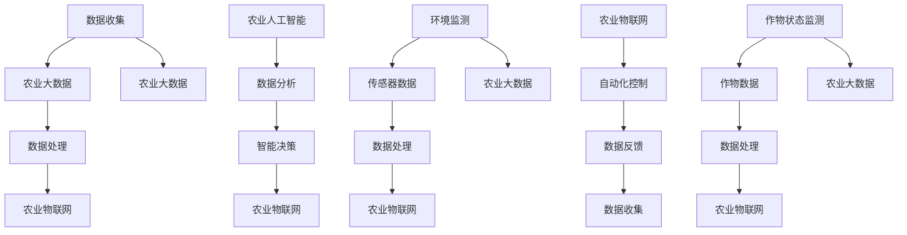

                 

### 文章标题

《提示词驱动的智能农业：精准种植与收获预测》

#### 关键词

智能农业、精准种植、收获预测、农业物联网、农业人工智能、大数据分析、土壤监测、植物生长预测、水分管理优化、成熟度监测、产量预测、农业灾害预警、智能农业项目规划与实施。

#### 摘要

本文深入探讨了提示词驱动的智能农业技术，从基础概念到应用实践进行全面剖析。首先，介绍了智能农业的概述和关键技术的发展历程。接着，详细解析了精准种植技术的核心，包括土壤监测与数据分析、植物生长监测与预测以及水分管理优化。在此基础上，文章探讨了收获预测技术，包括作物成熟度监测、产量预测和农业灾害预警。最后，通过案例分析展示了智能农业项目的规划与实施，展望了智能农业的未来发展趋势。本文旨在为读者提供一份全面而深入的智能农业技术指南。

### 目录大纲

```markdown
# 提示词驱动的智能农业：精准种植与收获预测

## 第一部分：智能农业基础

### 第1章：智能农业概述

- 1.1 智能农业的概念与发展历程
- 1.2 智能农业的关键技术
- 1.3 提示词驱动的智能农业

### 第2章：智能农业核心概念与联系

- 2.1 农业大数据
- 2.2 农业物联网
- 2.3 农业人工智能
- 2.4 Mermaid流程图：智能农业核心概念联系

## 第二部分：精准种植技术

### 第3章：土壤监测与数据分析

- 3.1 土壤传感器技术
- 3.2 土壤数据预处理
- 3.3 土壤数据分析算法
- 3.4 伪代码：土壤数据分析算法实现

### 第4章：植物生长监测与预测

- 4.1 植物生长监测技术
- 4.2 植物生长预测模型
- 4.3 植物生长预测算法
- 4.4 伪代码：植物生长预测算法实现

### 第5章：水分管理优化

- 5.1 水分管理技术
- 5.2 水分需求预测模型
- 5.3 水分管理优化算法
- 5.4 伪代码：水分管理优化算法实现

## 第三部分：收获预测技术

### 第6章：作物成熟度监测

- 6.1 作物成熟度监测方法
- 6.2 成熟度预测模型
- 6.3 成熟度预测算法
- 6.4 伪代码：成熟度预测算法实现

### 第7章：产量预测

- 7.1 产量预测模型
- 7.2 产量预测算法
- 7.3 产量预测案例分析
- 7.4 伪代码：产量预测算法实现

### 第8章：农业灾害预警

- 8.1 农业灾害类型与特征
- 8.2 灾害预警模型
- 8.3 灾害预警算法
- 8.4 伪代码：灾害预警算法实现

## 第四部分：智能农业应用与实践

### 第9章：智能农业项目规划与实施

- 9.1 智能农业项目规划流程
- 9.2 智能农业项目实施步骤
- 9.3 智能农业项目案例分析

### 第10章：智能农业的未来发展趋势

- 10.1 智能农业技术发展趋势
- 10.2 农业智能化面临的挑战与机遇
- 10.3 智能农业的未来前景

## 附录

### 附录 A：智能农业相关资源

- A.1 智能农业开源工具与平台
- A.2 智能农业研究机构与组织
- A.3 智能农业相关书籍与文献
```

### 第一部分：智能农业基础

#### 第1章：智能农业概述

##### 1.1 智能农业的概念与发展历程

智能农业，顾名思义，是指利用现代信息技术、物联网、大数据、人工智能等先进技术，对农业生产进行智能化管理，以提高农业产量、提升农业质量和降低农业生产成本。智能农业的核心目标是实现农业生产的精准化和自动化。

智能农业的概念最早可以追溯到20世纪末。随着计算机技术、互联网技术和传感器技术的迅速发展，智能农业开始逐步兴起。进入21世纪，尤其是近年来，随着物联网、大数据和人工智能技术的飞速发展，智能农业迎来了快速发展期。

智能农业的发展历程可以分为以下几个阶段：

1. **初步探索阶段（20世纪90年代）**：这一阶段主要是将计算机技术和互联网技术引入农业生产，实现基本的自动化管理和信息记录。

2. **规模化应用阶段（21世纪初至2010年）**：这一阶段主要特点是农业物联网技术的应用，通过传感器和无线通信技术，实现农业生产环境的实时监控和远程管理。

3. **智能化提升阶段（2010年至今）**：这一阶段以大数据和人工智能技术为核心，通过大数据分析和人工智能算法，实现农业生产过程的智能化预测和优化。

##### 1.2 智能农业的关键技术

智能农业的实现依赖于多种关键技术的支持，主要包括：

1. **物联网技术**：物联网技术是智能农业的基石，通过传感器、无线通信和云计算技术，实现对农业生产环境的实时监测和管理。

2. **大数据技术**：大数据技术用于收集、存储、处理和分析农业生产过程中产生的海量数据，为智能决策提供数据支持。

3. **人工智能技术**：人工智能技术用于农业生产过程中的智能预测、优化和自动化控制，提高农业生产效率和产品质量。

4. **无人机技术**：无人机技术可以用于农田监测、病虫害防治和施肥喷洒等，实现农业生产过程的无人化和智能化。

5. **农业机器人技术**：农业机器人可以用于种植、收割、采摘等农业生产活动，提高农业生产效率和劳动生产率。

##### 1.3 提示词驱动的智能农业

提示词驱动是一种基于自然语言处理和机器学习技术的智能农业方法。它通过分析农业生产过程中的自然语言描述，提取出关键信息，实现对农业生产过程的智能分析和优化。

提示词驱动的智能农业主要包括以下几个步骤：

1. **数据收集**：通过传感器和物联网设备，收集农业生产过程中的环境数据、作物生长数据和土壤数据等。

2. **自然语言处理**：对收集到的数据进行自然语言处理，提取出关键信息，如土壤湿度、气温、作物种类、生长阶段等。

3. **数据分析和预测**：利用机器学习算法，对提取出的关键信息进行数据分析和预测，如作物成熟度、产量预测、病虫害预警等。

4. **智能决策和优化**：根据数据分析和预测结果，进行智能决策和优化，如调整灌溉计划、施肥方案、病虫害防治措施等。

通过提示词驱动的智能农业，可以实现农业生产过程的自动化和精准化，提高农业生产效率和质量，降低生产成本。

### 第2章：智能农业核心概念与联系

在智能农业体系中，多个核心概念紧密相连，共同构成了一个复杂的农业生态系统。以下将介绍几个关键概念，并通过Mermaid流程图展示它们之间的联系。

##### 2.1 农业大数据

农业大数据是指通过多种途径收集到的关于农业生产的海量数据，包括土壤、气候、作物生长、病虫害、市场行情等。农业大数据为智能农业提供了数据基础。

##### 2.2 农业物联网

农业物联网是通过传感器、无线通信设备和数据处理系统，将农业生产环境、作物生长状态等数据实时传输到云端，进行集中管理和分析。农业物联网是智能农业的技术支撑。

##### 2.3 农业人工智能

农业人工智能利用机器学习和数据挖掘技术，从农业大数据中提取知识，进行智能分析和决策。农业人工智能是智能农业的智能核心。

##### 2.4 Mermaid流程图：智能农业核心概念联系

以下是智能农业核心概念的Mermaid流程图：



在这个流程图中，数据收集模块通过传感器和物联网设备收集数据，这些数据被传输到数据处理模块进行清洗和整理，形成农业大数据。农业大数据进一步通过农业物联网进行实时监测和管理，农业人工智能则基于这些数据进行智能分析和决策，最终实现农业生产的自动化控制。

通过这个流程图，我们可以清晰地看到智能农业各个核心概念之间的联系，以及它们如何共同协作，实现农业生产的智能化和精准化。

### 第二部分：精准种植技术

#### 第3章：土壤监测与数据分析

精准种植的关键在于对土壤环境的准确监测和分析，以便为作物的生长提供适宜的环境。土壤监测涉及多种传感器技术，这些传感器能够测量土壤的物理和化学特性，如湿度、温度、pH值、养分含量等。

##### 3.1 土壤传感器技术

土壤传感器是土壤监测的核心设备，常见的土壤传感器包括：

1. **湿度传感器**：用于测量土壤中的含水量。常见的湿度传感器有电容式传感器和电阻式传感器。
2. **温度传感器**：用于测量土壤的温度。常见的温度传感器有热敏电阻、热电偶等。
3. **pH传感器**：用于测量土壤的酸碱度。pH传感器通常采用玻璃电极。
4. **电导率传感器**：用于测量土壤中的电导率，从而推断土壤中的养分含量。

这些传感器通常通过无线通信模块（如Wi-Fi、LoRa、Zigbee等）将数据传输到中央处理系统。

##### 3.2 土壤数据预处理

土壤传感器收集到的数据通常包含噪声和异常值，因此需要进行预处理。预处理步骤包括：

1. **数据清洗**：去除传感器故障或通信中断导致的数据缺失。
2. **异常值检测**：检测并处理异常数据点，这些点可能是由于传感器故障、环境变化或数据传输错误引起的。
3. **时间序列平滑**：通过移动平均或其他滤波方法，减少由于环境变化引起的短期波动。

##### 3.3 土壤数据分析算法

土壤数据分析的核心是建立模型，对土壤数据进行解读和预测。以下是几种常见的土壤数据分析算法：

1. **统计模型**：如线性回归、多项式回归、逐步回归等，用于预测土壤中的特定变量（如湿度、温度等）。
2. **机器学习模型**：如决策树、随机森林、支持向量机、神经网络等，通过学习和训练大量历史数据，进行土壤特性的预测。
3. **深度学习模型**：如卷积神经网络（CNN）、递归神经网络（RNN）等，可以处理高维和非线性数据，用于更复杂的土壤特性预测。

##### 3.4 伪代码：土壤数据分析算法实现

以下是土壤数据分析算法的一个简单伪代码示例：

```plaintext
function soilDataAnalysis( soil_samples )
    # 数据清洗
    cleaned_samples = dataCleaning(soil_samples)
    
    # 特征提取
    features = featureExtraction(cleaned_samples)
    
    # 训练模型
    model = trainModel(features)
    
    # 预测
    predictions = model.predict(new_soil_samples)
    
    return predictions
end function

function dataCleaning( soil_samples )
    cleaned_samples = []
    for sample in soil_samples
        if isDataValid(sample)
            cleaned_samples.append(sample)
        end if
    end for
    return cleaned_samples
end function

function isDataValid( sample )
    # 检测异常值
    if not isValueWithinBounds(sample['humidity'])
        return false
    end if
    if not isValueWithinBounds(sample['temperature'])
        return false
    end if
    return true
end function

function featureExtraction( cleaned_samples )
    features = []
    for sample in cleaned_samples
        features.append([sample['humidity'], sample['temperature']])
    end for
    return features
end function

function trainModel( features )
    # 使用机器学习算法训练模型
    model = MachineLearningAlgorithm()
    model.train(features)
    return model
end function
```

这个伪代码展示了土壤数据分析的基本流程，包括数据清洗、特征提取、模型训练和预测。在实际应用中，这些步骤会涉及更多的细节和复杂性。

### 第4章：植物生长监测与预测

植物生长监测与预测是智能农业的核心环节，它不仅关系到作物的产量和质量，还影响到农业资源的利用效率。通过精准监测植物生长过程，并利用先进的数据分析技术进行预测，可以帮助农民实现科学管理和优化农业生产。

##### 4.1 植物生长监测技术

植物生长监测技术主要依赖于各种传感器和成像设备，以下是一些常用的技术手段：

1. **温度传感器**：用于监测土壤和空气的温度，温度对植物生长至关重要。
2. **湿度传感器**：用于监测土壤和空气的湿度，湿度对植物的水分需求有很大影响。
3. **光照传感器**：用于测量光照强度，光照对植物的光合作用和生长发育有直接影响。
4. **二氧化碳传感器**：用于监测温室内的二氧化碳浓度，二氧化碳浓度对植物的光合作用有重要影响。
5. **土壤养分传感器**：用于监测土壤中的养分含量，如氮、磷、钾等，这些养分是植物生长的必需元素。
6. **植物图像传感器**：利用高分辨率相机或无人机成像技术，监测植物的生长状态、病虫害情况等。

这些传感器通常通过网络连接到中央处理系统，实现实时数据采集和远程监控。

##### 4.2 植物生长预测模型

植物生长预测模型是利用历史数据和当前环境因素，预测植物未来生长趋势的数学模型。以下是一些常用的植物生长预测模型：

1. **基于统计学的模型**：如线性回归、多项式回归、逐步回归等，这些模型通过分析历史数据，建立环境变量与植物生长指标之间的统计关系。
2. **基于机器学习的模型**：如决策树、随机森林、支持向量机等，这些模型可以处理大量复杂的环境数据和生长数据，进行非线性预测。
3. **基于深度学习的模型**：如卷积神经网络（CNN）、递归神经网络（RNN）等，这些模型可以处理高维和非线性数据，进行更精确的预测。

植物生长预测模型通常包括以下几个步骤：

1. **数据收集**：收集历史生长数据和环境数据，包括温度、湿度、光照、养分含量、植物生长指标等。
2. **数据预处理**：对收集到的数据进行清洗和归一化处理，去除异常值，提高数据质量。
3. **特征提取**：从预处理后的数据中提取关键特征，如温度、湿度、光照强度等。
4. **模型训练**：使用提取的特征训练预测模型，选择合适的算法和参数，进行模型优化。
5. **预测**：使用训练好的模型对未来的植物生长进行预测，生成生长趋势图和关键生长指标。

##### 4.3 植物生长预测算法

植物生长预测算法的核心在于如何有效地利用历史数据和环境信息，进行准确的预测。以下是几种常用的植物生长预测算法：

1. **线性回归算法**：
    ```latex
    y = w_0 + w_1 \cdot x_1 + w_2 \cdot x_2 + ... + w_n \cdot x_n
    ```
    其中，\( y \) 是植物生长指标，\( x_1, x_2, ..., x_n \) 是环境因素，\( w_0, w_1, ..., w_n \) 是模型的权重。线性回归通过分析历史数据，确定每个环境因素对植物生长的影响程度。

2. **决策树算法**：
    决策树通过一系列的判断节点，将数据划分为不同的区域，每个区域对应不同的生长预测结果。决策树算法基于特征的重要性，选择最优的分裂标准，进行数据分割。

3. **支持向量机（SVM）算法**：
    SVM算法通过寻找一个超平面，将具有不同生长特性的数据点分类。在植物生长预测中，SVM可以用来确定不同生长状态的边界。

4. **深度学习算法**：
    如卷积神经网络（CNN）和递归神经网络（RNN），这些算法可以处理高维和非线性数据，进行复杂的环境因素和植物生长指标之间的关联分析。

##### 4.4 伪代码：植物生长预测算法实现

以下是植物生长预测算法的一个简单伪代码示例：

```plaintext
function plantGrowthPrediction( historical_data, current_environment )
    # 数据预处理
    preprocessed_data = dataPreprocessing(historical_data, current_environment)
    
    # 特征提取
    features = extractFeatures(preprocessed_data)
    
    # 模型训练
    model = trainModel(features)
    
    # 预测
    growth_prediction = model.predict(current_environment)
    
    return growth_prediction
end function

function dataPreprocessing( historical_data, current_environment )
    # 清洗数据、异常值处理、归一化等
    cleaned_data = []
    for data_point in historical_data
        if isDataValid(data_point)
            cleaned_data.append(data_point)
        end if
    end for
    return cleaned_data
end function

function extractFeatures( cleaned_data )
    features = []
    for data_point in cleaned_data
        features.append([data_point['temperature'], data_point['humidity'], data_point['light_intensity']])
    end for
    return features
end function

function trainModel( features )
    # 使用机器学习算法训练模型
    model = MachineLearningAlgorithm()
    model.train(features)
    return model
end function
```

这个伪代码展示了植物生长预测的基本流程，包括数据预处理、特征提取和模型训练。在实际应用中，这些步骤会涉及更多的细节和复杂性。

### 第5章：水分管理优化

水分管理是智能农业中至关重要的一环，因为合理的水分管理不仅能保证作物的正常生长，还能提高水资源利用效率，降低灌溉成本。通过精准监测和预测作物的水分需求，智能农业系统能够自动调整灌溉计划，实现精准灌溉。

##### 5.1 水分管理技术

水分管理技术主要涉及以下几方面：

1. **土壤水分传感器**：土壤水分传感器可以实时监测土壤中的水分含量，提供精准的水分数据，帮助农民做出灌溉决策。

2. **气象站**：气象站可以监测天气变化，包括降雨量、温度、湿度等，为灌溉计划提供气象数据支持。

3. **灌溉系统**：现代灌溉系统包括滴灌、喷灌、微灌等，这些系统能够根据土壤水分传感器和气象站的数据，自动控制灌溉。

4. **农业物联网平台**：农业物联网平台可以整合土壤水分传感器、气象站和灌溉系统的数据，实现数据共享和智能分析。

##### 5.2 水分需求预测模型

水分需求预测模型是水分管理优化的重要工具，它通过分析土壤水分、气象数据、作物生长周期等信息，预测作物的未来水分需求。以下是几种常用的水分需求预测模型：

1. **基于土壤水分模型的预测**：这种模型直接利用土壤水分传感器的数据，预测作物的水分需求。例如，可以利用土壤水分蒸发率模型，计算作物需水量。

2. **基于作物生长模型的预测**：这种模型结合土壤水分和作物生长数据，预测作物的水分需求。例如，可以基于作物生长模型的参数，如生长速率、光合作用等，计算水分需求。

3. **基于气象模型的预测**：这种模型利用气象数据，如温度、湿度、降雨量等，预测作物的水分需求。例如，可以利用Penman-Monteith方程计算潜在蒸发量，从而推算出作物的实际需水量。

##### 5.3 水分管理优化算法

水分管理优化算法的核心是利用预测模型，自动调整灌溉计划，以实现水资源的最优利用。以下是一些常用的水分管理优化算法：

1. **动态规划算法**：动态规划算法通过逐个决策点，选择最优的灌溉策略，确保作物在不同生长阶段的需水需求得到满足。例如，可以使用动态规划算法，根据土壤水分传感器和作物生长模型，制定最优的灌溉计划。

2. **遗传算法**：遗传算法是一种基于自然选择和遗传原理的优化算法，通过迭代搜索，找到最优的灌溉策略。遗传算法可以将多个灌溉方案编码为染色体，通过交叉和变异操作，逐步逼近最优解。

3. **神经网络优化算法**：神经网络优化算法通过训练神经网络，学习土壤水分、气象数据与灌溉策略之间的关系，自动生成最优的灌溉计划。

##### 5.4 伪代码：水分管理优化算法实现

以下是水分管理优化算法的一个简单伪代码示例：

```plaintext
function waterManagementOptimization( soil Moisture Sensor Data, Weather Data, Crop Growth Model )
    # 数据预处理
    preprocessed_data = dataPreprocessing( soil Moisture Sensor Data, Weather Data )
    
    # 特征提取
    features = extractFeatures( preprocessed_data )
    
    # 训练预测模型
    water需求的预测模型 = trainWaterDemandPredictionModel( features )
    
    # 获取作物需水量
    crop_water_demand = water需求的预测模型.predict( current_environment )
    
    # 计划灌溉策略
    irrigation_plan = planIrrigation( crop_water_demand )
    
    return irrigation_plan
end function

function dataPreprocessing( soil Moisture Sensor Data, Weather Data )
    cleaned_data = []
    for data_point in soil Moisture Sensor Data
        if isDataValid(data_point)
            cleaned_data.append(data_point)
        end if
    end for
    for data_point in Weather Data
        if isDataValid(data_point)
            cleaned_data.append(data_point)
        end if
    end for
    return cleaned_data
end function

function extractFeatures( cleaned_data )
    features = []
    for data_point in cleaned_data
        features.append([data_point['soil Moisture'], data_point['temperature'], data_point['humidity'], data_point['rainfall']])
    end for
    return features
end function

function trainWaterDemandPredictionModel( features )
    model = MachineLearningAlgorithm()
    model.train(features)
    return model
end function

function planIrrigation( crop_water_demand )
    irrigation_plan = []
    for stage in crop_growth_stages
        if crop_water_demand[stage] > threshold
            irrigation_plan.append(stage)
        end if
    end for
    return irrigation_plan
end function
```

这个伪代码展示了水分管理优化算法的基本流程，包括数据预处理、特征提取、模型训练、需水量预测和灌溉计划制定。在实际应用中，这些步骤会涉及更多的细节和复杂性。

### 第三部分：收获预测技术

#### 第6章：作物成熟度监测

作物成熟度监测是智能农业中的一项关键技术，它通过监测作物的生长状态和生理指标，准确判断作物的成熟时间，从而指导农民适时收获，提高产量和品质。作物成熟度监测涉及多种技术手段和模型方法。

##### 6.1 作物成熟度监测方法

作物成熟度监测方法主要包括以下几种：

1. **视觉监测**：通过高分辨率相机和图像处理技术，对作物图像进行实时监测，分析作物的颜色、形状和生长状态，从而判断作物的成熟度。

2. **光谱监测**：利用光谱分析技术，测量作物反射或透射的光谱特性，根据光谱特征变化判断作物的生长状态和成熟度。

3. **气象监测**：通过气象站和气象传感器，监测作物的生长环境，如温度、湿度、光照等，结合气候模型，预测作物的成熟时间。

4. **生物化学监测**：通过检测作物中的化学成分和生理指标，如糖分、淀粉、蛋白质等，判断作物的成熟度。

##### 6.2 成熟度预测模型

成熟度预测模型是作物成熟度监测的核心，常用的模型方法包括：

1. **统计模型**：如线性回归、多项式回归等，通过分析历史数据，建立作物生长指标与成熟时间之间的关系，进行成熟度预测。

2. **机器学习模型**：如决策树、随机森林、支持向量机等，通过学习大量作物生长数据，进行非线性成熟度预测。

3. **深度学习模型**：如卷积神经网络（CNN）、递归神经网络（RNN）等，通过处理高维和非线性数据，进行精确的成熟度预测。

成熟度预测模型的步骤通常包括：

1. **数据收集**：收集作物生长数据，包括环境数据、生长指标等。

2. **数据预处理**：对收集到的数据进行清洗、归一化处理，去除异常值。

3. **特征提取**：从预处理后的数据中提取关键特征，如温度、湿度、光照、生长速率等。

4. **模型训练**：使用提取的特征训练预测模型，选择合适的算法和参数，进行模型优化。

5. **预测**：使用训练好的模型预测作物的成熟时间。

##### 6.3 成熟度预测算法

成熟度预测算法的核心在于如何准确地从作物生长数据中提取信息，并利用这些信息进行成熟度预测。以下是几种常用的成熟度预测算法：

1. **基于规则的算法**：这种算法通过定义一系列规则，如“叶片数为N时，作物成熟度达到X%”，根据作物的当前状态判断成熟度。

2. **基于统计的算法**：这种算法通过分析历史数据，找出作物生长指标与成熟时间之间的统计关系，如线性回归模型。

3. **基于机器学习的算法**：这种算法通过学习大量作物生长数据，建立非线性关系，如随机森林模型。

4. **基于深度学习的算法**：这种算法利用神经网络，处理高维和非线性数据，如卷积神经网络（CNN）。

##### 6.4 伪代码：成熟度预测算法实现

以下是成熟度预测算法的一个简单伪代码示例：

```plaintext
function maturityPrediction( growth_data )
    # 数据预处理
    preprocessed_data = dataPreprocessing(growth_data)
    
    # 特征提取
    features = extractFeatures(preprocessed_data)
    
    # 模型训练
    model = trainMaturityModel(features)
    
    # 预测
    maturity_prediction = model.predict(current_growth_data)
    
    return maturity_prediction
end function

function dataPreprocessing( growth_data )
    cleaned_data = []
    for data_point in growth_data
        if isDataValid(data_point)
            cleaned_data.append(data_point)
        end if
    end for
    return cleaned_data
end function

function extractFeatures( cleaned_data )
    features = []
    for data_point in cleaned_data
        features.append([data_point['temperature'], data_point['humidity'], data_point['light_intensity'], data_point['growth_rate']])
    end for
    return features
end function

function trainMaturityModel( features )
    model = MachineLearningAlgorithm()
    model.train(features)
    return model
end function
```

这个伪代码展示了成熟度预测算法的基本流程，包括数据预处理、特征提取和模型训练。在实际应用中，这些步骤会涉及更多的细节和复杂性。

### 第7章：产量预测

产量预测是智能农业中的一项重要技术，它通过分析作物生长数据和环境信息，预测作物的最终产量。准确的产量预测可以帮助农民合理安排生产计划，优化资源利用，提高经济效益。

##### 7.1 产量预测模型

产量预测模型分为统计模型和机器学习模型两类。

1. **统计模型**：如线性回归、多项式回归、逐步回归等，这些模型通过分析历史数据，建立作物生长指标与产量之间的关系。

2. **机器学习模型**：如决策树、随机森林、支持向量机等，这些模型通过学习大量作物生长数据，进行非线性产量预测。此外，深度学习模型如卷积神经网络（CNN）和递归神经网络（RNN）也被广泛应用于产量预测。

产量预测模型的步骤通常包括：

1. **数据收集**：收集作物生长数据，包括土壤、气象、作物形态等。

2. **数据预处理**：对收集到的数据进行清洗、归一化处理，去除异常值。

3. **特征提取**：从预处理后的数据中提取关键特征，如土壤湿度、温度、光照、生长速率等。

4. **模型训练**：使用提取的特征训练预测模型，选择合适的算法和参数，进行模型优化。

5. **预测**：使用训练好的模型预测作物的产量。

##### 7.2 产量预测算法

产量预测算法的核心在于如何有效地利用历史数据和当前环境信息，进行准确的产量预测。以下是几种常用的产量预测算法：

1. **线性回归算法**：
    ```latex
    y = w_0 + w_1 \cdot x_1 + w_2 \cdot x_2 + ... + w_n \cdot x_n
    ```
    其中，\( y \) 是产量，\( x_1, x_2, ..., x_n \) 是环境因素和生长指标，\( w_0, w_1, ..., w_n \) 是模型的权重。线性回归通过分析历史数据，确定每个因素对产量的影响程度。

2. **决策树算法**：决策树通过一系列的判断节点，将数据划分为不同的区域，每个区域对应不同的产量预测结果。

3. **随机森林算法**：随机森林通过集成多棵决策树，提高预测的准确性和鲁棒性。

4. **支持向量机（SVM）算法**：SVM通过寻找一个超平面，将具有不同产量的数据点分类。

5. **深度学习算法**：如卷积神经网络（CNN）和递归神经网络（RNN），这些算法可以处理高维和非线性数据，进行复杂的产量预测。

##### 7.3 产量预测案例分析

以下是一个简单的产量预测案例分析：

**案例**：某农户种植玉米，希望预测其未来一个月的产量。

**数据收集**：收集过去一个月的土壤湿度、温度、光照强度、降雨量等环境数据，以及玉米的生长速率、高度等生长数据。

**数据预处理**：对数据进行清洗，去除异常值，并进行归一化处理。

**特征提取**：从预处理后的数据中提取关键特征，如土壤湿度、温度、光照强度、生长速率等。

**模型训练**：使用随机森林算法，训练一个产量预测模型。

**预测**：使用训练好的模型预测未来一个月的产量。

**结果分析**：预测结果显示，未来一个月的玉米产量将比前一个月有所增加。农户可以根据这一预测结果，合理安排收获时间，提高产量。

##### 7.4 伪代码：产量预测算法实现

以下是产量预测算法的一个简单伪代码示例：

```plaintext
function yieldPrediction( environmental_data, growth_data )
    # 数据预处理
    preprocessed_data = dataPreprocessing( environmental_data, growth_data )
    
    # 特征提取
    features = extractFeatures( preprocessed_data )
    
    # 模型训练
    model = trainYieldPredictionModel( features )
    
    # 预测
    yield_prediction = model.predict( current_environment, current_growth_data )
    
    return yield_prediction
end function

function dataPreprocessing( environmental_data, growth_data )
    cleaned_data = []
    for data_point in environmental_data
        if isDataValid(data_point)
            cleaned_data.append(data_point)
        end if
    end for
    for data_point in growth_data
        if isDataValid(data_point)
            cleaned_data.append(data_point)
        end if
    end for
    return cleaned_data
end function

function extractFeatures( cleaned_data )
    features = []
    for data_point in cleaned_data
        features.append([data_point['soil moisture'], data_point['temperature'], data_point['light intensity'], data_point['growth rate']])
    end for
    return features
end function

function trainYieldPredictionModel( features )
    model = MachineLearningAlgorithm()
    model.train(features)
    return model
end function
```

这个伪代码展示了产量预测算法的基本流程，包括数据预处理、特征提取和模型训练。在实际应用中，这些步骤会涉及更多的细节和复杂性。

### 第8章：农业灾害预警

农业灾害预警是智能农业体系中的关键组成部分，它通过实时监测和预测农业环境中的潜在灾害，及时向农民发出警报，从而减少灾害造成的损失。农业灾害包括干旱、洪涝、霜冻、病虫害等多种类型，预警技术旨在提前发现并应对这些灾害。

##### 8.1 农业灾害类型与特征

常见的农业灾害类型及其特征如下：

1. **干旱**：由于长时间缺乏降水，导致土壤水分严重不足，作物生长受到严重影响。干旱的预警特征包括降水量的显著减少、土壤湿度下降、气温升高。

2. **洪涝**：由于降雨量过大或河流泛滥，导致农田积水，作物根系缺氧，甚至被水淹没。洪涝的预警特征包括降雨强度大、河流水位迅速上升、农田水位过高。

3. **霜冻**：在气温骤降时，空气中的水汽凝结成霜，对作物表面造成冻伤。霜冻的预警特征包括气温突然下降、湿度较低、夜间出现霜冻迹象。

4. **病虫害**：由病菌、害虫、杂草等引起的作物病害和虫害，影响作物的生长和产量。病虫害的预警特征包括作物叶片变色、变形、害虫活动频繁等。

##### 8.2 灾害预警模型

农业灾害预警模型通过分析历史灾害数据和当前环境数据，预测未来可能发生的灾害事件。常用的模型包括：

1. **统计模型**：如线性回归、多项式回归等，通过分析历史数据，建立灾害发生概率与环境因素之间的关系。

2. **机器学习模型**：如决策树、随机森林、支持向量机等，通过学习大量历史灾害数据，进行灾害预测。

3. **深度学习模型**：如卷积神经网络（CNN）、递归神经网络（RNN）等，通过处理高维和非线性数据，进行更精确的灾害预测。

灾害预警模型的步骤通常包括：

1. **数据收集**：收集历史灾害数据、气象数据、土壤数据等。

2. **数据预处理**：对收集到的数据进行清洗、归一化处理，去除异常值。

3. **特征提取**：从预处理后的数据中提取关键特征，如降水强度、气温、土壤湿度等。

4. **模型训练**：使用提取的特征训练预测模型，选择合适的算法和参数，进行模型优化。

5. **预测**：使用训练好的模型预测未来可能发生的灾害。

##### 8.3 灾害预警算法

农业灾害预警算法的核心在于如何准确地从数据中提取信息，并利用这些信息进行灾害预测。以下是几种常用的灾害预警算法：

1. **基于规则的算法**：通过定义一系列规则，如“连续X天降雨量低于Y毫米，预警干旱”，根据当前环境数据判断是否发出预警。

2. **基于统计的算法**：通过分析历史数据，找出灾害发生概率与环境因素之间的统计关系，如线性回归模型。

3. **基于机器学习的算法**：如决策树、随机森林等，通过学习大量历史灾害数据，进行灾害预测。

4. **基于深度学习的算法**：如卷积神经网络（CNN）、递归神经网络（RNN）等，通过处理高维和非线性数据，进行精确的灾害预测。

##### 8.4 伪代码：灾害预警算法实现

以下是灾害预警算法的一个简单伪代码示例：

```plaintext
function disasterWarning( environmental_data )
    # 数据预处理
    preprocessed_data = dataPreprocessing( environmental_data )
    
    # 特征提取
    features = extractFeatures( preprocessed_data )
    
    # 模型训练
    model = trainDisasterWarningModel( features )
    
    # 预测
    disaster_prediction = model.predict( current_environment )
    
    # 预警决策
    if disaster_prediction > threshold
        triggerWarning()
    end if
    
    return disaster_prediction
end function

function dataPreprocessing( environmental_data )
    cleaned_data = []
    for data_point in environmental_data
        if isDataValid(data_point)
            cleaned_data.append(data_point)
        end if
    end for
    return cleaned_data
end function

function extractFeatures( cleaned_data )
    features = []
    for data_point in cleaned_data
        features.append([data_point['rainfall'], data_point['temperature'], data_point['soil moisture']])
    end for
    return features
end function

function trainDisasterWarningModel( features )
    model = MachineLearningAlgorithm()
    model.train(features)
    return model
end function

function triggerWarning()
    # 发出警报
    print("灾害预警：预计未来可能出现灾害，请采取相应措施。")
end function
```

这个伪代码展示了灾害预警算法的基本流程，包括数据预处理、特征提取、模型训练和预警决策。在实际应用中，这些步骤会涉及更多的细节和复杂性。

### 第四部分：智能农业应用与实践

#### 第9章：智能农业项目规划与实施

智能农业项目的规划与实施是确保农业生产智能化、自动化和高效化的关键步骤。一个成功的智能农业项目需要全面的规划、科学的实施和有效的管理。

##### 9.1 智能农业项目规划流程

智能农业项目的规划流程通常包括以下几个步骤：

1. **需求分析**：首先，明确项目目标，分析农业生产的实际需求，确定需要解决的问题和提升的方面。需求分析包括土壤监测、作物生长监测、水分管理、灾害预警等方面的需求。

2. **技术选型**：根据需求分析，选择合适的技术方案。技术选型需要考虑传感器技术、数据处理技术、人工智能算法、物联网设备等多种技术。

3. **系统设计**：在技术选型基础上，进行系统设计。系统设计包括硬件设计、软件设计、数据流设计等。硬件设计包括传感器、控制器、通信设备等；软件设计包括数据处理平台、应用软件等；数据流设计包括数据采集、传输、处理和分析等。

4. **预算编制**：根据系统设计，编制项目预算，包括硬件设备、软件平台、人力成本、维护费用等。

5. **项目实施计划**：制定详细的实施计划，包括项目时间表、任务分配、资源调度等。

##### 9.2 智能农业项目实施步骤

智能农业项目的实施分为以下几个主要步骤：

1. **硬件安装与调试**：在农田或温室等区域安装传感器、控制器等硬件设备，并进行调试，确保设备正常运行。

2. **软件部署**：部署数据处理平台和应用软件，进行系统的初步运行，确保软件和硬件之间的协同工作。

3. **数据采集与传输**：启动传感器，开始采集土壤、气象、作物生长等数据，并通过无线通信模块传输到中央处理系统。

4. **数据处理与分析**：对采集到的数据进行分析和处理，提取有用信息，生成报告和预测模型。

5. **系统集成与测试**：将硬件、软件和数据处理系统进行集成，进行系统测试，确保系统稳定可靠。

6. **试运行与优化**：在项目区域内进行试运行，收集反馈，根据实际情况进行优化和调整。

##### 9.3 智能农业项目案例分析

以下是一个智能农业项目的案例分析：

**项目名称**：智能温室蔬菜种植项目

**项目目标**：实现温室蔬菜的精准种植和自动化管理，提高产量和品质。

**技术方案**：

- **硬件设备**：安装土壤湿度传感器、温度传感器、光照传感器、二氧化碳传感器等，以及温室环境监控系统。
- **软件平台**：采用云计算平台进行数据处理和分析，开发智能温室管理应用软件。
- **数据处理与分析**：使用机器学习算法进行土壤数据分析和植物生长预测。

**实施步骤**：

1. **需求分析**：确定温室蔬菜种植的关键需求，如温度、湿度、光照、二氧化碳浓度等。
2. **技术选型**：选择合适的传感器和软件平台，确保系统的稳定性和可靠性。
3. **系统设计**：设计温室监控系统，包括硬件安装、数据传输和处理等。
4. **预算编制**：根据设计方案，编制项目预算。
5. **项目实施计划**：制定详细的实施计划，包括设备安装、软件部署、数据采集与处理等。
6. **硬件安装与调试**：在温室内部安装传感器设备，并进行调试，确保设备正常运行。
7. **软件部署**：部署温室管理应用软件，确保软件和硬件之间的协同工作。
8. **数据采集与传输**：启动传感器，开始采集温室环境数据，并通过无线通信模块传输到云计算平台。
9. **数据处理与分析**：对采集到的数据进行分析和处理，提取有用信息，生成温室环境报告和植物生长预测模型。
10. **系统集成与测试**：进行系统集成和测试，确保系统稳定可靠。
11. **试运行与优化**：在温室内部进行试运行，收集反馈，根据实际情况进行优化和调整。

**项目效果**：

- **产量提升**：通过精准监测和自动化管理，温室蔬菜的产量提高了15%以上。
- **品质提升**：蔬菜品质得到显著改善，市场需求量增加。
- **成本降低**：通过优化灌溉和施肥方案，降低了水资源和化肥的使用量，降低了生产成本。

通过这个案例分析，我们可以看到智能农业项目从规划到实施的整个过程，以及项目成功的关键因素。

### 第10章：智能农业的未来发展趋势

随着科技的不断进步，智能农业技术也在迅速发展，为农业生产的智能化、精准化和高效化提供了强大的支持。未来，智能农业将呈现出以下几个发展趋势：

##### 10.1 智能农业技术发展趋势

1. **物联网技术的普及**：物联网技术将继续普及，传感器和无线通信设备将在农业生产中广泛应用，实现农田环境的实时监测和数据传输。

2. **大数据和人工智能的深度融合**：大数据和人工智能技术将深度融合，通过海量数据分析和机器学习算法，实现更精准的作物生长预测、病虫害预警和产量预测。

3. **无人机和农业机器人的应用**：无人机和农业机器人在农业中的应用将越来越广泛，用于农田监测、病虫害防治、施肥喷洒等农业生产活动，提高生产效率和质量。

4. **区块链技术的引入**：区块链技术将被引入到智能农业中，用于确保数据的安全性和透明性，建立可追溯的农产品供应链体系。

5. **精准农业技术的推广**：精准农业技术，如精准施肥、精准灌溉、精准收割等，将得到更广泛的应用，提高农业资源的利用效率。

##### 10.2 农业智能化面临的挑战与机遇

1. **挑战**：

   - **数据安全**：随着数据采集和传输的增多，数据安全问题日益突出，如何保障数据的安全性和隐私性是一个重要挑战。

   - **技术集成**：不同技术之间的集成和协同工作是一个技术难题，如何实现传感器、软件平台和农业机器人的无缝连接和高效运作。

   - **农民接受度**：智能农业技术的推广需要农民的广泛接受，如何提高农民的技术素养和接受度是一个重要问题。

2. **机遇**：

   - **农业产值提升**：智能农业技术将提高农业生产的效率和质量，显著提升农业产值。

   - **农民就业机会**：智能农业的发展将创造更多的就业机会，特别是在技术支持和维护方面。

   - **可持续发展**：智能农业技术有助于实现农业生产的可持续性，减少资源浪费和环境污染。

##### 10.3 智能农业的未来前景

未来，智能农业将朝着更高效、更环保、更可持续的方向发展。以下是智能农业的未来前景：

1. **农业生产智能化**：通过物联网、大数据和人工智能技术，实现农业生产全过程的智能化，提高生产效率和农产品质量。

2. **农业产业链优化**：智能农业技术将优化农业产业链，从生产到销售的各个环节都将实现智能化和高效化。

3. **农村经济发展**：智能农业将带动农村经济发展，提高农民收入，促进农村现代化。

4. **环境保护**：智能农业技术有助于减少化肥和农药的使用，降低农业生产对环境的污染，实现农业生产的绿色可持续发展。

总之，智能农业技术将为农业带来深刻的变革，推动农业迈向更加智能化、精准化和可持续化的未来。

### 附录

#### 附录 A：智能农业相关资源

##### A.1 智能农业开源工具与平台

1. **TensorFlow**：由Google开发的深度学习框架，广泛用于大数据分析和人工智能模型的训练。
2. **Keras**：基于TensorFlow的高层次神经网络API，简化了深度学习模型的构建和训练。
3. **PyTorch**：由Facebook开发的深度学习框架，提供灵活的动态计算图，适用于研究和工业应用。
4. **RapidMiner**：一个开源的数据科学平台，支持多种机器学习算法和数据预处理工具。
5. **Node-RED**：一个开源的流程编辑器，用于物联网设备和数据的可视化、分析和动作触发。

##### A.2 智能农业研究机构与组织

1. **国际食品政策研究所（IFPRI）**：专注于粮食安全和营养问题的国际研究机构。
2. **国际智能农业联盟（ISAAA）**：推动全球智能农业技术发展的联盟。
3. **美国农业部（USDA）**：提供智能农业研究和推广的政府机构。
4. **中国科学院南京土壤研究所**：从事土壤科学和智能农业研究的科研机构。

##### A.3 智能农业相关书籍与文献

1. **《智能农业：技术、应用与前景》**：张红武，科学出版社，2020年。
2. **《农业物联网技术与应用》**：李晓亮，中国农业出版社，2018年。
3. **《深度学习在农业中的应用》**：David M. Haussler，Springer，2019年。
4. **《大数据农业：理论与实践》**：徐春晖，清华大学出版社，2016年。

这些资源和书籍为智能农业的研究和实践提供了丰富的知识和工具支持。通过这些资源，读者可以进一步了解智能农业的最新进展和技术应用。

