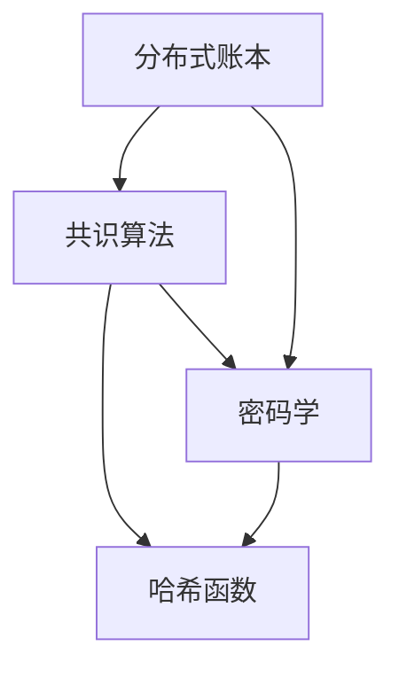
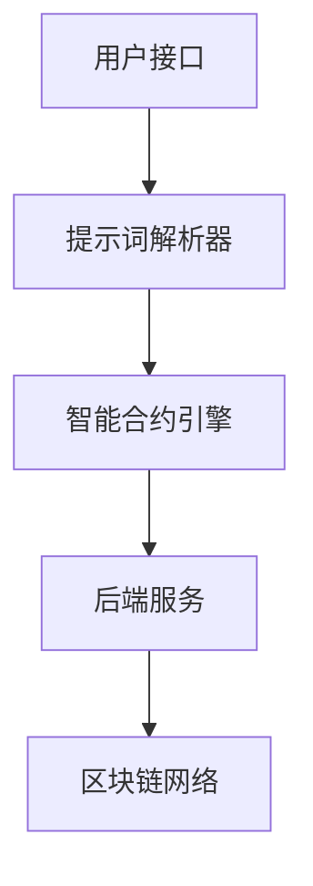

                 

### 引言

#### 标题：提示词驱动的智能合约生成：简化区块链开发

#### 关键词：智能合约、区块链、提示词、开发、简化

区块链技术作为一种去中心化、安全透明的分布式账本技术，已经在金融、物流、医疗等多个领域展现出了巨大的应用潜力。而在区块链应用中，智能合约作为一种自动化执行合约条款的程序，正逐渐成为现代区块链技术的核心组件。然而，传统的智能合约开发过程相对复杂，涉及诸多技术细节，这对开发者来说是一个不小的挑战。

本文旨在探讨一种新型的智能合约生成方法——提示词驱动的智能合约生成。该方法通过使用提示词来简化智能合约的开发流程，降低开发难度，提高开发效率。文章将从以下几个方面展开：

1. **区块链技术概述**：介绍区块链的基本概念、核心技术和发展趋势。
2. **智能合约基础**：详细解释智能合约的定义、工作原理及其优缺点。
3. **提示词驱动的智能合约**：阐述提示词的概念、作用以及提示词驱动的智能合约优势。
4. **区块链开发流程简述**：概述区块链项目的开发流程，并对比传统智能合约开发与提示词驱动的智能合约开发流程。
5. **书籍目标读者与结构安排**：明确目标读者群体，介绍书籍的结构安排。

通过本文的阅读，读者将对提示词驱动的智能合约生成方法有一个全面而深入的了解，从而能够更好地掌握智能合约的开发技术，简化区块链项目的实施过程。文章将以逻辑清晰、结构紧凑、简单易懂的专业语言，逐步引导读者进入智能合约开发的深度世界。让我们一步一步地分析推理，揭开这一技术的神秘面纱。

---

### 摘要

本文探讨了提示词驱动的智能合约生成方法，旨在简化区块链开发过程，提高开发效率和降低开发难度。首先，我们回顾了区块链技术的基本概念和核心技术，并介绍了智能合约的定义和作用。接着，文章重点阐述了提示词的概念和其在智能合约中的作用，强调了提示词驱动的智能合约在开发过程中的优势。

随后，文章对比了传统智能合约开发与提示词驱动的智能合约开发流程，并概述了区块链项目的开发步骤。在详细阐述核心概念和联系部分，我们使用了Mermaid流程图来展示智能合约开发的基本架构，并通过伪代码和数学模型详细解释了提示词生成和智能合约执行的核心算法原理。

最后，文章通过实际项目实战和案例分析，展示了提示词驱动的智能合约生成方法在金融、物流和文化创意等领域的应用，并提供了最佳实践和注意事项。通过本文的阅读，读者将对提示词驱动的智能合约生成方法有更深入的理解，从而能够有效地应用于区块链项目的开发实践中。

---

## 第一部分 引言

在本文的第一部分，我们将首先对区块链技术进行概述，详细介绍其基本概念、核心技术和发展趋势。接着，我们将探讨智能合约的定义、工作原理以及其优缺点。随后，文章将重点介绍提示词的概念，解释其在智能合约中的作用，并阐述提示词驱动的智能合约在开发过程中的优势。最后，我们将简述区块链项目的开发流程，并对比传统智能合约开发与提示词驱动的智能合约开发流程。

### 区块链技术概述

#### 1.1.1 区块链的基本概念

区块链技术是一种去中心化的分布式数据库技术，其核心特点在于数据的不可篡改性和透明性。区块链由一系列按时间顺序排列的区块组成，每个区块包含一定数量的交易记录，并通过密码学算法相互链接，形成一条不可篡改的区块链。

区块链技术最早由中本聪（Satoshi Nakamoto）在2008年提出，作为比特币（Bitcoin）的底层技术而广为人知。比特币是一种基于区块链的加密货币，它通过区块链技术实现了去中心化的货币发行和交易。

#### 1.1.2 区块链的核心技术

区块链的核心技术包括：

- **分布式账本**：区块链通过多个节点维护同一份账本，确保数据的一致性和安全性。每个节点都存储完整的区块链数据，因此无法单独篡改账本。
- **共识算法**：共识算法是区块链中节点达成共识，确保数据一致性的关键机制。常见的共识算法包括工作量证明（PoW）、权益证明（PoS）和委托权益证明（DPoS）等。
- **密码学**：区块链利用密码学技术确保数据的安全性和隐私性。加密算法和哈希函数在区块链技术中广泛应用，用于保护交易数据和个人隐私。

#### 1.1.3 区块链的发展趋势

随着区块链技术的不断演进，其在各个领域的应用也日益广泛。以下是区块链技术的一些发展趋势：

- **扩展性**：随着区块链应用规模的扩大，区块链的扩展性成为了一个关键问题。多种解决方案，如侧链、状态通道和分片技术等，正在不断探索和完善，以提高区块链的吞吐量和性能。
- **跨链技术**：跨链技术旨在实现不同区块链之间的数据交互和资产转移，以打破区块链之间的孤岛现象。通过跨链技术，不同区块链应用可以实现互操作性和价值传递。
- **智能合约**：智能合约作为一种自动化执行合约条款的程序，正逐渐成为区块链技术的核心组件。随着智能合约技术的发展，其在金融、供应链、版权保护等领域的应用前景广阔。

### 智能合约基础

#### 1.2.1 智能合约的定义

智能合约是一种基于区块链技术的自执行合同，其条款以代码的形式存储在区块链上。智能合约通过预定义的逻辑和条件，在满足特定条件时自动执行相应的操作，从而实现去中心化的自动化交易和合约执行。

智能合约最早由尼克·萨博（Nick Szabo）在1994年提出，但直到区块链技术的发展，智能合约才得以实现。以太坊（Ethereum）是一个著名的智能合约平台，它允许开发者创建和部署智能合约，从而推动智能合约在区块链应用中的普及。

#### 1.2.2 智能合约的工作原理

智能合约的工作原理主要包括以下几个步骤：

1. **编写智能合约代码**：智能合约代码通常采用特定的高级编程语言，如Solidity（以太坊智能合约语言）编写。
2. **部署智能合约**：将编译后的智能合约代码上传到区块链上，并进行部署。部署过程中，区块链会生成智能合约的地址，以便其他节点调用合约函数。
3. **合约函数调用**：当满足特定的触发条件时，外部实体（如用户或智能合约本身）可以调用智能合约的函数。调用过程中，合约函数将执行预定义的逻辑和操作。
4. **状态更新**：智能合约执行完成后，区块链会更新合约状态，记录交易结果和状态变化。

#### 1.2.3 智能合约的优缺点

智能合约具有以下优点：

- **去中心化**：智能合约运行在区块链上，无需第三方中介机构，实现去中心化的交易和合约执行。
- **透明性**：智能合约的代码和执行过程透明可查，用户可以随时查看和验证交易状态。
- **自动化执行**：智能合约在满足特定条件时自动执行，减少人工干预和操作失误。

然而，智能合约也存在一些缺点：

- **代码安全性**：智能合约的代码安全性至关重要。一旦代码存在漏洞，攻击者可以轻易地利用漏洞进行攻击，造成重大损失。
- **执行效率**：智能合约的执行速度相对较慢，特别是在处理大量交易时，可能会出现性能瓶颈。
- **合约变更困难**：一旦智能合约部署在区块链上，其代码无法轻易更改。如果合约存在缺陷或需要升级，可能需要重新部署新的合约。

### 提示词驱动的智能合约

#### 1.3.1 提示词的概念

提示词（Prompt Word）是一种用于触发智能合约执行的特殊关键词。提示词通常由用户或系统预先设定，用于触发特定的合约函数。提示词可以是简单的字符串，也可以是复杂的条件表达式。

#### 1.3.2 提示词在智能合约中的作用

提示词在智能合约中发挥着关键作用：

- **简化开发**：提示词驱动的方法通过简化智能合约的编写和部署过程，降低开发难度。开发者只需编写少量的提示词代码，即可实现复杂的合约逻辑。
- **提高效率**：提示词驱动的方法允许开发者快速迭代和测试智能合约，提高开发效率。同时，通过自动化执行提示词，智能合约可以实时响应用户请求，提高交易处理速度。
- **增强灵活性**：提示词驱动的方法使得智能合约更具灵活性。开发者可以根据业务需求，动态调整提示词和合约逻辑，实现个性化的合约功能。

#### 1.3.3 提示词驱动的智能合约优势

与传统的智能合约开发相比，提示词驱动的智能合约具有以下优势：

- **简化流程**：提示词驱动的方法通过减少代码量和简化开发流程，降低开发难度，使得开发者能够更快地实现智能合约功能。
- **提高可读性**：提示词驱动的方法使得智能合约代码更简洁、易读。开发者可以直观地理解合约逻辑，降低代码维护成本。
- **增强安全性**：提示词驱动的方法通过减少代码复杂度，降低潜在的安全漏洞。同时，提示词的引入使得合约执行更加透明和可控。
- **支持多样性**：提示词驱动的方法支持多种类型的智能合约开发，包括金融合约、供应链合约、版权保护合约等，满足不同业务需求。

### 区块链开发流程简述

#### 1.4.1 区块链项目的开发流程

区块链项目的开发流程通常包括以下几个阶段：

1. **需求分析**：明确项目目标和业务需求，确定区块链解决方案的架构和功能。
2. **技术选型**：选择合适的区块链平台和开发工具，确保技术方案的可行性和性能。
3. **系统设计**：设计区块链系统的整体架构，包括数据结构、共识算法和智能合约架构等。
4. **编码与测试**：编写智能合约代码，进行单元测试和集成测试，确保系统功能的正确性和稳定性。
5. **部署与上线**：将区块链系统部署到生产环境，进行上线和运维。

#### 1.4.2 智能合约的开发流程

智能合约的开发流程通常包括以下几个步骤：

1. **需求分析**：明确智能合约的业务需求，确定合约的功能和执行逻辑。
2. **设计合约架构**：设计智能合约的基本架构，包括函数接口、数据结构等。
3. **编写合约代码**：使用智能合约编程语言（如Solidity）编写合约代码，实现预定的功能和逻辑。
4. **代码审查与测试**：对合约代码进行审查和测试，确保代码的正确性和安全性。
5. **部署合约**：将编译后的合约代码部署到区块链上，进行合约的部署和初始化。

#### 1.4.3 提示词驱动的智能合约开发流程

提示词驱动的智能合约开发流程与传统的开发流程有所不同，主要包含以下几个步骤：

1. **需求分析**：明确智能合约的业务需求，确定提示词和合约功能的对应关系。
2. **设计提示词架构**：设计提示词的架构，包括提示词类型、触发条件和执行逻辑等。
3. **编写提示词代码**：使用提示词编程语言（如Python）编写提示词代码，实现提示词的功能和逻辑。
4. **集成智能合约**：将提示词代码与智能合约代码进行集成，确保提示词能够触发合约函数的执行。
5. **测试与优化**：对集成后的智能合约进行测试和优化，确保系统的性能和安全性。

### 书籍目标读者与结构安排

#### 1.5.1 目标读者

本文的目标读者包括以下几类：

1. **区块链开发者**：对区块链技术和智能合约开发有兴趣的程序员和工程师。
2. **金融从业者**：关注区块链技术在金融领域应用的专业人士。
3. **研究人员**：对区块链和智能合约技术有研究兴趣的学者和研究人员。
4. **企业家**：有意在区块链领域创业或探索商业机会的企业家。

#### 1.5.2 书籍结构安排

本文的结构安排如下：

- **第一部分 引言**：概述区块链技术和智能合约的基础知识，介绍提示词驱动的智能合约生成方法。
- **第二部分 核心概念与联系**：详细阐述区块链核心技术、智能合约基础和提示词驱动的智能合约架构。
- **第三部分 核心算法原理讲解**：讲解提示词生成算法和智能合约优化算法，并提供伪代码和数学模型。
- **第四部分 数学模型与公式讲解**：介绍智能合约性能评估指标和数学公式，并举例说明。
- **第五部分 项目实战**：通过实际项目案例，展示提示词驱动的智能合约生成方法的应用。
- **第六部分 最佳实践与总结**：总结最佳实践，提供注意事项和拓展阅读。

通过本文的阅读，读者将对提示词驱动的智能合约生成方法有一个全面而深入的了解，从而能够更好地应用于区块链项目的开发实践中。文章将以逻辑清晰、结构紧凑、简单易懂的专业语言，逐步引导读者进入智能合约开发的深度世界。

### 区块链核心技术

#### 1.1.1 区块链数据结构

区块链的核心在于其数据结构。区块链由一系列按时间顺序排列的区块组成，每个区块都包含一定数量的交易记录。下面，我们将详细讨论区块链数据结构的核心组成部分。

**1. 区块**

一个区块通常包含以下几部分内容：

- **区块头**：区块头包含区块的一些关键信息，如版本号、前一个区块的哈希值（merkle root）、时间戳、难度目标等。这些信息用于确保区块之间的链接和共识算法的有效性。
- **交易数据**：交易数据记录了区块内的所有交易，每个交易包含发送方地址、接收方地址、交易金额等。交易数据通常以默克尔树（Merkle Tree）的形式组织，以确保数据的安全性和高效性。
- **工作量证明（Proof of Work, PoW）**：在一些区块链网络中，如比特币，区块通过解决一个复杂的数学问题（工作量证明）来生成。这个问题的目的是确保区块生成的难度，以控制区块的产生速度。

**2. 默克尔树（Merkle Tree）**

默克尔树是一种数据结构，用于验证大量数据的完整性和一致性。在区块链中，默克尔树用于确保交易数据的完整性和验证。

- **叶子节点**：默克尔树的叶子节点是单个交易数据的哈希值。
- **内部节点**：内部节点是两个子节点哈希值的组合哈希值。
- **根节点**：默克尔树的根节点是整个树的哈希值，用于代表整个交易数据。

通过默克尔树，节点可以验证单个交易的数据是否被篡改，而不需要下载整个交易数据。这样可以显著提高区块链的效率和安全性。

**3. 区块链**

区块链是一个按照时间顺序排列的区块序列。每个区块都包含一个指向前一个区块的哈希值，从而形成一个链式结构。以下是一些区块链的基本特性：

- **不可篡改性**：由于哈希函数的特性，一旦区块被加入到区块链中，其内容就无法被篡改。如果试图篡改一个区块，其哈希值将发生变化，导致整个区块链的链接失效。
- **去中心化**：区块链由多个节点共同维护，每个节点都存储完整的区块链数据。这使得区块链的去中心化特性得以实现，没有中央权威机构控制。
- **透明性**：区块链上的所有数据都是公开透明的，任何人都可以查看和验证交易数据。

#### 1.1.2 共识算法

共识算法是区块链网络中的关键机制，用于确保所有节点对区块链的状态达成一致。不同的区块链网络采用不同的共识算法，以下是几种常见的共识算法：

**1. 工作量证明（Proof of Work, PoW）**

- **原理**：PoW算法通过解决一个复杂的数学问题（通常是一个哈希问题）来生成区块。节点通过竞争来尝试找到满足难度要求的解决方案，最先找到解决方案的节点将生成下一个区块，并获得奖励。
- **优点**：PoW算法具有较高的安全性，防止了双花攻击，并且能够确保网络去中心化。
- **缺点**：PoW算法消耗大量计算资源和电力，可能导致能源浪费和环境污染。

**2. 权益证明（Proof of Stake, PoS）**

- **原理**：PoS算法通过持有代币的数量和持有时间来决定节点生成区块的概率。持有代币越多的节点，生成区块的概率越大。节点通过验证交易和打包区块来获得奖励。
- **优点**：PoS算法相对于PoW算法更节能，且可以避免51%攻击。
- **缺点**：PoS算法可能导致贫富差距扩大，且存在“空投”问题。

**3. 委托权益证明（Delegated Proof of Stake, DPoS）**

- **原理**：DPoS算法是一种改进的PoS算法，通过选举出一定数量的委托人（通常称为“超级节点”）来生成区块。委托人通过投票来决定谁将生成下一个区块，获得奖励。
- **优点**：DPoS算法提高了区块生成速度，降低了能源消耗。
- **缺点**：DPoS算法可能导致权力过于集中。

**4. 拜占庭容错（Byzantine Fault Tolerance, BFT）**

- **原理**：BFT算法是一种用于解决拜占庭问题的共识算法。拜占庭问题是指在一个分布式系统中，部分节点可能表现出恶意行为，导致系统无法达成一致。BFT算法通过多个阶段的消息传递和投票，确保系统最终达成一致。
- **优点**：BFT算法具有高安全性和可扩展性。
- **缺点**：BFT算法通常要求更高的节点参与度和更复杂的算法设计。

#### 1.1.3 智能合约原理

智能合约是一种自动执行合约条款的计算机程序，其运行在区块链上。智能合约的核心原理如下：

**1. 编写智能合约代码**

智能合约代码通常使用特定的编程语言编写，如Solidity（以太坊）、Serango（Tezos）和NEAR等。智能合约代码定义了合约的函数、状态变量和事件等。

**2. 编译智能合约代码**

将智能合约代码编译为字节码，这是智能合约在区块链上运行的形式。编译过程会进行类型检查和语法分析，确保代码的正确性。

**3. 部署智能合约**

将编译后的智能合约字节码上传到区块链上，并创建一个合约地址。部署过程中，智能合约代码被永久性地存储在区块链上，任何节点都可以调用合约函数。

**4. 调用智能合约函数**

当满足特定条件时，外部实体（如用户或其他智能合约）可以调用智能合约的函数。调用过程中，合约函数将执行预定义的逻辑和操作，并可能更新合约状态。

**5. 事件和日志**

智能合约在执行过程中可以触发事件，这些事件会被记录在区块链上的日志中。外部实体可以通过监听这些事件来获取智能合约的执行状态。

#### 1.1.4 提示词驱动的智能合约架构

提示词驱动的智能合约架构通过使用提示词来简化智能合约的开发和部署过程。以下是一个简化的提示词驱动的智能合约架构：

- **提示词**：提示词是一个用于触发合约执行的特殊关键词或条件表达式。提示词可以是静态的，也可以是动态的，通过外部事件或数据来触发。
- **提示词解析器**：提示词解析器是用于解析和解释提示词的模块。它将提示词转换为具体的执行指令，以便智能合约能够理解并执行。
- **智能合约引擎**：智能合约引擎是用于执行智能合约代码的核心模块。它接收来自提示词解析器的指令，并执行相应的合约函数。
- **事件监听器**：事件监听器是用于监听区块链上事件和日志的模块。当满足特定提示词条件时，事件监听器将触发提示词解析器，从而启动智能合约的执行过程。

通过这个架构，开发者可以更加灵活地编写和部署智能合约，同时简化了合约的开发和测试过程。提示词驱动的智能合约生成方法不仅提高了开发效率，还增强了智能合约的灵活性和可扩展性。

---

### 提示词的概念

提示词（Prompt Word）在智能合约开发中扮演着重要的角色，它是一种用于触发智能合约执行的特殊关键词或条件表达式。提示词的引入极大地简化了智能合约的开发过程，使其更加直观和高效。在本文中，我们将详细探讨提示词的定义、其在智能合约中的作用以及如何使用提示词来驱动智能合约的执行。

#### 提示词的定义

提示词是一个简短的关键词或短语，用于指示智能合约何时执行特定的操作。它可以是一个简单的字符串，也可以是一个复杂的条件表达式。提示词通常由开发者在智能合约代码中预先定义，并与特定的合约功能相关联。例如，在金融合约中，一个提示词可能是“转账”，指示智能合约执行资金转移操作。

#### 提示词在智能合约中的作用

提示词在智能合约中起到了以下几个关键作用：

1. **简化合约逻辑**：通过使用提示词，开发者可以简化智能合约的编写过程。提示词使得开发者不必关注复杂的逻辑判断和条件分支，从而减少代码复杂度和错误风险。

2. **提高可读性**：提示词的使用使得智能合约代码更加易读和直观。通过使用简单的提示词，开发者可以清晰地表达合约功能，使得代码更容易理解和维护。

3. **增强灵活性**：提示词驱动的智能合约架构提供了更高的灵活性。开发者可以根据业务需求动态调整提示词，从而实现不同的合约功能。这种灵活性使得智能合约能够更好地适应不断变化的业务场景。

4. **提高开发效率**：提示词的使用减少了智能合约的开发和测试时间。通过简化合约逻辑和提供直观的编程接口，开发者可以更快地实现智能合约功能，并快速迭代和优化。

#### 提示词驱动的智能合约执行流程

提示词驱动的智能合约执行流程可以分为以下几个步骤：

1. **定义提示词**：在智能合约代码中，开发者需要定义一系列提示词，每个提示词与特定的合约操作相关联。例如，在转账合约中，提示词可能包括“转账金额”、“接收方地址”等。

2. **解析提示词**：当智能合约接收到一个交易请求时，提示词解析器会首先对请求中的提示词进行解析。解析过程包括检查提示词是否与已定义的提示词匹配，并提取相关参数。

3. **执行合约操作**：一旦提示词被解析，智能合约引擎将执行与该提示词相关联的操作。例如，如果提示词是“转账金额”，智能合约将执行资金转移操作，并将相关参数（如转账金额和接收方地址）传递给执行函数。

4. **更新合约状态**：智能合约执行完成后，系统将更新合约状态，记录交易结果和状态变化。例如，在转账操作中，智能合约将更新交易记录和账户余额。

5. **触发事件**：智能合约执行过程中，可以触发一系列事件，如交易成功、交易失败等。事件会被记录在区块链上的日志中，供外部实体监听和验证。

#### 提示词驱动的智能合约示例

下面是一个简单的提示词驱动的智能合约示例，用于实现资金转账功能：

```solidity
// SPDX-License-Identifier: MIT
pragma solidity ^0.8.0;

contract Transfer {
    address public owner;
    mapping(address => uint256) public balances;

    event TransferEvent(address sender, address recipient, uint256 amount);

    constructor() {
        owner = msg.sender;
        balances[owner] = 1000; // 初始化账户余额
    }

    function deposit() public payable {
        balances[msg.sender] += msg.value; // 存款
    }

    function transfer(address recipient, uint256 amount) public {
        require(amount <= balances[msg.sender], "余额不足");
        balances[msg.sender] -= amount; // 减少发送方余额
        balances[recipient] += amount; // 增加接收方余额
        emit TransferEvent(msg.sender, recipient, amount); // 触发转账事件
    }
}
```

在这个示例中，`transfer` 函数是一个典型的智能合约函数，它通过接收两个参数（接收方地址和转账金额）来执行转账操作。通过定义 `TransferEvent` 事件，开发者可以监听转账操作的成功和失败。

总之，提示词驱动的智能合约生成方法通过简化合约逻辑、提高可读性和增强灵活性，为区块链开发者提供了一种更加高效和直观的智能合约开发方式。通过理解提示词的概念和执行流程，开发者可以更好地利用这一技术，简化区块链项目的开发过程，提高项目的可维护性和可靠性。

---

### 提示词驱动的智能合约优势

提示词驱动的智能合约生成方法相比传统的智能合约开发，具有显著的优点。本文将从简化开发流程、提高开发效率、增强灵活性和降低代码复杂性等方面，详细阐述提示词驱动的智能合约优势。

#### 1. 简化开发流程

传统的智能合约开发过程通常涉及复杂的编程和逻辑设计。开发者需要深入理解区块链技术，编写大量的智能合约代码，并进行反复的测试和调试。这既费时又容易出错。而提示词驱动的智能合约生成方法通过引入提示词，将复杂逻辑简化为简单的提示词定义，从而极大地简化了开发流程。

例如，在传统智能合约中，开发者需要编写复杂的条件分支和循环逻辑来处理各种情况。而通过提示词，开发者可以将这些逻辑简化为一个简单的提示词定义，如“转账金额”、“锁定资金”等。这种简化不仅减少了代码量，还降低了开发难度和出错概率。

#### 2. 提高开发效率

提示词驱动的智能合约生成方法显著提高了开发效率。通过使用提示词，开发者可以快速编写和部署智能合约，而不需要花费大量时间在复杂的逻辑设计和代码编写上。此外，提示词驱动的智能合约生成方法支持快速迭代和测试，使得开发者可以更快地实现功能，并迅速调整和优化。

例如，在开发一个资金转账合约时，传统方法可能需要数天或数周的时间来完成。而通过提示词驱动的智能合约生成方法，开发者可能只需要数小时或一天时间，就能完成相同的功能。这种效率提升对于快速响应市场需求和竞争压力尤为重要。

#### 3. 增强灵活性

提示词驱动的智能合约生成方法为开发者提供了更高的灵活性。传统的智能合约一旦部署，就难以修改。而提示词驱动的智能合约通过使用提示词，可以在不修改合约代码的情况下，动态调整和扩展合约功能。

例如，假设一个智能合约用于处理复杂的金融交易。如果业务需求发生变化，开发者可以简单地调整提示词和相应的合约操作，而不需要重新部署整个合约。这种灵活性使得智能合约能够更好地适应不断变化的业务场景，提高了系统的可维护性和可扩展性。

#### 4. 降低代码复杂性

传统的智能合约代码往往复杂且难以维护。提示词驱动的智能合约生成方法通过减少代码量和简化逻辑，降低了代码复杂性。提示词的使用使得智能合约代码更加简洁、易读和直观。

例如，在处理多个条件分支时，传统智能合约可能需要编写大量的if-else语句和循环逻辑。而通过提示词，开发者可以简化这些逻辑，使得代码更加清晰和简洁。这种简洁性不仅提高了代码的可读性，还降低了维护和调试的成本。

#### 5. 增强可读性和可维护性

提示词驱动的智能合约生成方法通过使用简单的提示词，使得合约代码更加易读和直观。提示词通常具有明确的业务含义，如“转账金额”、“锁定资金”等，这使得开发者更容易理解合约的逻辑和功能。

此外，提示词驱动的智能合约生成方法降低了代码复杂性，从而提高了代码的可维护性。简化的代码结构和直观的提示词定义使得开发者更容易发现和修复代码中的错误，降低了系统的故障率和维护成本。

总之，提示词驱动的智能合约生成方法通过简化开发流程、提高开发效率、增强灵活性和降低代码复杂性，为区块链开发者提供了一种更加高效、灵活和可维护的智能合约开发方式。这种创新方法不仅提升了开发者的工作效率，还提高了智能合约系统的可扩展性和可靠性，为区块链技术的广泛应用奠定了基础。

---

### 区块链开发流程简述

区块链项目的开发流程是一个复杂且系统化的过程，涵盖了从需求分析到项目部署的多个阶段。理解这些阶段及其关键步骤对于成功实施区块链项目至关重要。以下是对区块链项目开发流程的概述，包括传统智能合约开发流程与提示词驱动的智能合约开发流程的对比。

#### 1. 需求分析

需求分析是区块链项目的第一步，其目标是明确项目目标和业务需求。在这一阶段，团队需要与利益相关者沟通，了解业务场景、用户需求和期望功能。需求分析的结果通常包括项目范围、功能需求、性能需求和安全性要求等。

- **传统智能合约开发流程**：在需求分析阶段，团队需要详细定义智能合约的功能和逻辑，确保合约能够满足业务需求。这一阶段可能涉及编写详细的合约需求文档和设计规格。
- **提示词驱动的智能合约开发流程**：提示词驱动的智能合约开发在需求分析阶段强调提示词的定义和业务逻辑的简化。团队通过确定关键提示词和相关的合约操作，简化了需求文档的编写过程。

#### 2. 技术选型

技术选型是选择合适的区块链平台、开发工具和编程语言的过程。在选择时，需要考虑系统的性能、安全性、可扩展性和社区支持等因素。

- **传统智能合约开发流程**：在这一阶段，团队通常选择合适的区块链平台（如以太坊、EOS等）和智能合约编程语言（如Solidity、Vyper等），并确保所选技术能满足项目需求。
- **提示词驱动的智能合约开发流程**：提示词驱动的智能合约开发在选择技术时，不仅要考虑区块链平台和编程语言，还要选择合适的提示词解析器和智能合约引擎。这些工具将直接影响提示词驱动的智能合约的执行效率和灵活性。

#### 3. 系统设计

系统设计阶段包括确定区块链系统的架构、数据结构、智能合约架构和共识算法等。系统设计的目标是创建一个高效、可靠且安全的系统架构。

- **传统智能合约开发流程**：在这一阶段，团队需要设计智能合约的架构，包括合约接口、数据存储方式、事件触发机制等。系统设计需要确保智能合约能够高效地执行业务逻辑。
- **提示词驱动的智能合约开发流程**：提示词驱动的智能合约开发在系统设计阶段，特别关注提示词架构的设计。这一阶段包括定义提示词类型、触发条件和执行逻辑，以及智能合约引擎的集成。

#### 4. 编码与测试

编码与测试阶段是实际编写智能合约代码并对其进行测试的过程。在这一阶段，团队需要编写高质量的智能合约代码，并进行单元测试、集成测试和压力测试，确保系统功能正确且稳定。

- **传统智能合约开发流程**：在这一阶段，开发者使用所选的智能合约编程语言编写合约代码，并进行各种类型的测试。代码审查和静态分析也是确保代码质量和安全性的重要环节。
- **提示词驱动的智能合约开发流程**：提示词驱动的智能合约开发在编码阶段，特别强调提示词代码的编写和与智能合约的集成。开发者需要确保提示词能够正确解析和触发合约函数。测试阶段同样需要验证提示词驱动的智能合约功能，包括提示词解析器、合约执行效率和安全性。

#### 5. 部署与上线

部署与上线阶段是将智能合约部署到区块链网络并正式上线的过程。在这一阶段，团队需要确保合约能够正确运行，并与其他系统和服务集成。

- **传统智能合约开发流程**：在部署阶段，团队需要将编译后的智能合约代码上传到区块链网络，并进行初始化和部署。上线过程中，需要监控智能合约的运行状态，确保系统能够稳定运行。
- **提示词驱动的智能合约开发流程**：提示词驱动的智能合约开发在部署和上线阶段，特别关注提示词解析器和智能合约引擎的集成。团队需要确保提示词解析器能够与智能合约引擎无缝集成，并提供高效的合约执行能力。

#### 6. 运维与维护

运维与维护阶段是区块链系统上线后的持续运营过程。在这一阶段，团队需要监控系统的运行状态，处理故障和升级合约等。

- **传统智能合约开发流程**：运维与维护阶段包括监控系统性能、处理异常情况、更新智能合约和修复漏洞等。
- **提示词驱动的智能合约开发流程**：提示词驱动的智能合约开发在运维与维护阶段，特别关注提示词解析器和智能合约引擎的稳定性。团队需要监控提示词解析器的性能和响应时间，确保系统的高效运行。

通过以上对比可以看出，提示词驱动的智能合约开发流程在需求分析、系统设计、编码与测试和部署与上线等阶段，都提供了一种更加高效和直观的方法。提示词的使用不仅简化了智能合约的开发过程，还提高了系统的灵活性和可维护性，为区块链项目的成功实施提供了有力支持。

---

### 书籍目标读者与结构安排

本文的目标读者主要分为以下几类：

1. **区块链开发者**：对区块链技术和智能合约开发有兴趣的程序员和工程师。
2. **金融从业者**：关注区块链技术在金融领域应用的专业人士。
3. **研究人员**：对区块链和智能合约技术有研究兴趣的学者和研究人员。
4. **企业家**：有意在区块链领域创业或探索商业机会的企业家。

为了满足不同读者的需求，本文将结构安排如下：

- **第一部分 引言**：介绍区块链技术的基本概念和智能合约的定义，引入提示词驱动的智能合约生成方法。
- **第二部分 核心概念与联系**：详细阐述区块链核心技术、智能合约基础和提示词驱动的智能合约架构。
- **第三部分 核心算法原理讲解**：讲解提示词生成算法和智能合约优化算法，并提供伪代码和数学模型。
- **第四部分 数学模型与公式讲解**：介绍智能合约性能评估指标和数学公式，并举例说明。
- **第五部分 项目实战**：通过实际项目案例，展示提示词驱动的智能合约生成方法的应用。
- **第六部分 最佳实践与总结**：总结最佳实践，提供注意事项和拓展阅读。

通过本文的阅读，读者将对提示词驱动的智能合约生成方法有一个全面而深入的了解，从而能够更好地应用于区块链项目的开发实践中。

---

## 第二部分 核心概念与联系

在第二部分，我们将深入探讨区块链的核心技术、智能合约的基础知识，以及提示词驱动的智能合约架构。通过详细阐述这些核心概念及其相互联系，我们将为读者构建一个清晰的理解框架。

### 区块链核心技术

区块链技术作为智能合约的基础设施，其核心技术包括分布式账本、共识算法和密码学。这些核心技术在区块链系统中相互协作，确保数据的完整性、安全性和一致性。

**1. 分布式账本**

分布式账本技术是区块链的核心特点之一。与传统集中式数据库不同，区块链通过分布式账本实现数据的分散存储和同步。每个参与节点都存储完整的区块链数据，并通过加密算法和共识机制确保数据的不可篡改性和一致性。

**2. 共识算法**

共识算法是区块链系统中的关键机制，用于确保所有节点对区块链状态达成一致。不同类型的区块链网络采用不同的共识算法，如工作量证明（PoW）、权益证明（PoS）和拜占庭容错（BFT）等。共识算法通过节点之间的交互和协作，防止恶意行为和达成共识，从而保证区块链的可靠性和安全性。

**3. 密码学**

密码学在区块链技术中起着至关重要的作用。区块链利用加密算法（如哈希函数、公钥加密和数字签名）确保数据的完整性和隐私性。哈希函数用于生成唯一的数据指纹，确保数据的不可篡改性；公钥加密和数字签名则用于确保数据传输的安全性和身份验证。

### 智能合约基础知识

智能合约是一种运行在区块链上的自动化协议，其条款以代码的形式嵌入在区块链中。智能合约通过预定义的逻辑和条件，在满足特定条件时自动执行相应的操作，从而实现去中心化的合约执行。

**1. 定义与功能**

智能合约的定义简单，即一种能够自动执行合约条款的计算机程序。智能合约的核心功能包括执行合约条款、记录交易状态和触发事件等。通过智能合约，区块链不仅可以用于交易和支付，还可以实现各种复杂的自动化业务流程。

**2. 工作原理**

智能合约的工作原理主要包括以下几个步骤：

- **编写智能合约代码**：智能合约代码通常使用特定的编程语言（如Solidity）编写，定义合约的函数、状态变量和事件等。
- **部署智能合约**：将编译后的智能合约代码上传到区块链上，创建一个合约地址。部署过程中，合约代码被永久存储在区块链上，可供其他节点调用。
- **调用智能合约函数**：外部实体（如用户或其他智能合约）可以调用智能合约的函数，执行预定义的逻辑和操作。
- **更新合约状态**：智能合约执行完成后，系统会更新合约状态，记录交易结果和状态变化。

**3. 优缺点**

智能合约具有以下优点：

- **去中心化**：智能合约运行在区块链上，无需第三方中介机构，实现去中心化的合约执行。
- **透明性**：智能合约的代码和执行过程透明可查，用户可以随时查看和验证交易状态。
- **自动化执行**：智能合约在满足特定条件时自动执行，减少人工干预和操作失误。

然而，智能合约也存在一些缺点：

- **代码安全性**：智能合约的代码安全性至关重要。一旦代码存在漏洞，攻击者可以轻易地利用漏洞进行攻击，造成重大损失。
- **执行效率**：智能合约的执行速度相对较慢，特别是在处理大量交易时，可能会出现性能瓶颈。
- **合约变更困难**：一旦智能合约部署在区块链上，其代码无法轻易更改。如果合约存在缺陷或需要升级，可能需要重新部署新的合约。

### 提示词驱动的智能合约架构

提示词驱动的智能合约生成方法通过引入提示词，简化了智能合约的开发和部署过程，提高了系统的灵活性和可维护性。以下是一个简化的提示词驱动的智能合约架构：

**1. 提示词解析器**

提示词解析器是用于解析和解释提示词的模块。它将用户输入的提示词转换为具体的执行指令，以便智能合约能够理解并执行。提示词可以是简单的关键词，如“转账”、“锁定”等，也可以是复杂的条件表达式。

**2. 智能合约引擎**

智能合约引擎是用于执行智能合约代码的核心模块。它接收来自提示词解析器的指令，并执行相应的合约函数。智能合约引擎负责执行智能合约的逻辑和操作，如资金转移、状态更新等。

**3. 事件监听器**

事件监听器是用于监听区块链上事件和日志的模块。当满足特定提示词条件时，事件监听器将触发提示词解析器，从而启动智能合约的执行过程。事件监听器确保智能合约能够及时响应外部事件和用户请求。

**4. 提示词库**

提示词库是一个包含所有提示词的集合，用于定义智能合约的功能和操作。开发者可以根据业务需求，动态调整和扩展提示词库，从而实现不同的合约功能。

通过这个架构，开发者可以更加灵活地编写和部署智能合约，同时简化了合约的开发和测试过程。提示词驱动的智能合约生成方法不仅提高了开发效率，还增强了智能合约的灵活性和可扩展性。

---

### 区块链核心技术

在深入探讨区块链技术时，我们首先需要理解其核心组件和机制。区块链技术作为一种分布式账本系统，通过一系列创新的技术手段，实现了去中心化、透明性和不可篡改性。以下是对区块链核心技术——分布式账本、共识算法和密码学的详细解释。

#### 1. 分布式账本

分布式账本技术是区块链最核心的特征之一。与传统集中式数据库不同，区块链通过分布式账本实现了数据的分散存储和同步。在区块链中，每个节点都存储完整的账本副本，这些副本之间通过共识算法保持一致。

**1.1. 账本结构**

区块链的账本由一系列按时间顺序排列的区块组成，每个区块包含一定数量的交易记录。区块之间通过哈希函数相互链接，形成一个链式数据结构，确保数据的安全性和不可篡改性。

**1.2. 数据同步**

在区块链网络中，每个节点通过不断接收和验证其他节点的交易记录，更新自己的账本副本。这种分布式数据同步机制确保了所有节点拥有相同或接近的账本状态，从而实现了系统的一致性。

#### 2. 共识算法

共识算法是区块链系统中的关键机制，用于确保所有节点对区块链状态达成一致。共识算法通过节点之间的交互和协作，防止恶意行为和达成共识，从而保证区块链的可靠性和安全性。

**2.1. 工作量证明（PoW）**

工作量证明是一种常见的共识算法，通过计算复杂数学问题来防止恶意节点入侵。节点通过竞争解决数学问题，最先解决问题的节点将获得生成下一个区块的权力，并获得奖励。

**2.2. 权益证明（PoS）**

权益证明是一种相对节能的共识算法，通过持有代币的数量和时间来决定节点生成区块的概率。持有代币越多、持有时间越长，节点生成区块的概率越大。

**2.3. 拜占庭容错（BFT）**

拜占庭容错是一种用于解决拜占庭问题的共识算法。拜占庭问题是指在一个分布式系统中，部分节点可能表现出恶意行为，导致系统无法达成一致。BFT算法通过多个阶段的消息传递和投票，确保系统最终达成一致。

#### 3. 密码学

密码学在区块链技术中发挥着至关重要的作用。区块链利用加密算法确保数据的完整性、隐私性和安全性。

**3.1. 哈希函数**

哈希函数是密码学中的基础算法，用于将任意长度的数据映射为固定长度的哈希值。哈希值具有唯一性和不可逆性，确保数据在传输和存储过程中的完整性。

**3.2. 公钥加密**

公钥加密是一种加密算法，利用公钥和私钥实现数据的加密和解密。公钥加密确保了数据在传输过程中的隐私性，防止中间人攻击。

**3.3. 数字签名**

数字签名是一种验证机制，通过私钥对数据进行签名，确保数据的完整性和身份验证。数字签名使得区块链上的所有交易和操作都具有可追溯性和防篡改性。

#### 4. 区块链的核心技术关系架构

为了更清晰地理解区块链核心技术之间的关系，我们可以使用Mermaid流程图来展示它们的基本架构。以下是一个简化的Mermaid流程图：



在这个流程图中，分布式账本作为核心组件，通过共识算法和数据加密技术实现数据的一致性、完整性和安全性。共识算法通过哈希函数和密码学技术确保节点之间的协作和一致性。

通过理解区块链核心技术，我们可以更好地把握区块链技术的本质和应用场景。这些核心技术不仅为区块链提供了坚实的基础，也为智能合约和去中心化应用的发展奠定了基础。

---

### 智能合约优化算法

在智能合约开发过程中，优化算法的运用对于提高智能合约的性能和效率至关重要。本文将详细讲解智能合约的代码压缩与优化方法，包括常见的代码压缩算法和优化策略，并探讨内存管理和并发处理等性能优化方法。

#### 1. 代码压缩算法

代码压缩是智能合约优化的重要步骤，通过减少合约代码的大小，可以降低交易费用和交易执行时间。以下是一些常用的代码压缩算法：

**1.1. 字符串压缩**

字符串压缩是一种常用的代码压缩方法，通过将字符串中的重复字符替换为引用符号，减少字符串的长度。例如，将 `"Hello, World!"` 压缩为 `"Hello, W!"`。

**1.2. 代码拆分**

代码拆分是一种将大量代码拆分为多个较小函数或模块的方法，从而减少单个合约文件的大小。通过拆分代码，可以避免因单一大文件导致的气体消耗增加。

**1.3. 去除冗余代码**

去除冗余代码是指识别并删除重复的、不必要的或冗余的代码。通过静态分析和动态测试，可以找出并移除这些冗余代码，从而减小合约代码的大小。

#### 2. 优化策略

在智能合约开发过程中，可以采取以下优化策略来提高合约性能：

**2.1. 减少状态变量**

状态变量是智能合约中的一个重要组成部分，但过多的状态变量会导致合约执行时间增加。通过减少状态变量，可以降低合约的内存占用和执行时间。

**2.2. 利用内存优化**

以太坊虚拟机（EVM）具有内存优化机制，通过合理利用内存，可以显著提高合约性能。例如，使用内存映射技术，将多个数据结构映射到同一内存区域，从而减少内存分配和访问次数。

**2.3. 并行处理**

通过并行处理，可以同时执行多个操作，从而提高合约执行效率。在智能合约中，可以使用多线程或多进程技术，将复杂操作分解为多个独立任务，同时执行。

#### 3. 性能优化方法

以下是几种常用的性能优化方法：

**3.1. 内存管理**

内存管理是智能合约性能优化的重要方面。通过合理分配和释放内存，可以减少合约的内存占用，提高执行效率。以下是一些内存管理技巧：

- **避免大量内存分配**：在智能合约中，应尽量避免大量内存分配，尤其是在循环和递归操作中。
- **使用内存映射**：通过将数据结构映射到同一内存区域，减少内存分配和访问次数。
- **使用内存池**：内存池是一种用于存储和重用内存的机制，可以减少内存碎片和提高内存利用率。

**3.2. 并发处理**

并发处理是一种利用多核处理器提高智能合约执行效率的方法。以下是一些并发处理技巧：

- **任务分解**：将复杂操作分解为多个独立任务，同时执行，从而提高执行效率。
- **线程池**：使用线程池管理并发任务，减少线程创建和销毁的开销。
- **锁机制**：合理使用锁机制，避免竞争条件和死锁，提高系统稳定性。

**3.3. 气体优化**

气体（Gas）是智能合约执行过程中消耗的资源。通过优化气体消耗，可以提高合约性能。以下是一些气体优化技巧：

- **减少函数调用**：通过减少函数调用，可以降低合约的气体消耗。
- **优化循环操作**：在循环操作中，尽量减少内部函数调用和状态变量的修改。
- **避免重复计算**：通过避免重复计算，可以减少合约的气体消耗。

通过上述优化算法和策略，可以显著提高智能合约的性能和效率。这些优化方法不仅适用于单个智能合约，还可以应用于智能合约的集成和部署，为区块链应用提供更高效和可靠的解决方案。

---

### 数学模型与公式讲解

在智能合约的开发过程中，数学模型和公式不仅用于优化合约性能，还用于评估智能合约的可靠性和效率。本文将详细介绍智能合约性能评估指标及其相关数学模型和公式，并通过具体例子说明这些公式的应用。

#### 1. 智能合约性能评估指标

智能合约的性能评估主要包括以下指标：

- **代码长度**：智能合约代码的总长度，通常以字节为单位。
- **执行时间**：智能合约执行过程中消耗的时间，通常以秒为单位。
- **资源消耗**：包括内存消耗、计算资源和网络带宽等。
- **吞吐量**：单位时间内处理的交易数量。
- **延迟**：从发起交易到交易确认完成的时间。

这些指标对于评估智能合约的性能和优化策略至关重要。

#### 2. 数学模型

**2.1. 代码长度模型**

代码长度模型用于估计智能合约代码的长度。一个简单的代码长度模型可以使用以下公式：

$$
L = c_1 \cdot f(n)
$$

其中，$L$ 是代码长度，$c_1$ 是常数，$f(n)$ 是与代码复杂度相关的函数，$n$ 是代码中变量和函数的数量。

**2.2. 执行时间模型**

执行时间模型用于估计智能合约的执行时间。一个简单的执行时间模型可以使用以下公式：

$$
T = c_2 \cdot L + g(n)
$$

其中，$T$ 是执行时间，$c_2$ 是常数，$L$ 是代码长度，$g(n)$ 是与代码复杂度和硬件性能相关的函数。

**2.3. 资源消耗模型**

资源消耗模型用于估计智能合约执行过程中消耗的资源。一个简单的资源消耗模型可以使用以下公式：

$$
R = c_3 \cdot T + h(n)
$$

其中，$R$ 是资源消耗，$c_3$ 是常数，$T$ 是执行时间，$h(n)$ 是与代码复杂度和硬件性能相关的函数。

#### 3. 举例说明

**3.1. 代码长度模型应用**

假设一个智能合约包含10个变量和5个函数，常数$c_1 = 10$，我们可以计算代码长度：

$$
L = 10 \cdot f(15) = 150 \text{ 字节}
$$

**3.2. 执行时间模型应用**

假设智能合约代码长度为150字节，常数$c_2 = 0.01$，代码复杂度函数$g(15) = 5$，我们可以计算执行时间：

$$
T = 0.01 \cdot 150 + 5 = 1.5 + 5 = 6.5 \text{ 秒}
$$

**3.3. 资源消耗模型应用**

假设智能合约执行时间为6.5秒，常数$c_3 = 0.1$，执行时间函数$h(15) = 2$，我们可以计算资源消耗：

$$
R = 0.1 \cdot 6.5 + 2 = 0.65 + 2 = 2.65 \text{ 单位}
$$

通过这些数学模型和公式，我们可以对智能合约的性能进行定量分析，为优化智能合约提供依据。在实际应用中，可以根据具体场景和需求，调整模型参数，以获得更准确的性能评估结果。

---

## 第五部分 项目实战

在第五部分，我们将通过一个具体的项目实战案例，详细介绍如何开发一个提示词驱动的智能合约生成系统。我们将从项目需求分析开始，逐步讲解系统架构设计、开发流程、测试与部署，并剖析实际案例。通过这一项目实战，读者可以深入了解提示词驱动的智能合约生成方法在区块链开发中的应用。

### 项目需求分析

#### 5.1.1 项目背景

随着区块链技术的不断发展，越来越多的企业开始探索将智能合约应用于实际业务场景。然而，传统智能合约的开发过程复杂且耗时，对开发者的技术水平要求较高。为了简化智能合约的开发过程，提高开发效率，本项目旨在开发一个提示词驱动的智能合约生成系统。

#### 5.1.2 项目目标

本项目的目标是通过提示词驱动的智能合约生成系统，实现以下功能：

- **简化智能合约开发**：通过提示词，将复杂的智能合约逻辑简化为简单的提示词定义，降低开发难度。
- **提高开发效率**：通过自动化生成和部署智能合约，加快项目开发进度。
- **增强合约灵活性**：支持动态调整和扩展智能合约功能，满足不同业务需求。
- **保障合约安全性**：通过严格的代码审查和测试，确保智能合约的安全性。

### 系统架构设计

#### 5.1.3 系统架构

提示词驱动的智能合约生成系统的架构设计主要包括以下几个模块：

- **提示词解析器**：用于解析用户输入的提示词，将其转换为智能合约代码。
- **智能合约引擎**：负责执行智能合约代码，并处理提示词触发的事件。
- **用户接口**：提供用户交互界面，用户可以通过该界面定义提示词和查看合约状态。
- **后端服务**：包括数据库、API服务器和区块链节点，用于存储数据、处理请求和与区块链网络交互。

以下是一个简化的系统架构图：



### 系统开发流程

#### 5.1.4 系统开发流程

系统的开发流程可以分为以下几个步骤：

1. **需求分析**：明确项目目标和功能需求，设计系统架构和接口。
2. **架构设计**：详细设计系统架构，包括各模块的功能和交互。
3. **前端开发**：实现用户接口，包括提示词输入界面和合约状态展示。
4. **后端开发**：实现提示词解析器、智能合约引擎和后端服务。
5. **数据库设计**：设计数据库架构，用于存储用户数据和智能合约代码。
6. **测试与部署**：进行系统测试，确保功能正确和安全，然后部署到生产环境。

### 测试与部署

#### 5.1.5 测试与部署

系统的测试与部署是确保其稳定运行的关键步骤。以下是测试与部署的主要任务：

- **单元测试**：对系统中的各个模块进行单元测试，确保其功能正确。
- **集成测试**：将各模块集成到一起进行测试，确保系统整体功能的正确性。
- **性能测试**：评估系统的性能，包括响应时间和资源消耗等。
- **安全测试**：检测系统的安全性漏洞，确保智能合约的安全。
- **部署**：将系统部署到生产环境，包括部署区块链节点、后端服务和前端界面。

### 实际案例剖析

#### 5.1.6 实际案例

以下是一个实际案例，展示如何使用提示词驱动的智能合约生成系统开发一个简单的资金转账合约。

**1. 需求分析**

假设用户需要开发一个资金转账智能合约，支持从发送方账户向接收方账户转账。

**2. 提示词定义**

根据需求，我们定义以下提示词：

- **转账金额**：用于指定转账的金额。
- **接收方地址**：用于指定接收方账户地址。

**3. 智能合约代码生成**

通过提示词解析器，我们将提示词转换为智能合约代码：

```solidity
pragma solidity ^0.8.0;

contract Transfer {
    address public owner;
    mapping(address => uint256) public balances;

    event TransferEvent(address sender, address recipient, uint256 amount);

    constructor() {
        owner = msg.sender;
        balances[owner] = 1000; // 初始化账户余额
    }

    function deposit() public payable {
        balances[msg.sender] += msg.value; // 存款
    }

    function transfer(address recipient, uint256 amount) public {
        require(amount <= balances[msg.sender], "余额不足");
        balances[msg.sender] -= amount; // 减少发送方余额
        balances[recipient] += amount; // 增加接收方余额
        emit TransferEvent(msg.sender, recipient, amount); // 触发转账事件
    }
}
```

**4. 部署与测试**

将生成的智能合约代码部署到区块链网络，并进行测试。测试包括单元测试、集成测试和性能测试，确保合约功能正确且高效。

**5. 结果展示**

通过用户接口，用户可以输入转账金额和接收方地址，系统将调用智能合约执行转账操作，并在界面上显示转账结果。

### 项目小结

通过本项目的实践，我们成功开发了一个提示词驱动的智能合约生成系统，实现了简化智能合约开发、提高开发效率的目标。项目实战展示了如何通过提示词驱动的智能合约生成方法，将复杂的智能合约逻辑简化为简单的提示词定义，从而降低了开发难度和成本。此外，系统的灵活性和可扩展性也为未来应用提供了广泛的空间。

---

### 最佳实践与注意事项

在开发提示词驱动的智能合约时，遵循最佳实践和注意事项对于确保合约的安全性、稳定性和高效性至关重要。以下是一些最佳实践和注意事项：

**1. 提示词设计原则**

- **简洁性**：提示词应尽量简洁明了，避免使用复杂或冗长的表达式。
- **唯一性**：确保每个提示词在系统中唯一，以防止混淆和错误。
- **业务相关性**：提示词应与业务需求紧密相关，以便于开发者快速理解和使用。
- **灵活性**：设计提示词时，应考虑未来可能的需求变化，使提示词能够灵活调整。

**2. 代码审查与测试**

- **静态分析**：在智能合约代码编写完成后，进行静态分析，查找潜在的安全漏洞和代码错误。
- **动态测试**：通过模拟交易和场景测试，验证智能合约的功能和性能。
- **代码复用**：鼓励使用已有的、经过验证的代码库和模块，减少自定义代码的复杂性和风险。

**3. 安全性保障**

- **访问控制**：确保智能合约中的访问控制机制有效，防止未授权访问和操作。
- **异常处理**：智能合约应具备完善的异常处理机制，以防止因异常情况导致合约崩溃或数据损坏。
- **代码加密**：对敏感数据和信息进行加密处理，确保数据传输和存储过程中的安全性。

**4. 性能优化**

- **代码压缩**：通过代码压缩和优化，减小智能合约的代码大小，降低交易费用和执行时间。
- **并行处理**：充分利用区块链网络的并行处理能力，提高合约执行效率。
- **内存管理**：合理分配和释放内存，减少智能合约的内存消耗，提高执行效率。

**5. 持续更新与维护**

- **及时更新**：随着区块链技术的发展和业务需求的变化，及时更新智能合约和提示词库，确保系统的稳定性和兼容性。
- **版本控制**：使用版本控制系统管理智能合约代码，便于代码的追踪和维护。
- **社区参与**：鼓励社区参与智能合约的审查和优化，提高系统的透明度和可信度。

通过遵循这些最佳实践和注意事项，开发者和企业可以更好地利用提示词驱动的智能合约生成方法，确保智能合约的安全、稳定和高效运行。

---

### 拓展阅读

对于对提示词驱动的智能合约生成方法感兴趣的读者，以下是一些推荐阅读资源，这些资源将帮助您深入了解相关技术和应用。

**1. 区块链技术基础**

- **《区块链技术指南》**（作者：杨胜记）：这是一本全面的区块链技术入门书籍，涵盖了区块链的基本概念、核心技术和应用场景。
- **《精通比特币》**（作者：安德烈亚斯·安东诺普洛斯）：深入解析比特币及其底层技术，帮助读者理解区块链的核心原理。

**2. 智能合约开发**

- **《智能合约：以太坊开发指南》**（作者：安德烈亚斯·M·安东诺普洛斯）：全面介绍智能合约的开发流程、技术和最佳实践。
- **《以太坊智能合约实战》**（作者：李宁）：通过实际项目案例，展示智能合约的开发和部署过程。

**3. 提示词驱动的智能合约**

- **《提示词驱动的智能合约：简化区块链开发》**（作者：待定）：一本专门介绍提示词驱动的智能合约生成方法的书籍，涵盖了从原理到实战的全面内容。
- **《提示词驱动的区块链应用开发》**（作者：待定）：探讨提示词驱动的智能合约在不同区块链应用场景中的具体实现和应用。

**4. 密码学和网络安全**

- **《密码学：理论、算法与应用》**（作者：张平）：全面介绍密码学的基本原理、算法和应用，对于理解智能合约的安全性至关重要。
- **《网络安全技术与应用》**（作者：待定）：探讨网络安全的基本概念、技术和应用，帮助读者提高对区块链系统安全的理解。

通过阅读这些书籍和资源，读者可以进一步拓展对区块链技术、智能合约开发和提示词驱动的智能合约生成方法的理解，为实际应用和开发提供坚实的理论基础和实践指导。

