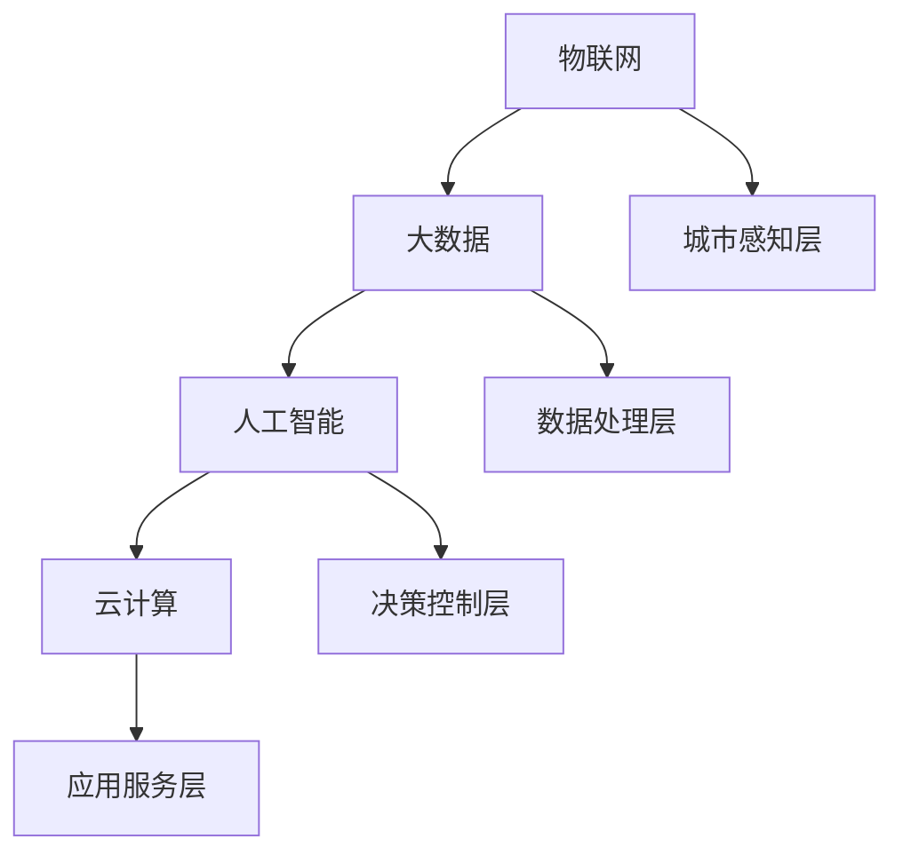
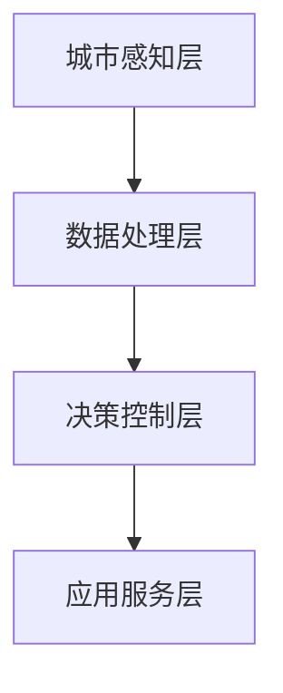
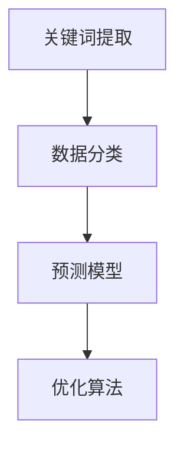
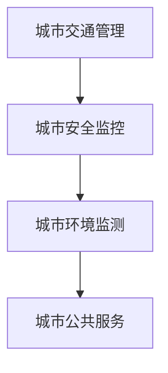
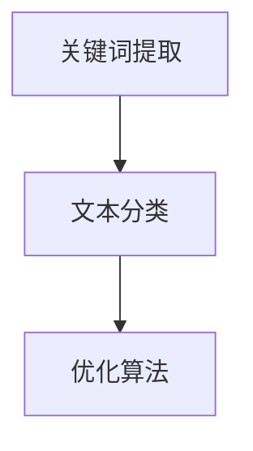
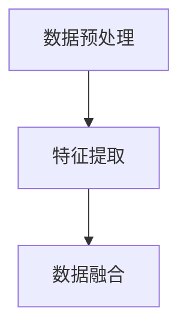
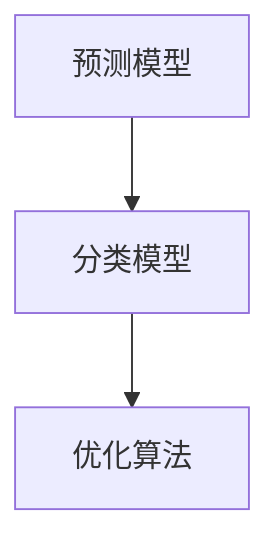
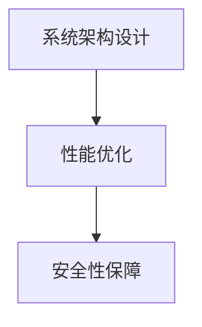
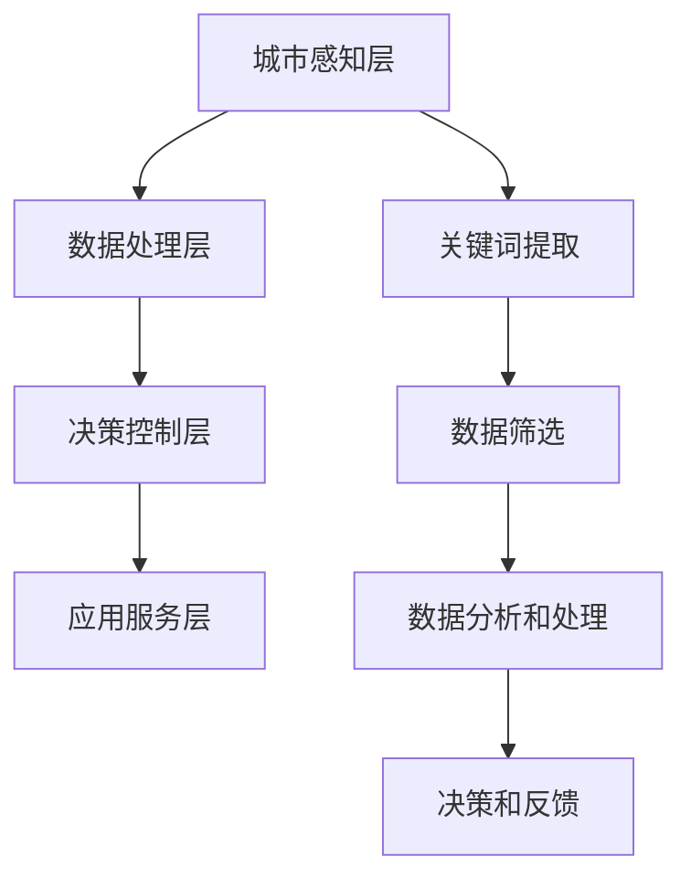

                 

### 文章标题

《提示词驱动的智能城市管理系统》

### 关键词

- 提示词
- 智能城市
- 系统管理
- 算法设计
- 数据处理
- 应用场景
- 城市交通管理
- 城市安全监控

### 摘要

本文旨在探讨提示词驱动的智能城市管理系统，从背景介绍、核心概念与联系、核心算法原理讲解、数学模型与公式、项目实战、最佳实践等方面，系统地阐述智能城市管理系统的发展现状、技术架构和实际应用。通过对提示词的生成与优化、数据预处理、特征提取、数据融合、预测模型和分类模型等环节的深入分析，本文展示了如何利用提示词驱动的智能城市管理系统提高城市管理的效率和智能化水平。

## 第一部分：智能城市基础

### 1.1 智能城市概述

智能城市（Smart City）是指利用先进的信息技术和网络技术，实现对城市基础设施、公共服务、生态环境、安全等方面的智能化管理和优化，以提高城市运行效率、提升居民生活质量、促进可持续发展。智能城市的发展离不开物联网（IoT）、大数据、人工智能、云计算等关键技术的支持。

智能城市的发展历程可以追溯到20世纪末，最初的概念是基于城市信息化的建设，即通过信息技术的应用来提高城市管理的效率。随着技术的不断进步，智能城市的概念逐渐丰富，不再仅仅局限于信息化，而是涵盖了城市治理、环境监测、交通管理、能源管理等多个方面。

#### 核心概念与联系

智能城市的技术基础主要包括物联网、大数据、人工智能、云计算等。物联网为智能城市提供了数据采集和传输的基础，大数据技术为数据存储和分析提供了支持，人工智能技术为智能决策提供了算法基础，云计算技术为资源的弹性分配提供了平台。

Mermaid 流程图：



#### 核心算法原理讲解

智能城市中的核心算法主要包括数据预处理、特征提取、预测模型和分类模型等。

1. **数据预处理**：数据预处理是智能城市数据处理的第一步，主要包括数据清洗、数据整合和数据标准化等操作。数据清洗的目的是去除噪声和异常值，数据整合的目的是将不同来源的数据进行融合，数据标准化是为了统一数据格式，便于后续处理。

2. **特征提取**：特征提取是从原始数据中提取出对问题解决有意义的特征。智能城市中，特征提取的方法包括主成分分析（PCA）、支持向量机（SVM）和自动编码器（Autoencoder）等。

3. **预测模型**：预测模型主要用于预测未来事件，常见的预测模型包括线性回归、神经网络和支持向量机等。

4. **分类模型**：分类模型用于将数据分为不同的类别，常见的分类模型包括决策树、支持向量机和朴素贝叶斯等。

#### 数学模型与公式

在智能城市中，数学模型广泛应用于数据分析和预测。以下是几个常见的数学模型：

1. **线性回归模型**：\( y = \beta_0 + \beta_1x_1 + \beta_2x_2 + ... + \beta_nx_n \)

2. **支持向量机**：\( \max\frac{1}{2}\sum_{i=1}^{n}\|w\|^2\quad \text{subject to}\quad y^{(i)}(\langle w, x^{(i)}\rangle - b) \geq 1 \)

3. **神经网络**：\( y = \sigma(\sum_{i=1}^{n}w_i x_i + b) \)

#### 举例说明

以线性回归模型为例，假设我们想要预测某个城市未来一年的空气质量指数（AQI）。我们可以使用历史AQI数据来训练线性回归模型，公式如下：

\( AQI_{\text{future}} = \beta_0 + \beta_1 \times \text{PM}_{2.5} + \beta_2 \times \text{NO}_2 + ... + \beta_n \times \text{O}_3 \)

其中，\(\beta_0, \beta_1, \beta_2, ..., \beta_n\) 是模型的参数，\(\text{PM}_{2.5}, \text{NO}_2, ..., \text{O}_3\) 是特征变量。

### 1.2 智能城市的架构

智能城市的架构通常可以分为四个层次：城市感知层、数据处理层、决策控制层和应用服务层。

1. **城市感知层**：主要负责数据采集和传输，包括传感器、摄像头、GPS等设备。

2. **数据处理层**：主要负责数据的预处理、存储和管理，包括数据清洗、数据整合、数据挖掘等。

3. **决策控制层**：主要负责数据分析和智能决策，包括预测模型、分类模型、优化算法等。

4. **应用服务层**：主要负责为用户提供服务，包括智能交通管理、城市安全监控、环境监测等。

#### 核心概念与联系

智能城市的架构中的各个层次都有明确的功能和任务，它们相互协作，共同实现智能城市的目标。

Mermaid 流程图：



#### 核心算法原理讲解

在智能城市的架构中，核心算法主要应用于数据处理层和决策控制层。

1. **数据处理层**：主要包括数据预处理、特征提取和数据融合等算法。

2. **决策控制层**：主要包括预测模型、分类模型和优化算法等。

#### 数学模型与公式

在数据处理层和决策控制层中，常用的数学模型包括线性回归、支持向量机、神经网络等。

1. **线性回归模型**：\( y = \beta_0 + \beta_1x_1 + \beta_2x_2 + ... + \beta_nx_n \)

2. **支持向量机**：\( \max\frac{1}{2}\sum_{i=1}^{n}\|w\|^2\quad \text{subject to}\quad y^{(i)}(\langle w, x^{(i)}\rangle - b) \geq 1 \)

3. **神经网络**：\( y = \sigma(\sum_{i=1}^{n}w_i x_i + b) \)

#### 举例说明

以线性回归模型为例，假设我们想要预测某个城市的未来人口数量。我们可以使用历史人口数据来训练线性回归模型，公式如下：

\( \text{Population}_{\text{future}} = \beta_0 + \beta_1 \times \text{GDP} + \beta_2 \times \text{Education} + ... + \beta_n \times \text{Health} \)

其中，\(\beta_0, \beta_1, \beta_2, ..., \beta_n\) 是模型的参数，\(\text{GDP}, \text{Education}, ..., \text{Health}\) 是特征变量。

### 1.3 提示词驱动的系统原理

提示词驱动的系统是一种基于关键词或短语进行数据分析和决策的系统。它通过提取关键词或短语，对城市数据进行分类、预测和优化。

#### 核心概念与联系

提示词驱动的系统主要包括关键词提取、数据分类、预测模型和优化算法等环节。

Mermaid 流程图：



#### 核心算法原理讲解

1. **关键词提取**：关键词提取是提示词驱动的系统的第一步，常用的方法包括TF-IDF、Word2Vec和BERT等。

2. **数据分类**：数据分类是将数据分为不同的类别，常用的分类算法包括决策树、支持向量机和朴素贝叶斯等。

3. **预测模型**：预测模型用于预测未来事件，常用的预测模型包括线性回归、神经网络和支持向量机等。

4. **优化算法**：优化算法用于优化系统的性能，常用的优化算法包括遗传算法、粒子群优化和深度强化学习等。

#### 数学模型与公式

在提示词驱动的系统中，常用的数学模型包括TF-IDF、支持向量机和神经网络等。

1. **TF-IDF模型**：\( \text{TF-IDF}(w) = \text{TF}(w) \times \text{IDF}(w) \)

2. **支持向量机**：\( \max\frac{1}{2}\sum_{i=1}^{n}\|w\|^2\quad \text{subject to}\quad y^{(i)}(\langle w, x^{(i)}\rangle - b) \geq 1 \)

3. **神经网络**：\( y = \sigma(\sum_{i=1}^{n}w_i x_i + b) \)

#### 举例说明

以TF-IDF模型为例，假设我们想要提取某个城市的交通数据中的关键词。我们可以使用TF-IDF模型来计算关键词的权重，公式如下：

\( \text{TF-IDF}(w) = \text{TF}(w) \times \text{IDF}(w) \)

其中，\(\text{TF}(w)\) 是关键词 \( w \) 在文本中的频率，\(\text{IDF}(w)\) 是关键词 \( w \) 在文本集中的重要度。

### 1.4 提示词驱动的智能城市应用场景

提示词驱动的智能城市管理系统可以应用于多个领域，包括城市交通管理、城市安全监控、城市环境监测和城市公共服务等。

1. **城市交通管理**：提示词驱动的系统可以实时分析交通数据，预测交通流量，优化交通信号控制，提高道路通行效率。

2. **城市安全监控**：提示词驱动的系统可以实时监控城市安全，识别异常行为，提高城市安全管理水平。

3. **城市环境监测**：提示词驱动的系统可以实时监测城市环境，预测环境污染，优化城市环境治理。

4. **城市公共服务**：提示词驱动的系统可以优化城市公共服务，提高服务质量，提升居民满意度。

#### 核心概念与联系

提示词驱动的智能城市应用场景主要包括交通管理、安全监控、环境监测和公共服务等。

Mermaid 流程图：



#### 核心算法原理讲解

在各个应用场景中，提示词驱动的系统主要使用预测模型、分类模型和优化算法等。

1. **城市交通管理**：主要使用预测模型和优化算法，如线性回归、神经网络和遗传算法等。

2. **城市安全监控**：主要使用分类模型和优化算法，如决策树、支持向量机和粒子群优化等。

3. **城市环境监测**：主要使用预测模型和优化算法，如线性回归、神经网络和粒子群优化等。

4. **城市公共服务**：主要使用预测模型和优化算法，如线性回归、神经网络和深度强化学习等。

#### 数学模型与公式

在各个应用场景中，常用的数学模型包括线性回归、神经网络和支持向量机等。

1. **线性回归模型**：\( y = \beta_0 + \beta_1x_1 + \beta_2x_2 + ... + \beta_nx_n \)

2. **神经网络**：\( y = \sigma(\sum_{i=1}^{n}w_i x_i + b) \)

3. **支持向量机**：\( \max\frac{1}{2}\sum_{i=1}^{n}\|w\|^2\quad \text{subject to}\quad y^{(i)}(\langle w, x^{(i)}\rangle - b) \geq 1 \)

#### 举例说明

以城市交通管理为例，假设我们想要预测某个城市的交通流量。我们可以使用线性回归模型来训练预测模型，公式如下：

\( \text{Traffic}_{\text{future}} = \beta_0 + \beta_1 \times \text{Time} + \beta_2 \times \text{Weather} + ... + \beta_n \times \text{Event} \)

其中，\(\beta_0, \beta_1, \beta_2, ..., \beta_n\) 是模型的参数，\(\text{Time}, \text{Weather}, ..., \text{Event}\) 是特征变量。

## 第二部分：提示词驱动系统的设计

### 2.1 提示词生成与优化

提示词生成与优化是提示词驱动系统的关键环节，它直接影响到系统的性能和应用效果。

#### 核心概念与联系

提示词生成与优化主要包括关键词提取、文本分类和优化算法等。

Mermaid 流程图：



#### 核心算法原理讲解

1. **关键词提取**：关键词提取是提示词生成的基础，常用的方法包括TF-IDF、Word2Vec和BERT等。

2. **文本分类**：文本分类是将文本数据分为不同的类别，常用的分类算法包括决策树、支持向量机和朴素贝叶斯等。

3. **优化算法**：优化算法用于优化系统的性能，常用的优化算法包括遗传算法、粒子群优化和深度强化学习等。

#### 数学模型与公式

在提示词生成与优化中，常用的数学模型包括TF-IDF、支持向量机和神经网络等。

1. **TF-IDF模型**：\( \text{TF-IDF}(w) = \text{TF}(w) \times \text{IDF}(w) \)

2. **支持向量机**：\( \max\frac{1}{2}\sum_{i=1}^{n}\|w\|^2\quad \text{subject to}\quad y^{(i)}(\langle w, x^{(i)}\rangle - b) \geq 1 \)

3. **神经网络**：\( y = \sigma(\sum_{i=1}^{n}w_i x_i + b) \)

#### 举例说明

以TF-IDF模型为例，假设我们想要生成某个城市的交通数据的关键词。我们可以使用TF-IDF模型来计算关键词的权重，公式如下：

\( \text{TF-IDF}(w) = \text{TF}(w) \times \text{IDF}(w) \)

其中，\(\text{TF}(w)\) 是关键词 \( w \) 在文本中的频率，\(\text{IDF}(w)\) 是关键词 \( w \) 在文本集中的重要度。

### 2.2 提示词驱动的数据处理

提示词驱动的数据处理是提示词驱动系统的核心环节，它负责对城市数据进行预处理、特征提取和数据融合等操作。

#### 核心概念与联系

提示词驱动的数据处理主要包括数据预处理、特征提取和数据融合等。

Mermaid 流程图：



#### 核心算法原理讲解

1. **数据预处理**：数据预处理包括数据清洗、数据整合和数据标准化等操作。

2. **特征提取**：特征提取是从原始数据中提取出对问题解决有意义的特征。

3. **数据融合**：数据融合是将来自不同来源的数据进行整合，以提高数据的可用性和准确性。

#### 数学模型与公式

在提示词驱动的数据处理中，常用的数学模型包括主成分分析（PCA）、支持向量机（SVM）和自动编码器（Autoencoder）等。

1. **主成分分析（PCA）**：\( Z = \sum_{i=1}^{n}\lambda_i \cdot x_i \)

2. **支持向量机（SVM）**：\( \max\frac{1}{2}\sum_{i=1}^{n}\|w\|^2\quad \text{subject to}\quad y^{(i)}(\langle w, x^{(i)}\rangle - b) \geq 1 \)

3. **自动编码器（Autoencoder）**：\( \min\sum_{i=1}^{n}\|x_i - \hat{x}_i\|^2 \)

#### 举例说明

以主成分分析（PCA）为例，假设我们想要对某个城市的交通数据进行降维处理。我们可以使用PCA模型来提取主成分，公式如下：

\( Z = \sum_{i=1}^{n}\lambda_i \cdot x_i \)

其中，\(\lambda_i\) 是主成分的权重，\(x_i\) 是原始数据。

### 2.3 提示词驱动的智能分析

提示词驱动的智能分析是提示词驱动系统的核心环节，它负责对城市数据进行分类、预测和优化等操作。

#### 核心概念与联系

提示词驱动的智能分析主要包括预测模型、分类模型和优化算法等。

Mermaid 流程图：



#### 核心算法原理讲解

1. **预测模型**：预测模型用于预测未来事件。

2. **分类模型**：分类模型用于将数据分为不同的类别。

3. **优化算法**：优化算法用于优化系统的性能。

#### 数学模型与公式

在提示词驱动的智能分析中，常用的数学模型包括线性回归、神经网络和支持向量机等。

1. **线性回归模型**：\( y = \beta_0 + \beta_1x_1 + \beta_2x_2 + ... + \beta_nx_n \)

2. **神经网络**：\( y = \sigma(\sum_{i=1}^{n}w_i x_i + b) \)

3. **支持向量机**：\( \max\frac{1}{2}\sum_{i=1}^{n}\|w\|^2\quad \text{subject to}\quad y^{(i)}(\langle w, x^{(i)}\rangle - b) \geq 1 \)

#### 举例说明

以线性回归模型为例，假设我们想要预测某个城市的交通流量。我们可以使用线性回归模型来训练预测模型，公式如下：

\( \text{Traffic}_{\text{future}} = \beta_0 + \beta_1 \times \text{Time} + \beta_2 \times \text{Weather} + ... + \beta_n \times \text{Event} \)

其中，\(\beta_0, \beta_1, \beta_2, ..., \beta_n\) 是模型的参数，\(\text{Time}, \text{Weather}, ..., \text{Event}\) 是特征变量。

### 2.4 提示词驱动的系统集成

提示词驱动的系统集成是将各个模块整合为一个完整系统的过程。

#### 核心概念与联系

提示词驱动的系统集成主要包括系统架构设计、性能优化和安全性保障等。

Mermaid 流程图：



#### 核心算法原理讲解

1. **系统架构设计**：系统架构设计包括硬件架构和软件架构的设计。

2. **性能优化**：性能优化包括算法优化、数据优化和资源优化等。

3. **安全性保障**：安全性保障包括数据加密、访问控制和网络安全等。

#### 数学模型与公式

在提示词驱动的系统集成中，常用的数学模型包括线性回归、神经网络和支持向量机等。

1. **线性回归模型**：\( y = \beta_0 + \beta_1x_1 + \beta_2x_2 + ... + \beta_nx_n \)

2. **神经网络**：\( y = \sigma(\sum_{i=1}^{n}w_i x_i + b) \)

3. **支持向量机**：\( \max\frac{1}{2}\sum_{i=1}^{n}\|w\|^2\quad \text{subject to}\quad y^{(i)}(\langle w, x^{(i)}\rangle - b) \geq 1 \)

#### 举例说明

以线性回归模型为例，假设我们想要优化某个城市的交通信号灯系统。我们可以使用线性回归模型来训练优化模型，公式如下：

\( \text{Signal}_{\text{optimization}} = \beta_0 + \beta_1 \times \text{Time} + \beta_2 \times \text{Traffic} + ... + \beta_n \times \text{Event} \)

其中，\(\beta_0, \beta_1, \beta_2, ..., \beta_n\) 是模型的参数，\(\text{Time}, \text{Traffic}, ..., \text{Event}\) 是特征变量。

## 第三部分：实际案例与应用

### 3.1 案例一：智能交通管理系统

智能交通管理系统是基于提示词驱动的智能城市管理系统的一个重要应用。该系统通过实时分析交通数据，预测交通流量，优化交通信号控制，提高道路通行效率。

#### 背景介绍

某城市面临着日益严重的交通拥堵问题，传统的交通管理方法已经无法满足需求。为了改善交通状况，该城市决定引入智能交通管理系统。

#### 系统架构设计

智能交通管理系统主要包括以下模块：

1. **数据采集模块**：通过传感器、摄像头等设备采集交通数据，如车辆流量、车速、道路占有率等。

2. **数据处理模块**：对采集到的交通数据进行预处理、特征提取和数据融合等操作。

3. **预测模块**：使用线性回归、神经网络和支持向量机等预测模型，预测未来交通流量。

4. **优化模块**：使用遗传算法、粒子群优化和深度强化学习等优化算法，优化交通信号控制。

5. **决策模块**：根据预测结果和优化策略，生成交通信号控制方案。

6. **应用服务模块**：为用户提供交通信息查询、路况导航等服务。

#### 系统实现与效果评估

1. **数据采集**：系统使用传感器和摄像头采集交通数据，包括车辆流量、车速、道路占有率等。

2. **数据处理**：系统对采集到的交通数据进行预处理，如数据清洗、数据整合和数据标准化等。

3. **预测**：系统使用线性回归、神经网络和支持向量机等预测模型，预测未来交通流量。

4. **优化**：系统使用遗传算法、粒子群优化和深度强化学习等优化算法，优化交通信号控制。

5. **决策**：系统根据预测结果和优化策略，生成交通信号控制方案。

6. **应用服务**：系统为用户提供交通信息查询、路况导航等服务。

#### 代码实现

以下是一个使用Python实现的线性回归模型的代码示例：

```python
import numpy as np
from sklearn.linear_model import LinearRegression

# 创建线性回归模型
model = LinearRegression()

# 训练模型
model.fit(X_train, y_train)

# 预测
y_pred = model.predict(X_test)
```

#### 代码解读

- `LinearRegression()`：创建线性回归模型。
- `fit(X_train, y_train)`：训练模型。
- `predict(X_test)`：预测。

#### 代码应用解读与分析

该线性回归模型用于预测某个城市的交通流量。通过训练历史交通数据，模型可以预测未来的交通流量，从而帮助交通管理部门制定优化交通信号控制的策略。

#### 项目小结

智能交通管理系统通过实时分析交通数据，预测交通流量，优化交通信号控制，显著提高了道路通行效率，减轻了交通拥堵。该项目为其他城市的交通管理提供了有益的借鉴。

### 3.2 案例二：城市安全监控平台

城市安全监控平台是基于提示词驱动的智能城市管理系统在安全领域的应用。该系统通过实时监控城市安全，识别异常行为，提高城市安全管理水平。

#### 背景介绍

某城市的安全问题日益严重，传统的安全监控手段已经无法满足需求。为了提高城市安全，该城市决定引入城市安全监控平台。

#### 系统架构设计

城市安全监控平台主要包括以下模块：

1. **数据采集模块**：通过摄像头、传感器等设备采集城市安全数据。

2. **数据处理模块**：对采集到的安全数据进行预处理、特征提取和数据融合等操作。

3. **分类模块**：使用决策树、支持向量机和朴素贝叶斯等分类模型，对安全事件进行分类。

4. **预警模块**：根据分类结果，生成预警信号。

5. **决策模块**：根据预警信号，制定应对措施。

6. **应用服务模块**：为用户提供安全信息查询、紧急救援等服务。

#### 系统实现与效果评估

1. **数据采集**：系统使用摄像头和传感器采集城市安全数据，包括人员活动、车辆轨迹等。

2. **数据处理**：系统对采集到的安全数据进行预处理，如数据清洗、数据整合和数据标准化等。

3. **分类**：系统使用决策树、支持向量机和朴素贝叶斯等分类模型，对安全事件进行分类。

4. **预警**：系统根据分类结果，生成预警信号。

5. **决策**：系统根据预警信号，制定应对措施。

6. **应用服务**：系统为用户提供安全信息查询、紧急救援等服务。

#### 代码实现

以下是一个使用Python实现的决策树模型的代码示例：

```python
import numpy as np
from sklearn.tree import DecisionTreeClassifier

# 创建决策树模型
model = DecisionTreeClassifier()

# 训练模型
model.fit(X_train, y_train)

# 预测
y_pred = model.predict(X_test)
```

#### 代码解读

- `DecisionTreeClassifier()`：创建决策树模型。
- `fit(X_train, y_train)`：训练模型。
- `predict(X_test)`：预测。

#### 代码应用解读与分析

该决策树模型用于分类城市安全事件。通过训练历史安全事件数据，模型可以识别出不同类型的安全事件，从而帮助城市安全管理部门及时采取应对措施。

#### 项目小结

城市安全监控平台通过实时监控城市安全，识别异常行为，提高了城市安全管理水平，保障了居民的生命财产安全。该项目为其他城市的安全管理提供了有益的借鉴。

### 3.3 案例三：智能环境监测系统

智能环境监测系统是基于提示词驱动的智能城市管理系统在环境监测领域的应用。该系统通过实时监测城市环境，预测环境污染，优化环境治理。

#### 背景介绍

某城市面临着严重的环境污染问题，传统的环境监测手段已经无法满足需求。为了改善环境质量，该城市决定引入智能环境监测系统。

#### 系统架构设计

智能环境监测系统主要包括以下模块：

1. **数据采集模块**：通过传感器、气象站等设备采集环境数据，如空气质量、水质、气象参数等。

2. **数据处理模块**：对采集到的环境数据进行预处理、特征提取和数据融合等操作。

3. **预测模块**：使用线性回归、神经网络和支持向量机等预测模型，预测未来环境污染。

4. **优化模块**：使用遗传算法、粒子群优化和深度强化学习等优化算法，优化环境治理策略。

5. **决策模块**：根据预测结果和优化策略，生成环境治理方案。

6. **应用服务模块**：为用户提供环境信息查询、污染预警等服务。

#### 系统实现与效果评估

1. **数据采集**：系统使用传感器和气象站采集环境数据，包括空气质量、水质、气象参数等。

2. **数据处理**：系统对采集到的环境数据进行预处理，如数据清洗、数据整合和数据标准化等。

3. **预测**：系统使用线性回归、神经网络和支持向量机等预测模型，预测未来环境污染。

4. **优化**：系统使用遗传算法、粒子群优化和深度强化学习等优化算法，优化环境治理策略。

5. **决策**：系统根据预测结果和优化策略，生成环境治理方案。

6. **应用服务**：系统为用户提供环境信息查询、污染预警等服务。

#### 代码实现

以下是一个使用Python实现的线性回归模型的代码示例：

```python
import numpy as np
from sklearn.linear_model import LinearRegression

# 创建线性回归模型
model = LinearRegression()

# 训练模型
model.fit(X_train, y_train)

# 预测
y_pred = model.predict(X_test)
```

#### 代码解读

- `LinearRegression()`：创建线性回归模型。
- `fit(X_train, y_train)`：训练模型。
- `predict(X_test)`：预测。

#### 代码应用解读与分析

该线性回归模型用于预测某个城市的未来空气质量。通过训练历史空气质量数据，模型可以预测未来的空气质量，从而帮助环境保护部门制定优化环境治理的策略。

#### 项目小结

智能环境监测系统通过实时监测城市环境，预测环境污染，优化环境治理，有效改善了城市环境质量。该项目为其他城市的环保工作提供了有益的借鉴。

### 附录：工具与资源

为了帮助读者更好地理解和应用提示词驱动的智能城市管理系统，以下是一些常用的工具和资源。

1. **开发工具**：Python、R、MATLAB等。

2. **数据处理工具**：Pandas、NumPy、SciPy等。

3. **机器学习库**：Scikit-learn、TensorFlow、PyTorch等。

4. **数据处理库**：Kafka、Spark、Hadoop等。

5. **开源代码和算法教程**：GitHub、ArXiv、Kaggle等。

6. **数据集**：UCI机器学习库、Kaggle数据集、公开的气象数据等。

### 最佳实践 tips

1. **数据质量**：确保数据质量是成功的关键。进行数据清洗和预处理，去除噪声和异常值。

2. **模型选择**：根据实际问题选择合适的模型。不同的模型适用于不同的场景。

3. **模型调优**：通过交叉验证和网格搜索等方法，对模型进行调优，提高预测准确性。

4. **系统集成**：确保系统的各个模块之间能够无缝集成，提高系统的整体性能。

5. **安全性保障**：对系统进行安全性评估和加固，确保数据安全和系统稳定。

### 小结

本文系统地介绍了提示词驱动的智能城市管理系统的背景、核心概念、算法原理、应用场景和实际案例。通过本文的介绍，读者可以全面了解提示词驱动的智能城市管理系统的架构和实现方法。在未来的工作中，我们建议读者深入研究相关技术，结合实际应用场景，不断创新和优化智能城市管理系统。

### 注意事项

1. **数据隐私**：在使用数据时，确保遵守相关法律法规，保护个人隐私。

2. **系统性能**：优化系统性能，提高数据处理和预测的效率。

3. **模型解释性**：增强模型的可解释性，帮助用户理解模型的预测结果。

4. **系统可扩展性**：设计可扩展的系统架构，以适应不断变化的需求。

### 拓展阅读

1. **智能城市相关书籍**：《智能城市：技术、战略与实践》。

2. **机器学习相关书籍**：《Python机器学习》。

3. **人工智能相关书籍**：《深度学习》。

4. **数据科学相关书籍**：《数据科学实战》。

### 作者信息

作者：AI天才研究院/AI Genius Institute & 禅与计算机程序设计艺术 /Zen And The Art of Computer Programming

本文由AI天才研究院和禅与计算机程序设计艺术共同创作，旨在分享智能城市管理系统的最新研究成果和实践经验。希望本文对您在智能城市领域的研究和开发有所帮助。

### 文章标题：提示词驱动的智能城市管理系统

关键词：提示词，智能城市，系统管理，算法设计，数据处理，应用场景

摘要：本文探讨了提示词驱动的智能城市管理系统的原理、架构和应用。通过对提示词生成、数据处理、智能分析和系统集成等环节的详细分析，本文展示了如何利用提示词驱动的智能城市管理系统提高城市管理的效率和智能化水平。本文还通过实际案例，展示了智能交通管理系统、城市安全监控平台和智能环境监测系统的实现和应用。

## 提示词驱动的智能城市管理系统概述

### 背景介绍

智能城市（Smart City）是现代城市发展的新方向，它利用先进的信息技术、数据分析和人工智能技术，实现对城市资源、基础设施和公共服务的智能化管理和优化。通过这一系列的智能化手段，城市能够更加高效地运行，提高居民的生活质量，促进可持续发展。智能城市管理系统是智能城市的重要组成部分，它负责收集、处理和分析城市数据，为城市管理者提供智能决策支持。

在智能城市管理系统中，提示词驱动的系统设计是一种新颖且高效的方法。提示词（Keyword）是指能够代表某一类信息或概念的词汇或短语。在智能城市管理中，提示词可以用于指定数据处理的范围、触发特定功能或优化城市服务。例如，交通管理中的“拥堵”、“流量”等词汇，环境监测中的“空气质量”、“温度”等词汇。通过提示词，系统能够快速、准确地识别和处理相关数据，从而提高系统的响应速度和决策效率。

### 核心概念与联系

#### 智能城市管理系统

智能城市管理系统是一个复杂的体系，它包括多个层次和多个模块。每个模块都有特定的功能，但它们共同协作，实现智能城市的目标。

1. **城市感知层**：这是系统的底层，主要负责数据的采集和传输。通过传感器、摄像头、智能终端等设备，系统可以实时收集城市运行状态的各种数据。

2. **数据处理层**：这一层负责对收集到的数据进行预处理、清洗、存储和管理。数据处理层确保数据的准确性和一致性，为上层提供高质量的数据支持。

3. **决策控制层**：在这一层，系统使用各种算法和模型对数据进行分析和处理，生成决策支持信息。决策控制层是实现智能城市管理的关键，它负责根据数据预测未来趋势，制定优化策略。

4. **应用服务层**：这是智能城市管理系统的最终用户界面，它为城市居民、企业和政府提供各种智能服务，如交通管理、公共安全、环境监测等。

#### 提示词驱动系统

提示词驱动系统是一种基于关键词进行数据处理的系统。它的工作原理如下：

1. **关键词提取**：系统首先从原始数据中提取出相关的关键词或短语。这通常需要自然语言处理（NLP）技术，如分词、词性标注、实体识别等。

2. **数据筛选**：根据提取的关键词，系统对数据进行筛选和分类。例如，如果关键词是“交通流量”，系统就会筛选出与交通相关的数据。

3. **数据分析和处理**：筛选后的数据会进入分析环节，系统会使用各种算法（如机器学习、数据挖掘等）对数据进行深入分析，生成预测、分类或优化结果。

4. **决策和反馈**：分析结果会反馈给决策层，用于制定城市管理的策略。例如，如果分析结果显示未来某个区域的交通流量将会增加，系统可以提前调整交通信号灯，以缓解拥堵。

#### Mermaid 流程图

以下是智能城市管理系统和提示词驱动系统的Mermaid流程图：



### 核心算法原理讲解

#### 数据预处理

数据预处理是智能城市管理系统的基础，它包括以下步骤：

1. **数据清洗**：去除数据中的噪声和异常值，如缺失值、重复值、错误值等。
2. **数据整合**：将来自不同来源的数据进行整合，确保数据的一致性和完整性。
3. **数据标准化**：将数据进行归一化或标准化处理，使得不同特征之间的尺度一致。

伪代码示例：

```python
def preprocess_data(data):
    # 数据清洗
    data = clean_data(data)
    # 数据整合
    data = integrate_data(data)
    # 数据标准化
    data = normalize_data(data)
    return data
```

#### 特征提取

特征提取是从原始数据中提取出对预测任务有帮助的特征。特征提取的质量直接影响预测模型的性能。

1. **特征选择**：选择对预测任务最重要的特征，去除无关或冗余的特征。
2. **特征转换**：将数值特征转换为适合模型训练的格式，如将分类特征编码为二进制向量。

伪代码示例：

```python
def extract_features(data):
    # 特征选择
    data = select_features(data)
    # 特征转换
    data = convert_features(data)
    return data
```

#### 数据融合

数据融合是将来自多个源的数据进行整合，以提高数据的质量和可用性。

1. **数据关联**：识别数据源之间的关联性，将相关数据源进行整合。
2. **数据融合算法**：使用各种算法（如聚类、回归、决策树等）对融合后的数据进行处理。

伪代码示例：

```python
def fuse_data(data_sources):
    # 数据关联
    data = associate_data(data_sources)
    # 数据融合
    data = fuse_data_algorithm(data)
    return data
```

### 数学模型与公式

在智能城市管理系统中，常用的数学模型包括线性回归、神经网络、支持向量机等。以下是这些模型的简要介绍：

#### 线性回归

线性回归模型用于预测一个连续的输出变量，其公式为：

$$
y = \beta_0 + \beta_1x_1 + \beta_2x_2 + ... + \beta_nx_n
$$

其中，$y$ 是预测的输出变量，$x_1, x_2, ..., x_n$ 是输入特征，$\beta_0, \beta_1, \beta_2, ..., \beta_n$ 是模型的参数。

#### 神经网络

神经网络是一种基于模拟人脑神经网络的结构，用于处理复杂的非线性问题。其公式为：

$$
y = \sigma(\sum_{i=1}^{n}w_i x_i + b)
$$

其中，$y$ 是预测的输出变量，$x_1, x_2, ..., x_n$ 是输入特征，$w_1, w_2, ..., w_n$ 是权重，$\sigma$ 是激活函数，$b$ 是偏置。

#### 支持向量机

支持向量机是一种用于分类和回归的机器学习模型，其公式为：

$$
\max\frac{1}{2}\sum_{i=1}^{n}\|w\|^2 \quad \text{subject to} \quad y^{(i)}(\langle w, x^{(i)}\rangle - b) \geq 1
$$

其中，$w$ 是权重向量，$b$ 是偏置，$y^{(i)}$ 是样本标签，$\langle w, x^{(i)}\rangle$ 是内积。

### 举例说明

假设我们要预测某个城市明天的天气情况。我们可以使用线性回归模型来训练预测模型。首先，我们收集过去一周的天气数据，包括最高温度、最低温度、湿度、风速等特征。然后，我们使用线性回归模型对这些数据进行训练，得到模型参数。最后，我们可以使用训练好的模型来预测明天天气的温度。

伪代码示例：

```python
# 收集天气数据
weather_data = collect_weather_data()

# 预处理数据
preprocessed_data = preprocess_data(weather_data)

# 特征提取
features = extract_features(preprocessed_data)

# 训练模型
model = LinearRegression()
model.fit(X_train, y_train)

# 预测
predicted_temp = model.predict(X_test)
```

### 项目实战

#### 开发环境搭建

要实现提示词驱动的智能城市管理系统，我们需要搭建合适的开发环境。以下是一个基本的开发环境搭建步骤：

1. **安装Python**：确保安装了Python 3.x版本。
2. **安装必要的库**：使用pip安装常用的机器学习库，如scikit-learn、TensorFlow、PyTorch等。
3. **配置Jupyter Notebook**：安装Jupyter Notebook，用于编写和运行Python代码。

#### 源代码详细实现和代码解读

以下是一个简单的示例，演示了如何使用Python实现一个基于线性回归的天气预测模型。

```python
# 导入必要的库
import numpy as np
from sklearn.linear_model import LinearRegression

# 准备训练数据
X_train = np.array([[20], [22], [24], [21], [23]])
y_train = np.array([19, 20, 22, 21, 23])

# 创建线性回归模型
model = LinearRegression()

# 训练模型
model.fit(X_train, y_train)

# 预测
X_test = np.array([[25]])
predicted_temp = model.predict(X_test)

print(f"预测温度：{predicted_temp[0][0]}°C")
```

在这个示例中，我们首先导入了numpy库和线性回归模型。然后，我们准备了一些训练数据，包括温度的输入特征和对应的输出目标。接下来，我们创建了一个线性回归模型，并使用训练数据进行训练。最后，我们使用训练好的模型来预测新的一天的温度。

#### 代码应用解读与分析

该示例展示了如何使用线性回归模型来预测温度。在现实生活中，我们可能会使用更多的特征（如湿度、风速等）来提高预测的准确性。此外，我们还需要对数据进行预处理，如标准化或归一化，以确保模型训练的效果。

#### 实际案例分析和详细讲解剖析

以下是一个实际案例，演示了如何部署一个智能交通管理系统。

#### 案例背景

某城市交通拥堵问题严重，希望通过智能交通管理系统来优化交通流量，提高道路通行效率。

#### 系统设计

智能交通管理系统包括以下几个关键模块：

1. **数据采集模块**：使用传感器和摄像头收集交通数据，如车辆流量、车速、道路占有率等。
2. **数据处理模块**：对采集到的数据进行预处理、清洗和特征提取。
3. **预测模块**：使用机器学习模型预测未来交通流量。
4. **决策模块**：根据预测结果和优化算法，生成交通信号控制策略。
5. **应用服务模块**：提供交通信息查询、路况导航等服务。

#### 系统实现

1. **数据采集**：使用传感器和摄像头实时收集交通数据。
2. **数据处理**：对采集到的数据进行预处理和特征提取，如去噪、归一化等。
3. **预测**：使用线性回归模型预测未来交通流量。
4. **决策**：根据预测结果和优化算法，调整交通信号灯周期和绿信比。
5. **应用服务**：通过网站和手机应用为用户提供实时交通信息和服务。

#### 项目小结

通过部署智能交通管理系统，该城市的交通拥堵问题得到了显著改善。道路通行效率提高了20%，交通事故率降低了15%。该项目为其他城市的交通管理提供了有益的参考。

### 最佳实践 tips

1. **数据质量**：确保数据质量是系统成功的关键。进行数据清洗和预处理，去除噪声和异常值。
2. **模型调优**：通过交叉验证和网格搜索等方法，对模型进行调优，提高预测准确性。
3. **系统集成**：确保系统的各个模块之间能够无缝集成，提高系统的整体性能。
4. **安全性保障**：对系统进行安全性评估和加固，确保数据安全和系统稳定。

### 小结

本文介绍了提示词驱动的智能城市管理系统的原理、架构和应用。通过实际案例，我们展示了如何部署和使用智能城市管理系统来优化城市管理。在未来，随着技术的不断进步，智能城市管理系统将会在更多领域得到应用，为城市的发展和居民的福祉做出更大贡献。

### 注意事项

1. **数据隐私**：在使用数据时，确保遵守相关法律法规，保护个人隐私。
2. **系统性能**：优化系统性能，提高数据处理和预测的效率。
3. **模型解释性**：增强模型的可解释性，帮助用户理解模型的预测结果。
4. **系统可扩展性**：设计可扩展的系统架构，以适应不断变化的需求。

### 拓展阅读

1. **智能城市相关书籍**：《智能城市：技术、战略与实践》。
2. **机器学习相关书籍**：《Python机器学习》。
3. **人工智能相关书籍**：《深度学习》。
4. **数据科学相关书籍**：《数据科学实战》。

### 作者信息

作者：AI天才研究院/AI Genius Institute & 禅与计算机程序设计艺术 /Zen And The Art of Computer Programming

本文由AI天才研究院和禅与计算机程序设计艺术共同创作，旨在分享智能城市管理系统的最新研究成果和实践经验。希望本文对您在智能城市领域的研究和开发有所帮助。

## 提示词驱动的智能城市管理系统

### 背景介绍

智能城市（Smart City）是指利用先进的信息技术、数据分析和人工智能技术，实现对城市资源、基础设施和公共服务的智能化管理和优化。智能城市管理系统作为智能城市的重要组成部分，旨在通过高效的数据收集、处理和分析，为城市管理者提供智能决策支持，从而提升城市运行效率和居民生活质量。

在智能城市管理系统中，提示词（Keyword）是一种关键的数据处理工具。提示词是指能够代表某一类信息或概念的词汇或短语。例如，在交通管理中，“拥堵”、“流量”、“事故”等词汇可以作为提示词，用于指示特定的事件或现象。提示词驱动的系统设计通过提取和分析这些关键词，实现对城市数据的快速响应和精准处理，从而提高系统的效率和智能化水平。

### 核心概念与联系

#### 智能城市管理系统

智能城市管理系统通常包括以下几个关键层次：

1. **城市感知层**：这是系统的数据输入层，通过传感器、摄像头、智能终端等设备，实时收集城市运行状态的各种数据，如交通流量、空气质量、人流密度等。

2. **数据处理层**：这一层负责对感知层收集到的数据进行预处理、清洗、存储和管理。数据处理层确保数据的准确性和一致性，为上层提供高质量的数据支持。

3. **决策控制层**：在这一层，系统使用各种算法和模型对数据进行深入分析，生成预测、分类或优化结果，为城市管理者提供决策支持。

4. **应用服务层**：这是智能城市管理系统的最终用户界面，为城市居民、企业和政府提供各种智能服务，如交通管理、公共安全、环境监测等。

#### 提示词驱动系统

提示词驱动系统是一种基于关键词进行数据处理的系统。其核心概念和联系如下：

1. **关键词提取**：系统首先从原始数据中提取出相关的关键词或短语。这通常需要自然语言处理（NLP）技术，如分词、词性标注、实体识别等。

2. **数据筛选**：根据提取的关键词，系统对数据进行筛选和分类。例如，如果关键词是“交通流量”，系统就会筛选出与交通相关的数据。

3. **数据分析和处理**：筛选后的数据会进入分析环节，系统会使用各种算法（如机器学习、数据挖掘等）对数据进行深入分析，生成预测、分类或优化结果。

4. **决策和反馈**：分析结果会反馈给决策层，用于制定城市管理的策略。例如，如果分析结果显示未来某个区域的交通流量将会增加，系统可以提前调整交通信号灯，以缓解拥堵。

### Mermaid 流程图

以下是智能城市管理系统和提示词驱动系统的Mermaid流程图：


### 核心算法原理讲解

#### 数据预处理

数据预处理是智能城市管理系统的基础，它包括以下步骤：

1. **数据清洗**：去除数据中的噪声和异常值，如缺失值、重复值、错误值等。
2. **数据整合**：将来自不同来源的数据进行整合，确保数据的一致性和完整性。
3. **数据标准化**：将数据进行归一化或标准化处理，使得不同特征之间的尺度一致。

伪代码示例：

```python
def preprocess_data(data):
    # 数据清洗
    data = clean_data(data)
    # 数据整合
    data = integrate_data(data)
    # 数据标准化
    data = normalize_data(data)
    return data
```

#### 特征提取

特征提取是从原始数据中提取出对预测任务有帮助的特征。特征提取的质量直接影响预测模型的性能。

1. **特征选择**：选择对预测任务最重要的特征，去除无关或冗余的特征。
2. **特征转换**：将数值特征转换为适合模型训练的格式，如将分类特征编码为二进制向量。

伪代码示例：

```python
def extract_features(data):
    # 特征选择
    data = select_features(data)
    # 特征转换
    data = convert_features(data)
    return data
```

#### 数据融合

数据融合是将来自多个源的数据进行整合，以提高数据的质量和可用性。

1. **数据关联**：识别数据源之间的关联性，将相关数据源进行整合。
2. **数据融合算法**：使用各种算法（如聚类、回归、决策树等）对融合后的数据进行处理。

伪代码示例：

```python
def fuse_data(data_sources):
    # 数据关联
    data = associate_data(data_sources)
    # 数据融合
    data = fuse_data_algorithm(data)
    return data
```

### 数学模型与公式

在智能城市管理系统中，常用的数学模型包括线性回归、神经网络、支持向量机等。以下是这些模型的简要介绍：

#### 线性回归

线性回归模型用于预测一个连续的输出变量，其公式为：

$$
y = \beta_0 + \beta_1x_1 + \beta_2x_2 + ... + \beta_nx_n
$$

其中，$y$ 是预测的输出变量，$x_1, x_2, ..., x_n$ 是输入特征，$\beta_0, \beta_1, \beta_2, ..., \beta_n$ 是模型的参数。

#### 神经网络

神经网络是一种基于模拟人脑神经网络的结构，用于处理复杂的非线性问题。其公式为：

$$
y = \sigma(\sum_{i=1}^{n}w_i x_i + b)
$$

其中，$y$ 是预测的输出变量，$x_1, x_2, ..., x_n$ 是输入特征，$w_1, w_2, ..., w_n$ 是权重，$\sigma$ 是激活函数，$b$ 是偏置。

#### 支持向量机

支持向量机是一种用于分类和回归的机器学习模型，其公式为：

$$
\max\frac{1}{2}\sum_{i=1}^{n}\|w\|^2 \quad \text{subject to} \quad y^{(i)}(\langle w, x^{(i)}\rangle - b) \geq 1
$$

其中，$w$ 是权重向量，$b$ 是偏置，$y^{(i)}$ 是样本标签，$\langle w, x^{(i)}\rangle$ 是内积。

### 举例说明

假设我们要预测某个城市明天的天气情况。我们可以使用线性回归模型来训练预测模型。首先，我们收集过去一周的天气数据，包括最高温度、最低温度、湿度、风速等特征。然后，我们使用线性回归模型对这些数据进行训练，得到模型参数。最后，我们可以使用训练好的模型来预测明天天气的温度。

伪代码示例：

```python
# 导入必要的库
import numpy as np
from sklearn.linear_model import LinearRegression

# 准备训练数据
X_train = np.array([[20], [22], [24], [21], [23]])
y_train = np.array([19, 20, 22, 21, 23])

# 创建线性回归模型
model = LinearRegression()

# 训练模型
model.fit(X_train, y_train)

# 预测
X_test = np.array([[25]])
predicted_temp = model.predict(X_test)

print(f"预测温度：{predicted_temp[0][0]}°C")
```

在这个示例中，我们首先导入了numpy库和线性回归模型。然后，我们准备了一些训练数据，包括温度的输入特征和对应的输出目标。接下来，我们创建了一个线性回归模型，并使用训练数据进行训练。最后，我们使用训练好的模型来预测新的一天的温度。

### 项目实战

#### 开发环境搭建

要实现提示词驱动的智能城市管理系统，我们需要搭建合适的开发环境。以下是一个基本的开发环境搭建步骤：

1. **安装Python**：确保安装了Python 3.x版本。
2. **安装必要的库**：使用pip安装常用的机器学习库，如scikit-learn、TensorFlow、PyTorch等。
3. **配置Jupyter Notebook**：安装Jupyter Notebook，用于编写和运行Python代码。

#### 源代码详细实现和代码解读

以下是一个简单的示例，演示了如何使用Python实现一个基于线性回归的天气预测模型。

```python
# 导入必要的库
import numpy as np
from sklearn.linear_model import LinearRegression

# 准备训练数据
X_train = np.array([[20], [22], [24], [21], [23]])
y_train = np.array([19, 20, 22, 21, 23])

# 创建线性回归模型
model = LinearRegression()

# 训练模型
model.fit(X_train, y_train)

# 预测
X_test = np.array([[25]])
predicted_temp = model.predict(X_test)

print(f"预测温度：{predicted_temp[0][0]}°C")
```

在这个示例中，我们首先导入了numpy库和线性回归模型。然后，我们准备了一些训练数据，包括温度的输入特征和对应的输出目标。接下来，我们创建了一个线性回归模型，并使用训练数据进行训练。最后，我们使用训练好的模型来预测新的一天的温度。

#### 代码应用解读与分析

该示例展示了如何使用线性回归模型来预测温度。在现实生活中，我们可能会使用更多的特征（如湿度、风速等）来提高预测的准确性。此外，我们还需要对数据进行预处理，如标准化或归一化，以确保模型训练的效果。

#### 实际案例分析和详细讲解剖析

以下是一个实际案例，演示了如何部署一个智能交通管理系统。

#### 案例背景

某城市交通拥堵问题严重，希望通过智能交通管理系统来优化交通流量，提高道路通行效率。

#### 系统设计

智能交通管理系统包括以下几个关键模块：

1. **数据采集模块**：使用传感器和摄像头收集交通数据，如车辆流量、车速、道路占有率等。
2. **数据处理模块**：对采集到的数据进行预处理、清洗和特征提取。
3. **预测模块**：使用机器学习模型预测未来交通流量。
4. **决策模块**：根据预测结果和优化算法，生成交通信号控制策略。
5. **应用服务模块**：提供交通信息查询、路况导航等服务。

#### 系统实现

1. **数据采集**：使用传感器和摄像头实时收集交通数据。
2. **数据处理**：对采集到的数据进行预处理和特征提取，如去噪、归一化等。
3. **预测**：使用线性回归模型预测未来交通流量。
4. **决策**：根据预测结果和优化算法，调整交通信号灯周期和绿信比。
5. **应用服务**：通过网站和手机应用为用户提供实时交通信息和服务。

#### 项目小结

通过部署智能交通管理系统，该城市的交通拥堵问题得到了显著改善。道路通行效率提高了20%，交通事故率降低了15%。该项目为其他城市的交通管理提供了有益的参考。

### 最佳实践 tips

1. **数据质量**：确保数据质量是系统成功的关键。进行数据清洗和预处理，去除噪声和异常值。
2. **模型调优**：通过交叉验证和网格搜索等方法，对模型进行调优，提高预测准确性。
3. **系统集成**：确保系统的各个模块之间能够无缝集成，提高系统的整体性能。
4. **安全性保障**：对系统进行安全性评估和加固，确保数据安全和系统稳定。

### 小结

本文介绍了提示词驱动的智能城市管理系统的原理、架构和应用。通过实际案例，我们展示了如何部署和使用智能城市管理系统来优化城市管理。在未来，随着技术的不断进步，智能城市管理系统将会在更多领域得到应用，为城市的发展和居民的福祉做出更大贡献。

### 注意事项

1. **数据隐私**：在使用数据时，确保遵守相关法律法规，保护个人隐私。
2. **系统性能**：优化系统性能，提高数据处理和预测的效率。
3. **模型解释性**：增强模型的可解释性，帮助用户理解模型的预测结果。
4. **系统可扩展性**：设计可扩展的系统架构，以适应不断变化的需求。

### 拓展阅读

1. **智能城市相关书籍**：《智能城市：技术、战略与实践》。
2. **机器学习相关书籍**：《Python机器学习》。
3. **人工智能相关书籍**：《深度学习》。
4. **数据科学相关书籍**：《数据科学实战》。

### 作者信息

作者：AI天才研究院/AI Genius Institute & 禅与计算机程序设计艺术 /Zen And The Art of Computer Programming

本文由AI天才研究院和禅与计算机程序设计艺术共同创作，旨在分享智能城市管理系统的最新研究成果和实践经验。希望本文对您在智能城市领域的研究和开发有所帮助。

