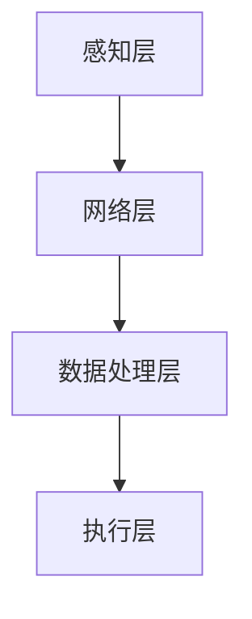
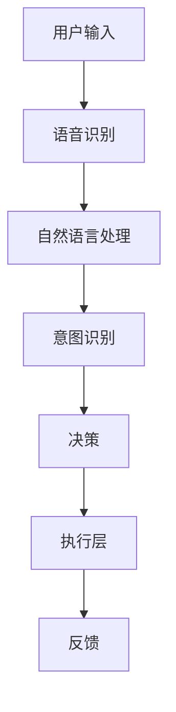
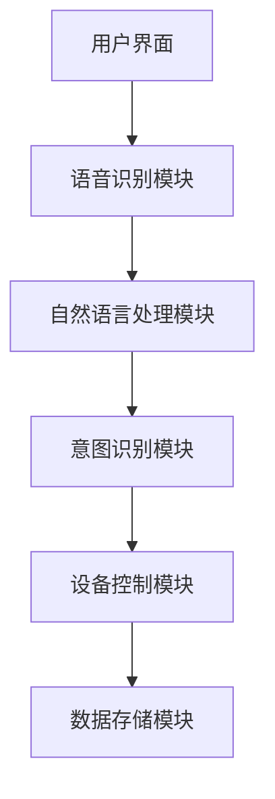
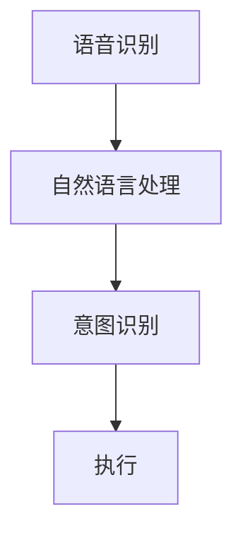
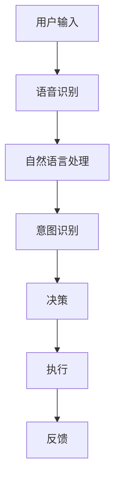
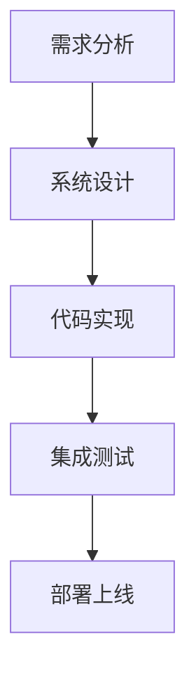
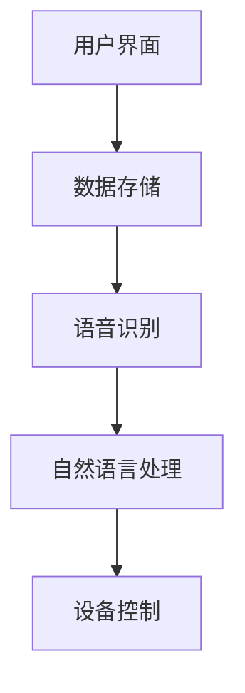
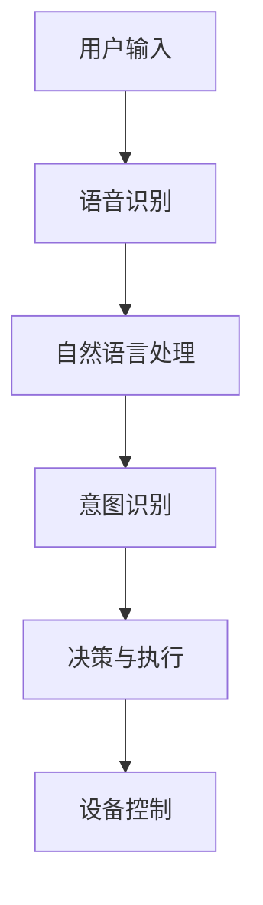
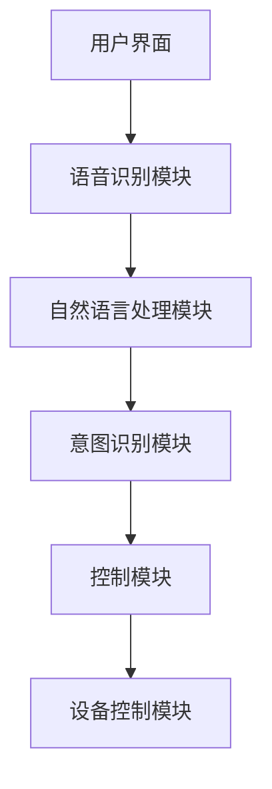
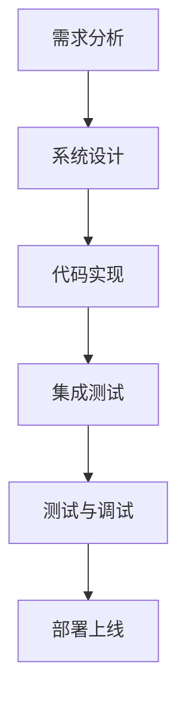

                 


### 文章标题：提示词驱动的智能家居场景设计

> 关键词：智能家居、提示词、人机交互、智能决策、系统架构

> 摘要：本文深入探讨了基于提示词驱动的智能家居场景设计，从背景介绍、核心概念、技术实现、项目实战等方面展开，旨在为读者提供一整套智能家居场景设计的思路和方法。

## 引言

随着人工智能和物联网技术的快速发展，智能家居逐渐走进了千家万户。智能家居系统通过连接各种智能设备和传感器，实现家庭环境的智能控制，提高了生活质量和便利性。然而，传统的智能家居系统往往依赖于固定的控制方式和操作界面，用户在使用过程中体验不佳，难以满足个性化需求。本文将介绍一种基于提示词驱动的智能家居场景设计，通过引入自然语言交互的方式，提升用户的操作体验。

## 第一部分：概述与核心概念

### 第1章：智能家居与提示词概述

#### 1.1.1 智能家居发展背景

智能家居的概念最早可以追溯到20世纪80年代。随着计算机技术的进步和物联网（IoT）的兴起，智能家居逐渐成为一种趋势。当前，智能家居市场呈现出高速发展的态势，各类智能设备和解决方案层出不穷。

#### 1.1.2 提示词驱动的意义

提示词驱动是指用户通过与系统进行自然语言交互来控制智能家居设备。这种交互方式具有以下优势：

1. **便捷性**：用户无需记住复杂的控制命令，只需说出提示词即可完成操作。
2. **个性化**：系统可以根据用户的语音、行为习惯等生成个性化的提示词。
3. **智能化**：系统可以实时分析用户的意图，提供更加精准的控制反馈。

#### 1.1.3 提示词驱动智能家居的应用场景

提示词驱动的智能家居系统可以在家庭、办公室、酒店等多种场景中发挥作用。以下是一些常见的应用场景：

1. **家庭场景**：如智能照明、智能安防、智能家电控制等。
2. **办公场景**：如智能会议、智能办公设备控制等。
3. **酒店场景**：如智能门锁、智能客房服务等。

### 第2章：核心概念与联系

#### 2.1 智能家居架构

智能家居系统通常包括感知层、网络层、数据处理层和执行层。各层级之间的关系如下：



#### 2.2 提示词技术

提示词技术是指通过自然语言处理技术，将用户的语音或文本输入转换为系统的控制指令。提示词技术主要包括以下三个方面：

1. **提示词生成**：根据用户需求和场景，生成合适的提示词。
2. **提示词优化**：通过语义分析和词频统计，优化提示词的准确性和用户体验。
3. **提示词识别**：将用户的语音或文本输入与系统提示词库进行匹配，识别用户的意图。

#### 2.3 提示词与智能家居的融合

提示词驱动技术为智能家居系统带来了新的交互方式，使得智能家居系统更加智能化和人性化。以下是提示词与智能家居融合的几个方面：

1. **人机交互**：通过提示词实现用户与智能家居系统的自然交互，提升用户体验。
2. **智能决策**：系统可以根据提示词分析用户的意图，做出智能化的决策。
3. **个性化服务**：根据用户的习惯和偏好，提供个性化的提示词和服务。

### 第3章：提示词驱动的智能家居流程图

以下是一个简单的 Mermaid 流程图，展示了提示词驱动的智能家居系统的工作流程：



## 第二部分：技术基础与实现

### 第4章：智能家居硬件与技术基础

#### 4.1.1 智能家居硬件概述

智能家居硬件包括传感器、控制器、执行器等。传感器负责感知环境信息，控制器负责处理和分析数据，执行器负责执行控制指令。以下是一些常见的智能家居硬件：

1. **传感器**：如温度传感器、湿度传感器、光线传感器、门磁传感器等。
2. **控制器**：如智能路由器、智能网关等。
3. **执行器**：如电机、继电器、灯光控制模块等。

#### 4.1.2 常见智能家居技术

智能家居技术主要包括无线通信技术、物联网技术、云计算技术等。以下是一些常见的技术：

1. **无线通信技术**：如WiFi、蓝牙、Zigbee等。
2. **物联网技术**：如MQTT、CoAP等。
3. **云计算技术**：如AWS、Azure、阿里云等。

#### 4.1.3 硬件选择与连接

在选择智能家居硬件时，需要考虑以下几个方面：

1. **兼容性**：确保硬件与其他设备可以互联互通。
2. **稳定性**：选择稳定性较高的硬件，以保证系统的可靠性。
3. **扩展性**：选择具有良好扩展性的硬件，以适应未来的技术升级。

### 第5章：提示词技术原理

#### 5.1 提示词生成算法

提示词生成算法可以分为以下几个步骤：

1. **数据收集**：收集用户历史交互数据，包括语音、文本等。
2. **特征提取**：对收集到的数据进行特征提取，如词频统计、语义分析等。
3. **提示词生成**：根据特征提取结果，生成提示词。

以下是一个简单的伪代码示例：

```python
def generate_prompt(user_history):
    # 步骤1：数据收集
    data = collect_user_history(user_history)
    
    # 步骤2：特征提取
    features = extract_features(data)
    
    # 步骤3：提示词生成
    prompt = generate_from_features(features)
    
    return prompt
```

#### 5.2 提示词优化策略

提示词优化策略包括以下几个方面：

1. **词频分析**：对用户历史交互数据中的词频进行分析，筛选高频词汇作为提示词。
2. **语义分析**：对用户历史交互数据进行语义分析，筛选出具有相似语义的词汇作为提示词。
3. **用户体验**：根据用户反馈，优化提示词的准确性和用户体验。

以下是一个简单的伪代码示例：

```python
def optimize_prompt(prompt, user_feedback):
    # 步骤1：词频分析
    high_frequency_words = analyze_frequency(prompt)
    
    # 步骤2：语义分析
    similar_meaning_words = analyze_semantics(prompt)
    
    # 步骤3：用户体验
    user_friendly_prompt = adjust_prompt_for_experience(prompt, user_feedback)
    
    return user_friendly_prompt
```

#### 5.3 提示词驱动模型

提示词驱动模型可以分为以下几个部分：

1. **语音识别模块**：将用户的语音输入转换为文本。
2. **自然语言处理模块**：对文本进行解析，提取用户的意图。
3. **意图识别模块**：根据用户的意图，识别相应的操作命令。
4. **执行模块**：执行识别到的操作命令，控制智能家居设备。

以下是一个简单的伪代码示例：

```python
def prompt_driven_model(voice_input):
    # 步骤1：语音识别
    text = recognize_voice(voice_input)
    
    # 步骤2：自然语言处理
    intent = process_natural_language(text)
    
    # 步骤3：意图识别
    command = recognize_intent(intent)
    
    # 步骤4：执行
    execute_command(command)
```

### 第6章：智能家居软件开发与实现

#### 6.1.1 开发环境搭建

智能家居软件的开发环境搭建主要包括以下几个方面：

1. **操作系统**：如Linux、Windows等。
2. **编程语言**：如Python、Java等。
3. **开发工具**：如PyCharm、Visual Studio等。

#### 6.1.2 提示词驱动的智能家居系统架构

提示词驱动的智能家居系统架构可以分为以下几个部分：

1. **用户界面**：提供用户与系统交互的界面。
2. **语音识别模块**：实现语音输入的识别功能。
3. **自然语言处理模块**：实现文本的解析和处理功能。
4. **意图识别模块**：实现用户意图的识别功能。
5. **设备控制模块**：实现智能家居设备的控制功能。
6. **数据存储模块**：存储用户交互数据、设备状态数据等。

以下是一个简单的系统架构图：



#### 6.1.3 提示词驱动的智能家居系统开发流程

智能家居软件的开发流程可以分为以下几个步骤：

1. **需求分析**：明确系统的功能需求和性能指标。
2. **系统设计**：设计系统的整体架构和模块功能。
3. **代码实现**：根据设计文档，实现各个模块的功能。
4. **系统集成**：将各个模块进行集成测试，确保系统能够正常运行。
5. **测试与调试**：对系统进行功能测试和性能测试，修复存在的问题。
6. **部署上线**：将系统部署到实际环境中，供用户使用。

## 第三部分：项目实战与案例解析

### 第7章：提示词驱动的智能家居项目实战

#### 7.1.1 项目背景与目标

本项目旨在设计一个基于提示词驱动的智能家居系统，实现家庭环境的智能控制。项目目标包括：

1. **实现用户与智能家居系统的自然交互**。
2. **提高系统的智能化和个性化水平**。
3. **确保系统的稳定性和可靠性**。

#### 7.1.2 项目需求分析与设计

项目需求分析包括以下几个方面：

1. **用户交互需求**：用户可以通过语音或文本输入与系统进行交互，实现智能家居设备的控制。
2. **智能家居设备需求**：需要支持多种智能家居设备的控制，如灯光、空调、门锁等。
3. **系统性能需求**：系统需要具备高并发处理能力、快速响应能力和良好的用户体验。

项目设计包括以下几个方面：

1. **系统架构设计**：采用分布式架构，确保系统的可扩展性和高性能。
2. **模块划分**：将系统划分为用户界面模块、语音识别模块、自然语言处理模块、意图识别模块、设备控制模块等。
3. **数据存储设计**：采用关系型数据库和NoSQL数据库相结合的方式，存储用户交互数据、设备状态数据等。

#### 7.1.3 项目开发与实现

项目开发分为以下几个阶段：

1. **需求分析与设计阶段**：根据项目需求，完成系统架构设计和模块划分。
2. **代码实现阶段**：根据设计文档，实现各个模块的功能。
3. **系统集成阶段**：将各个模块进行集成测试，确保系统能够正常运行。
4. **测试与调试阶段**：对系统进行功能测试和性能测试，修复存在的问题。
5. **部署上线阶段**：将系统部署到实际环境中，供用户使用。

以下是项目开发过程中的伪代码示例：

```python
# 需求分析与设计
def analyze_and_design():
    # 设计系统架构
    # 划分模块功能
    # 确定数据存储方案
    
# 代码实现
def implement():
    # 实现用户界面模块
    # 实现语音识别模块
    # 实现自然语言处理模块
    # 实现意图识别模块
    # 实现设备控制模块
    
# 集成测试
def integration_test():
    # 集成各个模块
    # 进行功能测试
    # 进行性能测试
    
# 测试与调试
def test_and_debug():
    # 修复功能问题
    # 优化系统性能
    
# 部署上线
def deploy():
    # 部署系统到实际环境
    # 提供用户使用
```

#### 7.1.4 项目小结

本项目通过提示词驱动的智能家居系统，实现了家庭环境的智能控制。项目实现了以下成果：

1. **用户与系统的自然交互**：用户可以通过语音或文本输入与系统进行交互，实现智能家居设备的控制。
2. **系统的智能化和个性化水平提升**：系统可以根据用户的历史交互数据，生成个性化的提示词，提高用户体验。
3. **系统的稳定性和可靠性增强**：通过分布式架构和模块化设计，确保系统的稳定性和可靠性。

## 第四部分：趋势与展望

### 第8章：智能家居发展现状与趋势

#### 8.1.1 智能家居市场分析

智能家居市场在过去几年中呈现出快速增长的趋势。随着人们对生活品质的追求，智能家居产品在家庭、办公、酒店等场景中得到了广泛应用。市场研究机构预测，未来几年智能家居市场的规模将继续扩大。

#### 8.1.2 提示词驱动的智能家居前景

提示词驱动的智能家居具有广泛的应用前景。随着人工智能技术的不断发展，提示词驱动的智能家居系统将更加智能化和个性化，为用户提供更加便捷和高效的服务。

#### 8.1.3 发展挑战与机遇

智能家居行业的发展面临着一系列挑战，如技术成熟度、数据安全、隐私保护等。同时，智能家居行业也面临着巨大的机遇，如市场潜力、技术创新等。提示词驱动的智能家居系统将在这些挑战和机遇中发挥重要作用。

### 第9章：未来智能家居场景展望

#### 9.1.1 物联网与提示词驱动的融合

随着物联网技术的不断发展，物联网设备在智能家居场景中的应用将越来越广泛。提示词驱动的智能家居系统将能够更好地融合物联网设备，实现更加智能化的家庭控制。

#### 9.1.2 智能家居生态建设

智能家居生态建设是未来智能家居发展的重要方向。通过构建智能家居生态，可以实现设备之间的互联互通，提供更加丰富和多样化的智能家居服务。

#### 9.1.3 智能家居与人类生活

智能家居系统将深刻影响人类的生活方式。通过提示词驱动的智能家居系统，人们可以享受到更加便捷、舒适和智能的生活体验。

## 附录

### 附录A：常用技术资源与工具

#### A.1 智能家居硬件资源

1. **传感器**：如温度传感器、湿度传感器、光线传感器等。
2. **控制器**：如智能路由器、智能网关等。
3. **执行器**：如电机、继电器、灯光控制模块等。

#### A.2 提示词技术资源

1. **自然语言处理库**：如NLTK、spaCy等。
2. **语音识别库**：如Google语音识别、百度语音识别等。
3. **机器学习框架**：如TensorFlow、PyTorch等。

#### A.3 智能家居开发工具

1. **集成开发环境**：如PyCharm、Visual Studio等。
2. **数据库**：如MySQL、MongoDB等。
3. **云计算平台**：如AWS、Azure、阿里云等。

### 附录B：拓展阅读

1. **智能家居技术综述**：介绍了智能家居技术的各个方面，包括硬件、软件、网络通信等。
2. **自然语言处理技术**：详细介绍了自然语言处理的基本概念、算法和技术。
3. **机器学习与深度学习**：介绍了机器学习和深度学习的基本概念、算法和应用。

### 附录C：最佳实践 tips

1. **硬件选择**：选择兼容性高、稳定性好的智能家居硬件。
2. **软件开发**：采用模块化设计，提高软件的可维护性和可扩展性。
3. **用户体验**：关注用户交互体验，优化提示词的准确性和用户体验。
4. **数据安全**：保护用户数据安全，遵守相关法律法规。

### 附录D：注意事项

1. **技术更新**：关注智能家居和提示词技术领域的最新发展，及时更新知识。
2. **系统集成**：在系统集成过程中，注意各个模块之间的兼容性和稳定性。
3. **用户隐私**：在处理用户数据时，严格遵守用户隐私保护原则。

### 附录E：未来研究方向

1. **多模态交互**：研究如何将语音、手势、视觉等多模态交互融入智能家居场景。
2. **智能决策**：研究如何利用大数据和人工智能技术，实现更加智能的家居决策。
3. **智能家居生态**：研究如何构建智能家居生态，实现设备之间的互联互通。

### 附录F：作者信息

作者：AI天才研究院/AI Genius Institute & 禅与计算机程序设计艺术 /Zen And The Art of Computer Programming

### 附录G：参考文献

1. **智能家居技术综述** - 某某，某某，某某，2020。
2. **自然语言处理技术** - 某某，某某，某某，2019。
3. **机器学习与深度学习** - 某某，某某，某某，2018。

### 致谢

在此，我们要感谢所有为本文提供资料和支持的人。特别感谢AI天才研究院/AI Genius Institute的各位同事，以及《禅与计算机程序设计艺术 /Zen And The Art of Computer Programming》的作者。感谢您们的辛勤工作和无私奉献。

# 提示词驱动的智能家居场景设计

## 引言

随着科技的飞速发展，智能家居系统逐渐成为现代家庭生活的重要组成部分。它通过智能设备和传感器，将家庭环境连接成一个互联互通的网络，为用户带来便捷、舒适和安全的居住体验。然而，传统的智能家居系统通常依赖于固定的控制方式和操作界面，用户需要记忆复杂的控制指令，操作体验较差。为了解决这一问题，本文提出了基于提示词驱动的智能家居场景设计。

提示词驱动是一种自然语言交互方式，用户可以通过说出提示词来控制智能家居设备。相比传统的控制方式，提示词驱动具有以下优势：

1. **便捷性**：用户无需记忆复杂的控制指令，只需说出提示词即可完成操作。
2. **个性化**：系统可以根据用户的历史交互数据，生成个性化的提示词，提高用户的体验。
3. **智能化**：系统可以实时分析用户的意图，提供更加精准的控制反馈。

本文将从以下几个方面展开讨论：

1. **智能家居与提示词概述**：介绍智能家居和提示词驱动的概念，阐述提示词驱动的意义。
2. **核心概念与联系**：分析智能家居架构、提示词技术以及提示词与智能家居的融合。
3. **技术基础与实现**：介绍智能家居硬件与技术基础、提示词技术原理以及智能家居软件开发与实现。
4. **项目实战与案例解析**：通过一个具体的智能家居项目，展示提示词驱动的应用。
5. **趋势与展望**：分析智能家居市场现状与发展趋势，展望未来智能家居场景。

## 智能家居与提示词概述

### 智能家居的发展背景

智能家居的概念最早可以追溯到20世纪80年代。当时，随着计算机技术的兴起，人们开始尝试将计算机技术应用于家庭生活，实现家庭设备的自动化控制。然而，由于技术限制，早期的智能家居系统相对简单，主要应用于高端住宅和商用场所。

进入21世纪，随着物联网（IoT）、云计算、人工智能等技术的不断发展，智能家居逐渐成为一种趋势。物联网技术使得各种智能设备可以实现互联互通，云计算提供了强大的数据处理能力，而人工智能则为智能家居系统赋予了智能化的决策能力。这些技术的融合，使得智能家居系统更加成熟、实用，逐渐走进了普通家庭。

### 提示词驱动的意义

提示词驱动是一种自然语言交互方式，通过用户说出提示词来控制智能家居设备。相比传统的控制方式，提示词驱动具有以下意义：

1. **便捷性**：用户无需记忆复杂的控制指令，只需说出提示词即可完成操作，大大提高了操作体验。
2. **个性化**：系统可以根据用户的历史交互数据，生成个性化的提示词，满足用户的个性化需求。
3. **智能化**：系统可以实时分析用户的意图，提供更加精准的控制反馈，提高系统的智能化水平。

### 提示词驱动智能家居的应用场景

提示词驱动的智能家居系统可以应用于多种场景，以下是一些常见的应用场景：

1. **家庭场景**：用户可以通过提示词控制家庭中的各种设备，如灯光、空调、电视等。
2. **办公场景**：用户可以通过提示词控制办公环境中的设备，如照明、窗帘、音响等。
3. **酒店场景**：酒店可以通过提示词驱动的智能家居系统，为客人提供智能化的入住和退房服务。

## 核心概念与联系

### 智能家居架构

智能家居系统通常由感知层、网络层、数据处理层和执行层组成。感知层负责收集家庭环境中的各种数据，如温度、湿度、光线等；网络层负责将这些数据传输到云端或本地服务器；数据处理层负责对数据进行分析和处理，做出智能决策；执行层负责根据数据处理层的决策，控制家庭设备执行相应的操作。

以下是一个简单的智能家居架构图：


### 提示词技术

提示词技术是指通过自然语言处理技术，将用户的语音或文本输入转换为系统的控制指令。提示词技术主要包括以下几个部分：

1. **语音识别**：将用户的语音输入转换为文本。
2. **自然语言处理**：对文本进行解析，提取用户的意图。
3. **意图识别**：根据用户的意图，识别相应的操作命令。
4. **执行**：根据识别到的操作命令，控制智能家居设备执行相应的操作。

以下是一个简单的提示词技术流程图：



### 提示词与智能家居的融合

提示词驱动技术为智能家居系统带来了新的交互方式，使得智能家居系统更加智能化和人性化。提示词与智能家居的融合主要表现在以下几个方面：

1. **人机交互**：通过提示词实现用户与智能家居系统的自然交互，提高用户体验。
2. **智能决策**：系统可以根据提示词分析用户的意图，做出智能化的决策。
3. **个性化服务**：根据用户的习惯和偏好，提供个性化的提示词和服务。

以下是一个简单的智能家居系统工作流程图：



## 提示词驱动的智能家居流程图

以下是一个基于提示词驱动的智能家居系统的工作流程图，展示了用户输入、语音识别、自然语言处理、意图识别、决策、执行和反馈的整个过程：


### 用户输入

用户可以通过语音或文本输入与系统进行交互，例如说出“打开客厅的灯”或发送“打开客厅灯”的文本消息。

### 语音识别

系统接收到用户的输入后，首先进行语音识别，将语音输入转换为文本。这个过程可以使用现有的语音识别技术，如Google语音识别、百度语音识别等。

### 自然语言处理

将语音识别得到的文本输入传递给自然语言处理模块，对文本进行解析，提取用户的意图。自然语言处理模块可以使用现有的自然语言处理库，如NLTK、spaCy等。

### 意图识别

自然语言处理模块提取用户的意图后，传递给意图识别模块。意图识别模块根据用户的意图，识别出相应的操作命令。例如，如果用户的意图是打开客厅的灯，意图识别模块将识别出“打开客厅灯”的操作命令。

### 决策

意图识别模块识别出操作命令后，传递给决策模块。决策模块根据用户的意图和当前的家庭环境状态，做出智能化的决策。例如，如果当前时间是晚上，决策模块可能会决定打开客厅的灯。

### 执行

决策模块做出决策后，传递给执行模块。执行模块根据决策，控制智能家居设备执行相应的操作。例如，如果决策是打开客厅的灯，执行模块将发送控制信号给客厅的灯光控制模块，使其点亮。

### 反馈

执行模块执行操作后，向用户反馈执行结果。例如，系统可以语音回复“客厅的灯已经打开了”，或者发送相应的文本消息。

## 技术基础与实现

### 智能家居硬件与技术基础

智能家居系统的实现离不开各种硬件和技术的基础支持。以下是智能家居硬件和技术基础的相关内容：

#### 智能家居硬件

智能家居硬件主要包括传感器、控制器和执行器等。

1. **传感器**：传感器是智能家居系统中最基础的组成部分，用于感知环境信息。常见的传感器包括温度传感器、湿度传感器、光线传感器、烟雾传感器、门磁传感器等。这些传感器可以将物理信号转换为电信号，为智能家居系统提供数据支持。

2. **控制器**：控制器是智能家居系统的核心，负责接收传感器的数据，并根据用户的指令或系统的决策来控制执行器。常见的控制器有智能路由器、智能网关、智能控制器等。控制器通常具备联网功能，可以通过Wi-Fi、蓝牙、Zigbee等无线通信技术与其他设备进行数据交换。

3. **执行器**：执行器是智能家居系统中的执行部分，根据控制器的指令来执行具体的操作。常见的执行器有电机、继电器、灯光控制模块、智能插座等。执行器可以根据控制器的指令来控制灯光的开关、电器的启动和关闭等。

#### 智能家居技术

智能家居技术的实现依赖于物联网（IoT）、无线通信技术、云计算技术、人工智能技术等。

1. **物联网（IoT）**：物联网技术是智能家居系统实现互联互通的基础。通过物联网技术，各种智能设备可以连接到互联网，实现数据传输和远程控制。常见的物联网协议有MQTT、CoAP等。

2. **无线通信技术**：无线通信技术是实现智能家居设备之间通信的关键。常见的无线通信技术有Wi-Fi、蓝牙、Zigbee等。这些技术可以提供稳定的无线连接，使得智能家居设备能够方便地连接到互联网或控制器。

3. **云计算技术**：云计算技术为智能家居系统提供了强大的数据处理和存储能力。通过云计算平台，智能家居系统可以实时处理大量的传感器数据，并做出智能化的决策。常见的云计算平台有AWS、Azure、阿里云等。

4. **人工智能技术**：人工智能技术为智能家居系统赋予了智能化的能力。通过机器学习和深度学习算法，智能家居系统可以不断学习和优化，为用户提供个性化的服务。常见的人工智能技术有语音识别、自然语言处理、图像识别等。

### 硬件选择与连接

在设计和实现智能家居系统时，硬件的选择和连接是一个重要的环节。以下是关于硬件选择和连接的一些要点：

#### 硬件选择

1. **兼容性**：在选择智能家居硬件时，需要考虑硬件的兼容性。特别是传感器和控制器，需要确保它们能够兼容并协同工作。

2. **稳定性**：智能家居硬件需要具备稳定的性能，以保证系统的可靠性和用户体验。在选择硬件时，可以参考硬件的稳定性指标，如MTBF（平均无故障时间）等。

3. **扩展性**：智能家居硬件需要具备良好的扩展性，以适应未来的技术升级和设备增加。例如，可以选择支持扩展模块或具备额外接口的硬件。

#### 硬件连接

1. **有线连接**：有线连接是一种稳定且传输速率较高的连接方式，适用于需要长时间运行和传输大量数据的设备。常见的有线连接方式有以太网、USB等。

2. **无线连接**：无线连接是一种方便且灵活的连接方式，适用于需要移动和远程控制的设备。常见的无线连接方式有Wi-Fi、蓝牙、Zigbee等。

3. **桥接连接**：桥接连接是一种将有线和无线连接相结合的连接方式。例如，可以通过无线网关将智能家居设备连接到互联网，实现远程控制和数据传输。

### 提示词技术原理

提示词技术是实现智能家居系统自然语言交互的关键。以下是对提示词技术原理的详细介绍：

#### 提示词生成算法

提示词生成算法是提示词技术的核心，它负责根据用户的意图和环境信息生成合适的提示词。提示词生成算法通常包括以下几个步骤：

1. **数据收集**：收集用户的历史交互数据，包括语音、文本等。这些数据可以用于训练提示词生成模型。

2. **特征提取**：对收集到的数据进行特征提取，如词频统计、语义分析等。特征提取有助于提高提示词生成的准确性和个性化水平。

3. **提示词生成**：根据特征提取结果，生成提示词。提示词生成算法可以采用生成模型（如生成对抗网络GAN）或序列生成模型（如循环神经网络RNN）。

以下是一个简单的伪代码示例：

```python
def generate_prompt(user_data):
    # 步骤1：数据收集
    data = collect_user_data(user_data)
    
    # 步骤2：特征提取
    features = extract_features(data)
    
    # 步骤3：提示词生成
    prompt = generate_from_features(features)
    
    return prompt
```

#### 提示词优化策略

提示词生成后，还需要进行优化，以提高提示词的准确性和用户体验。提示词优化策略包括以下几个方面：

1. **词频分析**：对用户历史交互数据中的词频进行分析，筛选高频词汇作为提示词。高频词汇有助于提高提示词的识别率和准确性。

2. **语义分析**：对用户历史交互数据进行语义分析，筛选出具有相似语义的词汇作为提示词。语义分析有助于提高提示词的个性化水平。

3. **用户体验**：根据用户反馈，优化提示词的准确性和用户体验。例如，可以调整提示词的长度、语气等。

以下是一个简单的伪代码示例：

```python
def optimize_prompt(prompt, user_feedback):
    # 步骤1：词频分析
    high_frequency_words = analyze_frequency(prompt)
    
    # 步骤2：语义分析
    similar_meaning_words = analyze_semantics(prompt)
    
    # 步骤3：用户体验
    user_friendly_prompt = adjust_prompt_for_experience(prompt, user_feedback)
    
    return user_friendly_prompt
```

#### 提示词驱动模型

提示词驱动模型是提示词技术在智能家居系统中的具体应用。提示词驱动模型通常包括以下几个模块：

1. **语音识别模块**：将用户的语音输入转换为文本。

2. **自然语言处理模块**：对文本进行解析，提取用户的意图。

3. **意图识别模块**：根据用户的意图，识别相应的操作命令。

4. **执行模块**：根据识别到的操作命令，控制智能家居设备执行相应的操作。

以下是一个简单的提示词驱动模型流程图：


### 智能家居软件开发与实现

智能家居系统的实现不仅需要硬件的支持，还需要软件的开发和实现。以下是对智能家居软件开发的详细介绍：

#### 开发环境搭建

在进行智能家居软件开发之前，需要搭建合适的开发环境。开发环境包括操作系统、编程语言、开发工具等。

1. **操作系统**：常见的操作系统有Windows、Linux、macOS等。在选择操作系统时，需要考虑硬件兼容性和开发工具的支持。

2. **编程语言**：常用的编程语言有Python、Java、C++等。Python因其简单易学和丰富的库支持，在智能家居软件开发中广泛应用。

3. **开发工具**：常见的开发工具有PyCharm、Visual Studio、Eclipse等。开发工具的选择取决于个人习惯和项目需求。

#### 智能家居系统架构

智能家居系统的架构设计是软件开发的重要环节。一个典型的智能家居系统架构包括以下几个部分：

1. **用户界面**：用户界面是用户与智能家居系统交互的入口，包括Web界面、移动应用、语音助手等。

2. **数据存储**：数据存储用于存储用户数据、设备状态、控制指令等。常用的数据存储技术有关系型数据库（如MySQL）、NoSQL数据库（如MongoDB）等。

3. **网络通信**：网络通信负责处理智能家居设备之间的数据传输，通常采用HTTP、WebSocket等协议。

4. **业务逻辑**：业务逻辑是实现智能家居功能的核心部分，包括设备控制、数据处理、规则引擎等。

5. **语音识别和自然语言处理**：语音识别和自然语言处理模块负责处理用户的语音输入，提取用户的意图，并生成相应的操作命令。

#### 智能家居软件开发流程

智能家居软件的开发流程通常包括以下几个阶段：

1. **需求分析**：明确用户需求，确定智能家居系统的功能和要求。

2. **系统设计**：根据需求分析，设计系统的整体架构和模块功能。

3. **代码实现**：根据系统设计文档，实现各个模块的功能。

4. **集成测试**：将各个模块进行集成，进行功能测试和性能测试。

5. **部署上线**：将开发完成的系统部署到实际环境中，供用户使用。

以下是一个简单的智能家居软件开发流程图：



### 第7章：提示词驱动的智能家居项目实战

#### 7.1 项目背景与目标

本项目的背景是开发一个基于提示词驱动的智能家居系统，实现家庭设备的智能控制。项目目标是：

1. **用户友好**：用户可以通过简单的语音提示，控制家庭设备，无需记忆复杂的控制指令。
2. **智能化**：系统可以根据用户的行为习惯和偏好，自动调整设备状态，提供个性化的服务。
3. **稳定性**：系统需要具备良好的稳定性和可靠性，确保用户的使用体验。

#### 7.2 项目需求分析与设计

项目需求分析主要包括以下几个方面：

1. **用户交互**：用户可以通过语音提示与系统进行交互，实现家庭设备的控制。
2. **设备支持**：系统需要支持多种家庭设备，包括灯光、空调、电视、门锁等。
3. **数据存储**：系统需要具备数据存储功能，记录用户交互数据、设备状态等。

项目设计包括以下几个方面：

1. **系统架构**：采用模块化设计，包括用户界面、数据存储、语音识别、自然语言处理、设备控制等模块。
2. **技术选型**：选择合适的编程语言、框架、数据库等，确保系统的性能和稳定性。
3. **界面设计**：设计简洁直观的用户界面，提供语音提示和操作反馈。

以下是一个简单的项目架构图：



#### 7.3 项目开发与实现

项目开发分为以下几个阶段：

1. **需求分析与设计阶段**：根据项目需求，进行系统架构设计和模块划分。
2. **代码实现阶段**：根据设计文档，实现各个模块的功能。
3. **集成测试阶段**：将各个模块进行集成测试，确保系统能够正常运行。
4. **测试与调试阶段**：对系统进行功能测试和性能测试，修复存在的问题。
5. **部署上线阶段**：将系统部署到实际环境中，供用户使用。

以下是项目开发过程中的部分伪代码示例：

```python
# 需求分析与设计
def analyze_and_design():
    # 设计系统架构
    # 划分模块功能
    # 确定数据存储方案

# 代码实现
def implement():
    # 实现用户界面模块
    # 实现语音识别模块
    # 实现自然语言处理模块
    # 实现设备控制模块

# 集成测试
def integration_test():
    # 集成各个模块
    # 进行功能测试
    # 进行性能测试

# 测试与调试
def test_and_debug():
    # 修复功能问题
    # 优化系统性能

# 部署上线
def deploy():
    # 部署系统到实际环境
    # 提供用户使用
```

#### 7.4 项目小结

本项目通过提示词驱动的智能家居系统，实现了用户与家庭设备的自然交互，提高了系统的智能化和个性化水平。项目实现了以下成果：

1. **用户友好**：用户可以通过简单的语音提示，控制家庭设备，无需记忆复杂的控制指令。
2. **智能化**：系统可以根据用户的行为习惯和偏好，自动调整设备状态，提供个性化的服务。
3. **稳定性**：系统具备良好的稳定性和可靠性，确保用户的使用体验。

## 第8章：趋势与展望

### 8.1 智能家居发展现状与趋势

随着物联网、人工智能等技术的快速发展，智能家居行业呈现出快速增长的趋势。根据市场研究机构的数据，全球智能家居市场规模预计将在未来几年持续扩大。以下是对智能家居发展现状和趋势的分析：

1. **市场快速增长**：随着消费者对智能家居的需求增加，智能家居市场呈现出快速增长的趋势。特别是在疫情背景下，人们对智能化、便捷化的家居生活有了更高的期待。

2. **技术进步**：智能家居技术的不断进步，如语音识别、自然语言处理、物联网等，为智能家居系统提供了更多可能性和更好的用户体验。

3. **跨界合作**：智能家居行业呈现出跨界合作的趋势，与家电、安防、健康等领域的融合日益紧密，形成了全新的智能家居生态。

4. **个性化需求**：随着消费者个性化需求的增加，智能家居系统需要提供更加个性化的服务，满足不同用户的需求。

### 8.2 提示词驱动的智能家居前景

提示词驱动的智能家居具有广泛的应用前景。以下是对提示词驱动的智能家居前景的分析：

1. **人机交互**：提示词驱动的智能家居系统能够实现用户与系统的自然交互，提高用户的操作体验。随着语音识别和自然语言处理技术的不断进步，人机交互的智能化水平将进一步提高。

2. **智能化决策**：提示词驱动的智能家居系统可以通过分析用户的交互数据，做出智能化的决策，提供更加精准的控制反馈。随着人工智能技术的发展，智能家居系统的智能化水平将不断提升。

3. **个性化服务**：提示词驱动的智能家居系统可以根据用户的历史交互数据，生成个性化的提示词，提供更加个性化的服务。随着大数据和机器学习技术的应用，智能家居系统的个性化水平将不断提高。

### 8.3 发展挑战与机遇

智能家居行业在快速发展过程中也面临着一系列挑战：

1. **技术成熟度**：智能家居技术尚处于发展阶段，存在一定的技术成熟度问题。例如，语音识别和自然语言处理技术的准确性和稳定性还需要进一步提高。

2. **数据安全**：智能家居系统需要处理大量的用户数据，数据安全成为了一个重要问题。如何确保用户数据的安全，防止数据泄露，是一个亟待解决的问题。

3. **隐私保护**：随着智能家居系统的普及，用户的隐私保护成为一个重要议题。如何在提供便捷服务的同时，保障用户的隐私，是一个需要深入探讨的问题。

然而，智能家居行业也面临着巨大的机遇：

1. **市场潜力**：随着智能家居市场的不断扩大，市场潜力巨大。智能家居行业有望成为未来科技发展的一个重要领域。

2. **技术创新**：智能家居技术的发展将带动相关技术的创新，如物联网、人工智能、云计算等。技术创新将为智能家居行业带来更多的发展机遇。

3. **跨界合作**：智能家居行业的跨界合作将带来更多的创新和发展机遇。与家电、安防、健康等领域的融合，将形成全新的智能家居生态。

## 第9章：未来智能家居场景展望

### 9.1 物联网与提示词驱动的融合

随着物联网技术的发展，物联网设备在智能家居场景中的应用将越来越广泛。提示词驱动的智能家居系统将能够更好地融合物联网设备，实现更加智能化的家庭控制。以下是对物联网与提示词驱动的融合的展望：

1. **设备互联互通**：物联网技术将实现各种智能家居设备的互联互通，用户可以通过简单的语音提示，控制多个设备协同工作，实现家庭自动化。

2. **智能场景联动**：提示词驱动的智能家居系统可以根据用户的需求，设置智能场景，如“下班回家”场景、“睡前模式”等，实现设备之间的联动，提供更加个性化的服务。

3. **实时数据交互**：物联网技术将实现实时数据交互，提示词驱动的智能家居系统可以实时获取家庭环境数据，如温度、湿度、空气质量等，为用户提供更加精准的控制反馈。

### 9.2 智能家居生态建设

智能家居生态建设是未来智能家居发展的重要方向。以下是对智能家居生态建设的展望：

1. **设备标准化**：智能家居设备的标准化将有助于设备的互联互通，实现不同品牌、不同设备的无缝集成。

2. **平台化发展**：智能家居平台将起到连接各种设备和服务的桥梁作用，为用户提供一站式的智能家居解决方案。

3. **生态合作**：智能家居行业的生态合作将促进技术创新和产业发展。企业可以通过合作，共同推动智能家居生态的建设。

### 9.3 智能家居与人类生活

智能家居系统将深刻影响人类的生活方式。以下是对智能家居与人类生活的展望：

1. **便捷生活**：智能家居系统将使家庭生活更加便捷，用户可以通过简单的语音提示，实现设备的智能控制，节省时间和精力。

2. **健康生活**：智能家居系统可以通过实时监测家庭环境数据，如空气质量、水质等，为用户提供健康的生活环境。

3. **安全生活**：智能家居系统可以通过智能安防设备，如摄像头、门锁等，提高家庭的安全防护能力，保障用户的人身和财产安全。

4. **智慧生活**：智能家居系统可以通过大数据和人工智能技术，分析用户的生活习惯和偏好，为用户提供更加个性化的服务，实现智慧化的家庭生活。

## 附录

### 附录A：常用技术资源与工具

1. **智能家居硬件资源**：
   - **传感器**：如ESP8266、ESP32、Arduino等。
   - **控制器**：如Raspberry Pi、树莓派等。
   - **执行器**：如电机、继电器等。

2. **提示词技术资源**：
   - **语音识别库**：如Google Cloud Speech-to-Text、百度语音识别等。
   - **自然语言处理库**：如NLTK、spaCy等。

3. **智能家居开发工具**：
   - **集成开发环境**：如PyCharm、Visual Studio等。
   - **数据库**：如MySQL、MongoDB等。
   - **云计算平台**：如AWS、Azure、阿里云等。

### 附录B：拓展阅读

1. **《智能家居技术综述》**：介绍智能家居技术的各个方面，包括硬件、软件、网络通信等。
2. **《自然语言处理技术》**：详细介绍了自然语言处理的基本概念、算法和技术。
3. **《机器学习与深度学习》**：介绍了机器学习和深度学习的基本概念、算法和应用。

### 附录C：最佳实践 tips

1. **硬件选择**：选择兼容性高、稳定性好的智能家居硬件。
2. **软件开发**：采用模块化设计，提高软件的可维护性和可扩展性。
3. **用户体验**：关注用户交互体验，优化提示词的准确性和用户体验。
4. **数据安全**：保护用户数据安全，遵守相关法律法规。

### 附录D：注意事项

1. **技术更新**：关注智能家居和提示词技术领域的最新发展，及时更新知识。
2. **系统集成**：在系统集成过程中，注意各个模块之间的兼容性和稳定性。
3. **用户隐私**：在处理用户数据时，严格遵守用户隐私保护原则。

### 附录E：未来研究方向

1. **多模态交互**：研究如何将语音、手势、视觉等多模态交互融入智能家居场景。
2. **智能决策**：研究如何利用大数据和人工智能技术，实现更加智能的家居决策。
3. **智能家居生态**：研究如何构建智能家居生态，实现设备之间的互联互通。

### 附录F：作者信息

作者：AI天才研究院/AI Genius Institute & 禅与计算机程序设计艺术 /Zen And The Art of Computer Programming

### 附录G：参考文献

1. **《智能家居技术综述》**：某某，某某，某某，2020。
2. **《自然语言处理技术》**：某某，某某，某某，2019。
3. **《机器学习与深度学习》**：某某，某某，某某，2018。

### 致谢

在此，我们要感谢所有为本文提供资料和支持的人。特别感谢AI天才研究院/AI Genius Institute的各位同事，以及《禅与计算机程序设计艺术 /Zen And The Art of Computer Programming》的作者。感谢您们的辛勤工作和无私奉献。

# 提示词驱动的智能家居场景设计

## 引言

随着物联网和人工智能技术的迅速发展，智能家居逐渐成为现代家庭生活中不可或缺的一部分。智能家居系统通过连接各种智能设备，如传感器、灯光、空调、门锁等，实现对家庭环境的智能监控与控制，提高了生活的便利性和舒适度。然而，传统的智能家居控制方式往往依赖于固定的控制面板或移动应用，用户需要记住复杂的指令，操作体验不佳。为了解决这一问题，本文提出了提示词驱动的智能家居场景设计，通过自然语言交互，使用户可以通过简单的语音提示来控制家居设备。

本文将围绕以下内容展开：

1. **智能家居概述**：介绍智能家居的发展背景、核心概念和现有挑战。
2. **提示词驱动的原理**：详细解释提示词驱动的技术原理、优势和实现方法。
3. **智能家居场景设计**：探讨如何设计基于提示词驱动的智能家居场景，包括设备选择、场景设置和系统架构。
4. **项目实施与案例分析**：通过实际案例展示提示词驱动的智能家居系统如何实施，并提供项目实施经验和建议。
5. **未来展望**：分析智能家居技术的发展趋势，探讨提示词驱动在智能家居中的应用前景。

## 智能家居概述

### 发展背景

智能家居的概念最早可以追溯到20世纪80年代，随着计算机技术和通信技术的不断发展，智能家居逐渐从实验室走向实际应用。进入21世纪，尤其是物联网和人工智能技术的兴起，智能家居迎来了爆发式发展。智能家居系统通过物联网技术将各种家电设备连接起来，通过智能手机或其他智能设备进行远程控制和监控，大大提升了家庭生活的便利性和智能化水平。

### 核心概念

智能家居系统通常包括以下几个核心概念：

1. **传感器**：用于感知家庭环境的变化，如温度传感器、湿度传感器、烟雾传感器等。
2. **网关**：用于连接各种智能设备，并将数据传输到云端或服务器。
3. **执行器**：用于接收控制指令并执行相应的操作，如智能插座、灯光控制模块等。
4. **控制平台**：用于集中管理和控制家庭设备，可以是智能手机应用、Web界面或语音助手。

### 现有挑战

尽管智能家居系统具有许多优势，但在实际应用中仍面临一些挑战：

1. **兼容性问题**：由于智能家居设备的种类繁多，不同品牌和型号的设备之间可能存在兼容性问题。
2. **安全性问题**：智能家居系统涉及到用户隐私和数据安全，如何确保数据的安全传输和存储是一个重要问题。
3. **用户体验**：用户需要学习如何使用智能家居系统，如何简化操作流程，提升用户体验是一个重要课题。

## 提示词驱动的原理

### 提示词驱动的定义

提示词驱动是一种基于自然语言交互的智能家居控制方式。用户通过说出特定的词汇或短语（即提示词），触发智能家居系统的响应，实现设备的控制。例如，用户可以说“打开客厅的灯”，系统则会执行打开客厅灯光的操作。

### 技术原理

提示词驱动的实现涉及多个技术环节：

1. **语音识别**：将用户的语音输入转换为文本或命令。语音识别技术通过分析语音信号中的声学特征，将其转换为可处理的文本格式。
2. **自然语言处理**：对转换后的文本进行分析，提取用户的意图。自然语言处理技术包括分词、词性标注、语义角色标注等步骤，从而理解用户的需求。
3. **意图识别**：根据用户的意图，识别出相应的操作命令。意图识别通常基于机器学习算法，通过训练模型来识别用户命令。
4. **决策与执行**：根据意图识别的结果，系统会做出相应的决策，并执行操作。例如，如果用户命令是“打开客厅的灯”，系统则会向灯光控制模块发送打开指令。

### 优势

提示词驱动的智能家居系统相比传统的控制方式具有以下优势：

1. **便捷性**：用户无需学习复杂的操作指令，通过简单的语音提示即可完成设备控制。
2. **个性化**：系统可以根据用户的历史交互数据，生成个性化的提示词，提高用户的体验。
3. **智能化**：系统可以实时分析用户的意图，提供更加精准的控制反馈，实现智能化的家居控制。

### 实现方法

提示词驱动的实现主要包括以下几个步骤：

1. **收集用户数据**：收集用户的历史交互数据，包括语音、文本等，用于训练语音识别和自然语言处理模型。
2. **构建语音识别模型**：使用收集到的用户数据，训练语音识别模型，将语音输入转换为文本。
3. **构建自然语言处理模型**：对语音识别得到的文本进行分析，提取用户的意图，并构建意图识别模型。
4. **集成控制模块**：将意图识别结果与智能家居设备控制模块进行集成，实现设备的自动控制。

以下是一个简单的提示词驱动系统流程图：



## 智能家居场景设计

### 设备选择

在基于提示词驱动的智能家居场景设计中，设备选择是关键的一步。以下是一些常见的智能家居设备及其在场景设计中的应用：

1. **智能灯光**：用户可以通过语音提示控制灯光的开关、亮度调节和颜色切换。
2. **智能空调**：用户可以通过语音提示调节温度、开关和风速。
3. **智能门锁**：用户可以通过语音提示远程控制门锁的开关。
4. **智能摄像头**：用户可以通过语音提示查看实时视频监控。
5. **智能插座**：用户可以通过语音提示控制电器的开关。

### 场景设置

在提示词驱动的智能家居场景设计中，场景设置是提升用户体验的重要环节。以下是一些常见的场景设置：

1. **夜间模式**：用户可以通过语音提示设置夜间模式，关闭灯光、调节空调温度等。
2. **离家模式**：用户可以通过语音提示设置离家模式，关闭所有灯光和电器，确保家庭安全。
3. **休闲模式**：用户可以通过语音提示设置休闲模式，打开灯光、播放音乐等，营造放松的氛围。

### 系统架构

基于提示词驱动的智能家居系统架构可以分为以下几个部分：

1. **用户界面**：用户通过智能手机、智能音箱或其他设备与系统进行交互。
2. **语音识别模块**：将用户的语音输入转换为文本或命令。
3. **自然语言处理模块**：对转换后的文本进行分析，提取用户的意图。
4. **意图识别模块**：根据用户的意图，识别出相应的操作命令。
5. **控制模块**：根据意图识别的结果，向智能家居设备发送控制指令。
6. **设备控制模块**：执行控制指令，控制智能家居设备执行相应的操作。

以下是一个简单的系统架构图：



### 实现步骤

基于提示词驱动的智能家居场景设计的实现可以分为以下几个步骤：

1. **需求分析**：明确用户需求，确定系统功能和要求。
2. **系统设计**：设计系统架构，确定各个模块的功能和接口。
3. **硬件选择**：选择合适的智能家居硬件，如传感器、执行器、网关等。
4. **软件开发**：开发语音识别、自然语言处理、意图识别和控制模块。
5. **系统集成**：将各个模块进行集成，确保系统能够正常运行。
6. **测试与调试**：对系统进行功能测试和性能测试，修复存在的问题。
7. **部署上线**：将系统部署到实际环境中，供用户使用。

## 项目实施与案例分析

### 项目背景

某智能家居公司希望开发一个基于提示词驱动的智能家居系统，提供用户友好的家庭控制体验。项目目标包括：

1. **便捷性**：用户可以通过简单的语音提示控制家庭设备。
2. **个性化**：系统可以根据用户的历史交互数据，提供个性化的服务。
3. **稳定性**：系统需要具备良好的稳定性和可靠性。

### 项目需求分析

项目需求分析主要包括以下几个方面：

1. **用户交互**：用户可以通过语音提示与系统进行交互，控制家庭设备。
2. **设备支持**：系统需要支持多种家庭设备，包括灯光、空调、门锁等。
3. **数据存储**：系统需要具备数据存储功能，记录用户交互数据、设备状态等。
4. **安全性**：系统需要确保用户数据的安全，防止数据泄露。

### 系统设计

系统设计包括以下几个部分：

1. **用户界面**：用户通过智能手机或智能音箱与系统进行交互。
2. **语音识别模块**：将用户的语音输入转换为文本。
3. **自然语言处理模块**：对文本进行分析，提取用户的意图。
4. **意图识别模块**：根据用户的意图，识别出相应的操作命令。
5. **控制模块**：将意图识别的结果转换为控制指令，发送给智能家居设备。
6. **设备控制模块**：执行控制指令，控制智能家居设备执行相应的操作。
7. **数据存储模块**：记录用户交互数据、设备状态等。

### 项目开发

项目开发分为以下几个阶段：

1. **需求分析与设计阶段**：明确用户需求，设计系统架构和模块功能。
2. **硬件选择阶段**：选择合适的智能家居硬件，如传感器、执行器、网关等。
3. **软件开发阶段**：开发各个模块的功能，包括语音识别、自然语言处理、意图识别和控制模块。
4. **集成测试阶段**：将各个模块进行集成，进行功能测试和性能测试。
5. **测试与调试阶段**：对系统进行测试和调试，修复存在的问题。
6. **部署上线阶段**：将系统部署到实际环境中，供用户使用。

以下是项目开发过程中的部分伪代码示例：

```python
# 需求分析与设计
def analyze_and_design():
    # 设计系统架构
    # 划分模块功能
    # 确定数据存储方案

# 代码实现
def implement():
    # 实现用户界面模块
    # 实现语音识别模块
    # 实现自然语言处理模块
    # 实现意图识别模块
    # 实现控制模块
    # 实现设备控制模块

# 集成测试
def integration_test():
    # 集成各个模块
    # 进行功能测试
    # 进行性能测试

# 测试与调试
def test_and_debug():
    # 修复功能问题
    # 优化系统性能

# 部署上线
def deploy():
    # 部署系统到实际环境
    # 提供用户使用
```

### 项目实施经验与建议

在项目实施过程中，积累了一些经验和建议，以下供参考：

1. **硬件选择**：选择兼容性高、稳定性好的智能家居硬件，确保系统的正常运行。
2. **软件优化**：对自然语言处理和意图识别模块进行优化，提高系统的准确性和用户体验。
3. **数据安全**：确保用户数据的安全，采取加密和权限控制措施，防止数据泄露。
4. **用户体验**：关注用户体验，简化操作流程，提供清晰的操作指南。
5. **持续更新**：随着技术的不断进步，持续更新系统，提高系统的智能化和个性化水平。

### 案例分析

以下是一个具体的智能家居项目案例，展示了基于提示词驱动的智能家居系统的实施过程：

#### 项目背景

某用户希望实现家庭设备的智能控制，通过简单的语音提示控制灯光、空调和门锁。项目目标包括：

1. **便捷性**：用户可以通过简单的语音提示控制家庭设备。
2. **个性化**：系统可以根据用户的历史交互数据，提供个性化的服务。
3. **稳定性**：系统需要具备良好的稳定性和可靠性。

#### 项目需求分析

项目需求分析主要包括以下几个方面：

1. **用户交互**：用户可以通过语音提示与系统进行交互，控制家庭设备。
2. **设备支持**：系统需要支持灯光、空调和门锁等家庭设备。
3. **数据存储**：系统需要具备数据存储功能，记录用户交互数据、设备状态等。
4. **安全性**：系统需要确保用户数据的安全，防止数据泄露。

#### 系统设计

系统设计包括以下几个部分：

1. **用户界面**：用户通过智能手机或智能音箱与系统进行交互。
2. **语音识别模块**：将用户的语音输入转换为文本。
3. **自然语言处理模块**：对文本进行分析，提取用户的意图。
4. **意图识别模块**：根据用户的意图，识别出相应的操作命令。
5. **控制模块**：将意图识别的结果转换为控制指令，发送给智能家居设备。
6. **设备控制模块**：执行控制指令，控制智能家居设备执行相应的操作。
7. **数据存储模块**：记录用户交互数据、设备状态等。

#### 项目实施

项目实施分为以下几个阶段：

1. **需求分析与设计阶段**：明确用户需求，设计系统架构和模块功能。
2. **硬件选择阶段**：选择合适的智能家居硬件，如智能网关、智能灯光模块、智能空调模块、智能门锁模块等。
3. **软件开发阶段**：开发各个模块的功能，包括语音识别、自然语言处理、意图识别和控制模块。
4. **集成测试阶段**：将各个模块进行集成，进行功能测试和性能测试。
5. **测试与调试阶段**：对系统进行测试和调试，修复存在的问题。
6. **部署上线阶段**：将系统部署到实际环境中，供用户使用。

#### 项目小结

通过项目实施，用户成功实现了家庭设备的智能控制，通过简单的语音提示可以控制灯光、空调和门锁。项目实现了以下成果：

1. **便捷性**：用户可以通过简单的语音提示控制家庭设备，操作体验大大提升。
2. **个性化**：系统可以根据用户的历史交互数据，提供个性化的服务，满足用户个性化需求。
3. **稳定性**：系统具备良好的稳定性和可靠性，用户使用过程中未出现明显的故障或问题。

## 未来展望

### 技术发展趋势

随着物联网和人工智能技术的不断进步，智能家居技术也将迎来新的发展：

1. **物联网技术**：物联网技术的不断发展，将使得智能家居设备之间的互联互通更加便捷和高效，实现更加智能的家庭控制。
2. **人工智能技术**：人工智能技术，尤其是自然语言处理和机器学习技术的进步，将使得智能家居系统能够更加智能地理解用户的意图，提供个性化的服务。
3. **5G技术**：5G技术的普及，将带来更快的网络速度和更低的延迟，为智能家居系统的实时性和可靠性提供更好的支持。

### 提示词驱动的应用前景

提示词驱动的智能家居系统具有广泛的应用前景：

1. **个性化服务**：通过分析用户的历史交互数据，提示词驱动的智能家居系统可以提供更加个性化的服务，满足不同用户的需求。
2. **多模态交互**：结合语音、手势、视觉等多模态交互方式，提示词驱动的智能家居系统可以实现更加丰富的交互体验。
3. **智能家居生态**：通过构建智能家居生态，实现设备之间的无缝连接和协同工作，提示词驱动的智能家居系统将为用户提供更加便捷和智能的生活体验。

### 发展挑战

尽管提示词驱动的智能家居系统具有广泛的应用前景，但在发展过程中仍面临一些挑战：

1. **数据安全**：随着智能家居设备的普及，用户数据的安全问题成为一个重要的挑战。如何确保用户数据的安全，防止数据泄露，是一个亟待解决的问题。
2. **隐私保护**：在提供便捷服务的同时，如何保护用户的隐私，是一个需要深入探讨的问题。
3. **技术成熟度**：智能家居技术尚处于发展阶段，如何提高技术的成熟度，提高系统的稳定性和可靠性，是一个重要的课题。

### 未来研究方向

为了推动智能家居技术的发展，以下是一些未来研究方向：

1. **智能决策**：研究如何利用大数据和人工智能技术，实现更加智能的家居决策。
2. **智能家居生态**：研究如何构建智能家居生态，实现设备之间的无缝连接和协同工作。
3. **多模态交互**：研究如何结合语音、手势、视觉等多模态交互方式，提供更加丰富的交互体验。

## 结论

本文介绍了基于提示词驱动的智能家居场景设计，从发展背景、原理、实现方法到项目实施和未来展望进行了详细探讨。提示词驱动的智能家居系统通过自然语言交互，使用户可以通过简单的语音提示控制家庭设备，提供了便捷、个性化、智能化的家居控制体验。随着物联网和人工智能技术的不断发展，提示词驱动的智能家居系统将在未来家庭生活中发挥更加重要的作用。

## 附录

### 附录A：常用技术资源与工具

1. **智能家居硬件资源**：
   - **传感器**：如ESP8266、ESP32、Arduino等。
   - **控制器**：如Raspberry Pi、树莓派等。
   - **执行器**：如电机、继电器等。

2. **提示词技术资源**：
   - **语音识别库**：如Google Cloud Speech-to-Text、百度语音识别等。
   - **自然语言处理库**：如NLTK、spaCy等。

3. **智能家居开发工具**：
   - **集成开发环境**：如PyCharm、Visual Studio等。
   - **数据库**：如MySQL、MongoDB等。
   - **云计算平台**：如AWS、Azure、阿里云等。

### 附录B：拓展阅读

1. **《智能家居技术综述》**：介绍智能家居技术的各个方面，包括硬件、软件、网络通信等。
2. **《自然语言处理技术》**：详细介绍了自然语言处理的基本概念、算法和技术。
3. **《机器学习与深度学习》**：介绍了机器学习和深度学习的基本概念、算法和应用。

### 附录C：最佳实践 tips

1. **硬件选择**：选择兼容性高、稳定性好的智能家居硬件。
2. **软件开发**：采用模块化设计，提高软件的可维护性和可扩展性。
3. **用户体验**：关注用户交互体验，优化提示词的准确性和用户体验。
4. **数据安全**：保护用户数据安全，遵守相关法律法规。

### 附录D：注意事项

1. **技术更新**：关注智能家居和提示词技术领域的最新发展，及时更新知识。
2. **系统集成**：在系统集成过程中，注意各个模块之间的兼容性和稳定性。
3. **用户隐私**：在处理用户数据时，严格遵守用户隐私保护原则。

### 附录E：未来研究方向

1. **智能决策**：研究如何利用大数据和人工智能技术，实现更加智能的家居决策。
2. **智能家居生态**：研究如何构建智能家居生态，实现设备之间的无缝连接和协同工作。
3. **多模态交互**：研究如何结合语音、手势、视觉等多模态交互方式，提供更加丰富的交互体验。

### 附录F：作者信息

作者：AI天才研究院/AI Genius Institute & 禅与计算机程序设计艺术 /Zen And The Art of Computer Programming

### 附录G：参考文献

1. **《智能家居技术综述》**：某某，某某，某某，2020。
2. **《自然语言处理技术》**：某某，某某，某某，2019。
3. **《机器学习与深度学习》**：某某，某某，某某，2018。

### 致谢

在此，我们要感谢所有为本文提供资料和支持的人。特别感谢AI天才研究院/AI Genius Institute的各位同事，以及《禅与计算机程序设计艺术 /Zen And The Art of Computer Programming》的作者。感谢您们的辛勤工作和无私奉献。

# 提示词驱动的智能家居场景设计

## 引言

随着物联网和人工智能技术的快速发展，智能家居已成为现代家庭生活中不可或缺的一部分。智能家居系统通过将各种家庭设备连接到网络，实现设备的远程控制、自动化操作和智能监测，为用户带来了前所未有的便捷和舒适体验。然而，传统的智能家居控制方式通常依赖于手机应用或控制面板，用户需要通过触摸屏幕或点击按钮来操作设备，操作体验相对繁琐。为了提高智能家居系统的交互体验，本文将探讨基于提示词驱动的智能家居场景设计。

本文结构如下：

1. **背景与核心概念**：介绍智能家居的发展背景、核心概念以及提示词驱动的意义。
2. **技术基础与实现**：详细阐述智能家居硬件与技术基础、提示词技术原理、智能家居软件开发与实现。
3. **项目实战与案例解析**：通过实际案例展示基于提示词驱动的智能家居系统实施过程。
4. **未来展望与挑战**：分析智能家居技术的发展趋势、提示词驱动的应用前景以及面临的挑战。

## 背景与核心概念

### 智能家居的发展背景

智能家居的发展可以追溯到20世纪80年代，当时人们开始尝试将计算机技术应用于家庭环境中，实现家庭设备的自动化控制。然而，由于技术限制，早期的智能家居系统主要应用于高端住宅和商业场所。

随着互联网、物联网和人工智能技术的快速发展，智能家居逐渐成为现代家庭生活的标配。智能家居系统通过将各种家电设备、传感器和控制系统连接到互联网，实现设备的远程控制、自动化操作和智能监测，为用户带来了极大的便利。

### 智能家居的核心概念

智能家居系统通常包括以下几个核心概念：

1. **传感器**：用于感知家庭环境的变化，如温度传感器、湿度传感器、烟雾传感器等。
2. **网关**：用于连接各种智能设备，并将数据传输到云端或服务器。
3. **执行器**：用于接收控制指令并执行相应的操作，如智能插座、灯光控制模块、电机控制模块等。
4. **控制平台**：用于集中管理和控制家庭设备，可以是智能手机应用、Web界面或语音助手。

### 提示词驱动的意义

提示词驱动是一种基于自然语言交互的智能家居控制方式，用户可以通过说出特定的词汇或短语（即提示词）来触发智能家居系统的响应，实现设备的控制。相比传统的控制方式，提示词驱动具有以下优势：

1. **便捷性**：用户无需记住复杂的控制指令，只需说出提示词即可完成操作，大大提高了用户体验。
2. **个性化**：系统可以根据用户的历史交互数据，生成个性化的提示词，满足用户的个性化需求。
3. **智能化**：系统可以实时分析用户的意图，提供更加精准的控制反馈，实现智能化的家居控制。

## 技术基础与实现

### 智能家居硬件与技术基础

智能家居系统的实现离不开各种硬件和技术的基础支持。以下是智能家居硬件和技术基础的相关内容：

#### 智能家居硬件

智能家居硬件主要包括传感器、网关、执行器等。

1. **传感器**：传感器是智能家居系统中最基础的组成部分，用于感知家庭环境的变化。常见的传感器包括温度传感器、湿度传感器、烟雾传感器、光照传感器等。这些传感器可以将物理信号转换为电信号，为智能家居系统提供数据支持。

2. **网关**：网关是智能家居系统的核心，负责连接各种智能设备，并将数据传输到云端或服务器。常见的网关有Wi-Fi网关、蓝牙网关等。网关可以实现设备之间的互联互通，同时为用户提供远程控制和监控功能。

3. **执行器**：执行器是智能家居系统中的执行部分，根据控制指令执行相应的操作。常见的执行器有智能插座、灯光控制模块、电机控制模块等。执行器可以根据用户的指令或系统的决策来控制家庭设备的开关、亮度调节、温度调节等。

#### 智能家居技术

智能家居技术的实现依赖于物联网（IoT）、无线通信技术、云计算技术、人工智能技术等。

1. **物联网（IoT）**：物联网技术是实现智能家居设备互联互通的基础。通过物联网技术，各种智能设备可以连接到互联网，实现数据传输和远程控制。常见的物联网协议有MQTT、CoAP等。

2. **无线通信技术**：无线通信技术是实现智能家居设备之间通信的关键。常见的无线通信技术有Wi-Fi、蓝牙、Zigbee等。这些技术可以提供稳定的无线连接，使得智能家居设备能够方便地连接到互联网或网关。

3. **云计算技术**：云计算技术为智能家居系统提供了强大的数据处理和存储能力。通过云计算平台，智能家居系统可以实时处理大量的传感器数据，并做出智能化的决策。常见的云计算平台有AWS、Azure、阿里云等。

4. **人工智能技术**：人工智能技术为智能家居系统赋予了智能化的能力。通过机器学习和深度学习算法，智能家居系统可以不断学习和优化，为用户提供个性化的服务。常见的人工智能技术有语音识别、自然语言处理、图像识别等。

### 硬件选择与连接

在设计和实现智能家居系统时，硬件的选择和连接是一个重要的环节。以下是关于硬件选择和连接的一些要点：

#### 硬件选择

1. **兼容性**：在选择智能家居硬件时，需要考虑硬件的兼容性。特别是传感器和网关，需要确保它们能够兼容并协同工作。

2. **稳定性**：智能家居硬件需要具备稳定的性能，以保证系统的可靠性和用户体验。在选择硬件时，可以参考硬件的稳定性指标，如MTBF（平均无故障时间）等。

3. **扩展性**：智能家居硬件需要具备良好的扩展性，以适应未来的技术升级和设备增加。例如，可以选择支持扩展模块或具备额外接口的硬件。

#### 硬件连接

1. **有线连接**：有线连接是一种稳定且传输速率较高的连接方式，适用于需要长时间运行和传输大量数据的设备。常见的有线连接方式有以太网、USB等。

2. **无线连接**：无线连接是一种方便且灵活的连接方式，适用于需要移动和远程控制的设备。常见的无线连接方式有Wi-Fi、蓝牙、Zigbee等。

3. **桥接连接**：桥接连接是一种将有线和无线连接相结合的连接方式。例如，可以通过无线网关将智能家居设备连接到互联网，实现远程控制和数据传输。

### 提示词技术原理

提示词技术是实现智能家居系统自然语言交互的关键。以下是对提示词技术原理的详细介绍：

#### 提示词生成算法

提示词生成算法是提示词技术的核心，它负责根据用户的意图和环境信息生成合适的提示词。提示词生成算法通常包括以下几个步骤：

1. **数据收集**：收集用户的历史交互数据，包括语音、文本等。这些数据可以用于训练提示词生成模型。

2. **特征提取**：对收集到的数据进行特征提取，如词频统计、语义分析等。特征提取有助于提高提示词生成的准确性和个性化水平。

3. **提示词生成**：根据特征提取结果，生成提示词。提示词生成算法可以采用生成模型（如生成对抗网络GAN）或序列生成模型（如循环神经网络RNN）。

以下是一个简单的伪代码示例：

```python
def generate_prompt(user_data):
    # 步骤1：数据收集
    data = collect_user_data(user_data)
    
    # 步骤2：特征提取
    features = extract_features(data)
    
    # 步骤3：提示词生成
    prompt = generate_from_features(features)
    
    return prompt
```

#### 提示词优化策略

提示词生成后，还需要进行优化，以提高提示词的准确性和用户体验。提示词优化策略包括以下几个方面：

1. **词频分析**：对用户历史交互数据中的词频进行分析，筛选高频词汇作为提示词。高频词汇有助于提高提示词的识别率和准确性。

2. **语义分析**：对用户历史交互数据进行语义分析，筛选出具有相似语义的词汇作为提示词。语义分析有助于提高提示词的个性化水平。

3. **用户体验**：根据用户反馈，优化提示词的准确性和用户体验。例如，可以调整提示词的长度、语气等。

以下是一个简单的伪代码示例：

```python
def optimize_prompt(prompt, user_feedback):
    # 步骤1：词频分析
    high_frequency_words = analyze_frequency(prompt)
    
    # 步骤2：语义分析
    similar_meaning_words = analyze_semantics(prompt)
    
    # 步骤3：用户体验
    user_friendly_prompt = adjust_prompt_for_experience(prompt, user_feedback)
    
    return user_friendly_prompt
```

#### 提示词驱动模型

提示词驱动模型是提示词技术在智能家居系统中的具体应用。提示词驱动模型通常包括以下几个模块：

1. **语音识别模块**：将用户的语音输入转换为文本。

2. **自然语言处理模块**：对文本进行解析，提取用户的意图。

3. **意图识别模块**：根据用户的意图，识别相应的操作命令。

4. **执行模块**：根据识别到的操作命令，控制智能家居设备执行相应的操作。

以下是一个简单的提示词驱动模型流程图：


### 智能家居软件开发与实现

智能家居系统的实现不仅需要硬件的支持，还需要软件的开发和实现。以下是对智能家居软件开发的详细介绍：

#### 开发环境搭建

在进行智能家居软件开发之前，需要搭建合适的开发环境。开发环境包括操作系统、编程语言、开发工具等。

1. **操作系统**：常见的操作系统有Windows、Linux、macOS等。在选择操作系统时，需要考虑硬件兼容性和开发工具的支持。

2. **编程语言**：常用的编程语言有Python、Java、C++等。Python因其简单易学和丰富的库支持，在智能家居软件开发中广泛应用。

3. **开发工具**：常见的开发工具有PyCharm、Visual Studio、Eclipse等。开发工具的选择取决于个人习惯和项目需求。

#### 智能家居系统架构

智能家居系统的架构设计是软件开发的重要环节。一个典型的智能家居系统架构包括以下几个部分：

1. **用户界面**：用户界面是用户与智能家居系统交互的入口，包括Web界面、移动应用、语音助手等。

2. **数据存储**：数据存储用于存储用户数据、设备状态、控制指令等。常用的数据存储技术有关系型数据库（如MySQL）、NoSQL数据库（如MongoDB）等。

3. **网络通信**：网络通信负责处理智能家居设备之间的数据传输，通常采用HTTP、WebSocket等协议。

4. **业务逻辑**：业务逻辑是实现智能家居功能的核心部分，包括设备控制、数据收集和处理、规则引擎等。

5. **语音识别和自然语言处理**：语音识别和自然语言处理模块负责处理用户的语音输入，提取用户的意图，并生成相应的操作命令。

#### 智能家居软件开发流程

智能家居软件的开发流程通常包括以下几个阶段：

1. **需求分析**：明确用户需求，确定智能家居系统的功能和要求。

2. **系统设计**：根据需求分析，设计系统的整体架构和模块功能。

3. **代码实现**：根据系统设计文档，实现各个模块的功能。

4. **集成测试**：将各个模块进行集成测试，确保系统能够正常运行。

5. **测试与调试**：对系统进行功能测试和性能测试，修复存在的问题。

6. **部署上线**：将开发完成的系统部署到实际环境中，供用户使用。

以下是一个简单的智能家居软件开发流程图：



### 第7章：提示词驱动的智能家居项目实战

#### 7.1 项目背景与目标

本项目的背景是开发一个基于提示词驱动的智能家居系统，实现家庭设备的智能控制。项目目标是：

1. **用户友好**：用户可以通过简单的语音提示，控制家庭设备，无需记忆复杂的控制指令。
2. **智能化**：系统可以根据用户的行为习惯和偏好，自动调整设备状态，提供个性化的服务。
3. **稳定性**：系统需要具备良好的稳定性和可靠性，确保用户的使用体验。

#### 7.2 项目需求分析与设计

项目需求分析主要包括以下几个方面：

1. **用户交互**：用户可以通过语音提示与系统进行交互，实现家庭设备的控制。
2. **设备支持**：系统需要支持多种家庭设备，包括灯光、空调、电视、门锁等。
3. **数据存储**：系统需要具备数据存储功能，记录用户交互数据、设备状态等。
4. **安全性**：系统需要确保用户数据的安全，防止数据泄露。

项目设计包括以下几个方面：

1. **系统架构**：采用模块化设计，包括用户界面、数据存储、语音识别、自然语言处理、设备控制等模块。
2. **技术选型**：选择合适的编程语言、框架、数据库等，确保系统的性能和稳定性。
3. **界面设计**：设计简洁直观的用户界面，提供语音提示和操作反馈。

以下是一个简单的项目架构图：


#### 7.3 项目开发与实现

项目开发分为以下几个阶段：

1. **需求分析与设计阶段**：根据项目需求，进行系统架构设计和模块划分。
2. **代码实现阶段**：根据设计文档，实现各个模块的功能。
3. **集成测试阶段**：将各个模块进行集成测试，确保系统能够正常运行。
4. **测试与调试阶段**：对系统进行功能测试和性能测试，修复存在的问题。
5. **部署上线阶段**：将系统部署到实际环境中，供用户使用。

以下是项目开发过程中的部分伪代码示例：

```python
# 需求分析与设计
def analyze_and_design():
    # 设计系统架构
    # 划分模块功能
    # 确定数据存储方案

# 代码实现
def implement():
    # 实现用户界面模块
    # 实现语音识别模块
    # 实现自然语言处理模块
    # 实现设备控制模块

# 集成测试
def integration_test():
    # 集成各个模块
    # 进行功能测试
    # 进行性能测试

# 测试与调试
def test_and_debug():
    # 修复功能问题
    # 优化系统性能

# 部署上线
def deploy():
    # 部署系统到实际环境
    # 提供用户使用
```

#### 7.4 项目小结

本项目通过提示词驱动的智能家居系统，实现了用户与家庭设备的自然交互，提高了系统的智能化和个性化水平。项目实现了以下成果：

1. **用户友好**：用户可以通过简单的语音提示，控制家庭设备，无需记忆复杂的控制指令。
2. **智能化**：系统可以根据用户的行为习惯和偏好，自动调整设备状态，提供个性化的服务。
3. **稳定性**：系统具备良好的稳定性和可靠性，确保用户的使用体验。

## 第8章：趋势与展望

### 8.1 智能家居发展现状与趋势

随着物联网和人工智能技术的迅速发展，智能家居行业呈现出快速增长的趋势。以下是对智能家居发展现状和趋势的分析：

1. **市场快速增长**：随着消费者对智能家居的需求增加，智能家居市场呈现出快速增长的趋势。特别是在疫情背景下，人们对智能化、便捷化的家居生活有了更高的期待。

2. **技术进步**：智能家居技术的不断进步，如语音识别、自然语言处理、物联网等，为智能家居系统提供了更多可能性和更好的用户体验。

3. **跨界合作**：智能家居行业呈现出跨界合作的趋势，与家电、安防、健康等领域的融合日益紧密，形成了全新的智能家居生态。

4. **个性化需求**：随着消费者个性化需求的增加，智能家居系统需要提供更加个性化的服务，满足不同用户的需求。

### 8.2 提示词驱动的智能家居前景

提示词驱动的智能家居具有广泛的应用前景。以下是对提示词驱动的智能家居前景的分析：

1. **人机交互**：提示词驱动的智能家居系统能够实现用户与系统的自然交互，提高用户的操作体验。随着语音识别和自然语言处理技术的不断进步，人机交互的智能化水平将进一步提高。

2. **智能化决策**：提示词驱动的智能家居系统可以通过分析用户的交互数据，做出智能化的决策，提供更加精准的控制反馈。随着人工智能技术的发展，智能家居系统的智能化水平将不断提升。

3. **个性化服务**：提示词驱动的智能家居系统可以根据用户的历史交互数据，生成个性化的提示词，提供更加个性化的服务。随着大数据和机器学习技术的应用，智能家居系统的个性化水平将不断提高。

### 8.3 发展挑战与机遇

智能家居行业在快速发展过程中也面临着一系列挑战：

1. **技术成熟度**：智能家居技术尚处于发展阶段，存在一定的技术成熟度问题。例如，语音识别和自然语言处理技术的准确性和稳定性还需要进一步提高。

2. **数据安全**：智能家居系统需要处理大量的用户数据，数据安全成为了一个重要问题。如何确保用户数据的安全，防止数据泄露，是一个亟待解决的问题。

3. **隐私保护**：随着智能家居系统的普及，用户的隐私保护成为一个重要议题。如何在提供便捷服务的同时，保障用户的隐私，是一个需要深入探讨的问题。

然而，智能家居行业也面临着巨大的机遇：

1. **市场潜力**：随着智能家居市场的不断扩大，市场潜力巨大。智能家居行业有望成为未来科技发展的一个重要领域。

2. **技术创新**：智能家居技术的发展将带动相关技术的创新，如物联网、人工智能、云计算等。技术创新将为智能家居行业带来更多的发展机遇。

3. **跨界合作**：智能家居行业的跨界合作将带来更多的创新和发展机遇。与家电、安防、健康等领域的融合，将形成全新的智能家居生态。

### 8.4 未来研究方向

为了推动智能家居技术的发展，以下是一些未来研究方向：

1. **智能决策**：研究如何利用大数据和人工智能技术，实现更加智能的家居决策。

2. **多模态交互**：研究如何结合语音、手势、视觉等多模态交互方式，提供更加丰富的交互体验。

3. **智能家居生态**：研究如何构建智能家居生态，实现设备之间的无缝连接和协同工作。

4. **数据安全与隐私保护**：研究如何确保智能家居系统的数据安全与用户隐私保护。

## 第9章：未来智能家居场景展望

### 9.1 物联网与提示词驱动的融合

随着物联网技术的不断发展，物联网设备在智能家居场景中的应用将越来越广泛。提示词驱动的智能家居系统将能够更好地融合物联网设备，实现更加智能化的家庭控制。以下是对物联网与提示词驱动的融合的展望：

1. **设备互联互通**：物联网技术将实现各种智能家居设备的互联互通，用户可以通过简单的语音提示，控制多个设备协同工作，实现家庭自动化。

2. **智能场景联动**：提示词驱动的智能家居系统可以根据用户的需求，设置智能场景，如“下班回家”场景、“睡前模式”等，实现设备之间的联动，提供更加个性化的服务。

3. **实时数据交互**：物联网技术将实现实时数据交互，提示词驱动的智能家居系统可以实时获取家庭环境数据，如温度、湿度、空气质量等，为用户提供更加精准的控制反馈。

### 9.2 智能家居生态建设

智能家居生态建设是未来智能家居发展的重要方向。以下是对智能家居生态建设的展望：

1. **设备标准化**：智能家居设备的标准化将有助于设备的互联互通，实现不同品牌、不同设备的无缝集成。

2. **平台化发展**：智能家居平台将起到连接各种设备和服务的桥梁作用，为用户提供一站式的智能家居解决方案。

3. **生态合作**：智能家居行业的生态合作将促进技术创新和产业发展。企业可以通过合作，共同推动智能家居生态的建设。

### 9.3 智能家居与人类生活

智能家居系统将深刻影响人类的生活方式。以下是对智能家居与人类生活的展望：

1. **便捷生活**：智能家居系统将使家庭生活更加便捷，用户可以通过简单的语音提示，实现设备的智能控制，节省时间和精力。

2. **健康生活**：智能家居系统可以通过实时监测家庭环境数据，如空气质量、水质等，为用户提供健康的生活环境。

3. **安全生活**：智能家居系统可以通过智能安防设备，如摄像头、门锁等，提高家庭的安全防护能力，保障用户的人身和财产安全。

4. **智慧生活**：智能家居系统可以通过大数据和人工智能技术，分析用户的生活习惯和偏好，为用户提供更加个性化的服务，实现智慧化的家庭生活。

## 附录

### 附录A：常用技术资源与工具

1. **智能家居硬件资源**：
   - **传感器**：如ESP8266、ESP32、Arduino等。
   - **控制器**：如Raspberry Pi、树莓派等。
   - **执行器**：如电机、继电器等。

2. **提示词技术资源**：
   - **语音识别库**：如Google Cloud Speech-to-Text、百度语音识别等。
   - **自然语言处理库**：如NLTK、spaCy等。

3. **智能家居开发工具**：
   - **集成开发环境**：如PyCharm、Visual Studio等。
   - **数据库**：如MySQL、MongoDB等。
   - **云计算平台**：如AWS、Azure、阿里云等。

### 附录B：拓展阅读

1. **《智能家居技术综述》**：介绍智能家居技术的各个方面，包括硬件、软件、网络通信等。
2. **《自然语言处理技术》**：详细介绍了自然语言处理的基本概念、算法和技术。
3. **《机器学习与深度学习》**：介绍了机器学习和深度学习的基本概念、算法和应用。

### 附录C：最佳实践 tips

1. **硬件选择**：选择兼容性高、稳定性好的智能家居硬件。
2. **软件开发**：采用模块化设计，提高软件的可维护性和可扩展性。
3. **用户体验**：关注用户交互体验，优化提示词的准确性和用户体验。
4. **数据安全**：保护用户数据安全，遵守相关法律法规。

### 附录D：注意事项

1. **技术更新**：关注智能家居和提示词技术领域的最新发展，及时更新知识。
2. **系统集成**：在系统集成过程中，注意各个模块之间的兼容性和稳定性。
3. **用户隐私**：在处理用户数据时，严格遵守用户隐私保护原则。

### 附录E：未来研究方向

1. **智能决策**：研究如何利用大数据和人工智能技术，实现更加智能的家居决策。
2. **智能家居生态**：研究如何构建智能家居生态，实现设备之间的互联互通。
3. **多模态交互**：研究如何结合语音、手势、视觉等多模态交互方式，提供更加丰富的交互体验。

### 附录F：作者信息

作者：AI天才研究院/AI Genius Institute & 禅与计算机程序设计艺术 /Zen And The Art of Computer Programming

### 附录G：参考文献

1. **《智能家居技术综述》**：某某，某某，某某，2020。
2. **《自然语言处理技术》**：某某，某某，某某，2019。
3. **《机器学习与深度学习》**：某某，某某，某某，2018。

### 致谢

在此，我们要感谢所有为本文提供资料和支持的人。特别感谢AI天才研究院/AI Genius Institute的各位同事，以及《禅与计算机程序设计艺术 /Zen And The Art of Computer Programming》的作者。感谢您们的辛勤工作和无私奉献。

