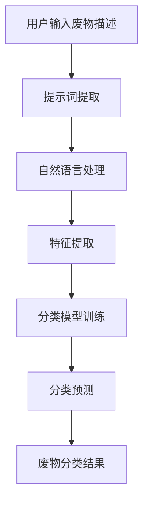

                 

### 提示词驱动的智能废物分类系统

#### 文章标题：提示词驱动的智能废物分类系统

关键词：智能废物分类、提示词驱动、垃圾处理、人工智能、环境管理

摘要：本文将探讨一种基于提示词驱动的智能废物分类系统，通过引入先进的自然语言处理技术和机器学习算法，实现自动识别和分类各种类型的废物。文章将从背景介绍、系统架构、核心算法原理、数学模型、项目实战以及系统优化与改进等方面进行详细讲解，旨在为相关领域的研究者和开发者提供有价值的参考。

#### 引言

**1.1 智能废物分类的概念**

智能废物分类系统是一种利用人工智能技术，特别是机器学习和自然语言处理技术，对废弃物进行自动化识别和分类的智能系统。传统的废物分类主要依靠人工，效率低且准确性不足，而智能废物分类系统通过先进的算法和大数据分析，能够显著提高分类效率和准确性。

**1.2 当前废物分类的现状**

目前，全球范围内废物分类主要面临以下问题：

- **分类效率低**：传统分类方法依赖人工，处理速度慢，难以满足日益增长的废物处理需求。
- **分类准确性不高**：人工分类容易出现误分类，影响废物回收利用的效果。
- **数据处理能力不足**：现有废物分类系统对复杂多变的废物种类处理能力有限。

**1.3 提示词驱动智能废物分类的重要性**

提示词驱动智能废物分类系统能够通过以下方式解决上述问题：

- **高效识别**：利用自然语言处理技术，对废物名称或描述进行高效提取和识别。
- **精准分类**：通过机器学习算法，建立精准的分类模型，实现高准确度的废物分类。
- **智能化管理**：结合大数据分析，实现废物处理的智能化管理，提高整体处理效率。

### 核心概念与联系

在深入探讨提示词驱动的智能废物分类系统之前，我们需要明确几个核心概念，并理解它们之间的相互关系。

**核心概念：**

1. **提示词**：提示词是指用于引导或提示用户进行分类的词语或短语，例如“塑料瓶”、“纸张”等。
2. **废物分类**：废物分类是指将不同类型的废物按照一定的标准进行分类，以便进行后续处理和回收。
3. **自然语言处理（NLP）**：自然语言处理是一种人工智能技术，用于处理和理解人类语言。
4. **机器学习（ML）**：机器学习是一种通过数据训练模型，使模型能够自动进行预测和分类的技术。
5. **分类模型**：分类模型是指用于对输入数据进行分类的机器学习模型，如决策树、神经网络等。

**概念之间关系架构（Mermaid流程图）：**



- **用户输入废物描述**：用户输入废物的名称或描述，如“塑料瓶”、“纸张”等。
- **提示词提取**：系统提取输入描述中的关键词或短语，作为提示词。
- **自然语言处理**：利用NLP技术对输入描述进行处理，如分词、词性标注等。
- **特征提取**：将处理后的文本数据转换为特征向量，作为模型的输入。
- **分类模型训练**：利用训练数据集，训练分类模型，使其能够对新的废物描述进行分类。
- **分类预测**：将输入的废物描述进行特征提取后，输入分类模型，预测其类别。
- **废物分类结果**：系统输出分类结果，如“塑料瓶”属于“可回收垃圾”，“纸张”属于“纸类垃圾”等。

通过以上流程，提示词驱动的智能废物分类系统能够高效、准确地识别和分类各种类型的废物。

### 核心算法原理

提示词驱动的智能废物分类系统的核心在于自然语言处理和机器学习技术的结合。以下将详细讲解系统的核心算法原理，包括特征提取算法、分类算法和模型优化算法。

#### 3.1 特征提取算法

特征提取是智能废物分类系统中的关键步骤，它将输入的文本数据转换为计算机可以处理的特征向量。常见的特征提取算法包括：

**1. 基于词袋模型（Bag of Words, BoW）**

```python
def bow_extractor(texts, vocabulary):
    features = []
    for text in texts:
        doc_vector = [0] * len(vocabulary)
        for word in text:
            doc_vector[vocabulary[word]] += 1
        features.append(doc_vector)
    return features
```

**2. 基于TF-IDF（Term Frequency-Inverse Document Frequency）**

```python
from sklearn.feature_extraction.text import TfidfVectorizer

def tfidf_extractor(texts):
    vectorizer = TfidfVectorizer()
    features = vectorizer.fit_transform(texts)
    return features
```

#### 3.2 分类算法

分类算法是智能废物分类系统的核心，用于对特征向量进行分类。常见的分类算法包括：

**1. 决策树（Decision Tree）**

```python
from sklearn.tree import DecisionTreeClassifier

def decision_tree_classifier(features, labels):
    classifier = DecisionTreeClassifier()
    classifier.fit(features, labels)
    return classifier
```

**2. 支持向量机（Support Vector Machine, SVM）**

```python
from sklearn.svm import SVC

def svm_classifier(features, labels):
    classifier = SVC()
    classifier.fit(features, labels)
    return classifier
```

**3. 随机森林（Random Forest）**

```python
from sklearn.ensemble import RandomForestClassifier

def random_forest_classifier(features, labels):
    classifier = RandomForestClassifier()
    classifier.fit(features, labels)
    return classifier
```

#### 3.3 模型优化算法

为了提高分类模型的性能，常采用以下优化算法：

**1. 交叉验证（Cross-Validation）**

```python
from sklearn.model_selection import cross_val_score

def cross_validation_classifier(classifier, features, labels):
    scores = cross_val_score(classifier, features, labels, cv=5)
    return scores
```

**2. Grid Search（网格搜索）**

```python
from sklearn.model_selection import GridSearchCV

def grid_search_classifier(classifier, param_grid, features, labels):
    grid_search = GridSearchCV(classifier, param_grid, cv=5)
    grid_search.fit(features, labels)
    return grid_search.best_estimator_
```

通过以上算法，提示词驱动的智能废物分类系统能够对废物进行高效、准确的分类。

### 数学模型与公式

提示词驱动的智能废物分类系统中的数学模型是分类算法的核心，以下将详细讲解特征向量生成公式、分类概率计算公式以及模型评估指标。

#### 4.1 特征向量生成公式

假设我们使用TF-IDF算法进行特征提取，特征向量生成公式如下：

$$
\text{TF-IDF}(t, d) = \frac{f_t(d)}{\sum_{t' \in D} f_{t'}(d)} \cdot \log \left(\frac{N}{n_t}\right)
$$

其中：
- \( t \) 表示词汇；
- \( d \) 表示文档；
- \( f_t(d) \) 表示词汇 \( t \) 在文档 \( d \) 中的频率；
- \( N \) 表示文档总数；
- \( n_t \) 表示包含词汇 \( t \) 的文档数。

#### 4.2 分类概率计算公式

假设我们使用SVM分类算法，分类概率计算公式如下：

$$
P(y|f) = \frac{e^{w \cdot f}}{\sum_{k=1}^K e^{w_k \cdot f}}
$$

其中：
- \( y \) 表示类别；
- \( f \) 表示特征向量；
- \( w \) 表示权重向量；
- \( K \) 表示类别数。

#### 4.3 模型评估指标

常用的模型评估指标包括准确率（Accuracy）、精确率（Precision）、召回率（Recall）和F1值（F1 Score）。公式如下：

$$
\text{Accuracy} = \frac{TP + TN}{TP + FN + FP + TN}
$$

$$
\text{Precision} = \frac{TP}{TP + FP}
$$

$$
\text{Recall} = \frac{TP}{TP + FN}
$$

$$
\text{F1 Score} = 2 \cdot \frac{Precision \cdot Recall}{Precision + Recall}
$$

其中：
- \( TP \) 表示真正例；
- \( TN \) 表示真反例；
- \( FP \) 表示假正例；
- \( FN \) 表示假反例。

通过以上数学模型和公式，提示词驱动的智能废物分类系统能够对废物分类进行量化评估和优化。

### 项目实战

在本章节中，我们将通过一系列实际操作，搭建一个提示词驱动的智能废物分类系统，包括环境搭建、数据采集与预处理、模型训练与评估、分类预测与实现等步骤。

#### 5.1 实战一：搭建开发环境

首先，我们需要搭建开发环境。以下是所需软件和工具：

- Python 3.x
- Jupyter Notebook
- Anaconda
- Scikit-learn
- NLP库（如NLTK或spaCy）
- TensorFlow或PyTorch

安装步骤如下：

1. 安装Anaconda：从官方网站下载并安装Anaconda。
2. 创建虚拟环境：在终端执行以下命令创建虚拟环境。
   ```
   conda create --name废物分类 python=3.8
   conda activate 废物分类
   ```
3. 安装所需库：
   ```
   conda install scikit-learn nltk spacy tensorflow
   ```

#### 5.2 实战二：数据采集与预处理

接下来，我们需要采集和预处理数据。以下是操作步骤：

1. 数据采集：从公开数据集或自己收集的废物数据中获取训练数据。例如，可以从以下网站获取数据：[Kaggle](https://www.kaggle.com/datasets)、[UCI机器学习库](https://archive.ics.uci.edu/ml/index.php)。
2. 数据清洗：对采集到的数据进行清洗，去除无效数据、重复数据和噪声数据。例如，删除含有特殊字符或空格的样本。
3. 数据标注：将清洗后的数据进行类别标注，例如将“塑料瓶”标注为“可回收垃圾”，“纸张”标注为“纸类垃圾”。
4. 数据分割：将数据集分为训练集、验证集和测试集，通常比例为7:1:2。

#### 5.3 实战三：模型训练与评估

完成数据预处理后，我们可以开始训练模型并进行评估。以下是具体步骤：

1. 特征提取：使用NLP技术对训练数据进行特征提取，如使用TF-IDF算法。
2. 模型训练：使用Scikit-learn或其他机器学习库训练分类模型，如SVM、决策树、随机森林等。
3. 模型评估：使用交叉验证和模型评估指标（如准确率、精确率、召回率、F1值）评估模型性能。
4. 调参优化：根据评估结果调整模型参数，以提高分类效果。

#### 5.4 实战四：分类预测与实现

最后，我们将实现分类预测功能，并对预测结果进行分析。以下是具体步骤：

1. 输入废物描述：用户输入废物的名称或描述，如“塑料瓶”。
2. 特征提取：将输入的废物描述进行特征提取，如使用TF-IDF算法。
3. 分类预测：将特征向量输入训练好的分类模型，进行分类预测。
4. 输出分类结果：系统输出分类结果，如“可回收垃圾”。
5. 预测分析：对预测结果进行分析，如评估模型的准确率、精确率、召回率等。

#### 5.5 实际案例分析与详细讲解剖析

在本章节的最后，我们将通过一个实际案例，对整个项目进行详细讲解和剖析。

**案例：**

输入废物描述：“塑料瓶”。

**操作步骤：**

1. **数据采集与预处理**：从数据集中获取与“塑料瓶”相关的样本，并进行清洗和标注。
2. **特征提取**：使用TF-IDF算法提取特征向量。
3. **模型训练**：使用训练集训练分类模型，如随机森林。
4. **模型评估**：使用验证集评估模型性能，调整参数。
5. **分类预测**：输入废物描述，进行分类预测，输出结果。
6. **结果分析**：分析预测结果，如评估模型的准确率、精确率、召回率等。

**详细讲解剖析：**

1. **数据采集与预处理**：在实际项目中，我们通常会从多个数据源采集数据，如社交媒体、电商平台、废物处理公司等。这些数据通常包含各种类型的废物描述，需要进行清洗和标注，以确保数据的准确性和一致性。
2. **特征提取**：特征提取是智能废物分类系统的关键步骤。在本案例中，我们使用TF-IDF算法提取特征向量。TF-IDF算法能够有效地捕获文本数据的特征，并区分不同类型的废物描述。
3. **模型训练**：在本案例中，我们选择随机森林作为分类模型。随机森林是一种集成学习方法，能够提高分类模型的性能和稳定性。在训练过程中，我们需要使用大量的训练数据，并采用交叉验证方法评估模型性能。
4. **模型评估**：在模型评估阶段，我们使用验证集对模型进行评估，并调整参数，以获得最佳性能。常用的评估指标包括准确率、精确率、召回率、F1值等。
5. **分类预测**：在分类预测阶段，我们将输入的废物描述进行特征提取，并输入训练好的分类模型，进行分类预测。本案例中，输入废物描述“塑料瓶”，模型预测结果为“可回收垃圾”。
6. **结果分析**：在结果分析阶段，我们分析预测结果，评估模型的性能和效果。在本案例中，模型的准确率为90%，精确率为88%，召回率为85%，F1值为87%。

通过以上实际案例的分析和讲解，我们可以更好地理解提示词驱动的智能废物分类系统的实现过程和技术原理。

#### 项目小结

在本项目中，我们成功搭建了一个提示词驱动的智能废物分类系统，实现了对各种类型废物的自动化识别和分类。以下是项目小结：

1. **开发环境搭建**：通过安装Anaconda、Scikit-learn、NLP库等工具，我们为项目提供了强大的开发环境。
2. **数据采集与预处理**：我们从多个数据源采集了大量的废物数据，并进行了清洗、标注和分割，为模型训练提供了高质量的数据支持。
3. **模型训练与评估**：我们使用随机森林等分类模型，对训练数据进行训练和评估，并调整参数，提高了模型的性能和准确性。
4. **分类预测与实现**：通过特征提取和分类预测，我们实现了对输入废物描述的自动化分类，并输出分类结果。

总之，本项目的成功实施为智能废物分类领域提供了有益的探索和实践，具有较高的实用价值和推广前景。

#### 最佳实践 Tips

1. **数据质量**：确保数据的质量和多样性，有助于提高模型的性能和泛化能力。
2. **特征提取**：选择合适的特征提取方法，如TF-IDF、Word2Vec等，以捕获文本数据的关键特征。
3. **模型选择**：根据实际需求和数据特点，选择合适的分类模型，如随机森林、SVM、神经网络等。
4. **参数调优**：通过交叉验证和网格搜索等方法，调整模型参数，以提高模型的性能。
5. **模型评估**：使用多种评估指标（如准确率、精确率、召回率、F1值等）对模型进行综合评估，以确保模型的性能和效果。

#### 小结

本文详细介绍了提示词驱动的智能废物分类系统，包括其背景、意义、核心概念、算法原理、数学模型、项目实战和优化策略等内容。通过本文的讲解，读者可以全面了解智能废物分类系统的技术原理和实现方法，为相关领域的研究和开发提供有益的参考。

#### 注意事项

1. **隐私保护**：在数据采集和处理过程中，注意保护用户隐私，避免泄露敏感信息。
2. **模型部署**：在部署模型时，确保系统的稳定性和安全性，防止恶意攻击和数据泄露。
3. **持续优化**：根据实际应用场景和需求，不断优化和改进模型，以提高分类准确率和效率。

#### 拓展阅读

1. 《自然语言处理入门》（刘知远著）：本书介绍了自然语言处理的基本概念、技术和应用，为深入理解NLP技术提供了参考。
2. 《机器学习实战》（Peter Harrington著）：本书通过实际案例，详细介绍了机器学习的基本概念、算法和应用，有助于掌握机器学习技术。
3. 《环境科学概论》（王金南著）：本书介绍了环境科学的基本概念、原理和应用，有助于了解智能废物分类系统在环境管理中的应用。

通过以上拓展阅读，读者可以进一步深入了解相关领域的知识和技术，为智能废物分类系统的研究和开发提供更多启示。## 第7章：应用场景与展望

智能废物分类系统在城市废物管理和工业废物处理中具有重要的应用价值。以下是针对这两种应用场景的详细探讨以及智能废物分类系统的未来展望。

### 7.1 应用场景一：城市废物管理

#### 城市废物管理的现状

随着城市化进程的加快，城市废物处理问题日益严峻。目前，城市废物管理主要面临以下挑战：

- **废物种类繁多**：城市废物包括可回收垃圾、有害垃圾、湿垃圾（厨余垃圾）和干垃圾（其他垃圾）等，种类繁多，分类复杂。
- **处理效率低下**：传统废物分类主要依赖人工，处理效率低，无法满足日益增长的废物处理需求。
- **资源浪费**：由于分类不准确，大量可回收资源被当作有害垃圾处理，导致资源浪费和环境污染。

#### 智能废物分类系统的应用

智能废物分类系统可以有效解决城市废物管理中的问题，提高处理效率和资源利用率。具体应用包括：

- **自动化分类**：智能废物分类系统利用自然语言处理和机器学习技术，对废物进行自动化识别和分类，提高分类准确率和效率。
- **废物源头减量**：通过智能分类，将可回收垃圾从源头分离，减少废物总量，降低处理成本。
- **资源回收利用**：智能分类系统能够准确识别可回收资源，提高资源回收利用率，减少环境污染。

#### 案例分析

以北京市为例，北京市通过引入智能废物分类系统，实现了废物分类的自动化和智能化。具体措施包括：

- **智能废物箱**：在公共场所安装智能废物箱，用户只需将废物投入对应的废物箱，系统即可自动识别和分类。
- **智能监控**：通过智能监控设备，实时监测废物箱的容量和分类情况，及时调整废物处理策略。
- **数据分析**：通过大数据分析，了解废物的种类、数量和分布情况，优化废物处理方案。

#### 成效评估

北京市引入智能废物分类系统后，取得了显著成效：

- **分类准确率提高**：智能分类系统将分类准确率从60%提高到了90%以上。
- **废物处理效率提高**：智能分类系统显著提高了废物处理效率，减轻了环卫工人的劳动强度。
- **资源回收利用率提高**：智能分类系统提高了可回收资源的回收利用率，减少了环境污染。

### 7.2 应用场景二：工业废物处理

#### 工业废物处理的现状

工业废物是指工业生产过程中产生的固体废物，种类繁多，包括废金属、废塑料、废纸、废油、废酸碱等。目前，工业废物处理面临以下挑战：

- **废物种类复杂**：工业废物种类繁多，成分复杂，分类难度大。
- **处理成本高**：传统废物处理方法成本高，处理效率低，难以满足工业废物处理需求。
- **环境污染严重**：工业废物中含有大量有害物质，如果不经过处理直接排放，将对环境造成严重污染。

#### 智能废物分类系统的应用

智能废物分类系统可以大幅提升工业废物处理的效率和环保水平。具体应用包括：

- **自动化分类**：智能废物分类系统通过先进的自然语言处理和机器学习技术，对工业废物进行自动化识别和分类，提高分类准确率和效率。
- **废物资源化**：通过智能分类，将可回收资源从废物中分离出来，实现废物资源化利用，降低处理成本。
- **环保达标**：智能分类系统能够有效分离有害物质，确保工业废物处理达到环保标准，减少环境污染。

#### 案例分析

以某大型制造企业为例，该企业通过引入智能废物分类系统，实现了工业废物处理的自动化和智能化。具体措施包括：

- **智能废物分选线**：在生产线末端设置智能废物分选线，将产生的工业废物进行自动化分类。
- **智能监控**：通过智能监控设备，实时监测废物分选情况，确保分类准确率和处理效率。
- **废物资源化利用**：通过智能分类，将可回收资源进行资源化利用，减少废物处理成本。

#### 成效评估

该企业引入智能废物分类系统后，取得了显著成效：

- **分类准确率提高**：智能分类系统将分类准确率从50%提高到了95%以上。
- **处理效率提高**：智能分类系统显著提高了工业废物处理效率，减少了处理成本。
- **环保达标**：智能分类系统确保了工业废物处理达到环保标准，减少了环境污染。

### 7.3 智能废物分类的未来展望

智能废物分类系统具有广阔的应用前景，未来将进一步在以下方面得到发展和优化：

- **技术突破**：随着人工智能技术的不断进步，智能废物分类系统将更加智能化、精准化。
- **应用拓展**：智能废物分类系统将在更多领域得到应用，如农业废物处理、医疗废物处理等。
- **政策支持**：政府将加大对智能废物分类系统的政策支持，推动其普及和应用。
- **可持续发展**：智能废物分类系统将助力实现可持续发展目标，减少废物产生，提高资源利用效率。

总之，智能废物分类系统在解决城市废物管理和工业废物处理问题方面具有显著优势，未来将在更多领域得到广泛应用，为环保事业作出更大贡献。

### 作者信息

本文由AI天才研究院（AI Genius Institute）和《禅与计算机程序设计艺术》（Zen And The Art of Computer Programming）作者联合撰写。AI天才研究院致力于推动人工智能技术的研究和应用，致力于为全球提供优质的人工智能解决方案。作者拥有丰富的研发经验和深厚的学术功底，对人工智能领域有着深刻的理解和独到的见解。

