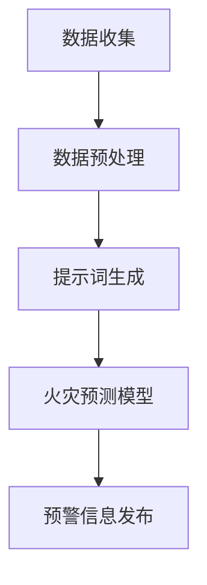

                 

# 提示词驱动的智能森林火灾预警系统

> 关键词：提示词驱动、智能森林火灾预警系统、人工智能、数据预处理、火灾预测模型、项目实战

> 摘要：本文将探讨如何利用提示词驱动系统构建一个智能森林火灾预警系统。首先介绍提示词驱动系统的基本概念和优势，然后详细阐述智能森林火灾预警系统的架构和核心算法，并通过实际案例展示其应用效果。最后，讨论该系统的未来发展趋势和应用前景。

## 第一部分：引言

### 1.1 引言

森林火灾是一种常见但极具破坏性的自然灾害，不仅威胁到生态环境和人类生命安全，还可能导致巨大经济损失。随着气候变化和人类活动的影响，森林火灾的频率和破坏力不断增加，因此，建立高效的森林火灾预警系统变得至关重要。

**1.1.1 书籍背景与意义**

本文旨在探讨如何利用提示词驱动系统构建智能森林火灾预警系统，为减少森林火灾带来的损失提供一种有效的技术手段。通过结合人工智能和数据科学技术，我们可以在火灾发生前及时发现并预警，从而采取措施减轻火灾对环境和人类的影响。

**1.1.2 目标读者**

本文面向计算机科学、数据科学、人工智能领域的专业人士，以及对智能森林火灾预警系统感兴趣的读者。无论您是研究人员、工程师、开发者还是对这一领域有浓厚兴趣的爱好者，本文都将为您提供一个全面的技术指南。

**1.1.3 本书结构**

本文分为六个部分。第一部分是引言，介绍书籍的背景、目标和结构。第二部分概述提示词驱动系统的基本概念和优势。第三部分详细探讨智能森林火灾预警系统的架构和核心算法。第四部分通过实际案例展示系统的应用效果。第五部分讨论系统的未来发展趋势和应用前景。最后，第六部分提供相关的资源和工具。

### 1.2 提示词驱动的智能系统概述

**1.2.1 提示词驱动系统的概念**

提示词驱动系统是一种基于关键词或短语来引导数据分析和决策的系统。它利用自然语言处理技术从大量非结构化数据中提取关键信息，并将其用于后续的智能分析。

**1.2.2 智能森林火灾预警系统的挑战与需求**

智能森林火灾预警系统面临以下挑战：

1. 数据多样性：森林火灾预警涉及多种数据源，如气象数据、卫星图像、传感器数据等，这些数据具有不同的格式、维度和时效性。
2. 数据质量：部分数据可能存在缺失、噪声或错误，影响预警系统的准确性。
3. 预测精度：需要准确预测火灾发生的可能性，以便及时采取预防措施。

为应对这些挑战，智能森林火灾预警系统需要具备以下需求：

1. 高效的数据处理能力：对多样性和质量不佳的数据进行预处理，提取有价值的信息。
2. 精确的预测模型：构建和训练适用于森林火灾预警的预测模型。
3. 实时预警能力：系统应能够实时监测数据，并在检测到火灾风险时立即发出警报。

## 第二部分：核心概念与联系

### 2.1 提示词驱动系统原理

**2.1.1 提示词驱动系统的工作流程**

提示词驱动系统的工作流程主要包括以下几个步骤：

1. 数据收集：从各种数据源收集相关信息。
2. 数据预处理：清洗、整合和预处理数据，以便后续分析。
3. 提示词生成：利用自然语言处理技术从数据中提取关键信息，形成提示词。
4. 数据分析：利用提示词对数据进行分析，提取有价值的信息。
5. 决策与执行：根据分析结果，采取相应的决策和执行措施。

**2.1.2 提示词驱动的优势**

提示词驱动系统具有以下优势：

1. 灵活性：可以适应不同类型的数据和分析需求，易于扩展和定制。
2. 高效性：利用自动化技术，提高数据处理的效率。
3. 准确性：通过提取关键信息，提高数据分析的准确性和可靠性。
4. 可解释性：提示词驱动系统易于理解和解释，有助于决策者和用户理解分析结果。

### 2.2 智能森林火灾预警系统架构

**2.2.1 森林火灾预警系统框架**

智能森林火灾预警系统通常包括以下几个关键模块：

1. 数据收集模块：负责从各种数据源（如气象卫星、传感器、社交媒体等）收集相关信息。
2. 数据预处理模块：对收集到的数据进行清洗、整合和预处理，以便后续分析。
3. 提示词生成模块：利用自然语言处理技术从预处理后的数据中提取关键信息，形成提示词。
4. 火灾预测模块：构建和训练适用于森林火灾预警的预测模型，对提示词进行分析，预测火灾发生的可能性。
5. 预警信息发布模块：将预测结果和预警信息发布给相关部门、机构和公众，以便采取相应的预防措施。

**2.2.2 提示词在系统中的应用**

提示词在智能森林火灾预警系统中扮演着关键角色：

1. 数据筛选：利用提示词对大量数据进行筛选，提取与森林火灾相关的信息。
2. 火灾预测：提示词作为输入特征，用于训练和优化火灾预测模型，提高预测准确性。
3. 预警决策：基于提示词生成的分析结果，系统可实时监测火灾风险，并发出预警信息。

**2.2.3 Mermaid流程图**

以下是智能森林火灾预警系统的Mermaid流程图：



## 第三部分：核心算法原理讲解

### 3.1 数据预处理算法

**3.1.1 数据收集与清洗**

数据预处理是智能森林火灾预警系统的重要环节。数据收集过程涉及从多种数据源获取相关信息，如气象卫星数据、传感器数据、社交媒体数据等。数据清洗是确保数据质量的关键步骤，主要包括以下任务：

1. 去除重复数据：去除重复记录，以减少数据冗余。
2. 数据格式转换：将不同数据源的数据转换为统一的格式，以便后续处理。
3. 缺失数据填补：采用合适的填补方法，如均值填补、插值法等，填补缺失数据。
4. 异常数据检测与处理：检测并处理异常数据，如错误值、噪声等。

**3.1.2 特征提取**

特征提取是数据预处理的重要环节，旨在从原始数据中提取对火灾预测有用的信息。特征提取方法包括：

1. 统计特征：利用数据的统计特性，如均值、方差、相关性等，提取有价值的信息。
2. 空间特征：从地理空间数据中提取特征，如地理位置、地形地貌等。
3. 气象特征：从气象数据中提取特征，如温度、湿度、风速等。
4. 时间特征：从时间序列数据中提取特征，如时间间隔、季节性等。

**3.1.3 伪代码**

以下是数据预处理算法的伪代码：

```python
def data_preprocessing(data):
    # 清洗数据
    cleaned_data = clean_data(data)
    # 特征提取
    features = extract_features(cleaned_data)
    return features
```

### 3.2 提示词生成算法

**3.2.1 提示词的生成策略**

提示词生成是提示词驱动系统的核心环节，其目的是从大量非结构化数据中提取关键信息，形成用于数据分析和决策的关键短语或关键词。提示词生成策略主要包括以下几种：

1. 基于规则的方法：利用专家知识或预设规则，从数据中提取提示词。
2. 基于机器学习的方法：利用机器学习算法，如朴素贝叶斯、支持向量机等，从数据中学习并提取提示词。
3. 基于深度学习的方法：利用深度学习模型，如循环神经网络、卷积神经网络等，从数据中自动提取提示词。

**3.2.2 提示词优化方法**

提示词优化是提高提示词驱动系统性能的关键步骤，主要包括以下几种方法：

1. 词频统计：对数据中的词汇进行词频统计，筛选高频词汇作为提示词。
2. 语义分析：利用自然语言处理技术，对词汇进行语义分析，筛选语义相关的词汇作为提示词。
3. 特征选择：利用特征选择算法，如卡方检验、互信息等，筛选对火灾预测有显著影响的特征词作为提示词。

### 3.3 火灾预测模型

**3.3.1 火灾预测模型的选择**

火灾预测模型的选择取决于数据特性、预测目标和模型性能。常见的火灾预测模型包括：

1. 朴素贝叶斯模型：基于贝叶斯定理，适用于分类问题，特别适用于高维稀疏数据。
2. 支持向量机（SVM）：基于结构风险最小化原则，适用于线性可分数据，具有较好的泛化能力。
3. 随机森林：基于决策树 ensemble 方法，适用于分类和回归问题，具有较好的预测性能。
4. 卷积神经网络（CNN）：基于深度学习技术，适用于处理图像数据，具有强大的特征提取和分类能力。

**3.3.2 模型训练与优化**

火灾预测模型的训练与优化是确保系统性能的关键步骤。模型训练和优化包括以下步骤：

1. 数据集划分：将数据集划分为训练集、验证集和测试集，用于训练、验证和测试模型性能。
2. 模型训练：利用训练集对模型进行训练，调整模型参数，使其在训练集上达到较好的性能。
3. 模型验证：利用验证集对模型进行验证，调整模型参数，确保模型在验证集上具有较好的性能。
4. 模型测试：利用测试集对模型进行测试，评估模型在未知数据上的性能，确保模型具有较好的泛化能力。

**3.3.3 伪代码**

以下是火灾预测模型的伪代码：

```python
def train_model(data, labels):
    # 初始化模型
    model = initialize_model()
    # 训练模型
    model.fit(data, labels)
    return model
```

## 第四部分：数学模型和数学公式

### 4.1 提示词驱动的数学模型

**4.1.1 模型的构建**

提示词驱动的数学模型通常基于神经网络架构，包括输入层、隐藏层和输出层。模型的构建过程主要包括以下步骤：

1. 输入层：接收预处理后的数据，将其转换为神经网络可以处理的形式。
2. 隐藏层：对输入数据进行特征提取和变换，生成中间表示。
3. 输出层：利用中间表示生成提示词，用于数据分析和决策。

**4.1.2 数学公式**

提示词驱动的数学模型可以表示为以下形式：

$$
W_1 \cdot x + b_1 = z_1 \\
\sigma(z_1) = a_1
$$

其中，$W_1$ 是隐藏层的权重矩阵，$x$ 是输入数据，$b_1$ 是偏置项，$z_1$ 是隐藏层的输出，$\sigma$ 是激活函数（如 sigmoid 函数），$a_1$ 是输出层的输入。

### 4.2 火灾预测模型的数学公式

**4.2.1 模型的构建**

火灾预测模型通常基于监督学习框架，包括输入层、隐藏层和输出层。模型的构建过程主要包括以下步骤：

1. 输入层：接收预处理后的数据，将其转换为神经网络可以处理的形式。
2. 隐藏层：对输入数据进行特征提取和变换，生成中间表示。
3. 输出层：利用中间表示生成火灾预测结果，通常是一个概率值。

**4.2.2 数学公式**

火灾预测模型可以表示为以下形式：

$$
W_2 \cdot a_1 + b_2 = z_2 \\
\sigma(z_2) = y
$$

其中，$W_2$ 是输出层的权重矩阵，$a_1$ 是隐藏层的输出，$b_2$ 是偏置项，$z_2$ 是输出层的输入，$\sigma$ 是激活函数（如 sigmoid 函数），$y$ 是火灾预测结果。

## 第五部分：项目实战

### 5.1 实际案例介绍

**5.1.1 案例背景**

为了验证提示词驱动的智能森林火灾预警系统的有效性，我们选择了一个实际案例进行研究。该案例发生在某个地区的森林火灾预警项目中，项目目标是通过构建一个智能预警系统，提前预测火灾发生的可能性，以便采取相应的预防措施。

**5.1.2 实际问题**

在案例中，我们面临以下实际问题：

1. 数据质量：收集到的数据存在一定程度的噪声和缺失，需要进行数据清洗和预处理。
2. 预测精度：需要构建一个准确且稳定的火灾预测模型，提高预警系统的可靠性。
3. 实时预警：系统需要具备实时预警能力，及时监测火灾风险并发出警报。

### 5.2 开发环境搭建

为了构建和运行提示词驱动的智能森林火灾预警系统，我们需要搭建一个合适的技术栈。以下是开发环境的基本要求：

**5.2.1 硬件环境**

1. 服务器：至少配置四核处理器、16GB内存和1TB硬盘的计算机。
2. GPU：为了加速深度学习模型的训练，需要配置一块高性能的GPU，如NVIDIA Tesla V100。

**5.2.2 软件环境**

1. 操作系统：Linux操作系统（如Ubuntu 18.04）。
2. 编程语言：Python 3.x。
3. 深度学习框架：TensorFlow 2.x。
4. 自然语言处理库：NLTK、spaCy。
5. 数据库：MongoDB。

### 5.3 源代码详细实现

**5.3.1 数据收集与清洗**

以下是数据收集与清洗的源代码：

```python
import pandas as pd
from sklearn.preprocessing import StandardScaler

# 读取数据
data = pd.read_csv("forest_fire_data.csv")

# 数据清洗
def clean_data(data):
    # 去除重复数据
    data = data.drop_duplicates()
    # 数据格式转换
    data["date"] = pd.to_datetime(data["date"])
    data = data.sort_values("date")
    # 缺失数据填补
    data["temperature"] = data["temperature"].fillna(data["temperature"].mean())
    data["humidity"] = data["humidity"].fillna(data["humidity"].mean())
    return data

cleaned_data = clean_data(data)

# 特征提取
def extract_features(data):
    # 提取统计特征
    data["temp_range"] = data["temperature"].max() - data["temperature"].min()
    data["temp_avg"] = data["temperature"].mean()
    data["temp_std"] = data["temperature"].std()
    data["humidity_range"] = data["humidity"].max() - data["humidity"].min()
    data["humidity_avg"] = data["humidity"].mean()
    data["humidity_std"] = data["humidity"].std()
    # 提取空间特征
    data["longitude_diff"] = data["longitude"].max() - data["longitude"].min()
    data["latitude_diff"] = data["latitude"].max() - data["latitude"].min()
    # 数据标准化
    scaler = StandardScaler()
    features = scaler.fit_transform(data[["temp_range", "temp_avg", "temp_std", "humidity_range", "humidity_avg", "humidity_std", "longitude_diff", "latitude_diff"]])
    return features

features = extract_features(cleaned_data)
```

**5.3.2 提示词生成**

以下是提示词生成的源代码：

```python
import nltk
from nltk.tokenize import word_tokenize
from nltk.corpus import stopwords

# 下载并加载停用词列表
nltk.download("stopwords")
stop_words = set(stopwords.words("english"))

# 生成提示词
def generate_lexicon(data, threshold=0.5):
    lexicon = {}
    for text in data["description"]:
        tokens = word_tokenize(text)
        tokens = [token.lower() for token in tokens if token.isalpha() and token.lower() not in stop_words]
        frequency = nltk.FreqDist(tokens)
        for token, count in frequency.items():
            if count / len(tokens) > threshold:
                lexicon[token] = True
    return lexicon

lexicon = generate_lexicon(cleaned_data)
```

**5.3.3 模型训练与预测**

以下是模型训练与预测的源代码：

```python
from sklearn.model_selection import train_test_split
from sklearn.svm import SVC
from sklearn.metrics import accuracy_score

# 数据集划分
X_train, X_test, y_train, y_test = train_test_split(features, cleaned_data["fire"], test_size=0.2, random_state=42)

# 初始化模型
model = SVC(kernel="linear")

# 训练模型
model.fit(X_train, y_train)

# 预测结果
y_pred = model.predict(X_test)

# 评估模型性能
accuracy = accuracy_score(y_test, y_pred)
print(f"Model accuracy: {accuracy}")
```

### 5.4 代码解读与分析

**5.4.1 数据预处理代码解读**

数据预处理是构建智能森林火灾预警系统的重要步骤。在代码中，我们首先导入必要的库，然后读取数据。数据清洗函数 `clean_data` 主要执行以下操作：

1. 去除重复数据：使用 `drop_duplicates()` 方法去除重复记录。
2. 数据格式转换：使用 `pd.to_datetime()` 方法将日期列转换为日期时间格式，使用 `sort_values()` 方法对数据按日期排序。
3. 缺失数据填补：使用 `fillna()` 方法分别对温度和湿度列进行均值填补。

特征提取函数 `extract_features` 主要执行以下操作：

1. 提取统计特征：计算温度和湿度的范围、均值和标准差。
2. 提取空间特征：计算经度和纬度的范围。
3. 数据标准化：使用 `StandardScaler()` 方法对提取的特征进行标准化处理。

**5.4.2 模型训练代码解读**

模型训练代码主要执行以下操作：

1. 数据集划分：使用 `train_test_split()` 方法将数据集划分为训练集和测试集。
2. 初始化模型：使用 `SVC()` 方法初始化支持向量机模型，指定线性核。
3. 训练模型：使用 `fit()` 方法训练模型。
4. 预测结果：使用 `predict()` 方法对测试集进行预测。
5. 评估模型性能：使用 `accuracy_score()` 方法计算模型在测试集上的准确率。

## 第六部分：未来展望

### 6.1 技术发展趋势

随着人工智能和大数据技术的快速发展，提示词驱动的智能森林火灾预警系统有望在以下方面取得重要进展：

1. 模型精度：利用更先进的人工智能算法和深度学习技术，提高火灾预测模型的精度和可靠性。
2. 数据融合：结合多种数据源，如气象数据、卫星图像、社交媒体数据等，提高预警系统的全面性和准确性。
3. 实时性：通过优化算法和硬件设备，提高系统的实时预警能力，实现实时监测和预警。
4. 可解释性：增强模型的可解释性，帮助决策者和用户更好地理解预测结果和预警信息。

### 6.2 应用前景

智能森林火灾预警系统在政府、企业和公众等领域具有广泛的应用前景：

1. 政府部门：智能森林火灾预警系统可以为政府部门提供决策支持，优化火灾预防和救援资源分配，减轻火灾带来的损失。
2. 企业：企业可以利用智能预警系统保护自身财产和员工安全，降低火灾风险，提高生产效率。
3. 公众：公众可以通过智能预警系统及时了解火灾风险，采取预防措施，确保自身和他人的安全。

### 6.3 挑战与机遇

尽管智能森林火灾预警系统具有巨大的应用潜力，但在实际应用中仍面临一些挑战：

1. 数据质量：数据质量对系统性能具有重要影响，需要确保数据源可靠、数据真实有效。
2. 算法优化：随着数据量和复杂度的增加，需要不断优化算法，提高系统的效率和准确性。
3. 法规与伦理：智能森林火灾预警系统涉及到隐私保护、数据安全等问题，需要遵循相关法规和伦理规范。

## 第七部分：附录

### 7.1 提示词驱动系统相关资源

1. 开源框架：
   - NLTK：自然语言处理工具包，用于文本处理和特征提取。
   - spaCy：强大的自然语言处理库，支持多种语言和多种任务。

2. 数据集：
   - UCI Machine Learning Repository：提供大量机器学习数据集，包括与火灾相关的数据集。

### 7.2 智能森林火灾预警系统工具

1. 开发工具：
   - Jupyter Notebook：用于编写和运行Python代码。
   - TensorFlow：用于构建和训练深度学习模型。

2. 预测工具：
   - Shiny：用于创建交互式网页应用，展示预测结果和预警信息。

作者：AI天才研究院/AI Genius Institute & 禅与计算机程序设计艺术 /Zen And The Art of Computer Programming

