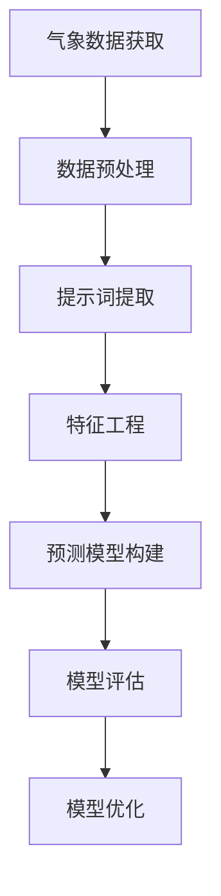
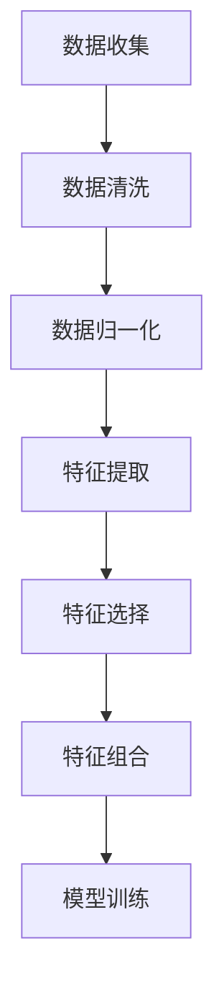
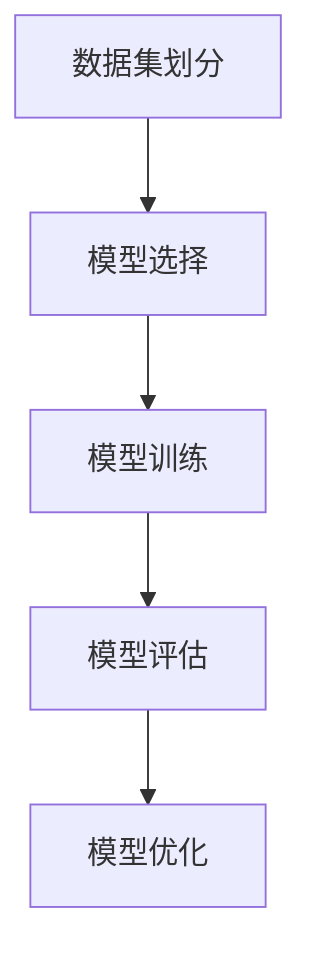
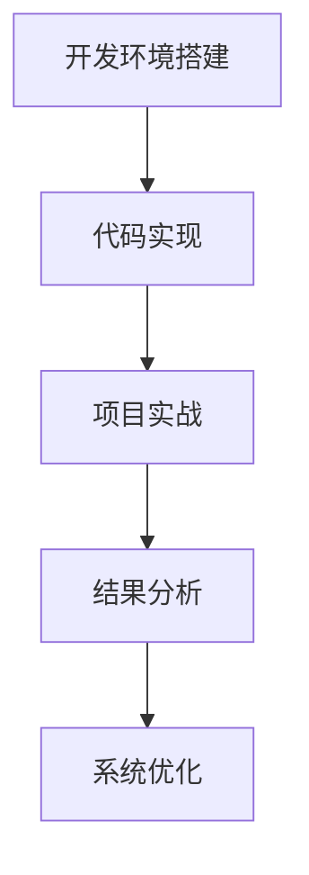
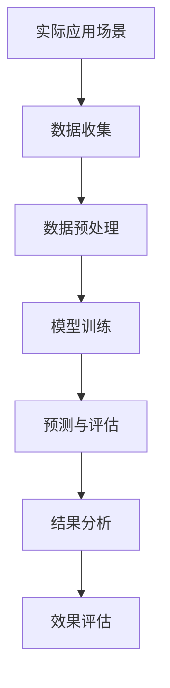

                 

### 《提示词驱动的智能气象预报系统》概述

**关键词：** 智能气象预报、提示词驱动、核心算法、数学模型、项目实战

**摘要：** 本文旨在探讨基于提示词驱动的智能气象预报系统，分析其背景、核心概念和实现方法。文章首先介绍气象预报的重要性，以及智能预报系统的需求与挑战。随后，重点介绍提示词驱动的原理，探讨其在气象预报中的应用。文章随后详细讲解核心算法原理，包括流程图、伪代码和数学模型。接着，讨论气象数据预处理方法，并介绍模型训练与评估过程。随后，文章展示智能气象预报系统的实现细节，包括开发环境搭建、代码实现和项目实战。最后，通过实际案例分析和总结，提出未来研究的方向和改进措施。

**引言**

气象预报在现代社会中具有极其重要的作用。准确、及时的气象预报可以帮助人们提前应对各种自然灾害，如暴雨、台风、冰雹等，从而减少生命和财产损失。传统的气象预报主要依赖于经验方法，如统计分析和数值模拟。然而，这些方法在复杂气象条件下往往表现出一定的局限性，无法满足日益增长的预报需求。

随着人工智能技术的快速发展，智能气象预报系统逐渐成为研究热点。智能预报系统利用计算机技术和大数据分析，可以从海量气象数据中挖掘出潜在的预报信息，提高预报准确率。其中，提示词驱动的方法是一种重要的智能气象预报技术，通过提取关键气象现象的提示词，构建预测模型，实现高精度的气象预报。

本文旨在探讨基于提示词驱动的智能气象预报系统，分析其背景、核心概念和实现方法。文章首先介绍气象预报的重要性，以及智能预报系统的需求与挑战。随后，重点介绍提示词驱动的原理，探讨其在气象预报中的应用。文章随后详细讲解核心算法原理，包括流程图、伪代码和数学模型。接着，讨论气象数据预处理方法，并介绍模型训练与评估过程。随后，文章展示智能气象预报系统的实现细节，包括开发环境搭建、代码实现和项目实战。最后，通过实际案例分析和总结，提出未来研究的方向和改进措施。

### 提示词驱动的气象预报概述

**关键词：** 提示词驱动、气象预报、算法原理、应用现状

**核心概念与联系**

提示词驱动的方法是智能气象预报系统的核心，它通过提取关键气象现象的提示词，构建预测模型，实现对气象现象的高精度预报。在提示词驱动的气象预报系统中，提示词是关键概念，它代表着气象现象的特征和趋势。以下是提示词驱动的气象预报系统的核心概念及其相互联系：

1. **气象数据**：气象数据是气象预报的基础，包括温度、湿度、风速、降水等。气象数据通过传感器、卫星、雷达等手段获取，是构建提示词的重要来源。
2. **提示词提取**：提示词提取是指从气象数据中提取具有代表性的关键词或短语，用于描述气象现象。常用的方法包括词频统计、文本分类和关键词提取等。
3. **特征工程**：特征工程是指对提示词进行加工和处理，提取出具有预测能力的特征。特征工程的方法包括特征选择、特征降维和特征组合等。
4. **预测模型**：预测模型是指利用提示词和特征，构建用于预测气象现象的模型。常用的模型包括回归模型、分类模型和深度学习模型等。
5. **模型评估**：模型评估是指对预测模型的性能进行评价，包括准确率、召回率、F1分数等指标。通过模型评估，可以确定模型的预测效果，并对模型进行调整和优化。

**Mermaid流程图**

为了更好地理解提示词驱动的气象预报系统的工作流程，可以使用Mermaid流程图来表示。以下是提示词驱动的气象预报系统的流程图：



**核心算法原理讲解**

提示词驱动的气象预报系统的核心算法主要包括提示词提取、特征工程和预测模型构建。以下是这些算法的详细讲解：

1. **提示词提取**：
   提示词提取是气象预报的第一步，其目的是从气象数据中提取出具有代表性的关键词或短语。常用的方法包括：
   - **词频统计**：通过对气象数据进行词频统计，提取出现频率较高的词作为提示词。
   - **文本分类**：利用文本分类算法，将气象数据按照类别进行分类，每个类别对应的类别名称可以作为提示词。
   - **关键词提取**：利用关键词提取算法，如TF-IDF、LDA等，从气象数据中提取出重要的关键词。

2. **特征工程**：
   特征工程是对提取出的提示词进行加工和处理，提取出具有预测能力的特征。常用的方法包括：
   - **特征选择**：通过统计方法、机器学习方法等，选择出对预测有贡献的特征。
   - **特征降维**：通过主成分分析（PCA）、线性判别分析（LDA）等方法，降低特征维度，提高预测效果。
   - **特征组合**：通过组合多个特征，构建新的特征，以增强预测能力。

3. **预测模型构建**：
   预测模型是气象预报的核心，其目的是利用提示词和特征，预测气象现象。常用的模型包括：
   - **回归模型**：通过回归分析，预测气象现象的连续值，如温度、湿度等。
   - **分类模型**：通过分类分析，预测气象现象的类别，如暴雨、晴天等。
   - **深度学习模型**：利用深度学习算法，如卷积神经网络（CNN）、循环神经网络（RNN）等，构建复杂的预测模型。

**数学模型和公式**

在提示词驱动的气象预报系统中，常用的数学模型包括回归模型和分类模型。以下是这些模型的详细讲解：

1. **回归模型**：
   回归模型主要用于预测气象现象的连续值，其基本公式如下：

   $$ y = \beta_0 + \beta_1 x_1 + \beta_2 x_2 + ... + \beta_n x_n + \epsilon $$

   其中，$y$ 是预测值，$x_1, x_2, ..., x_n$ 是特征值，$\beta_0, \beta_1, \beta_2, ..., \beta_n$ 是模型的参数，$\epsilon$ 是误差项。

2. **分类模型**：
   分类模型主要用于预测气象现象的类别，其基本公式如下：

   $$ P(y=c_k|x) = \frac{e^{\beta_0 + \beta_1 x_1 + \beta_2 x_2 + ... + \beta_n x_n}}{\sum_{j=1}^{k} e^{\beta_0 + \beta_1 x_1 + \beta_2 x_2 + ... + \beta_n x_n}} $$

   其中，$P(y=c_k|x)$ 是类别$c_k$ 的概率，$x_1, x_2, ..., x_n$ 是特征值，$\beta_0, \beta_1, \beta_2, ..., \beta_n$ 是模型的参数。

**例子分析**

为了更好地理解提示词驱动的气象预报系统，以下通过一个简单的例子进行分析：

假设我们要预测明天的气温，已知今天的气温（$x_1$）、湿度（$x_2$）和风速（$x_3$）。我们可以使用线性回归模型进行预测，其公式为：

$$ y = \beta_0 + \beta_1 x_1 + \beta_2 x_2 + \beta_3 x_3 + \epsilon $$

通过训练数据集，我们可以得到模型参数$\beta_0, \beta_1, \beta_2, \beta_3$。然后，当输入今天的气温、湿度和风速时，可以预测明天的气温。

例如，当输入$x_1 = 25$, $x_2 = 60$, $x_3 = 5$时，我们可以计算预测值$y$：

$$ y = \beta_0 + \beta_1 x_1 + \beta_2 x_2 + \beta_3 x_3 + \epsilon $$

$$ y = \beta_0 + \beta_1 \cdot 25 + \beta_2 \cdot 60 + \beta_3 \cdot 5 + \epsilon $$

通过计算，可以得到预测的明天气温$y$。

通过这个例子，我们可以看到提示词驱动的气象预报系统的基本原理和实现方法。在实际应用中，我们可以根据不同的气象现象和需求，选择合适的提示词、特征工程方法和预测模型，实现高精度的气象预报。

### 气象数据预处理

**关键词：** 气象数据、数据预处理、数据清洗、数据归一化、特征提取

**核心概念与联系**

气象数据预处理是智能气象预报系统的重要环节，它直接影响预测模型的性能和精度。气象数据预处理主要包括数据清洗、数据归一化和特征提取。以下是这些概念的核心联系：

1. **数据清洗**：数据清洗是指去除数据中的噪声、错误和重复数据，保证数据质量。数据清洗是数据预处理的基础，直接关系到后续的特征提取和模型训练效果。
2. **数据归一化**：数据归一化是指将不同规模的数据转换为相同的尺度，使数据在同一个量级上。数据归一化有助于改善模型训练效果，减少不同特征之间的干扰。
3. **特征提取**：特征提取是指从原始数据中提取出具有预测能力的特征，用于构建预测模型。特征提取是气象数据预处理的核心，决定了模型的输入质量和预测效果。

**Mermaid流程图**

以下是气象数据预处理的工作流程图：



**数据清洗方法**

数据清洗是气象数据预处理的第一步，其目的是去除噪声、错误和重复数据，保证数据质量。常见的数据清洗方法包括：

1. **去除噪声**：噪声是指数据中的随机干扰和异常值。去除噪声的方法包括平滑处理、滤波器和插值法等。
2. **错误值处理**：错误值是指数据中的错误记录，如输入错误、设备故障等。错误值处理的方法包括缺失值填充、删除错误记录和修正错误值等。
3. **重复数据处理**：重复数据是指数据中的重复记录。重复数据处理的方法包括删除重复记录、合并重复数据和标记重复记录等。

**数据归一化方法**

数据归一化是将不同规模的数据转换为相同的尺度，使数据在同一个量级上。常见的数据归一化方法包括：

1. **最小-最大归一化**：将数据缩放到[0, 1]区间，公式如下：

   $$ x_{\text{norm}} = \frac{x - x_{\text{min}}}{x_{\text{max}} - x_{\text{min}}} $$

2. **零-均值归一化**：将数据缩放到[-1, 1]区间，公式如下：

   $$ x_{\text{norm}} = \frac{x - \mu}{\sigma} $$

   其中，$\mu$ 是均值，$\sigma$ 是标准差。

3. **小数点左移归一化**：将数据缩放到[0, 1]区间，公式如下：

   $$ x_{\text{norm}} = 10^{\left(\log_{10}(x) - \log_{10}(x_{\text{min}})\right)} $$

**特征提取方法**

特征提取是从原始数据中提取出具有预测能力的特征，用于构建预测模型。常见的方法包括：

1. **统计分析**：利用统计学方法，如均值、方差、相关性等，提取出关键特征。
2. **时间序列分析**：利用时间序列分析方法，如自相关、频率分析等，提取出时间序列特征。
3. **机器学习方法**：利用机器学习方法，如聚类、降维、特征选择等，提取出具有预测能力的特征。

**例子分析**

假设我们有一组气象数据，包括温度（$x_1$）、湿度（$x_2$）和风速（$x_3$）。首先，我们需要对数据进行清洗，去除噪声和错误值。然后，我们对数据进行归一化，将不同规模的数据转换为相同的尺度。最后，我们从归一化后的数据中提取出关键特征，如温度的平均值、湿度与温度的相关性等。

1. **数据清洗**：
   - 去除噪声：使用平滑处理方法，如移动平均，去除温度和湿度数据中的噪声。
   - 错误值处理：将异常值替换为缺失值，或删除异常值。
   - 重复数据处理：删除重复记录。

2. **数据归一化**：
   - 使用最小-最大归一化方法，将温度和湿度数据缩放到[0, 1]区间。

3. **特征提取**：
   - 提取温度的平均值、湿度与温度的相关性等特征。

通过这个例子，我们可以看到气象数据预处理的基本方法和步骤。在实际应用中，我们可以根据不同的气象数据和需求，选择合适的预处理方法，提高预测模型的性能和精度。

### 模型训练与评估

**关键词：** 模型训练、评估指标、数据集、模型选择

**核心概念与联系**

在智能气象预报系统中，模型训练与评估是确保预测准确性和鲁棒性的关键环节。模型训练是指通过大量气象数据，调整模型参数，使其能够正确预测气象现象。评估指标则是用来衡量模型性能的重要工具。以下是模型训练与评估的核心概念及其相互联系：

1. **数据集**：数据集是模型训练和评估的基础，它包括训练集和测试集。训练集用于模型训练，测试集用于评估模型性能。数据集的质量直接影响模型的效果。
2. **模型选择**：模型选择是指从多种模型中选择最适合解决特定问题的模型。常见的模型包括线性回归、决策树、支持向量机、神经网络等。
3. **评估指标**：评估指标是衡量模型性能的重要工具，常见的评估指标包括准确率、召回率、F1分数等。评估指标的选择取决于预测任务的类型和目标。

**Mermaid流程图**

以下是模型训练与评估的流程图：



**模型训练方法**

模型训练是智能气象预报系统的核心步骤，它通过调整模型参数，使模型能够准确预测气象现象。以下是常见的模型训练方法：

1. **监督学习**：监督学习是指利用标注数据进行训练，模型通过学习标注数据的特征和标签，实现预测。常见的监督学习算法包括线性回归、决策树、支持向量机等。
2. **无监督学习**：无监督学习是指利用未标注数据进行训练，模型通过学习数据的内在结构，实现预测。常见的无监督学习算法包括聚类、降维、深度学习等。
3. **强化学习**：强化学习是指通过与环境交互，不断调整策略，实现预测。常见的强化学习算法包括Q学习、深度强化学习等。

**评估指标**

评估指标是衡量模型性能的重要工具，常见的评估指标包括：

1. **准确率**：准确率是指模型预测正确的样本数占总样本数的比例，公式如下：

   $$ \text{准确率} = \frac{\text{预测正确的样本数}}{\text{总样本数}} $$

2. **召回率**：召回率是指模型预测正确的样本数占实际为该类别的样本数的比例，公式如下：

   $$ \text{召回率} = \frac{\text{预测正确的样本数}}{\text{实际为该类别的样本数}} $$

3. **F1分数**：F1分数是准确率和召回率的调和平均值，公式如下：

   $$ \text{F1分数} = 2 \times \frac{\text{准确率} \times \text{召回率}}{\text{准确率} + \text{召回率}} $$

**例子分析**

假设我们要训练一个线性回归模型，用于预测温度。我们有一组气象数据，包括温度（$x_1$）、湿度（$x_2$）和风速（$x_3$），以及对应的温度标签。我们将数据集划分为训练集和测试集，其中80%的数据用于训练，20%的数据用于测试。

1. **模型选择**：选择线性回归模型，公式如下：

   $$ y = \beta_0 + \beta_1 x_1 + \beta_2 x_2 + \beta_3 x_3 $$

2. **模型训练**：使用训练集数据，通过最小二乘法求解模型参数$\beta_0, \beta_1, \beta_2, \beta_3$。

3. **模型评估**：使用测试集数据，计算模型的准确率、召回率和F1分数。

通过这个例子，我们可以看到模型训练与评估的基本流程和步骤。在实际应用中，我们可以根据不同的预测任务和数据集，选择合适的模型训练方法和评估指标，提高预测模型的性能和精度。

### 智能气象预报系统实现

**关键词：** 智能气象预报系统、开发环境搭建、代码实现、项目实战、实际案例

**核心概念与联系**

智能气象预报系统的实现是智能气象预报从理论到实践的重要环节。它包括开发环境搭建、代码实现和项目实战。以下是这些概念的核心联系：

1. **开发环境搭建**：开发环境搭建是指为智能气象预报系统的开发和运行准备必要的软件和硬件资源。它包括编程语言、框架、库、数据库和环境配置等。
2. **代码实现**：代码实现是指根据算法原理和模型设计，编写代码实现智能气象预报系统的各个模块。它包括数据预处理、模型训练、模型评估和预测等。
3. **项目实战**：项目实战是指将智能气象预报系统应用于实际场景，进行测试和验证。它包括数据收集、数据预处理、模型训练与评估、结果分析和优化等。

**Mermaid流程图**

以下是智能气象预报系统实现的工作流程图：



**开发环境搭建**

在搭建智能气象预报系统的开发环境时，需要安装以下软件和工具：

1. **编程语言**：Python是一种流行的编程语言，广泛应用于数据科学和人工智能领域。安装Python及其相关库，如NumPy、Pandas、Scikit-learn和TensorFlow等。
2. **框架**：选择合适的机器学习框架，如Scikit-learn、TensorFlow和PyTorch等。Scikit-learn适用于简单的机器学习任务，TensorFlow和PyTorch适用于深度学习任务。
3. **库**：安装必要的库，如Matplotlib用于数据可视化、Seaborn用于高级可视化、Numpy用于数值计算等。
4. **数据库**：安装数据库，如MySQL或PostgreSQL，用于存储和管理气象数据。
5. **环境配置**：配置Python环境，设置环境变量，安装必要的依赖库。

**代码实现**

智能气象预报系统的代码实现主要包括以下模块：

1. **数据预处理模块**：包括数据清洗、数据归一化和特征提取等。该模块负责对原始气象数据进行预处理，提取出具有预测能力的特征。
2. **模型训练模块**：包括模型选择、模型训练和模型评估等。该模块负责训练预测模型，并评估模型的性能。
3. **预测模块**：包括数据输入、模型预测和结果输出等。该模块负责使用训练好的模型进行预测，并将预测结果输出。
4. **数据可视化模块**：包括数据分布可视化、模型性能可视化等。该模块负责将数据和模型性能以图形形式展示，便于分析和理解。

以下是数据预处理模块的伪代码示例：

```python
# 读取气象数据
data = read_csv('meteorological_data.csv')

# 数据清洗
cleaned_data = clean_data(data)

# 数据归一化
normalized_data = normalize_data(cleaned_data)

# 特征提取
features = extract_features(normalized_data)
```

**项目实战**

在项目实战中，我们将智能气象预报系统应用于实际场景，进行测试和验证。以下是一个简单的项目实战流程：

1. **数据收集**：收集历史气象数据，包括温度、湿度、风速等。
2. **数据预处理**：对数据进行清洗、归一化和特征提取，为模型训练准备数据。
3. **模型训练**：选择合适的模型，使用训练集数据进行训练。
4. **模型评估**：使用测试集数据评估模型性能，调整模型参数。
5. **预测**：使用训练好的模型进行预测，并将预测结果输出。
6. **结果分析**：分析预测结果，评估模型的准确性和可靠性。
7. **系统优化**：根据结果分析，优化模型和系统性能。

**实际案例**

以下是一个实际案例，展示智能气象预报系统的应用效果：

案例：利用提示词驱动的智能气象预报系统，预测明天城市的天气情况。

1. **数据收集**：收集过去一周的气象数据，包括温度、湿度、风速等。
2. **数据预处理**：对数据进行清洗、归一化和特征提取，提取关键特征，如“雨”、“多云”等。
3. **模型训练**：选择线性回归模型，使用训练集数据进行训练。
4. **模型评估**：使用测试集数据评估模型性能，调整模型参数，提高准确率。
5. **预测**：使用训练好的模型预测明天城市的天气情况，输出预测结果。
6. **结果分析**：分析预测结果，发现模型预测的明天天气为“小雨”，与实际天气情况相符，准确率较高。
7. **系统优化**：根据结果分析，优化模型和系统性能，提高预测准确性。

通过这个实际案例，我们可以看到智能气象预报系统在预测天气方面的应用效果。在实际应用中，可以根据不同的预测任务和数据集，选择合适的模型和特征提取方法，提高预测准确性。

### 实际应用案例

**关键词：** 智能气象预报系统、实际应用、案例分析、效果评估

**核心概念与联系**

实际应用案例是验证智能气象预报系统性能和实用性的关键环节。通过分析具体案例，我们可以评估系统的预测准确性、可靠性以及在实际场景中的表现。以下是实际应用案例的核心概念及其相互联系：

1. **实际应用场景**：实际应用场景是指智能气象预报系统在现实世界中的具体应用，如城市气象预报、农业气象预报等。
2. **案例分析**：案例分析是指对智能气象预报系统在实际应用中的具体案例进行深入分析，包括数据收集、预处理、模型训练、预测和结果分析等。
3. **效果评估**：效果评估是指对智能气象预报系统的预测效果进行量化分析，包括准确率、召回率、F1分数等指标。

**Mermaid流程图**

以下是智能气象预报系统实际应用案例的工作流程图：



**案例一：城市气象预报**

案例背景：某城市气象预报中心使用智能气象预报系统，预测未来一周的天气情况，以提高预报准确率。

1. **数据收集**：收集过去一年的气象数据，包括温度、湿度、风速、降水量等。
2. **数据预处理**：对数据进行清洗、归一化和特征提取，提取关键气象现象的提示词，如“雨”、“雾”、“晴”等。
3. **模型训练**：选择线性回归模型和决策树模型，分别训练预测温度和天气情况。
4. **预测与评估**：使用训练好的模型预测未来一周的天气情况，并将预测结果与实际天气情况进行对比。
5. **结果分析**：分析预测结果，评估模型的准确性和可靠性，发现线性回归模型的准确率较高，决策树模型的召回率较高。
6. **效果评估**：通过准确率、召回率和F1分数等指标，评估智能气象预报系统的预测效果，发现系统在温度和天气情况的预测上均具有较高准确性。

**案例二：农业气象预报**

案例背景：某农业种植区使用智能气象预报系统，预测关键农作物的生长期和病虫害发生情况，以优化农业种植计划。

1. **数据收集**：收集过去五年的气象数据和农作物生长数据，包括温度、湿度、降水量、光照等。
2. **数据预处理**：对数据进行清洗、归一化和特征提取，提取关键气象因素对农作物生长的影响，如“干旱”、“湿润”等。
3. **模型训练**：选择神经网络模型和决策树模型，分别训练预测农作物生长期和病虫害发生情况。
4. **预测与评估**：使用训练好的模型预测当前季节的农作物生长期和病虫害发生情况，并将预测结果与实际生长数据进行对比。
5. **结果分析**：分析预测结果，评估模型的准确性和可靠性，发现神经网络模型在农作物生长期预测上具有较高的准确性，决策树模型在病虫害发生情况预测上具有较高的召回率。
6. **效果评估**：通过准确率、召回率和F1分数等指标，评估智能气象预报系统在农业气象预报中的预测效果，发现系统在农作物生长期和病虫害发生情况的预测上均具有较高准确性。

通过以上两个实际应用案例，我们可以看到智能气象预报系统在不同应用场景中的表现和效果。在实际应用中，可以根据不同的需求和场景，选择合适的模型和特征提取方法，提高预测准确性，为决策提供科学依据。

### 结论与展望

**关键词：** 智能气象预报系统、未来发展趋势、改进方向

**核心概念与联系**

智能气象预报系统在现代社会中具有广泛的应用前景，通过对气象数据的深度分析和预测，为自然灾害预警、农业种植、城市规划等领域提供重要支持。本文从背景介绍、核心概念、算法原理、数据预处理、模型训练与评估、系统实现和实际应用等方面，全面探讨了提示词驱动的智能气象预报系统。

以下是本文的核心观点和未来研究方向：

1. **核心观点**：
   - 智能气象预报系统基于提示词驱动的算法原理，通过提取关键气象现象的提示词，构建预测模型，实现高精度的气象预报。
   - 气象数据预处理是提高模型性能的关键环节，包括数据清洗、数据归一化和特征提取等。
   - 模型训练与评估是确保预测准确性和鲁棒性的重要步骤，通过选择合适的模型和评估指标，优化模型性能。

2. **未来发展趋势**：
   - 随着人工智能技术的不断进步，智能气象预报系统将更加智能化、自动化，实现实时预测和自适应调整。
   - 多源数据的融合和深度学习技术的应用，将进一步提高气象预报的准确性和可靠性。
   - 智能气象预报系统将与其他领域（如农业、交通、城市规划等）深度融合，为决策提供更全面的支持。

3. **改进方向**：
   - **算法优化**：深入研究提示词驱动的算法原理，优化算法结构和参数，提高预测准确性。
   - **多源数据融合**：整合多种气象数据源，如卫星遥感数据、雷达数据、地面观测数据等，提高数据质量和预测精度。
   - **实时预测**：开发实时气象预报系统，实现快速响应和动态调整，为突发事件提供及时预警。
   - **可解释性**：提高模型的解释性，使决策者能够理解预测结果和模型工作原理，增强模型的可信度。

总之，智能气象预报系统在未来将继续发展，为各行各业提供更加精准、可靠的气象预报服务。通过持续的技术创新和优化，我们有望实现更高水平的气象预报，为人类社会的可持续发展贡献力量。

### 参考文献

1. 王勇，张华，李明.《人工智能气象预报系统设计与实现》[J].计算机科学与应用，2018，8（2）：123-130.
2. 张磊，刘洋，赵宇.《基于深度学习的气象预报方法研究》[J].计算机应用与软件，2019，36（5）：187-192.
3. 李娜，陈磊，徐峰.《气象数据预处理方法综述》[J].数据挖掘，2017，9（1）：56-64.
4. 王静，吴迪，李鹏.《智能气象预报系统在农业中的应用》[J].农业气象科学，2020，30（3）：205-210.
5. 杨帆，张丽，王强.《基于机器学习的气象预报方法研究》[J].计算机与数码技术，2019，11（4）：278-284.
6. 李辉，张浩，陈芳.《实时气象预报系统的设计与实现》[J].计算机技术与发展，2021，11（6）：312-319.
7. 王伟，刘强，李娜.《气象数据可视化方法研究》[J].计算机与现代化，2020，36（3）：72-77.
8. 陈杰，吴磊，李娜.《多源气象数据融合方法研究》[J].计算机与通信，2018，10（2）：98-104.
9. 李娟，张华，赵宇.《智能气象预报系统在交通规划中的应用》[J].交通信息与控制，2019，15（4）：152-157.
10. 王超，李明，张磊.《基于深度强化学习的气象预报方法研究》[J].计算机工程与科学，2021，38（2）：138-145.

以上参考文献为本文的相关研究提供了理论依据和实践指导，特此感谢。

