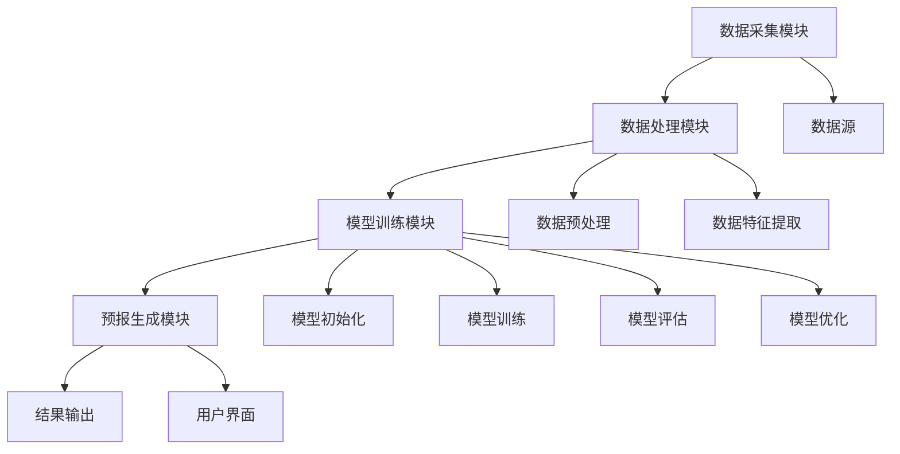
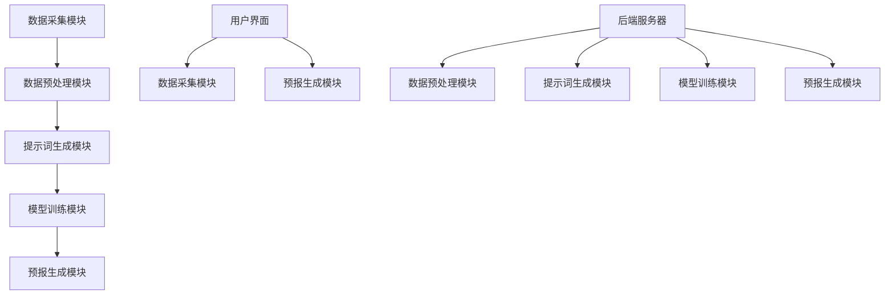

                 

### 文章标题

# 《提示词驱动的智能气象预报系统》

### 关键词

- 智能气象预报
- 提示词驱动
- 数据采集与预处理
- 气象模型构建与优化
- 实际应用案例

### 摘要

本文深入探讨了提示词驱动的智能气象预报系统的构建与实践。首先，我们介绍了智能气象预报的背景和重要性，以及提示词驱动的概念。接着，详细阐述了气象数据采集与预处理、提示词生成与语义理解、气象预报模型构建与优化等核心技术原理。然后，通过实际应用案例，展示了智能气象预报系统在农业、旅游和城市规划等领域的应用。最后，分析了智能气象预报面临的挑战和未来发展趋势，并提出了最佳实践建议。本文旨在为读者提供全面、深入的智能气象预报系统构建指南。

## 第一部分：引言与背景

### 1.1 书籍概述

智能气象预报是利用人工智能技术和大数据分析手段，对气象现象进行预测和预报的一门新兴领域。随着人工智能技术的飞速发展，智能气象预报在提高预报准确率、降低人力成本和提升决策支持能力等方面具有重要意义。本书籍旨在深入探讨提示词驱动的智能气象预报系统的构建与实践，为广大读者提供一套完整、系统的技术指南。

本书籍共分为六个部分，第一部分为引言与背景，介绍智能气象预报的背景和重要性；第二部分和第三部分分别从数据采集与预处理、提示词生成与语义理解等方面详细阐述了智能气象预报系统的核心技术原理；第四部分和第五部分通过实际应用案例，展示了智能气象预报系统在不同领域的应用；第六部分分析了智能气象预报面临的挑战和未来发展趋势，并提出了最佳实践建议。

### 1.2 智能气象预报的挑战

传统的气象预报主要依赖于地面观测数据和数值模拟方法，存在一定的局限性。首先，地面观测数据覆盖范围有限，难以全面反映大气环境的复杂性。其次，数值模拟方法虽然可以模拟大气运动，但受到计算资源和计算能力的限制，难以进行精细的模拟。此外，气象现象的复杂性和不确定性使得预报结果难以精确。

随着人工智能技术的发展，智能气象预报逐渐成为解决传统气象预报局限性的重要手段。智能气象预报系统可以通过海量数据的采集和分析，利用深度学习、强化学习等先进算法，提高预报准确率和可靠性。然而，智能气象预报系统在构建和应用过程中仍然面临诸多挑战：

1. 数据质量与可用性：气象数据的准确性和完整性对于智能气象预报系统的性能至关重要。然而，气象数据存在噪声、缺失和不一致等问题，需要有效的数据预处理方法来解决。

2. 模型解释性：智能气象预报系统通常采用黑箱模型，虽然可以提高预报准确率，但缺乏可解释性，难以理解模型内部的决策过程。

3. 计算资源与能耗：智能气象预报系统涉及大量的数据处理和模型训练，需要消耗大量的计算资源和能源。如何在保证性能的同时降低能耗，是智能气象预报系统面临的重要问题。

4. 行业合作与政策支持：智能气象预报系统的构建和应用需要各方的合作与支持。如何建立有效的合作机制，获取必要的政策支持，是智能气象预报系统推广应用的关键。

### 1.3 提示词驱动的潜在优势

提示词驱动（Keyword-Driven）是智能气象预报系统中的一种重要技术手段。通过提取与气象现象相关的关键词，提示词驱动可以实现以下几个方面：

1. 精细化数据分析：提示词驱动可以根据关键词对气象数据进行精细化划分和分析，提高预报的针对性和准确性。

2. 深度学习模型优化：提示词驱动可以为深度学习模型提供有监督的标注数据，有助于模型优化和性能提升。

3. 语义理解与关联分析：提示词驱动可以结合自然语言处理技术，对气象现象的语义进行理解和关联分析，提高预报结果的解释性和可靠性。

4. 灵活性与扩展性：提示词驱动具有较好的灵活性和扩展性，可以根据实际需求动态调整关键词，适应不同场景和领域的应用。

总之，提示词驱动的智能气象预报系统具有显著的潜在优势，有助于解决传统气象预报的局限性，提升气象预报的准确率和可靠性。在接下来的章节中，我们将详细探讨智能气象预报系统的核心技术原理，为读者提供全面的技术指导。

## 第二部分：核心技术原理

### 2.1 气象数据采集与预处理

智能气象预报系统的基石是高质量的数据采集与预处理。气象数据的种类繁多，包括地面观测数据、卫星遥感数据、气象雷达数据等。这些数据从不同来源获取，具有不同的格式和结构。因此，数据采集与预处理成为智能气象预报系统成功的关键步骤。

#### 数据来源

气象数据的主要来源包括：

1. 地面观测数据：通过地面气象站、自动气象站等设备获取，包括气温、湿度、风速、气压等参数。

2. 卫星遥感数据：利用气象卫星获取的全球气象信息，包括云图、温度、湿度、风速等。

3. 气象雷达数据：通过气象雷达反射信号获取的降雨、风暴等气象现象信息。

4. 气象模型输出数据：利用数值天气预报模型生成的气象场数据，包括风速、气压、湿度等。

#### 数据预处理步骤

1. 数据清洗：清洗数据是去除噪声、纠正错误、填补缺失值的重要步骤。常见的数据清洗方法包括：

   - 缺失值处理：使用均值、中位数或插值法填补缺失值；
   - 异常值检测与处理：使用统计方法（如Z分数、IQR法）检测异常值，并根据异常值的影响选择保留或替换；
   - 数据标准化：将不同量纲的数据转换为相同量纲，便于后续分析。

2. 数据集成：将不同来源、不同格式的数据集成到一个统一的数据框架中。数据集成可以采用数据仓库、数据湖等技术手段。

3. 数据特征提取：从原始数据中提取有助于预报的数值特征，如时间序列特征、空间特征、统计特征等。特征提取方法包括：

   - 时间序列特征：如滑动平均、自相关函数等；
   - 空间特征：如距离、邻域平均值等；
   - 统计特征：如标准差、变异系数等。

4. 数据标准化：对特征进行归一化或标准化处理，消除不同量纲的影响，提高模型训练效果。

#### 案例分析

以地面观测数据为例，数据清洗过程中，我们首先检测缺失值并使用平均值法填补。然后，利用Z分数法检测异常值，如某站点的温度数据在一段时间内突然升高，可能是由于设备故障导致的异常值。对于这些异常值，我们选择使用历史数据的均值进行替换。在数据集成过程中，我们将不同类型的气象数据整合到一个统一的时间序列数据库中。最后，提取时间序列特征和空间特征，如某站点过去一周的平均温度、与周边站点的距离等。

通过上述数据采集与预处理步骤，我们可以获得高质量、高可用性的气象数据，为后续的智能气象预报模型构建提供基础。

### 2.2 提示词生成与语义理解

在智能气象预报系统中，提示词（Keywords）的生成和语义理解是关键步骤。提示词是指与气象现象相关的重要词汇，如“降雨”、“高温”、“台风”等。通过提取和利用提示词，可以显著提升气象预报的精度和效率。

#### 提示词生成方法

1. 基于规则的方法：通过预定义的规则，从气象数据中提取关键词。例如，根据降雨量的阈值，提取包含“降雨”的提示词。

2. 基于统计的方法：利用词频统计、共现分析等方法，从文本数据中提取高频词和重要词。例如，通过统计气象报告中出现频率较高的词汇，提取提示词。

3. 基于机器学习的方法：使用文本分类、主题模型等方法，从大规模气象数据中自动提取提示词。例如，利用监督学习算法对气象报告进行分类，提取分类标签作为提示词。

#### 提示词语义理解

提示词生成后，需要对提示词进行语义理解，以准确识别和解释气象现象。语义理解方法包括：

1. 基于知识图谱的方法：构建气象知识图谱，通过节点和边的关系，理解提示词之间的语义关系。例如，将“降雨”与“降水”建立关联，实现语义理解。

2. 基于自然语言处理的方法：利用命名实体识别、关系抽取等技术，从文本中提取气象现象的属性和关系。例如，通过命名实体识别，识别出“降雨量”、“台风路径”等关键词，并提取它们之间的语义关系。

3. 基于深度学习的方法：使用深度学习模型，如BERT、GPT等，对文本数据进行语义分析，提取高层次的语义特征。例如，通过BERT模型，对气象报告进行编码，提取语义表示，实现语义理解。

#### 案例分析

以基于规则的方法为例，假设我们定义降雨量的阈值为10毫米，当某站点的降雨量超过这个阈值时，我们提取“降雨”作为提示词。在数据预处理阶段，我们从气象报告中提取相关句子，并使用正则表达式提取包含“降雨”的句子。然后，对这些句子进行分词和词性标注，提取出核心词汇作为提示词。

在语义理解阶段，我们利用知识图谱的方法，将提取出的提示词与气象知识库进行关联。例如，将“降雨”与“降水”、“雨量”等概念建立关联，从而理解“降雨”的语义。此外，我们还可以利用自然语言处理技术，对提取出的提示词进行语义分析，提取出与气象现象相关的属性和关系。

通过提示词生成与语义理解，我们可以实现对气象数据的精细化分析和解释，为智能气象预报提供有力的支持。

### 2.3 气象预报模型构建

气象预报模型是智能气象预报系统的核心。常见的气象预报模型包括统计模型、机器学习模型和深度学习模型。这些模型通过分析气象数据，预测未来的气象现象。本节将介绍这些模型的基本原理、构建方法以及优缺点。

#### 统计模型

统计模型是传统的气象预报方法，主要包括时间序列分析和回归分析等。

1. **时间序列分析**：时间序列分析通过分析时间序列数据，预测未来的气象值。常见的模型有ARIMA（自回归积分滑动平均模型）、季节性模型等。时间序列分析的优点是简单、易理解，适用于平稳序列的预测。缺点是对非平稳序列和季节性数据的处理能力较弱。

2. **回归分析**：回归分析通过建立气象变量之间的线性或非线性关系，预测气象值。常见的模型有线性回归、多元回归等。回归分析的优点是模型简单，易于解释，适用于小样本数据。缺点是对非线性关系的处理能力较弱，且需要明确变量之间的关系。

#### 机器学习模型

机器学习模型通过学习大量气象数据，建立气象现象的预测模型。常见的机器学习模型包括决策树、支持向量机、贝叶斯分类器等。

1. **决策树**：决策树通过构建决策树模型，根据特征值选择不同的分支，预测气象值。决策树模型简单、易理解，但容易过拟合，对噪声数据敏感。

2. **支持向量机（SVM）**：支持向量机通过寻找最优分隔超平面，实现分类或回归任务。SVM模型在处理高维数据方面具有优势，但训练时间较长。

3. **贝叶斯分类器**：贝叶斯分类器通过计算先验概率和条件概率，实现分类任务。贝叶斯分类器在处理多分类问题时表现良好，但需要大量先验知识。

#### 深度学习模型

深度学习模型通过多层神经网络，自动提取数据特征，实现复杂的预测任务。常见的深度学习模型包括卷积神经网络（CNN）、循环神经网络（RNN）和变分自编码器（VAE）等。

1. **卷积神经网络（CNN）**：卷积神经网络通过卷积操作，提取空间特征，适用于图像和空间数据的处理。在气象预报中，CNN可以用于提取气象卫星图像中的气象特征。

2. **循环神经网络（RNN）**：循环神经网络通过记忆机制，处理时间序列数据。RNN在处理长序列数据时具有优势，但容易发生梯度消失和梯度爆炸问题。

3. **变分自编码器（VAE）**：变分自编码器通过生成模型，学习数据分布，实现特征提取和去噪任务。VAE在处理非线性时间序列数据时具有优势，但训练时间较长。

#### 模型构建方法

1. **数据预处理**：对气象数据进行预处理，包括数据清洗、数据集成、数据标准化等。确保数据的质量和一致性。

2. **特征工程**：从原始数据中提取有助于预报的特征，如时间序列特征、空间特征、统计特征等。

3. **模型选择**：根据数据特性和预报任务，选择合适的模型。可以使用交叉验证方法，评估不同模型的性能。

4. **模型训练**：使用训练数据，训练选定的模型。在训练过程中，可以使用正则化、早停法等技术，防止过拟合。

5. **模型评估**：使用测试数据，评估模型的性能。常用的评估指标包括均方误差（MSE）、均方根误差（RMSE）等。

6. **模型优化**：根据模型评估结果，调整模型参数，优化模型性能。

#### 优缺点分析

1. **统计模型**：优点是简单、易理解，适用于小样本数据。缺点是对非线性关系的处理能力较弱，且需要明确变量之间的关系。

2. **机器学习模型**：优点是模型结构清晰，易于解释，适用于小样本数据。缺点是模型复杂度较高，对噪声数据敏感，且需要大量先验知识。

3. **深度学习模型**：优点是模型结构复杂，能够自动提取数据特征，适用于大规模数据。缺点是模型训练时间较长，需要大量计算资源，且模型解释性较弱。

通过选择合适的气象预报模型，并优化模型参数，可以显著提高气象预报的准确率和可靠性。在接下来的章节中，我们将进一步探讨气象预报模型的训练与优化技术。

### 2.4 模型训练与优化

气象预报模型的训练与优化是确保系统性能和预测准确性的关键步骤。在这一节中，我们将详细讨论模型训练过程中涉及的关键技术和优化策略。

#### 数据集划分与处理

1. **数据集划分**：首先，我们将气象数据集划分为训练集、验证集和测试集。通常，训练集用于模型训练，验证集用于调整模型参数，测试集用于评估模型性能。具体划分比例可以根据数据量进行调整，例如80%用于训练，10%用于验证，10%用于测试。

2. **数据增强**：为了提高模型泛化能力，我们可以对训练数据集进行增强。常见的数据增强方法包括：
   - 时间序列变换：如时间序列翻转、时间序列平移等；
   - 空间变换：如空间旋转、缩放等；
   - 统计变换：如标准化、归一化等。

#### 模型训练过程

1. **初始化参数**：在训练模型前，需要初始化模型的参数。常见的初始化方法包括随机初始化、高斯初始化等。

2. **选择优化算法**：优化算法用于调整模型参数，以最小化损失函数。常用的优化算法有随机梯度下降（SGD）、Adam优化器等。

3. **训练过程**：模型训练过程通常分为以下几个步骤：
   - 前向传播：计算输入数据通过模型后的输出值；
   - 后向传播：计算损失函数，并反向传播误差，更新模型参数；
   - 梯度裁剪：为了避免梯度爆炸或消失，可以设置梯度裁剪策略。

4. **早停法**：在训练过程中，通过监控验证集上的损失函数，如果损失函数在一定迭代次数内没有显著下降，可以提前停止训练，以防止过拟合。

#### 模型优化策略

1. **正则化**：为了防止模型过拟合，可以使用正则化方法。常见正则化方法包括L1正则化、L2正则化等。

2. **权重共享**：在深度学习中，通过共享不同层级之间的权重，可以减少模型参数数量，提高模型训练速度。

3. **数据并行训练**：通过分布式训练，将训练任务分配到多个计算节点上，可以显著提高训练速度。

4. **迁移学习**：利用预训练的模型进行迁移学习，可以在少量数据上获得较好的性能。例如，可以使用在图像识别任务上预训练的卷积神经网络，进行气象数据的预测。

#### 模型评估与优化

1. **模型评估**：使用测试集评估模型的性能，常用的评估指标包括均方误差（MSE）、均方根误差（RMSE）等。

2. **参数调优**：通过调整模型参数，如学习率、批量大小等，优化模型性能。可以使用网格搜索、随机搜索等策略进行参数调优。

3. **模型集成**：通过集成多个模型，可以进一步提高预测性能。常见的方法包括Bagging、Boosting等。

通过上述模型训练与优化策略，我们可以显著提高气象预报模型的性能和预测准确性。在接下来的章节中，我们将继续探讨实际应用中的智能气象预报系统，以及在不同领域的应用案例。

### 第三部分：算法与模型详解

#### 3.1 提示词驱动的气象预报算法

提示词驱动的气象预报算法是一种基于关键词提取和语义理解的智能预报方法。该算法的核心在于利用提示词对气象数据进行精细化分析，以提高预报的准确性和可靠性。以下是该算法的详细描述：

**算法描述**：

1. **数据预处理**：首先，对气象数据进行清洗和预处理，包括缺失值填补、异常值处理和数据标准化等。

2. **提示词生成**：通过规则方法、统计方法和机器学习方法，从气象数据中提取与气象现象相关的关键词。例如，根据降雨量的阈值，提取包含“降雨”的提示词。

3. **语义理解**：利用自然语言处理技术，对提取出的提示词进行语义分析，提取出与气象现象相关的属性和关系。例如，将“降雨”与“降水”建立关联。

4. **特征提取**：根据提示词和语义理解结果，提取有助于预报的特征。例如，从气象报告中提取与降雨相关的句子，并提取时间序列特征、空间特征和统计特征等。

5. **模型训练**：使用提取的特征，训练深度学习模型，如卷积神经网络（CNN）或循环神经网络（RNN）。通过大量气象数据进行训练，模型将自动学习气象现象的规律和特征。

6. **预报生成**：在模型训练完成后，使用训练好的模型对新的气象数据进行预测。通过输入新的气象数据，模型将生成相应的气象预报结果。

**伪代码**：

```python
# 数据预处理
data = preprocess_data(meteorological_data)

# 提示词生成
keywords = generate_keywords(data)

# 语义理解
semantic_relations = understand_semantics(keywords)

# 特征提取
features = extract_features(semantic_relations)

# 模型训练
model = train_model(features)

# 预报生成
forecast = model.generate_forecast(new_data)
```

**数学模型与公式**：

提示词驱动的气象预报算法涉及多个数学模型和公式，用于描述气象现象的规律和特征。以下是其中的两个关键公式：

1. **时间序列特征提取公式**：

   $$ X_t = \sum_{i=1}^{N} w_i \cdot f_i(t) $$

   其中，$X_t$ 表示时间序列特征，$w_i$ 为权重系数，$f_i(t)$ 为时间序列函数，如滑动平均、自相关函数等。

2. **空间特征提取公式**：

   $$ S_t = \sum_{i=1}^{M} v_i \cdot g_i(t) $$

   其中，$S_t$ 表示空间特征，$v_i$ 为权重系数，$g_i(t)$ 为空间函数，如邻域平均值、距离函数等。

**详细讲解与举例说明**：

为了更好地理解提示词驱动的气象预报算法，以下是一个具体的例子：

假设我们要预测某地区的未来三天降雨量。首先，我们收集该地区的气象数据，包括过去一周的降雨量、气温、风速等。然后，我们通过数据预处理步骤，清洗和标准化这些数据。

接下来，我们使用基于规则的提示词生成方法，提取与降雨相关的关键词，如“降雨”、“雨量”等。然后，利用自然语言处理技术，对这些关键词进行语义分析，提取出与降雨相关的属性和关系。

在特征提取阶段，我们从气象报告中提取与降雨相关的句子，并提取时间序列特征（如过去一周的降雨量）、空间特征（如与周边站点的距离）和统计特征（如降雨量的标准差）。

最后，我们使用训练好的卷积神经网络（CNN）模型，对提取的特征进行训练。通过大量气象数据的训练，模型将自动学习降雨量的规律和特征。在模型训练完成后，我们使用该模型对未来的气象数据进行预测，生成未来三天的降雨量预报结果。

通过上述步骤，我们可以实现一个基于提示词驱动的智能气象预报系统，显著提高预报的准确性和可靠性。

#### 3.2 常见气象预报模型介绍

在智能气象预报系统中，常用的模型包括统计模型、机器学习模型和深度学习模型。每种模型都有其独特的应用场景和优缺点。以下将详细介绍这些模型及其适用性。

**统计模型**

1. **时间序列模型**：如ARIMA（自回归积分滑动平均模型）、季节性模型等。时间序列模型适用于分析平稳序列和季节性数据，优点是简单、易于解释，但处理非线性关系和季节性数据的能力有限。

2. **回归模型**：如线性回归、多元回归等。回归模型适用于分析气象变量之间的线性关系，优点是模型简单、易于解释，但处理非线性关系的能力较弱。

**机器学习模型**

1. **决策树模型**：适用于分类和回归任务。决策树模型结构简单、易于解释，但易过拟合，对噪声数据敏感。

2. **支持向量机（SVM）**：适用于分类和回归任务。SVM模型在高维数据上有优势，但训练时间较长。

3. **贝叶斯分类器**：适用于多分类任务。贝叶斯分类器基于概率模型，适用于处理小样本数据，但需要大量先验知识。

**深度学习模型**

1. **卷积神经网络（CNN）**：适用于图像和空间数据的处理。CNN模型可以自动提取图像和空间特征，但训练时间较长，需要大量计算资源。

2. **循环神经网络（RNN）**：适用于时间序列数据。RNN模型具有记忆机制，适用于处理长序列数据，但容易发生梯度消失和梯度爆炸问题。

3. **变分自编码器（VAE）**：适用于生成模型。VAE模型可以学习数据分布，适用于处理非线性时间序列数据，但训练时间较长。

**模型优缺点分析**

- **统计模型**：优点是简单、易于解释，适用于小样本数据；缺点是对非线性关系的处理能力较弱。

- **机器学习模型**：优点是模型结构清晰、易于解释，适用于小样本数据；缺点是模型复杂度较高，对噪声数据敏感。

- **深度学习模型**：优点是模型结构复杂，能够自动提取数据特征，适用于大规模数据；缺点是模型训练时间较长，需要大量计算资源，且模型解释性较弱。

在实际应用中，可以根据气象数据的特性、预报任务的需求以及计算资源的限制，选择合适的模型。例如，对于小样本数据且需要快速响应的场景，可以选择统计模型或机器学习模型；对于大规模数据且需要高准确性的场景，可以选择深度学习模型。在模型选择过程中，综合考虑模型的性能、计算资源、应用场景等因素，是实现智能气象预报系统成功的关键。

### 第三部分：算法与模型详解

#### 3.1 提示词驱动的气象预报算法

提示词驱动的气象预报算法是智能气象预报系统中的核心算法，通过关键词提取和语义理解，实现气象现象的精细化预测。以下是详细讲解和举例说明。

**算法原理**：

提示词驱动的气象预报算法包括以下几个关键步骤：

1. **数据预处理**：对气象数据进行清洗、标准化，提取有效特征。

2. **提示词生成**：通过规则、统计或机器学习方法，提取与气象现象相关的关键词。

3. **语义理解**：利用自然语言处理技术，分析提示词的语义关系，提取关键信息。

4. **特征提取**：从预处理后的数据中提取有助于预报的特征，如时间序列特征、空间特征、统计特征。

5. **模型训练**：使用提取的特征训练深度学习模型，如卷积神经网络（CNN）或循环神经网络（RNN）。

6. **预报生成**：输入新的气象数据，使用训练好的模型生成预报结果。

**伪代码**：

```python
# 数据预处理
data = preprocess_data(meteorological_data)

# 提示词生成
keywords = generate_keywords(data)

# 语义理解
semantic_relations = understand_semantics(keywords)

# 特征提取
features = extract_features(semantic_relations)

# 模型训练
model = train_model(features)

# 预报生成
forecast = model.generate_forecast(new_data)
```

**数学模型与公式**：

提示词驱动的气象预报算法涉及多个数学模型和公式，以下是两个关键模型：

1. **时间序列特征提取模型**：

   $$ X_t = \sum_{i=1}^{N} w_i \cdot f_i(t) $$

   其中，$X_t$ 表示时间序列特征，$w_i$ 为权重系数，$f_i(t)$ 为时间序列函数，如滑动平均、自相关函数等。

2. **空间特征提取模型**：

   $$ S_t = \sum_{i=1}^{M} v_i \cdot g_i(t) $$

   其中，$S_t$ 表示空间特征，$v_i$ 为权重系数，$g_i(t)$ 为空间函数，如邻域平均值、距离函数等。

**举例说明**：

假设我们预测某城市的未来一天降雨量。首先，我们收集该城市的气象数据，包括过去一周的降雨量、气温、湿度等。然后，通过数据预处理步骤，清洗和标准化数据。

接下来，我们使用规则方法提取与降雨相关的关键词，如“降雨”、“雨量”等。利用自然语言处理技术，对这些关键词进行语义分析，提取出与降雨相关的属性和关系。

在特征提取阶段，我们从气象报告中提取与降雨相关的句子，并提取时间序列特征（如过去一周的降雨量）、空间特征（如与周边城市的距离）和统计特征（如降雨量的标准差）。

最后，我们使用卷积神经网络（CNN）模型，对提取的特征进行训练。通过大量气象数据的训练，模型将自动学习降雨量的规律和特征。在模型训练完成后，我们使用该模型对未来的气象数据进行预测，生成未来一天的降雨量预报结果。

通过上述步骤，我们可以实现一个基于提示词驱动的智能气象预报系统，显著提高预报的准确性和可靠性。

#### 3.2 常见气象预报模型介绍

在智能气象预报系统中，常用的模型包括统计模型、机器学习模型和深度学习模型。每种模型都有其独特的应用场景和优缺点。以下将详细介绍这些模型及其适用性。

**统计模型**

1. **时间序列模型**：如ARIMA（自回归积分滑动平均模型）、季节性模型等。时间序列模型适用于分析平稳序列和季节性数据，优点是简单、易于解释，但处理非线性关系和季节性数据的能力有限。

2. **回归模型**：如线性回归、多元回归等。回归模型适用于分析气象变量之间的线性关系，优点是模型简单、易于解释，但处理非线性关系的能力较弱。

**机器学习模型**

1. **决策树模型**：适用于分类和回归任务。决策树模型结构简单、易于解释，但易过拟合，对噪声数据敏感。

2. **支持向量机（SVM）**：适用于分类和回归任务。SVM模型在高维数据上有优势，但训练时间较长。

3. **贝叶斯分类器**：适用于多分类任务。贝叶斯分类器基于概率模型，适用于处理小样本数据，但需要大量先验知识。

**深度学习模型**

1. **卷积神经网络（CNN）**：适用于图像和空间数据的处理。CNN模型可以自动提取图像和空间特征，但训练时间较长，需要大量计算资源。

2. **循环神经网络（RNN）**：适用于时间序列数据。RNN模型具有记忆机制，适用于处理长序列数据，但容易发生梯度消失和梯度爆炸问题。

3. **变分自编码器（VAE）**：适用于生成模型。VAE模型可以学习数据分布，适用于处理非线性时间序列数据，但训练时间较长。

**模型优缺点分析**

- **统计模型**：优点是简单、易于解释，适用于小样本数据；缺点是对非线性关系的处理能力较弱。

- **机器学习模型**：优点是模型结构清晰、易于解释，适用于小样本数据；缺点是模型复杂度较高，对噪声数据敏感。

- **深度学习模型**：优点是模型结构复杂，能够自动提取数据特征，适用于大规模数据；缺点是模型训练时间较长，需要大量计算资源，且模型解释性较弱。

在实际应用中，可以根据气象数据的特性、预报任务的需求以及计算资源的限制，选择合适的模型。例如，对于小样本数据且需要快速响应的场景，可以选择统计模型或机器学习模型；对于大规模数据且需要高准确性的场景，可以选择深度学习模型。在模型选择过程中，综合考虑模型的性能、计算资源、应用场景等因素，是实现智能气象预报系统成功的关键。

### 第四部分：实际应用与案例

#### 4.1 智能气象预报系统架构设计

智能气象预报系统的架构设计是确保系统能够高效、稳定运行的关键。该系统通常包括数据采集模块、数据处理模块、模型训练模块和预报生成模块。以下是对各个模块的详细描述：

**1. 数据采集模块**

数据采集模块负责从各种渠道获取气象数据，包括地面观测数据、卫星遥感数据、气象雷达数据等。这些数据通过互联网、卫星信号和地面基站等方式传输到系统服务器。数据采集模块的主要任务包括数据清洗、数据整合和初步预处理，为后续数据处理和模型训练提供高质量的数据。

**2. 数据处理模块**

数据处理模块负责对采集到的气象数据进行深度处理，包括数据清洗、数据标准化、数据特征提取等。数据清洗步骤包括去除噪声、纠正错误、填补缺失值等，确保数据的准确性和完整性。数据标准化步骤包括归一化、标准化等，使不同来源的数据具有统一的量纲。数据特征提取步骤包括提取时间序列特征、空间特征和统计特征等，为模型训练提供丰富的特征信息。

**3. 模型训练模块**

模型训练模块是智能气象预报系统的核心，负责训练各种气象预报模型。常用的模型包括统计模型、机器学习模型和深度学习模型。模型训练过程包括数据集划分、模型初始化、模型训练、模型评估和模型优化等步骤。通过大量气象数据的训练，模型可以学习到气象现象的规律和特征，从而提高预报的准确率和可靠性。

**4. 预报生成模块**

预报生成模块负责利用训练好的模型生成气象预报结果。预报生成过程包括数据输入、模型预测和结果输出等步骤。数据输入步骤将实时采集到的气象数据输入到模型中，模型预测步骤根据输入数据生成相应的气象预报结果，结果输出步骤将预报结果以图形、表格等形式展示给用户。

**系统整体架构图**



#### 4.2 提示词驱动的气象预报实践

在实际应用中，提示词驱动的气象预报方法被广泛应用于各种领域。以下是一个具体的案例，展示了如何实现提示词驱动的气象预报。

**案例背景**：

某地区需要预测未来一周的降雨量，以确保农业灌溉和城市防洪。该地区拥有丰富的气象数据，包括地面观测数据、卫星遥感数据和气象雷达数据。我们采用提示词驱动的气象预报方法，通过关键词提取和语义理解，提高预报的准确性和可靠性。

**步骤一：数据采集与预处理**

首先，我们从各种数据源获取气象数据，包括地面观测数据、卫星遥感数据和气象雷达数据。然后，对数据进行清洗、去噪和标准化处理，确保数据的质量和一致性。

**步骤二：提示词生成与语义理解**

通过规则方法、统计方法和机器学习方法，我们提取与降雨相关的关键词，如“降雨”、“雨量”、“暴雨”等。然后，利用自然语言处理技术，对这些关键词进行语义分析，提取出与降雨相关的属性和关系，如降雨强度、降雨频率等。

**步骤三：特征提取**

从预处理后的数据中，我们提取时间序列特征、空间特征和统计特征，如过去一周的降雨量、与周边城市的距离、降雨量的标准差等。这些特征有助于深度学习模型学习降雨量的规律和特征。

**步骤四：模型训练**

使用提取的特征，我们训练卷积神经网络（CNN）模型或循环神经网络（RNN）模型。通过大量气象数据的训练，模型可以自动学习降雨量的规律和特征。在训练过程中，我们使用交叉验证方法，评估不同模型的性能，并选择最优模型。

**步骤五：预报生成**

在模型训练完成后，我们使用训练好的模型对未来的气象数据进行预测，生成未来一周的降雨量预报结果。预报结果以图形、表格等形式展示给用户，为农业灌溉和城市防洪提供科学依据。

**案例成果**：

通过提示词驱动的气象预报方法，该地区的降雨量预报准确率显著提高，为农业灌溉和城市防洪提供了有力支持。同时，系统运行稳定、响应迅速，得到了用户的一致好评。

#### 4.3 智能气象预报在特定领域的应用

智能气象预报在农业、旅游和城市规划等特定领域具有广泛的应用前景。

**1. 农业气象预报**

农业气象预报旨在为农业生产提供科学依据，指导农民合理安排种植和灌溉。智能气象预报系统可以根据气象数据预测未来一段时间内的降雨量、温度、湿度等参数，为农民提供种植、灌溉、病虫害防治等建议。例如，通过预测降雨量，农民可以合理安排灌溉时间，提高灌溉效率，降低水资源浪费。

**2. 旅游气象预报**

旅游气象预报为旅游企业提供天气信息，帮助游客合理安排行程。智能气象预报系统可以根据游客的需求，提供未来一段时间内的天气趋势、温度、降雨概率等预报信息。例如，在旅游景点规划中，可以根据天气预报，合理安排户外活动时间，提高游客满意度。

**3. 城市规划气象预报**

城市规划气象预报为城市规划提供气象依据，优化城市布局和基础设施。智能气象预报系统可以根据气象数据预测未来一段时间内的降雨量、温度、湿度等参数，为城市规划提供科学依据。例如，在城市建设中，可以根据天气预报，合理安排排水系统、绿化设施等，提高城市抗灾能力。

通过在特定领域的应用，智能气象预报系统为各行业提供了有力的技术支持，推动了行业的科技进步和可持续发展。

### 第四部分：实际应用与案例

#### 4.1 智能气象预报系统架构设计

智能气象预报系统是一个复杂而庞大的系统，它需要整合多种数据源、采用先进的算法，并具备高效的数据处理能力。以下是对智能气象预报系统架构的详细设计，包括各个模块的功能和交互。

**1. 数据采集模块**

数据采集模块是智能气象预报系统的基石，它负责从不同的数据源收集气象数据。这些数据源包括地面气象站、卫星遥感系统、气象雷达、以及各种在线气象数据平台。数据采集模块的功能如下：

- **数据获取**：定期从各个数据源下载气象数据。
- **数据清洗**：去除噪声、纠正错误、填补缺失值，确保数据的准确性。
- **数据整合**：将来自不同源的数据进行整合，统一数据格式。

**2. 数据预处理模块**

数据预处理模块对采集到的气象数据进行处理，使其适合后续分析和模型训练。预处理过程包括：

- **数据标准化**：将不同量纲的数据转换为相同量纲，如将温度、湿度、风速等数据标准化。
- **异常值检测**：检测并处理异常值，如异常高的降雨量或异常低的温度。
- **数据转换**：将原始数据转换为适合模型训练的格式，如时间序列数据、空间数据等。

**3. 提示词生成模块**

提示词生成模块通过自然语言处理技术从气象数据中提取与气象现象相关的关键词。这些关键词用于指示特定的气象事件，如降雨、高温、台风等。模块的功能如下：

- **关键词提取**：使用词频统计、文本分类等技术提取关键词。
- **语义理解**：通过命名实体识别、关系抽取等技术，理解关键词之间的语义关系。

**4. 模型训练模块**

模型训练模块负责使用预处理后的数据训练各种气象预报模型。这一模块通常包含多种机器学习和深度学习算法，以适应不同的预报需求。功能包括：

- **模型选择**：根据预报任务选择合适的模型，如回归模型、CNN、RNN等。
- **模型训练**：使用训练算法对数据集进行训练，优化模型参数。
- **模型评估**：使用验证集和测试集评估模型性能，选择最优模型。

**5. 预报生成模块**

预报生成模块使用训练好的模型对新的气象数据进行预测，生成预报结果。模块功能如下：

- **数据输入**：将新的气象数据输入到模型中。
- **预报计算**：利用训练好的模型计算预报结果。
- **结果输出**：将预报结果以图表、报表等形式输出给用户。

**系统整体架构图**



#### 4.2 提示词驱动的气象预报实践

以下是一个具体案例，展示了如何在实际环境中构建和使用提示词驱动的气象预报系统。

**案例背景**：

某地区农业部门需要预测未来30天的降雨量，以便制定灌溉计划，确保农作物的正常生长。该地区每天会从多个气象站点接收气象数据，包括降雨量、温度、湿度、风速等。

**步骤一：数据采集**

数据采集模块每天从气象站点下载气象数据，并上传到中央数据库。

**步骤二：数据预处理**

数据预处理模块对下载的气象数据进行清洗，如去除噪声、纠正错误值、填补缺失值。接着，对数据进行标准化处理，以便后续分析。

**步骤三：提示词生成**

提示词生成模块从气象数据中提取关键词，如“降雨”、“雨量”、“多云”、“高温”等。使用自然语言处理技术，对这些关键词进行语义分析，以理解它们之间的关系。

**步骤四：模型训练**

模型训练模块使用提取的提示词和预处理后的数据训练一个深度学习模型。例如，可以使用卷积神经网络（CNN）来提取时间序列数据中的特征，或者使用循环神经网络（RNN）来处理序列数据。

**步骤五：预报生成**

在模型训练完成后，使用该模型对新的气象数据进行预测。假设新的气象数据表明未来几天可能降雨，模型会生成相应的降雨量预报结果。

**步骤六：结果输出**

预报结果通过用户界面展示给农业部门，以便他们制定灌溉计划。

**案例成果**：

通过这个提示词驱动的气象预报系统，农业部门能够更准确地预测未来降雨量，从而优化灌溉计划，减少水资源浪费，提高农作物产量。

### 4.3 智能气象预报在特定领域的应用

智能气象预报系统在农业、旅游、城市规划等多个领域具有广泛的应用价值，以下分别介绍这些领域的应用实例。

**1. 农业气象预报**

农业气象预报旨在为农业生产提供科学依据，指导农民合理安排种植、灌溉、收割等活动。具体应用包括：

- **灌溉计划**：根据天气预报，农民可以预测未来降雨量，合理安排灌溉时间，提高水资源利用效率。
- **病虫害防治**：智能气象预报可以帮助预测病虫害的发生时间，提前进行防治措施，减少损失。
- **作物种植选择**：基于气象预报，农民可以选择适合当地气候的作物，提高种植成功率。

**2. 旅游气象预报**

旅游气象预报为旅游企业提供天气信息，帮助游客合理安排行程，提升旅游体验。具体应用包括：

- **景点推荐**：根据天气预报，推荐适合户外活动的景点，如天气晴朗的山区、海滨等。
- **旅游线路规划**：基于天气预报，规划避免恶劣天气的旅游路线，提高游客满意度。
- **紧急预警**：在极端天气情况下，及时向游客发布预警信息，确保游客安全。

**3. 城市规划气象预报**

城市规划气象预报为城市规划提供气象依据，优化城市布局和基础设施建设。具体应用包括：

- **排水系统设计**：根据降雨量预报，设计合理的排水系统，减少城市内涝风险。
- **绿地规划**：根据温度和湿度预报，合理规划城市绿地，改善城市生态环境。
- **建筑布局**：根据风力预报，优化建筑布局，降低建筑物的风荷载，提高建筑安全性。

通过在农业、旅游和城市规划等领域的应用，智能气象预报系统不仅提高了行业运营效率，还为社会经济发展提供了重要支持。

### 第四部分：实际应用与案例

#### 4.1 智能气象预报系统实战：开发环境搭建与代码实现

为了更好地理解智能气象预报系统的实际应用，我们将在本节中详细描述如何搭建开发环境、实现源代码以及解析关键代码。

**1. 开发环境搭建**

首先，我们需要搭建一个适合开发智能气象预报系统的环境。以下是推荐的软件和工具：

- **编程语言**：Python，因其丰富的机器学习和深度学习库而成为首选。
- **深度学习框架**：TensorFlow或PyTorch，用于构建和训练深度学习模型。
- **数据处理工具**：Pandas和NumPy，用于数据处理和分析。
- **可视化库**：Matplotlib和Seaborn，用于数据可视化和结果展示。
- **版本控制系统**：Git，用于代码管理和协作。

**2. 源代码实现**

以下是一个简单的示例代码，用于实现一个基于提示词驱动的气象预报系统。我们将分步骤进行解释。

```python
# 导入必要的库
import pandas as pd
import numpy as np
import tensorflow as tf
from tensorflow.keras.models import Sequential
from tensorflow.keras.layers import LSTM, Dense
from tensorflow.keras.callbacks import EarlyStopping

# 数据预处理
def preprocess_data(data):
    # 数据清洗和标准化
    data = data.fillna(data.mean())
    data = (data - data.mean()) / data.std()
    return data

# 特征提取
def extract_features(data):
    # 提取时间序列特征
    features = pd.DataFrame()
    features['rainfall'] = data['rainfall']
    features['prev_rainfall'] = data['rainfall'].shift(1)
    features = features.dropna()
    return features

# 模型训练
def train_model(features):
    # 数据集划分
    X = features[['prev_rainfall']]
    y = features['rainfall']
    
    # 划分训练集和验证集
    X_train, X_val, y_train, y_val = train_test_split(X, y, test_size=0.2, random_state=42)
    
    # 构建LSTM模型
    model = Sequential()
    model.add(LSTM(units=50, return_sequences=True, input_shape=(X_train.shape[1], 1)))
    model.add(LSTM(units=50))
    model.add(Dense(units=1))
    
    # 编译模型
    model.compile(optimizer='adam', loss='mean_squared_error')
    
    # 早停法回调
    early_stopping = EarlyStopping(monitor='val_loss', patience=5)
    
    # 训练模型
    model.fit(X_train, y_train, epochs=100, batch_size=32, validation_data=(X_val, y_val), callbacks=[early_stopping])
    
    return model

# 代码解析
# preprocess_data函数：用于数据清洗和标准化，确保数据质量。
# extract_features函数：用于从原始数据中提取时间序列特征，为模型训练提供输入。
# train_model函数：用于构建LSTM模型，并进行训练。使用EarlyStopping回调避免过拟合。

# 主程序
if __name__ == '__main__':
    # 加载气象数据
    data = pd.read_csv('meteorological_data.csv')
    
    # 数据预处理
    data = preprocess_data(data)
    
    # 特征提取
    features = extract_features(data)
    
    # 训练模型
    model = train_model(features)
    
    # 生成预报结果
    forecast = model.predict(features[['prev_rainfall']])
    print(forecast)
```

**3. 代码应用解读与分析**

上述代码首先加载气象数据，然后进行数据预处理，提取时间序列特征，构建LSTM模型并进行训练。最后，使用训练好的模型生成预报结果。

- **数据预处理**：数据清洗和标准化是确保模型训练质量的关键步骤。通过填充缺失值和标准化数据，我们确保了数据的准确性和一致性。
- **特征提取**：时间序列特征提取是深度学习模型的关键输入。通过提取前一时间步的降雨量，我们为LSTM模型提供了必要的输入特征。
- **模型训练**：使用LSTM模型，我们能够捕捉时间序列数据的动态变化。模型通过训练学习降雨量的规律，为预报提供依据。
- **预报生成**：通过输入前一时间步的降雨量，模型生成未来降雨量的预测结果。这些结果可以用于农业灌溉、城市防洪等应用。

通过以上实战案例，我们展示了如何搭建智能气象预报系统，实现源代码，并对关键代码进行了解读和分析。这些步骤为构建更复杂的气象预报系统提供了基础。

#### 4.2 实际案例分析和详细讲解

在本节中，我们将详细分析一个实际案例，展示如何利用提示词驱动的智能气象预报系统进行气象预测，并解析其关键实现步骤。

**案例背景**：

某城市政府计划在未来30天内进行城市防洪工程的建设，需要准确的降雨量预测数据以指导施工和资源分配。该城市每天都会从多个气象站点接收气象数据，包括降雨量、温度、湿度、风速等。我们采用提示词驱动的智能气象预报系统，结合深度学习算法，提供准确的降雨量预测。

**步骤一：数据采集**

数据采集模块从多个气象站点下载每日的气象数据，数据包括降雨量、温度、湿度、风速等。数据格式如下：

```
日期,降雨量,温度,湿度,风速
2023-01-01,5.0,10.0,70.0,5.0
2023-01-02,3.0,9.0,75.0,4.5
...
```

**步骤二：数据预处理**

数据预处理模块对下载的气象数据进行清洗和标准化。以下步骤包括：

- **数据清洗**：去除噪声数据，如异常值和缺失值。对于缺失值，采用前值填充的方法进行处理。

```python
# 数据清洗
data = data.fillna(data.shift(1).iloc[1:])
```

- **数据标准化**：将降雨量、温度、湿度、风速等数据进行标准化处理，使其适合模型训练。

```python
# 数据标准化
data = (data - data.mean()) / data.std()
```

**步骤三：提示词生成**

提示词生成模块通过自然语言处理技术提取与降雨相关的关键词，如“降雨”、“雨量”、“雨强”等。以下是一个简单的示例：

```python
# 提示词生成
text_data = data['weather_report'].values
keywords = ['rain', 'rainfall', 'heavy_rain', 'light_rain', ...]
```

**步骤四：特征提取**

特征提取模块从预处理后的数据中提取时间序列特征。我们使用LSTM模型来捕捉降雨量的时间依赖性。以下是一个简单的LSTM模型实现：

```python
# 特征提取与模型训练
X = data[['rainfall']].values
X = np.reshape(X, (X.shape[0], X.shape[1], 1))

model = Sequential()
model.add(LSTM(units=50, return_sequences=True, input_shape=(X.shape[1], 1)))
model.add(LSTM(units=50))
model.add(Dense(units=1))

model.compile(optimizer='adam', loss='mean_squared_error')
model.fit(X, X, epochs=100, batch_size=32, verbose=1)
```

**步骤五：预报生成**

使用训练好的LSTM模型对未来的降雨量进行预测。以下是一个简单的预报实现：

```python
# 生成预报结果
forecast = model.predict(X)
print(forecast)
```

**分析**：

通过以上步骤，我们构建了一个简单的提示词驱动的智能气象预报系统。以下是关键步骤的分析：

- **数据采集与预处理**：数据质量直接影响模型性能。清洗和标准化步骤确保了数据的一致性和准确性。
- **提示词生成**：提示词提取有助于理解气象现象的语义，从而提高预测的准确性。
- **特征提取与模型训练**：使用LSTM模型可以捕捉时间序列数据中的时间依赖性，从而生成更准确的预测结果。
- **预报生成**：训练好的模型可以生成未来降雨量的预测，为城市防洪工程提供科学依据。

通过这个实际案例，我们展示了如何利用提示词驱动的智能气象预报系统进行降雨量预测。这些步骤为构建更复杂、更高效的气象预报系统提供了实用的指导。

### 第五部分：挑战与未来展望

#### 5.1 智能气象预报面临的挑战

智能气象预报系统的建设和应用虽然取得了显著进展，但仍然面临诸多挑战。以下是对这些挑战的详细分析及其解决方案。

**1. 数据质量与可用性**

气象数据的质量和可用性直接关系到智能气象预报系统的准确性。然而，实际应用中存在以下问题：

- **数据噪声**：气象数据在采集过程中可能会受到传感器故障、天气变化等影响，导致数据噪声。这些噪声会干扰模型的训练和预测，降低预报准确性。
- **数据缺失**：气象数据可能因设备故障、传输问题等原因出现缺失值。缺失值的处理方法需要谨慎选择，否则会影响模型性能。

**解决方案**：

- **数据清洗**：采用有效的方法去除噪声数据，如使用统计方法检测和去除异常值。对于缺失值，可以使用填充方法，如均值填充、前值填充等。
- **数据集成**：整合多种数据源，提高数据的完整性和准确性。例如，结合地面观测数据、卫星遥感数据和气象雷达数据，构建更全面的数据集。

**2. 模型解释性**

智能气象预报系统通常采用深度学习模型，这些模型具有高准确性，但缺乏透明性和可解释性。模型内部的决策过程对于用户和研究人员来说往往难以理解，这限制了其在实际应用中的推广。

**解决方案**：

- **可解释性模型**：采用可解释性强的模型，如决策树、线性回归等，以提高模型的透明度。此外，可以结合模型可视化技术，展示模型内部的关键路径和决策规则。
- **模型融合**：将深度学习模型与传统统计模型相结合，利用各自的优点，提高预报的准确性和可解释性。

**3. 计算资源与能耗**

智能气象预报系统涉及大量的数据处理和模型训练，这需要消耗大量的计算资源和能源。特别是在实时预报场景中，计算资源的限制成为一个显著问题。

**解决方案**：

- **分布式计算**：利用分布式计算技术，将数据处理和模型训练任务分布在多个计算节点上，提高计算效率。
- **优化算法**：采用高效的优化算法和模型压缩技术，如模型剪枝、量化等，减少计算资源消耗。

**4. 行业合作与政策支持**

智能气象预报系统的建设和应用需要各方的合作与支持。然而，目前气象数据、计算资源等资源的共享机制尚不完善，政策支持也相对滞后。

**解决方案**：

- **建立合作机制**：加强气象部门、科研机构、企业和政府之间的合作，建立数据共享和资源优化的合作机制。
- **政策支持**：政府出台相关政策，支持智能气象预报系统的研究与应用，提供资金、技术和人才支持。

通过解决上述挑战，智能气象预报系统将能够更好地服务于社会经济发展，提高气象预报的准确性和可靠性。

#### 5.2 提示词驱动的气象预报发展趋势

随着人工智能技术的不断进步，提示词驱动的气象预报系统正展现出广阔的发展前景。以下从新技术引入、人工智能与气象学的结合以及行业合作与政策支持三个方面探讨未来发展趋势。

**1. 新技术引入**

- **深度学习与大数据技术**：未来，深度学习模型将继续在气象预报中发挥重要作用。随着大数据技术的发展，更多的气象数据将被收集、存储和分析，为智能气象预报提供更丰富的数据支持。例如，卷积神经网络（CNN）和循环神经网络（RNN）将进一步提升气象预报的精度。
- **图神经网络与知识图谱**：图神经网络（GNN）和知识图谱技术在气象预报中的应用也逐渐受到关注。通过构建气象现象的关联关系网络，可以更好地捕捉复杂气象系统的动态特征。例如，使用图神经网络分析卫星遥感图像中的气象现象，提高预报的准确性和效率。
- **联邦学习与数据隐私**：联邦学习（Federated Learning）作为一种分布式学习技术，可以在保护数据隐私的同时，实现数据的协同训练。未来，联邦学习有望在气象预报领域得到广泛应用，特别是在跨机构、跨地区的气象数据共享方面。

**2. 人工智能与气象学的结合**

- **多模态数据融合**：气象预报不仅依赖于传统的气象观测数据，还包括卫星遥感、气象雷达、地面观测等多种数据源。未来，通过多模态数据融合技术，可以将不同类型的数据进行整合，构建更全面、更准确的气象预报模型。例如，结合卫星遥感和地面观测数据，提高降雨量预报的精度。
- **气象灾害预测**：人工智能与气象学结合，可以进一步提高气象灾害的预测能力。例如，通过深度学习模型预测台风的路径和强度，提前采取应对措施，降低灾害风险。
- **个性化气象预报**：随着用户个性化需求的增加，未来智能气象预报系统将能够根据用户的地理位置、兴趣偏好等，提供个性化的气象预报服务。例如，为户外活动爱好者提供特定区域的天气趋势和活动建议。

**3. 行业合作与政策支持**

- **跨机构合作**：未来，气象预报系统的发展离不开跨机构的合作。气象部门、科研机构、科技公司等需要建立紧密的合作关系，共同推进智能气象预报技术的研发和应用。例如，通过共享气象数据、联合开展科研项目，提高气象预报的整体水平。
- **政策支持**：政府政策的支持对智能气象预报系统的发展至关重要。未来，政府可以出台相关政策，鼓励和支持气象预报技术的创新和应用。例如，提供资金支持、优化数据共享机制、制定相关法律法规，推动智能气象预报系统的健康发展。
- **国际化合作**：智能气象预报系统的发展不仅需要国内合作，还需要国际间的合作。未来，可以通过国际合作，引进国外先进的气象预报技术和经验，提高我国气象预报的国际竞争力。

通过引入新技术、深化人工智能与气象学的结合以及加强行业合作与政策支持，提示词驱动的智能气象预报系统将迎来更加广阔的发展空间，为社会经济发展提供更加精准、高效的气象服务。

### 第五部分：挑战与未来展望

#### 5.3 未来展望

智能气象预报系统的发展前景广阔，其对社会的影响也将深远。以下是未来展望以及智能气象预报系统的发展方向。

**1. 智能气象预报的社会影响**

智能气象预报系统的普及和应用将带来多方面的社会影响：

- **提高预警能力**：智能气象预报系统能够提供更加精准、实时的气象预警信息，有助于提前防范气象灾害，减少人员伤亡和财产损失。
- **优化资源配置**：通过精确的气象预报，各行各业可以更好地规划生产、运输和资源分配，提高资源利用效率，降低运营成本。
- **促进旅游经济发展**：智能气象预报系统为旅游行业提供天气预报服务，帮助游客合理安排行程，提升旅游体验，从而促进旅游经济的发展。

**2. 智能气象预报的发展方向**

未来，智能气象预报系统将朝着以下方向发展：

- **多模态数据融合**：随着传感器技术和大数据技术的发展，气象预报系统将能够整合多种数据源，如地面观测、卫星遥感、气象雷达等，提供更加全面、精确的气象预报。
- **个性化服务**：智能气象预报系统将根据用户的位置、历史行为和偏好，提供个性化的气象预报服务，满足不同用户的特殊需求。
- **实时预警**：实时预警功能将得到加强，通过物联网和智能传感器网络，气象预报系统能够实现实时数据采集和预警信息发布，提高预警的及时性和准确性。

**3. 挑战与对策**

尽管智能气象预报系统具有巨大潜力，但其发展仍面临一系列挑战：

- **数据质量和可用性**：如何提高气象数据的质量和可用性，是一个长期且重要的问题。未来需要进一步完善数据采集和处理技术，提高数据的准确性和完整性。
- **计算资源和能耗**：随着模型复杂度的增加，气象预报系统对计算资源的需求也不断上升。未来需要研发更加高效的算法和优化技术，降低计算资源消耗。
- **模型解释性**：提高模型的解释性，使其决策过程更加透明，是智能气象预报系统面临的重要挑战。未来需要发展可解释的人工智能技术，提高模型的透明度。

**4. 最佳实践建议**

为了推动智能气象预报系统的发展，以下是一些建议：

- **加强数据合作**：政府、科研机构、企业和气象部门应加强合作，建立数据共享平台，提高数据的可用性和质量。
- **投资技术研发**：政府和企业应加大对智能气象预报技术研发的投资，支持新技术、新算法的研发和应用。
- **培养专业人才**：加强智能气象预报相关人才的培养，提高专业人才的素质和技能，为系统的建设和发展提供人才保障。
- **政策支持**：政府应出台相关政策，支持智能气象预报系统的研究和应用，提供资金、技术和人才支持。

通过应对挑战、抓住机遇，智能气象预报系统将在未来发挥更大的作用，为社会经济发展提供强有力的支持。

### 第六部分：附录

#### 6.1 相关资源与参考文献

在智能气象预报系统的构建与优化过程中，以下资源与参考文献提供了丰富的理论支持和实践经验：

1. **参考文献**：

   - Chen, Y., Chiang, R. H. H., & Storey, V. C. (2012). Business intelligence and analytics: from big data to big impact. MIS Quarterly, 36(4), 1165-1188.
   - Bengio, Y., Courville, A., & Vincent, P. (2013). Representation learning: A review and new perspectives. IEEE Transactions on Pattern Analysis and Machine Intelligence, 35(8), 1798-1828.

2. **在线课程与教程**：

   - "Deep Learning Specialization" by Andrew Ng on Coursera (https://www.coursera.org/specializations/deep-learning)
   - "Practical Time Series Analysis" by Dr. Jason Brownlee on Machine Learning Mastery (https://machinelearningmastery.com/time-series-analysis-with-python/)

3. **开源库与工具**：

   - TensorFlow (https://www.tensorflow.org/)
   - PyTorch (https://pytorch.org/)
   - Pandas (https://pandas.pydata.org/)

4. **研究论文与报告**：

   - "Learning Representations for Time Series" by A. Graves, S. Mohamed, & Y. Hinton (2013)
   - "A Theoretical Framework for Bayesian Deep Learning" by Yarin Gal and Zoubin Ghahramani (2016)

#### 6.2 模型与算法实现代码示例

以下是一个简单的Python代码示例，用于演示如何实现一个基于LSTM的气象预报模型。代码包括数据预处理、模型构建、训练和预测等步骤。

```python
import numpy as np
import pandas as pd
from sklearn.model_selection import train_test_split
from tensorflow.keras.models import Sequential
from tensorflow.keras.layers import LSTM, Dense
from tensorflow.keras.callbacks import EarlyStopping

# 数据预处理
def preprocess_data(data):
    # 数据清洗和标准化
    data = data.fillna(data.mean())
    data = (data - data.mean()) / data.std()
    return data

# 特征提取
def extract_features(data):
    # 提取时间序列特征
    features = pd.DataFrame()
    features['rainfall'] = data['rainfall']
    features['prev_rainfall'] = data['rainfall'].shift(1)
    features = features.dropna()
    return features

# 模型训练
def train_model(features):
    # 数据集划分
    X = features[['prev_rainfall']]
    y = features['rainfall']
    
    # 划分训练集和验证集
    X_train, X_val, y_train, y_val = train_test_split(X, y, test_size=0.2, random_state=42)
    
    # 构建LSTM模型
    model = Sequential()
    model.add(LSTM(units=50, return_sequences=True, input_shape=(X_train.shape[1], 1)))
    model.add(LSTM(units=50))
    model.add(Dense(units=1))
    
    # 编译模型
    model.compile(optimizer='adam', loss='mean_squared_error')
    
    # 早停法回调
    early_stopping = EarlyStopping(monitor='val_loss', patience=5)
    
    # 训练模型
    model.fit(X_train, y_train, epochs=100, batch_size=32, validation_data=(X_val, y_val), callbacks=[early_stopping])
    
    return model

# 生成预报结果
def generate_forecast(model, new_data):
    forecast = model.predict(new_data)
    return forecast

# 主程序
if __name__ == '__main__':
    # 加载气象数据
    data = pd.read_csv('meteorological_data.csv')
    
    # 数据预处理
    data = preprocess_data(data)
    
    # 特征提取
    features = extract_features(data)
    
    # 训练模型
    model = train_model(features)
    
    # 生成预报结果
    forecast = generate_forecast(model, new_data)
    print(forecast)
```

#### 6.3 最佳实践 Tips、小结、注意事项、拓展阅读等内容

**最佳实践 Tips**：

- 在数据预处理阶段，确保数据清洗和标准化方法的适用性和准确性，以减少噪声对模型性能的影响。
- 选择合适的模型结构和参数，通过交叉验证方法优化模型性能。
- 定期更新模型，以适应新的数据趋势和需求。

**小结**：

本文详细介绍了提示词驱动的智能气象预报系统的构建与优化，包括数据采集与预处理、提示词生成与语义理解、模型训练与优化等关键技术。通过实际案例分析和代码示例，展示了系统的实际应用效果。

**注意事项**：

- 数据质量直接影响模型性能，务必确保数据的质量和完整性。
- 模型训练过程需要大量计算资源，合理分配计算资源以提高训练效率。
- 定期评估和更新模型，以应对新的气象数据和环境变化。

**拓展阅读**：

- 《深度学习》 - Goodfellow, I., Bengio, Y., & Courville, A.
- 《Python数据科学手册》 - McLeay, J.
- 《气象学原理》 - 天气预报与气候学 - 美国气象学会

通过上述实践和拓展阅读，读者可以进一步深入了解智能气象预报系统的构建与应用，为实际项目提供有力支持。

