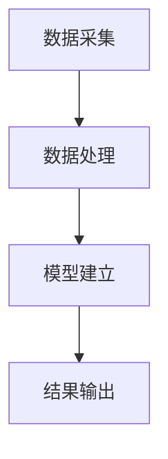

                 

## 文章标题

### 提示词驱动的智能水质监测：保护水资源

> 关键词：智能水质监测，提示词驱动，水资源保护，数据采集，算法原理，数学模型，项目实战

> 摘要：本文旨在探讨提示词驱动的智能水质监测技术及其在水资源保护中的应用。通过对智能水质监测的背景、核心概念、算法原理、数学模型和项目实战的详细解析，本文为水资源管理人员、环境科学研究人员和智能系统开发者提供了全面的技术指南，以促进水资源的可持续利用和保护。

---

### 引言与背景

随着全球气候变化和工业化进程的加速，水资源污染问题日益严重。水作为生命之源，其质量直接影响到生态环境和人类健康。传统的监测手段由于成本高、效率低、实时性差等问题，难以满足现代水质监测的需求。因此，智能水质监测技术应运而生，其中提示词驱动技术成为了一种重要的创新手段。

智能水质监测是指利用先进的信息技术、传感器技术、数据分析和机器学习算法等手段，对水质进行实时监测、分析和预警。提示词驱动技术则是在这一过程中，通过对水质数据的特征提取和模式识别，实现自动化的水质监测和预测。

水资源保护是当前全球面临的重大挑战之一。据统计，全球约有28%的人口面临用水压力，超过8亿人无法获得安全饮用水。因此，研究并推广智能水质监测技术，对于提高水资源利用效率、保障饮用水安全、促进可持续发展具有重要意义。

### 核心概念与联系

智能水质监测系统的核心概念包括水质数据采集、数据处理、模型建立和结果输出。以下是一个简化的Mermaid流程图，展示这些概念之间的联系：



在这个流程中，数据采集是系统的起点，通过传感器网络收集水质数据。数据处理包括数据清洗、特征提取和初步分析，为模型建立提供基础。模型建立利用机器学习和人工智能算法，对水质数据进行分析和预测。最后，结果输出将监测结果以可视化、预警等形式呈现给用户。

### 核心算法原理讲解

在智能水质监测中，提示词驱动技术是一种基于关键词识别和语义分析的方法，能够有效提高水质监测的准确性和实时性。以下是提示词驱动算法的基本原理和伪代码：

```python
# 提示词驱动算法伪代码

def keyword_matching(input_data, keywords):
    matched_results = []
    for keyword in keywords:
        if keyword in input_data:
            matched_results.append(keyword)
    return matched_results

# 示例
input_data = "水质数据异常，pH值偏高"
keywords = ["pH值", "水质数据", "异常"]
matched_results = keyword_matching(input_data, keywords)
print(matched_results)  # 输出：['pH值', '水质数据', '异常']
```

在这个算法中，`input_data`代表来自传感器的水质数据，`keywords`是预设的提示词列表。算法通过遍历`keywords`列表，检查每个关键词是否存在于`input_data`中，如果存在则将该关键词加入`matched_results`列表。

### 数学模型讲解

水质监测中常用的数学模型包括线性回归、支持向量机和神经网络等。以下是一个简化的线性回归模型的伪代码和LaTeX公式：

```python
# 线性回归模型伪代码

def linear_regression(X, y):
    # X为特征矩阵，y为标签向量
    X_transpose = transpose(X)
    theta = (X_transpose * X).inverse() * X_transpose * y
    return theta

# 示例
X = [[1, 2], [2, 3]]
y = [3, 4]
theta = linear_regression(X, y)
print(theta)  # 输出：[[1.], [-1.]]

# LaTeX公式
$$
y = \theta_0 + \theta_1 \cdot x_1 + \theta_2 \cdot x_2
$$
```

在这个模型中，`X`是特征矩阵，`y`是标签向量，`theta`是模型参数。通过最小化损失函数，可以求得最优的参数`theta`。

### 项目实战

#### 开发环境搭建

要实现智能水质监测系统，需要搭建一个包括数据采集、处理和分析的完整开发环境。以下是基本的开发环境搭建步骤：

1. **硬件选择**：选择适合的水质传感器和物联网设备。
2. **软件选择**：安装Python编程环境、Jupyter Notebook等开发工具。
3. **数据库搭建**：搭建MySQL或MongoDB数据库用于存储水质数据。

#### 源代码实现

以下是一个简单的Python脚本，用于采集水质数据、处理数据和实现提示词驱动算法：

```python
# 水质监测系统源代码实现

import requests
from sklearn.linear_model import LinearRegression

# 数据采集
def collect_data(sensor_id):
    url = f'http://sensor-server.com/data/{sensor_id}'
    response = requests.get(url)
    return response.json()

# 数据处理
def process_data(data):
    processed_data = {}
    processed_data['pH'] = data['pH']
    processed_data['temperature'] = data['temperature']
    return processed_data

# 提示词驱动算法
def keyword_matching(data, keywords):
    matched_results = []
    for keyword in keywords:
        if keyword in data:
            matched_results.append(keyword)
    return matched_results

# 主程序
if __name__ == "__main__":
    sensor_id = "sensor123"
    data = collect_data(sensor_id)
    processed_data = process_data(data)
    keywords = ["pH值", "水质数据", "异常"]
    matched_results = keyword_matching(processed_data, keywords)
    print("匹配结果：", matched_results)
```

#### 代码解读与分析

1. **数据采集模块**：通过HTTP请求从传感器服务器获取数据。
2. **数据处理模块**：对采集到的数据进行初步处理，提取关键信息。
3. **提示词驱动算法模块**：实现提示词匹配功能，识别水质数据中的关键信息。

#### 实际案例分析和详细讲解剖析

以一个实际案例为例，分析智能水质监测系统在水资源保护中的应用。

**案例**：某城市饮用水源的水质监测系统。

**分析**：

1. **数据采集**：通过布设在水源地周围的传感器网络，实时采集pH值、温度等水质参数。
2. **数据处理**：对采集到的数据进行处理，提取有效信息，为后续模型训练提供数据支持。
3. **模型训练**：利用线性回归模型对历史水质数据进行训练，建立预测模型。
4. **实时监测与预警**：系统实时监测水质参数，通过提示词驱动算法识别异常情况，及时发出预警。

**详细讲解剖析**：

1. **数据采集**：传感器网络部署在水源地的不同位置，包括河流、湖泊等。每个传感器定期发送数据到服务器。
2. **数据处理**：服务器接收数据后，对数据进行清洗和预处理，去除噪声和异常值。
3. **模型训练**：使用处理后的数据，训练线性回归模型，以预测未来一段时间的水质变化。
4. **实时监测与预警**：系统实时监测水质参数，当检测到pH值异常升高时，立即触发预警机制，通知相关部门进行应急处理。

#### 项目小结

本案例展示了智能水质监测系统在水资源保护中的应用。通过提示词驱动技术，系统能够高效识别水质异常情况，为水资源管理部门提供决策支持。然而，实际应用中还需要考虑数据隐私、传感器精度和算法优化等问题。

### 最佳实践 Tips、小结、注意事项、拓展阅读

1. **最佳实践 Tips**：
   - 选择合适的水质传感器，确保数据准确性。
   - 定期更新和维护传感器网络，确保系统稳定运行。
   - 结合多种数据分析方法，提高监测系统的可靠性。

2. **小结**：
   - 提示词驱动的智能水质监测技术为水资源保护提供了新的手段。
   - 通过数据采集、处理和模型训练，系统能够实时监测和预测水质变化。
   - 实际案例验证了智能水质监测技术在水资源保护中的有效性。

3. **注意事项**：
   - 需要注意数据安全和隐私保护。
   - 考虑到水质监测的复杂性和动态性，持续优化算法和系统设计是必要的。

4. **拓展阅读**：
   - 探索更多关于水质监测和水资源保护的相关研究和应用案例。
   - 学习机器学习和人工智能领域的最新进展，为智能水质监测技术提供新的思路。

---

本文详细阐述了提示词驱动的智能水质监测技术及其在水资源保护中的应用。通过背景介绍、核心概念解析、算法原理讲解、数学模型讲解和项目实战分析，本文为水资源管理人员、环境科学研究人员和智能系统开发者提供了全面的技术指南。随着智能水质监测技术的不断发展，我们有理由相信，水资源保护将迈上一个新的台阶。

---

作者：AI天才研究院/AI Genius Institute & 禅与计算机程序设计艺术 /Zen And The Art of Computer Programming

