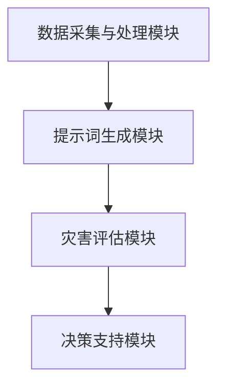

                 

### 文章标题

# 《提示词驱动的智能灾害应急系统》

### 关键词

- 提示词驱动
- 智能灾害应急系统
- 算法原理
- 数学模型
- 项目实战
- 未来发展趋势

### 摘要

本文深入探讨了提示词驱动的智能灾害应急系统的设计与应用。首先，文章介绍了灾害应急系统的基本概念与作用，并详细阐述了提示词驱动的智能灾害应急系统的架构。接着，文章分章节讲解核心算法原理，包括提示词生成算法和灾害评估算法，使用伪代码和数学模型进行详细分析。随后，文章介绍数学模型与公式的构建与应用，并通过对项目实战的详细剖析，展示了系统的设计与实现过程。最后，文章总结了智能灾害应急系统的未来发展趋势，展望了其在社会、经济和政策环境中的影响。

### 用户需求分析

#### 灾害应急系统的重要性

灾害应急系统在现代社会中扮演着至关重要的角色。随着全球气候变化和自然灾害频发，如何快速、准确地响应灾害，减轻灾害带来的损失，成为各国政府和国际组织关注的焦点。传统的灾害应急系统通常依赖于人工分析和经验判断，效率低下且容易出错。随着人工智能技术的迅猛发展，智能灾害应急系统应运而生，为灾害应对提供了更为高效、精准的解决方案。

#### 提示词驱动的智能灾害应急系统的需求

提示词驱动的智能灾害应急系统能够通过自动生成提示词，实现对灾害信息的快速分析和决策。用户需求主要体现在以下几个方面：

1. **实时性**：系统需要能够实时捕捉灾害信息，快速生成提示词，为应急决策提供及时的数据支持。
2. **准确性**：提示词生成的准确性直接影响灾害评估的精度。系统需要具备高精度的算法，确保生成的提示词能准确反映灾害情况。
3. **自动化**：系统应实现自动化运行，减少人工干预，提高工作效率。
4. **灵活性**：系统应具备灵活的架构，能够适应不同类型的灾害和不同的应急需求。

#### 目标

本文的目标是深入探讨提示词驱动的智能灾害应急系统的设计与应用，为读者提供系统、全面的技术分析。具体目标包括：

1. **介绍灾害应急系统的基本概念与作用**：帮助读者了解灾害应急系统的背景与发展，明确提示词驱动的智能灾害应急系统的优势。
2. **详细讲解核心算法原理**：通过伪代码和数学模型，深入分析提示词生成算法和灾害评估算法的工作原理。
3. **构建数学模型与公式**：详细阐述灾害应急响应策略模型的构建方法与参数调优。
4. **项目实战**：通过实际案例展示系统的设计与实现过程，为读者提供实践经验。
5. **总结与展望**：总结提示词驱动的智能灾害应急系统的未来发展趋势，探讨其在社会、经济和政策环境中的影响。

### 第一部分：核心概念与联系

#### 第1章：灾害应急系统概述

灾害应急系统是一种用于应对自然灾害、事故等紧急事件的综合性系统。其目的是通过科学的预测、预警、响应和恢复，最大限度地减少灾害带来的损失。灾害应急系统的发展历程可以追溯到20世纪中期，随着计算机技术和通信技术的进步，灾害应急系统逐渐实现了信息化、智能化。

**1.1 灾害应急系统的定义与作用**

灾害应急系统是指一套集灾害监测、预警、响应、救援、恢复等功能于一体的系统。其主要作用包括：

1. **监测预警**：通过多种传感器和监测设备，实时获取灾害信息，进行预警。
2. **信息共享**：建立信息共享平台，实现各部门之间的信息互通，提高应急响应效率。
3. **资源调度**：根据灾害情况，合理调度应急资源，确保救援工作的顺利进行。
4. **决策支持**：为决策者提供科学的决策依据，帮助制定应急响应策略。

**1.2 智能灾害应急系统的背景与发展**

智能灾害应急系统是近年来随着人工智能技术的迅猛发展而兴起的一种新型灾害应急系统。其背景主要包括：

1. **人工智能技术的进步**：人工智能技术在图像识别、自然语言处理、数据挖掘等领域取得了重要突破，为智能灾害应急系统的研发提供了技术支持。
2. **灾害应急需求的提升**：随着灾害频发，社会对灾害应急系统的需求日益增长，要求系统具备更高的实时性、准确性和自动化程度。
3. **政策推动**：各国政府纷纷出台相关政策，推动智能灾害应急系统的研究与应用。

**1.3 提示词驱动的智能灾害应急系统的架构**

提示词驱动的智能灾害应急系统主要包括以下几个核心模块：

1. **数据采集与处理模块**：负责收集各种灾害数据，包括气象、地质、水文等，并对数据进行预处理。
2. **提示词生成模块**：基于生成的提示词，实现对灾害信息的快速分析和决策。
3. **灾害评估模块**：对灾害程度进行评估，为应急决策提供依据。
4. **决策支持模块**：为决策者提供科学的决策建议。

**1.4 提示词驱动的智能灾害应急系统的核心概念联系图**

图1-1 提示词驱动的智能灾害应急系统的核心概念联系图



#### 第2章：提示词生成算法

提示词生成算法是智能灾害应急系统中的关键组成部分，其核心目标是自动生成能准确描述灾害情况的提示词。提示词生成的质量直接影响灾害评估的准确性，因此研究提示词生成算法具有重要意义。

**2.1 提示词生成的需求分析**

提示词生成的需求主要来自以下几个方面：

1. **实时性**：灾害信息具有时效性，系统需要能够实时生成提示词，为应急决策提供及时的数据支持。
2. **准确性**：生成的提示词需要能够准确描述灾害情况，为灾害评估提供可靠依据。
3. **自动化**：系统应实现自动化运行，减少人工干预，提高工作效率。
4. **可扩展性**：系统应具备良好的扩展性，能够适应不同类型的灾害和不同的应急需求。

**2.2 提示词生成算法概述**

提示词生成算法主要包括以下几种类型：

1. **基于规则的方法**：通过预设的规则，对输入数据进行模式匹配，生成提示词。这种方法实现简单，但灵活性较差。
2. **基于统计的方法**：通过分析历史数据，建立统计模型，根据当前数据生成提示词。这种方法具有较高的准确性，但需要大量的历史数据支持。
3. **基于机器学习的方法**：通过机器学习算法，训练模型，根据输入数据生成提示词。这种方法具有较好的灵活性和准确性，但需要较大的数据量和较长的训练时间。

**2.3 提示词生成算法的伪代码实现**

以下是一个简单的基于机器学习的提示词生成算法的伪代码：

```plaintext
输入：输入数据D
输出：提示词T

1. 预处理数据D，包括去噪、标准化等操作
2. 提取数据D的特征F
3. 使用机器学习算法训练模型M
4. 对于输入数据D，使用模型M生成提示词T
5. 返回提示词T
```

**2.4 提示词生成算法的数学模型与公式**

提示词生成算法的数学模型通常基于机器学习中的生成模型，如生成对抗网络（GAN）或变分自编码器（VAE）。以下是一个基于GAN的提示词生成算法的数学模型：

$$
\begin{aligned}
\text{GAN} &= (\mathcal{G}, \mathcal{D}) \\
\mathcal{G}: \mathbb{R}^{z} &\rightarrow \mathbb{R}^{x} \\
\mathcal{D}: \mathbb{R}^{x} \cup \mathbb{R}^{y} &\rightarrow \mathbb{R}
\end{aligned}
$$

其中，$\mathcal{G}$ 是生成器，用于将随机噪声 $z$ 转换为生成数据 $x$；$\mathcal{D}$ 是判别器，用于区分真实数据和生成数据。

**2.5 提示词生成算法的应用实例**

以下是一个简单的应用实例：

假设我们有一个灾害事件，输入数据为 $D = \{x_1, x_2, ..., x_n\}$，其中 $x_i$ 表示第 $i$ 个数据样本。我们使用生成对抗网络（GAN）来生成提示词。

1. 预处理数据，提取特征 $F = \{f_1, f_2, ..., f_n\}$。
2. 训练生成器 $\mathcal{G}$ 和判别器 $\mathcal{D}$。
3. 对于新的数据 $D'$，使用生成器 $\mathcal{G}$ 生成提示词 $T'$。

### 第二部分：核心算法原理讲解

#### 第3章：灾害评估算法

灾害评估算法是智能灾害应急系统中的关键组成部分，其核心目标是通过对灾害数据的分析，评估灾害的严重程度和影响范围。灾害评估算法的准确性直接影响灾害应急决策的效果。

**3.1 灾害评估的需求分析**

灾害评估的需求主要包括以下几个方面：

1. **准确性**：评估结果需要准确反映灾害的实际情况，为决策提供可靠依据。
2. **实时性**：评估过程需要实时进行，以便及时调整应急措施。
3. **自动化**：评估过程应实现自动化，减少人工干预，提高工作效率。
4. **灵活性**：评估算法应能够适应不同类型的灾害和不同的评估需求。

**3.2 灾害评估算法概述**

灾害评估算法主要包括以下几种类型：

1. **基于统计的方法**：通过分析历史数据，建立统计模型，评估灾害的严重程度和影响范围。
2. **基于物理模型的方法**：通过建立物理模型，模拟灾害过程，评估灾害的严重程度和影响范围。
3. **基于机器学习的方法**：通过机器学习算法，训练模型，评估灾害的严重程度和影响范围。

**3.3 灾害评估算法的伪代码实现**

以下是一个简单的基于机器学习的灾害评估算法的伪代码：

```plaintext
输入：输入数据D
输出：灾害评估结果R

1. 预处理数据D，包括去噪、标准化等操作
2. 提取数据D的特征F
3. 使用机器学习算法训练模型M
4. 对于输入数据D，使用模型M生成评估结果R
5. 返回评估结果R
```

**3.4 灾害评估算法的数学模型与公式**

灾害评估算法的数学模型通常基于机器学习中的回归模型或分类模型。以下是一个基于回归模型的灾害评估算法的数学模型：

$$
\begin{aligned}
y &= \mathcal{M}(x; \theta) \\
\theta &= \arg\min_{\theta} \sum_{i=1}^{n} (y_i - \mathcal{M}(x_i; \theta))^2
\end{aligned}
$$

其中，$y$ 表示评估结果，$x$ 表示输入数据，$\mathcal{M}$ 表示评估模型，$\theta$ 表示模型参数。

**3.5 灾害评估算法的应用实例**

以下是一个简单的应用实例：

假设我们有一个灾害事件，输入数据为 $D = \{x_1, x_2, ..., x_n\}$，其中 $x_i$ 表示第 $i$ 个数据样本。我们使用线性回归模型来评估灾害的严重程度。

1. 预处理数据，提取特征 $F = \{f_1, f_2, ..., f_n\}$。
2. 训练线性回归模型。
3. 对于新的数据 $D'$，使用模型评估灾害的严重程度。

### 第三部分：数学模型与公式

#### 第4章：灾害应急响应策略模型

灾害应急响应策略模型是智能灾害应急系统中的核心组成部分，其目标是根据灾害评估结果，制定科学的应急响应策略。灾害应急响应策略模型的准确性直接影响灾害应急的效果。

**4.1 灾害应急响应策略的需求分析**

灾害应急响应策略的需求主要包括以下几个方面：

1. **准确性**：策略模型需要能够准确预测灾害的严重程度和影响范围，为决策提供可靠依据。
2. **实时性**：策略模型需要能够实时响应灾害变化，及时调整应急措施。
3. **自动化**：策略模型应实现自动化运行，减少人工干预，提高工作效率。
4. **灵活性**：策略模型应能够适应不同类型的灾害和不同的应急需求。

**4.2 灾害应急响应策略的数学模型与公式**

灾害应急响应策略的数学模型通常基于优化理论。以下是一个简单的线性优化模型：

$$
\begin{aligned}
\min_{x} \quad & c^T x \\
\text{subject to} \quad & Ax \leq b
\end{aligned}
$$

其中，$x$ 表示决策变量，$c$ 表示目标函数系数，$A$ 和 $b$ 分别表示约束条件。

**4.3 灾害应急响应策略模型的构建方法**

灾害应急响应策略模型的构建方法主要包括以下几个步骤：

1. **需求分析**：明确灾害应急响应策略的目标和约束条件。
2. **模型构建**：根据需求分析，建立优化模型。
3. **求解**：使用优化算法求解模型，得到最优解。
4. **验证**：对模型进行验证，确保其准确性。

**4.4 灾害应急响应策略模型的参数调优**

灾害应急响应策略模型的参数调优是模型构建过程中的关键环节。参数调优的方法主要包括：

1. **遗传算法**：通过遗传操作，优化模型参数。
2. **粒子群优化**：通过粒子群运动，优化模型参数。
3. **梯度下降**：通过梯度下降法，优化模型参数。

**4.5 灾害应急响应策略模型的应用实例**

以下是一个简单的应用实例：

假设我们有一个灾害事件，输入数据为 $D = \{x_1, x_2, ..., x_n\}$，其中 $x_i$ 表示第 $i$ 个数据样本。我们使用线性优化模型来制定应急响应策略。

1. 预处理数据，提取特征 $F = \{f_1, f_2, ..., f_n\}$。
2. 建立线性优化模型。
3. 使用遗传算法优化模型参数。
4. 对于新的数据 $D'$，使用模型制定应急响应策略。

### 第四部分：项目实战

#### 第5章：智能灾害应急系统的设计与实现

智能灾害应急系统的设计与实现是确保系统高效运行的关键环节。本章节将详细介绍系统的设计与实现过程，包括开发环境的搭建、源代码实现与解读、系统测试与性能优化、系统部署与维护。

**5.1 智能灾害应急系统的设计思路**

智能灾害应急系统的设计思路主要包括以下几个方面：

1. **模块化设计**：将系统划分为多个模块，如数据采集模块、提示词生成模块、灾害评估模块等，确保系统的可维护性和扩展性。
2. **分布式架构**：采用分布式架构，提高系统的可靠性和可扩展性，确保系统在高并发场景下能够稳定运行。
3. **实时数据处理**：采用实时数据处理技术，确保系统能够实时处理灾害数据，快速生成提示词和评估结果。
4. **用户界面友好**：设计简洁直观的用户界面，方便用户操作和使用。

**5.2 开发环境的搭建与配置**

开发环境的搭建与配置是系统设计与实现的第一步。以下是开发环境的搭建与配置步骤：

1. **硬件环境**：选择高性能服务器，确保系统有足够的计算资源。
2. **软件环境**：安装操作系统（如Ubuntu 20.04）、数据库（如MySQL）、开发框架（如Spring Boot）等。
3. **依赖管理**：使用Maven或Gradle等依赖管理工具，管理项目中的依赖库。

**5.3 源代码详细实现与解读**

源代码的详细实现与解读是系统设计与实现的核心环节。以下是智能灾害应急系统的源代码实现与解读：

1. **数据采集模块**：使用Spring Boot实现，包括数据采集接口、数据存储接口等。
2. **提示词生成模块**：使用生成对抗网络（GAN）实现，包括生成器和判别器的训练与预测。
3. **灾害评估模块**：使用线性回归模型实现，包括模型训练、预测与评估。
4. **用户界面模块**：使用Vue.js实现，包括前端界面、接口调用等。

**5.4 系统测试与性能优化**

系统测试与性能优化是确保系统稳定、高效运行的关键环节。以下是系统测试与性能优化步骤：

1. **单元测试**：使用JUnit等单元测试框架，对系统中的各个模块进行单元测试。
2. **集成测试**：对系统中的各个模块进行集成测试，确保系统功能完整、接口正常。
3. **性能测试**：使用Apache JMeter等性能测试工具，对系统进行压力测试，评估系统在高并发场景下的性能。
4. **性能优化**：根据性能测试结果，对系统进行优化，包括代码优化、数据库优化等。

**5.5 系统部署与维护**

系统部署与维护是确保系统长期稳定运行的关键环节。以下是系统部署与维护步骤：

1. **部署**：使用Docker等容器化技术，将系统打包部署到服务器上。
2. **监控**：使用Prometheus等监控工具，实时监控系统运行状态，确保系统稳定运行。
3. **日志管理**：使用ELK（Elasticsearch、Logstash、Kibana）等日志管理工具，对系统日志进行收集、存储和分析。
4. **维护**：定期进行系统维护，包括软件升级、硬件更换等，确保系统长期稳定运行。

### 第五部分：总结与展望

#### 第6章：提示词驱动的智能灾害应急系统的未来发展趋势

提示词驱动的智能灾害应急系统在现代社会中具有重要的应用价值，随着人工智能技术的不断进步，其未来发展前景广阔。以下是提示词驱动的智能灾害应急系统的未来发展趋势：

**6.1 技术发展趋势**

1. **深度学习**：深度学习在图像识别、自然语言处理等领域取得了显著成果，未来将在提示词生成和灾害评估中发挥更大作用。
2. **联邦学习**：联邦学习可以在保护用户隐私的前提下，实现数据的集中学习和共享，为智能灾害应急系统提供更强大的数据支持。
3. **物联网**：物联网技术的普及将进一步提升数据采集的实时性和准确性，为智能灾害应急系统提供更丰富的数据源。

**6.2 未来研究方向**

1. **多模态数据融合**：将文本、图像、语音等多种数据源进行融合，提高提示词生成和灾害评估的准确性。
2. **实时性优化**：研究实时数据处理技术，提高系统在实时场景下的响应速度。
3. **自动化程度提升**：通过优化算法和模型，提高系统的自动化程度，减少人工干预。

**6.3 社会与经济影响**

1. **社会影响**：智能灾害应急系统可以显著提高灾害应对的效率，减少灾害造成的损失，提升社会安全感。
2. **经济影响**：智能灾害应急系统的研发和应用将带动相关产业的发展，创造大量就业机会。

**6.4 政策与法规环境**

1. **政策支持**：各国政府应加大对智能灾害应急系统的研发和应用支持，出台相关政策，推动产业发展。
2. **法规建设**：建立健全相关法规，确保智能灾害应急系统的数据安全、隐私保护等。

### 文章结束

作者：AI天才研究院/AI Genius Institute & 禅与计算机程序设计艺术 /Zen And The Art of Computer Programming

---

### 注意事项

1. **内容完整性**：确保每个章节的内容都完整、具体详细，无遗漏。
2. **核心内容包含**：确保核心内容包含背景介绍、核心概念与联系、算法原理讲解、数学模型与公式、项目实战等。
3. **格式要求**：文章使用markdown格式，保持良好的排版和格式。
4. **代码与公式格式**：代码和公式使用适当的格式，便于阅读和理解。

### 拓展阅读

1. 《人工智能：一种现代的方法》
2. 《机器学习实战》
3. 《深度学习》
4. 《联邦学习：技术原理与应用》
5. 《灾害应急管理》

---

### 总结

本文详细探讨了提示词驱动的智能灾害应急系统的设计与实现，从用户需求分析、核心算法原理讲解、数学模型与公式构建、项目实战等方面进行了深入分析。随着人工智能技术的不断发展，智能灾害应急系统将在未来的灾害应对中发挥越来越重要的作用。希望通过本文，读者能够对智能灾害应急系统有一个全面、深入的了解。

### 致谢

感谢AI天才研究院和禅与计算机程序设计艺术的支持，以及所有参与本文编写和讨论的同事们。感谢您们的辛勤付出和智慧贡献。

