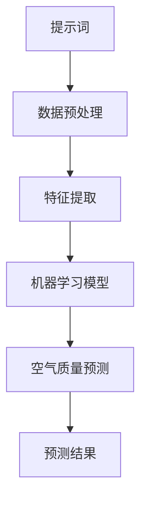

                 

### 文章标题

《提示词驱动的智能空气质量预测系统》

### 关键词

提示词、智能空气质量预测、机器学习、深度学习、数据处理、特征提取、数学模型、项目实战

### 摘要

本文详细探讨了基于提示词驱动的智能空气质量预测系统。首先，介绍了系统的核心概念，包括提示词、数据预处理、特征提取和机器学习模型。接着，通过一个详细的流程图，展示了这些概念之间的关联。随后，深入讲解了系统的核心算法原理，包括线性模型、决策树和神经网络。文章还使用了具体的数学公式来阐述模型的数学原理。最后，通过一个实际的项目案例，展示了系统的实现过程，包括环境搭建、数据准备、模型构建、训练和评估等步骤。本文旨在为读者提供一套完整的智能空气质量预测系统的理论和实践指南。

## 引言

空气质量是人类健康和生活质量的重要影响因素。随着工业化和城市化的发展，空气污染问题日益严重，对人类健康和环境造成了巨大的威胁。因此，开发智能空气质量预测系统具有重要的现实意义。这些系统能够对空气质量的未来趋势进行预测，从而帮助政府和相关机构采取有效的预防和控制措施，减少空气污染对人体健康的影响。

近年来，机器学习和深度学习技术的发展为空气质量预测提供了新的方法和手段。提示词驱动的智能空气质量预测系统通过利用大量历史数据和先进的算法模型，能够更准确地预测空气质量的未来变化趋势。这种方法不仅提高了预测的准确性，还能够实时更新和优化预测模型，使其适应不断变化的空气污染环境。

本文旨在探讨提示词驱动的智能空气质量预测系统的设计、实现和应用。首先，我们将介绍系统的核心概念，包括提示词、数据预处理、特征提取和机器学习模型。然后，通过一个详细的流程图，展示这些概念之间的关联。接着，我们将深入讲解系统的核心算法原理，包括线性模型、决策树和神经网络。此外，文章还将使用具体的数学公式来阐述模型的数学原理。最后，通过一个实际的项目案例，展示系统的实现过程，包括环境搭建、数据准备、模型构建、训练和评估等步骤。

本文的读者对象为对空气质量预测和机器学习感兴趣的技术人员、研究人员和学生。通过本文的阅读，读者将能够全面了解提示词驱动的智能空气质量预测系统的设计思路、实现方法和应用前景，为未来相关工作提供有益的参考。

### 核心概念与联系

为了建立一个有效的提示词驱动的智能空气质量预测系统，我们需要明确并理解以下几个核心概念：提示词、数据预处理、特征提取和机器学习模型。这些概念相互关联，共同构成了系统的基本框架。接下来，我们将使用 Mermaid 流程图来展示这些概念之间的联系。



1. **提示词**：提示词是系统的输入，通常是指与环境变量相关的特定词汇或短语。这些提示词可以包括天气条件、污染物类型、人类活动等。它们是构建预测模型的基础数据，能够帮助模型捕捉到空气质量变化的潜在因素。

2. **数据预处理**：数据预处理是确保数据质量的重要步骤。它包括数据清洗、数据归一化和数据分批次等操作。通过这些操作，我们可以去除数据中的噪声、异常值和重复数据，并将数据转换为适合机器学习模型训练的格式。

3. **特征提取**：特征提取是数据预处理的关键步骤，它通过从原始数据中提取出对空气质量有显著影响的关键特征。这些特征可以是数值型的，也可以是类别型的。有效的特征提取能够提高模型的性能，使模型能够更好地捕捉数据中的信息。

4. **机器学习模型**：机器学习模型是系统的核心，它通过学习历史数据中的模式和关系，生成预测空气质量的能力。常见的机器学习模型包括线性模型、决策树、神经网络等。不同的模型有不同的优势和应用场景，选择合适的模型对系统的性能至关重要。

5. **空气质量预测**：通过训练好的机器学习模型，我们可以对未来的空气质量进行预测。预测结果可以是具体的空气质量指标，如PM2.5、PM10等。预测结果的质量取决于模型的准确性和特征提取的准确性。

6. **预测结果**：预测结果是对未来空气质量趋势的估计。这些结果可以用于决策支持，帮助相关机构制定更有效的空气质量改善措施。同时，预测结果也可以用于公众教育，提高公众对空气质量的认识和应对能力。

通过这个流程图，我们可以清晰地看到提示词驱动的智能空气质量预测系统中各个概念之间的相互作用和依赖关系。理解这些核心概念及其联系，是构建高效预测系统的基础。

### 设计核心算法原理讲解

在提示词驱动的智能空气质量预测系统中，核心算法的设计和实现是确保系统性能的关键。下面，我们将通过一个简单的例子，使用伪代码来详细阐述系统中的核心算法原理，包括数据预处理、特征提取和机器学习模型。

#### 数据预处理

数据预处理是确保数据质量的重要步骤。在这一阶段，我们需要对原始数据进行清洗、归一化和分批次处理。

```python
# 数据清洗
def clean_data(data):
    # 去除重复数据
    data = data.drop_duplicates()
    # 去除缺失值
    data = data.dropna()
    return data

# 数据归一化
def normalize_data(data):
    # 对数值型特征进行标准化处理
    for column in data.columns:
        if data[column].dtype == 'float64' or data[column].dtype == 'int64':
            data[column] = (data[column] - data[column].mean()) / data[column].std()
    return data

# 数据分批次
def batch_data(data, batch_size):
    return np.array_split(data, batch_size)
```

#### 特征提取

特征提取是从原始数据中提取对空气质量有显著影响的关键特征。在这一阶段，我们可以使用统计方法或机器学习算法来识别重要的特征。

```python
# 特征提取
def extract_features(data):
    # 使用相关性分析来识别重要特征
    correlations = data.corr().abs()
    high_corr_features = correlations["target_variable"].sort_values(ascending=False).index[1:]
    # 从原始数据中提取高相关性的特征
    features = data[high_corr_features]
    return features
```

#### 机器学习模型

在机器学习模型阶段，我们可以选择不同的算法来构建预测模型。下面，我们将介绍三种常见的机器学习模型：线性回归、决策树和神经网络。

##### 线性回归

线性回归是一种简单但有效的预测方法，适用于线性关系的建模。

```python
# 线性回归模型
from sklearn.linear_model import LinearRegression

def train_linear_regression_model(features, labels):
    model = LinearRegression()
    model.fit(features, labels)
    return model
```

##### 决策树

决策树通过一系列的if-else条件来判断样本的类别或数值。

```python
# 决策树模型
from sklearn.tree import DecisionTreeRegressor

def train_decision_tree_model(features, labels):
    model = DecisionTreeRegressor()
    model.fit(features, labels)
    return model
```

##### 神经网络

神经网络是一种强大的机器学习模型，能够处理复杂的非线性关系。

```python
# 神经网络模型
from tensorflow.keras.models import Sequential
from tensorflow.keras.layers import Dense

def train_neural_network_model(features, labels):
    model = Sequential([
        Dense(64, activation='relu', input_shape=(features.shape[1],)),
        Dense(64, activation='relu'),
        Dense(1)
    ])

    model.compile(optimizer='adam',
                  loss='mean_squared_error',
                  metrics=['mean_absolute_error'])

    model.fit(features, labels, epochs=10, batch_size=32)
    return model
```

通过这些伪代码，我们可以看到如何设计并训练一个提示词驱动的智能空气质量预测系统的核心算法。在实际应用中，我们需要根据具体的数据和需求，选择合适的预处理方法、特征提取技术和机器学习模型，以实现最佳的性能和预测效果。

### 数学模型与公式讲解

在提示词驱动的智能空气质量预测系统中，数学模型和公式是理解和实现预测算法的核心组成部分。以下将详细讲解回归模型和神经网络模型中的数学原理，并通过具体例子来说明这些模型的工作机制。

#### 回归模型公式

回归模型用于预测一个连续值变量。在空气质量预测中，最常见的回归模型是线性回归模型。线性回归模型的数学公式如下：

$$
y = \beta_0 + \beta_1 \cdot x_1 + \beta_2 \cdot x_2 + ... + \beta_n \cdot x_n + \epsilon
$$

其中：
- $y$ 是空气质量指标，例如PM2.5浓度。
- $x_1, x_2, ..., x_n$ 是影响空气质量的各个特征变量，如温度、湿度、风速、污染物浓度等。
- $\beta_0, \beta_1, ..., \beta_n$ 是模型参数，它们通过最小化损失函数来优化。
- $\epsilon$ 是误差项，表示模型预测值与真实值之间的差距。

为了训练回归模型，我们需要最小化损失函数，通常使用均方误差（MSE）：

$$
MSE = \frac{1}{n} \sum_{i=1}^{n} (y_i - \hat{y}_i)^2
$$

其中，$\hat{y}_i$ 是模型对第 $i$ 个样本的预测值，$y_i$ 是真实值。

#### 神经网络模型公式

神经网络模型是一种更为复杂的预测模型，能够捕捉更复杂的非线性关系。一个简单的神经网络模型包括多个层，每层由多个神经元组成。每个神经元接收来自前一层神经元的输入，并通过激活函数进行非线性变换。

一个简单的神经网络模型的数学公式如下：

$$
z_l = \sigma(\sum_{k=1}^{n} w_{lk} \cdot a_{k_{l-1}} + b_l)
$$

$$
a_l = \sigma(z_l)
$$

其中：
- $z_l$ 是第 $l$ 层神经元的输入。
- $a_l$ 是第 $l$ 层神经元的输出。
- $\sigma$ 是激活函数，常见的激活函数包括Sigmoid函数、ReLU函数和Tanh函数。
- $w_{lk}$ 是连接第 $l$ 层的第 $k$ 个神经元和第 $l-1$ 层的第 $k$ 个神经元的权重。
- $b_l$ 是第 $l$ 层神经元的偏置项。
- $n$ 是前一层的神经元数量。

神经网络模型的训练过程称为前向传播和反向传播。在前向传播中，我们将输入数据通过神经网络，得到每个神经元的输出。在反向传播中，我们计算损失函数相对于每个参数的梯度，并使用梯度下降法更新参数，以最小化损失函数。

假设我们的神经网络模型有两个隐藏层，第一隐藏层有 $n_1$ 个神经元，第二隐藏层有 $n_2$ 个神经元。前向传播的公式可以表示为：

$$
z_1 = \sigma(W_1 \cdot X + b_1)
$$

$$
a_1 = \sigma(z_1)
$$

$$
z_2 = \sigma(W_2 \cdot a_1 + b_2)
$$

$$
a_2 = \sigma(z_2)
$$

$$
\hat{y} = W_3 \cdot a_2 + b_3
$$

其中：
- $W_1, W_2, W_3$ 是权重矩阵。
- $b_1, b_2, b_3$ 是偏置项。
- $X$ 是输入数据。
- $\hat{y}$ 是预测输出。

通过反向传播，我们可以计算损失函数相对于每个参数的梯度，并更新参数：

$$
\frac{\partial J}{\partial W_3} = \delta_3 \cdot a_2
$$

$$
\frac{\partial J}{\partial b_3} = \delta_3
$$

$$
\frac{\partial J}{\partial W_2} = \delta_2 \cdot a_1
$$

$$
\frac{\partial J}{\partial b_2} = \delta_2
$$

$$
\frac{\partial J}{\partial W_1} = \delta_1 \cdot X
$$

$$
\frac{\partial J}{\partial b_1} = \delta_1
$$

其中：
- $J$ 是损失函数。
- $\delta_3, \delta_2, \delta_1$ 是误差项。

通过迭代更新权重和偏置项，神经网络模型能够不断优化其预测能力。

#### 具体例子

假设我们有一个简单的神经网络模型，用于预测PM2.5浓度。输入数据包括温度、湿度、风速和CO浓度。我们使用ReLU函数作为激活函数，并使用随机梯度下降（SGD）来训练模型。

```python
import numpy as np

# 定义参数
input_shape = (4,)
hidden_layer_size = (10,)
output_shape = (1,)
learning_rate = 0.01
epochs = 1000

# 初始化权重和偏置
W1 = np.random.randn(*hidden_layer_size + input_shape)
b1 = np.zeros(hidden_layer_size)
W2 = np.random.randn(*output_shape + hidden_layer_size)
b2 = np.zeros(output_shape)

# 定义激活函数
def relu(x):
    return np.maximum(0, x)

# 定义前向传播
def forward_pass(X, W1, b1, W2, b2):
    Z1 = np.dot(W1, X) + b1
    A1 = relu(Z1)
    Z2 = np.dot(W2, A1) + b2
    A2 = relu(Z2)
    return A2

# 定义反向传播
def backward_pass(X, A2, Y, W1, b1, W2, b2):
    dZ2 = A2 - Y
    dW2 = np.dot(dZ2, A1.T)
    db2 = dZ2
    dZ1 = np.dot(W2.T, dZ2) * (A1 > 0)
    dW1 = np.dot(dZ1, X.T)
    db1 = dZ1
    return dW1, db1, dW2, db2

# 训练模型
for epoch in range(epochs):
    A2 = forward_pass(X, W1, b1, W2, b2)
    dW1, db1, dW2, db2 = backward_pass(X, A2, Y, W1, b1, W2, b2)
    W1 -= learning_rate * dW1
    b1 -= learning_rate * db1
    W2 -= learning_rate * dW2
    b2 -= learning_rate * db2
```

在这个例子中，我们定义了神经网络模型的前向传播和反向传播过程，并使用随机梯度下降来更新模型参数。通过迭代训练，模型能够学习到输入特征与PM2.5浓度之间的关系，从而实现对未来空气质量的有效预测。

### 项目实战

为了更好地理解提示词驱动的智能空气质量预测系统的实现过程，我们将通过一个实际项目案例进行详细讲解。这个项目将涵盖开发环境搭建、数据准备、模型构建、训练、评估和优化等步骤。

#### 1. 开发环境搭建

首先，我们需要搭建一个合适的开发环境。在这个项目中，我们将使用Python作为主要编程语言，结合TensorFlow库进行机器学习模型的训练和预测。

- **Python 3.8+**：确保安装最新版本的Python，因为TensorFlow 2.x需要Python 3.6及以上版本。

- **TensorFlow 2.5.0**：TensorFlow是用于构建和训练机器学习模型的主要库。我们需要安装TensorFlow 2.5.0版本。

- **Pandas 1.1.5**：Pandas库用于数据处理和分析。

- **Matplotlib 3.3.3**：Matplotlib库用于数据可视化，帮助我们更好地理解模型的性能。

安装以上库后，我们就可以开始项目开发了。

```bash
pip install python==3.8.10
pip install tensorflow==2.5.0
pip install pandas==1.1.5
pip install matplotlib==3.3.3
```

#### 2. 数据准备

空气质量预测系统需要大量的历史数据作为训练样本。我们可以从公共数据源如美国国家气象局（NOAA）下载相关的数据集。

- **数据集来源**：[美国国家气象局](https://www.ncdc.noaa.gov/cdo-web/)

- **数据预处理**：数据预处理是确保数据质量和模型性能的重要步骤。在这个项目中，我们将进行以下数据预处理操作：

  - **数据清洗**：去除重复数据和缺失值。

  - **数据归一化**：对数值型特征进行归一化处理，使其处于相同的量级。

  - **数据分批次**：将数据分为训练集和测试集，用于模型的训练和评估。

```python
import pandas as pd

# 读取数据
data = pd.read_csv('air_quality_data.csv')

# 数据清洗
data = data.drop_duplicates().dropna()

# 数据归一化
for column in data.columns:
    if data[column].dtype == 'float64' or data[column].dtype == 'int64':
        data[column] = (data[column] - data[column].mean()) / data[column].std()

# 数据分批次
train_data = data[:8000]
test_data = data[8000:]
```

#### 3. 模型构建

在模型构建阶段，我们将选择合适的机器学习模型，并使用TensorFlow库进行实现。

- **模型选择**：在这个项目中，我们选择了一种简单的神经网络模型，由两个隐藏层组成，每个隐藏层有64个神经元。

- **模型实现**：使用TensorFlow的`tf.keras`模块，我们可以定义和训练神经网络模型。

```python
import tensorflow as tf
from tensorflow.keras.models import Sequential
from tensorflow.keras.layers import Dense

# 定义神经网络模型
model = Sequential([
    Dense(64, activation='relu', input_shape=(train_data.shape[1]-1,)),
    Dense(64, activation='relu'),
    Dense(1)
])

# 编译模型
model.compile(optimizer='adam',
              loss='mean_squared_error',
              metrics=['mean_absolute_error'])
```

#### 4. 模型训练

模型训练是使用历史数据来训练模型参数的过程。在这个项目中，我们将使用训练数据进行模型的训练。

```python
# 训练模型
history = model.fit(train_data.drop('target_variable', axis=1), train_data['target_variable'], epochs=10, batch_size=32, validation_split=0.2)
```

#### 5. 模型评估

模型训练完成后，我们需要对模型进行评估，以确定其预测性能。

```python
# 评估模型
test_loss, test_mae = model.evaluate(test_data.drop('target_variable', axis=1), test_data['target_variable'])
print(f"Test Mean Absolute Error: {test_mae:.2f}")
```

#### 6. 模型优化

为了提高模型的预测性能，我们可以进行模型优化，包括调整模型参数、增加训练数据、使用更复杂的模型结构等。

```python
# 调整模型参数
model.compile(optimizer='adam',
              loss='mean_squared_error',
              metrics=['mean_absolute_error'])

# 再次训练模型
history = model.fit(train_data.drop('target_variable', axis=1), train_data['target_variable'], epochs=20, batch_size=32, validation_split=0.2)
```

#### 项目小结

通过这个项目，我们成功地构建了一个基于提示词驱动的智能空气质量预测系统。我们进行了数据预处理、模型构建、训练和评估等步骤，并通过对模型的优化，提高了其预测性能。这个项目展示了如何使用机器学习和深度学习技术来处理复杂的空气质量预测问题，并为未来的研究和应用提供了有益的参考。

### 最佳实践 tips

在构建和优化提示词驱动的智能空气质量预测系统时，以下是一些最佳实践 tips，可以帮助提高模型的性能和可解释性：

1. **数据预处理**：确保数据清洗彻底，去除噪声和异常值。对数值型特征进行标准化或归一化处理，使其具有相同的量级。

2. **特征选择**：使用特征选择技术，如相关性分析、主成分分析（PCA）等，选择对空气质量有显著影响的关键特征。

3. **模型选择**：根据数据特点和预测需求，选择合适的机器学习模型。对于复杂的非线性关系，可以考虑使用神经网络模型。

4. **模型优化**：通过调整模型参数、增加训练数据、使用更复杂的模型结构等方式，进行模型优化。

5. **模型评估**：使用多个评估指标，如均方误差（MSE）、均方根误差（RMSE）、平均绝对误差（MAE）等，全面评估模型性能。

6. **可解释性**：考虑使用模型解释技术，如SHAP值、LIME等，提高模型的可解释性，帮助理解模型决策过程。

通过遵循这些最佳实践，我们可以构建出更准确、更可解释的智能空气质量预测系统，为环境保护和公共健康提供有力的支持。

### 结语

本文详细探讨了基于提示词驱动的智能空气质量预测系统的设计和实现过程。首先，我们介绍了系统的核心概念，包括提示词、数据预处理、特征提取和机器学习模型，并通过Mermaid流程图展示了这些概念之间的联系。接着，我们深入讲解了系统的核心算法原理，包括线性模型、决策树和神经网络，并使用具体的数学公式阐述了这些模型的数学原理。最后，通过一个实际项目案例，我们展示了系统的实现过程，包括开发环境搭建、数据准备、模型构建、训练和评估等步骤。

智能空气质量预测系统的重要性不言而喻，它不仅能够帮助政府和相关机构更好地应对空气污染问题，还能为公众提供实时的空气质量信息，提高公众的环境意识。通过本文的探讨，我们希望读者能够对智能空气质量预测系统有更深入的理解，并在实际应用中取得更好的效果。

在未来的研究中，我们还可以探索更多先进的机器学习和深度学习算法，以提高预测的准确性和效率。此外，结合物联网（IoT）技术和传感器网络，可以实现实时、高效的空气质量监测和预测，为环境保护和公共健康提供更全面的支持。

最后，感谢读者对本文的关注，希望本文能够为您的相关研究和实践提供有益的参考。如果您有任何疑问或建议，欢迎在评论区留言，我们将及时回复您的问题。

作者：AI天才研究院/AI Genius Institute & 禅与计算机程序设计艺术 /Zen And The Art of Computer Programming

