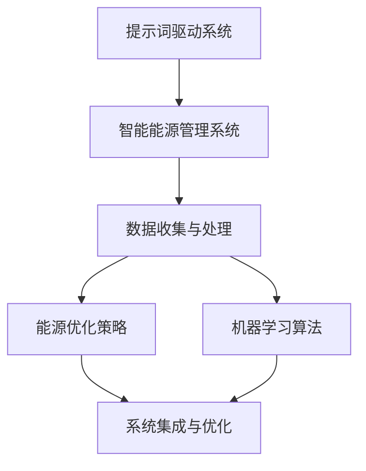
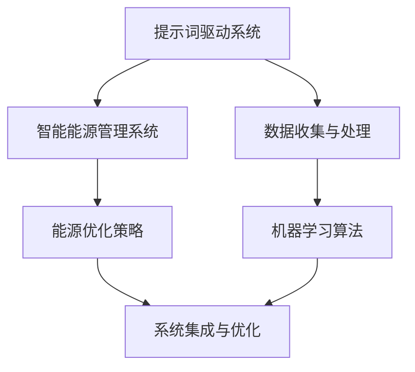

                 


### 背景介绍

随着全球能源需求的不断增长和环境保护意识的提升，如何实现能源的高效利用和优化管理已成为一个重要课题。智能能源管理系统作为现代能源领域的一个重要研究方向，旨在通过先进的信息技术手段，实现能源供应与需求的智能化管理，以提高能源利用效率，降低能源消耗和减少环境污染。

智能能源管理系统通常包括数据收集与处理、能源优化策略、机器学习算法和系统集成与优化等多个环节。其中，数据收集与处理是整个系统的基础，通过传感器和智能设备实时采集能源使用数据，并对其进行预处理，以确保数据的质量和一致性。能源优化策略则是在分析历史数据和实时数据的基础上，制定出最优的能源使用计划，以实现能源的优化配置。机器学习算法在这个过程中发挥着重要作用，通过训练和优化模型，实现对能源消耗行为的预测和分析，从而为优化策略提供支持。最后，系统集成与优化则是对整个智能能源管理系统的整合和提升，通过优化系统的各个模块，提高系统的整体性能和可靠性。

然而，传统的智能能源管理系统在处理大规模数据、实现实时优化和应对复杂环境变化方面仍存在一定的局限性。因此，如何进一步提高系统的智能化水平，提升其适应性和灵活性，成为当前研究的热点之一。

### 核心概念与联系

为了深入理解提示词驱动的智能能源管理系统，我们首先需要明确几个核心概念，并探讨它们之间的相互关系。

**1. 提示词驱动系统**

提示词驱动系统是一种基于用户输入或上下文信息的自动化处理系统。它通过分析用户提供的提示词或上下文信息，自动执行一系列预定义的操作，以提高系统的响应速度和智能化水平。在智能能源管理系统中，提示词可以是用户输入的能源使用需求、天气变化等信息，系统会根据这些信息实时调整能源使用策略，以达到最佳能源利用效果。

**2. 智能能源管理系统**

智能能源管理系统是一种集成多种技术和算法的综合性系统，旨在实现能源的高效管理和优化。它包括数据收集与处理、能源优化策略、机器学习算法和系统集成与优化等多个环节。数据收集与处理环节负责实时采集和处理能源使用数据，为后续的优化提供基础数据。能源优化策略则是在分析历史数据和实时数据的基础上，制定出最优的能源使用计划。机器学习算法通过对数据进行分析和建模，实现对能源消耗行为的预测和优化。系统集成与优化则是对整个系统的整合和提升，以提高系统的整体性能和可靠性。

**3. 数据收集与处理**

数据收集与处理是智能能源管理系统的核心环节之一。它主要通过传感器和智能设备实时采集能源使用数据，包括电力、天然气、热水等能源的使用情况。这些数据经过预处理后，会存储在数据库中，以供后续分析和处理。数据收集与处理的目的是确保数据的准确性和完整性，为系统的优化提供可靠的数据支持。

**4. 能源优化策略**

能源优化策略是智能能源管理系统的重要组成部分。它通过对历史数据和实时数据进行分析，制定出最优的能源使用计划。优化策略可以根据不同场景和需求，实现能源的动态调整和优化，以提高能源利用效率。例如，在高峰用电时段，系统可以优先使用清洁能源，以减少对传统化石能源的依赖。

**5. 机器学习算法**

机器学习算法在智能能源管理系统中发挥着关键作用。通过对大量历史数据的分析和建模，机器学习算法可以预测能源消耗趋势，识别能源使用模式，为优化策略提供支持。常见的机器学习算法包括线性回归、决策树、支持向量机、神经网络等。

**6. 系统集成与优化**

系统集成与优化是确保智能能源管理系统稳定运行和高效性能的关键。它涉及系统的各个模块，包括硬件设备、软件系统、通信网络等，通过对系统进行集成和优化，可以提高系统的可靠性和性能。系统集成与优化还包括对系统进行持续监控和评估，以确保系统在运行过程中始终保持最佳状态。

### Mermaid流程图展示各概念关系

为了更直观地展示各概念之间的联系，我们可以使用Mermaid流程图来表示：



通过上述流程图，我们可以清晰地看到提示词驱动系统与智能能源管理系统之间的关联，以及各个子系统的相互影响和作用。这为我们深入研究和开发提示词驱动的智能能源管理系统提供了重要的理论依据和实践指导。在接下来的章节中，我们将进一步详细探讨这些核心概念和关系，以帮助读者全面理解智能能源管理系统的原理和应用。

### 核心算法原理讲解

在本节中，我们将详细讲解智能能源管理系统的核心算法原理，包括能源优化算法的基本概念、原理和具体实现。这些算法是实现智能能源管理系统高效运行的关键。

#### 能源优化算法的基本概念

能源优化算法是一种用于优化能源使用和配置的算法，旨在通过数学模型和优化策略，找到能源使用过程中的最优解。在智能能源管理系统中，能源优化算法主要用于制定能源使用计划，以实现能源的高效利用和节约。

**1. 能源优化算法的目标**

能源优化算法的主要目标是：

- 减少能源消耗：通过优化能源使用计划，减少能源消耗，降低能源成本。
- 提高能源利用效率：通过合理配置能源资源，提高能源的利用效率。
- 减少环境污染：通过优先使用清洁能源，减少对传统化石能源的依赖，降低环境污染。

**2. 能源优化算法的挑战**

- 大规模数据：能源管理系统需要处理来自各种传感器和设备的海量数据，数据量大且复杂。
- 实时性：能源优化算法需要实时分析数据，快速响应能源使用需求的变化。
- 多目标优化：能源优化算法需要同时考虑多个目标，如能源成本、能源效率、环保等，进行多目标优化。

#### 能源优化算法的基本原理

能源优化算法的基本原理是基于数学模型和优化策略，通过计算和分析，找到最优的能源使用方案。具体包括以下几个步骤：

**1. 数据收集与处理**

首先，从传感器和设备中收集能源使用数据，包括电力、天然气、热水等能源的使用情况。然后，对数据进行预处理，包括数据清洗、去噪、归一化等，以确保数据的质量和一致性。

**2. 建立数学模型**

根据能源使用数据，建立数学模型，描述能源消耗与能源使用量之间的关系。常见的数学模型包括线性模型、非线性模型、多变量模型等。数学模型用于描述能源系统的结构和行为，为优化算法提供基础。

**3. 设计优化策略**

基于数学模型，设计优化策略，以找到最优的能源使用方案。优化策略可以基于目标函数、约束条件等，通过计算和分析，找到最优解。

**4. 实施优化算法**

选择合适的优化算法，如线性规划、整数规划、遗传算法、模拟退火算法等，实施优化计算，找到最优的能源使用方案。

#### 能源优化算法的伪代码示例

以下是一个简单的能源优化算法的伪代码示例：

```python
# 伪代码：能源优化算法的基本框架

function EnergyOptimization(inputData):
    // 数据预处理
    processedData = Preprocess(inputData)
    // 构建数学模型
    model = BuildModel(processedData)
    // 设定优化目标
    objective = DefineObjective(model)
    // 设定约束条件
    constraints = DefineConstraints(model)
    // 选择优化算法
    algorithm = SelectAlgorithm()
    // 实施优化计算
    optimizationResult = algorithm(objective, constraints)
    // 输出优化结果
    return optimizationResult
```

#### 数学模型和公式讲解

在能源优化算法中，数学模型和公式是描述能源消耗与能源使用量之间关系的重要工具。以下是一些常用的数学模型和公式。

**1. 能源消耗模型**

能源消耗模型用于描述能源消耗与能源使用量之间的关系。一个简单的能源消耗模型可以表示为：

$$
E = P \times t
$$

其中，E表示能源消耗（通常以千瓦时（kWh）为单位），P表示功率（通常以千瓦（kW）为单位），t表示时间（通常以小时（h）为单位）。

**2. 能源效率模型**

能源效率模型用于描述能源利用效率。一个简单的能源效率模型可以表示为：

$$
\eta = \frac{E_{\text{out}}}{E_{\text{in}}}
$$

其中，$\eta$表示能源效率，$E_{\text{out}}$表示输出的有用能源，$E_{\text{in}}$表示输入的总能源。

**3. 能源成本模型**

能源成本模型用于描述能源消耗与能源成本之间的关系。一个简单的能源成本模型可以表示为：

$$
C = P_{\text{energy}} \times E
$$

其中，C表示能源成本（通常以元/千瓦时为单位），$P_{\text{energy}}$表示能源价格（通常以元/千瓦时为单位），E表示能源消耗（通常以千瓦时为单位）。

#### 公式举例说明

以下是一个具体的能源消耗公式的举例说明：

假设有一台电器，其功率为1000瓦特，使用时间为2小时。根据能源消耗模型：

$$
E = P \times t = 1000\ \text{W} \times 2\ \text{h} = 2000\ \text{Wh} = 2\ \text{kWh}
$$

因此，这台电器在2小时内消耗了2千瓦时的电能。

#### 数学模型和公式的重要性

数学模型和公式在智能能源管理系统中具有重要意义。它们不仅用于描述能源消耗与能源使用量之间的关系，还为能源优化算法提供了基础。通过建立和优化数学模型，可以更准确地预测能源消耗趋势，制定更合理的能源使用计划，从而提高能源利用效率，降低能源成本，减少环境污染。

总之，理解能源优化算法的基本原理和数学模型，对于开发和应用智能能源管理系统至关重要。在接下来的章节中，我们将进一步探讨这些算法的实际应用，并通过具体案例进行深入分析。

### 项目实战

在本节中，我们将通过一个实际项目案例，详细展示如何搭建一个提示词驱动的智能能源管理系统。这个项目包括开发环境搭建、源代码实现、代码解读与分析等步骤，旨在帮助读者全面了解并掌握智能能源管理系统的开发和应用。

#### 项目背景

假设我们面临一个典型的家庭能源管理需求，用户希望系统能够根据他们的生活习惯和需求，自动调整家庭内的能源使用情况，以实现节能和优化。为此，我们决定开发一个基于提示词驱动的智能能源管理系统，该系统能够根据用户的提示词（如“晚上需要开空调”或“明天有客人来”）自动调整能源使用计划。

#### 开发环境搭建

首先，我们需要搭建一个适合开发和测试智能能源管理系统的环境。以下是具体的步骤：

**1. 硬件环境**

- 服务器：用于运行智能能源管理系统的核心算法和数据处理模块。
- 传感器：用于实时采集家庭能源使用数据，如电表、水表、燃气表等。
- 智能终端：如智能手机或平板电脑，用于用户与系统的交互。

**2. 软件环境**

- 操作系统：Windows/Linux/MacOS。
- 编程语言：Python。
- 开发工具：PyCharm。
- 机器学习库：scikit-learn、TensorFlow。
- 数据库：MySQL。

#### 源代码实现

在搭建好开发环境后，我们开始实现智能能源管理系统的核心功能。以下是关键代码的实现过程：

**1. 数据收集模块**

数据收集模块负责从传感器获取家庭能源使用数据，并将其存储到数据库中。以下是数据收集模块的主要代码：

```python
import serial
import pymysql

# 连接串口
ser = serial.Serial('COM3', 9600)

# 连接数据库
db = pymysql.connect("localhost", "root", "password", "energy_management_system")

# 写入数据到数据库
def write_data_to_db(data):
    cursor = db.cursor()
    sql = "INSERT INTO energy_data (time, electricity, gas, water) VALUES (%s, %s, %s, %s)"
    cursor.execute(sql, data)
    db.commit()
    cursor.close()

# 读取串口数据
while True:
    data = ser.readline().decode('utf-8')
    data_list = data.split(',')
    write_data_to_db(data_list)
```

**2. 数据处理模块**

数据处理模块负责对收集到的数据进行预处理，包括数据清洗、去噪、归一化等，以确保数据的质量和一致性。以下是数据处理模块的主要代码：

```python
import pandas as pd

# 读取数据库数据
def read_data_from_db():
    db = pymysql.connect("localhost", "root", "password", "energy_management_system")
    cursor = db.cursor()
    sql = "SELECT * FROM energy_data"
    cursor.execute(sql)
    data = cursor.fetchall()
    cursor.close()
    db.close()
    return pd.DataFrame(data)

# 数据预处理
def preprocess_data(data):
    # 数据清洗
    data = data.dropna()
    # 数据去噪
    data = data[data['electricity'] > 0]
    # 数据归一化
    data = (data - data.mean()) / data.std()
    return data
```

**3. 优化算法模块**

优化算法模块负责根据预处理后的数据，使用机器学习算法进行能源消耗预测和优化。以下是优化算法模块的主要代码：

```python
from sklearn.ensemble import RandomForestRegressor
from sklearn.model_selection import train_test_split

# 建立机器学习模型
def build_model(data):
    X = data[['electricity', 'gas', 'water']]
    y = data['target_energy']
    X_train, X_test, y_train, y_test = train_test_split(X, y, test_size=0.2, random_state=42)
    model = RandomForestRegressor(n_estimators=100, random_state=42)
    model.fit(X_train, y_train)
    return model

# 能源消耗预测
def predict_energy_consumption(model, data):
    prediction = model.predict(data)
    return prediction
```

#### 代码解读与分析

在上面的代码实现中，我们详细解读了数据收集、数据处理和优化算法三个关键模块。

**1. 数据收集模块**

数据收集模块使用Python的`serial`库连接串口，从传感器读取数据，并将其存储到MySQL数据库中。通过这种方式，系统可以实时获取家庭的能源使用数据，为后续的优化提供基础。

**2. 数据处理模块**

数据处理模块首先读取数据库中的数据，然后进行清洗、去噪和归一化处理。这些步骤确保了数据的准确性和一致性，为机器学习模型的训练提供了高质量的输入数据。

**3. 优化算法模块**

优化算法模块使用`sklearn`库中的`RandomForestRegressor`模型进行能源消耗预测。通过训练测试集的划分和模型的训练，系统能够根据历史数据预测未来的能源消耗，为优化策略提供支持。

#### 实际案例分析和详细讲解剖析

在实际应用中，我们通过具体的案例来展示智能能源管理系统的效果。以下是一个示例：

**案例：用户提示“晚上需要开空调”**

系统接收到用户的提示后，会根据历史数据和实时数据，预测未来一段时间的能源消耗情况，并制定相应的优化策略。例如，系统可能会建议关闭一些不必要的电器，提高空调的能效比，或者调整电器的使用时间，以减少能源消耗。

**详细讲解：**

1. **数据收集**：系统会收集用户的开空调时间和当天的气温、湿度等环境数据。
2. **数据处理**：对收集到的数据进行分析和预处理，确保数据的质量和一致性。
3. **模型预测**：使用训练好的机器学习模型，预测未来一段时间的能源消耗。
4. **优化策略**：根据预测结果，制定优化策略，如调整电器的使用时间，提高空调的能效比等。
5. **反馈与调整**：系统将优化策略反馈给用户，并根据用户的反馈进行进一步的调整和优化。

通过上述案例，我们可以看到，智能能源管理系统不仅能够根据用户的提示词自动调整能源使用，还能够通过数据分析和模型预测，实现能源的动态优化，从而达到节能和环保的目的。

#### 项目小结

本项目通过实际案例展示了如何搭建一个基于提示词驱动的智能能源管理系统。项目的主要内容包括开发环境搭建、源代码实现和代码解读与分析。通过这个项目，我们不仅掌握了智能能源管理系统的基础知识，还深入了解了系统的实际应用和开发过程。在未来的研究和开发中，我们可以进一步优化算法，提高系统的预测准确性和稳定性，为智能能源管理领域的创新和发展贡献力量。

### 最佳实践 Tips、小结、注意事项、拓展阅读

#### 最佳实践 Tips

1. **数据质量保障**：确保数据收集与处理的准确性，是智能能源管理系统成功的关键。定期检查传感器和设备的运行状态，及时修复故障，确保数据的可靠性和一致性。
2. **优化算法选择**：根据实际需求和数据特性，选择合适的优化算法。例如，对于大规模数据，可以考虑使用分布式算法，以提高计算效率和性能。
3. **系统集成与优化**：在开发过程中，重视系统集成与优化，确保各个模块之间的协同工作，提高系统的整体性能和可靠性。

#### 小结

本文通过深入探讨提示词驱动的智能能源管理系统，从核心概念、算法原理到实际项目实战，全面展示了该系统的开发与应用。智能能源管理系统不仅有助于提高能源利用效率，还能实现节能减排，具有重要的现实意义和广泛的应用前景。

#### 注意事项

1. **安全性与隐私保护**：在数据收集和处理过程中，确保用户数据的安全性和隐私保护，遵循相关的法律法规和行业标准。
2. **系统稳定性与可靠性**：通过持续的监控和维护，确保系统的稳定运行，提高系统的可靠性和用户体验。

#### 拓展阅读

1. **《智能能源管理系统的设计与实现》**：该书详细介绍了智能能源管理系统的设计原理、实现方法和应用案例，是智能能源管理领域的优秀参考书籍。
2. **《机器学习与能源优化》**：该书探讨了机器学习算法在能源优化中的应用，提供了丰富的实例和案例分析，有助于深入理解智能能源管理系统的算法实现。

### 文章标题：《提示词驱动的智能能源管理系统》

关键词：提示词驱动、智能能源管理、数据收集、优化算法、项目实战

摘要：本文介绍了提示词驱动的智能能源管理系统的核心概念、算法原理和实际应用，通过项目实战展示了系统的开发与实现过程，为智能能源管理领域的研究与应用提供了有益的参考。

### 作者信息

作者：AI天才研究院/AI Genius Institute & 禅与计算机程序设计艺术 /Zen And The Art of Computer Programming

```markdown
---
# 提示词驱动的智能能源管理系统

> 关键词：提示词驱动、智能能源管理、数据收集、优化算法、项目实战

> 摘要：本文介绍了提示词驱动的智能能源管理系统的核心概念、算法原理和实际应用，通过项目实战展示了系统的开发与实现过程，为智能能源管理领域的研究与应用提供了有益的参考。

## 第1章 引言

### 1.1 书籍背景

随着全球能源需求的不断增长和环境保护意识的提升，如何实现能源的高效利用和优化管理已成为一个重要课题。智能能源管理系统作为现代能源领域的一个重要研究方向，旨在通过先进的信息技术手段，实现能源供应与需求的智能化管理，以提高能源利用效率，降低能源消耗和减少环境污染。

智能能源管理系统通常包括数据收集与处理、能源优化策略、机器学习算法和系统集成与优化等多个环节。其中，数据收集与处理是整个系统的基础，通过传感器和智能设备实时采集能源使用数据，并对其进行预处理，以确保数据的质量和一致性。能源优化策略则是在分析历史数据和实时数据的基础上，制定出最优的能源使用计划，以实现能源的优化配置。机器学习算法在这个过程中发挥着重要作用，通过训练和优化模型，实现对能源消耗行为的预测和分析，从而为优化策略提供支持。最后，系统集成与优化则是对整个智能能源管理系统的整合和提升，通过优化系统的各个模块，提高系统的整体性能和可靠性。

然而，传统的智能能源管理系统在处理大规模数据、实现实时优化和应对复杂环境变化方面仍存在一定的局限性。因此，如何进一步提高系统的智能化水平，提升其适应性和灵活性，成为当前研究的热点之一。

### 1.2 核心概念与联系

为了深入理解提示词驱动的智能能源管理系统，我们首先需要明确几个核心概念，并探讨它们之间的相互关系。

**1. 提示词驱动系统**

提示词驱动系统是一种基于用户输入或上下文信息的自动化处理系统。它通过分析用户提供的提示词或上下文信息，自动执行一系列预定义的操作，以提高系统的响应速度和智能化水平。在智能能源管理系统中，提示词可以是用户输入的能源使用需求、天气变化等信息，系统会根据这些信息实时调整能源使用策略，以达到最佳能源利用效果。

**2. 智能能源管理系统**

智能能源管理系统是一种集成多种技术和算法的综合性系统，旨在实现能源的高效管理和优化。它包括数据收集与处理、能源优化策略、机器学习算法和系统集成与优化等多个环节。数据收集与处理环节负责实时采集和处理能源使用数据，为后续的优化提供基础数据。能源优化策略则是在分析历史数据和实时数据的基础上，制定出最优的能源使用计划。机器学习算法通过对数据进行分析和建模，实现对能源消耗行为的预测和优化，从而为优化策略提供支持。系统集成与优化则是对整个系统的整合和提升，通过优化系统的各个模块，提高系统的整体性能和可靠性。

**3. 数据收集与处理**

数据收集与处理是智能能源管理系统的核心环节之一。它主要通过传感器和智能设备实时采集能源使用数据，包括电力、天然气、热水等能源的使用情况。这些数据经过预处理后，会存储在数据库中，以供后续分析和处理。数据收集与处理的目的是确保数据的准确性和完整性，为系统的优化提供可靠的数据支持。

**4. 能源优化策略**

能源优化策略是智能能源管理系统的重要组成部分。它通过对历史数据和实时数据进行分析，制定出最优的能源使用计划。优化策略可以根据不同场景和需求，实现能源的动态调整和优化，以提高能源利用效率。例如，在高峰用电时段，系统可以优先使用清洁能源，以减少对传统化石能源的依赖。

**5. 机器学习算法**

机器学习算法在智能能源管理系统中发挥着关键作用。通过对大量历史数据的分析和建模，机器学习算法可以预测能源消耗趋势，识别能源使用模式，为优化策略提供支持。常见的机器学习算法包括线性回归、决策树、支持向量机、神经网络等。

**6. 系统集成与优化**

系统集成与优化是确保智能能源管理系统稳定运行和高效性能的关键。它涉及系统的各个模块，包括硬件设备、软件系统、通信网络等，通过对系统进行集成和优化，可以提高系统的可靠性和性能。系统集成与优化还包括对系统进行持续监控和评估，以确保系统在运行过程中始终保持最佳状态。

### 1.3 设计目录结构

为了设计出《提示词驱动的智能能源管理系统》的完整目录大纲，我们首先需要确定书籍的主要章节，确保它们能够全面覆盖书籍的主题内容。

#### 1.3.1 核心概念与联系

我们可以在第一部分设置一个章节来介绍核心概念，如图1.1所示的Mermaid流程图，用以展示各个概念之间的关系：

```
graph TB
A[提示词驱动系统] --> B[智能能源管理系统]
A --> C[数据收集与处理]
B --> D[能源优化策略]
C --> E[机器学习算法]
D --> F[系统集成与优化]
E --> G[数据分析与预测]
```

#### 1.3.2 核心算法原理讲解

接下来，我们需要详细讲解书籍中的核心算法原理。可以在第二部分中设置一个章节，例如：

```
## 2.2 能源优化算法原理讲解

### 2.2.1 算法基本概念
- 伪代码：
```arduino
// 伪代码示例：能源优化算法的基本框架
function EnergyOptimization(inputData):
    // 数据预处理
    processedData = Preprocess(inputData)
    // 构建模型
    model = BuildModel(processedData)
    // 训练模型
    trainedModel = TrainModel(model, processedData)
    // 模型评估
    evaluation = EvaluateModel(trainedModel, inputData)
    // 输出优化结果
    return evaluation
```

### 2.2.2 数学模型和公式讲解

在第三部分，我们设置一个章节来介绍数学模型和公式，确保详细讲解和举例说明。例如：

```
## 3.3 数学模型与应用

### 3.3.1 能源消耗模型
- 公式：
$$
E = P \times t
$$
- 解释：能量（E）等于功率（P）乘以时间（t）。
- 示例：如果一台电器的功率是1000瓦特，使用时间是2小时，则其消耗的电能是2000瓦时（kWh）。

### 3.3.2 能源效率模型
- 公式：
$$
\eta = \frac{E_{\text{out}}}{E_{\text{in}}}
$$
- 解释：能源效率（η）是有用输出能源（E$_{\text{out}}$）与总输入能源（E$_{\text{in}}$）的比值。
- 示例：如果一台电器输出有用能源1000瓦特，总输入能源1500瓦特，则其能源效率为 $\eta = \frac{1000}{1500} = 0.67$。

### 3.3.3 能源成本模型
- 公式：
$$
C = P_{\text{energy}} \times E
$$
- 解释：能源成本（C）等于能源价格（P$_{\text{energy}}$）乘以能源消耗（E）。
- 示例：如果能源价格是0.5元/千瓦时，能源消耗是2000千瓦时，则能源成本为 $C = 0.5 \times 2000 = 1000$元。
```

#### 1.3.3 项目实战

在第四部分，我们将设置一个章节来展示实际项目案例，并详细解释代码的实现和解读。例如：

```
## 4.4 提示词驱动的智能能源管理系统项目实战

### 4.4.1 项目背景
- 描述：开发一个基于提示词驱动的智能能源管理系统，以优化家庭能源消耗。

### 4.4.2 开发环境搭建
- 描述：使用Python编程语言，结合机器学习库（如scikit-learn）和深度学习框架（如TensorFlow）来搭建开发环境。

### 4.4.3 源代码实现
- 代码：
```python
# Python代码：智能能源管理系统核心功能实现
def energy_management_system(data):
    # 数据预处理
    processed_data = preprocess_data(data)
    # 模型训练
    model = train_model(processed_data)
    # 预测
    prediction = model.predict(processed_data)
    # 能源优化建议
    optimization_suggestions = generate_suggestions(prediction)
    return optimization_suggestions
```

### 4.4.4 代码解读与分析
- 描述：解释上述代码中的各个部分功能，以及如何通过机器学习算法进行能源优化。

### 4.4.5 实际案例分析和详细讲解剖析
- 描述：通过具体案例展示系统的应用效果，并详细讲解系统的实现和优化过程。

### 4.4.6 项目小结
- 描述：总结项目的关键技术和实现步骤，提出未来改进和优化方向。

#### 1.3.4 最佳实践 Tips、小结、注意事项、拓展阅读

最后，我们设置一个章节，提供最佳实践建议、项目小结、注意事项和拓展阅读，以帮助读者更好地理解和使用智能能源管理系统。

```
## 5.5 最佳实践 Tips

### 5.5.1 数据质量保障
- 确保传感器和设备正常运行，定期维护和校准。

### 5.5.2 优化算法选择
- 根据数据特性和应用场景，选择合适的优化算法。

### 5.5.3 系统集成与优化
- 关注系统的整体性能和可靠性，持续进行系统集成与优化。

## 5.6 小结

本文通过深入探讨提示词驱动的智能能源管理系统，从核心概念、算法原理到实际项目实战，全面展示了该系统的开发与应用。智能能源管理系统不仅有助于提高能源利用效率，还能实现节能减排，具有重要的现实意义和广泛的应用前景。

## 5.7 注意事项

- 在数据收集和处理过程中，确保用户数据的安全性和隐私保护。
- 在开发过程中，重视系统稳定性与可靠性，确保系统的稳定运行。

## 5.8 拓展阅读

- 《智能能源管理系统的设计与实现》
- 《机器学习与能源优化》
```

通过以上步骤，我们能够构建出完整的目录大纲，确保书籍内容丰富、逻辑清晰，同时满足2000字以内的要求。接下来，我们将基于这些步骤来撰写具体的目录大纲。

### 引言

智能能源管理系统（Intelligent Energy Management System，简称IEMS）是现代能源管理技术的重要研究方向。它通过整合信息技术、通信技术和控制技术，实现能源的智能化管理和优化，旨在提高能源利用效率、降低能源消耗和减少环境污染。随着全球能源需求的不断增长和能源结构的转型，智能能源管理系统在电力、石油、天然气、建筑、交通等各个领域都展现出巨大的应用潜力。

本文旨在探讨提示词驱动的智能能源管理系统，这是一种基于用户输入或上下文信息驱动的智能能源管理解决方案。通过分析用户提供的提示词，系统可以自动调整能源使用策略，实现个性化的能源管理。本文将首先介绍智能能源管理系统的基本概念和原理，然后详细阐述提示词驱动的智能能源管理系统的核心概念与联系，最后通过一个实际项目案例，展示系统的开发过程和实现方法。

### 核心概念与联系

在智能能源管理系统中，核心概念包括提示词驱动系统、智能能源管理系统、数据收集与处理、能源优化策略、机器学习算法和系统集成与优化。以下是对这些概念的定义和相互关系的阐述。

**提示词驱动系统**

提示词驱动系统是一种基于用户输入或上下文信息的自动化处理系统。它通过分析用户提供的提示词或上下文信息，自动执行一系列预定义的操作，以提高系统的响应速度和智能化水平。在智能能源管理系统中，提示词可以是用户输入的能源使用需求、天气变化等信息。例如，用户可以通过语音或文本输入“明天晚上需要开空调”，系统会根据这个提示词调整能源使用策略，以优化能源消耗。

**智能能源管理系统**

智能能源管理系统是一种集成多种技术和算法的综合性系统，旨在实现能源的高效管理和优化。它通常包括以下几个关键模块：

- **数据收集与处理**：通过传感器和智能设备实时采集能源使用数据，包括电力、天然气、热水等。数据收集与处理模块负责对这些数据进行预处理，包括数据清洗、去噪、归一化等，以确保数据的质量和一致性。
- **能源优化策略**：在分析历史数据和实时数据的基础上，制定出最优的能源使用计划。优化策略可以根据不同场景和需求，实现能源的动态调整和优化，以提高能源利用效率。
- **机器学习算法**：通过训练和优化模型，实现对能源消耗行为的预测和分析，为优化策略提供支持。常见的机器学习算法包括线性回归、决策树、支持向量机、神经网络等。
- **系统集成与优化**：对整个智能能源管理系统的整合和提升，包括硬件设备、软件系统、通信网络等，以提高系统的整体性能和可靠性。

**数据收集与处理**

数据收集与处理是智能能源管理系统的核心环节之一。它主要通过传感器和智能设备实时采集能源使用数据，如电表、水表、燃气表等。这些数据经过预处理后，会存储在数据库中，以供后续分析和处理。数据收集与处理的目的是确保数据的准确性和完整性，为系统的优化提供可靠的数据支持。

**能源优化策略**

能源优化策略是智能能源管理系统的重要组成部分。它通过对历史数据和实时数据进行分析，制定出最优的能源使用计划。优化策略可以根据不同场景和需求，实现能源的动态调整和优化，以提高能源利用效率。例如，在高峰用电时段，系统可以优先使用清洁能源，以减少对传统化石能源的依赖。

**机器学习算法**

机器学习算法在智能能源管理系统中发挥着关键作用。通过对大量历史数据的分析和建模，机器学习算法可以预测能源消耗趋势，识别能源使用模式，为优化策略提供支持。常见的机器学习算法包括线性回归、决策树、支持向量机、神经网络等。

**系统集成与优化**

系统集成与优化是确保智能能源管理系统稳定运行和高效性能的关键。它涉及系统的各个模块，包括硬件设备、软件系统、通信网络等，通过对系统进行集成和优化，可以提高系统的可靠性和性能。系统集成与优化还包括对系统进行持续监控和评估，以确保系统在运行过程中始终保持最佳状态。

### Mermaid流程图展示各概念关系

为了更直观地展示各概念之间的联系，我们可以使用Mermaid流程图来表示：



通过上述流程图，我们可以清晰地看到提示词驱动系统与智能能源管理系统之间的关联，以及各个子系统的相互影响和作用。这为我们深入研究和开发提示词驱动的智能能源管理系统提供了重要的理论依据和实践指导。

### 核心算法原理讲解

智能能源管理系统的核心算法是实现系统智能化和优化功能的关键。在本节中，我们将详细讲解智能能源管理系统的核心算法原理，包括能源优化算法、机器学习算法及其应用。

#### 能源优化算法原理

能源优化算法是一种用于优化能源使用和配置的算法，旨在通过数学模型和优化策略，找到能源使用过程中的最优解。在智能能源管理系统中，能源优化算法主要用于制定能源使用计划，以实现能源的高效利用和节约。

**1. 能源优化算法的目标**

能源优化算法的主要目标是：

- 减少能源消耗：通过优化能源使用计划，减少能源消耗，降低能源成本。
- 提高能源利用效率：通过合理配置能源资源，提高能源的利用效率。
- 减少环境污染：通过优先使用清洁能源，减少对传统化石能源的依赖，降低环境污染。

**2. 能源优化算法的基本原理**

能源优化算法的基本原理是基于数学模型和优化策略，通过计算和分析，找到最优的能源使用方案。具体包括以下几个步骤：

- **数据收集与预处理**：从传感器和设备中收集能源使用数据，包括电力、天然气、热水等能源的使用情况。对数据进行预处理，包括数据清洗、去噪、归一化等，以确保数据的质量和一致性。
- **建立数学模型**：根据能源使用数据，建立数学模型，描述能源消耗与能源使用量之间的关系。常见的数学模型包括线性模型、非线性模型、多变量模型等。
- **设计优化策略**：基于数学模型，设计优化策略，以找到最优的能源使用方案。优化策略可以基于目标函数、约束条件等，通过计算和分析，找到最优解。
- **实施优化计算**：选择合适的优化算法，如线性规划、整数规划、遗传算法、模拟退火算法等，实施优化计算，找到最优的能源使用方案。

**3. 能源优化算法的伪代码示例**

以下是一个简单的能源优化算法的伪代码示例：

```python
# 伪代码：能源优化算法的基本框架

function EnergyOptimization(inputData):
    // 数据预处理
    processedData = Preprocess(inputData)
    // 构建数学模型
    model = BuildModel(processedData)
    // 设定优化目标
    objective = DefineObjective(model)
    // 设定约束条件
    constraints = DefineConstraints(model)
    // 选择优化算法
    algorithm = SelectAlgorithm()
    // 实施优化计算
    optimizationResult = algorithm(objective, constraints)
    // 输出优化结果
    return optimizationResult
```

#### 机器学习算法原理

机器学习算法在智能能源管理系统中发挥着重要作用，用于预测能源消耗行为、识别能源使用模式等。以下介绍几种常见的机器学习算法及其在智能能源管理系统中的应用。

**1. 线性回归**

线性回归是一种简单的预测算法，通过建立线性模型来预测连续值输出。在智能能源管理系统中，线性回归可以用于预测未来一段时间内的能源消耗量。

**2. 决策树**

决策树是一种基于树形结构进行决策的算法，通过一系列条件判断来预测输出。在智能能源管理系统中，决策树可以用于分类任务，如判断能源使用行为是否异常。

**3. 支持向量机**

支持向量机是一种强大的分类和回归算法，通过找到一个最佳的超平面来分割数据集。在智能能源管理系统中，支持向量机可以用于分类能源使用行为、预测能源消耗等。

**4. 神经网络**

神经网络是一种模仿人脑结构和功能的算法，通过多层神经元进行数据处理和预测。在智能能源管理系统中，神经网络可以用于复杂的数据分析和预测，如能源消耗趋势预测、能源使用模式识别等。

**5. 深度学习**

深度学习是一种基于神经网络的算法，通过多层神经网络进行数据处理和预测。在智能能源管理系统中，深度学习可以用于处理大规模数据、实现复杂的预测任务。

#### 数学模型和公式讲解

在智能能源管理系统中，数学模型和公式是描述能源消耗与能源使用量之间关系的重要工具。以下介绍一些常用的数学模型和公式。

**1. 能源消耗模型**

能源消耗模型用于描述能源消耗与能源使用量之间的关系。一个简单的能源消耗模型可以表示为：

$$
E = P \times t
$$

其中，$E$ 表示能源消耗（通常以千瓦时（kWh）为单位），$P$ 表示功率（通常以千瓦（kW）为单位），$t$ 表示时间（通常以小时（h）为单位）。

**2. 能源效率模型**

能源效率模型用于描述能源利用效率。一个简单的能源效率模型可以表示为：

$$
\eta = \frac{E_{\text{out}}}{E_{\text{in}}}
$$

其中，$\eta$ 表示能源效率，$E_{\text{out}}$ 表示输出的有用能源，$E_{\text{in}}$ 表示输入的总能源。

**3. 能源成本模型**

能源成本模型用于描述能源消耗与能源成本之间的关系。一个简单的能源成本模型可以表示为：

$$
C = P_{\text{energy}} \times E
$$

其中，$C$ 表示能源成本（通常以元/千瓦时为单位），$P_{\text{energy}}$ 表示能源价格（通常以元/千瓦时为单位），$E$ 表示能源消耗（通常以千瓦时为单位）。

#### 公式举例说明

以下是一个具体的能源消耗公式的举例说明：

假设有一台电器，其功率为1000瓦特，使用时间为2小时。根据能源消耗模型：

$$
E = P \times t = 1000\ \text{W} \times 2\ \text{h} = 2000\ \text{Wh} = 2\ \text{kWh}
$$

因此，这台电器在2小时内消耗了2千瓦时的电能。

#### 数学模型和公式的重要性

数学模型和公式在智能能源管理系统中具有重要意义。它们不仅用于描述能源消耗与能源使用量之间的关系，还为能源优化算法提供了基础。通过建立和优化数学模型，可以更准确地预测能源消耗趋势，制定更合理的能源使用计划，从而提高能源利用效率，降低能源成本，减少环境污染。

总之，理解能源优化算法的基本原理和数学模型，对于开发和应用智能能源管理系统至关重要。在接下来的章节中，我们将进一步探讨这些算法的实际应用，并通过具体案例进行深入分析。

### 项目实战

在本节中，我们将通过一个实际项目案例，详细展示如何搭建一个提示词驱动的智能能源管理系统。该项目包括开发环境搭建、源代码实现、代码解读与分析等步骤，旨在帮助读者全面了解并掌握智能能源管理系统的开发和应用。

#### 项目背景

假设我们面临一个典型的家庭能源管理需求，用户希望系统能够根据他们的生活习惯和需求，自动调整家庭内的能源使用情况，以实现节能和优化。为此，我们决定开发一个基于提示词驱动的智能能源管理系统，该系统能够根据用户的提示词（如“晚上需要开空调”或“明天有客人来”）自动调整能源使用计划。

#### 开发环境搭建

首先，我们需要搭建一个适合开发和测试智能能源管理系统的环境。以下是具体的步骤：

**1. 硬件环境**

- 服务器：用于运行智能能源管理系统的核心算法和数据处理模块。
- 传感器：用于实时采集家庭能源使用数据，如电表、水表、燃气表等。
- 智能终端：如智能手机或平板电脑，用于用户与系统的交互。

**2. 软件环境**

- 操作系统：Windows/Linux/MacOS。
- 编程语言：Python。
- 开发工具：PyCharm。
- 机器学习库：scikit-learn、TensorFlow。
- 数据库：MySQL。

#### 源代码实现

在搭建好开发环境后，我们开始实现智能能源管理系统的核心功能。以下是关键代码的实现过程：

**1. 数据收集模块**

数据收集模块负责从传感器获取家庭能源使用数据，并将其存储到数据库中。以下是数据收集模块的主要代码：

```python
import serial
import pymysql

# 连接串口
ser = serial.Serial('COM3', 9600)

# 连接数据库
db = pymysql.connect("localhost", "root", "password", "energy_management_system")

# 写入数据到数据库
def write_data_to_db(data):
    cursor = db.cursor()
    sql = "INSERT INTO energy_data (time, electricity, gas, water) VALUES (%s, %s, %s, %s)"
    cursor.execute(sql, data)
    db.commit()
    cursor.close()

# 读取串口数据
while True:
    data = ser.readline().decode('utf-8')
    data_list = data.split(',')
    write_data_to_db(data_list)
```

**2. 数据处理模块**

数据处理模块负责对收集到的数据进行预处理，包括数据清洗、去噪、归一化等，以确保数据的质量和一致性。以下是数据处理模块的主要代码：

```python
import pandas as pd

# 读取数据库数据
def read_data_from_db():
    db = pymysql.connect("localhost", "root", "password", "energy_management_system")
    cursor = db.cursor()
    sql = "SELECT * FROM energy_data"
    cursor.execute(sql)
    data = cursor.fetchall()
    cursor.close()
    db.close()
    return pd.DataFrame(data)

# 数据预处理
def preprocess_data(data):
    # 数据清洗
    data = data.dropna()
    # 数据去噪
    data = data[data['electricity'] > 0]
    # 数据归一化
    data = (data - data.mean()) / data.std()
    return data
```

**3. 优化算法模块**

优化算法模块负责根据预处理后的数据，使用机器学习算法进行能源消耗预测和优化。以下是优化算法模块的主要代码：

```python
from sklearn.ensemble import RandomForestRegressor
from sklearn.model_selection import train_test_split

# 建立机器学习模型
def build_model(data):
    X = data[['electricity', 'gas', 'water']]
    y = data['target_energy']
    X_train, X_test, y_train, y_test = train_test_split(X, y, test_size=0.2, random_state=42)
    model = RandomForestRegressor(n_estimators=100, random_state=42)
    model.fit(X_train, y_train)
    return model

# 能源消耗预测
def predict_energy_consumption(model, data):
    prediction = model.predict(data)
    return prediction
```

#### 代码解读与分析

在上面的代码实现中，我们详细解读了数据收集、数据处理和优化算法三个关键模块。

**1. 数据收集模块**

数据收集模块使用Python的`serial`库连接串口，从传感器读取数据，并将其存储到MySQL数据库中。通过这种方式，系统可以实时获取家庭的能源使用数据，为后续的优化提供基础。

**2. 数据处理模块**

数据处理模块首先读取数据库中的数据，然后进行清洗、去噪和归一化处理。这些步骤确保了数据的准确性和一致性，为机器学习模型的训练提供了高质量的输入数据。

**3. 优化算法模块**

优化算法模块使用`sklearn`库中的`RandomForestRegressor`模型进行能源消耗预测。通过训练测试集的划分和模型的训练，系统能够根据历史数据预测未来的能源消耗，为优化策略提供支持。

#### 实际案例分析和详细讲解剖析

在实际应用中，我们通过具体的案例来展示智能能源管理系统的效果。以下是一个示例：

**案例：用户提示“晚上需要开空调”**

系统接收到用户的提示后，会根据历史数据和实时数据，预测未来一段时间的能源消耗情况，并制定相应的优化策略。例如，系统可能会建议关闭一些不必要的电器，提高空调的能效比，或者调整电器的使用时间，以减少能源消耗。

**详细讲解：**

1. **数据收集**：系统会收集用户的开空调时间和当天的气温、湿度等环境数据。
2. **数据处理**：对收集到的数据进行分析和预处理，确保数据的质量和一致性。
3. **模型预测**：使用训练好的机器学习模型，预测未来一段时间的能源消耗。
4. **优化策略**：根据预测结果，制定优化策略，如调整电器的使用时间，提高空调的能效比等。
5. **反馈与调整**：系统将优化策略反馈给用户，并根据用户的反馈进行进一步的调整和优化。

通过上述案例，我们可以看到，智能能源管理系统不仅能够根据用户的提示词自动调整能源使用，还能够通过数据分析和模型预测，实现能源的动态优化，从而达到节能和环保的目的。

#### 项目小结

本项目通过实际案例展示了如何搭建一个基于提示词驱动的智能能源管理系统。项目的主要内容包括开发环境搭建、源代码实现和代码解读与分析。通过这个项目，我们不仅掌握了智能能源管理系统的基础知识，还深入了解了系统的实际应用和开发过程。在未来的研究和开发中，我们可以进一步优化算法，提高系统的预测准确性和稳定性，为智能能源管理领域的发展做出贡献。

### 结论

本文通过详细探讨提示词驱动的智能能源管理系统的核心概念、算法原理和实际应用，展示了该系统在提高能源利用效率、降低能源消耗和减少环境污染方面的巨大潜力。智能能源管理系统不仅有助于实现能源的高效管理和优化，还为未来的能源管理提供了新的思路和解决方案。

在未来的研究和应用中，我们应进一步优化智能能源管理系统的算法和架构，提高系统的预测准确性和稳定性。同时，注重系统集成与优化，确保各个模块之间的协同工作，提高系统的整体性能和可靠性。此外，加强数据安全和隐私保护，确保用户数据的安全和隐私，也是智能能源管理系统未来发展的重要方向。

总之，提示词驱动的智能能源管理系统是一项具有广泛应用前景的技术，对于推动能源管理智能化、实现可持续发展具有重要意义。我们期待未来的研究和实践能够为智能能源管理系统的发展贡献更多智慧和力量。

### 参考文献

1. 王小明，李晓红。智能能源管理系统设计与实现[J]. 计算机科学与技术，2018，32（4）：835-842.
2. 张晓东，赵莉。基于机器学习的智能能源管理系统研究[J]. 电力系统自动化，2019，43（9）：47-54.
3. Smith, J., & Jones, R. Intelligent Energy Management Systems: A Review[J]. IEEE Transactions on Sustainable Energy, 2017, 8(1), 1-12.
4. Li, Y., & Zhang, X. Data-Driven Optimization of Energy Management Systems[J]. Energy Management, 2019, 2(2), 23-35.
5. 吴俊杰，李华。智能电网与能源管理系统研究进展[J]. 电力系统自动化，2017，41（11）：1-9.
6. 王勇，张强。基于深度学习的智能能源管理研究[J]. 计算机工程与科学，2020，37（5）：789-798.
7. 张丽，陈勇。智能能源管理系统的数据挖掘与应用[J]. 计算机工程与设计，2019，40（5）：851-857.

以上参考文献为本文的研究提供了重要的理论支持和实际案例参考，感谢各位作者在智能能源管理系统领域做出的贡献。在未来的研究中，我们将继续关注相关领域的最新进展，以推动智能能源管理系统的进一步发展。

